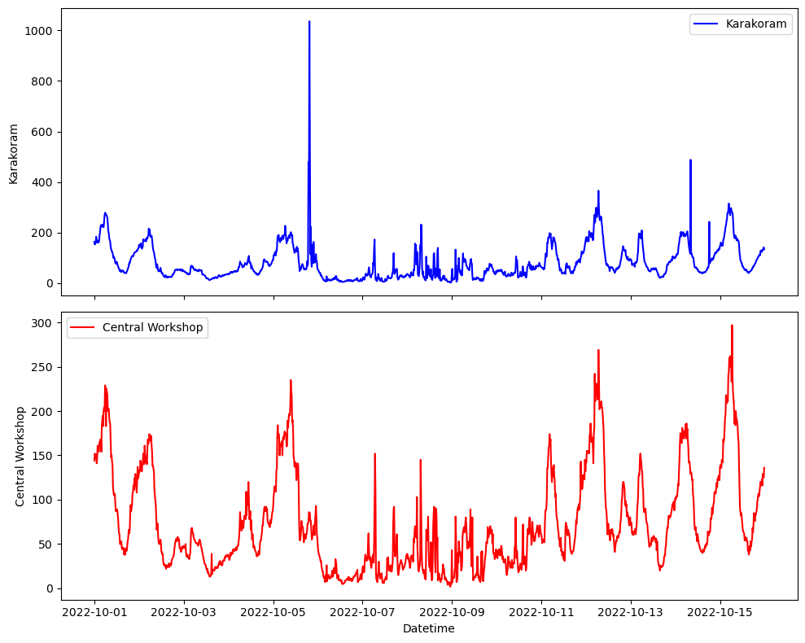
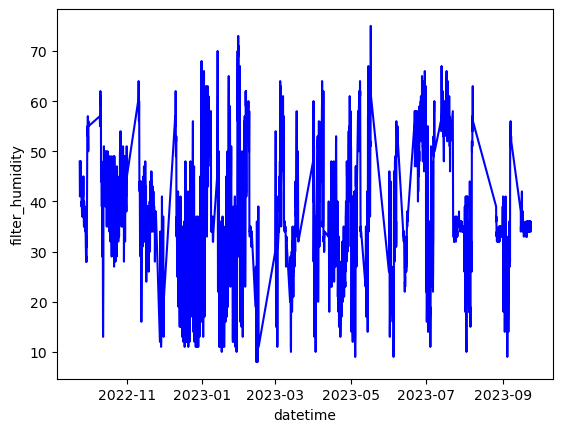

```python
import pandas as pd
import os
import numpy as np
df= pd.read_excel("C:/Users/gulsh/Downloads/Processed.xlsx")
df
```


<div>
<style scoped>
    .dataframe tbody tr th:only-of-type {
        vertical-align: middle;
    }

    .dataframe tbody tr th {
        vertical-align: top;
    }

    .dataframe thead th {
        text-align: right;
    }
</style>
<table border="1" class="dataframe">
  <thead>
    <tr style="text-align: right;">
      <th></th>
      <th>datetime</th>
      <th>BC6;</th>
      <th>BCRef</th>
      <th>ADC0</th>
      <th>ADC1</th>
      <th>RAWT</th>
      <th>RAWH</th>
      <th>Humidity</th>
      <th>Temperature</th>
      <th>ATN_ADC0</th>
      <th>ATN_ADC1</th>
      <th>ATN_ABS0</th>
      <th>ATN_ABS1</th>
      <th>BC0</th>
      <th>BC1</th>
    </tr>
  </thead>
  <tbody>
    <tr>
      <th>0</th>
      <td>2023-09-29 17:30:00</td>
      <td>4866</td>
      <td>4.866</td>
      <td>11100.450000</td>
      <td>10804.500000</td>
      <td>2874.950000</td>
      <td>4755.150000</td>
      <td>47.551500</td>
      <td>28.749500</td>
      <td>NaN</td>
      <td>NaN</td>
      <td>NaN</td>
      <td>NaN</td>
      <td>NaN</td>
      <td>NaN</td>
    </tr>
    <tr>
      <th>1</th>
      <td>2023-09-29 17:31:00</td>
      <td>4757</td>
      <td>4.757</td>
      <td>11108.350000</td>
      <td>10795.750000</td>
      <td>2772.350000</td>
      <td>5087.150000</td>
      <td>50.871500</td>
      <td>27.723500</td>
      <td>-0.071143</td>
      <td>0.081018</td>
      <td>0.071143</td>
      <td>0.081018</td>
      <td>6.692311</td>
      <td>7.621200</td>
    </tr>
    <tr>
      <th>2</th>
      <td>2023-09-29 17:32:00</td>
      <td>4552</td>
      <td>4.552</td>
      <td>11098.300000</td>
      <td>10790.700000</td>
      <td>2868.850000</td>
      <td>4872.200000</td>
      <td>48.722000</td>
      <td>28.688500</td>
      <td>0.090513</td>
      <td>0.046789</td>
      <td>0.090513</td>
      <td>0.046789</td>
      <td>8.514460</td>
      <td>4.401333</td>
    </tr>
    <tr>
      <th>3</th>
      <td>2023-09-29 17:33:00</td>
      <td>4185</td>
      <td>4.185</td>
      <td>11091.250000</td>
      <td>10785.050000</td>
      <td>2916.400000</td>
      <td>4678.800000</td>
      <td>46.788000</td>
      <td>29.164000</td>
      <td>0.063543</td>
      <td>0.052374</td>
      <td>0.063543</td>
      <td>0.052374</td>
      <td>5.977433</td>
      <td>4.926706</td>
    </tr>
    <tr>
      <th>4</th>
      <td>2023-09-29 17:34:00</td>
      <td>4375</td>
      <td>4.375</td>
      <td>11095.700000</td>
      <td>10785.300000</td>
      <td>2813.050000</td>
      <td>4921.400000</td>
      <td>49.214000</td>
      <td>28.130500</td>
      <td>-0.040114</td>
      <td>-0.002318</td>
      <td>0.040114</td>
      <td>0.002318</td>
      <td>3.773432</td>
      <td>0.218050</td>
    </tr>
    <tr>
      <th>...</th>
      <td>...</td>
      <td>...</td>
      <td>...</td>
      <td>...</td>
      <td>...</td>
      <td>...</td>
      <td>...</td>
      <td>...</td>
      <td>...</td>
      <td>...</td>
      <td>...</td>
      <td>...</td>
      <td>...</td>
      <td>...</td>
      <td>...</td>
    </tr>
    <tr>
      <th>7006</th>
      <td>2023-10-04 14:16:00</td>
      <td>0</td>
      <td>0.000</td>
      <td>800.300000</td>
      <td>1104.000000</td>
      <td>3274.550000</td>
      <td>3188.550000</td>
      <td>31.885500</td>
      <td>32.745500</td>
      <td>0.162307</td>
      <td>0.031698</td>
      <td>0.162307</td>
      <td>0.031698</td>
      <td>15.267999</td>
      <td>2.981771</td>
    </tr>
    <tr>
      <th>7007</th>
      <td>2023-10-04 14:17:00</td>
      <td>0</td>
      <td>0.000</td>
      <td>800.333333</td>
      <td>1101.333333</td>
      <td>3327.333333</td>
      <td>3081.333333</td>
      <td>30.813333</td>
      <td>33.273333</td>
      <td>-0.004165</td>
      <td>0.241838</td>
      <td>0.004165</td>
      <td>0.241838</td>
      <td>0.391797</td>
      <td>22.749339</td>
    </tr>
    <tr>
      <th>7008</th>
      <td>2023-10-04 14:18:00</td>
      <td>0</td>
      <td>0.000</td>
      <td>NaN</td>
      <td>NaN</td>
      <td>NaN</td>
      <td>NaN</td>
      <td>NaN</td>
      <td>NaN</td>
      <td>NaN</td>
      <td>NaN</td>
      <td>NaN</td>
      <td>NaN</td>
      <td>NaN</td>
      <td>NaN</td>
    </tr>
    <tr>
      <th>7009</th>
      <td>2023-10-04 14:19:00</td>
      <td>0</td>
      <td>0.000</td>
      <td>NaN</td>
      <td>NaN</td>
      <td>NaN</td>
      <td>NaN</td>
      <td>NaN</td>
      <td>NaN</td>
      <td>NaN</td>
      <td>NaN</td>
      <td>NaN</td>
      <td>NaN</td>
      <td>NaN</td>
      <td>NaN</td>
    </tr>
    <tr>
      <th>7010</th>
      <td>2023-10-04 14:20:00</td>
      <td>0</td>
      <td>0.000</td>
      <td>NaN</td>
      <td>NaN</td>
      <td>NaN</td>
      <td>NaN</td>
      <td>NaN</td>
      <td>NaN</td>
      <td>NaN</td>
      <td>NaN</td>
      <td>NaN</td>
      <td>NaN</td>
      <td>NaN</td>
      <td>NaN</td>
    </tr>
  </tbody>
</table>
<p>7011 rows × 15 columns</p>
</div>


```python
import pandas as pd
import os
import numpy as np
df= pd.read_excel("C:/Users/gulsh/Downloads/Processed.xlsx")
# df['time']= df['time'].astype(str)
# df['date']=df['date'].astype(str)
# df['datetime']= pd.to_datetime(df['date']+' '+df['time'])
# df=df.drop(['date','time'],axis=1)
df = df.resample(rule='5Min', on='datetime').mean()
df.to_excel("C:/Users/gulsh/Downloads/pk2_combined_LCS_5Minaverage.xlsx")
# df
```


```python
df.dtypes
```


    ADC0           float64
    ADC1           float64
    RAWT           float64
    RAWH           float64
    Humidity       float64
    Temperature    float64
    dtype: object


```python
import pandas as pd
import os
import numpy as np
df= pd.read_excel("C:/Users/gulsh/Downloads/Collective PM2.5-1695291084818.xlsx")
df['time']= df['time'].astype(str)
df['date']=df['date'].astype(str)
df['datetime']= pd.to_datetime(df['date']+' '+df['time'])
df=df.drop(['date','time'],axis=1)
# df = df.resample(rule='60Min', on='datetime').mean()
# df.to_excel("C:/Users/gulsh/Downloads/df.xlsx")
df
```


<div>
<style scoped>
    .dataframe tbody tr th:only-of-type {
        vertical-align: middle;
    }

    .dataframe tbody tr th {
        vertical-align: top;
    }

    .dataframe thead th {
        text-align: right;
    }
</style>
<table border="1" class="dataframe">
  <thead>
    <tr style="text-align: right;">
      <th></th>
      <th>Central Workshop</th>
      <th>Karakoram</th>
      <th>serial number</th>
      <th>datetime</th>
    </tr>
  </thead>
  <tbody>
    <tr>
      <th>0</th>
      <td>404.0</td>
      <td>NaN</td>
      <td>1</td>
      <td>2022-11-04 14:15:23</td>
    </tr>
    <tr>
      <th>1</th>
      <td>411.0</td>
      <td>NaN</td>
      <td>2</td>
      <td>2022-11-04 13:52:52</td>
    </tr>
    <tr>
      <th>2</th>
      <td>428.0</td>
      <td>NaN</td>
      <td>3</td>
      <td>2022-11-04 13:37:51</td>
    </tr>
    <tr>
      <th>3</th>
      <td>437.0</td>
      <td>NaN</td>
      <td>4</td>
      <td>2022-11-04 13:22:45</td>
    </tr>
    <tr>
      <th>4</th>
      <td>431.0</td>
      <td>NaN</td>
      <td>5</td>
      <td>2022-11-04 13:07:49</td>
    </tr>
    <tr>
      <th>...</th>
      <td>...</td>
      <td>...</td>
      <td>...</td>
      <td>...</td>
    </tr>
    <tr>
      <th>6060</th>
      <td>36.0</td>
      <td>NaN</td>
      <td>6061</td>
      <td>2022-09-01 13:24:35</td>
    </tr>
    <tr>
      <th>6061</th>
      <td>40.0</td>
      <td>NaN</td>
      <td>6062</td>
      <td>2022-09-01 13:09:41</td>
    </tr>
    <tr>
      <th>6062</th>
      <td>36.0</td>
      <td>NaN</td>
      <td>6063</td>
      <td>2022-09-01 12:54:45</td>
    </tr>
    <tr>
      <th>6063</th>
      <td>39.0</td>
      <td>NaN</td>
      <td>6064</td>
      <td>2022-09-01 12:39:45</td>
    </tr>
    <tr>
      <th>6064</th>
      <td>33.0</td>
      <td>NaN</td>
      <td>6065</td>
      <td>2022-09-01 12:24:48</td>
    </tr>
  </tbody>
</table>
<p>6065 rows × 4 columns</p>
</div>


```python
import plotly.express as px
import pandas as pd
import numpy as np
import seaborn as sns
from matplotlib import pyplot as plt
df= pd.read_excel("C:/Users/gulsh/Downloads/df.xlsx")
#cutting required data timeline from data
d1 = pd.to_datetime("2022-10-01", format="%Y-%m-%d")
d2 =  pd.to_datetime("2022-10-16", format="%Y-%m-%d")
mask = (df.datetime >= d1) & (df.datetime <= d2)
df=df[mask].reset_index(drop=True)
df = df.resample(rule='15Min', on='datetime').mean()
# df.to_excel("C:/Users/gulsh/Downloads/df_uptime.xlsx")
# sns.lineplot(x='datetime',y='Karakoram',data= df, palette='coolwarm')
# sns.lineplot(x='datetime',y='Central Workshop',data= df, palette='coolwarm')
```


```python
import seaborn as sns
from matplotlib import pyplot as plt
fig, ax = plt.subplots(2, 1, figsize=(10, 8), sharex=True)

# Plot the first line plot (Karakoram)
sns.lineplot(x='datetime', y='Karakoram', data=df,color="blue", ax=ax[0], label="Karakoram")
ax[0].set_ylabel('Karakoram')

# Plot the second line plot (Central Workshop)
sns.lineplot(x='datetime', y='Central Workshop', data=df, color="red", ax=ax[1],label="Central Workshop")
ax[1].set_ylabel('Central Workshop')

# Set common x-axis label
ax[1].set_xlabel('Datetime')

# Adjust layout
plt.tight_layout()

# Show the plot

plt.savefig('Sensor_network.jpg',dpi=800)
plt.show()
```


    

    


```python
def ATN()= 100*
```


```python
import pandas as pd
import os
import numpy as np
df= pd.read_csv("C:/Users/gulsh/Downloads/sensor_data.csv")
df
```


<div>
<style scoped>
    .dataframe tbody tr th:only-of-type {
        vertical-align: middle;
    }

    .dataframe tbody tr th {
        vertical-align: top;
    }

    .dataframe thead th {
        text-align: right;
    }
</style>
<table border="1" class="dataframe">
  <thead>
    <tr style="text-align: right;">
      <th></th>
      <th>Date and Time</th>
      <th>Central Workshop</th>
      <th>Karakoram</th>
    </tr>
  </thead>
  <tbody>
    <tr>
      <th>0</th>
      <td>11-04-2022 14:15</td>
      <td>404.0</td>
      <td>NaN</td>
    </tr>
    <tr>
      <th>1</th>
      <td>11-04-2022 13:52</td>
      <td>411.0</td>
      <td>NaN</td>
    </tr>
    <tr>
      <th>2</th>
      <td>11-04-2022 13:37</td>
      <td>428.0</td>
      <td>NaN</td>
    </tr>
    <tr>
      <th>3</th>
      <td>11-04-2022 13:22</td>
      <td>437.0</td>
      <td>NaN</td>
    </tr>
    <tr>
      <th>4</th>
      <td>11-04-2022 13:07</td>
      <td>431.0</td>
      <td>NaN</td>
    </tr>
    <tr>
      <th>...</th>
      <td>...</td>
      <td>...</td>
      <td>...</td>
    </tr>
    <tr>
      <th>6186</th>
      <td>08/30/2022 03:43:47 pm</td>
      <td>32.0</td>
      <td>NaN</td>
    </tr>
    <tr>
      <th>6187</th>
      <td>08/30/2022 03:28:57 pm</td>
      <td>33.0</td>
      <td>NaN</td>
    </tr>
    <tr>
      <th>6188</th>
      <td>08/30/2022 03:07:32 pm</td>
      <td>36.0</td>
      <td>NaN</td>
    </tr>
    <tr>
      <th>6189</th>
      <td>08/30/2022 01:22:58 pm</td>
      <td>44.0</td>
      <td>NaN</td>
    </tr>
    <tr>
      <th>6190</th>
      <td>08/30/2022 12:34:58 pm</td>
      <td>34.0</td>
      <td>NaN</td>
    </tr>
  </tbody>
</table>
<p>6191 rows × 3 columns</p>
</div>


```python
import pandas as pd
import os
import numpy as np
df= pd.read_csv("C:/Users/gulsh/Downloads/sensor_data.csv")
df['Date and Time']= pd.to_datetime(df['Date and Time'])
df.to_excel("C:/Users/gulsh/Downloads/sensor_data_corrected.xlsx", index= False)
```


```python
import pandas as pd
import os
import numpy as np
import plotly.express as px
from dateutil import parser
df= pd.read_csv("C:/Users/gulsh/Downloads/df.csv")
df['datetime'] = pd.to_datetime(df['datetime'],errors='coerce')
# df = df.resample(rule='60Min', on='Date and Time').mean()
# fig= px.line(df,x='Date and Time',y=['Central Workshop','Karakoram'])
# df.to_excel("C:/Users/gulsh/Downloads/sensor_data_corrected_hourly.xlsx")


# Display the DataFrame
fig= px.line(df,x='datetime',y=['Central Workshop','Karakoram'])
fig.show()
df
```


<div>                            <div id="db9d9c54-1672-4e34-8517-d43fc88fa52a" class="plotly-graph-div" style="height:525px; width:100%;"></div>            <script type="text/javascript">                require(["plotly"], function(Plotly) {                    window.PLOTLYENV=window.PLOTLYENV || {};                                    if (document.getElementById("db9d9c54-1672-4e34-8517-d43fc88fa52a")) {                    Plotly.newPlot(                        "db9d9c54-1672-4e34-8517-d43fc88fa52a",                        [{"hovertemplate":"variable=Central Workshop<br>datetime=%{x}<br>value=%{y}<extra></extra>","legendgroup":"Central Workshop","line":{"color":"#636efa","dash":"solid"},"marker":{"symbol":"circle"},"mode":"lines","name":"Central Workshop","showlegend":true,"x":["2022-04-11T00:00:00","2022-04-11T00:00:00","2022-04-11T00:00:00","2022-04-11T00:00:00","2022-04-11T00:00:00","2022-04-11T00:00:00","2022-04-11T00:00:00","2022-04-11T00:00:00","2022-04-11T00:00:00","2022-04-11T00:00:00","2022-04-11T00:00:00","2022-04-11T00:00:00","2022-04-11T00:00:00","2022-04-11T00:00:00","2022-04-11T00:00:00","2022-04-11T00:00:00","2022-04-11T00:00:00","2022-04-11T00:00:00","2022-04-11T00:00:00","2022-04-11T00:00:00","2022-04-11T00:00:00","2022-04-11T00:00:00","2022-04-11T00:00:00","2022-04-11T00:00:00","2022-04-11T00:00:00","2022-04-11T00:00:00","2022-04-11T00:00:00","2022-04-11T00:00:00","2022-04-11T00:00:00","2022-04-11T00:00:00","2022-04-11T00:00:00","2022-04-11T00:00:00","2022-04-11T00:00:00","2022-04-11T00:00:00","2022-04-11T00:00:00","2022-04-11T00:00:00","2022-04-11T00:00:00","2022-04-11T00:00:00","2022-04-11T00:00:00","2022-04-11T00:00:00","2022-04-11T00:00:00","2022-04-11T00:00:00","2022-04-11T00:00:00","2022-04-11T00:00:00","2022-04-11T00:00:00","2022-04-11T00:00:00","2022-04-11T00:00:00","2022-04-11T00:00:00","2022-04-11T00:00:00","2022-04-11T00:00:00","2022-04-11T00:00:00","2022-04-11T00:00:00","2022-03-11T00:00:00","2022-03-11T00:00:00","2022-03-11T00:00:00","2022-03-11T00:00:00","2022-03-11T00:00:00","2022-03-11T00:00:00","2022-03-11T00:00:00","2022-03-11T00:00:00","2022-03-11T00:00:00","2022-03-11T00:00:00","2022-03-11T00:00:00","2022-03-11T00:00:00","2022-03-11T00:00:00","2022-03-11T00:00:00","2022-03-11T00:00:00","2022-03-11T00:00:00","2022-03-11T00:00:00","2022-03-11T00:00:00","2022-03-11T00:00:00","2022-03-11T00:00:00","2022-03-11T00:00:00","2022-03-11T00:00:00","2022-03-11T00:00:00","2022-03-11T00:00:00","2022-03-11T00:00:00","2022-03-11T00:00:00","2022-03-11T00:00:00","2022-03-11T00:00:00","2022-03-11T00:00:00","2022-03-11T00:00:00","2022-03-11T00:00:00","2022-03-11T00:00:00","2022-03-11T00:00:00","2022-03-11T00:00:00","2022-03-11T00:00:00","2022-03-11T00:00:00","2022-03-11T00:00:00","2022-03-11T00:00:00","2022-03-11T00:00:00","2022-03-11T00:00:00","2022-03-11T00:00:00","2022-03-11T00:00:00","2022-03-11T00:00:00","2022-03-11T00:00:00","2022-03-11T00:00:00","2022-03-11T00:00:00","2022-03-11T00:00:00","2022-03-11T00:00:00","2022-03-11T00:00:00","2022-03-11T00:00:00","2022-03-11T00:00:00","2022-03-11T00:00:00","2022-03-11T00:00:00","2022-03-11T00:00:00","2022-03-11T00:00:00","2022-03-11T00:00:00","2022-03-11T00:00:00","2022-03-11T00:00:00","2022-03-11T00:00:00","2022-03-11T00:00:00","2022-03-11T00:00:00","2022-03-11T00:00:00","2022-03-11T00:00:00","2022-03-11T00:00:00","2022-03-11T00:00:00","2022-03-11T00:00:00","2022-03-11T00:00:00","2022-03-11T00:00:00","2022-03-11T00:00:00","2022-03-11T00:00:00","2022-03-11T00:00:00","2022-03-11T00:00:00","2022-03-11T00:00:00","2022-03-11T00:00:00","2022-03-11T00:00:00","2022-03-11T00:00:00","2022-03-11T00:00:00","2022-03-11T00:00:00","2022-03-11T00:00:00","2022-03-11T00:00:00","2022-03-11T00:00:00","2022-03-11T00:00:00","2022-03-11T00:00:00","2022-03-11T00:00:00","2022-03-11T00:00:00","2022-03-11T00:00:00","2022-03-11T00:00:00","2022-02-11T00:00:00","2022-02-11T00:00:00","2022-02-11T00:00:00","2022-02-11T00:00:00","2022-02-11T00:00:00","2022-02-11T00:00:00","2022-02-11T00:00:00","2022-02-11T00:00:00","2022-02-11T00:00:00","2022-02-11T00:00:00","2022-02-11T00:00:00","2022-02-11T00:00:00","2022-02-11T00:00:00","2022-02-11T00:00:00","2022-02-11T00:00:00","2022-02-11T00:00:00","2022-02-11T00:00:00","2022-02-11T00:00:00","2022-02-11T00:00:00","2022-02-11T00:00:00","2022-02-11T00:00:00","2022-02-11T00:00:00","2022-02-11T00:00:00","2022-02-11T00:00:00","2022-02-11T00:00:00","2022-02-11T00:00:00","2022-02-11T00:00:00","2022-02-11T00:00:00","2022-02-11T00:00:00","2022-02-11T00:00:00","2022-02-11T00:00:00","2022-02-11T00:00:00","2022-02-11T00:00:00","2022-02-11T00:00:00","2022-02-11T00:00:00","2022-02-11T00:00:00","2022-10-19T00:00:00","2022-10-19T00:00:00","2022-10-19T00:00:00","2022-10-19T00:00:00","2022-10-19T00:00:00","2022-10-19T00:00:00","2022-10-19T00:00:00","2022-10-19T00:00:00","2022-10-19T00:00:00","2022-10-19T00:00:00","2022-10-19T00:00:00","2022-10-19T00:00:00","2022-10-19T00:00:00","2022-10-19T00:00:00","2022-10-19T00:00:00","2022-10-19T00:00:00","2022-10-19T00:00:00","2022-10-19T00:00:00","2022-10-19T00:00:00","2022-10-19T00:00:00","2022-10-19T00:00:00","2022-10-19T00:00:00","2022-10-19T00:00:00","2022-10-19T00:00:00","2022-10-19T00:00:00","2022-10-19T00:00:00","2022-10-19T00:00:00","2022-10-19T00:00:00","2022-10-19T00:00:00","2022-10-19T00:00:00","2022-10-19T00:00:00","2022-10-19T00:00:00","2022-10-19T00:00:00","2022-10-19T00:00:00","2022-10-19T00:00:00","2022-10-19T00:00:00","2022-10-19T00:00:00","2022-10-19T00:00:00","2022-10-19T00:00:00","2022-10-19T00:00:00","2022-10-18T00:00:00","2022-10-18T00:00:00","2022-10-18T00:00:00","2022-10-18T00:00:00","2022-10-18T00:00:00","2022-10-18T00:00:00","2022-10-18T00:00:00","2022-10-18T00:00:00","2022-10-18T00:00:00","2022-10-18T00:00:00","2022-10-18T00:00:00","2022-10-18T00:00:00","2022-10-18T00:00:00","2022-10-18T00:00:00","2022-10-18T00:00:00","2022-10-18T00:00:00","2022-10-18T00:00:00","2022-10-18T00:00:00","2022-10-18T00:00:00","2022-10-18T00:00:00","2022-10-18T00:00:00","2022-10-18T00:00:00","2022-10-18T00:00:00","2022-10-18T00:00:00","2022-10-18T00:00:00","2022-10-18T00:00:00","2022-10-18T00:00:00","2022-10-18T00:00:00","2022-10-18T00:00:00","2022-10-18T00:00:00","2022-10-18T00:00:00","2022-10-18T00:00:00","2022-10-18T00:00:00","2022-10-18T00:00:00","2022-10-18T00:00:00","2022-10-18T00:00:00","2022-10-18T00:00:00","2022-10-18T00:00:00","2022-10-18T00:00:00","2022-10-18T00:00:00","2022-10-18T00:00:00","2022-10-18T00:00:00","2022-10-18T00:00:00","2022-10-18T00:00:00","2022-10-18T00:00:00","2022-10-18T00:00:00","2022-10-18T00:00:00","2022-10-18T00:00:00","2022-10-18T00:00:00","2022-10-18T00:00:00","2022-10-18T00:00:00","2022-10-18T00:00:00","2022-10-18T00:00:00","2022-10-18T00:00:00","2022-10-18T00:00:00","2022-10-18T00:00:00","2022-10-18T00:00:00","2022-10-18T00:00:00","2022-10-18T00:00:00","2022-10-18T00:00:00","2022-10-18T00:00:00","2022-10-18T00:00:00","2022-10-18T00:00:00","2022-10-18T00:00:00","2022-10-18T00:00:00","2022-10-18T00:00:00","2022-10-18T00:00:00","2022-10-18T00:00:00","2022-10-18T00:00:00","2022-10-18T00:00:00","2022-10-18T00:00:00","2022-10-18T00:00:00","2022-10-18T00:00:00","2022-10-18T00:00:00","2022-10-18T00:00:00","2022-10-18T00:00:00","2022-10-18T00:00:00","2022-10-18T00:00:00","2022-10-18T00:00:00","2022-10-18T00:00:00","2022-10-18T00:00:00","2022-10-18T00:00:00","2022-10-18T00:00:00","2022-10-18T00:00:00","2022-10-18T00:00:00","2022-10-18T00:00:00","2022-10-18T00:00:00","2022-10-18T00:00:00","2022-10-18T00:00:00","2022-10-18T00:00:00","2022-10-18T00:00:00","2022-10-18T00:00:00","2022-10-18T00:00:00","2022-10-18T00:00:00","2022-10-18T00:00:00","2022-10-17T00:00:00","2022-10-17T00:00:00","2022-10-17T00:00:00","2022-10-17T00:00:00","2022-10-17T00:00:00","2022-10-17T00:00:00","2022-10-17T00:00:00","2022-10-17T00:00:00","2022-10-17T00:00:00","2022-10-17T00:00:00","2022-10-17T00:00:00","2022-10-17T00:00:00","2022-10-17T00:00:00","2022-10-17T00:00:00","2022-10-17T00:00:00","2022-10-17T00:00:00","2022-10-17T00:00:00","2022-10-17T00:00:00","2022-10-17T00:00:00","2022-10-17T00:00:00","2022-10-17T00:00:00","2022-10-17T00:00:00","2022-10-17T00:00:00","2022-10-17T00:00:00","2022-10-17T00:00:00","2022-10-17T00:00:00","2022-10-17T00:00:00","2022-10-17T00:00:00","2022-10-17T00:00:00","2022-10-17T00:00:00","2022-10-17T00:00:00","2022-10-17T00:00:00","2022-10-17T00:00:00","2022-10-17T00:00:00","2022-10-17T00:00:00","2022-10-17T00:00:00","2022-10-17T00:00:00","2022-10-17T00:00:00","2022-10-17T00:00:00","2022-10-17T00:00:00","2022-10-17T00:00:00","2022-10-17T00:00:00","2022-10-17T00:00:00","2022-10-17T00:00:00","2022-10-17T00:00:00","2022-10-17T00:00:00","2022-10-17T00:00:00","2022-10-17T00:00:00","2022-10-17T00:00:00","2022-10-17T00:00:00","2022-10-17T00:00:00","2022-10-17T00:00:00","2022-10-17T00:00:00","2022-10-17T00:00:00","2022-10-17T00:00:00","2022-10-17T00:00:00","2022-10-17T00:00:00","2022-10-17T00:00:00","2022-10-17T00:00:00","2022-10-17T00:00:00","2022-10-17T00:00:00","2022-10-17T00:00:00","2022-10-17T00:00:00","2022-10-17T00:00:00","2022-10-17T00:00:00","2022-10-17T00:00:00","2022-10-17T00:00:00","2022-10-17T00:00:00","2022-10-17T00:00:00","2022-10-17T00:00:00","2022-10-17T00:00:00","2022-10-17T00:00:00","2022-10-17T00:00:00","2022-10-17T00:00:00","2022-10-17T00:00:00","2022-10-17T00:00:00","2022-10-17T00:00:00","2022-10-17T00:00:00","2022-10-17T00:00:00","2022-10-17T00:00:00","2022-10-17T00:00:00","2022-10-17T00:00:00","2022-10-17T00:00:00","2022-10-17T00:00:00","2022-10-17T00:00:00","2022-10-17T00:00:00","2022-10-17T00:00:00","2022-10-17T00:00:00","2022-10-17T00:00:00","2022-10-17T00:00:00","2022-10-17T00:00:00","2022-10-16T00:00:00","2022-10-16T00:00:00","2022-10-16T00:00:00","2022-10-16T00:00:00","2022-10-16T00:00:00","2022-10-16T00:00:00","2022-10-16T00:00:00","2022-10-16T00:00:00","2022-10-16T00:00:00","2022-10-16T00:00:00","2022-10-16T00:00:00","2022-10-16T00:00:00","2022-10-16T00:00:00","2022-10-16T00:00:00","2022-10-16T00:00:00","2022-10-16T00:00:00","2022-10-16T00:00:00","2022-10-16T00:00:00","2022-10-16T00:00:00","2022-10-16T00:00:00","2022-10-16T00:00:00","2022-10-16T00:00:00","2022-10-16T00:00:00","2022-10-16T00:00:00","2022-10-16T00:00:00","2022-10-16T00:00:00","2022-10-16T00:00:00","2022-10-16T00:00:00","2022-10-16T00:00:00","2022-10-16T00:00:00","2022-10-16T00:00:00","2022-10-16T00:00:00","2022-10-16T00:00:00","2022-10-16T00:00:00","2022-10-16T00:00:00","2022-10-16T00:00:00","2022-10-16T00:00:00","2022-10-16T00:00:00","2022-10-16T00:00:00","2022-10-16T00:00:00","2022-10-16T00:00:00","2022-10-16T00:00:00","2022-10-16T00:00:00","2022-10-16T00:00:00","2022-10-16T00:00:00","2022-10-16T00:00:00","2022-10-16T00:00:00","2022-10-16T00:00:00","2022-10-16T00:00:00","2022-10-16T00:00:00","2022-10-16T00:00:00","2022-10-16T00:00:00","2022-10-16T00:00:00","2022-10-16T00:00:00","2022-10-16T00:00:00","2022-10-16T00:00:00","2022-10-16T00:00:00","2022-10-16T00:00:00","2022-10-16T00:00:00","2022-10-16T00:00:00","2022-10-16T00:00:00","2022-10-16T00:00:00","2022-10-16T00:00:00","2022-10-16T00:00:00","2022-10-16T00:00:00","2022-10-16T00:00:00","2022-10-16T00:00:00","2022-10-16T00:00:00","2022-10-16T00:00:00","2022-10-16T00:00:00","2022-10-16T00:00:00","2022-10-16T00:00:00","2022-10-16T00:00:00","2022-10-16T00:00:00","2022-10-16T00:00:00","2022-10-16T00:00:00","2022-10-16T00:00:00","2022-10-16T00:00:00","2022-10-16T00:00:00","2022-10-16T00:00:00","2022-10-16T00:00:00","2022-10-16T00:00:00","2022-10-16T00:00:00","2022-10-16T00:00:00","2022-10-16T00:00:00","2022-10-16T00:00:00","2022-10-16T00:00:00","2022-10-16T00:00:00","2022-10-16T00:00:00","2022-10-16T00:00:00","2022-10-16T00:00:00","2022-10-16T00:00:00","2022-10-16T00:00:00","2022-10-16T00:00:00","2022-10-16T00:00:00","2022-10-16T00:00:00","2022-10-16T00:00:00","2022-10-16T00:00:00","2022-10-16T00:00:00","2022-10-16T00:00:00","2022-10-16T00:00:00","2022-10-16T00:00:00","2022-10-16T00:00:00","2022-10-16T00:00:00","2022-10-16T00:00:00","2022-10-16T00:00:00","2022-10-16T00:00:00","2022-10-16T00:00:00","2022-10-16T00:00:00","2022-10-16T00:00:00","2022-10-16T00:00:00","2022-10-16T00:00:00","2022-10-16T00:00:00","2022-10-16T00:00:00","2022-10-16T00:00:00","2022-10-16T00:00:00","2022-10-16T00:00:00","2022-10-16T00:00:00","2022-10-16T00:00:00","2022-10-16T00:00:00","2022-10-16T00:00:00","2022-10-16T00:00:00","2022-10-16T00:00:00","2022-10-16T00:00:00","2022-10-16T00:00:00","2022-10-16T00:00:00","2022-10-16T00:00:00","2022-10-16T00:00:00","2022-10-16T00:00:00","2022-10-16T00:00:00","2022-10-16T00:00:00","2022-10-16T00:00:00","2022-10-16T00:00:00","2022-10-16T00:00:00","2022-10-16T00:00:00","2022-10-16T00:00:00","2022-10-16T00:00:00","2022-10-16T00:00:00","2022-10-16T00:00:00","2022-10-16T00:00:00","2022-10-16T00:00:00","2022-10-15T00:00:00","2022-10-15T00:00:00","2022-10-15T00:00:00","2022-10-15T00:00:00","2022-10-15T00:00:00","2022-10-15T00:00:00","2022-10-15T00:00:00","2022-10-15T00:00:00","2022-10-15T00:00:00","2022-10-15T00:00:00","2022-10-15T00:00:00","2022-10-15T00:00:00","2022-10-15T00:00:00","2022-10-15T00:00:00","2022-10-15T00:00:00","2022-10-15T00:00:00","2022-10-15T00:00:00","2022-10-15T00:00:00","2022-10-15T00:00:00","2022-10-15T00:00:00","2022-10-15T00:00:00","2022-10-15T00:00:00","2022-10-15T00:00:00","2022-10-15T00:00:00","2022-10-15T00:00:00","2022-10-15T00:00:00","2022-10-15T00:00:00","2022-10-15T00:00:00","2022-10-15T00:00:00","2022-10-15T00:00:00","2022-10-15T00:00:00","2022-10-15T00:00:00","2022-10-15T00:00:00","2022-10-15T00:00:00","2022-10-15T00:00:00","2022-10-15T00:00:00","2022-10-15T00:00:00","2022-10-15T00:00:00","2022-10-15T00:00:00","2022-10-15T00:00:00","2022-10-15T00:00:00","2022-10-15T00:00:00","2022-10-15T00:00:00","2022-10-15T00:00:00","2022-10-15T00:00:00","2022-10-15T00:00:00","2022-10-15T00:00:00","2022-10-15T00:00:00","2022-10-15T00:00:00","2022-10-15T00:00:00","2022-10-15T00:00:00","2022-10-15T00:00:00","2022-10-15T00:00:00","2022-10-15T00:00:00","2022-10-15T00:00:00","2022-10-15T00:00:00","2022-10-15T00:00:00","2022-10-15T00:00:00","2022-10-15T00:00:00","2022-10-15T00:00:00","2022-10-15T00:00:00","2022-10-15T00:00:00","2022-10-15T00:00:00","2022-10-15T00:00:00","2022-10-15T00:00:00","2022-10-15T00:00:00","2022-10-15T00:00:00","2022-10-15T00:00:00","2022-10-15T00:00:00","2022-10-15T00:00:00","2022-10-15T00:00:00","2022-10-15T00:00:00","2022-10-15T00:00:00","2022-10-15T00:00:00","2022-10-15T00:00:00","2022-10-15T00:00:00","2022-10-15T00:00:00","2022-10-15T00:00:00","2022-10-15T00:00:00","2022-10-15T00:00:00","2022-10-15T00:00:00","2022-10-15T00:00:00","2022-10-15T00:00:00","2022-10-15T00:00:00","2022-10-15T00:00:00","2022-10-15T00:00:00","2022-10-15T00:00:00","2022-10-15T00:00:00","2022-10-15T00:00:00","2022-10-15T00:00:00","2022-10-15T00:00:00","2022-10-15T00:00:00","2022-10-15T00:00:00","2022-10-15T00:00:00","2022-10-15T00:00:00","2022-10-15T00:00:00","2022-10-15T00:00:00","2022-10-15T00:00:00","2022-10-15T00:00:00","2022-10-15T00:00:00","2022-10-15T00:00:00","2022-10-15T00:00:00","2022-10-15T00:00:00","2022-10-15T00:00:00","2022-10-15T00:00:00","2022-10-15T00:00:00","2022-10-15T00:00:00","2022-10-15T00:00:00","2022-10-15T00:00:00","2022-10-15T00:00:00","2022-10-15T00:00:00","2022-10-15T00:00:00","2022-10-15T00:00:00","2022-10-15T00:00:00","2022-10-15T00:00:00","2022-10-15T00:00:00","2022-10-15T00:00:00","2022-10-15T00:00:00","2022-10-15T00:00:00","2022-10-15T00:00:00","2022-10-15T00:00:00","2022-10-15T00:00:00","2022-10-15T00:00:00","2022-10-15T00:00:00","2022-10-15T00:00:00","2022-10-15T00:00:00","2022-10-15T00:00:00","2022-10-15T00:00:00","2022-10-15T00:00:00","2022-10-15T00:00:00","2022-10-15T00:00:00","2022-10-15T00:00:00","2022-10-15T00:00:00","2022-10-15T00:00:00","2022-10-15T00:00:00","2022-10-15T00:00:00","2022-10-15T00:00:00","2022-10-15T00:00:00","2022-10-15T00:00:00","2022-10-15T00:00:00","2022-10-15T00:00:00","2022-10-15T00:00:00","2022-10-15T00:00:00","2022-10-15T00:00:00","2022-10-15T00:00:00","2022-10-15T00:00:00","2022-10-15T00:00:00","2022-10-15T00:00:00","2022-10-15T00:00:00","2022-10-15T00:00:00","2022-10-15T00:00:00","2022-10-15T00:00:00","2022-10-15T00:00:00","2022-10-15T00:00:00","2022-10-15T00:00:00","2022-10-15T00:00:00","2022-10-15T00:00:00","2022-10-15T00:00:00","2022-10-15T00:00:00","2022-10-15T00:00:00","2022-10-15T00:00:00","2022-10-15T00:00:00","2022-10-15T00:00:00","2022-10-15T00:00:00","2022-10-15T00:00:00","2022-10-15T00:00:00","2022-10-15T00:00:00","2022-10-15T00:00:00","2022-10-15T00:00:00","2022-10-15T00:00:00","2022-10-15T00:00:00","2022-10-15T00:00:00","2022-10-15T00:00:00","2022-10-15T00:00:00","2022-10-15T00:00:00","2022-10-15T00:00:00","2022-10-15T00:00:00","2022-10-15T00:00:00","2022-10-15T00:00:00","2022-10-15T00:00:00","2022-10-15T00:00:00","2022-10-15T00:00:00","2022-10-15T00:00:00","2022-10-15T00:00:00","2022-10-15T00:00:00","2022-10-15T00:00:00","2022-10-15T00:00:00","2022-10-15T00:00:00","2022-10-15T00:00:00","2022-10-15T00:00:00","2022-10-14T00:00:00","2022-10-14T00:00:00","2022-10-14T00:00:00","2022-10-14T00:00:00","2022-10-14T00:00:00","2022-10-14T00:00:00","2022-10-14T00:00:00","2022-10-14T00:00:00","2022-10-14T00:00:00","2022-10-14T00:00:00","2022-10-14T00:00:00","2022-10-14T00:00:00","2022-10-14T00:00:00","2022-10-14T00:00:00","2022-10-14T00:00:00","2022-10-14T00:00:00","2022-10-14T00:00:00","2022-10-14T00:00:00","2022-10-14T00:00:00","2022-10-14T00:00:00","2022-10-14T00:00:00","2022-10-14T00:00:00","2022-10-14T00:00:00","2022-10-14T00:00:00","2022-10-14T00:00:00","2022-10-14T00:00:00","2022-10-14T00:00:00","2022-10-14T00:00:00","2022-10-14T00:00:00","2022-10-14T00:00:00","2022-10-14T00:00:00","2022-10-14T00:00:00","2022-10-14T00:00:00","2022-10-14T00:00:00","2022-10-14T00:00:00","2022-10-14T00:00:00","2022-10-14T00:00:00","2022-10-14T00:00:00","2022-10-14T00:00:00","2022-10-14T00:00:00","2022-10-14T00:00:00","2022-10-14T00:00:00","2022-10-14T00:00:00","2022-10-14T00:00:00","2022-10-14T00:00:00","2022-10-14T00:00:00","2022-10-14T00:00:00","2022-10-14T00:00:00","2022-10-14T00:00:00","2022-10-14T00:00:00","2022-10-14T00:00:00","2022-10-14T00:00:00","2022-10-14T00:00:00","2022-10-14T00:00:00","2022-10-14T00:00:00","2022-10-14T00:00:00","2022-10-14T00:00:00","2022-10-14T00:00:00","2022-10-14T00:00:00","2022-10-14T00:00:00","2022-10-14T00:00:00","2022-10-14T00:00:00","2022-10-14T00:00:00","2022-10-14T00:00:00","2022-10-14T00:00:00","2022-10-14T00:00:00","2022-10-14T00:00:00","2022-10-14T00:00:00","2022-10-14T00:00:00","2022-10-14T00:00:00","2022-10-14T00:00:00","2022-10-14T00:00:00","2022-10-14T00:00:00","2022-10-14T00:00:00","2022-10-14T00:00:00","2022-10-14T00:00:00","2022-10-14T00:00:00","2022-10-14T00:00:00","2022-10-14T00:00:00","2022-10-14T00:00:00","2022-10-14T00:00:00","2022-10-14T00:00:00","2022-10-14T00:00:00","2022-10-14T00:00:00","2022-10-14T00:00:00","2022-10-14T00:00:00","2022-10-14T00:00:00","2022-10-14T00:00:00","2022-10-14T00:00:00","2022-10-14T00:00:00","2022-10-14T00:00:00","2022-10-14T00:00:00","2022-10-14T00:00:00","2022-10-14T00:00:00","2022-10-14T00:00:00","2022-10-14T00:00:00","2022-10-14T00:00:00","2022-10-14T00:00:00","2022-10-14T00:00:00","2022-10-14T00:00:00","2022-10-14T00:00:00","2022-10-14T00:00:00","2022-10-14T00:00:00","2022-10-14T00:00:00","2022-10-14T00:00:00","2022-10-14T00:00:00","2022-10-14T00:00:00","2022-10-14T00:00:00","2022-10-14T00:00:00","2022-10-14T00:00:00","2022-10-14T00:00:00","2022-10-14T00:00:00","2022-10-14T00:00:00","2022-10-14T00:00:00","2022-10-14T00:00:00","2022-10-14T00:00:00","2022-10-14T00:00:00","2022-10-14T00:00:00","2022-10-14T00:00:00","2022-10-14T00:00:00","2022-10-14T00:00:00","2022-10-14T00:00:00","2022-10-14T00:00:00","2022-10-14T00:00:00","2022-10-14T00:00:00","2022-10-14T00:00:00","2022-10-14T00:00:00","2022-10-14T00:00:00","2022-10-14T00:00:00","2022-10-14T00:00:00","2022-10-14T00:00:00","2022-10-14T00:00:00","2022-10-14T00:00:00","2022-10-14T00:00:00","2022-10-14T00:00:00","2022-10-14T00:00:00","2022-10-14T00:00:00","2022-10-14T00:00:00","2022-10-14T00:00:00","2022-10-14T00:00:00","2022-10-14T00:00:00","2022-10-14T00:00:00","2022-10-14T00:00:00","2022-10-14T00:00:00","2022-10-14T00:00:00","2022-10-14T00:00:00","2022-10-14T00:00:00","2022-10-14T00:00:00","2022-10-14T00:00:00","2022-10-14T00:00:00","2022-10-14T00:00:00","2022-10-14T00:00:00","2022-10-14T00:00:00","2022-10-14T00:00:00","2022-10-14T00:00:00","2022-10-14T00:00:00","2022-10-14T00:00:00","2022-10-14T00:00:00","2022-10-14T00:00:00","2022-10-14T00:00:00","2022-10-14T00:00:00","2022-10-14T00:00:00","2022-10-14T00:00:00","2022-10-14T00:00:00","2022-10-14T00:00:00","2022-10-14T00:00:00","2022-10-14T00:00:00","2022-10-14T00:00:00","2022-10-14T00:00:00","2022-10-14T00:00:00","2022-10-14T00:00:00","2022-10-14T00:00:00","2022-10-14T00:00:00","2022-10-14T00:00:00","2022-10-14T00:00:00","2022-10-14T00:00:00","2022-10-14T00:00:00","2022-10-14T00:00:00","2022-10-14T00:00:00","2022-10-14T00:00:00","2022-10-14T00:00:00","2022-10-14T00:00:00","2022-10-14T00:00:00","2022-10-14T00:00:00","2022-10-14T00:00:00","2022-10-14T00:00:00","2022-10-14T00:00:00","2022-10-14T00:00:00","2022-10-14T00:00:00","2022-10-14T00:00:00","2022-10-14T00:00:00","2022-10-14T00:00:00","2022-10-13T00:00:00","2022-10-13T00:00:00","2022-10-13T00:00:00","2022-10-13T00:00:00","2022-10-13T00:00:00","2022-10-13T00:00:00","2022-10-13T00:00:00","2022-10-13T00:00:00","2022-10-13T00:00:00","2022-10-13T00:00:00","2022-10-13T00:00:00","2022-10-13T00:00:00","2022-10-13T00:00:00","2022-10-13T00:00:00","2022-10-13T00:00:00","2022-10-13T00:00:00","2022-10-13T00:00:00","2022-10-13T00:00:00","2022-10-13T00:00:00","2022-10-13T00:00:00","2022-10-13T00:00:00","2022-10-13T00:00:00","2022-10-13T00:00:00","2022-10-13T00:00:00","2022-10-13T00:00:00","2022-10-13T00:00:00","2022-10-13T00:00:00","2022-10-13T00:00:00","2022-10-13T00:00:00","2022-10-13T00:00:00","2022-10-13T00:00:00","2022-10-13T00:00:00","2022-10-13T00:00:00","2022-10-13T00:00:00","2022-10-13T00:00:00","2022-10-13T00:00:00","2022-10-13T00:00:00","2022-10-13T00:00:00","2022-10-13T00:00:00","2022-10-13T00:00:00","2022-10-13T00:00:00","2022-10-13T00:00:00","2022-10-13T00:00:00","2022-10-13T00:00:00","2022-10-13T00:00:00","2022-10-13T00:00:00","2022-10-13T00:00:00","2022-10-13T00:00:00","2022-10-13T00:00:00","2022-10-13T00:00:00","2022-10-13T00:00:00","2022-10-13T00:00:00","2022-10-13T00:00:00","2022-10-13T00:00:00","2022-10-13T00:00:00","2022-10-13T00:00:00","2022-10-13T00:00:00","2022-10-13T00:00:00","2022-10-13T00:00:00","2022-10-13T00:00:00","2022-10-13T00:00:00","2022-10-13T00:00:00","2022-10-13T00:00:00","2022-10-13T00:00:00","2022-10-13T00:00:00","2022-10-13T00:00:00","2022-10-13T00:00:00","2022-10-13T00:00:00","2022-10-13T00:00:00","2022-10-13T00:00:00","2022-10-13T00:00:00","2022-10-13T00:00:00","2022-10-13T00:00:00","2022-10-13T00:00:00","2022-10-13T00:00:00","2022-10-13T00:00:00","2022-10-13T00:00:00","2022-10-13T00:00:00","2022-10-13T00:00:00","2022-10-13T00:00:00","2022-10-13T00:00:00","2022-10-13T00:00:00","2022-10-13T00:00:00","2022-10-13T00:00:00","2022-10-13T00:00:00","2022-10-13T00:00:00","2022-10-13T00:00:00","2022-10-13T00:00:00","2022-10-13T00:00:00","2022-10-13T00:00:00","2022-10-13T00:00:00","2022-10-13T00:00:00","2022-10-13T00:00:00","2022-10-13T00:00:00","2022-10-13T00:00:00","2022-10-13T00:00:00","2022-10-13T00:00:00","2022-10-13T00:00:00","2022-10-13T00:00:00","2022-10-13T00:00:00","2022-10-13T00:00:00","2022-10-13T00:00:00","2022-10-13T00:00:00","2022-10-13T00:00:00","2022-10-13T00:00:00","2022-10-13T00:00:00","2022-10-13T00:00:00","2022-10-13T00:00:00","2022-10-13T00:00:00","2022-10-13T00:00:00","2022-10-13T00:00:00","2022-10-13T00:00:00","2022-10-13T00:00:00","2022-10-13T00:00:00","2022-10-13T00:00:00","2022-10-13T00:00:00","2022-10-13T00:00:00","2022-10-13T00:00:00","2022-10-13T00:00:00","2022-10-13T00:00:00","2022-10-13T00:00:00","2022-10-13T00:00:00","2022-10-13T00:00:00","2022-10-13T00:00:00","2022-10-13T00:00:00","2022-10-13T00:00:00","2022-10-13T00:00:00","2022-10-13T00:00:00","2022-10-13T00:00:00","2022-10-13T00:00:00","2022-10-13T00:00:00","2022-10-13T00:00:00","2022-10-13T00:00:00","2022-10-13T00:00:00","2022-10-13T00:00:00","2022-10-13T00:00:00","2022-10-13T00:00:00","2022-10-13T00:00:00","2022-10-13T00:00:00","2022-10-13T00:00:00","2022-10-13T00:00:00","2022-10-13T00:00:00","2022-10-13T00:00:00","2022-10-13T00:00:00","2022-10-13T00:00:00","2022-10-13T00:00:00","2022-10-13T00:00:00","2022-10-13T00:00:00","2022-10-13T00:00:00","2022-10-13T00:00:00","2022-10-13T00:00:00","2022-10-13T00:00:00","2022-10-13T00:00:00","2022-10-13T00:00:00","2022-10-13T00:00:00","2022-10-13T00:00:00","2022-10-13T00:00:00","2022-10-13T00:00:00","2022-10-13T00:00:00","2022-10-13T00:00:00","2022-10-13T00:00:00","2022-10-13T00:00:00","2022-10-13T00:00:00","2022-10-13T00:00:00","2022-10-13T00:00:00","2022-10-13T00:00:00","2022-10-13T00:00:00","2022-10-13T00:00:00","2022-10-13T00:00:00","2022-10-13T00:00:00","2022-10-13T00:00:00","2022-10-13T00:00:00","2022-10-13T00:00:00","2022-10-13T00:00:00","2022-10-13T00:00:00","2022-10-13T00:00:00","2022-10-13T00:00:00","2022-10-13T00:00:00","2022-10-13T00:00:00","2022-10-13T00:00:00","2022-10-13T00:00:00","2022-10-13T00:00:00","2022-10-13T00:00:00","2022-10-13T00:00:00","2022-10-13T00:00:00","2022-10-13T00:00:00","2022-10-13T00:00:00","2022-10-13T00:00:00","2022-10-13T00:00:00","2022-10-13T00:00:00","2022-10-13T00:00:00","2022-10-13T00:00:00","2022-12-10T00:00:00","2022-12-10T00:00:00","2022-12-10T00:00:00","2022-12-10T00:00:00","2022-12-10T00:00:00","2022-12-10T00:00:00","2022-12-10T00:00:00","2022-12-10T00:00:00","2022-12-10T00:00:00","2022-12-10T00:00:00","2022-12-10T00:00:00","2022-12-10T00:00:00","2022-12-10T00:00:00","2022-12-10T00:00:00","2022-12-10T00:00:00","2022-12-10T00:00:00","2022-12-10T00:00:00","2022-12-10T00:00:00","2022-12-10T00:00:00","2022-12-10T00:00:00","2022-12-10T00:00:00","2022-12-10T00:00:00","2022-12-10T00:00:00","2022-12-10T00:00:00","2022-12-10T00:00:00","2022-12-10T00:00:00","2022-12-10T00:00:00","2022-12-10T00:00:00","2022-12-10T00:00:00","2022-12-10T00:00:00","2022-12-10T00:00:00","2022-12-10T00:00:00","2022-12-10T00:00:00","2022-12-10T00:00:00","2022-12-10T00:00:00","2022-12-10T00:00:00","2022-12-10T00:00:00","2022-12-10T00:00:00","2022-12-10T00:00:00","2022-12-10T00:00:00","2022-12-10T00:00:00","2022-12-10T00:00:00","2022-12-10T00:00:00","2022-12-10T00:00:00","2022-12-10T00:00:00","2022-12-10T00:00:00","2022-12-10T00:00:00","2022-12-10T00:00:00","2022-12-10T00:00:00","2022-12-10T00:00:00","2022-12-10T00:00:00","2022-12-10T00:00:00","2022-12-10T00:00:00","2022-12-10T00:00:00","2022-12-10T00:00:00","2022-12-10T00:00:00","2022-12-10T00:00:00","2022-12-10T00:00:00","2022-12-10T00:00:00","2022-12-10T00:00:00","2022-12-10T00:00:00","2022-12-10T00:00:00","2022-12-10T00:00:00","2022-12-10T00:00:00","2022-12-10T00:00:00","2022-12-10T00:00:00","2022-12-10T00:00:00","2022-12-10T00:00:00","2022-12-10T00:00:00","2022-12-10T00:00:00","2022-12-10T00:00:00","2022-12-10T00:00:00","2022-12-10T00:00:00","2022-12-10T00:00:00","2022-12-10T00:00:00","2022-12-10T00:00:00","2022-12-10T00:00:00","2022-12-10T00:00:00","2022-12-10T00:00:00","2022-12-10T00:00:00","2022-12-10T00:00:00","2022-12-10T00:00:00","2022-12-10T00:00:00","2022-12-10T00:00:00","2022-12-10T00:00:00","2022-12-10T00:00:00","2022-12-10T00:00:00","2022-12-10T00:00:00","2022-12-10T00:00:00","2022-12-10T00:00:00","2022-12-10T00:00:00","2022-12-10T00:00:00","2022-12-10T00:00:00","2022-12-10T00:00:00","2022-12-10T00:00:00","2022-12-10T00:00:00","2022-12-10T00:00:00","2022-12-10T00:00:00","2022-12-10T00:00:00","2022-12-10T00:00:00","2022-12-10T00:00:00","2022-12-10T00:00:00","2022-12-10T00:00:00","2022-12-10T00:00:00","2022-12-10T00:00:00","2022-12-10T00:00:00","2022-12-10T00:00:00","2022-12-10T00:00:00","2022-12-10T00:00:00","2022-12-10T00:00:00","2022-12-10T00:00:00","2022-12-10T00:00:00","2022-12-10T00:00:00","2022-12-10T00:00:00","2022-12-10T00:00:00","2022-12-10T00:00:00","2022-12-10T00:00:00","2022-12-10T00:00:00","2022-12-10T00:00:00","2022-12-10T00:00:00","2022-12-10T00:00:00","2022-12-10T00:00:00","2022-12-10T00:00:00","2022-12-10T00:00:00","2022-12-10T00:00:00","2022-12-10T00:00:00","2022-12-10T00:00:00","2022-12-10T00:00:00","2022-12-10T00:00:00","2022-12-10T00:00:00","2022-12-10T00:00:00","2022-12-10T00:00:00","2022-12-10T00:00:00","2022-12-10T00:00:00","2022-12-10T00:00:00","2022-12-10T00:00:00","2022-12-10T00:00:00","2022-12-10T00:00:00","2022-12-10T00:00:00","2022-12-10T00:00:00","2022-12-10T00:00:00","2022-12-10T00:00:00","2022-12-10T00:00:00","2022-12-10T00:00:00","2022-12-10T00:00:00","2022-12-10T00:00:00","2022-12-10T00:00:00","2022-12-10T00:00:00","2022-12-10T00:00:00","2022-12-10T00:00:00","2022-12-10T00:00:00","2022-12-10T00:00:00","2022-12-10T00:00:00","2022-12-10T00:00:00","2022-12-10T00:00:00","2022-12-10T00:00:00","2022-12-10T00:00:00","2022-12-10T00:00:00","2022-12-10T00:00:00","2022-12-10T00:00:00","2022-12-10T00:00:00","2022-12-10T00:00:00","2022-12-10T00:00:00","2022-12-10T00:00:00","2022-12-10T00:00:00","2022-12-10T00:00:00","2022-12-10T00:00:00","2022-12-10T00:00:00","2022-12-10T00:00:00","2022-12-10T00:00:00","2022-12-10T00:00:00","2022-12-10T00:00:00","2022-12-10T00:00:00","2022-12-10T00:00:00","2022-12-10T00:00:00","2022-12-10T00:00:00","2022-12-10T00:00:00","2022-12-10T00:00:00","2022-12-10T00:00:00","2022-12-10T00:00:00","2022-12-10T00:00:00","2022-12-10T00:00:00","2022-12-10T00:00:00","2022-12-10T00:00:00","2022-12-10T00:00:00","2022-12-10T00:00:00","2022-12-10T00:00:00","2022-12-10T00:00:00","2022-12-10T00:00:00","2022-12-10T00:00:00","2022-12-10T00:00:00","2022-11-10T00:00:00","2022-11-10T00:00:00","2022-11-10T00:00:00","2022-11-10T00:00:00","2022-11-10T00:00:00","2022-11-10T00:00:00","2022-11-10T00:00:00","2022-11-10T00:00:00","2022-11-10T00:00:00","2022-11-10T00:00:00","2022-11-10T00:00:00","2022-11-10T00:00:00","2022-11-10T00:00:00","2022-11-10T00:00:00","2022-11-10T00:00:00","2022-11-10T00:00:00","2022-11-10T00:00:00","2022-11-10T00:00:00","2022-11-10T00:00:00","2022-11-10T00:00:00","2022-11-10T00:00:00","2022-11-10T00:00:00","2022-11-10T00:00:00","2022-11-10T00:00:00","2022-11-10T00:00:00","2022-11-10T00:00:00","2022-11-10T00:00:00","2022-11-10T00:00:00","2022-11-10T00:00:00","2022-11-10T00:00:00","2022-11-10T00:00:00","2022-11-10T00:00:00","2022-11-10T00:00:00","2022-11-10T00:00:00","2022-11-10T00:00:00","2022-11-10T00:00:00","2022-11-10T00:00:00","2022-11-10T00:00:00","2022-11-10T00:00:00","2022-11-10T00:00:00","2022-11-10T00:00:00","2022-11-10T00:00:00","2022-11-10T00:00:00","2022-11-10T00:00:00","2022-11-10T00:00:00","2022-11-10T00:00:00","2022-11-10T00:00:00","2022-11-10T00:00:00","2022-11-10T00:00:00","2022-11-10T00:00:00","2022-11-10T00:00:00","2022-11-10T00:00:00","2022-11-10T00:00:00","2022-11-10T00:00:00","2022-11-10T00:00:00","2022-11-10T00:00:00","2022-11-10T00:00:00","2022-11-10T00:00:00","2022-11-10T00:00:00","2022-11-10T00:00:00","2022-11-10T00:00:00","2022-11-10T00:00:00","2022-11-10T00:00:00","2022-11-10T00:00:00","2022-11-10T00:00:00","2022-11-10T00:00:00","2022-11-10T00:00:00","2022-11-10T00:00:00","2022-11-10T00:00:00","2022-11-10T00:00:00","2022-11-10T00:00:00","2022-11-10T00:00:00","2022-11-10T00:00:00","2022-11-10T00:00:00","2022-11-10T00:00:00","2022-11-10T00:00:00","2022-11-10T00:00:00","2022-11-10T00:00:00","2022-11-10T00:00:00","2022-11-10T00:00:00","2022-11-10T00:00:00","2022-11-10T00:00:00","2022-11-10T00:00:00","2022-11-10T00:00:00","2022-11-10T00:00:00","2022-11-10T00:00:00","2022-11-10T00:00:00","2022-11-10T00:00:00","2022-11-10T00:00:00","2022-11-10T00:00:00","2022-11-10T00:00:00","2022-11-10T00:00:00","2022-11-10T00:00:00","2022-11-10T00:00:00","2022-11-10T00:00:00","2022-11-10T00:00:00","2022-11-10T00:00:00","2022-11-10T00:00:00","2022-11-10T00:00:00","2022-11-10T00:00:00","2022-11-10T00:00:00","2022-11-10T00:00:00","2022-11-10T00:00:00","2022-11-10T00:00:00","2022-11-10T00:00:00","2022-11-10T00:00:00","2022-11-10T00:00:00","2022-11-10T00:00:00","2022-11-10T00:00:00","2022-11-10T00:00:00","2022-11-10T00:00:00","2022-11-10T00:00:00","2022-11-10T00:00:00","2022-11-10T00:00:00","2022-11-10T00:00:00","2022-11-10T00:00:00","2022-11-10T00:00:00","2022-11-10T00:00:00","2022-11-10T00:00:00","2022-11-10T00:00:00","2022-11-10T00:00:00","2022-11-10T00:00:00","2022-11-10T00:00:00","2022-11-10T00:00:00","2022-11-10T00:00:00","2022-11-10T00:00:00","2022-11-10T00:00:00","2022-11-10T00:00:00","2022-11-10T00:00:00","2022-11-10T00:00:00","2022-11-10T00:00:00","2022-11-10T00:00:00","2022-11-10T00:00:00","2022-11-10T00:00:00","2022-11-10T00:00:00","2022-11-10T00:00:00","2022-11-10T00:00:00","2022-11-10T00:00:00","2022-11-10T00:00:00","2022-11-10T00:00:00","2022-11-10T00:00:00","2022-11-10T00:00:00","2022-11-10T00:00:00","2022-11-10T00:00:00","2022-11-10T00:00:00","2022-11-10T00:00:00","2022-11-10T00:00:00","2022-11-10T00:00:00","2022-11-10T00:00:00","2022-11-10T00:00:00","2022-11-10T00:00:00","2022-11-10T00:00:00","2022-11-10T00:00:00","2022-11-10T00:00:00","2022-11-10T00:00:00","2022-11-10T00:00:00","2022-11-10T00:00:00","2022-11-10T00:00:00","2022-11-10T00:00:00","2022-11-10T00:00:00","2022-11-10T00:00:00","2022-11-10T00:00:00","2022-11-10T00:00:00","2022-11-10T00:00:00","2022-11-10T00:00:00","2022-11-10T00:00:00","2022-11-10T00:00:00","2022-11-10T00:00:00","2022-11-10T00:00:00","2022-11-10T00:00:00","2022-11-10T00:00:00","2022-11-10T00:00:00","2022-11-10T00:00:00","2022-11-10T00:00:00","2022-11-10T00:00:00","2022-11-10T00:00:00","2022-11-10T00:00:00","2022-11-10T00:00:00","2022-11-10T00:00:00","2022-11-10T00:00:00","2022-11-10T00:00:00","2022-11-10T00:00:00","2022-11-10T00:00:00","2022-11-10T00:00:00","2022-11-10T00:00:00","2022-11-10T00:00:00","2022-11-10T00:00:00","2022-11-10T00:00:00","2022-11-10T00:00:00","2022-11-10T00:00:00","2022-11-10T00:00:00","2022-11-10T00:00:00","2022-10-10T00:00:00","2022-10-10T00:00:00","2022-10-10T00:00:00","2022-10-10T00:00:00","2022-10-10T00:00:00","2022-10-10T00:00:00","2022-10-10T00:00:00","2022-10-10T00:00:00","2022-10-10T00:00:00","2022-10-10T00:00:00","2022-10-10T00:00:00","2022-10-10T00:00:00","2022-10-10T00:00:00","2022-10-10T00:00:00","2022-10-10T00:00:00","2022-10-10T00:00:00","2022-10-10T00:00:00","2022-10-10T00:00:00","2022-10-10T00:00:00","2022-10-10T00:00:00","2022-10-10T00:00:00","2022-10-10T00:00:00","2022-10-10T00:00:00","2022-10-10T00:00:00","2022-10-10T00:00:00","2022-10-10T00:00:00","2022-10-10T00:00:00","2022-10-10T00:00:00","2022-10-10T00:00:00","2022-10-10T00:00:00","2022-10-10T00:00:00","2022-10-10T00:00:00","2022-10-10T00:00:00","2022-10-10T00:00:00","2022-10-10T00:00:00","2022-10-10T00:00:00","2022-10-10T00:00:00","2022-10-10T00:00:00","2022-10-10T00:00:00","2022-10-10T00:00:00","2022-10-10T00:00:00","2022-10-10T00:00:00","2022-10-10T00:00:00","2022-10-10T00:00:00","2022-10-10T00:00:00","2022-10-10T00:00:00","2022-10-10T00:00:00","2022-10-10T00:00:00","2022-10-10T00:00:00","2022-10-10T00:00:00","2022-10-10T00:00:00","2022-10-10T00:00:00","2022-10-10T00:00:00","2022-10-10T00:00:00","2022-10-10T00:00:00","2022-10-10T00:00:00","2022-10-10T00:00:00","2022-10-10T00:00:00","2022-10-10T00:00:00","2022-10-10T00:00:00","2022-10-10T00:00:00","2022-10-10T00:00:00","2022-10-10T00:00:00","2022-10-10T00:00:00","2022-10-10T00:00:00","2022-10-10T00:00:00","2022-10-10T00:00:00","2022-10-10T00:00:00","2022-10-10T00:00:00","2022-10-10T00:00:00","2022-10-10T00:00:00","2022-10-10T00:00:00","2022-10-10T00:00:00","2022-10-10T00:00:00","2022-10-10T00:00:00","2022-10-10T00:00:00","2022-10-10T00:00:00","2022-10-10T00:00:00","2022-10-10T00:00:00","2022-10-10T00:00:00","2022-10-10T00:00:00","2022-10-10T00:00:00","2022-10-10T00:00:00","2022-10-10T00:00:00","2022-10-10T00:00:00","2022-10-10T00:00:00","2022-10-10T00:00:00","2022-10-10T00:00:00","2022-10-10T00:00:00","2022-10-10T00:00:00","2022-10-10T00:00:00","2022-10-10T00:00:00","2022-10-10T00:00:00","2022-10-10T00:00:00","2022-10-10T00:00:00","2022-10-10T00:00:00","2022-10-10T00:00:00","2022-10-10T00:00:00","2022-10-10T00:00:00","2022-10-10T00:00:00","2022-10-10T00:00:00","2022-10-10T00:00:00","2022-10-10T00:00:00","2022-10-10T00:00:00","2022-10-10T00:00:00","2022-10-10T00:00:00","2022-10-10T00:00:00","2022-10-10T00:00:00","2022-10-10T00:00:00","2022-10-10T00:00:00","2022-10-10T00:00:00","2022-10-10T00:00:00","2022-10-10T00:00:00","2022-10-10T00:00:00","2022-10-10T00:00:00","2022-10-10T00:00:00","2022-10-10T00:00:00","2022-10-10T00:00:00","2022-10-10T00:00:00","2022-10-10T00:00:00","2022-10-10T00:00:00","2022-10-10T00:00:00","2022-10-10T00:00:00","2022-10-10T00:00:00","2022-10-10T00:00:00","2022-10-10T00:00:00","2022-10-10T00:00:00","2022-10-10T00:00:00","2022-10-10T00:00:00","2022-10-10T00:00:00","2022-10-10T00:00:00","2022-10-10T00:00:00","2022-10-10T00:00:00","2022-10-10T00:00:00","2022-10-10T00:00:00","2022-10-10T00:00:00","2022-10-10T00:00:00","2022-10-10T00:00:00","2022-10-10T00:00:00","2022-10-10T00:00:00","2022-10-10T00:00:00","2022-10-10T00:00:00","2022-10-10T00:00:00","2022-10-10T00:00:00","2022-10-10T00:00:00","2022-10-10T00:00:00","2022-10-10T00:00:00","2022-10-10T00:00:00","2022-10-10T00:00:00","2022-10-10T00:00:00","2022-10-10T00:00:00","2022-10-10T00:00:00","2022-10-10T00:00:00","2022-10-10T00:00:00","2022-10-10T00:00:00","2022-10-10T00:00:00","2022-10-10T00:00:00","2022-10-10T00:00:00","2022-10-10T00:00:00","2022-10-10T00:00:00","2022-10-10T00:00:00","2022-10-10T00:00:00","2022-10-10T00:00:00","2022-10-10T00:00:00","2022-10-10T00:00:00","2022-10-10T00:00:00","2022-10-10T00:00:00","2022-10-10T00:00:00","2022-10-10T00:00:00","2022-10-10T00:00:00","2022-10-10T00:00:00","2022-10-10T00:00:00","2022-10-10T00:00:00","2022-10-10T00:00:00","2022-10-10T00:00:00","2022-10-10T00:00:00","2022-10-10T00:00:00","2022-10-10T00:00:00","2022-10-10T00:00:00","2022-10-10T00:00:00","2022-10-10T00:00:00","2022-10-10T00:00:00","2022-10-10T00:00:00","2022-10-10T00:00:00","2022-10-10T00:00:00","2022-10-10T00:00:00","2022-10-10T00:00:00","2022-10-10T00:00:00","2022-10-10T00:00:00","2022-10-10T00:00:00","2022-10-10T00:00:00","2022-10-10T00:00:00","2022-09-10T00:00:00","2022-09-10T00:00:00","2022-09-10T00:00:00","2022-09-10T00:00:00","2022-09-10T00:00:00","2022-09-10T00:00:00","2022-09-10T00:00:00","2022-09-10T00:00:00","2022-09-10T00:00:00","2022-09-10T00:00:00","2022-09-10T00:00:00","2022-09-10T00:00:00","2022-09-10T00:00:00","2022-09-10T00:00:00","2022-09-10T00:00:00","2022-09-10T00:00:00","2022-09-10T00:00:00","2022-09-10T00:00:00","2022-09-10T00:00:00","2022-09-10T00:00:00","2022-09-10T00:00:00","2022-09-10T00:00:00","2022-09-10T00:00:00","2022-09-10T00:00:00","2022-09-10T00:00:00","2022-09-10T00:00:00","2022-09-10T00:00:00","2022-09-10T00:00:00","2022-09-10T00:00:00","2022-09-10T00:00:00","2022-09-10T00:00:00","2022-09-10T00:00:00","2022-09-10T00:00:00","2022-09-10T00:00:00","2022-09-10T00:00:00","2022-09-10T00:00:00","2022-09-10T00:00:00","2022-09-10T00:00:00","2022-09-10T00:00:00","2022-09-10T00:00:00","2022-09-10T00:00:00","2022-09-10T00:00:00","2022-09-10T00:00:00","2022-09-10T00:00:00","2022-09-10T00:00:00","2022-09-10T00:00:00","2022-09-10T00:00:00","2022-09-10T00:00:00","2022-09-10T00:00:00","2022-09-10T00:00:00","2022-09-10T00:00:00","2022-09-10T00:00:00","2022-09-10T00:00:00","2022-09-10T00:00:00","2022-09-10T00:00:00","2022-09-10T00:00:00","2022-09-10T00:00:00","2022-09-10T00:00:00","2022-09-10T00:00:00","2022-09-10T00:00:00","2022-09-10T00:00:00","2022-09-10T00:00:00","2022-09-10T00:00:00","2022-09-10T00:00:00","2022-09-10T00:00:00","2022-09-10T00:00:00","2022-09-10T00:00:00","2022-09-10T00:00:00","2022-09-10T00:00:00","2022-09-10T00:00:00","2022-09-10T00:00:00","2022-09-10T00:00:00","2022-09-10T00:00:00","2022-09-10T00:00:00","2022-09-10T00:00:00","2022-09-10T00:00:00","2022-09-10T00:00:00","2022-09-10T00:00:00","2022-09-10T00:00:00","2022-09-10T00:00:00","2022-09-10T00:00:00","2022-09-10T00:00:00","2022-09-10T00:00:00","2022-09-10T00:00:00","2022-09-10T00:00:00","2022-09-10T00:00:00","2022-09-10T00:00:00","2022-09-10T00:00:00","2022-09-10T00:00:00","2022-09-10T00:00:00","2022-09-10T00:00:00","2022-09-10T00:00:00","2022-09-10T00:00:00","2022-09-10T00:00:00","2022-09-10T00:00:00","2022-09-10T00:00:00","2022-09-10T00:00:00","2022-09-10T00:00:00","2022-09-10T00:00:00","2022-09-10T00:00:00","2022-09-10T00:00:00","2022-09-10T00:00:00","2022-09-10T00:00:00","2022-09-10T00:00:00","2022-09-10T00:00:00","2022-09-10T00:00:00","2022-09-10T00:00:00","2022-09-10T00:00:00","2022-09-10T00:00:00","2022-09-10T00:00:00","2022-09-10T00:00:00","2022-09-10T00:00:00","2022-09-10T00:00:00","2022-09-10T00:00:00","2022-09-10T00:00:00","2022-09-10T00:00:00","2022-09-10T00:00:00","2022-09-10T00:00:00","2022-09-10T00:00:00","2022-09-10T00:00:00","2022-09-10T00:00:00","2022-09-10T00:00:00","2022-09-10T00:00:00","2022-09-10T00:00:00","2022-09-10T00:00:00","2022-09-10T00:00:00","2022-09-10T00:00:00","2022-09-10T00:00:00","2022-09-10T00:00:00","2022-09-10T00:00:00","2022-09-10T00:00:00","2022-09-10T00:00:00","2022-09-10T00:00:00","2022-09-10T00:00:00","2022-09-10T00:00:00","2022-09-10T00:00:00","2022-09-10T00:00:00","2022-09-10T00:00:00","2022-09-10T00:00:00","2022-09-10T00:00:00","2022-09-10T00:00:00","2022-09-10T00:00:00","2022-09-10T00:00:00","2022-09-10T00:00:00","2022-09-10T00:00:00","2022-09-10T00:00:00","2022-09-10T00:00:00","2022-09-10T00:00:00","2022-09-10T00:00:00","2022-09-10T00:00:00","2022-09-10T00:00:00","2022-09-10T00:00:00","2022-09-10T00:00:00","2022-09-10T00:00:00","2022-09-10T00:00:00","2022-09-10T00:00:00","2022-09-10T00:00:00","2022-09-10T00:00:00","2022-09-10T00:00:00","2022-09-10T00:00:00","2022-09-10T00:00:00","2022-09-10T00:00:00","2022-09-10T00:00:00","2022-09-10T00:00:00","2022-09-10T00:00:00","2022-09-10T00:00:00","2022-09-10T00:00:00","2022-09-10T00:00:00","2022-09-10T00:00:00","2022-09-10T00:00:00","2022-09-10T00:00:00","2022-09-10T00:00:00","2022-09-10T00:00:00","2022-09-10T00:00:00","2022-09-10T00:00:00","2022-09-10T00:00:00","2022-09-10T00:00:00","2022-09-10T00:00:00","2022-09-10T00:00:00","2022-09-10T00:00:00","2022-09-10T00:00:00","2022-09-10T00:00:00","2022-09-10T00:00:00","2022-09-10T00:00:00","2022-09-10T00:00:00","2022-09-10T00:00:00","2022-09-10T00:00:00","2022-09-10T00:00:00","2022-09-10T00:00:00","2022-09-10T00:00:00","2022-09-10T00:00:00","2022-09-10T00:00:00","2022-09-10T00:00:00","2022-08-10T00:00:00","2022-08-10T00:00:00","2022-08-10T00:00:00","2022-08-10T00:00:00","2022-08-10T00:00:00","2022-08-10T00:00:00","2022-08-10T00:00:00","2022-08-10T00:00:00","2022-08-10T00:00:00","2022-08-10T00:00:00","2022-08-10T00:00:00","2022-08-10T00:00:00","2022-08-10T00:00:00","2022-08-10T00:00:00","2022-08-10T00:00:00","2022-08-10T00:00:00","2022-08-10T00:00:00","2022-08-10T00:00:00","2022-08-10T00:00:00","2022-08-10T00:00:00","2022-08-10T00:00:00","2022-08-10T00:00:00","2022-08-10T00:00:00","2022-08-10T00:00:00","2022-08-10T00:00:00","2022-08-10T00:00:00","2022-08-10T00:00:00","2022-08-10T00:00:00","2022-08-10T00:00:00","2022-08-10T00:00:00","2022-08-10T00:00:00","2022-08-10T00:00:00","2022-08-10T00:00:00","2022-08-10T00:00:00","2022-08-10T00:00:00","2022-08-10T00:00:00","2022-08-10T00:00:00","2022-08-10T00:00:00","2022-08-10T00:00:00","2022-08-10T00:00:00","2022-08-10T00:00:00","2022-08-10T00:00:00","2022-08-10T00:00:00","2022-08-10T00:00:00","2022-08-10T00:00:00","2022-08-10T00:00:00","2022-08-10T00:00:00","2022-08-10T00:00:00","2022-08-10T00:00:00","2022-08-10T00:00:00","2022-08-10T00:00:00","2022-08-10T00:00:00","2022-08-10T00:00:00","2022-08-10T00:00:00","2022-08-10T00:00:00","2022-08-10T00:00:00","2022-08-10T00:00:00","2022-08-10T00:00:00","2022-08-10T00:00:00","2022-08-10T00:00:00","2022-08-10T00:00:00","2022-08-10T00:00:00","2022-08-10T00:00:00","2022-08-10T00:00:00","2022-08-10T00:00:00","2022-08-10T00:00:00","2022-08-10T00:00:00","2022-08-10T00:00:00","2022-08-10T00:00:00","2022-08-10T00:00:00","2022-08-10T00:00:00","2022-08-10T00:00:00","2022-08-10T00:00:00","2022-08-10T00:00:00","2022-08-10T00:00:00","2022-08-10T00:00:00","2022-08-10T00:00:00","2022-08-10T00:00:00","2022-08-10T00:00:00","2022-08-10T00:00:00","2022-08-10T00:00:00","2022-08-10T00:00:00","2022-08-10T00:00:00","2022-08-10T00:00:00","2022-08-10T00:00:00","2022-08-10T00:00:00","2022-08-10T00:00:00","2022-08-10T00:00:00","2022-08-10T00:00:00","2022-08-10T00:00:00","2022-08-10T00:00:00","2022-08-10T00:00:00","2022-08-10T00:00:00","2022-08-10T00:00:00","2022-08-10T00:00:00","2022-08-10T00:00:00","2022-08-10T00:00:00","2022-08-10T00:00:00","2022-08-10T00:00:00","2022-08-10T00:00:00","2022-08-10T00:00:00","2022-08-10T00:00:00","2022-08-10T00:00:00","2022-08-10T00:00:00","2022-08-10T00:00:00","2022-08-10T00:00:00","2022-08-10T00:00:00","2022-08-10T00:00:00","2022-08-10T00:00:00","2022-08-10T00:00:00","2022-08-10T00:00:00","2022-08-10T00:00:00","2022-08-10T00:00:00","2022-08-10T00:00:00","2022-08-10T00:00:00","2022-08-10T00:00:00","2022-08-10T00:00:00","2022-08-10T00:00:00","2022-08-10T00:00:00","2022-08-10T00:00:00","2022-08-10T00:00:00","2022-08-10T00:00:00","2022-08-10T00:00:00","2022-08-10T00:00:00","2022-08-10T00:00:00","2022-08-10T00:00:00","2022-08-10T00:00:00","2022-08-10T00:00:00","2022-08-10T00:00:00","2022-08-10T00:00:00","2022-08-10T00:00:00","2022-08-10T00:00:00","2022-08-10T00:00:00","2022-08-10T00:00:00","2022-08-10T00:00:00","2022-08-10T00:00:00","2022-08-10T00:00:00","2022-08-10T00:00:00","2022-08-10T00:00:00","2022-08-10T00:00:00","2022-08-10T00:00:00","2022-08-10T00:00:00","2022-08-10T00:00:00","2022-08-10T00:00:00","2022-08-10T00:00:00","2022-08-10T00:00:00","2022-08-10T00:00:00","2022-08-10T00:00:00","2022-08-10T00:00:00","2022-08-10T00:00:00","2022-08-10T00:00:00","2022-08-10T00:00:00","2022-08-10T00:00:00","2022-08-10T00:00:00","2022-08-10T00:00:00","2022-08-10T00:00:00","2022-08-10T00:00:00","2022-08-10T00:00:00","2022-08-10T00:00:00","2022-08-10T00:00:00","2022-08-10T00:00:00","2022-08-10T00:00:00","2022-08-10T00:00:00","2022-08-10T00:00:00","2022-08-10T00:00:00","2022-08-10T00:00:00","2022-08-10T00:00:00","2022-08-10T00:00:00","2022-08-10T00:00:00","2022-08-10T00:00:00","2022-08-10T00:00:00","2022-08-10T00:00:00","2022-08-10T00:00:00","2022-08-10T00:00:00","2022-08-10T00:00:00","2022-08-10T00:00:00","2022-08-10T00:00:00","2022-08-10T00:00:00","2022-08-10T00:00:00","2022-08-10T00:00:00","2022-08-10T00:00:00","2022-08-10T00:00:00","2022-08-10T00:00:00","2022-08-10T00:00:00","2022-08-10T00:00:00","2022-08-10T00:00:00","2022-08-10T00:00:00","2022-08-10T00:00:00","2022-08-10T00:00:00","2022-08-10T00:00:00","2022-08-10T00:00:00","2022-07-10T00:00:00","2022-07-10T00:00:00","2022-07-10T00:00:00","2022-07-10T00:00:00","2022-07-10T00:00:00","2022-07-10T00:00:00","2022-07-10T00:00:00","2022-07-10T00:00:00","2022-07-10T00:00:00","2022-07-10T00:00:00","2022-07-10T00:00:00","2022-07-10T00:00:00","2022-07-10T00:00:00","2022-07-10T00:00:00","2022-07-10T00:00:00","2022-07-10T00:00:00","2022-07-10T00:00:00","2022-07-10T00:00:00","2022-07-10T00:00:00","2022-07-10T00:00:00","2022-07-10T00:00:00","2022-07-10T00:00:00","2022-07-10T00:00:00","2022-07-10T00:00:00","2022-07-10T00:00:00","2022-07-10T00:00:00","2022-07-10T00:00:00","2022-07-10T00:00:00","2022-07-10T00:00:00","2022-07-10T00:00:00","2022-07-10T00:00:00","2022-07-10T00:00:00","2022-07-10T00:00:00","2022-07-10T00:00:00","2022-07-10T00:00:00","2022-07-10T00:00:00","2022-07-10T00:00:00","2022-07-10T00:00:00","2022-07-10T00:00:00","2022-07-10T00:00:00","2022-07-10T00:00:00","2022-07-10T00:00:00","2022-07-10T00:00:00","2022-07-10T00:00:00","2022-07-10T00:00:00","2022-07-10T00:00:00","2022-07-10T00:00:00","2022-07-10T00:00:00","2022-07-10T00:00:00","2022-07-10T00:00:00","2022-07-10T00:00:00","2022-07-10T00:00:00","2022-07-10T00:00:00","2022-07-10T00:00:00","2022-07-10T00:00:00","2022-07-10T00:00:00","2022-07-10T00:00:00","2022-07-10T00:00:00","2022-07-10T00:00:00","2022-07-10T00:00:00","2022-07-10T00:00:00","2022-07-10T00:00:00","2022-07-10T00:00:00","2022-07-10T00:00:00","2022-07-10T00:00:00","2022-07-10T00:00:00","2022-07-10T00:00:00","2022-07-10T00:00:00","2022-07-10T00:00:00","2022-07-10T00:00:00","2022-07-10T00:00:00","2022-07-10T00:00:00","2022-07-10T00:00:00","2022-07-10T00:00:00","2022-07-10T00:00:00","2022-07-10T00:00:00","2022-07-10T00:00:00","2022-07-10T00:00:00","2022-07-10T00:00:00","2022-07-10T00:00:00","2022-07-10T00:00:00","2022-07-10T00:00:00","2022-07-10T00:00:00","2022-07-10T00:00:00","2022-07-10T00:00:00","2022-07-10T00:00:00","2022-07-10T00:00:00","2022-07-10T00:00:00","2022-07-10T00:00:00","2022-07-10T00:00:00","2022-07-10T00:00:00","2022-07-10T00:00:00","2022-07-10T00:00:00","2022-07-10T00:00:00","2022-07-10T00:00:00","2022-07-10T00:00:00","2022-07-10T00:00:00","2022-07-10T00:00:00","2022-07-10T00:00:00","2022-07-10T00:00:00","2022-07-10T00:00:00","2022-07-10T00:00:00","2022-07-10T00:00:00","2022-07-10T00:00:00","2022-07-10T00:00:00","2022-07-10T00:00:00","2022-07-10T00:00:00","2022-07-10T00:00:00","2022-07-10T00:00:00","2022-07-10T00:00:00","2022-07-10T00:00:00","2022-07-10T00:00:00","2022-07-10T00:00:00","2022-07-10T00:00:00","2022-07-10T00:00:00","2022-07-10T00:00:00","2022-07-10T00:00:00","2022-07-10T00:00:00","2022-07-10T00:00:00","2022-07-10T00:00:00","2022-07-10T00:00:00","2022-07-10T00:00:00","2022-07-10T00:00:00","2022-07-10T00:00:00","2022-07-10T00:00:00","2022-07-10T00:00:00","2022-07-10T00:00:00","2022-07-10T00:00:00","2022-07-10T00:00:00","2022-07-10T00:00:00","2022-07-10T00:00:00","2022-07-10T00:00:00","2022-07-10T00:00:00","2022-07-10T00:00:00","2022-07-10T00:00:00","2022-07-10T00:00:00","2022-07-10T00:00:00","2022-07-10T00:00:00","2022-07-10T00:00:00","2022-07-10T00:00:00","2022-07-10T00:00:00","2022-07-10T00:00:00","2022-07-10T00:00:00","2022-07-10T00:00:00","2022-07-10T00:00:00","2022-07-10T00:00:00","2022-07-10T00:00:00","2022-07-10T00:00:00","2022-07-10T00:00:00","2022-07-10T00:00:00","2022-07-10T00:00:00","2022-07-10T00:00:00","2022-07-10T00:00:00","2022-07-10T00:00:00","2022-07-10T00:00:00","2022-07-10T00:00:00","2022-07-10T00:00:00","2022-07-10T00:00:00","2022-07-10T00:00:00","2022-07-10T00:00:00","2022-07-10T00:00:00","2022-07-10T00:00:00","2022-07-10T00:00:00","2022-07-10T00:00:00","2022-07-10T00:00:00","2022-07-10T00:00:00","2022-07-10T00:00:00","2022-07-10T00:00:00","2022-07-10T00:00:00","2022-07-10T00:00:00","2022-07-10T00:00:00","2022-07-10T00:00:00","2022-07-10T00:00:00","2022-07-10T00:00:00","2022-07-10T00:00:00","2022-07-10T00:00:00","2022-07-10T00:00:00","2022-07-10T00:00:00","2022-07-10T00:00:00","2022-07-10T00:00:00","2022-07-10T00:00:00","2022-07-10T00:00:00","2022-07-10T00:00:00","2022-07-10T00:00:00","2022-07-10T00:00:00","2022-07-10T00:00:00","2022-07-10T00:00:00","2022-07-10T00:00:00","2022-07-10T00:00:00","2022-07-10T00:00:00","2022-07-10T00:00:00","2022-07-10T00:00:00","2022-06-10T00:00:00","2022-06-10T00:00:00","2022-06-10T00:00:00","2022-06-10T00:00:00","2022-06-10T00:00:00","2022-06-10T00:00:00","2022-06-10T00:00:00","2022-06-10T00:00:00","2022-06-10T00:00:00","2022-06-10T00:00:00","2022-06-10T00:00:00","2022-06-10T00:00:00","2022-06-10T00:00:00","2022-06-10T00:00:00","2022-06-10T00:00:00","2022-06-10T00:00:00","2022-06-10T00:00:00","2022-06-10T00:00:00","2022-06-10T00:00:00","2022-06-10T00:00:00","2022-06-10T00:00:00","2022-06-10T00:00:00","2022-06-10T00:00:00","2022-06-10T00:00:00","2022-06-10T00:00:00","2022-06-10T00:00:00","2022-06-10T00:00:00","2022-06-10T00:00:00","2022-06-10T00:00:00","2022-06-10T00:00:00","2022-06-10T00:00:00","2022-06-10T00:00:00","2022-06-10T00:00:00","2022-06-10T00:00:00","2022-06-10T00:00:00","2022-06-10T00:00:00","2022-06-10T00:00:00","2022-06-10T00:00:00","2022-06-10T00:00:00","2022-06-10T00:00:00","2022-06-10T00:00:00","2022-06-10T00:00:00","2022-06-10T00:00:00","2022-06-10T00:00:00","2022-06-10T00:00:00","2022-06-10T00:00:00","2022-06-10T00:00:00","2022-06-10T00:00:00","2022-06-10T00:00:00","2022-06-10T00:00:00","2022-06-10T00:00:00","2022-06-10T00:00:00","2022-06-10T00:00:00","2022-06-10T00:00:00","2022-06-10T00:00:00","2022-06-10T00:00:00","2022-06-10T00:00:00","2022-06-10T00:00:00","2022-06-10T00:00:00","2022-06-10T00:00:00","2022-06-10T00:00:00","2022-06-10T00:00:00","2022-06-10T00:00:00","2022-06-10T00:00:00","2022-06-10T00:00:00","2022-06-10T00:00:00","2022-06-10T00:00:00","2022-06-10T00:00:00","2022-06-10T00:00:00","2022-06-10T00:00:00","2022-06-10T00:00:00","2022-06-10T00:00:00","2022-06-10T00:00:00","2022-06-10T00:00:00","2022-06-10T00:00:00","2022-06-10T00:00:00","2022-06-10T00:00:00","2022-06-10T00:00:00","2022-06-10T00:00:00","2022-06-10T00:00:00","2022-06-10T00:00:00","2022-06-10T00:00:00","2022-06-10T00:00:00","2022-06-10T00:00:00","2022-06-10T00:00:00","2022-06-10T00:00:00","2022-06-10T00:00:00","2022-06-10T00:00:00","2022-06-10T00:00:00","2022-06-10T00:00:00","2022-06-10T00:00:00","2022-06-10T00:00:00","2022-06-10T00:00:00","2022-06-10T00:00:00","2022-06-10T00:00:00","2022-06-10T00:00:00","2022-06-10T00:00:00","2022-06-10T00:00:00","2022-06-10T00:00:00","2022-06-10T00:00:00","2022-06-10T00:00:00","2022-06-10T00:00:00","2022-06-10T00:00:00","2022-06-10T00:00:00","2022-06-10T00:00:00","2022-06-10T00:00:00","2022-06-10T00:00:00","2022-06-10T00:00:00","2022-06-10T00:00:00","2022-06-10T00:00:00","2022-06-10T00:00:00","2022-06-10T00:00:00","2022-06-10T00:00:00","2022-06-10T00:00:00","2022-06-10T00:00:00","2022-06-10T00:00:00","2022-06-10T00:00:00","2022-06-10T00:00:00","2022-06-10T00:00:00","2022-06-10T00:00:00","2022-06-10T00:00:00","2022-06-10T00:00:00","2022-06-10T00:00:00","2022-06-10T00:00:00","2022-06-10T00:00:00","2022-06-10T00:00:00","2022-06-10T00:00:00","2022-06-10T00:00:00","2022-06-10T00:00:00","2022-06-10T00:00:00","2022-06-10T00:00:00","2022-06-10T00:00:00","2022-06-10T00:00:00","2022-06-10T00:00:00","2022-06-10T00:00:00","2022-06-10T00:00:00","2022-06-10T00:00:00","2022-06-10T00:00:00","2022-06-10T00:00:00","2022-06-10T00:00:00","2022-06-10T00:00:00","2022-06-10T00:00:00","2022-06-10T00:00:00","2022-06-10T00:00:00","2022-06-10T00:00:00","2022-06-10T00:00:00","2022-06-10T00:00:00","2022-06-10T00:00:00","2022-06-10T00:00:00","2022-06-10T00:00:00","2022-06-10T00:00:00","2022-06-10T00:00:00","2022-06-10T00:00:00","2022-06-10T00:00:00","2022-06-10T00:00:00","2022-06-10T00:00:00","2022-06-10T00:00:00","2022-06-10T00:00:00","2022-06-10T00:00:00","2022-06-10T00:00:00","2022-06-10T00:00:00","2022-06-10T00:00:00","2022-06-10T00:00:00","2022-06-10T00:00:00","2022-06-10T00:00:00","2022-06-10T00:00:00","2022-06-10T00:00:00","2022-06-10T00:00:00","2022-06-10T00:00:00","2022-06-10T00:00:00","2022-06-10T00:00:00","2022-06-10T00:00:00","2022-06-10T00:00:00","2022-06-10T00:00:00","2022-06-10T00:00:00","2022-06-10T00:00:00","2022-06-10T00:00:00","2022-06-10T00:00:00","2022-06-10T00:00:00","2022-06-10T00:00:00","2022-06-10T00:00:00","2022-06-10T00:00:00","2022-06-10T00:00:00","2022-06-10T00:00:00","2022-06-10T00:00:00","2022-06-10T00:00:00","2022-06-10T00:00:00","2022-06-10T00:00:00","2022-06-10T00:00:00","2022-06-10T00:00:00","2022-06-10T00:00:00","2022-06-10T00:00:00","2022-05-10T00:00:00","2022-05-10T00:00:00","2022-05-10T00:00:00","2022-05-10T00:00:00","2022-05-10T00:00:00","2022-05-10T00:00:00","2022-05-10T00:00:00","2022-05-10T00:00:00","2022-05-10T00:00:00","2022-05-10T00:00:00","2022-05-10T00:00:00","2022-05-10T00:00:00","2022-05-10T00:00:00","2022-05-10T00:00:00","2022-05-10T00:00:00","2022-05-10T00:00:00","2022-05-10T00:00:00","2022-05-10T00:00:00","2022-05-10T00:00:00","2022-05-10T00:00:00","2022-05-10T00:00:00","2022-05-10T00:00:00","2022-05-10T00:00:00","2022-05-10T00:00:00","2022-05-10T00:00:00","2022-05-10T00:00:00","2022-05-10T00:00:00","2022-05-10T00:00:00","2022-05-10T00:00:00","2022-05-10T00:00:00","2022-05-10T00:00:00","2022-05-10T00:00:00","2022-05-10T00:00:00","2022-05-10T00:00:00","2022-05-10T00:00:00","2022-05-10T00:00:00","2022-05-10T00:00:00","2022-05-10T00:00:00","2022-05-10T00:00:00","2022-05-10T00:00:00","2022-05-10T00:00:00","2022-05-10T00:00:00","2022-05-10T00:00:00","2022-05-10T00:00:00","2022-05-10T00:00:00","2022-05-10T00:00:00","2022-05-10T00:00:00","2022-05-10T00:00:00","2022-05-10T00:00:00","2022-05-10T00:00:00","2022-05-10T00:00:00","2022-05-10T00:00:00","2022-05-10T00:00:00","2022-05-10T00:00:00","2022-05-10T00:00:00","2022-05-10T00:00:00","2022-05-10T00:00:00","2022-05-10T00:00:00","2022-05-10T00:00:00","2022-05-10T00:00:00","2022-05-10T00:00:00","2022-05-10T00:00:00","2022-05-10T00:00:00","2022-05-10T00:00:00","2022-05-10T00:00:00","2022-05-10T00:00:00","2022-05-10T00:00:00","2022-05-10T00:00:00","2022-05-10T00:00:00","2022-05-10T00:00:00","2022-05-10T00:00:00","2022-05-10T00:00:00","2022-05-10T00:00:00","2022-05-10T00:00:00","2022-05-10T00:00:00","2022-05-10T00:00:00","2022-05-10T00:00:00","2022-05-10T00:00:00","2022-05-10T00:00:00","2022-05-10T00:00:00","2022-05-10T00:00:00","2022-05-10T00:00:00","2022-05-10T00:00:00","2022-05-10T00:00:00","2022-05-10T00:00:00","2022-05-10T00:00:00","2022-05-10T00:00:00","2022-05-10T00:00:00","2022-05-10T00:00:00","2022-05-10T00:00:00","2022-05-10T00:00:00","2022-05-10T00:00:00","2022-05-10T00:00:00","2022-05-10T00:00:00","2022-05-10T00:00:00","2022-05-10T00:00:00","2022-05-10T00:00:00","2022-05-10T00:00:00","2022-05-10T00:00:00","2022-05-10T00:00:00","2022-05-10T00:00:00","2022-05-10T00:00:00","2022-05-10T00:00:00","2022-05-10T00:00:00","2022-05-10T00:00:00","2022-05-10T00:00:00","2022-05-10T00:00:00","2022-05-10T00:00:00","2022-05-10T00:00:00","2022-05-10T00:00:00","2022-05-10T00:00:00","2022-05-10T00:00:00","2022-05-10T00:00:00","2022-05-10T00:00:00","2022-05-10T00:00:00","2022-05-10T00:00:00","2022-05-10T00:00:00","2022-05-10T00:00:00","2022-05-10T00:00:00","2022-05-10T00:00:00","2022-05-10T00:00:00","2022-05-10T00:00:00","2022-05-10T00:00:00","2022-05-10T00:00:00","2022-05-10T00:00:00","2022-05-10T00:00:00","2022-05-10T00:00:00","2022-05-10T00:00:00","2022-05-10T00:00:00","2022-05-10T00:00:00","2022-05-10T00:00:00","2022-05-10T00:00:00","2022-05-10T00:00:00","2022-05-10T00:00:00","2022-05-10T00:00:00","2022-05-10T00:00:00","2022-05-10T00:00:00","2022-05-10T00:00:00","2022-05-10T00:00:00","2022-05-10T00:00:00","2022-05-10T00:00:00","2022-05-10T00:00:00","2022-05-10T00:00:00","2022-05-10T00:00:00","2022-05-10T00:00:00","2022-05-10T00:00:00","2022-05-10T00:00:00","2022-05-10T00:00:00","2022-05-10T00:00:00","2022-05-10T00:00:00","2022-05-10T00:00:00","2022-05-10T00:00:00","2022-05-10T00:00:00","2022-05-10T00:00:00","2022-05-10T00:00:00","2022-05-10T00:00:00","2022-05-10T00:00:00","2022-05-10T00:00:00","2022-05-10T00:00:00","2022-05-10T00:00:00","2022-05-10T00:00:00","2022-05-10T00:00:00","2022-05-10T00:00:00","2022-05-10T00:00:00","2022-05-10T00:00:00","2022-05-10T00:00:00","2022-05-10T00:00:00","2022-05-10T00:00:00","2022-05-10T00:00:00","2022-05-10T00:00:00","2022-05-10T00:00:00","2022-05-10T00:00:00","2022-05-10T00:00:00","2022-05-10T00:00:00","2022-05-10T00:00:00","2022-05-10T00:00:00","2022-05-10T00:00:00","2022-05-10T00:00:00","2022-05-10T00:00:00","2022-05-10T00:00:00","2022-05-10T00:00:00","2022-05-10T00:00:00","2022-05-10T00:00:00","2022-05-10T00:00:00","2022-05-10T00:00:00","2022-05-10T00:00:00","2022-05-10T00:00:00","2022-05-10T00:00:00","2022-05-10T00:00:00","2022-05-10T00:00:00","2022-05-10T00:00:00","2022-05-10T00:00:00","2022-05-10T00:00:00","2022-05-10T00:00:00","2022-04-10T00:00:00","2022-04-10T00:00:00","2022-04-10T00:00:00","2022-04-10T00:00:00","2022-04-10T00:00:00","2022-04-10T00:00:00","2022-04-10T00:00:00","2022-04-10T00:00:00","2022-04-10T00:00:00","2022-04-10T00:00:00","2022-04-10T00:00:00","2022-04-10T00:00:00","2022-04-10T00:00:00","2022-04-10T00:00:00","2022-04-10T00:00:00","2022-04-10T00:00:00","2022-04-10T00:00:00","2022-04-10T00:00:00","2022-04-10T00:00:00","2022-04-10T00:00:00","2022-04-10T00:00:00","2022-04-10T00:00:00","2022-04-10T00:00:00","2022-04-10T00:00:00","2022-04-10T00:00:00","2022-04-10T00:00:00","2022-04-10T00:00:00","2022-04-10T00:00:00","2022-04-10T00:00:00","2022-04-10T00:00:00","2022-04-10T00:00:00","2022-04-10T00:00:00","2022-04-10T00:00:00","2022-04-10T00:00:00","2022-04-10T00:00:00","2022-04-10T00:00:00","2022-04-10T00:00:00","2022-04-10T00:00:00","2022-04-10T00:00:00","2022-04-10T00:00:00","2022-04-10T00:00:00","2022-04-10T00:00:00","2022-04-10T00:00:00","2022-04-10T00:00:00","2022-04-10T00:00:00","2022-04-10T00:00:00","2022-04-10T00:00:00","2022-04-10T00:00:00","2022-04-10T00:00:00","2022-04-10T00:00:00","2022-04-10T00:00:00","2022-04-10T00:00:00","2022-04-10T00:00:00","2022-04-10T00:00:00","2022-04-10T00:00:00","2022-04-10T00:00:00","2022-04-10T00:00:00","2022-04-10T00:00:00","2022-04-10T00:00:00","2022-04-10T00:00:00","2022-04-10T00:00:00","2022-04-10T00:00:00","2022-04-10T00:00:00","2022-04-10T00:00:00","2022-04-10T00:00:00","2022-04-10T00:00:00","2022-04-10T00:00:00","2022-04-10T00:00:00","2022-04-10T00:00:00","2022-04-10T00:00:00","2022-04-10T00:00:00","2022-04-10T00:00:00","2022-04-10T00:00:00","2022-04-10T00:00:00","2022-04-10T00:00:00","2022-04-10T00:00:00","2022-04-10T00:00:00","2022-04-10T00:00:00","2022-04-10T00:00:00","2022-04-10T00:00:00","2022-04-10T00:00:00","2022-04-10T00:00:00","2022-04-10T00:00:00","2022-04-10T00:00:00","2022-04-10T00:00:00","2022-04-10T00:00:00","2022-04-10T00:00:00","2022-04-10T00:00:00","2022-04-10T00:00:00","2022-04-10T00:00:00","2022-04-10T00:00:00","2022-04-10T00:00:00","2022-04-10T00:00:00","2022-04-10T00:00:00","2022-04-10T00:00:00","2022-04-10T00:00:00","2022-04-10T00:00:00","2022-04-10T00:00:00","2022-04-10T00:00:00","2022-04-10T00:00:00","2022-04-10T00:00:00","2022-04-10T00:00:00","2022-04-10T00:00:00","2022-04-10T00:00:00","2022-04-10T00:00:00","2022-04-10T00:00:00","2022-04-10T00:00:00","2022-04-10T00:00:00","2022-04-10T00:00:00","2022-04-10T00:00:00","2022-04-10T00:00:00","2022-04-10T00:00:00","2022-04-10T00:00:00","2022-04-10T00:00:00","2022-04-10T00:00:00","2022-04-10T00:00:00","2022-04-10T00:00:00","2022-04-10T00:00:00","2022-04-10T00:00:00","2022-04-10T00:00:00","2022-04-10T00:00:00","2022-04-10T00:00:00","2022-04-10T00:00:00","2022-04-10T00:00:00","2022-04-10T00:00:00","2022-04-10T00:00:00","2022-04-10T00:00:00","2022-04-10T00:00:00","2022-04-10T00:00:00","2022-04-10T00:00:00","2022-04-10T00:00:00","2022-04-10T00:00:00","2022-04-10T00:00:00","2022-04-10T00:00:00","2022-04-10T00:00:00","2022-04-10T00:00:00","2022-04-10T00:00:00","2022-04-10T00:00:00","2022-04-10T00:00:00","2022-04-10T00:00:00","2022-04-10T00:00:00","2022-04-10T00:00:00","2022-04-10T00:00:00","2022-04-10T00:00:00","2022-04-10T00:00:00","2022-04-10T00:00:00","2022-04-10T00:00:00","2022-04-10T00:00:00","2022-04-10T00:00:00","2022-04-10T00:00:00","2022-04-10T00:00:00","2022-04-10T00:00:00","2022-04-10T00:00:00","2022-04-10T00:00:00","2022-04-10T00:00:00","2022-04-10T00:00:00","2022-04-10T00:00:00","2022-04-10T00:00:00","2022-04-10T00:00:00","2022-04-10T00:00:00","2022-04-10T00:00:00","2022-04-10T00:00:00","2022-04-10T00:00:00","2022-04-10T00:00:00","2022-04-10T00:00:00","2022-04-10T00:00:00","2022-04-10T00:00:00","2022-04-10T00:00:00","2022-04-10T00:00:00","2022-04-10T00:00:00","2022-04-10T00:00:00","2022-04-10T00:00:00","2022-04-10T00:00:00","2022-04-10T00:00:00","2022-04-10T00:00:00","2022-04-10T00:00:00","2022-04-10T00:00:00","2022-04-10T00:00:00","2022-04-10T00:00:00","2022-04-10T00:00:00","2022-04-10T00:00:00","2022-04-10T00:00:00","2022-04-10T00:00:00","2022-04-10T00:00:00","2022-04-10T00:00:00","2022-04-10T00:00:00","2022-04-10T00:00:00","2022-04-10T00:00:00","2022-04-10T00:00:00","2022-04-10T00:00:00","2022-04-10T00:00:00","2022-03-10T00:00:00","2022-03-10T00:00:00","2022-03-10T00:00:00","2022-03-10T00:00:00","2022-03-10T00:00:00","2022-03-10T00:00:00","2022-03-10T00:00:00","2022-03-10T00:00:00","2022-03-10T00:00:00","2022-03-10T00:00:00","2022-03-10T00:00:00","2022-03-10T00:00:00","2022-03-10T00:00:00","2022-03-10T00:00:00","2022-03-10T00:00:00","2022-03-10T00:00:00","2022-03-10T00:00:00","2022-03-10T00:00:00","2022-03-10T00:00:00","2022-03-10T00:00:00","2022-03-10T00:00:00","2022-03-10T00:00:00","2022-03-10T00:00:00","2022-03-10T00:00:00","2022-03-10T00:00:00","2022-03-10T00:00:00","2022-03-10T00:00:00","2022-03-10T00:00:00","2022-03-10T00:00:00","2022-03-10T00:00:00","2022-03-10T00:00:00","2022-03-10T00:00:00","2022-03-10T00:00:00","2022-03-10T00:00:00","2022-03-10T00:00:00","2022-03-10T00:00:00","2022-03-10T00:00:00","2022-03-10T00:00:00","2022-03-10T00:00:00","2022-03-10T00:00:00","2022-03-10T00:00:00","2022-03-10T00:00:00","2022-03-10T00:00:00","2022-03-10T00:00:00","2022-03-10T00:00:00","2022-03-10T00:00:00","2022-03-10T00:00:00","2022-03-10T00:00:00","2022-03-10T00:00:00","2022-03-10T00:00:00","2022-03-10T00:00:00","2022-03-10T00:00:00","2022-03-10T00:00:00","2022-03-10T00:00:00","2022-03-10T00:00:00","2022-03-10T00:00:00","2022-03-10T00:00:00","2022-03-10T00:00:00","2022-03-10T00:00:00","2022-03-10T00:00:00","2022-03-10T00:00:00","2022-03-10T00:00:00","2022-03-10T00:00:00","2022-03-10T00:00:00","2022-03-10T00:00:00","2022-03-10T00:00:00","2022-03-10T00:00:00","2022-03-10T00:00:00","2022-03-10T00:00:00","2022-03-10T00:00:00","2022-03-10T00:00:00","2022-03-10T00:00:00","2022-03-10T00:00:00","2022-03-10T00:00:00","2022-03-10T00:00:00","2022-03-10T00:00:00","2022-03-10T00:00:00","2022-03-10T00:00:00","2022-03-10T00:00:00","2022-03-10T00:00:00","2022-03-10T00:00:00","2022-03-10T00:00:00","2022-03-10T00:00:00","2022-03-10T00:00:00","2022-03-10T00:00:00","2022-03-10T00:00:00","2022-03-10T00:00:00","2022-03-10T00:00:00","2022-03-10T00:00:00","2022-03-10T00:00:00","2022-03-10T00:00:00","2022-03-10T00:00:00","2022-03-10T00:00:00","2022-03-10T00:00:00","2022-03-10T00:00:00","2022-03-10T00:00:00","2022-03-10T00:00:00","2022-03-10T00:00:00","2022-03-10T00:00:00","2022-03-10T00:00:00","2022-03-10T00:00:00","2022-03-10T00:00:00","2022-03-10T00:00:00","2022-03-10T00:00:00","2022-03-10T00:00:00","2022-03-10T00:00:00","2022-03-10T00:00:00","2022-03-10T00:00:00","2022-03-10T00:00:00","2022-03-10T00:00:00","2022-03-10T00:00:00","2022-03-10T00:00:00","2022-03-10T00:00:00","2022-03-10T00:00:00","2022-03-10T00:00:00","2022-03-10T00:00:00","2022-03-10T00:00:00","2022-03-10T00:00:00","2022-03-10T00:00:00","2022-03-10T00:00:00","2022-03-10T00:00:00","2022-03-10T00:00:00","2022-03-10T00:00:00","2022-03-10T00:00:00","2022-03-10T00:00:00","2022-03-10T00:00:00","2022-03-10T00:00:00","2022-03-10T00:00:00","2022-03-10T00:00:00","2022-03-10T00:00:00","2022-03-10T00:00:00","2022-03-10T00:00:00","2022-03-10T00:00:00","2022-03-10T00:00:00","2022-03-10T00:00:00","2022-03-10T00:00:00","2022-03-10T00:00:00","2022-03-10T00:00:00","2022-03-10T00:00:00","2022-03-10T00:00:00","2022-03-10T00:00:00","2022-03-10T00:00:00","2022-03-10T00:00:00","2022-03-10T00:00:00","2022-03-10T00:00:00","2022-03-10T00:00:00","2022-03-10T00:00:00","2022-03-10T00:00:00","2022-03-10T00:00:00","2022-03-10T00:00:00","2022-03-10T00:00:00","2022-03-10T00:00:00","2022-03-10T00:00:00","2022-03-10T00:00:00","2022-03-10T00:00:00","2022-03-10T00:00:00","2022-03-10T00:00:00","2022-03-10T00:00:00","2022-03-10T00:00:00","2022-03-10T00:00:00","2022-03-10T00:00:00","2022-03-10T00:00:00","2022-03-10T00:00:00","2022-03-10T00:00:00","2022-03-10T00:00:00","2022-03-10T00:00:00","2022-03-10T00:00:00","2022-03-10T00:00:00","2022-03-10T00:00:00","2022-03-10T00:00:00","2022-03-10T00:00:00","2022-03-10T00:00:00","2022-03-10T00:00:00","2022-03-10T00:00:00","2022-03-10T00:00:00","2022-03-10T00:00:00","2022-03-10T00:00:00","2022-03-10T00:00:00","2022-03-10T00:00:00","2022-03-10T00:00:00","2022-03-10T00:00:00","2022-03-10T00:00:00","2022-03-10T00:00:00","2022-03-10T00:00:00","2022-03-10T00:00:00","2022-03-10T00:00:00","2022-02-10T00:00:00","2022-02-10T00:00:00","2022-02-10T00:00:00","2022-02-10T00:00:00","2022-02-10T00:00:00","2022-02-10T00:00:00","2022-02-10T00:00:00","2022-02-10T00:00:00","2022-02-10T00:00:00","2022-02-10T00:00:00","2022-02-10T00:00:00","2022-02-10T00:00:00","2022-02-10T00:00:00","2022-02-10T00:00:00","2022-02-10T00:00:00","2022-02-10T00:00:00","2022-02-10T00:00:00","2022-02-10T00:00:00","2022-02-10T00:00:00","2022-02-10T00:00:00","2022-02-10T00:00:00","2022-02-10T00:00:00","2022-02-10T00:00:00","2022-02-10T00:00:00","2022-02-10T00:00:00","2022-02-10T00:00:00","2022-02-10T00:00:00","2022-02-10T00:00:00","2022-02-10T00:00:00","2022-02-10T00:00:00","2022-02-10T00:00:00","2022-02-10T00:00:00","2022-02-10T00:00:00","2022-02-10T00:00:00","2022-02-10T00:00:00","2022-02-10T00:00:00","2022-02-10T00:00:00","2022-02-10T00:00:00","2022-02-10T00:00:00","2022-02-10T00:00:00","2022-02-10T00:00:00","2022-02-10T00:00:00","2022-02-10T00:00:00","2022-02-10T00:00:00","2022-02-10T00:00:00","2022-02-10T00:00:00","2022-02-10T00:00:00","2022-02-10T00:00:00","2022-02-10T00:00:00","2022-02-10T00:00:00","2022-02-10T00:00:00","2022-02-10T00:00:00","2022-02-10T00:00:00","2022-02-10T00:00:00","2022-02-10T00:00:00","2022-02-10T00:00:00","2022-02-10T00:00:00","2022-02-10T00:00:00","2022-02-10T00:00:00","2022-02-10T00:00:00","2022-02-10T00:00:00","2022-02-10T00:00:00","2022-02-10T00:00:00","2022-02-10T00:00:00","2022-02-10T00:00:00","2022-02-10T00:00:00","2022-02-10T00:00:00","2022-02-10T00:00:00","2022-02-10T00:00:00","2022-02-10T00:00:00","2022-02-10T00:00:00","2022-02-10T00:00:00","2022-02-10T00:00:00","2022-02-10T00:00:00","2022-02-10T00:00:00","2022-02-10T00:00:00","2022-02-10T00:00:00","2022-02-10T00:00:00","2022-02-10T00:00:00","2022-02-10T00:00:00","2022-02-10T00:00:00","2022-02-10T00:00:00","2022-02-10T00:00:00","2022-02-10T00:00:00","2022-02-10T00:00:00","2022-02-10T00:00:00","2022-02-10T00:00:00","2022-02-10T00:00:00","2022-02-10T00:00:00","2022-02-10T00:00:00","2022-02-10T00:00:00","2022-02-10T00:00:00","2022-02-10T00:00:00","2022-02-10T00:00:00","2022-02-10T00:00:00","2022-02-10T00:00:00","2022-02-10T00:00:00","2022-02-10T00:00:00","2022-02-10T00:00:00","2022-02-10T00:00:00","2022-02-10T00:00:00","2022-02-10T00:00:00","2022-02-10T00:00:00","2022-02-10T00:00:00","2022-02-10T00:00:00","2022-02-10T00:00:00","2022-02-10T00:00:00","2022-02-10T00:00:00","2022-02-10T00:00:00","2022-02-10T00:00:00","2022-02-10T00:00:00","2022-02-10T00:00:00","2022-02-10T00:00:00","2022-02-10T00:00:00","2022-02-10T00:00:00","2022-02-10T00:00:00","2022-02-10T00:00:00","2022-02-10T00:00:00","2022-02-10T00:00:00","2022-02-10T00:00:00","2022-02-10T00:00:00","2022-02-10T00:00:00","2022-02-10T00:00:00","2022-02-10T00:00:00","2022-02-10T00:00:00","2022-02-10T00:00:00","2022-02-10T00:00:00","2022-02-10T00:00:00","2022-02-10T00:00:00","2022-02-10T00:00:00","2022-02-10T00:00:00","2022-02-10T00:00:00","2022-02-10T00:00:00","2022-02-10T00:00:00","2022-02-10T00:00:00","2022-02-10T00:00:00","2022-02-10T00:00:00","2022-02-10T00:00:00","2022-02-10T00:00:00","2022-02-10T00:00:00","2022-02-10T00:00:00","2022-02-10T00:00:00","2022-02-10T00:00:00","2022-02-10T00:00:00","2022-02-10T00:00:00","2022-02-10T00:00:00","2022-02-10T00:00:00","2022-02-10T00:00:00","2022-02-10T00:00:00","2022-02-10T00:00:00","2022-02-10T00:00:00","2022-02-10T00:00:00","2022-02-10T00:00:00","2022-02-10T00:00:00","2022-02-10T00:00:00","2022-02-10T00:00:00","2022-02-10T00:00:00","2022-02-10T00:00:00","2022-02-10T00:00:00","2022-02-10T00:00:00","2022-02-10T00:00:00","2022-02-10T00:00:00","2022-02-10T00:00:00","2022-02-10T00:00:00","2022-02-10T00:00:00","2022-02-10T00:00:00","2022-02-10T00:00:00","2022-02-10T00:00:00","2022-02-10T00:00:00","2022-02-10T00:00:00","2022-02-10T00:00:00","2022-02-10T00:00:00","2022-02-10T00:00:00","2022-02-10T00:00:00","2022-02-10T00:00:00","2022-02-10T00:00:00","2022-02-10T00:00:00","2022-02-10T00:00:00","2022-02-10T00:00:00","2022-02-10T00:00:00","2022-02-10T00:00:00","2022-02-10T00:00:00","2022-02-10T00:00:00","2022-02-10T00:00:00","2022-02-10T00:00:00","2022-02-10T00:00:00","2022-02-10T00:00:00","2022-02-10T00:00:00","2022-02-10T00:00:00","2022-02-10T00:00:00","2022-02-10T00:00:00","2022-02-10T00:00:00","2022-02-10T00:00:00","2022-01-10T00:00:00","2022-01-10T00:00:00","2022-01-10T00:00:00","2022-01-10T00:00:00","2022-01-10T00:00:00","2022-01-10T00:00:00","2022-01-10T00:00:00","2022-01-10T00:00:00","2022-01-10T00:00:00","2022-01-10T00:00:00","2022-01-10T00:00:00","2022-01-10T00:00:00","2022-01-10T00:00:00","2022-01-10T00:00:00","2022-01-10T00:00:00","2022-01-10T00:00:00","2022-01-10T00:00:00","2022-01-10T00:00:00","2022-01-10T00:00:00","2022-01-10T00:00:00","2022-01-10T00:00:00","2022-01-10T00:00:00","2022-01-10T00:00:00","2022-01-10T00:00:00","2022-01-10T00:00:00","2022-01-10T00:00:00","2022-01-10T00:00:00","2022-01-10T00:00:00","2022-01-10T00:00:00","2022-01-10T00:00:00","2022-01-10T00:00:00","2022-01-10T00:00:00","2022-01-10T00:00:00","2022-01-10T00:00:00","2022-01-10T00:00:00","2022-01-10T00:00:00","2022-01-10T00:00:00","2022-01-10T00:00:00","2022-01-10T00:00:00","2022-01-10T00:00:00","2022-01-10T00:00:00","2022-01-10T00:00:00","2022-01-10T00:00:00","2022-01-10T00:00:00","2022-01-10T00:00:00","2022-01-10T00:00:00","2022-01-10T00:00:00","2022-01-10T00:00:00","2022-01-10T00:00:00","2022-01-10T00:00:00","2022-01-10T00:00:00","2022-01-10T00:00:00","2022-01-10T00:00:00","2022-01-10T00:00:00","2022-01-10T00:00:00","2022-01-10T00:00:00","2022-01-10T00:00:00","2022-01-10T00:00:00","2022-01-10T00:00:00","2022-01-10T00:00:00","2022-01-10T00:00:00","2022-01-10T00:00:00","2022-01-10T00:00:00","2022-01-10T00:00:00","2022-01-10T00:00:00","2022-01-10T00:00:00","2022-01-10T00:00:00","2022-01-10T00:00:00","2022-01-10T00:00:00","2022-01-10T00:00:00","2022-01-10T00:00:00","2022-01-10T00:00:00","2022-01-10T00:00:00","2022-01-10T00:00:00","2022-01-10T00:00:00","2022-01-10T00:00:00","2022-01-10T00:00:00","2022-01-10T00:00:00","2022-01-10T00:00:00","2022-01-10T00:00:00","2022-01-10T00:00:00","2022-01-10T00:00:00","2022-01-10T00:00:00","2022-01-10T00:00:00","2022-01-10T00:00:00","2022-01-10T00:00:00","2022-01-10T00:00:00","2022-01-10T00:00:00","2022-01-10T00:00:00","2022-01-10T00:00:00","2022-01-10T00:00:00","2022-01-10T00:00:00","2022-01-10T00:00:00","2022-01-10T00:00:00","2022-01-10T00:00:00","2022-01-10T00:00:00","2022-01-10T00:00:00","2022-01-10T00:00:00","2022-01-10T00:00:00","2022-01-10T00:00:00","2022-01-10T00:00:00","2022-01-10T00:00:00","2022-01-10T00:00:00","2022-01-10T00:00:00","2022-01-10T00:00:00","2022-01-10T00:00:00","2022-01-10T00:00:00","2022-01-10T00:00:00","2022-01-10T00:00:00","2022-01-10T00:00:00","2022-01-10T00:00:00","2022-01-10T00:00:00","2022-01-10T00:00:00","2022-01-10T00:00:00","2022-01-10T00:00:00","2022-01-10T00:00:00","2022-01-10T00:00:00","2022-01-10T00:00:00","2022-01-10T00:00:00","2022-01-10T00:00:00","2022-01-10T00:00:00","2022-01-10T00:00:00","2022-01-10T00:00:00","2022-01-10T00:00:00","2022-01-10T00:00:00","2022-01-10T00:00:00","2022-01-10T00:00:00","2022-01-10T00:00:00","2022-01-10T00:00:00","2022-01-10T00:00:00","2022-01-10T00:00:00","2022-01-10T00:00:00","2022-01-10T00:00:00","2022-01-10T00:00:00","2022-01-10T00:00:00","2022-01-10T00:00:00","2022-01-10T00:00:00","2022-01-10T00:00:00","2022-01-10T00:00:00","2022-01-10T00:00:00","2022-01-10T00:00:00","2022-01-10T00:00:00","2022-01-10T00:00:00","2022-01-10T00:00:00","2022-01-10T00:00:00","2022-01-10T00:00:00","2022-01-10T00:00:00","2022-01-10T00:00:00","2022-01-10T00:00:00","2022-01-10T00:00:00","2022-01-10T00:00:00","2022-01-10T00:00:00","2022-01-10T00:00:00","2022-01-10T00:00:00","2022-01-10T00:00:00","2022-01-10T00:00:00","2022-01-10T00:00:00","2022-01-10T00:00:00","2022-01-10T00:00:00","2022-01-10T00:00:00","2022-01-10T00:00:00","2022-01-10T00:00:00","2022-01-10T00:00:00","2022-01-10T00:00:00","2022-01-10T00:00:00","2022-01-10T00:00:00","2022-01-10T00:00:00","2022-01-10T00:00:00","2022-01-10T00:00:00","2022-01-10T00:00:00","2022-01-10T00:00:00","2022-01-10T00:00:00","2022-01-10T00:00:00","2022-01-10T00:00:00","2022-01-10T00:00:00","2022-01-10T00:00:00","2022-01-10T00:00:00","2022-01-10T00:00:00","2022-01-10T00:00:00","2022-01-10T00:00:00","2022-01-10T00:00:00","2022-01-10T00:00:00","2022-01-10T00:00:00","2022-01-10T00:00:00","2022-01-10T00:00:00","2022-01-10T00:00:00","2022-01-10T00:00:00","2022-01-10T00:00:00","2022-01-10T00:00:00","2022-01-10T00:00:00","2022-01-10T00:00:00","2022-09-30T00:00:00","2022-09-30T00:00:00","2022-09-30T00:00:00","2022-09-30T00:00:00","2022-09-30T00:00:00","2022-09-30T00:00:00","2022-09-30T00:00:00","2022-09-30T00:00:00","2022-09-30T00:00:00","2022-09-30T00:00:00","2022-09-30T00:00:00","2022-09-30T00:00:00","2022-09-30T00:00:00","2022-09-30T00:00:00","2022-09-30T00:00:00","2022-09-30T00:00:00","2022-09-30T00:00:00","2022-09-30T00:00:00","2022-09-30T00:00:00","2022-09-30T00:00:00","2022-09-30T00:00:00","2022-09-30T00:00:00","2022-09-30T00:00:00","2022-09-30T00:00:00","2022-09-30T00:00:00","2022-09-30T00:00:00","2022-09-30T00:00:00","2022-09-30T00:00:00","2022-09-30T00:00:00","2022-09-30T00:00:00","2022-09-30T00:00:00","2022-09-30T00:00:00","2022-09-30T00:00:00","2022-09-30T00:00:00","2022-09-30T00:00:00","2022-09-30T00:00:00","2022-09-30T00:00:00","2022-09-30T00:00:00","2022-09-30T00:00:00","2022-09-30T00:00:00","2022-09-30T00:00:00","2022-09-30T00:00:00","2022-09-30T00:00:00","2022-09-30T00:00:00","2022-09-30T00:00:00","2022-09-30T00:00:00","2022-09-30T00:00:00","2022-09-30T00:00:00","2022-09-30T00:00:00","2022-09-30T00:00:00","2022-09-30T00:00:00","2022-09-30T00:00:00","2022-09-30T00:00:00","2022-09-30T00:00:00","2022-09-30T00:00:00","2022-09-30T00:00:00","2022-09-30T00:00:00","2022-09-30T00:00:00","2022-09-30T00:00:00","2022-09-30T00:00:00","2022-09-30T00:00:00","2022-09-30T00:00:00","2022-09-30T00:00:00","2022-09-30T00:00:00","2022-09-30T00:00:00","2022-09-30T00:00:00","2022-09-30T00:00:00","2022-09-30T00:00:00","2022-09-30T00:00:00","2022-09-30T00:00:00","2022-09-30T00:00:00","2022-09-30T00:00:00","2022-09-30T00:00:00","2022-09-30T00:00:00","2022-09-30T00:00:00","2022-09-30T00:00:00","2022-09-30T00:00:00","2022-09-30T00:00:00","2022-09-30T00:00:00","2022-09-30T00:00:00","2022-09-30T00:00:00","2022-09-30T00:00:00","2022-09-30T00:00:00","2022-09-30T00:00:00","2022-09-30T00:00:00","2022-09-30T00:00:00","2022-09-30T00:00:00","2022-09-30T00:00:00","2022-09-30T00:00:00","2022-09-30T00:00:00","2022-09-30T00:00:00","2022-09-30T00:00:00","2022-09-30T00:00:00","2022-09-30T00:00:00","2022-09-30T00:00:00","2022-09-30T00:00:00","2022-09-30T00:00:00","2022-09-30T00:00:00","2022-09-30T00:00:00","2022-09-30T00:00:00","2022-09-30T00:00:00","2022-09-30T00:00:00","2022-09-30T00:00:00","2022-09-30T00:00:00","2022-09-30T00:00:00","2022-09-30T00:00:00","2022-09-30T00:00:00","2022-09-30T00:00:00","2022-09-30T00:00:00","2022-09-30T00:00:00","2022-09-30T00:00:00","2022-09-30T00:00:00","2022-09-30T00:00:00","2022-09-30T00:00:00","2022-09-30T00:00:00","2022-09-30T00:00:00","2022-09-30T00:00:00","2022-09-30T00:00:00","2022-09-30T00:00:00","2022-09-30T00:00:00","2022-09-30T00:00:00","2022-09-30T00:00:00","2022-09-30T00:00:00","2022-09-30T00:00:00","2022-09-30T00:00:00","2022-09-30T00:00:00","2022-09-30T00:00:00","2022-09-30T00:00:00","2022-09-30T00:00:00","2022-09-30T00:00:00","2022-09-30T00:00:00","2022-09-30T00:00:00","2022-09-30T00:00:00","2022-09-30T00:00:00","2022-09-30T00:00:00","2022-09-30T00:00:00","2022-09-30T00:00:00","2022-09-30T00:00:00","2022-09-30T00:00:00","2022-09-30T00:00:00","2022-09-30T00:00:00","2022-09-30T00:00:00","2022-09-30T00:00:00","2022-09-30T00:00:00","2022-09-30T00:00:00","2022-09-30T00:00:00","2022-09-30T00:00:00","2022-09-30T00:00:00","2022-09-30T00:00:00","2022-09-30T00:00:00","2022-09-30T00:00:00","2022-09-30T00:00:00","2022-09-30T00:00:00","2022-09-30T00:00:00","2022-09-30T00:00:00","2022-09-30T00:00:00","2022-09-30T00:00:00","2022-09-30T00:00:00","2022-09-30T00:00:00","2022-09-30T00:00:00","2022-09-30T00:00:00","2022-09-30T00:00:00","2022-09-30T00:00:00","2022-09-30T00:00:00","2022-09-30T00:00:00","2022-09-30T00:00:00","2022-09-30T00:00:00","2022-09-30T00:00:00","2022-09-30T00:00:00","2022-09-30T00:00:00","2022-09-30T00:00:00","2022-09-30T00:00:00","2022-09-30T00:00:00","2022-09-30T00:00:00","2022-09-30T00:00:00","2022-09-30T00:00:00","2022-09-30T00:00:00","2022-09-30T00:00:00","2022-09-30T00:00:00","2022-09-30T00:00:00","2022-09-30T00:00:00","2022-09-30T00:00:00","2022-09-30T00:00:00","2022-09-30T00:00:00","2022-09-30T00:00:00","2022-09-30T00:00:00","2022-09-30T00:00:00","2022-09-30T00:00:00","2022-09-30T00:00:00","2022-09-30T00:00:00","2022-09-30T00:00:00","2022-09-30T00:00:00","2022-09-30T00:00:00","2022-09-30T00:00:00","2022-09-30T00:00:00","2022-09-30T00:00:00","2022-09-30T00:00:00","2022-09-30T00:00:00","2022-09-30T00:00:00","2022-09-30T00:00:00","2022-09-30T00:00:00","2022-09-30T00:00:00","2022-09-30T00:00:00","2022-09-29T00:00:00","2022-09-29T00:00:00","2022-09-29T00:00:00","2022-09-29T00:00:00","2022-09-29T00:00:00","2022-09-29T00:00:00","2022-09-29T00:00:00","2022-09-29T00:00:00","2022-09-29T00:00:00","2022-09-29T00:00:00","2022-09-29T00:00:00","2022-09-29T00:00:00","2022-09-29T00:00:00","2022-09-29T00:00:00","2022-09-29T00:00:00","2022-09-29T00:00:00","2022-09-29T00:00:00","2022-09-29T00:00:00","2022-09-29T00:00:00","2022-09-29T00:00:00","2022-09-29T00:00:00","2022-09-29T00:00:00","2022-09-29T00:00:00","2022-09-29T00:00:00","2022-09-29T00:00:00","2022-09-29T00:00:00","2022-09-29T00:00:00","2022-09-29T00:00:00","2022-09-29T00:00:00","2022-09-29T00:00:00","2022-09-29T00:00:00","2022-09-29T00:00:00","2022-09-29T00:00:00","2022-09-29T00:00:00","2022-09-29T00:00:00","2022-09-29T00:00:00","2022-09-29T00:00:00","2022-09-29T00:00:00","2022-09-29T00:00:00","2022-09-29T00:00:00","2022-09-29T00:00:00","2022-09-29T00:00:00","2022-09-29T00:00:00","2022-09-29T00:00:00","2022-09-29T00:00:00","2022-09-29T00:00:00","2022-09-29T00:00:00","2022-09-29T00:00:00","2022-09-29T00:00:00","2022-09-29T00:00:00","2022-09-29T00:00:00","2022-09-29T00:00:00","2022-09-29T00:00:00","2022-09-29T00:00:00","2022-09-29T00:00:00","2022-09-29T00:00:00","2022-09-29T00:00:00","2022-09-29T00:00:00","2022-09-29T00:00:00","2022-09-29T00:00:00","2022-09-29T00:00:00","2022-09-29T00:00:00","2022-09-29T00:00:00","2022-09-29T00:00:00","2022-09-29T00:00:00","2022-09-29T00:00:00","2022-09-29T00:00:00","2022-09-29T00:00:00","2022-09-29T00:00:00","2022-09-29T00:00:00","2022-09-29T00:00:00","2022-09-29T00:00:00","2022-09-29T00:00:00","2022-09-29T00:00:00","2022-09-29T00:00:00","2022-09-29T00:00:00","2022-09-29T00:00:00","2022-09-29T00:00:00","2022-09-29T00:00:00","2022-09-29T00:00:00","2022-09-29T00:00:00","2022-09-29T00:00:00","2022-09-29T00:00:00","2022-09-29T00:00:00","2022-09-29T00:00:00","2022-09-29T00:00:00","2022-09-29T00:00:00","2022-09-29T00:00:00","2022-09-29T00:00:00","2022-09-29T00:00:00","2022-09-29T00:00:00","2022-09-29T00:00:00","2022-09-29T00:00:00","2022-09-29T00:00:00","2022-09-29T00:00:00","2022-09-29T00:00:00","2022-09-29T00:00:00","2022-09-29T00:00:00","2022-09-29T00:00:00","2022-09-29T00:00:00","2022-09-29T00:00:00","2022-09-29T00:00:00","2022-09-29T00:00:00","2022-09-29T00:00:00","2022-09-29T00:00:00","2022-09-29T00:00:00","2022-09-29T00:00:00","2022-09-29T00:00:00","2022-09-29T00:00:00","2022-09-29T00:00:00","2022-09-29T00:00:00","2022-09-29T00:00:00","2022-09-29T00:00:00","2022-09-29T00:00:00","2022-09-29T00:00:00","2022-09-29T00:00:00","2022-09-29T00:00:00","2022-09-29T00:00:00","2022-09-29T00:00:00","2022-09-29T00:00:00","2022-09-29T00:00:00","2022-09-29T00:00:00","2022-09-29T00:00:00","2022-09-29T00:00:00","2022-09-29T00:00:00","2022-09-29T00:00:00","2022-09-29T00:00:00","2022-09-29T00:00:00","2022-09-29T00:00:00","2022-09-29T00:00:00","2022-09-28T00:00:00","2022-09-28T00:00:00","2022-09-28T00:00:00","2022-09-28T00:00:00","2022-09-28T00:00:00","2022-09-28T00:00:00","2022-09-28T00:00:00","2022-09-28T00:00:00","2022-09-28T00:00:00","2022-09-28T00:00:00","2022-09-28T00:00:00","2022-09-28T00:00:00","2022-09-28T00:00:00","2022-09-28T00:00:00","2022-09-28T00:00:00","2022-09-28T00:00:00","2022-09-28T00:00:00","2022-09-28T00:00:00","2022-09-28T00:00:00","2022-09-28T00:00:00","2022-09-28T00:00:00","2022-09-28T00:00:00","2022-09-28T00:00:00","2022-09-28T00:00:00","2022-09-28T00:00:00","2022-09-28T00:00:00","2022-09-28T00:00:00","2022-09-28T00:00:00","2022-09-28T00:00:00","2022-09-28T00:00:00","2022-09-28T00:00:00","2022-09-28T00:00:00","2022-09-28T00:00:00","2022-09-28T00:00:00","2022-09-28T00:00:00","2022-09-28T00:00:00","2022-09-28T00:00:00","2022-09-28T00:00:00","2022-09-28T00:00:00","2022-09-28T00:00:00","2022-09-28T00:00:00","2022-09-28T00:00:00","2022-09-28T00:00:00","2022-09-28T00:00:00","2022-09-28T00:00:00","2022-09-28T00:00:00","2022-09-28T00:00:00","2022-09-28T00:00:00","2022-09-28T00:00:00","2022-09-28T00:00:00","2022-09-28T00:00:00","2022-09-28T00:00:00","2022-09-28T00:00:00","2022-09-28T00:00:00","2022-09-28T00:00:00","2022-09-28T00:00:00","2022-09-28T00:00:00","2022-09-28T00:00:00","2022-09-28T00:00:00","2022-09-28T00:00:00","2022-09-28T00:00:00","2022-09-28T00:00:00","2022-09-28T00:00:00","2022-09-28T00:00:00","2022-09-28T00:00:00","2022-09-28T00:00:00","2022-09-28T00:00:00","2022-09-28T00:00:00","2022-09-28T00:00:00","2022-09-28T00:00:00","2022-09-28T00:00:00","2022-09-28T00:00:00","2022-09-28T00:00:00","2022-09-28T00:00:00","2022-09-28T00:00:00","2022-09-28T00:00:00","2022-09-28T00:00:00","2022-09-28T00:00:00","2022-09-28T00:00:00","2022-09-28T00:00:00","2022-09-28T00:00:00","2022-09-28T00:00:00","2022-09-28T00:00:00","2022-09-28T00:00:00","2022-09-28T00:00:00","2022-09-28T00:00:00","2022-09-28T00:00:00","2022-09-28T00:00:00","2022-09-28T00:00:00","2022-09-28T00:00:00","2022-09-28T00:00:00","2022-09-28T00:00:00","2022-09-28T00:00:00","2022-09-28T00:00:00","2022-09-28T00:00:00","2022-09-28T00:00:00","2022-09-28T00:00:00","2022-09-27T00:00:00","2022-09-27T00:00:00","2022-09-27T00:00:00","2022-09-27T00:00:00","2022-09-27T00:00:00","2022-09-27T00:00:00","2022-09-27T00:00:00","2022-09-27T00:00:00","2022-09-27T00:00:00","2022-09-27T00:00:00","2022-09-27T00:00:00","2022-09-27T00:00:00","2022-09-27T00:00:00","2022-09-27T00:00:00","2022-09-27T00:00:00","2022-09-27T00:00:00","2022-09-27T00:00:00","2022-09-27T00:00:00","2022-09-27T00:00:00","2022-09-27T00:00:00","2022-09-27T00:00:00","2022-09-27T00:00:00","2022-09-27T00:00:00","2022-09-27T00:00:00","2022-09-27T00:00:00","2022-09-27T00:00:00","2022-09-27T00:00:00","2022-09-27T00:00:00","2022-09-27T00:00:00","2022-09-27T00:00:00","2022-09-27T00:00:00","2022-09-27T00:00:00","2022-09-27T00:00:00","2022-09-26T00:00:00","2022-09-26T00:00:00","2022-09-26T00:00:00","2022-09-26T00:00:00","2022-09-26T00:00:00","2022-09-26T00:00:00","2022-09-26T00:00:00","2022-09-26T00:00:00","2022-09-26T00:00:00","2022-09-26T00:00:00","2022-09-26T00:00:00","2022-09-26T00:00:00","2022-09-26T00:00:00","2022-09-26T00:00:00","2022-09-26T00:00:00","2022-09-26T00:00:00","2022-09-26T00:00:00","2022-09-26T00:00:00","2022-09-26T00:00:00","2022-09-26T00:00:00","2022-09-26T00:00:00","2022-09-26T00:00:00","2022-09-26T00:00:00","2022-09-26T00:00:00","2022-09-26T00:00:00","2022-09-26T00:00:00","2022-09-26T00:00:00","2022-09-26T00:00:00","2022-09-26T00:00:00","2022-09-26T00:00:00","2022-09-26T00:00:00","2022-09-26T00:00:00","2022-09-26T00:00:00","2022-09-26T00:00:00","2022-09-26T00:00:00","2022-09-26T00:00:00","2022-09-26T00:00:00","2022-09-26T00:00:00","2022-09-26T00:00:00","2022-09-26T00:00:00","2022-09-26T00:00:00","2022-09-26T00:00:00","2022-09-26T00:00:00","2022-09-26T00:00:00","2022-09-26T00:00:00","2022-09-26T00:00:00","2022-09-26T00:00:00","2022-09-26T00:00:00","2022-09-26T00:00:00","2022-09-26T00:00:00","2022-09-26T00:00:00","2022-09-26T00:00:00","2022-09-26T00:00:00","2022-09-26T00:00:00","2022-09-26T00:00:00","2022-09-26T00:00:00","2022-09-26T00:00:00","2022-09-26T00:00:00","2022-09-26T00:00:00","2022-09-26T00:00:00","2022-09-26T00:00:00","2022-09-26T00:00:00","2022-09-26T00:00:00","2022-09-26T00:00:00","2022-09-26T00:00:00","2022-09-26T00:00:00","2022-09-26T00:00:00","2022-09-26T00:00:00","2022-09-26T00:00:00","2022-09-26T00:00:00","2022-09-26T00:00:00","2022-09-26T00:00:00","2022-09-26T00:00:00","2022-09-26T00:00:00","2022-09-25T00:00:00","2022-09-25T00:00:00","2022-09-25T00:00:00","2022-09-25T00:00:00","2022-09-25T00:00:00","2022-09-25T00:00:00","2022-09-25T00:00:00","2022-09-25T00:00:00","2022-09-25T00:00:00","2022-09-25T00:00:00","2022-09-25T00:00:00","2022-09-25T00:00:00","2022-09-25T00:00:00","2022-09-25T00:00:00","2022-09-25T00:00:00","2022-09-25T00:00:00","2022-09-25T00:00:00","2022-09-25T00:00:00","2022-09-25T00:00:00","2022-09-25T00:00:00","2022-09-25T00:00:00","2022-09-25T00:00:00","2022-09-25T00:00:00","2022-09-25T00:00:00","2022-09-25T00:00:00","2022-09-25T00:00:00","2022-09-25T00:00:00","2022-09-25T00:00:00","2022-09-25T00:00:00","2022-09-25T00:00:00","2022-09-25T00:00:00","2022-09-25T00:00:00","2022-09-25T00:00:00","2022-09-25T00:00:00","2022-09-25T00:00:00","2022-09-25T00:00:00","2022-09-25T00:00:00","2022-09-25T00:00:00","2022-09-25T00:00:00","2022-09-25T00:00:00","2022-09-25T00:00:00","2022-09-25T00:00:00","2022-09-25T00:00:00","2022-09-25T00:00:00","2022-09-25T00:00:00","2022-09-25T00:00:00","2022-09-25T00:00:00","2022-09-25T00:00:00","2022-09-25T00:00:00","2022-09-25T00:00:00","2022-09-25T00:00:00","2022-09-25T00:00:00","2022-09-25T00:00:00","2022-09-25T00:00:00","2022-09-25T00:00:00","2022-09-25T00:00:00","2022-09-25T00:00:00","2022-09-25T00:00:00","2022-09-25T00:00:00","2022-09-25T00:00:00","2022-09-25T00:00:00","2022-09-25T00:00:00","2022-09-25T00:00:00","2022-09-25T00:00:00","2022-09-25T00:00:00","2022-09-25T00:00:00","2022-09-25T00:00:00","2022-09-25T00:00:00","2022-09-25T00:00:00","2022-09-25T00:00:00","2022-09-25T00:00:00","2022-09-25T00:00:00","2022-09-25T00:00:00","2022-09-25T00:00:00","2022-09-25T00:00:00","2022-09-25T00:00:00","2022-09-25T00:00:00","2022-09-25T00:00:00","2022-09-25T00:00:00","2022-09-25T00:00:00","2022-09-25T00:00:00","2022-09-25T00:00:00","2022-09-25T00:00:00","2022-09-25T00:00:00","2022-09-25T00:00:00","2022-09-25T00:00:00","2022-09-25T00:00:00","2022-09-25T00:00:00","2022-09-25T00:00:00","2022-09-25T00:00:00","2022-09-25T00:00:00","2022-09-25T00:00:00","2022-09-25T00:00:00","2022-09-25T00:00:00","2022-09-24T00:00:00","2022-09-24T00:00:00","2022-09-24T00:00:00","2022-09-24T00:00:00","2022-09-24T00:00:00","2022-09-24T00:00:00","2022-09-24T00:00:00","2022-09-24T00:00:00","2022-09-24T00:00:00","2022-09-24T00:00:00","2022-09-24T00:00:00","2022-09-24T00:00:00","2022-09-24T00:00:00","2022-09-24T00:00:00","2022-09-24T00:00:00","2022-09-24T00:00:00","2022-09-24T00:00:00","2022-09-24T00:00:00","2022-09-24T00:00:00","2022-09-24T00:00:00","2022-09-24T00:00:00","2022-09-24T00:00:00","2022-09-24T00:00:00","2022-09-24T00:00:00","2022-09-24T00:00:00","2022-09-24T00:00:00","2022-09-24T00:00:00","2022-09-24T00:00:00","2022-09-24T00:00:00","2022-09-24T00:00:00","2022-09-24T00:00:00","2022-09-24T00:00:00","2022-09-24T00:00:00","2022-09-24T00:00:00","2022-09-24T00:00:00","2022-09-24T00:00:00","2022-09-24T00:00:00","2022-09-24T00:00:00","2022-09-24T00:00:00","2022-09-24T00:00:00","2022-09-24T00:00:00","2022-09-24T00:00:00","2022-09-24T00:00:00","2022-09-24T00:00:00","2022-09-24T00:00:00","2022-09-24T00:00:00","2022-09-24T00:00:00","2022-09-24T00:00:00","2022-09-24T00:00:00","2022-09-24T00:00:00","2022-09-24T00:00:00","2022-09-24T00:00:00","2022-09-24T00:00:00","2022-09-24T00:00:00","2022-09-24T00:00:00","2022-09-24T00:00:00","2022-09-24T00:00:00","2022-09-24T00:00:00","2022-09-24T00:00:00","2022-09-24T00:00:00","2022-09-24T00:00:00","2022-09-24T00:00:00","2022-09-24T00:00:00","2022-09-24T00:00:00","2022-09-24T00:00:00","2022-09-24T00:00:00","2022-09-24T00:00:00","2022-09-24T00:00:00","2022-09-24T00:00:00","2022-09-24T00:00:00","2022-09-24T00:00:00","2022-09-24T00:00:00","2022-09-24T00:00:00","2022-09-24T00:00:00","2022-09-24T00:00:00","2022-09-24T00:00:00","2022-09-24T00:00:00","2022-09-24T00:00:00","2022-09-24T00:00:00","2022-09-24T00:00:00","2022-09-24T00:00:00","2022-09-24T00:00:00","2022-09-24T00:00:00","2022-09-24T00:00:00","2022-09-24T00:00:00","2022-09-24T00:00:00","2022-09-24T00:00:00","2022-09-24T00:00:00","2022-09-24T00:00:00","2022-09-24T00:00:00","2022-09-24T00:00:00","2022-09-24T00:00:00","2022-09-24T00:00:00","2022-09-24T00:00:00","2022-09-24T00:00:00","2022-09-24T00:00:00","2022-09-24T00:00:00","2022-09-23T00:00:00","2022-09-23T00:00:00","2022-09-23T00:00:00","2022-09-23T00:00:00","2022-09-23T00:00:00","2022-09-23T00:00:00","2022-09-23T00:00:00","2022-09-23T00:00:00","2022-09-23T00:00:00","2022-09-23T00:00:00","2022-09-23T00:00:00","2022-09-23T00:00:00","2022-09-23T00:00:00","2022-09-23T00:00:00","2022-09-23T00:00:00","2022-09-23T00:00:00","2022-09-23T00:00:00","2022-09-23T00:00:00","2022-09-23T00:00:00","2022-09-23T00:00:00","2022-09-23T00:00:00","2022-09-23T00:00:00","2022-09-23T00:00:00","2022-09-23T00:00:00","2022-09-23T00:00:00","2022-09-23T00:00:00","2022-09-23T00:00:00","2022-09-23T00:00:00","2022-09-23T00:00:00","2022-09-23T00:00:00","2022-09-23T00:00:00","2022-09-23T00:00:00","2022-09-23T00:00:00","2022-09-23T00:00:00","2022-09-23T00:00:00","2022-09-23T00:00:00","2022-09-23T00:00:00","2022-09-23T00:00:00","2022-09-23T00:00:00","2022-09-23T00:00:00","2022-09-23T00:00:00","2022-09-23T00:00:00","2022-09-23T00:00:00","2022-09-23T00:00:00","2022-09-23T00:00:00","2022-09-23T00:00:00","2022-09-23T00:00:00","2022-09-23T00:00:00","2022-09-23T00:00:00","2022-09-23T00:00:00","2022-09-23T00:00:00","2022-09-23T00:00:00","2022-09-23T00:00:00","2022-09-23T00:00:00","2022-09-23T00:00:00","2022-09-23T00:00:00","2022-09-23T00:00:00","2022-09-23T00:00:00","2022-09-23T00:00:00","2022-09-23T00:00:00","2022-09-23T00:00:00","2022-09-23T00:00:00","2022-09-23T00:00:00","2022-09-23T00:00:00","2022-09-23T00:00:00","2022-09-23T00:00:00","2022-09-23T00:00:00","2022-09-23T00:00:00","2022-09-23T00:00:00","2022-09-23T00:00:00","2022-09-23T00:00:00","2022-09-23T00:00:00","2022-09-23T00:00:00","2022-09-23T00:00:00","2022-09-23T00:00:00","2022-09-23T00:00:00","2022-09-23T00:00:00","2022-09-23T00:00:00","2022-09-23T00:00:00","2022-09-23T00:00:00","2022-09-23T00:00:00","2022-09-23T00:00:00","2022-09-23T00:00:00","2022-09-23T00:00:00","2022-09-23T00:00:00","2022-09-23T00:00:00","2022-09-23T00:00:00","2022-09-23T00:00:00","2022-09-23T00:00:00","2022-09-23T00:00:00","2022-09-23T00:00:00","2022-09-23T00:00:00","2022-09-23T00:00:00","2022-09-23T00:00:00","2022-09-23T00:00:00","2022-09-23T00:00:00","2022-09-22T00:00:00","2022-09-22T00:00:00","2022-09-22T00:00:00","2022-09-22T00:00:00","2022-09-22T00:00:00","2022-09-22T00:00:00","2022-09-22T00:00:00","2022-09-22T00:00:00","2022-09-22T00:00:00","2022-09-22T00:00:00","2022-09-22T00:00:00","2022-09-22T00:00:00","2022-09-22T00:00:00","2022-09-22T00:00:00","2022-09-22T00:00:00","2022-09-22T00:00:00","2022-09-22T00:00:00","2022-09-22T00:00:00","2022-09-22T00:00:00","2022-09-22T00:00:00","2022-09-22T00:00:00","2022-09-22T00:00:00","2022-09-22T00:00:00","2022-09-22T00:00:00","2022-09-22T00:00:00","2022-09-22T00:00:00","2022-09-22T00:00:00","2022-09-22T00:00:00","2022-09-22T00:00:00","2022-09-22T00:00:00","2022-09-22T00:00:00","2022-09-22T00:00:00","2022-09-22T00:00:00","2022-09-22T00:00:00","2022-09-22T00:00:00","2022-09-22T00:00:00","2022-09-22T00:00:00","2022-09-22T00:00:00","2022-09-22T00:00:00","2022-09-22T00:00:00","2022-09-22T00:00:00","2022-09-22T00:00:00","2022-09-22T00:00:00","2022-09-22T00:00:00","2022-09-22T00:00:00","2022-09-22T00:00:00","2022-09-22T00:00:00","2022-09-22T00:00:00","2022-09-22T00:00:00","2022-09-22T00:00:00","2022-09-22T00:00:00","2022-09-22T00:00:00","2022-09-22T00:00:00","2022-09-22T00:00:00","2022-09-22T00:00:00","2022-09-22T00:00:00","2022-09-22T00:00:00","2022-09-22T00:00:00","2022-09-22T00:00:00","2022-09-22T00:00:00","2022-09-22T00:00:00","2022-09-22T00:00:00","2022-09-22T00:00:00","2022-09-22T00:00:00","2022-09-22T00:00:00","2022-09-22T00:00:00","2022-09-22T00:00:00","2022-09-22T00:00:00","2022-09-22T00:00:00","2022-09-22T00:00:00","2022-09-22T00:00:00","2022-09-22T00:00:00","2022-09-22T00:00:00","2022-09-22T00:00:00","2022-09-22T00:00:00","2022-09-22T00:00:00","2022-09-22T00:00:00","2022-09-22T00:00:00","2022-09-22T00:00:00","2022-09-22T00:00:00","2022-09-22T00:00:00","2022-09-22T00:00:00","2022-09-22T00:00:00","2022-09-22T00:00:00","2022-09-22T00:00:00","2022-09-22T00:00:00","2022-09-22T00:00:00","2022-09-22T00:00:00","2022-09-22T00:00:00","2022-09-22T00:00:00","2022-09-22T00:00:00","2022-09-22T00:00:00","2022-09-21T00:00:00","2022-09-21T00:00:00","2022-09-21T00:00:00","2022-09-21T00:00:00","2022-09-21T00:00:00","2022-09-21T00:00:00","2022-09-21T00:00:00","2022-09-21T00:00:00","2022-09-21T00:00:00","2022-09-21T00:00:00","2022-09-21T00:00:00","2022-09-21T00:00:00","2022-09-21T00:00:00","2022-09-21T00:00:00","2022-09-21T00:00:00","2022-09-21T00:00:00","2022-09-21T00:00:00","2022-09-21T00:00:00","2022-09-21T00:00:00","2022-09-21T00:00:00","2022-09-21T00:00:00","2022-09-21T00:00:00","2022-09-21T00:00:00","2022-09-21T00:00:00","2022-09-21T00:00:00","2022-09-21T00:00:00","2022-09-21T00:00:00","2022-09-21T00:00:00","2022-09-21T00:00:00","2022-09-21T00:00:00","2022-09-21T00:00:00","2022-09-21T00:00:00","2022-09-21T00:00:00","2022-09-21T00:00:00","2022-09-21T00:00:00","2022-09-21T00:00:00","2022-09-21T00:00:00","2022-09-21T00:00:00","2022-09-21T00:00:00","2022-09-21T00:00:00","2022-09-21T00:00:00","2022-09-21T00:00:00","2022-09-21T00:00:00","2022-09-21T00:00:00","2022-09-21T00:00:00","2022-09-21T00:00:00","2022-09-21T00:00:00","2022-09-21T00:00:00","2022-09-21T00:00:00","2022-09-21T00:00:00","2022-09-21T00:00:00","2022-09-21T00:00:00","2022-09-21T00:00:00","2022-09-21T00:00:00","2022-09-21T00:00:00","2022-09-21T00:00:00","2022-09-21T00:00:00","2022-09-21T00:00:00","2022-09-21T00:00:00","2022-09-21T00:00:00","2022-09-21T00:00:00","2022-09-21T00:00:00","2022-09-21T00:00:00","2022-09-21T00:00:00","2022-09-21T00:00:00","2022-09-21T00:00:00","2022-09-21T00:00:00","2022-09-21T00:00:00","2022-09-21T00:00:00","2022-09-21T00:00:00","2022-09-21T00:00:00","2022-09-21T00:00:00","2022-09-21T00:00:00","2022-09-21T00:00:00","2022-09-21T00:00:00","2022-09-21T00:00:00","2022-09-21T00:00:00","2022-09-21T00:00:00","2022-09-21T00:00:00","2022-09-21T00:00:00","2022-09-21T00:00:00","2022-09-21T00:00:00","2022-09-21T00:00:00","2022-09-21T00:00:00","2022-09-21T00:00:00","2022-09-21T00:00:00","2022-09-21T00:00:00","2022-09-21T00:00:00","2022-09-21T00:00:00","2022-09-21T00:00:00","2022-09-21T00:00:00","2022-09-21T00:00:00","2022-09-21T00:00:00","2022-09-21T00:00:00","2022-09-21T00:00:00","2022-09-21T00:00:00","2022-09-21T00:00:00","2022-09-20T00:00:00","2022-09-20T00:00:00","2022-09-20T00:00:00","2022-09-20T00:00:00","2022-09-20T00:00:00","2022-09-20T00:00:00","2022-09-20T00:00:00","2022-09-20T00:00:00","2022-09-20T00:00:00","2022-09-20T00:00:00","2022-09-20T00:00:00","2022-09-20T00:00:00","2022-09-20T00:00:00","2022-09-20T00:00:00","2022-09-20T00:00:00","2022-09-20T00:00:00","2022-09-20T00:00:00","2022-09-20T00:00:00","2022-09-20T00:00:00","2022-09-20T00:00:00","2022-09-20T00:00:00","2022-09-20T00:00:00","2022-09-20T00:00:00","2022-09-20T00:00:00","2022-09-20T00:00:00","2022-09-20T00:00:00","2022-09-20T00:00:00","2022-09-20T00:00:00","2022-09-20T00:00:00","2022-09-20T00:00:00","2022-09-20T00:00:00","2022-09-20T00:00:00","2022-09-20T00:00:00","2022-09-20T00:00:00","2022-09-20T00:00:00","2022-09-20T00:00:00","2022-09-20T00:00:00","2022-09-20T00:00:00","2022-09-20T00:00:00","2022-09-20T00:00:00","2022-09-20T00:00:00","2022-09-20T00:00:00","2022-09-20T00:00:00","2022-09-20T00:00:00","2022-09-20T00:00:00","2022-09-20T00:00:00","2022-09-20T00:00:00","2022-09-20T00:00:00","2022-09-20T00:00:00","2022-09-20T00:00:00","2022-09-20T00:00:00","2022-09-20T00:00:00","2022-09-20T00:00:00","2022-09-20T00:00:00","2022-09-20T00:00:00","2022-09-20T00:00:00","2022-09-20T00:00:00","2022-09-20T00:00:00","2022-09-20T00:00:00","2022-09-20T00:00:00","2022-09-20T00:00:00","2022-09-20T00:00:00","2022-09-20T00:00:00","2022-09-20T00:00:00","2022-09-20T00:00:00","2022-09-20T00:00:00","2022-09-20T00:00:00","2022-09-20T00:00:00","2022-09-20T00:00:00","2022-09-20T00:00:00","2022-09-20T00:00:00","2022-09-20T00:00:00","2022-09-20T00:00:00","2022-09-20T00:00:00","2022-09-20T00:00:00","2022-09-20T00:00:00","2022-09-20T00:00:00","2022-09-20T00:00:00","2022-09-20T00:00:00","2022-09-20T00:00:00","2022-09-20T00:00:00","2022-09-20T00:00:00","2022-09-20T00:00:00","2022-09-20T00:00:00","2022-09-20T00:00:00","2022-09-20T00:00:00","2022-09-20T00:00:00","2022-09-20T00:00:00","2022-09-20T00:00:00","2022-09-20T00:00:00","2022-09-20T00:00:00","2022-09-20T00:00:00","2022-09-20T00:00:00","2022-09-20T00:00:00","2022-09-20T00:00:00","2022-09-20T00:00:00","2022-09-20T00:00:00","2022-09-20T00:00:00","2022-09-19T00:00:00","2022-09-19T00:00:00","2022-09-19T00:00:00","2022-09-19T00:00:00","2022-09-19T00:00:00","2022-09-19T00:00:00","2022-09-19T00:00:00","2022-09-19T00:00:00","2022-09-19T00:00:00","2022-09-19T00:00:00","2022-09-19T00:00:00","2022-09-19T00:00:00","2022-09-19T00:00:00","2022-09-19T00:00:00","2022-09-19T00:00:00","2022-09-19T00:00:00","2022-09-19T00:00:00","2022-09-19T00:00:00","2022-09-19T00:00:00","2022-09-19T00:00:00","2022-09-19T00:00:00","2022-09-19T00:00:00","2022-09-19T00:00:00","2022-09-19T00:00:00","2022-09-19T00:00:00","2022-09-19T00:00:00","2022-09-19T00:00:00","2022-09-19T00:00:00","2022-09-19T00:00:00","2022-09-19T00:00:00","2022-09-19T00:00:00","2022-09-19T00:00:00","2022-09-19T00:00:00","2022-09-19T00:00:00","2022-09-19T00:00:00","2022-09-19T00:00:00","2022-09-19T00:00:00","2022-09-19T00:00:00","2022-09-19T00:00:00","2022-09-19T00:00:00","2022-09-19T00:00:00","2022-09-19T00:00:00","2022-09-19T00:00:00","2022-09-19T00:00:00","2022-09-19T00:00:00","2022-09-19T00:00:00","2022-09-19T00:00:00","2022-09-19T00:00:00","2022-09-19T00:00:00","2022-09-19T00:00:00","2022-09-19T00:00:00","2022-09-19T00:00:00","2022-09-19T00:00:00","2022-09-19T00:00:00","2022-09-19T00:00:00","2022-09-19T00:00:00","2022-09-19T00:00:00","2022-09-19T00:00:00","2022-09-19T00:00:00","2022-09-19T00:00:00","2022-09-19T00:00:00","2022-09-19T00:00:00","2022-09-19T00:00:00","2022-09-19T00:00:00","2022-09-19T00:00:00","2022-09-19T00:00:00","2022-09-19T00:00:00","2022-09-19T00:00:00","2022-09-19T00:00:00","2022-09-19T00:00:00","2022-09-19T00:00:00","2022-09-19T00:00:00","2022-09-19T00:00:00","2022-09-19T00:00:00","2022-09-19T00:00:00","2022-09-19T00:00:00","2022-09-19T00:00:00","2022-09-19T00:00:00","2022-09-19T00:00:00","2022-09-19T00:00:00","2022-09-19T00:00:00","2022-09-19T00:00:00","2022-09-19T00:00:00","2022-09-19T00:00:00","2022-09-19T00:00:00","2022-09-19T00:00:00","2022-09-19T00:00:00","2022-09-19T00:00:00","2022-09-19T00:00:00","2022-09-19T00:00:00","2022-09-19T00:00:00","2022-09-19T00:00:00","2022-09-19T00:00:00","2022-09-19T00:00:00","2022-09-19T00:00:00","2022-09-19T00:00:00","2022-09-18T00:00:00","2022-09-18T00:00:00","2022-09-18T00:00:00","2022-09-18T00:00:00","2022-09-18T00:00:00","2022-09-18T00:00:00","2022-09-18T00:00:00","2022-09-18T00:00:00","2022-09-18T00:00:00","2022-09-18T00:00:00","2022-09-18T00:00:00","2022-09-18T00:00:00","2022-09-18T00:00:00","2022-09-18T00:00:00","2022-09-18T00:00:00","2022-09-18T00:00:00","2022-09-18T00:00:00","2022-09-18T00:00:00","2022-09-18T00:00:00","2022-09-18T00:00:00","2022-09-18T00:00:00","2022-09-18T00:00:00","2022-09-18T00:00:00","2022-09-18T00:00:00","2022-09-18T00:00:00","2022-09-18T00:00:00","2022-09-18T00:00:00","2022-09-18T00:00:00","2022-09-18T00:00:00","2022-09-18T00:00:00","2022-09-18T00:00:00","2022-09-18T00:00:00","2022-09-18T00:00:00","2022-09-18T00:00:00","2022-09-18T00:00:00","2022-09-18T00:00:00","2022-09-18T00:00:00","2022-09-18T00:00:00","2022-09-18T00:00:00","2022-09-18T00:00:00","2022-09-18T00:00:00","2022-09-18T00:00:00","2022-09-18T00:00:00","2022-09-18T00:00:00","2022-09-18T00:00:00","2022-09-18T00:00:00","2022-09-18T00:00:00","2022-09-18T00:00:00","2022-09-18T00:00:00","2022-09-18T00:00:00","2022-09-18T00:00:00","2022-09-18T00:00:00","2022-09-18T00:00:00","2022-09-18T00:00:00","2022-09-18T00:00:00","2022-09-18T00:00:00","2022-09-18T00:00:00","2022-09-18T00:00:00","2022-09-18T00:00:00","2022-09-18T00:00:00","2022-09-18T00:00:00","2022-09-18T00:00:00","2022-09-18T00:00:00","2022-09-18T00:00:00","2022-09-18T00:00:00","2022-09-18T00:00:00","2022-09-18T00:00:00","2022-09-18T00:00:00","2022-09-18T00:00:00","2022-09-18T00:00:00","2022-09-18T00:00:00","2022-09-18T00:00:00","2022-09-18T00:00:00","2022-09-18T00:00:00","2022-09-18T00:00:00","2022-09-18T00:00:00","2022-09-18T00:00:00","2022-09-18T00:00:00","2022-09-18T00:00:00","2022-09-18T00:00:00","2022-09-18T00:00:00","2022-09-18T00:00:00","2022-09-18T00:00:00","2022-09-18T00:00:00","2022-09-18T00:00:00","2022-09-18T00:00:00","2022-09-18T00:00:00","2022-09-18T00:00:00","2022-09-18T00:00:00","2022-09-18T00:00:00","2022-09-18T00:00:00","2022-09-18T00:00:00","2022-09-18T00:00:00","2022-09-18T00:00:00","2022-09-18T00:00:00","2022-09-18T00:00:00","2022-09-18T00:00:00","2022-09-18T00:00:00","2022-09-18T00:00:00","2022-09-18T00:00:00","2022-09-17T00:00:00","2022-09-17T00:00:00","2022-09-17T00:00:00","2022-09-17T00:00:00","2022-09-17T00:00:00","2022-09-17T00:00:00","2022-09-17T00:00:00","2022-09-17T00:00:00","2022-09-17T00:00:00","2022-09-17T00:00:00","2022-09-17T00:00:00","2022-09-17T00:00:00","2022-09-17T00:00:00","2022-09-17T00:00:00","2022-09-17T00:00:00","2022-09-17T00:00:00","2022-09-17T00:00:00","2022-09-17T00:00:00","2022-09-17T00:00:00","2022-09-17T00:00:00","2022-09-17T00:00:00","2022-09-17T00:00:00","2022-09-17T00:00:00","2022-09-17T00:00:00","2022-09-17T00:00:00","2022-09-17T00:00:00","2022-09-17T00:00:00","2022-09-17T00:00:00","2022-09-17T00:00:00","2022-09-17T00:00:00","2022-09-17T00:00:00","2022-09-17T00:00:00","2022-09-17T00:00:00","2022-09-17T00:00:00","2022-09-17T00:00:00","2022-09-17T00:00:00","2022-09-17T00:00:00","2022-09-17T00:00:00","2022-09-17T00:00:00","2022-09-17T00:00:00","2022-09-17T00:00:00","2022-09-17T00:00:00","2022-09-17T00:00:00","2022-09-17T00:00:00","2022-09-17T00:00:00","2022-09-17T00:00:00","2022-09-17T00:00:00","2022-09-17T00:00:00","2022-09-17T00:00:00","2022-09-17T00:00:00","2022-09-17T00:00:00","2022-09-17T00:00:00","2022-09-17T00:00:00","2022-09-17T00:00:00","2022-09-17T00:00:00","2022-09-17T00:00:00","2022-09-17T00:00:00","2022-09-17T00:00:00","2022-09-17T00:00:00","2022-09-17T00:00:00","2022-09-17T00:00:00","2022-09-17T00:00:00","2022-09-17T00:00:00","2022-09-17T00:00:00","2022-09-17T00:00:00","2022-09-17T00:00:00","2022-09-17T00:00:00","2022-09-17T00:00:00","2022-09-17T00:00:00","2022-09-17T00:00:00","2022-09-17T00:00:00","2022-09-17T00:00:00","2022-09-17T00:00:00","2022-09-17T00:00:00","2022-09-17T00:00:00","2022-09-17T00:00:00","2022-09-17T00:00:00","2022-09-17T00:00:00","2022-09-17T00:00:00","2022-09-17T00:00:00","2022-09-17T00:00:00","2022-09-17T00:00:00","2022-09-17T00:00:00","2022-09-17T00:00:00","2022-09-17T00:00:00","2022-09-17T00:00:00","2022-09-17T00:00:00","2022-09-17T00:00:00","2022-09-17T00:00:00","2022-09-17T00:00:00","2022-09-17T00:00:00","2022-09-17T00:00:00","2022-09-17T00:00:00","2022-09-17T00:00:00","2022-09-17T00:00:00","2022-09-17T00:00:00","2022-09-17T00:00:00","2022-09-16T00:00:00","2022-09-16T00:00:00","2022-09-16T00:00:00","2022-09-16T00:00:00","2022-09-16T00:00:00","2022-09-16T00:00:00","2022-09-16T00:00:00","2022-09-16T00:00:00","2022-09-16T00:00:00","2022-09-16T00:00:00","2022-09-16T00:00:00","2022-09-16T00:00:00","2022-09-16T00:00:00","2022-09-16T00:00:00","2022-09-16T00:00:00","2022-09-16T00:00:00","2022-09-16T00:00:00","2022-09-16T00:00:00","2022-09-16T00:00:00","2022-09-16T00:00:00","2022-09-16T00:00:00","2022-09-16T00:00:00","2022-09-16T00:00:00","2022-09-16T00:00:00","2022-09-16T00:00:00","2022-09-16T00:00:00","2022-09-16T00:00:00","2022-09-16T00:00:00","2022-09-16T00:00:00","2022-09-16T00:00:00","2022-09-16T00:00:00","2022-09-16T00:00:00","2022-09-16T00:00:00","2022-09-16T00:00:00","2022-09-16T00:00:00","2022-09-16T00:00:00","2022-09-16T00:00:00","2022-09-16T00:00:00","2022-09-16T00:00:00","2022-09-16T00:00:00","2022-09-16T00:00:00","2022-09-16T00:00:00","2022-09-16T00:00:00","2022-09-16T00:00:00","2022-09-16T00:00:00","2022-09-16T00:00:00","2022-09-16T00:00:00","2022-09-16T00:00:00","2022-09-16T00:00:00","2022-09-16T00:00:00","2022-09-16T00:00:00","2022-09-16T00:00:00","2022-09-16T00:00:00","2022-09-16T00:00:00","2022-09-16T00:00:00","2022-09-16T00:00:00","2022-09-16T00:00:00","2022-09-16T00:00:00","2022-09-16T00:00:00","2022-09-16T00:00:00","2022-09-16T00:00:00","2022-09-16T00:00:00","2022-09-16T00:00:00","2022-09-16T00:00:00","2022-09-16T00:00:00","2022-09-16T00:00:00","2022-09-16T00:00:00","2022-09-16T00:00:00","2022-09-16T00:00:00","2022-09-16T00:00:00","2022-09-16T00:00:00","2022-09-16T00:00:00","2022-09-16T00:00:00","2022-09-16T00:00:00","2022-09-16T00:00:00","2022-09-16T00:00:00","2022-09-16T00:00:00","2022-09-16T00:00:00","2022-09-16T00:00:00","2022-09-16T00:00:00","2022-09-16T00:00:00","2022-09-16T00:00:00","2022-09-16T00:00:00","2022-09-16T00:00:00","2022-09-16T00:00:00","2022-09-16T00:00:00","2022-09-16T00:00:00","2022-09-16T00:00:00","2022-09-16T00:00:00","2022-09-16T00:00:00","2022-09-16T00:00:00","2022-09-16T00:00:00","2022-09-16T00:00:00","2022-09-16T00:00:00","2022-09-16T00:00:00","2022-09-16T00:00:00","2022-09-16T00:00:00","2022-09-15T00:00:00","2022-09-15T00:00:00","2022-09-15T00:00:00","2022-09-15T00:00:00","2022-09-15T00:00:00","2022-09-15T00:00:00","2022-09-15T00:00:00","2022-09-15T00:00:00","2022-09-15T00:00:00","2022-09-15T00:00:00","2022-09-15T00:00:00","2022-09-15T00:00:00","2022-09-15T00:00:00","2022-09-15T00:00:00","2022-09-15T00:00:00","2022-09-15T00:00:00","2022-09-15T00:00:00","2022-09-15T00:00:00","2022-09-15T00:00:00","2022-09-15T00:00:00","2022-09-15T00:00:00","2022-09-15T00:00:00","2022-09-15T00:00:00","2022-09-15T00:00:00","2022-09-15T00:00:00","2022-09-15T00:00:00","2022-09-15T00:00:00","2022-09-15T00:00:00","2022-09-15T00:00:00","2022-09-15T00:00:00","2022-09-15T00:00:00","2022-09-15T00:00:00","2022-09-15T00:00:00","2022-09-15T00:00:00","2022-09-15T00:00:00","2022-09-15T00:00:00","2022-09-15T00:00:00","2022-09-15T00:00:00","2022-09-15T00:00:00","2022-09-15T00:00:00","2022-09-15T00:00:00","2022-09-15T00:00:00","2022-09-15T00:00:00","2022-09-15T00:00:00","2022-09-15T00:00:00","2022-09-15T00:00:00","2022-09-15T00:00:00","2022-09-15T00:00:00","2022-09-15T00:00:00","2022-09-15T00:00:00","2022-09-15T00:00:00","2022-09-15T00:00:00","2022-09-15T00:00:00","2022-09-15T00:00:00","2022-09-15T00:00:00","2022-09-15T00:00:00","2022-09-15T00:00:00","2022-09-15T00:00:00","2022-09-15T00:00:00","2022-09-15T00:00:00","2022-09-15T00:00:00","2022-09-15T00:00:00","2022-09-15T00:00:00","2022-09-15T00:00:00","2022-09-15T00:00:00","2022-09-15T00:00:00","2022-09-15T00:00:00","2022-09-15T00:00:00","2022-09-15T00:00:00","2022-09-15T00:00:00","2022-09-15T00:00:00","2022-09-15T00:00:00","2022-09-15T00:00:00","2022-09-15T00:00:00","2022-09-15T00:00:00","2022-09-15T00:00:00","2022-09-15T00:00:00","2022-09-15T00:00:00","2022-09-15T00:00:00","2022-09-15T00:00:00","2022-09-15T00:00:00","2022-09-15T00:00:00","2022-09-15T00:00:00","2022-09-15T00:00:00","2022-09-15T00:00:00","2022-09-15T00:00:00","2022-09-15T00:00:00","2022-09-15T00:00:00","2022-09-15T00:00:00","2022-09-15T00:00:00","2022-09-15T00:00:00","2022-09-15T00:00:00","2022-09-15T00:00:00","2022-09-15T00:00:00","2022-09-15T00:00:00","2022-09-15T00:00:00","2022-09-15T00:00:00","2022-09-14T00:00:00","2022-09-14T00:00:00","2022-09-14T00:00:00","2022-09-14T00:00:00","2022-09-14T00:00:00","2022-09-14T00:00:00","2022-09-14T00:00:00","2022-09-14T00:00:00","2022-09-14T00:00:00","2022-09-14T00:00:00","2022-09-14T00:00:00","2022-09-14T00:00:00","2022-09-14T00:00:00","2022-09-14T00:00:00","2022-09-14T00:00:00","2022-09-14T00:00:00","2022-09-14T00:00:00","2022-09-14T00:00:00","2022-09-14T00:00:00","2022-09-14T00:00:00","2022-09-14T00:00:00","2022-09-14T00:00:00","2022-09-14T00:00:00","2022-09-14T00:00:00","2022-09-14T00:00:00","2022-09-14T00:00:00","2022-09-14T00:00:00","2022-09-14T00:00:00","2022-09-14T00:00:00","2022-09-14T00:00:00","2022-09-14T00:00:00","2022-09-14T00:00:00","2022-09-14T00:00:00","2022-09-14T00:00:00","2022-09-14T00:00:00","2022-09-14T00:00:00","2022-09-14T00:00:00","2022-09-14T00:00:00","2022-09-14T00:00:00","2022-09-14T00:00:00","2022-09-14T00:00:00","2022-09-14T00:00:00","2022-09-14T00:00:00","2022-09-14T00:00:00","2022-09-14T00:00:00","2022-09-14T00:00:00","2022-09-14T00:00:00","2022-09-14T00:00:00","2022-09-14T00:00:00","2022-09-14T00:00:00","2022-09-14T00:00:00","2022-09-14T00:00:00","2022-09-14T00:00:00","2022-09-14T00:00:00","2022-09-14T00:00:00","2022-09-14T00:00:00","2022-09-14T00:00:00","2022-09-14T00:00:00","2022-09-14T00:00:00","2022-09-14T00:00:00","2022-09-14T00:00:00","2022-09-14T00:00:00","2022-09-14T00:00:00","2022-09-14T00:00:00","2022-09-14T00:00:00","2022-09-14T00:00:00","2022-09-14T00:00:00","2022-09-14T00:00:00","2022-09-14T00:00:00","2022-09-14T00:00:00","2022-09-14T00:00:00","2022-09-14T00:00:00","2022-09-14T00:00:00","2022-09-14T00:00:00","2022-09-14T00:00:00","2022-09-14T00:00:00","2022-09-14T00:00:00","2022-09-14T00:00:00","2022-09-14T00:00:00","2022-09-14T00:00:00","2022-09-14T00:00:00","2022-09-14T00:00:00","2022-09-14T00:00:00","2022-09-14T00:00:00","2022-09-14T00:00:00","2022-09-14T00:00:00","2022-09-14T00:00:00","2022-09-14T00:00:00","2022-09-14T00:00:00","2022-09-14T00:00:00","2022-09-14T00:00:00","2022-09-14T00:00:00","2022-09-14T00:00:00","2022-09-14T00:00:00","2022-09-14T00:00:00","2022-09-14T00:00:00","2022-09-14T00:00:00","2022-09-13T00:00:00","2022-09-13T00:00:00","2022-09-13T00:00:00","2022-09-13T00:00:00","2022-09-13T00:00:00","2022-09-13T00:00:00","2022-09-13T00:00:00","2022-09-13T00:00:00","2022-09-13T00:00:00","2022-09-13T00:00:00","2022-09-13T00:00:00","2022-09-13T00:00:00","2022-09-13T00:00:00","2022-09-13T00:00:00","2022-09-13T00:00:00","2022-09-13T00:00:00","2022-09-13T00:00:00","2022-09-13T00:00:00","2022-09-13T00:00:00","2022-09-13T00:00:00","2022-09-13T00:00:00","2022-09-13T00:00:00","2022-09-13T00:00:00","2022-09-13T00:00:00","2022-09-13T00:00:00","2022-09-13T00:00:00","2022-09-13T00:00:00","2022-09-13T00:00:00","2022-09-13T00:00:00","2022-09-13T00:00:00","2022-09-13T00:00:00","2022-09-13T00:00:00","2022-09-13T00:00:00","2022-09-13T00:00:00","2022-09-13T00:00:00","2022-09-13T00:00:00","2022-09-13T00:00:00","2022-09-13T00:00:00","2022-09-13T00:00:00","2022-09-13T00:00:00","2022-09-13T00:00:00","2022-09-13T00:00:00","2022-09-13T00:00:00","2022-09-13T00:00:00","2022-09-13T00:00:00","2022-09-13T00:00:00","2022-09-13T00:00:00","2022-09-13T00:00:00","2022-09-13T00:00:00","2022-09-13T00:00:00","2022-09-13T00:00:00","2022-09-13T00:00:00","2022-09-13T00:00:00","2022-09-13T00:00:00","2022-09-13T00:00:00","2022-09-13T00:00:00","2022-09-13T00:00:00","2022-09-13T00:00:00","2022-12-09T00:00:00","2022-12-09T00:00:00","2022-12-09T00:00:00","2022-12-09T00:00:00","2022-12-09T00:00:00","2022-12-09T00:00:00","2022-12-09T00:00:00","2022-12-09T00:00:00","2022-12-09T00:00:00","2022-12-09T00:00:00","2022-12-09T00:00:00","2022-12-09T00:00:00","2022-12-09T00:00:00","2022-12-09T00:00:00","2022-12-09T00:00:00","2022-12-09T00:00:00","2022-12-09T00:00:00","2022-12-09T00:00:00","2022-12-09T00:00:00","2022-12-09T00:00:00","2022-12-09T00:00:00","2022-12-09T00:00:00","2022-12-09T00:00:00","2022-12-09T00:00:00","2022-12-09T00:00:00","2022-12-09T00:00:00","2022-12-09T00:00:00","2022-12-09T00:00:00","2022-12-09T00:00:00","2022-12-09T00:00:00","2022-12-09T00:00:00","2022-12-09T00:00:00","2022-12-09T00:00:00","2022-12-09T00:00:00","2022-12-09T00:00:00","2022-12-09T00:00:00","2022-12-09T00:00:00","2022-12-09T00:00:00","2022-12-09T00:00:00","2022-12-09T00:00:00","2022-12-09T00:00:00","2022-12-09T00:00:00","2022-12-09T00:00:00","2022-12-09T00:00:00","2022-12-09T00:00:00","2022-12-09T00:00:00","2022-12-09T00:00:00","2022-12-09T00:00:00","2022-12-09T00:00:00","2022-12-09T00:00:00","2022-12-09T00:00:00","2022-12-09T00:00:00","2022-12-09T00:00:00","2022-12-09T00:00:00","2022-12-09T00:00:00","2022-12-09T00:00:00","2022-12-09T00:00:00","2022-10-09T00:00:00","2022-10-09T00:00:00","2022-10-09T00:00:00","2022-10-09T00:00:00","2022-10-09T00:00:00","2022-10-09T00:00:00","2022-10-09T00:00:00","2022-10-09T00:00:00","2022-10-09T00:00:00","2022-10-09T00:00:00","2022-10-09T00:00:00","2022-10-09T00:00:00","2022-10-09T00:00:00","2022-10-09T00:00:00","2022-10-09T00:00:00","2022-10-09T00:00:00","2022-10-09T00:00:00","2022-10-09T00:00:00","2022-10-09T00:00:00","2022-10-09T00:00:00","2022-10-09T00:00:00","2022-10-09T00:00:00","2022-10-09T00:00:00","2022-10-09T00:00:00","2022-10-09T00:00:00","2022-10-09T00:00:00","2022-10-09T00:00:00","2022-10-09T00:00:00","2022-10-09T00:00:00","2022-10-09T00:00:00","2022-10-09T00:00:00","2022-10-09T00:00:00","2022-10-09T00:00:00","2022-10-09T00:00:00","2022-10-09T00:00:00","2022-10-09T00:00:00","2022-10-09T00:00:00","2022-10-09T00:00:00","2022-10-09T00:00:00","2022-10-09T00:00:00","2022-10-09T00:00:00","2022-10-09T00:00:00","2022-10-09T00:00:00","2022-10-09T00:00:00","2022-10-09T00:00:00","2022-10-09T00:00:00","2022-10-09T00:00:00","2022-10-09T00:00:00","2022-10-09T00:00:00","2022-10-09T00:00:00","2022-10-09T00:00:00","2022-10-09T00:00:00","2022-10-09T00:00:00","2022-10-09T00:00:00","2022-10-09T00:00:00","2022-10-09T00:00:00","2022-10-09T00:00:00","2022-10-09T00:00:00","2022-10-09T00:00:00","2022-10-09T00:00:00","2022-10-09T00:00:00","2022-10-09T00:00:00","2022-10-09T00:00:00","2022-10-09T00:00:00","2022-10-09T00:00:00","2022-10-09T00:00:00","2022-10-09T00:00:00","2022-10-09T00:00:00","2022-10-09T00:00:00","2022-10-09T00:00:00","2022-10-09T00:00:00","2022-10-09T00:00:00","2022-10-09T00:00:00","2022-10-09T00:00:00","2022-10-09T00:00:00","2022-10-09T00:00:00","2022-10-09T00:00:00","2022-09-09T00:00:00","2022-09-09T00:00:00","2022-09-09T00:00:00","2022-09-09T00:00:00","2022-09-09T00:00:00","2022-09-09T00:00:00","2022-09-09T00:00:00","2022-09-09T00:00:00","2022-09-09T00:00:00","2022-09-09T00:00:00","2022-09-09T00:00:00","2022-09-09T00:00:00","2022-09-09T00:00:00","2022-09-09T00:00:00","2022-09-09T00:00:00","2022-09-09T00:00:00","2022-09-09T00:00:00","2022-09-09T00:00:00","2022-09-09T00:00:00","2022-09-09T00:00:00","2022-09-09T00:00:00","2022-09-09T00:00:00","2022-09-09T00:00:00","2022-09-09T00:00:00","2022-09-09T00:00:00","2022-09-09T00:00:00","2022-09-09T00:00:00","2022-09-09T00:00:00","2022-09-09T00:00:00","2022-09-09T00:00:00","2022-09-09T00:00:00","2022-09-09T00:00:00","2022-09-09T00:00:00","2022-09-09T00:00:00","2022-09-09T00:00:00","2022-09-09T00:00:00","2022-09-09T00:00:00","2022-09-09T00:00:00","2022-09-09T00:00:00","2022-09-09T00:00:00","2022-09-09T00:00:00","2022-09-09T00:00:00","2022-09-09T00:00:00","2022-09-09T00:00:00","2022-09-09T00:00:00","2022-09-09T00:00:00","2022-09-09T00:00:00","2022-09-09T00:00:00","2022-09-09T00:00:00","2022-09-09T00:00:00","2022-09-09T00:00:00","2022-09-09T00:00:00","2022-09-09T00:00:00","2022-09-09T00:00:00","2022-09-09T00:00:00","2022-09-09T00:00:00","2022-09-09T00:00:00","2022-09-09T00:00:00","2022-09-09T00:00:00","2022-09-09T00:00:00","2022-09-09T00:00:00","2022-09-09T00:00:00","2022-09-09T00:00:00","2022-09-09T00:00:00","2022-09-09T00:00:00","2022-09-09T00:00:00","2022-09-09T00:00:00","2022-09-09T00:00:00","2022-09-09T00:00:00","2022-09-09T00:00:00","2022-09-09T00:00:00","2022-09-09T00:00:00","2022-09-09T00:00:00","2022-09-09T00:00:00","2022-09-09T00:00:00","2022-09-09T00:00:00","2022-09-09T00:00:00","2022-09-09T00:00:00","2022-09-09T00:00:00","2022-09-09T00:00:00","2022-09-09T00:00:00","2022-09-09T00:00:00","2022-09-09T00:00:00","2022-09-09T00:00:00","2022-09-09T00:00:00","2022-09-09T00:00:00","2022-09-09T00:00:00","2022-09-09T00:00:00","2022-09-09T00:00:00","2022-09-09T00:00:00","2022-09-09T00:00:00","2022-09-09T00:00:00","2022-09-09T00:00:00","2022-09-09T00:00:00","2022-09-09T00:00:00","2022-09-09T00:00:00","2022-09-09T00:00:00","2022-08-09T00:00:00","2022-08-09T00:00:00","2022-08-09T00:00:00","2022-08-09T00:00:00","2022-08-09T00:00:00","2022-08-09T00:00:00","2022-08-09T00:00:00","2022-08-09T00:00:00","2022-08-09T00:00:00","2022-08-09T00:00:00","2022-08-09T00:00:00","2022-08-09T00:00:00","2022-08-09T00:00:00","2022-08-09T00:00:00","2022-08-09T00:00:00","2022-08-09T00:00:00","2022-08-09T00:00:00","2022-08-09T00:00:00","2022-08-09T00:00:00","2022-08-09T00:00:00","2022-08-09T00:00:00","2022-08-09T00:00:00","2022-08-09T00:00:00","2022-08-09T00:00:00","2022-08-09T00:00:00","2022-08-09T00:00:00","2022-08-09T00:00:00","2022-08-09T00:00:00","2022-08-09T00:00:00","2022-08-09T00:00:00","2022-08-09T00:00:00","2022-08-09T00:00:00","2022-08-09T00:00:00","2022-08-09T00:00:00","2022-08-09T00:00:00","2022-08-09T00:00:00","2022-08-09T00:00:00","2022-08-09T00:00:00","2022-08-09T00:00:00","2022-08-09T00:00:00","2022-08-09T00:00:00","2022-08-09T00:00:00","2022-08-09T00:00:00","2022-08-09T00:00:00","2022-08-09T00:00:00","2022-08-09T00:00:00","2022-08-09T00:00:00","2022-08-09T00:00:00","2022-08-09T00:00:00","2022-08-09T00:00:00","2022-08-09T00:00:00","2022-08-09T00:00:00","2022-08-09T00:00:00","2022-08-09T00:00:00","2022-08-09T00:00:00","2022-08-09T00:00:00","2022-08-09T00:00:00","2022-08-09T00:00:00","2022-08-09T00:00:00","2022-08-09T00:00:00","2022-08-09T00:00:00","2022-08-09T00:00:00","2022-08-09T00:00:00","2022-08-09T00:00:00","2022-08-09T00:00:00","2022-08-09T00:00:00","2022-08-09T00:00:00","2022-08-09T00:00:00","2022-08-09T00:00:00","2022-08-09T00:00:00","2022-08-09T00:00:00","2022-08-09T00:00:00","2022-08-09T00:00:00","2022-08-09T00:00:00","2022-08-09T00:00:00","2022-08-09T00:00:00","2022-08-09T00:00:00","2022-08-09T00:00:00","2022-08-09T00:00:00","2022-08-09T00:00:00","2022-08-09T00:00:00","2022-08-09T00:00:00","2022-08-09T00:00:00","2022-08-09T00:00:00","2022-08-09T00:00:00","2022-08-09T00:00:00","2022-08-09T00:00:00","2022-08-09T00:00:00","2022-08-09T00:00:00","2022-08-09T00:00:00","2022-08-09T00:00:00","2022-08-09T00:00:00","2022-08-09T00:00:00","2022-08-09T00:00:00","2022-08-09T00:00:00","2022-08-09T00:00:00","2022-08-09T00:00:00","2022-07-09T00:00:00","2022-07-09T00:00:00","2022-07-09T00:00:00","2022-07-09T00:00:00","2022-07-09T00:00:00","2022-07-09T00:00:00","2022-07-09T00:00:00","2022-07-09T00:00:00","2022-07-09T00:00:00","2022-07-09T00:00:00","2022-07-09T00:00:00","2022-07-09T00:00:00","2022-07-09T00:00:00","2022-07-09T00:00:00","2022-07-09T00:00:00","2022-07-09T00:00:00","2022-07-09T00:00:00","2022-07-09T00:00:00","2022-07-09T00:00:00","2022-07-09T00:00:00","2022-07-09T00:00:00","2022-07-09T00:00:00","2022-07-09T00:00:00","2022-07-09T00:00:00","2022-07-09T00:00:00","2022-07-09T00:00:00","2022-07-09T00:00:00","2022-07-09T00:00:00","2022-07-09T00:00:00","2022-07-09T00:00:00","2022-07-09T00:00:00","2022-07-09T00:00:00","2022-07-09T00:00:00","2022-07-09T00:00:00","2022-07-09T00:00:00","2022-07-09T00:00:00","2022-07-09T00:00:00","2022-07-09T00:00:00","2022-07-09T00:00:00","2022-07-09T00:00:00","2022-07-09T00:00:00","2022-07-09T00:00:00","2022-07-09T00:00:00","2022-07-09T00:00:00","2022-07-09T00:00:00","2022-07-09T00:00:00","2022-07-09T00:00:00","2022-07-09T00:00:00","2022-07-09T00:00:00","2022-07-09T00:00:00","2022-07-09T00:00:00","2022-07-09T00:00:00","2022-07-09T00:00:00","2022-07-09T00:00:00","2022-07-09T00:00:00","2022-07-09T00:00:00","2022-07-09T00:00:00","2022-07-09T00:00:00","2022-07-09T00:00:00","2022-07-09T00:00:00","2022-07-09T00:00:00","2022-07-09T00:00:00","2022-07-09T00:00:00","2022-07-09T00:00:00","2022-07-09T00:00:00","2022-07-09T00:00:00","2022-07-09T00:00:00","2022-07-09T00:00:00","2022-07-09T00:00:00","2022-07-09T00:00:00","2022-07-09T00:00:00","2022-07-09T00:00:00","2022-07-09T00:00:00","2022-07-09T00:00:00","2022-07-09T00:00:00","2022-07-09T00:00:00","2022-07-09T00:00:00","2022-07-09T00:00:00","2022-07-09T00:00:00","2022-07-09T00:00:00","2022-07-09T00:00:00","2022-07-09T00:00:00","2022-07-09T00:00:00","2022-07-09T00:00:00","2022-07-09T00:00:00","2022-07-09T00:00:00","2022-07-09T00:00:00","2022-07-09T00:00:00","2022-07-09T00:00:00","2022-07-09T00:00:00","2022-07-09T00:00:00","2022-07-09T00:00:00","2022-07-09T00:00:00","2022-07-09T00:00:00","2022-07-09T00:00:00","2022-07-09T00:00:00","2022-07-09T00:00:00","2022-06-09T00:00:00","2022-06-09T00:00:00","2022-06-09T00:00:00","2022-06-09T00:00:00","2022-06-09T00:00:00","2022-06-09T00:00:00","2022-06-09T00:00:00","2022-06-09T00:00:00","2022-06-09T00:00:00","2022-06-09T00:00:00","2022-06-09T00:00:00","2022-06-09T00:00:00","2022-06-09T00:00:00","2022-06-09T00:00:00","2022-06-09T00:00:00","2022-06-09T00:00:00","2022-06-09T00:00:00","2022-06-09T00:00:00","2022-06-09T00:00:00","2022-06-09T00:00:00","2022-06-09T00:00:00","2022-06-09T00:00:00","2022-06-09T00:00:00","2022-06-09T00:00:00","2022-06-09T00:00:00","2022-06-09T00:00:00","2022-06-09T00:00:00","2022-06-09T00:00:00","2022-06-09T00:00:00","2022-06-09T00:00:00","2022-06-09T00:00:00","2022-06-09T00:00:00","2022-06-09T00:00:00","2022-06-09T00:00:00","2022-06-09T00:00:00","2022-06-09T00:00:00","2022-06-09T00:00:00","2022-06-09T00:00:00","2022-06-09T00:00:00","2022-06-09T00:00:00","2022-06-09T00:00:00","2022-06-09T00:00:00","2022-06-09T00:00:00","2022-06-09T00:00:00","2022-06-09T00:00:00","2022-06-09T00:00:00","2022-06-09T00:00:00","2022-06-09T00:00:00","2022-06-09T00:00:00","2022-06-09T00:00:00","2022-06-09T00:00:00","2022-06-09T00:00:00","2022-06-09T00:00:00","2022-06-09T00:00:00","2022-06-09T00:00:00","2022-06-09T00:00:00","2022-06-09T00:00:00","2022-06-09T00:00:00","2022-06-09T00:00:00","2022-06-09T00:00:00","2022-06-09T00:00:00","2022-06-09T00:00:00","2022-06-09T00:00:00","2022-06-09T00:00:00","2022-06-09T00:00:00","2022-06-09T00:00:00","2022-06-09T00:00:00","2022-06-09T00:00:00","2022-06-09T00:00:00","2022-06-09T00:00:00","2022-06-09T00:00:00","2022-06-09T00:00:00","2022-06-09T00:00:00","2022-06-09T00:00:00","2022-06-09T00:00:00","2022-06-09T00:00:00","2022-06-09T00:00:00","2022-06-09T00:00:00","2022-06-09T00:00:00","2022-06-09T00:00:00","2022-06-09T00:00:00","2022-06-09T00:00:00","2022-06-09T00:00:00","2022-06-09T00:00:00","2022-06-09T00:00:00","2022-06-09T00:00:00","2022-06-09T00:00:00","2022-06-09T00:00:00","2022-06-09T00:00:00","2022-06-09T00:00:00","2022-06-09T00:00:00","2022-06-09T00:00:00","2022-06-09T00:00:00","2022-06-09T00:00:00","2022-05-09T00:00:00","2022-05-09T00:00:00","2022-05-09T00:00:00","2022-05-09T00:00:00","2022-05-09T00:00:00","2022-05-09T00:00:00","2022-05-09T00:00:00","2022-05-09T00:00:00","2022-05-09T00:00:00","2022-05-09T00:00:00","2022-05-09T00:00:00","2022-05-09T00:00:00","2022-05-09T00:00:00","2022-05-09T00:00:00","2022-05-09T00:00:00","2022-05-09T00:00:00","2022-05-09T00:00:00","2022-05-09T00:00:00","2022-05-09T00:00:00","2022-05-09T00:00:00","2022-05-09T00:00:00","2022-05-09T00:00:00","2022-05-09T00:00:00","2022-05-09T00:00:00","2022-05-09T00:00:00","2022-05-09T00:00:00","2022-05-09T00:00:00","2022-05-09T00:00:00","2022-05-09T00:00:00","2022-05-09T00:00:00","2022-05-09T00:00:00","2022-05-09T00:00:00","2022-05-09T00:00:00","2022-05-09T00:00:00","2022-05-09T00:00:00","2022-05-09T00:00:00","2022-05-09T00:00:00","2022-05-09T00:00:00","2022-05-09T00:00:00","2022-05-09T00:00:00","2022-05-09T00:00:00","2022-05-09T00:00:00","2022-05-09T00:00:00","2022-05-09T00:00:00","2022-05-09T00:00:00","2022-05-09T00:00:00","2022-05-09T00:00:00","2022-05-09T00:00:00","2022-05-09T00:00:00","2022-05-09T00:00:00","2022-05-09T00:00:00","2022-05-09T00:00:00","2022-05-09T00:00:00","2022-05-09T00:00:00","2022-05-09T00:00:00","2022-05-09T00:00:00","2022-05-09T00:00:00","2022-05-09T00:00:00","2022-05-09T00:00:00","2022-05-09T00:00:00","2022-05-09T00:00:00","2022-05-09T00:00:00","2022-05-09T00:00:00","2022-05-09T00:00:00","2022-05-09T00:00:00","2022-05-09T00:00:00","2022-05-09T00:00:00","2022-05-09T00:00:00","2022-05-09T00:00:00","2022-05-09T00:00:00","2022-05-09T00:00:00","2022-05-09T00:00:00","2022-05-09T00:00:00","2022-05-09T00:00:00","2022-05-09T00:00:00","2022-05-09T00:00:00","2022-05-09T00:00:00","2022-05-09T00:00:00","2022-05-09T00:00:00","2022-05-09T00:00:00","2022-05-09T00:00:00","2022-05-09T00:00:00","2022-05-09T00:00:00","2022-05-09T00:00:00","2022-05-09T00:00:00","2022-05-09T00:00:00","2022-05-09T00:00:00","2022-05-09T00:00:00","2022-05-09T00:00:00","2022-05-09T00:00:00","2022-05-09T00:00:00","2022-05-09T00:00:00","2022-05-09T00:00:00","2022-05-09T00:00:00","2022-05-09T00:00:00","2022-05-09T00:00:00","2022-05-09T00:00:00","2022-04-09T00:00:00","2022-04-09T00:00:00","2022-04-09T00:00:00","2022-04-09T00:00:00","2022-04-09T00:00:00","2022-04-09T00:00:00","2022-04-09T00:00:00","2022-04-09T00:00:00","2022-04-09T00:00:00","2022-04-09T00:00:00","2022-04-09T00:00:00","2022-04-09T00:00:00","2022-04-09T00:00:00","2022-04-09T00:00:00","2022-04-09T00:00:00","2022-04-09T00:00:00","2022-04-09T00:00:00","2022-04-09T00:00:00","2022-04-09T00:00:00","2022-04-09T00:00:00","2022-04-09T00:00:00","2022-04-09T00:00:00","2022-04-09T00:00:00","2022-04-09T00:00:00","2022-04-09T00:00:00","2022-04-09T00:00:00","2022-04-09T00:00:00","2022-04-09T00:00:00","2022-04-09T00:00:00","2022-04-09T00:00:00","2022-04-09T00:00:00","2022-04-09T00:00:00","2022-04-09T00:00:00","2022-04-09T00:00:00","2022-04-09T00:00:00","2022-04-09T00:00:00","2022-04-09T00:00:00","2022-04-09T00:00:00","2022-04-09T00:00:00","2022-04-09T00:00:00","2022-04-09T00:00:00","2022-04-09T00:00:00","2022-04-09T00:00:00","2022-04-09T00:00:00","2022-04-09T00:00:00","2022-04-09T00:00:00","2022-04-09T00:00:00","2022-04-09T00:00:00","2022-04-09T00:00:00","2022-04-09T00:00:00","2022-04-09T00:00:00","2022-04-09T00:00:00","2022-04-09T00:00:00","2022-04-09T00:00:00","2022-04-09T00:00:00","2022-04-09T00:00:00","2022-04-09T00:00:00","2022-04-09T00:00:00","2022-04-09T00:00:00","2022-04-09T00:00:00","2022-04-09T00:00:00","2022-04-09T00:00:00","2022-04-09T00:00:00","2022-04-09T00:00:00","2022-04-09T00:00:00","2022-04-09T00:00:00","2022-04-09T00:00:00","2022-04-09T00:00:00","2022-04-09T00:00:00","2022-04-09T00:00:00","2022-04-09T00:00:00","2022-04-09T00:00:00","2022-04-09T00:00:00","2022-04-09T00:00:00","2022-04-09T00:00:00","2022-04-09T00:00:00","2022-04-09T00:00:00","2022-04-09T00:00:00","2022-04-09T00:00:00","2022-04-09T00:00:00","2022-04-09T00:00:00","2022-04-09T00:00:00","2022-04-09T00:00:00","2022-04-09T00:00:00","2022-04-09T00:00:00","2022-04-09T00:00:00","2022-04-09T00:00:00","2022-04-09T00:00:00","2022-04-09T00:00:00","2022-04-09T00:00:00","2022-04-09T00:00:00","2022-04-09T00:00:00","2022-04-09T00:00:00","2022-04-09T00:00:00","2022-04-09T00:00:00","2022-04-09T00:00:00","2022-03-09T00:00:00","2022-03-09T00:00:00","2022-03-09T00:00:00","2022-03-09T00:00:00","2022-03-09T00:00:00","2022-03-09T00:00:00","2022-03-09T00:00:00","2022-03-09T00:00:00","2022-03-09T00:00:00","2022-03-09T00:00:00","2022-03-09T00:00:00","2022-03-09T00:00:00","2022-03-09T00:00:00","2022-03-09T00:00:00","2022-03-09T00:00:00","2022-03-09T00:00:00","2022-03-09T00:00:00","2022-03-09T00:00:00","2022-03-09T00:00:00","2022-03-09T00:00:00","2022-03-09T00:00:00","2022-03-09T00:00:00","2022-03-09T00:00:00","2022-03-09T00:00:00","2022-03-09T00:00:00","2022-03-09T00:00:00","2022-03-09T00:00:00","2022-03-09T00:00:00","2022-03-09T00:00:00","2022-03-09T00:00:00","2022-03-09T00:00:00","2022-03-09T00:00:00","2022-03-09T00:00:00","2022-03-09T00:00:00","2022-03-09T00:00:00","2022-03-09T00:00:00","2022-03-09T00:00:00","2022-03-09T00:00:00","2022-03-09T00:00:00","2022-03-09T00:00:00","2022-03-09T00:00:00","2022-03-09T00:00:00","2022-03-09T00:00:00","2022-03-09T00:00:00","2022-03-09T00:00:00","2022-03-09T00:00:00","2022-03-09T00:00:00","2022-03-09T00:00:00","2022-03-09T00:00:00","2022-03-09T00:00:00","2022-03-09T00:00:00","2022-03-09T00:00:00","2022-03-09T00:00:00","2022-03-09T00:00:00","2022-03-09T00:00:00","2022-03-09T00:00:00","2022-03-09T00:00:00","2022-03-09T00:00:00","2022-03-09T00:00:00","2022-03-09T00:00:00","2022-03-09T00:00:00","2022-03-09T00:00:00","2022-03-09T00:00:00","2022-03-09T00:00:00","2022-03-09T00:00:00","2022-03-09T00:00:00","2022-03-09T00:00:00","2022-03-09T00:00:00","2022-03-09T00:00:00","2022-03-09T00:00:00","2022-03-09T00:00:00","2022-03-09T00:00:00","2022-03-09T00:00:00","2022-03-09T00:00:00","2022-03-09T00:00:00","2022-03-09T00:00:00","2022-03-09T00:00:00","2022-03-09T00:00:00","2022-03-09T00:00:00","2022-03-09T00:00:00","2022-03-09T00:00:00","2022-03-09T00:00:00","2022-03-09T00:00:00","2022-03-09T00:00:00","2022-03-09T00:00:00","2022-03-09T00:00:00","2022-03-09T00:00:00","2022-03-09T00:00:00","2022-03-09T00:00:00","2022-03-09T00:00:00","2022-03-09T00:00:00","2022-03-09T00:00:00","2022-03-09T00:00:00","2022-03-09T00:00:00","2022-02-09T00:00:00","2022-02-09T00:00:00","2022-02-09T00:00:00","2022-02-09T00:00:00","2022-02-09T00:00:00","2022-02-09T00:00:00","2022-02-09T00:00:00","2022-02-09T00:00:00","2022-02-09T00:00:00","2022-02-09T00:00:00","2022-02-09T00:00:00","2022-02-09T00:00:00","2022-02-09T00:00:00","2022-02-09T00:00:00","2022-02-09T00:00:00","2022-02-09T00:00:00","2022-02-09T00:00:00","2022-02-09T00:00:00","2022-02-09T00:00:00","2022-02-09T00:00:00","2022-02-09T00:00:00","2022-02-09T00:00:00","2022-02-09T00:00:00","2022-02-09T00:00:00","2022-02-09T00:00:00","2022-02-09T00:00:00","2022-02-09T00:00:00","2022-02-09T00:00:00","2022-02-09T00:00:00","2022-02-09T00:00:00","2022-02-09T00:00:00","2022-02-09T00:00:00","2022-02-09T00:00:00","2022-02-09T00:00:00","2022-02-09T00:00:00","2022-02-09T00:00:00","2022-02-09T00:00:00","2022-02-09T00:00:00","2022-02-09T00:00:00","2022-02-09T00:00:00","2022-02-09T00:00:00","2022-02-09T00:00:00","2022-02-09T00:00:00","2022-02-09T00:00:00","2022-02-09T00:00:00","2022-02-09T00:00:00","2022-02-09T00:00:00","2022-01-09T00:00:00","2022-01-09T00:00:00","2022-01-09T00:00:00","2022-01-09T00:00:00","2022-01-09T00:00:00","2022-01-09T00:00:00","2022-01-09T00:00:00","2022-01-09T00:00:00","2022-01-09T00:00:00","2022-01-09T00:00:00","2022-01-09T00:00:00","2022-01-09T00:00:00","2022-01-09T00:00:00","2022-01-09T00:00:00","2022-01-09T00:00:00","2022-01-09T00:00:00","2022-01-09T00:00:00","2022-01-09T00:00:00","2022-01-09T00:00:00","2022-01-09T00:00:00","2022-01-09T00:00:00","2022-01-09T00:00:00","2022-01-09T00:00:00","2022-01-09T00:00:00","2022-01-09T00:00:00","2022-01-09T00:00:00","2022-01-09T00:00:00","2022-01-09T00:00:00","2022-01-09T00:00:00","2022-01-09T00:00:00","2022-01-09T00:00:00","2022-01-09T00:00:00","2022-01-09T00:00:00","2022-01-09T00:00:00","2022-01-09T00:00:00","2022-01-09T00:00:00","2022-01-09T00:00:00","2022-01-09T00:00:00","2022-01-09T00:00:00","2022-01-09T00:00:00","2022-01-09T00:00:00","2022-01-09T00:00:00","2022-01-09T00:00:00","2022-01-09T00:00:00","2022-01-09T00:00:00","2022-08-31T00:00:00","2022-08-31T00:00:00","2022-08-31T00:00:00","2022-08-31T00:00:00","2022-08-31T00:00:00","2022-08-31T00:00:00","2022-08-31T00:00:00","2022-08-31T00:00:00","2022-08-31T00:00:00","2022-08-31T00:00:00","2022-08-31T00:00:00","2022-08-31T00:00:00","2022-08-31T00:00:00","2022-08-31T00:00:00","2022-08-31T00:00:00","2022-08-31T00:00:00","2022-08-31T00:00:00","2022-08-31T00:00:00","2022-08-31T00:00:00","2022-08-31T00:00:00","2022-08-31T00:00:00","2022-08-31T00:00:00","2022-08-31T00:00:00","2022-08-31T00:00:00","2022-08-31T00:00:00","2022-08-31T00:00:00","2022-08-31T00:00:00","2022-08-31T00:00:00","2022-08-31T00:00:00","2022-08-31T00:00:00","2022-08-31T00:00:00","2022-08-31T00:00:00","2022-08-31T00:00:00","2022-08-31T00:00:00","2022-08-31T00:00:00","2022-08-31T00:00:00","2022-08-31T00:00:00","2022-08-31T00:00:00","2022-08-31T00:00:00","2022-08-31T00:00:00","2022-08-31T00:00:00","2022-08-31T00:00:00","2022-08-31T00:00:00","2022-08-31T00:00:00","2022-08-31T00:00:00","2022-08-31T00:00:00","2022-08-31T00:00:00","2022-08-31T00:00:00","2022-08-31T00:00:00","2022-08-31T00:00:00","2022-08-31T00:00:00","2022-08-31T00:00:00","2022-08-31T00:00:00","2022-08-31T00:00:00","2022-08-31T00:00:00","2022-08-31T00:00:00","2022-08-31T00:00:00","2022-08-31T00:00:00","2022-08-31T00:00:00","2022-08-31T00:00:00","2022-08-31T00:00:00","2022-08-31T00:00:00","2022-08-31T00:00:00","2022-08-31T00:00:00","2022-08-31T00:00:00","2022-08-31T00:00:00","2022-08-31T00:00:00","2022-08-31T00:00:00","2022-08-31T00:00:00","2022-08-31T00:00:00","2022-08-31T00:00:00","2022-08-31T00:00:00","2022-08-31T00:00:00","2022-08-31T00:00:00","2022-08-31T00:00:00","2022-08-31T00:00:00","2022-08-31T00:00:00","2022-08-31T00:00:00","2022-08-31T00:00:00","2022-08-31T00:00:00","2022-08-31T00:00:00","2022-08-31T00:00:00","2022-08-31T00:00:00","2022-08-31T00:00:00","2022-08-31T00:00:00","2022-08-31T00:00:00","2022-08-31T00:00:00","2022-08-31T00:00:00","2022-08-31T00:00:00","2022-08-31T00:00:00","2022-08-31T00:00:00","2022-08-30T00:00:00","2022-08-30T00:00:00","2022-08-30T00:00:00","2022-08-30T00:00:00","2022-08-30T00:00:00","2022-08-30T00:00:00","2022-08-30T00:00:00","2022-08-30T00:00:00","2022-08-30T00:00:00","2022-08-30T00:00:00","2022-08-30T00:00:00","2022-08-30T00:00:00","2022-08-30T00:00:00","2022-08-30T00:00:00","2022-08-30T00:00:00","2022-08-30T00:00:00","2022-08-30T00:00:00","2022-08-30T00:00:00","2022-08-30T00:00:00","2022-08-30T00:00:00","2022-08-30T00:00:00","2022-08-30T00:00:00","2022-08-30T00:00:00","2022-08-30T00:00:00","2022-08-30T00:00:00","2022-08-30T00:00:00","2022-08-30T00:00:00","2022-08-30T00:00:00","2022-08-30T00:00:00","2022-08-30T00:00:00","2022-08-30T00:00:00","2022-08-30T00:00:00","2022-08-30T00:00:00","2022-08-30T00:00:00","2022-08-30T00:00:00"],"xaxis":"x","y":[404.0,411.0,428.0,437.0,431.0,412.0,440.0,443.0,470.0,463.0,492.0,511.0,547.0,546.0,518.0,487.0,437.0,372.0,366.0,369.0,383.0,380.0,381.0,378.0,380.0,389.0,395.0,397.0,386.0,381.0,395.0,387.0,393.0,405.0,396.0,411.0,406.0,412.0,410.0,409.0,413.0,412.0,403.0,408.0,409.0,404.0,391.0,401.0,389.0,393.0,382.0,373.0,370.0,363.0,343.0,347.0,347.0,346.0,336.0,319.0,324.0,314.0,325.0,324.0,326.0,318.0,317.0,337.0,339.0,361.0,349.0,347.0,355.0,318.0,284.0,298.0,297.0,304.0,320.0,336.0,319.0,301.0,304.0,318.0,318.0,314.0,280.0,272.0,297.0,406.0,412.0,401.0,433.0,428.0,477.0,536.0,615.0,621.0,629.0,650.0,687.0,718.0,631.0,638.0,638.0,646.0,653.0,629.0,632.0,668.0,629.0,624.0,623.0,636.0,617.0,616.0,601.0,600.0,564.0,561.0,533.0,524.0,506.0,490.0,474.0,443.0,434.0,417.0,407.0,391.0,373.0,364.0,358.0,343.0,355.0,344.0,344.0,338.0,347.0,345.0,350.0,357.0,353.0,358.0,361.0,364.0,367.0,360.0,352.0,358.0,360.0,367.0,384.0,383.0,361.0,319.0,256.0,245.0,236.0,235.0,251.0,257.0,264.0,265.0,259.0,267.0,270.0,261.0,265.0,264.0,244.0,246.0,241.0,246.0,351.0,129.0,133.0,134.0,129.0,140.0,146.0,146.0,147.0,147.0,147.0,147.0,147.0,144.0,159.0,158.0,154.0,160.0,152.0,160.0,154.0,159.0,156.0,151.0,155.0,148.0,169.0,168.0,165.0,179.0,177.0,183.0,182.0,176.0,176.0,181.0,191.0,194.0,191.0,197.0,175.0,180.0,171.0,181.0,173.0,174.0,167.0,152.0,123.0,117.0,108.0,107.0,96.0,96.0,96.0,102.0,97.0,141.0,186.0,111.0,80.0,78.0,75.0,64.0,62.0,55.0,54.0,61.0,54.0,78.0,67.0,48.0,55.0,42.0,49.0,45.0,43.0,40.0,40.0,40.0,40.0,43.0,45.0,48.0,62.0,65.0,76.0,77.0,87.0,98.0,100.0,95.0,86.0,98.0,113.0,146.0,115.0,117.0,137.0,135.0,144.0,158.0,165.0,189.0,189.0,209.0,242.0,233.0,236.0,242.0,257.0,270.0,241.0,240.0,220.0,220.0,209.0,205.0,183.0,179.0,166.0,158.0,144.0,162.0,166.0,168.0,165.0,155.0,163.0,159.0,149.0,152.0,159.0,160.0,161.0,169.0,158.0,149.0,159.0,158.0,157.0,149.0,150.0,148.0,138.0,149.0,144.0,135.0,128.0,123.0,117.0,114.0,103.0,103.0,97.0,97.0,84.0,99.0,76.0,72.0,60.0,57.0,62.0,66.0,72.0,67.0,56.0,62.0,65.0,62.0,65.0,63.0,67.0,65.0,71.0,82.0,90.0,81.0,76.0,78.0,75.0,70.0,71.0,76.0,79.0,81.0,89.0,80.0,82.0,94.0,100.0,98.0,151.0,159.0,171.0,195.0,221.0,214.0,201.0,188.0,182.0,172.0,198.0,192.0,181.0,176.0,168.0,157.0,156.0,150.0,154.0,161.0,158.0,156.0,150.0,144.0,142.0,147.0,140.0,142.0,138.0,140.0,144.0,143.0,145.0,142.0,132.0,119.0,104.0,109.0,113.0,114.0,108.0,113.0,131.0,136.0,116.0,107.0,109.0,106.0,98.0,95.0,102.0,94.0,83.0,74.0,73.0,67.0,72.0,70.0,64.0,63.0,61.0,60.0,58.0,47.0,53.0,59.0,68.0,72.0,70.0,63.0,91.0,98.0,116.0,116.0,126.0,138.0,153.0,null,149.0,null,149.0,null,140.0,null,137.0,null,129.0,null,120.0,null,122.0,null,172.0,null,null,177.0,null,187.0,null,181.0,null,166.0,null,182.0,null,198.0,null,171.0,null,182.0,null,198.0,null,196.0,null,201.0,null,224.0,null,233.0,null,238.0,null,253.0,null,249.0,null,255.0,null,252.0,null,232.0,null,226.0,null,225.0,null,218.0,null,214.0,null,208.0,null,195.0,null,178.0,null,195.0,null,196.0,null,176.0,null,154.0,null,133.0,null,135.0,null,null,125.0,null,137.0,null,143.0,null,132.0,null,133.0,null,134.0,null,134.0,null,125.0,null,136.0,null,125.0,null,129.0,null,129.0,null,116.0,null,123.0,null,116.0,null,118.0,null,120.0,null,114.0,null,109.0,null,104.0,null,107.0,null,105.0,null,100.0,null,96.0,null,88.0,null,null,86.0,null,83.0,null,82.0,null,76.0,null,80.0,null,85.0,null,72.0,null,63.0,null,68.0,null,55.0,null,53.0,null,47.0,null,53.0,null,43.0,null,48.0,null,41.0,null,38.0,null,46.0,null,42.0,null,53.0,null,53.0,null,57.0,null,54.0,null,55.0,null,58.0,null,54.0,null,62.0,null,64.0,null,66.0,null,73.0,null,78.0,null,85.0,null,82.0,null,86.0,null,91.0,null,113.0,null,138.0,null,165.0,null,170.0,null,182.0,null,188.0,null,191.0,null,null,192.0,null,200.0,null,184.0,null,191.0,null,186.0,null,206.0,null,214.0,null,222.0,null,238.0,null,297.0,null,233.0,null,261.0,null,255.0,null,262.0,null,250.0,null,260.0,null,243.0,null,241.0,null,211.0,null,212.0,null,209.0,null,218.0,null,196.0,null,193.0,null,180.0,null,168.0,null,165.0,null,168.0,null,142.0,null,143.0,null,145.0,null,136.0,null,137.0,null,139.0,null,137.0,null,122.0,null,126.0,null,127.0,null,122.0,null,124.0,null,114.0,null,119.0,null,114.0,null,107.0,null,109.0,null,null,109.0,null,108.0,null,97.0,null,95.0,null,null,84.0,null,91.0,null,80.0,null,78.0,null,79.0,null,65.0,null,63.0,null,64.0,null,60.0,null,62.0,null,64.0,null,53.0,null,49.0,null,49.0,null,50.0,null,46.0,null,48.0,null,44.0,null,44.0,null,41.0,null,44.0,null,41.0,null,40.0,null,41.0,null,42.0,null,42.0,null,44.0,null,45.0,null,48.0,null,49.0,null,52.0,null,56.0,null,61.0,null,53.0,null,61.0,null,60.0,null,69.0,null,66.0,null,66.0,null,74.0,null,90.0,null,103.0,null,106.0,null,123.0,null,122.0,null,129.0,null,131.0,null,129.0,null,133.0,null,142.0,null,143.0,null,142.0,null,159.0,null,167.0,null,180.0,null,176.0,null,186.0,null,169.0,null,185.0,null,175.0,null,173.0,null,177.0,null,169.0,null,171.0,null,177.0,null,181.0,null,164.0,null,165.0,null,172.0,null,175.0,null,164.0,null,145.0,null,133.0,null,116.0,null,118.0,null,110.0,null,104.0,null,103.0,null,104.0,null,100.0,null,102.0,null,96.0,null,88.0,null,98.0,null,97.0,null,93.0,null,95.0,null,null,87.0,null,85.0,null,81.0,null,81.0,null,80.0,null,79.0,null,82.0,null,77.0,null,68.0,null,69.0,null,64.0,null,59.0,null,48.0,null,46.0,null,37.0,null,37.0,null,35.0,null,29.0,null,27.0,null,25.0,null,25.0,null,24.0,null,24.0,null,24.0,null,26.0,null,20.0,null,25.0,null,25.0,null,28.0,null,30.0,null,43.0,null,53.0,null,43.0,null,56.0,null,52.0,null,56.0,null,57.0,null,56.0,null,59.0,null,59.0,null,56.0,null,53.0,null,57.0,null,57.0,null,49.0,null,null,51.0,null,48.0,null,47.0,null,47.0,null,54.0,null,59.0,null,64.0,null,72.0,null,75.0,null,81.0,null,90.0,90.0,90.0,null,86.0,null,88.0,null,86.0,null,90.0,null,111.0,null,115.0,null,132.0,null,133.0,null,141.0,null,147.0,null,152.0,null,147.0,null,128.0,null,129.0,null,125.0,null,102.0,null,95.0,null,86.0,null,71.0,null,67.0,null,61.0,null,67.0,null,null,63.0,null,64.0,null,62.0,null,60.0,null,64.0,null,61.0,null,62.0,null,74.0,null,71.0,null,71.0,null,80.0,null,72.0,null,71.0,71.0,null,76.0,null,81.0,null,83.0,null,86.0,null,81.0,null,95.0,null,92.0,null,99.0,null,94.0,null,112.0,null,120.0,null,120.0,null,116.0,null,104.0,null,99.0,null,86.0,null,77.0,null,73.0,null,63.0,null,64.0,null,61.0,null,57.0,null,58.0,null,59.0,null,59.0,null,53.0,null,54.0,null,null,50.0,null,46.0,null,41.0,null,48.0,null,55.0,null,61.0,null,59.0,null,66.0,null,67.0,null,62.0,null,65.0,null,66.0,null,54.0,null,58.0,null,65.0,null,64.0,null,73.0,null,61.0,null,61.0,null,79.0,null,88.0,null,90.0,null,100.0,null,112.0,null,140.0,null,154.0,null,179.0,null,197.0,null,204.0,null,204.0,null,211.0,null,null,209.0,null,207.0,null,203.0,null,202.0,null,242.0,null,269.0,null,215.0,null,213.0,null,223.0,null,225.0,null,231.0,null,227.0,null,211.0,null,242.0,null,181.0,null,174.0,null,141.0,null,158.0,null,169.0,null,170.0,null,165.0,null,175.0,null,186.0,null,174.0,null,173.0,null,152.0,null,154.0,null,155.0,null,153.0,null,155.0,null,155.0,null,142.0,null,143.0,null,132.0,null,145.0,null,123.0,null,123.0,null,124.0,null,128.0,null,116.0,null,112.0,null,116.0,null,112.0,null,143.0,null,104.0,null,96.0,null,89.0,null,95.0,null,88.0,null,92.0,null,89.0,null,83.0,null,73.0,null,77.0,null,65.0,null,58.0,null,54.0,null,50.0,null,46.0,null,42.0,null,42.0,null,41.0,null,39.0,null,39.0,null,41.0,null,43.0,null,48.0,null,58.0,null,62.0,null,62.0,null,66.0,null,60.0,null,60.0,null,70.0,null,70.0,null,74.0,null,67.0,null,36.0,null,31.0,null,40.0,null,33.0,null,41.0,null,39.0,null,37.0,null,44.0,null,42.0,null,57.0,null,47.0,null,47.0,null,55.0,null,56.0,null,64.0,null,67.0,null,75.0,null,null,81.0,null,90.0,null,107.0,null,103.0,null,121.0,null,127.0,null,139.0,null,130.0,null,126.0,null,136.0,null,120.0,null,129.0,null,145.0,null,168.0,null,164.0,null,174.0,null,161.0,null,159.0,null,148.0,null,136.0,null,136.0,null,102.0,null,90.0,null,null,88.0,null,88.0,null,76.0,null,52.0,null,52.0,null,55.0,null,55.0,null,53.0,null,51.0,null,58.0,null,61.0,null,62.0,null,67.0,null,71.0,null,66.0,null,58.0,null,62.0,null,71.0,null,69.0,null,64.0,null,63.0,null,62.0,null,56.0,null,54.0,null,53.0,null,58.0,null,60.0,null,60.0,null,65.0,null,75.0,null,53.0,null,49.0,null,62.0,null,64.0,null,78.0,null,80.0,null,76.0,null,61.0,null,65.0,null,67.0,null,56.0,null,36.0,null,23.0,null,20.0,20.0,null,31.0,null,36.0,null,31.0,null,27.0,null,28.0,null,72.0,null,29.0,null,21.0,null,23.0,null,25.0,null,28.0,null,25.0,null,20.0,null,20.0,null,18.0,null,22.0,null,31.0,null,42.0,null,34.0,null,null,52.0,null,80.0,null,49.0,null,46.0,null,28.0,null,29.0,null,28.0,null,26.0,null,23.0,null,32.0,null,27.0,null,26.0,null,23.0,null,24.0,null,30.0,null,30.0,null,29.0,null,36.0,null,22.0,null,18.0,null,15.0,null,18.0,null,27.0,null,33.0,null,30.0,null,30.0,null,29.0,null,30.0,null,36.0,null,33.0,null,39.0,null,46.0,null,48.0,null,37.0,null,37.0,null,44.0,null,38.0,null,44.0,null,38.0,null,42.0,null,34.0,null,39.0,null,37.0,null,44.0,null,35.0,null,35.0,null,33.0,null,40.0,null,39.0,null,40.0,null,61.0,null,51.0,null,66.0,null,62.0,null,62.0,null,70.0,null,70.0,null,65.0,null,61.0,null,58.0,null,57.0,null,69.0,null,51.0,null,51.0,null,52.0,null,42.0,null,36.0,null,33.0,null,24.0,null,20.0,null,13.0,null,8.0,null,15.0,null,42.0,null,24.0,null,41.0,null,11.0,null,7.0,null,9.0,null,9.0,null,14.0,null,12.0,null,20.0,null,36.0,null,20.0,null,15.0,null,16.0,null,14.0,null,12.0,null,13.0,null,13.0,null,13.0,null,9.0,null,24.0,null,80.0,null,29.0,null,25.0,null,54.0,null,89.0,null,63.0,null,47.0,null,48.0,null,47.0,null,45.0,null,53.0,null,45.0,null,61.0,null,72.0,null,80.0,null,74.0,null,67.0,null,63.0,null,69.0,null,66.0,null,65.0,null,57.0,null,27.0,null,21.0,null,20.0,null,41.0,null,40.0,null,37.0,null,46.0,null,53.0,null,29.0,null,40.0,null,12.0,null,8.0,null,7.0,null,58.0,null,81.0,null,23.0,null,20.0,null,12.0,null,12.0,null,12.0,null,11.0,null,7.0,null,43.0,null,5.0,null,6.0,null,2.0,null,2.0,null,7.0,null,5.0,null,6.0,null,7.0,null,4.0,null,7.0,null,9.0,null,9.0,null,12.0,null,null,10.0,null,16.0,null,22.0,null,20.0,null,27.0,null,17.0,null,16.0,null,10.0,null,11.0,null,7.0,null,8.0,null,10.0,null,16.0,null,17.0,null,16.0,null,9.0,null,57.0,null,48.0,null,84.0,null,90.0,null,18.0,null,30.0,null,73.0,null,92.0,null,85.0,null,72.0,null,34.0,null,11.0,null,9.0,null,16.0,null,52.0,null,19.0,null,28.0,null,24.0,null,27.0,null,44.0,null,81.0,null,54.0,null,60.0,null,64.0,null,66.0,null,10.0,null,13.0,null,null,11.0,null,17.0,null,21.0,null,17.0,null,21.0,null,21.0,null,28.0,null,46.0,null,96.0,null,145.0,null,34.0,null,25.0,null,24.0,null,19.0,null,20.0,null,47.0,null,103.0,103.0,null,57.0,null,61.0,null,60.0,null,70.0,null,65.0,null,52.0,null,56.0,null,30.0,null,null,34.0,null,34.0,null,37.0,null,37.0,null,35.0,null,26.0,null,23.0,null,28.0,null,30.0,null,35.0,null,33.0,null,37.0,null,39.0,null,36.0,null,37.0,null,32.0,null,28.0,null,27.0,null,24.0,null,24.0,null,22.0,null,21.0,null,24.0,null,28.0,null,28.0,null,32.0,null,30.0,null,28.0,null,27.0,null,22.0,null,19.0,null,15.0,null,18.0,null,35.0,null,61.0,null,53.0,null,44.0,null,39.0,null,36.0,null,43.0,null,92.0,null,90.0,null,72.0,null,30.0,null,25.0,null,19.0,null,20.0,null,19.0,null,26.0,null,20.0,null,22.0,null,20.0,null,23.0,null,35.0,null,32.0,null,34.0,null,10.0,null,10.0,null,13.0,null,11.0,null,9.0,null,6.0,null,7.0,null,7.0,null,6.0,null,12.0,null,17.0,null,15.0,null,14.0,null,11.0,null,12.0,null,14.0,null,19.0,null,30.0,null,19.0,null,15.0,null,7.0,null,11.0,null,10.0,null,16.0,null,107.0,null,152.0,null,93.0,null,52.0,null,29.0,null,38.0,null,37.0,null,null,28.0,null,23.0,null,26.0,null,35.0,null,32.0,null,32.0,null,43.0,null,62.0,null,52.0,null,34.0,null,32.0,null,31.0,null,34.0,null,36.0,null,38.0,null,31.0,null,19.0,null,18.0,null,19.0,null,25.0,null,22.0,null,15.0,null,10.0,null,12.0,null,16.0,null,13.0,null,11.0,null,9.0,null,10.0,null,9.0,null,7.0,null,21.0,null,19.0,null,18.0,null,17.0,null,15.0,null,15.0,null,13.0,null,14.0,null,13.0,null,12.0,null,9.0,null,10.0,null,8.0,null,11.0,null,9.0,null,10.0,null,11.0,null,12.0,null,9.0,null,13.0,null,10.0,null,10.0,null,11.0,null,10.0,null,9.0,null,9.0,null,9.0,null,7.0,null,6.0,null,6.0,null,5.0,null,5.0,null,5.0,null,5.0,null,9.0,null,8.0,null,9.0,null,10.0,null,10.0,null,9.0,null,9.0,null,15.0,null,12.0,null,11.0,null,15.0,null,26.0,null,30.0,null,33.0,null,17.0,null,18.0,null,23.0,null,20.0,null,14.0,null,13.0,null,20.0,null,16.0,null,13.0,null,12.0,null,12.0,null,11.0,null,11.0,null,15.0,null,14.0,null,15.0,null,12.0,null,8.0,null,26.0,null,9.0,null,15.0,null,7.0,null,9.0,null,13.0,null,12.0,null,14.0,null,19.0,null,19.0,null,22.0,null,25.0,null,31.0,null,30.0,null,34.0,null,35.0,null,38.0,null,39.0,null,42.0,null,48.0,null,56.0,null,62.0,null,81.0,null,93.0,null,83.0,null,76.0,null,60.0,null,70.0,null,71.0,null,62.0,null,62.0,null,56.0,null,55.0,null,null,67.0,null,76.0,null,76.0,null,85.0,null,85.0,null,86.0,75.0,null,73.0,null,73.0,null,73.0,null,65.0,null,61.0,null,61.0,null,56.0,null,60.0,null,61.0,null,58.0,null,52.0,null,62.0,null,69.0,null,70.0,null,69.0,null,76.0,null,65.0,null,58.0,null,54.0,null,55.0,null,73.0,null,112.0,null,138.0,null,141.0,null,132.0,null,128.0,null,122.0,null,141.0,null,142.0,null,138.0,null,137.0,null,146.0,null,148.0,null,178.0,null,190.0,null,187.0,null,217.0,null,223.0,null,235.0,null,208.0,null,195.0,null,197.0,null,196.0,null,187.0,null,181.0,null,189.0,null,161.0,null,160.0,null,172.0,null,175.0,null,173.0,null,177.0,null,174.0,null,168.0,null,171.0,null,169.0,null,150.0,null,166.0,null,161.0,null,162.0,null,160.0,null,163.0,null,150.0,null,170.0,null,174.0,null,171.0,null,184.0,null,172.0,null,135.0,null,132.0,null,109.0,null,115.0,null,113.0,null,115.0,null,108.0,null,102.0,null,91.0,null,87.0,null,85.0,null,80.0,null,76.0,null,73.0,null,77.0,null,69.0,null,71.0,null,72.0,null,74.0,null,74.0,null,77.0,null,90.0,null,87.0,null,92.0,null,88.0,null,87.0,null,92.0,null,91.0,null,84.0,null,80.0,null,71.0,null,71.0,null,63.0,null,59.0,null,54.0,null,54.0,null,52.0,null,43.0,null,38.0,null,42.0,null,38.0,null,37.0,null,37.0,null,36.0,null,39.0,null,41.0,null,42.0,null,43.0,null,47.0,null,48.0,null,46.0,null,53.0,null,61.0,null,55.0,null,64.0,null,77.0,null,66.0,null,87.0,null,81.0,null,78.0,null,101.0,null,120.0,null,98.0,null,94.0,null,93.0,null,82.0,null,109.0,null,78.0,null,79.0,null,82.0,null,81.0,null,74.0,null,68.0,null,75.0,null,76.0,null,67.0,null,65.0,null,77.0,null,77.0,null,86.0,null,68.0,null,58.0,null,53.0,null,48.0,null,48.0,null,47.0,null,44.0,null,43.0,46.0,null,44.0,null,43.0,null,42.0,null,44.0,null,44.0,null,44.0,null,39.0,null,41.0,null,40.0,null,38.0,null,37.0,null,40.0,null,34.0,null,32.0,null,35.0,null,36.0,null,38.0,null,37.0,null,36.0,null,37.0,null,37.0,null,37.0,null,34.0,null,35.0,null,31.0,null,32.0,null,31.0,null,31.0,null,26.0,null,28.0,null,26.0,null,29.0,null,27.0,null,31.0,null,30.0,null,null,29.0,null,26.0,null,26.0,null,23.0,null,24.0,null,23.0,null,24.0,null,23.0,null,24.0,null,24.0,null,20.0,null,21.0,null,20.0,null,20.0,null,21.0,null,16.0,null,39.0,null,16.0,null,14.0,null,14.0,null,13.0,null,14.0,null,16.0,null,18.0,null,17.0,null,22.0,null,20.0,null,22.0,null,24.0,null,26.0,27.0,27.0,null,27.0,28.0,null,null,null,null,null,null,null,null,null,null,51.0,null,54.0,null,55.0,null,53.0,null,51.0,null,48.0,null,50.0,null,50.0,null,51.0,null,51.0,null,51.0,null,53.0,null,54.0,null,55.0,null,56.0,null,59.0,null,62.0,null,63.0,null,68.0,null,68.0,null,66.0,null,52.0,null,39.0,null,38.0,null,33.0,null,34.0,null,34.0,null,35.0,null,38.0,null,38.0,null,36.0,null,40.0,null,50.0,null,45.0,null,46.0,null,47.0,null,48.0,null,47.0,null,45.0,null,47.0,null,47.0,null,43.0,null,41.0,null,45.0,null,45.0,null,46.0,null,54.0,null,56.0,null,54.0,null,58.0,null,56.0,null,53.0,null,56.0,null,53.0,null,53.0,null,null,49.0,null,45.0,null,39.0,null,36.0,null,34.0,null,33.0,null,31.0,null,26.0,null,26.0,null,28.0,null,25.0,null,24.0,null,28.0,null,26.0,null,24.0,null,24.0,24.0,null,25.0,null,26.0,null,22.0,null,26.0,null,25.0,null,27.0,null,26.0,null,27.0,null,30.0,null,39.0,null,38.0,null,41.0,null,41.0,null,51.0,null,55.0,null,50.0,null,51.0,null,50.0,null,53.0,null,59.0,null,73.0,null,71.0,null,null,66.0,null,80.0,null,93.0,null,98.0,null,105.0,null,111.0,null,131.0,null,135.0,null,138.0,null,138.0,null,154.0,null,161.0,null,172.0,null,166.0,null,170.0,null,173.0,null,174.0,null,167.0,null,163.0,null,168.0,null,159.0,null,140.0,null,144.0,null,149.0,null,142.0,null,151.0,null,161.0,null,140.0,null,149.0,null,152.0,null,142.0,null,139.0,null,132.0,null,136.0,null,140.0,null,144.0,null,134.0,null,131.0,null,133.0,null,126.0,null,124.0,null,137.0,null,123.0,null,108.0,null,114.0,null,116.0,null,129.0,null,117.0,null,124.0,null,111.0,null,116.0,null,109.0,null,107.0,null,95.0,null,91.0,null,87.0,null,94.0,null,83.0,null,66.0,null,62.0,null,66.0,null,59.0,null,54.0,null,51.0,null,44.0,null,42.0,null,45.0,null,45.0,null,38.0,null,42.0,null,38.0,null,45.0,null,46.0,null,45.0,null,44.0,null,45.0,null,53.0,null,52.0,null,50.0,null,50.0,null,61.0,null,62.0,null,69.0,null,79.0,null,84.0,null,89.0,null,89.0,null,88.0,null,87.0,null,106.0,null,107.0,null,107.0,null,103.0,null,109.0,null,115.0,null,139.0,null,143.0,null,150.0,null,148.0,null,168.0,null,186.0,null,187.0,null,192.0,null,202.0,null,203.0,null,200.0,null,218.0,null,225.0,null,183.0,null,226.0,null,null,229.0,null,200.0,null,204.0,null,201.0,null,183.0,null,195.0,null,190.0,null,184.0,null,154.0,null,168.0,null,168.0,null,166.0,null,165.0,null,155.0,null,154.0,null,159.0,null,161.0,null,147.0,null,141.0,null,151.0,null,147.0,null,151.0,null,152.0,null,144.0,null,148.0,null,133.0,null,143.0,null,141.0,null,144.0,null,141.0,null,136.0,null,140.0,null,128.0,null,142.0,null,139.0,null,137.0,null,134.0,null,150.0,null,125.0,null,125.0,null,105.0,null,100.0,null,90.0,null,83.0,null,86.0,null,82.0,null,80.0,null,76.0,null,70.0,null,65.0,null,62.0,null,null,61.0,null,55.0,null,58.0,58.0,null,54.0,null,59.0,null,null,59.0,null,59.0,null,59.0,null,65.0,null,68.0,null,66.0,null,77.0,null,85.0,null,93.0,null,92.0,null,89.0,null,95.0,null,93.0,null,93.0,null,95.0,null,106.0,null,105.0,null,null,111.0,null,null,101.0,null,112.0,null,null,113.0,null,116.0,112.0,null,null,null,null,127.0,null,132.0,132.0,null,127.0,null,139.0,139.0,139.0,null,146.0,null,141.0,null,163.0,null,165.0,null,167.0,null,163.0,null,166.0,null,178.0,null,170.0,null,184.0,null,189.0,null,174.0,null,181.0,null,164.0,null,179.0,null,180.0,null,176.0,null,173.0,null,160.0,null,157.0,null,153.0,null,148.0,null,153.0,null,152.0,null,156.0,null,167.0,null,157.0,null,166.0,null,163.0,null,157.0,157.0,null,145.0,null,145.0,null,142.0,null,140.0,null,138.0,null,138.0,null,125.0,null,123.0,null,124.0,null,133.0,null,123.0,null,122.0,null,120.0,null,108.0,null,null,104.0,null,104.0,null,104.0,null,96.0,null,92.0,null,86.0,null,77.0,null,83.0,null,75.0,null,77.0,null,67.0,null,68.0,null,63.0,null,54.0,null,48.0,null,42.0,null,42.0,null,37.0,null,37.0,null,35.0,null,31.0,null,28.0,28.0,null,29.0,null,39.0,null,44.0,null,52.0,55.0,50.0,42.0,41.0,47.0,47.0,53.0,58.0,53.0,53.0,48.0,46.0,53.0,68.0,83.0,79.0,74.0,72.0,77.0,85.0,87.0,103.0,118.0,111.0,92.0,80.0,102.0,119.0,131.0,154.0,167.0,154.0,153.0,156.0,165.0,149.0,158.0,149.0,138.0,128.0,120.0,129.0,121.0,129.0,131.0,126.0,124.0,131.0,120.0,125.0,120.0,117.0,116.0,108.0,115.0,112.0,111.0,102.0,106.0,99.0,97.0,89.0,85.0,81.0,82.0,78.0,78.0,80.0,82.0,84.0,73.0,76.0,69.0,65.0,58.0,56.0,52.0,51.0,51.0,45.0,47.0,42.0,39.0,38.0,38.0,38.0,35.0,32.0,33.0,24.0,21.0,20.0,19.0,19.0,23.0,23.0,22.0,23.0,21.0,24.0,17.0,20.0,23.0,28.0,31.0,28.0,33.0,31.0,30.0,27.0,22.0,21.0,27.0,25.0,28.0,28.0,29.0,39.0,42.0,61.0,62.0,65.0,65.0,66.0,64.0,61.0,54.0,56.0,56.0,60.0,68.0,64.0,59.0,59.0,60.0,65.0,66.0,64.0,66.0,68.0,66.0,70.0,72.0,76.0,61.0,74.0,73.0,79.0,79.0,90.0,87.0,94.0,94.0,87.0,85.0,77.0,79.0,79.0,77.0,81.0,75.0,75.0,76.0,74.0,73.0,69.0,66.0,71.0,72.0,69.0,65.0,66.0,54.0,56.0,51.0,46.0,42.0,41.0,41.0,39.0,32.0,27.0,38.0,28.0,28.0,34.0,32.0,31.0,30.0,13.0,13.0,32.0,27.0,29.0,31.0,28.0,27.0,28.0,29.0,33.0,31.0,33.0,31.0,33.0,34.0,34.0,33.0,34.0,38.0,36.0,38.0,53.0,36.0,39.0,41.0,41.0,42.0,44.0,51.0,62.0,77.0,92.0,96.0,73.0,75.0,63.0,59.0,51.0,49.0,48.0,45.0,41.0,42.0,44.0,37.0,37.0,35.0,36.0,34.0,37.0,32.0,34.0,35.0,34.0,37.0,34.0,36.0,34.0,37.0,33.0,33.0,33.0,33.0,35.0,38.0,36.0,37.0,29.0,32.0,32.0,30.0,32.0,32.0,30.0,31.0,33.0,34.0,35.0,33.0,33.0,35.0,31.0,36.0,32.0,30.0,35.0,36.0,34.0,29.0,31.0,29.0,25.0,28.0,25.0,23.0,23.0,23.0,24.0,27.0,24.0,23.0,24.0,23.0,22.0,22.0,19.0,18.0,17.0,17.0,17.0,17.0,18.0,16.0,20.0,17.0,19.0,21.0,19.0,20.0,21.0,21.0,23.0,20.0,18.0,20.0,16.0,18.0,14.0,16.0,15.0,16.0,17.0,17.0,16.0,13.0,14.0,13.0,14.0,13.0,13.0,15.0,12.0,14.0,17.0,15.0,17.0,22.0,22.0,22.0,24.0,28.0,26.0,28.0,31.0,30.0,27.0,31.0,34.0,37.0,39.0,42.0,42.0,42.0,44.0,37.0,38.0,38.0,35.0,34.0,32.0,27.0,26.0,24.0,23.0,23.0,21.0,23.0,26.0,26.0,25.0,25.0,26.0,25.0,24.0,19.0,14.0,11.0,17.0,22.0,27.0,26.0,25.0,25.0,25.0,24.0,27.0,30.0,34.0,41.0,48.0,44.0,49.0,46.0,50.0,50.0,46.0,46.0,45.0,42.0,47.0,44.0,44.0,49.0,46.0,55.0,48.0,53.0,47.0,56.0,53.0,55.0,53.0,48.0,43.0,45.0,42.0,40.0,40.0,43.0,38.0,39.0,44.0,40.0,40.0,43.0,41.0,41.0,38.0,37.0,39.0,36.0,39.0,42.0,44.0,46.0,50.0,50.0,50.0,46.0,45.0,44.0,41.0,40.0,40.0,38.0,38.0,37.0,39.0,34.0,35.0,35.0,34.0,33.0,33.0,33.0,34.0,38.0,41.0,45.0,46.0,56.0,60.0,62.0,61.0,64.0,61.0,57.0,52.0,52.0,48.0,49.0,43.0,41.0,42.0,35.0,35.0,32.0,32.0,24.0,24.0,28.0,37.0,37.0,34.0,32.0,39.0,43.0,42.0,38.0,57.0,104.0,98.0,91.0,93.0,85.0,83.0,79.0,77.0,75.0,78.0,83.0,80.0,72.0,68.0,80.0,77.0,43.0,42.0,45.0,44.0,49.0,59.0,49.0,33.0,21.0,20.0,20.0,17.0,15.0,17.0,12.0,12.0,11.0,9.0,7.0,8.0,7.0,8.0,8.0,7.0,8.0,8.0,11.0,9.0,12.0,16.0,20.0,24.0,17.0,15.0,14.0,14.0,14.0,18.0,25.0,29.0,28.0,30.0,30.0,26.0,25.0,27.0,36.0,41.0,39.0,33.0,34.0,40.0,39.0,38.0,37.0,36.0,34.0,32.0,23.0,20.0,19.0,21.0,24.0,25.0,22.0,24.0,19.0,20.0,18.0,24.0,21.0,19.0,22.0,17.0,18.0,21.0,17.0,16.0,13.0,15.0,18.0,18.0,20.0,22.0,18.0,24.0,18.0,17.0,15.0,18.0,21.0,19.0,22.0,27.0,29.0,30.0,39.0,46.0,37.0,34.0,50.0,75.0,94.0,111.0,98.0,87.0,83.0,80.0,64.0,47.0,33.0,134.0,82.0,75.0,55.0,59.0,63.0,62.0,54.0,59.0,46.0,41.0,39.0,42.0,37.0,34.0,31.0,35.0,43.0,40.0,40.0,36.0,32.0,36.0,34.0,37.0,37.0,38.0,44.0,44.0,49.0,56.0,54.0,63.0,81.0,97.0,100.0,92.0,88.0,94.0,89.0,63.0,48.0,46.0,44.0,54.0,51.0,50.0,54.0,49.0,38.0,37.0,33.0,32.0,28.0,29.0,27.0,25.0,30.0,26.0,21.0,21.0,21.0,18.0,24.0,19.0,17.0,19.0,25.0,25.0,11.0,10.0,6.0,6.0,4.0,19.0,43.0,49.0,57.0,48.0,75.0,76.0,71.0,70.0,64.0,78.0,73.0,83.0,85.0,87.0,86.0,91.0,94.0,97.0,94.0,108.0,105.0,115.0,100.0,104.0,94.0,93.0,88.0,89.0,90.0,90.0,91.0,88.0,94.0,95.0,89.0,82.0,91.0,91.0,98.0,107.0,106.0,117.0,105.0,83.0,82.0,82.0,95.0,93.0,84.0,72.0,64.0,64.0,68.0,68.0,62.0,67.0,65.0,65.0,64.0,69.0,66.0,66.0,43.0,48.0,40.0,31.0,28.0,24.0,22.0,24.0,23.0,20.0,20.0,20.0,19.0,21.0,15.0,16.0,14.0,29.0,32.0,36.0,32.0,33.0,34.0,28.0,36.0,34.0,37.0,35.0,31.0,25.0,34.0,31.0,33.0,32.0,37.0,34.0,39.0,32.0,34.0,31.0,35.0,34.0,36.0,40.0,38.0,60.0,94.0,78.0,59.0,67.0,91.0,119.0,130.0,134.0,118.0,105.0,99.0,112.0,113.0,115.0,109.0,115.0,96.0,101.0,100.0,106.0,101.0,105.0,105.0,108.0,114.0,107.0,107.0,108.0,105.0,108.0,108.0,107.0,108.0,106.0,101.0,106.0,107.0,106.0,98.0,102.0,106.0,96.0,96.0,100.0,98.0,91.0,92.0,89.0,91.0,92.0,89.0,94.0,84.0,86.0,75.0,72.0,72.0,71.0,68.0,59.0,59.0,61.0,62.0,65.0,74.0,82.0,81.0,97.0,105.0,87.0,72.0,70.0,73.0,95.0,97.0,94.0,102.0,96.0,93.0,84.0,94.0,88.0,88.0,87.0,81.0,85.0,81.0,75.0,70.0,79.0,76.0,76.0,78.0,79.0,91.0,92.0,99.0,100.0,102.0,100.0,104.0,100.0,103.0,114.0,128.0,135.0,142.0,144.0,156.0,159.0,167.0,161.0,168.0,159.0,161.0,170.0,176.0,177.0,176.0,164.0,175.0,182.0,161.0,159.0,159.0,159.0,154.0,146.0,147.0,144.0,133.0,120.0,117.0,112.0,109.0,99.0,100.0,95.0,104.0,101.0,101.0,105.0,101.0,99.0,100.0,93.0,88.0,86.0,83.0,77.0,75.0,74.0,64.0,58.0,58.0,54.0,51.0,46.0,47.0,45.0,48.0,47.0,54.0,49.0,54.0,56.0,59.0,48.0,48.0,52.0,54.0,61.0,53.0,56.0,55.0,50.0,55.0,57.0,60.0,59.0,61.0,57.0,53.0,49.0,48.0,45.0,43.0,38.0,40.0,30.0,28.0,27.0,23.0,17.0,21.0,23.0,20.0,17.0,25.0,25.0,31.0,37.0,40.0,39.0,42.0,44.0,44.0,41.0,47.0,44.0,40.0,47.0,68.0,69.0,72.0,72.0,72.0,71.0,80.0,77.0,82.0,75.0,71.0,67.0,72.0,68.0,63.0,55.0,53.0,51.0,45.0,50.0,57.0,57.0,57.0,54.0,47.0,36.0,35.0,43.0,44.0,50.0,60.0,41.0,39.0,38.0,42.0,43.0,56.0,69.0,95.0,80.0,71.0,65.0,62.0,55.0,52.0,50.0,48.0,39.0,36.0,34.0,33.0,35.0,31.0,29.0,29.0,34.0,32.0,31.0,32.0,33.0,32.0,34.0,36.0,36.0,35.0,35.0,34.0,31.0,29.0,32.0,40.0,37.0,37.0,40.0,39.0,39.0,41.0,37.0,35.0,31.0,33.0,35.0,38.0,39.0,48.0,51.0,47.0,47.0,43.0,49.0,52.0,56.0,62.0,64.0,70.0,74.0,63.0,66.0,56.0,69.0,66.0,61.0,70.0,66.0,69.0,50.0,44.0,40.0,31.0,22.0,25.0,25.0,30.0,34.0,39.0,44.0,40.0,34.0,35.0,38.0,59.0,90.0,92.0,96.0,97.0,101.0,109.0,102.0,91.0,85.0,66.0,70.0,63.0,73.0,71.0,55.0,53.0,56.0,65.0,50.0,42.0,35.0,38.0,33.0,30.0,30.0,25.0,24.0,23.0,20.0,18.0,21.0,29.0,19.0,22.0,20.0,15.0,17.0,13.0,14.0,11.0,8.0,9.0,7.0,8.0,9.0,8.0,9.0,9.0,11.0,20.0,24.0,23.0,26.0,27.0,33.0,35.0,31.0,25.0,36.0,33.0,31.0,27.0,22.0,21.0,25.0,19.0,20.0,17.0,12.0,10.0,9.0,11.0,12.0,11.0,11.0,14.0,16.0,17.0,33.0,41.0,44.0,38.0,42.0,56.0,61.0,70.0,70.0,63.0,62.0,66.0,70.0,75.0,85.0,88.0,66.0,46.0,48.0,49.0,52.0,55.0,75.0,68.0,72.0,86.0,81.0,79.0,76.0,84.0,66.0,67.0,58.0,52.0,43.0,31.0,22.0,16.0,17.0,15.0,14.0,9.0,6.0,7.0,7.0,6.0,12.0,9.0,11.0,11.0,8.0,6.0,9.0,10.0,11.0,8.0,8.0,6.0,5.0,8.0,6.0,14.0,15.0,13.0,17.0,20.0,28.0,30.0,29.0,32.0,33.0,34.0,34.0,31.0,32.0,38.0,38.0,38.0,39.0,44.0,40.0,43.0,36.0,38.0,40.0,39.0,34.0,38.0,50.0,48.0,49.0,31.0,34.0,36.0,36.0,34.0,40.0,38.0,38.0,42.0,35.0,37.0,36.0,37.0,31.0,33.0,41.0,46.0,60.0,48.0,43.0,38.0,40.0,42.0,44.0,40.0,42.0,48.0,47.0,49.0,38.0,43.0,24.0,15.0,16.0,21.0,20.0,33.0,27.0,25.0,22.0,19.0,16.0,12.0,10.0,11.0,11.0,9.0,9.0,17.0,25.0,21.0,29.0,22.0,17.0,16.0,18.0,17.0,12.0,13.0,15.0,5.0,8.0,9.0,12.0,14.0,13.0,15.0,15.0,19.0,18.0,16.0,18.0,15.0,16.0,16.0,16.0,18.0,20.0,18.0,17.0,18.0,18.0,13.0,13.0,11.0,11.0,14.0,15.0,18.0,17.0,16.0,15.0,15.0,16.0,14.0,15.0,15.0,16.0,20.0,16.0,15.0,15.0,14.0,15.0,14.0,12.0,11.0,10.0,11.0,11.0,12.0,9.0,9.0,8.0,9.0,8.0,9.0,9.0,9.0,8.0,7.0,7.0,10.0,15.0,15.0,16.0,14.0,12.0,15.0,17.0,18.0,14.0,12.0,14.0,11.0,10.0,10.0,10.0,7.0,5.0,5.0,5.0,5.0,4.0,4.0,3.0,3.0,3.0,3.0,4.0,3.0,4.0,4.0,4.0,2.0,5.0,6.0,4.0,5.0,4.0,4.0,6.0,4.0,4.0,6.0,5.0,6.0,7.0,7.0,7.0,40.0,20.0,30.0,35.0,31.0,28.0,30.0,27.0,28.0,28.0,27.0,25.0,30.0,32.0,36.0,42.0,42.0,43.0,48.0,50.0,52.0,39.0,23.0,19.0,19.0,17.0,17.0,18.0,18.0,17.0,16.0,16.0,12.0,12.0,10.0,9.0,10.0,9.0,11.0,9.0,13.0,11.0,8.0,11.0,13.0,13.0,11.0,12.0,12.0,10.0,14.0,10.0,9.0,11.0,13.0,15.0,16.0,14.0,15.0,13.0,15.0,14.0,16.0,15.0,16.0,17.0,39.0,38.0,44.0,42.0,46.0,44.0,51.0,51.0,52.0,54.0,53.0,48.0,51.0,49.0,52.0,53.0,50.0,46.0,46.0,50.0,50.0,48.0,56.0,56.0,54.0,54.0,52.0,47.0,54.0,51.0,50.0,44.0,50.0,43.0,44.0,40.0,47.0,53.0,67.0,62.0,70.0,69.0,72.0,81.0,87.0,95.0,93.0,98.0,123.0,118.0,120.0,113.0,126.0,119.0,117.0,122.0,118.0,117.0,115.0,112.0,109.0,104.0,108.0,104.0,106.0,92.0,94.0,96.0,98.0,97.0,90.0,91.0,99.0,100.0,101.0,99.0,97.0,96.0,88.0,87.0,83.0,85.0,88.0,94.0,84.0,80.0,76.0,74.0,73.0,67.0,67.0,66.0,68.0,67.0,60.0,65.0,66.0,67.0,64.0,67.0,65.0,62.0,57.0,55.0,59.0,59.0,53.0,53.0,48.0,38.0,47.0,48.0,42.0,45.0,45.0,46.0,44.0,42.0,48.0,43.0,45.0,43.0,42.0,42.0,41.0,44.0,52.0,55.0,46.0,50.0,67.0,60.0,50.0,59.0,61.0,76.0,75.0,81.0,82.0,90.0,84.0,88.0,82.0,87.0,90.0,95.0,99.0,96.0,86.0,90.0,82.0,85.0,84.0,85.0,97.0,102.0,103.0,112.0,101.0,96.0,107.0,97.0,89.0,88.0,88.0,81.0,78.0,80.0,78.0,80.0,84.0,81.0,85.0,81.0,91.0,82.0,84.0,81.0,82.0,76.0,78.0,74.0,75.0,68.0,67.0,59.0,57.0,54.0,53.0,55.0,52.0,55.0,52.0,49.0,46.0,42.0,40.0,41.0,45.0,44.0,45.0,52.0,52.0,54.0,64.0,66.0,66.0,66.0,69.0,53.0,60.0,71.0,71.0,59.0,52.0,48.0,43.0,44.0,48.0,44.0,42.0,40.0,48.0,39.0,36.0,37.0,33.0,40.0,38.0,43.0,39.0,42.0,55.0,60.0,49.0,52.0,58.0,72.0,67.0,91.0,91.0,103.0,102.0,108.0,113.0,114.0,106.0,101.0,94.0,82.0,81.0,78.0,76.0,76.0,74.0,74.0,65.0,62.0,57.0,60.0,56.0,63.0,56.0,56.0,56.0,57.0,56.0,56.0,57.0,51.0,52.0,50.0,50.0,47.0,47.0,46.0,46.0,43.0,46.0,44.0,43.0,41.0,36.0,41.0,41.0,35.0,30.0,37.0,28.0,28.0,27.0,25.0,25.0,23.0,24.0,22.0,23.0,23.0,22.0,19.0,18.0,18.0,20.0,16.0,19.0,20.0,21.0,21.0,18.0,19.0,18.0,15.0,19.0,18.0,21.0,21.0,19.0,15.0,19.0,21.0,18.0,19.0,32.0,23.0,30.0,40.0,32.0,36.0,33.0,37.0,40.0,37.0,36.0,35.0,31.0,25.0,28.0,31.0,32.0,35.0,39.0,38.0,43.0,41.0,35.0,35.0,36.0,34.0,32.0,30.0,30.0,31.0,30.0,32.0,33.0,29.0,31.0,30.0,26.0,29.0,31.0,27.0,33.0,27.0,24.0,24.0,26.0,24.0,25.0,22.0,24.0,22.0,22.0,22.0,21.0,24.0,25.0,25.0,29.0,25.0,24.0,22.0,21.0,26.0,25.0,30.0,42.0,33.0,28.0,29.0,25.0,21.0,17.0,13.0,14.0,14.0,12.0,14.0,13.0,13.0,15.0,15.0,16.0,15.0,14.0,13.0,14.0,16.0,14.0,23.0,19.0,21.0,18.0,18.0,18.0,19.0,21.0,18.0,16.0,18.0,12.0,11.0,12.0,19.0,24.0,43.0,21.0,22.0,21.0,19.0,19.0,21.0,22.0,23.0,23.0,24.0,41.0,27.0,28.0,26.0,28.0,39.0,42.0,41.0,47.0,43.0,49.0,43.0,43.0,46.0,43.0,38.0,36.0,34.0,33.0,36.0,37.0,32.0,34.0,34.0,32.0,36.0,33.0,30.0,31.0,32.0,31.0,31.0,30.0,27.0,26.0,24.0,30.0,27.0,22.0,21.0,21.0,15.0,15.0,12.0,13.0,13.0,13.0,11.0,12.0,14.0,11.0,14.0,15.0,16.0,17.0,15.0,14.0,16.0,15.0,12.0,11.0,18.0,15.0,18.0,16.0,11.0,14.0,12.0,12.0,11.0,14.0,12.0,12.0,10.0,10.0,11.0,10.0,11.0,12.0,13.0,10.0,10.0,12.0,10.0,12.0,13.0,10.0,10.0,15.0,9.0,11.0,10.0,14.0,16.0,15.0,15.0,15.0,13.0,12.0,13.0,13.0,14.0,12.0,11.0,13.0,14.0,14.0,13.0,14.0,13.0,16.0,15.0,16.0,15.0,15.0,18.0,19.0,16.0,16.0,21.0,27.0,31.0,29.0,26.0,26.0,26.0,28.0,26.0,27.0,26.0,27.0,26.0,25.0,21.0,27.0,23.0,22.0,22.0,25.0,13.0,11.0,11.0,10.0,11.0,9.0,11.0,9.0,11.0,11.0,15.0,18.0,14.0,14.0,13.0,14.0,15.0,12.0,12.0,12.0,11.0,10.0,11.0,10.0,11.0,10.0,9.0,8.0,9.0,8.0,8.0,9.0,9.0,11.0,8.0,13.0,15.0,14.0,13.0,14.0,13.0,12.0,18.0,17.0,14.0,15.0,14.0,16.0,18.0,17.0,17.0,18.0,19.0,17.0,20.0,19.0,18.0,19.0,19.0,19.0,18.0,19.0,18.0,18.0,19.0,18.0,18.0,16.0,20.0,19.0,18.0,16.0,16.0,14.0,16.0,19.0,17.0,19.0,19.0,20.0,20.0,21.0,21.0,24.0,25.0,24.0,21.0,23.0,26.0,23.0,25.0,21.0,21.0,21.0,24.0,54.0,14.0,13.0,17.0,14.0,12.0,9.0,10.0,9.0,10.0,9.0,10.0,10.0,8.0,8.0,10.0,8.0,8.0,9.0,10.0,7.0,7.0,8.0,7.0,8.0,7.0,9.0,8.0,11.0,14.0,10.0,10.0,10.0,10.0,11.0,15.0,13.0,14.0,13.0,14.0,13.0,16.0,12.0,13.0,14.0,18.0,17.0,18.0,19.0,20.0,19.0,20.0,19.0,18.0,18.0,19.0,20.0,21.0,24.0,22.0,25.0,23.0,24.0,29.0,29.0,31.0,30.0,32.0,35.0,35.0,38.0,37.0,39.0,38.0,40.0,43.0,43.0,42.0,42.0,41.0,47.0,41.0,47.0,49.0,63.0,63.0,63.0,64.0,65.0,70.0,67.0,70.0,66.0,67.0,53.0,47.0,60.0,50.0,45.0,37.0,35.0,34.0,38.0,28.0,33.0,27.0,34.0,38.0,27.0,29.0,29.0,30.0,25.0,35.0,26.0,27.0,25.0,22.0,16.0,19.0,20.0,26.0,25.0,30.0,26.0,26.0,20.0,21.0,24.0,26.0,27.0,27.0,28.0,27.0,31.0,34.0,29.0,28.0,29.0,33.0,32.0,36.0,25.0,23.0,26.0,23.0,24.0,24.0,26.0,30.0,29.0,28.0,30.0,30.0,29.0,28.0,35.0,35.0,36.0,40.0,40.0,36.0,36.0,39.0,39.0,39.0,36.0,40.0,36.0,39.0,33.0,25.0,24.0,23.0,23.0,21.0,21.0,19.0,19.0,22.0,18.0,20.0,21.0,25.0,25.0,26.0,26.0,23.0,21.0,17.0,10.0,10.0,11.0,10.0,10.0,10.0,12.0,10.0,10.0,11.0,10.0,12.0,10.0,14.0,11.0,11.0,15.0,14.0,14.0,13.0,14.0,14.0,14.0,13.0,14.0,17.0,19.0,19.0,20.0,21.0,21.0,22.0,25.0,21.0,24.0,24.0,24.0,23.0,26.0,24.0,24.0,23.0,25.0,23.0,23.0,23.0,25.0,22.0,23.0,21.0,26.0,27.0,26.0,27.0,25.0,28.0,28.0,28.0,30.0,29.0,29.0,31.0,30.0,30.0,30.0,30.0,32.0,32.0,32.0,31.0,30.0,28.0,32.0,31.0,31.0,29.0,28.0,27.0,26.0,26.0,24.0,27.0,24.0,24.0,26.0,21.0,23.0,23.0,21.0,24.0,25.0,28.0,28.0,33.0,33.0,34.0,35.0,33.0,33.0,34.0,34.0,30.0,32.0,33.0,36.0,44.0,34.0],"yaxis":"y","type":"scattergl"},{"hovertemplate":"variable=Karakoram<br>datetime=%{x}<br>value=%{y}<extra></extra>","legendgroup":"Karakoram","line":{"color":"#EF553B","dash":"solid"},"marker":{"symbol":"circle"},"mode":"lines","name":"Karakoram","showlegend":true,"x":["2022-04-11T00:00:00","2022-04-11T00:00:00","2022-04-11T00:00:00","2022-04-11T00:00:00","2022-04-11T00:00:00","2022-04-11T00:00:00","2022-04-11T00:00:00","2022-04-11T00:00:00","2022-04-11T00:00:00","2022-04-11T00:00:00","2022-04-11T00:00:00","2022-04-11T00:00:00","2022-04-11T00:00:00","2022-04-11T00:00:00","2022-04-11T00:00:00","2022-04-11T00:00:00","2022-04-11T00:00:00","2022-04-11T00:00:00","2022-04-11T00:00:00","2022-04-11T00:00:00","2022-04-11T00:00:00","2022-04-11T00:00:00","2022-04-11T00:00:00","2022-04-11T00:00:00","2022-04-11T00:00:00","2022-04-11T00:00:00","2022-04-11T00:00:00","2022-04-11T00:00:00","2022-04-11T00:00:00","2022-04-11T00:00:00","2022-04-11T00:00:00","2022-04-11T00:00:00","2022-04-11T00:00:00","2022-04-11T00:00:00","2022-04-11T00:00:00","2022-04-11T00:00:00","2022-04-11T00:00:00","2022-04-11T00:00:00","2022-04-11T00:00:00","2022-04-11T00:00:00","2022-04-11T00:00:00","2022-04-11T00:00:00","2022-04-11T00:00:00","2022-04-11T00:00:00","2022-04-11T00:00:00","2022-04-11T00:00:00","2022-04-11T00:00:00","2022-04-11T00:00:00","2022-04-11T00:00:00","2022-04-11T00:00:00","2022-04-11T00:00:00","2022-04-11T00:00:00","2022-03-11T00:00:00","2022-03-11T00:00:00","2022-03-11T00:00:00","2022-03-11T00:00:00","2022-03-11T00:00:00","2022-03-11T00:00:00","2022-03-11T00:00:00","2022-03-11T00:00:00","2022-03-11T00:00:00","2022-03-11T00:00:00","2022-03-11T00:00:00","2022-03-11T00:00:00","2022-03-11T00:00:00","2022-03-11T00:00:00","2022-03-11T00:00:00","2022-03-11T00:00:00","2022-03-11T00:00:00","2022-03-11T00:00:00","2022-03-11T00:00:00","2022-03-11T00:00:00","2022-03-11T00:00:00","2022-03-11T00:00:00","2022-03-11T00:00:00","2022-03-11T00:00:00","2022-03-11T00:00:00","2022-03-11T00:00:00","2022-03-11T00:00:00","2022-03-11T00:00:00","2022-03-11T00:00:00","2022-03-11T00:00:00","2022-03-11T00:00:00","2022-03-11T00:00:00","2022-03-11T00:00:00","2022-03-11T00:00:00","2022-03-11T00:00:00","2022-03-11T00:00:00","2022-03-11T00:00:00","2022-03-11T00:00:00","2022-03-11T00:00:00","2022-03-11T00:00:00","2022-03-11T00:00:00","2022-03-11T00:00:00","2022-03-11T00:00:00","2022-03-11T00:00:00","2022-03-11T00:00:00","2022-03-11T00:00:00","2022-03-11T00:00:00","2022-03-11T00:00:00","2022-03-11T00:00:00","2022-03-11T00:00:00","2022-03-11T00:00:00","2022-03-11T00:00:00","2022-03-11T00:00:00","2022-03-11T00:00:00","2022-03-11T00:00:00","2022-03-11T00:00:00","2022-03-11T00:00:00","2022-03-11T00:00:00","2022-03-11T00:00:00","2022-03-11T00:00:00","2022-03-11T00:00:00","2022-03-11T00:00:00","2022-03-11T00:00:00","2022-03-11T00:00:00","2022-03-11T00:00:00","2022-03-11T00:00:00","2022-03-11T00:00:00","2022-03-11T00:00:00","2022-03-11T00:00:00","2022-03-11T00:00:00","2022-03-11T00:00:00","2022-03-11T00:00:00","2022-03-11T00:00:00","2022-03-11T00:00:00","2022-03-11T00:00:00","2022-03-11T00:00:00","2022-03-11T00:00:00","2022-03-11T00:00:00","2022-03-11T00:00:00","2022-03-11T00:00:00","2022-03-11T00:00:00","2022-03-11T00:00:00","2022-03-11T00:00:00","2022-03-11T00:00:00","2022-03-11T00:00:00","2022-03-11T00:00:00","2022-03-11T00:00:00","2022-02-11T00:00:00","2022-02-11T00:00:00","2022-02-11T00:00:00","2022-02-11T00:00:00","2022-02-11T00:00:00","2022-02-11T00:00:00","2022-02-11T00:00:00","2022-02-11T00:00:00","2022-02-11T00:00:00","2022-02-11T00:00:00","2022-02-11T00:00:00","2022-02-11T00:00:00","2022-02-11T00:00:00","2022-02-11T00:00:00","2022-02-11T00:00:00","2022-02-11T00:00:00","2022-02-11T00:00:00","2022-02-11T00:00:00","2022-02-11T00:00:00","2022-02-11T00:00:00","2022-02-11T00:00:00","2022-02-11T00:00:00","2022-02-11T00:00:00","2022-02-11T00:00:00","2022-02-11T00:00:00","2022-02-11T00:00:00","2022-02-11T00:00:00","2022-02-11T00:00:00","2022-02-11T00:00:00","2022-02-11T00:00:00","2022-02-11T00:00:00","2022-02-11T00:00:00","2022-02-11T00:00:00","2022-02-11T00:00:00","2022-02-11T00:00:00","2022-02-11T00:00:00","2022-10-19T00:00:00","2022-10-19T00:00:00","2022-10-19T00:00:00","2022-10-19T00:00:00","2022-10-19T00:00:00","2022-10-19T00:00:00","2022-10-19T00:00:00","2022-10-19T00:00:00","2022-10-19T00:00:00","2022-10-19T00:00:00","2022-10-19T00:00:00","2022-10-19T00:00:00","2022-10-19T00:00:00","2022-10-19T00:00:00","2022-10-19T00:00:00","2022-10-19T00:00:00","2022-10-19T00:00:00","2022-10-19T00:00:00","2022-10-19T00:00:00","2022-10-19T00:00:00","2022-10-19T00:00:00","2022-10-19T00:00:00","2022-10-19T00:00:00","2022-10-19T00:00:00","2022-10-19T00:00:00","2022-10-19T00:00:00","2022-10-19T00:00:00","2022-10-19T00:00:00","2022-10-19T00:00:00","2022-10-19T00:00:00","2022-10-19T00:00:00","2022-10-19T00:00:00","2022-10-19T00:00:00","2022-10-19T00:00:00","2022-10-19T00:00:00","2022-10-19T00:00:00","2022-10-19T00:00:00","2022-10-19T00:00:00","2022-10-19T00:00:00","2022-10-19T00:00:00","2022-10-18T00:00:00","2022-10-18T00:00:00","2022-10-18T00:00:00","2022-10-18T00:00:00","2022-10-18T00:00:00","2022-10-18T00:00:00","2022-10-18T00:00:00","2022-10-18T00:00:00","2022-10-18T00:00:00","2022-10-18T00:00:00","2022-10-18T00:00:00","2022-10-18T00:00:00","2022-10-18T00:00:00","2022-10-18T00:00:00","2022-10-18T00:00:00","2022-10-18T00:00:00","2022-10-18T00:00:00","2022-10-18T00:00:00","2022-10-18T00:00:00","2022-10-18T00:00:00","2022-10-18T00:00:00","2022-10-18T00:00:00","2022-10-18T00:00:00","2022-10-18T00:00:00","2022-10-18T00:00:00","2022-10-18T00:00:00","2022-10-18T00:00:00","2022-10-18T00:00:00","2022-10-18T00:00:00","2022-10-18T00:00:00","2022-10-18T00:00:00","2022-10-18T00:00:00","2022-10-18T00:00:00","2022-10-18T00:00:00","2022-10-18T00:00:00","2022-10-18T00:00:00","2022-10-18T00:00:00","2022-10-18T00:00:00","2022-10-18T00:00:00","2022-10-18T00:00:00","2022-10-18T00:00:00","2022-10-18T00:00:00","2022-10-18T00:00:00","2022-10-18T00:00:00","2022-10-18T00:00:00","2022-10-18T00:00:00","2022-10-18T00:00:00","2022-10-18T00:00:00","2022-10-18T00:00:00","2022-10-18T00:00:00","2022-10-18T00:00:00","2022-10-18T00:00:00","2022-10-18T00:00:00","2022-10-18T00:00:00","2022-10-18T00:00:00","2022-10-18T00:00:00","2022-10-18T00:00:00","2022-10-18T00:00:00","2022-10-18T00:00:00","2022-10-18T00:00:00","2022-10-18T00:00:00","2022-10-18T00:00:00","2022-10-18T00:00:00","2022-10-18T00:00:00","2022-10-18T00:00:00","2022-10-18T00:00:00","2022-10-18T00:00:00","2022-10-18T00:00:00","2022-10-18T00:00:00","2022-10-18T00:00:00","2022-10-18T00:00:00","2022-10-18T00:00:00","2022-10-18T00:00:00","2022-10-18T00:00:00","2022-10-18T00:00:00","2022-10-18T00:00:00","2022-10-18T00:00:00","2022-10-18T00:00:00","2022-10-18T00:00:00","2022-10-18T00:00:00","2022-10-18T00:00:00","2022-10-18T00:00:00","2022-10-18T00:00:00","2022-10-18T00:00:00","2022-10-18T00:00:00","2022-10-18T00:00:00","2022-10-18T00:00:00","2022-10-18T00:00:00","2022-10-18T00:00:00","2022-10-18T00:00:00","2022-10-18T00:00:00","2022-10-18T00:00:00","2022-10-18T00:00:00","2022-10-18T00:00:00","2022-10-18T00:00:00","2022-10-17T00:00:00","2022-10-17T00:00:00","2022-10-17T00:00:00","2022-10-17T00:00:00","2022-10-17T00:00:00","2022-10-17T00:00:00","2022-10-17T00:00:00","2022-10-17T00:00:00","2022-10-17T00:00:00","2022-10-17T00:00:00","2022-10-17T00:00:00","2022-10-17T00:00:00","2022-10-17T00:00:00","2022-10-17T00:00:00","2022-10-17T00:00:00","2022-10-17T00:00:00","2022-10-17T00:00:00","2022-10-17T00:00:00","2022-10-17T00:00:00","2022-10-17T00:00:00","2022-10-17T00:00:00","2022-10-17T00:00:00","2022-10-17T00:00:00","2022-10-17T00:00:00","2022-10-17T00:00:00","2022-10-17T00:00:00","2022-10-17T00:00:00","2022-10-17T00:00:00","2022-10-17T00:00:00","2022-10-17T00:00:00","2022-10-17T00:00:00","2022-10-17T00:00:00","2022-10-17T00:00:00","2022-10-17T00:00:00","2022-10-17T00:00:00","2022-10-17T00:00:00","2022-10-17T00:00:00","2022-10-17T00:00:00","2022-10-17T00:00:00","2022-10-17T00:00:00","2022-10-17T00:00:00","2022-10-17T00:00:00","2022-10-17T00:00:00","2022-10-17T00:00:00","2022-10-17T00:00:00","2022-10-17T00:00:00","2022-10-17T00:00:00","2022-10-17T00:00:00","2022-10-17T00:00:00","2022-10-17T00:00:00","2022-10-17T00:00:00","2022-10-17T00:00:00","2022-10-17T00:00:00","2022-10-17T00:00:00","2022-10-17T00:00:00","2022-10-17T00:00:00","2022-10-17T00:00:00","2022-10-17T00:00:00","2022-10-17T00:00:00","2022-10-17T00:00:00","2022-10-17T00:00:00","2022-10-17T00:00:00","2022-10-17T00:00:00","2022-10-17T00:00:00","2022-10-17T00:00:00","2022-10-17T00:00:00","2022-10-17T00:00:00","2022-10-17T00:00:00","2022-10-17T00:00:00","2022-10-17T00:00:00","2022-10-17T00:00:00","2022-10-17T00:00:00","2022-10-17T00:00:00","2022-10-17T00:00:00","2022-10-17T00:00:00","2022-10-17T00:00:00","2022-10-17T00:00:00","2022-10-17T00:00:00","2022-10-17T00:00:00","2022-10-17T00:00:00","2022-10-17T00:00:00","2022-10-17T00:00:00","2022-10-17T00:00:00","2022-10-17T00:00:00","2022-10-17T00:00:00","2022-10-17T00:00:00","2022-10-17T00:00:00","2022-10-17T00:00:00","2022-10-17T00:00:00","2022-10-17T00:00:00","2022-10-17T00:00:00","2022-10-16T00:00:00","2022-10-16T00:00:00","2022-10-16T00:00:00","2022-10-16T00:00:00","2022-10-16T00:00:00","2022-10-16T00:00:00","2022-10-16T00:00:00","2022-10-16T00:00:00","2022-10-16T00:00:00","2022-10-16T00:00:00","2022-10-16T00:00:00","2022-10-16T00:00:00","2022-10-16T00:00:00","2022-10-16T00:00:00","2022-10-16T00:00:00","2022-10-16T00:00:00","2022-10-16T00:00:00","2022-10-16T00:00:00","2022-10-16T00:00:00","2022-10-16T00:00:00","2022-10-16T00:00:00","2022-10-16T00:00:00","2022-10-16T00:00:00","2022-10-16T00:00:00","2022-10-16T00:00:00","2022-10-16T00:00:00","2022-10-16T00:00:00","2022-10-16T00:00:00","2022-10-16T00:00:00","2022-10-16T00:00:00","2022-10-16T00:00:00","2022-10-16T00:00:00","2022-10-16T00:00:00","2022-10-16T00:00:00","2022-10-16T00:00:00","2022-10-16T00:00:00","2022-10-16T00:00:00","2022-10-16T00:00:00","2022-10-16T00:00:00","2022-10-16T00:00:00","2022-10-16T00:00:00","2022-10-16T00:00:00","2022-10-16T00:00:00","2022-10-16T00:00:00","2022-10-16T00:00:00","2022-10-16T00:00:00","2022-10-16T00:00:00","2022-10-16T00:00:00","2022-10-16T00:00:00","2022-10-16T00:00:00","2022-10-16T00:00:00","2022-10-16T00:00:00","2022-10-16T00:00:00","2022-10-16T00:00:00","2022-10-16T00:00:00","2022-10-16T00:00:00","2022-10-16T00:00:00","2022-10-16T00:00:00","2022-10-16T00:00:00","2022-10-16T00:00:00","2022-10-16T00:00:00","2022-10-16T00:00:00","2022-10-16T00:00:00","2022-10-16T00:00:00","2022-10-16T00:00:00","2022-10-16T00:00:00","2022-10-16T00:00:00","2022-10-16T00:00:00","2022-10-16T00:00:00","2022-10-16T00:00:00","2022-10-16T00:00:00","2022-10-16T00:00:00","2022-10-16T00:00:00","2022-10-16T00:00:00","2022-10-16T00:00:00","2022-10-16T00:00:00","2022-10-16T00:00:00","2022-10-16T00:00:00","2022-10-16T00:00:00","2022-10-16T00:00:00","2022-10-16T00:00:00","2022-10-16T00:00:00","2022-10-16T00:00:00","2022-10-16T00:00:00","2022-10-16T00:00:00","2022-10-16T00:00:00","2022-10-16T00:00:00","2022-10-16T00:00:00","2022-10-16T00:00:00","2022-10-16T00:00:00","2022-10-16T00:00:00","2022-10-16T00:00:00","2022-10-16T00:00:00","2022-10-16T00:00:00","2022-10-16T00:00:00","2022-10-16T00:00:00","2022-10-16T00:00:00","2022-10-16T00:00:00","2022-10-16T00:00:00","2022-10-16T00:00:00","2022-10-16T00:00:00","2022-10-16T00:00:00","2022-10-16T00:00:00","2022-10-16T00:00:00","2022-10-16T00:00:00","2022-10-16T00:00:00","2022-10-16T00:00:00","2022-10-16T00:00:00","2022-10-16T00:00:00","2022-10-16T00:00:00","2022-10-16T00:00:00","2022-10-16T00:00:00","2022-10-16T00:00:00","2022-10-16T00:00:00","2022-10-16T00:00:00","2022-10-16T00:00:00","2022-10-16T00:00:00","2022-10-16T00:00:00","2022-10-16T00:00:00","2022-10-16T00:00:00","2022-10-16T00:00:00","2022-10-16T00:00:00","2022-10-16T00:00:00","2022-10-16T00:00:00","2022-10-16T00:00:00","2022-10-16T00:00:00","2022-10-16T00:00:00","2022-10-16T00:00:00","2022-10-16T00:00:00","2022-10-16T00:00:00","2022-10-16T00:00:00","2022-10-16T00:00:00","2022-10-16T00:00:00","2022-10-16T00:00:00","2022-10-16T00:00:00","2022-10-16T00:00:00","2022-10-16T00:00:00","2022-10-16T00:00:00","2022-10-16T00:00:00","2022-10-16T00:00:00","2022-10-16T00:00:00","2022-10-15T00:00:00","2022-10-15T00:00:00","2022-10-15T00:00:00","2022-10-15T00:00:00","2022-10-15T00:00:00","2022-10-15T00:00:00","2022-10-15T00:00:00","2022-10-15T00:00:00","2022-10-15T00:00:00","2022-10-15T00:00:00","2022-10-15T00:00:00","2022-10-15T00:00:00","2022-10-15T00:00:00","2022-10-15T00:00:00","2022-10-15T00:00:00","2022-10-15T00:00:00","2022-10-15T00:00:00","2022-10-15T00:00:00","2022-10-15T00:00:00","2022-10-15T00:00:00","2022-10-15T00:00:00","2022-10-15T00:00:00","2022-10-15T00:00:00","2022-10-15T00:00:00","2022-10-15T00:00:00","2022-10-15T00:00:00","2022-10-15T00:00:00","2022-10-15T00:00:00","2022-10-15T00:00:00","2022-10-15T00:00:00","2022-10-15T00:00:00","2022-10-15T00:00:00","2022-10-15T00:00:00","2022-10-15T00:00:00","2022-10-15T00:00:00","2022-10-15T00:00:00","2022-10-15T00:00:00","2022-10-15T00:00:00","2022-10-15T00:00:00","2022-10-15T00:00:00","2022-10-15T00:00:00","2022-10-15T00:00:00","2022-10-15T00:00:00","2022-10-15T00:00:00","2022-10-15T00:00:00","2022-10-15T00:00:00","2022-10-15T00:00:00","2022-10-15T00:00:00","2022-10-15T00:00:00","2022-10-15T00:00:00","2022-10-15T00:00:00","2022-10-15T00:00:00","2022-10-15T00:00:00","2022-10-15T00:00:00","2022-10-15T00:00:00","2022-10-15T00:00:00","2022-10-15T00:00:00","2022-10-15T00:00:00","2022-10-15T00:00:00","2022-10-15T00:00:00","2022-10-15T00:00:00","2022-10-15T00:00:00","2022-10-15T00:00:00","2022-10-15T00:00:00","2022-10-15T00:00:00","2022-10-15T00:00:00","2022-10-15T00:00:00","2022-10-15T00:00:00","2022-10-15T00:00:00","2022-10-15T00:00:00","2022-10-15T00:00:00","2022-10-15T00:00:00","2022-10-15T00:00:00","2022-10-15T00:00:00","2022-10-15T00:00:00","2022-10-15T00:00:00","2022-10-15T00:00:00","2022-10-15T00:00:00","2022-10-15T00:00:00","2022-10-15T00:00:00","2022-10-15T00:00:00","2022-10-15T00:00:00","2022-10-15T00:00:00","2022-10-15T00:00:00","2022-10-15T00:00:00","2022-10-15T00:00:00","2022-10-15T00:00:00","2022-10-15T00:00:00","2022-10-15T00:00:00","2022-10-15T00:00:00","2022-10-15T00:00:00","2022-10-15T00:00:00","2022-10-15T00:00:00","2022-10-15T00:00:00","2022-10-15T00:00:00","2022-10-15T00:00:00","2022-10-15T00:00:00","2022-10-15T00:00:00","2022-10-15T00:00:00","2022-10-15T00:00:00","2022-10-15T00:00:00","2022-10-15T00:00:00","2022-10-15T00:00:00","2022-10-15T00:00:00","2022-10-15T00:00:00","2022-10-15T00:00:00","2022-10-15T00:00:00","2022-10-15T00:00:00","2022-10-15T00:00:00","2022-10-15T00:00:00","2022-10-15T00:00:00","2022-10-15T00:00:00","2022-10-15T00:00:00","2022-10-15T00:00:00","2022-10-15T00:00:00","2022-10-15T00:00:00","2022-10-15T00:00:00","2022-10-15T00:00:00","2022-10-15T00:00:00","2022-10-15T00:00:00","2022-10-15T00:00:00","2022-10-15T00:00:00","2022-10-15T00:00:00","2022-10-15T00:00:00","2022-10-15T00:00:00","2022-10-15T00:00:00","2022-10-15T00:00:00","2022-10-15T00:00:00","2022-10-15T00:00:00","2022-10-15T00:00:00","2022-10-15T00:00:00","2022-10-15T00:00:00","2022-10-15T00:00:00","2022-10-15T00:00:00","2022-10-15T00:00:00","2022-10-15T00:00:00","2022-10-15T00:00:00","2022-10-15T00:00:00","2022-10-15T00:00:00","2022-10-15T00:00:00","2022-10-15T00:00:00","2022-10-15T00:00:00","2022-10-15T00:00:00","2022-10-15T00:00:00","2022-10-15T00:00:00","2022-10-15T00:00:00","2022-10-15T00:00:00","2022-10-15T00:00:00","2022-10-15T00:00:00","2022-10-15T00:00:00","2022-10-15T00:00:00","2022-10-15T00:00:00","2022-10-15T00:00:00","2022-10-15T00:00:00","2022-10-15T00:00:00","2022-10-15T00:00:00","2022-10-15T00:00:00","2022-10-15T00:00:00","2022-10-15T00:00:00","2022-10-15T00:00:00","2022-10-15T00:00:00","2022-10-15T00:00:00","2022-10-15T00:00:00","2022-10-15T00:00:00","2022-10-15T00:00:00","2022-10-15T00:00:00","2022-10-15T00:00:00","2022-10-15T00:00:00","2022-10-15T00:00:00","2022-10-15T00:00:00","2022-10-15T00:00:00","2022-10-15T00:00:00","2022-10-15T00:00:00","2022-10-15T00:00:00","2022-10-15T00:00:00","2022-10-15T00:00:00","2022-10-15T00:00:00","2022-10-15T00:00:00","2022-10-15T00:00:00","2022-10-15T00:00:00","2022-10-15T00:00:00","2022-10-15T00:00:00","2022-10-15T00:00:00","2022-10-15T00:00:00","2022-10-15T00:00:00","2022-10-15T00:00:00","2022-10-15T00:00:00","2022-10-15T00:00:00","2022-10-15T00:00:00","2022-10-15T00:00:00","2022-10-14T00:00:00","2022-10-14T00:00:00","2022-10-14T00:00:00","2022-10-14T00:00:00","2022-10-14T00:00:00","2022-10-14T00:00:00","2022-10-14T00:00:00","2022-10-14T00:00:00","2022-10-14T00:00:00","2022-10-14T00:00:00","2022-10-14T00:00:00","2022-10-14T00:00:00","2022-10-14T00:00:00","2022-10-14T00:00:00","2022-10-14T00:00:00","2022-10-14T00:00:00","2022-10-14T00:00:00","2022-10-14T00:00:00","2022-10-14T00:00:00","2022-10-14T00:00:00","2022-10-14T00:00:00","2022-10-14T00:00:00","2022-10-14T00:00:00","2022-10-14T00:00:00","2022-10-14T00:00:00","2022-10-14T00:00:00","2022-10-14T00:00:00","2022-10-14T00:00:00","2022-10-14T00:00:00","2022-10-14T00:00:00","2022-10-14T00:00:00","2022-10-14T00:00:00","2022-10-14T00:00:00","2022-10-14T00:00:00","2022-10-14T00:00:00","2022-10-14T00:00:00","2022-10-14T00:00:00","2022-10-14T00:00:00","2022-10-14T00:00:00","2022-10-14T00:00:00","2022-10-14T00:00:00","2022-10-14T00:00:00","2022-10-14T00:00:00","2022-10-14T00:00:00","2022-10-14T00:00:00","2022-10-14T00:00:00","2022-10-14T00:00:00","2022-10-14T00:00:00","2022-10-14T00:00:00","2022-10-14T00:00:00","2022-10-14T00:00:00","2022-10-14T00:00:00","2022-10-14T00:00:00","2022-10-14T00:00:00","2022-10-14T00:00:00","2022-10-14T00:00:00","2022-10-14T00:00:00","2022-10-14T00:00:00","2022-10-14T00:00:00","2022-10-14T00:00:00","2022-10-14T00:00:00","2022-10-14T00:00:00","2022-10-14T00:00:00","2022-10-14T00:00:00","2022-10-14T00:00:00","2022-10-14T00:00:00","2022-10-14T00:00:00","2022-10-14T00:00:00","2022-10-14T00:00:00","2022-10-14T00:00:00","2022-10-14T00:00:00","2022-10-14T00:00:00","2022-10-14T00:00:00","2022-10-14T00:00:00","2022-10-14T00:00:00","2022-10-14T00:00:00","2022-10-14T00:00:00","2022-10-14T00:00:00","2022-10-14T00:00:00","2022-10-14T00:00:00","2022-10-14T00:00:00","2022-10-14T00:00:00","2022-10-14T00:00:00","2022-10-14T00:00:00","2022-10-14T00:00:00","2022-10-14T00:00:00","2022-10-14T00:00:00","2022-10-14T00:00:00","2022-10-14T00:00:00","2022-10-14T00:00:00","2022-10-14T00:00:00","2022-10-14T00:00:00","2022-10-14T00:00:00","2022-10-14T00:00:00","2022-10-14T00:00:00","2022-10-14T00:00:00","2022-10-14T00:00:00","2022-10-14T00:00:00","2022-10-14T00:00:00","2022-10-14T00:00:00","2022-10-14T00:00:00","2022-10-14T00:00:00","2022-10-14T00:00:00","2022-10-14T00:00:00","2022-10-14T00:00:00","2022-10-14T00:00:00","2022-10-14T00:00:00","2022-10-14T00:00:00","2022-10-14T00:00:00","2022-10-14T00:00:00","2022-10-14T00:00:00","2022-10-14T00:00:00","2022-10-14T00:00:00","2022-10-14T00:00:00","2022-10-14T00:00:00","2022-10-14T00:00:00","2022-10-14T00:00:00","2022-10-14T00:00:00","2022-10-14T00:00:00","2022-10-14T00:00:00","2022-10-14T00:00:00","2022-10-14T00:00:00","2022-10-14T00:00:00","2022-10-14T00:00:00","2022-10-14T00:00:00","2022-10-14T00:00:00","2022-10-14T00:00:00","2022-10-14T00:00:00","2022-10-14T00:00:00","2022-10-14T00:00:00","2022-10-14T00:00:00","2022-10-14T00:00:00","2022-10-14T00:00:00","2022-10-14T00:00:00","2022-10-14T00:00:00","2022-10-14T00:00:00","2022-10-14T00:00:00","2022-10-14T00:00:00","2022-10-14T00:00:00","2022-10-14T00:00:00","2022-10-14T00:00:00","2022-10-14T00:00:00","2022-10-14T00:00:00","2022-10-14T00:00:00","2022-10-14T00:00:00","2022-10-14T00:00:00","2022-10-14T00:00:00","2022-10-14T00:00:00","2022-10-14T00:00:00","2022-10-14T00:00:00","2022-10-14T00:00:00","2022-10-14T00:00:00","2022-10-14T00:00:00","2022-10-14T00:00:00","2022-10-14T00:00:00","2022-10-14T00:00:00","2022-10-14T00:00:00","2022-10-14T00:00:00","2022-10-14T00:00:00","2022-10-14T00:00:00","2022-10-14T00:00:00","2022-10-14T00:00:00","2022-10-14T00:00:00","2022-10-14T00:00:00","2022-10-14T00:00:00","2022-10-14T00:00:00","2022-10-14T00:00:00","2022-10-14T00:00:00","2022-10-14T00:00:00","2022-10-14T00:00:00","2022-10-14T00:00:00","2022-10-14T00:00:00","2022-10-14T00:00:00","2022-10-14T00:00:00","2022-10-14T00:00:00","2022-10-14T00:00:00","2022-10-14T00:00:00","2022-10-14T00:00:00","2022-10-14T00:00:00","2022-10-14T00:00:00","2022-10-14T00:00:00","2022-10-14T00:00:00","2022-10-14T00:00:00","2022-10-14T00:00:00","2022-10-14T00:00:00","2022-10-14T00:00:00","2022-10-14T00:00:00","2022-10-14T00:00:00","2022-10-14T00:00:00","2022-10-14T00:00:00","2022-10-14T00:00:00","2022-10-14T00:00:00","2022-10-13T00:00:00","2022-10-13T00:00:00","2022-10-13T00:00:00","2022-10-13T00:00:00","2022-10-13T00:00:00","2022-10-13T00:00:00","2022-10-13T00:00:00","2022-10-13T00:00:00","2022-10-13T00:00:00","2022-10-13T00:00:00","2022-10-13T00:00:00","2022-10-13T00:00:00","2022-10-13T00:00:00","2022-10-13T00:00:00","2022-10-13T00:00:00","2022-10-13T00:00:00","2022-10-13T00:00:00","2022-10-13T00:00:00","2022-10-13T00:00:00","2022-10-13T00:00:00","2022-10-13T00:00:00","2022-10-13T00:00:00","2022-10-13T00:00:00","2022-10-13T00:00:00","2022-10-13T00:00:00","2022-10-13T00:00:00","2022-10-13T00:00:00","2022-10-13T00:00:00","2022-10-13T00:00:00","2022-10-13T00:00:00","2022-10-13T00:00:00","2022-10-13T00:00:00","2022-10-13T00:00:00","2022-10-13T00:00:00","2022-10-13T00:00:00","2022-10-13T00:00:00","2022-10-13T00:00:00","2022-10-13T00:00:00","2022-10-13T00:00:00","2022-10-13T00:00:00","2022-10-13T00:00:00","2022-10-13T00:00:00","2022-10-13T00:00:00","2022-10-13T00:00:00","2022-10-13T00:00:00","2022-10-13T00:00:00","2022-10-13T00:00:00","2022-10-13T00:00:00","2022-10-13T00:00:00","2022-10-13T00:00:00","2022-10-13T00:00:00","2022-10-13T00:00:00","2022-10-13T00:00:00","2022-10-13T00:00:00","2022-10-13T00:00:00","2022-10-13T00:00:00","2022-10-13T00:00:00","2022-10-13T00:00:00","2022-10-13T00:00:00","2022-10-13T00:00:00","2022-10-13T00:00:00","2022-10-13T00:00:00","2022-10-13T00:00:00","2022-10-13T00:00:00","2022-10-13T00:00:00","2022-10-13T00:00:00","2022-10-13T00:00:00","2022-10-13T00:00:00","2022-10-13T00:00:00","2022-10-13T00:00:00","2022-10-13T00:00:00","2022-10-13T00:00:00","2022-10-13T00:00:00","2022-10-13T00:00:00","2022-10-13T00:00:00","2022-10-13T00:00:00","2022-10-13T00:00:00","2022-10-13T00:00:00","2022-10-13T00:00:00","2022-10-13T00:00:00","2022-10-13T00:00:00","2022-10-13T00:00:00","2022-10-13T00:00:00","2022-10-13T00:00:00","2022-10-13T00:00:00","2022-10-13T00:00:00","2022-10-13T00:00:00","2022-10-13T00:00:00","2022-10-13T00:00:00","2022-10-13T00:00:00","2022-10-13T00:00:00","2022-10-13T00:00:00","2022-10-13T00:00:00","2022-10-13T00:00:00","2022-10-13T00:00:00","2022-10-13T00:00:00","2022-10-13T00:00:00","2022-10-13T00:00:00","2022-10-13T00:00:00","2022-10-13T00:00:00","2022-10-13T00:00:00","2022-10-13T00:00:00","2022-10-13T00:00:00","2022-10-13T00:00:00","2022-10-13T00:00:00","2022-10-13T00:00:00","2022-10-13T00:00:00","2022-10-13T00:00:00","2022-10-13T00:00:00","2022-10-13T00:00:00","2022-10-13T00:00:00","2022-10-13T00:00:00","2022-10-13T00:00:00","2022-10-13T00:00:00","2022-10-13T00:00:00","2022-10-13T00:00:00","2022-10-13T00:00:00","2022-10-13T00:00:00","2022-10-13T00:00:00","2022-10-13T00:00:00","2022-10-13T00:00:00","2022-10-13T00:00:00","2022-10-13T00:00:00","2022-10-13T00:00:00","2022-10-13T00:00:00","2022-10-13T00:00:00","2022-10-13T00:00:00","2022-10-13T00:00:00","2022-10-13T00:00:00","2022-10-13T00:00:00","2022-10-13T00:00:00","2022-10-13T00:00:00","2022-10-13T00:00:00","2022-10-13T00:00:00","2022-10-13T00:00:00","2022-10-13T00:00:00","2022-10-13T00:00:00","2022-10-13T00:00:00","2022-10-13T00:00:00","2022-10-13T00:00:00","2022-10-13T00:00:00","2022-10-13T00:00:00","2022-10-13T00:00:00","2022-10-13T00:00:00","2022-10-13T00:00:00","2022-10-13T00:00:00","2022-10-13T00:00:00","2022-10-13T00:00:00","2022-10-13T00:00:00","2022-10-13T00:00:00","2022-10-13T00:00:00","2022-10-13T00:00:00","2022-10-13T00:00:00","2022-10-13T00:00:00","2022-10-13T00:00:00","2022-10-13T00:00:00","2022-10-13T00:00:00","2022-10-13T00:00:00","2022-10-13T00:00:00","2022-10-13T00:00:00","2022-10-13T00:00:00","2022-10-13T00:00:00","2022-10-13T00:00:00","2022-10-13T00:00:00","2022-10-13T00:00:00","2022-10-13T00:00:00","2022-10-13T00:00:00","2022-10-13T00:00:00","2022-10-13T00:00:00","2022-10-13T00:00:00","2022-10-13T00:00:00","2022-10-13T00:00:00","2022-10-13T00:00:00","2022-10-13T00:00:00","2022-10-13T00:00:00","2022-10-13T00:00:00","2022-10-13T00:00:00","2022-10-13T00:00:00","2022-10-13T00:00:00","2022-10-13T00:00:00","2022-10-13T00:00:00","2022-10-13T00:00:00","2022-10-13T00:00:00","2022-10-13T00:00:00","2022-10-13T00:00:00","2022-10-13T00:00:00","2022-10-13T00:00:00","2022-10-13T00:00:00","2022-10-13T00:00:00","2022-10-13T00:00:00","2022-10-13T00:00:00","2022-10-13T00:00:00","2022-12-10T00:00:00","2022-12-10T00:00:00","2022-12-10T00:00:00","2022-12-10T00:00:00","2022-12-10T00:00:00","2022-12-10T00:00:00","2022-12-10T00:00:00","2022-12-10T00:00:00","2022-12-10T00:00:00","2022-12-10T00:00:00","2022-12-10T00:00:00","2022-12-10T00:00:00","2022-12-10T00:00:00","2022-12-10T00:00:00","2022-12-10T00:00:00","2022-12-10T00:00:00","2022-12-10T00:00:00","2022-12-10T00:00:00","2022-12-10T00:00:00","2022-12-10T00:00:00","2022-12-10T00:00:00","2022-12-10T00:00:00","2022-12-10T00:00:00","2022-12-10T00:00:00","2022-12-10T00:00:00","2022-12-10T00:00:00","2022-12-10T00:00:00","2022-12-10T00:00:00","2022-12-10T00:00:00","2022-12-10T00:00:00","2022-12-10T00:00:00","2022-12-10T00:00:00","2022-12-10T00:00:00","2022-12-10T00:00:00","2022-12-10T00:00:00","2022-12-10T00:00:00","2022-12-10T00:00:00","2022-12-10T00:00:00","2022-12-10T00:00:00","2022-12-10T00:00:00","2022-12-10T00:00:00","2022-12-10T00:00:00","2022-12-10T00:00:00","2022-12-10T00:00:00","2022-12-10T00:00:00","2022-12-10T00:00:00","2022-12-10T00:00:00","2022-12-10T00:00:00","2022-12-10T00:00:00","2022-12-10T00:00:00","2022-12-10T00:00:00","2022-12-10T00:00:00","2022-12-10T00:00:00","2022-12-10T00:00:00","2022-12-10T00:00:00","2022-12-10T00:00:00","2022-12-10T00:00:00","2022-12-10T00:00:00","2022-12-10T00:00:00","2022-12-10T00:00:00","2022-12-10T00:00:00","2022-12-10T00:00:00","2022-12-10T00:00:00","2022-12-10T00:00:00","2022-12-10T00:00:00","2022-12-10T00:00:00","2022-12-10T00:00:00","2022-12-10T00:00:00","2022-12-10T00:00:00","2022-12-10T00:00:00","2022-12-10T00:00:00","2022-12-10T00:00:00","2022-12-10T00:00:00","2022-12-10T00:00:00","2022-12-10T00:00:00","2022-12-10T00:00:00","2022-12-10T00:00:00","2022-12-10T00:00:00","2022-12-10T00:00:00","2022-12-10T00:00:00","2022-12-10T00:00:00","2022-12-10T00:00:00","2022-12-10T00:00:00","2022-12-10T00:00:00","2022-12-10T00:00:00","2022-12-10T00:00:00","2022-12-10T00:00:00","2022-12-10T00:00:00","2022-12-10T00:00:00","2022-12-10T00:00:00","2022-12-10T00:00:00","2022-12-10T00:00:00","2022-12-10T00:00:00","2022-12-10T00:00:00","2022-12-10T00:00:00","2022-12-10T00:00:00","2022-12-10T00:00:00","2022-12-10T00:00:00","2022-12-10T00:00:00","2022-12-10T00:00:00","2022-12-10T00:00:00","2022-12-10T00:00:00","2022-12-10T00:00:00","2022-12-10T00:00:00","2022-12-10T00:00:00","2022-12-10T00:00:00","2022-12-10T00:00:00","2022-12-10T00:00:00","2022-12-10T00:00:00","2022-12-10T00:00:00","2022-12-10T00:00:00","2022-12-10T00:00:00","2022-12-10T00:00:00","2022-12-10T00:00:00","2022-12-10T00:00:00","2022-12-10T00:00:00","2022-12-10T00:00:00","2022-12-10T00:00:00","2022-12-10T00:00:00","2022-12-10T00:00:00","2022-12-10T00:00:00","2022-12-10T00:00:00","2022-12-10T00:00:00","2022-12-10T00:00:00","2022-12-10T00:00:00","2022-12-10T00:00:00","2022-12-10T00:00:00","2022-12-10T00:00:00","2022-12-10T00:00:00","2022-12-10T00:00:00","2022-12-10T00:00:00","2022-12-10T00:00:00","2022-12-10T00:00:00","2022-12-10T00:00:00","2022-12-10T00:00:00","2022-12-10T00:00:00","2022-12-10T00:00:00","2022-12-10T00:00:00","2022-12-10T00:00:00","2022-12-10T00:00:00","2022-12-10T00:00:00","2022-12-10T00:00:00","2022-12-10T00:00:00","2022-12-10T00:00:00","2022-12-10T00:00:00","2022-12-10T00:00:00","2022-12-10T00:00:00","2022-12-10T00:00:00","2022-12-10T00:00:00","2022-12-10T00:00:00","2022-12-10T00:00:00","2022-12-10T00:00:00","2022-12-10T00:00:00","2022-12-10T00:00:00","2022-12-10T00:00:00","2022-12-10T00:00:00","2022-12-10T00:00:00","2022-12-10T00:00:00","2022-12-10T00:00:00","2022-12-10T00:00:00","2022-12-10T00:00:00","2022-12-10T00:00:00","2022-12-10T00:00:00","2022-12-10T00:00:00","2022-12-10T00:00:00","2022-12-10T00:00:00","2022-12-10T00:00:00","2022-12-10T00:00:00","2022-12-10T00:00:00","2022-12-10T00:00:00","2022-12-10T00:00:00","2022-12-10T00:00:00","2022-12-10T00:00:00","2022-12-10T00:00:00","2022-12-10T00:00:00","2022-12-10T00:00:00","2022-12-10T00:00:00","2022-12-10T00:00:00","2022-12-10T00:00:00","2022-12-10T00:00:00","2022-12-10T00:00:00","2022-12-10T00:00:00","2022-12-10T00:00:00","2022-12-10T00:00:00","2022-12-10T00:00:00","2022-12-10T00:00:00","2022-12-10T00:00:00","2022-12-10T00:00:00","2022-12-10T00:00:00","2022-12-10T00:00:00","2022-12-10T00:00:00","2022-11-10T00:00:00","2022-11-10T00:00:00","2022-11-10T00:00:00","2022-11-10T00:00:00","2022-11-10T00:00:00","2022-11-10T00:00:00","2022-11-10T00:00:00","2022-11-10T00:00:00","2022-11-10T00:00:00","2022-11-10T00:00:00","2022-11-10T00:00:00","2022-11-10T00:00:00","2022-11-10T00:00:00","2022-11-10T00:00:00","2022-11-10T00:00:00","2022-11-10T00:00:00","2022-11-10T00:00:00","2022-11-10T00:00:00","2022-11-10T00:00:00","2022-11-10T00:00:00","2022-11-10T00:00:00","2022-11-10T00:00:00","2022-11-10T00:00:00","2022-11-10T00:00:00","2022-11-10T00:00:00","2022-11-10T00:00:00","2022-11-10T00:00:00","2022-11-10T00:00:00","2022-11-10T00:00:00","2022-11-10T00:00:00","2022-11-10T00:00:00","2022-11-10T00:00:00","2022-11-10T00:00:00","2022-11-10T00:00:00","2022-11-10T00:00:00","2022-11-10T00:00:00","2022-11-10T00:00:00","2022-11-10T00:00:00","2022-11-10T00:00:00","2022-11-10T00:00:00","2022-11-10T00:00:00","2022-11-10T00:00:00","2022-11-10T00:00:00","2022-11-10T00:00:00","2022-11-10T00:00:00","2022-11-10T00:00:00","2022-11-10T00:00:00","2022-11-10T00:00:00","2022-11-10T00:00:00","2022-11-10T00:00:00","2022-11-10T00:00:00","2022-11-10T00:00:00","2022-11-10T00:00:00","2022-11-10T00:00:00","2022-11-10T00:00:00","2022-11-10T00:00:00","2022-11-10T00:00:00","2022-11-10T00:00:00","2022-11-10T00:00:00","2022-11-10T00:00:00","2022-11-10T00:00:00","2022-11-10T00:00:00","2022-11-10T00:00:00","2022-11-10T00:00:00","2022-11-10T00:00:00","2022-11-10T00:00:00","2022-11-10T00:00:00","2022-11-10T00:00:00","2022-11-10T00:00:00","2022-11-10T00:00:00","2022-11-10T00:00:00","2022-11-10T00:00:00","2022-11-10T00:00:00","2022-11-10T00:00:00","2022-11-10T00:00:00","2022-11-10T00:00:00","2022-11-10T00:00:00","2022-11-10T00:00:00","2022-11-10T00:00:00","2022-11-10T00:00:00","2022-11-10T00:00:00","2022-11-10T00:00:00","2022-11-10T00:00:00","2022-11-10T00:00:00","2022-11-10T00:00:00","2022-11-10T00:00:00","2022-11-10T00:00:00","2022-11-10T00:00:00","2022-11-10T00:00:00","2022-11-10T00:00:00","2022-11-10T00:00:00","2022-11-10T00:00:00","2022-11-10T00:00:00","2022-11-10T00:00:00","2022-11-10T00:00:00","2022-11-10T00:00:00","2022-11-10T00:00:00","2022-11-10T00:00:00","2022-11-10T00:00:00","2022-11-10T00:00:00","2022-11-10T00:00:00","2022-11-10T00:00:00","2022-11-10T00:00:00","2022-11-10T00:00:00","2022-11-10T00:00:00","2022-11-10T00:00:00","2022-11-10T00:00:00","2022-11-10T00:00:00","2022-11-10T00:00:00","2022-11-10T00:00:00","2022-11-10T00:00:00","2022-11-10T00:00:00","2022-11-10T00:00:00","2022-11-10T00:00:00","2022-11-10T00:00:00","2022-11-10T00:00:00","2022-11-10T00:00:00","2022-11-10T00:00:00","2022-11-10T00:00:00","2022-11-10T00:00:00","2022-11-10T00:00:00","2022-11-10T00:00:00","2022-11-10T00:00:00","2022-11-10T00:00:00","2022-11-10T00:00:00","2022-11-10T00:00:00","2022-11-10T00:00:00","2022-11-10T00:00:00","2022-11-10T00:00:00","2022-11-10T00:00:00","2022-11-10T00:00:00","2022-11-10T00:00:00","2022-11-10T00:00:00","2022-11-10T00:00:00","2022-11-10T00:00:00","2022-11-10T00:00:00","2022-11-10T00:00:00","2022-11-10T00:00:00","2022-11-10T00:00:00","2022-11-10T00:00:00","2022-11-10T00:00:00","2022-11-10T00:00:00","2022-11-10T00:00:00","2022-11-10T00:00:00","2022-11-10T00:00:00","2022-11-10T00:00:00","2022-11-10T00:00:00","2022-11-10T00:00:00","2022-11-10T00:00:00","2022-11-10T00:00:00","2022-11-10T00:00:00","2022-11-10T00:00:00","2022-11-10T00:00:00","2022-11-10T00:00:00","2022-11-10T00:00:00","2022-11-10T00:00:00","2022-11-10T00:00:00","2022-11-10T00:00:00","2022-11-10T00:00:00","2022-11-10T00:00:00","2022-11-10T00:00:00","2022-11-10T00:00:00","2022-11-10T00:00:00","2022-11-10T00:00:00","2022-11-10T00:00:00","2022-11-10T00:00:00","2022-11-10T00:00:00","2022-11-10T00:00:00","2022-11-10T00:00:00","2022-11-10T00:00:00","2022-11-10T00:00:00","2022-11-10T00:00:00","2022-11-10T00:00:00","2022-11-10T00:00:00","2022-11-10T00:00:00","2022-11-10T00:00:00","2022-11-10T00:00:00","2022-11-10T00:00:00","2022-11-10T00:00:00","2022-11-10T00:00:00","2022-11-10T00:00:00","2022-11-10T00:00:00","2022-11-10T00:00:00","2022-11-10T00:00:00","2022-11-10T00:00:00","2022-11-10T00:00:00","2022-11-10T00:00:00","2022-11-10T00:00:00","2022-11-10T00:00:00","2022-11-10T00:00:00","2022-11-10T00:00:00","2022-11-10T00:00:00","2022-10-10T00:00:00","2022-10-10T00:00:00","2022-10-10T00:00:00","2022-10-10T00:00:00","2022-10-10T00:00:00","2022-10-10T00:00:00","2022-10-10T00:00:00","2022-10-10T00:00:00","2022-10-10T00:00:00","2022-10-10T00:00:00","2022-10-10T00:00:00","2022-10-10T00:00:00","2022-10-10T00:00:00","2022-10-10T00:00:00","2022-10-10T00:00:00","2022-10-10T00:00:00","2022-10-10T00:00:00","2022-10-10T00:00:00","2022-10-10T00:00:00","2022-10-10T00:00:00","2022-10-10T00:00:00","2022-10-10T00:00:00","2022-10-10T00:00:00","2022-10-10T00:00:00","2022-10-10T00:00:00","2022-10-10T00:00:00","2022-10-10T00:00:00","2022-10-10T00:00:00","2022-10-10T00:00:00","2022-10-10T00:00:00","2022-10-10T00:00:00","2022-10-10T00:00:00","2022-10-10T00:00:00","2022-10-10T00:00:00","2022-10-10T00:00:00","2022-10-10T00:00:00","2022-10-10T00:00:00","2022-10-10T00:00:00","2022-10-10T00:00:00","2022-10-10T00:00:00","2022-10-10T00:00:00","2022-10-10T00:00:00","2022-10-10T00:00:00","2022-10-10T00:00:00","2022-10-10T00:00:00","2022-10-10T00:00:00","2022-10-10T00:00:00","2022-10-10T00:00:00","2022-10-10T00:00:00","2022-10-10T00:00:00","2022-10-10T00:00:00","2022-10-10T00:00:00","2022-10-10T00:00:00","2022-10-10T00:00:00","2022-10-10T00:00:00","2022-10-10T00:00:00","2022-10-10T00:00:00","2022-10-10T00:00:00","2022-10-10T00:00:00","2022-10-10T00:00:00","2022-10-10T00:00:00","2022-10-10T00:00:00","2022-10-10T00:00:00","2022-10-10T00:00:00","2022-10-10T00:00:00","2022-10-10T00:00:00","2022-10-10T00:00:00","2022-10-10T00:00:00","2022-10-10T00:00:00","2022-10-10T00:00:00","2022-10-10T00:00:00","2022-10-10T00:00:00","2022-10-10T00:00:00","2022-10-10T00:00:00","2022-10-10T00:00:00","2022-10-10T00:00:00","2022-10-10T00:00:00","2022-10-10T00:00:00","2022-10-10T00:00:00","2022-10-10T00:00:00","2022-10-10T00:00:00","2022-10-10T00:00:00","2022-10-10T00:00:00","2022-10-10T00:00:00","2022-10-10T00:00:00","2022-10-10T00:00:00","2022-10-10T00:00:00","2022-10-10T00:00:00","2022-10-10T00:00:00","2022-10-10T00:00:00","2022-10-10T00:00:00","2022-10-10T00:00:00","2022-10-10T00:00:00","2022-10-10T00:00:00","2022-10-10T00:00:00","2022-10-10T00:00:00","2022-10-10T00:00:00","2022-10-10T00:00:00","2022-10-10T00:00:00","2022-10-10T00:00:00","2022-10-10T00:00:00","2022-10-10T00:00:00","2022-10-10T00:00:00","2022-10-10T00:00:00","2022-10-10T00:00:00","2022-10-10T00:00:00","2022-10-10T00:00:00","2022-10-10T00:00:00","2022-10-10T00:00:00","2022-10-10T00:00:00","2022-10-10T00:00:00","2022-10-10T00:00:00","2022-10-10T00:00:00","2022-10-10T00:00:00","2022-10-10T00:00:00","2022-10-10T00:00:00","2022-10-10T00:00:00","2022-10-10T00:00:00","2022-10-10T00:00:00","2022-10-10T00:00:00","2022-10-10T00:00:00","2022-10-10T00:00:00","2022-10-10T00:00:00","2022-10-10T00:00:00","2022-10-10T00:00:00","2022-10-10T00:00:00","2022-10-10T00:00:00","2022-10-10T00:00:00","2022-10-10T00:00:00","2022-10-10T00:00:00","2022-10-10T00:00:00","2022-10-10T00:00:00","2022-10-10T00:00:00","2022-10-10T00:00:00","2022-10-10T00:00:00","2022-10-10T00:00:00","2022-10-10T00:00:00","2022-10-10T00:00:00","2022-10-10T00:00:00","2022-10-10T00:00:00","2022-10-10T00:00:00","2022-10-10T00:00:00","2022-10-10T00:00:00","2022-10-10T00:00:00","2022-10-10T00:00:00","2022-10-10T00:00:00","2022-10-10T00:00:00","2022-10-10T00:00:00","2022-10-10T00:00:00","2022-10-10T00:00:00","2022-10-10T00:00:00","2022-10-10T00:00:00","2022-10-10T00:00:00","2022-10-10T00:00:00","2022-10-10T00:00:00","2022-10-10T00:00:00","2022-10-10T00:00:00","2022-10-10T00:00:00","2022-10-10T00:00:00","2022-10-10T00:00:00","2022-10-10T00:00:00","2022-10-10T00:00:00","2022-10-10T00:00:00","2022-10-10T00:00:00","2022-10-10T00:00:00","2022-10-10T00:00:00","2022-10-10T00:00:00","2022-10-10T00:00:00","2022-10-10T00:00:00","2022-10-10T00:00:00","2022-10-10T00:00:00","2022-10-10T00:00:00","2022-10-10T00:00:00","2022-10-10T00:00:00","2022-10-10T00:00:00","2022-10-10T00:00:00","2022-10-10T00:00:00","2022-10-10T00:00:00","2022-10-10T00:00:00","2022-10-10T00:00:00","2022-10-10T00:00:00","2022-10-10T00:00:00","2022-10-10T00:00:00","2022-10-10T00:00:00","2022-10-10T00:00:00","2022-10-10T00:00:00","2022-10-10T00:00:00","2022-10-10T00:00:00","2022-10-10T00:00:00","2022-10-10T00:00:00","2022-10-10T00:00:00","2022-10-10T00:00:00","2022-09-10T00:00:00","2022-09-10T00:00:00","2022-09-10T00:00:00","2022-09-10T00:00:00","2022-09-10T00:00:00","2022-09-10T00:00:00","2022-09-10T00:00:00","2022-09-10T00:00:00","2022-09-10T00:00:00","2022-09-10T00:00:00","2022-09-10T00:00:00","2022-09-10T00:00:00","2022-09-10T00:00:00","2022-09-10T00:00:00","2022-09-10T00:00:00","2022-09-10T00:00:00","2022-09-10T00:00:00","2022-09-10T00:00:00","2022-09-10T00:00:00","2022-09-10T00:00:00","2022-09-10T00:00:00","2022-09-10T00:00:00","2022-09-10T00:00:00","2022-09-10T00:00:00","2022-09-10T00:00:00","2022-09-10T00:00:00","2022-09-10T00:00:00","2022-09-10T00:00:00","2022-09-10T00:00:00","2022-09-10T00:00:00","2022-09-10T00:00:00","2022-09-10T00:00:00","2022-09-10T00:00:00","2022-09-10T00:00:00","2022-09-10T00:00:00","2022-09-10T00:00:00","2022-09-10T00:00:00","2022-09-10T00:00:00","2022-09-10T00:00:00","2022-09-10T00:00:00","2022-09-10T00:00:00","2022-09-10T00:00:00","2022-09-10T00:00:00","2022-09-10T00:00:00","2022-09-10T00:00:00","2022-09-10T00:00:00","2022-09-10T00:00:00","2022-09-10T00:00:00","2022-09-10T00:00:00","2022-09-10T00:00:00","2022-09-10T00:00:00","2022-09-10T00:00:00","2022-09-10T00:00:00","2022-09-10T00:00:00","2022-09-10T00:00:00","2022-09-10T00:00:00","2022-09-10T00:00:00","2022-09-10T00:00:00","2022-09-10T00:00:00","2022-09-10T00:00:00","2022-09-10T00:00:00","2022-09-10T00:00:00","2022-09-10T00:00:00","2022-09-10T00:00:00","2022-09-10T00:00:00","2022-09-10T00:00:00","2022-09-10T00:00:00","2022-09-10T00:00:00","2022-09-10T00:00:00","2022-09-10T00:00:00","2022-09-10T00:00:00","2022-09-10T00:00:00","2022-09-10T00:00:00","2022-09-10T00:00:00","2022-09-10T00:00:00","2022-09-10T00:00:00","2022-09-10T00:00:00","2022-09-10T00:00:00","2022-09-10T00:00:00","2022-09-10T00:00:00","2022-09-10T00:00:00","2022-09-10T00:00:00","2022-09-10T00:00:00","2022-09-10T00:00:00","2022-09-10T00:00:00","2022-09-10T00:00:00","2022-09-10T00:00:00","2022-09-10T00:00:00","2022-09-10T00:00:00","2022-09-10T00:00:00","2022-09-10T00:00:00","2022-09-10T00:00:00","2022-09-10T00:00:00","2022-09-10T00:00:00","2022-09-10T00:00:00","2022-09-10T00:00:00","2022-09-10T00:00:00","2022-09-10T00:00:00","2022-09-10T00:00:00","2022-09-10T00:00:00","2022-09-10T00:00:00","2022-09-10T00:00:00","2022-09-10T00:00:00","2022-09-10T00:00:00","2022-09-10T00:00:00","2022-09-10T00:00:00","2022-09-10T00:00:00","2022-09-10T00:00:00","2022-09-10T00:00:00","2022-09-10T00:00:00","2022-09-10T00:00:00","2022-09-10T00:00:00","2022-09-10T00:00:00","2022-09-10T00:00:00","2022-09-10T00:00:00","2022-09-10T00:00:00","2022-09-10T00:00:00","2022-09-10T00:00:00","2022-09-10T00:00:00","2022-09-10T00:00:00","2022-09-10T00:00:00","2022-09-10T00:00:00","2022-09-10T00:00:00","2022-09-10T00:00:00","2022-09-10T00:00:00","2022-09-10T00:00:00","2022-09-10T00:00:00","2022-09-10T00:00:00","2022-09-10T00:00:00","2022-09-10T00:00:00","2022-09-10T00:00:00","2022-09-10T00:00:00","2022-09-10T00:00:00","2022-09-10T00:00:00","2022-09-10T00:00:00","2022-09-10T00:00:00","2022-09-10T00:00:00","2022-09-10T00:00:00","2022-09-10T00:00:00","2022-09-10T00:00:00","2022-09-10T00:00:00","2022-09-10T00:00:00","2022-09-10T00:00:00","2022-09-10T00:00:00","2022-09-10T00:00:00","2022-09-10T00:00:00","2022-09-10T00:00:00","2022-09-10T00:00:00","2022-09-10T00:00:00","2022-09-10T00:00:00","2022-09-10T00:00:00","2022-09-10T00:00:00","2022-09-10T00:00:00","2022-09-10T00:00:00","2022-09-10T00:00:00","2022-09-10T00:00:00","2022-09-10T00:00:00","2022-09-10T00:00:00","2022-09-10T00:00:00","2022-09-10T00:00:00","2022-09-10T00:00:00","2022-09-10T00:00:00","2022-09-10T00:00:00","2022-09-10T00:00:00","2022-09-10T00:00:00","2022-09-10T00:00:00","2022-09-10T00:00:00","2022-09-10T00:00:00","2022-09-10T00:00:00","2022-09-10T00:00:00","2022-09-10T00:00:00","2022-09-10T00:00:00","2022-09-10T00:00:00","2022-09-10T00:00:00","2022-09-10T00:00:00","2022-09-10T00:00:00","2022-09-10T00:00:00","2022-09-10T00:00:00","2022-09-10T00:00:00","2022-09-10T00:00:00","2022-09-10T00:00:00","2022-09-10T00:00:00","2022-09-10T00:00:00","2022-09-10T00:00:00","2022-09-10T00:00:00","2022-09-10T00:00:00","2022-09-10T00:00:00","2022-09-10T00:00:00","2022-09-10T00:00:00","2022-09-10T00:00:00","2022-09-10T00:00:00","2022-09-10T00:00:00","2022-09-10T00:00:00","2022-08-10T00:00:00","2022-08-10T00:00:00","2022-08-10T00:00:00","2022-08-10T00:00:00","2022-08-10T00:00:00","2022-08-10T00:00:00","2022-08-10T00:00:00","2022-08-10T00:00:00","2022-08-10T00:00:00","2022-08-10T00:00:00","2022-08-10T00:00:00","2022-08-10T00:00:00","2022-08-10T00:00:00","2022-08-10T00:00:00","2022-08-10T00:00:00","2022-08-10T00:00:00","2022-08-10T00:00:00","2022-08-10T00:00:00","2022-08-10T00:00:00","2022-08-10T00:00:00","2022-08-10T00:00:00","2022-08-10T00:00:00","2022-08-10T00:00:00","2022-08-10T00:00:00","2022-08-10T00:00:00","2022-08-10T00:00:00","2022-08-10T00:00:00","2022-08-10T00:00:00","2022-08-10T00:00:00","2022-08-10T00:00:00","2022-08-10T00:00:00","2022-08-10T00:00:00","2022-08-10T00:00:00","2022-08-10T00:00:00","2022-08-10T00:00:00","2022-08-10T00:00:00","2022-08-10T00:00:00","2022-08-10T00:00:00","2022-08-10T00:00:00","2022-08-10T00:00:00","2022-08-10T00:00:00","2022-08-10T00:00:00","2022-08-10T00:00:00","2022-08-10T00:00:00","2022-08-10T00:00:00","2022-08-10T00:00:00","2022-08-10T00:00:00","2022-08-10T00:00:00","2022-08-10T00:00:00","2022-08-10T00:00:00","2022-08-10T00:00:00","2022-08-10T00:00:00","2022-08-10T00:00:00","2022-08-10T00:00:00","2022-08-10T00:00:00","2022-08-10T00:00:00","2022-08-10T00:00:00","2022-08-10T00:00:00","2022-08-10T00:00:00","2022-08-10T00:00:00","2022-08-10T00:00:00","2022-08-10T00:00:00","2022-08-10T00:00:00","2022-08-10T00:00:00","2022-08-10T00:00:00","2022-08-10T00:00:00","2022-08-10T00:00:00","2022-08-10T00:00:00","2022-08-10T00:00:00","2022-08-10T00:00:00","2022-08-10T00:00:00","2022-08-10T00:00:00","2022-08-10T00:00:00","2022-08-10T00:00:00","2022-08-10T00:00:00","2022-08-10T00:00:00","2022-08-10T00:00:00","2022-08-10T00:00:00","2022-08-10T00:00:00","2022-08-10T00:00:00","2022-08-10T00:00:00","2022-08-10T00:00:00","2022-08-10T00:00:00","2022-08-10T00:00:00","2022-08-10T00:00:00","2022-08-10T00:00:00","2022-08-10T00:00:00","2022-08-10T00:00:00","2022-08-10T00:00:00","2022-08-10T00:00:00","2022-08-10T00:00:00","2022-08-10T00:00:00","2022-08-10T00:00:00","2022-08-10T00:00:00","2022-08-10T00:00:00","2022-08-10T00:00:00","2022-08-10T00:00:00","2022-08-10T00:00:00","2022-08-10T00:00:00","2022-08-10T00:00:00","2022-08-10T00:00:00","2022-08-10T00:00:00","2022-08-10T00:00:00","2022-08-10T00:00:00","2022-08-10T00:00:00","2022-08-10T00:00:00","2022-08-10T00:00:00","2022-08-10T00:00:00","2022-08-10T00:00:00","2022-08-10T00:00:00","2022-08-10T00:00:00","2022-08-10T00:00:00","2022-08-10T00:00:00","2022-08-10T00:00:00","2022-08-10T00:00:00","2022-08-10T00:00:00","2022-08-10T00:00:00","2022-08-10T00:00:00","2022-08-10T00:00:00","2022-08-10T00:00:00","2022-08-10T00:00:00","2022-08-10T00:00:00","2022-08-10T00:00:00","2022-08-10T00:00:00","2022-08-10T00:00:00","2022-08-10T00:00:00","2022-08-10T00:00:00","2022-08-10T00:00:00","2022-08-10T00:00:00","2022-08-10T00:00:00","2022-08-10T00:00:00","2022-08-10T00:00:00","2022-08-10T00:00:00","2022-08-10T00:00:00","2022-08-10T00:00:00","2022-08-10T00:00:00","2022-08-10T00:00:00","2022-08-10T00:00:00","2022-08-10T00:00:00","2022-08-10T00:00:00","2022-08-10T00:00:00","2022-08-10T00:00:00","2022-08-10T00:00:00","2022-08-10T00:00:00","2022-08-10T00:00:00","2022-08-10T00:00:00","2022-08-10T00:00:00","2022-08-10T00:00:00","2022-08-10T00:00:00","2022-08-10T00:00:00","2022-08-10T00:00:00","2022-08-10T00:00:00","2022-08-10T00:00:00","2022-08-10T00:00:00","2022-08-10T00:00:00","2022-08-10T00:00:00","2022-08-10T00:00:00","2022-08-10T00:00:00","2022-08-10T00:00:00","2022-08-10T00:00:00","2022-08-10T00:00:00","2022-08-10T00:00:00","2022-08-10T00:00:00","2022-08-10T00:00:00","2022-08-10T00:00:00","2022-08-10T00:00:00","2022-08-10T00:00:00","2022-08-10T00:00:00","2022-08-10T00:00:00","2022-08-10T00:00:00","2022-08-10T00:00:00","2022-08-10T00:00:00","2022-08-10T00:00:00","2022-08-10T00:00:00","2022-08-10T00:00:00","2022-08-10T00:00:00","2022-08-10T00:00:00","2022-08-10T00:00:00","2022-08-10T00:00:00","2022-08-10T00:00:00","2022-08-10T00:00:00","2022-08-10T00:00:00","2022-08-10T00:00:00","2022-08-10T00:00:00","2022-08-10T00:00:00","2022-08-10T00:00:00","2022-08-10T00:00:00","2022-08-10T00:00:00","2022-08-10T00:00:00","2022-08-10T00:00:00","2022-08-10T00:00:00","2022-07-10T00:00:00","2022-07-10T00:00:00","2022-07-10T00:00:00","2022-07-10T00:00:00","2022-07-10T00:00:00","2022-07-10T00:00:00","2022-07-10T00:00:00","2022-07-10T00:00:00","2022-07-10T00:00:00","2022-07-10T00:00:00","2022-07-10T00:00:00","2022-07-10T00:00:00","2022-07-10T00:00:00","2022-07-10T00:00:00","2022-07-10T00:00:00","2022-07-10T00:00:00","2022-07-10T00:00:00","2022-07-10T00:00:00","2022-07-10T00:00:00","2022-07-10T00:00:00","2022-07-10T00:00:00","2022-07-10T00:00:00","2022-07-10T00:00:00","2022-07-10T00:00:00","2022-07-10T00:00:00","2022-07-10T00:00:00","2022-07-10T00:00:00","2022-07-10T00:00:00","2022-07-10T00:00:00","2022-07-10T00:00:00","2022-07-10T00:00:00","2022-07-10T00:00:00","2022-07-10T00:00:00","2022-07-10T00:00:00","2022-07-10T00:00:00","2022-07-10T00:00:00","2022-07-10T00:00:00","2022-07-10T00:00:00","2022-07-10T00:00:00","2022-07-10T00:00:00","2022-07-10T00:00:00","2022-07-10T00:00:00","2022-07-10T00:00:00","2022-07-10T00:00:00","2022-07-10T00:00:00","2022-07-10T00:00:00","2022-07-10T00:00:00","2022-07-10T00:00:00","2022-07-10T00:00:00","2022-07-10T00:00:00","2022-07-10T00:00:00","2022-07-10T00:00:00","2022-07-10T00:00:00","2022-07-10T00:00:00","2022-07-10T00:00:00","2022-07-10T00:00:00","2022-07-10T00:00:00","2022-07-10T00:00:00","2022-07-10T00:00:00","2022-07-10T00:00:00","2022-07-10T00:00:00","2022-07-10T00:00:00","2022-07-10T00:00:00","2022-07-10T00:00:00","2022-07-10T00:00:00","2022-07-10T00:00:00","2022-07-10T00:00:00","2022-07-10T00:00:00","2022-07-10T00:00:00","2022-07-10T00:00:00","2022-07-10T00:00:00","2022-07-10T00:00:00","2022-07-10T00:00:00","2022-07-10T00:00:00","2022-07-10T00:00:00","2022-07-10T00:00:00","2022-07-10T00:00:00","2022-07-10T00:00:00","2022-07-10T00:00:00","2022-07-10T00:00:00","2022-07-10T00:00:00","2022-07-10T00:00:00","2022-07-10T00:00:00","2022-07-10T00:00:00","2022-07-10T00:00:00","2022-07-10T00:00:00","2022-07-10T00:00:00","2022-07-10T00:00:00","2022-07-10T00:00:00","2022-07-10T00:00:00","2022-07-10T00:00:00","2022-07-10T00:00:00","2022-07-10T00:00:00","2022-07-10T00:00:00","2022-07-10T00:00:00","2022-07-10T00:00:00","2022-07-10T00:00:00","2022-07-10T00:00:00","2022-07-10T00:00:00","2022-07-10T00:00:00","2022-07-10T00:00:00","2022-07-10T00:00:00","2022-07-10T00:00:00","2022-07-10T00:00:00","2022-07-10T00:00:00","2022-07-10T00:00:00","2022-07-10T00:00:00","2022-07-10T00:00:00","2022-07-10T00:00:00","2022-07-10T00:00:00","2022-07-10T00:00:00","2022-07-10T00:00:00","2022-07-10T00:00:00","2022-07-10T00:00:00","2022-07-10T00:00:00","2022-07-10T00:00:00","2022-07-10T00:00:00","2022-07-10T00:00:00","2022-07-10T00:00:00","2022-07-10T00:00:00","2022-07-10T00:00:00","2022-07-10T00:00:00","2022-07-10T00:00:00","2022-07-10T00:00:00","2022-07-10T00:00:00","2022-07-10T00:00:00","2022-07-10T00:00:00","2022-07-10T00:00:00","2022-07-10T00:00:00","2022-07-10T00:00:00","2022-07-10T00:00:00","2022-07-10T00:00:00","2022-07-10T00:00:00","2022-07-10T00:00:00","2022-07-10T00:00:00","2022-07-10T00:00:00","2022-07-10T00:00:00","2022-07-10T00:00:00","2022-07-10T00:00:00","2022-07-10T00:00:00","2022-07-10T00:00:00","2022-07-10T00:00:00","2022-07-10T00:00:00","2022-07-10T00:00:00","2022-07-10T00:00:00","2022-07-10T00:00:00","2022-07-10T00:00:00","2022-07-10T00:00:00","2022-07-10T00:00:00","2022-07-10T00:00:00","2022-07-10T00:00:00","2022-07-10T00:00:00","2022-07-10T00:00:00","2022-07-10T00:00:00","2022-07-10T00:00:00","2022-07-10T00:00:00","2022-07-10T00:00:00","2022-07-10T00:00:00","2022-07-10T00:00:00","2022-07-10T00:00:00","2022-07-10T00:00:00","2022-07-10T00:00:00","2022-07-10T00:00:00","2022-07-10T00:00:00","2022-07-10T00:00:00","2022-07-10T00:00:00","2022-07-10T00:00:00","2022-07-10T00:00:00","2022-07-10T00:00:00","2022-07-10T00:00:00","2022-07-10T00:00:00","2022-07-10T00:00:00","2022-07-10T00:00:00","2022-07-10T00:00:00","2022-07-10T00:00:00","2022-07-10T00:00:00","2022-07-10T00:00:00","2022-07-10T00:00:00","2022-07-10T00:00:00","2022-07-10T00:00:00","2022-07-10T00:00:00","2022-07-10T00:00:00","2022-07-10T00:00:00","2022-07-10T00:00:00","2022-07-10T00:00:00","2022-07-10T00:00:00","2022-07-10T00:00:00","2022-07-10T00:00:00","2022-07-10T00:00:00","2022-07-10T00:00:00","2022-07-10T00:00:00","2022-07-10T00:00:00","2022-06-10T00:00:00","2022-06-10T00:00:00","2022-06-10T00:00:00","2022-06-10T00:00:00","2022-06-10T00:00:00","2022-06-10T00:00:00","2022-06-10T00:00:00","2022-06-10T00:00:00","2022-06-10T00:00:00","2022-06-10T00:00:00","2022-06-10T00:00:00","2022-06-10T00:00:00","2022-06-10T00:00:00","2022-06-10T00:00:00","2022-06-10T00:00:00","2022-06-10T00:00:00","2022-06-10T00:00:00","2022-06-10T00:00:00","2022-06-10T00:00:00","2022-06-10T00:00:00","2022-06-10T00:00:00","2022-06-10T00:00:00","2022-06-10T00:00:00","2022-06-10T00:00:00","2022-06-10T00:00:00","2022-06-10T00:00:00","2022-06-10T00:00:00","2022-06-10T00:00:00","2022-06-10T00:00:00","2022-06-10T00:00:00","2022-06-10T00:00:00","2022-06-10T00:00:00","2022-06-10T00:00:00","2022-06-10T00:00:00","2022-06-10T00:00:00","2022-06-10T00:00:00","2022-06-10T00:00:00","2022-06-10T00:00:00","2022-06-10T00:00:00","2022-06-10T00:00:00","2022-06-10T00:00:00","2022-06-10T00:00:00","2022-06-10T00:00:00","2022-06-10T00:00:00","2022-06-10T00:00:00","2022-06-10T00:00:00","2022-06-10T00:00:00","2022-06-10T00:00:00","2022-06-10T00:00:00","2022-06-10T00:00:00","2022-06-10T00:00:00","2022-06-10T00:00:00","2022-06-10T00:00:00","2022-06-10T00:00:00","2022-06-10T00:00:00","2022-06-10T00:00:00","2022-06-10T00:00:00","2022-06-10T00:00:00","2022-06-10T00:00:00","2022-06-10T00:00:00","2022-06-10T00:00:00","2022-06-10T00:00:00","2022-06-10T00:00:00","2022-06-10T00:00:00","2022-06-10T00:00:00","2022-06-10T00:00:00","2022-06-10T00:00:00","2022-06-10T00:00:00","2022-06-10T00:00:00","2022-06-10T00:00:00","2022-06-10T00:00:00","2022-06-10T00:00:00","2022-06-10T00:00:00","2022-06-10T00:00:00","2022-06-10T00:00:00","2022-06-10T00:00:00","2022-06-10T00:00:00","2022-06-10T00:00:00","2022-06-10T00:00:00","2022-06-10T00:00:00","2022-06-10T00:00:00","2022-06-10T00:00:00","2022-06-10T00:00:00","2022-06-10T00:00:00","2022-06-10T00:00:00","2022-06-10T00:00:00","2022-06-10T00:00:00","2022-06-10T00:00:00","2022-06-10T00:00:00","2022-06-10T00:00:00","2022-06-10T00:00:00","2022-06-10T00:00:00","2022-06-10T00:00:00","2022-06-10T00:00:00","2022-06-10T00:00:00","2022-06-10T00:00:00","2022-06-10T00:00:00","2022-06-10T00:00:00","2022-06-10T00:00:00","2022-06-10T00:00:00","2022-06-10T00:00:00","2022-06-10T00:00:00","2022-06-10T00:00:00","2022-06-10T00:00:00","2022-06-10T00:00:00","2022-06-10T00:00:00","2022-06-10T00:00:00","2022-06-10T00:00:00","2022-06-10T00:00:00","2022-06-10T00:00:00","2022-06-10T00:00:00","2022-06-10T00:00:00","2022-06-10T00:00:00","2022-06-10T00:00:00","2022-06-10T00:00:00","2022-06-10T00:00:00","2022-06-10T00:00:00","2022-06-10T00:00:00","2022-06-10T00:00:00","2022-06-10T00:00:00","2022-06-10T00:00:00","2022-06-10T00:00:00","2022-06-10T00:00:00","2022-06-10T00:00:00","2022-06-10T00:00:00","2022-06-10T00:00:00","2022-06-10T00:00:00","2022-06-10T00:00:00","2022-06-10T00:00:00","2022-06-10T00:00:00","2022-06-10T00:00:00","2022-06-10T00:00:00","2022-06-10T00:00:00","2022-06-10T00:00:00","2022-06-10T00:00:00","2022-06-10T00:00:00","2022-06-10T00:00:00","2022-06-10T00:00:00","2022-06-10T00:00:00","2022-06-10T00:00:00","2022-06-10T00:00:00","2022-06-10T00:00:00","2022-06-10T00:00:00","2022-06-10T00:00:00","2022-06-10T00:00:00","2022-06-10T00:00:00","2022-06-10T00:00:00","2022-06-10T00:00:00","2022-06-10T00:00:00","2022-06-10T00:00:00","2022-06-10T00:00:00","2022-06-10T00:00:00","2022-06-10T00:00:00","2022-06-10T00:00:00","2022-06-10T00:00:00","2022-06-10T00:00:00","2022-06-10T00:00:00","2022-06-10T00:00:00","2022-06-10T00:00:00","2022-06-10T00:00:00","2022-06-10T00:00:00","2022-06-10T00:00:00","2022-06-10T00:00:00","2022-06-10T00:00:00","2022-06-10T00:00:00","2022-06-10T00:00:00","2022-06-10T00:00:00","2022-06-10T00:00:00","2022-06-10T00:00:00","2022-06-10T00:00:00","2022-06-10T00:00:00","2022-06-10T00:00:00","2022-06-10T00:00:00","2022-06-10T00:00:00","2022-06-10T00:00:00","2022-06-10T00:00:00","2022-06-10T00:00:00","2022-06-10T00:00:00","2022-06-10T00:00:00","2022-06-10T00:00:00","2022-06-10T00:00:00","2022-06-10T00:00:00","2022-06-10T00:00:00","2022-06-10T00:00:00","2022-06-10T00:00:00","2022-06-10T00:00:00","2022-06-10T00:00:00","2022-06-10T00:00:00","2022-06-10T00:00:00","2022-06-10T00:00:00","2022-06-10T00:00:00","2022-06-10T00:00:00","2022-05-10T00:00:00","2022-05-10T00:00:00","2022-05-10T00:00:00","2022-05-10T00:00:00","2022-05-10T00:00:00","2022-05-10T00:00:00","2022-05-10T00:00:00","2022-05-10T00:00:00","2022-05-10T00:00:00","2022-05-10T00:00:00","2022-05-10T00:00:00","2022-05-10T00:00:00","2022-05-10T00:00:00","2022-05-10T00:00:00","2022-05-10T00:00:00","2022-05-10T00:00:00","2022-05-10T00:00:00","2022-05-10T00:00:00","2022-05-10T00:00:00","2022-05-10T00:00:00","2022-05-10T00:00:00","2022-05-10T00:00:00","2022-05-10T00:00:00","2022-05-10T00:00:00","2022-05-10T00:00:00","2022-05-10T00:00:00","2022-05-10T00:00:00","2022-05-10T00:00:00","2022-05-10T00:00:00","2022-05-10T00:00:00","2022-05-10T00:00:00","2022-05-10T00:00:00","2022-05-10T00:00:00","2022-05-10T00:00:00","2022-05-10T00:00:00","2022-05-10T00:00:00","2022-05-10T00:00:00","2022-05-10T00:00:00","2022-05-10T00:00:00","2022-05-10T00:00:00","2022-05-10T00:00:00","2022-05-10T00:00:00","2022-05-10T00:00:00","2022-05-10T00:00:00","2022-05-10T00:00:00","2022-05-10T00:00:00","2022-05-10T00:00:00","2022-05-10T00:00:00","2022-05-10T00:00:00","2022-05-10T00:00:00","2022-05-10T00:00:00","2022-05-10T00:00:00","2022-05-10T00:00:00","2022-05-10T00:00:00","2022-05-10T00:00:00","2022-05-10T00:00:00","2022-05-10T00:00:00","2022-05-10T00:00:00","2022-05-10T00:00:00","2022-05-10T00:00:00","2022-05-10T00:00:00","2022-05-10T00:00:00","2022-05-10T00:00:00","2022-05-10T00:00:00","2022-05-10T00:00:00","2022-05-10T00:00:00","2022-05-10T00:00:00","2022-05-10T00:00:00","2022-05-10T00:00:00","2022-05-10T00:00:00","2022-05-10T00:00:00","2022-05-10T00:00:00","2022-05-10T00:00:00","2022-05-10T00:00:00","2022-05-10T00:00:00","2022-05-10T00:00:00","2022-05-10T00:00:00","2022-05-10T00:00:00","2022-05-10T00:00:00","2022-05-10T00:00:00","2022-05-10T00:00:00","2022-05-10T00:00:00","2022-05-10T00:00:00","2022-05-10T00:00:00","2022-05-10T00:00:00","2022-05-10T00:00:00","2022-05-10T00:00:00","2022-05-10T00:00:00","2022-05-10T00:00:00","2022-05-10T00:00:00","2022-05-10T00:00:00","2022-05-10T00:00:00","2022-05-10T00:00:00","2022-05-10T00:00:00","2022-05-10T00:00:00","2022-05-10T00:00:00","2022-05-10T00:00:00","2022-05-10T00:00:00","2022-05-10T00:00:00","2022-05-10T00:00:00","2022-05-10T00:00:00","2022-05-10T00:00:00","2022-05-10T00:00:00","2022-05-10T00:00:00","2022-05-10T00:00:00","2022-05-10T00:00:00","2022-05-10T00:00:00","2022-05-10T00:00:00","2022-05-10T00:00:00","2022-05-10T00:00:00","2022-05-10T00:00:00","2022-05-10T00:00:00","2022-05-10T00:00:00","2022-05-10T00:00:00","2022-05-10T00:00:00","2022-05-10T00:00:00","2022-05-10T00:00:00","2022-05-10T00:00:00","2022-05-10T00:00:00","2022-05-10T00:00:00","2022-05-10T00:00:00","2022-05-10T00:00:00","2022-05-10T00:00:00","2022-05-10T00:00:00","2022-05-10T00:00:00","2022-05-10T00:00:00","2022-05-10T00:00:00","2022-05-10T00:00:00","2022-05-10T00:00:00","2022-05-10T00:00:00","2022-05-10T00:00:00","2022-05-10T00:00:00","2022-05-10T00:00:00","2022-05-10T00:00:00","2022-05-10T00:00:00","2022-05-10T00:00:00","2022-05-10T00:00:00","2022-05-10T00:00:00","2022-05-10T00:00:00","2022-05-10T00:00:00","2022-05-10T00:00:00","2022-05-10T00:00:00","2022-05-10T00:00:00","2022-05-10T00:00:00","2022-05-10T00:00:00","2022-05-10T00:00:00","2022-05-10T00:00:00","2022-05-10T00:00:00","2022-05-10T00:00:00","2022-05-10T00:00:00","2022-05-10T00:00:00","2022-05-10T00:00:00","2022-05-10T00:00:00","2022-05-10T00:00:00","2022-05-10T00:00:00","2022-05-10T00:00:00","2022-05-10T00:00:00","2022-05-10T00:00:00","2022-05-10T00:00:00","2022-05-10T00:00:00","2022-05-10T00:00:00","2022-05-10T00:00:00","2022-05-10T00:00:00","2022-05-10T00:00:00","2022-05-10T00:00:00","2022-05-10T00:00:00","2022-05-10T00:00:00","2022-05-10T00:00:00","2022-05-10T00:00:00","2022-05-10T00:00:00","2022-05-10T00:00:00","2022-05-10T00:00:00","2022-05-10T00:00:00","2022-05-10T00:00:00","2022-05-10T00:00:00","2022-05-10T00:00:00","2022-05-10T00:00:00","2022-05-10T00:00:00","2022-05-10T00:00:00","2022-05-10T00:00:00","2022-05-10T00:00:00","2022-05-10T00:00:00","2022-05-10T00:00:00","2022-05-10T00:00:00","2022-05-10T00:00:00","2022-05-10T00:00:00","2022-05-10T00:00:00","2022-05-10T00:00:00","2022-05-10T00:00:00","2022-05-10T00:00:00","2022-05-10T00:00:00","2022-05-10T00:00:00","2022-05-10T00:00:00","2022-05-10T00:00:00","2022-04-10T00:00:00","2022-04-10T00:00:00","2022-04-10T00:00:00","2022-04-10T00:00:00","2022-04-10T00:00:00","2022-04-10T00:00:00","2022-04-10T00:00:00","2022-04-10T00:00:00","2022-04-10T00:00:00","2022-04-10T00:00:00","2022-04-10T00:00:00","2022-04-10T00:00:00","2022-04-10T00:00:00","2022-04-10T00:00:00","2022-04-10T00:00:00","2022-04-10T00:00:00","2022-04-10T00:00:00","2022-04-10T00:00:00","2022-04-10T00:00:00","2022-04-10T00:00:00","2022-04-10T00:00:00","2022-04-10T00:00:00","2022-04-10T00:00:00","2022-04-10T00:00:00","2022-04-10T00:00:00","2022-04-10T00:00:00","2022-04-10T00:00:00","2022-04-10T00:00:00","2022-04-10T00:00:00","2022-04-10T00:00:00","2022-04-10T00:00:00","2022-04-10T00:00:00","2022-04-10T00:00:00","2022-04-10T00:00:00","2022-04-10T00:00:00","2022-04-10T00:00:00","2022-04-10T00:00:00","2022-04-10T00:00:00","2022-04-10T00:00:00","2022-04-10T00:00:00","2022-04-10T00:00:00","2022-04-10T00:00:00","2022-04-10T00:00:00","2022-04-10T00:00:00","2022-04-10T00:00:00","2022-04-10T00:00:00","2022-04-10T00:00:00","2022-04-10T00:00:00","2022-04-10T00:00:00","2022-04-10T00:00:00","2022-04-10T00:00:00","2022-04-10T00:00:00","2022-04-10T00:00:00","2022-04-10T00:00:00","2022-04-10T00:00:00","2022-04-10T00:00:00","2022-04-10T00:00:00","2022-04-10T00:00:00","2022-04-10T00:00:00","2022-04-10T00:00:00","2022-04-10T00:00:00","2022-04-10T00:00:00","2022-04-10T00:00:00","2022-04-10T00:00:00","2022-04-10T00:00:00","2022-04-10T00:00:00","2022-04-10T00:00:00","2022-04-10T00:00:00","2022-04-10T00:00:00","2022-04-10T00:00:00","2022-04-10T00:00:00","2022-04-10T00:00:00","2022-04-10T00:00:00","2022-04-10T00:00:00","2022-04-10T00:00:00","2022-04-10T00:00:00","2022-04-10T00:00:00","2022-04-10T00:00:00","2022-04-10T00:00:00","2022-04-10T00:00:00","2022-04-10T00:00:00","2022-04-10T00:00:00","2022-04-10T00:00:00","2022-04-10T00:00:00","2022-04-10T00:00:00","2022-04-10T00:00:00","2022-04-10T00:00:00","2022-04-10T00:00:00","2022-04-10T00:00:00","2022-04-10T00:00:00","2022-04-10T00:00:00","2022-04-10T00:00:00","2022-04-10T00:00:00","2022-04-10T00:00:00","2022-04-10T00:00:00","2022-04-10T00:00:00","2022-04-10T00:00:00","2022-04-10T00:00:00","2022-04-10T00:00:00","2022-04-10T00:00:00","2022-04-10T00:00:00","2022-04-10T00:00:00","2022-04-10T00:00:00","2022-04-10T00:00:00","2022-04-10T00:00:00","2022-04-10T00:00:00","2022-04-10T00:00:00","2022-04-10T00:00:00","2022-04-10T00:00:00","2022-04-10T00:00:00","2022-04-10T00:00:00","2022-04-10T00:00:00","2022-04-10T00:00:00","2022-04-10T00:00:00","2022-04-10T00:00:00","2022-04-10T00:00:00","2022-04-10T00:00:00","2022-04-10T00:00:00","2022-04-10T00:00:00","2022-04-10T00:00:00","2022-04-10T00:00:00","2022-04-10T00:00:00","2022-04-10T00:00:00","2022-04-10T00:00:00","2022-04-10T00:00:00","2022-04-10T00:00:00","2022-04-10T00:00:00","2022-04-10T00:00:00","2022-04-10T00:00:00","2022-04-10T00:00:00","2022-04-10T00:00:00","2022-04-10T00:00:00","2022-04-10T00:00:00","2022-04-10T00:00:00","2022-04-10T00:00:00","2022-04-10T00:00:00","2022-04-10T00:00:00","2022-04-10T00:00:00","2022-04-10T00:00:00","2022-04-10T00:00:00","2022-04-10T00:00:00","2022-04-10T00:00:00","2022-04-10T00:00:00","2022-04-10T00:00:00","2022-04-10T00:00:00","2022-04-10T00:00:00","2022-04-10T00:00:00","2022-04-10T00:00:00","2022-04-10T00:00:00","2022-04-10T00:00:00","2022-04-10T00:00:00","2022-04-10T00:00:00","2022-04-10T00:00:00","2022-04-10T00:00:00","2022-04-10T00:00:00","2022-04-10T00:00:00","2022-04-10T00:00:00","2022-04-10T00:00:00","2022-04-10T00:00:00","2022-04-10T00:00:00","2022-04-10T00:00:00","2022-04-10T00:00:00","2022-04-10T00:00:00","2022-04-10T00:00:00","2022-04-10T00:00:00","2022-04-10T00:00:00","2022-04-10T00:00:00","2022-04-10T00:00:00","2022-04-10T00:00:00","2022-04-10T00:00:00","2022-04-10T00:00:00","2022-04-10T00:00:00","2022-04-10T00:00:00","2022-04-10T00:00:00","2022-04-10T00:00:00","2022-04-10T00:00:00","2022-04-10T00:00:00","2022-04-10T00:00:00","2022-04-10T00:00:00","2022-04-10T00:00:00","2022-04-10T00:00:00","2022-04-10T00:00:00","2022-04-10T00:00:00","2022-04-10T00:00:00","2022-04-10T00:00:00","2022-04-10T00:00:00","2022-04-10T00:00:00","2022-04-10T00:00:00","2022-04-10T00:00:00","2022-04-10T00:00:00","2022-04-10T00:00:00","2022-03-10T00:00:00","2022-03-10T00:00:00","2022-03-10T00:00:00","2022-03-10T00:00:00","2022-03-10T00:00:00","2022-03-10T00:00:00","2022-03-10T00:00:00","2022-03-10T00:00:00","2022-03-10T00:00:00","2022-03-10T00:00:00","2022-03-10T00:00:00","2022-03-10T00:00:00","2022-03-10T00:00:00","2022-03-10T00:00:00","2022-03-10T00:00:00","2022-03-10T00:00:00","2022-03-10T00:00:00","2022-03-10T00:00:00","2022-03-10T00:00:00","2022-03-10T00:00:00","2022-03-10T00:00:00","2022-03-10T00:00:00","2022-03-10T00:00:00","2022-03-10T00:00:00","2022-03-10T00:00:00","2022-03-10T00:00:00","2022-03-10T00:00:00","2022-03-10T00:00:00","2022-03-10T00:00:00","2022-03-10T00:00:00","2022-03-10T00:00:00","2022-03-10T00:00:00","2022-03-10T00:00:00","2022-03-10T00:00:00","2022-03-10T00:00:00","2022-03-10T00:00:00","2022-03-10T00:00:00","2022-03-10T00:00:00","2022-03-10T00:00:00","2022-03-10T00:00:00","2022-03-10T00:00:00","2022-03-10T00:00:00","2022-03-10T00:00:00","2022-03-10T00:00:00","2022-03-10T00:00:00","2022-03-10T00:00:00","2022-03-10T00:00:00","2022-03-10T00:00:00","2022-03-10T00:00:00","2022-03-10T00:00:00","2022-03-10T00:00:00","2022-03-10T00:00:00","2022-03-10T00:00:00","2022-03-10T00:00:00","2022-03-10T00:00:00","2022-03-10T00:00:00","2022-03-10T00:00:00","2022-03-10T00:00:00","2022-03-10T00:00:00","2022-03-10T00:00:00","2022-03-10T00:00:00","2022-03-10T00:00:00","2022-03-10T00:00:00","2022-03-10T00:00:00","2022-03-10T00:00:00","2022-03-10T00:00:00","2022-03-10T00:00:00","2022-03-10T00:00:00","2022-03-10T00:00:00","2022-03-10T00:00:00","2022-03-10T00:00:00","2022-03-10T00:00:00","2022-03-10T00:00:00","2022-03-10T00:00:00","2022-03-10T00:00:00","2022-03-10T00:00:00","2022-03-10T00:00:00","2022-03-10T00:00:00","2022-03-10T00:00:00","2022-03-10T00:00:00","2022-03-10T00:00:00","2022-03-10T00:00:00","2022-03-10T00:00:00","2022-03-10T00:00:00","2022-03-10T00:00:00","2022-03-10T00:00:00","2022-03-10T00:00:00","2022-03-10T00:00:00","2022-03-10T00:00:00","2022-03-10T00:00:00","2022-03-10T00:00:00","2022-03-10T00:00:00","2022-03-10T00:00:00","2022-03-10T00:00:00","2022-03-10T00:00:00","2022-03-10T00:00:00","2022-03-10T00:00:00","2022-03-10T00:00:00","2022-03-10T00:00:00","2022-03-10T00:00:00","2022-03-10T00:00:00","2022-03-10T00:00:00","2022-03-10T00:00:00","2022-03-10T00:00:00","2022-03-10T00:00:00","2022-03-10T00:00:00","2022-03-10T00:00:00","2022-03-10T00:00:00","2022-03-10T00:00:00","2022-03-10T00:00:00","2022-03-10T00:00:00","2022-03-10T00:00:00","2022-03-10T00:00:00","2022-03-10T00:00:00","2022-03-10T00:00:00","2022-03-10T00:00:00","2022-03-10T00:00:00","2022-03-10T00:00:00","2022-03-10T00:00:00","2022-03-10T00:00:00","2022-03-10T00:00:00","2022-03-10T00:00:00","2022-03-10T00:00:00","2022-03-10T00:00:00","2022-03-10T00:00:00","2022-03-10T00:00:00","2022-03-10T00:00:00","2022-03-10T00:00:00","2022-03-10T00:00:00","2022-03-10T00:00:00","2022-03-10T00:00:00","2022-03-10T00:00:00","2022-03-10T00:00:00","2022-03-10T00:00:00","2022-03-10T00:00:00","2022-03-10T00:00:00","2022-03-10T00:00:00","2022-03-10T00:00:00","2022-03-10T00:00:00","2022-03-10T00:00:00","2022-03-10T00:00:00","2022-03-10T00:00:00","2022-03-10T00:00:00","2022-03-10T00:00:00","2022-03-10T00:00:00","2022-03-10T00:00:00","2022-03-10T00:00:00","2022-03-10T00:00:00","2022-03-10T00:00:00","2022-03-10T00:00:00","2022-03-10T00:00:00","2022-03-10T00:00:00","2022-03-10T00:00:00","2022-03-10T00:00:00","2022-03-10T00:00:00","2022-03-10T00:00:00","2022-03-10T00:00:00","2022-03-10T00:00:00","2022-03-10T00:00:00","2022-03-10T00:00:00","2022-03-10T00:00:00","2022-03-10T00:00:00","2022-03-10T00:00:00","2022-03-10T00:00:00","2022-03-10T00:00:00","2022-03-10T00:00:00","2022-03-10T00:00:00","2022-03-10T00:00:00","2022-03-10T00:00:00","2022-03-10T00:00:00","2022-03-10T00:00:00","2022-03-10T00:00:00","2022-03-10T00:00:00","2022-03-10T00:00:00","2022-03-10T00:00:00","2022-03-10T00:00:00","2022-03-10T00:00:00","2022-03-10T00:00:00","2022-03-10T00:00:00","2022-03-10T00:00:00","2022-03-10T00:00:00","2022-03-10T00:00:00","2022-03-10T00:00:00","2022-03-10T00:00:00","2022-03-10T00:00:00","2022-03-10T00:00:00","2022-02-10T00:00:00","2022-02-10T00:00:00","2022-02-10T00:00:00","2022-02-10T00:00:00","2022-02-10T00:00:00","2022-02-10T00:00:00","2022-02-10T00:00:00","2022-02-10T00:00:00","2022-02-10T00:00:00","2022-02-10T00:00:00","2022-02-10T00:00:00","2022-02-10T00:00:00","2022-02-10T00:00:00","2022-02-10T00:00:00","2022-02-10T00:00:00","2022-02-10T00:00:00","2022-02-10T00:00:00","2022-02-10T00:00:00","2022-02-10T00:00:00","2022-02-10T00:00:00","2022-02-10T00:00:00","2022-02-10T00:00:00","2022-02-10T00:00:00","2022-02-10T00:00:00","2022-02-10T00:00:00","2022-02-10T00:00:00","2022-02-10T00:00:00","2022-02-10T00:00:00","2022-02-10T00:00:00","2022-02-10T00:00:00","2022-02-10T00:00:00","2022-02-10T00:00:00","2022-02-10T00:00:00","2022-02-10T00:00:00","2022-02-10T00:00:00","2022-02-10T00:00:00","2022-02-10T00:00:00","2022-02-10T00:00:00","2022-02-10T00:00:00","2022-02-10T00:00:00","2022-02-10T00:00:00","2022-02-10T00:00:00","2022-02-10T00:00:00","2022-02-10T00:00:00","2022-02-10T00:00:00","2022-02-10T00:00:00","2022-02-10T00:00:00","2022-02-10T00:00:00","2022-02-10T00:00:00","2022-02-10T00:00:00","2022-02-10T00:00:00","2022-02-10T00:00:00","2022-02-10T00:00:00","2022-02-10T00:00:00","2022-02-10T00:00:00","2022-02-10T00:00:00","2022-02-10T00:00:00","2022-02-10T00:00:00","2022-02-10T00:00:00","2022-02-10T00:00:00","2022-02-10T00:00:00","2022-02-10T00:00:00","2022-02-10T00:00:00","2022-02-10T00:00:00","2022-02-10T00:00:00","2022-02-10T00:00:00","2022-02-10T00:00:00","2022-02-10T00:00:00","2022-02-10T00:00:00","2022-02-10T00:00:00","2022-02-10T00:00:00","2022-02-10T00:00:00","2022-02-10T00:00:00","2022-02-10T00:00:00","2022-02-10T00:00:00","2022-02-10T00:00:00","2022-02-10T00:00:00","2022-02-10T00:00:00","2022-02-10T00:00:00","2022-02-10T00:00:00","2022-02-10T00:00:00","2022-02-10T00:00:00","2022-02-10T00:00:00","2022-02-10T00:00:00","2022-02-10T00:00:00","2022-02-10T00:00:00","2022-02-10T00:00:00","2022-02-10T00:00:00","2022-02-10T00:00:00","2022-02-10T00:00:00","2022-02-10T00:00:00","2022-02-10T00:00:00","2022-02-10T00:00:00","2022-02-10T00:00:00","2022-02-10T00:00:00","2022-02-10T00:00:00","2022-02-10T00:00:00","2022-02-10T00:00:00","2022-02-10T00:00:00","2022-02-10T00:00:00","2022-02-10T00:00:00","2022-02-10T00:00:00","2022-02-10T00:00:00","2022-02-10T00:00:00","2022-02-10T00:00:00","2022-02-10T00:00:00","2022-02-10T00:00:00","2022-02-10T00:00:00","2022-02-10T00:00:00","2022-02-10T00:00:00","2022-02-10T00:00:00","2022-02-10T00:00:00","2022-02-10T00:00:00","2022-02-10T00:00:00","2022-02-10T00:00:00","2022-02-10T00:00:00","2022-02-10T00:00:00","2022-02-10T00:00:00","2022-02-10T00:00:00","2022-02-10T00:00:00","2022-02-10T00:00:00","2022-02-10T00:00:00","2022-02-10T00:00:00","2022-02-10T00:00:00","2022-02-10T00:00:00","2022-02-10T00:00:00","2022-02-10T00:00:00","2022-02-10T00:00:00","2022-02-10T00:00:00","2022-02-10T00:00:00","2022-02-10T00:00:00","2022-02-10T00:00:00","2022-02-10T00:00:00","2022-02-10T00:00:00","2022-02-10T00:00:00","2022-02-10T00:00:00","2022-02-10T00:00:00","2022-02-10T00:00:00","2022-02-10T00:00:00","2022-02-10T00:00:00","2022-02-10T00:00:00","2022-02-10T00:00:00","2022-02-10T00:00:00","2022-02-10T00:00:00","2022-02-10T00:00:00","2022-02-10T00:00:00","2022-02-10T00:00:00","2022-02-10T00:00:00","2022-02-10T00:00:00","2022-02-10T00:00:00","2022-02-10T00:00:00","2022-02-10T00:00:00","2022-02-10T00:00:00","2022-02-10T00:00:00","2022-02-10T00:00:00","2022-02-10T00:00:00","2022-02-10T00:00:00","2022-02-10T00:00:00","2022-02-10T00:00:00","2022-02-10T00:00:00","2022-02-10T00:00:00","2022-02-10T00:00:00","2022-02-10T00:00:00","2022-02-10T00:00:00","2022-02-10T00:00:00","2022-02-10T00:00:00","2022-02-10T00:00:00","2022-02-10T00:00:00","2022-02-10T00:00:00","2022-02-10T00:00:00","2022-02-10T00:00:00","2022-02-10T00:00:00","2022-02-10T00:00:00","2022-02-10T00:00:00","2022-02-10T00:00:00","2022-02-10T00:00:00","2022-02-10T00:00:00","2022-02-10T00:00:00","2022-02-10T00:00:00","2022-02-10T00:00:00","2022-02-10T00:00:00","2022-02-10T00:00:00","2022-02-10T00:00:00","2022-02-10T00:00:00","2022-02-10T00:00:00","2022-02-10T00:00:00","2022-02-10T00:00:00","2022-02-10T00:00:00","2022-02-10T00:00:00","2022-02-10T00:00:00","2022-02-10T00:00:00","2022-02-10T00:00:00","2022-02-10T00:00:00","2022-01-10T00:00:00","2022-01-10T00:00:00","2022-01-10T00:00:00","2022-01-10T00:00:00","2022-01-10T00:00:00","2022-01-10T00:00:00","2022-01-10T00:00:00","2022-01-10T00:00:00","2022-01-10T00:00:00","2022-01-10T00:00:00","2022-01-10T00:00:00","2022-01-10T00:00:00","2022-01-10T00:00:00","2022-01-10T00:00:00","2022-01-10T00:00:00","2022-01-10T00:00:00","2022-01-10T00:00:00","2022-01-10T00:00:00","2022-01-10T00:00:00","2022-01-10T00:00:00","2022-01-10T00:00:00","2022-01-10T00:00:00","2022-01-10T00:00:00","2022-01-10T00:00:00","2022-01-10T00:00:00","2022-01-10T00:00:00","2022-01-10T00:00:00","2022-01-10T00:00:00","2022-01-10T00:00:00","2022-01-10T00:00:00","2022-01-10T00:00:00","2022-01-10T00:00:00","2022-01-10T00:00:00","2022-01-10T00:00:00","2022-01-10T00:00:00","2022-01-10T00:00:00","2022-01-10T00:00:00","2022-01-10T00:00:00","2022-01-10T00:00:00","2022-01-10T00:00:00","2022-01-10T00:00:00","2022-01-10T00:00:00","2022-01-10T00:00:00","2022-01-10T00:00:00","2022-01-10T00:00:00","2022-01-10T00:00:00","2022-01-10T00:00:00","2022-01-10T00:00:00","2022-01-10T00:00:00","2022-01-10T00:00:00","2022-01-10T00:00:00","2022-01-10T00:00:00","2022-01-10T00:00:00","2022-01-10T00:00:00","2022-01-10T00:00:00","2022-01-10T00:00:00","2022-01-10T00:00:00","2022-01-10T00:00:00","2022-01-10T00:00:00","2022-01-10T00:00:00","2022-01-10T00:00:00","2022-01-10T00:00:00","2022-01-10T00:00:00","2022-01-10T00:00:00","2022-01-10T00:00:00","2022-01-10T00:00:00","2022-01-10T00:00:00","2022-01-10T00:00:00","2022-01-10T00:00:00","2022-01-10T00:00:00","2022-01-10T00:00:00","2022-01-10T00:00:00","2022-01-10T00:00:00","2022-01-10T00:00:00","2022-01-10T00:00:00","2022-01-10T00:00:00","2022-01-10T00:00:00","2022-01-10T00:00:00","2022-01-10T00:00:00","2022-01-10T00:00:00","2022-01-10T00:00:00","2022-01-10T00:00:00","2022-01-10T00:00:00","2022-01-10T00:00:00","2022-01-10T00:00:00","2022-01-10T00:00:00","2022-01-10T00:00:00","2022-01-10T00:00:00","2022-01-10T00:00:00","2022-01-10T00:00:00","2022-01-10T00:00:00","2022-01-10T00:00:00","2022-01-10T00:00:00","2022-01-10T00:00:00","2022-01-10T00:00:00","2022-01-10T00:00:00","2022-01-10T00:00:00","2022-01-10T00:00:00","2022-01-10T00:00:00","2022-01-10T00:00:00","2022-01-10T00:00:00","2022-01-10T00:00:00","2022-01-10T00:00:00","2022-01-10T00:00:00","2022-01-10T00:00:00","2022-01-10T00:00:00","2022-01-10T00:00:00","2022-01-10T00:00:00","2022-01-10T00:00:00","2022-01-10T00:00:00","2022-01-10T00:00:00","2022-01-10T00:00:00","2022-01-10T00:00:00","2022-01-10T00:00:00","2022-01-10T00:00:00","2022-01-10T00:00:00","2022-01-10T00:00:00","2022-01-10T00:00:00","2022-01-10T00:00:00","2022-01-10T00:00:00","2022-01-10T00:00:00","2022-01-10T00:00:00","2022-01-10T00:00:00","2022-01-10T00:00:00","2022-01-10T00:00:00","2022-01-10T00:00:00","2022-01-10T00:00:00","2022-01-10T00:00:00","2022-01-10T00:00:00","2022-01-10T00:00:00","2022-01-10T00:00:00","2022-01-10T00:00:00","2022-01-10T00:00:00","2022-01-10T00:00:00","2022-01-10T00:00:00","2022-01-10T00:00:00","2022-01-10T00:00:00","2022-01-10T00:00:00","2022-01-10T00:00:00","2022-01-10T00:00:00","2022-01-10T00:00:00","2022-01-10T00:00:00","2022-01-10T00:00:00","2022-01-10T00:00:00","2022-01-10T00:00:00","2022-01-10T00:00:00","2022-01-10T00:00:00","2022-01-10T00:00:00","2022-01-10T00:00:00","2022-01-10T00:00:00","2022-01-10T00:00:00","2022-01-10T00:00:00","2022-01-10T00:00:00","2022-01-10T00:00:00","2022-01-10T00:00:00","2022-01-10T00:00:00","2022-01-10T00:00:00","2022-01-10T00:00:00","2022-01-10T00:00:00","2022-01-10T00:00:00","2022-01-10T00:00:00","2022-01-10T00:00:00","2022-01-10T00:00:00","2022-01-10T00:00:00","2022-01-10T00:00:00","2022-01-10T00:00:00","2022-01-10T00:00:00","2022-01-10T00:00:00","2022-01-10T00:00:00","2022-01-10T00:00:00","2022-01-10T00:00:00","2022-01-10T00:00:00","2022-01-10T00:00:00","2022-01-10T00:00:00","2022-01-10T00:00:00","2022-01-10T00:00:00","2022-01-10T00:00:00","2022-01-10T00:00:00","2022-01-10T00:00:00","2022-01-10T00:00:00","2022-01-10T00:00:00","2022-01-10T00:00:00","2022-01-10T00:00:00","2022-01-10T00:00:00","2022-01-10T00:00:00","2022-01-10T00:00:00","2022-01-10T00:00:00","2022-01-10T00:00:00","2022-01-10T00:00:00","2022-01-10T00:00:00","2022-01-10T00:00:00","2022-09-30T00:00:00","2022-09-30T00:00:00","2022-09-30T00:00:00","2022-09-30T00:00:00","2022-09-30T00:00:00","2022-09-30T00:00:00","2022-09-30T00:00:00","2022-09-30T00:00:00","2022-09-30T00:00:00","2022-09-30T00:00:00","2022-09-30T00:00:00","2022-09-30T00:00:00","2022-09-30T00:00:00","2022-09-30T00:00:00","2022-09-30T00:00:00","2022-09-30T00:00:00","2022-09-30T00:00:00","2022-09-30T00:00:00","2022-09-30T00:00:00","2022-09-30T00:00:00","2022-09-30T00:00:00","2022-09-30T00:00:00","2022-09-30T00:00:00","2022-09-30T00:00:00","2022-09-30T00:00:00","2022-09-30T00:00:00","2022-09-30T00:00:00","2022-09-30T00:00:00","2022-09-30T00:00:00","2022-09-30T00:00:00","2022-09-30T00:00:00","2022-09-30T00:00:00","2022-09-30T00:00:00","2022-09-30T00:00:00","2022-09-30T00:00:00","2022-09-30T00:00:00","2022-09-30T00:00:00","2022-09-30T00:00:00","2022-09-30T00:00:00","2022-09-30T00:00:00","2022-09-30T00:00:00","2022-09-30T00:00:00","2022-09-30T00:00:00","2022-09-30T00:00:00","2022-09-30T00:00:00","2022-09-30T00:00:00","2022-09-30T00:00:00","2022-09-30T00:00:00","2022-09-30T00:00:00","2022-09-30T00:00:00","2022-09-30T00:00:00","2022-09-30T00:00:00","2022-09-30T00:00:00","2022-09-30T00:00:00","2022-09-30T00:00:00","2022-09-30T00:00:00","2022-09-30T00:00:00","2022-09-30T00:00:00","2022-09-30T00:00:00","2022-09-30T00:00:00","2022-09-30T00:00:00","2022-09-30T00:00:00","2022-09-30T00:00:00","2022-09-30T00:00:00","2022-09-30T00:00:00","2022-09-30T00:00:00","2022-09-30T00:00:00","2022-09-30T00:00:00","2022-09-30T00:00:00","2022-09-30T00:00:00","2022-09-30T00:00:00","2022-09-30T00:00:00","2022-09-30T00:00:00","2022-09-30T00:00:00","2022-09-30T00:00:00","2022-09-30T00:00:00","2022-09-30T00:00:00","2022-09-30T00:00:00","2022-09-30T00:00:00","2022-09-30T00:00:00","2022-09-30T00:00:00","2022-09-30T00:00:00","2022-09-30T00:00:00","2022-09-30T00:00:00","2022-09-30T00:00:00","2022-09-30T00:00:00","2022-09-30T00:00:00","2022-09-30T00:00:00","2022-09-30T00:00:00","2022-09-30T00:00:00","2022-09-30T00:00:00","2022-09-30T00:00:00","2022-09-30T00:00:00","2022-09-30T00:00:00","2022-09-30T00:00:00","2022-09-30T00:00:00","2022-09-30T00:00:00","2022-09-30T00:00:00","2022-09-30T00:00:00","2022-09-30T00:00:00","2022-09-30T00:00:00","2022-09-30T00:00:00","2022-09-30T00:00:00","2022-09-30T00:00:00","2022-09-30T00:00:00","2022-09-30T00:00:00","2022-09-30T00:00:00","2022-09-30T00:00:00","2022-09-30T00:00:00","2022-09-30T00:00:00","2022-09-30T00:00:00","2022-09-30T00:00:00","2022-09-30T00:00:00","2022-09-30T00:00:00","2022-09-30T00:00:00","2022-09-30T00:00:00","2022-09-30T00:00:00","2022-09-30T00:00:00","2022-09-30T00:00:00","2022-09-30T00:00:00","2022-09-30T00:00:00","2022-09-30T00:00:00","2022-09-30T00:00:00","2022-09-30T00:00:00","2022-09-30T00:00:00","2022-09-30T00:00:00","2022-09-30T00:00:00","2022-09-30T00:00:00","2022-09-30T00:00:00","2022-09-30T00:00:00","2022-09-30T00:00:00","2022-09-30T00:00:00","2022-09-30T00:00:00","2022-09-30T00:00:00","2022-09-30T00:00:00","2022-09-30T00:00:00","2022-09-30T00:00:00","2022-09-30T00:00:00","2022-09-30T00:00:00","2022-09-30T00:00:00","2022-09-30T00:00:00","2022-09-30T00:00:00","2022-09-30T00:00:00","2022-09-30T00:00:00","2022-09-30T00:00:00","2022-09-30T00:00:00","2022-09-30T00:00:00","2022-09-30T00:00:00","2022-09-30T00:00:00","2022-09-30T00:00:00","2022-09-30T00:00:00","2022-09-30T00:00:00","2022-09-30T00:00:00","2022-09-30T00:00:00","2022-09-30T00:00:00","2022-09-30T00:00:00","2022-09-30T00:00:00","2022-09-30T00:00:00","2022-09-30T00:00:00","2022-09-30T00:00:00","2022-09-30T00:00:00","2022-09-30T00:00:00","2022-09-30T00:00:00","2022-09-30T00:00:00","2022-09-30T00:00:00","2022-09-30T00:00:00","2022-09-30T00:00:00","2022-09-30T00:00:00","2022-09-30T00:00:00","2022-09-30T00:00:00","2022-09-30T00:00:00","2022-09-30T00:00:00","2022-09-30T00:00:00","2022-09-30T00:00:00","2022-09-30T00:00:00","2022-09-30T00:00:00","2022-09-30T00:00:00","2022-09-30T00:00:00","2022-09-30T00:00:00","2022-09-30T00:00:00","2022-09-30T00:00:00","2022-09-30T00:00:00","2022-09-30T00:00:00","2022-09-30T00:00:00","2022-09-30T00:00:00","2022-09-30T00:00:00","2022-09-30T00:00:00","2022-09-30T00:00:00","2022-09-30T00:00:00","2022-09-30T00:00:00","2022-09-30T00:00:00","2022-09-30T00:00:00","2022-09-30T00:00:00","2022-09-30T00:00:00","2022-09-30T00:00:00","2022-09-30T00:00:00","2022-09-30T00:00:00","2022-09-30T00:00:00","2022-09-30T00:00:00","2022-09-30T00:00:00","2022-09-30T00:00:00","2022-09-30T00:00:00","2022-09-30T00:00:00","2022-09-29T00:00:00","2022-09-29T00:00:00","2022-09-29T00:00:00","2022-09-29T00:00:00","2022-09-29T00:00:00","2022-09-29T00:00:00","2022-09-29T00:00:00","2022-09-29T00:00:00","2022-09-29T00:00:00","2022-09-29T00:00:00","2022-09-29T00:00:00","2022-09-29T00:00:00","2022-09-29T00:00:00","2022-09-29T00:00:00","2022-09-29T00:00:00","2022-09-29T00:00:00","2022-09-29T00:00:00","2022-09-29T00:00:00","2022-09-29T00:00:00","2022-09-29T00:00:00","2022-09-29T00:00:00","2022-09-29T00:00:00","2022-09-29T00:00:00","2022-09-29T00:00:00","2022-09-29T00:00:00","2022-09-29T00:00:00","2022-09-29T00:00:00","2022-09-29T00:00:00","2022-09-29T00:00:00","2022-09-29T00:00:00","2022-09-29T00:00:00","2022-09-29T00:00:00","2022-09-29T00:00:00","2022-09-29T00:00:00","2022-09-29T00:00:00","2022-09-29T00:00:00","2022-09-29T00:00:00","2022-09-29T00:00:00","2022-09-29T00:00:00","2022-09-29T00:00:00","2022-09-29T00:00:00","2022-09-29T00:00:00","2022-09-29T00:00:00","2022-09-29T00:00:00","2022-09-29T00:00:00","2022-09-29T00:00:00","2022-09-29T00:00:00","2022-09-29T00:00:00","2022-09-29T00:00:00","2022-09-29T00:00:00","2022-09-29T00:00:00","2022-09-29T00:00:00","2022-09-29T00:00:00","2022-09-29T00:00:00","2022-09-29T00:00:00","2022-09-29T00:00:00","2022-09-29T00:00:00","2022-09-29T00:00:00","2022-09-29T00:00:00","2022-09-29T00:00:00","2022-09-29T00:00:00","2022-09-29T00:00:00","2022-09-29T00:00:00","2022-09-29T00:00:00","2022-09-29T00:00:00","2022-09-29T00:00:00","2022-09-29T00:00:00","2022-09-29T00:00:00","2022-09-29T00:00:00","2022-09-29T00:00:00","2022-09-29T00:00:00","2022-09-29T00:00:00","2022-09-29T00:00:00","2022-09-29T00:00:00","2022-09-29T00:00:00","2022-09-29T00:00:00","2022-09-29T00:00:00","2022-09-29T00:00:00","2022-09-29T00:00:00","2022-09-29T00:00:00","2022-09-29T00:00:00","2022-09-29T00:00:00","2022-09-29T00:00:00","2022-09-29T00:00:00","2022-09-29T00:00:00","2022-09-29T00:00:00","2022-09-29T00:00:00","2022-09-29T00:00:00","2022-09-29T00:00:00","2022-09-29T00:00:00","2022-09-29T00:00:00","2022-09-29T00:00:00","2022-09-29T00:00:00","2022-09-29T00:00:00","2022-09-29T00:00:00","2022-09-29T00:00:00","2022-09-29T00:00:00","2022-09-29T00:00:00","2022-09-29T00:00:00","2022-09-29T00:00:00","2022-09-29T00:00:00","2022-09-29T00:00:00","2022-09-29T00:00:00","2022-09-29T00:00:00","2022-09-29T00:00:00","2022-09-29T00:00:00","2022-09-29T00:00:00","2022-09-29T00:00:00","2022-09-29T00:00:00","2022-09-29T00:00:00","2022-09-29T00:00:00","2022-09-29T00:00:00","2022-09-29T00:00:00","2022-09-29T00:00:00","2022-09-29T00:00:00","2022-09-29T00:00:00","2022-09-29T00:00:00","2022-09-29T00:00:00","2022-09-29T00:00:00","2022-09-29T00:00:00","2022-09-29T00:00:00","2022-09-29T00:00:00","2022-09-29T00:00:00","2022-09-29T00:00:00","2022-09-29T00:00:00","2022-09-29T00:00:00","2022-09-29T00:00:00","2022-09-29T00:00:00","2022-09-29T00:00:00","2022-09-29T00:00:00","2022-09-28T00:00:00","2022-09-28T00:00:00","2022-09-28T00:00:00","2022-09-28T00:00:00","2022-09-28T00:00:00","2022-09-28T00:00:00","2022-09-28T00:00:00","2022-09-28T00:00:00","2022-09-28T00:00:00","2022-09-28T00:00:00","2022-09-28T00:00:00","2022-09-28T00:00:00","2022-09-28T00:00:00","2022-09-28T00:00:00","2022-09-28T00:00:00","2022-09-28T00:00:00","2022-09-28T00:00:00","2022-09-28T00:00:00","2022-09-28T00:00:00","2022-09-28T00:00:00","2022-09-28T00:00:00","2022-09-28T00:00:00","2022-09-28T00:00:00","2022-09-28T00:00:00","2022-09-28T00:00:00","2022-09-28T00:00:00","2022-09-28T00:00:00","2022-09-28T00:00:00","2022-09-28T00:00:00","2022-09-28T00:00:00","2022-09-28T00:00:00","2022-09-28T00:00:00","2022-09-28T00:00:00","2022-09-28T00:00:00","2022-09-28T00:00:00","2022-09-28T00:00:00","2022-09-28T00:00:00","2022-09-28T00:00:00","2022-09-28T00:00:00","2022-09-28T00:00:00","2022-09-28T00:00:00","2022-09-28T00:00:00","2022-09-28T00:00:00","2022-09-28T00:00:00","2022-09-28T00:00:00","2022-09-28T00:00:00","2022-09-28T00:00:00","2022-09-28T00:00:00","2022-09-28T00:00:00","2022-09-28T00:00:00","2022-09-28T00:00:00","2022-09-28T00:00:00","2022-09-28T00:00:00","2022-09-28T00:00:00","2022-09-28T00:00:00","2022-09-28T00:00:00","2022-09-28T00:00:00","2022-09-28T00:00:00","2022-09-28T00:00:00","2022-09-28T00:00:00","2022-09-28T00:00:00","2022-09-28T00:00:00","2022-09-28T00:00:00","2022-09-28T00:00:00","2022-09-28T00:00:00","2022-09-28T00:00:00","2022-09-28T00:00:00","2022-09-28T00:00:00","2022-09-28T00:00:00","2022-09-28T00:00:00","2022-09-28T00:00:00","2022-09-28T00:00:00","2022-09-28T00:00:00","2022-09-28T00:00:00","2022-09-28T00:00:00","2022-09-28T00:00:00","2022-09-28T00:00:00","2022-09-28T00:00:00","2022-09-28T00:00:00","2022-09-28T00:00:00","2022-09-28T00:00:00","2022-09-28T00:00:00","2022-09-28T00:00:00","2022-09-28T00:00:00","2022-09-28T00:00:00","2022-09-28T00:00:00","2022-09-28T00:00:00","2022-09-28T00:00:00","2022-09-28T00:00:00","2022-09-28T00:00:00","2022-09-28T00:00:00","2022-09-28T00:00:00","2022-09-28T00:00:00","2022-09-28T00:00:00","2022-09-28T00:00:00","2022-09-28T00:00:00","2022-09-28T00:00:00","2022-09-27T00:00:00","2022-09-27T00:00:00","2022-09-27T00:00:00","2022-09-27T00:00:00","2022-09-27T00:00:00","2022-09-27T00:00:00","2022-09-27T00:00:00","2022-09-27T00:00:00","2022-09-27T00:00:00","2022-09-27T00:00:00","2022-09-27T00:00:00","2022-09-27T00:00:00","2022-09-27T00:00:00","2022-09-27T00:00:00","2022-09-27T00:00:00","2022-09-27T00:00:00","2022-09-27T00:00:00","2022-09-27T00:00:00","2022-09-27T00:00:00","2022-09-27T00:00:00","2022-09-27T00:00:00","2022-09-27T00:00:00","2022-09-27T00:00:00","2022-09-27T00:00:00","2022-09-27T00:00:00","2022-09-27T00:00:00","2022-09-27T00:00:00","2022-09-27T00:00:00","2022-09-27T00:00:00","2022-09-27T00:00:00","2022-09-27T00:00:00","2022-09-27T00:00:00","2022-09-27T00:00:00","2022-09-26T00:00:00","2022-09-26T00:00:00","2022-09-26T00:00:00","2022-09-26T00:00:00","2022-09-26T00:00:00","2022-09-26T00:00:00","2022-09-26T00:00:00","2022-09-26T00:00:00","2022-09-26T00:00:00","2022-09-26T00:00:00","2022-09-26T00:00:00","2022-09-26T00:00:00","2022-09-26T00:00:00","2022-09-26T00:00:00","2022-09-26T00:00:00","2022-09-26T00:00:00","2022-09-26T00:00:00","2022-09-26T00:00:00","2022-09-26T00:00:00","2022-09-26T00:00:00","2022-09-26T00:00:00","2022-09-26T00:00:00","2022-09-26T00:00:00","2022-09-26T00:00:00","2022-09-26T00:00:00","2022-09-26T00:00:00","2022-09-26T00:00:00","2022-09-26T00:00:00","2022-09-26T00:00:00","2022-09-26T00:00:00","2022-09-26T00:00:00","2022-09-26T00:00:00","2022-09-26T00:00:00","2022-09-26T00:00:00","2022-09-26T00:00:00","2022-09-26T00:00:00","2022-09-26T00:00:00","2022-09-26T00:00:00","2022-09-26T00:00:00","2022-09-26T00:00:00","2022-09-26T00:00:00","2022-09-26T00:00:00","2022-09-26T00:00:00","2022-09-26T00:00:00","2022-09-26T00:00:00","2022-09-26T00:00:00","2022-09-26T00:00:00","2022-09-26T00:00:00","2022-09-26T00:00:00","2022-09-26T00:00:00","2022-09-26T00:00:00","2022-09-26T00:00:00","2022-09-26T00:00:00","2022-09-26T00:00:00","2022-09-26T00:00:00","2022-09-26T00:00:00","2022-09-26T00:00:00","2022-09-26T00:00:00","2022-09-26T00:00:00","2022-09-26T00:00:00","2022-09-26T00:00:00","2022-09-26T00:00:00","2022-09-26T00:00:00","2022-09-26T00:00:00","2022-09-26T00:00:00","2022-09-26T00:00:00","2022-09-26T00:00:00","2022-09-26T00:00:00","2022-09-26T00:00:00","2022-09-26T00:00:00","2022-09-26T00:00:00","2022-09-26T00:00:00","2022-09-26T00:00:00","2022-09-26T00:00:00","2022-09-25T00:00:00","2022-09-25T00:00:00","2022-09-25T00:00:00","2022-09-25T00:00:00","2022-09-25T00:00:00","2022-09-25T00:00:00","2022-09-25T00:00:00","2022-09-25T00:00:00","2022-09-25T00:00:00","2022-09-25T00:00:00","2022-09-25T00:00:00","2022-09-25T00:00:00","2022-09-25T00:00:00","2022-09-25T00:00:00","2022-09-25T00:00:00","2022-09-25T00:00:00","2022-09-25T00:00:00","2022-09-25T00:00:00","2022-09-25T00:00:00","2022-09-25T00:00:00","2022-09-25T00:00:00","2022-09-25T00:00:00","2022-09-25T00:00:00","2022-09-25T00:00:00","2022-09-25T00:00:00","2022-09-25T00:00:00","2022-09-25T00:00:00","2022-09-25T00:00:00","2022-09-25T00:00:00","2022-09-25T00:00:00","2022-09-25T00:00:00","2022-09-25T00:00:00","2022-09-25T00:00:00","2022-09-25T00:00:00","2022-09-25T00:00:00","2022-09-25T00:00:00","2022-09-25T00:00:00","2022-09-25T00:00:00","2022-09-25T00:00:00","2022-09-25T00:00:00","2022-09-25T00:00:00","2022-09-25T00:00:00","2022-09-25T00:00:00","2022-09-25T00:00:00","2022-09-25T00:00:00","2022-09-25T00:00:00","2022-09-25T00:00:00","2022-09-25T00:00:00","2022-09-25T00:00:00","2022-09-25T00:00:00","2022-09-25T00:00:00","2022-09-25T00:00:00","2022-09-25T00:00:00","2022-09-25T00:00:00","2022-09-25T00:00:00","2022-09-25T00:00:00","2022-09-25T00:00:00","2022-09-25T00:00:00","2022-09-25T00:00:00","2022-09-25T00:00:00","2022-09-25T00:00:00","2022-09-25T00:00:00","2022-09-25T00:00:00","2022-09-25T00:00:00","2022-09-25T00:00:00","2022-09-25T00:00:00","2022-09-25T00:00:00","2022-09-25T00:00:00","2022-09-25T00:00:00","2022-09-25T00:00:00","2022-09-25T00:00:00","2022-09-25T00:00:00","2022-09-25T00:00:00","2022-09-25T00:00:00","2022-09-25T00:00:00","2022-09-25T00:00:00","2022-09-25T00:00:00","2022-09-25T00:00:00","2022-09-25T00:00:00","2022-09-25T00:00:00","2022-09-25T00:00:00","2022-09-25T00:00:00","2022-09-25T00:00:00","2022-09-25T00:00:00","2022-09-25T00:00:00","2022-09-25T00:00:00","2022-09-25T00:00:00","2022-09-25T00:00:00","2022-09-25T00:00:00","2022-09-25T00:00:00","2022-09-25T00:00:00","2022-09-25T00:00:00","2022-09-25T00:00:00","2022-09-25T00:00:00","2022-09-24T00:00:00","2022-09-24T00:00:00","2022-09-24T00:00:00","2022-09-24T00:00:00","2022-09-24T00:00:00","2022-09-24T00:00:00","2022-09-24T00:00:00","2022-09-24T00:00:00","2022-09-24T00:00:00","2022-09-24T00:00:00","2022-09-24T00:00:00","2022-09-24T00:00:00","2022-09-24T00:00:00","2022-09-24T00:00:00","2022-09-24T00:00:00","2022-09-24T00:00:00","2022-09-24T00:00:00","2022-09-24T00:00:00","2022-09-24T00:00:00","2022-09-24T00:00:00","2022-09-24T00:00:00","2022-09-24T00:00:00","2022-09-24T00:00:00","2022-09-24T00:00:00","2022-09-24T00:00:00","2022-09-24T00:00:00","2022-09-24T00:00:00","2022-09-24T00:00:00","2022-09-24T00:00:00","2022-09-24T00:00:00","2022-09-24T00:00:00","2022-09-24T00:00:00","2022-09-24T00:00:00","2022-09-24T00:00:00","2022-09-24T00:00:00","2022-09-24T00:00:00","2022-09-24T00:00:00","2022-09-24T00:00:00","2022-09-24T00:00:00","2022-09-24T00:00:00","2022-09-24T00:00:00","2022-09-24T00:00:00","2022-09-24T00:00:00","2022-09-24T00:00:00","2022-09-24T00:00:00","2022-09-24T00:00:00","2022-09-24T00:00:00","2022-09-24T00:00:00","2022-09-24T00:00:00","2022-09-24T00:00:00","2022-09-24T00:00:00","2022-09-24T00:00:00","2022-09-24T00:00:00","2022-09-24T00:00:00","2022-09-24T00:00:00","2022-09-24T00:00:00","2022-09-24T00:00:00","2022-09-24T00:00:00","2022-09-24T00:00:00","2022-09-24T00:00:00","2022-09-24T00:00:00","2022-09-24T00:00:00","2022-09-24T00:00:00","2022-09-24T00:00:00","2022-09-24T00:00:00","2022-09-24T00:00:00","2022-09-24T00:00:00","2022-09-24T00:00:00","2022-09-24T00:00:00","2022-09-24T00:00:00","2022-09-24T00:00:00","2022-09-24T00:00:00","2022-09-24T00:00:00","2022-09-24T00:00:00","2022-09-24T00:00:00","2022-09-24T00:00:00","2022-09-24T00:00:00","2022-09-24T00:00:00","2022-09-24T00:00:00","2022-09-24T00:00:00","2022-09-24T00:00:00","2022-09-24T00:00:00","2022-09-24T00:00:00","2022-09-24T00:00:00","2022-09-24T00:00:00","2022-09-24T00:00:00","2022-09-24T00:00:00","2022-09-24T00:00:00","2022-09-24T00:00:00","2022-09-24T00:00:00","2022-09-24T00:00:00","2022-09-24T00:00:00","2022-09-24T00:00:00","2022-09-24T00:00:00","2022-09-24T00:00:00","2022-09-24T00:00:00","2022-09-24T00:00:00","2022-09-23T00:00:00","2022-09-23T00:00:00","2022-09-23T00:00:00","2022-09-23T00:00:00","2022-09-23T00:00:00","2022-09-23T00:00:00","2022-09-23T00:00:00","2022-09-23T00:00:00","2022-09-23T00:00:00","2022-09-23T00:00:00","2022-09-23T00:00:00","2022-09-23T00:00:00","2022-09-23T00:00:00","2022-09-23T00:00:00","2022-09-23T00:00:00","2022-09-23T00:00:00","2022-09-23T00:00:00","2022-09-23T00:00:00","2022-09-23T00:00:00","2022-09-23T00:00:00","2022-09-23T00:00:00","2022-09-23T00:00:00","2022-09-23T00:00:00","2022-09-23T00:00:00","2022-09-23T00:00:00","2022-09-23T00:00:00","2022-09-23T00:00:00","2022-09-23T00:00:00","2022-09-23T00:00:00","2022-09-23T00:00:00","2022-09-23T00:00:00","2022-09-23T00:00:00","2022-09-23T00:00:00","2022-09-23T00:00:00","2022-09-23T00:00:00","2022-09-23T00:00:00","2022-09-23T00:00:00","2022-09-23T00:00:00","2022-09-23T00:00:00","2022-09-23T00:00:00","2022-09-23T00:00:00","2022-09-23T00:00:00","2022-09-23T00:00:00","2022-09-23T00:00:00","2022-09-23T00:00:00","2022-09-23T00:00:00","2022-09-23T00:00:00","2022-09-23T00:00:00","2022-09-23T00:00:00","2022-09-23T00:00:00","2022-09-23T00:00:00","2022-09-23T00:00:00","2022-09-23T00:00:00","2022-09-23T00:00:00","2022-09-23T00:00:00","2022-09-23T00:00:00","2022-09-23T00:00:00","2022-09-23T00:00:00","2022-09-23T00:00:00","2022-09-23T00:00:00","2022-09-23T00:00:00","2022-09-23T00:00:00","2022-09-23T00:00:00","2022-09-23T00:00:00","2022-09-23T00:00:00","2022-09-23T00:00:00","2022-09-23T00:00:00","2022-09-23T00:00:00","2022-09-23T00:00:00","2022-09-23T00:00:00","2022-09-23T00:00:00","2022-09-23T00:00:00","2022-09-23T00:00:00","2022-09-23T00:00:00","2022-09-23T00:00:00","2022-09-23T00:00:00","2022-09-23T00:00:00","2022-09-23T00:00:00","2022-09-23T00:00:00","2022-09-23T00:00:00","2022-09-23T00:00:00","2022-09-23T00:00:00","2022-09-23T00:00:00","2022-09-23T00:00:00","2022-09-23T00:00:00","2022-09-23T00:00:00","2022-09-23T00:00:00","2022-09-23T00:00:00","2022-09-23T00:00:00","2022-09-23T00:00:00","2022-09-23T00:00:00","2022-09-23T00:00:00","2022-09-23T00:00:00","2022-09-23T00:00:00","2022-09-23T00:00:00","2022-09-23T00:00:00","2022-09-22T00:00:00","2022-09-22T00:00:00","2022-09-22T00:00:00","2022-09-22T00:00:00","2022-09-22T00:00:00","2022-09-22T00:00:00","2022-09-22T00:00:00","2022-09-22T00:00:00","2022-09-22T00:00:00","2022-09-22T00:00:00","2022-09-22T00:00:00","2022-09-22T00:00:00","2022-09-22T00:00:00","2022-09-22T00:00:00","2022-09-22T00:00:00","2022-09-22T00:00:00","2022-09-22T00:00:00","2022-09-22T00:00:00","2022-09-22T00:00:00","2022-09-22T00:00:00","2022-09-22T00:00:00","2022-09-22T00:00:00","2022-09-22T00:00:00","2022-09-22T00:00:00","2022-09-22T00:00:00","2022-09-22T00:00:00","2022-09-22T00:00:00","2022-09-22T00:00:00","2022-09-22T00:00:00","2022-09-22T00:00:00","2022-09-22T00:00:00","2022-09-22T00:00:00","2022-09-22T00:00:00","2022-09-22T00:00:00","2022-09-22T00:00:00","2022-09-22T00:00:00","2022-09-22T00:00:00","2022-09-22T00:00:00","2022-09-22T00:00:00","2022-09-22T00:00:00","2022-09-22T00:00:00","2022-09-22T00:00:00","2022-09-22T00:00:00","2022-09-22T00:00:00","2022-09-22T00:00:00","2022-09-22T00:00:00","2022-09-22T00:00:00","2022-09-22T00:00:00","2022-09-22T00:00:00","2022-09-22T00:00:00","2022-09-22T00:00:00","2022-09-22T00:00:00","2022-09-22T00:00:00","2022-09-22T00:00:00","2022-09-22T00:00:00","2022-09-22T00:00:00","2022-09-22T00:00:00","2022-09-22T00:00:00","2022-09-22T00:00:00","2022-09-22T00:00:00","2022-09-22T00:00:00","2022-09-22T00:00:00","2022-09-22T00:00:00","2022-09-22T00:00:00","2022-09-22T00:00:00","2022-09-22T00:00:00","2022-09-22T00:00:00","2022-09-22T00:00:00","2022-09-22T00:00:00","2022-09-22T00:00:00","2022-09-22T00:00:00","2022-09-22T00:00:00","2022-09-22T00:00:00","2022-09-22T00:00:00","2022-09-22T00:00:00","2022-09-22T00:00:00","2022-09-22T00:00:00","2022-09-22T00:00:00","2022-09-22T00:00:00","2022-09-22T00:00:00","2022-09-22T00:00:00","2022-09-22T00:00:00","2022-09-22T00:00:00","2022-09-22T00:00:00","2022-09-22T00:00:00","2022-09-22T00:00:00","2022-09-22T00:00:00","2022-09-22T00:00:00","2022-09-22T00:00:00","2022-09-22T00:00:00","2022-09-22T00:00:00","2022-09-22T00:00:00","2022-09-21T00:00:00","2022-09-21T00:00:00","2022-09-21T00:00:00","2022-09-21T00:00:00","2022-09-21T00:00:00","2022-09-21T00:00:00","2022-09-21T00:00:00","2022-09-21T00:00:00","2022-09-21T00:00:00","2022-09-21T00:00:00","2022-09-21T00:00:00","2022-09-21T00:00:00","2022-09-21T00:00:00","2022-09-21T00:00:00","2022-09-21T00:00:00","2022-09-21T00:00:00","2022-09-21T00:00:00","2022-09-21T00:00:00","2022-09-21T00:00:00","2022-09-21T00:00:00","2022-09-21T00:00:00","2022-09-21T00:00:00","2022-09-21T00:00:00","2022-09-21T00:00:00","2022-09-21T00:00:00","2022-09-21T00:00:00","2022-09-21T00:00:00","2022-09-21T00:00:00","2022-09-21T00:00:00","2022-09-21T00:00:00","2022-09-21T00:00:00","2022-09-21T00:00:00","2022-09-21T00:00:00","2022-09-21T00:00:00","2022-09-21T00:00:00","2022-09-21T00:00:00","2022-09-21T00:00:00","2022-09-21T00:00:00","2022-09-21T00:00:00","2022-09-21T00:00:00","2022-09-21T00:00:00","2022-09-21T00:00:00","2022-09-21T00:00:00","2022-09-21T00:00:00","2022-09-21T00:00:00","2022-09-21T00:00:00","2022-09-21T00:00:00","2022-09-21T00:00:00","2022-09-21T00:00:00","2022-09-21T00:00:00","2022-09-21T00:00:00","2022-09-21T00:00:00","2022-09-21T00:00:00","2022-09-21T00:00:00","2022-09-21T00:00:00","2022-09-21T00:00:00","2022-09-21T00:00:00","2022-09-21T00:00:00","2022-09-21T00:00:00","2022-09-21T00:00:00","2022-09-21T00:00:00","2022-09-21T00:00:00","2022-09-21T00:00:00","2022-09-21T00:00:00","2022-09-21T00:00:00","2022-09-21T00:00:00","2022-09-21T00:00:00","2022-09-21T00:00:00","2022-09-21T00:00:00","2022-09-21T00:00:00","2022-09-21T00:00:00","2022-09-21T00:00:00","2022-09-21T00:00:00","2022-09-21T00:00:00","2022-09-21T00:00:00","2022-09-21T00:00:00","2022-09-21T00:00:00","2022-09-21T00:00:00","2022-09-21T00:00:00","2022-09-21T00:00:00","2022-09-21T00:00:00","2022-09-21T00:00:00","2022-09-21T00:00:00","2022-09-21T00:00:00","2022-09-21T00:00:00","2022-09-21T00:00:00","2022-09-21T00:00:00","2022-09-21T00:00:00","2022-09-21T00:00:00","2022-09-21T00:00:00","2022-09-21T00:00:00","2022-09-21T00:00:00","2022-09-21T00:00:00","2022-09-21T00:00:00","2022-09-21T00:00:00","2022-09-21T00:00:00","2022-09-21T00:00:00","2022-09-20T00:00:00","2022-09-20T00:00:00","2022-09-20T00:00:00","2022-09-20T00:00:00","2022-09-20T00:00:00","2022-09-20T00:00:00","2022-09-20T00:00:00","2022-09-20T00:00:00","2022-09-20T00:00:00","2022-09-20T00:00:00","2022-09-20T00:00:00","2022-09-20T00:00:00","2022-09-20T00:00:00","2022-09-20T00:00:00","2022-09-20T00:00:00","2022-09-20T00:00:00","2022-09-20T00:00:00","2022-09-20T00:00:00","2022-09-20T00:00:00","2022-09-20T00:00:00","2022-09-20T00:00:00","2022-09-20T00:00:00","2022-09-20T00:00:00","2022-09-20T00:00:00","2022-09-20T00:00:00","2022-09-20T00:00:00","2022-09-20T00:00:00","2022-09-20T00:00:00","2022-09-20T00:00:00","2022-09-20T00:00:00","2022-09-20T00:00:00","2022-09-20T00:00:00","2022-09-20T00:00:00","2022-09-20T00:00:00","2022-09-20T00:00:00","2022-09-20T00:00:00","2022-09-20T00:00:00","2022-09-20T00:00:00","2022-09-20T00:00:00","2022-09-20T00:00:00","2022-09-20T00:00:00","2022-09-20T00:00:00","2022-09-20T00:00:00","2022-09-20T00:00:00","2022-09-20T00:00:00","2022-09-20T00:00:00","2022-09-20T00:00:00","2022-09-20T00:00:00","2022-09-20T00:00:00","2022-09-20T00:00:00","2022-09-20T00:00:00","2022-09-20T00:00:00","2022-09-20T00:00:00","2022-09-20T00:00:00","2022-09-20T00:00:00","2022-09-20T00:00:00","2022-09-20T00:00:00","2022-09-20T00:00:00","2022-09-20T00:00:00","2022-09-20T00:00:00","2022-09-20T00:00:00","2022-09-20T00:00:00","2022-09-20T00:00:00","2022-09-20T00:00:00","2022-09-20T00:00:00","2022-09-20T00:00:00","2022-09-20T00:00:00","2022-09-20T00:00:00","2022-09-20T00:00:00","2022-09-20T00:00:00","2022-09-20T00:00:00","2022-09-20T00:00:00","2022-09-20T00:00:00","2022-09-20T00:00:00","2022-09-20T00:00:00","2022-09-20T00:00:00","2022-09-20T00:00:00","2022-09-20T00:00:00","2022-09-20T00:00:00","2022-09-20T00:00:00","2022-09-20T00:00:00","2022-09-20T00:00:00","2022-09-20T00:00:00","2022-09-20T00:00:00","2022-09-20T00:00:00","2022-09-20T00:00:00","2022-09-20T00:00:00","2022-09-20T00:00:00","2022-09-20T00:00:00","2022-09-20T00:00:00","2022-09-20T00:00:00","2022-09-20T00:00:00","2022-09-20T00:00:00","2022-09-20T00:00:00","2022-09-20T00:00:00","2022-09-20T00:00:00","2022-09-20T00:00:00","2022-09-20T00:00:00","2022-09-19T00:00:00","2022-09-19T00:00:00","2022-09-19T00:00:00","2022-09-19T00:00:00","2022-09-19T00:00:00","2022-09-19T00:00:00","2022-09-19T00:00:00","2022-09-19T00:00:00","2022-09-19T00:00:00","2022-09-19T00:00:00","2022-09-19T00:00:00","2022-09-19T00:00:00","2022-09-19T00:00:00","2022-09-19T00:00:00","2022-09-19T00:00:00","2022-09-19T00:00:00","2022-09-19T00:00:00","2022-09-19T00:00:00","2022-09-19T00:00:00","2022-09-19T00:00:00","2022-09-19T00:00:00","2022-09-19T00:00:00","2022-09-19T00:00:00","2022-09-19T00:00:00","2022-09-19T00:00:00","2022-09-19T00:00:00","2022-09-19T00:00:00","2022-09-19T00:00:00","2022-09-19T00:00:00","2022-09-19T00:00:00","2022-09-19T00:00:00","2022-09-19T00:00:00","2022-09-19T00:00:00","2022-09-19T00:00:00","2022-09-19T00:00:00","2022-09-19T00:00:00","2022-09-19T00:00:00","2022-09-19T00:00:00","2022-09-19T00:00:00","2022-09-19T00:00:00","2022-09-19T00:00:00","2022-09-19T00:00:00","2022-09-19T00:00:00","2022-09-19T00:00:00","2022-09-19T00:00:00","2022-09-19T00:00:00","2022-09-19T00:00:00","2022-09-19T00:00:00","2022-09-19T00:00:00","2022-09-19T00:00:00","2022-09-19T00:00:00","2022-09-19T00:00:00","2022-09-19T00:00:00","2022-09-19T00:00:00","2022-09-19T00:00:00","2022-09-19T00:00:00","2022-09-19T00:00:00","2022-09-19T00:00:00","2022-09-19T00:00:00","2022-09-19T00:00:00","2022-09-19T00:00:00","2022-09-19T00:00:00","2022-09-19T00:00:00","2022-09-19T00:00:00","2022-09-19T00:00:00","2022-09-19T00:00:00","2022-09-19T00:00:00","2022-09-19T00:00:00","2022-09-19T00:00:00","2022-09-19T00:00:00","2022-09-19T00:00:00","2022-09-19T00:00:00","2022-09-19T00:00:00","2022-09-19T00:00:00","2022-09-19T00:00:00","2022-09-19T00:00:00","2022-09-19T00:00:00","2022-09-19T00:00:00","2022-09-19T00:00:00","2022-09-19T00:00:00","2022-09-19T00:00:00","2022-09-19T00:00:00","2022-09-19T00:00:00","2022-09-19T00:00:00","2022-09-19T00:00:00","2022-09-19T00:00:00","2022-09-19T00:00:00","2022-09-19T00:00:00","2022-09-19T00:00:00","2022-09-19T00:00:00","2022-09-19T00:00:00","2022-09-19T00:00:00","2022-09-19T00:00:00","2022-09-19T00:00:00","2022-09-19T00:00:00","2022-09-19T00:00:00","2022-09-18T00:00:00","2022-09-18T00:00:00","2022-09-18T00:00:00","2022-09-18T00:00:00","2022-09-18T00:00:00","2022-09-18T00:00:00","2022-09-18T00:00:00","2022-09-18T00:00:00","2022-09-18T00:00:00","2022-09-18T00:00:00","2022-09-18T00:00:00","2022-09-18T00:00:00","2022-09-18T00:00:00","2022-09-18T00:00:00","2022-09-18T00:00:00","2022-09-18T00:00:00","2022-09-18T00:00:00","2022-09-18T00:00:00","2022-09-18T00:00:00","2022-09-18T00:00:00","2022-09-18T00:00:00","2022-09-18T00:00:00","2022-09-18T00:00:00","2022-09-18T00:00:00","2022-09-18T00:00:00","2022-09-18T00:00:00","2022-09-18T00:00:00","2022-09-18T00:00:00","2022-09-18T00:00:00","2022-09-18T00:00:00","2022-09-18T00:00:00","2022-09-18T00:00:00","2022-09-18T00:00:00","2022-09-18T00:00:00","2022-09-18T00:00:00","2022-09-18T00:00:00","2022-09-18T00:00:00","2022-09-18T00:00:00","2022-09-18T00:00:00","2022-09-18T00:00:00","2022-09-18T00:00:00","2022-09-18T00:00:00","2022-09-18T00:00:00","2022-09-18T00:00:00","2022-09-18T00:00:00","2022-09-18T00:00:00","2022-09-18T00:00:00","2022-09-18T00:00:00","2022-09-18T00:00:00","2022-09-18T00:00:00","2022-09-18T00:00:00","2022-09-18T00:00:00","2022-09-18T00:00:00","2022-09-18T00:00:00","2022-09-18T00:00:00","2022-09-18T00:00:00","2022-09-18T00:00:00","2022-09-18T00:00:00","2022-09-18T00:00:00","2022-09-18T00:00:00","2022-09-18T00:00:00","2022-09-18T00:00:00","2022-09-18T00:00:00","2022-09-18T00:00:00","2022-09-18T00:00:00","2022-09-18T00:00:00","2022-09-18T00:00:00","2022-09-18T00:00:00","2022-09-18T00:00:00","2022-09-18T00:00:00","2022-09-18T00:00:00","2022-09-18T00:00:00","2022-09-18T00:00:00","2022-09-18T00:00:00","2022-09-18T00:00:00","2022-09-18T00:00:00","2022-09-18T00:00:00","2022-09-18T00:00:00","2022-09-18T00:00:00","2022-09-18T00:00:00","2022-09-18T00:00:00","2022-09-18T00:00:00","2022-09-18T00:00:00","2022-09-18T00:00:00","2022-09-18T00:00:00","2022-09-18T00:00:00","2022-09-18T00:00:00","2022-09-18T00:00:00","2022-09-18T00:00:00","2022-09-18T00:00:00","2022-09-18T00:00:00","2022-09-18T00:00:00","2022-09-18T00:00:00","2022-09-18T00:00:00","2022-09-18T00:00:00","2022-09-18T00:00:00","2022-09-18T00:00:00","2022-09-18T00:00:00","2022-09-18T00:00:00","2022-09-18T00:00:00","2022-09-17T00:00:00","2022-09-17T00:00:00","2022-09-17T00:00:00","2022-09-17T00:00:00","2022-09-17T00:00:00","2022-09-17T00:00:00","2022-09-17T00:00:00","2022-09-17T00:00:00","2022-09-17T00:00:00","2022-09-17T00:00:00","2022-09-17T00:00:00","2022-09-17T00:00:00","2022-09-17T00:00:00","2022-09-17T00:00:00","2022-09-17T00:00:00","2022-09-17T00:00:00","2022-09-17T00:00:00","2022-09-17T00:00:00","2022-09-17T00:00:00","2022-09-17T00:00:00","2022-09-17T00:00:00","2022-09-17T00:00:00","2022-09-17T00:00:00","2022-09-17T00:00:00","2022-09-17T00:00:00","2022-09-17T00:00:00","2022-09-17T00:00:00","2022-09-17T00:00:00","2022-09-17T00:00:00","2022-09-17T00:00:00","2022-09-17T00:00:00","2022-09-17T00:00:00","2022-09-17T00:00:00","2022-09-17T00:00:00","2022-09-17T00:00:00","2022-09-17T00:00:00","2022-09-17T00:00:00","2022-09-17T00:00:00","2022-09-17T00:00:00","2022-09-17T00:00:00","2022-09-17T00:00:00","2022-09-17T00:00:00","2022-09-17T00:00:00","2022-09-17T00:00:00","2022-09-17T00:00:00","2022-09-17T00:00:00","2022-09-17T00:00:00","2022-09-17T00:00:00","2022-09-17T00:00:00","2022-09-17T00:00:00","2022-09-17T00:00:00","2022-09-17T00:00:00","2022-09-17T00:00:00","2022-09-17T00:00:00","2022-09-17T00:00:00","2022-09-17T00:00:00","2022-09-17T00:00:00","2022-09-17T00:00:00","2022-09-17T00:00:00","2022-09-17T00:00:00","2022-09-17T00:00:00","2022-09-17T00:00:00","2022-09-17T00:00:00","2022-09-17T00:00:00","2022-09-17T00:00:00","2022-09-17T00:00:00","2022-09-17T00:00:00","2022-09-17T00:00:00","2022-09-17T00:00:00","2022-09-17T00:00:00","2022-09-17T00:00:00","2022-09-17T00:00:00","2022-09-17T00:00:00","2022-09-17T00:00:00","2022-09-17T00:00:00","2022-09-17T00:00:00","2022-09-17T00:00:00","2022-09-17T00:00:00","2022-09-17T00:00:00","2022-09-17T00:00:00","2022-09-17T00:00:00","2022-09-17T00:00:00","2022-09-17T00:00:00","2022-09-17T00:00:00","2022-09-17T00:00:00","2022-09-17T00:00:00","2022-09-17T00:00:00","2022-09-17T00:00:00","2022-09-17T00:00:00","2022-09-17T00:00:00","2022-09-17T00:00:00","2022-09-17T00:00:00","2022-09-17T00:00:00","2022-09-17T00:00:00","2022-09-17T00:00:00","2022-09-17T00:00:00","2022-09-17T00:00:00","2022-09-16T00:00:00","2022-09-16T00:00:00","2022-09-16T00:00:00","2022-09-16T00:00:00","2022-09-16T00:00:00","2022-09-16T00:00:00","2022-09-16T00:00:00","2022-09-16T00:00:00","2022-09-16T00:00:00","2022-09-16T00:00:00","2022-09-16T00:00:00","2022-09-16T00:00:00","2022-09-16T00:00:00","2022-09-16T00:00:00","2022-09-16T00:00:00","2022-09-16T00:00:00","2022-09-16T00:00:00","2022-09-16T00:00:00","2022-09-16T00:00:00","2022-09-16T00:00:00","2022-09-16T00:00:00","2022-09-16T00:00:00","2022-09-16T00:00:00","2022-09-16T00:00:00","2022-09-16T00:00:00","2022-09-16T00:00:00","2022-09-16T00:00:00","2022-09-16T00:00:00","2022-09-16T00:00:00","2022-09-16T00:00:00","2022-09-16T00:00:00","2022-09-16T00:00:00","2022-09-16T00:00:00","2022-09-16T00:00:00","2022-09-16T00:00:00","2022-09-16T00:00:00","2022-09-16T00:00:00","2022-09-16T00:00:00","2022-09-16T00:00:00","2022-09-16T00:00:00","2022-09-16T00:00:00","2022-09-16T00:00:00","2022-09-16T00:00:00","2022-09-16T00:00:00","2022-09-16T00:00:00","2022-09-16T00:00:00","2022-09-16T00:00:00","2022-09-16T00:00:00","2022-09-16T00:00:00","2022-09-16T00:00:00","2022-09-16T00:00:00","2022-09-16T00:00:00","2022-09-16T00:00:00","2022-09-16T00:00:00","2022-09-16T00:00:00","2022-09-16T00:00:00","2022-09-16T00:00:00","2022-09-16T00:00:00","2022-09-16T00:00:00","2022-09-16T00:00:00","2022-09-16T00:00:00","2022-09-16T00:00:00","2022-09-16T00:00:00","2022-09-16T00:00:00","2022-09-16T00:00:00","2022-09-16T00:00:00","2022-09-16T00:00:00","2022-09-16T00:00:00","2022-09-16T00:00:00","2022-09-16T00:00:00","2022-09-16T00:00:00","2022-09-16T00:00:00","2022-09-16T00:00:00","2022-09-16T00:00:00","2022-09-16T00:00:00","2022-09-16T00:00:00","2022-09-16T00:00:00","2022-09-16T00:00:00","2022-09-16T00:00:00","2022-09-16T00:00:00","2022-09-16T00:00:00","2022-09-16T00:00:00","2022-09-16T00:00:00","2022-09-16T00:00:00","2022-09-16T00:00:00","2022-09-16T00:00:00","2022-09-16T00:00:00","2022-09-16T00:00:00","2022-09-16T00:00:00","2022-09-16T00:00:00","2022-09-16T00:00:00","2022-09-16T00:00:00","2022-09-16T00:00:00","2022-09-16T00:00:00","2022-09-16T00:00:00","2022-09-16T00:00:00","2022-09-16T00:00:00","2022-09-15T00:00:00","2022-09-15T00:00:00","2022-09-15T00:00:00","2022-09-15T00:00:00","2022-09-15T00:00:00","2022-09-15T00:00:00","2022-09-15T00:00:00","2022-09-15T00:00:00","2022-09-15T00:00:00","2022-09-15T00:00:00","2022-09-15T00:00:00","2022-09-15T00:00:00","2022-09-15T00:00:00","2022-09-15T00:00:00","2022-09-15T00:00:00","2022-09-15T00:00:00","2022-09-15T00:00:00","2022-09-15T00:00:00","2022-09-15T00:00:00","2022-09-15T00:00:00","2022-09-15T00:00:00","2022-09-15T00:00:00","2022-09-15T00:00:00","2022-09-15T00:00:00","2022-09-15T00:00:00","2022-09-15T00:00:00","2022-09-15T00:00:00","2022-09-15T00:00:00","2022-09-15T00:00:00","2022-09-15T00:00:00","2022-09-15T00:00:00","2022-09-15T00:00:00","2022-09-15T00:00:00","2022-09-15T00:00:00","2022-09-15T00:00:00","2022-09-15T00:00:00","2022-09-15T00:00:00","2022-09-15T00:00:00","2022-09-15T00:00:00","2022-09-15T00:00:00","2022-09-15T00:00:00","2022-09-15T00:00:00","2022-09-15T00:00:00","2022-09-15T00:00:00","2022-09-15T00:00:00","2022-09-15T00:00:00","2022-09-15T00:00:00","2022-09-15T00:00:00","2022-09-15T00:00:00","2022-09-15T00:00:00","2022-09-15T00:00:00","2022-09-15T00:00:00","2022-09-15T00:00:00","2022-09-15T00:00:00","2022-09-15T00:00:00","2022-09-15T00:00:00","2022-09-15T00:00:00","2022-09-15T00:00:00","2022-09-15T00:00:00","2022-09-15T00:00:00","2022-09-15T00:00:00","2022-09-15T00:00:00","2022-09-15T00:00:00","2022-09-15T00:00:00","2022-09-15T00:00:00","2022-09-15T00:00:00","2022-09-15T00:00:00","2022-09-15T00:00:00","2022-09-15T00:00:00","2022-09-15T00:00:00","2022-09-15T00:00:00","2022-09-15T00:00:00","2022-09-15T00:00:00","2022-09-15T00:00:00","2022-09-15T00:00:00","2022-09-15T00:00:00","2022-09-15T00:00:00","2022-09-15T00:00:00","2022-09-15T00:00:00","2022-09-15T00:00:00","2022-09-15T00:00:00","2022-09-15T00:00:00","2022-09-15T00:00:00","2022-09-15T00:00:00","2022-09-15T00:00:00","2022-09-15T00:00:00","2022-09-15T00:00:00","2022-09-15T00:00:00","2022-09-15T00:00:00","2022-09-15T00:00:00","2022-09-15T00:00:00","2022-09-15T00:00:00","2022-09-15T00:00:00","2022-09-15T00:00:00","2022-09-15T00:00:00","2022-09-15T00:00:00","2022-09-15T00:00:00","2022-09-14T00:00:00","2022-09-14T00:00:00","2022-09-14T00:00:00","2022-09-14T00:00:00","2022-09-14T00:00:00","2022-09-14T00:00:00","2022-09-14T00:00:00","2022-09-14T00:00:00","2022-09-14T00:00:00","2022-09-14T00:00:00","2022-09-14T00:00:00","2022-09-14T00:00:00","2022-09-14T00:00:00","2022-09-14T00:00:00","2022-09-14T00:00:00","2022-09-14T00:00:00","2022-09-14T00:00:00","2022-09-14T00:00:00","2022-09-14T00:00:00","2022-09-14T00:00:00","2022-09-14T00:00:00","2022-09-14T00:00:00","2022-09-14T00:00:00","2022-09-14T00:00:00","2022-09-14T00:00:00","2022-09-14T00:00:00","2022-09-14T00:00:00","2022-09-14T00:00:00","2022-09-14T00:00:00","2022-09-14T00:00:00","2022-09-14T00:00:00","2022-09-14T00:00:00","2022-09-14T00:00:00","2022-09-14T00:00:00","2022-09-14T00:00:00","2022-09-14T00:00:00","2022-09-14T00:00:00","2022-09-14T00:00:00","2022-09-14T00:00:00","2022-09-14T00:00:00","2022-09-14T00:00:00","2022-09-14T00:00:00","2022-09-14T00:00:00","2022-09-14T00:00:00","2022-09-14T00:00:00","2022-09-14T00:00:00","2022-09-14T00:00:00","2022-09-14T00:00:00","2022-09-14T00:00:00","2022-09-14T00:00:00","2022-09-14T00:00:00","2022-09-14T00:00:00","2022-09-14T00:00:00","2022-09-14T00:00:00","2022-09-14T00:00:00","2022-09-14T00:00:00","2022-09-14T00:00:00","2022-09-14T00:00:00","2022-09-14T00:00:00","2022-09-14T00:00:00","2022-09-14T00:00:00","2022-09-14T00:00:00","2022-09-14T00:00:00","2022-09-14T00:00:00","2022-09-14T00:00:00","2022-09-14T00:00:00","2022-09-14T00:00:00","2022-09-14T00:00:00","2022-09-14T00:00:00","2022-09-14T00:00:00","2022-09-14T00:00:00","2022-09-14T00:00:00","2022-09-14T00:00:00","2022-09-14T00:00:00","2022-09-14T00:00:00","2022-09-14T00:00:00","2022-09-14T00:00:00","2022-09-14T00:00:00","2022-09-14T00:00:00","2022-09-14T00:00:00","2022-09-14T00:00:00","2022-09-14T00:00:00","2022-09-14T00:00:00","2022-09-14T00:00:00","2022-09-14T00:00:00","2022-09-14T00:00:00","2022-09-14T00:00:00","2022-09-14T00:00:00","2022-09-14T00:00:00","2022-09-14T00:00:00","2022-09-14T00:00:00","2022-09-14T00:00:00","2022-09-14T00:00:00","2022-09-14T00:00:00","2022-09-14T00:00:00","2022-09-14T00:00:00","2022-09-14T00:00:00","2022-09-13T00:00:00","2022-09-13T00:00:00","2022-09-13T00:00:00","2022-09-13T00:00:00","2022-09-13T00:00:00","2022-09-13T00:00:00","2022-09-13T00:00:00","2022-09-13T00:00:00","2022-09-13T00:00:00","2022-09-13T00:00:00","2022-09-13T00:00:00","2022-09-13T00:00:00","2022-09-13T00:00:00","2022-09-13T00:00:00","2022-09-13T00:00:00","2022-09-13T00:00:00","2022-09-13T00:00:00","2022-09-13T00:00:00","2022-09-13T00:00:00","2022-09-13T00:00:00","2022-09-13T00:00:00","2022-09-13T00:00:00","2022-09-13T00:00:00","2022-09-13T00:00:00","2022-09-13T00:00:00","2022-09-13T00:00:00","2022-09-13T00:00:00","2022-09-13T00:00:00","2022-09-13T00:00:00","2022-09-13T00:00:00","2022-09-13T00:00:00","2022-09-13T00:00:00","2022-09-13T00:00:00","2022-09-13T00:00:00","2022-09-13T00:00:00","2022-09-13T00:00:00","2022-09-13T00:00:00","2022-09-13T00:00:00","2022-09-13T00:00:00","2022-09-13T00:00:00","2022-09-13T00:00:00","2022-09-13T00:00:00","2022-09-13T00:00:00","2022-09-13T00:00:00","2022-09-13T00:00:00","2022-09-13T00:00:00","2022-09-13T00:00:00","2022-09-13T00:00:00","2022-09-13T00:00:00","2022-09-13T00:00:00","2022-09-13T00:00:00","2022-09-13T00:00:00","2022-09-13T00:00:00","2022-09-13T00:00:00","2022-09-13T00:00:00","2022-09-13T00:00:00","2022-09-13T00:00:00","2022-09-13T00:00:00","2022-12-09T00:00:00","2022-12-09T00:00:00","2022-12-09T00:00:00","2022-12-09T00:00:00","2022-12-09T00:00:00","2022-12-09T00:00:00","2022-12-09T00:00:00","2022-12-09T00:00:00","2022-12-09T00:00:00","2022-12-09T00:00:00","2022-12-09T00:00:00","2022-12-09T00:00:00","2022-12-09T00:00:00","2022-12-09T00:00:00","2022-12-09T00:00:00","2022-12-09T00:00:00","2022-12-09T00:00:00","2022-12-09T00:00:00","2022-12-09T00:00:00","2022-12-09T00:00:00","2022-12-09T00:00:00","2022-12-09T00:00:00","2022-12-09T00:00:00","2022-12-09T00:00:00","2022-12-09T00:00:00","2022-12-09T00:00:00","2022-12-09T00:00:00","2022-12-09T00:00:00","2022-12-09T00:00:00","2022-12-09T00:00:00","2022-12-09T00:00:00","2022-12-09T00:00:00","2022-12-09T00:00:00","2022-12-09T00:00:00","2022-12-09T00:00:00","2022-12-09T00:00:00","2022-12-09T00:00:00","2022-12-09T00:00:00","2022-12-09T00:00:00","2022-12-09T00:00:00","2022-12-09T00:00:00","2022-12-09T00:00:00","2022-12-09T00:00:00","2022-12-09T00:00:00","2022-12-09T00:00:00","2022-12-09T00:00:00","2022-12-09T00:00:00","2022-12-09T00:00:00","2022-12-09T00:00:00","2022-12-09T00:00:00","2022-12-09T00:00:00","2022-12-09T00:00:00","2022-12-09T00:00:00","2022-12-09T00:00:00","2022-12-09T00:00:00","2022-12-09T00:00:00","2022-12-09T00:00:00","2022-10-09T00:00:00","2022-10-09T00:00:00","2022-10-09T00:00:00","2022-10-09T00:00:00","2022-10-09T00:00:00","2022-10-09T00:00:00","2022-10-09T00:00:00","2022-10-09T00:00:00","2022-10-09T00:00:00","2022-10-09T00:00:00","2022-10-09T00:00:00","2022-10-09T00:00:00","2022-10-09T00:00:00","2022-10-09T00:00:00","2022-10-09T00:00:00","2022-10-09T00:00:00","2022-10-09T00:00:00","2022-10-09T00:00:00","2022-10-09T00:00:00","2022-10-09T00:00:00","2022-10-09T00:00:00","2022-10-09T00:00:00","2022-10-09T00:00:00","2022-10-09T00:00:00","2022-10-09T00:00:00","2022-10-09T00:00:00","2022-10-09T00:00:00","2022-10-09T00:00:00","2022-10-09T00:00:00","2022-10-09T00:00:00","2022-10-09T00:00:00","2022-10-09T00:00:00","2022-10-09T00:00:00","2022-10-09T00:00:00","2022-10-09T00:00:00","2022-10-09T00:00:00","2022-10-09T00:00:00","2022-10-09T00:00:00","2022-10-09T00:00:00","2022-10-09T00:00:00","2022-10-09T00:00:00","2022-10-09T00:00:00","2022-10-09T00:00:00","2022-10-09T00:00:00","2022-10-09T00:00:00","2022-10-09T00:00:00","2022-10-09T00:00:00","2022-10-09T00:00:00","2022-10-09T00:00:00","2022-10-09T00:00:00","2022-10-09T00:00:00","2022-10-09T00:00:00","2022-10-09T00:00:00","2022-10-09T00:00:00","2022-10-09T00:00:00","2022-10-09T00:00:00","2022-10-09T00:00:00","2022-10-09T00:00:00","2022-10-09T00:00:00","2022-10-09T00:00:00","2022-10-09T00:00:00","2022-10-09T00:00:00","2022-10-09T00:00:00","2022-10-09T00:00:00","2022-10-09T00:00:00","2022-10-09T00:00:00","2022-10-09T00:00:00","2022-10-09T00:00:00","2022-10-09T00:00:00","2022-10-09T00:00:00","2022-10-09T00:00:00","2022-10-09T00:00:00","2022-10-09T00:00:00","2022-10-09T00:00:00","2022-10-09T00:00:00","2022-10-09T00:00:00","2022-10-09T00:00:00","2022-09-09T00:00:00","2022-09-09T00:00:00","2022-09-09T00:00:00","2022-09-09T00:00:00","2022-09-09T00:00:00","2022-09-09T00:00:00","2022-09-09T00:00:00","2022-09-09T00:00:00","2022-09-09T00:00:00","2022-09-09T00:00:00","2022-09-09T00:00:00","2022-09-09T00:00:00","2022-09-09T00:00:00","2022-09-09T00:00:00","2022-09-09T00:00:00","2022-09-09T00:00:00","2022-09-09T00:00:00","2022-09-09T00:00:00","2022-09-09T00:00:00","2022-09-09T00:00:00","2022-09-09T00:00:00","2022-09-09T00:00:00","2022-09-09T00:00:00","2022-09-09T00:00:00","2022-09-09T00:00:00","2022-09-09T00:00:00","2022-09-09T00:00:00","2022-09-09T00:00:00","2022-09-09T00:00:00","2022-09-09T00:00:00","2022-09-09T00:00:00","2022-09-09T00:00:00","2022-09-09T00:00:00","2022-09-09T00:00:00","2022-09-09T00:00:00","2022-09-09T00:00:00","2022-09-09T00:00:00","2022-09-09T00:00:00","2022-09-09T00:00:00","2022-09-09T00:00:00","2022-09-09T00:00:00","2022-09-09T00:00:00","2022-09-09T00:00:00","2022-09-09T00:00:00","2022-09-09T00:00:00","2022-09-09T00:00:00","2022-09-09T00:00:00","2022-09-09T00:00:00","2022-09-09T00:00:00","2022-09-09T00:00:00","2022-09-09T00:00:00","2022-09-09T00:00:00","2022-09-09T00:00:00","2022-09-09T00:00:00","2022-09-09T00:00:00","2022-09-09T00:00:00","2022-09-09T00:00:00","2022-09-09T00:00:00","2022-09-09T00:00:00","2022-09-09T00:00:00","2022-09-09T00:00:00","2022-09-09T00:00:00","2022-09-09T00:00:00","2022-09-09T00:00:00","2022-09-09T00:00:00","2022-09-09T00:00:00","2022-09-09T00:00:00","2022-09-09T00:00:00","2022-09-09T00:00:00","2022-09-09T00:00:00","2022-09-09T00:00:00","2022-09-09T00:00:00","2022-09-09T00:00:00","2022-09-09T00:00:00","2022-09-09T00:00:00","2022-09-09T00:00:00","2022-09-09T00:00:00","2022-09-09T00:00:00","2022-09-09T00:00:00","2022-09-09T00:00:00","2022-09-09T00:00:00","2022-09-09T00:00:00","2022-09-09T00:00:00","2022-09-09T00:00:00","2022-09-09T00:00:00","2022-09-09T00:00:00","2022-09-09T00:00:00","2022-09-09T00:00:00","2022-09-09T00:00:00","2022-09-09T00:00:00","2022-09-09T00:00:00","2022-09-09T00:00:00","2022-09-09T00:00:00","2022-09-09T00:00:00","2022-09-09T00:00:00","2022-09-09T00:00:00","2022-09-09T00:00:00","2022-08-09T00:00:00","2022-08-09T00:00:00","2022-08-09T00:00:00","2022-08-09T00:00:00","2022-08-09T00:00:00","2022-08-09T00:00:00","2022-08-09T00:00:00","2022-08-09T00:00:00","2022-08-09T00:00:00","2022-08-09T00:00:00","2022-08-09T00:00:00","2022-08-09T00:00:00","2022-08-09T00:00:00","2022-08-09T00:00:00","2022-08-09T00:00:00","2022-08-09T00:00:00","2022-08-09T00:00:00","2022-08-09T00:00:00","2022-08-09T00:00:00","2022-08-09T00:00:00","2022-08-09T00:00:00","2022-08-09T00:00:00","2022-08-09T00:00:00","2022-08-09T00:00:00","2022-08-09T00:00:00","2022-08-09T00:00:00","2022-08-09T00:00:00","2022-08-09T00:00:00","2022-08-09T00:00:00","2022-08-09T00:00:00","2022-08-09T00:00:00","2022-08-09T00:00:00","2022-08-09T00:00:00","2022-08-09T00:00:00","2022-08-09T00:00:00","2022-08-09T00:00:00","2022-08-09T00:00:00","2022-08-09T00:00:00","2022-08-09T00:00:00","2022-08-09T00:00:00","2022-08-09T00:00:00","2022-08-09T00:00:00","2022-08-09T00:00:00","2022-08-09T00:00:00","2022-08-09T00:00:00","2022-08-09T00:00:00","2022-08-09T00:00:00","2022-08-09T00:00:00","2022-08-09T00:00:00","2022-08-09T00:00:00","2022-08-09T00:00:00","2022-08-09T00:00:00","2022-08-09T00:00:00","2022-08-09T00:00:00","2022-08-09T00:00:00","2022-08-09T00:00:00","2022-08-09T00:00:00","2022-08-09T00:00:00","2022-08-09T00:00:00","2022-08-09T00:00:00","2022-08-09T00:00:00","2022-08-09T00:00:00","2022-08-09T00:00:00","2022-08-09T00:00:00","2022-08-09T00:00:00","2022-08-09T00:00:00","2022-08-09T00:00:00","2022-08-09T00:00:00","2022-08-09T00:00:00","2022-08-09T00:00:00","2022-08-09T00:00:00","2022-08-09T00:00:00","2022-08-09T00:00:00","2022-08-09T00:00:00","2022-08-09T00:00:00","2022-08-09T00:00:00","2022-08-09T00:00:00","2022-08-09T00:00:00","2022-08-09T00:00:00","2022-08-09T00:00:00","2022-08-09T00:00:00","2022-08-09T00:00:00","2022-08-09T00:00:00","2022-08-09T00:00:00","2022-08-09T00:00:00","2022-08-09T00:00:00","2022-08-09T00:00:00","2022-08-09T00:00:00","2022-08-09T00:00:00","2022-08-09T00:00:00","2022-08-09T00:00:00","2022-08-09T00:00:00","2022-08-09T00:00:00","2022-08-09T00:00:00","2022-08-09T00:00:00","2022-08-09T00:00:00","2022-08-09T00:00:00","2022-07-09T00:00:00","2022-07-09T00:00:00","2022-07-09T00:00:00","2022-07-09T00:00:00","2022-07-09T00:00:00","2022-07-09T00:00:00","2022-07-09T00:00:00","2022-07-09T00:00:00","2022-07-09T00:00:00","2022-07-09T00:00:00","2022-07-09T00:00:00","2022-07-09T00:00:00","2022-07-09T00:00:00","2022-07-09T00:00:00","2022-07-09T00:00:00","2022-07-09T00:00:00","2022-07-09T00:00:00","2022-07-09T00:00:00","2022-07-09T00:00:00","2022-07-09T00:00:00","2022-07-09T00:00:00","2022-07-09T00:00:00","2022-07-09T00:00:00","2022-07-09T00:00:00","2022-07-09T00:00:00","2022-07-09T00:00:00","2022-07-09T00:00:00","2022-07-09T00:00:00","2022-07-09T00:00:00","2022-07-09T00:00:00","2022-07-09T00:00:00","2022-07-09T00:00:00","2022-07-09T00:00:00","2022-07-09T00:00:00","2022-07-09T00:00:00","2022-07-09T00:00:00","2022-07-09T00:00:00","2022-07-09T00:00:00","2022-07-09T00:00:00","2022-07-09T00:00:00","2022-07-09T00:00:00","2022-07-09T00:00:00","2022-07-09T00:00:00","2022-07-09T00:00:00","2022-07-09T00:00:00","2022-07-09T00:00:00","2022-07-09T00:00:00","2022-07-09T00:00:00","2022-07-09T00:00:00","2022-07-09T00:00:00","2022-07-09T00:00:00","2022-07-09T00:00:00","2022-07-09T00:00:00","2022-07-09T00:00:00","2022-07-09T00:00:00","2022-07-09T00:00:00","2022-07-09T00:00:00","2022-07-09T00:00:00","2022-07-09T00:00:00","2022-07-09T00:00:00","2022-07-09T00:00:00","2022-07-09T00:00:00","2022-07-09T00:00:00","2022-07-09T00:00:00","2022-07-09T00:00:00","2022-07-09T00:00:00","2022-07-09T00:00:00","2022-07-09T00:00:00","2022-07-09T00:00:00","2022-07-09T00:00:00","2022-07-09T00:00:00","2022-07-09T00:00:00","2022-07-09T00:00:00","2022-07-09T00:00:00","2022-07-09T00:00:00","2022-07-09T00:00:00","2022-07-09T00:00:00","2022-07-09T00:00:00","2022-07-09T00:00:00","2022-07-09T00:00:00","2022-07-09T00:00:00","2022-07-09T00:00:00","2022-07-09T00:00:00","2022-07-09T00:00:00","2022-07-09T00:00:00","2022-07-09T00:00:00","2022-07-09T00:00:00","2022-07-09T00:00:00","2022-07-09T00:00:00","2022-07-09T00:00:00","2022-07-09T00:00:00","2022-07-09T00:00:00","2022-07-09T00:00:00","2022-07-09T00:00:00","2022-07-09T00:00:00","2022-07-09T00:00:00","2022-07-09T00:00:00","2022-06-09T00:00:00","2022-06-09T00:00:00","2022-06-09T00:00:00","2022-06-09T00:00:00","2022-06-09T00:00:00","2022-06-09T00:00:00","2022-06-09T00:00:00","2022-06-09T00:00:00","2022-06-09T00:00:00","2022-06-09T00:00:00","2022-06-09T00:00:00","2022-06-09T00:00:00","2022-06-09T00:00:00","2022-06-09T00:00:00","2022-06-09T00:00:00","2022-06-09T00:00:00","2022-06-09T00:00:00","2022-06-09T00:00:00","2022-06-09T00:00:00","2022-06-09T00:00:00","2022-06-09T00:00:00","2022-06-09T00:00:00","2022-06-09T00:00:00","2022-06-09T00:00:00","2022-06-09T00:00:00","2022-06-09T00:00:00","2022-06-09T00:00:00","2022-06-09T00:00:00","2022-06-09T00:00:00","2022-06-09T00:00:00","2022-06-09T00:00:00","2022-06-09T00:00:00","2022-06-09T00:00:00","2022-06-09T00:00:00","2022-06-09T00:00:00","2022-06-09T00:00:00","2022-06-09T00:00:00","2022-06-09T00:00:00","2022-06-09T00:00:00","2022-06-09T00:00:00","2022-06-09T00:00:00","2022-06-09T00:00:00","2022-06-09T00:00:00","2022-06-09T00:00:00","2022-06-09T00:00:00","2022-06-09T00:00:00","2022-06-09T00:00:00","2022-06-09T00:00:00","2022-06-09T00:00:00","2022-06-09T00:00:00","2022-06-09T00:00:00","2022-06-09T00:00:00","2022-06-09T00:00:00","2022-06-09T00:00:00","2022-06-09T00:00:00","2022-06-09T00:00:00","2022-06-09T00:00:00","2022-06-09T00:00:00","2022-06-09T00:00:00","2022-06-09T00:00:00","2022-06-09T00:00:00","2022-06-09T00:00:00","2022-06-09T00:00:00","2022-06-09T00:00:00","2022-06-09T00:00:00","2022-06-09T00:00:00","2022-06-09T00:00:00","2022-06-09T00:00:00","2022-06-09T00:00:00","2022-06-09T00:00:00","2022-06-09T00:00:00","2022-06-09T00:00:00","2022-06-09T00:00:00","2022-06-09T00:00:00","2022-06-09T00:00:00","2022-06-09T00:00:00","2022-06-09T00:00:00","2022-06-09T00:00:00","2022-06-09T00:00:00","2022-06-09T00:00:00","2022-06-09T00:00:00","2022-06-09T00:00:00","2022-06-09T00:00:00","2022-06-09T00:00:00","2022-06-09T00:00:00","2022-06-09T00:00:00","2022-06-09T00:00:00","2022-06-09T00:00:00","2022-06-09T00:00:00","2022-06-09T00:00:00","2022-06-09T00:00:00","2022-06-09T00:00:00","2022-06-09T00:00:00","2022-06-09T00:00:00","2022-05-09T00:00:00","2022-05-09T00:00:00","2022-05-09T00:00:00","2022-05-09T00:00:00","2022-05-09T00:00:00","2022-05-09T00:00:00","2022-05-09T00:00:00","2022-05-09T00:00:00","2022-05-09T00:00:00","2022-05-09T00:00:00","2022-05-09T00:00:00","2022-05-09T00:00:00","2022-05-09T00:00:00","2022-05-09T00:00:00","2022-05-09T00:00:00","2022-05-09T00:00:00","2022-05-09T00:00:00","2022-05-09T00:00:00","2022-05-09T00:00:00","2022-05-09T00:00:00","2022-05-09T00:00:00","2022-05-09T00:00:00","2022-05-09T00:00:00","2022-05-09T00:00:00","2022-05-09T00:00:00","2022-05-09T00:00:00","2022-05-09T00:00:00","2022-05-09T00:00:00","2022-05-09T00:00:00","2022-05-09T00:00:00","2022-05-09T00:00:00","2022-05-09T00:00:00","2022-05-09T00:00:00","2022-05-09T00:00:00","2022-05-09T00:00:00","2022-05-09T00:00:00","2022-05-09T00:00:00","2022-05-09T00:00:00","2022-05-09T00:00:00","2022-05-09T00:00:00","2022-05-09T00:00:00","2022-05-09T00:00:00","2022-05-09T00:00:00","2022-05-09T00:00:00","2022-05-09T00:00:00","2022-05-09T00:00:00","2022-05-09T00:00:00","2022-05-09T00:00:00","2022-05-09T00:00:00","2022-05-09T00:00:00","2022-05-09T00:00:00","2022-05-09T00:00:00","2022-05-09T00:00:00","2022-05-09T00:00:00","2022-05-09T00:00:00","2022-05-09T00:00:00","2022-05-09T00:00:00","2022-05-09T00:00:00","2022-05-09T00:00:00","2022-05-09T00:00:00","2022-05-09T00:00:00","2022-05-09T00:00:00","2022-05-09T00:00:00","2022-05-09T00:00:00","2022-05-09T00:00:00","2022-05-09T00:00:00","2022-05-09T00:00:00","2022-05-09T00:00:00","2022-05-09T00:00:00","2022-05-09T00:00:00","2022-05-09T00:00:00","2022-05-09T00:00:00","2022-05-09T00:00:00","2022-05-09T00:00:00","2022-05-09T00:00:00","2022-05-09T00:00:00","2022-05-09T00:00:00","2022-05-09T00:00:00","2022-05-09T00:00:00","2022-05-09T00:00:00","2022-05-09T00:00:00","2022-05-09T00:00:00","2022-05-09T00:00:00","2022-05-09T00:00:00","2022-05-09T00:00:00","2022-05-09T00:00:00","2022-05-09T00:00:00","2022-05-09T00:00:00","2022-05-09T00:00:00","2022-05-09T00:00:00","2022-05-09T00:00:00","2022-05-09T00:00:00","2022-05-09T00:00:00","2022-05-09T00:00:00","2022-05-09T00:00:00","2022-05-09T00:00:00","2022-05-09T00:00:00","2022-04-09T00:00:00","2022-04-09T00:00:00","2022-04-09T00:00:00","2022-04-09T00:00:00","2022-04-09T00:00:00","2022-04-09T00:00:00","2022-04-09T00:00:00","2022-04-09T00:00:00","2022-04-09T00:00:00","2022-04-09T00:00:00","2022-04-09T00:00:00","2022-04-09T00:00:00","2022-04-09T00:00:00","2022-04-09T00:00:00","2022-04-09T00:00:00","2022-04-09T00:00:00","2022-04-09T00:00:00","2022-04-09T00:00:00","2022-04-09T00:00:00","2022-04-09T00:00:00","2022-04-09T00:00:00","2022-04-09T00:00:00","2022-04-09T00:00:00","2022-04-09T00:00:00","2022-04-09T00:00:00","2022-04-09T00:00:00","2022-04-09T00:00:00","2022-04-09T00:00:00","2022-04-09T00:00:00","2022-04-09T00:00:00","2022-04-09T00:00:00","2022-04-09T00:00:00","2022-04-09T00:00:00","2022-04-09T00:00:00","2022-04-09T00:00:00","2022-04-09T00:00:00","2022-04-09T00:00:00","2022-04-09T00:00:00","2022-04-09T00:00:00","2022-04-09T00:00:00","2022-04-09T00:00:00","2022-04-09T00:00:00","2022-04-09T00:00:00","2022-04-09T00:00:00","2022-04-09T00:00:00","2022-04-09T00:00:00","2022-04-09T00:00:00","2022-04-09T00:00:00","2022-04-09T00:00:00","2022-04-09T00:00:00","2022-04-09T00:00:00","2022-04-09T00:00:00","2022-04-09T00:00:00","2022-04-09T00:00:00","2022-04-09T00:00:00","2022-04-09T00:00:00","2022-04-09T00:00:00","2022-04-09T00:00:00","2022-04-09T00:00:00","2022-04-09T00:00:00","2022-04-09T00:00:00","2022-04-09T00:00:00","2022-04-09T00:00:00","2022-04-09T00:00:00","2022-04-09T00:00:00","2022-04-09T00:00:00","2022-04-09T00:00:00","2022-04-09T00:00:00","2022-04-09T00:00:00","2022-04-09T00:00:00","2022-04-09T00:00:00","2022-04-09T00:00:00","2022-04-09T00:00:00","2022-04-09T00:00:00","2022-04-09T00:00:00","2022-04-09T00:00:00","2022-04-09T00:00:00","2022-04-09T00:00:00","2022-04-09T00:00:00","2022-04-09T00:00:00","2022-04-09T00:00:00","2022-04-09T00:00:00","2022-04-09T00:00:00","2022-04-09T00:00:00","2022-04-09T00:00:00","2022-04-09T00:00:00","2022-04-09T00:00:00","2022-04-09T00:00:00","2022-04-09T00:00:00","2022-04-09T00:00:00","2022-04-09T00:00:00","2022-04-09T00:00:00","2022-04-09T00:00:00","2022-04-09T00:00:00","2022-04-09T00:00:00","2022-04-09T00:00:00","2022-03-09T00:00:00","2022-03-09T00:00:00","2022-03-09T00:00:00","2022-03-09T00:00:00","2022-03-09T00:00:00","2022-03-09T00:00:00","2022-03-09T00:00:00","2022-03-09T00:00:00","2022-03-09T00:00:00","2022-03-09T00:00:00","2022-03-09T00:00:00","2022-03-09T00:00:00","2022-03-09T00:00:00","2022-03-09T00:00:00","2022-03-09T00:00:00","2022-03-09T00:00:00","2022-03-09T00:00:00","2022-03-09T00:00:00","2022-03-09T00:00:00","2022-03-09T00:00:00","2022-03-09T00:00:00","2022-03-09T00:00:00","2022-03-09T00:00:00","2022-03-09T00:00:00","2022-03-09T00:00:00","2022-03-09T00:00:00","2022-03-09T00:00:00","2022-03-09T00:00:00","2022-03-09T00:00:00","2022-03-09T00:00:00","2022-03-09T00:00:00","2022-03-09T00:00:00","2022-03-09T00:00:00","2022-03-09T00:00:00","2022-03-09T00:00:00","2022-03-09T00:00:00","2022-03-09T00:00:00","2022-03-09T00:00:00","2022-03-09T00:00:00","2022-03-09T00:00:00","2022-03-09T00:00:00","2022-03-09T00:00:00","2022-03-09T00:00:00","2022-03-09T00:00:00","2022-03-09T00:00:00","2022-03-09T00:00:00","2022-03-09T00:00:00","2022-03-09T00:00:00","2022-03-09T00:00:00","2022-03-09T00:00:00","2022-03-09T00:00:00","2022-03-09T00:00:00","2022-03-09T00:00:00","2022-03-09T00:00:00","2022-03-09T00:00:00","2022-03-09T00:00:00","2022-03-09T00:00:00","2022-03-09T00:00:00","2022-03-09T00:00:00","2022-03-09T00:00:00","2022-03-09T00:00:00","2022-03-09T00:00:00","2022-03-09T00:00:00","2022-03-09T00:00:00","2022-03-09T00:00:00","2022-03-09T00:00:00","2022-03-09T00:00:00","2022-03-09T00:00:00","2022-03-09T00:00:00","2022-03-09T00:00:00","2022-03-09T00:00:00","2022-03-09T00:00:00","2022-03-09T00:00:00","2022-03-09T00:00:00","2022-03-09T00:00:00","2022-03-09T00:00:00","2022-03-09T00:00:00","2022-03-09T00:00:00","2022-03-09T00:00:00","2022-03-09T00:00:00","2022-03-09T00:00:00","2022-03-09T00:00:00","2022-03-09T00:00:00","2022-03-09T00:00:00","2022-03-09T00:00:00","2022-03-09T00:00:00","2022-03-09T00:00:00","2022-03-09T00:00:00","2022-03-09T00:00:00","2022-03-09T00:00:00","2022-03-09T00:00:00","2022-03-09T00:00:00","2022-03-09T00:00:00","2022-03-09T00:00:00","2022-02-09T00:00:00","2022-02-09T00:00:00","2022-02-09T00:00:00","2022-02-09T00:00:00","2022-02-09T00:00:00","2022-02-09T00:00:00","2022-02-09T00:00:00","2022-02-09T00:00:00","2022-02-09T00:00:00","2022-02-09T00:00:00","2022-02-09T00:00:00","2022-02-09T00:00:00","2022-02-09T00:00:00","2022-02-09T00:00:00","2022-02-09T00:00:00","2022-02-09T00:00:00","2022-02-09T00:00:00","2022-02-09T00:00:00","2022-02-09T00:00:00","2022-02-09T00:00:00","2022-02-09T00:00:00","2022-02-09T00:00:00","2022-02-09T00:00:00","2022-02-09T00:00:00","2022-02-09T00:00:00","2022-02-09T00:00:00","2022-02-09T00:00:00","2022-02-09T00:00:00","2022-02-09T00:00:00","2022-02-09T00:00:00","2022-02-09T00:00:00","2022-02-09T00:00:00","2022-02-09T00:00:00","2022-02-09T00:00:00","2022-02-09T00:00:00","2022-02-09T00:00:00","2022-02-09T00:00:00","2022-02-09T00:00:00","2022-02-09T00:00:00","2022-02-09T00:00:00","2022-02-09T00:00:00","2022-02-09T00:00:00","2022-02-09T00:00:00","2022-02-09T00:00:00","2022-02-09T00:00:00","2022-02-09T00:00:00","2022-02-09T00:00:00","2022-01-09T00:00:00","2022-01-09T00:00:00","2022-01-09T00:00:00","2022-01-09T00:00:00","2022-01-09T00:00:00","2022-01-09T00:00:00","2022-01-09T00:00:00","2022-01-09T00:00:00","2022-01-09T00:00:00","2022-01-09T00:00:00","2022-01-09T00:00:00","2022-01-09T00:00:00","2022-01-09T00:00:00","2022-01-09T00:00:00","2022-01-09T00:00:00","2022-01-09T00:00:00","2022-01-09T00:00:00","2022-01-09T00:00:00","2022-01-09T00:00:00","2022-01-09T00:00:00","2022-01-09T00:00:00","2022-01-09T00:00:00","2022-01-09T00:00:00","2022-01-09T00:00:00","2022-01-09T00:00:00","2022-01-09T00:00:00","2022-01-09T00:00:00","2022-01-09T00:00:00","2022-01-09T00:00:00","2022-01-09T00:00:00","2022-01-09T00:00:00","2022-01-09T00:00:00","2022-01-09T00:00:00","2022-01-09T00:00:00","2022-01-09T00:00:00","2022-01-09T00:00:00","2022-01-09T00:00:00","2022-01-09T00:00:00","2022-01-09T00:00:00","2022-01-09T00:00:00","2022-01-09T00:00:00","2022-01-09T00:00:00","2022-01-09T00:00:00","2022-01-09T00:00:00","2022-01-09T00:00:00","2022-08-31T00:00:00","2022-08-31T00:00:00","2022-08-31T00:00:00","2022-08-31T00:00:00","2022-08-31T00:00:00","2022-08-31T00:00:00","2022-08-31T00:00:00","2022-08-31T00:00:00","2022-08-31T00:00:00","2022-08-31T00:00:00","2022-08-31T00:00:00","2022-08-31T00:00:00","2022-08-31T00:00:00","2022-08-31T00:00:00","2022-08-31T00:00:00","2022-08-31T00:00:00","2022-08-31T00:00:00","2022-08-31T00:00:00","2022-08-31T00:00:00","2022-08-31T00:00:00","2022-08-31T00:00:00","2022-08-31T00:00:00","2022-08-31T00:00:00","2022-08-31T00:00:00","2022-08-31T00:00:00","2022-08-31T00:00:00","2022-08-31T00:00:00","2022-08-31T00:00:00","2022-08-31T00:00:00","2022-08-31T00:00:00","2022-08-31T00:00:00","2022-08-31T00:00:00","2022-08-31T00:00:00","2022-08-31T00:00:00","2022-08-31T00:00:00","2022-08-31T00:00:00","2022-08-31T00:00:00","2022-08-31T00:00:00","2022-08-31T00:00:00","2022-08-31T00:00:00","2022-08-31T00:00:00","2022-08-31T00:00:00","2022-08-31T00:00:00","2022-08-31T00:00:00","2022-08-31T00:00:00","2022-08-31T00:00:00","2022-08-31T00:00:00","2022-08-31T00:00:00","2022-08-31T00:00:00","2022-08-31T00:00:00","2022-08-31T00:00:00","2022-08-31T00:00:00","2022-08-31T00:00:00","2022-08-31T00:00:00","2022-08-31T00:00:00","2022-08-31T00:00:00","2022-08-31T00:00:00","2022-08-31T00:00:00","2022-08-31T00:00:00","2022-08-31T00:00:00","2022-08-31T00:00:00","2022-08-31T00:00:00","2022-08-31T00:00:00","2022-08-31T00:00:00","2022-08-31T00:00:00","2022-08-31T00:00:00","2022-08-31T00:00:00","2022-08-31T00:00:00","2022-08-31T00:00:00","2022-08-31T00:00:00","2022-08-31T00:00:00","2022-08-31T00:00:00","2022-08-31T00:00:00","2022-08-31T00:00:00","2022-08-31T00:00:00","2022-08-31T00:00:00","2022-08-31T00:00:00","2022-08-31T00:00:00","2022-08-31T00:00:00","2022-08-31T00:00:00","2022-08-31T00:00:00","2022-08-31T00:00:00","2022-08-31T00:00:00","2022-08-31T00:00:00","2022-08-31T00:00:00","2022-08-31T00:00:00","2022-08-31T00:00:00","2022-08-31T00:00:00","2022-08-31T00:00:00","2022-08-31T00:00:00","2022-08-31T00:00:00","2022-08-30T00:00:00","2022-08-30T00:00:00","2022-08-30T00:00:00","2022-08-30T00:00:00","2022-08-30T00:00:00","2022-08-30T00:00:00","2022-08-30T00:00:00","2022-08-30T00:00:00","2022-08-30T00:00:00","2022-08-30T00:00:00","2022-08-30T00:00:00","2022-08-30T00:00:00","2022-08-30T00:00:00","2022-08-30T00:00:00","2022-08-30T00:00:00","2022-08-30T00:00:00","2022-08-30T00:00:00","2022-08-30T00:00:00","2022-08-30T00:00:00","2022-08-30T00:00:00","2022-08-30T00:00:00","2022-08-30T00:00:00","2022-08-30T00:00:00","2022-08-30T00:00:00","2022-08-30T00:00:00","2022-08-30T00:00:00","2022-08-30T00:00:00","2022-08-30T00:00:00","2022-08-30T00:00:00","2022-08-30T00:00:00","2022-08-30T00:00:00","2022-08-30T00:00:00","2022-08-30T00:00:00","2022-08-30T00:00:00","2022-08-30T00:00:00"],"xaxis":"x","y":[null,null,null,null,null,null,null,null,null,null,null,null,null,null,null,null,null,null,null,null,null,null,null,null,null,null,null,null,null,null,null,null,null,null,null,null,null,null,null,null,null,null,null,null,null,null,null,null,null,null,null,null,null,null,null,null,null,null,null,null,null,null,null,null,null,null,null,null,null,null,null,null,null,null,null,null,null,null,null,null,null,null,null,null,null,null,null,null,null,null,null,null,null,null,null,null,null,null,null,null,null,null,null,null,null,null,null,null,null,null,null,null,null,null,null,null,null,null,null,null,null,null,null,null,null,null,null,null,null,null,null,null,null,null,null,null,null,null,null,null,null,null,null,null,null,null,null,null,null,null,null,null,null,null,null,null,null,null,null,null,null,null,null,null,null,null,null,null,null,null,null,null,null,null,null,null,null,null,null,null,null,null,null,null,null,null,null,null,null,null,null,null,null,null,null,null,null,null,null,null,null,null,null,null,null,null,null,null,null,null,null,null,null,null,null,null,null,null,null,null,null,null,null,null,null,null,null,null,null,null,null,null,null,null,null,null,null,null,null,null,null,null,null,null,null,null,null,null,null,null,null,null,null,null,null,null,null,null,null,null,null,null,null,null,null,null,null,null,null,null,null,null,null,null,null,null,null,null,null,null,null,null,null,null,null,null,null,null,null,null,null,null,null,null,null,null,null,null,null,null,null,null,null,null,null,null,null,null,null,null,null,null,null,null,null,null,null,null,null,null,null,null,null,null,null,null,null,null,null,null,null,null,null,null,null,null,null,null,null,null,null,null,null,null,null,null,null,null,null,null,null,null,null,null,null,null,null,null,null,null,null,null,null,null,null,null,null,null,null,null,null,null,null,null,null,null,null,null,null,null,null,null,null,null,null,null,null,null,null,null,null,null,null,null,null,null,null,null,null,null,null,null,null,null,null,null,null,null,null,null,null,null,null,null,null,null,null,null,null,null,null,null,null,null,null,null,null,null,null,null,null,null,null,null,null,null,null,null,null,null,null,null,null,141.0,null,137.0,null,135.0,null,135.0,null,138.0,null,141.0,null,140.0,null,154.0,null,166.0,168.0,null,163.0,null,177.0,null,164.0,null,154.0,null,168.0,null,169.0,null,163.0,null,172.0,null,181.0,null,189.0,null,214.0,null,244.0,null,286.0,null,298.0,null,275.0,null,297.0,null,278.0,null,286.0,null,265.0,null,273.0,null,279.0,null,263.0,null,246.0,null,247.0,null,223.0,null,224.0,null,219.0,null,212.0,null,189.0,null,181.0,null,159.0,null,147.0,146.0,null,138.0,null,148.0,null,154.0,null,141.0,null,135.0,null,130.0,null,132.0,null,133.0,null,134.0,null,142.0,null,135.0,null,134.0,null,127.0,null,127.0,null,123.0,null,130.0,null,126.0,null,110.0,null,113.0,null,111.0,null,106.0,null,104.0,null,99.0,null,96.0,null,92.0,90.0,null,83.0,null,80.0,null,75.0,null,73.0,null,67.0,null,67.0,null,66.0,null,58.0,null,58.0,null,52.0,null,51.0,null,48.0,null,47.0,null,46.0,null,45.0,null,40.0,null,43.0,null,46.0,null,44.0,null,46.0,null,53.0,null,54.0,null,51.0,null,54.0,null,53.0,null,58.0,null,59.0,null,64.0,null,68.0,null,67.0,null,80.0,null,81.0,null,88.0,null,90.0,null,109.0,null,121.0,null,154.0,null,167.0,null,169.0,null,172.0,null,176.0,null,169.0,176.0,null,185.0,null,189.0,null,178.0,null,180.0,null,190.0,null,216.0,null,255.0,null,278.0,null,281.0,null,282.0,null,297.0,null,293.0,null,269.0,null,289.0,null,292.0,null,315.0,null,290.0,null,275.0,null,277.0,null,253.0,null,245.0,null,230.0,null,223.0,null,208.0,null,197.0,null,185.0,null,174.0,null,171.0,null,148.0,null,152.0,null,148.0,null,154.0,null,161.0,null,152.0,null,147.0,null,135.0,null,138.0,null,131.0,null,128.0,null,132.0,null,127.0,null,124.0,null,119.0,null,120.0,null,122.0,117.0,null,111.0,null,107.0,null,97.0,null,97.0,92.0,null,99.0,null,90.0,null,94.0,null,90.0,null,81.0,null,79.0,null,243.0,null,72.0,null,61.0,null,62.0,null,61.0,null,52.0,null,51.0,null,48.0,null,44.0,null,45.0,null,43.0,null,43.0,null,44.0,null,42.0,null,39.0,null,41.0,null,40.0,null,43.0,null,43.0,null,42.0,null,43.0,null,45.0,null,44.0,null,49.0,null,48.0,null,56.0,null,55.0,null,59.0,null,63.0,null,61.0,null,61.0,null,63.0,null,70.0,null,83.0,null,100.0,null,103.0,null,103.0,null,110.0,null,118.0,null,115.0,null,488.0,null,117.0,null,129.0,null,136.0,null,151.0,null,168.0,null,189.0,null,205.0,null,201.0,null,196.0,null,190.0,null,187.0,null,191.0,null,195.0,null,185.0,null,197.0,null,202.0,null,196.0,null,192.0,null,201.0,null,185.0,null,203.0,null,188.0,null,183.0,null,168.0,null,172.0,null,156.0,null,145.0,null,125.0,null,114.0,null,116.0,null,112.0,null,111.0,null,103.0,null,103.0,null,98.0,null,102.0,null,100.0,null,100.0,null,106.0,null,106.0,90.0,null,95.0,null,90.0,null,86.0,null,83.0,null,86.0,null,84.0,null,83.0,null,75.0,null,73.0,null,75.0,null,67.0,null,50.0,null,46.0,null,38.0,null,37.0,null,37.0,null,36.0,null,29.0,null,24.0,null,27.0,null,27.0,null,25.0,null,26.0,null,25.0,null,21.0,null,22.0,null,23.0,null,24.0,null,34.0,null,33.0,null,42.0,null,46.0,null,49.0,null,55.0,null,60.0,null,54.0,null,56.0,null,55.0,null,60.0,null,55.0,null,57.0,null,54.0,null,56.0,null,58.0,null,54.0,47.0,null,47.0,null,47.0,null,49.0,null,49.0,null,54.0,null,59.0,null,64.0,null,65.0,null,66.0,null,72.0,null,null,null,78.0,null,82.0,null,85.0,null,97.0,null,119.0,null,135.0,null,150.0,null,182.0,null,209.0,null,182.0,null,177.0,null,180.0,null,196.0,null,191.0,null,197.0,null,170.0,null,123.0,null,110.0,null,91.0,null,83.0,null,81.0,null,82.0,null,83.0,65.0,null,74.0,null,77.0,null,77.0,null,72.0,null,73.0,null,72.0,null,87.0,null,94.0,null,93.0,null,96.0,null,91.0,null,94.0,null,null,90.0,null,91.0,null,104.0,null,103.0,null,97.0,null,107.0,null,108.0,null,131.0,null,126.0,null,130.0,null,131.0,null,137.0,null,146.0,null,132.0,null,126.0,null,114.0,null,98.0,null,93.0,null,80.0,null,74.0,null,65.0,null,66.0,null,59.0,null,62.0,null,61.0,null,55.0,null,59.0,null,58.0,49.0,null,47.0,null,41.0,null,49.0,null,49.0,null,54.0,null,60.0,null,60.0,null,63.0,null,64.0,null,62.0,null,64.0,null,57.0,null,48.0,null,63.0,null,64.0,null,69.0,null,69.0,null,76.0,null,76.0,null,72.0,null,83.0,null,96.0,null,114.0,null,125.0,null,143.0,null,157.0,null,185.0,null,194.0,null,223.0,null,235.0,null,262.0,250.0,null,264.0,null,249.0,null,259.0,null,295.0,null,366.0,null,292.0,null,276.0,null,262.0,null,263.0,null,299.0,null,280.0,null,243.0,null,239.0,null,270.0,null,223.0,null,185.0,null,170.0,null,195.0,null,185.0,null,199.0,null,182.0,null,194.0,null,190.0,null,200.0,null,206.0,null,166.0,null,182.0,null,171.0,null,167.0,null,165.0,null,183.0,null,178.0,null,165.0,null,153.0,null,140.0,null,136.0,null,123.0,null,121.0,null,120.0,null,118.0,null,116.0,null,126.0,null,109.0,null,102.0,null,95.0,null,82.0,null,92.0,null,94.0,null,89.0,null,84.0,null,88.0,null,86.0,null,74.0,null,83.0,null,69.0,null,63.0,null,64.0,null,51.0,null,51.0,null,45.0,null,39.0,null,48.0,null,45.0,null,42.0,null,39.0,null,46.0,null,49.0,null,63.0,null,68.0,null,65.0,null,62.0,null,60.0,null,67.0,null,79.0,null,76.0,null,69.0,null,37.0,null,39.0,null,44.0,null,40.0,null,41.0,null,41.0,null,40.0,null,38.0,null,41.0,null,53.0,null,54.0,null,58.0,null,50.0,null,66.0,null,79.0,null,96.0,null,91.0,null,99.0,111.0,null,113.0,null,133.0,null,152.0,null,162.0,null,166.0,null,178.0,null,172.0,null,182.0,null,162.0,null,151.0,null,135.0,null,160.0,null,175.0,null,196.0,null,183.0,null,198.0,null,187.0,null,177.0,null,180.0,null,159.0,null,161.0,null,111.0,null,104.0,118.0,null,104.0,null,79.0,null,57.0,null,61.0,null,54.0,null,58.0,null,61.0,null,62.0,null,62.0,null,63.0,null,67.0,null,69.0,null,74.0,null,81.0,null,71.0,null,66.0,null,68.0,null,70.0,null,69.0,null,66.0,null,60.0,null,68.0,null,56.0,null,54.0,null,57.0,null,54.0,null,67.0,null,65.0,null,63.0,null,52.0,null,58.0,null,72.0,null,56.0,null,61.0,null,79.0,null,85.0,null,71.0,null,73.0,null,67.0,null,63.0,null,40.0,null,23.0,null,23.0,null,null,27.0,null,43.0,null,35.0,null,35.0,null,32.0,null,66.0,null,66.0,null,29.0,null,27.0,null,27.0,null,30.0,null,45.0,null,30.0,null,27.0,null,29.0,null,22.0,null,23.0,null,65.0,null,92.0,null,72.0,106.0,null,58.0,null,40.0,null,42.0,null,42.0,null,39.0,null,34.0,null,32.0,null,31.0,null,39.0,null,42.0,null,35.0,null,28.0,null,31.0,null,31.0,null,30.0,null,37.0,null,37.0,null,30.0,null,28.0,null,29.0,null,26.0,null,30.0,null,31.0,null,46.0,null,36.0,null,35.0,null,33.0,null,42.0,null,41.0,null,45.0,null,52.0,null,54.0,null,49.0,null,47.0,null,50.0,null,52.0,null,48.0,null,48.0,null,51.0,null,51.0,null,43.0,null,44.0,null,48.0,null,37.0,null,35.0,null,38.0,null,40.0,null,47.0,null,47.0,null,58.0,null,61.0,null,64.0,null,74.0,null,70.0,null,68.0,null,76.0,null,77.0,null,63.0,null,54.0,null,50.0,null,57.0,null,57.0,null,59.0,null,45.0,null,48.0,null,37.0,null,43.0,null,49.0,null,26.0,null,16.0,null,10.0,null,10.0,null,17.0,null,10.0,null,17.0,null,10.0,null,14.0,null,11.0,null,18.0,null,18.0,null,18.0,null,21.0,null,21.0,null,24.0,null,17.0,null,15.0,null,18.0,null,20.0,null,15.0,null,19.0,null,16.0,null,14.0,null,13.0,null,33.0,null,78.0,null,80.0,null,96.0,null,84.0,null,76.0,null,54.0,null,51.0,null,58.0,null,58.0,null,57.0,null,65.0,null,67.0,null,70.0,null,87.0,null,93.0,null,96.0,null,85.0,null,85.0,null,87.0,null,94.0,null,118.0,null,76.0,null,31.0,null,39.0,null,32.0,null,50.0,null,44.0,null,42.0,null,60.0,null,100.0,null,66.0,null,71.0,null,15.0,null,9.0,null,6.0,null,33.0,null,133.0,null,31.0,null,19.0,null,16.0,null,15.0,null,15.0,null,13.0,null,57.0,null,43.0,null,5.0,null,4.0,null,2.0,null,4.0,null,6.0,null,5.0,null,7.0,null,7.0,null,5.0,null,8.0,null,12.0,null,17.0,null,15.0,13.0,null,14.0,null,29.0,null,18.0,null,30.0,null,27.0,null,20.0,null,14.0,null,12.0,null,10.0,null,17.0,null,11.0,null,55.0,null,19.0,null,20.0,null,28.0,null,140.0,null,124.0,null,29.0,null,59.0,null,25.0,null,25.0,null,21.0,null,73.0,null,119.0,null,115.0,null,33.0,null,29.0,null,13.0,null,16.0,null,19.0,null,56.0,null,26.0,null,31.0,null,31.0,null,40.0,null,67.0,null,70.0,null,42.0,null,20.0,null,43.0,null,105.0,null,11.0,null,14.0,14.0,null,23.0,null,26.0,null,24.0,null,47.0,null,35.0,null,65.0,null,204.0,null,232.0,null,137.0,null,150.0,null,77.0,null,43.0,null,28.0,null,31.0,null,35.0,null,123.0,null,null,77.0,null,74.0,null,152.0,null,122.0,null,157.0,null,80.0,null,51.0,null,53.0,null,30.0,33.0,null,33.0,null,33.0,null,44.0,null,41.0,null,28.0,null,23.0,null,27.0,null,30.0,null,30.0,null,34.0,null,36.0,null,37.0,null,34.0,null,32.0,null,27.0,null,30.0,null,26.0,null,27.0,null,23.0,null,23.0,null,24.0,null,27.0,null,26.0,null,32.0,null,31.0,null,28.0,null,31.0,null,27.0,null,21.0,null,21.0,null,14.0,null,18.0,null,24.0,null,57.0,null,56.0,null,54.0,null,47.0,null,42.0,null,36.0,null,55.0,null,119.0,null,65.0,null,40.0,null,39.0,null,24.0,null,22.0,null,19.0,null,20.0,null,20.0,null,20.0,null,20.0,null,23.0,null,30.0,null,24.0,null,19.0,null,11.0,null,11.0,null,9.0,null,17.0,null,8.0,null,6.0,null,6.0,null,7.0,null,6.0,null,7.0,null,11.0,null,21.0,null,11.0,null,14.0,null,10.0,null,14.0,null,21.0,null,22.0,null,37.0,null,18.0,null,13.0,null,8.0,null,23.0,null,12.0,null,19.0,null,59.0,null,173.0,null,138.0,null,71.0,null,81.0,null,43.0,null,37.0,34.0,null,31.0,null,19.0,null,27.0,null,33.0,null,30.0,null,48.0,null,63.0,null,50.0,null,36.0,null,31.0,null,30.0,null,32.0,null,36.0,null,38.0,null,28.0,null,20.0,null,14.0,null,18.0,null,23.0,null,23.0,null,14.0,null,9.0,null,9.0,null,15.0,null,17.0,null,9.0,null,8.0,null,10.0,null,9.0,null,8.0,null,12.0,null,20.0,null,20.0,null,14.0,null,16.0,null,14.0,null,13.0,null,12.0,null,11.0,null,12.0,null,10.0,null,9.0,null,7.0,null,9.0,null,12.0,null,9.0,null,12.0,null,13.0,null,10.0,null,11.0,null,9.0,null,13.0,null,9.0,null,12.0,null,10.0,null,9.0,null,8.0,null,8.0,null,8.0,null,6.0,null,6.0,null,5.0,null,5.0,null,5.0,null,6.0,null,7.0,null,10.0,null,7.0,null,9.0,null,8.0,null,7.0,null,10.0,null,15.0,null,12.0,null,12.0,null,16.0,null,26.0,null,29.0,null,25.0,null,16.0,null,17.0,null,22.0,null,16.0,null,14.0,null,14.0,null,17.0,null,13.0,null,14.0,null,11.0,null,10.0,null,11.0,null,12.0,null,16.0,null,15.0,null,13.0,null,10.0,null,9.0,null,27.0,null,7.0,null,11.0,null,8.0,null,10.0,null,13.0,null,11.0,null,14.0,null,18.0,null,22.0,null,25.0,null,29.0,null,33.0,null,31.0,null,42.0,null,41.0,null,43.0,null,49.0,null,52.0,null,55.0,null,60.0,null,87.0,null,89.0,null,115.0,null,88.0,null,82.0,null,90.0,null,101.0,null,163.0,null,79.0,null,145.0,null,152.0,null,65.0,89.0,null,223.0,null,115.0,null,548.0,null,1036.0,null,347.0,null,null,480.0,null,76.0,null,69.0,null,87.0,null,59.0,null,55.0,null,55.0,null,56.0,null,58.0,null,54.0,null,57.0,null,65.0,null,69.0,null,76.0,null,70.0,null,68.0,null,56.0,null,60.0,null,56.0,null,48.0,null,76.0,null,86.0,null,118.0,null,138.0,null,125.0,null,144.0,null,128.0,null,125.0,null,134.0,null,127.0,null,120.0,null,132.0,null,139.0,null,155.0,null,157.0,null,190.0,null,189.0,null,197.0,null,202.0,null,196.0,null,179.0,null,188.0,null,189.0,null,181.0,null,177.0,null,168.0,null,176.0,null,158.0,null,177.0,null,198.0,null,227.0,null,192.0,null,191.0,null,190.0,null,175.0,null,186.0,null,188.0,null,177.0,null,170.0,null,180.0,null,172.0,null,162.0,null,166.0,null,170.0,null,191.0,null,188.0,null,187.0,null,175.0,null,160.0,null,129.0,null,131.0,null,110.0,null,118.0,null,123.0,null,110.0,null,113.0,null,109.0,null,91.0,null,91.0,null,88.0,null,82.0,null,77.0,null,73.0,null,72.0,null,72.0,null,67.0,null,73.0,null,72.0,null,81.0,null,84.0,null,85.0,null,86.0,null,84.0,null,86.0,null,88.0,null,89.0,null,95.0,null,92.0,null,78.0,null,66.0,null,61.0,null,57.0,null,52.0,null,50.0,null,51.0,null,46.0,null,39.0,null,38.0,null,35.0,null,33.0,null,38.0,null,34.0,null,34.0,null,37.0,null,41.0,null,40.0,null,44.0,null,44.0,null,48.0,null,49.0,null,52.0,null,58.0,null,58.0,null,69.0,null,59.0,null,77.0,null,82.0,null,80.0,null,85.0,null,108.0,null,100.0,null,94.0,null,82.0,null,75.0,null,73.0,null,75.0,null,76.0,null,81.0,null,75.0,null,72.0,null,65.0,null,67.0,null,68.0,null,63.0,null,72.0,null,76.0,null,77.0,null,80.0,null,86.0,null,72.0,null,63.0,null,64.0,null,55.0,null,48.0,null,50.0,null,46.0,null,null,46.0,null,48.0,null,46.0,null,49.0,null,47.0,null,44.0,null,45.0,null,44.0,null,41.0,null,44.0,null,43.0,null,45.0,null,43.0,null,38.0,null,38.0,null,37.0,null,34.0,null,37.0,null,36.0,null,36.0,null,36.0,null,35.0,null,35.0,null,33.0,null,32.0,null,33.0,null,30.0,null,32.0,null,30.0,null,31.0,null,28.0,null,26.0,null,26.0,null,28.0,null,27.0,null,31.0,31.0,null,32.0,null,26.0,null,23.0,null,21.0,null,20.0,null,22.0,null,25.0,null,22.0,null,21.0,null,23.0,null,19.0,null,20.0,null,20.0,null,21.0,null,17.0,null,16.0,null,16.0,null,16.0,null,14.0,null,12.0,null,13.0,null,14.0,null,16.0,null,19.0,null,19.0,null,20.0,null,19.0,null,22.0,null,25.0,null,null,null,30.0,null,null,31.0,32.0,33.0,35.0,35.0,34.0,45.0,52.0,50.0,51.0,null,51.0,null,51.0,null,54.0,null,47.0,null,51.0,null,51.0,null,48.0,null,51.0,null,52.0,null,51.0,null,55.0,null,56.0,null,52.0,null,55.0,null,58.0,null,62.0,null,67.0,null,63.0,null,69.0,null,69.0,null,63.0,null,47.0,null,36.0,null,38.0,null,35.0,null,35.0,null,38.0,null,36.0,null,40.0,null,42.0,null,41.0,null,42.0,null,46.0,null,45.0,null,47.0,null,49.0,null,50.0,null,52.0,null,47.0,null,55.0,null,52.0,null,52.0,null,55.0,null,50.0,null,52.0,null,53.0,null,55.0,null,54.0,null,54.0,null,54.0,null,51.0,null,54.0,null,54.0,null,54.0,null,53.0,51.0,null,44.0,null,40.0,null,38.0,null,33.0,null,34.0,null,29.0,null,25.0,null,25.0,null,24.0,null,25.0,null,25.0,null,26.0,null,26.0,null,24.0,null,22.0,null,null,26.0,null,24.0,null,26.0,null,24.0,null,32.0,null,25.0,null,24.0,null,27.0,null,28.0,null,31.0,null,37.0,null,41.0,null,39.0,null,44.0,null,53.0,null,61.0,null,47.0,null,52.0,null,51.0,null,47.0,null,51.0,null,62.0,null,75.0,60.0,null,64.0,null,79.0,null,93.0,null,100.0,null,112.0,null,123.0,null,128.0,null,137.0,null,157.0,null,174.0,null,188.0,null,184.0,null,183.0,null,187.0,null,212.0,null,199.0,null,216.0,null,189.0,null,185.0,null,176.0,null,177.0,null,179.0,null,165.0,null,173.0,null,167.0,null,168.0,null,168.0,null,168.0,null,174.0,null,146.0,null,140.0,null,137.0,null,142.0,null,158.0,null,144.0,null,153.0,null,147.0,null,152.0,null,139.0,null,136.0,null,134.0,null,128.0,null,130.0,null,125.0,null,124.0,null,123.0,null,122.0,null,121.0,null,117.0,null,109.0,null,106.0,null,107.0,null,108.0,null,104.0,null,100.0,null,94.0,null,88.0,null,79.0,null,82.0,null,71.0,null,62.0,null,58.0,null,52.0,null,48.0,null,43.0,null,39.0,null,41.0,null,41.0,null,41.0,null,44.0,null,43.0,null,49.0,null,51.0,null,49.0,null,47.0,null,45.0,null,52.0,null,47.0,null,47.0,null,51.0,null,59.0,null,60.0,null,66.0,null,73.0,null,78.0,null,85.0,null,76.0,null,80.0,null,80.0,null,92.0,null,101.0,null,105.0,null,100.0,null,110.0,null,122.0,null,123.0,null,131.0,null,134.0,null,146.0,null,165.0,null,171.0,null,178.0,null,197.0,null,207.0,null,232.0,null,259.0,null,265.0,null,268.0,null,273.0,null,271.0,279.0,null,269.0,null,248.0,null,222.0,null,224.0,null,223.0,null,232.0,null,227.0,null,224.0,null,230.0,null,219.0,null,199.0,null,187.0,null,164.0,null,162.0,null,160.0,null,166.0,null,171.0,null,162.0,null,184.0,null,161.0,null,163.0,null,153.0,null,164.0,null,169.0,null,171.0,null,164.0,null,156.0,null,158.0,null,151.0,null,157.0,null,141.0,null,143.0,null,142.0,null,142.0,null,140.0,null,133.0,null,130.0,null,128.0,null,116.0,null,119.0,null,103.0,null,101.0,null,95.0,null,91.0,null,89.0,null,83.0,null,81.0,null,74.0,null,74.0,null,67.0,null,59.0,60.0,null,58.0,null,56.0,null,null,54.0,null,55.0,null,61.0,67.0,null,69.0,null,51.0,null,52.0,null,53.0,null,53.0,null,57.0,null,57.0,null,62.0,null,62.0,null,64.0,null,66.0,null,63.0,null,67.0,null,62.0,null,100.0,null,106.0,null,103.0,71.0,null,75.0,103.0,null,78.0,null,64.0,52.0,null,47.0,null,null,46.0,49.0,49.0,49.0,null,58.0,null,null,99.0,null,104.0,null,null,null,105.0,null,108.0,null,109.0,null,105.0,null,102.0,null,102.0,null,100.0,null,97.0,null,94.0,null,93.0,null,88.0,null,96.0,null,93.0,null,88.0,null,91.0,null,87.0,null,89.0,null,89.0,null,80.0,null,78.0,null,83.0,null,80.0,null,86.0,null,83.0,null,81.0,null,85.0,null,84.0,null,84.0,null,87.0,null,84.0,null,null,79.0,null,81.0,null,82.0,null,80.0,null,78.0,null,75.0,null,78.0,null,77.0,null,75.0,null,80.0,null,76.0,null,75.0,null,72.0,null,75.0,null,70.0,67.0,null,67.0,null,71.0,null,66.0,null,64.0,null,64.0,null,58.0,null,51.0,null,48.0,null,44.0,null,40.0,null,35.0,null,35.0,null,28.0,null,32.0,null,11.0,null,13.0,null,13.0,null,11.0,null,11.0,null,12.0,null,14.0,null,null,13.0,null,19.0,null,45.0,null,27.0,null,null,null,null,null,null,null,null,null,null,null,null,null,null,null,null,null,null,null,null,null,null,null,null,null,null,null,null,null,null,null,null,null,null,null,null,null,null,null,null,null,null,null,null,null,null,null,null,null,null,null,null,null,null,null,null,null,null,null,null,null,null,null,null,null,null,null,null,null,null,null,null,null,null,null,null,null,null,null,null,null,null,null,null,null,null,null,null,null,null,null,null,null,null,null,null,null,null,null,null,null,null,null,null,null,null,null,null,null,null,null,null,null,null,null,null,null,null,null,null,null,null,null,null,null,null,null,null,null,null,null,null,null,null,null,null,null,null,null,null,null,null,null,null,null,null,null,null,null,null,null,null,null,null,null,null,null,null,null,null,null,null,null,null,null,null,null,null,null,null,null,null,null,null,null,null,null,null,null,null,null,null,null,null,null,null,null,null,null,null,null,null,null,null,null,null,null,null,null,null,null,null,null,null,null,null,null,null,null,null,null,null,null,null,null,null,null,null,null,null,null,null,null,null,null,null,null,null,null,null,null,null,null,null,null,null,null,null,null,null,null,null,null,null,null,null,null,null,null,null,null,null,null,null,null,null,null,null,null,null,null,null,null,null,null,null,null,null,null,null,null,null,null,null,null,null,null,null,null,null,null,null,null,null,null,null,null,null,null,null,null,null,null,null,null,null,null,null,null,null,null,null,null,null,null,null,null,null,null,null,null,null,null,null,null,null,null,null,null,null,null,null,null,null,null,null,null,null,null,null,null,null,null,null,null,null,null,null,null,null,null,null,null,null,null,null,null,null,null,null,null,null,null,null,null,null,null,null,null,null,null,null,null,null,null,null,null,null,null,null,null,null,null,null,null,null,null,null,null,null,null,null,null,null,null,null,null,null,null,null,null,null,null,null,null,null,null,null,null,null,null,null,null,null,null,null,null,null,null,null,null,null,null,null,null,null,null,null,null,null,null,null,null,null,null,null,null,null,null,null,null,null,null,null,null,null,null,null,null,null,null,null,null,null,null,null,null,null,null,null,null,null,null,null,null,null,null,null,null,null,null,null,null,null,null,null,null,null,null,null,null,null,null,null,null,null,null,null,null,null,null,null,null,null,null,null,null,null,null,null,null,null,null,null,null,null,null,null,null,null,null,null,null,null,null,null,null,null,null,null,null,null,null,null,null,null,null,null,null,null,null,null,null,null,null,null,null,null,null,null,null,null,null,null,null,null,null,null,null,null,null,null,null,null,null,null,null,null,null,null,null,null,null,null,null,null,null,null,null,null,null,null,null,null,null,null,null,null,null,null,null,null,null,null,null,null,null,null,null,null,null,null,null,null,null,null,null,null,null,null,null,null,null,null,null,null,null,null,null,null,null,null,null,null,null,null,null,null,null,null,null,null,null,null,null,null,null,null,null,null,null,null,null,null,null,null,null,null,null,null,null,null,null,null,null,null,null,null,null,null,null,null,null,null,null,null,null,null,null,null,null,null,null,null,null,null,null,null,null,null,null,null,null,null,null,null,null,null,null,null,null,null,null,null,null,null,null,null,null,null,null,null,null,null,null,null,null,null,null,null,null,null,null,null,null,null,null,null,null,null,null,null,null,null,null,null,null,null,null,null,null,null,null,null,null,null,null,null,null,null,null,null,null,null,null,null,null,null,null,null,null,null,null,null,null,null,null,null,null,null,null,null,null,null,null,null,null,null,null,null,null,null,null,null,null,null,null,null,null,null,null,null,null,null,null,null,null,null,null,null,null,null,null,null,null,null,null,null,null,null,null,null,null,null,null,null,null,null,null,null,null,null,null,null,null,null,null,null,null,null,null,null,null,null,null,null,null,null,null,null,null,null,null,null,null,null,null,null,null,null,null,null,null,null,null,null,null,null,null,null,null,null,null,null,null,null,null,null,null,null,null,null,null,null,null,null,null,null,null,null,null,null,null,null,null,null,null,null,null,null,null,null,null,null,null,null,null,null,null,null,null,null,null,null,null,null,null,null,null,null,null,null,null,null,null,null,null,null,null,null,null,null,null,null,null,null,null,null,null,null,null,null,null,null,null,null,null,null,null,null,null,null,null,null,null,null,null,null,null,null,null,null,null,null,null,null,null,null,null,null,null,null,null,null,null,null,null,null,null,null,null,null,null,null,null,null,null,null,null,null,null,null,null,null,null,null,null,null,null,null,null,null,null,null,null,null,null,null,null,null,null,null,null,null,null,null,null,null,null,null,null,null,null,null,null,null,null,null,null,null,null,null,null,null,null,null,null,null,null,null,null,null,null,null,null,null,null,null,null,null,null,null,null,null,null,null,null,null,null,null,null,null,null,null,null,null,null,null,null,null,null,null,null,null,null,null,null,null,null,null,null,null,null,null,null,null,null,null,null,null,null,null,null,null,null,null,null,null,null,null,null,null,null,null,null,null,null,null,null,null,null,null,null,null,null,null,null,null,null,null,null,null,null,null,null,null,null,null,null,null,null,null,null,null,null,null,null,null,null,null,null,null,null,null,null,null,null,null,null,null,null,null,null,null,null,null,null,null,null,null,null,null,null,null,null,null,null,null,null,null,null,null,null,null,null,null,null,null,null,null,null,null,null,null,null,null,null,null,null,null,null,null,null,null,null,null,null,null,null,null,null,null,null,null,null,null,null,null,null,null,null,null,null,null,null,null,null,null,null,null,null,null,null,null,null,null,null,null,null,null,null,null,null,null,null,null,null,null,null,null,null,null,null,null,null,null,null,null,null,null,null,null,null,null,null,null,null,null,null,null,null,null,null,null,null,null,null,null,null,null,null,null,null,null,null,null,null,null,null,null,null,null,null,null,null,null,null,null,null,null,null,null,null,null,null,null,null,null,null,null,null,null,null,null,null,null,null,null,null,null,null,null,null,null,null,null,null,null,null,null,null,null,null,null,null,null,null,null,null,null,null,null,null,null,null,null,null,null,null,null,null,null,null,null,null,null,null,null,null,null,null,null,null,null,null,null,null,null,null,null,null,null,null,null,null,null,null,null,null,null,null,null,null,null,null,null,null,null,null,null,null,null,null,null,null,null,null,null,null,null,null,null,null,null,null,null,null,null,null,null,null,null,null,null,null,null,null,null,null,null,null,null,null,null,null,null,null,null,null,null,null,null,null,null,null,null,null,null,null,null,null,null,null,null,null,null,null,null,null,null,null,null,null,null,null,null,null,null,null,null,null,null,null,null,null,null,null,null,null,null,null,null,null,null,null,null,null,null,null,null,null,null,null,null,null,null,null,null,null,null,null,null,null,null,null,null,null,null,null,null,null,null,null,null,null,null,null,null,null,null,null,null,null,null,null,null,null,null,null,null,null,null,null,null,null,null,null,null,null,null,null,null,null,null,null,null,null,null,null,null,null,null,null,null,null,null,null,null,null,null,null,null,null,null,null,null,null,null,null,null,null,null,null,null,null,null,null,null,null,null,null,null,null,null,null,null,null,null,null,null,null,null,null,null,null,null,null,null,null,null,null,null,null,null,null,null,null,null,null,null,null,null,null,null,null,null,null,null,null,null,null,null,null,null,null,null,null,null,null,null,null,null,null,null,null,null,null,null,null,null,null,null,null,null,null,null,null,null,null,null,null,null,null,null,null,null,null,null,null,null,null,null,null,null,null,null,null,null,null,null,null,null,null,null,null,null,null,null,null,null,null,null,null,null,null,null,null,null,null,null,null,null,null,null,null,null,null,null,null,null,null,null,null,null,null,null,null,null,null,null,null,null,null,null,null,null,null,null,null,null,null,null,null,null,null,null,null,null,null,null,null,null,null,null,null,null,null,null,null,null,null,null,null,null,null,null,null,null,null,null,null,null,null,null,null,null,null,null,null,null,null,null,null,null,null,null,null,null,null,null,null,null,null,null,null,null,null,null,null,null,null,null,null,null,null,null,null,null,null,null,null,null,null,null,null,null,null,null,null,null,null,null,null,null,null,null,null,null,null,null,null,null,null,null,null,null,null,null,null,null,null,null,null,null,null,null,null,null,null,null,null,null,null,null,null,null,null,null,null,null,null,null,null,null,null,null,null,null,null,null,null,null,null,null,null,null,null,null,null,null,null,null,null,null,null,null,null,null,null,null,null,null,null,null,null,null,null,null,null,null,null,null,null,null,null,null,null,null,null,null,null,null,null,null,null,null,null,null,null,null,null,null,null,null,null,null,null,null,null,null,null,null,null,null,null,null,null,null,null,null,null,null,null,null,null,null,null,null,null,null,null,null,null,null,null,null,null,null,null,null,null,null,null,null,null,null,null,null,null,null,null,null,null,null,null,null,null,null,null,null,null,null,null,null,null,null,null,null,null,null,null,null,null,null,null,null,null,null,null,null,null,null,null,null,null,null,null,null,null,null,null,null,null,null,null,null,null,null,null,null,null,null,null,null,null,null,null,null,null,null,null,null,null,null,null,null,null,null,null,null,null,null,null,null,null,null,null,null,null,null,null,null,null,null,null,null,null,null,null,null,null,null,null,null,null,null,null,null,null,null,null,null,null,null,null,null,null,null,null,null,null,null,null,null,null,null,null,null,null,null,null,null,null,null,null,null,null,null,null,null,null,null,null,null,null,null,null,null,null,null,null,null,null,null,null,null,null,null,null,null,null,null,null,null,null,null,null,null,null,null,null,null,null,null,null,null,null,null,null,null,null,null,null,null,null,null,null,null,null,null,null,null,null,null,null,null,null,null,null,null,null,null,null,null,null,null,null,null,null,null,null,null,null,null,null,null,null,null,null,null,null,null,null,null,null,null,null,null,null,null,null,null,null,null,null,null,null,null,null,null,null,null,null,null,null,null,null,null,null,null,null,null,null,null,null,null,null,null,null,null,null,null,null,null,null,null,null,null,null,null,null,null,null,null,null,null,null,null,null,null,null,null,null,null,null,null,null,null,null,null,null,null,null,null,null,null,null,null,null,null,null,null,null,null,null,null,null,null,null,null,null,null,null,null,null,null,null,null,null,null,null,null,null,null,null,null,null,null,null,null,null,null,null,null,null,null,null,null,null,null,null,null,null,null,null,null,null,null,null,null,null,null,null,null,null,null,null,null,null,null,null,null,null,null,null,null,null,null,null,null,null,null,null,null,null,null,null,null,null,null,null,null,null,null,null,null,null,null,null,null,null,null,null,null,null,null,null,null,null,null,null,null,null,null,null,null,null,null,null,null,null,null,null,null,null,null,null,null,null,null,null,null,null,null,null,null,null,null,null,null,null,null,null,null,null,null,null,null,null,null,null,null,null,null,null,null,null,null,null,null,null,null,null,null,null,null,null,null,null,null,null,null,null,null,null,null,null,null,null,null,null,null,null,null,null,null,null,null,null,null,null,null,null,null,null,null,null,null,null,null,null,null,null,null,null,null,null,null,null,null,null,null,null,null,null,null,null,null,null,null,null,null,null,null,null,null,null,null,null,null,null,null,null,null,null,null,null,null,null,null,null,null,null,null,null,null,null,null,null,null,null,null,null,null,null,null,null,null,null,null,null,null,null,null,null,null,null,null,null,null,null,null,null,null,null,null,null,null,null,null,null,null,null,null,null,null,null,null,null,null,null,null,null,null,null,null,null,null,null,null,null,null,null,null,null,null,null,null,null,null,null,null,null,null,null,null,null,null,null,null,null,null,null,null,null,null,null,null,null,null,null,null,null,null,null,null],"yaxis":"y","type":"scattergl"}],                        {"template":{"data":{"histogram2dcontour":[{"type":"histogram2dcontour","colorbar":{"outlinewidth":0,"ticks":""},"colorscale":[[0.0,"#0d0887"],[0.1111111111111111,"#46039f"],[0.2222222222222222,"#7201a8"],[0.3333333333333333,"#9c179e"],[0.4444444444444444,"#bd3786"],[0.5555555555555556,"#d8576b"],[0.6666666666666666,"#ed7953"],[0.7777777777777778,"#fb9f3a"],[0.8888888888888888,"#fdca26"],[1.0,"#f0f921"]]}],"choropleth":[{"type":"choropleth","colorbar":{"outlinewidth":0,"ticks":""}}],"histogram2d":[{"type":"histogram2d","colorbar":{"outlinewidth":0,"ticks":""},"colorscale":[[0.0,"#0d0887"],[0.1111111111111111,"#46039f"],[0.2222222222222222,"#7201a8"],[0.3333333333333333,"#9c179e"],[0.4444444444444444,"#bd3786"],[0.5555555555555556,"#d8576b"],[0.6666666666666666,"#ed7953"],[0.7777777777777778,"#fb9f3a"],[0.8888888888888888,"#fdca26"],[1.0,"#f0f921"]]}],"heatmap":[{"type":"heatmap","colorbar":{"outlinewidth":0,"ticks":""},"colorscale":[[0.0,"#0d0887"],[0.1111111111111111,"#46039f"],[0.2222222222222222,"#7201a8"],[0.3333333333333333,"#9c179e"],[0.4444444444444444,"#bd3786"],[0.5555555555555556,"#d8576b"],[0.6666666666666666,"#ed7953"],[0.7777777777777778,"#fb9f3a"],[0.8888888888888888,"#fdca26"],[1.0,"#f0f921"]]}],"heatmapgl":[{"type":"heatmapgl","colorbar":{"outlinewidth":0,"ticks":""},"colorscale":[[0.0,"#0d0887"],[0.1111111111111111,"#46039f"],[0.2222222222222222,"#7201a8"],[0.3333333333333333,"#9c179e"],[0.4444444444444444,"#bd3786"],[0.5555555555555556,"#d8576b"],[0.6666666666666666,"#ed7953"],[0.7777777777777778,"#fb9f3a"],[0.8888888888888888,"#fdca26"],[1.0,"#f0f921"]]}],"contourcarpet":[{"type":"contourcarpet","colorbar":{"outlinewidth":0,"ticks":""}}],"contour":[{"type":"contour","colorbar":{"outlinewidth":0,"ticks":""},"colorscale":[[0.0,"#0d0887"],[0.1111111111111111,"#46039f"],[0.2222222222222222,"#7201a8"],[0.3333333333333333,"#9c179e"],[0.4444444444444444,"#bd3786"],[0.5555555555555556,"#d8576b"],[0.6666666666666666,"#ed7953"],[0.7777777777777778,"#fb9f3a"],[0.8888888888888888,"#fdca26"],[1.0,"#f0f921"]]}],"surface":[{"type":"surface","colorbar":{"outlinewidth":0,"ticks":""},"colorscale":[[0.0,"#0d0887"],[0.1111111111111111,"#46039f"],[0.2222222222222222,"#7201a8"],[0.3333333333333333,"#9c179e"],[0.4444444444444444,"#bd3786"],[0.5555555555555556,"#d8576b"],[0.6666666666666666,"#ed7953"],[0.7777777777777778,"#fb9f3a"],[0.8888888888888888,"#fdca26"],[1.0,"#f0f921"]]}],"mesh3d":[{"type":"mesh3d","colorbar":{"outlinewidth":0,"ticks":""}}],"scatter":[{"fillpattern":{"fillmode":"overlay","size":10,"solidity":0.2},"type":"scatter"}],"parcoords":[{"type":"parcoords","line":{"colorbar":{"outlinewidth":0,"ticks":""}}}],"scatterpolargl":[{"type":"scatterpolargl","marker":{"colorbar":{"outlinewidth":0,"ticks":""}}}],"bar":[{"error_x":{"color":"#2a3f5f"},"error_y":{"color":"#2a3f5f"},"marker":{"line":{"color":"#E5ECF6","width":0.5},"pattern":{"fillmode":"overlay","size":10,"solidity":0.2}},"type":"bar"}],"scattergeo":[{"type":"scattergeo","marker":{"colorbar":{"outlinewidth":0,"ticks":""}}}],"scatterpolar":[{"type":"scatterpolar","marker":{"colorbar":{"outlinewidth":0,"ticks":""}}}],"histogram":[{"marker":{"pattern":{"fillmode":"overlay","size":10,"solidity":0.2}},"type":"histogram"}],"scattergl":[{"type":"scattergl","marker":{"colorbar":{"outlinewidth":0,"ticks":""}}}],"scatter3d":[{"type":"scatter3d","line":{"colorbar":{"outlinewidth":0,"ticks":""}},"marker":{"colorbar":{"outlinewidth":0,"ticks":""}}}],"scattermapbox":[{"type":"scattermapbox","marker":{"colorbar":{"outlinewidth":0,"ticks":""}}}],"scatterternary":[{"type":"scatterternary","marker":{"colorbar":{"outlinewidth":0,"ticks":""}}}],"scattercarpet":[{"type":"scattercarpet","marker":{"colorbar":{"outlinewidth":0,"ticks":""}}}],"carpet":[{"aaxis":{"endlinecolor":"#2a3f5f","gridcolor":"white","linecolor":"white","minorgridcolor":"white","startlinecolor":"#2a3f5f"},"baxis":{"endlinecolor":"#2a3f5f","gridcolor":"white","linecolor":"white","minorgridcolor":"white","startlinecolor":"#2a3f5f"},"type":"carpet"}],"table":[{"cells":{"fill":{"color":"#EBF0F8"},"line":{"color":"white"}},"header":{"fill":{"color":"#C8D4E3"},"line":{"color":"white"}},"type":"table"}],"barpolar":[{"marker":{"line":{"color":"#E5ECF6","width":0.5},"pattern":{"fillmode":"overlay","size":10,"solidity":0.2}},"type":"barpolar"}],"pie":[{"automargin":true,"type":"pie"}]},"layout":{"autotypenumbers":"strict","colorway":["#636efa","#EF553B","#00cc96","#ab63fa","#FFA15A","#19d3f3","#FF6692","#B6E880","#FF97FF","#FECB52"],"font":{"color":"#2a3f5f"},"hovermode":"closest","hoverlabel":{"align":"left"},"paper_bgcolor":"white","plot_bgcolor":"#E5ECF6","polar":{"bgcolor":"#E5ECF6","angularaxis":{"gridcolor":"white","linecolor":"white","ticks":""},"radialaxis":{"gridcolor":"white","linecolor":"white","ticks":""}},"ternary":{"bgcolor":"#E5ECF6","aaxis":{"gridcolor":"white","linecolor":"white","ticks":""},"baxis":{"gridcolor":"white","linecolor":"white","ticks":""},"caxis":{"gridcolor":"white","linecolor":"white","ticks":""}},"coloraxis":{"colorbar":{"outlinewidth":0,"ticks":""}},"colorscale":{"sequential":[[0.0,"#0d0887"],[0.1111111111111111,"#46039f"],[0.2222222222222222,"#7201a8"],[0.3333333333333333,"#9c179e"],[0.4444444444444444,"#bd3786"],[0.5555555555555556,"#d8576b"],[0.6666666666666666,"#ed7953"],[0.7777777777777778,"#fb9f3a"],[0.8888888888888888,"#fdca26"],[1.0,"#f0f921"]],"sequentialminus":[[0.0,"#0d0887"],[0.1111111111111111,"#46039f"],[0.2222222222222222,"#7201a8"],[0.3333333333333333,"#9c179e"],[0.4444444444444444,"#bd3786"],[0.5555555555555556,"#d8576b"],[0.6666666666666666,"#ed7953"],[0.7777777777777778,"#fb9f3a"],[0.8888888888888888,"#fdca26"],[1.0,"#f0f921"]],"diverging":[[0,"#8e0152"],[0.1,"#c51b7d"],[0.2,"#de77ae"],[0.3,"#f1b6da"],[0.4,"#fde0ef"],[0.5,"#f7f7f7"],[0.6,"#e6f5d0"],[0.7,"#b8e186"],[0.8,"#7fbc41"],[0.9,"#4d9221"],[1,"#276419"]]},"xaxis":{"gridcolor":"white","linecolor":"white","ticks":"","title":{"standoff":15},"zerolinecolor":"white","automargin":true,"zerolinewidth":2},"yaxis":{"gridcolor":"white","linecolor":"white","ticks":"","title":{"standoff":15},"zerolinecolor":"white","automargin":true,"zerolinewidth":2},"scene":{"xaxis":{"backgroundcolor":"#E5ECF6","gridcolor":"white","linecolor":"white","showbackground":true,"ticks":"","zerolinecolor":"white","gridwidth":2},"yaxis":{"backgroundcolor":"#E5ECF6","gridcolor":"white","linecolor":"white","showbackground":true,"ticks":"","zerolinecolor":"white","gridwidth":2},"zaxis":{"backgroundcolor":"#E5ECF6","gridcolor":"white","linecolor":"white","showbackground":true,"ticks":"","zerolinecolor":"white","gridwidth":2}},"shapedefaults":{"line":{"color":"#2a3f5f"}},"annotationdefaults":{"arrowcolor":"#2a3f5f","arrowhead":0,"arrowwidth":1},"geo":{"bgcolor":"white","landcolor":"#E5ECF6","subunitcolor":"white","showland":true,"showlakes":true,"lakecolor":"white"},"title":{"x":0.05},"mapbox":{"style":"light"}}},"xaxis":{"anchor":"y","domain":[0.0,1.0],"title":{"text":"datetime"}},"yaxis":{"anchor":"x","domain":[0.0,1.0],"title":{"text":"value"}},"legend":{"title":{"text":"variable"},"tracegroupgap":0},"margin":{"t":60}},                        {"responsive": true}                    ).then(function(){

var gd = document.getElementById('db9d9c54-1672-4e34-8517-d43fc88fa52a');
var x = new MutationObserver(function (mutations, observer) {{
        var display = window.getComputedStyle(gd).display;
        if (!display || display === 'none') {{
            console.log([gd, 'removed!']);
            Plotly.purge(gd);
            observer.disconnect();
        }}
}});

// Listen for the removal of the full notebook cells
var notebookContainer = gd.closest('#notebook-container');
if (notebookContainer) {{
    x.observe(notebookContainer, {childList: true});
}}

// Listen for the clearing of the current output cell
var outputEl = gd.closest('.output');
if (outputEl) {{
    x.observe(outputEl, {childList: true});
}}

                        })                };                });            </script>        </div>


<div>
<style scoped>
    .dataframe tbody tr th:only-of-type {
        vertical-align: middle;
    }

    .dataframe tbody tr th {
        vertical-align: top;
    }

    .dataframe thead th {
        text-align: right;
    }
</style>
<table border="1" class="dataframe">
  <thead>
    <tr style="text-align: right;">
      <th></th>
      <th>datetime</th>
      <th>Central Workshop</th>
      <th>Karakoram</th>
    </tr>
  </thead>
  <tbody>
    <tr>
      <th>0</th>
      <td>2022-04-11</td>
      <td>404.0</td>
      <td>NaN</td>
    </tr>
    <tr>
      <th>1</th>
      <td>2022-04-11</td>
      <td>411.0</td>
      <td>NaN</td>
    </tr>
    <tr>
      <th>2</th>
      <td>2022-04-11</td>
      <td>428.0</td>
      <td>NaN</td>
    </tr>
    <tr>
      <th>3</th>
      <td>2022-04-11</td>
      <td>437.0</td>
      <td>NaN</td>
    </tr>
    <tr>
      <th>4</th>
      <td>2022-04-11</td>
      <td>431.0</td>
      <td>NaN</td>
    </tr>
    <tr>
      <th>...</th>
      <td>...</td>
      <td>...</td>
      <td>...</td>
    </tr>
    <tr>
      <th>6186</th>
      <td>2022-08-30</td>
      <td>32.0</td>
      <td>NaN</td>
    </tr>
    <tr>
      <th>6187</th>
      <td>2022-08-30</td>
      <td>33.0</td>
      <td>NaN</td>
    </tr>
    <tr>
      <th>6188</th>
      <td>2022-08-30</td>
      <td>36.0</td>
      <td>NaN</td>
    </tr>
    <tr>
      <th>6189</th>
      <td>2022-08-30</td>
      <td>44.0</td>
      <td>NaN</td>
    </tr>
    <tr>
      <th>6190</th>
      <td>2022-08-30</td>
      <td>34.0</td>
      <td>NaN</td>
    </tr>
  </tbody>
</table>
<p>6191 rows × 3 columns</p>
</div>


```python
import pandas as pd
import os
import numpy as np
from datetime import datetime
df= pd.read_excel("C:/Users/gulsh/Downloads/Collective PM2.5-1695291084818.xlsx")
df.replace('None',np.nan, inplace=True)
df['time']= df['time'].astype(str)
df['date']=df['date'].astype(str)
df['datetime']= pd.to_datetime(df['date']+' '+df['time'])
df=df.drop(['date','time'],axis=1)
df['datetime']= df['datetime'].astype(str)
converted_datetime_values = []
for value in df['datetime']:
    try:
        dt_obj = datetime.strptime(value, '%Y-%m-%d %H:%M')
        converted_datetime_values.append(dt_obj.strftime('%Y-%m-%d %H:%M'))
    except ValueError:
        try:
            dt_obj = datetime.strptime(value, '%Y-%m-%d %I:%M %p')
            converted_datetime_values.append(dt_obj.strftime('%Y-%m-%d %H:%M'))
        except ValueError:
            converted_datetime_values.append('Invalid datetime format')

# Replace the datetime column with the converted values
df['datetime'] = converted_datetime_values

# Display the updated DataFrame
print(df)
# df = df.resample(rule='60Min', on='datetime').mean()
# df.to_excel("C:/Users/gulsh/Downloads/df1.xlsx",index=False)

```

          Central Workshop  Karakoram                 datetime
    0                404.0        NaN  Invalid datetime format
    1                411.0        NaN  Invalid datetime format
    2                428.0        NaN  Invalid datetime format
    3                437.0        NaN  Invalid datetime format
    4                431.0        NaN  Invalid datetime format
    ...                ...        ...                      ...
    6060              36.0        NaN  Invalid datetime format
    6061              40.0        NaN  Invalid datetime format
    6062              36.0        NaN  Invalid datetime format
    6063              39.0        NaN  Invalid datetime format
    6064              33.0        NaN  Invalid datetime format
    
    [6065 rows x 3 columns]
    


```python
fig= px.line(df,x='datetime',y=['Central Workshop','Karakoram'])
fig.show()

```


<div>                            <div id="81c47fc1-f4b5-42e5-81c2-90c9b44df634" class="plotly-graph-div" style="height:525px; width:100%;"></div>            <script type="text/javascript">                require(["plotly"], function(Plotly) {                    window.PLOTLYENV=window.PLOTLYENV || {};                                    if (document.getElementById("81c47fc1-f4b5-42e5-81c2-90c9b44df634")) {                    Plotly.newPlot(                        "81c47fc1-f4b5-42e5-81c2-90c9b44df634",                        [{"hovertemplate":"variable=Central Workshop<br>datetime=%{x}<br>value=%{y}<extra></extra>","legendgroup":"Central Workshop","line":{"color":"#636efa","dash":"solid"},"marker":{"symbol":"circle"},"mode":"lines","name":"Central Workshop","showlegend":true,"x":["2022-11-04T14:15:23","2022-11-04T13:52:52","2022-11-04T13:37:51","2022-11-04T13:22:45","2022-11-04T13:07:49","2022-11-04T12:52:51","2022-11-04T11:36:07","2022-11-04T11:21:10","2022-11-04T11:03:07","2022-11-04T10:48:05","2022-11-04T10:33:08","2022-11-04T10:14:36","2022-11-04T09:59:40","2022-11-04T09:43:07","2022-11-04T09:28:10","2022-11-04T09:13:14","2022-11-04T08:58:18","2022-11-04T08:43:21","2022-11-04T08:28:26","2022-11-04T08:13:30","2022-11-04T07:58:33","2022-11-04T07:43:37","2022-11-04T07:28:41","2022-11-04T07:13:45","2022-11-04T06:58:49","2022-11-04T06:43:53","2022-11-04T06:28:57","2022-11-04T06:14:01","2022-11-04T05:59:05","2022-11-04T05:44:12","2022-11-04T05:29:13","2022-11-04T05:14:16","2022-11-04T04:59:20","2022-11-04T04:41:01","2022-11-04T04:23:44","2022-11-04T04:07:43","2022-11-04T03:52:47","2022-11-04T03:37:45","2022-11-04T03:22:48","2022-11-04T03:05:01","2022-11-04T02:50:06","2022-11-04T02:35:10","2022-11-04T02:20:08","2022-11-04T02:05:06","2022-11-04T01:50:11","2022-11-04T01:35:13","2022-11-04T01:20:07","2022-11-04T01:05:11","2022-11-04T00:50:16","2022-11-04T00:35:09","2022-11-04T00:20:08","2022-11-04T00:05:05","2022-11-03T23:50:10","2022-11-03T23:35:07","2022-11-03T23:14:32","2022-11-03T22:59:35","2022-11-03T22:42:13","2022-11-03T22:23:38","2022-11-03T22:08:42","2022-11-03T21:53:40","2022-11-03T21:38:44","2022-11-03T21:23:06","2022-11-03T21:07:53","2022-11-03T20:52:26","2022-11-03T20:37:19","2022-11-03T20:22:23","2022-11-03T20:07:28","2022-11-03T19:52:32","2022-11-03T19:37:35","2022-11-03T19:22:33","2022-11-03T19:07:37","2022-11-03T18:51:31","2022-11-03T18:36:44","2022-11-03T18:21:38","2022-11-03T18:06:37","2022-11-03T17:48:53","2022-11-03T17:33:57","2022-11-03T17:19:01","2022-11-03T17:04:06","2022-11-03T16:49:10","2022-11-03T16:19:17","2022-11-03T16:04:21","2022-11-03T15:41:46","2022-11-03T15:26:50","2022-11-03T15:11:48","2022-11-03T14:47:12","2022-11-03T14:30:11","2022-11-03T14:15:12","2022-11-03T14:00:16","2022-11-03T13:30:24","2022-11-03T13:15:28","2022-11-03T13:00:32","2022-11-03T12:45:37","2022-11-03T12:30:40","2022-11-03T12:15:39","2022-11-03T12:00:42","2022-11-03T11:38:24","2022-11-03T11:09:26","2022-11-03T10:46:38","2022-11-03T10:31:36","2022-11-03T10:16:15","2022-11-03T10:04:51","2022-11-03T09:46:43","2022-11-03T09:31:46","2022-11-03T09:16:45","2022-11-03T09:01:48","2022-11-03T08:46:51","2022-11-03T08:31:55","2022-11-03T08:16:54","2022-11-03T08:01:56","2022-11-03T07:38:14","2022-11-03T07:23:17","2022-11-03T07:04:26","2022-11-03T06:49:29","2022-11-03T06:34:34","2022-11-03T06:19:36","2022-11-03T05:55:35","2022-11-03T05:40:32","2022-11-03T05:22:07","2022-11-03T05:07:11","2022-11-03T04:51:09","2022-11-03T04:32:59","2022-11-03T04:18:02","2022-11-03T04:03:08","2022-11-03T03:48:11","2022-11-03T03:33:15","2022-11-03T03:18:19","2022-11-03T03:03:23","2022-11-03T02:48:27","2022-11-03T02:33:31","2022-11-03T02:18:29","2022-11-03T02:03:32","2022-11-03T01:46:43","2022-11-03T01:31:46","2022-11-03T01:16:49","2022-11-03T00:55:12","2022-11-03T00:40:15","2022-11-03T00:25:19","2022-11-03T00:10:23","2022-11-02T23:55:26","2022-11-02T23:40:30","2022-11-02T23:25:28","2022-11-02T23:10:33","2022-11-02T22:55:37","2022-11-02T22:40:41","2022-11-02T22:25:45","2022-11-02T22:09:59","2022-11-02T21:55:03","2022-11-02T21:40:09","2022-11-02T21:25:11","2022-11-02T21:06:18","2022-11-02T20:51:22","2022-11-02T20:33:07","2022-11-02T20:18:09","2022-11-02T20:03:14","2022-11-02T19:48:19","2022-11-02T19:33:31","2022-11-02T19:18:36","2022-11-02T19:03:40","2022-11-02T18:48:44","2022-11-02T18:31:54","2022-11-02T18:16:58","2022-11-02T18:02:02","2022-11-02T17:47:07","2022-11-02T17:28:55","2022-11-02T17:10:23","2022-11-02T16:55:27","2022-11-02T16:37:05","2022-11-02T16:22:09","2022-11-02T16:07:16","2022-11-02T15:52:17","2022-11-02T15:37:20","2022-11-02T15:22:26","2022-11-02T15:07:33","2022-11-02T14:57:46","2022-10-19T08:57:20","2022-10-19T08:42:24","2022-10-19T08:27:27","2022-10-19T08:10:55","2022-10-19T07:55:49","2022-10-19T07:35:16","2022-10-19T07:35:06","2022-10-19T07:20:11","2022-10-19T07:19:58","2022-10-19T07:19:48","2022-10-19T07:19:37","2022-10-19T07:19:27","2022-10-19T07:04:31","2022-10-19T06:49:33","2022-10-19T06:31:15","2022-10-19T06:16:18","2022-10-19T06:01:17","2022-10-19T05:46:24","2022-10-19T05:31:27","2022-10-19T05:16:31","2022-10-19T05:01:34","2022-10-19T04:44:22","2022-10-19T04:29:27","2022-10-19T04:14:30","2022-10-19T03:59:34","2022-10-19T03:43:17","2022-10-19T03:28:22","2022-10-19T03:13:27","2022-10-19T02:58:29","2022-10-19T02:40:11","2022-10-19T02:25:15","2022-10-19T02:10:19","2022-10-19T01:55:24","2022-10-19T01:40:28","2022-10-19T01:25:33","2022-10-19T01:10:32","2022-10-19T00:55:36","2022-10-19T00:40:39","2022-10-19T00:23:02","2022-10-19T00:08:07","2022-10-18T23:53:12","2022-10-18T23:38:16","2022-10-18T23:22:13","2022-10-18T23:04:45","2022-10-18T22:49:49","2022-10-18T22:34:48","2022-10-18T22:19:52","2022-10-18T22:04:57","2022-10-18T21:50:02","2022-10-18T21:34:55","2022-10-18T21:18:09","2022-10-18T20:58:01","2022-10-18T20:57:51","2022-10-18T20:57:40","2022-10-18T20:42:45","2022-10-18T20:27:49","2022-10-18T20:11:32","2022-10-18T19:56:36","2022-10-18T19:41:41","2022-10-18T19:26:46","2022-10-18T19:11:50","2022-10-18T18:56:55","2022-10-18T18:41:49","2022-10-18T18:26:33","2022-10-18T18:11:38","2022-10-18T17:56:00","2022-10-18T17:39:28","2022-10-18T17:24:34","2022-10-18T17:09:39","2022-10-18T16:54:45","2022-10-18T16:39:49","2022-10-18T16:24:44","2022-10-18T16:09:44","2022-10-18T15:54:50","2022-10-18T15:39:55","2022-10-18T15:25:01","2022-10-18T15:10:10","2022-10-18T14:53:02","2022-10-18T14:38:08","2022-10-18T14:23:12","2022-10-18T14:08:18","2022-10-18T13:53:23","2022-10-18T13:38:26","2022-10-18T13:23:31","2022-10-18T13:07:46","2022-10-18T12:52:51","2022-10-18T12:37:55","2022-10-18T12:22:58","2022-10-18T12:05:23","2022-10-18T11:50:24","2022-10-18T11:32:31","2022-10-18T11:17:32","2022-10-18T11:02:35","2022-10-18T10:47:37","2022-10-18T10:28:48","2022-10-18T10:13:55","2022-10-18T09:58:58","2022-10-18T09:43:55","2022-10-18T09:24:39","2022-10-18T09:09:36","2022-10-18T08:54:41","2022-10-18T08:39:43","2022-10-18T08:23:02","2022-10-18T08:06:30","2022-10-18T07:51:34","2022-10-18T07:36:17","2022-10-18T07:21:21","2022-10-18T07:06:24","2022-10-18T06:51:18","2022-10-18T06:36:22","2022-10-18T06:21:26","2022-10-18T06:06:30","2022-10-18T05:51:35","2022-10-18T05:36:39","2022-10-18T05:21:33","2022-10-18T05:06:37","2022-10-18T04:51:20","2022-10-18T04:36:25","2022-10-18T04:21:19","2022-10-18T04:06:18","2022-10-18T03:51:22","2022-10-18T03:36:27","2022-10-18T03:21:29","2022-10-18T02:58:15","2022-10-18T02:43:20","2022-10-18T02:28:14","2022-10-18T02:13:19","2022-10-18T01:58:23","2022-10-18T01:43:12","2022-10-18T01:28:15","2022-10-18T01:13:16","2022-10-18T00:58:18","2022-10-18T00:43:22","2022-10-18T00:27:04","2022-10-18T00:10:19","2022-10-17T23:51:52","2022-10-17T23:36:55","2022-10-17T23:19:48","2022-10-17T22:59:32","2022-10-17T22:44:30","2022-10-17T22:29:43","2022-10-17T22:14:39","2022-10-17T21:59:43","2022-10-17T21:44:47","2022-10-17T21:29:52","2022-10-17T21:14:57","2022-10-17T21:00:00","2022-10-17T20:45:11","2022-10-17T20:30:16","2022-10-17T20:15:20","2022-10-17T19:55:24","2022-10-17T19:40:24","2022-10-17T19:25:29","2022-10-17T19:10:33","2022-10-17T18:55:38","2022-10-17T18:40:42","2022-10-17T18:25:42","2022-10-17T18:10:47","2022-10-17T17:55:52","2022-10-17T17:40:57","2022-10-17T17:26:03","2022-10-17T17:11:09","2022-10-17T16:52:11","2022-10-17T16:37:16","2022-10-17T16:22:21","2022-10-17T16:07:26","2022-10-17T15:52:31","2022-10-17T15:37:36","2022-10-17T15:22:42","2022-10-17T15:07:47","2022-10-17T14:52:52","2022-10-17T14:37:57","2022-10-17T14:23:02","2022-10-17T14:08:07","2022-10-17T13:49:11","2022-10-17T13:34:17","2022-10-17T13:19:21","2022-10-17T13:04:25","2022-10-17T12:46:48","2022-10-17T12:31:53","2022-10-17T12:16:57","2022-10-17T12:02:02","2022-10-17T11:47:07","2022-10-17T11:32:09","2022-10-17T11:17:10","2022-10-17T11:00:51","2022-10-17T10:43:48","2022-10-17T10:28:54","2022-10-17T10:14:00","2022-10-17T09:59:02","2022-10-17T09:43:55","2022-10-17T09:27:37","2022-10-17T09:12:30","2022-10-17T08:57:34","2022-10-17T08:42:37","2022-10-17T08:27:40","2022-10-17T08:10:52","2022-10-17T07:55:56","2022-10-17T07:40:59","2022-10-17T07:26:03","2022-10-17T07:11:09","2022-10-17T06:56:11","2022-10-17T06:36:40","2022-10-17T06:21:44","2022-10-17T06:06:49","2022-10-17T05:51:53","2022-10-17T05:36:58","2022-10-17T05:21:56","2022-10-17T05:05:17","2022-10-17T04:50:20","2022-10-17T04:32:18","2022-10-17T04:11:51","2022-10-17T03:55:50","2022-10-17T03:25:04","2022-10-17T03:10:12","2022-10-17T02:55:17","2022-10-17T02:40:08","2022-10-17T02:20:37","2022-10-17T02:05:31","2022-10-17T01:50:35","2022-10-17T01:35:28","2022-10-17T01:19:17","2022-10-17T01:04:16","2022-10-17T00:49:20","2022-10-17T00:34:04","2022-10-17T00:19:09","2022-10-16T23:48:55","2022-10-16T23:29:15","2022-10-16T23:07:02","2022-10-16T22:36:11","2022-10-16T22:21:01","2022-10-16T21:58:11","2022-10-16T21:43:17","2022-10-16T21:28:19","2022-10-16T21:09:09","2022-10-16T20:54:15","2022-10-16T20:39:16","2022-10-16T20:17:38","2022-10-16T20:00:34","2022-10-16T19:45:38","2022-10-16T19:30:42","2022-10-16T19:15:46","2022-10-16T19:00:51","2022-10-16T18:45:56","2022-10-16T18:30:55","2022-10-16T18:15:54","2022-10-16T17:59:30","2022-10-16T17:43:47","2022-10-16T17:28:52","2022-10-16T17:13:56","2022-10-16T16:57:25","2022-10-16T16:42:24","2022-10-16T16:24:40","2022-10-16T16:09:46","2022-10-16T15:54:51","2022-10-16T15:39:56","2022-10-16T15:25:02","2022-10-16T15:10:10","2022-10-16T14:55:14","2022-10-16T14:40:17","2022-10-16T14:25:22","2022-10-16T14:10:25","2022-10-16T13:53:05","2022-10-16T13:38:10","2022-10-16T13:18:31","2022-10-16T13:03:35","2022-10-16T12:48:40","2022-10-16T12:33:45","2022-10-16T12:30:53","2022-10-16T12:18:49","2022-10-16T12:15:58","2022-10-16T12:03:53","2022-10-16T12:01:02","2022-10-16T11:48:58","2022-10-16T11:46:08","2022-10-16T11:34:02","2022-10-16T11:31:16","2022-10-16T11:19:05","2022-10-16T11:16:17","2022-10-16T11:04:06","2022-10-16T11:01:21","2022-10-16T10:49:12","2022-10-16T10:46:26","2022-10-16T10:34:16","2022-10-16T10:31:31","2022-10-16T10:16:25","2022-10-16T10:14:05","2022-10-16T10:01:29","2022-10-16T09:59:07","2022-10-16T09:46:33","2022-10-16T09:42:15","2022-10-16T09:31:37","2022-10-16T09:27:19","2022-10-16T09:16:41","2022-10-16T09:12:09","2022-10-16T09:01:44","2022-10-16T08:52:53","2022-10-16T08:46:48","2022-10-16T08:37:57","2022-10-16T08:31:52","2022-10-16T08:22:54","2022-10-16T08:16:56","2022-10-16T08:07:58","2022-10-16T08:01:59","2022-10-16T07:52:30","2022-10-16T07:47:02","2022-10-16T07:37:34","2022-10-16T07:32:06","2022-10-16T07:22:38","2022-10-16T07:17:10","2022-10-16T07:07:42","2022-10-16T07:02:14","2022-10-16T06:52:46","2022-10-16T06:47:18","2022-10-16T06:37:50","2022-10-16T06:32:23","2022-10-16T06:22:44","2022-10-16T06:17:28","2022-10-16T06:07:49","2022-10-16T06:02:33","2022-10-16T05:52:53","2022-10-16T05:47:37","2022-10-16T05:37:52","2022-10-16T05:32:41","2022-10-16T05:22:56","2022-10-16T05:17:47","2022-10-16T05:08:00","2022-10-16T05:02:52","2022-10-16T04:53:05","2022-10-16T04:47:57","2022-10-16T04:38:10","2022-10-16T04:33:01","2022-10-16T04:23:03","2022-10-16T04:18:07","2022-10-16T04:08:08","2022-10-16T04:03:11","2022-10-16T03:52:56","2022-10-16T03:48:16","2022-10-16T03:38:01","2022-10-16T03:33:21","2022-10-16T03:23:05","2022-10-16T03:18:25","2022-10-16T03:08:10","2022-10-16T03:03:25","2022-10-16T02:53:13","2022-10-16T02:48:29","2022-10-16T02:34:55","2022-10-16T02:33:33","2022-10-16T02:19:57","2022-10-16T02:18:38","2022-10-16T02:03:44","2022-10-16T01:59:13","2022-10-16T01:48:49","2022-10-16T01:44:11","2022-10-16T01:33:53","2022-10-16T01:29:10","2022-10-16T01:18:58","2022-10-16T01:14:14","2022-10-16T01:04:03","2022-10-16T00:59:07","2022-10-16T00:49:07","2022-10-16T00:43:22","2022-10-16T00:33:23","2022-10-16T00:28:27","2022-10-16T00:18:28","2022-10-16T00:13:25","2022-10-16T00:03:32","2022-10-15T23:58:30","2022-10-15T23:48:37","2022-10-15T23:43:34","2022-10-15T23:33:42","2022-10-15T23:28:38","2022-10-15T23:18:46","2022-10-15T23:13:42","2022-10-15T23:03:51","2022-10-15T22:58:37","2022-10-15T22:48:56","2022-10-15T22:43:40","2022-10-15T22:34:01","2022-10-15T22:28:45","2022-10-15T22:19:06","2022-10-15T22:13:40","2022-10-15T22:04:10","2022-10-15T21:58:38","2022-10-15T21:49:15","2022-10-15T21:43:37","2022-10-15T21:34:20","2022-10-15T21:28:41","2022-10-15T21:19:24","2022-10-15T21:13:46","2022-10-15T21:04:29","2022-10-15T20:58:49","2022-10-15T20:49:34","2022-10-15T20:37:49","2022-10-15T20:34:39","2022-10-15T20:22:48","2022-10-15T20:19:44","2022-10-15T20:07:52","2022-10-15T20:04:48","2022-10-15T19:52:49","2022-10-15T19:49:53","2022-10-15T19:34:47","2022-10-15T19:33:29","2022-10-15T19:19:52","2022-10-15T19:18:35","2022-10-15T19:04:57","2022-10-15T19:03:39","2022-10-15T18:50:02","2022-10-15T18:48:43","2022-10-15T18:35:10","2022-10-15T18:31:54","2022-10-15T18:20:16","2022-10-15T18:16:54","2022-10-15T18:05:18","2022-10-15T18:01:59","2022-10-15T17:50:23","2022-10-15T17:47:04","2022-10-15T17:35:28","2022-10-15T17:32:08","2022-10-15T17:20:35","2022-10-15T17:17:14","2022-10-15T17:05:39","2022-10-15T17:02:19","2022-10-15T16:50:45","2022-10-15T16:47:24","2022-10-15T16:35:50","2022-10-15T16:31:40","2022-10-15T16:20:49","2022-10-15T16:16:45","2022-10-15T16:05:55","2022-10-15T16:01:50","2022-10-15T15:51:00","2022-10-15T15:46:54","2022-10-15T15:36:06","2022-10-15T15:32:00","2022-10-15T15:21:11","2022-10-15T15:17:06","2022-10-15T15:06:15","2022-10-15T15:02:11","2022-10-15T14:51:20","2022-10-15T14:47:15","2022-10-15T14:36:21","2022-10-15T14:32:20","2022-10-15T14:21:27","2022-10-15T14:17:25","2022-10-15T14:06:31","2022-10-15T14:02:30","2022-10-15T13:51:36","2022-10-15T13:47:35","2022-10-15T13:36:40","2022-10-15T13:32:38","2022-10-15T13:21:46","2022-10-15T13:16:07","2022-10-15T13:06:50","2022-10-15T13:01:13","2022-10-15T12:51:54","2022-10-15T12:44:28","2022-10-15T12:36:58","2022-10-15T12:29:32","2022-10-15T12:22:04","2022-10-15T12:14:36","2022-10-15T12:07:09","2022-10-15T11:59:30","2022-10-15T11:52:14","2022-10-15T11:44:35","2022-10-15T11:37:18","2022-10-15T11:29:38","2022-10-15T11:22:23","2022-10-15T11:14:34","2022-10-15T11:07:28","2022-10-15T10:59:37","2022-10-15T10:52:33","2022-10-15T10:44:44","2022-10-15T10:37:38","2022-10-15T10:29:49","2022-10-15T10:22:42","2022-10-15T10:13:31","2022-10-15T10:07:46","2022-10-15T09:58:32","2022-10-15T09:52:50","2022-10-15T09:42:20","2022-10-15T09:37:48","2022-10-15T09:27:23","2022-10-15T09:22:52","2022-10-15T09:09:50","2022-10-15T09:07:56","2022-10-15T08:52:59","2022-10-15T08:51:50","2022-10-15T08:38:03","2022-10-15T08:36:53","2022-10-15T08:23:09","2022-10-15T08:21:37","2022-10-15T08:08:11","2022-10-15T08:06:41","2022-10-15T07:53:14","2022-10-15T07:51:44","2022-10-15T07:38:18","2022-10-15T07:36:48","2022-10-15T07:23:22","2022-10-15T07:21:52","2022-10-15T07:08:20","2022-10-15T07:06:56","2022-10-15T06:53:24","2022-10-15T06:52:00","2022-10-15T06:38:29","2022-10-15T06:37:06","2022-10-15T06:23:34","2022-10-15T06:22:10","2022-10-15T06:08:39","2022-10-15T06:05:51","2022-10-15T05:53:43","2022-10-15T05:50:56","2022-10-15T05:38:48","2022-10-15T05:36:00","2022-10-15T05:23:53","2022-10-15T05:21:04","2022-10-15T05:08:57","2022-10-15T05:06:10","2022-10-15T04:54:02","2022-10-15T04:51:14","2022-10-15T04:39:07","2022-10-15T04:36:17","2022-10-15T04:24:12","2022-10-15T04:21:22","2022-10-15T04:09:15","2022-10-15T04:04:40","2022-10-15T03:54:21","2022-10-15T03:46:22","2022-10-15T03:39:26","2022-10-15T03:26:56","2022-10-15T03:24:31","2022-10-15T03:12:01","2022-10-15T03:09:36","2022-10-15T02:57:06","2022-10-15T02:54:41","2022-10-15T02:42:11","2022-10-15T02:39:46","2022-10-15T02:27:15","2022-10-15T02:24:50","2022-10-15T02:12:20","2022-10-15T02:09:55","2022-10-15T01:57:24","2022-10-15T01:55:00","2022-10-15T01:42:29","2022-10-15T01:40:06","2022-10-15T01:27:33","2022-10-15T01:25:13","2022-10-15T01:12:31","2022-10-15T01:10:21","2022-10-15T00:57:36","2022-10-15T00:55:24","2022-10-15T00:42:40","2022-10-15T00:40:24","2022-10-15T00:27:44","2022-10-15T00:25:24","2022-10-15T00:12:49","2022-10-15T00:10:28","2022-10-14T23:57:53","2022-10-14T23:55:33","2022-10-14T23:42:58","2022-10-14T23:40:37","2022-10-14T23:28:02","2022-10-14T23:25:42","2022-10-14T23:13:10","2022-10-14T23:10:46","2022-10-14T22:58:11","2022-10-14T22:55:52","2022-10-14T22:43:16","2022-10-14T22:40:56","2022-10-14T22:28:21","2022-10-14T22:26:01","2022-10-14T22:13:25","2022-10-14T22:11:08","2022-10-14T21:58:19","2022-10-14T21:56:12","2022-10-14T21:41:46","2022-10-14T21:41:16","2022-10-14T21:26:21","2022-10-14T21:25:29","2022-10-14T21:11:25","2022-10-14T21:10:27","2022-10-14T20:56:30","2022-10-14T20:55:32","2022-10-14T20:41:34","2022-10-14T20:40:36","2022-10-14T20:26:39","2022-10-14T20:11:44","2022-10-14T20:10:45","2022-10-14T19:56:49","2022-10-14T19:55:50","2022-10-14T19:41:54","2022-10-14T19:40:54","2022-10-14T19:27:00","2022-10-14T19:25:59","2022-10-14T19:12:06","2022-10-14T19:11:04","2022-10-14T18:57:09","2022-10-14T18:56:02","2022-10-14T18:42:14","2022-10-14T18:41:09","2022-10-14T18:27:19","2022-10-14T18:26:12","2022-10-14T18:12:24","2022-10-14T18:09:42","2022-10-14T17:57:29","2022-10-14T17:54:40","2022-10-14T17:42:34","2022-10-14T17:39:46","2022-10-14T17:27:40","2022-10-14T17:24:51","2022-10-14T17:12:45","2022-10-14T17:09:56","2022-10-14T16:57:50","2022-10-14T16:55:02","2022-10-14T16:42:56","2022-10-14T16:40:11","2022-10-14T16:28:01","2022-10-14T16:25:17","2022-10-14T16:13:08","2022-10-14T16:10:19","2022-10-14T15:58:12","2022-10-14T15:55:23","2022-10-14T15:43:17","2022-10-14T15:40:27","2022-10-14T15:28:16","2022-10-14T15:25:32","2022-10-14T15:13:22","2022-10-14T15:10:37","2022-10-14T14:58:26","2022-10-14T14:55:42","2022-10-14T14:43:32","2022-10-14T14:40:48","2022-10-14T14:28:37","2022-10-14T14:25:53","2022-10-14T14:13:43","2022-10-14T14:10:57","2022-10-14T13:58:47","2022-10-14T13:56:03","2022-10-14T13:43:51","2022-10-14T13:41:09","2022-10-14T13:28:57","2022-10-14T13:25:00","2022-10-14T13:14:02","2022-10-14T13:10:04","2022-10-14T12:59:06","2022-10-14T12:55:12","2022-10-14T12:44:10","2022-10-14T12:40:16","2022-10-14T12:29:16","2022-10-14T12:25:20","2022-10-14T12:14:20","2022-10-14T12:10:16","2022-10-14T11:59:24","2022-10-14T11:55:19","2022-10-14T11:44:30","2022-10-14T11:40:20","2022-10-14T11:29:34","2022-10-14T11:25:19","2022-10-14T11:14:32","2022-10-14T11:10:19","2022-10-14T10:58:33","2022-10-14T10:55:23","2022-10-14T10:43:37","2022-10-14T10:40:31","2022-10-14T10:28:42","2022-10-14T10:25:37","2022-10-14T10:13:47","2022-10-14T10:10:39","2022-10-14T09:58:50","2022-10-14T09:55:40","2022-10-14T09:43:54","2022-10-14T09:40:41","2022-10-14T09:28:59","2022-10-14T09:25:45","2022-10-14T09:14:05","2022-10-14T09:10:49","2022-10-14T08:59:06","2022-10-14T08:55:53","2022-10-14T08:44:11","2022-10-14T08:40:46","2022-10-14T08:29:15","2022-10-14T08:25:50","2022-10-14T08:14:19","2022-10-14T08:10:53","2022-10-14T07:59:23","2022-10-14T07:55:57","2022-10-14T07:44:26","2022-10-14T07:40:51","2022-10-14T07:28:24","2022-10-14T07:25:54","2022-10-14T07:13:29","2022-10-14T07:10:58","2022-10-14T06:58:32","2022-10-14T06:56:02","2022-10-14T06:43:36","2022-10-14T06:41:06","2022-10-14T06:28:41","2022-10-14T06:26:12","2022-10-14T06:13:46","2022-10-14T06:11:16","2022-10-14T05:58:51","2022-10-14T05:56:20","2022-10-14T05:43:55","2022-10-14T05:41:24","2022-10-14T05:29:00","2022-10-14T05:26:28","2022-10-14T05:14:05","2022-10-14T05:11:32","2022-10-14T04:59:09","2022-10-14T04:56:37","2022-10-14T04:44:14","2022-10-14T04:41:40","2022-10-14T04:29:19","2022-10-14T04:26:45","2022-10-14T04:14:23","2022-10-14T04:11:50","2022-10-14T03:59:28","2022-10-14T03:56:44","2022-10-14T03:44:32","2022-10-14T03:41:48","2022-10-14T03:29:37","2022-10-14T03:26:53","2022-10-14T03:14:42","2022-10-14T03:11:57","2022-10-14T02:59:47","2022-10-14T02:57:02","2022-10-14T02:44:52","2022-10-14T02:42:08","2022-10-14T02:29:57","2022-10-14T02:27:11","2022-10-14T02:15:02","2022-10-14T02:12:15","2022-10-14T02:00:10","2022-10-14T01:57:19","2022-10-14T01:45:18","2022-10-14T01:42:17","2022-10-14T01:30:22","2022-10-14T01:25:59","2022-10-14T01:15:23","2022-10-14T01:06:42","2022-10-14T01:00:26","2022-10-14T00:51:46","2022-10-14T00:45:31","2022-10-14T00:36:51","2022-10-14T00:30:37","2022-10-14T00:21:49","2022-10-14T00:15:34","2022-10-14T00:06:48","2022-10-14T00:00:38","2022-10-13T23:51:52","2022-10-13T23:45:43","2022-10-13T23:36:57","2022-10-13T23:30:48","2022-10-13T23:21:50","2022-10-13T23:15:46","2022-10-13T23:05:25","2022-10-13T23:00:51","2022-10-13T22:46:14","2022-10-13T22:45:55","2022-10-13T22:31:12","2022-10-13T22:31:01","2022-10-13T22:16:06","2022-10-13T22:13:54","2022-10-13T22:01:12","2022-10-13T21:58:58","2022-10-13T21:46:15","2022-10-13T21:44:02","2022-10-13T21:31:19","2022-10-13T21:29:00","2022-10-13T21:16:24","2022-10-13T21:14:06","2022-10-13T21:01:28","2022-10-13T20:59:09","2022-10-13T20:46:33","2022-10-13T20:44:14","2022-10-13T20:31:38","2022-10-13T20:29:12","2022-10-13T20:16:43","2022-10-13T20:12:39","2022-10-13T20:01:48","2022-10-13T19:57:44","2022-10-13T19:46:53","2022-10-13T19:42:49","2022-10-13T19:31:57","2022-10-13T19:27:43","2022-10-13T19:17:02","2022-10-13T19:12:40","2022-10-13T19:02:08","2022-10-13T18:54:56","2022-10-13T18:47:13","2022-10-13T18:40:01","2022-10-13T18:32:19","2022-10-13T18:25:07","2022-10-13T18:17:23","2022-10-13T18:10:12","2022-10-13T18:02:29","2022-10-13T17:55:19","2022-10-13T17:47:34","2022-10-13T17:40:21","2022-10-13T17:32:40","2022-10-13T17:25:26","2022-10-13T17:17:45","2022-10-13T17:10:31","2022-10-13T17:02:49","2022-10-13T16:55:35","2022-10-13T16:47:54","2022-10-13T16:40:41","2022-10-13T16:33:00","2022-10-13T16:25:46","2022-10-13T16:18:05","2022-10-13T16:10:51","2022-10-13T16:03:10","2022-10-13T15:55:55","2022-10-13T15:48:15","2022-10-13T15:41:00","2022-10-13T15:33:20","2022-10-13T15:26:00","2022-10-13T15:18:25","2022-10-13T15:11:05","2022-10-13T15:03:30","2022-10-13T14:56:10","2022-10-13T14:48:35","2022-10-13T14:41:15","2022-10-13T14:33:40","2022-10-13T14:26:15","2022-10-13T14:18:46","2022-10-13T14:11:19","2022-10-13T14:03:51","2022-10-13T13:56:23","2022-10-13T13:48:56","2022-10-13T13:41:28","2022-10-13T13:34:00","2022-10-13T13:26:32","2022-10-13T13:19:05","2022-10-13T13:11:35","2022-10-13T13:04:10","2022-10-13T12:52:38","2022-10-13T12:49:14","2022-10-13T12:35:36","2022-10-13T12:34:20","2022-10-13T12:20:40","2022-10-13T12:19:24","2022-10-13T12:05:44","2022-10-13T12:04:29","2022-10-13T11:50:48","2022-10-13T11:49:33","2022-10-13T11:35:52","2022-10-13T11:34:38","2022-10-13T11:20:45","2022-10-13T11:19:43","2022-10-13T11:05:42","2022-10-13T11:04:48","2022-10-13T10:49:53","2022-10-13T10:47:38","2022-10-13T10:34:57","2022-10-13T10:32:44","2022-10-13T10:20:02","2022-10-13T10:17:48","2022-10-13T10:05:07","2022-10-13T10:02:50","2022-10-13T09:50:11","2022-10-13T09:47:49","2022-10-13T09:35:16","2022-10-13T09:32:53","2022-10-13T09:20:17","2022-10-13T09:17:57","2022-10-13T09:05:22","2022-10-13T09:02:59","2022-10-13T08:50:26","2022-10-13T08:44:18","2022-10-13T08:35:30","2022-10-13T08:29:22","2022-10-13T08:20:34","2022-10-13T08:14:25","2022-10-13T08:14:15","2022-10-13T08:14:05","2022-10-13T08:05:37","2022-10-13T07:59:08","2022-10-13T07:50:36","2022-10-13T07:44:12","2022-10-13T07:35:39","2022-10-13T07:29:16","2022-10-13T07:20:43","2022-10-13T07:14:20","2022-10-13T07:05:47","2022-10-13T06:59:17","2022-10-13T06:50:52","2022-10-13T06:41:10","2022-10-13T06:35:56","2022-10-13T06:26:12","2022-10-13T06:21:01","2022-10-13T06:11:15","2022-10-13T06:06:07","2022-10-13T05:55:08","2022-10-13T05:51:10","2022-10-13T05:37:47","2022-10-13T05:36:14","2022-10-13T05:22:46","2022-10-13T05:21:19","2022-10-13T05:07:50","2022-10-13T05:06:23","2022-10-13T04:52:55","2022-10-13T04:51:27","2022-10-13T04:37:59","2022-10-13T04:36:32","2022-10-13T04:23:04","2022-10-13T04:21:36","2022-10-13T04:07:58","2022-10-13T04:06:41","2022-10-13T03:52:56","2022-10-13T03:51:46","2022-10-13T03:38:00","2022-10-13T03:36:51","2022-10-13T03:23:05","2022-10-13T03:21:55","2022-10-13T03:08:03","2022-10-13T03:07:00","2022-10-13T02:53:08","2022-10-13T02:51:54","2022-10-13T02:37:50","2022-10-13T02:36:59","2022-10-13T02:22:06","2022-10-13T02:18:22","2022-10-13T02:07:09","2022-10-13T02:03:27","2022-10-13T01:52:14","2022-10-13T01:47:10","2022-10-13T01:37:18","2022-10-13T01:32:05","2022-10-13T01:22:23","2022-10-13T01:17:09","2022-10-13T01:07:28","2022-10-13T01:02:14","2022-10-13T00:52:33","2022-10-13T00:47:17","2022-10-13T00:37:38","2022-10-13T00:32:21","2022-10-13T00:22:43","2022-10-13T00:17:26","2022-10-13T00:07:47","2022-10-13T00:02:30","2022-10-12T23:52:46","2022-10-12T23:47:35","2022-10-12T23:37:51","2022-10-12T23:32:40","2022-10-12T23:22:56","2022-10-12T23:17:44","2022-10-12T23:17:34","2022-10-12T23:08:01","2022-10-12T23:02:39","2022-10-12T22:53:05","2022-10-12T22:47:42","2022-10-12T22:38:10","2022-10-12T22:32:41","2022-10-12T22:23:15","2022-10-12T22:17:45","2022-10-12T22:08:20","2022-10-12T22:02:50","2022-10-12T21:53:25","2022-10-12T21:47:54","2022-10-12T21:38:30","2022-10-12T21:32:58","2022-10-12T21:23:34","2022-10-12T21:17:56","2022-10-12T21:08:39","2022-10-12T21:02:51","2022-10-12T20:53:44","2022-10-12T20:47:54","2022-10-12T20:38:50","2022-10-12T20:28:40","2022-10-12T20:23:54","2022-10-12T20:13:33","2022-10-12T20:08:59","2022-10-12T19:58:38","2022-10-12T19:54:04","2022-10-12T19:43:42","2022-10-12T19:39:08","2022-10-12T19:28:47","2022-10-12T19:24:14","2022-10-12T19:13:51","2022-10-12T19:09:19","2022-10-12T18:57:34","2022-10-12T18:54:25","2022-10-12T18:42:40","2022-10-12T18:39:29","2022-10-12T18:27:33","2022-10-12T18:24:35","2022-10-12T18:12:22","2022-10-12T18:09:29","2022-10-12T17:57:10","2022-10-12T17:54:34","2022-10-12T17:42:16","2022-10-12T17:39:39","2022-10-12T17:27:20","2022-10-12T17:24:45","2022-10-12T17:12:26","2022-10-12T17:09:50","2022-10-12T16:57:31","2022-10-12T16:54:55","2022-10-12T16:42:36","2022-10-12T16:40:00","2022-10-12T16:27:40","2022-10-12T16:25:06","2022-10-12T16:10:12","2022-10-12T16:09:19","2022-10-12T15:55:16","2022-10-12T15:54:24","2022-10-12T15:40:20","2022-10-12T15:39:29","2022-10-12T15:25:25","2022-10-12T15:24:33","2022-10-12T15:10:30","2022-10-12T15:06:11","2022-10-12T14:55:35","2022-10-12T14:51:10","2022-10-12T14:40:40","2022-10-12T14:36:14","2022-10-12T14:25:45","2022-10-12T14:21:18","2022-10-12T14:10:49","2022-10-12T14:06:21","2022-10-12T13:55:54","2022-10-12T13:51:28","2022-10-12T13:40:58","2022-10-12T13:36:34","2022-10-12T13:25:59","2022-10-12T13:21:34","2022-10-12T13:11:04","2022-10-12T13:06:17","2022-10-12T12:56:10","2022-10-12T12:51:19","2022-10-12T12:41:13","2022-10-12T12:36:23","2022-10-12T12:26:18","2022-10-12T12:21:30","2022-10-12T12:11:23","2022-10-12T12:06:33","2022-10-12T11:56:27","2022-10-12T11:51:36","2022-10-12T11:41:32","2022-10-12T11:36:43","2022-10-12T11:26:37","2022-10-12T11:21:43","2022-10-12T11:11:42","2022-10-12T11:06:46","2022-10-12T10:56:46","2022-10-12T10:51:50","2022-10-12T10:41:52","2022-10-12T10:36:55","2022-10-12T10:26:56","2022-10-12T10:22:00","2022-10-12T10:12:01","2022-10-12T10:06:58","2022-10-12T09:57:05","2022-10-12T09:51:39","2022-10-12T09:42:08","2022-10-12T09:36:38","2022-10-12T09:27:13","2022-10-12T09:13:29","2022-10-12T09:12:16","2022-10-12T08:58:32","2022-10-12T08:57:21","2022-10-12T08:43:37","2022-10-12T08:42:24","2022-10-12T08:28:40","2022-10-12T08:27:29","2022-10-12T08:12:34","2022-10-12T08:12:08","2022-10-12T07:57:38","2022-10-12T07:57:12","2022-10-12T07:42:43","2022-10-12T07:42:16","2022-10-12T07:27:47","2022-10-12T07:27:20","2022-10-12T07:12:52","2022-10-12T07:12:23","2022-10-12T06:57:56","2022-10-12T06:54:46","2022-10-12T06:42:55","2022-10-12T06:39:50","2022-10-12T06:28:00","2022-10-12T06:24:54","2022-10-12T06:13:06","2022-10-12T06:09:59","2022-10-12T05:58:09","2022-10-12T05:55:05","2022-10-12T05:43:14","2022-10-12T05:40:02","2022-10-12T05:28:19","2022-10-12T05:25:09","2022-10-12T05:13:23","2022-10-12T05:10:10","2022-10-12T04:58:28","2022-10-12T04:55:16","2022-10-12T04:43:32","2022-10-12T04:40:19","2022-10-12T04:28:37","2022-10-12T04:25:23","2022-10-12T04:13:42","2022-10-12T04:10:27","2022-10-12T03:58:47","2022-10-12T03:55:31","2022-10-12T03:43:51","2022-10-12T03:38:51","2022-10-12T03:28:56","2022-10-12T03:23:56","2022-10-12T03:13:56","2022-10-12T03:09:01","2022-10-12T02:59:00","2022-10-12T02:54:06","2022-10-12T02:44:06","2022-10-12T02:39:10","2022-10-12T02:29:10","2022-10-12T02:24:15","2022-10-12T02:14:14","2022-10-12T02:09:19","2022-10-12T01:59:20","2022-10-12T01:54:23","2022-10-12T01:44:25","2022-10-12T01:39:28","2022-10-12T01:29:29","2022-10-12T01:24:32","2022-10-12T01:14:34","2022-10-12T01:09:36","2022-10-12T00:59:39","2022-10-12T00:54:41","2022-10-12T00:44:43","2022-10-12T00:39:45","2022-10-12T00:29:48","2022-10-12T00:24:50","2022-10-12T00:14:46","2022-10-12T00:09:54","2022-10-11T23:59:51","2022-10-11T23:54:59","2022-10-11T23:44:45","2022-10-11T23:40:02","2022-10-11T23:29:51","2022-10-11T23:23:13","2022-10-11T23:14:55","2022-10-11T23:08:18","2022-10-11T23:00:00","2022-10-11T22:53:22","2022-10-11T22:45:07","2022-10-11T22:38:21","2022-10-11T22:30:10","2022-10-11T22:23:19","2022-10-11T22:15:16","2022-10-11T22:08:24","2022-10-11T22:00:19","2022-10-11T21:53:22","2022-10-11T21:45:23","2022-10-11T21:38:21","2022-10-11T21:30:30","2022-10-11T21:23:26","2022-10-11T21:15:33","2022-10-11T21:08:25","2022-10-11T21:00:38","2022-10-11T20:53:29","2022-10-11T20:45:43","2022-10-11T20:38:33","2022-10-11T20:30:48","2022-10-11T20:23:38","2022-10-11T20:15:53","2022-10-11T20:08:42","2022-10-11T20:00:57","2022-10-11T19:53:46","2022-10-11T19:46:02","2022-10-11T19:38:50","2022-10-11T19:31:11","2022-10-11T19:23:55","2022-10-11T19:16:12","2022-10-11T19:08:59","2022-10-11T19:01:16","2022-10-11T18:54:04","2022-10-11T18:46:21","2022-10-11T18:39:08","2022-10-11T18:31:25","2022-10-11T18:24:13","2022-10-11T18:16:31","2022-10-11T18:09:17","2022-10-11T18:01:36","2022-10-11T17:54:06","2022-10-11T17:46:41","2022-10-11T17:39:11","2022-10-11T17:31:46","2022-10-11T17:24:16","2022-10-11T17:16:52","2022-10-11T17:07:44","2022-10-11T17:01:57","2022-10-11T16:52:49","2022-10-11T16:47:03","2022-10-11T16:37:54","2022-10-11T16:32:07","2022-10-11T16:22:58","2022-10-11T16:17:13","2022-10-11T16:08:03","2022-10-11T16:02:17","2022-10-11T15:53:07","2022-10-11T15:47:11","2022-10-11T15:37:06","2022-10-11T15:32:16","2022-10-11T15:22:10","2022-10-11T15:17:20","2022-10-11T15:07:07","2022-10-11T15:02:25","2022-10-11T14:52:07","2022-10-11T14:47:32","2022-10-11T14:37:13","2022-10-11T14:32:38","2022-10-11T14:22:18","2022-10-11T14:17:42","2022-10-11T14:07:25","2022-10-11T14:02:46","2022-10-11T13:52:28","2022-10-11T13:47:52","2022-10-11T13:37:21","2022-10-11T13:32:58","2022-10-11T13:22:24","2022-10-11T13:18:02","2022-10-11T13:07:31","2022-10-11T13:03:07","2022-10-11T12:52:38","2022-10-11T12:48:12","2022-10-11T12:37:40","2022-10-11T12:33:16","2022-10-11T12:22:26","2022-10-11T12:18:20","2022-10-11T12:07:30","2022-10-11T12:03:25","2022-10-11T11:52:32","2022-10-11T11:48:28","2022-10-11T11:37:32","2022-10-11T11:33:33","2022-10-11T11:22:31","2022-10-11T11:18:36","2022-10-11T11:07:35","2022-10-11T11:01:15","2022-10-11T10:52:38","2022-10-11T10:46:17","2022-10-11T10:37:40","2022-10-11T10:31:22","2022-10-11T10:20:18","2022-10-11T10:16:27","2022-10-11T10:05:23","2022-10-11T10:01:32","2022-10-11T09:50:28","2022-10-11T09:46:37","2022-10-11T09:35:32","2022-10-11T09:31:41","2022-10-11T09:20:24","2022-10-11T09:16:45","2022-10-11T09:04:16","2022-10-11T09:01:50","2022-10-11T08:47:16","2022-10-11T08:46:55","2022-10-11T08:31:59","2022-10-11T08:28:19","2022-10-11T08:17:04","2022-10-11T08:13:23","2022-10-11T08:02:08","2022-10-11T07:58:27","2022-10-11T07:47:13","2022-10-11T07:43:32","2022-10-11T07:32:17","2022-10-11T07:28:36","2022-10-11T07:17:22","2022-10-11T07:13:35","2022-10-11T07:02:26","2022-10-11T06:58:39","2022-10-11T06:47:31","2022-10-11T06:43:37","2022-10-11T06:32:36","2022-10-11T06:28:41","2022-10-11T06:17:41","2022-10-11T06:13:46","2022-10-11T06:02:47","2022-10-11T05:58:50","2022-10-11T05:47:51","2022-10-11T05:43:44","2022-10-11T05:32:56","2022-10-11T05:28:48","2022-10-11T05:18:00","2022-10-11T05:13:52","2022-10-11T05:03:05","2022-10-11T04:58:56","2022-10-11T04:48:09","2022-10-11T04:43:30","2022-10-11T04:33:14","2022-10-11T04:28:34","2022-10-11T04:18:19","2022-10-11T04:13:39","2022-10-11T04:03:23","2022-10-11T03:58:43","2022-10-11T03:48:28","2022-10-11T03:43:47","2022-10-11T03:33:33","2022-10-11T03:28:51","2022-10-11T03:18:38","2022-10-11T03:11:33","2022-10-11T03:03:43","2022-10-11T02:56:34","2022-10-11T02:48:48","2022-10-11T02:33:53","2022-10-11T02:31:08","2022-10-11T02:18:57","2022-10-11T02:16:10","2022-10-11T02:04:02","2022-10-11T02:01:14","2022-10-11T01:49:06","2022-10-11T01:46:18","2022-10-11T01:34:11","2022-10-11T01:31:23","2022-10-11T01:19:15","2022-10-11T01:16:27","2022-10-11T01:04:20","2022-10-11T01:01:32","2022-10-11T00:49:26","2022-10-11T00:46:26","2022-10-11T00:34:31","2022-10-11T00:31:31","2022-10-11T00:19:35","2022-10-11T00:16:34","2022-10-11T00:04:40","2022-10-11T00:01:23","2022-10-10T23:49:45","2022-10-10T23:46:27","2022-10-10T23:34:49","2022-10-10T23:31:31","2022-10-10T23:19:54","2022-10-10T23:16:35","2022-10-10T23:04:59","2022-10-10T23:01:40","2022-10-10T22:50:05","2022-10-10T22:46:44","2022-10-10T22:35:12","2022-10-10T22:31:47","2022-10-10T22:20:14","2022-10-10T22:14:26","2022-10-10T22:05:19","2022-10-10T21:59:30","2022-10-10T21:50:23","2022-10-10T21:44:34","2022-10-10T21:35:28","2022-10-10T21:29:39","2022-10-10T21:20:33","2022-10-10T21:14:38","2022-10-10T21:05:38","2022-10-10T20:59:42","2022-10-10T20:50:42","2022-10-10T20:44:46","2022-10-10T20:35:47","2022-10-10T20:29:50","2022-10-10T20:20:51","2022-10-10T20:14:55","2022-10-10T20:05:57","2022-10-10T19:59:59","2022-10-10T19:51:01","2022-10-10T19:45:05","2022-10-10T19:36:07","2022-10-10T19:30:09","2022-10-10T19:21:11","2022-10-10T19:15:14","2022-10-10T19:06:16","2022-10-10T19:00:18","2022-10-10T18:51:21","2022-10-10T18:45:22","2022-10-10T18:36:27","2022-10-10T18:30:26","2022-10-10T18:21:31","2022-10-10T18:15:20","2022-10-10T18:06:35","2022-10-10T18:00:25","2022-10-10T17:51:40","2022-10-10T17:45:29","2022-10-10T17:36:45","2022-10-10T17:30:34","2022-10-10T17:21:50","2022-10-10T17:15:39","2022-10-10T17:06:54","2022-10-10T17:00:43","2022-10-10T16:49:33","2022-10-10T16:45:47","2022-10-10T16:34:38","2022-10-10T16:30:42","2022-10-10T16:19:43","2022-10-10T16:15:46","2022-10-10T16:04:48","2022-10-10T16:00:51","2022-10-10T15:49:53","2022-10-10T15:45:55","2022-10-10T15:45:34","2022-10-10T15:34:58","2022-10-10T15:30:39","2022-10-10T15:20:03","2022-10-10T15:15:32","2022-10-10T15:05:11","2022-10-10T15:00:37","2022-10-10T14:50:13","2022-10-10T14:45:41","2022-10-10T14:35:17","2022-10-10T14:30:45","2022-10-10T14:20:22","2022-10-10T14:15:38","2022-10-10T14:05:26","2022-10-10T13:58:41","2022-10-10T13:50:31","2022-10-10T13:43:45","2022-10-10T13:35:36","2022-10-10T13:28:43","2022-10-10T13:20:41","2022-10-10T13:13:48","2022-10-10T13:05:46","2022-10-10T12:58:52","2022-10-10T12:50:50","2022-10-10T12:43:57","2022-10-10T12:35:56","2022-10-10T12:28:59","2022-10-10T12:20:59","2022-10-10T12:08:41","2022-10-10T12:06:03","2022-10-10T11:53:46","2022-10-10T11:51:08","2022-10-10T11:38:50","2022-10-10T11:36:13","2022-10-10T11:23:54","2022-10-10T11:21:17","2022-10-10T11:08:58","2022-10-10T11:06:22","2022-10-10T10:54:01","2022-10-10T10:51:26","2022-10-10T10:36:30","2022-10-10T10:33:13","2022-10-10T10:21:34","2022-10-10T10:18:17","2022-10-10T10:06:39","2022-10-10T10:03:18","2022-10-10T09:51:44","2022-10-10T09:48:23","2022-10-10T09:36:48","2022-10-10T09:33:27","2022-10-10T09:21:52","2022-10-10T09:18:31","2022-10-10T09:06:57","2022-10-10T09:03:36","2022-10-10T08:52:02","2022-10-10T08:48:41","2022-10-10T08:37:06","2022-10-10T08:33:45","2022-10-10T08:22:11","2022-10-10T08:18:43","2022-10-10T08:07:15","2022-10-10T08:03:46","2022-10-10T07:52:19","2022-10-10T07:48:45","2022-10-10T07:37:24","2022-10-10T07:33:49","2022-10-10T07:22:28","2022-10-10T07:18:53","2022-10-10T07:07:33","2022-10-10T07:03:58","2022-10-10T06:52:38","2022-10-10T06:49:02","2022-10-10T06:37:43","2022-10-10T06:34:07","2022-10-10T06:22:48","2022-10-10T06:19:12","2022-10-10T06:07:53","2022-10-10T06:04:16","2022-10-10T05:52:57","2022-10-10T05:49:20","2022-10-10T05:38:03","2022-10-10T05:34:24","2022-10-10T05:23:07","2022-10-10T05:19:29","2022-10-10T05:08:12","2022-10-10T05:04:34","2022-10-10T04:53:17","2022-10-10T04:49:38","2022-10-10T04:38:22","2022-10-10T04:34:43","2022-10-10T04:23:27","2022-10-10T04:19:47","2022-10-10T04:08:30","2022-10-10T04:04:52","2022-10-10T03:53:36","2022-10-10T03:49:56","2022-10-10T03:38:40","2022-10-10T03:35:00","2022-10-10T03:23:44","2022-10-10T03:19:59","2022-10-10T03:08:50","2022-10-10T03:05:04","2022-10-10T02:53:54","2022-10-10T02:50:08","2022-10-10T02:38:59","2022-10-10T02:35:12","2022-10-10T02:24:03","2022-10-10T02:20:16","2022-10-10T02:09:10","2022-10-10T02:05:20","2022-10-10T01:54:13","2022-10-10T01:50:25","2022-10-10T01:39:18","2022-10-10T01:35:29","2022-10-10T01:24:23","2022-10-10T01:20:34","2022-10-10T01:09:27","2022-10-10T01:05:37","2022-10-10T00:54:32","2022-10-10T00:50:32","2022-10-10T00:39:38","2022-10-10T00:35:36","2022-10-10T00:24:42","2022-10-10T00:20:40","2022-10-10T00:09:47","2022-10-10T00:05:44","2022-10-09T23:54:52","2022-10-09T23:50:49","2022-10-09T23:39:56","2022-10-09T23:35:53","2022-10-09T23:24:55","2022-10-09T23:20:59","2022-10-09T23:10:01","2022-10-09T23:06:03","2022-10-09T22:55:08","2022-10-09T22:51:08","2022-10-09T22:40:10","2022-10-09T22:36:12","2022-10-09T22:25:15","2022-10-09T22:21:16","2022-10-09T22:10:19","2022-10-09T22:06:20","2022-10-09T21:55:24","2022-10-09T21:51:24","2022-10-09T21:40:29","2022-10-09T21:36:28","2022-10-09T21:25:33","2022-10-09T21:21:33","2022-10-09T21:10:38","2022-10-09T21:06:37","2022-10-09T20:55:43","2022-10-09T20:51:41","2022-10-09T20:40:48","2022-10-09T20:36:45","2022-10-09T20:25:52","2022-10-09T20:21:50","2022-10-09T20:10:57","2022-10-09T20:06:55","2022-10-09T19:56:01","2022-10-09T19:51:59","2022-10-09T19:41:06","2022-10-09T19:37:04","2022-10-09T19:26:11","2022-10-09T19:22:08","2022-10-09T19:11:16","2022-10-09T19:07:13","2022-10-09T18:56:21","2022-10-09T18:52:17","2022-10-09T18:41:25","2022-10-09T18:37:22","2022-10-09T18:26:30","2022-10-09T18:22:26","2022-10-09T18:11:35","2022-10-09T18:07:30","2022-10-09T17:56:39","2022-10-09T17:52:29","2022-10-09T17:41:44","2022-10-09T17:37:33","2022-10-09T17:26:49","2022-10-09T17:22:38","2022-10-09T17:11:54","2022-10-09T17:07:42","2022-10-09T16:56:59","2022-10-09T16:52:47","2022-10-09T16:42:05","2022-10-09T16:37:50","2022-10-09T16:27:09","2022-10-09T16:22:55","2022-10-09T16:12:14","2022-10-09T16:08:00","2022-10-09T15:57:19","2022-10-09T15:53:08","2022-10-09T15:42:24","2022-10-09T15:38:13","2022-10-09T15:27:29","2022-10-09T15:23:15","2022-10-09T15:12:34","2022-10-09T15:08:19","2022-10-09T14:57:38","2022-10-09T14:53:16","2022-10-09T14:42:43","2022-10-09T14:36:11","2022-10-09T14:27:37","2022-10-09T14:21:15","2022-10-09T14:12:41","2022-10-09T14:06:20","2022-10-09T13:57:47","2022-10-09T13:51:25","2022-10-09T13:42:51","2022-10-09T13:36:28","2022-10-09T13:27:56","2022-10-09T13:21:33","2022-10-09T13:13:01","2022-10-09T13:06:37","2022-10-09T12:58:08","2022-10-09T12:51:42","2022-10-09T12:43:14","2022-10-09T12:36:47","2022-10-09T12:28:16","2022-10-09T12:21:51","2022-10-09T12:13:20","2022-10-09T12:06:55","2022-10-09T11:58:24","2022-10-09T11:51:59","2022-10-09T11:43:28","2022-10-09T11:37:03","2022-10-09T11:28:33","2022-10-09T11:21:02","2022-10-09T11:13:38","2022-10-09T11:06:06","2022-10-09T10:58:43","2022-10-09T10:51:10","2022-10-09T10:43:47","2022-10-09T10:36:15","2022-10-09T10:28:52","2022-10-09T10:21:18","2022-10-09T10:13:57","2022-10-09T10:06:23","2022-10-09T09:59:02","2022-10-09T09:51:26","2022-10-09T09:44:07","2022-10-09T09:36:31","2022-10-09T09:29:10","2022-10-09T09:21:35","2022-10-09T09:14:18","2022-10-09T09:06:39","2022-10-09T08:59:19","2022-10-09T08:51:43","2022-10-09T08:44:13","2022-10-09T08:36:42","2022-10-09T08:29:18","2022-10-09T08:21:46","2022-10-09T08:14:23","2022-10-09T08:06:50","2022-10-09T07:59:28","2022-10-09T07:50:26","2022-10-09T07:44:32","2022-10-09T07:35:30","2022-10-09T07:29:38","2022-10-09T07:20:34","2022-10-09T07:14:42","2022-10-09T07:05:38","2022-10-09T06:59:47","2022-10-09T06:50:43","2022-10-09T06:44:52","2022-10-09T06:35:47","2022-10-09T06:29:56","2022-10-09T06:20:46","2022-10-09T06:15:01","2022-10-09T06:05:50","2022-10-09T06:00:05","2022-10-09T05:50:55","2022-10-09T05:45:12","2022-10-09T05:35:59","2022-10-09T05:30:15","2022-10-09T05:20:58","2022-10-09T05:15:22","2022-10-09T05:06:01","2022-10-09T05:00:24","2022-10-09T04:48:30","2022-10-09T04:45:29","2022-10-09T04:33:35","2022-10-09T04:30:34","2022-10-09T04:18:39","2022-10-09T04:15:39","2022-10-09T04:03:44","2022-10-09T04:00:44","2022-10-09T03:48:48","2022-10-09T03:45:49","2022-10-09T03:33:53","2022-10-09T03:30:54","2022-10-09T03:18:57","2022-10-09T03:15:58","2022-10-09T03:04:02","2022-10-09T03:01:04","2022-10-09T02:49:08","2022-10-09T02:46:07","2022-10-09T02:34:10","2022-10-09T02:31:13","2022-10-09T02:19:14","2022-10-09T02:16:17","2022-10-09T02:04:19","2022-10-09T02:01:22","2022-10-09T01:49:23","2022-10-09T01:46:27","2022-10-09T01:34:28","2022-10-09T01:31:32","2022-10-09T01:19:32","2022-10-09T01:16:37","2022-10-09T01:04:37","2022-10-09T01:01:41","2022-10-09T00:49:41","2022-10-09T00:46:45","2022-10-09T00:34:45","2022-10-09T00:31:51","2022-10-09T00:19:49","2022-10-09T00:16:55","2022-10-09T00:04:53","2022-10-09T00:02:00","2022-10-08T23:49:57","2022-10-08T23:47:05","2022-10-08T23:35:02","2022-10-08T23:32:09","2022-10-08T23:20:06","2022-10-08T23:17:14","2022-10-08T23:05:14","2022-10-08T23:02:18","2022-10-08T22:50:15","2022-10-08T22:47:23","2022-10-08T22:35:19","2022-10-08T22:32:27","2022-10-08T22:20:24","2022-10-08T22:17:32","2022-10-08T22:05:27","2022-10-08T22:02:37","2022-10-08T21:50:33","2022-10-08T21:47:41","2022-10-08T21:35:38","2022-10-08T21:32:47","2022-10-08T21:20:41","2022-10-08T21:17:51","2022-10-08T21:03:46","2022-10-08T21:02:50","2022-10-08T20:48:48","2022-10-08T20:47:54","2022-10-08T20:32:48","2022-10-08T20:26:25","2022-10-08T20:17:53","2022-10-08T20:11:29","2022-10-08T20:02:58","2022-10-08T19:56:34","2022-10-08T19:48:03","2022-10-08T19:41:38","2022-10-08T19:33:13","2022-10-08T19:26:43","2022-10-08T19:18:15","2022-10-08T19:11:47","2022-10-08T19:03:17","2022-10-08T18:56:51","2022-10-08T18:48:22","2022-10-08T18:41:55","2022-10-08T18:33:26","2022-10-08T18:26:59","2022-10-08T18:18:31","2022-10-08T18:11:14","2022-10-08T18:03:36","2022-10-08T17:56:19","2022-10-08T17:48:40","2022-10-08T17:41:23","2022-10-08T17:33:46","2022-10-08T17:26:28","2022-10-08T17:18:50","2022-10-08T17:11:32","2022-10-08T17:03:55","2022-10-08T16:56:36","2022-10-08T16:48:59","2022-10-08T16:41:41","2022-10-08T16:34:06","2022-10-08T16:26:46","2022-10-08T16:19:09","2022-10-08T16:11:48","2022-10-08T16:04:14","2022-10-08T15:53:24","2022-10-08T15:49:19","2022-10-08T15:38:21","2022-10-08T15:34:23","2022-10-08T15:21:16","2022-10-08T15:19:22","2022-10-08T15:06:21","2022-10-08T15:04:27","2022-10-08T14:51:26","2022-10-08T14:49:31","2022-10-08T14:36:29","2022-10-08T14:34:36","2022-10-08T14:21:33","2022-10-08T14:19:41","2022-10-08T14:06:38","2022-10-08T14:04:46","2022-10-08T13:51:43","2022-10-08T13:49:52","2022-10-08T13:36:47","2022-10-08T13:34:55","2022-10-08T13:21:52","2022-10-08T13:20:00","2022-10-08T13:06:56","2022-10-08T13:05:05","2022-10-08T12:52:00","2022-10-08T12:50:09","2022-10-08T12:37:04","2022-10-08T12:35:14","2022-10-08T12:22:09","2022-10-08T12:20:18","2022-10-08T12:07:13","2022-10-08T12:05:23","2022-10-08T11:52:18","2022-10-08T11:50:27","2022-10-08T11:37:23","2022-10-08T11:35:32","2022-10-08T11:22:27","2022-10-08T11:20:37","2022-10-08T11:07:32","2022-10-08T11:05:42","2022-10-08T10:52:35","2022-10-08T10:50:47","2022-10-08T10:37:39","2022-10-08T10:35:51","2022-10-08T10:22:44","2022-10-08T10:20:56","2022-10-08T10:07:48","2022-10-08T10:06:00","2022-10-08T09:52:51","2022-10-08T09:51:08","2022-10-08T09:36:10","2022-10-08T09:35:30","2022-10-08T09:21:10","2022-10-08T09:20:35","2022-10-08T09:06:14","2022-10-08T09:05:39","2022-10-08T08:51:18","2022-10-08T08:50:34","2022-10-08T08:36:23","2022-10-08T08:35:38","2022-10-08T08:21:28","2022-10-08T08:20:42","2022-10-08T08:06:32","2022-10-08T08:05:36","2022-10-08T07:51:37","2022-10-08T07:50:28","2022-10-08T07:36:42","2022-10-08T07:32:35","2022-10-08T07:21:46","2022-10-08T07:17:39","2022-10-08T07:06:52","2022-10-08T07:02:44","2022-10-08T06:51:57","2022-10-08T06:47:48","2022-10-08T06:37:01","2022-10-08T06:32:42","2022-10-08T06:22:06","2022-10-08T06:17:47","2022-10-08T06:07:11","2022-10-08T06:02:50","2022-10-08T05:52:15","2022-10-08T05:44:27","2022-10-08T05:37:20","2022-10-08T05:29:31","2022-10-08T05:29:11","2022-10-08T05:22:25","2022-10-08T05:14:15","2022-10-08T05:07:30","2022-10-08T04:59:19","2022-10-08T04:52:35","2022-10-08T04:44:24","2022-10-08T04:37:40","2022-10-08T04:29:28","2022-10-08T04:22:44","2022-10-08T04:13:15","2022-10-08T04:07:49","2022-10-08T03:58:15","2022-10-08T03:52:55","2022-10-08T03:40:31","2022-10-08T03:38:00","2022-10-08T03:25:35","2022-10-08T03:23:05","2022-10-08T03:08:11","2022-10-08T03:07:57","2022-10-08T02:53:17","2022-10-08T02:51:56","2022-10-08T02:38:19","2022-10-08T02:37:00","2022-10-08T02:23:23","2022-10-08T02:22:07","2022-10-08T02:08:28","2022-10-08T02:07:09","2022-10-08T01:53:33","2022-10-08T01:52:13","2022-10-08T01:38:38","2022-10-08T01:37:18","2022-10-08T01:23:43","2022-10-08T01:22:22","2022-10-08T01:08:47","2022-10-08T01:07:27","2022-10-08T00:53:52","2022-10-08T00:52:31","2022-10-08T00:38:57","2022-10-08T00:37:35","2022-10-08T00:24:01","2022-10-08T00:22:40","2022-10-08T00:09:06","2022-10-08T00:07:44","2022-10-07T23:54:11","2022-10-07T23:52:49","2022-10-07T23:39:16","2022-10-07T23:37:48","2022-10-07T23:24:20","2022-10-07T23:22:53","2022-10-07T23:09:24","2022-10-07T23:07:57","2022-10-07T22:54:18","2022-10-07T22:53:02","2022-10-07T22:39:23","2022-10-07T22:38:09","2022-10-07T22:24:28","2022-10-07T22:23:11","2022-10-07T22:09:33","2022-10-07T22:03:12","2022-10-07T21:54:38","2022-10-07T21:48:16","2022-10-07T21:39:43","2022-10-07T21:33:18","2022-10-07T21:24:48","2022-10-07T21:18:22","2022-10-07T21:09:53","2022-10-07T21:03:27","2022-10-07T20:54:58","2022-10-07T20:48:32","2022-10-07T20:40:02","2022-10-07T20:33:36","2022-10-07T20:25:10","2022-10-07T20:18:40","2022-10-07T20:10:12","2022-10-07T20:03:44","2022-10-07T19:55:18","2022-10-07T19:48:49","2022-10-07T19:40:22","2022-10-07T19:33:54","2022-10-07T19:25:26","2022-10-07T19:18:58","2022-10-07T19:10:31","2022-10-07T19:04:03","2022-10-07T18:55:36","2022-10-07T18:49:09","2022-10-07T18:40:40","2022-10-07T18:34:07","2022-10-07T18:25:44","2022-10-07T18:19:11","2022-10-07T18:10:49","2022-10-07T18:04:14","2022-10-07T17:55:54","2022-10-07T17:49:19","2022-10-07T17:40:59","2022-10-07T17:34:23","2022-10-07T17:26:03","2022-10-07T17:19:28","2022-10-07T17:11:08","2022-10-07T17:04:33","2022-10-07T16:56:13","2022-10-07T16:49:37","2022-10-07T16:41:19","2022-10-07T16:34:41","2022-10-07T16:26:22","2022-10-07T16:19:46","2022-10-07T16:11:27","2022-10-07T16:03:38","2022-10-07T15:56:32","2022-10-07T15:48:41","2022-10-07T15:41:37","2022-10-07T15:31:46","2022-10-07T15:26:40","2022-10-07T15:16:50","2022-10-07T15:11:46","2022-10-07T15:01:55","2022-10-07T14:56:51","2022-10-07T14:47:00","2022-10-07T14:41:55","2022-10-07T14:32:05","2022-10-07T14:27:00","2022-10-07T14:17:10","2022-10-07T14:12:05","2022-10-07T14:02:14","2022-10-07T13:57:10","2022-10-07T13:47:18","2022-10-07T13:42:15","2022-10-07T13:32:23","2022-10-07T13:27:20","2022-10-07T13:17:28","2022-10-07T13:12:25","2022-10-07T13:02:27","2022-10-07T12:57:30","2022-10-07T12:47:31","2022-10-07T12:42:35","2022-10-07T12:32:36","2022-10-07T12:27:40","2022-10-07T12:17:39","2022-10-07T12:12:45","2022-10-07T11:59:24","2022-10-07T11:57:51","2022-10-07T11:44:28","2022-10-07T11:42:55","2022-10-07T11:29:32","2022-10-07T11:27:59","2022-10-07T11:14:36","2022-10-07T11:13:05","2022-10-07T10:59:40","2022-10-07T10:58:09","2022-10-07T10:44:45","2022-10-07T10:43:15","2022-10-07T10:29:43","2022-10-07T10:28:17","2022-10-07T10:14:46","2022-10-07T10:13:22","2022-10-07T09:59:49","2022-10-07T09:58:33","2022-10-07T09:44:54","2022-10-07T09:43:23","2022-10-07T09:29:58","2022-10-07T09:28:28","2022-10-07T09:15:03","2022-10-07T09:13:33","2022-10-07T09:00:02","2022-10-07T08:58:38","2022-10-07T08:45:10","2022-10-07T08:43:43","2022-10-07T08:30:10","2022-10-07T08:28:47","2022-10-07T08:15:19","2022-10-07T08:13:53","2022-10-07T08:00:18","2022-10-07T07:58:56","2022-10-07T07:45:22","2022-10-07T07:44:01","2022-10-07T07:30:26","2022-10-07T07:29:06","2022-10-07T07:15:30","2022-10-07T07:14:11","2022-10-07T07:00:34","2022-10-07T06:59:15","2022-10-07T06:45:39","2022-10-07T06:44:19","2022-10-07T06:30:43","2022-10-07T06:29:23","2022-10-07T06:15:48","2022-10-07T06:14:28","2022-10-07T06:00:52","2022-10-07T05:59:33","2022-10-07T05:45:57","2022-10-07T05:44:38","2022-10-07T05:31:01","2022-10-07T05:29:42","2022-10-07T05:14:47","2022-10-07T05:14:37","2022-10-07T04:59:53","2022-10-07T04:59:42","2022-10-07T04:44:58","2022-10-07T04:44:47","2022-10-07T04:30:02","2022-10-07T04:29:50","2022-10-07T04:14:56","2022-10-07T04:12:54","2022-10-07T04:00:01","2022-10-07T03:57:53","2022-10-07T03:45:07","2022-10-07T03:42:57","2022-10-07T03:30:11","2022-10-07T03:28:02","2022-10-07T03:15:16","2022-10-07T03:13:10","2022-10-07T03:00:21","2022-10-07T02:58:13","2022-10-07T02:45:26","2022-10-07T02:43:18","2022-10-07T02:30:30","2022-10-07T02:28:20","2022-10-07T02:15:34","2022-10-07T02:13:24","2022-10-07T02:00:39","2022-10-07T01:58:23","2022-10-07T01:45:44","2022-10-07T01:43:28","2022-10-07T01:30:49","2022-10-07T01:28:24","2022-10-07T01:15:53","2022-10-07T01:10:47","2022-10-07T01:00:58","2022-10-07T00:55:52","2022-10-07T00:46:03","2022-10-07T00:40:56","2022-10-07T00:31:09","2022-10-07T00:26:01","2022-10-07T00:16:15","2022-10-07T00:11:07","2022-10-07T00:01:17","2022-10-06T23:56:09","2022-10-06T23:46:22","2022-10-06T23:41:14","2022-10-06T23:31:25","2022-10-06T23:26:19","2022-10-06T23:16:30","2022-10-06T23:11:23","2022-10-06T23:01:35","2022-10-06T22:56:28","2022-10-06T22:46:40","2022-10-06T22:41:31","2022-10-06T22:31:45","2022-10-06T22:26:35","2022-10-06T22:16:50","2022-10-06T22:10:18","2022-10-06T22:01:54","2022-10-06T21:55:23","2022-10-06T21:46:59","2022-10-06T21:40:27","2022-10-06T21:32:05","2022-10-06T21:25:32","2022-10-06T21:17:09","2022-10-06T21:10:36","2022-10-06T21:02:14","2022-10-06T20:55:40","2022-10-06T20:47:19","2022-10-06T20:40:45","2022-10-06T20:32:23","2022-10-06T20:25:50","2022-10-06T20:17:28","2022-10-06T20:10:55","2022-10-06T20:02:33","2022-10-06T19:56:00","2022-10-06T19:47:38","2022-10-06T19:41:05","2022-10-06T19:32:43","2022-10-06T19:26:08","2022-10-06T19:17:48","2022-10-06T19:11:13","2022-10-06T19:02:53","2022-10-06T18:56:17","2022-10-06T18:47:57","2022-10-06T18:41:17","2022-10-06T18:33:07","2022-10-06T18:26:22","2022-10-06T18:18:12","2022-10-06T18:11:26","2022-10-06T18:03:15","2022-10-06T17:56:31","2022-10-06T17:48:18","2022-10-06T17:41:36","2022-10-06T17:33:23","2022-10-06T17:26:42","2022-10-06T17:18:28","2022-10-06T17:11:45","2022-10-06T17:03:34","2022-10-06T16:53:21","2022-10-06T16:48:39","2022-10-06T16:38:26","2022-10-06T16:33:45","2022-10-06T16:23:31","2022-10-06T16:18:49","2022-10-06T16:08:34","2022-10-06T16:03:54","2022-10-06T15:53:40","2022-10-06T15:48:59","2022-10-06T15:38:44","2022-10-06T15:34:04","2022-10-06T15:23:49","2022-10-06T15:19:09","2022-10-06T15:08:53","2022-10-06T15:04:14","2022-10-06T14:53:58","2022-10-06T14:49:19","2022-10-06T14:39:04","2022-10-06T14:34:25","2022-10-06T14:24:08","2022-10-06T14:19:29","2022-10-06T14:09:11","2022-10-06T14:04:34","2022-10-06T13:54:11","2022-10-06T13:49:39","2022-10-06T13:39:05","2022-10-06T13:34:44","2022-10-06T13:24:11","2022-10-06T13:19:49","2022-10-06T13:09:14","2022-10-06T13:04:53","2022-10-06T12:54:17","2022-10-06T12:49:57","2022-10-06T12:39:21","2022-10-06T12:35:04","2022-10-06T12:24:25","2022-10-06T12:20:07","2022-10-06T12:09:30","2022-10-06T12:05:15","2022-10-06T11:54:34","2022-10-06T11:50:18","2022-10-06T11:39:39","2022-10-06T11:35:23","2022-10-06T11:24:46","2022-10-06T11:20:27","2022-10-06T11:09:47","2022-10-06T11:05:31","2022-10-06T10:54:52","2022-10-06T10:50:35","2022-10-06T10:39:54","2022-10-06T10:35:39","2022-10-06T10:24:58","2022-10-06T10:20:43","2022-10-06T10:09:56","2022-10-06T10:05:47","2022-10-06T09:54:58","2022-10-06T09:50:51","2022-10-06T09:37:54","2022-10-06T09:35:56","2022-10-06T09:22:58","2022-10-06T09:21:02","2022-10-06T09:08:03","2022-10-06T09:06:06","2022-10-06T08:53:09","2022-10-06T08:51:10","2022-10-06T08:38:12","2022-10-06T08:36:14","2022-10-06T08:23:16","2022-10-06T08:21:19","2022-10-06T08:08:19","2022-10-06T08:06:24","2022-10-06T07:53:23","2022-10-06T07:51:28","2022-10-06T07:38:27","2022-10-06T07:36:21","2022-10-06T07:23:25","2022-10-06T07:21:26","2022-10-06T07:08:29","2022-10-06T07:06:30","2022-10-06T06:53:28","2022-10-06T06:51:35","2022-10-06T06:38:32","2022-10-06T06:36:40","2022-10-06T06:23:37","2022-10-06T06:21:44","2022-10-06T06:08:41","2022-10-06T06:06:49","2022-10-06T05:53:45","2022-10-06T05:51:53","2022-10-06T05:38:50","2022-10-06T05:36:58","2022-10-06T05:23:55","2022-10-06T05:22:03","2022-10-06T05:08:59","2022-10-06T05:07:08","2022-10-06T04:54:04","2022-10-06T04:52:12","2022-10-06T04:39:08","2022-10-06T04:37:17","2022-10-06T04:24:12","2022-10-06T04:22:22","2022-10-06T04:09:17","2022-10-06T04:07:27","2022-10-06T03:54:22","2022-10-06T03:52:31","2022-10-06T03:39:26","2022-10-06T03:37:36","2022-10-06T03:24:31","2022-10-06T03:22:41","2022-10-06T03:09:35","2022-10-06T03:07:46","2022-10-06T02:54:40","2022-10-06T02:52:50","2022-10-06T02:39:44","2022-10-06T02:37:56","2022-10-06T02:24:49","2022-10-06T02:23:01","2022-10-06T02:09:53","2022-10-06T02:08:08","2022-10-06T01:54:59","2022-10-06T01:53:14","2022-10-06T01:40:03","2022-10-06T01:38:16","2022-10-06T01:25:10","2022-10-06T01:23:19","2022-10-06T01:10:12","2022-10-06T01:08:23","2022-10-06T00:55:17","2022-10-06T00:53:28","2022-10-06T00:40:21","2022-10-06T00:38:34","2022-10-06T00:25:25","2022-10-06T00:23:39","2022-10-06T00:10:29","2022-10-06T00:08:44","2022-10-05T23:55:33","2022-10-05T23:53:48","2022-10-05T23:40:38","2022-10-05T23:38:53","2022-10-05T23:25:42","2022-10-05T23:23:57","2022-10-05T23:10:47","2022-10-05T23:09:05","2022-10-05T22:55:51","2022-10-05T22:54:08","2022-10-05T22:40:55","2022-10-05T22:39:12","2022-10-05T22:25:59","2022-10-05T22:24:16","2022-10-05T22:11:05","2022-10-05T22:09:21","2022-10-05T21:56:08","2022-10-05T21:54:26","2022-10-05T21:41:12","2022-10-05T21:39:31","2022-10-05T21:26:16","2022-10-05T21:24:35","2022-10-05T21:11:21","2022-10-05T21:09:40","2022-10-05T20:56:24","2022-10-05T20:54:45","2022-10-05T20:39:49","2022-10-05T20:39:44","2022-10-05T20:24:53","2022-10-05T20:24:49","2022-10-05T20:09:58","2022-10-05T20:09:54","2022-10-05T19:55:06","2022-10-05T19:54:59","2022-10-05T19:40:09","2022-10-05T19:40:06","2022-10-05T19:25:15","2022-10-05T19:25:12","2022-10-05T19:10:12","2022-10-05T19:10:08","2022-10-05T18:55:17","2022-10-05T18:55:15","2022-10-05T18:55:12","2022-10-05T18:40:17","2022-10-05T18:40:11","2022-10-05T18:25:23","2022-10-05T18:25:17","2022-10-05T18:10:28","2022-10-05T18:10:15","2022-10-05T17:55:33","2022-10-05T17:55:20","2022-10-05T17:40:38","2022-10-05T17:40:24","2022-10-05T17:25:43","2022-10-05T17:25:30","2022-10-05T17:10:38","2022-10-05T17:10:34","2022-10-05T16:55:44","2022-10-05T16:55:39","2022-10-05T16:40:49","2022-10-05T16:40:38","2022-10-05T16:25:54","2022-10-05T16:25:43","2022-10-05T16:11:00","2022-10-05T16:10:47","2022-10-05T15:56:04","2022-10-05T15:55:53","2022-10-05T15:41:10","2022-10-05T15:40:57","2022-10-05T15:26:14","2022-10-05T15:26:02","2022-10-05T15:11:19","2022-10-05T15:11:07","2022-10-05T14:56:24","2022-10-05T14:56:11","2022-10-05T14:41:29","2022-10-05T14:41:14","2022-10-05T14:26:34","2022-10-05T14:26:19","2022-10-05T14:11:41","2022-10-05T14:11:25","2022-10-05T13:56:39","2022-10-05T13:56:25","2022-10-05T13:41:45","2022-10-05T13:39:48","2022-10-05T13:26:51","2022-10-05T13:24:54","2022-10-05T13:11:55","2022-10-05T13:09:59","2022-10-05T12:57:01","2022-10-05T12:55:03","2022-10-05T12:42:05","2022-10-05T12:40:06","2022-10-05T12:27:10","2022-10-05T12:25:06","2022-10-05T12:12:15","2022-10-05T12:10:12","2022-10-05T11:57:20","2022-10-05T11:55:16","2022-10-05T11:42:25","2022-10-05T11:40:20","2022-10-05T11:27:30","2022-10-05T11:25:23","2022-10-05T11:12:34","2022-10-05T11:10:22","2022-10-05T10:57:40","2022-10-05T10:55:26","2022-10-05T10:42:43","2022-10-05T10:40:25","2022-10-05T10:27:47","2022-10-05T10:25:29","2022-10-05T10:12:52","2022-10-05T10:10:32","2022-10-05T09:57:56","2022-10-05T09:55:34","2022-10-05T09:43:02","2022-10-05T09:40:36","2022-10-05T09:28:09","2022-10-05T09:25:41","2022-10-05T09:12:59","2022-10-05T09:10:44","2022-10-05T08:58:07","2022-10-05T08:55:48","2022-10-05T08:43:13","2022-10-05T08:40:52","2022-10-05T08:28:16","2022-10-05T08:25:56","2022-10-05T08:13:19","2022-10-05T08:11:00","2022-10-05T07:58:19","2022-10-05T07:56:04","2022-10-05T07:43:24","2022-10-05T07:41:07","2022-10-05T07:28:26","2022-10-05T07:26:11","2022-10-05T07:13:30","2022-10-05T07:11:15","2022-10-05T06:58:35","2022-10-05T06:56:19","2022-10-05T06:43:39","2022-10-05T06:41:24","2022-10-05T06:28:43","2022-10-05T06:26:28","2022-10-05T06:13:48","2022-10-05T06:11:33","2022-10-05T05:58:53","2022-10-05T05:56:36","2022-10-05T05:43:58","2022-10-05T05:41:35","2022-10-05T05:29:03","2022-10-05T05:26:40","2022-10-05T05:14:12","2022-10-05T05:11:45","2022-10-05T04:59:12","2022-10-05T04:56:49","2022-10-05T04:44:16","2022-10-05T04:41:53","2022-10-05T04:29:21","2022-10-05T04:26:58","2022-10-05T04:14:27","2022-10-05T04:11:57","2022-10-05T03:59:32","2022-10-05T03:57:03","2022-10-05T03:44:36","2022-10-05T03:42:06","2022-10-05T03:29:41","2022-10-05T03:27:10","2022-10-05T03:14:45","2022-10-05T03:12:14","2022-10-05T02:59:49","2022-10-05T02:57:19","2022-10-05T02:44:54","2022-10-05T02:42:23","2022-10-05T02:29:59","2022-10-05T02:27:27","2022-10-05T02:15:04","2022-10-05T02:12:31","2022-10-05T02:00:08","2022-10-05T01:57:36","2022-10-05T01:45:14","2022-10-05T01:42:40","2022-10-05T01:30:18","2022-10-05T01:27:46","2022-10-05T01:15:23","2022-10-05T01:12:50","2022-10-05T01:00:28","2022-10-05T00:57:55","2022-10-05T00:45:32","2022-10-05T00:42:59","2022-10-05T00:30:37","2022-10-05T00:28:05","2022-10-05T00:15:42","2022-10-05T00:13:10","2022-10-05T00:00:46","2022-10-04T23:58:13","2022-10-04T23:45:51","2022-10-04T23:42:04","2022-10-04T23:30:57","2022-10-04T23:27:08","2022-10-04T23:16:02","2022-10-04T23:12:13","2022-10-04T23:01:07","2022-10-04T22:57:17","2022-10-04T22:46:10","2022-10-04T22:42:22","2022-10-04T22:31:17","2022-10-04T22:27:26","2022-10-04T22:16:20","2022-10-04T22:12:30","2022-10-04T22:01:25","2022-10-04T21:57:35","2022-10-04T21:46:31","2022-10-04T21:42:40","2022-10-04T21:31:35","2022-10-04T21:27:43","2022-10-04T21:16:39","2022-10-04T21:12:49","2022-10-04T21:01:45","2022-10-04T20:57:53","2022-10-04T20:46:49","2022-10-04T20:42:58","2022-10-04T20:31:54","2022-10-04T20:28:05","2022-10-04T20:16:59","2022-10-04T20:13:13","2022-10-04T20:02:05","2022-10-04T19:58:14","2022-10-04T19:47:09","2022-10-04T19:43:19","2022-10-04T19:32:14","2022-10-04T19:28:22","2022-10-04T19:17:19","2022-10-04T19:13:26","2022-10-04T19:02:24","2022-10-04T18:58:31","2022-10-04T18:47:29","2022-10-04T18:43:35","2022-10-04T18:32:35","2022-10-04T18:28:40","2022-10-04T18:17:40","2022-10-04T18:13:45","2022-10-04T18:02:45","2022-10-04T17:58:50","2022-10-04T17:47:49","2022-10-04T17:43:55","2022-10-04T17:32:55","2022-10-04T17:29:00","2022-10-04T17:18:01","2022-10-04T17:14:09","2022-10-04T17:03:10","2022-10-04T16:59:11","2022-10-04T16:48:13","2022-10-04T16:44:16","2022-10-04T16:33:16","2022-10-04T16:29:20","2022-10-04T16:18:21","2022-10-04T16:14:26","2022-10-04T16:03:26","2022-10-04T15:59:29","2022-10-04T15:48:32","2022-10-04T15:41:10","2022-10-04T15:33:37","2022-10-04T15:26:14","2022-10-04T15:18:41","2022-10-04T15:11:14","2022-10-04T15:03:46","2022-10-04T14:56:19","2022-10-04T14:48:52","2022-10-04T14:41:25","2022-10-04T14:33:58","2022-10-04T14:26:30","2022-10-04T14:19:04","2022-10-04T14:11:34","2022-10-04T14:04:09","2022-10-04T13:56:39","2022-10-04T13:49:14","2022-10-04T13:41:45","2022-10-04T13:34:19","2022-10-04T13:26:50","2022-10-04T13:19:24","2022-10-04T13:11:55","2022-10-04T13:04:29","2022-10-04T12:56:58","2022-10-04T12:49:34","2022-10-04T12:42:03","2022-10-04T12:34:38","2022-10-04T12:27:07","2022-10-04T12:19:44","2022-10-04T12:12:12","2022-10-04T12:04:48","2022-10-04T11:57:16","2022-10-04T11:49:53","2022-10-04T11:42:20","2022-10-04T11:34:58","2022-10-04T11:27:18","2022-10-04T11:20:05","2022-10-04T11:12:23","2022-10-04T11:05:10","2022-10-04T10:57:28","2022-10-04T10:50:14","2022-10-04T10:42:31","2022-10-04T10:35:18","2022-10-04T10:27:29","2022-10-04T10:20:23","2022-10-04T10:12:32","2022-10-04T10:05:28","2022-10-04T09:57:34","2022-10-04T09:50:32","2022-10-04T09:42:37","2022-10-04T09:35:35","2022-10-04T09:27:40","2022-10-04T09:20:40","2022-10-04T09:12:44","2022-10-04T09:05:43","2022-10-04T08:57:48","2022-10-04T08:50:47","2022-10-04T08:42:36","2022-10-04T08:35:51","2022-10-04T08:27:39","2022-10-04T08:20:55","2022-10-04T08:12:43","2022-10-04T08:05:59","2022-10-04T07:57:47","2022-10-04T07:51:03","2022-10-04T07:42:50","2022-10-04T07:36:07","2022-10-04T07:27:49","2022-10-04T07:21:10","2022-10-04T07:12:53","2022-10-04T07:06:14","2022-10-04T06:57:57","2022-10-04T06:51:19","2022-10-04T06:42:55","2022-10-04T06:36:24","2022-10-04T06:27:54","2022-10-04T06:21:29","2022-10-04T06:12:58","2022-10-04T06:06:33","2022-10-04T05:58:03","2022-10-04T05:51:38","2022-10-04T05:43:10","2022-10-04T05:36:43","2022-10-04T05:28:13","2022-10-04T05:21:48","2022-10-04T05:13:17","2022-10-04T05:06:52","2022-10-04T04:58:20","2022-10-04T04:51:57","2022-10-04T04:43:24","2022-10-04T04:37:02","2022-10-04T04:28:28","2022-10-04T04:13:33","2022-10-04T04:07:11","2022-10-04T03:58:37","2022-10-04T03:52:16","2022-10-04T03:43:42","2022-10-04T03:37:21","2022-10-04T03:28:46","2022-10-04T03:22:26","2022-10-04T03:13:50","2022-10-04T03:07:31","2022-10-04T02:58:55","2022-10-04T02:52:36","2022-10-04T02:43:49","2022-10-04T02:37:41","2022-10-04T02:28:53","2022-10-04T02:22:46","2022-10-04T02:13:58","2022-10-04T02:07:50","2022-10-04T01:59:02","2022-10-04T01:52:55","2022-10-04T01:44:08","2022-10-04T01:38:00","2022-10-04T01:29:12","2022-10-04T01:23:09","2022-10-04T01:14:16","2022-10-04T01:08:13","2022-10-04T00:57:27","2022-10-04T00:53:15","2022-10-04T00:42:31","2022-10-04T00:38:20","2022-10-04T00:27:35","2022-10-04T00:23:25","2022-10-04T00:12:28","2022-10-04T00:08:29","2022-10-03T23:55:26","2022-10-03T23:53:34","2022-10-03T23:40:31","2022-10-03T23:38:39","2022-10-03T23:25:35","2022-10-03T23:23:44","2022-10-03T23:10:39","2022-10-03T23:08:49","2022-10-03T22:55:44","2022-10-03T22:53:53","2022-10-03T22:40:49","2022-10-03T22:38:59","2022-10-03T22:25:54","2022-10-03T22:24:05","2022-10-03T22:10:58","2022-10-03T22:09:08","2022-10-03T21:55:52","2022-10-03T21:54:13","2022-10-03T21:40:58","2022-10-03T21:39:18","2022-10-03T21:26:02","2022-10-03T21:24:23","2022-10-03T21:11:07","2022-10-03T21:09:28","2022-10-03T20:56:11","2022-10-03T20:54:34","2022-10-03T20:41:17","2022-10-03T20:39:38","2022-10-03T20:26:22","2022-10-03T20:24:44","2022-10-03T20:11:26","2022-10-03T20:09:49","2022-10-03T19:56:31","2022-10-03T19:54:54","2022-10-03T19:41:35","2022-10-03T19:40:01","2022-10-03T19:26:33","2022-10-03T19:25:06","2022-10-03T19:10:10","2022-10-03T19:08:34","2022-10-03T18:55:16","2022-10-03T18:53:38","2022-10-03T18:40:21","2022-10-03T18:36:35","2022-10-03T18:25:25","2022-10-03T18:21:33","2022-10-03T18:10:31","2022-10-03T18:06:27","2022-10-03T17:55:37","2022-10-03T17:49:37","2022-10-03T17:40:41","2022-10-03T17:34:41","2022-10-03T17:25:45","2022-10-03T17:19:46","2022-10-03T17:09:13","2022-10-03T17:04:51","2022-10-03T16:54:18","2022-10-03T16:49:56","2022-10-03T16:39:24","2022-10-03T16:35:01","2022-10-03T16:24:28","2022-10-03T16:17:17","2022-10-03T16:09:33","2022-10-03T16:02:22","2022-10-03T15:54:38","2022-10-03T15:47:27","2022-10-03T15:39:43","2022-10-03T15:32:32","2022-10-03T15:24:48","2022-10-03T15:17:37","2022-10-03T15:09:54","2022-10-03T15:02:26","2022-10-03T14:54:59","2022-10-03T14:47:31","2022-10-03T14:40:04","2022-10-03T14:32:25","2022-10-03T14:25:10","2022-10-03T14:17:25","2022-10-03T14:10:14","2022-10-03T14:02:30","2022-10-03T13:55:19","2022-10-03T13:47:35","2022-10-03T13:40:23","2022-10-03T13:32:39","2022-10-03T13:25:28","2022-10-03T13:17:44","2022-10-03T13:10:33","2022-10-03T13:02:48","2022-10-03T12:55:38","2022-10-03T12:47:52","2022-10-03T12:40:43","2022-10-03T12:32:57","2022-10-03T12:25:48","2022-10-03T12:18:03","2022-10-03T12:10:52","2022-10-03T12:03:08","2022-10-03T11:55:57","2022-10-03T11:48:14","2022-10-03T11:47:01","2022-10-03T11:44:29","2022-10-03T11:41:04","2022-10-03T11:29:43","2022-10-03T11:28:32","2022-10-03T11:26:07","2022-10-03T11:11:12","2022-10-03T10:56:17","2022-10-03T10:41:22","2022-10-03T10:26:26","2022-10-03T10:11:29","2022-10-03T09:56:34","2022-10-03T09:41:38","2022-10-03T09:26:43","2022-10-03T09:11:46","2022-10-03T09:04:19","2022-10-03T08:56:51","2022-10-03T08:49:22","2022-10-03T08:41:56","2022-10-03T08:34:27","2022-10-03T08:27:01","2022-10-03T08:19:31","2022-10-03T08:12:05","2022-10-03T08:04:35","2022-10-03T07:57:09","2022-10-03T07:49:39","2022-10-03T07:42:12","2022-10-03T07:34:43","2022-10-03T07:27:15","2022-10-03T07:19:47","2022-10-03T07:12:20","2022-10-03T07:04:51","2022-10-03T06:57:24","2022-10-03T06:49:55","2022-10-03T06:42:29","2022-10-03T06:35:00","2022-10-03T06:27:33","2022-10-03T06:20:05","2022-10-03T06:12:38","2022-10-03T06:05:10","2022-10-03T05:57:43","2022-10-03T05:50:07","2022-10-03T05:42:48","2022-10-03T05:35:09","2022-10-03T05:27:53","2022-10-03T05:20:10","2022-10-03T05:12:57","2022-10-03T05:05:14","2022-10-03T04:58:04","2022-10-03T04:50:19","2022-10-03T04:43:12","2022-10-03T04:35:23","2022-10-03T04:28:14","2022-10-03T04:20:28","2022-10-03T04:13:18","2022-10-03T04:05:32","2022-10-03T03:58:22","2022-10-03T03:50:36","2022-10-03T03:43:26","2022-10-03T03:35:41","2022-10-03T03:28:31","2022-10-03T03:20:45","2022-10-03T03:13:36","2022-10-03T03:05:50","2022-10-03T02:58:41","2022-10-03T02:50:54","2022-10-03T02:43:45","2022-10-03T02:35:59","2022-10-03T02:28:50","2022-10-03T02:21:04","2022-10-03T02:13:54","2022-10-03T02:06:08","2022-10-03T01:59:00","2022-10-03T01:51:12","2022-10-03T01:44:06","2022-10-03T01:36:17","2022-10-03T01:29:09","2022-10-03T01:21:21","2022-10-03T01:14:13","2022-10-03T01:06:25","2022-10-03T00:59:18","2022-10-03T00:51:30","2022-10-03T00:44:23","2022-10-03T00:36:34","2022-10-03T00:29:28","2022-10-03T00:21:39","2022-10-03T00:14:33","2022-10-03T00:06:43","2022-10-02T23:59:37","2022-10-02T23:51:48","2022-10-02T23:44:42","2022-10-02T23:36:53","2022-10-02T23:29:46","2022-10-02T23:21:57","2022-10-02T23:14:51","2022-10-02T23:07:02","2022-10-02T22:59:56","2022-10-02T22:52:05","2022-10-02T22:45:04","2022-10-02T22:32:38","2022-10-02T22:30:06","2022-10-02T22:17:45","2022-10-02T22:15:12","2022-10-02T22:02:48","2022-10-02T22:00:14","2022-10-02T21:47:52","2022-10-02T21:45:19","2022-10-02T21:32:57","2022-10-02T21:30:24","2022-10-02T21:18:02","2022-10-02T21:15:29","2022-10-02T21:03:10","2022-10-02T21:00:34","2022-10-02T20:48:14","2022-10-02T20:45:40","2022-10-02T20:33:16","2022-10-02T20:30:45","2022-10-02T20:18:20","2022-10-02T20:15:50","2022-10-02T20:03:25","2022-10-02T20:00:55","2022-10-02T19:48:30","2022-10-02T19:46:00","2022-10-02T19:33:33","2022-10-02T19:31:07","2022-10-02T19:16:10","2022-10-02T19:16:05","2022-10-02T19:01:16","2022-10-02T19:01:06","2022-10-02T18:46:11","2022-10-02T18:45:52","2022-10-02T18:31:15","2022-10-02T18:30:46","2022-10-02T18:16:21","2022-10-02T18:14:06","2022-10-02T18:01:26","2022-10-02T17:58:57","2022-10-02T17:46:31","2022-10-02T17:43:57","2022-10-02T17:31:36","2022-10-02T17:29:03","2022-10-02T17:16:42","2022-10-02T17:14:09","2022-10-02T17:01:46","2022-10-02T16:59:11","2022-10-02T16:46:52","2022-10-02T16:40:33","2022-10-02T16:31:57","2022-10-02T16:25:28","2022-10-02T16:17:05","2022-10-02T16:10:27","2022-10-02T16:02:07","2022-10-02T15:54:07","2022-10-02T15:47:11","2022-10-02T15:39:09","2022-10-02T15:32:17","2022-10-02T15:24:14","2022-10-02T15:23:52","2022-10-02T15:17:22","2022-10-02T15:08:57","2022-10-02T15:02:27","2022-10-02T14:52:50","2022-10-02T14:47:33","2022-10-02T14:37:57","2022-10-02T14:32:39","2022-10-02T14:23:03","2022-10-02T14:17:44","2022-10-02T14:08:11","2022-10-02T14:02:49","2022-10-02T13:53:00","2022-10-02T13:47:54","2022-10-02T13:38:10","2022-10-02T13:32:59","2022-10-02T13:23:12","2022-10-02T13:18:05","2022-10-02T13:08:16","2022-10-02T13:03:14","2022-10-02T12:53:17","2022-10-02T12:48:15","2022-10-02T12:37:49","2022-10-02T12:33:19","2022-10-02T12:22:54","2022-10-02T12:18:23","2022-10-02T12:07:58","2022-10-02T12:03:28","2022-10-02T11:51:33","2022-10-02T11:48:32","2022-10-02T11:33:56","2022-10-02T11:33:37","2022-10-02T11:19:02","2022-10-02T11:18:42","2022-10-02T11:04:06","2022-10-02T11:03:47","2022-10-02T10:49:03","2022-10-02T10:48:52","2022-10-02T10:34:07","2022-10-02T10:33:58","2022-10-02T10:19:12","2022-10-02T10:19:03","2022-10-02T10:04:15","2022-10-02T10:04:05","2022-10-02T09:49:14","2022-10-02T09:49:10","2022-10-02T09:34:14","2022-10-02T09:34:08","2022-10-02T09:19:18","2022-10-02T09:19:05","2022-10-02T09:04:11","2022-10-02T09:04:03","2022-10-02T08:49:15","2022-10-02T08:49:07","2022-10-02T08:34:19","2022-10-02T08:34:11","2022-10-02T08:19:22","2022-10-02T08:19:14","2022-10-02T08:04:27","2022-10-02T08:04:18","2022-10-02T07:49:30","2022-10-02T07:49:21","2022-10-02T07:34:34","2022-10-02T07:34:25","2022-10-02T07:19:37","2022-10-02T07:19:29","2022-10-02T07:04:42","2022-10-02T07:04:27","2022-10-02T06:49:46","2022-10-02T06:49:31","2022-10-02T06:34:51","2022-10-02T06:34:35","2022-10-02T06:19:55","2022-10-02T06:19:39","2022-10-02T06:05:00","2022-10-02T06:04:43","2022-10-02T05:50:05","2022-10-02T05:49:48","2022-10-02T05:35:12","2022-10-02T05:34:52","2022-10-02T05:20:14","2022-10-02T05:19:57","2022-10-02T05:05:20","2022-10-02T05:05:02","2022-10-02T04:50:24","2022-10-02T04:50:06","2022-10-02T04:35:29","2022-10-02T04:35:10","2022-10-02T04:20:33","2022-10-02T04:20:15","2022-10-02T04:05:38","2022-10-02T04:05:19","2022-10-02T03:50:43","2022-10-02T03:50:23","2022-10-02T03:35:48","2022-10-02T03:35:28","2022-10-02T03:20:53","2022-10-02T03:20:31","2022-10-02T03:05:58","2022-10-02T03:02:38","2022-10-02T02:51:04","2022-10-02T02:47:42","2022-10-02T02:36:07","2022-10-02T02:32:46","2022-10-02T02:21:12","2022-10-02T02:15:48","2022-10-02T02:06:16","2022-10-02T02:00:53","2022-10-02T01:51:21","2022-10-02T01:45:57","2022-10-02T01:36:26","2022-10-02T01:31:04","2022-10-02T01:21:30","2022-10-02T01:16:07","2022-10-02T01:06:35","2022-10-02T01:01:11","2022-10-02T00:51:43","2022-10-02T00:46:15","2022-10-02T00:36:45","2022-10-02T00:31:20","2022-10-02T00:21:50","2022-10-02T00:16:25","2022-10-02T00:06:55","2022-10-02T00:01:29","2022-10-01T23:52:00","2022-10-01T23:46:34","2022-10-01T23:37:05","2022-10-01T23:31:38","2022-10-01T23:22:09","2022-10-01T23:16:43","2022-10-01T23:07:14","2022-10-01T23:01:47","2022-10-01T22:52:19","2022-10-01T22:46:53","2022-10-01T22:37:24","2022-10-01T22:31:56","2022-10-01T22:22:28","2022-10-01T22:17:00","2022-10-01T22:07:33","2022-10-01T22:02:07","2022-10-01T21:52:37","2022-10-01T21:47:10","2022-10-01T21:37:41","2022-10-01T21:32:14","2022-10-01T21:22:47","2022-10-01T21:17:13","2022-10-01T21:07:52","2022-10-01T21:02:18","2022-10-01T20:52:57","2022-10-01T20:47:17","2022-10-01T20:38:03","2022-10-01T20:32:21","2022-10-01T20:23:07","2022-10-01T20:17:26","2022-10-01T20:08:14","2022-10-01T20:02:30","2022-10-01T19:53:15","2022-10-01T19:47:36","2022-10-01T19:38:21","2022-10-01T19:32:40","2022-10-01T19:23:25","2022-10-01T19:17:46","2022-10-01T19:08:31","2022-10-01T19:02:50","2022-10-01T18:53:36","2022-10-01T18:47:55","2022-10-01T18:38:41","2022-10-01T18:33:02","2022-10-01T18:23:37","2022-10-01T18:18:05","2022-10-01T18:08:41","2022-10-01T18:03:11","2022-10-01T17:53:35","2022-10-01T17:48:15","2022-10-01T17:38:41","2022-10-01T17:33:20","2022-10-01T17:23:46","2022-10-01T17:18:25","2022-10-01T17:08:51","2022-10-01T17:03:30","2022-10-01T16:53:56","2022-10-01T16:48:36","2022-10-01T16:39:03","2022-10-01T16:33:29","2022-10-01T16:24:07","2022-10-01T16:18:16","2022-10-01T16:09:12","2022-10-01T16:03:18","2022-10-01T15:54:18","2022-10-01T15:48:18","2022-10-01T15:39:23","2022-10-01T15:33:22","2022-10-01T15:24:28","2022-10-01T15:18:27","2022-10-01T15:09:33","2022-10-01T15:03:17","2022-10-01T14:54:38","2022-10-01T14:48:22","2022-10-01T14:39:43","2022-10-01T14:33:26","2022-10-01T14:24:49","2022-10-01T14:18:31","2022-10-01T14:09:55","2022-10-01T14:03:36","2022-10-01T13:55:01","2022-10-01T13:48:40","2022-10-01T13:40:06","2022-10-01T13:33:45","2022-10-01T13:25:12","2022-10-01T13:18:49","2022-10-01T13:10:15","2022-10-01T13:03:54","2022-10-01T12:55:20","2022-10-01T12:48:57","2022-10-01T12:40:25","2022-10-01T12:30:48","2022-10-01T12:25:29","2022-10-01T12:15:52","2022-10-01T12:10:34","2022-10-01T12:00:57","2022-10-01T11:55:40","2022-10-01T11:46:01","2022-10-01T11:40:44","2022-10-01T11:31:08","2022-10-01T11:25:48","2022-10-01T11:14:48","2022-10-01T11:10:54","2022-10-01T10:59:52","2022-10-01T10:55:59","2022-10-01T10:44:56","2022-10-01T10:41:05","2022-10-01T10:30:00","2022-10-01T10:26:08","2022-10-01T10:15:06","2022-10-01T10:11:12","2022-10-01T10:00:07","2022-10-01T09:56:17","2022-10-01T09:45:12","2022-10-01T09:41:29","2022-10-01T09:30:11","2022-10-01T09:26:19","2022-10-01T09:15:15","2022-10-01T09:11:23","2022-10-01T09:00:18","2022-10-01T08:56:27","2022-10-01T08:45:22","2022-10-01T08:41:31","2022-10-01T08:30:26","2022-10-01T08:26:35","2022-10-01T08:15:30","2022-10-01T08:11:39","2022-10-01T08:00:27","2022-10-01T07:56:43","2022-10-01T07:45:31","2022-10-01T07:41:45","2022-10-01T07:30:35","2022-10-01T07:26:50","2022-10-01T07:15:39","2022-10-01T07:11:54","2022-10-01T07:00:42","2022-10-01T06:56:59","2022-10-01T06:43:08","2022-10-01T06:42:04","2022-10-01T06:28:15","2022-10-01T06:27:07","2022-10-01T06:13:01","2022-10-01T06:12:12","2022-10-01T05:57:26","2022-10-01T05:48:56","2022-10-01T05:42:22","2022-10-01T05:34:00","2022-10-01T05:27:27","2022-10-01T05:19:05","2022-10-01T05:12:32","2022-10-01T05:04:09","2022-10-01T04:57:36","2022-10-01T04:49:13","2022-10-01T04:42:41","2022-10-01T04:34:18","2022-10-01T04:27:46","2022-10-01T04:19:22","2022-10-01T04:12:50","2022-10-01T04:04:26","2022-10-01T03:57:55","2022-10-01T03:49:30","2022-10-01T03:42:59","2022-10-01T03:34:35","2022-10-01T03:28:06","2022-10-01T03:19:40","2022-10-01T03:13:11","2022-10-01T03:04:44","2022-10-01T02:58:16","2022-10-01T02:49:49","2022-10-01T02:43:19","2022-10-01T02:34:47","2022-10-01T02:28:24","2022-10-01T02:19:52","2022-10-01T02:13:28","2022-10-01T02:04:56","2022-10-01T01:58:34","2022-10-01T01:50:01","2022-10-01T01:43:39","2022-10-01T01:35:06","2022-10-01T01:28:43","2022-10-01T01:20:09","2022-10-01T01:13:48","2022-10-01T01:05:14","2022-10-01T00:58:53","2022-10-01T00:50:18","2022-10-01T00:43:58","2022-10-01T00:35:16","2022-10-01T00:29:04","2022-10-01T00:20:21","2022-10-01T00:14:11","2022-10-01T00:05:25","2022-09-30T23:59:12","2022-09-30T23:50:30","2022-09-30T23:44:17","2022-09-30T23:35:34","2022-09-30T23:29:21","2022-09-30T23:20:39","2022-09-30T23:14:27","2022-09-30T23:05:43","2022-09-30T22:59:32","2022-09-30T22:50:47","2022-09-30T22:44:37","2022-09-30T22:35:51","2022-09-30T22:29:42","2022-09-30T22:20:56","2022-09-30T22:14:46","2022-09-30T22:06:02","2022-09-30T21:59:52","2022-09-30T21:51:06","2022-09-30T21:44:56","2022-09-30T21:36:11","2022-09-30T21:30:02","2022-09-30T21:21:15","2022-09-30T21:15:06","2022-09-30T21:06:20","2022-09-30T21:00:11","2022-09-30T20:51:24","2022-09-30T20:45:16","2022-09-30T20:36:28","2022-09-30T20:30:20","2022-09-30T20:21:33","2022-09-30T20:15:25","2022-09-30T20:06:37","2022-09-30T20:00:30","2022-09-30T19:48:45","2022-09-30T19:45:35","2022-09-30T19:33:50","2022-09-30T19:30:40","2022-09-30T19:18:54","2022-09-30T19:15:45","2022-09-30T19:03:59","2022-09-30T19:00:49","2022-09-30T18:49:04","2022-09-30T18:45:54","2022-09-30T18:33:57","2022-09-30T18:31:00","2022-09-30T18:18:57","2022-09-30T18:16:05","2022-09-30T18:04:04","2022-09-30T18:01:10","2022-09-30T17:49:07","2022-09-30T17:46:15","2022-09-30T17:34:04","2022-09-30T17:31:21","2022-09-30T17:17:52","2022-09-30T17:16:25","2022-09-30T17:01:31","2022-09-30T17:01:20","2022-09-30T16:46:36","2022-09-30T16:46:25","2022-09-30T16:31:42","2022-09-30T16:31:30","2022-09-30T16:31:10","2022-09-30T16:16:36","2022-09-30T16:16:03","2022-09-30T16:01:41","2022-09-30T15:57:13","2022-09-30T15:46:48","2022-09-30T15:45:46","2022-09-30T15:42:19","2022-09-30T15:32:32","2022-09-30T15:27:23","2022-09-30T15:17:36","2022-09-30T15:12:28","2022-09-30T15:02:41","2022-09-30T14:57:33","2022-09-30T14:47:25","2022-09-30T14:42:28","2022-09-30T14:32:30","2022-09-30T14:27:33","2022-09-30T14:17:35","2022-09-30T14:12:38","2022-09-30T14:02:40","2022-09-30T13:57:43","2022-09-30T13:47:45","2022-09-30T13:42:47","2022-09-30T13:32:50","2022-09-30T13:27:42","2022-09-30T13:17:55","2022-09-30T13:12:46","2022-09-30T13:03:00","2022-09-30T12:57:38","2022-09-30T12:47:54","2022-09-30T12:42:32","2022-09-30T12:33:02","2022-09-30T12:27:30","2022-09-30T12:18:13","2022-09-30T12:12:36","2022-09-30T12:03:21","2022-09-30T11:57:29","2022-09-30T11:45:18","2022-09-30T11:42:33","2022-09-30T11:41:39","2022-09-30T11:28:04","2022-09-30T11:27:38","2022-09-30T11:25:29","2022-09-30T11:24:10","2022-09-30T11:12:43","2022-09-30T11:01:42","2022-09-30T10:57:36","2022-09-30T10:49:11","2022-09-30T10:42:22","2022-09-30T10:42:18","2022-09-30T10:27:28","2022-09-30T10:27:24","2022-09-30T10:12:27","2022-09-30T10:12:24","2022-09-30T09:57:27","2022-09-30T09:57:17","2022-09-30T09:57:07","2022-09-30T09:57:07","2022-09-30T09:42:10","2022-09-30T09:37:38","2022-09-30T09:37:27","2022-09-30T09:27:15","2022-09-30T09:22:31","2022-09-30T09:12:19","2022-09-30T09:07:35","2022-09-30T09:07:24","2022-09-30T09:07:14","2022-09-30T08:57:24","2022-09-30T08:52:12","2022-09-30T08:42:29","2022-09-30T08:37:16","2022-09-30T08:27:34","2022-09-30T08:22:19","2022-09-30T08:12:38","2022-09-30T08:07:22","2022-09-30T07:57:44","2022-09-30T07:52:27","2022-09-30T07:42:48","2022-09-30T07:37:29","2022-09-30T07:27:53","2022-09-30T07:22:34","2022-09-30T07:12:58","2022-09-30T07:07:38","2022-09-30T06:58:03","2022-09-30T06:52:41","2022-09-30T06:43:10","2022-09-30T06:37:46","2022-09-30T06:28:15","2022-09-30T06:22:51","2022-09-30T06:13:18","2022-09-30T06:07:55","2022-09-30T05:58:22","2022-09-30T05:52:58","2022-09-30T05:43:27","2022-09-30T05:36:24","2022-09-30T05:28:32","2022-09-30T05:21:28","2022-09-30T05:13:37","2022-09-30T05:04:23","2022-09-30T04:58:42","2022-09-30T04:49:27","2022-09-30T04:43:47","2022-09-30T04:34:32","2022-09-30T04:28:53","2022-09-30T04:19:36","2022-09-30T04:13:57","2022-09-30T04:04:40","2022-09-30T03:59:03","2022-09-30T03:49:45","2022-09-30T03:44:09","2022-09-30T03:34:49","2022-09-30T03:29:11","2022-09-30T03:19:54","2022-09-30T03:14:16","2022-09-30T03:04:58","2022-09-30T02:59:21","2022-09-30T02:50:04","2022-09-30T02:44:25","2022-09-30T02:35:11","2022-09-30T02:29:30","2022-09-30T02:20:12","2022-09-30T02:14:34","2022-09-30T02:05:16","2022-09-30T01:59:39","2022-09-30T01:50:20","2022-09-30T01:44:44","2022-09-30T01:35:25","2022-09-30T01:35:15","2022-09-30T01:29:49","2022-09-30T01:20:19","2022-09-30T01:14:54","2022-09-30T01:05:23","2022-09-30T00:59:58","2022-09-30T00:50:22","2022-09-30T00:45:06","2022-09-30T00:35:25","2022-09-30T00:30:08","2022-09-30T00:17:23","2022-09-30T00:15:13","2022-09-30T00:02:28","2022-09-30T00:00:17","2022-09-29T23:47:32","2022-09-29T23:45:22","2022-09-29T23:31:15","2022-09-29T23:30:27","2022-09-29T23:16:19","2022-09-29T23:15:32","2022-09-29T23:01:24","2022-09-29T23:00:36","2022-09-29T22:46:28","2022-09-29T22:45:41","2022-09-29T22:31:12","2022-09-29T22:30:45","2022-09-29T22:16:16","2022-09-29T22:15:50","2022-09-29T22:01:10","2022-09-29T22:00:55","2022-09-29T21:46:00","2022-09-29T21:45:54","2022-09-29T21:31:06","2022-09-29T21:31:01","2022-09-29T21:16:09","2022-09-29T21:16:04","2022-09-29T21:01:15","2022-09-29T21:01:08","2022-09-29T20:46:19","2022-09-29T20:46:13","2022-09-29T20:31:24","2022-09-29T20:31:01","2022-09-29T20:16:29","2022-09-29T20:16:06","2022-09-29T20:01:34","2022-09-29T20:01:08","2022-09-29T19:46:39","2022-09-29T19:40:50","2022-09-29T19:31:44","2022-09-29T19:25:55","2022-09-29T19:16:49","2022-09-29T19:11:00","2022-09-29T19:01:53","2022-09-29T18:56:04","2022-09-29T18:46:58","2022-09-29T18:41:10","2022-09-29T18:32:06","2022-09-29T18:25:52","2022-09-29T18:17:09","2022-09-29T18:07:18","2022-09-29T18:02:15","2022-09-29T17:52:13","2022-09-29T17:47:19","2022-09-29T17:37:08","2022-09-29T17:32:24","2022-09-29T17:22:12","2022-09-29T17:17:29","2022-09-29T17:07:00","2022-09-29T17:02:34","2022-09-29T16:52:06","2022-09-29T16:47:40","2022-09-29T16:36:59","2022-09-29T16:32:43","2022-09-29T16:19:38","2022-09-29T16:19:28","2022-09-29T16:17:47","2022-09-29T16:04:27","2022-09-29T16:02:51","2022-09-29T15:49:21","2022-09-29T15:47:52","2022-09-29T15:34:21","2022-09-29T15:32:39","2022-09-29T15:19:15","2022-09-29T15:04:21","2022-09-29T14:49:25","2022-09-29T14:34:31","2022-09-29T14:19:35","2022-09-29T14:04:41","2022-09-29T14:04:31","2022-09-29T13:49:35","2022-09-29T13:34:39","2022-09-29T13:19:44","2022-09-29T13:04:33","2022-09-29T12:49:36","2022-09-29T12:34:40","2022-09-29T12:19:43","2022-09-29T12:02:48","2022-09-29T11:47:52","2022-09-29T11:32:56","2022-09-29T11:17:59","2022-09-29T11:01:10","2022-09-29T10:44:12","2022-09-29T10:28:27","2022-09-29T10:13:30","2022-09-29T09:55:07","2022-09-29T09:40:07","2022-09-29T09:25:12","2022-09-29T09:10:04","2022-09-29T08:53:08","2022-09-29T08:38:12","2022-09-29T08:21:04","2022-09-29T08:06:07","2022-09-29T07:51:10","2022-09-29T07:36:14","2022-09-29T07:21:17","2022-09-29T07:06:22","2022-09-29T06:51:25","2022-09-29T06:36:23","2022-09-29T06:21:28","2022-09-29T06:06:33","2022-09-29T05:51:38","2022-09-29T05:36:42","2022-09-29T05:21:47","2022-09-29T05:06:51","2022-09-29T04:51:54","2022-09-29T04:34:50","2022-09-29T04:19:54","2022-09-29T04:04:58","2022-09-29T03:49:57","2022-09-29T03:35:03","2022-09-29T03:20:06","2022-09-29T03:05:11","2022-09-29T02:50:14","2022-09-29T02:35:19","2022-09-29T02:20:23","2022-09-29T02:05:28","2022-09-29T01:50:32","2022-09-29T01:35:37","2022-09-29T01:20:41","2022-09-29T01:05:46","2022-09-29T00:50:50","2022-09-29T00:35:54","2022-09-29T00:20:58","2022-09-29T00:06:04","2022-09-28T23:51:08","2022-09-28T23:36:12","2022-09-28T23:21:17","2022-09-28T23:06:22","2022-09-28T22:51:27","2022-09-28T22:36:25","2022-09-28T22:21:30","2022-09-28T22:06:35","2022-09-28T21:51:39","2022-09-28T21:36:44","2022-09-28T21:21:48","2022-09-28T21:06:52","2022-09-28T20:51:56","2022-09-28T20:37:03","2022-09-28T20:22:07","2022-09-28T20:07:11","2022-09-28T19:52:16","2022-09-28T19:37:21","2022-09-28T19:22:26","2022-09-28T19:07:30","2022-09-28T18:52:35","2022-09-28T18:37:40","2022-09-28T18:22:45","2022-09-28T18:07:49","2022-09-28T18:07:28","2022-09-28T17:50:19","2022-09-28T17:35:18","2022-09-28T17:20:24","2022-09-28T17:05:29","2022-09-28T16:50:17","2022-09-28T16:34:50","2022-09-28T16:19:34","2022-09-28T16:04:38","2022-09-28T15:45:19","2022-09-28T15:29:52","2022-09-28T15:14:25","2022-09-28T14:59:31","2022-09-28T14:44:36","2022-09-28T14:29:41","2022-09-28T14:13:54","2022-09-28T13:58:48","2022-09-28T13:43:42","2022-09-28T13:28:40","2022-09-28T13:13:43","2022-09-28T12:58:49","2022-09-28T12:43:43","2022-09-28T12:28:47","2022-09-28T12:13:40","2022-09-28T11:58:39","2022-09-28T11:43:33","2022-09-28T11:28:37","2022-09-28T11:13:41","2022-09-28T10:58:45","2022-09-28T10:43:49","2022-09-28T10:28:53","2022-09-28T10:13:57","2022-09-28T09:59:00","2022-09-28T09:44:03","2022-09-28T09:29:05","2022-09-28T09:14:09","2022-09-28T08:57:34","2022-09-28T08:57:24","2022-09-28T08:42:27","2022-09-28T08:27:31","2022-09-28T08:12:35","2022-09-28T07:57:40","2022-09-28T07:42:43","2022-09-28T07:26:41","2022-09-28T07:11:45","2022-09-28T06:56:49","2022-09-28T06:41:53","2022-09-28T06:26:58","2022-09-28T06:12:02","2022-09-28T05:57:06","2022-09-28T05:42:10","2022-09-28T05:27:15","2022-09-28T05:12:19","2022-09-28T04:57:24","2022-09-28T04:42:27","2022-09-28T04:25:47","2022-09-28T04:10:51","2022-09-28T03:54:21","2022-09-28T03:39:25","2022-09-28T03:24:30","2022-09-28T03:09:34","2022-09-28T02:54:39","2022-09-28T02:39:43","2022-09-28T02:24:48","2022-09-28T02:09:52","2022-09-28T01:54:56","2022-09-28T01:40:01","2022-09-28T01:25:06","2022-09-28T01:10:09","2022-09-28T00:55:14","2022-09-28T00:40:18","2022-09-28T00:25:22","2022-09-28T00:10:27","2022-09-27T23:55:32","2022-09-27T23:40:36","2022-09-27T23:25:41","2022-09-27T23:10:45","2022-09-27T22:55:51","2022-09-27T22:40:55","2022-09-27T22:26:00","2022-09-27T22:11:04","2022-09-27T21:56:08","2022-09-27T21:41:12","2022-09-27T21:26:16","2022-09-27T21:11:22","2022-09-27T20:56:26","2022-09-27T20:41:31","2022-09-27T20:26:35","2022-09-27T20:11:40","2022-09-27T19:56:39","2022-09-27T19:41:43","2022-09-27T19:26:48","2022-09-27T19:11:53","2022-09-27T18:56:57","2022-09-27T18:42:05","2022-09-27T18:27:07","2022-09-27T18:12:13","2022-09-27T17:57:17","2022-09-27T17:42:22","2022-09-27T17:27:27","2022-09-27T17:12:21","2022-09-27T16:57:15","2022-09-27T16:41:58","2022-09-27T16:26:59","2022-09-27T16:12:03","2022-09-27T15:57:16","2022-09-26T18:28:19","2022-09-26T17:58:18","2022-09-26T17:43:21","2022-09-26T17:28:06","2022-09-26T17:13:11","2022-09-26T16:58:16","2022-09-26T16:43:22","2022-09-26T16:28:22","2022-09-26T16:13:26","2022-09-26T15:58:30","2022-09-26T15:43:35","2022-09-26T15:28:39","2022-09-26T15:13:42","2022-09-26T14:58:47","2022-09-26T14:43:51","2022-09-26T14:28:56","2022-09-26T14:14:03","2022-09-26T13:59:08","2022-09-26T13:44:10","2022-09-26T13:29:14","2022-09-26T13:14:10","2022-09-26T12:59:12","2022-09-26T12:44:16","2022-09-26T12:29:20","2022-09-26T12:14:15","2022-09-26T11:59:18","2022-09-26T11:44:22","2022-09-26T11:29:27","2022-09-26T11:14:31","2022-09-26T10:59:26","2022-09-26T10:44:30","2022-09-26T10:29:35","2022-09-26T10:14:39","2022-09-26T09:59:44","2022-09-26T09:44:48","2022-09-26T09:29:53","2022-09-26T09:14:57","2022-09-26T09:00:02","2022-09-26T08:45:09","2022-09-26T08:30:11","2022-09-26T08:15:11","2022-09-26T08:00:14","2022-09-26T07:45:18","2022-09-26T07:30:22","2022-09-26T07:15:26","2022-09-26T07:00:30","2022-09-26T06:45:35","2022-09-26T06:30:39","2022-09-26T06:15:45","2022-09-26T06:00:49","2022-09-26T05:45:54","2022-09-26T05:30:58","2022-09-26T05:16:03","2022-09-26T05:01:07","2022-09-26T04:46:11","2022-09-26T04:31:15","2022-09-26T04:16:19","2022-09-26T04:01:24","2022-09-26T03:46:28","2022-09-26T03:31:33","2022-09-26T03:16:38","2022-09-26T03:01:41","2022-09-26T02:46:47","2022-09-26T02:31:50","2022-09-26T02:16:55","2022-09-26T02:02:00","2022-09-26T01:47:05","2022-09-26T01:32:09","2022-09-26T01:17:13","2022-09-26T01:02:17","2022-09-26T00:47:22","2022-09-26T00:32:26","2022-09-26T00:17:30","2022-09-26T00:02:35","2022-09-25T23:47:39","2022-09-25T23:32:43","2022-09-25T23:17:48","2022-09-25T23:02:52","2022-09-25T22:47:56","2022-09-25T22:33:04","2022-09-25T22:18:08","2022-09-25T22:03:13","2022-09-25T21:48:14","2022-09-25T21:33:15","2022-09-25T21:18:17","2022-09-25T21:03:21","2022-09-25T20:48:24","2022-09-25T20:31:28","2022-09-25T20:16:33","2022-09-25T20:01:37","2022-09-25T19:46:41","2022-09-25T19:31:46","2022-09-25T19:16:51","2022-09-25T19:01:56","2022-09-25T18:46:57","2022-09-25T18:26:40","2022-09-25T18:11:45","2022-09-25T17:56:48","2022-09-25T17:41:53","2022-09-25T17:26:58","2022-09-25T17:12:03","2022-09-25T16:57:06","2022-09-25T16:42:11","2022-09-25T16:27:15","2022-09-25T16:12:20","2022-09-25T15:57:24","2022-09-25T15:42:28","2022-09-25T15:27:32","2022-09-25T15:12:37","2022-09-25T14:57:40","2022-09-25T14:42:44","2022-09-25T14:27:49","2022-09-25T14:12:53","2022-09-25T13:57:59","2022-09-25T13:43:03","2022-09-25T13:28:10","2022-09-25T13:13:15","2022-09-25T12:58:17","2022-09-25T12:43:20","2022-09-25T12:28:24","2022-09-25T12:13:28","2022-09-25T11:58:32","2022-09-25T11:43:36","2022-09-25T11:28:40","2022-09-25T11:13:44","2022-09-25T10:58:49","2022-09-25T10:43:54","2022-09-25T10:28:54","2022-09-25T09:55:47","2022-09-25T09:40:52","2022-09-25T09:25:56","2022-09-25T09:11:02","2022-09-25T08:56:05","2022-09-25T08:41:10","2022-09-25T08:26:14","2022-09-25T08:11:18","2022-09-25T07:56:23","2022-09-25T07:41:27","2022-09-25T07:26:31","2022-09-25T07:11:36","2022-09-25T06:56:40","2022-09-25T06:41:44","2022-09-25T06:26:49","2022-09-25T06:11:54","2022-09-25T05:56:58","2022-09-25T05:42:03","2022-09-25T05:27:02","2022-09-25T05:12:06","2022-09-25T04:57:10","2022-09-25T04:42:14","2022-09-25T04:27:18","2022-09-25T04:12:22","2022-09-25T03:57:27","2022-09-25T03:42:31","2022-09-25T03:27:36","2022-09-25T03:12:40","2022-09-25T02:57:44","2022-09-25T02:42:48","2022-09-25T02:27:53","2022-09-25T02:12:57","2022-09-25T01:58:02","2022-09-25T01:43:09","2022-09-25T01:28:12","2022-09-25T01:13:16","2022-09-25T00:58:19","2022-09-25T00:43:24","2022-09-25T00:28:28","2022-09-25T00:13:32","2022-09-24T23:58:37","2022-09-24T23:43:41","2022-09-24T23:28:45","2022-09-24T23:13:50","2022-09-24T22:58:53","2022-09-24T22:43:59","2022-09-24T22:29:04","2022-09-24T22:14:08","2022-09-24T21:59:11","2022-09-24T21:44:15","2022-09-24T21:29:20","2022-09-24T21:14:24","2022-09-24T20:59:29","2022-09-24T20:44:33","2022-09-24T20:29:38","2022-09-24T20:14:41","2022-09-24T19:59:46","2022-09-24T19:44:51","2022-09-24T19:29:55","2022-09-24T19:15:00","2022-09-24T19:00:04","2022-09-24T18:45:09","2022-09-24T18:30:12","2022-09-24T18:15:18","2022-09-24T18:00:21","2022-09-24T17:45:25","2022-09-24T17:30:30","2022-09-24T17:15:32","2022-09-24T16:57:48","2022-09-24T16:42:52","2022-09-24T16:27:56","2022-09-24T16:13:01","2022-09-24T15:58:07","2022-09-24T15:43:14","2022-09-24T15:28:15","2022-09-24T15:13:22","2022-09-24T14:58:18","2022-09-24T14:43:22","2022-09-24T14:28:26","2022-09-24T14:13:30","2022-09-24T13:58:34","2022-09-24T13:43:38","2022-09-24T13:28:43","2022-09-24T13:13:48","2022-09-24T12:58:52","2022-09-24T12:43:57","2022-09-24T12:29:04","2022-09-24T12:14:05","2022-09-24T11:59:10","2022-09-24T11:44:14","2022-09-24T11:29:19","2022-09-24T11:14:23","2022-09-24T10:59:27","2022-09-24T10:44:32","2022-09-24T10:29:37","2022-09-24T10:14:41","2022-09-24T09:59:46","2022-09-24T09:44:50","2022-09-24T09:29:54","2022-09-24T09:14:59","2022-09-24T09:00:03","2022-09-24T08:45:08","2022-09-24T08:30:12","2022-09-24T08:15:18","2022-09-24T08:00:21","2022-09-24T07:45:19","2022-09-24T07:30:24","2022-09-24T07:15:28","2022-09-24T07:00:32","2022-09-24T06:45:37","2022-09-24T06:30:41","2022-09-24T06:15:45","2022-09-24T06:00:49","2022-09-24T05:45:48","2022-09-24T05:30:52","2022-09-24T05:15:57","2022-09-24T05:01:03","2022-09-24T04:46:06","2022-09-24T04:31:11","2022-09-24T04:16:15","2022-09-24T04:01:19","2022-09-24T03:46:24","2022-09-24T03:31:28","2022-09-24T03:16:32","2022-09-24T03:01:37","2022-09-24T02:46:41","2022-09-24T02:31:46","2022-09-24T02:16:50","2022-09-24T02:01:55","2022-09-24T01:46:59","2022-09-24T01:32:04","2022-09-24T01:17:08","2022-09-24T01:02:12","2022-09-24T00:47:17","2022-09-24T00:32:21","2022-09-24T00:17:25","2022-09-24T00:02:30","2022-09-23T23:47:35","2022-09-23T23:32:40","2022-09-23T23:17:45","2022-09-23T23:02:49","2022-09-23T22:47:54","2022-09-23T22:32:59","2022-09-23T22:18:06","2022-09-23T22:03:12","2022-09-23T21:48:15","2022-09-23T21:33:17","2022-09-23T21:18:20","2022-09-23T21:03:25","2022-09-23T20:48:29","2022-09-23T20:33:34","2022-09-23T20:18:38","2022-09-23T20:03:42","2022-09-23T19:48:46","2022-09-23T19:33:51","2022-09-23T19:18:56","2022-09-23T19:04:00","2022-09-23T18:47:58","2022-09-23T18:33:06","2022-09-23T18:18:11","2022-09-23T18:03:12","2022-09-23T17:48:13","2022-09-23T17:33:12","2022-09-23T17:18:14","2022-09-23T17:03:18","2022-09-23T16:48:22","2022-09-23T16:33:26","2022-09-23T16:16:55","2022-09-23T16:02:01","2022-09-23T15:47:06","2022-09-23T15:31:48","2022-09-23T15:16:53","2022-09-23T15:01:58","2022-09-23T14:46:51","2022-09-23T14:31:55","2022-09-23T14:17:00","2022-09-23T14:01:43","2022-09-23T13:46:47","2022-09-23T13:31:52","2022-09-23T13:16:45","2022-09-23T12:59:24","2022-09-23T12:44:28","2022-09-23T12:29:32","2022-09-23T12:14:36","2022-09-23T11:59:41","2022-09-23T11:44:45","2022-09-23T11:29:49","2022-09-23T11:14:54","2022-09-23T10:59:58","2022-09-23T10:44:42","2022-09-23T10:29:47","2022-09-23T10:14:51","2022-09-23T09:59:55","2022-09-23T09:45:01","2022-09-23T09:29:59","2022-09-23T09:15:03","2022-09-23T09:00:07","2022-09-23T08:45:12","2022-09-23T08:30:16","2022-09-23T08:15:21","2022-09-23T08:00:25","2022-09-23T07:45:30","2022-09-23T07:30:34","2022-09-23T07:15:39","2022-09-23T07:00:43","2022-09-23T06:45:48","2022-09-23T06:30:52","2022-09-23T06:15:57","2022-09-23T06:01:01","2022-09-23T05:46:06","2022-09-23T05:31:11","2022-09-23T05:16:15","2022-09-23T05:01:20","2022-09-23T04:46:24","2022-09-23T04:31:28","2022-09-23T04:16:32","2022-09-23T04:01:37","2022-09-23T03:46:42","2022-09-23T03:31:47","2022-09-23T03:16:51","2022-09-23T03:01:34","2022-09-23T02:46:39","2022-09-23T02:31:43","2022-09-23T02:16:48","2022-09-23T02:01:52","2022-09-23T01:46:57","2022-09-23T01:31:51","2022-09-23T01:16:45","2022-09-23T01:01:49","2022-09-23T00:46:54","2022-09-23T00:31:58","2022-09-23T00:17:04","2022-09-23T00:02:07","2022-09-22T23:47:11","2022-09-22T23:32:16","2022-09-22T23:17:20","2022-09-22T23:02:24","2022-09-22T22:47:29","2022-09-22T22:32:33","2022-09-22T22:17:38","2022-09-22T22:02:42","2022-09-22T21:47:46","2022-09-22T21:32:51","2022-09-22T21:17:56","2022-09-22T21:03:00","2022-09-22T20:48:07","2022-09-22T20:33:12","2022-09-22T20:18:14","2022-09-22T20:03:18","2022-09-22T19:48:22","2022-09-22T19:33:26","2022-09-22T19:18:31","2022-09-22T19:03:25","2022-09-22T18:48:29","2022-09-22T18:33:34","2022-09-22T18:18:38","2022-09-22T18:03:43","2022-09-22T17:48:47","2022-09-22T17:33:52","2022-09-22T17:18:56","2022-09-22T17:04:02","2022-09-22T16:49:04","2022-09-22T16:26:06","2022-09-22T16:07:50","2022-09-22T15:41:01","2022-09-22T15:18:57","2022-09-22T14:50:44","2022-09-22T14:35:16","2022-09-22T14:19:49","2022-09-22T14:04:47","2022-09-22T13:49:31","2022-09-22T13:34:36","2022-09-22T13:19:40","2022-09-22T13:04:44","2022-09-22T12:49:41","2022-09-22T12:22:59","2022-09-22T12:08:07","2022-09-22T11:53:10","2022-09-22T11:38:14","2022-09-22T11:23:03","2022-09-22T11:07:54","2022-09-22T10:52:59","2022-09-22T10:38:06","2022-09-22T10:23:08","2022-09-22T10:08:13","2022-09-22T09:53:17","2022-09-22T09:38:21","2022-09-22T09:23:24","2022-09-22T09:08:28","2022-09-22T08:53:32","2022-09-22T08:38:36","2022-09-22T08:23:40","2022-09-22T08:08:44","2022-09-22T07:53:48","2022-09-22T07:38:52","2022-09-22T07:23:55","2022-09-22T07:09:00","2022-09-22T06:54:05","2022-09-22T06:39:09","2022-09-22T06:24:13","2022-09-22T06:09:18","2022-09-22T05:54:22","2022-09-22T05:39:27","2022-09-22T05:24:31","2022-09-22T05:09:36","2022-09-22T04:54:41","2022-09-22T04:39:43","2022-09-22T04:18:22","2022-09-22T04:03:26","2022-09-22T03:48:31","2022-09-22T03:33:35","2022-09-22T03:18:39","2022-09-22T03:03:44","2022-09-22T02:48:49","2022-09-22T02:33:53","2022-09-22T02:18:57","2022-09-22T02:04:02","2022-09-22T01:49:06","2022-09-22T01:34:10","2022-09-22T01:19:15","2022-09-22T01:04:19","2022-09-22T00:49:23","2022-09-22T00:34:27","2022-09-22T00:19:32","2022-09-22T00:04:37","2022-09-21T23:49:41","2022-09-21T23:34:46","2022-09-21T23:19:50","2022-09-21T23:04:54","2022-09-21T22:49:59","2022-09-21T22:35:04","2022-09-21T22:20:09","2022-09-21T22:05:14","2022-09-21T21:50:17","2022-09-21T21:35:22","2022-09-21T21:20:27","2022-09-21T21:05:31","2022-09-21T20:50:36","2022-09-21T20:35:41","2022-09-21T20:20:45","2022-09-21T20:05:50","2022-09-21T19:50:54","2022-09-21T19:35:58","2022-09-21T19:21:04","2022-09-21T19:06:07","2022-09-21T18:51:11","2022-09-21T18:36:15","2022-09-21T18:21:20","2022-09-21T18:06:25","2022-09-21T17:51:29","2022-09-21T17:36:34","2022-09-21T17:21:38","2022-09-21T17:06:43","2022-09-21T16:51:47","2022-09-21T16:36:52","2022-09-21T16:21:55","2022-09-21T16:07:00","2022-09-21T15:52:04","2022-09-21T15:37:08","2022-09-21T15:22:12","2022-09-21T15:07:17","2022-09-21T14:52:21","2022-09-21T14:37:26","2022-09-21T14:22:30","2022-09-21T14:07:35","2022-09-21T13:52:39","2022-09-21T13:37:43","2022-09-21T13:22:48","2022-09-21T13:07:55","2022-09-21T12:53:00","2022-09-21T12:38:10","2022-09-21T12:23:13","2022-09-21T12:08:23","2022-09-21T11:53:28","2022-09-21T11:38:30","2022-09-21T11:23:37","2022-09-21T11:08:43","2022-09-21T10:53:46","2022-09-21T10:38:49","2022-09-21T10:23:53","2022-09-21T10:09:01","2022-09-21T09:54:03","2022-09-21T09:39:07","2022-09-21T09:24:07","2022-09-21T09:09:11","2022-09-21T08:54:14","2022-09-21T08:39:18","2022-09-21T08:24:22","2022-09-21T08:09:26","2022-09-21T07:54:30","2022-09-21T07:39:34","2022-09-21T07:24:39","2022-09-21T07:09:42","2022-09-21T06:54:41","2022-09-21T06:39:44","2022-09-21T06:24:50","2022-09-21T06:09:54","2022-09-21T05:54:58","2022-09-21T05:39:57","2022-09-21T05:25:02","2022-09-21T05:10:06","2022-09-21T04:55:11","2022-09-21T04:40:15","2022-09-21T04:25:19","2022-09-21T04:10:24","2022-09-21T03:55:28","2022-09-21T03:40:33","2022-09-21T03:25:37","2022-09-21T03:10:41","2022-09-21T02:55:45","2022-09-21T02:55:35","2022-09-21T02:40:39","2022-09-21T02:25:44","2022-09-21T02:10:49","2022-09-21T01:55:53","2022-09-21T01:40:58","2022-09-21T01:26:03","2022-09-21T01:11:08","2022-09-21T00:56:12","2022-09-21T00:41:16","2022-09-21T00:26:20","2022-09-21T00:11:19","2022-09-20T23:56:23","2022-09-20T23:41:28","2022-09-20T23:26:33","2022-09-20T23:11:38","2022-09-20T22:56:42","2022-09-20T22:41:47","2022-09-20T22:26:52","2022-09-20T22:11:56","2022-09-20T21:57:00","2022-09-20T21:42:08","2022-09-20T21:27:11","2022-09-20T21:12:19","2022-09-20T20:57:18","2022-09-20T20:42:23","2022-09-20T20:27:27","2022-09-20T20:12:31","2022-09-20T19:57:35","2022-09-20T19:42:41","2022-09-20T19:27:45","2022-09-20T19:12:50","2022-09-20T18:57:55","2022-09-20T18:43:00","2022-09-20T18:28:06","2022-09-20T18:27:54","2022-09-20T18:12:59","2022-09-20T17:58:07","2022-09-20T17:43:09","2022-09-20T17:28:13","2022-09-20T17:13:18","2022-09-20T16:58:22","2022-09-20T16:43:27","2022-09-20T16:28:31","2022-09-20T16:13:36","2022-09-20T15:58:41","2022-09-20T15:43:45","2022-09-20T15:28:46","2022-09-20T15:13:54","2022-09-20T14:59:01","2022-09-20T14:44:04","2022-09-20T14:29:10","2022-09-20T14:14:15","2022-09-20T13:59:18","2022-09-20T13:44:24","2022-09-20T13:29:30","2022-09-20T13:14:32","2022-09-20T12:59:37","2022-09-20T12:44:43","2022-09-20T12:29:47","2022-09-20T12:14:50","2022-09-20T11:59:53","2022-09-20T11:44:51","2022-09-20T11:29:57","2022-09-20T11:15:02","2022-09-20T11:00:04","2022-09-20T10:45:11","2022-09-20T10:30:12","2022-09-20T10:15:14","2022-09-20T10:00:17","2022-09-20T09:45:21","2022-09-20T09:30:25","2022-09-20T09:15:30","2022-09-20T09:00:34","2022-09-20T08:45:41","2022-09-20T08:30:44","2022-09-20T08:15:48","2022-09-20T08:00:52","2022-09-20T07:45:56","2022-09-20T07:31:01","2022-09-20T07:16:04","2022-09-20T07:01:06","2022-09-20T06:46:10","2022-09-20T06:31:15","2022-09-20T06:16:19","2022-09-20T06:01:24","2022-09-20T05:46:27","2022-09-20T05:31:32","2022-09-20T05:16:36","2022-09-20T05:01:40","2022-09-20T04:46:44","2022-09-20T04:31:48","2022-09-20T04:16:53","2022-09-20T04:01:58","2022-09-20T03:47:04","2022-09-20T03:32:10","2022-09-20T03:17:11","2022-09-20T03:02:15","2022-09-20T02:47:19","2022-09-20T02:32:23","2022-09-20T02:17:28","2022-09-20T02:02:32","2022-09-20T01:47:36","2022-09-20T01:32:41","2022-09-20T01:17:45","2022-09-20T01:02:50","2022-09-20T00:47:54","2022-09-20T00:32:57","2022-09-20T00:18:04","2022-09-20T00:03:07","2022-09-19T23:48:12","2022-09-19T23:33:16","2022-09-19T23:18:21","2022-09-19T23:03:25","2022-09-19T22:48:30","2022-09-19T22:33:36","2022-09-19T22:18:38","2022-09-19T22:03:42","2022-09-19T21:48:47","2022-09-19T21:33:52","2022-09-19T21:18:56","2022-09-19T21:04:01","2022-09-19T20:49:06","2022-09-19T20:34:10","2022-09-19T20:19:14","2022-09-19T20:04:18","2022-09-19T19:49:23","2022-09-19T19:34:27","2022-09-19T19:19:33","2022-09-19T19:04:37","2022-09-19T18:49:42","2022-09-19T18:34:47","2022-09-19T18:19:52","2022-09-19T18:04:57","2022-09-19T17:50:03","2022-09-19T17:35:10","2022-09-19T17:20:12","2022-09-19T17:05:17","2022-09-19T16:50:21","2022-09-19T16:35:25","2022-09-19T16:20:30","2022-09-19T16:05:36","2022-09-19T15:50:41","2022-09-19T15:35:45","2022-09-19T15:20:51","2022-09-19T15:05:55","2022-09-19T14:51:02","2022-09-19T14:36:05","2022-09-19T14:21:10","2022-09-19T14:06:17","2022-09-19T13:51:22","2022-09-19T13:36:24","2022-09-19T13:21:28","2022-09-19T13:06:32","2022-09-19T12:51:36","2022-09-19T12:36:40","2022-09-19T12:21:45","2022-09-19T12:06:50","2022-09-19T11:51:57","2022-09-19T11:37:02","2022-09-19T11:22:08","2022-09-19T11:07:14","2022-09-19T10:52:14","2022-09-19T10:37:19","2022-09-19T10:22:23","2022-09-19T10:07:24","2022-09-19T09:52:29","2022-09-19T09:37:33","2022-09-19T09:22:37","2022-09-19T09:07:40","2022-09-19T08:52:45","2022-09-19T08:37:49","2022-09-19T08:22:52","2022-09-19T08:07:56","2022-09-19T07:52:59","2022-09-19T07:38:03","2022-09-19T07:23:06","2022-09-19T07:08:09","2022-09-19T06:53:13","2022-09-19T06:38:17","2022-09-19T06:23:22","2022-09-19T06:08:26","2022-09-19T05:53:30","2022-09-19T05:38:35","2022-09-19T05:23:39","2022-09-19T05:08:44","2022-09-19T04:53:49","2022-09-19T04:38:52","2022-09-19T04:23:57","2022-09-19T04:09:02","2022-09-19T03:54:06","2022-09-19T03:39:00","2022-09-19T03:24:05","2022-09-19T03:09:10","2022-09-19T02:54:14","2022-09-19T02:39:19","2022-09-19T02:24:23","2022-09-19T02:09:28","2022-09-19T01:54:32","2022-09-19T01:39:36","2022-09-19T01:24:40","2022-09-19T01:07:34","2022-09-19T00:52:39","2022-09-19T00:37:43","2022-09-19T00:22:48","2022-09-19T00:07:52","2022-09-18T23:52:57","2022-09-18T23:38:04","2022-09-18T23:23:06","2022-09-18T23:08:10","2022-09-18T22:53:14","2022-09-18T22:38:20","2022-09-18T22:23:23","2022-09-18T22:08:29","2022-09-18T21:53:32","2022-09-18T21:38:36","2022-09-18T21:23:35","2022-09-18T21:08:39","2022-09-18T20:53:44","2022-09-18T20:38:50","2022-09-18T20:23:53","2022-09-18T20:08:59","2022-09-18T19:54:04","2022-09-18T19:39:08","2022-09-18T19:24:12","2022-09-18T19:09:17","2022-09-18T18:54:22","2022-09-18T18:39:27","2022-09-18T18:24:34","2022-09-18T18:09:38","2022-09-18T17:54:44","2022-09-18T17:39:50","2022-09-18T17:24:55","2022-09-18T17:10:01","2022-09-18T16:55:08","2022-09-18T16:40:10","2022-09-18T16:25:16","2022-09-18T16:10:21","2022-09-18T15:55:26","2022-09-18T15:40:31","2022-09-18T15:25:35","2022-09-18T15:10:41","2022-09-18T14:55:47","2022-09-18T14:40:51","2022-09-18T14:25:56","2022-09-18T14:11:01","2022-09-18T13:56:06","2022-09-18T13:41:10","2022-09-18T13:26:13","2022-09-18T13:11:20","2022-09-18T12:56:22","2022-09-18T12:41:26","2022-09-18T12:26:30","2022-09-18T12:11:34","2022-09-18T11:56:38","2022-09-18T11:41:43","2022-09-18T11:26:48","2022-09-18T11:11:53","2022-09-18T10:56:56","2022-09-18T10:42:02","2022-09-18T10:27:07","2022-09-18T10:12:12","2022-09-18T09:57:15","2022-09-18T09:42:17","2022-09-18T09:27:21","2022-09-18T09:12:27","2022-09-18T08:57:29","2022-09-18T08:42:32","2022-09-18T08:27:35","2022-09-18T08:12:38","2022-09-18T07:57:41","2022-09-18T07:42:45","2022-09-18T07:27:47","2022-09-18T07:12:51","2022-09-18T06:57:44","2022-09-18T06:42:47","2022-09-18T06:27:51","2022-09-18T06:12:50","2022-09-18T05:57:55","2022-09-18T05:42:59","2022-09-18T05:28:05","2022-09-18T05:13:10","2022-09-18T04:58:13","2022-09-18T04:43:18","2022-09-18T04:28:22","2022-09-18T04:13:26","2022-09-18T04:13:16","2022-09-18T04:13:11","2022-09-18T03:58:10","2022-09-18T03:43:15","2022-09-18T03:28:19","2022-09-18T03:13:24","2022-09-18T02:58:28","2022-09-18T02:43:33","2022-09-18T02:28:37","2022-09-18T02:13:40","2022-09-18T01:57:17","2022-09-18T01:42:22","2022-09-18T01:27:25","2022-09-18T01:12:32","2022-09-18T00:57:35","2022-09-18T00:42:39","2022-09-18T00:27:44","2022-09-18T00:12:48","2022-09-18T00:12:37","2022-09-18T00:12:28","2022-09-17T23:57:32","2022-09-17T23:42:37","2022-09-17T23:27:41","2022-09-17T23:12:46","2022-09-17T22:57:51","2022-09-17T22:42:56","2022-09-17T22:28:01","2022-09-17T22:13:07","2022-09-17T21:58:10","2022-09-17T21:43:14","2022-09-17T21:28:19","2022-09-17T21:13:24","2022-09-17T20:58:28","2022-09-17T20:43:33","2022-09-17T20:28:38","2022-09-17T20:13:42","2022-09-17T19:58:48","2022-09-17T19:43:52","2022-09-17T19:28:56","2022-09-17T19:14:02","2022-09-17T18:59:06","2022-09-17T18:44:11","2022-09-17T18:29:17","2022-09-17T18:14:21","2022-09-17T17:59:27","2022-09-17T17:44:34","2022-09-17T17:29:38","2022-09-17T17:14:43","2022-09-17T16:59:48","2022-09-17T16:44:54","2022-09-17T16:29:58","2022-09-17T16:15:09","2022-09-17T16:00:08","2022-09-17T15:45:14","2022-09-17T15:30:18","2022-09-17T15:15:22","2022-09-17T15:00:26","2022-09-17T14:45:32","2022-09-17T14:30:37","2022-09-17T14:15:41","2022-09-17T14:00:46","2022-09-17T13:45:51","2022-09-17T13:30:54","2022-09-17T13:15:59","2022-09-17T13:01:07","2022-09-17T12:46:07","2022-09-17T12:31:13","2022-09-17T12:16:17","2022-09-17T12:01:21","2022-09-17T11:46:24","2022-09-17T11:31:28","2022-09-17T11:16:33","2022-09-17T11:16:24","2022-09-17T10:46:31","2022-09-17T10:31:35","2022-09-17T10:16:39","2022-09-17T10:01:43","2022-09-17T09:46:47","2022-09-17T09:31:51","2022-09-17T09:16:48","2022-09-17T09:01:52","2022-09-17T08:46:56","2022-09-17T08:32:00","2022-09-17T08:17:02","2022-09-17T08:02:06","2022-09-17T07:47:10","2022-09-17T07:32:14","2022-09-17T07:17:16","2022-09-17T07:02:17","2022-09-17T06:47:21","2022-09-17T06:32:25","2022-09-17T06:17:30","2022-09-17T06:02:34","2022-09-17T05:47:38","2022-09-17T05:32:43","2022-09-17T05:17:47","2022-09-17T05:02:51","2022-09-17T04:47:56","2022-09-17T04:33:01","2022-09-17T04:18:05","2022-09-17T04:03:09","2022-09-17T03:48:13","2022-09-17T03:33:18","2022-09-17T03:18:22","2022-09-17T03:03:26","2022-09-17T02:48:31","2022-09-17T02:33:35","2022-09-17T02:18:39","2022-09-17T02:03:44","2022-09-17T01:48:49","2022-09-17T01:33:53","2022-09-17T01:18:58","2022-09-17T01:04:03","2022-09-17T00:49:06","2022-09-17T00:34:11","2022-09-17T00:19:15","2022-09-17T00:04:20","2022-09-16T23:49:25","2022-09-16T23:34:29","2022-09-16T23:19:33","2022-09-16T23:04:38","2022-09-16T22:49:42","2022-09-16T22:34:47","2022-09-16T22:19:51","2022-09-16T22:04:55","2022-09-16T21:50:00","2022-09-16T21:35:07","2022-09-16T21:20:08","2022-09-16T21:05:14","2022-09-16T20:50:18","2022-09-16T20:35:22","2022-09-16T20:20:26","2022-09-16T20:05:31","2022-09-16T19:50:35","2022-09-16T19:35:40","2022-09-16T19:20:44","2022-09-16T19:05:49","2022-09-16T18:50:52","2022-09-16T18:35:57","2022-09-16T18:21:03","2022-09-16T18:06:06","2022-09-16T17:51:11","2022-09-16T17:36:15","2022-09-16T17:21:20","2022-09-16T17:06:25","2022-09-16T16:51:28","2022-09-16T16:36:33","2022-09-16T16:21:37","2022-09-16T16:06:42","2022-09-16T15:51:47","2022-09-16T15:36:52","2022-09-16T15:21:56","2022-09-16T15:07:03","2022-09-16T14:52:07","2022-09-16T14:37:11","2022-09-16T14:22:14","2022-09-16T14:07:18","2022-09-16T13:52:22","2022-09-16T13:37:26","2022-09-16T13:22:31","2022-09-16T13:07:36","2022-09-16T12:52:40","2022-09-16T12:37:45","2022-09-16T12:22:48","2022-09-16T12:07:51","2022-09-16T11:52:58","2022-09-16T11:38:00","2022-09-16T11:23:05","2022-09-16T11:08:10","2022-09-16T10:53:14","2022-09-16T10:38:18","2022-09-16T10:23:22","2022-09-16T10:08:25","2022-09-16T09:53:30","2022-09-16T09:38:33","2022-09-16T09:23:46","2022-09-16T09:08:42","2022-09-16T08:53:45","2022-09-16T08:38:50","2022-09-16T08:23:54","2022-09-16T08:08:58","2022-09-16T07:54:03","2022-09-16T07:39:07","2022-09-16T07:24:11","2022-09-16T07:09:15","2022-09-16T06:54:20","2022-09-16T06:39:24","2022-09-16T06:24:29","2022-09-16T06:09:33","2022-09-16T05:54:37","2022-09-16T05:39:41","2022-09-16T05:24:46","2022-09-16T05:09:51","2022-09-16T04:54:55","2022-09-16T04:40:00","2022-09-16T04:25:06","2022-09-16T04:10:09","2022-09-16T03:55:14","2022-09-16T03:40:18","2022-09-16T03:25:23","2022-09-16T03:10:26","2022-09-16T02:55:31","2022-09-16T02:40:35","2022-09-16T02:25:39","2022-09-16T02:25:29","2022-09-16T02:10:34","2022-09-16T01:55:38","2022-09-16T01:40:43","2022-09-16T01:25:47","2022-09-16T01:10:51","2022-09-16T00:55:55","2022-09-16T00:41:02","2022-09-16T00:26:04","2022-09-16T00:11:09","2022-09-15T23:56:12","2022-09-15T23:41:16","2022-09-15T23:26:21","2022-09-15T23:11:25","2022-09-15T22:56:30","2022-09-15T22:41:34","2022-09-15T22:26:38","2022-09-15T22:11:43","2022-09-15T21:56:47","2022-09-15T21:41:52","2022-09-15T21:26:56","2022-09-15T21:12:00","2022-09-15T20:57:07","2022-09-15T20:42:14","2022-09-15T20:27:17","2022-09-15T20:12:26","2022-09-15T19:57:23","2022-09-15T19:42:27","2022-09-15T19:27:31","2022-09-15T19:12:37","2022-09-15T18:57:40","2022-09-15T18:42:44","2022-09-15T18:27:48","2022-09-15T18:12:54","2022-09-15T17:58:00","2022-09-15T17:43:06","2022-09-15T17:28:07","2022-09-15T17:13:13","2022-09-15T16:58:16","2022-09-15T16:43:21","2022-09-15T16:28:25","2022-09-15T16:13:29","2022-09-15T15:58:34","2022-09-15T15:43:28","2022-09-15T15:28:32","2022-09-15T15:13:36","2022-09-15T14:58:41","2022-09-15T14:43:46","2022-09-15T14:28:52","2022-09-15T14:13:57","2022-09-15T13:59:04","2022-09-15T13:44:07","2022-09-15T13:29:11","2022-09-15T13:14:15","2022-09-15T12:59:21","2022-09-15T12:44:25","2022-09-15T12:29:30","2022-09-15T12:14:36","2022-09-15T11:59:43","2022-09-15T11:44:45","2022-09-15T11:29:47","2022-09-15T11:14:49","2022-09-15T10:59:55","2022-09-15T10:45:03","2022-09-15T10:30:06","2022-09-15T10:15:11","2022-09-15T10:00:14","2022-09-15T09:45:17","2022-09-15T09:30:20","2022-09-15T09:15:25","2022-09-15T09:00:30","2022-09-15T08:45:32","2022-09-15T08:30:36","2022-09-15T08:15:41","2022-09-15T08:00:45","2022-09-15T07:45:49","2022-09-15T07:30:53","2022-09-15T07:15:57","2022-09-15T07:01:03","2022-09-15T06:46:05","2022-09-15T06:31:11","2022-09-15T06:16:14","2022-09-15T06:01:19","2022-09-15T05:46:23","2022-09-15T05:31:27","2022-09-15T05:16:32","2022-09-15T05:01:36","2022-09-15T04:46:41","2022-09-15T04:31:45","2022-09-15T04:16:50","2022-09-15T04:01:53","2022-09-15T03:46:59","2022-09-15T03:32:05","2022-09-15T03:17:08","2022-09-15T03:02:14","2022-09-15T02:47:16","2022-09-15T02:32:20","2022-09-15T02:17:24","2022-09-15T02:02:28","2022-09-15T01:47:32","2022-09-15T01:32:36","2022-09-15T01:17:41","2022-09-15T01:02:39","2022-09-15T00:47:43","2022-09-15T00:32:48","2022-09-15T00:17:52","2022-09-15T00:02:56","2022-09-14T23:48:01","2022-09-14T23:33:06","2022-09-14T23:18:10","2022-09-14T23:03:14","2022-09-14T22:48:18","2022-09-14T22:33:24","2022-09-14T22:18:28","2022-09-14T22:03:34","2022-09-14T21:48:38","2022-09-14T21:33:44","2022-09-14T21:18:47","2022-09-14T21:03:52","2022-09-14T20:48:57","2022-09-14T20:34:00","2022-09-14T20:19:05","2022-09-14T20:04:09","2022-09-14T19:49:14","2022-09-14T19:34:18","2022-09-14T19:19:23","2022-09-14T19:04:27","2022-09-14T18:49:32","2022-09-14T18:34:36","2022-09-14T18:19:41","2022-09-14T18:04:46","2022-09-14T17:49:51","2022-09-14T17:34:56","2022-09-14T17:20:00","2022-09-14T17:05:06","2022-09-14T16:50:08","2022-09-14T16:35:12","2022-09-14T16:20:19","2022-09-14T16:05:24","2022-09-14T15:50:30","2022-09-14T15:35:34","2022-09-14T15:20:34","2022-09-14T15:05:38","2022-09-14T14:50:44","2022-09-14T14:35:53","2022-09-14T14:20:59","2022-09-14T14:06:03","2022-09-14T13:51:06","2022-09-14T13:36:10","2022-09-14T13:21:15","2022-09-14T13:06:19","2022-09-14T12:51:23","2022-09-14T12:36:27","2022-09-14T12:21:32","2022-09-14T12:06:37","2022-09-14T11:51:42","2022-09-14T11:36:36","2022-09-14T11:21:41","2022-09-14T11:06:43","2022-09-14T10:51:48","2022-09-14T10:36:51","2022-09-14T10:21:56","2022-09-14T10:07:01","2022-09-14T09:52:09","2022-09-14T09:37:11","2022-09-14T09:22:13","2022-09-14T09:07:16","2022-09-14T08:52:19","2022-09-14T08:37:22","2022-09-14T08:22:26","2022-09-14T08:07:30","2022-09-14T07:52:35","2022-09-14T07:37:39","2022-09-14T07:22:43","2022-09-14T07:07:47","2022-09-14T06:52:51","2022-09-14T06:37:56","2022-09-14T06:23:01","2022-09-14T06:08:06","2022-09-14T05:53:09","2022-09-14T05:38:14","2022-09-14T05:23:18","2022-09-14T05:08:22","2022-09-14T04:53:26","2022-09-14T04:53:16","2022-09-14T04:38:21","2022-09-14T04:23:25","2022-09-14T04:08:30","2022-09-14T03:53:34","2022-09-14T03:38:39","2022-09-14T03:23:43","2022-09-14T03:08:47","2022-09-14T02:53:51","2022-09-14T02:38:55","2022-09-14T02:24:00","2022-09-14T02:09:04","2022-09-14T01:54:09","2022-09-14T01:39:13","2022-09-14T01:24:18","2022-09-14T01:09:23","2022-09-14T00:54:27","2022-09-14T00:39:31","2022-09-14T00:24:37","2022-09-14T00:09:41","2022-09-13T23:54:46","2022-09-13T23:39:50","2022-09-13T23:24:54","2022-09-13T22:55:04","2022-09-13T22:40:07","2022-09-13T22:25:13","2022-09-13T21:55:21","2022-09-13T21:40:25","2022-09-13T21:25:29","2022-09-13T21:10:35","2022-09-13T20:55:38","2022-09-13T20:40:43","2022-09-13T20:25:48","2022-09-13T20:10:52","2022-09-13T19:55:57","2022-09-13T19:41:04","2022-09-13T19:26:06","2022-09-13T19:11:11","2022-09-13T18:56:16","2022-09-13T18:41:22","2022-09-13T18:26:26","2022-09-13T18:11:32","2022-09-13T17:56:37","2022-09-13T17:41:44","2022-09-13T17:26:49","2022-09-13T17:11:53","2022-09-13T16:56:58","2022-09-13T16:42:03","2022-09-13T16:27:10","2022-09-13T16:12:16","2022-09-13T15:57:19","2022-09-13T15:27:26","2022-09-13T15:12:30","2022-09-13T14:57:24","2022-09-13T14:42:30","2022-09-13T14:26:11","2022-09-13T14:11:17","2022-09-13T13:56:22","2022-09-13T13:41:27","2022-09-13T13:26:31","2022-09-13T13:11:34","2022-09-13T12:56:37","2022-09-13T12:41:43","2022-09-13T12:26:49","2022-09-13T12:11:54","2022-09-13T11:56:57","2022-09-13T11:42:03","2022-09-13T11:26:59","2022-09-13T11:13:47","2022-09-13T02:05:38","2022-09-13T01:50:40","2022-09-13T01:35:44","2022-09-13T01:20:49","2022-09-13T01:05:53","2022-09-13T00:50:58","2022-09-13T00:36:02","2022-09-13T00:21:07","2022-09-13T00:06:11","2022-09-12T23:51:16","2022-09-12T23:36:20","2022-09-12T23:21:24","2022-09-12T23:06:29","2022-09-12T22:51:33","2022-09-12T22:36:37","2022-09-12T22:21:42","2022-09-12T22:21:42","2022-09-12T22:06:36","2022-09-12T21:51:40","2022-09-12T21:36:44","2022-09-12T21:21:49","2022-09-12T21:06:54","2022-09-12T20:52:00","2022-09-12T20:37:07","2022-09-12T20:22:10","2022-09-12T20:07:14","2022-09-12T19:52:18","2022-09-12T19:37:22","2022-09-12T19:22:26","2022-09-12T19:07:32","2022-09-12T18:52:37","2022-09-12T18:37:41","2022-09-12T18:22:47","2022-09-12T18:07:52","2022-09-12T17:52:58","2022-09-12T17:38:03","2022-09-12T17:23:09","2022-09-12T17:08:14","2022-09-12T16:53:19","2022-09-12T16:38:23","2022-09-12T16:23:25","2022-09-12T16:08:32","2022-09-12T15:53:39","2022-09-12T15:38:43","2022-09-12T15:23:47","2022-09-12T15:08:50","2022-09-12T14:53:58","2022-09-12T14:39:03","2022-09-12T14:24:06","2022-09-12T14:09:08","2022-09-12T13:54:15","2022-09-12T13:39:23","2022-09-12T13:24:25","2022-09-12T13:09:29","2022-09-12T12:54:32","2022-09-12T12:39:34","2022-09-12T12:24:43","2022-09-12T12:09:49","2022-09-12T11:54:53","2022-09-12T11:39:57","2022-09-12T11:25:01","2022-09-12T11:10:03","2022-09-12T10:55:09","2022-09-12T10:40:09","2022-09-12T10:25:11","2022-09-12T10:10:12","2022-09-10T19:06:46","2022-09-10T18:51:52","2022-09-10T18:36:56","2022-09-10T18:21:40","2022-09-10T18:06:45","2022-09-10T17:51:50","2022-09-10T17:36:54","2022-09-10T17:22:01","2022-09-10T17:07:06","2022-09-10T16:52:10","2022-09-10T16:37:08","2022-09-10T16:22:11","2022-09-10T16:07:13","2022-09-10T15:52:18","2022-09-10T15:37:23","2022-09-10T15:22:28","2022-09-10T15:07:32","2022-09-10T14:52:39","2022-09-10T14:37:42","2022-09-10T14:22:49","2022-09-10T14:07:44","2022-09-10T13:52:49","2022-09-10T13:37:53","2022-09-10T13:23:02","2022-09-10T13:08:04","2022-09-10T12:53:08","2022-09-10T12:38:12","2022-09-10T12:23:15","2022-09-10T12:08:22","2022-09-10T11:53:29","2022-09-10T11:38:30","2022-09-10T11:23:34","2022-09-10T11:08:38","2022-09-10T10:53:42","2022-09-10T10:38:48","2022-09-10T10:23:51","2022-09-10T10:08:54","2022-09-10T09:54:02","2022-09-10T09:39:05","2022-09-10T09:24:08","2022-09-10T09:09:10","2022-09-10T08:54:14","2022-09-10T08:39:17","2022-09-10T08:24:20","2022-09-10T08:09:23","2022-09-10T07:54:27","2022-09-10T07:39:30","2022-09-10T07:24:12","2022-09-10T07:09:16","2022-09-10T06:54:20","2022-09-10T06:39:24","2022-09-10T06:24:28","2022-09-10T06:09:32","2022-09-10T05:54:37","2022-09-10T05:39:42","2022-09-10T05:24:46","2022-09-10T05:09:51","2022-09-10T04:54:55","2022-09-10T04:40:02","2022-09-10T04:25:05","2022-09-10T04:10:08","2022-09-10T03:55:13","2022-09-10T03:40:17","2022-09-10T03:25:21","2022-09-10T03:10:26","2022-09-10T02:55:30","2022-09-10T02:40:34","2022-09-10T02:25:39","2022-09-10T02:10:43","2022-09-10T01:55:48","2022-09-10T01:40:53","2022-09-10T01:25:56","2022-09-10T01:11:01","2022-09-10T00:56:05","2022-09-10T00:41:10","2022-09-10T00:26:15","2022-09-10T00:11:21","2022-09-09T23:56:24","2022-09-09T23:41:29","2022-09-09T23:26:27","2022-09-09T23:11:32","2022-09-09T22:56:36","2022-09-09T22:41:41","2022-09-09T22:26:46","2022-09-09T22:11:50","2022-09-09T21:56:55","2022-09-09T21:42:01","2022-09-09T21:27:08","2022-09-09T21:12:10","2022-09-09T20:57:14","2022-09-09T20:42:17","2022-09-09T20:27:21","2022-09-09T20:12:27","2022-09-09T19:57:31","2022-09-09T19:42:35","2022-09-09T19:27:30","2022-09-09T19:12:35","2022-09-09T18:57:39","2022-09-09T18:42:44","2022-09-09T18:27:49","2022-09-09T18:12:33","2022-09-09T17:57:27","2022-09-09T17:42:31","2022-09-09T17:27:36","2022-09-09T17:12:41","2022-09-09T16:57:46","2022-09-09T16:42:51","2022-09-09T16:27:55","2022-09-09T16:13:03","2022-09-09T15:58:04","2022-09-09T15:43:08","2022-09-09T15:28:10","2022-09-09T15:13:19","2022-09-09T14:58:24","2022-09-09T14:43:29","2022-09-09T14:28:34","2022-09-09T14:13:40","2022-09-09T13:58:46","2022-09-09T13:43:52","2022-09-09T13:28:56","2022-09-09T13:14:03","2022-09-09T12:59:05","2022-09-09T12:44:10","2022-09-09T12:29:16","2022-09-09T12:14:20","2022-09-09T11:59:24","2022-09-09T11:44:27","2022-09-09T11:29:31","2022-09-09T11:14:35","2022-09-09T10:59:40","2022-09-09T10:44:44","2022-09-09T10:29:46","2022-09-09T10:14:51","2022-09-09T09:59:56","2022-09-09T09:45:01","2022-09-09T09:30:15","2022-09-09T09:15:09","2022-09-09T09:00:07","2022-09-09T08:45:10","2022-09-09T08:30:14","2022-09-09T08:15:17","2022-09-09T08:00:21","2022-09-09T07:45:24","2022-09-09T07:30:28","2022-09-09T07:15:31","2022-09-09T07:00:34","2022-09-09T06:45:38","2022-09-09T06:30:43","2022-09-09T06:15:47","2022-09-09T06:00:52","2022-09-09T05:45:56","2022-09-09T05:31:02","2022-09-09T05:16:05","2022-09-09T05:01:09","2022-09-09T04:46:14","2022-09-09T04:31:18","2022-09-09T04:16:22","2022-09-09T04:01:26","2022-09-09T03:46:31","2022-09-09T03:31:36","2022-09-09T03:16:40","2022-09-09T03:01:44","2022-09-09T02:46:49","2022-09-09T02:31:54","2022-09-09T02:16:59","2022-09-09T02:02:05","2022-09-09T01:47:09","2022-09-09T01:32:12","2022-09-09T01:17:17","2022-09-09T01:02:21","2022-09-09T00:47:25","2022-09-09T00:32:30","2022-09-09T00:17:34","2022-09-09T00:02:39","2022-09-08T23:47:44","2022-09-08T23:32:49","2022-09-08T23:17:52","2022-09-08T23:02:57","2022-09-08T22:48:02","2022-09-08T22:33:06","2022-09-08T22:18:12","2022-09-08T22:03:16","2022-09-08T21:48:20","2022-09-08T21:33:26","2022-09-08T21:18:29","2022-09-08T21:03:33","2022-09-08T20:48:38","2022-09-08T20:33:43","2022-09-08T20:18:47","2022-09-08T20:03:51","2022-09-08T19:48:56","2022-09-08T19:34:00","2022-09-08T19:19:06","2022-09-08T19:04:11","2022-09-08T18:49:15","2022-09-08T18:34:20","2022-09-08T18:19:24","2022-09-08T18:04:29","2022-09-08T17:49:37","2022-09-08T17:34:39","2022-09-08T17:19:44","2022-09-08T17:04:48","2022-09-08T16:49:54","2022-09-08T16:34:49","2022-09-08T16:19:54","2022-09-08T16:04:57","2022-09-08T16:04:47","2022-09-08T15:49:52","2022-09-08T15:34:58","2022-09-08T15:20:03","2022-09-08T15:05:08","2022-09-08T14:50:14","2022-09-08T14:35:19","2022-09-08T14:20:33","2022-09-08T14:05:29","2022-09-08T13:50:35","2022-09-08T13:35:41","2022-09-08T13:20:45","2022-09-08T13:05:51","2022-09-08T12:50:55","2022-09-08T12:35:59","2022-09-08T12:21:05","2022-09-08T12:06:09","2022-09-08T11:51:13","2022-09-08T11:36:16","2022-09-08T11:21:20","2022-09-08T11:06:24","2022-09-08T10:51:28","2022-09-08T10:36:32","2022-09-08T10:21:36","2022-09-08T10:06:40","2022-09-08T09:51:44","2022-09-08T09:36:48","2022-09-08T09:21:53","2022-09-08T09:06:57","2022-09-08T08:52:05","2022-09-08T08:37:07","2022-09-08T08:22:11","2022-09-08T08:07:12","2022-09-08T07:52:14","2022-09-08T07:37:16","2022-09-08T07:22:19","2022-09-08T07:07:13","2022-09-08T06:52:16","2022-09-08T06:37:19","2022-09-08T06:22:23","2022-09-08T06:07:28","2022-09-08T05:52:32","2022-09-08T05:37:37","2022-09-08T05:22:42","2022-09-08T05:07:46","2022-09-08T04:52:51","2022-09-08T04:37:55","2022-09-08T04:23:00","2022-09-08T04:08:04","2022-09-08T03:53:07","2022-09-08T03:38:12","2022-09-08T03:23:17","2022-09-08T03:08:21","2022-09-08T02:53:26","2022-09-08T02:38:30","2022-09-08T02:23:35","2022-09-08T02:08:39","2022-09-08T01:53:44","2022-09-08T01:38:49","2022-09-08T01:23:53","2022-09-08T01:08:57","2022-09-08T00:54:03","2022-09-08T00:39:06","2022-09-08T00:24:11","2022-09-08T00:09:15","2022-09-07T23:54:21","2022-09-07T23:39:24","2022-09-07T23:24:29","2022-09-07T23:09:36","2022-09-07T22:54:38","2022-09-07T22:39:45","2022-09-07T22:24:48","2022-09-07T22:09:52","2022-09-07T21:54:57","2022-09-07T21:40:04","2022-09-07T21:25:07","2022-09-07T21:10:11","2022-09-07T20:55:15","2022-09-07T20:40:20","2022-09-07T20:25:25","2022-09-07T20:10:31","2022-09-07T19:55:34","2022-09-07T19:40:42","2022-09-07T19:25:43","2022-09-07T19:10:48","2022-09-07T18:55:53","2022-09-07T18:40:59","2022-09-07T18:26:03","2022-09-07T18:11:08","2022-09-07T17:56:12","2022-09-07T17:41:17","2022-09-07T17:41:07","2022-09-07T17:26:12","2022-09-07T17:11:16","2022-09-07T16:56:21","2022-09-07T16:41:26","2022-09-07T16:26:31","2022-09-07T16:11:35","2022-09-07T15:56:41","2022-09-07T15:41:46","2022-09-07T15:26:50","2022-09-07T15:11:56","2022-09-07T14:57:02","2022-09-07T14:42:07","2022-09-07T14:27:14","2022-09-07T14:10:54","2022-09-07T13:56:01","2022-09-07T13:41:06","2022-09-07T13:26:12","2022-09-07T13:11:16","2022-09-07T12:56:21","2022-09-07T12:41:25","2022-09-07T12:26:29","2022-09-07T12:11:34","2022-09-07T11:56:38","2022-09-07T11:41:41","2022-09-07T11:26:45","2022-09-07T11:11:49","2022-09-07T10:56:52","2022-09-07T10:41:59","2022-09-07T10:27:06","2022-09-07T10:12:09","2022-09-07T09:57:12","2022-09-07T09:42:16","2022-09-07T09:27:19","2022-09-07T09:12:25","2022-09-07T08:57:27","2022-09-07T08:42:30","2022-09-07T08:27:33","2022-09-07T08:12:36","2022-09-07T07:57:40","2022-09-07T07:42:43","2022-09-07T07:27:45","2022-09-07T07:12:48","2022-09-07T06:57:51","2022-09-07T06:42:55","2022-09-07T06:27:59","2022-09-07T06:13:06","2022-09-07T05:58:09","2022-09-07T05:43:13","2022-09-07T05:28:17","2022-09-07T05:13:22","2022-09-07T04:58:26","2022-09-07T04:43:31","2022-09-07T04:28:35","2022-09-07T04:13:40","2022-09-07T03:58:44","2022-09-07T03:43:49","2022-09-07T03:28:53","2022-09-07T03:13:58","2022-09-07T02:59:04","2022-09-07T02:44:07","2022-09-07T02:29:12","2022-09-07T02:14:16","2022-09-07T01:59:21","2022-09-07T01:44:25","2022-09-07T01:29:30","2022-09-07T01:14:34","2022-09-07T00:59:39","2022-09-07T00:44:43","2022-09-07T00:29:48","2022-09-07T00:14:53","2022-09-06T23:59:58","2022-09-06T23:45:05","2022-09-06T23:30:07","2022-09-06T23:15:12","2022-09-06T23:00:16","2022-09-06T22:45:21","2022-09-06T22:30:28","2022-09-06T22:15:31","2022-09-06T22:00:35","2022-09-06T21:45:39","2022-09-06T21:30:44","2022-09-06T21:15:48","2022-09-06T21:00:53","2022-09-06T20:45:57","2022-09-06T20:31:01","2022-09-06T20:16:06","2022-09-06T20:01:10","2022-09-06T19:46:15","2022-09-06T19:31:19","2022-09-06T19:16:24","2022-09-06T19:01:29","2022-09-06T18:46:33","2022-09-06T18:31:38","2022-09-06T18:16:44","2022-09-06T18:01:49","2022-09-06T17:46:54","2022-09-06T17:31:59","2022-09-06T17:17:07","2022-09-06T17:02:10","2022-09-06T16:47:13","2022-09-06T16:32:18","2022-09-06T16:17:22","2022-09-06T16:02:17","2022-09-06T15:47:21","2022-09-06T15:32:26","2022-09-06T15:17:30","2022-09-06T15:02:36","2022-09-06T14:47:40","2022-09-06T14:32:46","2022-09-06T14:17:51","2022-09-06T14:02:57","2022-09-06T13:48:04","2022-09-06T13:33:09","2022-09-06T13:18:13","2022-09-06T13:03:17","2022-09-06T12:48:21","2022-09-06T12:33:25","2022-09-06T12:18:28","2022-09-06T12:03:21","2022-09-06T11:48:25","2022-09-06T11:38:34","2022-09-06T11:10:35","2022-09-06T11:04:11","2022-09-06T10:54:36","2022-09-06T10:00:24","2022-09-06T09:58:53","2022-09-06T09:21:10","2022-09-06T09:06:16","2022-09-06T08:51:21","2022-09-06T08:36:24","2022-09-06T08:21:26","2022-09-06T08:06:28","2022-09-06T07:51:31","2022-09-06T07:36:36","2022-09-06T07:21:39","2022-09-06T07:06:42","2022-09-06T06:51:46","2022-09-06T06:36:50","2022-09-06T06:21:55","2022-09-06T06:06:59","2022-09-06T05:52:06","2022-09-06T05:37:10","2022-09-06T05:22:13","2022-09-06T05:07:17","2022-09-06T04:52:22","2022-09-06T04:37:26","2022-09-06T04:22:31","2022-09-06T04:07:35","2022-09-06T03:52:40","2022-09-06T03:37:45","2022-09-06T03:22:48","2022-09-06T03:07:52","2022-09-06T02:52:57","2022-09-06T02:38:02","2022-09-06T02:23:05","2022-09-06T02:08:10","2022-09-06T01:53:15","2022-09-06T01:38:19","2022-09-06T01:23:24","2022-09-06T01:08:29","2022-09-06T00:53:33","2022-09-06T00:38:37","2022-09-06T00:23:42","2022-09-06T00:08:46","2022-09-05T23:53:51","2022-09-05T23:38:56","2022-09-05T23:24:02","2022-09-05T23:09:05","2022-09-05T22:54:11","2022-09-05T22:39:14","2022-09-05T22:24:19","2022-09-05T22:09:23","2022-09-05T21:54:27","2022-09-05T21:39:31","2022-09-05T21:24:30","2022-09-05T21:09:35","2022-09-05T20:54:40","2022-09-05T20:39:44","2022-09-05T20:24:50","2022-09-05T20:09:53","2022-09-05T19:55:00","2022-09-05T19:40:03","2022-09-05T19:25:09","2022-09-05T19:10:12","2022-09-05T18:55:17","2022-09-05T18:40:21","2022-09-05T18:25:25","2022-09-05T18:10:29","2022-09-05T17:55:32","2022-09-05T17:40:26","2022-09-05T17:25:31","2022-09-05T17:10:36","2022-09-05T16:55:42","2022-09-05T16:40:46","2022-09-05T16:25:52","2022-09-05T16:10:56","2022-09-05T15:56:01","2022-09-05T15:41:04","2022-09-05T15:26:11","2022-09-05T15:11:18","2022-09-05T14:56:23","2022-09-05T14:41:28","2022-09-05T14:26:32","2022-09-05T14:11:37","2022-09-05T13:56:43","2022-09-05T13:41:46","2022-09-05T13:26:52","2022-09-05T13:11:46","2022-09-05T12:56:51","2022-09-05T12:41:54","2022-09-05T12:27:01","2022-09-05T12:12:08","2022-09-05T11:57:11","2022-09-05T11:42:15","2022-09-05T11:27:20","2022-09-05T11:12:26","2022-09-05T10:57:29","2022-09-05T10:42:33","2022-09-05T10:27:37","2022-09-05T10:12:41","2022-09-05T09:57:45","2022-09-05T09:42:49","2022-09-05T09:27:42","2022-09-05T09:12:46","2022-09-05T08:57:39","2022-09-05T08:42:42","2022-09-05T08:27:45","2022-09-05T08:12:46","2022-09-05T07:57:49","2022-09-05T07:42:53","2022-09-05T07:27:56","2022-09-05T07:13:03","2022-09-05T06:58:05","2022-09-05T06:43:09","2022-09-05T06:28:12","2022-09-05T06:13:17","2022-09-05T05:58:21","2022-09-05T05:43:26","2022-09-05T05:28:31","2022-09-05T05:13:35","2022-09-05T04:58:40","2022-09-05T04:43:44","2022-09-05T04:28:49","2022-09-05T04:13:53","2022-09-05T03:58:57","2022-09-05T03:44:03","2022-09-05T03:29:07","2022-09-05T03:14:11","2022-09-05T02:59:16","2022-09-05T02:44:20","2022-09-05T02:29:25","2022-09-05T02:14:29","2022-09-05T01:59:34","2022-09-05T01:44:38","2022-09-05T01:29:43","2022-09-05T01:14:47","2022-09-05T00:59:51","2022-09-05T00:44:56","2022-09-05T00:30:02","2022-09-05T00:15:06","2022-09-05T00:00:09","2022-09-04T23:45:14","2022-09-04T23:30:18","2022-09-04T23:15:22","2022-09-04T23:00:27","2022-09-04T22:45:31","2022-09-04T22:30:36","2022-09-04T22:15:41","2022-09-04T22:00:46","2022-09-04T21:45:50","2022-09-04T21:30:54","2022-09-04T21:15:59","2022-09-04T21:01:03","2022-09-04T20:46:08","2022-09-04T20:31:12","2022-09-04T20:16:16","2022-09-04T20:01:21","2022-09-04T19:46:26","2022-09-04T19:31:31","2022-09-04T19:16:35","2022-09-04T19:01:40","2022-09-04T18:46:45","2022-09-04T18:31:50","2022-09-04T18:16:55","2022-09-04T18:01:59","2022-09-04T17:32:11","2022-09-04T17:17:15","2022-09-04T17:02:19","2022-09-04T16:47:24","2022-09-04T16:32:29","2022-09-04T16:17:33","2022-09-04T16:02:37","2022-09-04T15:47:43","2022-09-04T15:32:47","2022-09-04T15:17:52","2022-09-04T15:02:57","2022-09-04T14:48:01","2022-09-04T14:33:06","2022-09-04T14:18:11","2022-09-04T14:03:17","2022-09-04T13:48:21","2022-09-04T13:33:27","2022-09-04T13:18:33","2022-09-04T13:03:39","2022-09-04T12:48:44","2022-09-04T12:33:49","2022-09-04T12:18:53","2022-09-04T12:18:43","2022-09-04T12:03:47","2022-09-04T11:48:51","2022-09-04T11:33:56","2022-09-04T11:19:02","2022-09-04T11:04:04","2022-09-04T10:49:09","2022-09-04T10:34:13","2022-09-04T10:19:17","2022-09-04T10:04:22","2022-09-04T09:49:26","2022-09-04T09:34:30","2022-09-04T09:19:34","2022-09-04T09:04:37","2022-09-04T08:49:41","2022-09-04T08:34:43","2022-09-04T08:19:44","2022-09-04T08:04:45","2022-09-04T07:49:49","2022-09-04T07:34:53","2022-09-04T07:19:57","2022-09-04T07:05:02","2022-09-04T06:50:05","2022-09-04T06:35:09","2022-09-04T06:20:13","2022-09-04T06:05:18","2022-09-04T05:50:22","2022-09-04T05:35:27","2022-09-04T05:20:32","2022-09-04T05:05:36","2022-09-04T04:50:40","2022-09-04T04:35:45","2022-09-04T04:20:49","2022-09-04T04:05:53","2022-09-04T03:50:58","2022-09-04T03:36:02","2022-09-04T03:21:06","2022-09-04T03:06:11","2022-09-04T02:51:15","2022-09-04T02:36:19","2022-09-04T02:21:24","2022-09-04T02:06:28","2022-09-04T01:51:32","2022-09-04T01:36:37","2022-09-04T01:21:41","2022-09-04T01:06:45","2022-09-04T00:51:50","2022-09-04T00:36:55","2022-09-04T00:22:00","2022-09-04T00:07:05","2022-09-03T23:52:09","2022-09-03T23:37:13","2022-09-03T23:22:16","2022-09-03T23:07:25","2022-09-03T22:52:25","2022-09-03T22:37:29","2022-09-03T22:22:33","2022-09-03T22:07:38","2022-09-03T21:52:42","2022-09-03T21:37:47","2022-09-03T21:22:52","2022-09-03T21:07:57","2022-09-03T20:53:03","2022-09-03T20:38:07","2022-09-03T20:23:11","2022-09-03T20:08:16","2022-09-03T19:38:25","2022-09-03T19:23:30","2022-09-03T19:08:34","2022-09-03T18:53:39","2022-09-03T18:23:49","2022-09-03T18:08:54","2022-09-03T17:53:58","2022-09-03T17:39:02","2022-09-03T17:24:07","2022-09-03T17:09:11","2022-09-03T16:54:16","2022-09-03T16:39:21","2022-09-03T16:24:25","2022-09-03T16:09:30","2022-09-03T15:54:25","2022-09-03T15:39:29","2022-09-03T15:24:35","2022-09-03T15:09:40","2022-09-03T14:54:43","2022-09-03T14:39:50","2022-09-03T14:24:53","2022-09-03T14:09:58","2022-09-03T13:55:05","2022-09-03T13:40:09","2022-09-03T13:25:15","2022-09-03T13:10:23","2022-09-03T12:55:26","2022-09-03T12:40:32","2022-09-03T12:25:38","2022-09-03T12:10:44","2022-09-03T11:55:48","2022-09-03T11:40:53","2022-09-03T11:25:58","2022-09-03T11:11:03","2022-09-03T10:56:04","2022-09-03T10:41:08","2022-09-03T10:26:12","2022-09-03T10:11:16","2022-09-03T09:56:21","2022-09-03T09:41:24","2022-09-03T09:26:28","2022-09-03T09:11:31","2022-09-03T08:56:34","2022-09-03T08:41:38","2022-09-03T08:26:40","2022-09-03T08:11:40","2022-09-03T07:56:43","2022-09-03T07:41:46","2022-09-03T07:26:50","2022-09-03T07:11:55","2022-09-03T06:56:59","2022-09-03T06:42:06","2022-09-03T06:27:08","2022-09-03T06:12:13","2022-09-03T05:57:16","2022-09-03T05:42:21","2022-09-03T05:27:25","2022-09-03T05:12:30","2022-09-03T04:57:35","2022-09-03T04:42:40","2022-09-03T04:27:44","2022-09-03T04:12:49","2022-09-03T03:57:53","2022-09-03T03:42:57","2022-09-03T03:28:01","2022-09-03T03:13:05","2022-09-03T02:58:09","2022-09-03T02:43:14","2022-09-03T02:28:18","2022-09-03T02:13:22","2022-09-03T01:58:27","2022-09-03T01:43:31","2022-09-03T01:28:35","2022-09-03T01:13:40","2022-09-03T00:58:44","2022-09-03T00:43:49","2022-09-03T00:28:54","2022-09-03T00:13:59","2022-09-02T23:59:02","2022-09-02T23:44:06","2022-09-02T23:29:11","2022-09-02T23:14:16","2022-09-02T22:59:20","2022-09-02T22:44:24","2022-09-02T22:29:29","2022-09-02T22:14:33","2022-09-02T21:59:40","2022-09-02T21:44:42","2022-09-02T21:29:47","2022-09-02T21:14:52","2022-09-02T20:59:57","2022-09-02T20:45:02","2022-09-02T20:30:05","2022-09-02T20:15:10","2022-09-02T20:00:16","2022-09-02T19:45:20","2022-09-02T19:30:27","2022-09-02T19:15:31","2022-09-02T19:00:36","2022-09-02T18:45:42","2022-09-02T18:30:46","2022-09-02T18:15:51","2022-09-02T18:00:56","2022-09-02T17:46:01","2022-09-02T17:31:07","2022-09-02T17:16:10","2022-09-02T17:01:16","2022-09-02T16:46:21","2022-09-02T16:31:25","2022-09-02T16:16:29","2022-09-02T16:01:34","2022-09-02T15:46:38","2022-09-02T15:31:42","2022-09-02T15:16:45","2022-09-02T15:01:49","2022-09-02T14:46:53","2022-09-02T14:31:57","2022-09-02T14:17:11","2022-09-02T14:02:15","2022-09-02T13:47:23","2022-09-02T13:32:23","2022-09-02T13:17:28","2022-09-02T13:02:25","2022-09-02T12:47:30","2022-09-02T12:46:17","2022-09-01T23:21:26","2022-09-01T23:06:31","2022-09-01T22:51:36","2022-09-01T22:36:39","2022-09-01T22:21:44","2022-09-01T22:06:48","2022-09-01T21:51:53","2022-09-01T21:36:57","2022-09-01T21:22:06","2022-09-01T21:07:09","2022-09-01T20:52:13","2022-09-01T20:37:16","2022-09-01T20:22:21","2022-09-01T20:07:27","2022-09-01T19:52:30","2022-09-01T19:37:35","2022-09-01T19:22:39","2022-09-01T19:07:43","2022-09-01T18:52:48","2022-09-01T18:37:53","2022-09-01T18:22:59","2022-09-01T18:08:05","2022-09-01T17:53:09","2022-09-01T17:38:14","2022-09-01T17:23:18","2022-09-01T17:08:24","2022-09-01T16:53:30","2022-09-01T16:38:36","2022-09-01T16:23:41","2022-09-01T16:08:44","2022-09-01T15:53:49","2022-09-01T15:38:56","2022-09-01T15:24:02","2022-09-01T15:09:06","2022-09-01T14:54:10","2022-09-01T14:39:16","2022-09-01T14:24:19","2022-09-01T14:09:22","2022-09-01T13:54:27","2022-09-01T13:39:31","2022-09-01T13:24:35","2022-09-01T13:09:41","2022-09-01T12:54:45","2022-09-01T12:39:45","2022-09-01T12:24:48"],"xaxis":"x","y":[404.0,411.0,428.0,437.0,431.0,412.0,440.0,443.0,470.0,463.0,492.0,511.0,547.0,546.0,518.0,487.0,437.0,372.0,366.0,369.0,383.0,380.0,381.0,378.0,380.0,389.0,395.0,397.0,386.0,381.0,395.0,387.0,393.0,405.0,396.0,411.0,406.0,412.0,410.0,409.0,413.0,412.0,403.0,408.0,409.0,404.0,391.0,401.0,389.0,393.0,382.0,373.0,370.0,363.0,343.0,347.0,347.0,346.0,336.0,319.0,324.0,314.0,325.0,324.0,326.0,318.0,317.0,337.0,339.0,361.0,349.0,347.0,355.0,318.0,284.0,298.0,297.0,304.0,320.0,336.0,319.0,301.0,304.0,318.0,318.0,314.0,280.0,272.0,297.0,406.0,412.0,401.0,433.0,428.0,477.0,536.0,615.0,621.0,629.0,650.0,687.0,718.0,631.0,638.0,638.0,646.0,653.0,629.0,632.0,668.0,629.0,624.0,623.0,636.0,617.0,616.0,601.0,600.0,564.0,561.0,533.0,524.0,506.0,490.0,474.0,443.0,434.0,417.0,407.0,391.0,373.0,364.0,358.0,343.0,355.0,344.0,344.0,338.0,347.0,345.0,350.0,357.0,353.0,358.0,361.0,364.0,367.0,360.0,352.0,358.0,360.0,367.0,384.0,383.0,361.0,319.0,256.0,245.0,236.0,235.0,251.0,257.0,264.0,265.0,259.0,267.0,270.0,261.0,265.0,264.0,244.0,246.0,241.0,246.0,351.0,129.0,133.0,134.0,129.0,140.0,146.0,146.0,147.0,147.0,147.0,147.0,147.0,144.0,159.0,158.0,154.0,160.0,152.0,160.0,154.0,159.0,156.0,151.0,155.0,148.0,169.0,168.0,165.0,179.0,177.0,183.0,182.0,176.0,176.0,181.0,191.0,194.0,191.0,197.0,175.0,180.0,171.0,181.0,173.0,174.0,167.0,152.0,123.0,117.0,108.0,107.0,96.0,96.0,96.0,102.0,97.0,141.0,186.0,111.0,80.0,78.0,75.0,64.0,62.0,55.0,54.0,61.0,54.0,78.0,67.0,48.0,55.0,42.0,49.0,45.0,43.0,40.0,40.0,40.0,40.0,43.0,45.0,48.0,62.0,65.0,76.0,77.0,87.0,98.0,100.0,95.0,86.0,98.0,113.0,146.0,115.0,117.0,137.0,135.0,144.0,158.0,165.0,189.0,189.0,209.0,242.0,233.0,236.0,242.0,257.0,270.0,241.0,240.0,220.0,220.0,209.0,205.0,183.0,179.0,166.0,158.0,144.0,162.0,166.0,168.0,165.0,155.0,163.0,159.0,149.0,152.0,159.0,160.0,161.0,169.0,158.0,149.0,159.0,158.0,157.0,149.0,150.0,148.0,138.0,149.0,144.0,135.0,128.0,123.0,117.0,114.0,103.0,103.0,97.0,97.0,84.0,99.0,76.0,72.0,60.0,57.0,62.0,66.0,72.0,67.0,56.0,62.0,65.0,62.0,65.0,63.0,67.0,65.0,71.0,82.0,90.0,81.0,76.0,78.0,75.0,70.0,71.0,76.0,79.0,81.0,89.0,80.0,82.0,94.0,100.0,98.0,151.0,159.0,171.0,195.0,221.0,214.0,201.0,188.0,182.0,172.0,198.0,192.0,181.0,176.0,168.0,157.0,156.0,150.0,154.0,161.0,158.0,156.0,150.0,144.0,142.0,147.0,140.0,142.0,138.0,140.0,144.0,143.0,145.0,142.0,132.0,119.0,104.0,109.0,113.0,114.0,108.0,113.0,131.0,136.0,116.0,107.0,109.0,106.0,98.0,95.0,102.0,94.0,83.0,74.0,73.0,67.0,72.0,70.0,64.0,63.0,61.0,60.0,58.0,47.0,53.0,59.0,68.0,72.0,70.0,63.0,91.0,98.0,116.0,116.0,126.0,138.0,153.0,null,149.0,null,149.0,null,140.0,null,137.0,null,129.0,null,120.0,null,122.0,null,172.0,null,null,177.0,null,187.0,null,181.0,null,166.0,null,182.0,null,198.0,null,171.0,null,182.0,null,198.0,null,196.0,null,201.0,null,224.0,null,233.0,null,238.0,null,253.0,null,249.0,null,255.0,null,252.0,null,232.0,null,226.0,null,225.0,null,218.0,null,214.0,null,208.0,null,195.0,null,178.0,null,195.0,null,196.0,null,176.0,null,154.0,null,133.0,null,135.0,null,null,125.0,null,137.0,null,143.0,null,132.0,null,133.0,null,134.0,null,134.0,null,125.0,null,136.0,null,125.0,null,129.0,null,129.0,null,116.0,null,123.0,null,116.0,null,118.0,null,120.0,null,114.0,null,109.0,null,104.0,null,107.0,null,105.0,null,100.0,null,96.0,null,88.0,null,null,86.0,null,83.0,null,82.0,null,76.0,null,80.0,null,85.0,null,72.0,null,63.0,null,68.0,null,55.0,null,53.0,null,47.0,null,53.0,null,43.0,null,48.0,null,41.0,null,38.0,null,46.0,null,42.0,null,53.0,null,53.0,null,57.0,null,54.0,null,55.0,null,58.0,null,54.0,null,62.0,null,64.0,null,66.0,null,73.0,null,78.0,null,85.0,null,82.0,null,86.0,null,91.0,null,113.0,null,138.0,null,165.0,null,170.0,null,182.0,null,188.0,null,191.0,null,null,192.0,null,200.0,null,184.0,null,191.0,null,186.0,null,206.0,null,214.0,null,222.0,null,238.0,null,297.0,null,233.0,null,261.0,null,255.0,null,262.0,null,250.0,null,260.0,null,243.0,null,241.0,null,211.0,null,212.0,null,209.0,null,218.0,null,196.0,null,193.0,null,180.0,null,168.0,null,165.0,null,168.0,null,142.0,null,143.0,null,145.0,null,136.0,null,137.0,null,139.0,null,137.0,null,122.0,null,126.0,null,127.0,null,122.0,null,124.0,null,114.0,null,119.0,null,114.0,null,107.0,null,109.0,null,null,109.0,null,108.0,null,97.0,null,95.0,null,null,84.0,null,91.0,null,80.0,null,78.0,null,79.0,null,65.0,null,63.0,null,64.0,null,60.0,null,62.0,null,64.0,null,53.0,null,49.0,null,49.0,null,50.0,null,46.0,null,48.0,null,44.0,null,44.0,null,41.0,null,44.0,null,41.0,null,40.0,null,41.0,null,42.0,null,42.0,null,44.0,null,45.0,null,48.0,null,49.0,null,52.0,null,56.0,null,61.0,null,53.0,null,61.0,null,60.0,null,69.0,null,66.0,null,66.0,null,74.0,null,90.0,null,103.0,null,106.0,null,123.0,null,122.0,null,129.0,null,131.0,null,129.0,null,133.0,null,142.0,null,143.0,null,142.0,null,159.0,null,167.0,null,180.0,null,176.0,null,186.0,null,169.0,null,185.0,null,175.0,null,173.0,null,177.0,null,169.0,null,171.0,null,177.0,null,181.0,null,164.0,null,165.0,null,172.0,null,175.0,null,164.0,null,145.0,null,133.0,null,116.0,null,118.0,null,110.0,null,104.0,null,103.0,null,104.0,null,100.0,null,102.0,null,96.0,null,88.0,null,98.0,null,97.0,null,93.0,null,95.0,null,null,87.0,null,85.0,null,81.0,null,81.0,null,80.0,null,79.0,null,82.0,null,77.0,null,68.0,null,69.0,null,64.0,null,59.0,null,48.0,null,46.0,null,37.0,null,37.0,null,35.0,null,29.0,null,27.0,null,25.0,null,25.0,null,24.0,null,24.0,null,24.0,null,26.0,null,20.0,null,25.0,null,25.0,null,28.0,null,30.0,null,43.0,null,53.0,null,43.0,null,56.0,null,52.0,null,56.0,null,57.0,null,56.0,null,59.0,null,59.0,null,56.0,null,53.0,null,57.0,null,57.0,null,49.0,null,null,51.0,null,48.0,null,47.0,null,47.0,null,54.0,null,59.0,null,64.0,null,72.0,null,75.0,null,81.0,null,90.0,90.0,90.0,null,86.0,null,88.0,null,86.0,null,90.0,null,111.0,null,115.0,null,132.0,null,133.0,null,141.0,null,147.0,null,152.0,null,147.0,null,128.0,null,129.0,null,125.0,null,102.0,null,95.0,null,86.0,null,71.0,null,67.0,null,61.0,null,67.0,null,null,63.0,null,64.0,null,62.0,null,60.0,null,64.0,null,61.0,null,62.0,null,74.0,null,71.0,null,71.0,null,80.0,null,72.0,null,71.0,71.0,null,76.0,null,81.0,null,83.0,null,86.0,null,81.0,null,95.0,null,92.0,null,99.0,null,94.0,null,112.0,null,120.0,null,120.0,null,116.0,null,104.0,null,99.0,null,86.0,null,77.0,null,73.0,null,63.0,null,64.0,null,61.0,null,57.0,null,58.0,null,59.0,null,59.0,null,53.0,null,54.0,null,null,50.0,null,46.0,null,41.0,null,48.0,null,55.0,null,61.0,null,59.0,null,66.0,null,67.0,null,62.0,null,65.0,null,66.0,null,54.0,null,58.0,null,65.0,null,64.0,null,73.0,null,61.0,null,61.0,null,79.0,null,88.0,null,90.0,null,100.0,null,112.0,null,140.0,null,154.0,null,179.0,null,197.0,null,204.0,null,204.0,null,211.0,null,null,209.0,null,207.0,null,203.0,null,202.0,null,242.0,null,269.0,null,215.0,null,213.0,null,223.0,null,225.0,null,231.0,null,227.0,null,211.0,null,242.0,null,181.0,null,174.0,null,141.0,null,158.0,null,169.0,null,170.0,null,165.0,null,175.0,null,186.0,null,174.0,null,173.0,null,152.0,null,154.0,null,155.0,null,153.0,null,155.0,null,155.0,null,142.0,null,143.0,null,132.0,null,145.0,null,123.0,null,123.0,null,124.0,null,128.0,null,116.0,null,112.0,null,116.0,null,112.0,null,143.0,null,104.0,null,96.0,null,89.0,null,95.0,null,88.0,null,92.0,null,89.0,null,83.0,null,73.0,null,77.0,null,65.0,null,58.0,null,54.0,null,50.0,null,46.0,null,42.0,null,42.0,null,41.0,null,39.0,null,39.0,null,41.0,null,43.0,null,48.0,null,58.0,null,62.0,null,62.0,null,66.0,null,60.0,null,60.0,null,70.0,null,70.0,null,74.0,null,67.0,null,36.0,null,31.0,null,40.0,null,33.0,null,41.0,null,39.0,null,37.0,null,44.0,null,42.0,null,57.0,null,47.0,null,47.0,null,55.0,null,56.0,null,64.0,null,67.0,null,75.0,null,null,81.0,null,90.0,null,107.0,null,103.0,null,121.0,null,127.0,null,139.0,null,130.0,null,126.0,null,136.0,null,120.0,null,129.0,null,145.0,null,168.0,null,164.0,null,174.0,null,161.0,null,159.0,null,148.0,null,136.0,null,136.0,null,102.0,null,90.0,null,null,88.0,null,88.0,null,76.0,null,52.0,null,52.0,null,55.0,null,55.0,null,53.0,null,51.0,null,58.0,null,61.0,null,62.0,null,67.0,null,71.0,null,66.0,null,58.0,null,62.0,null,71.0,null,69.0,null,64.0,null,63.0,null,62.0,null,56.0,null,54.0,null,53.0,null,58.0,null,60.0,null,60.0,null,65.0,null,75.0,null,53.0,null,49.0,null,62.0,null,64.0,null,78.0,null,80.0,null,76.0,null,61.0,null,65.0,null,67.0,null,56.0,null,36.0,null,23.0,null,20.0,20.0,null,31.0,null,36.0,null,31.0,null,27.0,null,28.0,null,72.0,null,29.0,null,21.0,null,23.0,null,25.0,null,28.0,null,25.0,null,20.0,null,20.0,null,18.0,null,22.0,null,31.0,null,42.0,null,34.0,null,null,52.0,null,80.0,null,49.0,null,46.0,null,28.0,null,29.0,null,28.0,null,26.0,null,23.0,null,32.0,null,27.0,null,26.0,null,23.0,null,24.0,null,30.0,null,30.0,null,29.0,null,36.0,null,22.0,null,18.0,null,15.0,null,18.0,null,27.0,null,33.0,null,30.0,null,30.0,null,29.0,null,30.0,null,36.0,null,33.0,null,39.0,null,46.0,null,48.0,null,37.0,null,37.0,null,44.0,null,38.0,null,44.0,null,38.0,null,42.0,null,34.0,null,39.0,null,37.0,null,44.0,null,35.0,null,35.0,null,33.0,null,40.0,null,39.0,null,40.0,null,61.0,null,51.0,null,66.0,null,62.0,null,62.0,null,70.0,null,70.0,null,65.0,null,61.0,null,58.0,null,57.0,null,69.0,null,51.0,null,51.0,null,52.0,null,42.0,null,36.0,null,33.0,null,24.0,null,20.0,null,13.0,null,8.0,null,15.0,null,42.0,null,24.0,null,41.0,null,11.0,null,7.0,null,9.0,null,9.0,null,14.0,null,12.0,null,20.0,null,36.0,null,20.0,null,15.0,null,16.0,null,14.0,null,12.0,null,13.0,null,13.0,null,13.0,null,9.0,null,24.0,null,80.0,null,29.0,null,25.0,null,54.0,null,89.0,null,63.0,null,47.0,null,48.0,null,47.0,null,45.0,null,53.0,null,45.0,null,61.0,null,72.0,null,80.0,null,74.0,null,67.0,null,63.0,null,69.0,null,66.0,null,65.0,null,57.0,null,27.0,null,21.0,null,20.0,null,41.0,null,40.0,null,37.0,null,46.0,null,53.0,null,29.0,null,40.0,null,12.0,null,8.0,null,7.0,null,58.0,null,81.0,null,23.0,null,20.0,null,12.0,null,12.0,null,12.0,null,11.0,null,7.0,null,43.0,null,5.0,null,6.0,null,2.0,null,2.0,null,7.0,null,5.0,null,6.0,null,7.0,null,4.0,null,7.0,null,9.0,null,9.0,null,12.0,null,null,10.0,null,16.0,null,22.0,null,20.0,null,27.0,null,17.0,null,16.0,null,10.0,null,11.0,null,7.0,null,8.0,null,10.0,null,16.0,null,17.0,null,16.0,null,9.0,null,57.0,null,48.0,null,84.0,null,90.0,null,18.0,null,30.0,null,73.0,null,92.0,null,85.0,null,72.0,null,34.0,null,11.0,null,9.0,null,16.0,null,52.0,null,19.0,null,28.0,null,24.0,null,27.0,null,44.0,null,81.0,null,54.0,null,60.0,null,64.0,null,66.0,null,10.0,null,13.0,null,null,11.0,null,17.0,null,21.0,null,17.0,null,21.0,null,21.0,null,28.0,null,46.0,null,96.0,null,145.0,null,34.0,null,25.0,null,24.0,null,19.0,null,20.0,null,47.0,null,103.0,103.0,null,57.0,null,61.0,null,60.0,null,70.0,null,65.0,null,52.0,null,56.0,null,30.0,null,null,34.0,null,34.0,null,37.0,null,37.0,null,35.0,null,26.0,null,23.0,null,28.0,null,30.0,null,35.0,null,33.0,null,37.0,null,39.0,null,36.0,null,37.0,null,32.0,null,28.0,null,27.0,null,24.0,null,24.0,null,22.0,null,21.0,null,24.0,null,28.0,null,28.0,null,32.0,null,30.0,null,28.0,null,27.0,null,22.0,null,19.0,null,15.0,null,18.0,null,35.0,null,61.0,null,53.0,null,44.0,null,39.0,null,36.0,null,43.0,null,92.0,null,90.0,null,72.0,null,30.0,null,25.0,null,19.0,null,20.0,null,19.0,null,26.0,null,20.0,null,22.0,null,20.0,null,23.0,null,35.0,null,32.0,null,34.0,null,10.0,null,10.0,null,13.0,null,11.0,null,9.0,null,6.0,null,7.0,null,7.0,null,6.0,null,12.0,null,17.0,null,15.0,null,14.0,null,11.0,null,12.0,null,14.0,null,19.0,null,30.0,null,19.0,null,15.0,null,7.0,null,11.0,null,10.0,null,16.0,null,107.0,null,152.0,null,93.0,null,52.0,null,29.0,null,38.0,null,37.0,null,null,28.0,null,23.0,null,26.0,null,35.0,null,32.0,null,32.0,null,43.0,null,62.0,null,52.0,null,34.0,null,32.0,null,31.0,null,34.0,null,36.0,null,38.0,null,31.0,null,19.0,null,18.0,null,19.0,null,25.0,null,22.0,null,15.0,null,10.0,null,12.0,null,16.0,null,13.0,null,11.0,null,9.0,null,10.0,null,9.0,null,7.0,null,21.0,null,19.0,null,18.0,null,17.0,null,15.0,null,15.0,null,13.0,null,14.0,null,13.0,null,12.0,null,9.0,null,10.0,null,8.0,null,11.0,null,9.0,null,10.0,null,11.0,null,12.0,null,9.0,null,13.0,null,10.0,null,10.0,null,11.0,null,10.0,null,9.0,null,9.0,null,9.0,null,7.0,null,6.0,null,6.0,null,5.0,null,5.0,null,5.0,null,5.0,null,9.0,null,8.0,null,9.0,null,10.0,null,10.0,null,9.0,null,9.0,null,15.0,null,12.0,null,11.0,null,15.0,null,26.0,null,30.0,null,33.0,null,17.0,null,18.0,null,23.0,null,20.0,null,14.0,null,13.0,null,20.0,null,16.0,null,13.0,null,12.0,null,12.0,null,11.0,null,11.0,null,15.0,null,14.0,null,15.0,null,12.0,null,8.0,null,26.0,null,9.0,null,15.0,null,7.0,null,9.0,null,13.0,null,12.0,null,14.0,null,19.0,null,19.0,null,22.0,null,25.0,null,31.0,null,30.0,null,34.0,null,35.0,null,38.0,null,39.0,null,42.0,null,48.0,null,56.0,null,62.0,null,81.0,null,93.0,null,83.0,null,76.0,null,60.0,null,70.0,null,71.0,null,62.0,null,62.0,null,56.0,null,55.0,null,null,67.0,null,76.0,null,76.0,null,85.0,null,85.0,null,86.0,75.0,null,73.0,null,73.0,null,73.0,null,65.0,null,61.0,null,61.0,null,56.0,null,60.0,null,61.0,null,58.0,null,52.0,null,62.0,null,69.0,null,70.0,null,69.0,null,76.0,null,65.0,null,58.0,null,54.0,null,55.0,null,73.0,null,112.0,null,138.0,null,141.0,null,132.0,null,128.0,null,122.0,null,141.0,null,142.0,null,138.0,null,137.0,null,146.0,null,148.0,null,178.0,null,190.0,null,187.0,null,217.0,null,223.0,null,235.0,null,208.0,null,195.0,null,197.0,null,196.0,null,187.0,null,181.0,null,189.0,null,161.0,null,160.0,null,172.0,null,175.0,null,173.0,null,177.0,null,174.0,null,168.0,null,171.0,null,169.0,null,150.0,null,166.0,null,161.0,null,162.0,null,160.0,null,163.0,null,150.0,null,170.0,null,174.0,null,171.0,null,184.0,null,172.0,null,135.0,null,132.0,null,109.0,null,115.0,null,113.0,null,115.0,null,108.0,null,102.0,null,91.0,null,87.0,null,85.0,null,80.0,null,76.0,null,73.0,null,77.0,null,69.0,null,71.0,null,72.0,null,74.0,null,74.0,null,77.0,null,90.0,null,87.0,null,92.0,null,88.0,null,87.0,null,92.0,null,91.0,null,84.0,null,80.0,null,71.0,null,71.0,null,63.0,null,59.0,null,54.0,null,54.0,null,52.0,null,43.0,null,38.0,null,42.0,null,38.0,null,37.0,null,37.0,null,36.0,null,39.0,null,41.0,null,42.0,null,43.0,null,47.0,null,48.0,null,46.0,null,53.0,null,61.0,null,55.0,null,64.0,null,77.0,null,66.0,null,87.0,null,81.0,null,78.0,null,101.0,null,120.0,null,98.0,null,94.0,null,93.0,null,82.0,null,109.0,null,78.0,null,79.0,null,82.0,null,81.0,null,74.0,null,68.0,null,75.0,null,76.0,null,67.0,null,65.0,null,77.0,null,77.0,null,86.0,null,68.0,null,58.0,null,53.0,null,48.0,null,48.0,null,47.0,null,44.0,null,43.0,46.0,null,44.0,null,43.0,null,42.0,null,44.0,null,44.0,null,44.0,null,39.0,null,41.0,null,40.0,null,38.0,null,37.0,null,40.0,null,34.0,null,32.0,null,35.0,null,36.0,null,38.0,null,37.0,null,36.0,null,37.0,null,37.0,null,37.0,null,34.0,null,35.0,null,31.0,null,32.0,null,31.0,null,31.0,null,26.0,null,28.0,null,26.0,null,29.0,null,27.0,null,31.0,null,30.0,null,null,29.0,null,26.0,null,26.0,null,23.0,null,24.0,null,23.0,null,24.0,null,23.0,null,24.0,null,24.0,null,20.0,null,21.0,null,20.0,null,20.0,null,21.0,null,16.0,null,39.0,null,16.0,null,14.0,null,14.0,null,13.0,null,14.0,null,16.0,null,18.0,null,17.0,null,22.0,null,20.0,null,22.0,null,24.0,null,26.0,27.0,27.0,null,27.0,28.0,null,null,null,null,null,null,null,null,null,null,51.0,null,54.0,null,55.0,null,53.0,null,51.0,null,48.0,null,50.0,null,50.0,null,51.0,null,51.0,null,51.0,null,53.0,null,54.0,null,55.0,null,56.0,null,59.0,null,62.0,null,63.0,null,68.0,null,68.0,null,66.0,null,52.0,null,39.0,null,38.0,null,33.0,null,34.0,null,34.0,null,35.0,null,38.0,null,38.0,null,36.0,null,40.0,null,50.0,null,45.0,null,46.0,null,47.0,null,48.0,null,47.0,null,45.0,null,47.0,null,47.0,null,43.0,null,41.0,null,45.0,null,45.0,null,46.0,null,54.0,null,56.0,null,54.0,null,58.0,null,56.0,null,53.0,null,56.0,null,53.0,null,53.0,null,null,49.0,null,45.0,null,39.0,null,36.0,null,34.0,null,33.0,null,31.0,null,26.0,null,26.0,null,28.0,null,25.0,null,24.0,null,28.0,null,26.0,null,24.0,null,24.0,24.0,null,25.0,null,26.0,null,22.0,null,26.0,null,25.0,null,27.0,null,26.0,null,27.0,null,30.0,null,39.0,null,38.0,null,41.0,null,41.0,null,51.0,null,55.0,null,50.0,null,51.0,null,50.0,null,53.0,null,59.0,null,73.0,null,71.0,null,null,66.0,null,80.0,null,93.0,null,98.0,null,105.0,null,111.0,null,131.0,null,135.0,null,138.0,null,138.0,null,154.0,null,161.0,null,172.0,null,166.0,null,170.0,null,173.0,null,174.0,null,167.0,null,163.0,null,168.0,null,159.0,null,140.0,null,144.0,null,149.0,null,142.0,null,151.0,null,161.0,null,140.0,null,149.0,null,152.0,null,142.0,null,139.0,null,132.0,null,136.0,null,140.0,null,144.0,null,134.0,null,131.0,null,133.0,null,126.0,null,124.0,null,137.0,null,123.0,null,108.0,null,114.0,null,116.0,null,129.0,null,117.0,null,124.0,null,111.0,null,116.0,null,109.0,null,107.0,null,95.0,null,91.0,null,87.0,null,94.0,null,83.0,null,66.0,null,62.0,null,66.0,null,59.0,null,54.0,null,51.0,null,44.0,null,42.0,null,45.0,null,45.0,null,38.0,null,42.0,null,38.0,null,45.0,null,46.0,null,45.0,null,44.0,null,45.0,null,53.0,null,52.0,null,50.0,null,50.0,null,61.0,null,62.0,null,69.0,null,79.0,null,84.0,null,89.0,null,89.0,null,88.0,null,87.0,null,106.0,null,107.0,null,107.0,null,103.0,null,109.0,null,115.0,null,139.0,null,143.0,null,150.0,null,148.0,null,168.0,null,186.0,null,187.0,null,192.0,null,202.0,null,203.0,null,200.0,null,218.0,null,225.0,null,183.0,null,226.0,null,null,229.0,null,200.0,null,204.0,null,201.0,null,183.0,null,195.0,null,190.0,null,184.0,null,154.0,null,168.0,null,168.0,null,166.0,null,165.0,null,155.0,null,154.0,null,159.0,null,161.0,null,147.0,null,141.0,null,151.0,null,147.0,null,151.0,null,152.0,null,144.0,null,148.0,null,133.0,null,143.0,null,141.0,null,144.0,null,141.0,null,136.0,null,140.0,null,128.0,null,142.0,null,139.0,null,137.0,null,134.0,null,150.0,null,125.0,null,125.0,null,105.0,null,100.0,null,90.0,null,83.0,null,86.0,null,82.0,null,80.0,null,76.0,null,70.0,null,65.0,null,62.0,null,null,61.0,null,55.0,null,58.0,58.0,null,54.0,null,59.0,null,null,59.0,null,59.0,null,59.0,null,65.0,null,68.0,null,66.0,null,77.0,null,85.0,null,93.0,null,92.0,null,89.0,null,95.0,null,93.0,null,93.0,null,95.0,null,106.0,null,105.0,null,null,111.0,null,null,101.0,null,112.0,null,null,113.0,null,116.0,112.0,null,null,null,null,127.0,null,132.0,132.0,null,127.0,null,139.0,139.0,139.0,null,146.0,null,141.0,null,163.0,null,165.0,null,167.0,null,163.0,null,166.0,null,178.0,null,170.0,null,184.0,null,189.0,null,174.0,null,181.0,null,164.0,null,179.0,null,180.0,null,176.0,null,173.0,null,160.0,null,157.0,null,153.0,null,148.0,null,153.0,null,152.0,null,156.0,null,167.0,null,157.0,null,166.0,null,163.0,null,157.0,157.0,null,145.0,null,145.0,null,142.0,null,140.0,null,138.0,null,138.0,null,125.0,null,123.0,null,124.0,null,133.0,null,123.0,null,122.0,null,120.0,null,108.0,null,null,104.0,null,104.0,null,104.0,null,96.0,null,92.0,null,86.0,null,77.0,null,83.0,null,75.0,null,77.0,null,67.0,null,68.0,null,63.0,null,54.0,null,48.0,null,42.0,null,42.0,null,37.0,null,37.0,null,35.0,null,31.0,null,28.0,28.0,null,29.0,null,39.0,null,44.0,null,52.0,55.0,50.0,42.0,41.0,47.0,47.0,53.0,58.0,53.0,53.0,48.0,46.0,53.0,68.0,83.0,79.0,74.0,72.0,77.0,85.0,87.0,103.0,118.0,111.0,92.0,80.0,102.0,119.0,131.0,154.0,167.0,154.0,153.0,156.0,165.0,149.0,158.0,149.0,138.0,128.0,120.0,129.0,121.0,129.0,131.0,126.0,124.0,131.0,120.0,125.0,120.0,117.0,116.0,108.0,115.0,112.0,111.0,102.0,106.0,99.0,97.0,89.0,85.0,81.0,82.0,78.0,78.0,80.0,82.0,84.0,73.0,76.0,69.0,65.0,58.0,56.0,52.0,51.0,51.0,45.0,47.0,42.0,39.0,38.0,38.0,38.0,35.0,32.0,33.0,24.0,21.0,20.0,19.0,19.0,23.0,23.0,22.0,23.0,21.0,24.0,17.0,20.0,23.0,28.0,31.0,28.0,33.0,31.0,30.0,27.0,22.0,21.0,27.0,25.0,28.0,28.0,29.0,39.0,42.0,61.0,62.0,65.0,65.0,66.0,64.0,61.0,54.0,56.0,56.0,60.0,68.0,64.0,59.0,59.0,60.0,65.0,66.0,64.0,66.0,68.0,66.0,70.0,72.0,76.0,61.0,74.0,73.0,79.0,79.0,90.0,87.0,94.0,94.0,87.0,85.0,77.0,79.0,79.0,77.0,81.0,75.0,75.0,76.0,74.0,73.0,69.0,66.0,71.0,72.0,69.0,65.0,66.0,54.0,56.0,51.0,46.0,42.0,41.0,41.0,39.0,32.0,27.0,38.0,28.0,28.0,34.0,32.0,31.0,30.0,13.0,13.0,32.0,27.0,29.0,31.0,28.0,27.0,28.0,29.0,33.0,31.0,33.0,31.0,33.0,34.0,34.0,33.0,34.0,38.0,36.0,38.0,53.0,36.0,39.0,41.0,41.0,42.0,44.0,51.0,62.0,77.0,92.0,96.0,73.0,75.0,63.0,59.0,51.0,49.0,48.0,45.0,41.0,42.0,44.0,37.0,37.0,35.0,36.0,34.0,37.0,32.0,34.0,35.0,34.0,37.0,34.0,36.0,34.0,37.0,33.0,33.0,33.0,33.0,35.0,38.0,36.0,37.0,29.0,32.0,32.0,30.0,32.0,32.0,30.0,31.0,33.0,34.0,35.0,33.0,33.0,35.0,31.0,36.0,32.0,30.0,35.0,36.0,34.0,29.0,31.0,29.0,25.0,28.0,25.0,23.0,23.0,23.0,24.0,27.0,24.0,23.0,24.0,23.0,22.0,22.0,19.0,18.0,17.0,17.0,17.0,17.0,18.0,16.0,20.0,17.0,19.0,21.0,19.0,20.0,21.0,21.0,23.0,20.0,18.0,20.0,16.0,18.0,14.0,16.0,15.0,16.0,17.0,17.0,16.0,13.0,14.0,13.0,14.0,13.0,13.0,15.0,12.0,14.0,17.0,15.0,17.0,22.0,22.0,22.0,24.0,28.0,26.0,28.0,31.0,30.0,27.0,31.0,34.0,37.0,39.0,42.0,42.0,42.0,44.0,37.0,38.0,38.0,35.0,34.0,32.0,27.0,26.0,24.0,23.0,23.0,21.0,23.0,26.0,26.0,25.0,25.0,26.0,25.0,24.0,19.0,14.0,11.0,17.0,22.0,27.0,26.0,25.0,25.0,25.0,24.0,27.0,30.0,34.0,41.0,48.0,44.0,49.0,46.0,50.0,50.0,46.0,46.0,45.0,42.0,47.0,44.0,44.0,49.0,46.0,55.0,48.0,53.0,47.0,56.0,53.0,55.0,53.0,48.0,43.0,45.0,42.0,40.0,40.0,43.0,38.0,39.0,44.0,40.0,40.0,43.0,41.0,41.0,38.0,37.0,39.0,36.0,39.0,42.0,44.0,46.0,50.0,50.0,50.0,46.0,45.0,44.0,41.0,40.0,40.0,38.0,38.0,37.0,39.0,34.0,35.0,35.0,34.0,33.0,33.0,33.0,34.0,38.0,41.0,45.0,46.0,56.0,60.0,62.0,61.0,64.0,61.0,57.0,52.0,52.0,48.0,49.0,43.0,41.0,42.0,35.0,35.0,32.0,32.0,24.0,24.0,28.0,37.0,37.0,34.0,32.0,39.0,43.0,42.0,38.0,57.0,104.0,98.0,91.0,93.0,85.0,83.0,79.0,77.0,75.0,78.0,83.0,80.0,72.0,68.0,80.0,77.0,43.0,42.0,45.0,44.0,49.0,59.0,49.0,33.0,21.0,20.0,20.0,17.0,15.0,17.0,12.0,12.0,11.0,9.0,7.0,8.0,7.0,8.0,8.0,7.0,8.0,8.0,11.0,9.0,12.0,16.0,20.0,24.0,17.0,15.0,14.0,14.0,14.0,18.0,25.0,29.0,28.0,30.0,30.0,26.0,25.0,27.0,36.0,41.0,39.0,33.0,34.0,40.0,39.0,38.0,37.0,36.0,34.0,32.0,23.0,20.0,19.0,21.0,24.0,25.0,22.0,24.0,19.0,20.0,18.0,24.0,21.0,19.0,22.0,17.0,18.0,21.0,17.0,16.0,13.0,15.0,18.0,18.0,20.0,22.0,18.0,24.0,18.0,17.0,15.0,18.0,21.0,19.0,22.0,27.0,29.0,30.0,39.0,46.0,37.0,34.0,50.0,75.0,94.0,111.0,98.0,87.0,83.0,80.0,64.0,47.0,33.0,134.0,82.0,75.0,55.0,59.0,63.0,62.0,54.0,59.0,46.0,41.0,39.0,42.0,37.0,34.0,31.0,35.0,43.0,40.0,40.0,36.0,32.0,36.0,34.0,37.0,37.0,38.0,44.0,44.0,49.0,56.0,54.0,63.0,81.0,97.0,100.0,92.0,88.0,94.0,89.0,63.0,48.0,46.0,44.0,54.0,51.0,50.0,54.0,49.0,38.0,37.0,33.0,32.0,28.0,29.0,27.0,25.0,30.0,26.0,21.0,21.0,21.0,18.0,24.0,19.0,17.0,19.0,25.0,25.0,11.0,10.0,6.0,6.0,4.0,19.0,43.0,49.0,57.0,48.0,75.0,76.0,71.0,70.0,64.0,78.0,73.0,83.0,85.0,87.0,86.0,91.0,94.0,97.0,94.0,108.0,105.0,115.0,100.0,104.0,94.0,93.0,88.0,89.0,90.0,90.0,91.0,88.0,94.0,95.0,89.0,82.0,91.0,91.0,98.0,107.0,106.0,117.0,105.0,83.0,82.0,82.0,95.0,93.0,84.0,72.0,64.0,64.0,68.0,68.0,62.0,67.0,65.0,65.0,64.0,69.0,66.0,66.0,43.0,48.0,40.0,31.0,28.0,24.0,22.0,24.0,23.0,20.0,20.0,20.0,19.0,21.0,15.0,16.0,14.0,29.0,32.0,36.0,32.0,33.0,34.0,28.0,36.0,34.0,37.0,35.0,31.0,25.0,34.0,31.0,33.0,32.0,37.0,34.0,39.0,32.0,34.0,31.0,35.0,34.0,36.0,40.0,38.0,60.0,94.0,78.0,59.0,67.0,91.0,119.0,130.0,134.0,118.0,105.0,99.0,112.0,113.0,115.0,109.0,115.0,96.0,101.0,100.0,106.0,101.0,105.0,105.0,108.0,114.0,107.0,107.0,108.0,105.0,108.0,108.0,107.0,108.0,106.0,101.0,106.0,107.0,106.0,98.0,102.0,106.0,96.0,96.0,100.0,98.0,91.0,92.0,89.0,91.0,92.0,89.0,94.0,84.0,86.0,75.0,72.0,72.0,71.0,68.0,59.0,59.0,61.0,62.0,65.0,74.0,82.0,81.0,97.0,105.0,87.0,72.0,70.0,73.0,95.0,97.0,94.0,102.0,96.0,93.0,84.0,94.0,88.0,88.0,87.0,81.0,85.0,81.0,75.0,70.0,79.0,76.0,76.0,78.0,79.0,91.0,92.0,99.0,100.0,102.0,100.0,104.0,100.0,103.0,114.0,128.0,135.0,142.0,144.0,156.0,159.0,167.0,161.0,168.0,159.0,161.0,170.0,176.0,177.0,176.0,164.0,175.0,182.0,161.0,159.0,159.0,159.0,154.0,146.0,147.0,144.0,133.0,120.0,117.0,112.0,109.0,99.0,100.0,95.0,104.0,101.0,101.0,105.0,101.0,99.0,100.0,93.0,88.0,86.0,83.0,77.0,75.0,74.0,64.0,58.0,58.0,54.0,51.0,46.0,47.0,45.0,48.0,47.0,54.0,49.0,54.0,56.0,59.0,48.0,48.0,52.0,54.0,61.0,53.0,56.0,55.0,50.0,55.0,57.0,60.0,59.0,61.0,57.0,53.0,49.0,48.0,45.0,43.0,38.0,40.0,30.0,28.0,27.0,23.0,17.0,21.0,23.0,20.0,17.0,25.0,25.0,31.0,37.0,40.0,39.0,42.0,44.0,44.0,41.0,47.0,44.0,40.0,47.0,68.0,69.0,72.0,72.0,72.0,71.0,80.0,77.0,82.0,75.0,71.0,67.0,72.0,68.0,63.0,55.0,53.0,51.0,45.0,50.0,57.0,57.0,57.0,54.0,47.0,36.0,35.0,43.0,44.0,50.0,60.0,41.0,39.0,38.0,42.0,43.0,56.0,69.0,95.0,80.0,71.0,65.0,62.0,55.0,52.0,50.0,48.0,39.0,36.0,34.0,33.0,35.0,31.0,29.0,29.0,34.0,32.0,31.0,32.0,33.0,32.0,34.0,36.0,36.0,35.0,35.0,34.0,31.0,29.0,32.0,40.0,37.0,37.0,40.0,39.0,39.0,41.0,37.0,35.0,31.0,33.0,35.0,38.0,39.0,48.0,51.0,47.0,47.0,43.0,49.0,52.0,56.0,62.0,64.0,70.0,74.0,63.0,66.0,56.0,69.0,66.0,61.0,70.0,66.0,69.0,50.0,44.0,40.0,31.0,22.0,25.0,25.0,30.0,34.0,39.0,44.0,40.0,34.0,35.0,38.0,59.0,90.0,92.0,96.0,97.0,101.0,109.0,102.0,91.0,85.0,66.0,70.0,63.0,73.0,71.0,55.0,53.0,56.0,65.0,50.0,42.0,35.0,38.0,33.0,30.0,30.0,25.0,24.0,23.0,20.0,18.0,21.0,29.0,19.0,22.0,20.0,15.0,17.0,13.0,14.0,11.0,8.0,9.0,7.0,8.0,9.0,8.0,9.0,9.0,11.0,20.0,24.0,23.0,26.0,27.0,33.0,35.0,31.0,25.0,36.0,33.0,31.0,27.0,22.0,21.0,25.0,19.0,20.0,17.0,12.0,10.0,9.0,11.0,12.0,11.0,11.0,14.0,16.0,17.0,33.0,41.0,44.0,38.0,42.0,56.0,61.0,70.0,70.0,63.0,62.0,66.0,70.0,75.0,85.0,88.0,66.0,46.0,48.0,49.0,52.0,55.0,75.0,68.0,72.0,86.0,81.0,79.0,76.0,84.0,66.0,67.0,58.0,52.0,43.0,31.0,22.0,16.0,17.0,15.0,14.0,9.0,6.0,7.0,7.0,6.0,12.0,9.0,11.0,11.0,8.0,6.0,9.0,10.0,11.0,8.0,8.0,6.0,5.0,8.0,6.0,14.0,15.0,13.0,17.0,20.0,28.0,30.0,29.0,32.0,33.0,34.0,34.0,31.0,32.0,38.0,38.0,38.0,39.0,44.0,40.0,43.0,36.0,38.0,40.0,39.0,34.0,38.0,50.0,48.0,49.0,31.0,34.0,36.0,36.0,34.0,40.0,38.0,38.0,42.0,35.0,37.0,36.0,37.0,31.0,33.0,41.0,46.0,60.0,48.0,43.0,38.0,40.0,42.0,44.0,40.0,42.0,48.0,47.0,49.0,38.0,43.0,24.0,15.0,16.0,21.0,20.0,33.0,27.0,25.0,22.0,19.0,16.0,12.0,10.0,11.0,11.0,9.0,9.0,17.0,25.0,21.0,29.0,22.0,17.0,16.0,18.0,17.0,12.0,13.0,15.0,5.0,8.0,9.0,12.0,14.0,13.0,15.0,15.0,19.0,18.0,16.0,18.0,15.0,16.0,16.0,16.0,18.0,20.0,18.0,17.0,18.0,18.0,13.0,13.0,11.0,11.0,14.0,15.0,18.0,17.0,16.0,15.0,15.0,16.0,14.0,15.0,15.0,16.0,20.0,16.0,15.0,15.0,14.0,15.0,14.0,12.0,11.0,10.0,11.0,11.0,12.0,9.0,9.0,8.0,9.0,8.0,9.0,9.0,9.0,8.0,7.0,7.0,10.0,15.0,15.0,16.0,14.0,12.0,15.0,17.0,18.0,14.0,12.0,14.0,11.0,10.0,10.0,10.0,7.0,5.0,5.0,5.0,5.0,4.0,4.0,3.0,3.0,3.0,3.0,4.0,3.0,4.0,4.0,4.0,2.0,5.0,6.0,4.0,5.0,4.0,4.0,6.0,4.0,4.0,6.0,5.0,6.0,7.0,7.0,7.0,40.0,20.0,30.0,35.0,31.0,28.0,30.0,27.0,28.0,28.0,27.0,25.0,30.0,32.0,36.0,42.0,42.0,43.0,48.0,50.0,52.0,39.0,23.0,19.0,19.0,17.0,17.0,18.0,18.0,17.0,16.0,16.0,12.0,12.0,10.0,9.0,10.0,9.0,11.0,9.0,13.0,11.0,8.0,11.0,13.0,13.0,11.0,12.0,12.0,10.0,14.0,10.0,9.0,11.0,13.0,15.0,16.0,14.0,15.0,13.0,15.0,14.0,16.0,15.0,16.0,17.0,39.0,38.0,44.0,42.0,46.0,44.0,51.0,51.0,52.0,54.0,53.0,48.0,51.0,49.0,52.0,53.0,50.0,46.0,46.0,50.0,50.0,48.0,56.0,56.0,54.0,54.0,52.0,47.0,54.0,51.0,50.0,44.0,50.0,43.0,44.0,40.0,47.0,53.0,67.0,62.0,70.0,69.0,72.0,81.0,87.0,95.0,93.0,98.0,123.0,118.0,120.0,113.0,126.0,119.0,117.0,122.0,118.0,117.0,115.0,112.0,109.0,104.0,108.0,104.0,106.0,92.0,94.0,96.0,98.0,97.0,90.0,91.0,99.0,100.0,101.0,99.0,97.0,96.0,88.0,87.0,83.0,85.0,88.0,94.0,84.0,80.0,76.0,74.0,73.0,67.0,67.0,66.0,68.0,67.0,60.0,65.0,66.0,67.0,64.0,67.0,65.0,62.0,57.0,55.0,59.0,59.0,53.0,53.0,48.0,38.0,47.0,48.0,42.0,45.0,45.0,46.0,44.0,42.0,48.0,43.0,45.0,43.0,42.0,42.0,41.0,44.0,52.0,55.0,46.0,50.0,67.0,60.0,50.0,59.0,61.0,76.0,75.0,81.0,82.0,90.0,84.0,88.0,82.0,87.0,90.0,95.0,99.0,96.0,86.0,90.0,82.0,85.0,84.0,85.0,97.0,102.0,103.0,112.0,101.0,96.0,107.0,97.0,89.0,88.0,88.0,81.0,78.0,80.0,78.0,80.0,84.0,81.0,85.0,81.0,91.0,82.0,84.0,81.0,82.0,76.0,78.0,74.0,75.0,68.0,67.0,59.0,57.0,54.0,53.0,55.0,52.0,55.0,52.0,49.0,46.0,42.0,40.0,41.0,45.0,44.0,45.0,52.0,52.0,54.0,64.0,66.0,66.0,66.0,69.0,53.0,60.0,71.0,71.0,59.0,52.0,48.0,43.0,44.0,48.0,44.0,42.0,40.0,48.0,39.0,36.0,37.0,33.0,40.0,38.0,43.0,39.0,42.0,55.0,60.0,49.0,52.0,58.0,72.0,67.0,91.0,91.0,103.0,102.0,108.0,113.0,114.0,106.0,101.0,94.0,82.0,81.0,78.0,76.0,76.0,74.0,74.0,65.0,62.0,57.0,60.0,56.0,63.0,56.0,56.0,56.0,57.0,56.0,56.0,57.0,51.0,52.0,50.0,50.0,47.0,47.0,46.0,46.0,43.0,46.0,44.0,43.0,41.0,36.0,41.0,41.0,35.0,30.0,37.0,28.0,28.0,27.0,25.0,25.0,23.0,24.0,22.0,23.0,23.0,22.0,19.0,18.0,18.0,20.0,16.0,19.0,20.0,21.0,21.0,18.0,19.0,18.0,15.0,19.0,18.0,21.0,21.0,19.0,15.0,19.0,21.0,18.0,19.0,32.0,23.0,30.0,40.0,32.0,36.0,33.0,37.0,40.0,37.0,36.0,35.0,31.0,25.0,28.0,31.0,32.0,35.0,39.0,38.0,43.0,41.0,35.0,35.0,36.0,34.0,32.0,30.0,30.0,31.0,30.0,32.0,33.0,29.0,31.0,30.0,26.0,29.0,31.0,27.0,33.0,27.0,24.0,24.0,26.0,24.0,25.0,22.0,24.0,22.0,22.0,22.0,21.0,24.0,25.0,25.0,29.0,25.0,24.0,22.0,21.0,26.0,25.0,30.0,42.0,33.0,28.0,29.0,25.0,21.0,17.0,13.0,14.0,14.0,12.0,14.0,13.0,13.0,15.0,15.0,16.0,15.0,14.0,13.0,14.0,16.0,14.0,23.0,19.0,21.0,18.0,18.0,18.0,19.0,21.0,18.0,16.0,18.0,12.0,11.0,12.0,19.0,24.0,43.0,21.0,22.0,21.0,19.0,19.0,21.0,22.0,23.0,23.0,24.0,41.0,27.0,28.0,26.0,28.0,39.0,42.0,41.0,47.0,43.0,49.0,43.0,43.0,46.0,43.0,38.0,36.0,34.0,33.0,36.0,37.0,32.0,34.0,34.0,32.0,36.0,33.0,30.0,31.0,32.0,31.0,31.0,30.0,27.0,26.0,24.0,30.0,27.0,22.0,21.0,21.0,15.0,15.0,12.0,13.0,13.0,13.0,11.0,12.0,14.0,11.0,14.0,15.0,16.0,17.0,15.0,14.0,16.0,15.0,12.0,11.0,18.0,15.0,18.0,16.0,11.0,14.0,12.0,12.0,11.0,14.0,12.0,12.0,10.0,10.0,11.0,10.0,11.0,12.0,13.0,10.0,10.0,12.0,10.0,12.0,13.0,10.0,10.0,15.0,9.0,11.0,10.0,14.0,16.0,15.0,15.0,15.0,13.0,12.0,13.0,13.0,14.0,12.0,11.0,13.0,14.0,14.0,13.0,14.0,13.0,16.0,15.0,16.0,15.0,15.0,18.0,19.0,16.0,16.0,21.0,27.0,31.0,29.0,26.0,26.0,26.0,28.0,26.0,27.0,26.0,27.0,26.0,25.0,21.0,27.0,23.0,22.0,22.0,25.0,13.0,11.0,11.0,10.0,11.0,9.0,11.0,9.0,11.0,11.0,15.0,18.0,14.0,14.0,13.0,14.0,15.0,12.0,12.0,12.0,11.0,10.0,11.0,10.0,11.0,10.0,9.0,8.0,9.0,8.0,8.0,9.0,9.0,11.0,8.0,13.0,15.0,14.0,13.0,14.0,13.0,12.0,18.0,17.0,14.0,15.0,14.0,16.0,18.0,17.0,17.0,18.0,19.0,17.0,20.0,19.0,18.0,19.0,19.0,19.0,18.0,19.0,18.0,18.0,19.0,18.0,18.0,16.0,20.0,19.0,18.0,16.0,16.0,14.0,16.0,19.0,17.0,19.0,19.0,20.0,20.0,21.0,21.0,24.0,25.0,24.0,21.0,23.0,26.0,23.0,25.0,21.0,21.0,21.0,24.0,54.0,14.0,13.0,17.0,14.0,12.0,9.0,10.0,9.0,10.0,9.0,10.0,10.0,8.0,8.0,10.0,8.0,8.0,9.0,10.0,7.0,7.0,8.0,7.0,8.0,7.0,9.0,8.0,11.0,14.0,10.0,10.0,10.0,10.0,11.0,15.0,13.0,14.0,13.0,14.0,13.0,16.0,12.0,13.0,14.0,18.0,17.0,18.0,19.0,20.0,19.0,20.0,19.0,18.0,18.0,19.0,20.0,21.0,24.0,22.0,25.0,23.0,24.0,29.0,29.0,31.0,30.0,32.0,35.0,35.0,38.0,37.0,39.0,38.0,40.0,43.0,43.0,42.0,42.0,41.0,47.0,41.0,47.0,49.0,63.0,63.0,63.0,64.0,65.0,70.0,67.0,70.0,66.0,67.0,53.0,47.0,60.0,50.0,45.0,37.0,35.0,34.0,38.0,28.0,33.0,27.0,34.0,38.0,27.0,29.0,29.0,30.0,25.0,35.0,26.0,27.0,25.0,22.0,16.0,19.0,20.0,26.0,25.0,30.0,26.0,26.0,20.0,21.0,24.0,26.0,27.0,27.0,28.0,27.0,31.0,34.0,29.0,28.0,29.0,33.0,32.0,36.0,25.0,23.0,26.0,23.0,24.0,24.0,26.0,30.0,29.0,28.0,30.0,30.0,29.0,28.0,35.0,35.0,36.0,40.0,40.0,36.0,36.0,39.0,39.0,39.0,36.0,40.0,36.0,39.0,33.0],"yaxis":"y","type":"scattergl"},{"hovertemplate":"variable=Karakoram<br>datetime=%{x}<br>value=%{y}<extra></extra>","legendgroup":"Karakoram","line":{"color":"#EF553B","dash":"solid"},"marker":{"symbol":"circle"},"mode":"lines","name":"Karakoram","showlegend":true,"x":["2022-11-04T14:15:23","2022-11-04T13:52:52","2022-11-04T13:37:51","2022-11-04T13:22:45","2022-11-04T13:07:49","2022-11-04T12:52:51","2022-11-04T11:36:07","2022-11-04T11:21:10","2022-11-04T11:03:07","2022-11-04T10:48:05","2022-11-04T10:33:08","2022-11-04T10:14:36","2022-11-04T09:59:40","2022-11-04T09:43:07","2022-11-04T09:28:10","2022-11-04T09:13:14","2022-11-04T08:58:18","2022-11-04T08:43:21","2022-11-04T08:28:26","2022-11-04T08:13:30","2022-11-04T07:58:33","2022-11-04T07:43:37","2022-11-04T07:28:41","2022-11-04T07:13:45","2022-11-04T06:58:49","2022-11-04T06:43:53","2022-11-04T06:28:57","2022-11-04T06:14:01","2022-11-04T05:59:05","2022-11-04T05:44:12","2022-11-04T05:29:13","2022-11-04T05:14:16","2022-11-04T04:59:20","2022-11-04T04:41:01","2022-11-04T04:23:44","2022-11-04T04:07:43","2022-11-04T03:52:47","2022-11-04T03:37:45","2022-11-04T03:22:48","2022-11-04T03:05:01","2022-11-04T02:50:06","2022-11-04T02:35:10","2022-11-04T02:20:08","2022-11-04T02:05:06","2022-11-04T01:50:11","2022-11-04T01:35:13","2022-11-04T01:20:07","2022-11-04T01:05:11","2022-11-04T00:50:16","2022-11-04T00:35:09","2022-11-04T00:20:08","2022-11-04T00:05:05","2022-11-03T23:50:10","2022-11-03T23:35:07","2022-11-03T23:14:32","2022-11-03T22:59:35","2022-11-03T22:42:13","2022-11-03T22:23:38","2022-11-03T22:08:42","2022-11-03T21:53:40","2022-11-03T21:38:44","2022-11-03T21:23:06","2022-11-03T21:07:53","2022-11-03T20:52:26","2022-11-03T20:37:19","2022-11-03T20:22:23","2022-11-03T20:07:28","2022-11-03T19:52:32","2022-11-03T19:37:35","2022-11-03T19:22:33","2022-11-03T19:07:37","2022-11-03T18:51:31","2022-11-03T18:36:44","2022-11-03T18:21:38","2022-11-03T18:06:37","2022-11-03T17:48:53","2022-11-03T17:33:57","2022-11-03T17:19:01","2022-11-03T17:04:06","2022-11-03T16:49:10","2022-11-03T16:19:17","2022-11-03T16:04:21","2022-11-03T15:41:46","2022-11-03T15:26:50","2022-11-03T15:11:48","2022-11-03T14:47:12","2022-11-03T14:30:11","2022-11-03T14:15:12","2022-11-03T14:00:16","2022-11-03T13:30:24","2022-11-03T13:15:28","2022-11-03T13:00:32","2022-11-03T12:45:37","2022-11-03T12:30:40","2022-11-03T12:15:39","2022-11-03T12:00:42","2022-11-03T11:38:24","2022-11-03T11:09:26","2022-11-03T10:46:38","2022-11-03T10:31:36","2022-11-03T10:16:15","2022-11-03T10:04:51","2022-11-03T09:46:43","2022-11-03T09:31:46","2022-11-03T09:16:45","2022-11-03T09:01:48","2022-11-03T08:46:51","2022-11-03T08:31:55","2022-11-03T08:16:54","2022-11-03T08:01:56","2022-11-03T07:38:14","2022-11-03T07:23:17","2022-11-03T07:04:26","2022-11-03T06:49:29","2022-11-03T06:34:34","2022-11-03T06:19:36","2022-11-03T05:55:35","2022-11-03T05:40:32","2022-11-03T05:22:07","2022-11-03T05:07:11","2022-11-03T04:51:09","2022-11-03T04:32:59","2022-11-03T04:18:02","2022-11-03T04:03:08","2022-11-03T03:48:11","2022-11-03T03:33:15","2022-11-03T03:18:19","2022-11-03T03:03:23","2022-11-03T02:48:27","2022-11-03T02:33:31","2022-11-03T02:18:29","2022-11-03T02:03:32","2022-11-03T01:46:43","2022-11-03T01:31:46","2022-11-03T01:16:49","2022-11-03T00:55:12","2022-11-03T00:40:15","2022-11-03T00:25:19","2022-11-03T00:10:23","2022-11-02T23:55:26","2022-11-02T23:40:30","2022-11-02T23:25:28","2022-11-02T23:10:33","2022-11-02T22:55:37","2022-11-02T22:40:41","2022-11-02T22:25:45","2022-11-02T22:09:59","2022-11-02T21:55:03","2022-11-02T21:40:09","2022-11-02T21:25:11","2022-11-02T21:06:18","2022-11-02T20:51:22","2022-11-02T20:33:07","2022-11-02T20:18:09","2022-11-02T20:03:14","2022-11-02T19:48:19","2022-11-02T19:33:31","2022-11-02T19:18:36","2022-11-02T19:03:40","2022-11-02T18:48:44","2022-11-02T18:31:54","2022-11-02T18:16:58","2022-11-02T18:02:02","2022-11-02T17:47:07","2022-11-02T17:28:55","2022-11-02T17:10:23","2022-11-02T16:55:27","2022-11-02T16:37:05","2022-11-02T16:22:09","2022-11-02T16:07:16","2022-11-02T15:52:17","2022-11-02T15:37:20","2022-11-02T15:22:26","2022-11-02T15:07:33","2022-11-02T14:57:46","2022-10-19T08:57:20","2022-10-19T08:42:24","2022-10-19T08:27:27","2022-10-19T08:10:55","2022-10-19T07:55:49","2022-10-19T07:35:16","2022-10-19T07:35:06","2022-10-19T07:20:11","2022-10-19T07:19:58","2022-10-19T07:19:48","2022-10-19T07:19:37","2022-10-19T07:19:27","2022-10-19T07:04:31","2022-10-19T06:49:33","2022-10-19T06:31:15","2022-10-19T06:16:18","2022-10-19T06:01:17","2022-10-19T05:46:24","2022-10-19T05:31:27","2022-10-19T05:16:31","2022-10-19T05:01:34","2022-10-19T04:44:22","2022-10-19T04:29:27","2022-10-19T04:14:30","2022-10-19T03:59:34","2022-10-19T03:43:17","2022-10-19T03:28:22","2022-10-19T03:13:27","2022-10-19T02:58:29","2022-10-19T02:40:11","2022-10-19T02:25:15","2022-10-19T02:10:19","2022-10-19T01:55:24","2022-10-19T01:40:28","2022-10-19T01:25:33","2022-10-19T01:10:32","2022-10-19T00:55:36","2022-10-19T00:40:39","2022-10-19T00:23:02","2022-10-19T00:08:07","2022-10-18T23:53:12","2022-10-18T23:38:16","2022-10-18T23:22:13","2022-10-18T23:04:45","2022-10-18T22:49:49","2022-10-18T22:34:48","2022-10-18T22:19:52","2022-10-18T22:04:57","2022-10-18T21:50:02","2022-10-18T21:34:55","2022-10-18T21:18:09","2022-10-18T20:58:01","2022-10-18T20:57:51","2022-10-18T20:57:40","2022-10-18T20:42:45","2022-10-18T20:27:49","2022-10-18T20:11:32","2022-10-18T19:56:36","2022-10-18T19:41:41","2022-10-18T19:26:46","2022-10-18T19:11:50","2022-10-18T18:56:55","2022-10-18T18:41:49","2022-10-18T18:26:33","2022-10-18T18:11:38","2022-10-18T17:56:00","2022-10-18T17:39:28","2022-10-18T17:24:34","2022-10-18T17:09:39","2022-10-18T16:54:45","2022-10-18T16:39:49","2022-10-18T16:24:44","2022-10-18T16:09:44","2022-10-18T15:54:50","2022-10-18T15:39:55","2022-10-18T15:25:01","2022-10-18T15:10:10","2022-10-18T14:53:02","2022-10-18T14:38:08","2022-10-18T14:23:12","2022-10-18T14:08:18","2022-10-18T13:53:23","2022-10-18T13:38:26","2022-10-18T13:23:31","2022-10-18T13:07:46","2022-10-18T12:52:51","2022-10-18T12:37:55","2022-10-18T12:22:58","2022-10-18T12:05:23","2022-10-18T11:50:24","2022-10-18T11:32:31","2022-10-18T11:17:32","2022-10-18T11:02:35","2022-10-18T10:47:37","2022-10-18T10:28:48","2022-10-18T10:13:55","2022-10-18T09:58:58","2022-10-18T09:43:55","2022-10-18T09:24:39","2022-10-18T09:09:36","2022-10-18T08:54:41","2022-10-18T08:39:43","2022-10-18T08:23:02","2022-10-18T08:06:30","2022-10-18T07:51:34","2022-10-18T07:36:17","2022-10-18T07:21:21","2022-10-18T07:06:24","2022-10-18T06:51:18","2022-10-18T06:36:22","2022-10-18T06:21:26","2022-10-18T06:06:30","2022-10-18T05:51:35","2022-10-18T05:36:39","2022-10-18T05:21:33","2022-10-18T05:06:37","2022-10-18T04:51:20","2022-10-18T04:36:25","2022-10-18T04:21:19","2022-10-18T04:06:18","2022-10-18T03:51:22","2022-10-18T03:36:27","2022-10-18T03:21:29","2022-10-18T02:58:15","2022-10-18T02:43:20","2022-10-18T02:28:14","2022-10-18T02:13:19","2022-10-18T01:58:23","2022-10-18T01:43:12","2022-10-18T01:28:15","2022-10-18T01:13:16","2022-10-18T00:58:18","2022-10-18T00:43:22","2022-10-18T00:27:04","2022-10-18T00:10:19","2022-10-17T23:51:52","2022-10-17T23:36:55","2022-10-17T23:19:48","2022-10-17T22:59:32","2022-10-17T22:44:30","2022-10-17T22:29:43","2022-10-17T22:14:39","2022-10-17T21:59:43","2022-10-17T21:44:47","2022-10-17T21:29:52","2022-10-17T21:14:57","2022-10-17T21:00:00","2022-10-17T20:45:11","2022-10-17T20:30:16","2022-10-17T20:15:20","2022-10-17T19:55:24","2022-10-17T19:40:24","2022-10-17T19:25:29","2022-10-17T19:10:33","2022-10-17T18:55:38","2022-10-17T18:40:42","2022-10-17T18:25:42","2022-10-17T18:10:47","2022-10-17T17:55:52","2022-10-17T17:40:57","2022-10-17T17:26:03","2022-10-17T17:11:09","2022-10-17T16:52:11","2022-10-17T16:37:16","2022-10-17T16:22:21","2022-10-17T16:07:26","2022-10-17T15:52:31","2022-10-17T15:37:36","2022-10-17T15:22:42","2022-10-17T15:07:47","2022-10-17T14:52:52","2022-10-17T14:37:57","2022-10-17T14:23:02","2022-10-17T14:08:07","2022-10-17T13:49:11","2022-10-17T13:34:17","2022-10-17T13:19:21","2022-10-17T13:04:25","2022-10-17T12:46:48","2022-10-17T12:31:53","2022-10-17T12:16:57","2022-10-17T12:02:02","2022-10-17T11:47:07","2022-10-17T11:32:09","2022-10-17T11:17:10","2022-10-17T11:00:51","2022-10-17T10:43:48","2022-10-17T10:28:54","2022-10-17T10:14:00","2022-10-17T09:59:02","2022-10-17T09:43:55","2022-10-17T09:27:37","2022-10-17T09:12:30","2022-10-17T08:57:34","2022-10-17T08:42:37","2022-10-17T08:27:40","2022-10-17T08:10:52","2022-10-17T07:55:56","2022-10-17T07:40:59","2022-10-17T07:26:03","2022-10-17T07:11:09","2022-10-17T06:56:11","2022-10-17T06:36:40","2022-10-17T06:21:44","2022-10-17T06:06:49","2022-10-17T05:51:53","2022-10-17T05:36:58","2022-10-17T05:21:56","2022-10-17T05:05:17","2022-10-17T04:50:20","2022-10-17T04:32:18","2022-10-17T04:11:51","2022-10-17T03:55:50","2022-10-17T03:25:04","2022-10-17T03:10:12","2022-10-17T02:55:17","2022-10-17T02:40:08","2022-10-17T02:20:37","2022-10-17T02:05:31","2022-10-17T01:50:35","2022-10-17T01:35:28","2022-10-17T01:19:17","2022-10-17T01:04:16","2022-10-17T00:49:20","2022-10-17T00:34:04","2022-10-17T00:19:09","2022-10-16T23:48:55","2022-10-16T23:29:15","2022-10-16T23:07:02","2022-10-16T22:36:11","2022-10-16T22:21:01","2022-10-16T21:58:11","2022-10-16T21:43:17","2022-10-16T21:28:19","2022-10-16T21:09:09","2022-10-16T20:54:15","2022-10-16T20:39:16","2022-10-16T20:17:38","2022-10-16T20:00:34","2022-10-16T19:45:38","2022-10-16T19:30:42","2022-10-16T19:15:46","2022-10-16T19:00:51","2022-10-16T18:45:56","2022-10-16T18:30:55","2022-10-16T18:15:54","2022-10-16T17:59:30","2022-10-16T17:43:47","2022-10-16T17:28:52","2022-10-16T17:13:56","2022-10-16T16:57:25","2022-10-16T16:42:24","2022-10-16T16:24:40","2022-10-16T16:09:46","2022-10-16T15:54:51","2022-10-16T15:39:56","2022-10-16T15:25:02","2022-10-16T15:10:10","2022-10-16T14:55:14","2022-10-16T14:40:17","2022-10-16T14:25:22","2022-10-16T14:10:25","2022-10-16T13:53:05","2022-10-16T13:38:10","2022-10-16T13:18:31","2022-10-16T13:03:35","2022-10-16T12:48:40","2022-10-16T12:33:45","2022-10-16T12:30:53","2022-10-16T12:18:49","2022-10-16T12:15:58","2022-10-16T12:03:53","2022-10-16T12:01:02","2022-10-16T11:48:58","2022-10-16T11:46:08","2022-10-16T11:34:02","2022-10-16T11:31:16","2022-10-16T11:19:05","2022-10-16T11:16:17","2022-10-16T11:04:06","2022-10-16T11:01:21","2022-10-16T10:49:12","2022-10-16T10:46:26","2022-10-16T10:34:16","2022-10-16T10:31:31","2022-10-16T10:16:25","2022-10-16T10:14:05","2022-10-16T10:01:29","2022-10-16T09:59:07","2022-10-16T09:46:33","2022-10-16T09:42:15","2022-10-16T09:31:37","2022-10-16T09:27:19","2022-10-16T09:16:41","2022-10-16T09:12:09","2022-10-16T09:01:44","2022-10-16T08:52:53","2022-10-16T08:46:48","2022-10-16T08:37:57","2022-10-16T08:31:52","2022-10-16T08:22:54","2022-10-16T08:16:56","2022-10-16T08:07:58","2022-10-16T08:01:59","2022-10-16T07:52:30","2022-10-16T07:47:02","2022-10-16T07:37:34","2022-10-16T07:32:06","2022-10-16T07:22:38","2022-10-16T07:17:10","2022-10-16T07:07:42","2022-10-16T07:02:14","2022-10-16T06:52:46","2022-10-16T06:47:18","2022-10-16T06:37:50","2022-10-16T06:32:23","2022-10-16T06:22:44","2022-10-16T06:17:28","2022-10-16T06:07:49","2022-10-16T06:02:33","2022-10-16T05:52:53","2022-10-16T05:47:37","2022-10-16T05:37:52","2022-10-16T05:32:41","2022-10-16T05:22:56","2022-10-16T05:17:47","2022-10-16T05:08:00","2022-10-16T05:02:52","2022-10-16T04:53:05","2022-10-16T04:47:57","2022-10-16T04:38:10","2022-10-16T04:33:01","2022-10-16T04:23:03","2022-10-16T04:18:07","2022-10-16T04:08:08","2022-10-16T04:03:11","2022-10-16T03:52:56","2022-10-16T03:48:16","2022-10-16T03:38:01","2022-10-16T03:33:21","2022-10-16T03:23:05","2022-10-16T03:18:25","2022-10-16T03:08:10","2022-10-16T03:03:25","2022-10-16T02:53:13","2022-10-16T02:48:29","2022-10-16T02:34:55","2022-10-16T02:33:33","2022-10-16T02:19:57","2022-10-16T02:18:38","2022-10-16T02:03:44","2022-10-16T01:59:13","2022-10-16T01:48:49","2022-10-16T01:44:11","2022-10-16T01:33:53","2022-10-16T01:29:10","2022-10-16T01:18:58","2022-10-16T01:14:14","2022-10-16T01:04:03","2022-10-16T00:59:07","2022-10-16T00:49:07","2022-10-16T00:43:22","2022-10-16T00:33:23","2022-10-16T00:28:27","2022-10-16T00:18:28","2022-10-16T00:13:25","2022-10-16T00:03:32","2022-10-15T23:58:30","2022-10-15T23:48:37","2022-10-15T23:43:34","2022-10-15T23:33:42","2022-10-15T23:28:38","2022-10-15T23:18:46","2022-10-15T23:13:42","2022-10-15T23:03:51","2022-10-15T22:58:37","2022-10-15T22:48:56","2022-10-15T22:43:40","2022-10-15T22:34:01","2022-10-15T22:28:45","2022-10-15T22:19:06","2022-10-15T22:13:40","2022-10-15T22:04:10","2022-10-15T21:58:38","2022-10-15T21:49:15","2022-10-15T21:43:37","2022-10-15T21:34:20","2022-10-15T21:28:41","2022-10-15T21:19:24","2022-10-15T21:13:46","2022-10-15T21:04:29","2022-10-15T20:58:49","2022-10-15T20:49:34","2022-10-15T20:37:49","2022-10-15T20:34:39","2022-10-15T20:22:48","2022-10-15T20:19:44","2022-10-15T20:07:52","2022-10-15T20:04:48","2022-10-15T19:52:49","2022-10-15T19:49:53","2022-10-15T19:34:47","2022-10-15T19:33:29","2022-10-15T19:19:52","2022-10-15T19:18:35","2022-10-15T19:04:57","2022-10-15T19:03:39","2022-10-15T18:50:02","2022-10-15T18:48:43","2022-10-15T18:35:10","2022-10-15T18:31:54","2022-10-15T18:20:16","2022-10-15T18:16:54","2022-10-15T18:05:18","2022-10-15T18:01:59","2022-10-15T17:50:23","2022-10-15T17:47:04","2022-10-15T17:35:28","2022-10-15T17:32:08","2022-10-15T17:20:35","2022-10-15T17:17:14","2022-10-15T17:05:39","2022-10-15T17:02:19","2022-10-15T16:50:45","2022-10-15T16:47:24","2022-10-15T16:35:50","2022-10-15T16:31:40","2022-10-15T16:20:49","2022-10-15T16:16:45","2022-10-15T16:05:55","2022-10-15T16:01:50","2022-10-15T15:51:00","2022-10-15T15:46:54","2022-10-15T15:36:06","2022-10-15T15:32:00","2022-10-15T15:21:11","2022-10-15T15:17:06","2022-10-15T15:06:15","2022-10-15T15:02:11","2022-10-15T14:51:20","2022-10-15T14:47:15","2022-10-15T14:36:21","2022-10-15T14:32:20","2022-10-15T14:21:27","2022-10-15T14:17:25","2022-10-15T14:06:31","2022-10-15T14:02:30","2022-10-15T13:51:36","2022-10-15T13:47:35","2022-10-15T13:36:40","2022-10-15T13:32:38","2022-10-15T13:21:46","2022-10-15T13:16:07","2022-10-15T13:06:50","2022-10-15T13:01:13","2022-10-15T12:51:54","2022-10-15T12:44:28","2022-10-15T12:36:58","2022-10-15T12:29:32","2022-10-15T12:22:04","2022-10-15T12:14:36","2022-10-15T12:07:09","2022-10-15T11:59:30","2022-10-15T11:52:14","2022-10-15T11:44:35","2022-10-15T11:37:18","2022-10-15T11:29:38","2022-10-15T11:22:23","2022-10-15T11:14:34","2022-10-15T11:07:28","2022-10-15T10:59:37","2022-10-15T10:52:33","2022-10-15T10:44:44","2022-10-15T10:37:38","2022-10-15T10:29:49","2022-10-15T10:22:42","2022-10-15T10:13:31","2022-10-15T10:07:46","2022-10-15T09:58:32","2022-10-15T09:52:50","2022-10-15T09:42:20","2022-10-15T09:37:48","2022-10-15T09:27:23","2022-10-15T09:22:52","2022-10-15T09:09:50","2022-10-15T09:07:56","2022-10-15T08:52:59","2022-10-15T08:51:50","2022-10-15T08:38:03","2022-10-15T08:36:53","2022-10-15T08:23:09","2022-10-15T08:21:37","2022-10-15T08:08:11","2022-10-15T08:06:41","2022-10-15T07:53:14","2022-10-15T07:51:44","2022-10-15T07:38:18","2022-10-15T07:36:48","2022-10-15T07:23:22","2022-10-15T07:21:52","2022-10-15T07:08:20","2022-10-15T07:06:56","2022-10-15T06:53:24","2022-10-15T06:52:00","2022-10-15T06:38:29","2022-10-15T06:37:06","2022-10-15T06:23:34","2022-10-15T06:22:10","2022-10-15T06:08:39","2022-10-15T06:05:51","2022-10-15T05:53:43","2022-10-15T05:50:56","2022-10-15T05:38:48","2022-10-15T05:36:00","2022-10-15T05:23:53","2022-10-15T05:21:04","2022-10-15T05:08:57","2022-10-15T05:06:10","2022-10-15T04:54:02","2022-10-15T04:51:14","2022-10-15T04:39:07","2022-10-15T04:36:17","2022-10-15T04:24:12","2022-10-15T04:21:22","2022-10-15T04:09:15","2022-10-15T04:04:40","2022-10-15T03:54:21","2022-10-15T03:46:22","2022-10-15T03:39:26","2022-10-15T03:26:56","2022-10-15T03:24:31","2022-10-15T03:12:01","2022-10-15T03:09:36","2022-10-15T02:57:06","2022-10-15T02:54:41","2022-10-15T02:42:11","2022-10-15T02:39:46","2022-10-15T02:27:15","2022-10-15T02:24:50","2022-10-15T02:12:20","2022-10-15T02:09:55","2022-10-15T01:57:24","2022-10-15T01:55:00","2022-10-15T01:42:29","2022-10-15T01:40:06","2022-10-15T01:27:33","2022-10-15T01:25:13","2022-10-15T01:12:31","2022-10-15T01:10:21","2022-10-15T00:57:36","2022-10-15T00:55:24","2022-10-15T00:42:40","2022-10-15T00:40:24","2022-10-15T00:27:44","2022-10-15T00:25:24","2022-10-15T00:12:49","2022-10-15T00:10:28","2022-10-14T23:57:53","2022-10-14T23:55:33","2022-10-14T23:42:58","2022-10-14T23:40:37","2022-10-14T23:28:02","2022-10-14T23:25:42","2022-10-14T23:13:10","2022-10-14T23:10:46","2022-10-14T22:58:11","2022-10-14T22:55:52","2022-10-14T22:43:16","2022-10-14T22:40:56","2022-10-14T22:28:21","2022-10-14T22:26:01","2022-10-14T22:13:25","2022-10-14T22:11:08","2022-10-14T21:58:19","2022-10-14T21:56:12","2022-10-14T21:41:46","2022-10-14T21:41:16","2022-10-14T21:26:21","2022-10-14T21:25:29","2022-10-14T21:11:25","2022-10-14T21:10:27","2022-10-14T20:56:30","2022-10-14T20:55:32","2022-10-14T20:41:34","2022-10-14T20:40:36","2022-10-14T20:26:39","2022-10-14T20:11:44","2022-10-14T20:10:45","2022-10-14T19:56:49","2022-10-14T19:55:50","2022-10-14T19:41:54","2022-10-14T19:40:54","2022-10-14T19:27:00","2022-10-14T19:25:59","2022-10-14T19:12:06","2022-10-14T19:11:04","2022-10-14T18:57:09","2022-10-14T18:56:02","2022-10-14T18:42:14","2022-10-14T18:41:09","2022-10-14T18:27:19","2022-10-14T18:26:12","2022-10-14T18:12:24","2022-10-14T18:09:42","2022-10-14T17:57:29","2022-10-14T17:54:40","2022-10-14T17:42:34","2022-10-14T17:39:46","2022-10-14T17:27:40","2022-10-14T17:24:51","2022-10-14T17:12:45","2022-10-14T17:09:56","2022-10-14T16:57:50","2022-10-14T16:55:02","2022-10-14T16:42:56","2022-10-14T16:40:11","2022-10-14T16:28:01","2022-10-14T16:25:17","2022-10-14T16:13:08","2022-10-14T16:10:19","2022-10-14T15:58:12","2022-10-14T15:55:23","2022-10-14T15:43:17","2022-10-14T15:40:27","2022-10-14T15:28:16","2022-10-14T15:25:32","2022-10-14T15:13:22","2022-10-14T15:10:37","2022-10-14T14:58:26","2022-10-14T14:55:42","2022-10-14T14:43:32","2022-10-14T14:40:48","2022-10-14T14:28:37","2022-10-14T14:25:53","2022-10-14T14:13:43","2022-10-14T14:10:57","2022-10-14T13:58:47","2022-10-14T13:56:03","2022-10-14T13:43:51","2022-10-14T13:41:09","2022-10-14T13:28:57","2022-10-14T13:25:00","2022-10-14T13:14:02","2022-10-14T13:10:04","2022-10-14T12:59:06","2022-10-14T12:55:12","2022-10-14T12:44:10","2022-10-14T12:40:16","2022-10-14T12:29:16","2022-10-14T12:25:20","2022-10-14T12:14:20","2022-10-14T12:10:16","2022-10-14T11:59:24","2022-10-14T11:55:19","2022-10-14T11:44:30","2022-10-14T11:40:20","2022-10-14T11:29:34","2022-10-14T11:25:19","2022-10-14T11:14:32","2022-10-14T11:10:19","2022-10-14T10:58:33","2022-10-14T10:55:23","2022-10-14T10:43:37","2022-10-14T10:40:31","2022-10-14T10:28:42","2022-10-14T10:25:37","2022-10-14T10:13:47","2022-10-14T10:10:39","2022-10-14T09:58:50","2022-10-14T09:55:40","2022-10-14T09:43:54","2022-10-14T09:40:41","2022-10-14T09:28:59","2022-10-14T09:25:45","2022-10-14T09:14:05","2022-10-14T09:10:49","2022-10-14T08:59:06","2022-10-14T08:55:53","2022-10-14T08:44:11","2022-10-14T08:40:46","2022-10-14T08:29:15","2022-10-14T08:25:50","2022-10-14T08:14:19","2022-10-14T08:10:53","2022-10-14T07:59:23","2022-10-14T07:55:57","2022-10-14T07:44:26","2022-10-14T07:40:51","2022-10-14T07:28:24","2022-10-14T07:25:54","2022-10-14T07:13:29","2022-10-14T07:10:58","2022-10-14T06:58:32","2022-10-14T06:56:02","2022-10-14T06:43:36","2022-10-14T06:41:06","2022-10-14T06:28:41","2022-10-14T06:26:12","2022-10-14T06:13:46","2022-10-14T06:11:16","2022-10-14T05:58:51","2022-10-14T05:56:20","2022-10-14T05:43:55","2022-10-14T05:41:24","2022-10-14T05:29:00","2022-10-14T05:26:28","2022-10-14T05:14:05","2022-10-14T05:11:32","2022-10-14T04:59:09","2022-10-14T04:56:37","2022-10-14T04:44:14","2022-10-14T04:41:40","2022-10-14T04:29:19","2022-10-14T04:26:45","2022-10-14T04:14:23","2022-10-14T04:11:50","2022-10-14T03:59:28","2022-10-14T03:56:44","2022-10-14T03:44:32","2022-10-14T03:41:48","2022-10-14T03:29:37","2022-10-14T03:26:53","2022-10-14T03:14:42","2022-10-14T03:11:57","2022-10-14T02:59:47","2022-10-14T02:57:02","2022-10-14T02:44:52","2022-10-14T02:42:08","2022-10-14T02:29:57","2022-10-14T02:27:11","2022-10-14T02:15:02","2022-10-14T02:12:15","2022-10-14T02:00:10","2022-10-14T01:57:19","2022-10-14T01:45:18","2022-10-14T01:42:17","2022-10-14T01:30:22","2022-10-14T01:25:59","2022-10-14T01:15:23","2022-10-14T01:06:42","2022-10-14T01:00:26","2022-10-14T00:51:46","2022-10-14T00:45:31","2022-10-14T00:36:51","2022-10-14T00:30:37","2022-10-14T00:21:49","2022-10-14T00:15:34","2022-10-14T00:06:48","2022-10-14T00:00:38","2022-10-13T23:51:52","2022-10-13T23:45:43","2022-10-13T23:36:57","2022-10-13T23:30:48","2022-10-13T23:21:50","2022-10-13T23:15:46","2022-10-13T23:05:25","2022-10-13T23:00:51","2022-10-13T22:46:14","2022-10-13T22:45:55","2022-10-13T22:31:12","2022-10-13T22:31:01","2022-10-13T22:16:06","2022-10-13T22:13:54","2022-10-13T22:01:12","2022-10-13T21:58:58","2022-10-13T21:46:15","2022-10-13T21:44:02","2022-10-13T21:31:19","2022-10-13T21:29:00","2022-10-13T21:16:24","2022-10-13T21:14:06","2022-10-13T21:01:28","2022-10-13T20:59:09","2022-10-13T20:46:33","2022-10-13T20:44:14","2022-10-13T20:31:38","2022-10-13T20:29:12","2022-10-13T20:16:43","2022-10-13T20:12:39","2022-10-13T20:01:48","2022-10-13T19:57:44","2022-10-13T19:46:53","2022-10-13T19:42:49","2022-10-13T19:31:57","2022-10-13T19:27:43","2022-10-13T19:17:02","2022-10-13T19:12:40","2022-10-13T19:02:08","2022-10-13T18:54:56","2022-10-13T18:47:13","2022-10-13T18:40:01","2022-10-13T18:32:19","2022-10-13T18:25:07","2022-10-13T18:17:23","2022-10-13T18:10:12","2022-10-13T18:02:29","2022-10-13T17:55:19","2022-10-13T17:47:34","2022-10-13T17:40:21","2022-10-13T17:32:40","2022-10-13T17:25:26","2022-10-13T17:17:45","2022-10-13T17:10:31","2022-10-13T17:02:49","2022-10-13T16:55:35","2022-10-13T16:47:54","2022-10-13T16:40:41","2022-10-13T16:33:00","2022-10-13T16:25:46","2022-10-13T16:18:05","2022-10-13T16:10:51","2022-10-13T16:03:10","2022-10-13T15:55:55","2022-10-13T15:48:15","2022-10-13T15:41:00","2022-10-13T15:33:20","2022-10-13T15:26:00","2022-10-13T15:18:25","2022-10-13T15:11:05","2022-10-13T15:03:30","2022-10-13T14:56:10","2022-10-13T14:48:35","2022-10-13T14:41:15","2022-10-13T14:33:40","2022-10-13T14:26:15","2022-10-13T14:18:46","2022-10-13T14:11:19","2022-10-13T14:03:51","2022-10-13T13:56:23","2022-10-13T13:48:56","2022-10-13T13:41:28","2022-10-13T13:34:00","2022-10-13T13:26:32","2022-10-13T13:19:05","2022-10-13T13:11:35","2022-10-13T13:04:10","2022-10-13T12:52:38","2022-10-13T12:49:14","2022-10-13T12:35:36","2022-10-13T12:34:20","2022-10-13T12:20:40","2022-10-13T12:19:24","2022-10-13T12:05:44","2022-10-13T12:04:29","2022-10-13T11:50:48","2022-10-13T11:49:33","2022-10-13T11:35:52","2022-10-13T11:34:38","2022-10-13T11:20:45","2022-10-13T11:19:43","2022-10-13T11:05:42","2022-10-13T11:04:48","2022-10-13T10:49:53","2022-10-13T10:47:38","2022-10-13T10:34:57","2022-10-13T10:32:44","2022-10-13T10:20:02","2022-10-13T10:17:48","2022-10-13T10:05:07","2022-10-13T10:02:50","2022-10-13T09:50:11","2022-10-13T09:47:49","2022-10-13T09:35:16","2022-10-13T09:32:53","2022-10-13T09:20:17","2022-10-13T09:17:57","2022-10-13T09:05:22","2022-10-13T09:02:59","2022-10-13T08:50:26","2022-10-13T08:44:18","2022-10-13T08:35:30","2022-10-13T08:29:22","2022-10-13T08:20:34","2022-10-13T08:14:25","2022-10-13T08:14:15","2022-10-13T08:14:05","2022-10-13T08:05:37","2022-10-13T07:59:08","2022-10-13T07:50:36","2022-10-13T07:44:12","2022-10-13T07:35:39","2022-10-13T07:29:16","2022-10-13T07:20:43","2022-10-13T07:14:20","2022-10-13T07:05:47","2022-10-13T06:59:17","2022-10-13T06:50:52","2022-10-13T06:41:10","2022-10-13T06:35:56","2022-10-13T06:26:12","2022-10-13T06:21:01","2022-10-13T06:11:15","2022-10-13T06:06:07","2022-10-13T05:55:08","2022-10-13T05:51:10","2022-10-13T05:37:47","2022-10-13T05:36:14","2022-10-13T05:22:46","2022-10-13T05:21:19","2022-10-13T05:07:50","2022-10-13T05:06:23","2022-10-13T04:52:55","2022-10-13T04:51:27","2022-10-13T04:37:59","2022-10-13T04:36:32","2022-10-13T04:23:04","2022-10-13T04:21:36","2022-10-13T04:07:58","2022-10-13T04:06:41","2022-10-13T03:52:56","2022-10-13T03:51:46","2022-10-13T03:38:00","2022-10-13T03:36:51","2022-10-13T03:23:05","2022-10-13T03:21:55","2022-10-13T03:08:03","2022-10-13T03:07:00","2022-10-13T02:53:08","2022-10-13T02:51:54","2022-10-13T02:37:50","2022-10-13T02:36:59","2022-10-13T02:22:06","2022-10-13T02:18:22","2022-10-13T02:07:09","2022-10-13T02:03:27","2022-10-13T01:52:14","2022-10-13T01:47:10","2022-10-13T01:37:18","2022-10-13T01:32:05","2022-10-13T01:22:23","2022-10-13T01:17:09","2022-10-13T01:07:28","2022-10-13T01:02:14","2022-10-13T00:52:33","2022-10-13T00:47:17","2022-10-13T00:37:38","2022-10-13T00:32:21","2022-10-13T00:22:43","2022-10-13T00:17:26","2022-10-13T00:07:47","2022-10-13T00:02:30","2022-10-12T23:52:46","2022-10-12T23:47:35","2022-10-12T23:37:51","2022-10-12T23:32:40","2022-10-12T23:22:56","2022-10-12T23:17:44","2022-10-12T23:17:34","2022-10-12T23:08:01","2022-10-12T23:02:39","2022-10-12T22:53:05","2022-10-12T22:47:42","2022-10-12T22:38:10","2022-10-12T22:32:41","2022-10-12T22:23:15","2022-10-12T22:17:45","2022-10-12T22:08:20","2022-10-12T22:02:50","2022-10-12T21:53:25","2022-10-12T21:47:54","2022-10-12T21:38:30","2022-10-12T21:32:58","2022-10-12T21:23:34","2022-10-12T21:17:56","2022-10-12T21:08:39","2022-10-12T21:02:51","2022-10-12T20:53:44","2022-10-12T20:47:54","2022-10-12T20:38:50","2022-10-12T20:28:40","2022-10-12T20:23:54","2022-10-12T20:13:33","2022-10-12T20:08:59","2022-10-12T19:58:38","2022-10-12T19:54:04","2022-10-12T19:43:42","2022-10-12T19:39:08","2022-10-12T19:28:47","2022-10-12T19:24:14","2022-10-12T19:13:51","2022-10-12T19:09:19","2022-10-12T18:57:34","2022-10-12T18:54:25","2022-10-12T18:42:40","2022-10-12T18:39:29","2022-10-12T18:27:33","2022-10-12T18:24:35","2022-10-12T18:12:22","2022-10-12T18:09:29","2022-10-12T17:57:10","2022-10-12T17:54:34","2022-10-12T17:42:16","2022-10-12T17:39:39","2022-10-12T17:27:20","2022-10-12T17:24:45","2022-10-12T17:12:26","2022-10-12T17:09:50","2022-10-12T16:57:31","2022-10-12T16:54:55","2022-10-12T16:42:36","2022-10-12T16:40:00","2022-10-12T16:27:40","2022-10-12T16:25:06","2022-10-12T16:10:12","2022-10-12T16:09:19","2022-10-12T15:55:16","2022-10-12T15:54:24","2022-10-12T15:40:20","2022-10-12T15:39:29","2022-10-12T15:25:25","2022-10-12T15:24:33","2022-10-12T15:10:30","2022-10-12T15:06:11","2022-10-12T14:55:35","2022-10-12T14:51:10","2022-10-12T14:40:40","2022-10-12T14:36:14","2022-10-12T14:25:45","2022-10-12T14:21:18","2022-10-12T14:10:49","2022-10-12T14:06:21","2022-10-12T13:55:54","2022-10-12T13:51:28","2022-10-12T13:40:58","2022-10-12T13:36:34","2022-10-12T13:25:59","2022-10-12T13:21:34","2022-10-12T13:11:04","2022-10-12T13:06:17","2022-10-12T12:56:10","2022-10-12T12:51:19","2022-10-12T12:41:13","2022-10-12T12:36:23","2022-10-12T12:26:18","2022-10-12T12:21:30","2022-10-12T12:11:23","2022-10-12T12:06:33","2022-10-12T11:56:27","2022-10-12T11:51:36","2022-10-12T11:41:32","2022-10-12T11:36:43","2022-10-12T11:26:37","2022-10-12T11:21:43","2022-10-12T11:11:42","2022-10-12T11:06:46","2022-10-12T10:56:46","2022-10-12T10:51:50","2022-10-12T10:41:52","2022-10-12T10:36:55","2022-10-12T10:26:56","2022-10-12T10:22:00","2022-10-12T10:12:01","2022-10-12T10:06:58","2022-10-12T09:57:05","2022-10-12T09:51:39","2022-10-12T09:42:08","2022-10-12T09:36:38","2022-10-12T09:27:13","2022-10-12T09:13:29","2022-10-12T09:12:16","2022-10-12T08:58:32","2022-10-12T08:57:21","2022-10-12T08:43:37","2022-10-12T08:42:24","2022-10-12T08:28:40","2022-10-12T08:27:29","2022-10-12T08:12:34","2022-10-12T08:12:08","2022-10-12T07:57:38","2022-10-12T07:57:12","2022-10-12T07:42:43","2022-10-12T07:42:16","2022-10-12T07:27:47","2022-10-12T07:27:20","2022-10-12T07:12:52","2022-10-12T07:12:23","2022-10-12T06:57:56","2022-10-12T06:54:46","2022-10-12T06:42:55","2022-10-12T06:39:50","2022-10-12T06:28:00","2022-10-12T06:24:54","2022-10-12T06:13:06","2022-10-12T06:09:59","2022-10-12T05:58:09","2022-10-12T05:55:05","2022-10-12T05:43:14","2022-10-12T05:40:02","2022-10-12T05:28:19","2022-10-12T05:25:09","2022-10-12T05:13:23","2022-10-12T05:10:10","2022-10-12T04:58:28","2022-10-12T04:55:16","2022-10-12T04:43:32","2022-10-12T04:40:19","2022-10-12T04:28:37","2022-10-12T04:25:23","2022-10-12T04:13:42","2022-10-12T04:10:27","2022-10-12T03:58:47","2022-10-12T03:55:31","2022-10-12T03:43:51","2022-10-12T03:38:51","2022-10-12T03:28:56","2022-10-12T03:23:56","2022-10-12T03:13:56","2022-10-12T03:09:01","2022-10-12T02:59:00","2022-10-12T02:54:06","2022-10-12T02:44:06","2022-10-12T02:39:10","2022-10-12T02:29:10","2022-10-12T02:24:15","2022-10-12T02:14:14","2022-10-12T02:09:19","2022-10-12T01:59:20","2022-10-12T01:54:23","2022-10-12T01:44:25","2022-10-12T01:39:28","2022-10-12T01:29:29","2022-10-12T01:24:32","2022-10-12T01:14:34","2022-10-12T01:09:36","2022-10-12T00:59:39","2022-10-12T00:54:41","2022-10-12T00:44:43","2022-10-12T00:39:45","2022-10-12T00:29:48","2022-10-12T00:24:50","2022-10-12T00:14:46","2022-10-12T00:09:54","2022-10-11T23:59:51","2022-10-11T23:54:59","2022-10-11T23:44:45","2022-10-11T23:40:02","2022-10-11T23:29:51","2022-10-11T23:23:13","2022-10-11T23:14:55","2022-10-11T23:08:18","2022-10-11T23:00:00","2022-10-11T22:53:22","2022-10-11T22:45:07","2022-10-11T22:38:21","2022-10-11T22:30:10","2022-10-11T22:23:19","2022-10-11T22:15:16","2022-10-11T22:08:24","2022-10-11T22:00:19","2022-10-11T21:53:22","2022-10-11T21:45:23","2022-10-11T21:38:21","2022-10-11T21:30:30","2022-10-11T21:23:26","2022-10-11T21:15:33","2022-10-11T21:08:25","2022-10-11T21:00:38","2022-10-11T20:53:29","2022-10-11T20:45:43","2022-10-11T20:38:33","2022-10-11T20:30:48","2022-10-11T20:23:38","2022-10-11T20:15:53","2022-10-11T20:08:42","2022-10-11T20:00:57","2022-10-11T19:53:46","2022-10-11T19:46:02","2022-10-11T19:38:50","2022-10-11T19:31:11","2022-10-11T19:23:55","2022-10-11T19:16:12","2022-10-11T19:08:59","2022-10-11T19:01:16","2022-10-11T18:54:04","2022-10-11T18:46:21","2022-10-11T18:39:08","2022-10-11T18:31:25","2022-10-11T18:24:13","2022-10-11T18:16:31","2022-10-11T18:09:17","2022-10-11T18:01:36","2022-10-11T17:54:06","2022-10-11T17:46:41","2022-10-11T17:39:11","2022-10-11T17:31:46","2022-10-11T17:24:16","2022-10-11T17:16:52","2022-10-11T17:07:44","2022-10-11T17:01:57","2022-10-11T16:52:49","2022-10-11T16:47:03","2022-10-11T16:37:54","2022-10-11T16:32:07","2022-10-11T16:22:58","2022-10-11T16:17:13","2022-10-11T16:08:03","2022-10-11T16:02:17","2022-10-11T15:53:07","2022-10-11T15:47:11","2022-10-11T15:37:06","2022-10-11T15:32:16","2022-10-11T15:22:10","2022-10-11T15:17:20","2022-10-11T15:07:07","2022-10-11T15:02:25","2022-10-11T14:52:07","2022-10-11T14:47:32","2022-10-11T14:37:13","2022-10-11T14:32:38","2022-10-11T14:22:18","2022-10-11T14:17:42","2022-10-11T14:07:25","2022-10-11T14:02:46","2022-10-11T13:52:28","2022-10-11T13:47:52","2022-10-11T13:37:21","2022-10-11T13:32:58","2022-10-11T13:22:24","2022-10-11T13:18:02","2022-10-11T13:07:31","2022-10-11T13:03:07","2022-10-11T12:52:38","2022-10-11T12:48:12","2022-10-11T12:37:40","2022-10-11T12:33:16","2022-10-11T12:22:26","2022-10-11T12:18:20","2022-10-11T12:07:30","2022-10-11T12:03:25","2022-10-11T11:52:32","2022-10-11T11:48:28","2022-10-11T11:37:32","2022-10-11T11:33:33","2022-10-11T11:22:31","2022-10-11T11:18:36","2022-10-11T11:07:35","2022-10-11T11:01:15","2022-10-11T10:52:38","2022-10-11T10:46:17","2022-10-11T10:37:40","2022-10-11T10:31:22","2022-10-11T10:20:18","2022-10-11T10:16:27","2022-10-11T10:05:23","2022-10-11T10:01:32","2022-10-11T09:50:28","2022-10-11T09:46:37","2022-10-11T09:35:32","2022-10-11T09:31:41","2022-10-11T09:20:24","2022-10-11T09:16:45","2022-10-11T09:04:16","2022-10-11T09:01:50","2022-10-11T08:47:16","2022-10-11T08:46:55","2022-10-11T08:31:59","2022-10-11T08:28:19","2022-10-11T08:17:04","2022-10-11T08:13:23","2022-10-11T08:02:08","2022-10-11T07:58:27","2022-10-11T07:47:13","2022-10-11T07:43:32","2022-10-11T07:32:17","2022-10-11T07:28:36","2022-10-11T07:17:22","2022-10-11T07:13:35","2022-10-11T07:02:26","2022-10-11T06:58:39","2022-10-11T06:47:31","2022-10-11T06:43:37","2022-10-11T06:32:36","2022-10-11T06:28:41","2022-10-11T06:17:41","2022-10-11T06:13:46","2022-10-11T06:02:47","2022-10-11T05:58:50","2022-10-11T05:47:51","2022-10-11T05:43:44","2022-10-11T05:32:56","2022-10-11T05:28:48","2022-10-11T05:18:00","2022-10-11T05:13:52","2022-10-11T05:03:05","2022-10-11T04:58:56","2022-10-11T04:48:09","2022-10-11T04:43:30","2022-10-11T04:33:14","2022-10-11T04:28:34","2022-10-11T04:18:19","2022-10-11T04:13:39","2022-10-11T04:03:23","2022-10-11T03:58:43","2022-10-11T03:48:28","2022-10-11T03:43:47","2022-10-11T03:33:33","2022-10-11T03:28:51","2022-10-11T03:18:38","2022-10-11T03:11:33","2022-10-11T03:03:43","2022-10-11T02:56:34","2022-10-11T02:48:48","2022-10-11T02:33:53","2022-10-11T02:31:08","2022-10-11T02:18:57","2022-10-11T02:16:10","2022-10-11T02:04:02","2022-10-11T02:01:14","2022-10-11T01:49:06","2022-10-11T01:46:18","2022-10-11T01:34:11","2022-10-11T01:31:23","2022-10-11T01:19:15","2022-10-11T01:16:27","2022-10-11T01:04:20","2022-10-11T01:01:32","2022-10-11T00:49:26","2022-10-11T00:46:26","2022-10-11T00:34:31","2022-10-11T00:31:31","2022-10-11T00:19:35","2022-10-11T00:16:34","2022-10-11T00:04:40","2022-10-11T00:01:23","2022-10-10T23:49:45","2022-10-10T23:46:27","2022-10-10T23:34:49","2022-10-10T23:31:31","2022-10-10T23:19:54","2022-10-10T23:16:35","2022-10-10T23:04:59","2022-10-10T23:01:40","2022-10-10T22:50:05","2022-10-10T22:46:44","2022-10-10T22:35:12","2022-10-10T22:31:47","2022-10-10T22:20:14","2022-10-10T22:14:26","2022-10-10T22:05:19","2022-10-10T21:59:30","2022-10-10T21:50:23","2022-10-10T21:44:34","2022-10-10T21:35:28","2022-10-10T21:29:39","2022-10-10T21:20:33","2022-10-10T21:14:38","2022-10-10T21:05:38","2022-10-10T20:59:42","2022-10-10T20:50:42","2022-10-10T20:44:46","2022-10-10T20:35:47","2022-10-10T20:29:50","2022-10-10T20:20:51","2022-10-10T20:14:55","2022-10-10T20:05:57","2022-10-10T19:59:59","2022-10-10T19:51:01","2022-10-10T19:45:05","2022-10-10T19:36:07","2022-10-10T19:30:09","2022-10-10T19:21:11","2022-10-10T19:15:14","2022-10-10T19:06:16","2022-10-10T19:00:18","2022-10-10T18:51:21","2022-10-10T18:45:22","2022-10-10T18:36:27","2022-10-10T18:30:26","2022-10-10T18:21:31","2022-10-10T18:15:20","2022-10-10T18:06:35","2022-10-10T18:00:25","2022-10-10T17:51:40","2022-10-10T17:45:29","2022-10-10T17:36:45","2022-10-10T17:30:34","2022-10-10T17:21:50","2022-10-10T17:15:39","2022-10-10T17:06:54","2022-10-10T17:00:43","2022-10-10T16:49:33","2022-10-10T16:45:47","2022-10-10T16:34:38","2022-10-10T16:30:42","2022-10-10T16:19:43","2022-10-10T16:15:46","2022-10-10T16:04:48","2022-10-10T16:00:51","2022-10-10T15:49:53","2022-10-10T15:45:55","2022-10-10T15:45:34","2022-10-10T15:34:58","2022-10-10T15:30:39","2022-10-10T15:20:03","2022-10-10T15:15:32","2022-10-10T15:05:11","2022-10-10T15:00:37","2022-10-10T14:50:13","2022-10-10T14:45:41","2022-10-10T14:35:17","2022-10-10T14:30:45","2022-10-10T14:20:22","2022-10-10T14:15:38","2022-10-10T14:05:26","2022-10-10T13:58:41","2022-10-10T13:50:31","2022-10-10T13:43:45","2022-10-10T13:35:36","2022-10-10T13:28:43","2022-10-10T13:20:41","2022-10-10T13:13:48","2022-10-10T13:05:46","2022-10-10T12:58:52","2022-10-10T12:50:50","2022-10-10T12:43:57","2022-10-10T12:35:56","2022-10-10T12:28:59","2022-10-10T12:20:59","2022-10-10T12:08:41","2022-10-10T12:06:03","2022-10-10T11:53:46","2022-10-10T11:51:08","2022-10-10T11:38:50","2022-10-10T11:36:13","2022-10-10T11:23:54","2022-10-10T11:21:17","2022-10-10T11:08:58","2022-10-10T11:06:22","2022-10-10T10:54:01","2022-10-10T10:51:26","2022-10-10T10:36:30","2022-10-10T10:33:13","2022-10-10T10:21:34","2022-10-10T10:18:17","2022-10-10T10:06:39","2022-10-10T10:03:18","2022-10-10T09:51:44","2022-10-10T09:48:23","2022-10-10T09:36:48","2022-10-10T09:33:27","2022-10-10T09:21:52","2022-10-10T09:18:31","2022-10-10T09:06:57","2022-10-10T09:03:36","2022-10-10T08:52:02","2022-10-10T08:48:41","2022-10-10T08:37:06","2022-10-10T08:33:45","2022-10-10T08:22:11","2022-10-10T08:18:43","2022-10-10T08:07:15","2022-10-10T08:03:46","2022-10-10T07:52:19","2022-10-10T07:48:45","2022-10-10T07:37:24","2022-10-10T07:33:49","2022-10-10T07:22:28","2022-10-10T07:18:53","2022-10-10T07:07:33","2022-10-10T07:03:58","2022-10-10T06:52:38","2022-10-10T06:49:02","2022-10-10T06:37:43","2022-10-10T06:34:07","2022-10-10T06:22:48","2022-10-10T06:19:12","2022-10-10T06:07:53","2022-10-10T06:04:16","2022-10-10T05:52:57","2022-10-10T05:49:20","2022-10-10T05:38:03","2022-10-10T05:34:24","2022-10-10T05:23:07","2022-10-10T05:19:29","2022-10-10T05:08:12","2022-10-10T05:04:34","2022-10-10T04:53:17","2022-10-10T04:49:38","2022-10-10T04:38:22","2022-10-10T04:34:43","2022-10-10T04:23:27","2022-10-10T04:19:47","2022-10-10T04:08:30","2022-10-10T04:04:52","2022-10-10T03:53:36","2022-10-10T03:49:56","2022-10-10T03:38:40","2022-10-10T03:35:00","2022-10-10T03:23:44","2022-10-10T03:19:59","2022-10-10T03:08:50","2022-10-10T03:05:04","2022-10-10T02:53:54","2022-10-10T02:50:08","2022-10-10T02:38:59","2022-10-10T02:35:12","2022-10-10T02:24:03","2022-10-10T02:20:16","2022-10-10T02:09:10","2022-10-10T02:05:20","2022-10-10T01:54:13","2022-10-10T01:50:25","2022-10-10T01:39:18","2022-10-10T01:35:29","2022-10-10T01:24:23","2022-10-10T01:20:34","2022-10-10T01:09:27","2022-10-10T01:05:37","2022-10-10T00:54:32","2022-10-10T00:50:32","2022-10-10T00:39:38","2022-10-10T00:35:36","2022-10-10T00:24:42","2022-10-10T00:20:40","2022-10-10T00:09:47","2022-10-10T00:05:44","2022-10-09T23:54:52","2022-10-09T23:50:49","2022-10-09T23:39:56","2022-10-09T23:35:53","2022-10-09T23:24:55","2022-10-09T23:20:59","2022-10-09T23:10:01","2022-10-09T23:06:03","2022-10-09T22:55:08","2022-10-09T22:51:08","2022-10-09T22:40:10","2022-10-09T22:36:12","2022-10-09T22:25:15","2022-10-09T22:21:16","2022-10-09T22:10:19","2022-10-09T22:06:20","2022-10-09T21:55:24","2022-10-09T21:51:24","2022-10-09T21:40:29","2022-10-09T21:36:28","2022-10-09T21:25:33","2022-10-09T21:21:33","2022-10-09T21:10:38","2022-10-09T21:06:37","2022-10-09T20:55:43","2022-10-09T20:51:41","2022-10-09T20:40:48","2022-10-09T20:36:45","2022-10-09T20:25:52","2022-10-09T20:21:50","2022-10-09T20:10:57","2022-10-09T20:06:55","2022-10-09T19:56:01","2022-10-09T19:51:59","2022-10-09T19:41:06","2022-10-09T19:37:04","2022-10-09T19:26:11","2022-10-09T19:22:08","2022-10-09T19:11:16","2022-10-09T19:07:13","2022-10-09T18:56:21","2022-10-09T18:52:17","2022-10-09T18:41:25","2022-10-09T18:37:22","2022-10-09T18:26:30","2022-10-09T18:22:26","2022-10-09T18:11:35","2022-10-09T18:07:30","2022-10-09T17:56:39","2022-10-09T17:52:29","2022-10-09T17:41:44","2022-10-09T17:37:33","2022-10-09T17:26:49","2022-10-09T17:22:38","2022-10-09T17:11:54","2022-10-09T17:07:42","2022-10-09T16:56:59","2022-10-09T16:52:47","2022-10-09T16:42:05","2022-10-09T16:37:50","2022-10-09T16:27:09","2022-10-09T16:22:55","2022-10-09T16:12:14","2022-10-09T16:08:00","2022-10-09T15:57:19","2022-10-09T15:53:08","2022-10-09T15:42:24","2022-10-09T15:38:13","2022-10-09T15:27:29","2022-10-09T15:23:15","2022-10-09T15:12:34","2022-10-09T15:08:19","2022-10-09T14:57:38","2022-10-09T14:53:16","2022-10-09T14:42:43","2022-10-09T14:36:11","2022-10-09T14:27:37","2022-10-09T14:21:15","2022-10-09T14:12:41","2022-10-09T14:06:20","2022-10-09T13:57:47","2022-10-09T13:51:25","2022-10-09T13:42:51","2022-10-09T13:36:28","2022-10-09T13:27:56","2022-10-09T13:21:33","2022-10-09T13:13:01","2022-10-09T13:06:37","2022-10-09T12:58:08","2022-10-09T12:51:42","2022-10-09T12:43:14","2022-10-09T12:36:47","2022-10-09T12:28:16","2022-10-09T12:21:51","2022-10-09T12:13:20","2022-10-09T12:06:55","2022-10-09T11:58:24","2022-10-09T11:51:59","2022-10-09T11:43:28","2022-10-09T11:37:03","2022-10-09T11:28:33","2022-10-09T11:21:02","2022-10-09T11:13:38","2022-10-09T11:06:06","2022-10-09T10:58:43","2022-10-09T10:51:10","2022-10-09T10:43:47","2022-10-09T10:36:15","2022-10-09T10:28:52","2022-10-09T10:21:18","2022-10-09T10:13:57","2022-10-09T10:06:23","2022-10-09T09:59:02","2022-10-09T09:51:26","2022-10-09T09:44:07","2022-10-09T09:36:31","2022-10-09T09:29:10","2022-10-09T09:21:35","2022-10-09T09:14:18","2022-10-09T09:06:39","2022-10-09T08:59:19","2022-10-09T08:51:43","2022-10-09T08:44:13","2022-10-09T08:36:42","2022-10-09T08:29:18","2022-10-09T08:21:46","2022-10-09T08:14:23","2022-10-09T08:06:50","2022-10-09T07:59:28","2022-10-09T07:50:26","2022-10-09T07:44:32","2022-10-09T07:35:30","2022-10-09T07:29:38","2022-10-09T07:20:34","2022-10-09T07:14:42","2022-10-09T07:05:38","2022-10-09T06:59:47","2022-10-09T06:50:43","2022-10-09T06:44:52","2022-10-09T06:35:47","2022-10-09T06:29:56","2022-10-09T06:20:46","2022-10-09T06:15:01","2022-10-09T06:05:50","2022-10-09T06:00:05","2022-10-09T05:50:55","2022-10-09T05:45:12","2022-10-09T05:35:59","2022-10-09T05:30:15","2022-10-09T05:20:58","2022-10-09T05:15:22","2022-10-09T05:06:01","2022-10-09T05:00:24","2022-10-09T04:48:30","2022-10-09T04:45:29","2022-10-09T04:33:35","2022-10-09T04:30:34","2022-10-09T04:18:39","2022-10-09T04:15:39","2022-10-09T04:03:44","2022-10-09T04:00:44","2022-10-09T03:48:48","2022-10-09T03:45:49","2022-10-09T03:33:53","2022-10-09T03:30:54","2022-10-09T03:18:57","2022-10-09T03:15:58","2022-10-09T03:04:02","2022-10-09T03:01:04","2022-10-09T02:49:08","2022-10-09T02:46:07","2022-10-09T02:34:10","2022-10-09T02:31:13","2022-10-09T02:19:14","2022-10-09T02:16:17","2022-10-09T02:04:19","2022-10-09T02:01:22","2022-10-09T01:49:23","2022-10-09T01:46:27","2022-10-09T01:34:28","2022-10-09T01:31:32","2022-10-09T01:19:32","2022-10-09T01:16:37","2022-10-09T01:04:37","2022-10-09T01:01:41","2022-10-09T00:49:41","2022-10-09T00:46:45","2022-10-09T00:34:45","2022-10-09T00:31:51","2022-10-09T00:19:49","2022-10-09T00:16:55","2022-10-09T00:04:53","2022-10-09T00:02:00","2022-10-08T23:49:57","2022-10-08T23:47:05","2022-10-08T23:35:02","2022-10-08T23:32:09","2022-10-08T23:20:06","2022-10-08T23:17:14","2022-10-08T23:05:14","2022-10-08T23:02:18","2022-10-08T22:50:15","2022-10-08T22:47:23","2022-10-08T22:35:19","2022-10-08T22:32:27","2022-10-08T22:20:24","2022-10-08T22:17:32","2022-10-08T22:05:27","2022-10-08T22:02:37","2022-10-08T21:50:33","2022-10-08T21:47:41","2022-10-08T21:35:38","2022-10-08T21:32:47","2022-10-08T21:20:41","2022-10-08T21:17:51","2022-10-08T21:03:46","2022-10-08T21:02:50","2022-10-08T20:48:48","2022-10-08T20:47:54","2022-10-08T20:32:48","2022-10-08T20:26:25","2022-10-08T20:17:53","2022-10-08T20:11:29","2022-10-08T20:02:58","2022-10-08T19:56:34","2022-10-08T19:48:03","2022-10-08T19:41:38","2022-10-08T19:33:13","2022-10-08T19:26:43","2022-10-08T19:18:15","2022-10-08T19:11:47","2022-10-08T19:03:17","2022-10-08T18:56:51","2022-10-08T18:48:22","2022-10-08T18:41:55","2022-10-08T18:33:26","2022-10-08T18:26:59","2022-10-08T18:18:31","2022-10-08T18:11:14","2022-10-08T18:03:36","2022-10-08T17:56:19","2022-10-08T17:48:40","2022-10-08T17:41:23","2022-10-08T17:33:46","2022-10-08T17:26:28","2022-10-08T17:18:50","2022-10-08T17:11:32","2022-10-08T17:03:55","2022-10-08T16:56:36","2022-10-08T16:48:59","2022-10-08T16:41:41","2022-10-08T16:34:06","2022-10-08T16:26:46","2022-10-08T16:19:09","2022-10-08T16:11:48","2022-10-08T16:04:14","2022-10-08T15:53:24","2022-10-08T15:49:19","2022-10-08T15:38:21","2022-10-08T15:34:23","2022-10-08T15:21:16","2022-10-08T15:19:22","2022-10-08T15:06:21","2022-10-08T15:04:27","2022-10-08T14:51:26","2022-10-08T14:49:31","2022-10-08T14:36:29","2022-10-08T14:34:36","2022-10-08T14:21:33","2022-10-08T14:19:41","2022-10-08T14:06:38","2022-10-08T14:04:46","2022-10-08T13:51:43","2022-10-08T13:49:52","2022-10-08T13:36:47","2022-10-08T13:34:55","2022-10-08T13:21:52","2022-10-08T13:20:00","2022-10-08T13:06:56","2022-10-08T13:05:05","2022-10-08T12:52:00","2022-10-08T12:50:09","2022-10-08T12:37:04","2022-10-08T12:35:14","2022-10-08T12:22:09","2022-10-08T12:20:18","2022-10-08T12:07:13","2022-10-08T12:05:23","2022-10-08T11:52:18","2022-10-08T11:50:27","2022-10-08T11:37:23","2022-10-08T11:35:32","2022-10-08T11:22:27","2022-10-08T11:20:37","2022-10-08T11:07:32","2022-10-08T11:05:42","2022-10-08T10:52:35","2022-10-08T10:50:47","2022-10-08T10:37:39","2022-10-08T10:35:51","2022-10-08T10:22:44","2022-10-08T10:20:56","2022-10-08T10:07:48","2022-10-08T10:06:00","2022-10-08T09:52:51","2022-10-08T09:51:08","2022-10-08T09:36:10","2022-10-08T09:35:30","2022-10-08T09:21:10","2022-10-08T09:20:35","2022-10-08T09:06:14","2022-10-08T09:05:39","2022-10-08T08:51:18","2022-10-08T08:50:34","2022-10-08T08:36:23","2022-10-08T08:35:38","2022-10-08T08:21:28","2022-10-08T08:20:42","2022-10-08T08:06:32","2022-10-08T08:05:36","2022-10-08T07:51:37","2022-10-08T07:50:28","2022-10-08T07:36:42","2022-10-08T07:32:35","2022-10-08T07:21:46","2022-10-08T07:17:39","2022-10-08T07:06:52","2022-10-08T07:02:44","2022-10-08T06:51:57","2022-10-08T06:47:48","2022-10-08T06:37:01","2022-10-08T06:32:42","2022-10-08T06:22:06","2022-10-08T06:17:47","2022-10-08T06:07:11","2022-10-08T06:02:50","2022-10-08T05:52:15","2022-10-08T05:44:27","2022-10-08T05:37:20","2022-10-08T05:29:31","2022-10-08T05:29:11","2022-10-08T05:22:25","2022-10-08T05:14:15","2022-10-08T05:07:30","2022-10-08T04:59:19","2022-10-08T04:52:35","2022-10-08T04:44:24","2022-10-08T04:37:40","2022-10-08T04:29:28","2022-10-08T04:22:44","2022-10-08T04:13:15","2022-10-08T04:07:49","2022-10-08T03:58:15","2022-10-08T03:52:55","2022-10-08T03:40:31","2022-10-08T03:38:00","2022-10-08T03:25:35","2022-10-08T03:23:05","2022-10-08T03:08:11","2022-10-08T03:07:57","2022-10-08T02:53:17","2022-10-08T02:51:56","2022-10-08T02:38:19","2022-10-08T02:37:00","2022-10-08T02:23:23","2022-10-08T02:22:07","2022-10-08T02:08:28","2022-10-08T02:07:09","2022-10-08T01:53:33","2022-10-08T01:52:13","2022-10-08T01:38:38","2022-10-08T01:37:18","2022-10-08T01:23:43","2022-10-08T01:22:22","2022-10-08T01:08:47","2022-10-08T01:07:27","2022-10-08T00:53:52","2022-10-08T00:52:31","2022-10-08T00:38:57","2022-10-08T00:37:35","2022-10-08T00:24:01","2022-10-08T00:22:40","2022-10-08T00:09:06","2022-10-08T00:07:44","2022-10-07T23:54:11","2022-10-07T23:52:49","2022-10-07T23:39:16","2022-10-07T23:37:48","2022-10-07T23:24:20","2022-10-07T23:22:53","2022-10-07T23:09:24","2022-10-07T23:07:57","2022-10-07T22:54:18","2022-10-07T22:53:02","2022-10-07T22:39:23","2022-10-07T22:38:09","2022-10-07T22:24:28","2022-10-07T22:23:11","2022-10-07T22:09:33","2022-10-07T22:03:12","2022-10-07T21:54:38","2022-10-07T21:48:16","2022-10-07T21:39:43","2022-10-07T21:33:18","2022-10-07T21:24:48","2022-10-07T21:18:22","2022-10-07T21:09:53","2022-10-07T21:03:27","2022-10-07T20:54:58","2022-10-07T20:48:32","2022-10-07T20:40:02","2022-10-07T20:33:36","2022-10-07T20:25:10","2022-10-07T20:18:40","2022-10-07T20:10:12","2022-10-07T20:03:44","2022-10-07T19:55:18","2022-10-07T19:48:49","2022-10-07T19:40:22","2022-10-07T19:33:54","2022-10-07T19:25:26","2022-10-07T19:18:58","2022-10-07T19:10:31","2022-10-07T19:04:03","2022-10-07T18:55:36","2022-10-07T18:49:09","2022-10-07T18:40:40","2022-10-07T18:34:07","2022-10-07T18:25:44","2022-10-07T18:19:11","2022-10-07T18:10:49","2022-10-07T18:04:14","2022-10-07T17:55:54","2022-10-07T17:49:19","2022-10-07T17:40:59","2022-10-07T17:34:23","2022-10-07T17:26:03","2022-10-07T17:19:28","2022-10-07T17:11:08","2022-10-07T17:04:33","2022-10-07T16:56:13","2022-10-07T16:49:37","2022-10-07T16:41:19","2022-10-07T16:34:41","2022-10-07T16:26:22","2022-10-07T16:19:46","2022-10-07T16:11:27","2022-10-07T16:03:38","2022-10-07T15:56:32","2022-10-07T15:48:41","2022-10-07T15:41:37","2022-10-07T15:31:46","2022-10-07T15:26:40","2022-10-07T15:16:50","2022-10-07T15:11:46","2022-10-07T15:01:55","2022-10-07T14:56:51","2022-10-07T14:47:00","2022-10-07T14:41:55","2022-10-07T14:32:05","2022-10-07T14:27:00","2022-10-07T14:17:10","2022-10-07T14:12:05","2022-10-07T14:02:14","2022-10-07T13:57:10","2022-10-07T13:47:18","2022-10-07T13:42:15","2022-10-07T13:32:23","2022-10-07T13:27:20","2022-10-07T13:17:28","2022-10-07T13:12:25","2022-10-07T13:02:27","2022-10-07T12:57:30","2022-10-07T12:47:31","2022-10-07T12:42:35","2022-10-07T12:32:36","2022-10-07T12:27:40","2022-10-07T12:17:39","2022-10-07T12:12:45","2022-10-07T11:59:24","2022-10-07T11:57:51","2022-10-07T11:44:28","2022-10-07T11:42:55","2022-10-07T11:29:32","2022-10-07T11:27:59","2022-10-07T11:14:36","2022-10-07T11:13:05","2022-10-07T10:59:40","2022-10-07T10:58:09","2022-10-07T10:44:45","2022-10-07T10:43:15","2022-10-07T10:29:43","2022-10-07T10:28:17","2022-10-07T10:14:46","2022-10-07T10:13:22","2022-10-07T09:59:49","2022-10-07T09:58:33","2022-10-07T09:44:54","2022-10-07T09:43:23","2022-10-07T09:29:58","2022-10-07T09:28:28","2022-10-07T09:15:03","2022-10-07T09:13:33","2022-10-07T09:00:02","2022-10-07T08:58:38","2022-10-07T08:45:10","2022-10-07T08:43:43","2022-10-07T08:30:10","2022-10-07T08:28:47","2022-10-07T08:15:19","2022-10-07T08:13:53","2022-10-07T08:00:18","2022-10-07T07:58:56","2022-10-07T07:45:22","2022-10-07T07:44:01","2022-10-07T07:30:26","2022-10-07T07:29:06","2022-10-07T07:15:30","2022-10-07T07:14:11","2022-10-07T07:00:34","2022-10-07T06:59:15","2022-10-07T06:45:39","2022-10-07T06:44:19","2022-10-07T06:30:43","2022-10-07T06:29:23","2022-10-07T06:15:48","2022-10-07T06:14:28","2022-10-07T06:00:52","2022-10-07T05:59:33","2022-10-07T05:45:57","2022-10-07T05:44:38","2022-10-07T05:31:01","2022-10-07T05:29:42","2022-10-07T05:14:47","2022-10-07T05:14:37","2022-10-07T04:59:53","2022-10-07T04:59:42","2022-10-07T04:44:58","2022-10-07T04:44:47","2022-10-07T04:30:02","2022-10-07T04:29:50","2022-10-07T04:14:56","2022-10-07T04:12:54","2022-10-07T04:00:01","2022-10-07T03:57:53","2022-10-07T03:45:07","2022-10-07T03:42:57","2022-10-07T03:30:11","2022-10-07T03:28:02","2022-10-07T03:15:16","2022-10-07T03:13:10","2022-10-07T03:00:21","2022-10-07T02:58:13","2022-10-07T02:45:26","2022-10-07T02:43:18","2022-10-07T02:30:30","2022-10-07T02:28:20","2022-10-07T02:15:34","2022-10-07T02:13:24","2022-10-07T02:00:39","2022-10-07T01:58:23","2022-10-07T01:45:44","2022-10-07T01:43:28","2022-10-07T01:30:49","2022-10-07T01:28:24","2022-10-07T01:15:53","2022-10-07T01:10:47","2022-10-07T01:00:58","2022-10-07T00:55:52","2022-10-07T00:46:03","2022-10-07T00:40:56","2022-10-07T00:31:09","2022-10-07T00:26:01","2022-10-07T00:16:15","2022-10-07T00:11:07","2022-10-07T00:01:17","2022-10-06T23:56:09","2022-10-06T23:46:22","2022-10-06T23:41:14","2022-10-06T23:31:25","2022-10-06T23:26:19","2022-10-06T23:16:30","2022-10-06T23:11:23","2022-10-06T23:01:35","2022-10-06T22:56:28","2022-10-06T22:46:40","2022-10-06T22:41:31","2022-10-06T22:31:45","2022-10-06T22:26:35","2022-10-06T22:16:50","2022-10-06T22:10:18","2022-10-06T22:01:54","2022-10-06T21:55:23","2022-10-06T21:46:59","2022-10-06T21:40:27","2022-10-06T21:32:05","2022-10-06T21:25:32","2022-10-06T21:17:09","2022-10-06T21:10:36","2022-10-06T21:02:14","2022-10-06T20:55:40","2022-10-06T20:47:19","2022-10-06T20:40:45","2022-10-06T20:32:23","2022-10-06T20:25:50","2022-10-06T20:17:28","2022-10-06T20:10:55","2022-10-06T20:02:33","2022-10-06T19:56:00","2022-10-06T19:47:38","2022-10-06T19:41:05","2022-10-06T19:32:43","2022-10-06T19:26:08","2022-10-06T19:17:48","2022-10-06T19:11:13","2022-10-06T19:02:53","2022-10-06T18:56:17","2022-10-06T18:47:57","2022-10-06T18:41:17","2022-10-06T18:33:07","2022-10-06T18:26:22","2022-10-06T18:18:12","2022-10-06T18:11:26","2022-10-06T18:03:15","2022-10-06T17:56:31","2022-10-06T17:48:18","2022-10-06T17:41:36","2022-10-06T17:33:23","2022-10-06T17:26:42","2022-10-06T17:18:28","2022-10-06T17:11:45","2022-10-06T17:03:34","2022-10-06T16:53:21","2022-10-06T16:48:39","2022-10-06T16:38:26","2022-10-06T16:33:45","2022-10-06T16:23:31","2022-10-06T16:18:49","2022-10-06T16:08:34","2022-10-06T16:03:54","2022-10-06T15:53:40","2022-10-06T15:48:59","2022-10-06T15:38:44","2022-10-06T15:34:04","2022-10-06T15:23:49","2022-10-06T15:19:09","2022-10-06T15:08:53","2022-10-06T15:04:14","2022-10-06T14:53:58","2022-10-06T14:49:19","2022-10-06T14:39:04","2022-10-06T14:34:25","2022-10-06T14:24:08","2022-10-06T14:19:29","2022-10-06T14:09:11","2022-10-06T14:04:34","2022-10-06T13:54:11","2022-10-06T13:49:39","2022-10-06T13:39:05","2022-10-06T13:34:44","2022-10-06T13:24:11","2022-10-06T13:19:49","2022-10-06T13:09:14","2022-10-06T13:04:53","2022-10-06T12:54:17","2022-10-06T12:49:57","2022-10-06T12:39:21","2022-10-06T12:35:04","2022-10-06T12:24:25","2022-10-06T12:20:07","2022-10-06T12:09:30","2022-10-06T12:05:15","2022-10-06T11:54:34","2022-10-06T11:50:18","2022-10-06T11:39:39","2022-10-06T11:35:23","2022-10-06T11:24:46","2022-10-06T11:20:27","2022-10-06T11:09:47","2022-10-06T11:05:31","2022-10-06T10:54:52","2022-10-06T10:50:35","2022-10-06T10:39:54","2022-10-06T10:35:39","2022-10-06T10:24:58","2022-10-06T10:20:43","2022-10-06T10:09:56","2022-10-06T10:05:47","2022-10-06T09:54:58","2022-10-06T09:50:51","2022-10-06T09:37:54","2022-10-06T09:35:56","2022-10-06T09:22:58","2022-10-06T09:21:02","2022-10-06T09:08:03","2022-10-06T09:06:06","2022-10-06T08:53:09","2022-10-06T08:51:10","2022-10-06T08:38:12","2022-10-06T08:36:14","2022-10-06T08:23:16","2022-10-06T08:21:19","2022-10-06T08:08:19","2022-10-06T08:06:24","2022-10-06T07:53:23","2022-10-06T07:51:28","2022-10-06T07:38:27","2022-10-06T07:36:21","2022-10-06T07:23:25","2022-10-06T07:21:26","2022-10-06T07:08:29","2022-10-06T07:06:30","2022-10-06T06:53:28","2022-10-06T06:51:35","2022-10-06T06:38:32","2022-10-06T06:36:40","2022-10-06T06:23:37","2022-10-06T06:21:44","2022-10-06T06:08:41","2022-10-06T06:06:49","2022-10-06T05:53:45","2022-10-06T05:51:53","2022-10-06T05:38:50","2022-10-06T05:36:58","2022-10-06T05:23:55","2022-10-06T05:22:03","2022-10-06T05:08:59","2022-10-06T05:07:08","2022-10-06T04:54:04","2022-10-06T04:52:12","2022-10-06T04:39:08","2022-10-06T04:37:17","2022-10-06T04:24:12","2022-10-06T04:22:22","2022-10-06T04:09:17","2022-10-06T04:07:27","2022-10-06T03:54:22","2022-10-06T03:52:31","2022-10-06T03:39:26","2022-10-06T03:37:36","2022-10-06T03:24:31","2022-10-06T03:22:41","2022-10-06T03:09:35","2022-10-06T03:07:46","2022-10-06T02:54:40","2022-10-06T02:52:50","2022-10-06T02:39:44","2022-10-06T02:37:56","2022-10-06T02:24:49","2022-10-06T02:23:01","2022-10-06T02:09:53","2022-10-06T02:08:08","2022-10-06T01:54:59","2022-10-06T01:53:14","2022-10-06T01:40:03","2022-10-06T01:38:16","2022-10-06T01:25:10","2022-10-06T01:23:19","2022-10-06T01:10:12","2022-10-06T01:08:23","2022-10-06T00:55:17","2022-10-06T00:53:28","2022-10-06T00:40:21","2022-10-06T00:38:34","2022-10-06T00:25:25","2022-10-06T00:23:39","2022-10-06T00:10:29","2022-10-06T00:08:44","2022-10-05T23:55:33","2022-10-05T23:53:48","2022-10-05T23:40:38","2022-10-05T23:38:53","2022-10-05T23:25:42","2022-10-05T23:23:57","2022-10-05T23:10:47","2022-10-05T23:09:05","2022-10-05T22:55:51","2022-10-05T22:54:08","2022-10-05T22:40:55","2022-10-05T22:39:12","2022-10-05T22:25:59","2022-10-05T22:24:16","2022-10-05T22:11:05","2022-10-05T22:09:21","2022-10-05T21:56:08","2022-10-05T21:54:26","2022-10-05T21:41:12","2022-10-05T21:39:31","2022-10-05T21:26:16","2022-10-05T21:24:35","2022-10-05T21:11:21","2022-10-05T21:09:40","2022-10-05T20:56:24","2022-10-05T20:54:45","2022-10-05T20:39:49","2022-10-05T20:39:44","2022-10-05T20:24:53","2022-10-05T20:24:49","2022-10-05T20:09:58","2022-10-05T20:09:54","2022-10-05T19:55:06","2022-10-05T19:54:59","2022-10-05T19:40:09","2022-10-05T19:40:06","2022-10-05T19:25:15","2022-10-05T19:25:12","2022-10-05T19:10:12","2022-10-05T19:10:08","2022-10-05T18:55:17","2022-10-05T18:55:15","2022-10-05T18:55:12","2022-10-05T18:40:17","2022-10-05T18:40:11","2022-10-05T18:25:23","2022-10-05T18:25:17","2022-10-05T18:10:28","2022-10-05T18:10:15","2022-10-05T17:55:33","2022-10-05T17:55:20","2022-10-05T17:40:38","2022-10-05T17:40:24","2022-10-05T17:25:43","2022-10-05T17:25:30","2022-10-05T17:10:38","2022-10-05T17:10:34","2022-10-05T16:55:44","2022-10-05T16:55:39","2022-10-05T16:40:49","2022-10-05T16:40:38","2022-10-05T16:25:54","2022-10-05T16:25:43","2022-10-05T16:11:00","2022-10-05T16:10:47","2022-10-05T15:56:04","2022-10-05T15:55:53","2022-10-05T15:41:10","2022-10-05T15:40:57","2022-10-05T15:26:14","2022-10-05T15:26:02","2022-10-05T15:11:19","2022-10-05T15:11:07","2022-10-05T14:56:24","2022-10-05T14:56:11","2022-10-05T14:41:29","2022-10-05T14:41:14","2022-10-05T14:26:34","2022-10-05T14:26:19","2022-10-05T14:11:41","2022-10-05T14:11:25","2022-10-05T13:56:39","2022-10-05T13:56:25","2022-10-05T13:41:45","2022-10-05T13:39:48","2022-10-05T13:26:51","2022-10-05T13:24:54","2022-10-05T13:11:55","2022-10-05T13:09:59","2022-10-05T12:57:01","2022-10-05T12:55:03","2022-10-05T12:42:05","2022-10-05T12:40:06","2022-10-05T12:27:10","2022-10-05T12:25:06","2022-10-05T12:12:15","2022-10-05T12:10:12","2022-10-05T11:57:20","2022-10-05T11:55:16","2022-10-05T11:42:25","2022-10-05T11:40:20","2022-10-05T11:27:30","2022-10-05T11:25:23","2022-10-05T11:12:34","2022-10-05T11:10:22","2022-10-05T10:57:40","2022-10-05T10:55:26","2022-10-05T10:42:43","2022-10-05T10:40:25","2022-10-05T10:27:47","2022-10-05T10:25:29","2022-10-05T10:12:52","2022-10-05T10:10:32","2022-10-05T09:57:56","2022-10-05T09:55:34","2022-10-05T09:43:02","2022-10-05T09:40:36","2022-10-05T09:28:09","2022-10-05T09:25:41","2022-10-05T09:12:59","2022-10-05T09:10:44","2022-10-05T08:58:07","2022-10-05T08:55:48","2022-10-05T08:43:13","2022-10-05T08:40:52","2022-10-05T08:28:16","2022-10-05T08:25:56","2022-10-05T08:13:19","2022-10-05T08:11:00","2022-10-05T07:58:19","2022-10-05T07:56:04","2022-10-05T07:43:24","2022-10-05T07:41:07","2022-10-05T07:28:26","2022-10-05T07:26:11","2022-10-05T07:13:30","2022-10-05T07:11:15","2022-10-05T06:58:35","2022-10-05T06:56:19","2022-10-05T06:43:39","2022-10-05T06:41:24","2022-10-05T06:28:43","2022-10-05T06:26:28","2022-10-05T06:13:48","2022-10-05T06:11:33","2022-10-05T05:58:53","2022-10-05T05:56:36","2022-10-05T05:43:58","2022-10-05T05:41:35","2022-10-05T05:29:03","2022-10-05T05:26:40","2022-10-05T05:14:12","2022-10-05T05:11:45","2022-10-05T04:59:12","2022-10-05T04:56:49","2022-10-05T04:44:16","2022-10-05T04:41:53","2022-10-05T04:29:21","2022-10-05T04:26:58","2022-10-05T04:14:27","2022-10-05T04:11:57","2022-10-05T03:59:32","2022-10-05T03:57:03","2022-10-05T03:44:36","2022-10-05T03:42:06","2022-10-05T03:29:41","2022-10-05T03:27:10","2022-10-05T03:14:45","2022-10-05T03:12:14","2022-10-05T02:59:49","2022-10-05T02:57:19","2022-10-05T02:44:54","2022-10-05T02:42:23","2022-10-05T02:29:59","2022-10-05T02:27:27","2022-10-05T02:15:04","2022-10-05T02:12:31","2022-10-05T02:00:08","2022-10-05T01:57:36","2022-10-05T01:45:14","2022-10-05T01:42:40","2022-10-05T01:30:18","2022-10-05T01:27:46","2022-10-05T01:15:23","2022-10-05T01:12:50","2022-10-05T01:00:28","2022-10-05T00:57:55","2022-10-05T00:45:32","2022-10-05T00:42:59","2022-10-05T00:30:37","2022-10-05T00:28:05","2022-10-05T00:15:42","2022-10-05T00:13:10","2022-10-05T00:00:46","2022-10-04T23:58:13","2022-10-04T23:45:51","2022-10-04T23:42:04","2022-10-04T23:30:57","2022-10-04T23:27:08","2022-10-04T23:16:02","2022-10-04T23:12:13","2022-10-04T23:01:07","2022-10-04T22:57:17","2022-10-04T22:46:10","2022-10-04T22:42:22","2022-10-04T22:31:17","2022-10-04T22:27:26","2022-10-04T22:16:20","2022-10-04T22:12:30","2022-10-04T22:01:25","2022-10-04T21:57:35","2022-10-04T21:46:31","2022-10-04T21:42:40","2022-10-04T21:31:35","2022-10-04T21:27:43","2022-10-04T21:16:39","2022-10-04T21:12:49","2022-10-04T21:01:45","2022-10-04T20:57:53","2022-10-04T20:46:49","2022-10-04T20:42:58","2022-10-04T20:31:54","2022-10-04T20:28:05","2022-10-04T20:16:59","2022-10-04T20:13:13","2022-10-04T20:02:05","2022-10-04T19:58:14","2022-10-04T19:47:09","2022-10-04T19:43:19","2022-10-04T19:32:14","2022-10-04T19:28:22","2022-10-04T19:17:19","2022-10-04T19:13:26","2022-10-04T19:02:24","2022-10-04T18:58:31","2022-10-04T18:47:29","2022-10-04T18:43:35","2022-10-04T18:32:35","2022-10-04T18:28:40","2022-10-04T18:17:40","2022-10-04T18:13:45","2022-10-04T18:02:45","2022-10-04T17:58:50","2022-10-04T17:47:49","2022-10-04T17:43:55","2022-10-04T17:32:55","2022-10-04T17:29:00","2022-10-04T17:18:01","2022-10-04T17:14:09","2022-10-04T17:03:10","2022-10-04T16:59:11","2022-10-04T16:48:13","2022-10-04T16:44:16","2022-10-04T16:33:16","2022-10-04T16:29:20","2022-10-04T16:18:21","2022-10-04T16:14:26","2022-10-04T16:03:26","2022-10-04T15:59:29","2022-10-04T15:48:32","2022-10-04T15:41:10","2022-10-04T15:33:37","2022-10-04T15:26:14","2022-10-04T15:18:41","2022-10-04T15:11:14","2022-10-04T15:03:46","2022-10-04T14:56:19","2022-10-04T14:48:52","2022-10-04T14:41:25","2022-10-04T14:33:58","2022-10-04T14:26:30","2022-10-04T14:19:04","2022-10-04T14:11:34","2022-10-04T14:04:09","2022-10-04T13:56:39","2022-10-04T13:49:14","2022-10-04T13:41:45","2022-10-04T13:34:19","2022-10-04T13:26:50","2022-10-04T13:19:24","2022-10-04T13:11:55","2022-10-04T13:04:29","2022-10-04T12:56:58","2022-10-04T12:49:34","2022-10-04T12:42:03","2022-10-04T12:34:38","2022-10-04T12:27:07","2022-10-04T12:19:44","2022-10-04T12:12:12","2022-10-04T12:04:48","2022-10-04T11:57:16","2022-10-04T11:49:53","2022-10-04T11:42:20","2022-10-04T11:34:58","2022-10-04T11:27:18","2022-10-04T11:20:05","2022-10-04T11:12:23","2022-10-04T11:05:10","2022-10-04T10:57:28","2022-10-04T10:50:14","2022-10-04T10:42:31","2022-10-04T10:35:18","2022-10-04T10:27:29","2022-10-04T10:20:23","2022-10-04T10:12:32","2022-10-04T10:05:28","2022-10-04T09:57:34","2022-10-04T09:50:32","2022-10-04T09:42:37","2022-10-04T09:35:35","2022-10-04T09:27:40","2022-10-04T09:20:40","2022-10-04T09:12:44","2022-10-04T09:05:43","2022-10-04T08:57:48","2022-10-04T08:50:47","2022-10-04T08:42:36","2022-10-04T08:35:51","2022-10-04T08:27:39","2022-10-04T08:20:55","2022-10-04T08:12:43","2022-10-04T08:05:59","2022-10-04T07:57:47","2022-10-04T07:51:03","2022-10-04T07:42:50","2022-10-04T07:36:07","2022-10-04T07:27:49","2022-10-04T07:21:10","2022-10-04T07:12:53","2022-10-04T07:06:14","2022-10-04T06:57:57","2022-10-04T06:51:19","2022-10-04T06:42:55","2022-10-04T06:36:24","2022-10-04T06:27:54","2022-10-04T06:21:29","2022-10-04T06:12:58","2022-10-04T06:06:33","2022-10-04T05:58:03","2022-10-04T05:51:38","2022-10-04T05:43:10","2022-10-04T05:36:43","2022-10-04T05:28:13","2022-10-04T05:21:48","2022-10-04T05:13:17","2022-10-04T05:06:52","2022-10-04T04:58:20","2022-10-04T04:51:57","2022-10-04T04:43:24","2022-10-04T04:37:02","2022-10-04T04:28:28","2022-10-04T04:13:33","2022-10-04T04:07:11","2022-10-04T03:58:37","2022-10-04T03:52:16","2022-10-04T03:43:42","2022-10-04T03:37:21","2022-10-04T03:28:46","2022-10-04T03:22:26","2022-10-04T03:13:50","2022-10-04T03:07:31","2022-10-04T02:58:55","2022-10-04T02:52:36","2022-10-04T02:43:49","2022-10-04T02:37:41","2022-10-04T02:28:53","2022-10-04T02:22:46","2022-10-04T02:13:58","2022-10-04T02:07:50","2022-10-04T01:59:02","2022-10-04T01:52:55","2022-10-04T01:44:08","2022-10-04T01:38:00","2022-10-04T01:29:12","2022-10-04T01:23:09","2022-10-04T01:14:16","2022-10-04T01:08:13","2022-10-04T00:57:27","2022-10-04T00:53:15","2022-10-04T00:42:31","2022-10-04T00:38:20","2022-10-04T00:27:35","2022-10-04T00:23:25","2022-10-04T00:12:28","2022-10-04T00:08:29","2022-10-03T23:55:26","2022-10-03T23:53:34","2022-10-03T23:40:31","2022-10-03T23:38:39","2022-10-03T23:25:35","2022-10-03T23:23:44","2022-10-03T23:10:39","2022-10-03T23:08:49","2022-10-03T22:55:44","2022-10-03T22:53:53","2022-10-03T22:40:49","2022-10-03T22:38:59","2022-10-03T22:25:54","2022-10-03T22:24:05","2022-10-03T22:10:58","2022-10-03T22:09:08","2022-10-03T21:55:52","2022-10-03T21:54:13","2022-10-03T21:40:58","2022-10-03T21:39:18","2022-10-03T21:26:02","2022-10-03T21:24:23","2022-10-03T21:11:07","2022-10-03T21:09:28","2022-10-03T20:56:11","2022-10-03T20:54:34","2022-10-03T20:41:17","2022-10-03T20:39:38","2022-10-03T20:26:22","2022-10-03T20:24:44","2022-10-03T20:11:26","2022-10-03T20:09:49","2022-10-03T19:56:31","2022-10-03T19:54:54","2022-10-03T19:41:35","2022-10-03T19:40:01","2022-10-03T19:26:33","2022-10-03T19:25:06","2022-10-03T19:10:10","2022-10-03T19:08:34","2022-10-03T18:55:16","2022-10-03T18:53:38","2022-10-03T18:40:21","2022-10-03T18:36:35","2022-10-03T18:25:25","2022-10-03T18:21:33","2022-10-03T18:10:31","2022-10-03T18:06:27","2022-10-03T17:55:37","2022-10-03T17:49:37","2022-10-03T17:40:41","2022-10-03T17:34:41","2022-10-03T17:25:45","2022-10-03T17:19:46","2022-10-03T17:09:13","2022-10-03T17:04:51","2022-10-03T16:54:18","2022-10-03T16:49:56","2022-10-03T16:39:24","2022-10-03T16:35:01","2022-10-03T16:24:28","2022-10-03T16:17:17","2022-10-03T16:09:33","2022-10-03T16:02:22","2022-10-03T15:54:38","2022-10-03T15:47:27","2022-10-03T15:39:43","2022-10-03T15:32:32","2022-10-03T15:24:48","2022-10-03T15:17:37","2022-10-03T15:09:54","2022-10-03T15:02:26","2022-10-03T14:54:59","2022-10-03T14:47:31","2022-10-03T14:40:04","2022-10-03T14:32:25","2022-10-03T14:25:10","2022-10-03T14:17:25","2022-10-03T14:10:14","2022-10-03T14:02:30","2022-10-03T13:55:19","2022-10-03T13:47:35","2022-10-03T13:40:23","2022-10-03T13:32:39","2022-10-03T13:25:28","2022-10-03T13:17:44","2022-10-03T13:10:33","2022-10-03T13:02:48","2022-10-03T12:55:38","2022-10-03T12:47:52","2022-10-03T12:40:43","2022-10-03T12:32:57","2022-10-03T12:25:48","2022-10-03T12:18:03","2022-10-03T12:10:52","2022-10-03T12:03:08","2022-10-03T11:55:57","2022-10-03T11:48:14","2022-10-03T11:47:01","2022-10-03T11:44:29","2022-10-03T11:41:04","2022-10-03T11:29:43","2022-10-03T11:28:32","2022-10-03T11:26:07","2022-10-03T11:11:12","2022-10-03T10:56:17","2022-10-03T10:41:22","2022-10-03T10:26:26","2022-10-03T10:11:29","2022-10-03T09:56:34","2022-10-03T09:41:38","2022-10-03T09:26:43","2022-10-03T09:11:46","2022-10-03T09:04:19","2022-10-03T08:56:51","2022-10-03T08:49:22","2022-10-03T08:41:56","2022-10-03T08:34:27","2022-10-03T08:27:01","2022-10-03T08:19:31","2022-10-03T08:12:05","2022-10-03T08:04:35","2022-10-03T07:57:09","2022-10-03T07:49:39","2022-10-03T07:42:12","2022-10-03T07:34:43","2022-10-03T07:27:15","2022-10-03T07:19:47","2022-10-03T07:12:20","2022-10-03T07:04:51","2022-10-03T06:57:24","2022-10-03T06:49:55","2022-10-03T06:42:29","2022-10-03T06:35:00","2022-10-03T06:27:33","2022-10-03T06:20:05","2022-10-03T06:12:38","2022-10-03T06:05:10","2022-10-03T05:57:43","2022-10-03T05:50:07","2022-10-03T05:42:48","2022-10-03T05:35:09","2022-10-03T05:27:53","2022-10-03T05:20:10","2022-10-03T05:12:57","2022-10-03T05:05:14","2022-10-03T04:58:04","2022-10-03T04:50:19","2022-10-03T04:43:12","2022-10-03T04:35:23","2022-10-03T04:28:14","2022-10-03T04:20:28","2022-10-03T04:13:18","2022-10-03T04:05:32","2022-10-03T03:58:22","2022-10-03T03:50:36","2022-10-03T03:43:26","2022-10-03T03:35:41","2022-10-03T03:28:31","2022-10-03T03:20:45","2022-10-03T03:13:36","2022-10-03T03:05:50","2022-10-03T02:58:41","2022-10-03T02:50:54","2022-10-03T02:43:45","2022-10-03T02:35:59","2022-10-03T02:28:50","2022-10-03T02:21:04","2022-10-03T02:13:54","2022-10-03T02:06:08","2022-10-03T01:59:00","2022-10-03T01:51:12","2022-10-03T01:44:06","2022-10-03T01:36:17","2022-10-03T01:29:09","2022-10-03T01:21:21","2022-10-03T01:14:13","2022-10-03T01:06:25","2022-10-03T00:59:18","2022-10-03T00:51:30","2022-10-03T00:44:23","2022-10-03T00:36:34","2022-10-03T00:29:28","2022-10-03T00:21:39","2022-10-03T00:14:33","2022-10-03T00:06:43","2022-10-02T23:59:37","2022-10-02T23:51:48","2022-10-02T23:44:42","2022-10-02T23:36:53","2022-10-02T23:29:46","2022-10-02T23:21:57","2022-10-02T23:14:51","2022-10-02T23:07:02","2022-10-02T22:59:56","2022-10-02T22:52:05","2022-10-02T22:45:04","2022-10-02T22:32:38","2022-10-02T22:30:06","2022-10-02T22:17:45","2022-10-02T22:15:12","2022-10-02T22:02:48","2022-10-02T22:00:14","2022-10-02T21:47:52","2022-10-02T21:45:19","2022-10-02T21:32:57","2022-10-02T21:30:24","2022-10-02T21:18:02","2022-10-02T21:15:29","2022-10-02T21:03:10","2022-10-02T21:00:34","2022-10-02T20:48:14","2022-10-02T20:45:40","2022-10-02T20:33:16","2022-10-02T20:30:45","2022-10-02T20:18:20","2022-10-02T20:15:50","2022-10-02T20:03:25","2022-10-02T20:00:55","2022-10-02T19:48:30","2022-10-02T19:46:00","2022-10-02T19:33:33","2022-10-02T19:31:07","2022-10-02T19:16:10","2022-10-02T19:16:05","2022-10-02T19:01:16","2022-10-02T19:01:06","2022-10-02T18:46:11","2022-10-02T18:45:52","2022-10-02T18:31:15","2022-10-02T18:30:46","2022-10-02T18:16:21","2022-10-02T18:14:06","2022-10-02T18:01:26","2022-10-02T17:58:57","2022-10-02T17:46:31","2022-10-02T17:43:57","2022-10-02T17:31:36","2022-10-02T17:29:03","2022-10-02T17:16:42","2022-10-02T17:14:09","2022-10-02T17:01:46","2022-10-02T16:59:11","2022-10-02T16:46:52","2022-10-02T16:40:33","2022-10-02T16:31:57","2022-10-02T16:25:28","2022-10-02T16:17:05","2022-10-02T16:10:27","2022-10-02T16:02:07","2022-10-02T15:54:07","2022-10-02T15:47:11","2022-10-02T15:39:09","2022-10-02T15:32:17","2022-10-02T15:24:14","2022-10-02T15:23:52","2022-10-02T15:17:22","2022-10-02T15:08:57","2022-10-02T15:02:27","2022-10-02T14:52:50","2022-10-02T14:47:33","2022-10-02T14:37:57","2022-10-02T14:32:39","2022-10-02T14:23:03","2022-10-02T14:17:44","2022-10-02T14:08:11","2022-10-02T14:02:49","2022-10-02T13:53:00","2022-10-02T13:47:54","2022-10-02T13:38:10","2022-10-02T13:32:59","2022-10-02T13:23:12","2022-10-02T13:18:05","2022-10-02T13:08:16","2022-10-02T13:03:14","2022-10-02T12:53:17","2022-10-02T12:48:15","2022-10-02T12:37:49","2022-10-02T12:33:19","2022-10-02T12:22:54","2022-10-02T12:18:23","2022-10-02T12:07:58","2022-10-02T12:03:28","2022-10-02T11:51:33","2022-10-02T11:48:32","2022-10-02T11:33:56","2022-10-02T11:33:37","2022-10-02T11:19:02","2022-10-02T11:18:42","2022-10-02T11:04:06","2022-10-02T11:03:47","2022-10-02T10:49:03","2022-10-02T10:48:52","2022-10-02T10:34:07","2022-10-02T10:33:58","2022-10-02T10:19:12","2022-10-02T10:19:03","2022-10-02T10:04:15","2022-10-02T10:04:05","2022-10-02T09:49:14","2022-10-02T09:49:10","2022-10-02T09:34:14","2022-10-02T09:34:08","2022-10-02T09:19:18","2022-10-02T09:19:05","2022-10-02T09:04:11","2022-10-02T09:04:03","2022-10-02T08:49:15","2022-10-02T08:49:07","2022-10-02T08:34:19","2022-10-02T08:34:11","2022-10-02T08:19:22","2022-10-02T08:19:14","2022-10-02T08:04:27","2022-10-02T08:04:18","2022-10-02T07:49:30","2022-10-02T07:49:21","2022-10-02T07:34:34","2022-10-02T07:34:25","2022-10-02T07:19:37","2022-10-02T07:19:29","2022-10-02T07:04:42","2022-10-02T07:04:27","2022-10-02T06:49:46","2022-10-02T06:49:31","2022-10-02T06:34:51","2022-10-02T06:34:35","2022-10-02T06:19:55","2022-10-02T06:19:39","2022-10-02T06:05:00","2022-10-02T06:04:43","2022-10-02T05:50:05","2022-10-02T05:49:48","2022-10-02T05:35:12","2022-10-02T05:34:52","2022-10-02T05:20:14","2022-10-02T05:19:57","2022-10-02T05:05:20","2022-10-02T05:05:02","2022-10-02T04:50:24","2022-10-02T04:50:06","2022-10-02T04:35:29","2022-10-02T04:35:10","2022-10-02T04:20:33","2022-10-02T04:20:15","2022-10-02T04:05:38","2022-10-02T04:05:19","2022-10-02T03:50:43","2022-10-02T03:50:23","2022-10-02T03:35:48","2022-10-02T03:35:28","2022-10-02T03:20:53","2022-10-02T03:20:31","2022-10-02T03:05:58","2022-10-02T03:02:38","2022-10-02T02:51:04","2022-10-02T02:47:42","2022-10-02T02:36:07","2022-10-02T02:32:46","2022-10-02T02:21:12","2022-10-02T02:15:48","2022-10-02T02:06:16","2022-10-02T02:00:53","2022-10-02T01:51:21","2022-10-02T01:45:57","2022-10-02T01:36:26","2022-10-02T01:31:04","2022-10-02T01:21:30","2022-10-02T01:16:07","2022-10-02T01:06:35","2022-10-02T01:01:11","2022-10-02T00:51:43","2022-10-02T00:46:15","2022-10-02T00:36:45","2022-10-02T00:31:20","2022-10-02T00:21:50","2022-10-02T00:16:25","2022-10-02T00:06:55","2022-10-02T00:01:29","2022-10-01T23:52:00","2022-10-01T23:46:34","2022-10-01T23:37:05","2022-10-01T23:31:38","2022-10-01T23:22:09","2022-10-01T23:16:43","2022-10-01T23:07:14","2022-10-01T23:01:47","2022-10-01T22:52:19","2022-10-01T22:46:53","2022-10-01T22:37:24","2022-10-01T22:31:56","2022-10-01T22:22:28","2022-10-01T22:17:00","2022-10-01T22:07:33","2022-10-01T22:02:07","2022-10-01T21:52:37","2022-10-01T21:47:10","2022-10-01T21:37:41","2022-10-01T21:32:14","2022-10-01T21:22:47","2022-10-01T21:17:13","2022-10-01T21:07:52","2022-10-01T21:02:18","2022-10-01T20:52:57","2022-10-01T20:47:17","2022-10-01T20:38:03","2022-10-01T20:32:21","2022-10-01T20:23:07","2022-10-01T20:17:26","2022-10-01T20:08:14","2022-10-01T20:02:30","2022-10-01T19:53:15","2022-10-01T19:47:36","2022-10-01T19:38:21","2022-10-01T19:32:40","2022-10-01T19:23:25","2022-10-01T19:17:46","2022-10-01T19:08:31","2022-10-01T19:02:50","2022-10-01T18:53:36","2022-10-01T18:47:55","2022-10-01T18:38:41","2022-10-01T18:33:02","2022-10-01T18:23:37","2022-10-01T18:18:05","2022-10-01T18:08:41","2022-10-01T18:03:11","2022-10-01T17:53:35","2022-10-01T17:48:15","2022-10-01T17:38:41","2022-10-01T17:33:20","2022-10-01T17:23:46","2022-10-01T17:18:25","2022-10-01T17:08:51","2022-10-01T17:03:30","2022-10-01T16:53:56","2022-10-01T16:48:36","2022-10-01T16:39:03","2022-10-01T16:33:29","2022-10-01T16:24:07","2022-10-01T16:18:16","2022-10-01T16:09:12","2022-10-01T16:03:18","2022-10-01T15:54:18","2022-10-01T15:48:18","2022-10-01T15:39:23","2022-10-01T15:33:22","2022-10-01T15:24:28","2022-10-01T15:18:27","2022-10-01T15:09:33","2022-10-01T15:03:17","2022-10-01T14:54:38","2022-10-01T14:48:22","2022-10-01T14:39:43","2022-10-01T14:33:26","2022-10-01T14:24:49","2022-10-01T14:18:31","2022-10-01T14:09:55","2022-10-01T14:03:36","2022-10-01T13:55:01","2022-10-01T13:48:40","2022-10-01T13:40:06","2022-10-01T13:33:45","2022-10-01T13:25:12","2022-10-01T13:18:49","2022-10-01T13:10:15","2022-10-01T13:03:54","2022-10-01T12:55:20","2022-10-01T12:48:57","2022-10-01T12:40:25","2022-10-01T12:30:48","2022-10-01T12:25:29","2022-10-01T12:15:52","2022-10-01T12:10:34","2022-10-01T12:00:57","2022-10-01T11:55:40","2022-10-01T11:46:01","2022-10-01T11:40:44","2022-10-01T11:31:08","2022-10-01T11:25:48","2022-10-01T11:14:48","2022-10-01T11:10:54","2022-10-01T10:59:52","2022-10-01T10:55:59","2022-10-01T10:44:56","2022-10-01T10:41:05","2022-10-01T10:30:00","2022-10-01T10:26:08","2022-10-01T10:15:06","2022-10-01T10:11:12","2022-10-01T10:00:07","2022-10-01T09:56:17","2022-10-01T09:45:12","2022-10-01T09:41:29","2022-10-01T09:30:11","2022-10-01T09:26:19","2022-10-01T09:15:15","2022-10-01T09:11:23","2022-10-01T09:00:18","2022-10-01T08:56:27","2022-10-01T08:45:22","2022-10-01T08:41:31","2022-10-01T08:30:26","2022-10-01T08:26:35","2022-10-01T08:15:30","2022-10-01T08:11:39","2022-10-01T08:00:27","2022-10-01T07:56:43","2022-10-01T07:45:31","2022-10-01T07:41:45","2022-10-01T07:30:35","2022-10-01T07:26:50","2022-10-01T07:15:39","2022-10-01T07:11:54","2022-10-01T07:00:42","2022-10-01T06:56:59","2022-10-01T06:43:08","2022-10-01T06:42:04","2022-10-01T06:28:15","2022-10-01T06:27:07","2022-10-01T06:13:01","2022-10-01T06:12:12","2022-10-01T05:57:26","2022-10-01T05:48:56","2022-10-01T05:42:22","2022-10-01T05:34:00","2022-10-01T05:27:27","2022-10-01T05:19:05","2022-10-01T05:12:32","2022-10-01T05:04:09","2022-10-01T04:57:36","2022-10-01T04:49:13","2022-10-01T04:42:41","2022-10-01T04:34:18","2022-10-01T04:27:46","2022-10-01T04:19:22","2022-10-01T04:12:50","2022-10-01T04:04:26","2022-10-01T03:57:55","2022-10-01T03:49:30","2022-10-01T03:42:59","2022-10-01T03:34:35","2022-10-01T03:28:06","2022-10-01T03:19:40","2022-10-01T03:13:11","2022-10-01T03:04:44","2022-10-01T02:58:16","2022-10-01T02:49:49","2022-10-01T02:43:19","2022-10-01T02:34:47","2022-10-01T02:28:24","2022-10-01T02:19:52","2022-10-01T02:13:28","2022-10-01T02:04:56","2022-10-01T01:58:34","2022-10-01T01:50:01","2022-10-01T01:43:39","2022-10-01T01:35:06","2022-10-01T01:28:43","2022-10-01T01:20:09","2022-10-01T01:13:48","2022-10-01T01:05:14","2022-10-01T00:58:53","2022-10-01T00:50:18","2022-10-01T00:43:58","2022-10-01T00:35:16","2022-10-01T00:29:04","2022-10-01T00:20:21","2022-10-01T00:14:11","2022-10-01T00:05:25","2022-09-30T23:59:12","2022-09-30T23:50:30","2022-09-30T23:44:17","2022-09-30T23:35:34","2022-09-30T23:29:21","2022-09-30T23:20:39","2022-09-30T23:14:27","2022-09-30T23:05:43","2022-09-30T22:59:32","2022-09-30T22:50:47","2022-09-30T22:44:37","2022-09-30T22:35:51","2022-09-30T22:29:42","2022-09-30T22:20:56","2022-09-30T22:14:46","2022-09-30T22:06:02","2022-09-30T21:59:52","2022-09-30T21:51:06","2022-09-30T21:44:56","2022-09-30T21:36:11","2022-09-30T21:30:02","2022-09-30T21:21:15","2022-09-30T21:15:06","2022-09-30T21:06:20","2022-09-30T21:00:11","2022-09-30T20:51:24","2022-09-30T20:45:16","2022-09-30T20:36:28","2022-09-30T20:30:20","2022-09-30T20:21:33","2022-09-30T20:15:25","2022-09-30T20:06:37","2022-09-30T20:00:30","2022-09-30T19:48:45","2022-09-30T19:45:35","2022-09-30T19:33:50","2022-09-30T19:30:40","2022-09-30T19:18:54","2022-09-30T19:15:45","2022-09-30T19:03:59","2022-09-30T19:00:49","2022-09-30T18:49:04","2022-09-30T18:45:54","2022-09-30T18:33:57","2022-09-30T18:31:00","2022-09-30T18:18:57","2022-09-30T18:16:05","2022-09-30T18:04:04","2022-09-30T18:01:10","2022-09-30T17:49:07","2022-09-30T17:46:15","2022-09-30T17:34:04","2022-09-30T17:31:21","2022-09-30T17:17:52","2022-09-30T17:16:25","2022-09-30T17:01:31","2022-09-30T17:01:20","2022-09-30T16:46:36","2022-09-30T16:46:25","2022-09-30T16:31:42","2022-09-30T16:31:30","2022-09-30T16:31:10","2022-09-30T16:16:36","2022-09-30T16:16:03","2022-09-30T16:01:41","2022-09-30T15:57:13","2022-09-30T15:46:48","2022-09-30T15:45:46","2022-09-30T15:42:19","2022-09-30T15:32:32","2022-09-30T15:27:23","2022-09-30T15:17:36","2022-09-30T15:12:28","2022-09-30T15:02:41","2022-09-30T14:57:33","2022-09-30T14:47:25","2022-09-30T14:42:28","2022-09-30T14:32:30","2022-09-30T14:27:33","2022-09-30T14:17:35","2022-09-30T14:12:38","2022-09-30T14:02:40","2022-09-30T13:57:43","2022-09-30T13:47:45","2022-09-30T13:42:47","2022-09-30T13:32:50","2022-09-30T13:27:42","2022-09-30T13:17:55","2022-09-30T13:12:46","2022-09-30T13:03:00","2022-09-30T12:57:38","2022-09-30T12:47:54","2022-09-30T12:42:32","2022-09-30T12:33:02","2022-09-30T12:27:30","2022-09-30T12:18:13","2022-09-30T12:12:36","2022-09-30T12:03:21","2022-09-30T11:57:29","2022-09-30T11:45:18","2022-09-30T11:42:33","2022-09-30T11:41:39","2022-09-30T11:28:04","2022-09-30T11:27:38","2022-09-30T11:25:29","2022-09-30T11:24:10","2022-09-30T11:12:43","2022-09-30T11:01:42","2022-09-30T10:57:36","2022-09-30T10:49:11","2022-09-30T10:42:22","2022-09-30T10:42:18","2022-09-30T10:27:28","2022-09-30T10:27:24","2022-09-30T10:12:27","2022-09-30T10:12:24","2022-09-30T09:57:27","2022-09-30T09:57:17","2022-09-30T09:57:07","2022-09-30T09:57:07","2022-09-30T09:42:10","2022-09-30T09:37:38","2022-09-30T09:37:27","2022-09-30T09:27:15","2022-09-30T09:22:31","2022-09-30T09:12:19","2022-09-30T09:07:35","2022-09-30T09:07:24","2022-09-30T09:07:14","2022-09-30T08:57:24","2022-09-30T08:52:12","2022-09-30T08:42:29","2022-09-30T08:37:16","2022-09-30T08:27:34","2022-09-30T08:22:19","2022-09-30T08:12:38","2022-09-30T08:07:22","2022-09-30T07:57:44","2022-09-30T07:52:27","2022-09-30T07:42:48","2022-09-30T07:37:29","2022-09-30T07:27:53","2022-09-30T07:22:34","2022-09-30T07:12:58","2022-09-30T07:07:38","2022-09-30T06:58:03","2022-09-30T06:52:41","2022-09-30T06:43:10","2022-09-30T06:37:46","2022-09-30T06:28:15","2022-09-30T06:22:51","2022-09-30T06:13:18","2022-09-30T06:07:55","2022-09-30T05:58:22","2022-09-30T05:52:58","2022-09-30T05:43:27","2022-09-30T05:36:24","2022-09-30T05:28:32","2022-09-30T05:21:28","2022-09-30T05:13:37","2022-09-30T05:04:23","2022-09-30T04:58:42","2022-09-30T04:49:27","2022-09-30T04:43:47","2022-09-30T04:34:32","2022-09-30T04:28:53","2022-09-30T04:19:36","2022-09-30T04:13:57","2022-09-30T04:04:40","2022-09-30T03:59:03","2022-09-30T03:49:45","2022-09-30T03:44:09","2022-09-30T03:34:49","2022-09-30T03:29:11","2022-09-30T03:19:54","2022-09-30T03:14:16","2022-09-30T03:04:58","2022-09-30T02:59:21","2022-09-30T02:50:04","2022-09-30T02:44:25","2022-09-30T02:35:11","2022-09-30T02:29:30","2022-09-30T02:20:12","2022-09-30T02:14:34","2022-09-30T02:05:16","2022-09-30T01:59:39","2022-09-30T01:50:20","2022-09-30T01:44:44","2022-09-30T01:35:25","2022-09-30T01:35:15","2022-09-30T01:29:49","2022-09-30T01:20:19","2022-09-30T01:14:54","2022-09-30T01:05:23","2022-09-30T00:59:58","2022-09-30T00:50:22","2022-09-30T00:45:06","2022-09-30T00:35:25","2022-09-30T00:30:08","2022-09-30T00:17:23","2022-09-30T00:15:13","2022-09-30T00:02:28","2022-09-30T00:00:17","2022-09-29T23:47:32","2022-09-29T23:45:22","2022-09-29T23:31:15","2022-09-29T23:30:27","2022-09-29T23:16:19","2022-09-29T23:15:32","2022-09-29T23:01:24","2022-09-29T23:00:36","2022-09-29T22:46:28","2022-09-29T22:45:41","2022-09-29T22:31:12","2022-09-29T22:30:45","2022-09-29T22:16:16","2022-09-29T22:15:50","2022-09-29T22:01:10","2022-09-29T22:00:55","2022-09-29T21:46:00","2022-09-29T21:45:54","2022-09-29T21:31:06","2022-09-29T21:31:01","2022-09-29T21:16:09","2022-09-29T21:16:04","2022-09-29T21:01:15","2022-09-29T21:01:08","2022-09-29T20:46:19","2022-09-29T20:46:13","2022-09-29T20:31:24","2022-09-29T20:31:01","2022-09-29T20:16:29","2022-09-29T20:16:06","2022-09-29T20:01:34","2022-09-29T20:01:08","2022-09-29T19:46:39","2022-09-29T19:40:50","2022-09-29T19:31:44","2022-09-29T19:25:55","2022-09-29T19:16:49","2022-09-29T19:11:00","2022-09-29T19:01:53","2022-09-29T18:56:04","2022-09-29T18:46:58","2022-09-29T18:41:10","2022-09-29T18:32:06","2022-09-29T18:25:52","2022-09-29T18:17:09","2022-09-29T18:07:18","2022-09-29T18:02:15","2022-09-29T17:52:13","2022-09-29T17:47:19","2022-09-29T17:37:08","2022-09-29T17:32:24","2022-09-29T17:22:12","2022-09-29T17:17:29","2022-09-29T17:07:00","2022-09-29T17:02:34","2022-09-29T16:52:06","2022-09-29T16:47:40","2022-09-29T16:36:59","2022-09-29T16:32:43","2022-09-29T16:19:38","2022-09-29T16:19:28","2022-09-29T16:17:47","2022-09-29T16:04:27","2022-09-29T16:02:51","2022-09-29T15:49:21","2022-09-29T15:47:52","2022-09-29T15:34:21","2022-09-29T15:32:39","2022-09-29T15:19:15","2022-09-29T15:04:21","2022-09-29T14:49:25","2022-09-29T14:34:31","2022-09-29T14:19:35","2022-09-29T14:04:41","2022-09-29T14:04:31","2022-09-29T13:49:35","2022-09-29T13:34:39","2022-09-29T13:19:44","2022-09-29T13:04:33","2022-09-29T12:49:36","2022-09-29T12:34:40","2022-09-29T12:19:43","2022-09-29T12:02:48","2022-09-29T11:47:52","2022-09-29T11:32:56","2022-09-29T11:17:59","2022-09-29T11:01:10","2022-09-29T10:44:12","2022-09-29T10:28:27","2022-09-29T10:13:30","2022-09-29T09:55:07","2022-09-29T09:40:07","2022-09-29T09:25:12","2022-09-29T09:10:04","2022-09-29T08:53:08","2022-09-29T08:38:12","2022-09-29T08:21:04","2022-09-29T08:06:07","2022-09-29T07:51:10","2022-09-29T07:36:14","2022-09-29T07:21:17","2022-09-29T07:06:22","2022-09-29T06:51:25","2022-09-29T06:36:23","2022-09-29T06:21:28","2022-09-29T06:06:33","2022-09-29T05:51:38","2022-09-29T05:36:42","2022-09-29T05:21:47","2022-09-29T05:06:51","2022-09-29T04:51:54","2022-09-29T04:34:50","2022-09-29T04:19:54","2022-09-29T04:04:58","2022-09-29T03:49:57","2022-09-29T03:35:03","2022-09-29T03:20:06","2022-09-29T03:05:11","2022-09-29T02:50:14","2022-09-29T02:35:19","2022-09-29T02:20:23","2022-09-29T02:05:28","2022-09-29T01:50:32","2022-09-29T01:35:37","2022-09-29T01:20:41","2022-09-29T01:05:46","2022-09-29T00:50:50","2022-09-29T00:35:54","2022-09-29T00:20:58","2022-09-29T00:06:04","2022-09-28T23:51:08","2022-09-28T23:36:12","2022-09-28T23:21:17","2022-09-28T23:06:22","2022-09-28T22:51:27","2022-09-28T22:36:25","2022-09-28T22:21:30","2022-09-28T22:06:35","2022-09-28T21:51:39","2022-09-28T21:36:44","2022-09-28T21:21:48","2022-09-28T21:06:52","2022-09-28T20:51:56","2022-09-28T20:37:03","2022-09-28T20:22:07","2022-09-28T20:07:11","2022-09-28T19:52:16","2022-09-28T19:37:21","2022-09-28T19:22:26","2022-09-28T19:07:30","2022-09-28T18:52:35","2022-09-28T18:37:40","2022-09-28T18:22:45","2022-09-28T18:07:49","2022-09-28T18:07:28","2022-09-28T17:50:19","2022-09-28T17:35:18","2022-09-28T17:20:24","2022-09-28T17:05:29","2022-09-28T16:50:17","2022-09-28T16:34:50","2022-09-28T16:19:34","2022-09-28T16:04:38","2022-09-28T15:45:19","2022-09-28T15:29:52","2022-09-28T15:14:25","2022-09-28T14:59:31","2022-09-28T14:44:36","2022-09-28T14:29:41","2022-09-28T14:13:54","2022-09-28T13:58:48","2022-09-28T13:43:42","2022-09-28T13:28:40","2022-09-28T13:13:43","2022-09-28T12:58:49","2022-09-28T12:43:43","2022-09-28T12:28:47","2022-09-28T12:13:40","2022-09-28T11:58:39","2022-09-28T11:43:33","2022-09-28T11:28:37","2022-09-28T11:13:41","2022-09-28T10:58:45","2022-09-28T10:43:49","2022-09-28T10:28:53","2022-09-28T10:13:57","2022-09-28T09:59:00","2022-09-28T09:44:03","2022-09-28T09:29:05","2022-09-28T09:14:09","2022-09-28T08:57:34","2022-09-28T08:57:24","2022-09-28T08:42:27","2022-09-28T08:27:31","2022-09-28T08:12:35","2022-09-28T07:57:40","2022-09-28T07:42:43","2022-09-28T07:26:41","2022-09-28T07:11:45","2022-09-28T06:56:49","2022-09-28T06:41:53","2022-09-28T06:26:58","2022-09-28T06:12:02","2022-09-28T05:57:06","2022-09-28T05:42:10","2022-09-28T05:27:15","2022-09-28T05:12:19","2022-09-28T04:57:24","2022-09-28T04:42:27","2022-09-28T04:25:47","2022-09-28T04:10:51","2022-09-28T03:54:21","2022-09-28T03:39:25","2022-09-28T03:24:30","2022-09-28T03:09:34","2022-09-28T02:54:39","2022-09-28T02:39:43","2022-09-28T02:24:48","2022-09-28T02:09:52","2022-09-28T01:54:56","2022-09-28T01:40:01","2022-09-28T01:25:06","2022-09-28T01:10:09","2022-09-28T00:55:14","2022-09-28T00:40:18","2022-09-28T00:25:22","2022-09-28T00:10:27","2022-09-27T23:55:32","2022-09-27T23:40:36","2022-09-27T23:25:41","2022-09-27T23:10:45","2022-09-27T22:55:51","2022-09-27T22:40:55","2022-09-27T22:26:00","2022-09-27T22:11:04","2022-09-27T21:56:08","2022-09-27T21:41:12","2022-09-27T21:26:16","2022-09-27T21:11:22","2022-09-27T20:56:26","2022-09-27T20:41:31","2022-09-27T20:26:35","2022-09-27T20:11:40","2022-09-27T19:56:39","2022-09-27T19:41:43","2022-09-27T19:26:48","2022-09-27T19:11:53","2022-09-27T18:56:57","2022-09-27T18:42:05","2022-09-27T18:27:07","2022-09-27T18:12:13","2022-09-27T17:57:17","2022-09-27T17:42:22","2022-09-27T17:27:27","2022-09-27T17:12:21","2022-09-27T16:57:15","2022-09-27T16:41:58","2022-09-27T16:26:59","2022-09-27T16:12:03","2022-09-27T15:57:16","2022-09-26T18:28:19","2022-09-26T17:58:18","2022-09-26T17:43:21","2022-09-26T17:28:06","2022-09-26T17:13:11","2022-09-26T16:58:16","2022-09-26T16:43:22","2022-09-26T16:28:22","2022-09-26T16:13:26","2022-09-26T15:58:30","2022-09-26T15:43:35","2022-09-26T15:28:39","2022-09-26T15:13:42","2022-09-26T14:58:47","2022-09-26T14:43:51","2022-09-26T14:28:56","2022-09-26T14:14:03","2022-09-26T13:59:08","2022-09-26T13:44:10","2022-09-26T13:29:14","2022-09-26T13:14:10","2022-09-26T12:59:12","2022-09-26T12:44:16","2022-09-26T12:29:20","2022-09-26T12:14:15","2022-09-26T11:59:18","2022-09-26T11:44:22","2022-09-26T11:29:27","2022-09-26T11:14:31","2022-09-26T10:59:26","2022-09-26T10:44:30","2022-09-26T10:29:35","2022-09-26T10:14:39","2022-09-26T09:59:44","2022-09-26T09:44:48","2022-09-26T09:29:53","2022-09-26T09:14:57","2022-09-26T09:00:02","2022-09-26T08:45:09","2022-09-26T08:30:11","2022-09-26T08:15:11","2022-09-26T08:00:14","2022-09-26T07:45:18","2022-09-26T07:30:22","2022-09-26T07:15:26","2022-09-26T07:00:30","2022-09-26T06:45:35","2022-09-26T06:30:39","2022-09-26T06:15:45","2022-09-26T06:00:49","2022-09-26T05:45:54","2022-09-26T05:30:58","2022-09-26T05:16:03","2022-09-26T05:01:07","2022-09-26T04:46:11","2022-09-26T04:31:15","2022-09-26T04:16:19","2022-09-26T04:01:24","2022-09-26T03:46:28","2022-09-26T03:31:33","2022-09-26T03:16:38","2022-09-26T03:01:41","2022-09-26T02:46:47","2022-09-26T02:31:50","2022-09-26T02:16:55","2022-09-26T02:02:00","2022-09-26T01:47:05","2022-09-26T01:32:09","2022-09-26T01:17:13","2022-09-26T01:02:17","2022-09-26T00:47:22","2022-09-26T00:32:26","2022-09-26T00:17:30","2022-09-26T00:02:35","2022-09-25T23:47:39","2022-09-25T23:32:43","2022-09-25T23:17:48","2022-09-25T23:02:52","2022-09-25T22:47:56","2022-09-25T22:33:04","2022-09-25T22:18:08","2022-09-25T22:03:13","2022-09-25T21:48:14","2022-09-25T21:33:15","2022-09-25T21:18:17","2022-09-25T21:03:21","2022-09-25T20:48:24","2022-09-25T20:31:28","2022-09-25T20:16:33","2022-09-25T20:01:37","2022-09-25T19:46:41","2022-09-25T19:31:46","2022-09-25T19:16:51","2022-09-25T19:01:56","2022-09-25T18:46:57","2022-09-25T18:26:40","2022-09-25T18:11:45","2022-09-25T17:56:48","2022-09-25T17:41:53","2022-09-25T17:26:58","2022-09-25T17:12:03","2022-09-25T16:57:06","2022-09-25T16:42:11","2022-09-25T16:27:15","2022-09-25T16:12:20","2022-09-25T15:57:24","2022-09-25T15:42:28","2022-09-25T15:27:32","2022-09-25T15:12:37","2022-09-25T14:57:40","2022-09-25T14:42:44","2022-09-25T14:27:49","2022-09-25T14:12:53","2022-09-25T13:57:59","2022-09-25T13:43:03","2022-09-25T13:28:10","2022-09-25T13:13:15","2022-09-25T12:58:17","2022-09-25T12:43:20","2022-09-25T12:28:24","2022-09-25T12:13:28","2022-09-25T11:58:32","2022-09-25T11:43:36","2022-09-25T11:28:40","2022-09-25T11:13:44","2022-09-25T10:58:49","2022-09-25T10:43:54","2022-09-25T10:28:54","2022-09-25T09:55:47","2022-09-25T09:40:52","2022-09-25T09:25:56","2022-09-25T09:11:02","2022-09-25T08:56:05","2022-09-25T08:41:10","2022-09-25T08:26:14","2022-09-25T08:11:18","2022-09-25T07:56:23","2022-09-25T07:41:27","2022-09-25T07:26:31","2022-09-25T07:11:36","2022-09-25T06:56:40","2022-09-25T06:41:44","2022-09-25T06:26:49","2022-09-25T06:11:54","2022-09-25T05:56:58","2022-09-25T05:42:03","2022-09-25T05:27:02","2022-09-25T05:12:06","2022-09-25T04:57:10","2022-09-25T04:42:14","2022-09-25T04:27:18","2022-09-25T04:12:22","2022-09-25T03:57:27","2022-09-25T03:42:31","2022-09-25T03:27:36","2022-09-25T03:12:40","2022-09-25T02:57:44","2022-09-25T02:42:48","2022-09-25T02:27:53","2022-09-25T02:12:57","2022-09-25T01:58:02","2022-09-25T01:43:09","2022-09-25T01:28:12","2022-09-25T01:13:16","2022-09-25T00:58:19","2022-09-25T00:43:24","2022-09-25T00:28:28","2022-09-25T00:13:32","2022-09-24T23:58:37","2022-09-24T23:43:41","2022-09-24T23:28:45","2022-09-24T23:13:50","2022-09-24T22:58:53","2022-09-24T22:43:59","2022-09-24T22:29:04","2022-09-24T22:14:08","2022-09-24T21:59:11","2022-09-24T21:44:15","2022-09-24T21:29:20","2022-09-24T21:14:24","2022-09-24T20:59:29","2022-09-24T20:44:33","2022-09-24T20:29:38","2022-09-24T20:14:41","2022-09-24T19:59:46","2022-09-24T19:44:51","2022-09-24T19:29:55","2022-09-24T19:15:00","2022-09-24T19:00:04","2022-09-24T18:45:09","2022-09-24T18:30:12","2022-09-24T18:15:18","2022-09-24T18:00:21","2022-09-24T17:45:25","2022-09-24T17:30:30","2022-09-24T17:15:32","2022-09-24T16:57:48","2022-09-24T16:42:52","2022-09-24T16:27:56","2022-09-24T16:13:01","2022-09-24T15:58:07","2022-09-24T15:43:14","2022-09-24T15:28:15","2022-09-24T15:13:22","2022-09-24T14:58:18","2022-09-24T14:43:22","2022-09-24T14:28:26","2022-09-24T14:13:30","2022-09-24T13:58:34","2022-09-24T13:43:38","2022-09-24T13:28:43","2022-09-24T13:13:48","2022-09-24T12:58:52","2022-09-24T12:43:57","2022-09-24T12:29:04","2022-09-24T12:14:05","2022-09-24T11:59:10","2022-09-24T11:44:14","2022-09-24T11:29:19","2022-09-24T11:14:23","2022-09-24T10:59:27","2022-09-24T10:44:32","2022-09-24T10:29:37","2022-09-24T10:14:41","2022-09-24T09:59:46","2022-09-24T09:44:50","2022-09-24T09:29:54","2022-09-24T09:14:59","2022-09-24T09:00:03","2022-09-24T08:45:08","2022-09-24T08:30:12","2022-09-24T08:15:18","2022-09-24T08:00:21","2022-09-24T07:45:19","2022-09-24T07:30:24","2022-09-24T07:15:28","2022-09-24T07:00:32","2022-09-24T06:45:37","2022-09-24T06:30:41","2022-09-24T06:15:45","2022-09-24T06:00:49","2022-09-24T05:45:48","2022-09-24T05:30:52","2022-09-24T05:15:57","2022-09-24T05:01:03","2022-09-24T04:46:06","2022-09-24T04:31:11","2022-09-24T04:16:15","2022-09-24T04:01:19","2022-09-24T03:46:24","2022-09-24T03:31:28","2022-09-24T03:16:32","2022-09-24T03:01:37","2022-09-24T02:46:41","2022-09-24T02:31:46","2022-09-24T02:16:50","2022-09-24T02:01:55","2022-09-24T01:46:59","2022-09-24T01:32:04","2022-09-24T01:17:08","2022-09-24T01:02:12","2022-09-24T00:47:17","2022-09-24T00:32:21","2022-09-24T00:17:25","2022-09-24T00:02:30","2022-09-23T23:47:35","2022-09-23T23:32:40","2022-09-23T23:17:45","2022-09-23T23:02:49","2022-09-23T22:47:54","2022-09-23T22:32:59","2022-09-23T22:18:06","2022-09-23T22:03:12","2022-09-23T21:48:15","2022-09-23T21:33:17","2022-09-23T21:18:20","2022-09-23T21:03:25","2022-09-23T20:48:29","2022-09-23T20:33:34","2022-09-23T20:18:38","2022-09-23T20:03:42","2022-09-23T19:48:46","2022-09-23T19:33:51","2022-09-23T19:18:56","2022-09-23T19:04:00","2022-09-23T18:47:58","2022-09-23T18:33:06","2022-09-23T18:18:11","2022-09-23T18:03:12","2022-09-23T17:48:13","2022-09-23T17:33:12","2022-09-23T17:18:14","2022-09-23T17:03:18","2022-09-23T16:48:22","2022-09-23T16:33:26","2022-09-23T16:16:55","2022-09-23T16:02:01","2022-09-23T15:47:06","2022-09-23T15:31:48","2022-09-23T15:16:53","2022-09-23T15:01:58","2022-09-23T14:46:51","2022-09-23T14:31:55","2022-09-23T14:17:00","2022-09-23T14:01:43","2022-09-23T13:46:47","2022-09-23T13:31:52","2022-09-23T13:16:45","2022-09-23T12:59:24","2022-09-23T12:44:28","2022-09-23T12:29:32","2022-09-23T12:14:36","2022-09-23T11:59:41","2022-09-23T11:44:45","2022-09-23T11:29:49","2022-09-23T11:14:54","2022-09-23T10:59:58","2022-09-23T10:44:42","2022-09-23T10:29:47","2022-09-23T10:14:51","2022-09-23T09:59:55","2022-09-23T09:45:01","2022-09-23T09:29:59","2022-09-23T09:15:03","2022-09-23T09:00:07","2022-09-23T08:45:12","2022-09-23T08:30:16","2022-09-23T08:15:21","2022-09-23T08:00:25","2022-09-23T07:45:30","2022-09-23T07:30:34","2022-09-23T07:15:39","2022-09-23T07:00:43","2022-09-23T06:45:48","2022-09-23T06:30:52","2022-09-23T06:15:57","2022-09-23T06:01:01","2022-09-23T05:46:06","2022-09-23T05:31:11","2022-09-23T05:16:15","2022-09-23T05:01:20","2022-09-23T04:46:24","2022-09-23T04:31:28","2022-09-23T04:16:32","2022-09-23T04:01:37","2022-09-23T03:46:42","2022-09-23T03:31:47","2022-09-23T03:16:51","2022-09-23T03:01:34","2022-09-23T02:46:39","2022-09-23T02:31:43","2022-09-23T02:16:48","2022-09-23T02:01:52","2022-09-23T01:46:57","2022-09-23T01:31:51","2022-09-23T01:16:45","2022-09-23T01:01:49","2022-09-23T00:46:54","2022-09-23T00:31:58","2022-09-23T00:17:04","2022-09-23T00:02:07","2022-09-22T23:47:11","2022-09-22T23:32:16","2022-09-22T23:17:20","2022-09-22T23:02:24","2022-09-22T22:47:29","2022-09-22T22:32:33","2022-09-22T22:17:38","2022-09-22T22:02:42","2022-09-22T21:47:46","2022-09-22T21:32:51","2022-09-22T21:17:56","2022-09-22T21:03:00","2022-09-22T20:48:07","2022-09-22T20:33:12","2022-09-22T20:18:14","2022-09-22T20:03:18","2022-09-22T19:48:22","2022-09-22T19:33:26","2022-09-22T19:18:31","2022-09-22T19:03:25","2022-09-22T18:48:29","2022-09-22T18:33:34","2022-09-22T18:18:38","2022-09-22T18:03:43","2022-09-22T17:48:47","2022-09-22T17:33:52","2022-09-22T17:18:56","2022-09-22T17:04:02","2022-09-22T16:49:04","2022-09-22T16:26:06","2022-09-22T16:07:50","2022-09-22T15:41:01","2022-09-22T15:18:57","2022-09-22T14:50:44","2022-09-22T14:35:16","2022-09-22T14:19:49","2022-09-22T14:04:47","2022-09-22T13:49:31","2022-09-22T13:34:36","2022-09-22T13:19:40","2022-09-22T13:04:44","2022-09-22T12:49:41","2022-09-22T12:22:59","2022-09-22T12:08:07","2022-09-22T11:53:10","2022-09-22T11:38:14","2022-09-22T11:23:03","2022-09-22T11:07:54","2022-09-22T10:52:59","2022-09-22T10:38:06","2022-09-22T10:23:08","2022-09-22T10:08:13","2022-09-22T09:53:17","2022-09-22T09:38:21","2022-09-22T09:23:24","2022-09-22T09:08:28","2022-09-22T08:53:32","2022-09-22T08:38:36","2022-09-22T08:23:40","2022-09-22T08:08:44","2022-09-22T07:53:48","2022-09-22T07:38:52","2022-09-22T07:23:55","2022-09-22T07:09:00","2022-09-22T06:54:05","2022-09-22T06:39:09","2022-09-22T06:24:13","2022-09-22T06:09:18","2022-09-22T05:54:22","2022-09-22T05:39:27","2022-09-22T05:24:31","2022-09-22T05:09:36","2022-09-22T04:54:41","2022-09-22T04:39:43","2022-09-22T04:18:22","2022-09-22T04:03:26","2022-09-22T03:48:31","2022-09-22T03:33:35","2022-09-22T03:18:39","2022-09-22T03:03:44","2022-09-22T02:48:49","2022-09-22T02:33:53","2022-09-22T02:18:57","2022-09-22T02:04:02","2022-09-22T01:49:06","2022-09-22T01:34:10","2022-09-22T01:19:15","2022-09-22T01:04:19","2022-09-22T00:49:23","2022-09-22T00:34:27","2022-09-22T00:19:32","2022-09-22T00:04:37","2022-09-21T23:49:41","2022-09-21T23:34:46","2022-09-21T23:19:50","2022-09-21T23:04:54","2022-09-21T22:49:59","2022-09-21T22:35:04","2022-09-21T22:20:09","2022-09-21T22:05:14","2022-09-21T21:50:17","2022-09-21T21:35:22","2022-09-21T21:20:27","2022-09-21T21:05:31","2022-09-21T20:50:36","2022-09-21T20:35:41","2022-09-21T20:20:45","2022-09-21T20:05:50","2022-09-21T19:50:54","2022-09-21T19:35:58","2022-09-21T19:21:04","2022-09-21T19:06:07","2022-09-21T18:51:11","2022-09-21T18:36:15","2022-09-21T18:21:20","2022-09-21T18:06:25","2022-09-21T17:51:29","2022-09-21T17:36:34","2022-09-21T17:21:38","2022-09-21T17:06:43","2022-09-21T16:51:47","2022-09-21T16:36:52","2022-09-21T16:21:55","2022-09-21T16:07:00","2022-09-21T15:52:04","2022-09-21T15:37:08","2022-09-21T15:22:12","2022-09-21T15:07:17","2022-09-21T14:52:21","2022-09-21T14:37:26","2022-09-21T14:22:30","2022-09-21T14:07:35","2022-09-21T13:52:39","2022-09-21T13:37:43","2022-09-21T13:22:48","2022-09-21T13:07:55","2022-09-21T12:53:00","2022-09-21T12:38:10","2022-09-21T12:23:13","2022-09-21T12:08:23","2022-09-21T11:53:28","2022-09-21T11:38:30","2022-09-21T11:23:37","2022-09-21T11:08:43","2022-09-21T10:53:46","2022-09-21T10:38:49","2022-09-21T10:23:53","2022-09-21T10:09:01","2022-09-21T09:54:03","2022-09-21T09:39:07","2022-09-21T09:24:07","2022-09-21T09:09:11","2022-09-21T08:54:14","2022-09-21T08:39:18","2022-09-21T08:24:22","2022-09-21T08:09:26","2022-09-21T07:54:30","2022-09-21T07:39:34","2022-09-21T07:24:39","2022-09-21T07:09:42","2022-09-21T06:54:41","2022-09-21T06:39:44","2022-09-21T06:24:50","2022-09-21T06:09:54","2022-09-21T05:54:58","2022-09-21T05:39:57","2022-09-21T05:25:02","2022-09-21T05:10:06","2022-09-21T04:55:11","2022-09-21T04:40:15","2022-09-21T04:25:19","2022-09-21T04:10:24","2022-09-21T03:55:28","2022-09-21T03:40:33","2022-09-21T03:25:37","2022-09-21T03:10:41","2022-09-21T02:55:45","2022-09-21T02:55:35","2022-09-21T02:40:39","2022-09-21T02:25:44","2022-09-21T02:10:49","2022-09-21T01:55:53","2022-09-21T01:40:58","2022-09-21T01:26:03","2022-09-21T01:11:08","2022-09-21T00:56:12","2022-09-21T00:41:16","2022-09-21T00:26:20","2022-09-21T00:11:19","2022-09-20T23:56:23","2022-09-20T23:41:28","2022-09-20T23:26:33","2022-09-20T23:11:38","2022-09-20T22:56:42","2022-09-20T22:41:47","2022-09-20T22:26:52","2022-09-20T22:11:56","2022-09-20T21:57:00","2022-09-20T21:42:08","2022-09-20T21:27:11","2022-09-20T21:12:19","2022-09-20T20:57:18","2022-09-20T20:42:23","2022-09-20T20:27:27","2022-09-20T20:12:31","2022-09-20T19:57:35","2022-09-20T19:42:41","2022-09-20T19:27:45","2022-09-20T19:12:50","2022-09-20T18:57:55","2022-09-20T18:43:00","2022-09-20T18:28:06","2022-09-20T18:27:54","2022-09-20T18:12:59","2022-09-20T17:58:07","2022-09-20T17:43:09","2022-09-20T17:28:13","2022-09-20T17:13:18","2022-09-20T16:58:22","2022-09-20T16:43:27","2022-09-20T16:28:31","2022-09-20T16:13:36","2022-09-20T15:58:41","2022-09-20T15:43:45","2022-09-20T15:28:46","2022-09-20T15:13:54","2022-09-20T14:59:01","2022-09-20T14:44:04","2022-09-20T14:29:10","2022-09-20T14:14:15","2022-09-20T13:59:18","2022-09-20T13:44:24","2022-09-20T13:29:30","2022-09-20T13:14:32","2022-09-20T12:59:37","2022-09-20T12:44:43","2022-09-20T12:29:47","2022-09-20T12:14:50","2022-09-20T11:59:53","2022-09-20T11:44:51","2022-09-20T11:29:57","2022-09-20T11:15:02","2022-09-20T11:00:04","2022-09-20T10:45:11","2022-09-20T10:30:12","2022-09-20T10:15:14","2022-09-20T10:00:17","2022-09-20T09:45:21","2022-09-20T09:30:25","2022-09-20T09:15:30","2022-09-20T09:00:34","2022-09-20T08:45:41","2022-09-20T08:30:44","2022-09-20T08:15:48","2022-09-20T08:00:52","2022-09-20T07:45:56","2022-09-20T07:31:01","2022-09-20T07:16:04","2022-09-20T07:01:06","2022-09-20T06:46:10","2022-09-20T06:31:15","2022-09-20T06:16:19","2022-09-20T06:01:24","2022-09-20T05:46:27","2022-09-20T05:31:32","2022-09-20T05:16:36","2022-09-20T05:01:40","2022-09-20T04:46:44","2022-09-20T04:31:48","2022-09-20T04:16:53","2022-09-20T04:01:58","2022-09-20T03:47:04","2022-09-20T03:32:10","2022-09-20T03:17:11","2022-09-20T03:02:15","2022-09-20T02:47:19","2022-09-20T02:32:23","2022-09-20T02:17:28","2022-09-20T02:02:32","2022-09-20T01:47:36","2022-09-20T01:32:41","2022-09-20T01:17:45","2022-09-20T01:02:50","2022-09-20T00:47:54","2022-09-20T00:32:57","2022-09-20T00:18:04","2022-09-20T00:03:07","2022-09-19T23:48:12","2022-09-19T23:33:16","2022-09-19T23:18:21","2022-09-19T23:03:25","2022-09-19T22:48:30","2022-09-19T22:33:36","2022-09-19T22:18:38","2022-09-19T22:03:42","2022-09-19T21:48:47","2022-09-19T21:33:52","2022-09-19T21:18:56","2022-09-19T21:04:01","2022-09-19T20:49:06","2022-09-19T20:34:10","2022-09-19T20:19:14","2022-09-19T20:04:18","2022-09-19T19:49:23","2022-09-19T19:34:27","2022-09-19T19:19:33","2022-09-19T19:04:37","2022-09-19T18:49:42","2022-09-19T18:34:47","2022-09-19T18:19:52","2022-09-19T18:04:57","2022-09-19T17:50:03","2022-09-19T17:35:10","2022-09-19T17:20:12","2022-09-19T17:05:17","2022-09-19T16:50:21","2022-09-19T16:35:25","2022-09-19T16:20:30","2022-09-19T16:05:36","2022-09-19T15:50:41","2022-09-19T15:35:45","2022-09-19T15:20:51","2022-09-19T15:05:55","2022-09-19T14:51:02","2022-09-19T14:36:05","2022-09-19T14:21:10","2022-09-19T14:06:17","2022-09-19T13:51:22","2022-09-19T13:36:24","2022-09-19T13:21:28","2022-09-19T13:06:32","2022-09-19T12:51:36","2022-09-19T12:36:40","2022-09-19T12:21:45","2022-09-19T12:06:50","2022-09-19T11:51:57","2022-09-19T11:37:02","2022-09-19T11:22:08","2022-09-19T11:07:14","2022-09-19T10:52:14","2022-09-19T10:37:19","2022-09-19T10:22:23","2022-09-19T10:07:24","2022-09-19T09:52:29","2022-09-19T09:37:33","2022-09-19T09:22:37","2022-09-19T09:07:40","2022-09-19T08:52:45","2022-09-19T08:37:49","2022-09-19T08:22:52","2022-09-19T08:07:56","2022-09-19T07:52:59","2022-09-19T07:38:03","2022-09-19T07:23:06","2022-09-19T07:08:09","2022-09-19T06:53:13","2022-09-19T06:38:17","2022-09-19T06:23:22","2022-09-19T06:08:26","2022-09-19T05:53:30","2022-09-19T05:38:35","2022-09-19T05:23:39","2022-09-19T05:08:44","2022-09-19T04:53:49","2022-09-19T04:38:52","2022-09-19T04:23:57","2022-09-19T04:09:02","2022-09-19T03:54:06","2022-09-19T03:39:00","2022-09-19T03:24:05","2022-09-19T03:09:10","2022-09-19T02:54:14","2022-09-19T02:39:19","2022-09-19T02:24:23","2022-09-19T02:09:28","2022-09-19T01:54:32","2022-09-19T01:39:36","2022-09-19T01:24:40","2022-09-19T01:07:34","2022-09-19T00:52:39","2022-09-19T00:37:43","2022-09-19T00:22:48","2022-09-19T00:07:52","2022-09-18T23:52:57","2022-09-18T23:38:04","2022-09-18T23:23:06","2022-09-18T23:08:10","2022-09-18T22:53:14","2022-09-18T22:38:20","2022-09-18T22:23:23","2022-09-18T22:08:29","2022-09-18T21:53:32","2022-09-18T21:38:36","2022-09-18T21:23:35","2022-09-18T21:08:39","2022-09-18T20:53:44","2022-09-18T20:38:50","2022-09-18T20:23:53","2022-09-18T20:08:59","2022-09-18T19:54:04","2022-09-18T19:39:08","2022-09-18T19:24:12","2022-09-18T19:09:17","2022-09-18T18:54:22","2022-09-18T18:39:27","2022-09-18T18:24:34","2022-09-18T18:09:38","2022-09-18T17:54:44","2022-09-18T17:39:50","2022-09-18T17:24:55","2022-09-18T17:10:01","2022-09-18T16:55:08","2022-09-18T16:40:10","2022-09-18T16:25:16","2022-09-18T16:10:21","2022-09-18T15:55:26","2022-09-18T15:40:31","2022-09-18T15:25:35","2022-09-18T15:10:41","2022-09-18T14:55:47","2022-09-18T14:40:51","2022-09-18T14:25:56","2022-09-18T14:11:01","2022-09-18T13:56:06","2022-09-18T13:41:10","2022-09-18T13:26:13","2022-09-18T13:11:20","2022-09-18T12:56:22","2022-09-18T12:41:26","2022-09-18T12:26:30","2022-09-18T12:11:34","2022-09-18T11:56:38","2022-09-18T11:41:43","2022-09-18T11:26:48","2022-09-18T11:11:53","2022-09-18T10:56:56","2022-09-18T10:42:02","2022-09-18T10:27:07","2022-09-18T10:12:12","2022-09-18T09:57:15","2022-09-18T09:42:17","2022-09-18T09:27:21","2022-09-18T09:12:27","2022-09-18T08:57:29","2022-09-18T08:42:32","2022-09-18T08:27:35","2022-09-18T08:12:38","2022-09-18T07:57:41","2022-09-18T07:42:45","2022-09-18T07:27:47","2022-09-18T07:12:51","2022-09-18T06:57:44","2022-09-18T06:42:47","2022-09-18T06:27:51","2022-09-18T06:12:50","2022-09-18T05:57:55","2022-09-18T05:42:59","2022-09-18T05:28:05","2022-09-18T05:13:10","2022-09-18T04:58:13","2022-09-18T04:43:18","2022-09-18T04:28:22","2022-09-18T04:13:26","2022-09-18T04:13:16","2022-09-18T04:13:11","2022-09-18T03:58:10","2022-09-18T03:43:15","2022-09-18T03:28:19","2022-09-18T03:13:24","2022-09-18T02:58:28","2022-09-18T02:43:33","2022-09-18T02:28:37","2022-09-18T02:13:40","2022-09-18T01:57:17","2022-09-18T01:42:22","2022-09-18T01:27:25","2022-09-18T01:12:32","2022-09-18T00:57:35","2022-09-18T00:42:39","2022-09-18T00:27:44","2022-09-18T00:12:48","2022-09-18T00:12:37","2022-09-18T00:12:28","2022-09-17T23:57:32","2022-09-17T23:42:37","2022-09-17T23:27:41","2022-09-17T23:12:46","2022-09-17T22:57:51","2022-09-17T22:42:56","2022-09-17T22:28:01","2022-09-17T22:13:07","2022-09-17T21:58:10","2022-09-17T21:43:14","2022-09-17T21:28:19","2022-09-17T21:13:24","2022-09-17T20:58:28","2022-09-17T20:43:33","2022-09-17T20:28:38","2022-09-17T20:13:42","2022-09-17T19:58:48","2022-09-17T19:43:52","2022-09-17T19:28:56","2022-09-17T19:14:02","2022-09-17T18:59:06","2022-09-17T18:44:11","2022-09-17T18:29:17","2022-09-17T18:14:21","2022-09-17T17:59:27","2022-09-17T17:44:34","2022-09-17T17:29:38","2022-09-17T17:14:43","2022-09-17T16:59:48","2022-09-17T16:44:54","2022-09-17T16:29:58","2022-09-17T16:15:09","2022-09-17T16:00:08","2022-09-17T15:45:14","2022-09-17T15:30:18","2022-09-17T15:15:22","2022-09-17T15:00:26","2022-09-17T14:45:32","2022-09-17T14:30:37","2022-09-17T14:15:41","2022-09-17T14:00:46","2022-09-17T13:45:51","2022-09-17T13:30:54","2022-09-17T13:15:59","2022-09-17T13:01:07","2022-09-17T12:46:07","2022-09-17T12:31:13","2022-09-17T12:16:17","2022-09-17T12:01:21","2022-09-17T11:46:24","2022-09-17T11:31:28","2022-09-17T11:16:33","2022-09-17T11:16:24","2022-09-17T10:46:31","2022-09-17T10:31:35","2022-09-17T10:16:39","2022-09-17T10:01:43","2022-09-17T09:46:47","2022-09-17T09:31:51","2022-09-17T09:16:48","2022-09-17T09:01:52","2022-09-17T08:46:56","2022-09-17T08:32:00","2022-09-17T08:17:02","2022-09-17T08:02:06","2022-09-17T07:47:10","2022-09-17T07:32:14","2022-09-17T07:17:16","2022-09-17T07:02:17","2022-09-17T06:47:21","2022-09-17T06:32:25","2022-09-17T06:17:30","2022-09-17T06:02:34","2022-09-17T05:47:38","2022-09-17T05:32:43","2022-09-17T05:17:47","2022-09-17T05:02:51","2022-09-17T04:47:56","2022-09-17T04:33:01","2022-09-17T04:18:05","2022-09-17T04:03:09","2022-09-17T03:48:13","2022-09-17T03:33:18","2022-09-17T03:18:22","2022-09-17T03:03:26","2022-09-17T02:48:31","2022-09-17T02:33:35","2022-09-17T02:18:39","2022-09-17T02:03:44","2022-09-17T01:48:49","2022-09-17T01:33:53","2022-09-17T01:18:58","2022-09-17T01:04:03","2022-09-17T00:49:06","2022-09-17T00:34:11","2022-09-17T00:19:15","2022-09-17T00:04:20","2022-09-16T23:49:25","2022-09-16T23:34:29","2022-09-16T23:19:33","2022-09-16T23:04:38","2022-09-16T22:49:42","2022-09-16T22:34:47","2022-09-16T22:19:51","2022-09-16T22:04:55","2022-09-16T21:50:00","2022-09-16T21:35:07","2022-09-16T21:20:08","2022-09-16T21:05:14","2022-09-16T20:50:18","2022-09-16T20:35:22","2022-09-16T20:20:26","2022-09-16T20:05:31","2022-09-16T19:50:35","2022-09-16T19:35:40","2022-09-16T19:20:44","2022-09-16T19:05:49","2022-09-16T18:50:52","2022-09-16T18:35:57","2022-09-16T18:21:03","2022-09-16T18:06:06","2022-09-16T17:51:11","2022-09-16T17:36:15","2022-09-16T17:21:20","2022-09-16T17:06:25","2022-09-16T16:51:28","2022-09-16T16:36:33","2022-09-16T16:21:37","2022-09-16T16:06:42","2022-09-16T15:51:47","2022-09-16T15:36:52","2022-09-16T15:21:56","2022-09-16T15:07:03","2022-09-16T14:52:07","2022-09-16T14:37:11","2022-09-16T14:22:14","2022-09-16T14:07:18","2022-09-16T13:52:22","2022-09-16T13:37:26","2022-09-16T13:22:31","2022-09-16T13:07:36","2022-09-16T12:52:40","2022-09-16T12:37:45","2022-09-16T12:22:48","2022-09-16T12:07:51","2022-09-16T11:52:58","2022-09-16T11:38:00","2022-09-16T11:23:05","2022-09-16T11:08:10","2022-09-16T10:53:14","2022-09-16T10:38:18","2022-09-16T10:23:22","2022-09-16T10:08:25","2022-09-16T09:53:30","2022-09-16T09:38:33","2022-09-16T09:23:46","2022-09-16T09:08:42","2022-09-16T08:53:45","2022-09-16T08:38:50","2022-09-16T08:23:54","2022-09-16T08:08:58","2022-09-16T07:54:03","2022-09-16T07:39:07","2022-09-16T07:24:11","2022-09-16T07:09:15","2022-09-16T06:54:20","2022-09-16T06:39:24","2022-09-16T06:24:29","2022-09-16T06:09:33","2022-09-16T05:54:37","2022-09-16T05:39:41","2022-09-16T05:24:46","2022-09-16T05:09:51","2022-09-16T04:54:55","2022-09-16T04:40:00","2022-09-16T04:25:06","2022-09-16T04:10:09","2022-09-16T03:55:14","2022-09-16T03:40:18","2022-09-16T03:25:23","2022-09-16T03:10:26","2022-09-16T02:55:31","2022-09-16T02:40:35","2022-09-16T02:25:39","2022-09-16T02:25:29","2022-09-16T02:10:34","2022-09-16T01:55:38","2022-09-16T01:40:43","2022-09-16T01:25:47","2022-09-16T01:10:51","2022-09-16T00:55:55","2022-09-16T00:41:02","2022-09-16T00:26:04","2022-09-16T00:11:09","2022-09-15T23:56:12","2022-09-15T23:41:16","2022-09-15T23:26:21","2022-09-15T23:11:25","2022-09-15T22:56:30","2022-09-15T22:41:34","2022-09-15T22:26:38","2022-09-15T22:11:43","2022-09-15T21:56:47","2022-09-15T21:41:52","2022-09-15T21:26:56","2022-09-15T21:12:00","2022-09-15T20:57:07","2022-09-15T20:42:14","2022-09-15T20:27:17","2022-09-15T20:12:26","2022-09-15T19:57:23","2022-09-15T19:42:27","2022-09-15T19:27:31","2022-09-15T19:12:37","2022-09-15T18:57:40","2022-09-15T18:42:44","2022-09-15T18:27:48","2022-09-15T18:12:54","2022-09-15T17:58:00","2022-09-15T17:43:06","2022-09-15T17:28:07","2022-09-15T17:13:13","2022-09-15T16:58:16","2022-09-15T16:43:21","2022-09-15T16:28:25","2022-09-15T16:13:29","2022-09-15T15:58:34","2022-09-15T15:43:28","2022-09-15T15:28:32","2022-09-15T15:13:36","2022-09-15T14:58:41","2022-09-15T14:43:46","2022-09-15T14:28:52","2022-09-15T14:13:57","2022-09-15T13:59:04","2022-09-15T13:44:07","2022-09-15T13:29:11","2022-09-15T13:14:15","2022-09-15T12:59:21","2022-09-15T12:44:25","2022-09-15T12:29:30","2022-09-15T12:14:36","2022-09-15T11:59:43","2022-09-15T11:44:45","2022-09-15T11:29:47","2022-09-15T11:14:49","2022-09-15T10:59:55","2022-09-15T10:45:03","2022-09-15T10:30:06","2022-09-15T10:15:11","2022-09-15T10:00:14","2022-09-15T09:45:17","2022-09-15T09:30:20","2022-09-15T09:15:25","2022-09-15T09:00:30","2022-09-15T08:45:32","2022-09-15T08:30:36","2022-09-15T08:15:41","2022-09-15T08:00:45","2022-09-15T07:45:49","2022-09-15T07:30:53","2022-09-15T07:15:57","2022-09-15T07:01:03","2022-09-15T06:46:05","2022-09-15T06:31:11","2022-09-15T06:16:14","2022-09-15T06:01:19","2022-09-15T05:46:23","2022-09-15T05:31:27","2022-09-15T05:16:32","2022-09-15T05:01:36","2022-09-15T04:46:41","2022-09-15T04:31:45","2022-09-15T04:16:50","2022-09-15T04:01:53","2022-09-15T03:46:59","2022-09-15T03:32:05","2022-09-15T03:17:08","2022-09-15T03:02:14","2022-09-15T02:47:16","2022-09-15T02:32:20","2022-09-15T02:17:24","2022-09-15T02:02:28","2022-09-15T01:47:32","2022-09-15T01:32:36","2022-09-15T01:17:41","2022-09-15T01:02:39","2022-09-15T00:47:43","2022-09-15T00:32:48","2022-09-15T00:17:52","2022-09-15T00:02:56","2022-09-14T23:48:01","2022-09-14T23:33:06","2022-09-14T23:18:10","2022-09-14T23:03:14","2022-09-14T22:48:18","2022-09-14T22:33:24","2022-09-14T22:18:28","2022-09-14T22:03:34","2022-09-14T21:48:38","2022-09-14T21:33:44","2022-09-14T21:18:47","2022-09-14T21:03:52","2022-09-14T20:48:57","2022-09-14T20:34:00","2022-09-14T20:19:05","2022-09-14T20:04:09","2022-09-14T19:49:14","2022-09-14T19:34:18","2022-09-14T19:19:23","2022-09-14T19:04:27","2022-09-14T18:49:32","2022-09-14T18:34:36","2022-09-14T18:19:41","2022-09-14T18:04:46","2022-09-14T17:49:51","2022-09-14T17:34:56","2022-09-14T17:20:00","2022-09-14T17:05:06","2022-09-14T16:50:08","2022-09-14T16:35:12","2022-09-14T16:20:19","2022-09-14T16:05:24","2022-09-14T15:50:30","2022-09-14T15:35:34","2022-09-14T15:20:34","2022-09-14T15:05:38","2022-09-14T14:50:44","2022-09-14T14:35:53","2022-09-14T14:20:59","2022-09-14T14:06:03","2022-09-14T13:51:06","2022-09-14T13:36:10","2022-09-14T13:21:15","2022-09-14T13:06:19","2022-09-14T12:51:23","2022-09-14T12:36:27","2022-09-14T12:21:32","2022-09-14T12:06:37","2022-09-14T11:51:42","2022-09-14T11:36:36","2022-09-14T11:21:41","2022-09-14T11:06:43","2022-09-14T10:51:48","2022-09-14T10:36:51","2022-09-14T10:21:56","2022-09-14T10:07:01","2022-09-14T09:52:09","2022-09-14T09:37:11","2022-09-14T09:22:13","2022-09-14T09:07:16","2022-09-14T08:52:19","2022-09-14T08:37:22","2022-09-14T08:22:26","2022-09-14T08:07:30","2022-09-14T07:52:35","2022-09-14T07:37:39","2022-09-14T07:22:43","2022-09-14T07:07:47","2022-09-14T06:52:51","2022-09-14T06:37:56","2022-09-14T06:23:01","2022-09-14T06:08:06","2022-09-14T05:53:09","2022-09-14T05:38:14","2022-09-14T05:23:18","2022-09-14T05:08:22","2022-09-14T04:53:26","2022-09-14T04:53:16","2022-09-14T04:38:21","2022-09-14T04:23:25","2022-09-14T04:08:30","2022-09-14T03:53:34","2022-09-14T03:38:39","2022-09-14T03:23:43","2022-09-14T03:08:47","2022-09-14T02:53:51","2022-09-14T02:38:55","2022-09-14T02:24:00","2022-09-14T02:09:04","2022-09-14T01:54:09","2022-09-14T01:39:13","2022-09-14T01:24:18","2022-09-14T01:09:23","2022-09-14T00:54:27","2022-09-14T00:39:31","2022-09-14T00:24:37","2022-09-14T00:09:41","2022-09-13T23:54:46","2022-09-13T23:39:50","2022-09-13T23:24:54","2022-09-13T22:55:04","2022-09-13T22:40:07","2022-09-13T22:25:13","2022-09-13T21:55:21","2022-09-13T21:40:25","2022-09-13T21:25:29","2022-09-13T21:10:35","2022-09-13T20:55:38","2022-09-13T20:40:43","2022-09-13T20:25:48","2022-09-13T20:10:52","2022-09-13T19:55:57","2022-09-13T19:41:04","2022-09-13T19:26:06","2022-09-13T19:11:11","2022-09-13T18:56:16","2022-09-13T18:41:22","2022-09-13T18:26:26","2022-09-13T18:11:32","2022-09-13T17:56:37","2022-09-13T17:41:44","2022-09-13T17:26:49","2022-09-13T17:11:53","2022-09-13T16:56:58","2022-09-13T16:42:03","2022-09-13T16:27:10","2022-09-13T16:12:16","2022-09-13T15:57:19","2022-09-13T15:27:26","2022-09-13T15:12:30","2022-09-13T14:57:24","2022-09-13T14:42:30","2022-09-13T14:26:11","2022-09-13T14:11:17","2022-09-13T13:56:22","2022-09-13T13:41:27","2022-09-13T13:26:31","2022-09-13T13:11:34","2022-09-13T12:56:37","2022-09-13T12:41:43","2022-09-13T12:26:49","2022-09-13T12:11:54","2022-09-13T11:56:57","2022-09-13T11:42:03","2022-09-13T11:26:59","2022-09-13T11:13:47","2022-09-13T02:05:38","2022-09-13T01:50:40","2022-09-13T01:35:44","2022-09-13T01:20:49","2022-09-13T01:05:53","2022-09-13T00:50:58","2022-09-13T00:36:02","2022-09-13T00:21:07","2022-09-13T00:06:11","2022-09-12T23:51:16","2022-09-12T23:36:20","2022-09-12T23:21:24","2022-09-12T23:06:29","2022-09-12T22:51:33","2022-09-12T22:36:37","2022-09-12T22:21:42","2022-09-12T22:21:42","2022-09-12T22:06:36","2022-09-12T21:51:40","2022-09-12T21:36:44","2022-09-12T21:21:49","2022-09-12T21:06:54","2022-09-12T20:52:00","2022-09-12T20:37:07","2022-09-12T20:22:10","2022-09-12T20:07:14","2022-09-12T19:52:18","2022-09-12T19:37:22","2022-09-12T19:22:26","2022-09-12T19:07:32","2022-09-12T18:52:37","2022-09-12T18:37:41","2022-09-12T18:22:47","2022-09-12T18:07:52","2022-09-12T17:52:58","2022-09-12T17:38:03","2022-09-12T17:23:09","2022-09-12T17:08:14","2022-09-12T16:53:19","2022-09-12T16:38:23","2022-09-12T16:23:25","2022-09-12T16:08:32","2022-09-12T15:53:39","2022-09-12T15:38:43","2022-09-12T15:23:47","2022-09-12T15:08:50","2022-09-12T14:53:58","2022-09-12T14:39:03","2022-09-12T14:24:06","2022-09-12T14:09:08","2022-09-12T13:54:15","2022-09-12T13:39:23","2022-09-12T13:24:25","2022-09-12T13:09:29","2022-09-12T12:54:32","2022-09-12T12:39:34","2022-09-12T12:24:43","2022-09-12T12:09:49","2022-09-12T11:54:53","2022-09-12T11:39:57","2022-09-12T11:25:01","2022-09-12T11:10:03","2022-09-12T10:55:09","2022-09-12T10:40:09","2022-09-12T10:25:11","2022-09-12T10:10:12","2022-09-10T19:06:46","2022-09-10T18:51:52","2022-09-10T18:36:56","2022-09-10T18:21:40","2022-09-10T18:06:45","2022-09-10T17:51:50","2022-09-10T17:36:54","2022-09-10T17:22:01","2022-09-10T17:07:06","2022-09-10T16:52:10","2022-09-10T16:37:08","2022-09-10T16:22:11","2022-09-10T16:07:13","2022-09-10T15:52:18","2022-09-10T15:37:23","2022-09-10T15:22:28","2022-09-10T15:07:32","2022-09-10T14:52:39","2022-09-10T14:37:42","2022-09-10T14:22:49","2022-09-10T14:07:44","2022-09-10T13:52:49","2022-09-10T13:37:53","2022-09-10T13:23:02","2022-09-10T13:08:04","2022-09-10T12:53:08","2022-09-10T12:38:12","2022-09-10T12:23:15","2022-09-10T12:08:22","2022-09-10T11:53:29","2022-09-10T11:38:30","2022-09-10T11:23:34","2022-09-10T11:08:38","2022-09-10T10:53:42","2022-09-10T10:38:48","2022-09-10T10:23:51","2022-09-10T10:08:54","2022-09-10T09:54:02","2022-09-10T09:39:05","2022-09-10T09:24:08","2022-09-10T09:09:10","2022-09-10T08:54:14","2022-09-10T08:39:17","2022-09-10T08:24:20","2022-09-10T08:09:23","2022-09-10T07:54:27","2022-09-10T07:39:30","2022-09-10T07:24:12","2022-09-10T07:09:16","2022-09-10T06:54:20","2022-09-10T06:39:24","2022-09-10T06:24:28","2022-09-10T06:09:32","2022-09-10T05:54:37","2022-09-10T05:39:42","2022-09-10T05:24:46","2022-09-10T05:09:51","2022-09-10T04:54:55","2022-09-10T04:40:02","2022-09-10T04:25:05","2022-09-10T04:10:08","2022-09-10T03:55:13","2022-09-10T03:40:17","2022-09-10T03:25:21","2022-09-10T03:10:26","2022-09-10T02:55:30","2022-09-10T02:40:34","2022-09-10T02:25:39","2022-09-10T02:10:43","2022-09-10T01:55:48","2022-09-10T01:40:53","2022-09-10T01:25:56","2022-09-10T01:11:01","2022-09-10T00:56:05","2022-09-10T00:41:10","2022-09-10T00:26:15","2022-09-10T00:11:21","2022-09-09T23:56:24","2022-09-09T23:41:29","2022-09-09T23:26:27","2022-09-09T23:11:32","2022-09-09T22:56:36","2022-09-09T22:41:41","2022-09-09T22:26:46","2022-09-09T22:11:50","2022-09-09T21:56:55","2022-09-09T21:42:01","2022-09-09T21:27:08","2022-09-09T21:12:10","2022-09-09T20:57:14","2022-09-09T20:42:17","2022-09-09T20:27:21","2022-09-09T20:12:27","2022-09-09T19:57:31","2022-09-09T19:42:35","2022-09-09T19:27:30","2022-09-09T19:12:35","2022-09-09T18:57:39","2022-09-09T18:42:44","2022-09-09T18:27:49","2022-09-09T18:12:33","2022-09-09T17:57:27","2022-09-09T17:42:31","2022-09-09T17:27:36","2022-09-09T17:12:41","2022-09-09T16:57:46","2022-09-09T16:42:51","2022-09-09T16:27:55","2022-09-09T16:13:03","2022-09-09T15:58:04","2022-09-09T15:43:08","2022-09-09T15:28:10","2022-09-09T15:13:19","2022-09-09T14:58:24","2022-09-09T14:43:29","2022-09-09T14:28:34","2022-09-09T14:13:40","2022-09-09T13:58:46","2022-09-09T13:43:52","2022-09-09T13:28:56","2022-09-09T13:14:03","2022-09-09T12:59:05","2022-09-09T12:44:10","2022-09-09T12:29:16","2022-09-09T12:14:20","2022-09-09T11:59:24","2022-09-09T11:44:27","2022-09-09T11:29:31","2022-09-09T11:14:35","2022-09-09T10:59:40","2022-09-09T10:44:44","2022-09-09T10:29:46","2022-09-09T10:14:51","2022-09-09T09:59:56","2022-09-09T09:45:01","2022-09-09T09:30:15","2022-09-09T09:15:09","2022-09-09T09:00:07","2022-09-09T08:45:10","2022-09-09T08:30:14","2022-09-09T08:15:17","2022-09-09T08:00:21","2022-09-09T07:45:24","2022-09-09T07:30:28","2022-09-09T07:15:31","2022-09-09T07:00:34","2022-09-09T06:45:38","2022-09-09T06:30:43","2022-09-09T06:15:47","2022-09-09T06:00:52","2022-09-09T05:45:56","2022-09-09T05:31:02","2022-09-09T05:16:05","2022-09-09T05:01:09","2022-09-09T04:46:14","2022-09-09T04:31:18","2022-09-09T04:16:22","2022-09-09T04:01:26","2022-09-09T03:46:31","2022-09-09T03:31:36","2022-09-09T03:16:40","2022-09-09T03:01:44","2022-09-09T02:46:49","2022-09-09T02:31:54","2022-09-09T02:16:59","2022-09-09T02:02:05","2022-09-09T01:47:09","2022-09-09T01:32:12","2022-09-09T01:17:17","2022-09-09T01:02:21","2022-09-09T00:47:25","2022-09-09T00:32:30","2022-09-09T00:17:34","2022-09-09T00:02:39","2022-09-08T23:47:44","2022-09-08T23:32:49","2022-09-08T23:17:52","2022-09-08T23:02:57","2022-09-08T22:48:02","2022-09-08T22:33:06","2022-09-08T22:18:12","2022-09-08T22:03:16","2022-09-08T21:48:20","2022-09-08T21:33:26","2022-09-08T21:18:29","2022-09-08T21:03:33","2022-09-08T20:48:38","2022-09-08T20:33:43","2022-09-08T20:18:47","2022-09-08T20:03:51","2022-09-08T19:48:56","2022-09-08T19:34:00","2022-09-08T19:19:06","2022-09-08T19:04:11","2022-09-08T18:49:15","2022-09-08T18:34:20","2022-09-08T18:19:24","2022-09-08T18:04:29","2022-09-08T17:49:37","2022-09-08T17:34:39","2022-09-08T17:19:44","2022-09-08T17:04:48","2022-09-08T16:49:54","2022-09-08T16:34:49","2022-09-08T16:19:54","2022-09-08T16:04:57","2022-09-08T16:04:47","2022-09-08T15:49:52","2022-09-08T15:34:58","2022-09-08T15:20:03","2022-09-08T15:05:08","2022-09-08T14:50:14","2022-09-08T14:35:19","2022-09-08T14:20:33","2022-09-08T14:05:29","2022-09-08T13:50:35","2022-09-08T13:35:41","2022-09-08T13:20:45","2022-09-08T13:05:51","2022-09-08T12:50:55","2022-09-08T12:35:59","2022-09-08T12:21:05","2022-09-08T12:06:09","2022-09-08T11:51:13","2022-09-08T11:36:16","2022-09-08T11:21:20","2022-09-08T11:06:24","2022-09-08T10:51:28","2022-09-08T10:36:32","2022-09-08T10:21:36","2022-09-08T10:06:40","2022-09-08T09:51:44","2022-09-08T09:36:48","2022-09-08T09:21:53","2022-09-08T09:06:57","2022-09-08T08:52:05","2022-09-08T08:37:07","2022-09-08T08:22:11","2022-09-08T08:07:12","2022-09-08T07:52:14","2022-09-08T07:37:16","2022-09-08T07:22:19","2022-09-08T07:07:13","2022-09-08T06:52:16","2022-09-08T06:37:19","2022-09-08T06:22:23","2022-09-08T06:07:28","2022-09-08T05:52:32","2022-09-08T05:37:37","2022-09-08T05:22:42","2022-09-08T05:07:46","2022-09-08T04:52:51","2022-09-08T04:37:55","2022-09-08T04:23:00","2022-09-08T04:08:04","2022-09-08T03:53:07","2022-09-08T03:38:12","2022-09-08T03:23:17","2022-09-08T03:08:21","2022-09-08T02:53:26","2022-09-08T02:38:30","2022-09-08T02:23:35","2022-09-08T02:08:39","2022-09-08T01:53:44","2022-09-08T01:38:49","2022-09-08T01:23:53","2022-09-08T01:08:57","2022-09-08T00:54:03","2022-09-08T00:39:06","2022-09-08T00:24:11","2022-09-08T00:09:15","2022-09-07T23:54:21","2022-09-07T23:39:24","2022-09-07T23:24:29","2022-09-07T23:09:36","2022-09-07T22:54:38","2022-09-07T22:39:45","2022-09-07T22:24:48","2022-09-07T22:09:52","2022-09-07T21:54:57","2022-09-07T21:40:04","2022-09-07T21:25:07","2022-09-07T21:10:11","2022-09-07T20:55:15","2022-09-07T20:40:20","2022-09-07T20:25:25","2022-09-07T20:10:31","2022-09-07T19:55:34","2022-09-07T19:40:42","2022-09-07T19:25:43","2022-09-07T19:10:48","2022-09-07T18:55:53","2022-09-07T18:40:59","2022-09-07T18:26:03","2022-09-07T18:11:08","2022-09-07T17:56:12","2022-09-07T17:41:17","2022-09-07T17:41:07","2022-09-07T17:26:12","2022-09-07T17:11:16","2022-09-07T16:56:21","2022-09-07T16:41:26","2022-09-07T16:26:31","2022-09-07T16:11:35","2022-09-07T15:56:41","2022-09-07T15:41:46","2022-09-07T15:26:50","2022-09-07T15:11:56","2022-09-07T14:57:02","2022-09-07T14:42:07","2022-09-07T14:27:14","2022-09-07T14:10:54","2022-09-07T13:56:01","2022-09-07T13:41:06","2022-09-07T13:26:12","2022-09-07T13:11:16","2022-09-07T12:56:21","2022-09-07T12:41:25","2022-09-07T12:26:29","2022-09-07T12:11:34","2022-09-07T11:56:38","2022-09-07T11:41:41","2022-09-07T11:26:45","2022-09-07T11:11:49","2022-09-07T10:56:52","2022-09-07T10:41:59","2022-09-07T10:27:06","2022-09-07T10:12:09","2022-09-07T09:57:12","2022-09-07T09:42:16","2022-09-07T09:27:19","2022-09-07T09:12:25","2022-09-07T08:57:27","2022-09-07T08:42:30","2022-09-07T08:27:33","2022-09-07T08:12:36","2022-09-07T07:57:40","2022-09-07T07:42:43","2022-09-07T07:27:45","2022-09-07T07:12:48","2022-09-07T06:57:51","2022-09-07T06:42:55","2022-09-07T06:27:59","2022-09-07T06:13:06","2022-09-07T05:58:09","2022-09-07T05:43:13","2022-09-07T05:28:17","2022-09-07T05:13:22","2022-09-07T04:58:26","2022-09-07T04:43:31","2022-09-07T04:28:35","2022-09-07T04:13:40","2022-09-07T03:58:44","2022-09-07T03:43:49","2022-09-07T03:28:53","2022-09-07T03:13:58","2022-09-07T02:59:04","2022-09-07T02:44:07","2022-09-07T02:29:12","2022-09-07T02:14:16","2022-09-07T01:59:21","2022-09-07T01:44:25","2022-09-07T01:29:30","2022-09-07T01:14:34","2022-09-07T00:59:39","2022-09-07T00:44:43","2022-09-07T00:29:48","2022-09-07T00:14:53","2022-09-06T23:59:58","2022-09-06T23:45:05","2022-09-06T23:30:07","2022-09-06T23:15:12","2022-09-06T23:00:16","2022-09-06T22:45:21","2022-09-06T22:30:28","2022-09-06T22:15:31","2022-09-06T22:00:35","2022-09-06T21:45:39","2022-09-06T21:30:44","2022-09-06T21:15:48","2022-09-06T21:00:53","2022-09-06T20:45:57","2022-09-06T20:31:01","2022-09-06T20:16:06","2022-09-06T20:01:10","2022-09-06T19:46:15","2022-09-06T19:31:19","2022-09-06T19:16:24","2022-09-06T19:01:29","2022-09-06T18:46:33","2022-09-06T18:31:38","2022-09-06T18:16:44","2022-09-06T18:01:49","2022-09-06T17:46:54","2022-09-06T17:31:59","2022-09-06T17:17:07","2022-09-06T17:02:10","2022-09-06T16:47:13","2022-09-06T16:32:18","2022-09-06T16:17:22","2022-09-06T16:02:17","2022-09-06T15:47:21","2022-09-06T15:32:26","2022-09-06T15:17:30","2022-09-06T15:02:36","2022-09-06T14:47:40","2022-09-06T14:32:46","2022-09-06T14:17:51","2022-09-06T14:02:57","2022-09-06T13:48:04","2022-09-06T13:33:09","2022-09-06T13:18:13","2022-09-06T13:03:17","2022-09-06T12:48:21","2022-09-06T12:33:25","2022-09-06T12:18:28","2022-09-06T12:03:21","2022-09-06T11:48:25","2022-09-06T11:38:34","2022-09-06T11:10:35","2022-09-06T11:04:11","2022-09-06T10:54:36","2022-09-06T10:00:24","2022-09-06T09:58:53","2022-09-06T09:21:10","2022-09-06T09:06:16","2022-09-06T08:51:21","2022-09-06T08:36:24","2022-09-06T08:21:26","2022-09-06T08:06:28","2022-09-06T07:51:31","2022-09-06T07:36:36","2022-09-06T07:21:39","2022-09-06T07:06:42","2022-09-06T06:51:46","2022-09-06T06:36:50","2022-09-06T06:21:55","2022-09-06T06:06:59","2022-09-06T05:52:06","2022-09-06T05:37:10","2022-09-06T05:22:13","2022-09-06T05:07:17","2022-09-06T04:52:22","2022-09-06T04:37:26","2022-09-06T04:22:31","2022-09-06T04:07:35","2022-09-06T03:52:40","2022-09-06T03:37:45","2022-09-06T03:22:48","2022-09-06T03:07:52","2022-09-06T02:52:57","2022-09-06T02:38:02","2022-09-06T02:23:05","2022-09-06T02:08:10","2022-09-06T01:53:15","2022-09-06T01:38:19","2022-09-06T01:23:24","2022-09-06T01:08:29","2022-09-06T00:53:33","2022-09-06T00:38:37","2022-09-06T00:23:42","2022-09-06T00:08:46","2022-09-05T23:53:51","2022-09-05T23:38:56","2022-09-05T23:24:02","2022-09-05T23:09:05","2022-09-05T22:54:11","2022-09-05T22:39:14","2022-09-05T22:24:19","2022-09-05T22:09:23","2022-09-05T21:54:27","2022-09-05T21:39:31","2022-09-05T21:24:30","2022-09-05T21:09:35","2022-09-05T20:54:40","2022-09-05T20:39:44","2022-09-05T20:24:50","2022-09-05T20:09:53","2022-09-05T19:55:00","2022-09-05T19:40:03","2022-09-05T19:25:09","2022-09-05T19:10:12","2022-09-05T18:55:17","2022-09-05T18:40:21","2022-09-05T18:25:25","2022-09-05T18:10:29","2022-09-05T17:55:32","2022-09-05T17:40:26","2022-09-05T17:25:31","2022-09-05T17:10:36","2022-09-05T16:55:42","2022-09-05T16:40:46","2022-09-05T16:25:52","2022-09-05T16:10:56","2022-09-05T15:56:01","2022-09-05T15:41:04","2022-09-05T15:26:11","2022-09-05T15:11:18","2022-09-05T14:56:23","2022-09-05T14:41:28","2022-09-05T14:26:32","2022-09-05T14:11:37","2022-09-05T13:56:43","2022-09-05T13:41:46","2022-09-05T13:26:52","2022-09-05T13:11:46","2022-09-05T12:56:51","2022-09-05T12:41:54","2022-09-05T12:27:01","2022-09-05T12:12:08","2022-09-05T11:57:11","2022-09-05T11:42:15","2022-09-05T11:27:20","2022-09-05T11:12:26","2022-09-05T10:57:29","2022-09-05T10:42:33","2022-09-05T10:27:37","2022-09-05T10:12:41","2022-09-05T09:57:45","2022-09-05T09:42:49","2022-09-05T09:27:42","2022-09-05T09:12:46","2022-09-05T08:57:39","2022-09-05T08:42:42","2022-09-05T08:27:45","2022-09-05T08:12:46","2022-09-05T07:57:49","2022-09-05T07:42:53","2022-09-05T07:27:56","2022-09-05T07:13:03","2022-09-05T06:58:05","2022-09-05T06:43:09","2022-09-05T06:28:12","2022-09-05T06:13:17","2022-09-05T05:58:21","2022-09-05T05:43:26","2022-09-05T05:28:31","2022-09-05T05:13:35","2022-09-05T04:58:40","2022-09-05T04:43:44","2022-09-05T04:28:49","2022-09-05T04:13:53","2022-09-05T03:58:57","2022-09-05T03:44:03","2022-09-05T03:29:07","2022-09-05T03:14:11","2022-09-05T02:59:16","2022-09-05T02:44:20","2022-09-05T02:29:25","2022-09-05T02:14:29","2022-09-05T01:59:34","2022-09-05T01:44:38","2022-09-05T01:29:43","2022-09-05T01:14:47","2022-09-05T00:59:51","2022-09-05T00:44:56","2022-09-05T00:30:02","2022-09-05T00:15:06","2022-09-05T00:00:09","2022-09-04T23:45:14","2022-09-04T23:30:18","2022-09-04T23:15:22","2022-09-04T23:00:27","2022-09-04T22:45:31","2022-09-04T22:30:36","2022-09-04T22:15:41","2022-09-04T22:00:46","2022-09-04T21:45:50","2022-09-04T21:30:54","2022-09-04T21:15:59","2022-09-04T21:01:03","2022-09-04T20:46:08","2022-09-04T20:31:12","2022-09-04T20:16:16","2022-09-04T20:01:21","2022-09-04T19:46:26","2022-09-04T19:31:31","2022-09-04T19:16:35","2022-09-04T19:01:40","2022-09-04T18:46:45","2022-09-04T18:31:50","2022-09-04T18:16:55","2022-09-04T18:01:59","2022-09-04T17:32:11","2022-09-04T17:17:15","2022-09-04T17:02:19","2022-09-04T16:47:24","2022-09-04T16:32:29","2022-09-04T16:17:33","2022-09-04T16:02:37","2022-09-04T15:47:43","2022-09-04T15:32:47","2022-09-04T15:17:52","2022-09-04T15:02:57","2022-09-04T14:48:01","2022-09-04T14:33:06","2022-09-04T14:18:11","2022-09-04T14:03:17","2022-09-04T13:48:21","2022-09-04T13:33:27","2022-09-04T13:18:33","2022-09-04T13:03:39","2022-09-04T12:48:44","2022-09-04T12:33:49","2022-09-04T12:18:53","2022-09-04T12:18:43","2022-09-04T12:03:47","2022-09-04T11:48:51","2022-09-04T11:33:56","2022-09-04T11:19:02","2022-09-04T11:04:04","2022-09-04T10:49:09","2022-09-04T10:34:13","2022-09-04T10:19:17","2022-09-04T10:04:22","2022-09-04T09:49:26","2022-09-04T09:34:30","2022-09-04T09:19:34","2022-09-04T09:04:37","2022-09-04T08:49:41","2022-09-04T08:34:43","2022-09-04T08:19:44","2022-09-04T08:04:45","2022-09-04T07:49:49","2022-09-04T07:34:53","2022-09-04T07:19:57","2022-09-04T07:05:02","2022-09-04T06:50:05","2022-09-04T06:35:09","2022-09-04T06:20:13","2022-09-04T06:05:18","2022-09-04T05:50:22","2022-09-04T05:35:27","2022-09-04T05:20:32","2022-09-04T05:05:36","2022-09-04T04:50:40","2022-09-04T04:35:45","2022-09-04T04:20:49","2022-09-04T04:05:53","2022-09-04T03:50:58","2022-09-04T03:36:02","2022-09-04T03:21:06","2022-09-04T03:06:11","2022-09-04T02:51:15","2022-09-04T02:36:19","2022-09-04T02:21:24","2022-09-04T02:06:28","2022-09-04T01:51:32","2022-09-04T01:36:37","2022-09-04T01:21:41","2022-09-04T01:06:45","2022-09-04T00:51:50","2022-09-04T00:36:55","2022-09-04T00:22:00","2022-09-04T00:07:05","2022-09-03T23:52:09","2022-09-03T23:37:13","2022-09-03T23:22:16","2022-09-03T23:07:25","2022-09-03T22:52:25","2022-09-03T22:37:29","2022-09-03T22:22:33","2022-09-03T22:07:38","2022-09-03T21:52:42","2022-09-03T21:37:47","2022-09-03T21:22:52","2022-09-03T21:07:57","2022-09-03T20:53:03","2022-09-03T20:38:07","2022-09-03T20:23:11","2022-09-03T20:08:16","2022-09-03T19:38:25","2022-09-03T19:23:30","2022-09-03T19:08:34","2022-09-03T18:53:39","2022-09-03T18:23:49","2022-09-03T18:08:54","2022-09-03T17:53:58","2022-09-03T17:39:02","2022-09-03T17:24:07","2022-09-03T17:09:11","2022-09-03T16:54:16","2022-09-03T16:39:21","2022-09-03T16:24:25","2022-09-03T16:09:30","2022-09-03T15:54:25","2022-09-03T15:39:29","2022-09-03T15:24:35","2022-09-03T15:09:40","2022-09-03T14:54:43","2022-09-03T14:39:50","2022-09-03T14:24:53","2022-09-03T14:09:58","2022-09-03T13:55:05","2022-09-03T13:40:09","2022-09-03T13:25:15","2022-09-03T13:10:23","2022-09-03T12:55:26","2022-09-03T12:40:32","2022-09-03T12:25:38","2022-09-03T12:10:44","2022-09-03T11:55:48","2022-09-03T11:40:53","2022-09-03T11:25:58","2022-09-03T11:11:03","2022-09-03T10:56:04","2022-09-03T10:41:08","2022-09-03T10:26:12","2022-09-03T10:11:16","2022-09-03T09:56:21","2022-09-03T09:41:24","2022-09-03T09:26:28","2022-09-03T09:11:31","2022-09-03T08:56:34","2022-09-03T08:41:38","2022-09-03T08:26:40","2022-09-03T08:11:40","2022-09-03T07:56:43","2022-09-03T07:41:46","2022-09-03T07:26:50","2022-09-03T07:11:55","2022-09-03T06:56:59","2022-09-03T06:42:06","2022-09-03T06:27:08","2022-09-03T06:12:13","2022-09-03T05:57:16","2022-09-03T05:42:21","2022-09-03T05:27:25","2022-09-03T05:12:30","2022-09-03T04:57:35","2022-09-03T04:42:40","2022-09-03T04:27:44","2022-09-03T04:12:49","2022-09-03T03:57:53","2022-09-03T03:42:57","2022-09-03T03:28:01","2022-09-03T03:13:05","2022-09-03T02:58:09","2022-09-03T02:43:14","2022-09-03T02:28:18","2022-09-03T02:13:22","2022-09-03T01:58:27","2022-09-03T01:43:31","2022-09-03T01:28:35","2022-09-03T01:13:40","2022-09-03T00:58:44","2022-09-03T00:43:49","2022-09-03T00:28:54","2022-09-03T00:13:59","2022-09-02T23:59:02","2022-09-02T23:44:06","2022-09-02T23:29:11","2022-09-02T23:14:16","2022-09-02T22:59:20","2022-09-02T22:44:24","2022-09-02T22:29:29","2022-09-02T22:14:33","2022-09-02T21:59:40","2022-09-02T21:44:42","2022-09-02T21:29:47","2022-09-02T21:14:52","2022-09-02T20:59:57","2022-09-02T20:45:02","2022-09-02T20:30:05","2022-09-02T20:15:10","2022-09-02T20:00:16","2022-09-02T19:45:20","2022-09-02T19:30:27","2022-09-02T19:15:31","2022-09-02T19:00:36","2022-09-02T18:45:42","2022-09-02T18:30:46","2022-09-02T18:15:51","2022-09-02T18:00:56","2022-09-02T17:46:01","2022-09-02T17:31:07","2022-09-02T17:16:10","2022-09-02T17:01:16","2022-09-02T16:46:21","2022-09-02T16:31:25","2022-09-02T16:16:29","2022-09-02T16:01:34","2022-09-02T15:46:38","2022-09-02T15:31:42","2022-09-02T15:16:45","2022-09-02T15:01:49","2022-09-02T14:46:53","2022-09-02T14:31:57","2022-09-02T14:17:11","2022-09-02T14:02:15","2022-09-02T13:47:23","2022-09-02T13:32:23","2022-09-02T13:17:28","2022-09-02T13:02:25","2022-09-02T12:47:30","2022-09-02T12:46:17","2022-09-01T23:21:26","2022-09-01T23:06:31","2022-09-01T22:51:36","2022-09-01T22:36:39","2022-09-01T22:21:44","2022-09-01T22:06:48","2022-09-01T21:51:53","2022-09-01T21:36:57","2022-09-01T21:22:06","2022-09-01T21:07:09","2022-09-01T20:52:13","2022-09-01T20:37:16","2022-09-01T20:22:21","2022-09-01T20:07:27","2022-09-01T19:52:30","2022-09-01T19:37:35","2022-09-01T19:22:39","2022-09-01T19:07:43","2022-09-01T18:52:48","2022-09-01T18:37:53","2022-09-01T18:22:59","2022-09-01T18:08:05","2022-09-01T17:53:09","2022-09-01T17:38:14","2022-09-01T17:23:18","2022-09-01T17:08:24","2022-09-01T16:53:30","2022-09-01T16:38:36","2022-09-01T16:23:41","2022-09-01T16:08:44","2022-09-01T15:53:49","2022-09-01T15:38:56","2022-09-01T15:24:02","2022-09-01T15:09:06","2022-09-01T14:54:10","2022-09-01T14:39:16","2022-09-01T14:24:19","2022-09-01T14:09:22","2022-09-01T13:54:27","2022-09-01T13:39:31","2022-09-01T13:24:35","2022-09-01T13:09:41","2022-09-01T12:54:45","2022-09-01T12:39:45","2022-09-01T12:24:48"],"xaxis":"x","y":[null,null,null,null,null,null,null,null,null,null,null,null,null,null,null,null,null,null,null,null,null,null,null,null,null,null,null,null,null,null,null,null,null,null,null,null,null,null,null,null,null,null,null,null,null,null,null,null,null,null,null,null,null,null,null,null,null,null,null,null,null,null,null,null,null,null,null,null,null,null,null,null,null,null,null,null,null,null,null,null,null,null,null,null,null,null,null,null,null,null,null,null,null,null,null,null,null,null,null,null,null,null,null,null,null,null,null,null,null,null,null,null,null,null,null,null,null,null,null,null,null,null,null,null,null,null,null,null,null,null,null,null,null,null,null,null,null,null,null,null,null,null,null,null,null,null,null,null,null,null,null,null,null,null,null,null,null,null,null,null,null,null,null,null,null,null,null,null,null,null,null,null,null,null,null,null,null,null,null,null,null,null,null,null,null,null,null,null,null,null,null,null,null,null,null,null,null,null,null,null,null,null,null,null,null,null,null,null,null,null,null,null,null,null,null,null,null,null,null,null,null,null,null,null,null,null,null,null,null,null,null,null,null,null,null,null,null,null,null,null,null,null,null,null,null,null,null,null,null,null,null,null,null,null,null,null,null,null,null,null,null,null,null,null,null,null,null,null,null,null,null,null,null,null,null,null,null,null,null,null,null,null,null,null,null,null,null,null,null,null,null,null,null,null,null,null,null,null,null,null,null,null,null,null,null,null,null,null,null,null,null,null,null,null,null,null,null,null,null,null,null,null,null,null,null,null,null,null,null,null,null,null,null,null,null,null,null,null,null,null,null,null,null,null,null,null,null,null,null,null,null,null,null,null,null,null,null,null,null,null,null,null,null,null,null,null,null,null,null,null,null,null,null,null,null,null,null,null,null,null,null,null,null,null,null,null,null,null,null,null,null,null,null,null,null,null,null,null,null,null,null,null,null,null,null,null,null,null,null,null,null,null,null,null,null,null,null,null,null,null,null,null,null,null,null,null,null,null,null,null,null,null,null,null,null,null,null,null,null,null,null,null,null,141.0,null,137.0,null,135.0,null,135.0,null,138.0,null,141.0,null,140.0,null,154.0,null,166.0,168.0,null,163.0,null,177.0,null,164.0,null,154.0,null,168.0,null,169.0,null,163.0,null,172.0,null,181.0,null,189.0,null,214.0,null,244.0,null,286.0,null,298.0,null,275.0,null,297.0,null,278.0,null,286.0,null,265.0,null,273.0,null,279.0,null,263.0,null,246.0,null,247.0,null,223.0,null,224.0,null,219.0,null,212.0,null,189.0,null,181.0,null,159.0,null,147.0,146.0,null,138.0,null,148.0,null,154.0,null,141.0,null,135.0,null,130.0,null,132.0,null,133.0,null,134.0,null,142.0,null,135.0,null,134.0,null,127.0,null,127.0,null,123.0,null,130.0,null,126.0,null,110.0,null,113.0,null,111.0,null,106.0,null,104.0,null,99.0,null,96.0,null,92.0,90.0,null,83.0,null,80.0,null,75.0,null,73.0,null,67.0,null,67.0,null,66.0,null,58.0,null,58.0,null,52.0,null,51.0,null,48.0,null,47.0,null,46.0,null,45.0,null,40.0,null,43.0,null,46.0,null,44.0,null,46.0,null,53.0,null,54.0,null,51.0,null,54.0,null,53.0,null,58.0,null,59.0,null,64.0,null,68.0,null,67.0,null,80.0,null,81.0,null,88.0,null,90.0,null,109.0,null,121.0,null,154.0,null,167.0,null,169.0,null,172.0,null,176.0,null,169.0,176.0,null,185.0,null,189.0,null,178.0,null,180.0,null,190.0,null,216.0,null,255.0,null,278.0,null,281.0,null,282.0,null,297.0,null,293.0,null,269.0,null,289.0,null,292.0,null,315.0,null,290.0,null,275.0,null,277.0,null,253.0,null,245.0,null,230.0,null,223.0,null,208.0,null,197.0,null,185.0,null,174.0,null,171.0,null,148.0,null,152.0,null,148.0,null,154.0,null,161.0,null,152.0,null,147.0,null,135.0,null,138.0,null,131.0,null,128.0,null,132.0,null,127.0,null,124.0,null,119.0,null,120.0,null,122.0,117.0,null,111.0,null,107.0,null,97.0,null,97.0,92.0,null,99.0,null,90.0,null,94.0,null,90.0,null,81.0,null,79.0,null,243.0,null,72.0,null,61.0,null,62.0,null,61.0,null,52.0,null,51.0,null,48.0,null,44.0,null,45.0,null,43.0,null,43.0,null,44.0,null,42.0,null,39.0,null,41.0,null,40.0,null,43.0,null,43.0,null,42.0,null,43.0,null,45.0,null,44.0,null,49.0,null,48.0,null,56.0,null,55.0,null,59.0,null,63.0,null,61.0,null,61.0,null,63.0,null,70.0,null,83.0,null,100.0,null,103.0,null,103.0,null,110.0,null,118.0,null,115.0,null,488.0,null,117.0,null,129.0,null,136.0,null,151.0,null,168.0,null,189.0,null,205.0,null,201.0,null,196.0,null,190.0,null,187.0,null,191.0,null,195.0,null,185.0,null,197.0,null,202.0,null,196.0,null,192.0,null,201.0,null,185.0,null,203.0,null,188.0,null,183.0,null,168.0,null,172.0,null,156.0,null,145.0,null,125.0,null,114.0,null,116.0,null,112.0,null,111.0,null,103.0,null,103.0,null,98.0,null,102.0,null,100.0,null,100.0,null,106.0,null,106.0,90.0,null,95.0,null,90.0,null,86.0,null,83.0,null,86.0,null,84.0,null,83.0,null,75.0,null,73.0,null,75.0,null,67.0,null,50.0,null,46.0,null,38.0,null,37.0,null,37.0,null,36.0,null,29.0,null,24.0,null,27.0,null,27.0,null,25.0,null,26.0,null,25.0,null,21.0,null,22.0,null,23.0,null,24.0,null,34.0,null,33.0,null,42.0,null,46.0,null,49.0,null,55.0,null,60.0,null,54.0,null,56.0,null,55.0,null,60.0,null,55.0,null,57.0,null,54.0,null,56.0,null,58.0,null,54.0,47.0,null,47.0,null,47.0,null,49.0,null,49.0,null,54.0,null,59.0,null,64.0,null,65.0,null,66.0,null,72.0,null,null,null,78.0,null,82.0,null,85.0,null,97.0,null,119.0,null,135.0,null,150.0,null,182.0,null,209.0,null,182.0,null,177.0,null,180.0,null,196.0,null,191.0,null,197.0,null,170.0,null,123.0,null,110.0,null,91.0,null,83.0,null,81.0,null,82.0,null,83.0,65.0,null,74.0,null,77.0,null,77.0,null,72.0,null,73.0,null,72.0,null,87.0,null,94.0,null,93.0,null,96.0,null,91.0,null,94.0,null,null,90.0,null,91.0,null,104.0,null,103.0,null,97.0,null,107.0,null,108.0,null,131.0,null,126.0,null,130.0,null,131.0,null,137.0,null,146.0,null,132.0,null,126.0,null,114.0,null,98.0,null,93.0,null,80.0,null,74.0,null,65.0,null,66.0,null,59.0,null,62.0,null,61.0,null,55.0,null,59.0,null,58.0,49.0,null,47.0,null,41.0,null,49.0,null,49.0,null,54.0,null,60.0,null,60.0,null,63.0,null,64.0,null,62.0,null,64.0,null,57.0,null,48.0,null,63.0,null,64.0,null,69.0,null,69.0,null,76.0,null,76.0,null,72.0,null,83.0,null,96.0,null,114.0,null,125.0,null,143.0,null,157.0,null,185.0,null,194.0,null,223.0,null,235.0,null,262.0,250.0,null,264.0,null,249.0,null,259.0,null,295.0,null,366.0,null,292.0,null,276.0,null,262.0,null,263.0,null,299.0,null,280.0,null,243.0,null,239.0,null,270.0,null,223.0,null,185.0,null,170.0,null,195.0,null,185.0,null,199.0,null,182.0,null,194.0,null,190.0,null,200.0,null,206.0,null,166.0,null,182.0,null,171.0,null,167.0,null,165.0,null,183.0,null,178.0,null,165.0,null,153.0,null,140.0,null,136.0,null,123.0,null,121.0,null,120.0,null,118.0,null,116.0,null,126.0,null,109.0,null,102.0,null,95.0,null,82.0,null,92.0,null,94.0,null,89.0,null,84.0,null,88.0,null,86.0,null,74.0,null,83.0,null,69.0,null,63.0,null,64.0,null,51.0,null,51.0,null,45.0,null,39.0,null,48.0,null,45.0,null,42.0,null,39.0,null,46.0,null,49.0,null,63.0,null,68.0,null,65.0,null,62.0,null,60.0,null,67.0,null,79.0,null,76.0,null,69.0,null,37.0,null,39.0,null,44.0,null,40.0,null,41.0,null,41.0,null,40.0,null,38.0,null,41.0,null,53.0,null,54.0,null,58.0,null,50.0,null,66.0,null,79.0,null,96.0,null,91.0,null,99.0,111.0,null,113.0,null,133.0,null,152.0,null,162.0,null,166.0,null,178.0,null,172.0,null,182.0,null,162.0,null,151.0,null,135.0,null,160.0,null,175.0,null,196.0,null,183.0,null,198.0,null,187.0,null,177.0,null,180.0,null,159.0,null,161.0,null,111.0,null,104.0,118.0,null,104.0,null,79.0,null,57.0,null,61.0,null,54.0,null,58.0,null,61.0,null,62.0,null,62.0,null,63.0,null,67.0,null,69.0,null,74.0,null,81.0,null,71.0,null,66.0,null,68.0,null,70.0,null,69.0,null,66.0,null,60.0,null,68.0,null,56.0,null,54.0,null,57.0,null,54.0,null,67.0,null,65.0,null,63.0,null,52.0,null,58.0,null,72.0,null,56.0,null,61.0,null,79.0,null,85.0,null,71.0,null,73.0,null,67.0,null,63.0,null,40.0,null,23.0,null,23.0,null,null,27.0,null,43.0,null,35.0,null,35.0,null,32.0,null,66.0,null,66.0,null,29.0,null,27.0,null,27.0,null,30.0,null,45.0,null,30.0,null,27.0,null,29.0,null,22.0,null,23.0,null,65.0,null,92.0,null,72.0,106.0,null,58.0,null,40.0,null,42.0,null,42.0,null,39.0,null,34.0,null,32.0,null,31.0,null,39.0,null,42.0,null,35.0,null,28.0,null,31.0,null,31.0,null,30.0,null,37.0,null,37.0,null,30.0,null,28.0,null,29.0,null,26.0,null,30.0,null,31.0,null,46.0,null,36.0,null,35.0,null,33.0,null,42.0,null,41.0,null,45.0,null,52.0,null,54.0,null,49.0,null,47.0,null,50.0,null,52.0,null,48.0,null,48.0,null,51.0,null,51.0,null,43.0,null,44.0,null,48.0,null,37.0,null,35.0,null,38.0,null,40.0,null,47.0,null,47.0,null,58.0,null,61.0,null,64.0,null,74.0,null,70.0,null,68.0,null,76.0,null,77.0,null,63.0,null,54.0,null,50.0,null,57.0,null,57.0,null,59.0,null,45.0,null,48.0,null,37.0,null,43.0,null,49.0,null,26.0,null,16.0,null,10.0,null,10.0,null,17.0,null,10.0,null,17.0,null,10.0,null,14.0,null,11.0,null,18.0,null,18.0,null,18.0,null,21.0,null,21.0,null,24.0,null,17.0,null,15.0,null,18.0,null,20.0,null,15.0,null,19.0,null,16.0,null,14.0,null,13.0,null,33.0,null,78.0,null,80.0,null,96.0,null,84.0,null,76.0,null,54.0,null,51.0,null,58.0,null,58.0,null,57.0,null,65.0,null,67.0,null,70.0,null,87.0,null,93.0,null,96.0,null,85.0,null,85.0,null,87.0,null,94.0,null,118.0,null,76.0,null,31.0,null,39.0,null,32.0,null,50.0,null,44.0,null,42.0,null,60.0,null,100.0,null,66.0,null,71.0,null,15.0,null,9.0,null,6.0,null,33.0,null,133.0,null,31.0,null,19.0,null,16.0,null,15.0,null,15.0,null,13.0,null,57.0,null,43.0,null,5.0,null,4.0,null,2.0,null,4.0,null,6.0,null,5.0,null,7.0,null,7.0,null,5.0,null,8.0,null,12.0,null,17.0,null,15.0,13.0,null,14.0,null,29.0,null,18.0,null,30.0,null,27.0,null,20.0,null,14.0,null,12.0,null,10.0,null,17.0,null,11.0,null,55.0,null,19.0,null,20.0,null,28.0,null,140.0,null,124.0,null,29.0,null,59.0,null,25.0,null,25.0,null,21.0,null,73.0,null,119.0,null,115.0,null,33.0,null,29.0,null,13.0,null,16.0,null,19.0,null,56.0,null,26.0,null,31.0,null,31.0,null,40.0,null,67.0,null,70.0,null,42.0,null,20.0,null,43.0,null,105.0,null,11.0,null,14.0,14.0,null,23.0,null,26.0,null,24.0,null,47.0,null,35.0,null,65.0,null,204.0,null,232.0,null,137.0,null,150.0,null,77.0,null,43.0,null,28.0,null,31.0,null,35.0,null,123.0,null,null,77.0,null,74.0,null,152.0,null,122.0,null,157.0,null,80.0,null,51.0,null,53.0,null,30.0,33.0,null,33.0,null,33.0,null,44.0,null,41.0,null,28.0,null,23.0,null,27.0,null,30.0,null,30.0,null,34.0,null,36.0,null,37.0,null,34.0,null,32.0,null,27.0,null,30.0,null,26.0,null,27.0,null,23.0,null,23.0,null,24.0,null,27.0,null,26.0,null,32.0,null,31.0,null,28.0,null,31.0,null,27.0,null,21.0,null,21.0,null,14.0,null,18.0,null,24.0,null,57.0,null,56.0,null,54.0,null,47.0,null,42.0,null,36.0,null,55.0,null,119.0,null,65.0,null,40.0,null,39.0,null,24.0,null,22.0,null,19.0,null,20.0,null,20.0,null,20.0,null,20.0,null,23.0,null,30.0,null,24.0,null,19.0,null,11.0,null,11.0,null,9.0,null,17.0,null,8.0,null,6.0,null,6.0,null,7.0,null,6.0,null,7.0,null,11.0,null,21.0,null,11.0,null,14.0,null,10.0,null,14.0,null,21.0,null,22.0,null,37.0,null,18.0,null,13.0,null,8.0,null,23.0,null,12.0,null,19.0,null,59.0,null,173.0,null,138.0,null,71.0,null,81.0,null,43.0,null,37.0,34.0,null,31.0,null,19.0,null,27.0,null,33.0,null,30.0,null,48.0,null,63.0,null,50.0,null,36.0,null,31.0,null,30.0,null,32.0,null,36.0,null,38.0,null,28.0,null,20.0,null,14.0,null,18.0,null,23.0,null,23.0,null,14.0,null,9.0,null,9.0,null,15.0,null,17.0,null,9.0,null,8.0,null,10.0,null,9.0,null,8.0,null,12.0,null,20.0,null,20.0,null,14.0,null,16.0,null,14.0,null,13.0,null,12.0,null,11.0,null,12.0,null,10.0,null,9.0,null,7.0,null,9.0,null,12.0,null,9.0,null,12.0,null,13.0,null,10.0,null,11.0,null,9.0,null,13.0,null,9.0,null,12.0,null,10.0,null,9.0,null,8.0,null,8.0,null,8.0,null,6.0,null,6.0,null,5.0,null,5.0,null,5.0,null,6.0,null,7.0,null,10.0,null,7.0,null,9.0,null,8.0,null,7.0,null,10.0,null,15.0,null,12.0,null,12.0,null,16.0,null,26.0,null,29.0,null,25.0,null,16.0,null,17.0,null,22.0,null,16.0,null,14.0,null,14.0,null,17.0,null,13.0,null,14.0,null,11.0,null,10.0,null,11.0,null,12.0,null,16.0,null,15.0,null,13.0,null,10.0,null,9.0,null,27.0,null,7.0,null,11.0,null,8.0,null,10.0,null,13.0,null,11.0,null,14.0,null,18.0,null,22.0,null,25.0,null,29.0,null,33.0,null,31.0,null,42.0,null,41.0,null,43.0,null,49.0,null,52.0,null,55.0,null,60.0,null,87.0,null,89.0,null,115.0,null,88.0,null,82.0,null,90.0,null,101.0,null,163.0,null,79.0,null,145.0,null,152.0,null,65.0,89.0,null,223.0,null,115.0,null,548.0,null,1036.0,null,347.0,null,null,480.0,null,76.0,null,69.0,null,87.0,null,59.0,null,55.0,null,55.0,null,56.0,null,58.0,null,54.0,null,57.0,null,65.0,null,69.0,null,76.0,null,70.0,null,68.0,null,56.0,null,60.0,null,56.0,null,48.0,null,76.0,null,86.0,null,118.0,null,138.0,null,125.0,null,144.0,null,128.0,null,125.0,null,134.0,null,127.0,null,120.0,null,132.0,null,139.0,null,155.0,null,157.0,null,190.0,null,189.0,null,197.0,null,202.0,null,196.0,null,179.0,null,188.0,null,189.0,null,181.0,null,177.0,null,168.0,null,176.0,null,158.0,null,177.0,null,198.0,null,227.0,null,192.0,null,191.0,null,190.0,null,175.0,null,186.0,null,188.0,null,177.0,null,170.0,null,180.0,null,172.0,null,162.0,null,166.0,null,170.0,null,191.0,null,188.0,null,187.0,null,175.0,null,160.0,null,129.0,null,131.0,null,110.0,null,118.0,null,123.0,null,110.0,null,113.0,null,109.0,null,91.0,null,91.0,null,88.0,null,82.0,null,77.0,null,73.0,null,72.0,null,72.0,null,67.0,null,73.0,null,72.0,null,81.0,null,84.0,null,85.0,null,86.0,null,84.0,null,86.0,null,88.0,null,89.0,null,95.0,null,92.0,null,78.0,null,66.0,null,61.0,null,57.0,null,52.0,null,50.0,null,51.0,null,46.0,null,39.0,null,38.0,null,35.0,null,33.0,null,38.0,null,34.0,null,34.0,null,37.0,null,41.0,null,40.0,null,44.0,null,44.0,null,48.0,null,49.0,null,52.0,null,58.0,null,58.0,null,69.0,null,59.0,null,77.0,null,82.0,null,80.0,null,85.0,null,108.0,null,100.0,null,94.0,null,82.0,null,75.0,null,73.0,null,75.0,null,76.0,null,81.0,null,75.0,null,72.0,null,65.0,null,67.0,null,68.0,null,63.0,null,72.0,null,76.0,null,77.0,null,80.0,null,86.0,null,72.0,null,63.0,null,64.0,null,55.0,null,48.0,null,50.0,null,46.0,null,null,46.0,null,48.0,null,46.0,null,49.0,null,47.0,null,44.0,null,45.0,null,44.0,null,41.0,null,44.0,null,43.0,null,45.0,null,43.0,null,38.0,null,38.0,null,37.0,null,34.0,null,37.0,null,36.0,null,36.0,null,36.0,null,35.0,null,35.0,null,33.0,null,32.0,null,33.0,null,30.0,null,32.0,null,30.0,null,31.0,null,28.0,null,26.0,null,26.0,null,28.0,null,27.0,null,31.0,31.0,null,32.0,null,26.0,null,23.0,null,21.0,null,20.0,null,22.0,null,25.0,null,22.0,null,21.0,null,23.0,null,19.0,null,20.0,null,20.0,null,21.0,null,17.0,null,16.0,null,16.0,null,16.0,null,14.0,null,12.0,null,13.0,null,14.0,null,16.0,null,19.0,null,19.0,null,20.0,null,19.0,null,22.0,null,25.0,null,null,null,30.0,null,null,31.0,32.0,33.0,35.0,35.0,34.0,45.0,52.0,50.0,51.0,null,51.0,null,51.0,null,54.0,null,47.0,null,51.0,null,51.0,null,48.0,null,51.0,null,52.0,null,51.0,null,55.0,null,56.0,null,52.0,null,55.0,null,58.0,null,62.0,null,67.0,null,63.0,null,69.0,null,69.0,null,63.0,null,47.0,null,36.0,null,38.0,null,35.0,null,35.0,null,38.0,null,36.0,null,40.0,null,42.0,null,41.0,null,42.0,null,46.0,null,45.0,null,47.0,null,49.0,null,50.0,null,52.0,null,47.0,null,55.0,null,52.0,null,52.0,null,55.0,null,50.0,null,52.0,null,53.0,null,55.0,null,54.0,null,54.0,null,54.0,null,51.0,null,54.0,null,54.0,null,54.0,null,53.0,51.0,null,44.0,null,40.0,null,38.0,null,33.0,null,34.0,null,29.0,null,25.0,null,25.0,null,24.0,null,25.0,null,25.0,null,26.0,null,26.0,null,24.0,null,22.0,null,null,26.0,null,24.0,null,26.0,null,24.0,null,32.0,null,25.0,null,24.0,null,27.0,null,28.0,null,31.0,null,37.0,null,41.0,null,39.0,null,44.0,null,53.0,null,61.0,null,47.0,null,52.0,null,51.0,null,47.0,null,51.0,null,62.0,null,75.0,60.0,null,64.0,null,79.0,null,93.0,null,100.0,null,112.0,null,123.0,null,128.0,null,137.0,null,157.0,null,174.0,null,188.0,null,184.0,null,183.0,null,187.0,null,212.0,null,199.0,null,216.0,null,189.0,null,185.0,null,176.0,null,177.0,null,179.0,null,165.0,null,173.0,null,167.0,null,168.0,null,168.0,null,168.0,null,174.0,null,146.0,null,140.0,null,137.0,null,142.0,null,158.0,null,144.0,null,153.0,null,147.0,null,152.0,null,139.0,null,136.0,null,134.0,null,128.0,null,130.0,null,125.0,null,124.0,null,123.0,null,122.0,null,121.0,null,117.0,null,109.0,null,106.0,null,107.0,null,108.0,null,104.0,null,100.0,null,94.0,null,88.0,null,79.0,null,82.0,null,71.0,null,62.0,null,58.0,null,52.0,null,48.0,null,43.0,null,39.0,null,41.0,null,41.0,null,41.0,null,44.0,null,43.0,null,49.0,null,51.0,null,49.0,null,47.0,null,45.0,null,52.0,null,47.0,null,47.0,null,51.0,null,59.0,null,60.0,null,66.0,null,73.0,null,78.0,null,85.0,null,76.0,null,80.0,null,80.0,null,92.0,null,101.0,null,105.0,null,100.0,null,110.0,null,122.0,null,123.0,null,131.0,null,134.0,null,146.0,null,165.0,null,171.0,null,178.0,null,197.0,null,207.0,null,232.0,null,259.0,null,265.0,null,268.0,null,273.0,null,271.0,279.0,null,269.0,null,248.0,null,222.0,null,224.0,null,223.0,null,232.0,null,227.0,null,224.0,null,230.0,null,219.0,null,199.0,null,187.0,null,164.0,null,162.0,null,160.0,null,166.0,null,171.0,null,162.0,null,184.0,null,161.0,null,163.0,null,153.0,null,164.0,null,169.0,null,171.0,null,164.0,null,156.0,null,158.0,null,151.0,null,157.0,null,141.0,null,143.0,null,142.0,null,142.0,null,140.0,null,133.0,null,130.0,null,128.0,null,116.0,null,119.0,null,103.0,null,101.0,null,95.0,null,91.0,null,89.0,null,83.0,null,81.0,null,74.0,null,74.0,null,67.0,null,59.0,60.0,null,58.0,null,56.0,null,null,54.0,null,55.0,null,61.0,67.0,null,69.0,null,51.0,null,52.0,null,53.0,null,53.0,null,57.0,null,57.0,null,62.0,null,62.0,null,64.0,null,66.0,null,63.0,null,67.0,null,62.0,null,100.0,null,106.0,null,103.0,71.0,null,75.0,103.0,null,78.0,null,64.0,52.0,null,47.0,null,null,46.0,49.0,49.0,49.0,null,58.0,null,null,99.0,null,104.0,null,null,null,105.0,null,108.0,null,109.0,null,105.0,null,102.0,null,102.0,null,100.0,null,97.0,null,94.0,null,93.0,null,88.0,null,96.0,null,93.0,null,88.0,null,91.0,null,87.0,null,89.0,null,89.0,null,80.0,null,78.0,null,83.0,null,80.0,null,86.0,null,83.0,null,81.0,null,85.0,null,84.0,null,84.0,null,87.0,null,84.0,null,null,79.0,null,81.0,null,82.0,null,80.0,null,78.0,null,75.0,null,78.0,null,77.0,null,75.0,null,80.0,null,76.0,null,75.0,null,72.0,null,75.0,null,70.0,67.0,null,67.0,null,71.0,null,66.0,null,64.0,null,64.0,null,58.0,null,51.0,null,48.0,null,44.0,null,40.0,null,35.0,null,35.0,null,28.0,null,32.0,null,11.0,null,13.0,null,13.0,null,11.0,null,11.0,null,12.0,null,14.0,null,null,13.0,null,19.0,null,45.0,null,27.0,null,null,null,null,null,null,null,null,null,null,null,null,null,null,null,null,null,null,null,null,null,null,null,null,null,null,null,null,null,null,null,null,null,null,null,null,null,null,null,null,null,null,null,null,null,null,null,null,null,null,null,null,null,null,null,null,null,null,null,null,null,null,null,null,null,null,null,null,null,null,null,null,null,null,null,null,null,null,null,null,null,null,null,null,null,null,null,null,null,null,null,null,null,null,null,null,null,null,null,null,null,null,null,null,null,null,null,null,null,null,null,null,null,null,null,null,null,null,null,null,null,null,null,null,null,null,null,null,null,null,null,null,null,null,null,null,null,null,null,null,null,null,null,null,null,null,null,null,null,null,null,null,null,null,null,null,null,null,null,null,null,null,null,null,null,null,null,null,null,null,null,null,null,null,null,null,null,null,null,null,null,null,null,null,null,null,null,null,null,null,null,null,null,null,null,null,null,null,null,null,null,null,null,null,null,null,null,null,null,null,null,null,null,null,null,null,null,null,null,null,null,null,null,null,null,null,null,null,null,null,null,null,null,null,null,null,null,null,null,null,null,null,null,null,null,null,null,null,null,null,null,null,null,null,null,null,null,null,null,null,null,null,null,null,null,null,null,null,null,null,null,null,null,null,null,null,null,null,null,null,null,null,null,null,null,null,null,null,null,null,null,null,null,null,null,null,null,null,null,null,null,null,null,null,null,null,null,null,null,null,null,null,null,null,null,null,null,null,null,null,null,null,null,null,null,null,null,null,null,null,null,null,null,null,null,null,null,null,null,null,null,null,null,null,null,null,null,null,null,null,null,null,null,null,null,null,null,null,null,null,null,null,null,null,null,null,null,null,null,null,null,null,null,null,null,null,null,null,null,null,null,null,null,null,null,null,null,null,null,null,null,null,null,null,null,null,null,null,null,null,null,null,null,null,null,null,null,null,null,null,null,null,null,null,null,null,null,null,null,null,null,null,null,null,null,null,null,null,null,null,null,null,null,null,null,null,null,null,null,null,null,null,null,null,null,null,null,null,null,null,null,null,null,null,null,null,null,null,null,null,null,null,null,null,null,null,null,null,null,null,null,null,null,null,null,null,null,null,null,null,null,null,null,null,null,null,null,null,null,null,null,null,null,null,null,null,null,null,null,null,null,null,null,null,null,null,null,null,null,null,null,null,null,null,null,null,null,null,null,null,null,null,null,null,null,null,null,null,null,null,null,null,null,null,null,null,null,null,null,null,null,null,null,null,null,null,null,null,null,null,null,null,null,null,null,null,null,null,null,null,null,null,null,null,null,null,null,null,null,null,null,null,null,null,null,null,null,null,null,null,null,null,null,null,null,null,null,null,null,null,null,null,null,null,null,null,null,null,null,null,null,null,null,null,null,null,null,null,null,null,null,null,null,null,null,null,null,null,null,null,null,null,null,null,null,null,null,null,null,null,null,null,null,null,null,null,null,null,null,null,null,null,null,null,null,null,null,null,null,null,null,null,null,null,null,null,null,null,null,null,null,null,null,null,null,null,null,null,null,null,null,null,null,null,null,null,null,null,null,null,null,null,null,null,null,null,null,null,null,null,null,null,null,null,null,null,null,null,null,null,null,null,null,null,null,null,null,null,null,null,null,null,null,null,null,null,null,null,null,null,null,null,null,null,null,null,null,null,null,null,null,null,null,null,null,null,null,null,null,null,null,null,null,null,null,null,null,null,null,null,null,null,null,null,null,null,null,null,null,null,null,null,null,null,null,null,null,null,null,null,null,null,null,null,null,null,null,null,null,null,null,null,null,null,null,null,null,null,null,null,null,null,null,null,null,null,null,null,null,null,null,null,null,null,null,null,null,null,null,null,null,null,null,null,null,null,null,null,null,null,null,null,null,null,null,null,null,null,null,null,null,null,null,null,null,null,null,null,null,null,null,null,null,null,null,null,null,null,null,null,null,null,null,null,null,null,null,null,null,null,null,null,null,null,null,null,null,null,null,null,null,null,null,null,null,null,null,null,null,null,null,null,null,null,null,null,null,null,null,null,null,null,null,null,null,null,null,null,null,null,null,null,null,null,null,null,null,null,null,null,null,null,null,null,null,null,null,null,null,null,null,null,null,null,null,null,null,null,null,null,null,null,null,null,null,null,null,null,null,null,null,null,null,null,null,null,null,null,null,null,null,null,null,null,null,null,null,null,null,null,null,null,null,null,null,null,null,null,null,null,null,null,null,null,null,null,null,null,null,null,null,null,null,null,null,null,null,null,null,null,null,null,null,null,null,null,null,null,null,null,null,null,null,null,null,null,null,null,null,null,null,null,null,null,null,null,null,null,null,null,null,null,null,null,null,null,null,null,null,null,null,null,null,null,null,null,null,null,null,null,null,null,null,null,null,null,null,null,null,null,null,null,null,null,null,null,null,null,null,null,null,null,null,null,null,null,null,null,null,null,null,null,null,null,null,null,null,null,null,null,null,null,null,null,null,null,null,null,null,null,null,null,null,null,null,null,null,null,null,null,null,null,null,null,null,null,null,null,null,null,null,null,null,null,null,null,null,null,null,null,null,null,null,null,null,null,null,null,null,null,null,null,null,null,null,null,null,null,null,null,null,null,null,null,null,null,null,null,null,null,null,null,null,null,null,null,null,null,null,null,null,null,null,null,null,null,null,null,null,null,null,null,null,null,null,null,null,null,null,null,null,null,null,null,null,null,null,null,null,null,null,null,null,null,null,null,null,null,null,null,null,null,null,null,null,null,null,null,null,null,null,null,null,null,null,null,null,null,null,null,null,null,null,null,null,null,null,null,null,null,null,null,null,null,null,null,null,null,null,null,null,null,null,null,null,null,null,null,null,null,null,null,null,null,null,null,null,null,null,null,null,null,null,null,null,null,null,null,null,null,null,null,null,null,null,null,null,null,null,null,null,null,null,null,null,null,null,null,null,null,null,null,null,null,null,null,null,null,null,null,null,null,null,null,null,null,null,null,null,null,null,null,null,null,null,null,null,null,null,null,null,null,null,null,null,null,null,null,null,null,null,null,null,null,null,null,null,null,null,null,null,null,null,null,null,null,null,null,null,null,null,null,null,null,null,null,null,null,null,null,null,null,null,null,null,null,null,null,null,null,null,null,null,null,null,null,null,null,null,null,null,null,null,null,null,null,null,null,null,null,null,null,null,null,null,null,null,null,null,null,null,null,null,null,null,null,null,null,null,null,null,null,null,null,null,null,null,null,null,null,null,null,null,null,null,null,null,null,null,null,null,null,null,null,null,null,null,null,null,null,null,null,null,null,null,null,null,null,null,null,null,null,null,null,null,null,null,null,null,null,null,null,null,null,null,null,null,null,null,null,null,null,null,null,null,null,null,null,null,null,null,null,null,null,null,null,null,null,null,null,null,null,null,null,null,null,null,null,null,null,null,null,null,null,null,null,null,null,null,null,null,null,null,null,null,null,null,null,null,null,null,null,null,null,null,null,null,null,null,null,null,null,null,null,null,null,null,null,null,null,null,null,null,null,null,null,null,null,null,null,null,null,null,null,null,null,null,null,null,null,null,null,null,null,null,null,null,null,null,null,null,null,null,null,null,null,null,null,null,null,null,null,null,null,null,null,null,null,null,null,null,null,null,null,null,null,null,null,null,null,null,null,null,null,null,null,null,null,null,null,null,null,null,null,null,null,null,null,null,null,null,null,null,null,null,null,null,null,null,null,null,null,null,null,null,null,null,null,null,null,null,null,null,null,null,null,null,null,null,null,null,null,null,null,null,null,null,null,null,null,null,null,null,null,null,null,null,null,null,null,null,null,null,null,null,null,null,null,null,null,null,null,null,null,null,null,null,null,null,null,null,null,null,null,null,null,null,null,null,null,null,null,null,null,null,null,null,null,null,null,null,null,null,null,null,null,null,null,null,null,null,null,null,null,null,null,null,null,null,null,null,null,null,null,null,null,null,null,null,null,null,null,null,null,null,null,null,null,null,null,null,null,null,null,null,null,null,null,null,null,null,null,null,null,null,null,null,null,null,null,null,null,null,null,null,null,null,null,null,null,null,null,null,null,null,null,null,null,null,null,null,null,null,null,null,null,null,null,null,null,null,null,null,null,null,null,null,null,null,null,null,null,null,null,null,null,null,null,null,null,null,null,null,null,null,null,null,null,null,null,null,null,null,null,null,null,null,null,null,null,null,null,null,null,null,null,null,null,null,null,null,null,null,null,null,null,null,null,null,null,null,null,null,null,null,null,null,null,null,null,null,null,null,null,null,null,null,null,null,null,null,null,null,null,null,null,null,null,null,null,null,null,null,null,null,null,null,null,null,null,null,null,null,null,null,null,null,null,null,null,null,null,null,null,null,null,null,null,null,null,null,null,null,null,null,null,null,null,null,null,null,null,null,null,null,null,null,null,null,null,null,null,null,null,null,null,null,null,null,null,null,null,null,null,null,null,null,null,null,null,null,null,null,null,null,null,null,null,null,null,null,null,null,null,null,null,null,null,null,null,null,null,null,null,null,null,null,null,null,null,null,null,null,null,null,null,null,null,null,null,null,null,null,null,null,null,null,null,null,null,null,null,null,null,null,null,null,null,null,null,null,null,null,null,null,null,null,null,null,null,null,null,null,null,null,null,null,null,null,null,null,null,null,null,null,null,null,null,null,null,null,null,null,null,null,null,null,null,null,null,null,null,null,null,null,null,null,null,null,null,null,null,null,null,null,null,null,null,null,null,null,null,null,null,null,null,null,null,null,null,null,null,null,null,null,null,null,null,null,null,null,null,null,null,null,null,null,null,null,null,null,null,null,null,null,null,null,null,null,null,null,null,null,null,null,null,null,null,null,null,null,null,null,null,null,null,null,null,null,null,null,null,null,null,null,null,null,null,null,null,null,null,null,null,null,null,null,null,null,null,null,null,null,null,null,null,null,null,null,null,null,null,null,null,null,null,null,null,null,null,null,null,null,null,null,null,null,null,null,null,null,null,null,null,null,null,null,null,null,null,null,null,null,null,null,null,null,null,null,null,null,null,null,null,null,null,null,null,null,null,null,null,null,null,null,null,null,null,null,null,null,null,null,null,null,null,null,null,null,null,null,null,null,null,null,null,null,null,null,null,null,null,null,null,null,null,null,null,null,null,null,null,null,null,null,null,null,null,null,null,null,null,null,null,null,null,null,null,null,null,null,null,null,null,null,null,null,null,null,null,null,null,null,null,null,null,null,null,null,null,null,null,null,null,null,null,null,null,null,null,null,null,null,null,null,null,null,null,null,null,null,null,null,null,null,null,null,null,null,null,null,null,null,null,null,null,null,null,null,null,null,null,null,null,null,null,null,null,null,null,null,null,null,null,null,null,null,null,null,null,null,null,null,null,null,null,null,null,null,null,null,null,null,null,null,null,null,null,null,null],"yaxis":"y","type":"scattergl"}],                        {"template":{"data":{"histogram2dcontour":[{"type":"histogram2dcontour","colorbar":{"outlinewidth":0,"ticks":""},"colorscale":[[0.0,"#0d0887"],[0.1111111111111111,"#46039f"],[0.2222222222222222,"#7201a8"],[0.3333333333333333,"#9c179e"],[0.4444444444444444,"#bd3786"],[0.5555555555555556,"#d8576b"],[0.6666666666666666,"#ed7953"],[0.7777777777777778,"#fb9f3a"],[0.8888888888888888,"#fdca26"],[1.0,"#f0f921"]]}],"choropleth":[{"type":"choropleth","colorbar":{"outlinewidth":0,"ticks":""}}],"histogram2d":[{"type":"histogram2d","colorbar":{"outlinewidth":0,"ticks":""},"colorscale":[[0.0,"#0d0887"],[0.1111111111111111,"#46039f"],[0.2222222222222222,"#7201a8"],[0.3333333333333333,"#9c179e"],[0.4444444444444444,"#bd3786"],[0.5555555555555556,"#d8576b"],[0.6666666666666666,"#ed7953"],[0.7777777777777778,"#fb9f3a"],[0.8888888888888888,"#fdca26"],[1.0,"#f0f921"]]}],"heatmap":[{"type":"heatmap","colorbar":{"outlinewidth":0,"ticks":""},"colorscale":[[0.0,"#0d0887"],[0.1111111111111111,"#46039f"],[0.2222222222222222,"#7201a8"],[0.3333333333333333,"#9c179e"],[0.4444444444444444,"#bd3786"],[0.5555555555555556,"#d8576b"],[0.6666666666666666,"#ed7953"],[0.7777777777777778,"#fb9f3a"],[0.8888888888888888,"#fdca26"],[1.0,"#f0f921"]]}],"heatmapgl":[{"type":"heatmapgl","colorbar":{"outlinewidth":0,"ticks":""},"colorscale":[[0.0,"#0d0887"],[0.1111111111111111,"#46039f"],[0.2222222222222222,"#7201a8"],[0.3333333333333333,"#9c179e"],[0.4444444444444444,"#bd3786"],[0.5555555555555556,"#d8576b"],[0.6666666666666666,"#ed7953"],[0.7777777777777778,"#fb9f3a"],[0.8888888888888888,"#fdca26"],[1.0,"#f0f921"]]}],"contourcarpet":[{"type":"contourcarpet","colorbar":{"outlinewidth":0,"ticks":""}}],"contour":[{"type":"contour","colorbar":{"outlinewidth":0,"ticks":""},"colorscale":[[0.0,"#0d0887"],[0.1111111111111111,"#46039f"],[0.2222222222222222,"#7201a8"],[0.3333333333333333,"#9c179e"],[0.4444444444444444,"#bd3786"],[0.5555555555555556,"#d8576b"],[0.6666666666666666,"#ed7953"],[0.7777777777777778,"#fb9f3a"],[0.8888888888888888,"#fdca26"],[1.0,"#f0f921"]]}],"surface":[{"type":"surface","colorbar":{"outlinewidth":0,"ticks":""},"colorscale":[[0.0,"#0d0887"],[0.1111111111111111,"#46039f"],[0.2222222222222222,"#7201a8"],[0.3333333333333333,"#9c179e"],[0.4444444444444444,"#bd3786"],[0.5555555555555556,"#d8576b"],[0.6666666666666666,"#ed7953"],[0.7777777777777778,"#fb9f3a"],[0.8888888888888888,"#fdca26"],[1.0,"#f0f921"]]}],"mesh3d":[{"type":"mesh3d","colorbar":{"outlinewidth":0,"ticks":""}}],"scatter":[{"fillpattern":{"fillmode":"overlay","size":10,"solidity":0.2},"type":"scatter"}],"parcoords":[{"type":"parcoords","line":{"colorbar":{"outlinewidth":0,"ticks":""}}}],"scatterpolargl":[{"type":"scatterpolargl","marker":{"colorbar":{"outlinewidth":0,"ticks":""}}}],"bar":[{"error_x":{"color":"#2a3f5f"},"error_y":{"color":"#2a3f5f"},"marker":{"line":{"color":"#E5ECF6","width":0.5},"pattern":{"fillmode":"overlay","size":10,"solidity":0.2}},"type":"bar"}],"scattergeo":[{"type":"scattergeo","marker":{"colorbar":{"outlinewidth":0,"ticks":""}}}],"scatterpolar":[{"type":"scatterpolar","marker":{"colorbar":{"outlinewidth":0,"ticks":""}}}],"histogram":[{"marker":{"pattern":{"fillmode":"overlay","size":10,"solidity":0.2}},"type":"histogram"}],"scattergl":[{"type":"scattergl","marker":{"colorbar":{"outlinewidth":0,"ticks":""}}}],"scatter3d":[{"type":"scatter3d","line":{"colorbar":{"outlinewidth":0,"ticks":""}},"marker":{"colorbar":{"outlinewidth":0,"ticks":""}}}],"scattermapbox":[{"type":"scattermapbox","marker":{"colorbar":{"outlinewidth":0,"ticks":""}}}],"scatterternary":[{"type":"scatterternary","marker":{"colorbar":{"outlinewidth":0,"ticks":""}}}],"scattercarpet":[{"type":"scattercarpet","marker":{"colorbar":{"outlinewidth":0,"ticks":""}}}],"carpet":[{"aaxis":{"endlinecolor":"#2a3f5f","gridcolor":"white","linecolor":"white","minorgridcolor":"white","startlinecolor":"#2a3f5f"},"baxis":{"endlinecolor":"#2a3f5f","gridcolor":"white","linecolor":"white","minorgridcolor":"white","startlinecolor":"#2a3f5f"},"type":"carpet"}],"table":[{"cells":{"fill":{"color":"#EBF0F8"},"line":{"color":"white"}},"header":{"fill":{"color":"#C8D4E3"},"line":{"color":"white"}},"type":"table"}],"barpolar":[{"marker":{"line":{"color":"#E5ECF6","width":0.5},"pattern":{"fillmode":"overlay","size":10,"solidity":0.2}},"type":"barpolar"}],"pie":[{"automargin":true,"type":"pie"}]},"layout":{"autotypenumbers":"strict","colorway":["#636efa","#EF553B","#00cc96","#ab63fa","#FFA15A","#19d3f3","#FF6692","#B6E880","#FF97FF","#FECB52"],"font":{"color":"#2a3f5f"},"hovermode":"closest","hoverlabel":{"align":"left"},"paper_bgcolor":"white","plot_bgcolor":"#E5ECF6","polar":{"bgcolor":"#E5ECF6","angularaxis":{"gridcolor":"white","linecolor":"white","ticks":""},"radialaxis":{"gridcolor":"white","linecolor":"white","ticks":""}},"ternary":{"bgcolor":"#E5ECF6","aaxis":{"gridcolor":"white","linecolor":"white","ticks":""},"baxis":{"gridcolor":"white","linecolor":"white","ticks":""},"caxis":{"gridcolor":"white","linecolor":"white","ticks":""}},"coloraxis":{"colorbar":{"outlinewidth":0,"ticks":""}},"colorscale":{"sequential":[[0.0,"#0d0887"],[0.1111111111111111,"#46039f"],[0.2222222222222222,"#7201a8"],[0.3333333333333333,"#9c179e"],[0.4444444444444444,"#bd3786"],[0.5555555555555556,"#d8576b"],[0.6666666666666666,"#ed7953"],[0.7777777777777778,"#fb9f3a"],[0.8888888888888888,"#fdca26"],[1.0,"#f0f921"]],"sequentialminus":[[0.0,"#0d0887"],[0.1111111111111111,"#46039f"],[0.2222222222222222,"#7201a8"],[0.3333333333333333,"#9c179e"],[0.4444444444444444,"#bd3786"],[0.5555555555555556,"#d8576b"],[0.6666666666666666,"#ed7953"],[0.7777777777777778,"#fb9f3a"],[0.8888888888888888,"#fdca26"],[1.0,"#f0f921"]],"diverging":[[0,"#8e0152"],[0.1,"#c51b7d"],[0.2,"#de77ae"],[0.3,"#f1b6da"],[0.4,"#fde0ef"],[0.5,"#f7f7f7"],[0.6,"#e6f5d0"],[0.7,"#b8e186"],[0.8,"#7fbc41"],[0.9,"#4d9221"],[1,"#276419"]]},"xaxis":{"gridcolor":"white","linecolor":"white","ticks":"","title":{"standoff":15},"zerolinecolor":"white","automargin":true,"zerolinewidth":2},"yaxis":{"gridcolor":"white","linecolor":"white","ticks":"","title":{"standoff":15},"zerolinecolor":"white","automargin":true,"zerolinewidth":2},"scene":{"xaxis":{"backgroundcolor":"#E5ECF6","gridcolor":"white","linecolor":"white","showbackground":true,"ticks":"","zerolinecolor":"white","gridwidth":2},"yaxis":{"backgroundcolor":"#E5ECF6","gridcolor":"white","linecolor":"white","showbackground":true,"ticks":"","zerolinecolor":"white","gridwidth":2},"zaxis":{"backgroundcolor":"#E5ECF6","gridcolor":"white","linecolor":"white","showbackground":true,"ticks":"","zerolinecolor":"white","gridwidth":2}},"shapedefaults":{"line":{"color":"#2a3f5f"}},"annotationdefaults":{"arrowcolor":"#2a3f5f","arrowhead":0,"arrowwidth":1},"geo":{"bgcolor":"white","landcolor":"#E5ECF6","subunitcolor":"white","showland":true,"showlakes":true,"lakecolor":"white"},"title":{"x":0.05},"mapbox":{"style":"light"}}},"xaxis":{"anchor":"y","domain":[0.0,1.0],"title":{"text":"datetime"}},"yaxis":{"anchor":"x","domain":[0.0,1.0],"title":{"text":"value"}},"legend":{"title":{"text":"variable"},"tracegroupgap":0},"margin":{"t":60}},                        {"responsive": true}                    ).then(function(){

var gd = document.getElementById('81c47fc1-f4b5-42e5-81c2-90c9b44df634');
var x = new MutationObserver(function (mutations, observer) {{
        var display = window.getComputedStyle(gd).display;
        if (!display || display === 'none') {{
            console.log([gd, 'removed!']);
            Plotly.purge(gd);
            observer.disconnect();
        }}
}});

// Listen for the removal of the full notebook cells
var notebookContainer = gd.closest('#notebook-container');
if (notebookContainer) {{
    x.observe(notebookContainer, {childList: true});
}}

// Listen for the clearing of the current output cell
var outputEl = gd.closest('.output');
if (outputEl) {{
    x.observe(outputEl, {childList: true});
}}

                        })                };                });            </script>        </div>


```python
df.describe()
```


<div>
<style scoped>
    .dataframe tbody tr th:only-of-type {
        vertical-align: middle;
    }

    .dataframe tbody tr th {
        vertical-align: top;
    }

    .dataframe thead th {
        text-align: right;
    }
</style>
<table border="1" class="dataframe">
  <thead>
    <tr style="text-align: right;">
      <th></th>
      <th>Central Workshop</th>
      <th>Karakoram</th>
    </tr>
  </thead>
  <tbody>
    <tr>
      <th>count</th>
      <td>1415.000000</td>
      <td>1438.000000</td>
    </tr>
    <tr>
      <th>mean</th>
      <td>72.927208</td>
      <td>81.252434</td>
    </tr>
    <tr>
      <th>std</th>
      <td>55.299685</td>
      <td>71.200235</td>
    </tr>
    <tr>
      <th>min</th>
      <td>2.000000</td>
      <td>2.000000</td>
    </tr>
    <tr>
      <th>25%</th>
      <td>31.000000</td>
      <td>33.000000</td>
    </tr>
    <tr>
      <th>50%</th>
      <td>57.000000</td>
      <td>58.000000</td>
    </tr>
    <tr>
      <th>75%</th>
      <td>100.000000</td>
      <td>111.000000</td>
    </tr>
    <tr>
      <th>max</th>
      <td>297.000000</td>
      <td>1036.000000</td>
    </tr>
  </tbody>
</table>
</div>


```python
import pandas as pd
import os
import numpy as np

#cutting required data timeline from data
# input dezired starting date and end date
d1 = pd.to_datetime("2022-09-23", format="%Y-%m-%d")
d2 =  pd.to_datetime("2023-09-24", format="%Y-%m-%d")

# loading the dataset, sometime XLXS file will give wrong datetime, then use csv file
df = pd.read_excel("D:/air quality/OneDrive - design.iitd.ac.in/Desktop/22sep2023/Quest_BAM/quest_bam.xlsx")

# sometimes the data contains None, converting them into NaN because python can easily hansle NaN
df.replace(0,np.nan, inplace=True)
df.replace('None',np.nan, inplace=True)
df['datetime'] = pd.to_datetime(df['datetime'])
# df["datetime"] = pd.to_datetime(df["datetime"], format="%d-%m-%Y %H:%M")
# df[df.columns[1:]] = df[df.columns[1:]].astype("float64")
mask = (df.datetime >= d1) & (df.datetime <= d2)
df=df[mask].reset_index(drop=True)

# df.to_excel("D:/air quality/OneDrive - design.iitd.ac.in/Desktop/22sep2023/Quest_BAM/quest_bam_cleaned.xlsx",index=False)
df
```


<div>
<style scoped>
    .dataframe tbody tr th:only-of-type {
        vertical-align: middle;
    }

    .dataframe tbody tr th {
        vertical-align: top;
    }

    .dataframe thead th {
        text-align: right;
    }
</style>
<table border="1" class="dataframe">
  <thead>
    <tr style="text-align: right;">
      <th></th>
      <th>datetime</th>
      <th>reference</th>
      <th>temperature</th>
      <th>humidity</th>
      <th>pressure</th>
      <th>filter_temperature</th>
      <th>filter_humidity</th>
    </tr>
  </thead>
  <tbody>
    <tr>
      <th>0</th>
      <td>2022-09-23 18:00:00</td>
      <td>NaN</td>
      <td>24.3</td>
      <td>94</td>
      <td>732.1</td>
      <td>NaN</td>
      <td>NaN</td>
    </tr>
    <tr>
      <th>1</th>
      <td>2022-09-23 19:00:00</td>
      <td>24.0</td>
      <td>24.4</td>
      <td>95</td>
      <td>732.1</td>
      <td>38.0</td>
      <td>48.0</td>
    </tr>
    <tr>
      <th>2</th>
      <td>2022-09-23 20:00:00</td>
      <td>32.2</td>
      <td>24.5</td>
      <td>95</td>
      <td>732.0</td>
      <td>38.8</td>
      <td>45.0</td>
    </tr>
    <tr>
      <th>3</th>
      <td>2022-09-23 21:00:00</td>
      <td>33.7</td>
      <td>24.6</td>
      <td>96</td>
      <td>732.1</td>
      <td>39.6</td>
      <td>44.0</td>
    </tr>
    <tr>
      <th>4</th>
      <td>2022-09-23 22:00:00</td>
      <td>43.3</td>
      <td>24.7</td>
      <td>96</td>
      <td>732.2</td>
      <td>40.4</td>
      <td>42.0</td>
    </tr>
    <tr>
      <th>...</th>
      <td>...</td>
      <td>...</td>
      <td>...</td>
      <td>...</td>
      <td>...</td>
      <td>...</td>
      <td>...</td>
    </tr>
    <tr>
      <th>6921</th>
      <td>2023-09-23 11:00:00</td>
      <td>30.7</td>
      <td>33.3</td>
      <td>67</td>
      <td>736.4</td>
      <td>45.2</td>
      <td>35.0</td>
    </tr>
    <tr>
      <th>6922</th>
      <td>2023-09-23 12:00:00</td>
      <td>33.2</td>
      <td>34.2</td>
      <td>63</td>
      <td>735.9</td>
      <td>45.3</td>
      <td>35.0</td>
    </tr>
    <tr>
      <th>6923</th>
      <td>2023-09-23 13:00:00</td>
      <td>34.9</td>
      <td>31.2</td>
      <td>75</td>
      <td>735.3</td>
      <td>46.7</td>
      <td>36.0</td>
    </tr>
    <tr>
      <th>6924</th>
      <td>2023-09-23 14:00:00</td>
      <td>12.2</td>
      <td>24.6</td>
      <td>91</td>
      <td>735.8</td>
      <td>42.7</td>
      <td>34.0</td>
    </tr>
    <tr>
      <th>6925</th>
      <td>2023-09-23 15:00:00</td>
      <td>11.7</td>
      <td>25.6</td>
      <td>89</td>
      <td>735.2</td>
      <td>42.8</td>
      <td>35.0</td>
    </tr>
  </tbody>
</table>
<p>6926 rows × 7 columns</p>
</div>


```python
fig= px.line(df,x='datetime',y=['filter_humidity','humidity','reference'])
fig.show()
```


<div>                            <div id="9f4013a9-a79a-4910-967c-97e6d046db8a" class="plotly-graph-div" style="height:525px; width:100%;"></div>            <script type="text/javascript">                require(["plotly"], function(Plotly) {                    window.PLOTLYENV=window.PLOTLYENV || {};                                    if (document.getElementById("9f4013a9-a79a-4910-967c-97e6d046db8a")) {                    Plotly.newPlot(                        "9f4013a9-a79a-4910-967c-97e6d046db8a",                        [{"hovertemplate":"variable=filter_humidity<br>datetime=%{x}<br>value=%{y}<extra></extra>","legendgroup":"filter_humidity","line":{"color":"#636efa","dash":"solid"},"marker":{"symbol":"circle"},"mode":"lines","name":"filter_humidity","showlegend":true,"x":["2022-09-23T18:00:00","2022-09-23T19:00:00","2022-09-23T20:00:00","2022-09-23T21:00:00","2022-09-23T22:00:00","2022-09-23T23:00:00","2022-09-24T00:00:00","2022-09-24T01:00:00","2022-09-24T02:00:00","2022-09-24T03:00:00","2022-09-24T04:00:00","2022-09-24T05:00:00","2022-09-24T06:00:00","2022-09-24T07:00:00","2022-09-24T08:00:00","2022-09-24T09:00:00","2022-09-24T10:00:00","2022-09-24T11:00:00","2022-09-24T12:00:00","2022-09-24T13:00:00","2022-09-24T14:00:00","2022-09-24T15:00:00","2022-09-24T16:00:00","2022-09-24T17:00:00","2022-09-24T18:00:00","2022-09-24T19:00:00","2022-09-24T20:00:00","2022-09-24T21:00:00","2022-09-24T22:00:00","2022-09-24T23:00:00","2022-09-25T00:00:00","2022-09-25T01:00:00","2022-09-25T02:00:00","2022-09-25T03:00:00","2022-09-25T04:00:00","2022-09-25T05:00:00","2022-09-25T06:00:00","2022-09-25T07:00:00","2022-09-25T08:00:00","2022-09-25T09:00:00","2022-09-25T10:00:00","2022-09-25T11:00:00","2022-09-25T12:00:00","2022-09-25T13:00:00","2022-09-25T14:00:00","2022-09-25T15:00:00","2022-09-25T16:00:00","2022-09-25T17:00:00","2022-09-25T18:00:00","2022-09-25T19:00:00","2022-09-25T20:00:00","2022-09-25T21:00:00","2022-09-25T22:00:00","2022-09-25T23:00:00","2022-09-26T00:00:00","2022-09-26T01:00:00","2022-09-26T02:00:00","2022-09-26T03:00:00","2022-09-26T04:00:00","2022-09-26T05:00:00","2022-09-26T06:00:00","2022-09-26T07:00:00","2022-09-26T08:00:00","2022-09-26T09:00:00","2022-09-26T10:00:00","2022-09-26T11:00:00","2022-09-26T12:00:00","2022-09-26T13:00:00","2022-09-26T14:00:00","2022-09-26T15:00:00","2022-09-26T16:00:00","2022-09-26T17:00:00","2022-09-26T18:00:00","2022-09-26T19:00:00","2022-09-26T20:00:00","2022-09-26T21:00:00","2022-09-26T22:00:00","2022-09-26T23:00:00","2022-09-27T00:00:00","2022-09-27T01:00:00","2022-09-27T02:00:00","2022-09-27T03:00:00","2022-09-27T04:00:00","2022-09-27T05:00:00","2022-09-27T06:00:00","2022-09-27T07:00:00","2022-09-27T08:00:00","2022-09-27T09:00:00","2022-09-27T10:00:00","2022-09-27T11:00:00","2022-09-27T12:00:00","2022-09-27T13:00:00","2022-09-27T14:00:00","2022-09-27T15:00:00","2022-09-27T16:00:00","2022-09-27T17:00:00","2022-09-27T18:00:00","2022-09-27T19:00:00","2022-09-27T20:00:00","2022-09-27T21:00:00","2022-09-27T22:00:00","2022-09-27T23:00:00","2022-09-28T00:00:00","2022-09-28T01:00:00","2022-09-28T02:00:00","2022-09-28T03:00:00","2022-09-28T04:00:00","2022-09-28T05:00:00","2022-09-28T06:00:00","2022-09-28T07:00:00","2022-09-28T08:00:00","2022-09-28T09:00:00","2022-09-28T10:00:00","2022-09-28T11:00:00","2022-09-28T12:00:00","2022-09-28T13:00:00","2022-09-28T14:00:00","2022-09-28T15:00:00","2022-09-28T16:00:00","2022-09-28T17:00:00","2022-09-28T18:00:00","2022-09-28T19:00:00","2022-09-28T20:00:00","2022-09-28T21:00:00","2022-09-28T22:00:00","2022-09-28T23:00:00","2022-09-29T00:00:00","2022-09-29T01:00:00","2022-09-29T02:00:00","2022-09-29T03:00:00","2022-09-29T04:00:00","2022-09-29T05:00:00","2022-09-29T06:00:00","2022-09-29T07:00:00","2022-09-29T08:00:00","2022-09-29T09:00:00","2022-09-29T10:00:00","2022-09-29T11:00:00","2022-09-29T12:00:00","2022-09-29T13:00:00","2022-09-29T14:00:00","2022-09-29T15:00:00","2022-09-29T16:00:00","2022-09-29T17:00:00","2022-09-29T18:00:00","2022-09-29T19:00:00","2022-09-29T20:00:00","2022-09-29T21:00:00","2022-09-29T22:00:00","2022-09-29T23:00:00","2022-09-30T00:00:00","2022-09-30T01:00:00","2022-09-30T02:00:00","2022-09-30T03:00:00","2022-09-30T04:00:00","2022-09-30T05:00:00","2022-09-30T06:00:00","2022-09-30T07:00:00","2022-09-30T08:00:00","2022-09-30T09:00:00","2022-09-30T10:00:00","2022-09-30T11:00:00","2022-09-30T12:00:00","2022-09-30T13:00:00","2022-09-30T14:00:00","2022-09-30T15:00:00","2022-09-30T16:00:00","2022-09-30T17:00:00","2022-09-30T18:00:00","2022-09-30T19:00:00","2022-09-30T20:00:00","2022-09-30T21:00:00","2022-09-30T22:00:00","2022-09-30T23:00:00","2022-10-01T00:00:00","2022-10-01T01:00:00","2022-10-01T02:00:00","2022-10-01T03:00:00","2022-10-01T04:00:00","2022-10-01T05:00:00","2022-10-01T06:00:00","2022-10-01T07:00:00","2022-10-01T08:00:00","2022-10-01T09:00:00","2022-10-01T10:00:00","2022-10-01T11:00:00","2022-10-01T12:00:00","2022-10-01T13:00:00","2022-10-01T14:00:00","2022-10-01T15:00:00","2022-10-01T16:00:00","2022-10-01T17:00:00","2022-10-01T18:00:00","2022-10-01T19:00:00","2022-10-01T20:00:00","2022-10-01T21:00:00","2022-10-01T22:00:00","2022-10-01T23:00:00","2022-10-02T00:00:00","2022-10-02T01:00:00","2022-10-02T02:00:00","2022-10-02T03:00:00","2022-10-02T04:00:00","2022-10-02T05:00:00","2022-10-02T06:00:00","2022-10-02T07:00:00","2022-10-02T08:00:00","2022-10-02T09:00:00","2022-10-02T10:00:00","2022-10-02T11:00:00","2022-10-02T12:00:00","2022-10-02T13:00:00","2022-10-02T14:00:00","2022-10-02T15:00:00","2022-10-02T16:00:00","2022-10-02T17:00:00","2022-10-02T18:00:00","2022-10-02T19:00:00","2022-10-02T20:00:00","2022-10-02T21:00:00","2022-10-02T22:00:00","2022-10-02T23:00:00","2022-10-03T00:00:00","2022-10-03T01:00:00","2022-10-03T02:00:00","2022-10-03T03:00:00","2022-10-03T04:00:00","2022-10-03T05:00:00","2022-10-03T06:00:00","2022-10-03T07:00:00","2022-10-03T08:00:00","2022-10-03T09:00:00","2022-10-03T10:00:00","2022-10-03T11:00:00","2022-10-03T12:00:00","2022-10-03T13:00:00","2022-10-03T14:00:00","2022-10-03T15:00:00","2022-10-03T16:00:00","2022-10-03T17:00:00","2022-10-03T18:00:00","2022-10-03T19:00:00","2022-10-03T20:00:00","2022-10-03T21:00:00","2022-10-03T22:00:00","2022-10-03T23:00:00","2022-10-04T00:00:00","2022-10-04T01:00:00","2022-10-04T02:00:00","2022-10-04T03:00:00","2022-10-04T04:00:00","2022-10-04T05:00:00","2022-10-04T06:00:00","2022-10-04T07:00:00","2022-10-04T08:00:00","2022-10-04T09:00:00","2022-10-04T10:00:00","2022-10-04T11:00:00","2022-10-04T12:00:00","2022-10-04T13:00:00","2022-10-04T14:00:00","2022-10-04T15:00:00","2022-10-04T16:00:00","2022-10-04T17:00:00","2022-10-04T18:00:00","2022-10-04T19:00:00","2022-10-04T20:00:00","2022-10-04T21:00:00","2022-10-04T22:00:00","2022-10-04T23:00:00","2022-10-05T00:00:00","2022-10-05T01:00:00","2022-10-05T02:00:00","2022-10-05T03:00:00","2022-10-05T04:00:00","2022-10-05T05:00:00","2022-10-05T06:00:00","2022-10-05T07:00:00","2022-10-05T08:00:00","2022-10-05T09:00:00","2022-10-05T10:00:00","2022-10-05T11:00:00","2022-10-05T12:00:00","2022-10-05T13:00:00","2022-10-05T14:00:00","2022-10-05T15:00:00","2022-10-05T16:00:00","2022-10-05T17:00:00","2022-10-05T18:00:00","2022-10-05T19:00:00","2022-10-05T20:00:00","2022-10-05T21:00:00","2022-10-05T22:00:00","2022-10-05T23:00:00","2022-10-06T00:00:00","2022-10-06T01:00:00","2022-10-06T02:00:00","2022-10-06T03:00:00","2022-10-06T04:00:00","2022-10-06T05:00:00","2022-10-06T06:00:00","2022-10-06T07:00:00","2022-10-06T08:00:00","2022-10-06T09:00:00","2022-10-06T10:00:00","2022-10-06T11:00:00","2022-10-06T12:00:00","2022-10-06T13:00:00","2022-10-06T14:00:00","2022-10-06T15:00:00","2022-10-06T16:00:00","2022-10-06T17:00:00","2022-10-06T18:00:00","2022-10-06T19:00:00","2022-10-06T20:00:00","2022-10-06T21:00:00","2022-10-06T22:00:00","2022-10-06T23:00:00","2022-10-07T00:00:00","2022-10-07T01:00:00","2022-10-07T02:00:00","2022-10-07T03:00:00","2022-10-07T04:00:00","2022-10-07T05:00:00","2022-10-07T06:00:00","2022-10-07T07:00:00","2022-10-07T08:00:00","2022-10-07T09:00:00","2022-10-07T10:00:00","2022-10-07T11:00:00","2022-10-07T12:00:00","2022-10-07T13:00:00","2022-10-07T14:00:00","2022-10-07T15:00:00","2022-10-07T16:00:00","2022-10-07T17:00:00","2022-10-07T18:00:00","2022-10-07T19:00:00","2022-10-07T20:00:00","2022-10-07T21:00:00","2022-10-07T22:00:00","2022-10-07T23:00:00","2022-10-08T00:00:00","2022-10-08T01:00:00","2022-10-08T02:00:00","2022-10-08T03:00:00","2022-10-08T04:00:00","2022-10-08T05:00:00","2022-10-08T06:00:00","2022-10-08T07:00:00","2022-10-08T08:00:00","2022-10-08T09:00:00","2022-10-08T10:00:00","2022-10-08T11:00:00","2022-10-08T12:00:00","2022-10-08T13:00:00","2022-10-08T14:00:00","2022-10-08T15:00:00","2022-10-08T16:00:00","2022-10-08T17:00:00","2022-10-08T18:00:00","2022-10-08T19:00:00","2022-10-08T20:00:00","2022-10-08T21:00:00","2022-10-08T22:00:00","2022-10-08T23:00:00","2022-10-09T00:00:00","2022-10-09T01:00:00","2022-10-09T02:00:00","2022-10-09T03:00:00","2022-10-09T04:00:00","2022-10-09T05:00:00","2022-10-09T06:00:00","2022-10-09T07:00:00","2022-10-09T08:00:00","2022-10-09T09:00:00","2022-10-09T10:00:00","2022-10-09T11:00:00","2022-10-09T12:00:00","2022-10-09T13:00:00","2022-10-09T14:00:00","2022-10-09T15:00:00","2022-10-09T16:00:00","2022-10-09T17:00:00","2022-10-09T18:00:00","2022-10-09T19:00:00","2022-10-09T20:00:00","2022-10-09T21:00:00","2022-10-09T22:00:00","2022-10-09T23:00:00","2022-10-10T00:00:00","2022-10-10T01:00:00","2022-10-10T02:00:00","2022-10-10T03:00:00","2022-10-10T04:00:00","2022-10-10T05:00:00","2022-10-10T06:00:00","2022-10-10T07:00:00","2022-10-10T08:00:00","2022-10-10T09:00:00","2022-10-10T10:00:00","2022-10-10T11:00:00","2022-10-10T12:00:00","2022-10-10T13:00:00","2022-10-10T14:00:00","2022-10-10T15:00:00","2022-10-10T16:00:00","2022-10-10T17:00:00","2022-10-10T18:00:00","2022-10-10T19:00:00","2022-10-10T20:00:00","2022-10-10T21:00:00","2022-10-10T22:00:00","2022-10-10T23:00:00","2022-10-11T00:00:00","2022-10-11T01:00:00","2022-10-11T02:00:00","2022-10-11T03:00:00","2022-10-11T04:00:00","2022-10-11T05:00:00","2022-10-11T06:00:00","2022-10-11T07:00:00","2022-10-11T08:00:00","2022-10-11T09:00:00","2022-10-11T10:00:00","2022-10-11T11:00:00","2022-10-11T12:00:00","2022-10-11T13:00:00","2022-10-11T14:00:00","2022-10-11T15:00:00","2022-10-11T16:00:00","2022-10-11T17:00:00","2022-10-11T18:00:00","2022-10-11T19:00:00","2022-10-11T20:00:00","2022-10-11T21:00:00","2022-10-11T22:00:00","2022-10-11T23:00:00","2022-10-12T00:00:00","2022-10-12T01:00:00","2022-10-12T02:00:00","2022-10-12T03:00:00","2022-10-12T04:00:00","2022-10-12T05:00:00","2022-10-12T06:00:00","2022-10-12T07:00:00","2022-10-12T08:00:00","2022-10-12T09:00:00","2022-10-12T10:00:00","2022-10-12T11:00:00","2022-10-12T12:00:00","2022-10-12T13:00:00","2022-10-12T14:00:00","2022-10-12T15:00:00","2022-10-12T16:00:00","2022-10-12T17:00:00","2022-10-12T18:00:00","2022-10-12T19:00:00","2022-10-12T20:00:00","2022-10-12T21:00:00","2022-10-12T22:00:00","2022-10-12T23:00:00","2022-10-13T00:00:00","2022-10-13T01:00:00","2022-10-13T02:00:00","2022-10-13T03:00:00","2022-10-13T04:00:00","2022-10-13T05:00:00","2022-10-13T06:00:00","2022-10-13T07:00:00","2022-10-13T08:00:00","2022-10-13T09:00:00","2022-10-13T10:00:00","2022-10-13T11:00:00","2022-10-13T12:00:00","2022-10-13T13:00:00","2022-10-13T14:00:00","2022-10-13T15:00:00","2022-10-13T16:00:00","2022-10-13T17:00:00","2022-10-13T18:00:00","2022-10-13T19:00:00","2022-10-13T20:00:00","2022-10-13T21:00:00","2022-10-13T22:00:00","2022-10-13T23:00:00","2022-10-14T00:00:00","2022-10-14T01:00:00","2022-10-14T02:00:00","2022-10-14T03:00:00","2022-10-14T04:00:00","2022-10-14T05:00:00","2022-10-14T06:00:00","2022-10-14T07:00:00","2022-10-14T08:00:00","2022-10-14T09:00:00","2022-10-14T10:00:00","2022-10-14T11:00:00","2022-10-14T12:00:00","2022-10-14T13:00:00","2022-10-14T14:00:00","2022-10-14T15:00:00","2022-10-14T16:00:00","2022-10-14T17:00:00","2022-10-14T18:00:00","2022-10-14T19:00:00","2022-10-14T20:00:00","2022-10-14T21:00:00","2022-10-14T22:00:00","2022-10-14T23:00:00","2022-10-15T00:00:00","2022-10-15T01:00:00","2022-10-15T02:00:00","2022-10-15T03:00:00","2022-10-15T04:00:00","2022-10-15T05:00:00","2022-10-15T06:00:00","2022-10-15T07:00:00","2022-10-15T08:00:00","2022-10-15T09:00:00","2022-10-15T10:00:00","2022-10-15T11:00:00","2022-10-15T12:00:00","2022-10-15T13:00:00","2022-10-15T14:00:00","2022-10-15T15:00:00","2022-10-15T16:00:00","2022-10-15T17:00:00","2022-10-15T18:00:00","2022-10-15T19:00:00","2022-10-15T20:00:00","2022-10-15T21:00:00","2022-10-15T22:00:00","2022-10-15T23:00:00","2022-10-16T00:00:00","2022-10-16T01:00:00","2022-10-16T02:00:00","2022-10-16T03:00:00","2022-10-16T04:00:00","2022-10-16T05:00:00","2022-10-16T06:00:00","2022-10-16T07:00:00","2022-10-16T08:00:00","2022-10-16T09:00:00","2022-10-16T10:00:00","2022-10-16T11:00:00","2022-10-16T12:00:00","2022-10-16T13:00:00","2022-10-16T14:00:00","2022-10-16T15:00:00","2022-10-16T16:00:00","2022-10-16T17:00:00","2022-10-16T18:00:00","2022-10-16T19:00:00","2022-10-16T20:00:00","2022-10-16T21:00:00","2022-10-16T22:00:00","2022-10-16T23:00:00","2022-10-17T00:00:00","2022-10-17T01:00:00","2022-10-17T02:00:00","2022-10-17T03:00:00","2022-10-17T04:00:00","2022-10-17T05:00:00","2022-10-17T06:00:00","2022-10-17T07:00:00","2022-10-17T08:00:00","2022-10-17T09:00:00","2022-10-17T10:00:00","2022-10-17T11:00:00","2022-10-17T12:00:00","2022-10-17T13:00:00","2022-10-17T14:00:00","2022-10-17T15:00:00","2022-10-17T16:00:00","2022-10-17T17:00:00","2022-10-17T18:00:00","2022-10-17T19:00:00","2022-10-17T20:00:00","2022-10-17T21:00:00","2022-10-17T22:00:00","2022-10-17T23:00:00","2022-10-18T00:00:00","2022-10-18T01:00:00","2022-10-18T02:00:00","2022-10-18T03:00:00","2022-10-18T04:00:00","2022-10-18T05:00:00","2022-10-18T06:00:00","2022-10-18T07:00:00","2022-10-18T08:00:00","2022-10-18T09:00:00","2022-10-18T10:00:00","2022-10-18T11:00:00","2022-10-18T12:00:00","2022-10-18T13:00:00","2022-10-18T14:00:00","2022-10-18T15:00:00","2022-10-18T16:00:00","2022-10-18T17:00:00","2022-10-18T18:00:00","2022-10-18T19:00:00","2022-10-18T20:00:00","2022-10-18T21:00:00","2022-10-18T22:00:00","2022-10-18T23:00:00","2022-10-19T00:00:00","2022-10-19T01:00:00","2022-10-19T02:00:00","2022-10-19T03:00:00","2022-10-19T04:00:00","2022-10-19T05:00:00","2022-10-19T06:00:00","2022-10-19T07:00:00","2022-10-19T08:00:00","2022-10-19T09:00:00","2022-10-19T10:00:00","2022-10-19T11:00:00","2022-10-19T12:00:00","2022-10-19T13:00:00","2022-10-19T14:00:00","2022-10-19T15:00:00","2022-10-19T16:00:00","2022-10-19T17:00:00","2022-10-19T18:00:00","2022-10-19T19:00:00","2022-10-19T20:00:00","2022-10-19T21:00:00","2022-10-19T22:00:00","2022-10-19T23:00:00","2022-10-20T00:00:00","2022-10-20T01:00:00","2022-10-20T02:00:00","2022-10-20T03:00:00","2022-10-20T04:00:00","2022-10-20T05:00:00","2022-10-20T06:00:00","2022-10-20T07:00:00","2022-10-20T08:00:00","2022-10-20T09:00:00","2022-10-20T10:00:00","2022-10-20T11:00:00","2022-10-20T12:00:00","2022-10-20T13:00:00","2022-10-20T14:00:00","2022-10-20T15:00:00","2022-10-20T16:00:00","2022-10-20T17:00:00","2022-10-20T18:00:00","2022-10-20T19:00:00","2022-10-20T20:00:00","2022-10-20T21:00:00","2022-10-20T22:00:00","2022-10-20T23:00:00","2022-10-21T00:00:00","2022-10-21T01:00:00","2022-10-21T02:00:00","2022-10-21T03:00:00","2022-10-21T04:00:00","2022-10-21T05:00:00","2022-10-21T06:00:00","2022-10-21T07:00:00","2022-10-21T08:00:00","2022-10-21T09:00:00","2022-10-21T10:00:00","2022-10-21T11:00:00","2022-10-21T12:00:00","2022-10-21T13:00:00","2022-10-21T14:00:00","2022-10-21T15:00:00","2022-10-21T16:00:00","2022-10-21T17:00:00","2022-10-21T18:00:00","2022-10-21T19:00:00","2022-10-21T20:00:00","2022-10-21T21:00:00","2022-10-21T22:00:00","2022-10-21T23:00:00","2022-10-22T00:00:00","2022-10-22T01:00:00","2022-10-22T02:00:00","2022-10-22T03:00:00","2022-10-22T04:00:00","2022-10-22T05:00:00","2022-10-22T06:00:00","2022-10-22T07:00:00","2022-10-22T08:00:00","2022-10-22T09:00:00","2022-10-22T10:00:00","2022-10-22T11:00:00","2022-10-22T12:00:00","2022-10-22T13:00:00","2022-10-22T14:00:00","2022-10-22T15:00:00","2022-10-22T16:00:00","2022-10-22T17:00:00","2022-10-22T18:00:00","2022-10-22T19:00:00","2022-10-22T20:00:00","2022-10-22T21:00:00","2022-10-22T22:00:00","2022-10-22T23:00:00","2022-10-23T00:00:00","2022-10-23T01:00:00","2022-10-23T02:00:00","2022-10-23T03:00:00","2022-10-23T04:00:00","2022-10-23T05:00:00","2022-10-23T06:00:00","2022-10-23T07:00:00","2022-10-23T08:00:00","2022-10-23T09:00:00","2022-10-23T10:00:00","2022-10-23T11:00:00","2022-10-23T12:00:00","2022-10-23T13:00:00","2022-10-23T14:00:00","2022-10-23T15:00:00","2022-10-23T16:00:00","2022-10-23T17:00:00","2022-10-23T18:00:00","2022-10-23T19:00:00","2022-10-23T20:00:00","2022-10-23T21:00:00","2022-10-23T22:00:00","2022-10-23T23:00:00","2022-10-24T00:00:00","2022-10-24T01:00:00","2022-10-24T02:00:00","2022-10-24T03:00:00","2022-10-24T04:00:00","2022-10-24T05:00:00","2022-10-24T06:00:00","2022-10-24T07:00:00","2022-10-24T08:00:00","2022-10-24T09:00:00","2022-10-24T10:00:00","2022-10-24T11:00:00","2022-10-24T12:00:00","2022-10-24T13:00:00","2022-10-24T14:00:00","2022-10-24T15:00:00","2022-10-24T16:00:00","2022-10-24T17:00:00","2022-10-24T18:00:00","2022-10-24T19:00:00","2022-10-24T20:00:00","2022-10-24T21:00:00","2022-10-24T22:00:00","2022-10-24T23:00:00","2022-10-25T00:00:00","2022-10-25T01:00:00","2022-10-25T02:00:00","2022-10-25T03:00:00","2022-10-25T04:00:00","2022-10-25T05:00:00","2022-10-25T06:00:00","2022-10-25T07:00:00","2022-10-25T08:00:00","2022-10-25T09:00:00","2022-10-25T10:00:00","2022-10-25T11:00:00","2022-10-25T12:00:00","2022-10-25T13:00:00","2022-10-25T14:00:00","2022-10-25T15:00:00","2022-10-25T16:00:00","2022-10-25T17:00:00","2022-10-25T18:00:00","2022-10-25T19:00:00","2022-10-25T20:00:00","2022-10-25T21:00:00","2022-10-25T22:00:00","2022-10-25T23:00:00","2022-10-26T00:00:00","2022-10-26T01:00:00","2022-10-26T02:00:00","2022-10-26T03:00:00","2022-10-26T04:00:00","2022-10-26T05:00:00","2022-10-26T06:00:00","2022-10-26T07:00:00","2022-10-26T08:00:00","2022-10-26T09:00:00","2022-10-26T10:00:00","2022-10-26T11:00:00","2022-10-26T12:00:00","2022-10-26T13:00:00","2022-10-26T14:00:00","2022-10-26T15:00:00","2022-10-26T16:00:00","2022-10-26T17:00:00","2022-10-26T18:00:00","2022-10-26T19:00:00","2022-10-26T20:00:00","2022-10-26T21:00:00","2022-10-26T22:00:00","2022-10-26T23:00:00","2022-10-27T00:00:00","2022-10-27T01:00:00","2022-10-27T02:00:00","2022-10-27T03:00:00","2022-10-27T04:00:00","2022-10-27T05:00:00","2022-10-27T06:00:00","2022-10-27T07:00:00","2022-10-27T08:00:00","2022-10-27T09:00:00","2022-10-27T10:00:00","2022-10-27T11:00:00","2022-10-27T12:00:00","2022-10-27T13:00:00","2022-10-27T14:00:00","2022-10-27T15:00:00","2022-10-27T16:00:00","2022-10-27T17:00:00","2022-10-27T18:00:00","2022-10-27T19:00:00","2022-10-27T20:00:00","2022-10-27T21:00:00","2022-10-27T22:00:00","2022-10-27T23:00:00","2022-10-28T00:00:00","2022-10-28T01:00:00","2022-10-28T02:00:00","2022-10-28T03:00:00","2022-10-28T04:00:00","2022-10-28T05:00:00","2022-10-28T06:00:00","2022-10-28T07:00:00","2022-10-28T08:00:00","2022-10-28T09:00:00","2022-10-28T10:00:00","2022-10-28T11:00:00","2022-10-28T12:00:00","2022-10-28T13:00:00","2022-10-28T14:00:00","2022-10-28T15:00:00","2022-10-28T16:00:00","2022-10-28T17:00:00","2022-10-28T18:00:00","2022-10-28T19:00:00","2022-10-28T20:00:00","2022-10-28T21:00:00","2022-10-28T22:00:00","2022-10-28T23:00:00","2022-10-29T00:00:00","2022-10-29T01:00:00","2022-10-29T02:00:00","2022-10-29T03:00:00","2022-10-29T04:00:00","2022-10-29T05:00:00","2022-10-29T06:00:00","2022-10-29T07:00:00","2022-10-29T08:00:00","2022-10-29T09:00:00","2022-10-29T10:00:00","2022-10-29T11:00:00","2022-10-29T12:00:00","2022-10-29T13:00:00","2022-10-29T14:00:00","2022-10-29T15:00:00","2022-10-29T16:00:00","2022-10-29T17:00:00","2022-10-29T18:00:00","2022-10-29T19:00:00","2022-10-29T20:00:00","2022-10-29T21:00:00","2022-10-29T22:00:00","2022-10-29T23:00:00","2022-10-30T00:00:00","2022-10-30T01:00:00","2022-10-30T02:00:00","2022-10-30T03:00:00","2022-10-30T04:00:00","2022-10-30T05:00:00","2022-10-30T06:00:00","2022-10-30T07:00:00","2022-10-30T08:00:00","2022-10-30T09:00:00","2022-10-30T10:00:00","2022-10-30T11:00:00","2022-10-30T12:00:00","2022-10-30T13:00:00","2022-10-30T14:00:00","2022-10-30T15:00:00","2022-10-30T16:00:00","2022-10-30T17:00:00","2022-10-30T18:00:00","2022-10-30T19:00:00","2022-10-30T20:00:00","2022-10-30T21:00:00","2022-10-30T22:00:00","2022-10-30T23:00:00","2022-10-31T00:00:00","2022-10-31T01:00:00","2022-10-31T02:00:00","2022-10-31T03:00:00","2022-10-31T04:00:00","2022-10-31T05:00:00","2022-10-31T06:00:00","2022-10-31T07:00:00","2022-10-31T08:00:00","2022-10-31T09:00:00","2022-10-31T10:00:00","2022-10-31T11:00:00","2022-10-31T12:00:00","2022-10-31T13:00:00","2022-10-31T14:00:00","2022-10-31T15:00:00","2022-10-31T16:00:00","2022-10-31T17:00:00","2022-10-31T18:00:00","2022-10-31T19:00:00","2022-10-31T20:00:00","2022-10-31T21:00:00","2022-10-31T22:00:00","2022-10-31T23:00:00","2022-11-01T00:00:00","2022-11-01T01:00:00","2022-11-01T02:00:00","2022-11-01T03:00:00","2022-11-01T04:00:00","2022-11-01T05:00:00","2022-11-01T06:00:00","2022-11-01T07:00:00","2022-11-01T08:00:00","2022-11-01T09:00:00","2022-11-01T10:00:00","2022-11-01T11:00:00","2022-11-01T12:00:00","2022-11-01T13:00:00","2022-11-01T14:00:00","2022-11-01T15:00:00","2022-11-01T16:00:00","2022-11-01T17:00:00","2022-11-01T18:00:00","2022-11-01T19:00:00","2022-11-01T20:00:00","2022-11-01T21:00:00","2022-11-01T22:00:00","2022-11-01T23:00:00","2022-11-02T00:00:00","2022-11-02T01:00:00","2022-11-02T02:00:00","2022-11-02T03:00:00","2022-11-02T04:00:00","2022-11-02T05:00:00","2022-11-02T06:00:00","2022-11-02T07:00:00","2022-11-02T08:00:00","2022-11-02T09:00:00","2022-11-02T10:00:00","2022-11-02T11:00:00","2022-11-02T12:00:00","2022-11-02T13:00:00","2022-11-02T14:00:00","2022-11-02T15:00:00","2022-11-02T16:00:00","2022-11-02T17:00:00","2022-11-02T18:00:00","2022-11-02T19:00:00","2022-11-02T20:00:00","2022-11-02T21:00:00","2022-11-02T22:00:00","2022-11-02T23:00:00","2022-11-03T00:00:00","2022-11-03T01:00:00","2022-11-03T02:00:00","2022-11-03T03:00:00","2022-11-03T04:00:00","2022-11-03T05:00:00","2022-11-03T06:00:00","2022-11-03T07:00:00","2022-11-03T08:00:00","2022-11-03T09:00:00","2022-11-03T10:00:00","2022-11-03T11:00:00","2022-11-03T12:00:00","2022-11-03T13:00:00","2022-11-03T14:00:00","2022-11-03T15:00:00","2022-11-03T16:00:00","2022-11-03T17:00:00","2022-11-03T18:00:00","2022-11-03T19:00:00","2022-11-03T20:00:00","2022-11-03T21:00:00","2022-11-03T22:00:00","2022-11-03T23:00:00","2022-11-04T00:00:00","2022-11-04T01:00:00","2022-11-04T02:00:00","2022-11-04T03:00:00","2022-11-04T04:00:00","2022-11-04T05:00:00","2022-11-04T06:00:00","2022-11-04T07:00:00","2022-11-04T08:00:00","2022-11-04T09:00:00","2022-11-04T10:00:00","2022-11-04T11:00:00","2022-11-04T12:00:00","2022-11-04T13:00:00","2022-11-04T14:00:00","2022-11-04T15:00:00","2022-11-04T16:00:00","2022-11-04T17:00:00","2022-11-04T18:00:00","2022-11-04T19:00:00","2022-11-04T20:00:00","2022-11-04T21:00:00","2022-11-04T22:00:00","2022-11-04T23:00:00","2022-11-05T00:00:00","2022-11-05T01:00:00","2022-11-05T02:00:00","2022-11-05T03:00:00","2022-11-05T04:00:00","2022-11-05T05:00:00","2022-11-05T06:00:00","2022-11-05T07:00:00","2022-11-05T08:00:00","2022-11-05T09:00:00","2022-11-05T10:00:00","2022-11-05T11:00:00","2022-11-05T12:00:00","2022-11-05T13:00:00","2022-11-05T14:00:00","2022-11-05T15:00:00","2022-11-05T16:00:00","2022-11-05T17:00:00","2022-11-05T18:00:00","2022-11-05T19:00:00","2022-11-05T20:00:00","2022-11-05T21:00:00","2022-11-05T22:00:00","2022-11-05T23:00:00","2022-11-06T00:00:00","2022-11-06T01:00:00","2022-11-06T02:00:00","2022-11-06T03:00:00","2022-11-06T04:00:00","2022-11-06T05:00:00","2022-11-06T06:00:00","2022-11-06T07:00:00","2022-11-06T08:00:00","2022-11-06T09:00:00","2022-11-06T10:00:00","2022-11-06T11:00:00","2022-11-06T12:00:00","2022-11-06T13:00:00","2022-11-06T14:00:00","2022-11-06T15:00:00","2022-11-06T16:00:00","2022-11-06T17:00:00","2022-11-06T18:00:00","2022-11-06T19:00:00","2022-11-06T20:00:00","2022-11-06T21:00:00","2022-11-06T22:00:00","2022-11-06T23:00:00","2022-11-07T00:00:00","2022-11-07T01:00:00","2022-11-07T02:00:00","2022-11-07T03:00:00","2022-11-07T04:00:00","2022-11-07T05:00:00","2022-11-07T06:00:00","2022-11-07T07:00:00","2022-11-07T08:00:00","2022-11-07T09:00:00","2022-11-07T10:00:00","2022-11-07T11:00:00","2022-11-07T12:00:00","2022-11-07T13:00:00","2022-11-07T14:00:00","2022-11-07T15:00:00","2022-11-07T16:00:00","2022-11-07T17:00:00","2022-11-07T18:00:00","2022-11-07T19:00:00","2022-11-07T20:00:00","2022-11-07T21:00:00","2022-11-07T22:00:00","2022-11-07T23:00:00","2022-11-08T00:00:00","2022-11-08T01:00:00","2022-11-08T02:00:00","2022-11-08T03:00:00","2022-11-08T04:00:00","2022-11-08T05:00:00","2022-11-08T06:00:00","2022-11-08T07:00:00","2022-11-08T08:00:00","2022-11-08T09:00:00","2022-11-08T10:00:00","2022-11-08T11:00:00","2022-11-08T12:00:00","2022-11-08T13:00:00","2022-11-08T14:00:00","2022-11-08T15:00:00","2022-11-08T16:00:00","2022-11-08T17:00:00","2022-11-08T18:00:00","2022-11-08T19:00:00","2022-11-08T20:00:00","2022-11-08T21:00:00","2022-11-08T22:00:00","2022-11-08T23:00:00","2022-11-09T00:00:00","2022-11-09T01:00:00","2022-11-09T02:00:00","2022-11-09T03:00:00","2022-11-09T04:00:00","2022-11-09T05:00:00","2022-11-09T06:00:00","2022-11-09T07:00:00","2022-11-09T08:00:00","2022-11-09T09:00:00","2022-11-09T10:00:00","2022-11-09T11:00:00","2022-11-09T12:00:00","2022-11-09T13:00:00","2022-11-09T14:00:00","2022-11-09T15:00:00","2022-11-09T16:00:00","2022-11-09T17:00:00","2022-11-09T18:00:00","2022-11-09T19:00:00","2022-11-09T20:00:00","2022-11-09T21:00:00","2022-11-09T22:00:00","2022-11-09T23:00:00","2022-11-10T00:00:00","2022-11-10T01:00:00","2022-11-10T02:00:00","2022-11-10T03:00:00","2022-11-10T04:00:00","2022-11-10T05:00:00","2022-11-10T06:00:00","2022-11-10T07:00:00","2022-11-10T08:00:00","2022-11-10T09:00:00","2022-11-10T10:00:00","2022-11-10T11:00:00","2022-11-10T12:00:00","2022-11-10T13:00:00","2022-11-10T14:00:00","2022-11-10T15:00:00","2022-11-10T16:00:00","2022-11-10T17:00:00","2022-11-10T18:00:00","2022-11-10T19:00:00","2022-11-10T20:00:00","2022-11-10T21:00:00","2022-11-10T22:00:00","2022-11-10T23:00:00","2022-11-11T00:00:00","2022-11-11T01:00:00","2022-11-11T02:00:00","2022-11-11T03:00:00","2022-11-11T04:00:00","2022-11-11T05:00:00","2022-11-11T06:00:00","2022-11-11T07:00:00","2022-11-11T08:00:00","2022-11-11T09:00:00","2022-11-11T10:00:00","2022-11-11T11:00:00","2022-11-11T12:00:00","2022-11-11T13:00:00","2022-11-11T14:00:00","2022-11-11T15:00:00","2022-11-11T16:00:00","2022-11-11T17:00:00","2022-11-11T18:00:00","2022-11-11T19:00:00","2022-11-11T20:00:00","2022-11-11T21:00:00","2022-11-11T22:00:00","2022-11-11T23:00:00","2022-11-12T00:00:00","2022-11-12T01:00:00","2022-11-12T02:00:00","2022-11-12T03:00:00","2022-11-12T04:00:00","2022-11-12T05:00:00","2022-11-12T06:00:00","2022-11-12T07:00:00","2022-11-12T08:00:00","2022-11-12T09:00:00","2022-11-12T10:00:00","2022-11-12T11:00:00","2022-11-12T12:00:00","2022-11-12T13:00:00","2022-11-12T14:00:00","2022-11-12T15:00:00","2022-11-12T16:00:00","2022-11-12T17:00:00","2022-11-12T18:00:00","2022-11-12T19:00:00","2022-11-12T20:00:00","2022-11-12T21:00:00","2022-11-12T22:00:00","2022-11-12T23:00:00","2022-11-13T00:00:00","2022-11-13T01:00:00","2022-11-13T02:00:00","2022-11-13T03:00:00","2022-11-13T04:00:00","2022-11-13T05:00:00","2022-11-13T06:00:00","2022-11-13T07:00:00","2022-11-13T08:00:00","2022-11-13T09:00:00","2022-11-13T10:00:00","2022-11-13T11:00:00","2022-11-13T12:00:00","2022-11-13T13:00:00","2022-11-13T14:00:00","2022-11-13T15:00:00","2022-11-13T16:00:00","2022-11-13T17:00:00","2022-11-13T18:00:00","2022-11-13T19:00:00","2022-11-13T20:00:00","2022-11-13T21:00:00","2022-11-13T22:00:00","2022-11-13T23:00:00","2022-11-14T00:00:00","2022-11-14T01:00:00","2022-11-14T02:00:00","2022-11-14T03:00:00","2022-11-14T04:00:00","2022-11-14T05:00:00","2022-11-14T06:00:00","2022-11-14T07:00:00","2022-11-14T08:00:00","2022-11-14T09:00:00","2022-11-14T10:00:00","2022-11-14T11:00:00","2022-11-14T12:00:00","2022-11-14T13:00:00","2022-11-14T14:00:00","2022-11-14T15:00:00","2022-11-14T16:00:00","2022-11-14T17:00:00","2022-11-14T18:00:00","2022-11-14T19:00:00","2022-11-14T20:00:00","2022-11-14T21:00:00","2022-11-14T22:00:00","2022-11-14T23:00:00","2022-11-15T00:00:00","2022-11-15T01:00:00","2022-11-15T02:00:00","2022-11-15T03:00:00","2022-11-15T04:00:00","2022-11-15T05:00:00","2022-11-15T06:00:00","2022-11-15T07:00:00","2022-11-15T08:00:00","2022-11-15T09:00:00","2022-11-15T10:00:00","2022-11-15T11:00:00","2022-11-15T12:00:00","2022-11-15T13:00:00","2022-11-15T14:00:00","2022-11-15T15:00:00","2022-11-15T16:00:00","2022-11-15T17:00:00","2022-11-15T18:00:00","2022-11-15T19:00:00","2022-11-15T20:00:00","2022-11-15T21:00:00","2022-11-15T22:00:00","2022-11-15T23:00:00","2022-11-16T00:00:00","2022-11-16T01:00:00","2022-11-16T02:00:00","2022-11-16T03:00:00","2022-11-16T04:00:00","2022-11-16T05:00:00","2022-11-16T06:00:00","2022-11-16T07:00:00","2022-11-16T08:00:00","2022-11-16T09:00:00","2022-11-16T10:00:00","2022-11-16T11:00:00","2022-11-16T12:00:00","2022-11-16T13:00:00","2022-11-16T14:00:00","2022-11-16T15:00:00","2022-11-16T16:00:00","2022-11-16T17:00:00","2022-11-16T18:00:00","2022-11-16T19:00:00","2022-11-16T20:00:00","2022-11-16T21:00:00","2022-11-16T22:00:00","2022-11-16T23:00:00","2022-11-17T00:00:00","2022-11-17T01:00:00","2022-11-17T02:00:00","2022-11-17T03:00:00","2022-11-17T04:00:00","2022-11-17T05:00:00","2022-11-17T06:00:00","2022-11-17T07:00:00","2022-11-17T08:00:00","2022-11-17T09:00:00","2022-11-17T10:00:00","2022-11-17T11:00:00","2022-11-17T12:00:00","2022-11-17T13:00:00","2022-11-17T14:00:00","2022-11-17T15:00:00","2022-11-17T16:00:00","2022-11-17T17:00:00","2022-11-17T18:00:00","2022-11-17T19:00:00","2022-11-17T20:00:00","2022-11-17T21:00:00","2022-11-17T22:00:00","2022-11-17T23:00:00","2022-11-18T00:00:00","2022-11-18T01:00:00","2022-11-18T02:00:00","2022-11-18T03:00:00","2022-11-18T04:00:00","2022-11-18T05:00:00","2022-11-18T06:00:00","2022-11-18T07:00:00","2022-11-18T08:00:00","2022-11-18T09:00:00","2022-11-18T10:00:00","2022-11-18T11:00:00","2022-11-18T12:00:00","2022-11-18T13:00:00","2022-11-18T14:00:00","2022-11-18T15:00:00","2022-11-18T16:00:00","2022-11-18T17:00:00","2022-11-18T18:00:00","2022-11-18T19:00:00","2022-11-18T20:00:00","2022-11-18T21:00:00","2022-11-18T22:00:00","2022-11-18T23:00:00","2022-11-19T00:00:00","2022-11-19T01:00:00","2022-11-19T02:00:00","2022-11-19T03:00:00","2022-11-19T04:00:00","2022-11-19T05:00:00","2022-11-19T06:00:00","2022-11-19T07:00:00","2022-11-19T08:00:00","2022-11-19T09:00:00","2022-11-19T10:00:00","2022-11-19T11:00:00","2022-11-19T12:00:00","2022-11-19T13:00:00","2022-11-19T14:00:00","2022-11-19T15:00:00","2022-11-19T16:00:00","2022-11-19T17:00:00","2022-11-19T18:00:00","2022-11-19T19:00:00","2022-11-19T20:00:00","2022-11-19T21:00:00","2022-11-19T22:00:00","2022-11-19T23:00:00","2022-11-20T00:00:00","2022-11-20T01:00:00","2022-11-20T02:00:00","2022-11-20T03:00:00","2022-11-20T04:00:00","2022-11-20T05:00:00","2022-11-20T06:00:00","2022-11-20T07:00:00","2022-11-20T08:00:00","2022-11-20T09:00:00","2022-11-20T10:00:00","2022-11-20T11:00:00","2022-11-20T12:00:00","2022-11-20T13:00:00","2022-11-20T14:00:00","2022-11-20T15:00:00","2022-11-20T16:00:00","2022-11-20T17:00:00","2022-11-20T18:00:00","2022-11-20T19:00:00","2022-11-20T20:00:00","2022-11-20T21:00:00","2022-11-20T22:00:00","2022-11-20T23:00:00","2022-11-21T00:00:00","2022-11-21T01:00:00","2022-11-21T02:00:00","2022-11-21T03:00:00","2022-11-21T04:00:00","2022-11-21T05:00:00","2022-11-21T06:00:00","2022-11-21T07:00:00","2022-11-21T08:00:00","2022-11-21T09:00:00","2022-11-21T10:00:00","2022-11-21T11:00:00","2022-11-21T12:00:00","2022-11-21T15:00:00","2022-11-21T16:00:00","2022-11-21T17:00:00","2022-11-21T18:00:00","2022-11-21T19:00:00","2022-11-21T20:00:00","2022-11-21T21:00:00","2022-11-21T22:00:00","2022-11-21T23:00:00","2022-11-22T00:00:00","2022-11-22T01:00:00","2022-11-22T02:00:00","2022-11-22T03:00:00","2022-11-22T04:00:00","2022-11-22T05:00:00","2022-11-22T06:00:00","2022-11-22T07:00:00","2022-11-22T08:00:00","2022-11-22T09:00:00","2022-11-22T10:00:00","2022-11-22T11:00:00","2022-11-22T12:00:00","2022-11-22T13:00:00","2022-11-22T14:00:00","2022-11-22T15:00:00","2022-11-22T16:00:00","2022-11-22T17:00:00","2022-11-22T18:00:00","2022-11-22T19:00:00","2022-11-22T20:00:00","2022-11-22T21:00:00","2022-11-22T22:00:00","2022-11-22T23:00:00","2022-11-23T00:00:00","2022-11-23T01:00:00","2022-11-23T02:00:00","2022-11-23T03:00:00","2022-11-23T04:00:00","2022-11-23T05:00:00","2022-11-23T06:00:00","2022-11-23T07:00:00","2022-11-23T08:00:00","2022-11-23T09:00:00","2022-11-23T10:00:00","2022-11-23T11:00:00","2022-11-23T12:00:00","2022-11-23T13:00:00","2022-11-23T14:00:00","2022-11-23T15:00:00","2022-11-23T16:00:00","2022-11-23T17:00:00","2022-11-23T18:00:00","2022-11-23T19:00:00","2022-11-23T20:00:00","2022-11-23T21:00:00","2022-11-23T22:00:00","2022-11-23T23:00:00","2022-11-24T00:00:00","2022-11-24T01:00:00","2022-11-24T02:00:00","2022-11-24T03:00:00","2022-11-24T04:00:00","2022-11-24T05:00:00","2022-11-24T06:00:00","2022-11-24T07:00:00","2022-11-24T08:00:00","2022-11-24T09:00:00","2022-11-24T10:00:00","2022-11-27T13:00:00","2022-11-27T14:00:00","2022-11-27T15:00:00","2022-11-27T16:00:00","2022-11-27T17:00:00","2022-11-27T18:00:00","2022-11-27T19:00:00","2022-11-27T20:00:00","2022-11-27T21:00:00","2022-11-27T22:00:00","2022-11-27T23:00:00","2022-11-28T00:00:00","2022-11-28T01:00:00","2022-11-28T02:00:00","2022-11-28T03:00:00","2022-11-28T04:00:00","2022-11-28T05:00:00","2022-11-28T06:00:00","2022-11-28T07:00:00","2022-11-28T08:00:00","2022-11-28T09:00:00","2022-11-28T10:00:00","2022-11-28T11:00:00","2022-11-28T12:00:00","2022-11-28T13:00:00","2022-11-28T14:00:00","2022-11-28T15:00:00","2022-11-28T16:00:00","2022-11-28T17:00:00","2022-11-28T18:00:00","2022-11-28T19:00:00","2022-11-28T20:00:00","2022-11-28T21:00:00","2022-11-28T22:00:00","2022-11-28T23:00:00","2022-11-29T00:00:00","2022-11-29T01:00:00","2022-11-29T02:00:00","2022-11-29T03:00:00","2022-11-29T04:00:00","2022-11-29T05:00:00","2022-11-29T06:00:00","2022-11-29T07:00:00","2022-11-29T08:00:00","2022-11-29T09:00:00","2022-11-29T10:00:00","2022-11-29T11:00:00","2022-11-29T12:00:00","2022-11-29T13:00:00","2022-11-29T14:00:00","2022-11-29T15:00:00","2022-11-29T16:00:00","2022-11-29T17:00:00","2022-11-29T18:00:00","2022-11-29T19:00:00","2022-11-29T20:00:00","2022-11-29T21:00:00","2022-11-29T22:00:00","2022-11-29T23:00:00","2022-11-30T00:00:00","2022-11-30T01:00:00","2022-11-30T02:00:00","2022-11-30T03:00:00","2022-11-30T04:00:00","2022-11-30T05:00:00","2022-11-30T06:00:00","2022-11-30T07:00:00","2022-11-30T08:00:00","2022-11-30T09:00:00","2022-11-30T10:00:00","2022-11-30T11:00:00","2022-11-30T12:00:00","2022-11-30T13:00:00","2022-11-30T14:00:00","2022-11-30T15:00:00","2022-11-30T16:00:00","2022-11-30T17:00:00","2022-11-30T18:00:00","2022-11-30T19:00:00","2022-11-30T20:00:00","2022-11-30T21:00:00","2022-11-30T22:00:00","2022-11-30T23:00:00","2022-12-01T00:00:00","2022-12-01T01:00:00","2022-12-01T02:00:00","2022-12-01T03:00:00","2022-12-01T04:00:00","2022-12-01T05:00:00","2022-12-01T06:00:00","2022-12-01T07:00:00","2022-12-01T08:00:00","2022-12-01T09:00:00","2022-12-01T10:00:00","2022-12-01T11:00:00","2022-12-01T12:00:00","2022-12-01T13:00:00","2022-12-01T14:00:00","2022-12-01T15:00:00","2022-12-01T16:00:00","2022-12-01T17:00:00","2022-12-01T18:00:00","2022-12-01T19:00:00","2022-12-01T20:00:00","2022-12-01T21:00:00","2022-12-01T22:00:00","2022-12-01T23:00:00","2022-12-02T00:00:00","2022-12-02T01:00:00","2022-12-02T02:00:00","2022-12-02T03:00:00","2022-12-02T04:00:00","2022-12-02T05:00:00","2022-12-02T06:00:00","2022-12-02T07:00:00","2022-12-02T08:00:00","2022-12-02T09:00:00","2022-12-02T10:00:00","2022-12-02T11:00:00","2022-12-02T12:00:00","2022-12-02T13:00:00","2022-12-02T14:00:00","2022-12-02T15:00:00","2022-12-02T16:00:00","2022-12-02T17:00:00","2022-12-02T18:00:00","2022-12-02T19:00:00","2022-12-02T20:00:00","2022-12-02T21:00:00","2022-12-02T22:00:00","2022-12-02T23:00:00","2022-12-03T00:00:00","2022-12-03T01:00:00","2022-12-03T02:00:00","2022-12-03T03:00:00","2022-12-03T04:00:00","2022-12-03T05:00:00","2022-12-03T06:00:00","2022-12-03T07:00:00","2022-12-03T08:00:00","2022-12-03T09:00:00","2022-12-03T10:00:00","2022-12-03T11:00:00","2022-12-03T12:00:00","2022-12-03T13:00:00","2022-12-03T14:00:00","2022-12-03T15:00:00","2022-12-03T16:00:00","2022-12-03T17:00:00","2022-12-03T18:00:00","2022-12-03T19:00:00","2022-12-03T20:00:00","2022-12-03T21:00:00","2022-12-03T22:00:00","2022-12-03T23:00:00","2022-12-04T00:00:00","2022-12-04T01:00:00","2022-12-04T02:00:00","2022-12-04T03:00:00","2022-12-04T04:00:00","2022-12-04T05:00:00","2022-12-04T06:00:00","2022-12-04T07:00:00","2022-12-04T08:00:00","2022-12-04T09:00:00","2022-12-04T10:00:00","2022-12-04T11:00:00","2022-12-04T12:00:00","2022-12-04T13:00:00","2022-12-04T14:00:00","2022-12-04T15:00:00","2022-12-04T16:00:00","2022-12-04T17:00:00","2022-12-04T18:00:00","2022-12-04T19:00:00","2022-12-04T20:00:00","2022-12-04T21:00:00","2022-12-04T22:00:00","2022-12-04T23:00:00","2022-12-05T00:00:00","2022-12-05T01:00:00","2022-12-05T02:00:00","2022-12-05T03:00:00","2022-12-05T04:00:00","2022-12-05T05:00:00","2022-12-05T06:00:00","2022-12-05T07:00:00","2022-12-05T08:00:00","2022-12-05T09:00:00","2022-12-05T10:00:00","2022-12-05T11:00:00","2022-12-05T12:00:00","2022-12-05T13:00:00","2022-12-05T14:00:00","2022-12-05T15:00:00","2022-12-05T16:00:00","2022-12-05T17:00:00","2022-12-05T18:00:00","2022-12-05T19:00:00","2022-12-05T20:00:00","2022-12-05T21:00:00","2022-12-05T22:00:00","2022-12-05T23:00:00","2022-12-06T00:00:00","2022-12-06T01:00:00","2022-12-06T02:00:00","2022-12-06T03:00:00","2022-12-06T04:00:00","2022-12-06T05:00:00","2022-12-06T06:00:00","2022-12-06T07:00:00","2022-12-06T08:00:00","2022-12-06T09:00:00","2022-12-06T10:00:00","2022-12-06T11:00:00","2022-12-06T12:00:00","2022-12-06T13:00:00","2022-12-06T14:00:00","2022-12-06T15:00:00","2022-12-06T16:00:00","2022-12-06T17:00:00","2022-12-06T18:00:00","2022-12-06T19:00:00","2022-12-06T20:00:00","2022-12-06T21:00:00","2022-12-06T22:00:00","2022-12-06T23:00:00","2022-12-07T00:00:00","2022-12-07T01:00:00","2022-12-07T02:00:00","2022-12-07T03:00:00","2022-12-07T04:00:00","2022-12-07T05:00:00","2022-12-07T06:00:00","2022-12-07T07:00:00","2022-12-07T08:00:00","2022-12-07T09:00:00","2022-12-07T10:00:00","2022-12-07T11:00:00","2022-12-07T12:00:00","2022-12-07T13:00:00","2022-12-07T14:00:00","2022-12-07T15:00:00","2022-12-07T16:00:00","2022-12-07T17:00:00","2022-12-07T18:00:00","2022-12-07T19:00:00","2022-12-07T20:00:00","2022-12-07T21:00:00","2022-12-07T22:00:00","2022-12-07T23:00:00","2022-12-08T00:00:00","2022-12-08T01:00:00","2022-12-08T02:00:00","2022-12-08T03:00:00","2022-12-08T04:00:00","2022-12-08T05:00:00","2022-12-08T06:00:00","2022-12-08T07:00:00","2022-12-08T08:00:00","2022-12-08T09:00:00","2022-12-08T10:00:00","2022-12-08T11:00:00","2022-12-08T12:00:00","2022-12-08T13:00:00","2022-12-08T14:00:00","2022-12-08T15:00:00","2022-12-08T16:00:00","2022-12-08T17:00:00","2022-12-08T18:00:00","2022-12-08T19:00:00","2022-12-08T20:00:00","2022-12-08T21:00:00","2022-12-08T22:00:00","2022-12-08T23:00:00","2022-12-09T00:00:00","2022-12-09T01:00:00","2022-12-09T02:00:00","2022-12-09T03:00:00","2022-12-09T04:00:00","2022-12-09T05:00:00","2022-12-09T06:00:00","2022-12-09T07:00:00","2022-12-09T08:00:00","2022-12-09T09:00:00","2022-12-09T10:00:00","2022-12-09T11:00:00","2022-12-09T12:00:00","2022-12-09T13:00:00","2022-12-09T14:00:00","2022-12-09T15:00:00","2022-12-09T16:00:00","2022-12-09T17:00:00","2022-12-09T18:00:00","2022-12-09T19:00:00","2022-12-09T20:00:00","2022-12-09T21:00:00","2022-12-09T22:00:00","2022-12-09T23:00:00","2022-12-10T00:00:00","2022-12-10T01:00:00","2022-12-10T02:00:00","2022-12-10T03:00:00","2022-12-10T04:00:00","2022-12-10T05:00:00","2022-12-10T06:00:00","2022-12-10T07:00:00","2022-12-10T08:00:00","2022-12-10T09:00:00","2022-12-10T10:00:00","2022-12-10T11:00:00","2022-12-10T12:00:00","2022-12-10T13:00:00","2022-12-10T14:00:00","2022-12-10T15:00:00","2022-12-10T16:00:00","2022-12-10T17:00:00","2022-12-10T18:00:00","2022-12-10T19:00:00","2022-12-10T20:00:00","2022-12-10T21:00:00","2022-12-10T22:00:00","2022-12-10T23:00:00","2022-12-11T00:00:00","2022-12-11T01:00:00","2022-12-11T02:00:00","2022-12-11T03:00:00","2022-12-11T04:00:00","2022-12-11T05:00:00","2022-12-11T06:00:00","2022-12-11T07:00:00","2022-12-11T08:00:00","2022-12-11T09:00:00","2022-12-11T10:00:00","2022-12-11T11:00:00","2022-12-11T12:00:00","2022-12-11T13:00:00","2022-12-11T14:00:00","2022-12-11T15:00:00","2022-12-11T16:00:00","2022-12-11T17:00:00","2022-12-11T18:00:00","2022-12-11T19:00:00","2022-12-11T20:00:00","2022-12-11T21:00:00","2022-12-11T22:00:00","2022-12-11T23:00:00","2022-12-12T00:00:00","2022-12-12T01:00:00","2022-12-12T02:00:00","2022-12-12T03:00:00","2022-12-12T04:00:00","2022-12-12T05:00:00","2022-12-12T06:00:00","2022-12-12T07:00:00","2022-12-12T08:00:00","2022-12-12T09:00:00","2022-12-12T10:00:00","2022-12-12T11:00:00","2022-12-12T12:00:00","2022-12-12T13:00:00","2022-12-12T14:00:00","2022-12-12T15:00:00","2022-12-12T16:00:00","2022-12-12T17:00:00","2022-12-12T18:00:00","2022-12-12T19:00:00","2022-12-12T20:00:00","2022-12-12T21:00:00","2022-12-12T22:00:00","2022-12-12T23:00:00","2022-12-13T00:00:00","2022-12-13T01:00:00","2022-12-13T02:00:00","2022-12-13T03:00:00","2022-12-13T04:00:00","2022-12-13T05:00:00","2022-12-13T06:00:00","2022-12-13T07:00:00","2022-12-13T08:00:00","2022-12-13T09:00:00","2022-12-13T10:00:00","2022-12-13T11:00:00","2022-12-13T12:00:00","2022-12-13T13:00:00","2022-12-13T14:00:00","2022-12-13T15:00:00","2022-12-13T16:00:00","2022-12-13T17:00:00","2022-12-13T18:00:00","2022-12-13T19:00:00","2022-12-13T20:00:00","2022-12-13T21:00:00","2022-12-13T22:00:00","2022-12-13T23:00:00","2022-12-14T00:00:00","2022-12-14T01:00:00","2022-12-14T02:00:00","2022-12-14T03:00:00","2022-12-14T04:00:00","2022-12-14T05:00:00","2022-12-14T06:00:00","2022-12-14T07:00:00","2022-12-14T08:00:00","2022-12-14T09:00:00","2022-12-14T10:00:00","2022-12-14T11:00:00","2022-12-14T12:00:00","2022-12-14T13:00:00","2022-12-14T14:00:00","2022-12-14T15:00:00","2022-12-14T16:00:00","2022-12-14T17:00:00","2022-12-14T18:00:00","2022-12-14T19:00:00","2022-12-14T20:00:00","2022-12-14T21:00:00","2022-12-14T22:00:00","2022-12-14T23:00:00","2022-12-15T00:00:00","2022-12-15T01:00:00","2022-12-15T02:00:00","2022-12-15T03:00:00","2022-12-15T04:00:00","2022-12-15T05:00:00","2022-12-15T06:00:00","2022-12-15T07:00:00","2022-12-15T08:00:00","2022-12-15T09:00:00","2022-12-15T10:00:00","2022-12-15T11:00:00","2022-12-15T12:00:00","2022-12-15T13:00:00","2022-12-15T14:00:00","2022-12-15T15:00:00","2022-12-15T16:00:00","2022-12-15T17:00:00","2022-12-15T18:00:00","2022-12-15T19:00:00","2022-12-15T20:00:00","2022-12-15T21:00:00","2022-12-15T22:00:00","2022-12-15T23:00:00","2022-12-16T00:00:00","2022-12-16T01:00:00","2022-12-16T02:00:00","2022-12-16T03:00:00","2022-12-16T04:00:00","2022-12-16T05:00:00","2022-12-16T06:00:00","2022-12-16T07:00:00","2022-12-16T08:00:00","2022-12-16T09:00:00","2022-12-16T10:00:00","2022-12-16T11:00:00","2022-12-16T12:00:00","2022-12-16T13:00:00","2022-12-16T14:00:00","2022-12-16T15:00:00","2022-12-16T16:00:00","2022-12-16T17:00:00","2022-12-16T18:00:00","2022-12-16T19:00:00","2022-12-16T20:00:00","2022-12-16T21:00:00","2022-12-16T22:00:00","2022-12-16T23:00:00","2022-12-17T00:00:00","2022-12-17T01:00:00","2022-12-17T02:00:00","2022-12-17T03:00:00","2022-12-17T04:00:00","2022-12-17T05:00:00","2022-12-17T06:00:00","2022-12-17T07:00:00","2022-12-17T08:00:00","2022-12-17T09:00:00","2022-12-17T10:00:00","2022-12-17T11:00:00","2022-12-17T12:00:00","2022-12-17T13:00:00","2022-12-17T14:00:00","2022-12-17T15:00:00","2022-12-17T16:00:00","2022-12-17T17:00:00","2022-12-17T18:00:00","2022-12-17T19:00:00","2022-12-17T20:00:00","2022-12-17T21:00:00","2022-12-17T22:00:00","2022-12-17T23:00:00","2022-12-18T00:00:00","2022-12-18T01:00:00","2022-12-18T02:00:00","2022-12-18T03:00:00","2022-12-18T04:00:00","2022-12-18T05:00:00","2022-12-18T06:00:00","2022-12-18T07:00:00","2022-12-18T08:00:00","2022-12-18T09:00:00","2022-12-18T10:00:00","2022-12-18T11:00:00","2022-12-18T12:00:00","2022-12-18T13:00:00","2022-12-18T14:00:00","2022-12-18T15:00:00","2022-12-18T16:00:00","2022-12-18T17:00:00","2022-12-18T18:00:00","2022-12-18T19:00:00","2022-12-18T20:00:00","2022-12-18T21:00:00","2022-12-18T22:00:00","2022-12-18T23:00:00","2022-12-19T00:00:00","2022-12-19T01:00:00","2022-12-19T02:00:00","2022-12-19T03:00:00","2022-12-19T04:00:00","2022-12-19T05:00:00","2022-12-19T06:00:00","2022-12-19T07:00:00","2022-12-19T08:00:00","2022-12-19T09:00:00","2022-12-19T10:00:00","2022-12-19T11:00:00","2022-12-19T12:00:00","2022-12-19T13:00:00","2022-12-19T14:00:00","2022-12-19T15:00:00","2022-12-19T16:00:00","2022-12-19T17:00:00","2022-12-19T18:00:00","2022-12-19T19:00:00","2022-12-19T20:00:00","2022-12-19T21:00:00","2022-12-19T22:00:00","2022-12-19T23:00:00","2022-12-20T00:00:00","2022-12-20T01:00:00","2022-12-20T02:00:00","2022-12-20T03:00:00","2022-12-20T04:00:00","2022-12-20T05:00:00","2022-12-20T06:00:00","2022-12-20T07:00:00","2022-12-20T08:00:00","2022-12-20T09:00:00","2022-12-20T10:00:00","2022-12-20T11:00:00","2022-12-20T12:00:00","2022-12-20T13:00:00","2022-12-20T14:00:00","2022-12-20T15:00:00","2022-12-20T16:00:00","2022-12-20T17:00:00","2022-12-20T18:00:00","2022-12-20T19:00:00","2022-12-20T20:00:00","2022-12-20T21:00:00","2022-12-20T22:00:00","2022-12-20T23:00:00","2022-12-21T00:00:00","2022-12-21T01:00:00","2022-12-21T02:00:00","2022-12-21T03:00:00","2022-12-21T04:00:00","2022-12-21T05:00:00","2022-12-21T06:00:00","2022-12-21T07:00:00","2022-12-21T08:00:00","2022-12-21T09:00:00","2022-12-21T10:00:00","2022-12-21T11:00:00","2022-12-21T12:00:00","2022-12-21T13:00:00","2022-12-21T14:00:00","2022-12-21T15:00:00","2022-12-21T16:00:00","2022-12-21T17:00:00","2022-12-21T18:00:00","2022-12-21T19:00:00","2022-12-21T20:00:00","2022-12-21T21:00:00","2022-12-21T22:00:00","2022-12-21T23:00:00","2022-12-22T00:00:00","2022-12-22T01:00:00","2022-12-22T02:00:00","2022-12-22T03:00:00","2022-12-22T04:00:00","2022-12-22T05:00:00","2022-12-22T06:00:00","2022-12-22T08:00:00","2022-12-22T09:00:00","2022-12-22T10:00:00","2022-12-22T11:00:00","2022-12-22T12:00:00","2022-12-22T13:00:00","2022-12-22T14:00:00","2022-12-22T15:00:00","2022-12-22T16:00:00","2022-12-22T17:00:00","2022-12-22T18:00:00","2022-12-22T19:00:00","2022-12-22T20:00:00","2022-12-22T21:00:00","2022-12-22T22:00:00","2022-12-22T23:00:00","2022-12-23T00:00:00","2022-12-23T01:00:00","2022-12-23T02:00:00","2022-12-23T03:00:00","2022-12-23T04:00:00","2022-12-23T05:00:00","2022-12-23T06:00:00","2022-12-23T07:00:00","2022-12-23T08:00:00","2022-12-23T09:00:00","2022-12-23T10:00:00","2022-12-23T11:00:00","2022-12-23T12:00:00","2022-12-23T13:00:00","2022-12-23T14:00:00","2022-12-23T15:00:00","2022-12-23T16:00:00","2022-12-23T17:00:00","2022-12-23T18:00:00","2022-12-23T19:00:00","2022-12-23T20:00:00","2022-12-23T21:00:00","2022-12-23T22:00:00","2022-12-23T23:00:00","2022-12-24T00:00:00","2022-12-24T01:00:00","2022-12-24T02:00:00","2022-12-24T03:00:00","2022-12-24T04:00:00","2022-12-24T05:00:00","2022-12-24T06:00:00","2022-12-24T07:00:00","2022-12-24T08:00:00","2022-12-24T09:00:00","2022-12-24T10:00:00","2022-12-24T11:00:00","2022-12-24T12:00:00","2022-12-24T13:00:00","2022-12-24T14:00:00","2022-12-24T15:00:00","2022-12-24T16:00:00","2022-12-24T17:00:00","2022-12-24T18:00:00","2022-12-24T19:00:00","2022-12-24T20:00:00","2022-12-24T21:00:00","2022-12-24T22:00:00","2022-12-24T23:00:00","2022-12-25T00:00:00","2022-12-25T01:00:00","2022-12-25T02:00:00","2022-12-25T03:00:00","2022-12-25T04:00:00","2022-12-25T05:00:00","2022-12-25T06:00:00","2022-12-25T07:00:00","2022-12-25T08:00:00","2022-12-25T09:00:00","2022-12-25T10:00:00","2022-12-25T11:00:00","2022-12-25T12:00:00","2022-12-25T13:00:00","2022-12-25T14:00:00","2022-12-25T15:00:00","2022-12-25T16:00:00","2022-12-25T17:00:00","2022-12-25T18:00:00","2022-12-25T19:00:00","2022-12-25T20:00:00","2022-12-25T21:00:00","2022-12-25T22:00:00","2022-12-25T23:00:00","2022-12-26T00:00:00","2022-12-26T01:00:00","2022-12-26T02:00:00","2022-12-26T03:00:00","2022-12-26T04:00:00","2022-12-26T05:00:00","2022-12-26T06:00:00","2022-12-26T08:00:00","2022-12-26T09:00:00","2022-12-26T10:00:00","2022-12-26T11:00:00","2022-12-26T12:00:00","2022-12-26T13:00:00","2022-12-26T14:00:00","2022-12-26T15:00:00","2022-12-26T16:00:00","2022-12-26T17:00:00","2022-12-26T18:00:00","2022-12-26T19:00:00","2022-12-26T20:00:00","2022-12-26T21:00:00","2022-12-26T22:00:00","2022-12-26T23:00:00","2022-12-27T00:00:00","2022-12-27T01:00:00","2022-12-27T02:00:00","2022-12-27T03:00:00","2022-12-27T04:00:00","2022-12-27T05:00:00","2022-12-27T06:00:00","2022-12-27T07:00:00","2022-12-27T08:00:00","2022-12-27T09:00:00","2022-12-27T10:00:00","2022-12-27T11:00:00","2022-12-27T12:00:00","2022-12-27T13:00:00","2022-12-27T14:00:00","2022-12-27T15:00:00","2022-12-27T16:00:00","2022-12-27T17:00:00","2022-12-27T18:00:00","2022-12-27T19:00:00","2022-12-27T20:00:00","2022-12-27T21:00:00","2022-12-27T22:00:00","2022-12-27T23:00:00","2022-12-28T00:00:00","2022-12-28T01:00:00","2022-12-28T02:00:00","2022-12-28T03:00:00","2022-12-28T04:00:00","2022-12-28T05:00:00","2022-12-28T06:00:00","2022-12-28T07:00:00","2022-12-28T08:00:00","2022-12-28T09:00:00","2022-12-28T10:00:00","2022-12-28T11:00:00","2022-12-28T12:00:00","2022-12-28T13:00:00","2022-12-28T14:00:00","2022-12-28T15:00:00","2022-12-28T16:00:00","2022-12-28T17:00:00","2022-12-28T18:00:00","2022-12-28T19:00:00","2022-12-28T20:00:00","2022-12-28T21:00:00","2022-12-28T22:00:00","2022-12-28T23:00:00","2022-12-29T00:00:00","2022-12-29T01:00:00","2022-12-29T02:00:00","2022-12-29T03:00:00","2022-12-29T04:00:00","2022-12-29T05:00:00","2022-12-29T06:00:00","2022-12-29T07:00:00","2022-12-29T08:00:00","2022-12-29T09:00:00","2022-12-29T10:00:00","2022-12-29T11:00:00","2022-12-29T12:00:00","2022-12-29T13:00:00","2022-12-29T14:00:00","2022-12-29T15:00:00","2022-12-29T16:00:00","2022-12-29T17:00:00","2022-12-29T18:00:00","2022-12-29T19:00:00","2022-12-29T20:00:00","2022-12-29T21:00:00","2022-12-29T22:00:00","2022-12-29T23:00:00","2022-12-30T00:00:00","2022-12-30T01:00:00","2022-12-30T02:00:00","2022-12-30T03:00:00","2022-12-30T04:00:00","2022-12-30T05:00:00","2022-12-30T06:00:00","2022-12-30T07:00:00","2022-12-30T08:00:00","2022-12-30T09:00:00","2022-12-30T10:00:00","2022-12-30T11:00:00","2022-12-30T12:00:00","2022-12-30T13:00:00","2022-12-30T14:00:00","2022-12-30T15:00:00","2022-12-30T16:00:00","2022-12-30T17:00:00","2022-12-30T18:00:00","2022-12-30T19:00:00","2022-12-30T20:00:00","2022-12-30T21:00:00","2022-12-30T22:00:00","2022-12-30T23:00:00","2022-12-31T00:00:00","2022-12-31T01:00:00","2022-12-31T02:00:00","2022-12-31T03:00:00","2022-12-31T04:00:00","2022-12-31T05:00:00","2022-12-31T06:00:00","2022-12-31T07:00:00","2022-12-31T08:00:00","2022-12-31T09:00:00","2022-12-31T10:00:00","2022-12-31T11:00:00","2022-12-31T12:00:00","2022-12-31T13:00:00","2022-12-31T14:00:00","2022-12-31T15:00:00","2022-12-31T16:00:00","2022-12-31T17:00:00","2022-12-31T18:00:00","2022-12-31T19:00:00","2022-12-31T20:00:00","2022-12-31T21:00:00","2022-12-31T22:00:00","2022-12-31T23:00:00","2023-01-01T00:00:00","2023-01-01T01:00:00","2023-01-01T02:00:00","2023-01-01T03:00:00","2023-01-01T04:00:00","2023-01-01T05:00:00","2023-01-01T06:00:00","2023-01-01T07:00:00","2023-01-01T08:00:00","2023-01-01T09:00:00","2023-01-01T10:00:00","2023-01-01T11:00:00","2023-01-01T12:00:00","2023-01-01T13:00:00","2023-01-01T14:00:00","2023-01-01T15:00:00","2023-01-01T16:00:00","2023-01-01T17:00:00","2023-01-01T18:00:00","2023-01-01T19:00:00","2023-01-01T20:00:00","2023-01-01T21:00:00","2023-01-01T22:00:00","2023-01-01T23:00:00","2023-01-02T00:00:00","2023-01-02T01:00:00","2023-01-02T02:00:00","2023-01-02T03:00:00","2023-01-02T04:00:00","2023-01-02T05:00:00","2023-01-02T06:00:00","2023-01-02T07:00:00","2023-01-02T08:00:00","2023-01-02T09:00:00","2023-01-02T10:00:00","2023-01-02T11:00:00","2023-01-02T12:00:00","2023-01-02T13:00:00","2023-01-02T14:00:00","2023-01-02T15:00:00","2023-01-02T16:00:00","2023-01-02T17:00:00","2023-01-02T18:00:00","2023-01-02T19:00:00","2023-01-02T20:00:00","2023-01-02T21:00:00","2023-01-02T22:00:00","2023-01-02T23:00:00","2023-01-03T00:00:00","2023-01-03T01:00:00","2023-01-03T02:00:00","2023-01-03T03:00:00","2023-01-03T04:00:00","2023-01-03T05:00:00","2023-01-03T06:00:00","2023-01-03T07:00:00","2023-01-03T08:00:00","2023-01-03T09:00:00","2023-01-03T10:00:00","2023-01-03T11:00:00","2023-01-03T12:00:00","2023-01-03T13:00:00","2023-01-03T14:00:00","2023-01-03T15:00:00","2023-01-03T16:00:00","2023-01-03T17:00:00","2023-01-03T18:00:00","2023-01-03T19:00:00","2023-01-03T20:00:00","2023-01-03T21:00:00","2023-01-03T22:00:00","2023-01-03T23:00:00","2023-01-04T00:00:00","2023-01-04T01:00:00","2023-01-04T02:00:00","2023-01-04T03:00:00","2023-01-04T04:00:00","2023-01-04T05:00:00","2023-01-04T06:00:00","2023-01-04T07:00:00","2023-01-04T08:00:00","2023-01-04T09:00:00","2023-01-04T10:00:00","2023-01-04T11:00:00","2023-01-04T12:00:00","2023-01-04T13:00:00","2023-01-04T14:00:00","2023-01-04T15:00:00","2023-01-04T16:00:00","2023-01-04T17:00:00","2023-01-04T18:00:00","2023-01-04T19:00:00","2023-01-04T20:00:00","2023-01-04T21:00:00","2023-01-04T22:00:00","2023-01-04T23:00:00","2023-01-05T00:00:00","2023-01-05T01:00:00","2023-01-05T02:00:00","2023-01-05T03:00:00","2023-01-05T04:00:00","2023-01-05T05:00:00","2023-01-05T06:00:00","2023-01-05T07:00:00","2023-01-05T08:00:00","2023-01-05T09:00:00","2023-01-05T10:00:00","2023-01-05T11:00:00","2023-01-05T12:00:00","2023-01-05T13:00:00","2023-01-05T14:00:00","2023-01-05T15:00:00","2023-01-05T16:00:00","2023-01-05T17:00:00","2023-01-05T18:00:00","2023-01-05T19:00:00","2023-01-05T20:00:00","2023-01-05T21:00:00","2023-01-05T22:00:00","2023-01-05T23:00:00","2023-01-06T00:00:00","2023-01-06T01:00:00","2023-01-06T02:00:00","2023-01-06T03:00:00","2023-01-06T04:00:00","2023-01-06T05:00:00","2023-01-06T06:00:00","2023-01-06T07:00:00","2023-01-06T08:00:00","2023-01-06T09:00:00","2023-01-06T10:00:00","2023-01-06T11:00:00","2023-01-06T12:00:00","2023-01-06T13:00:00","2023-01-06T14:00:00","2023-01-06T15:00:00","2023-01-06T16:00:00","2023-01-06T17:00:00","2023-01-06T18:00:00","2023-01-06T19:00:00","2023-01-06T20:00:00","2023-01-06T21:00:00","2023-01-06T22:00:00","2023-01-06T23:00:00","2023-01-07T00:00:00","2023-01-07T01:00:00","2023-01-07T02:00:00","2023-01-07T03:00:00","2023-01-07T04:00:00","2023-01-07T05:00:00","2023-01-07T06:00:00","2023-01-07T07:00:00","2023-01-07T08:00:00","2023-01-07T09:00:00","2023-01-07T10:00:00","2023-01-07T11:00:00","2023-01-07T12:00:00","2023-01-07T13:00:00","2023-01-07T14:00:00","2023-01-07T15:00:00","2023-01-07T16:00:00","2023-01-07T17:00:00","2023-01-07T18:00:00","2023-01-07T19:00:00","2023-01-07T20:00:00","2023-01-07T21:00:00","2023-01-07T22:00:00","2023-01-07T23:00:00","2023-01-08T00:00:00","2023-01-08T01:00:00","2023-01-08T02:00:00","2023-01-08T03:00:00","2023-01-08T04:00:00","2023-01-08T05:00:00","2023-01-08T06:00:00","2023-01-08T07:00:00","2023-01-08T08:00:00","2023-01-08T09:00:00","2023-01-08T10:00:00","2023-01-08T11:00:00","2023-01-08T12:00:00","2023-01-08T13:00:00","2023-01-08T14:00:00","2023-01-08T15:00:00","2023-01-08T16:00:00","2023-01-08T17:00:00","2023-01-08T18:00:00","2023-01-08T19:00:00","2023-01-08T20:00:00","2023-01-08T21:00:00","2023-01-08T22:00:00","2023-01-08T23:00:00","2023-01-09T00:00:00","2023-01-09T01:00:00","2023-01-09T02:00:00","2023-01-09T03:00:00","2023-01-09T04:00:00","2023-01-09T05:00:00","2023-01-09T06:00:00","2023-01-09T07:00:00","2023-01-09T08:00:00","2023-01-09T09:00:00","2023-01-09T10:00:00","2023-01-09T11:00:00","2023-01-09T12:00:00","2023-01-09T13:00:00","2023-01-09T14:00:00","2023-01-09T15:00:00","2023-01-09T16:00:00","2023-01-09T17:00:00","2023-01-09T18:00:00","2023-01-09T19:00:00","2023-01-09T20:00:00","2023-01-09T21:00:00","2023-01-09T22:00:00","2023-01-09T23:00:00","2023-01-10T00:00:00","2023-01-10T01:00:00","2023-01-10T02:00:00","2023-01-10T03:00:00","2023-01-10T04:00:00","2023-01-10T05:00:00","2023-01-10T06:00:00","2023-01-10T07:00:00","2023-01-10T08:00:00","2023-01-10T09:00:00","2023-01-10T10:00:00","2023-01-10T11:00:00","2023-01-10T12:00:00","2023-01-10T13:00:00","2023-01-10T14:00:00","2023-01-10T15:00:00","2023-01-10T16:00:00","2023-01-10T17:00:00","2023-01-10T18:00:00","2023-01-10T19:00:00","2023-01-10T20:00:00","2023-01-10T21:00:00","2023-01-10T22:00:00","2023-01-10T23:00:00","2023-01-11T00:00:00","2023-01-11T01:00:00","2023-01-11T02:00:00","2023-01-11T03:00:00","2023-01-11T04:00:00","2023-01-11T05:00:00","2023-01-11T06:00:00","2023-01-11T07:00:00","2023-01-11T08:00:00","2023-01-11T09:00:00","2023-01-11T10:00:00","2023-01-11T11:00:00","2023-01-11T12:00:00","2023-01-11T13:00:00","2023-01-11T14:00:00","2023-01-11T15:00:00","2023-01-11T16:00:00","2023-01-11T17:00:00","2023-01-11T18:00:00","2023-01-11T19:00:00","2023-01-11T20:00:00","2023-01-11T21:00:00","2023-01-11T22:00:00","2023-01-11T23:00:00","2023-01-12T00:00:00","2023-01-12T01:00:00","2023-01-12T02:00:00","2023-01-12T03:00:00","2023-01-12T04:00:00","2023-01-12T05:00:00","2023-01-12T06:00:00","2023-01-12T07:00:00","2023-01-12T08:00:00","2023-01-12T09:00:00","2023-01-12T10:00:00","2023-01-12T11:00:00","2023-01-12T12:00:00","2023-01-12T13:00:00","2023-01-12T14:00:00","2023-01-12T15:00:00","2023-01-12T16:00:00","2023-01-12T17:00:00","2023-01-12T18:00:00","2023-01-12T19:00:00","2023-01-12T20:00:00","2023-01-12T21:00:00","2023-01-12T22:00:00","2023-01-12T23:00:00","2023-01-13T00:00:00","2023-01-13T01:00:00","2023-01-13T02:00:00","2023-01-13T03:00:00","2023-01-13T04:00:00","2023-01-13T05:00:00","2023-01-13T06:00:00","2023-01-13T07:00:00","2023-01-13T08:00:00","2023-01-13T09:00:00","2023-01-13T10:00:00","2023-01-13T11:00:00","2023-01-13T12:00:00","2023-01-13T13:00:00","2023-01-13T14:00:00","2023-01-13T15:00:00","2023-01-13T16:00:00","2023-01-13T17:00:00","2023-01-13T18:00:00","2023-01-13T19:00:00","2023-01-13T20:00:00","2023-01-13T21:00:00","2023-01-13T22:00:00","2023-01-13T23:00:00","2023-01-14T00:00:00","2023-01-14T01:00:00","2023-01-14T02:00:00","2023-01-14T03:00:00","2023-01-14T04:00:00","2023-01-14T05:00:00","2023-01-14T06:00:00","2023-01-14T07:00:00","2023-01-14T08:00:00","2023-01-14T09:00:00","2023-01-14T10:00:00","2023-01-14T11:00:00","2023-01-14T12:00:00","2023-01-14T13:00:00","2023-01-14T14:00:00","2023-01-14T15:00:00","2023-01-14T16:00:00","2023-01-14T17:00:00","2023-01-14T18:00:00","2023-01-14T19:00:00","2023-01-14T20:00:00","2023-01-14T21:00:00","2023-01-14T22:00:00","2023-01-14T23:00:00","2023-01-15T00:00:00","2023-01-15T01:00:00","2023-01-15T02:00:00","2023-01-15T03:00:00","2023-01-15T04:00:00","2023-01-15T05:00:00","2023-01-15T06:00:00","2023-01-15T07:00:00","2023-01-15T08:00:00","2023-01-15T09:00:00","2023-01-15T10:00:00","2023-01-15T11:00:00","2023-01-15T12:00:00","2023-01-15T13:00:00","2023-01-15T14:00:00","2023-01-15T15:00:00","2023-01-15T16:00:00","2023-01-15T17:00:00","2023-01-15T18:00:00","2023-01-15T19:00:00","2023-01-15T20:00:00","2023-01-15T21:00:00","2023-01-15T22:00:00","2023-01-15T23:00:00","2023-01-16T00:00:00","2023-01-16T01:00:00","2023-01-16T02:00:00","2023-01-16T03:00:00","2023-01-16T04:00:00","2023-01-16T05:00:00","2023-01-16T06:00:00","2023-01-16T07:00:00","2023-01-16T08:00:00","2023-01-16T09:00:00","2023-01-16T10:00:00","2023-01-16T11:00:00","2023-01-16T12:00:00","2023-01-16T13:00:00","2023-01-16T14:00:00","2023-01-16T15:00:00","2023-01-16T16:00:00","2023-01-16T17:00:00","2023-01-16T18:00:00","2023-01-16T19:00:00","2023-01-16T20:00:00","2023-01-16T21:00:00","2023-01-16T22:00:00","2023-01-16T23:00:00","2023-01-17T00:00:00","2023-01-17T01:00:00","2023-01-17T02:00:00","2023-01-17T03:00:00","2023-01-17T04:00:00","2023-01-17T05:00:00","2023-01-17T06:00:00","2023-01-17T07:00:00","2023-01-17T08:00:00","2023-01-17T09:00:00","2023-01-17T10:00:00","2023-01-17T11:00:00","2023-01-17T12:00:00","2023-01-17T13:00:00","2023-01-17T14:00:00","2023-01-17T15:00:00","2023-01-17T16:00:00","2023-01-17T17:00:00","2023-01-17T18:00:00","2023-01-17T19:00:00","2023-01-17T20:00:00","2023-01-17T21:00:00","2023-01-17T22:00:00","2023-01-17T23:00:00","2023-01-18T00:00:00","2023-01-18T01:00:00","2023-01-18T02:00:00","2023-01-18T03:00:00","2023-01-18T04:00:00","2023-01-18T05:00:00","2023-01-18T06:00:00","2023-01-18T07:00:00","2023-01-18T08:00:00","2023-01-18T09:00:00","2023-01-18T10:00:00","2023-01-18T11:00:00","2023-01-18T12:00:00","2023-01-18T13:00:00","2023-01-18T14:00:00","2023-01-18T15:00:00","2023-01-18T16:00:00","2023-01-18T17:00:00","2023-01-18T18:00:00","2023-01-18T19:00:00","2023-01-18T20:00:00","2023-01-18T21:00:00","2023-01-18T22:00:00","2023-01-18T23:00:00","2023-01-19T00:00:00","2023-01-19T01:00:00","2023-01-19T02:00:00","2023-01-19T03:00:00","2023-01-19T04:00:00","2023-01-19T05:00:00","2023-01-19T06:00:00","2023-01-19T07:00:00","2023-01-19T08:00:00","2023-01-19T09:00:00","2023-01-19T10:00:00","2023-01-19T11:00:00","2023-01-19T12:00:00","2023-01-19T13:00:00","2023-01-19T14:00:00","2023-01-19T15:00:00","2023-01-19T16:00:00","2023-01-19T17:00:00","2023-01-19T18:00:00","2023-01-19T19:00:00","2023-01-19T20:00:00","2023-01-19T21:00:00","2023-01-19T22:00:00","2023-01-19T23:00:00","2023-01-20T00:00:00","2023-01-20T01:00:00","2023-01-20T02:00:00","2023-01-20T03:00:00","2023-01-20T04:00:00","2023-01-20T05:00:00","2023-01-20T06:00:00","2023-01-20T07:00:00","2023-01-20T08:00:00","2023-01-20T09:00:00","2023-01-20T10:00:00","2023-01-20T11:00:00","2023-01-20T12:00:00","2023-01-20T13:00:00","2023-01-20T14:00:00","2023-01-20T15:00:00","2023-01-20T16:00:00","2023-01-20T17:00:00","2023-01-20T18:00:00","2023-01-20T19:00:00","2023-01-20T20:00:00","2023-01-20T21:00:00","2023-01-20T22:00:00","2023-01-20T23:00:00","2023-01-21T00:00:00","2023-01-21T01:00:00","2023-01-21T02:00:00","2023-01-21T03:00:00","2023-01-21T04:00:00","2023-01-21T05:00:00","2023-01-21T06:00:00","2023-01-21T07:00:00","2023-01-21T08:00:00","2023-01-21T09:00:00","2023-01-21T10:00:00","2023-01-21T11:00:00","2023-01-21T12:00:00","2023-01-21T13:00:00","2023-01-21T14:00:00","2023-01-21T15:00:00","2023-01-21T16:00:00","2023-01-21T17:00:00","2023-01-21T18:00:00","2023-01-21T19:00:00","2023-01-21T20:00:00","2023-01-21T21:00:00","2023-01-21T22:00:00","2023-01-21T23:00:00","2023-01-22T00:00:00","2023-01-22T01:00:00","2023-01-22T02:00:00","2023-01-22T03:00:00","2023-01-22T04:00:00","2023-01-22T05:00:00","2023-01-22T06:00:00","2023-01-22T07:00:00","2023-01-22T08:00:00","2023-01-22T09:00:00","2023-01-22T10:00:00","2023-01-22T11:00:00","2023-01-22T12:00:00","2023-01-22T13:00:00","2023-01-22T14:00:00","2023-01-22T16:00:00","2023-01-22T17:00:00","2023-01-22T18:00:00","2023-01-22T19:00:00","2023-01-22T20:00:00","2023-01-22T21:00:00","2023-01-22T22:00:00","2023-01-22T23:00:00","2023-01-23T00:00:00","2023-01-23T01:00:00","2023-01-23T02:00:00","2023-01-23T03:00:00","2023-01-23T04:00:00","2023-01-23T06:00:00","2023-01-23T07:00:00","2023-01-23T08:00:00","2023-01-23T09:00:00","2023-01-23T10:00:00","2023-01-23T11:00:00","2023-01-23T12:00:00","2023-01-23T13:00:00","2023-01-23T14:00:00","2023-01-23T15:00:00","2023-01-23T16:00:00","2023-01-23T17:00:00","2023-01-23T18:00:00","2023-01-23T19:00:00","2023-01-23T20:00:00","2023-01-23T21:00:00","2023-01-23T22:00:00","2023-01-23T23:00:00","2023-01-24T00:00:00","2023-01-24T01:00:00","2023-01-24T02:00:00","2023-01-24T03:00:00","2023-01-24T04:00:00","2023-01-24T05:00:00","2023-01-24T06:00:00","2023-01-24T07:00:00","2023-01-24T08:00:00","2023-01-24T09:00:00","2023-01-24T10:00:00","2023-01-24T11:00:00","2023-01-24T12:00:00","2023-01-24T13:00:00","2023-01-24T14:00:00","2023-01-24T15:00:00","2023-01-24T16:00:00","2023-01-24T18:00:00","2023-01-24T19:00:00","2023-01-24T20:00:00","2023-01-24T21:00:00","2023-01-24T22:00:00","2023-01-24T23:00:00","2023-01-25T00:00:00","2023-01-25T01:00:00","2023-01-25T02:00:00","2023-01-25T03:00:00","2023-01-25T04:00:00","2023-01-25T05:00:00","2023-01-25T06:00:00","2023-01-25T07:00:00","2023-01-25T08:00:00","2023-01-25T09:00:00","2023-01-25T10:00:00","2023-01-25T11:00:00","2023-01-25T12:00:00","2023-01-25T13:00:00","2023-01-25T14:00:00","2023-01-25T15:00:00","2023-01-25T16:00:00","2023-01-25T17:00:00","2023-01-25T18:00:00","2023-01-25T19:00:00","2023-01-25T20:00:00","2023-01-25T21:00:00","2023-01-25T22:00:00","2023-01-25T23:00:00","2023-01-26T00:00:00","2023-01-26T01:00:00","2023-01-26T02:00:00","2023-01-26T03:00:00","2023-01-26T04:00:00","2023-01-26T05:00:00","2023-01-26T06:00:00","2023-01-26T07:00:00","2023-01-26T08:00:00","2023-01-26T09:00:00","2023-01-26T10:00:00","2023-01-26T11:00:00","2023-01-26T12:00:00","2023-01-26T13:00:00","2023-01-26T14:00:00","2023-01-26T15:00:00","2023-01-26T16:00:00","2023-01-26T17:00:00","2023-01-26T18:00:00","2023-01-26T19:00:00","2023-01-26T20:00:00","2023-01-26T21:00:00","2023-01-26T22:00:00","2023-01-26T23:00:00","2023-01-27T00:00:00","2023-01-27T01:00:00","2023-01-27T02:00:00","2023-01-27T03:00:00","2023-01-27T04:00:00","2023-01-27T05:00:00","2023-01-27T06:00:00","2023-01-27T07:00:00","2023-01-27T08:00:00","2023-01-27T09:00:00","2023-01-27T10:00:00","2023-01-27T11:00:00","2023-01-27T12:00:00","2023-01-27T13:00:00","2023-01-27T14:00:00","2023-01-27T15:00:00","2023-01-27T16:00:00","2023-01-27T17:00:00","2023-01-27T18:00:00","2023-01-27T19:00:00","2023-01-27T20:00:00","2023-01-27T21:00:00","2023-01-27T22:00:00","2023-01-27T23:00:00","2023-01-28T00:00:00","2023-01-28T01:00:00","2023-01-28T02:00:00","2023-01-28T03:00:00","2023-01-28T04:00:00","2023-01-28T05:00:00","2023-01-28T06:00:00","2023-01-28T07:00:00","2023-01-28T08:00:00","2023-01-28T09:00:00","2023-01-28T10:00:00","2023-01-28T11:00:00","2023-01-28T12:00:00","2023-01-28T13:00:00","2023-01-28T14:00:00","2023-01-28T15:00:00","2023-01-28T16:00:00","2023-01-28T17:00:00","2023-01-28T18:00:00","2023-01-28T19:00:00","2023-01-28T20:00:00","2023-01-28T21:00:00","2023-01-28T22:00:00","2023-01-28T23:00:00","2023-01-29T00:00:00","2023-01-29T01:00:00","2023-01-29T02:00:00","2023-01-29T03:00:00","2023-01-29T04:00:00","2023-01-29T05:00:00","2023-01-29T06:00:00","2023-01-29T07:00:00","2023-01-29T09:00:00","2023-01-29T10:00:00","2023-01-29T11:00:00","2023-01-29T12:00:00","2023-01-29T13:00:00","2023-01-29T14:00:00","2023-01-29T15:00:00","2023-01-29T16:00:00","2023-01-29T17:00:00","2023-01-29T18:00:00","2023-01-29T19:00:00","2023-01-29T20:00:00","2023-01-29T21:00:00","2023-01-29T22:00:00","2023-01-29T23:00:00","2023-01-30T00:00:00","2023-01-30T01:00:00","2023-01-30T02:00:00","2023-01-30T03:00:00","2023-01-30T04:00:00","2023-01-30T05:00:00","2023-01-30T06:00:00","2023-01-30T07:00:00","2023-01-30T08:00:00","2023-01-30T09:00:00","2023-01-30T10:00:00","2023-01-30T11:00:00","2023-01-30T12:00:00","2023-01-30T13:00:00","2023-01-30T14:00:00","2023-01-30T15:00:00","2023-01-30T16:00:00","2023-01-30T17:00:00","2023-01-30T18:00:00","2023-01-30T19:00:00","2023-01-30T20:00:00","2023-01-30T21:00:00","2023-01-30T22:00:00","2023-01-30T23:00:00","2023-01-31T00:00:00","2023-01-31T01:00:00","2023-01-31T02:00:00","2023-01-31T03:00:00","2023-01-31T04:00:00","2023-01-31T05:00:00","2023-01-31T06:00:00","2023-01-31T07:00:00","2023-01-31T08:00:00","2023-01-31T09:00:00","2023-01-31T10:00:00","2023-01-31T11:00:00","2023-01-31T12:00:00","2023-01-31T13:00:00","2023-01-31T14:00:00","2023-01-31T15:00:00","2023-01-31T16:00:00","2023-01-31T17:00:00","2023-01-31T18:00:00","2023-01-31T19:00:00","2023-01-31T20:00:00","2023-01-31T21:00:00","2023-01-31T22:00:00","2023-01-31T23:00:00","2023-02-01T00:00:00","2023-02-01T01:00:00","2023-02-01T02:00:00","2023-02-01T03:00:00","2023-02-01T04:00:00","2023-02-01T05:00:00","2023-02-01T06:00:00","2023-02-01T07:00:00","2023-02-01T08:00:00","2023-02-01T09:00:00","2023-02-01T10:00:00","2023-02-01T11:00:00","2023-02-01T12:00:00","2023-02-01T13:00:00","2023-02-01T14:00:00","2023-02-01T15:00:00","2023-02-01T16:00:00","2023-02-01T17:00:00","2023-02-01T18:00:00","2023-02-01T19:00:00","2023-02-01T20:00:00","2023-02-01T21:00:00","2023-02-01T22:00:00","2023-02-01T23:00:00","2023-02-02T00:00:00","2023-02-02T01:00:00","2023-02-02T02:00:00","2023-02-02T03:00:00","2023-02-02T04:00:00","2023-02-02T05:00:00","2023-02-02T06:00:00","2023-02-02T07:00:00","2023-02-02T08:00:00","2023-02-02T09:00:00","2023-02-02T10:00:00","2023-02-02T11:00:00","2023-02-02T12:00:00","2023-02-02T13:00:00","2023-02-02T14:00:00","2023-02-02T15:00:00","2023-02-02T16:00:00","2023-02-02T17:00:00","2023-02-02T18:00:00","2023-02-02T19:00:00","2023-02-02T20:00:00","2023-02-02T21:00:00","2023-02-02T22:00:00","2023-02-02T23:00:00","2023-02-03T00:00:00","2023-02-03T01:00:00","2023-02-03T02:00:00","2023-02-03T03:00:00","2023-02-03T04:00:00","2023-02-03T05:00:00","2023-02-03T06:00:00","2023-02-03T07:00:00","2023-02-03T08:00:00","2023-02-03T09:00:00","2023-02-03T10:00:00","2023-02-03T11:00:00","2023-02-03T12:00:00","2023-02-03T13:00:00","2023-02-03T14:00:00","2023-02-03T15:00:00","2023-02-03T16:00:00","2023-02-03T17:00:00","2023-02-03T18:00:00","2023-02-03T19:00:00","2023-02-03T20:00:00","2023-02-03T21:00:00","2023-02-03T22:00:00","2023-02-03T23:00:00","2023-02-04T00:00:00","2023-02-04T01:00:00","2023-02-04T02:00:00","2023-02-04T03:00:00","2023-02-04T04:00:00","2023-02-04T05:00:00","2023-02-04T06:00:00","2023-02-04T07:00:00","2023-02-04T08:00:00","2023-02-04T09:00:00","2023-02-04T10:00:00","2023-02-04T11:00:00","2023-02-04T12:00:00","2023-02-04T13:00:00","2023-02-04T14:00:00","2023-02-04T15:00:00","2023-02-04T16:00:00","2023-02-04T17:00:00","2023-02-04T18:00:00","2023-02-04T19:00:00","2023-02-04T20:00:00","2023-02-04T21:00:00","2023-02-04T22:00:00","2023-02-04T23:00:00","2023-02-05T00:00:00","2023-02-05T01:00:00","2023-02-05T02:00:00","2023-02-05T03:00:00","2023-02-05T04:00:00","2023-02-05T05:00:00","2023-02-05T06:00:00","2023-02-05T07:00:00","2023-02-05T08:00:00","2023-02-05T09:00:00","2023-02-05T10:00:00","2023-02-05T11:00:00","2023-02-05T12:00:00","2023-02-05T13:00:00","2023-02-05T14:00:00","2023-02-05T15:00:00","2023-02-05T16:00:00","2023-02-05T17:00:00","2023-02-05T18:00:00","2023-02-05T19:00:00","2023-02-05T20:00:00","2023-02-05T21:00:00","2023-02-05T22:00:00","2023-02-05T23:00:00","2023-02-06T00:00:00","2023-02-06T01:00:00","2023-02-06T02:00:00","2023-02-06T03:00:00","2023-02-06T04:00:00","2023-02-06T05:00:00","2023-02-06T06:00:00","2023-02-06T07:00:00","2023-02-06T08:00:00","2023-02-06T09:00:00","2023-02-06T10:00:00","2023-02-06T11:00:00","2023-02-06T12:00:00","2023-02-06T13:00:00","2023-02-06T14:00:00","2023-02-06T15:00:00","2023-02-06T16:00:00","2023-02-06T17:00:00","2023-02-06T18:00:00","2023-02-06T19:00:00","2023-02-06T20:00:00","2023-02-06T21:00:00","2023-02-06T22:00:00","2023-02-06T23:00:00","2023-02-07T00:00:00","2023-02-07T01:00:00","2023-02-07T02:00:00","2023-02-07T03:00:00","2023-02-07T04:00:00","2023-02-07T05:00:00","2023-02-07T06:00:00","2023-02-07T07:00:00","2023-02-07T08:00:00","2023-02-07T09:00:00","2023-02-07T10:00:00","2023-02-07T11:00:00","2023-02-07T12:00:00","2023-02-07T13:00:00","2023-02-07T14:00:00","2023-02-07T15:00:00","2023-02-07T16:00:00","2023-02-07T17:00:00","2023-02-07T18:00:00","2023-02-07T19:00:00","2023-02-07T20:00:00","2023-02-07T21:00:00","2023-02-07T22:00:00","2023-02-07T23:00:00","2023-02-08T00:00:00","2023-02-08T01:00:00","2023-02-08T02:00:00","2023-02-08T03:00:00","2023-02-08T04:00:00","2023-02-08T05:00:00","2023-02-08T06:00:00","2023-02-08T07:00:00","2023-02-08T08:00:00","2023-02-08T09:00:00","2023-02-08T10:00:00","2023-02-08T11:00:00","2023-02-08T12:00:00","2023-02-08T13:00:00","2023-02-08T14:00:00","2023-02-08T15:00:00","2023-02-08T16:00:00","2023-02-08T17:00:00","2023-02-08T18:00:00","2023-02-08T19:00:00","2023-02-08T20:00:00","2023-02-08T21:00:00","2023-02-08T22:00:00","2023-02-08T23:00:00","2023-02-09T00:00:00","2023-02-09T01:00:00","2023-02-09T02:00:00","2023-02-09T03:00:00","2023-02-09T04:00:00","2023-02-09T05:00:00","2023-02-09T06:00:00","2023-02-09T07:00:00","2023-02-09T08:00:00","2023-02-09T09:00:00","2023-02-09T10:00:00","2023-02-09T11:00:00","2023-02-09T12:00:00","2023-02-09T13:00:00","2023-02-09T14:00:00","2023-02-09T15:00:00","2023-02-09T16:00:00","2023-02-09T17:00:00","2023-02-09T18:00:00","2023-02-09T19:00:00","2023-02-09T20:00:00","2023-02-09T21:00:00","2023-02-09T22:00:00","2023-02-09T23:00:00","2023-02-10T00:00:00","2023-02-10T01:00:00","2023-02-10T02:00:00","2023-02-10T03:00:00","2023-02-10T04:00:00","2023-02-10T05:00:00","2023-02-10T06:00:00","2023-02-10T07:00:00","2023-02-10T08:00:00","2023-02-10T09:00:00","2023-02-10T10:00:00","2023-02-10T11:00:00","2023-02-10T12:00:00","2023-02-10T13:00:00","2023-02-10T14:00:00","2023-02-10T15:00:00","2023-02-10T16:00:00","2023-02-10T17:00:00","2023-02-10T18:00:00","2023-02-10T19:00:00","2023-02-10T20:00:00","2023-02-10T21:00:00","2023-02-10T22:00:00","2023-02-10T23:00:00","2023-02-11T00:00:00","2023-02-11T01:00:00","2023-02-11T02:00:00","2023-02-11T03:00:00","2023-02-11T04:00:00","2023-02-11T05:00:00","2023-02-11T06:00:00","2023-02-11T07:00:00","2023-02-11T08:00:00","2023-02-11T09:00:00","2023-02-11T10:00:00","2023-02-11T11:00:00","2023-02-11T12:00:00","2023-02-11T13:00:00","2023-02-11T14:00:00","2023-02-11T15:00:00","2023-02-11T16:00:00","2023-02-11T17:00:00","2023-02-11T18:00:00","2023-02-11T19:00:00","2023-02-11T20:00:00","2023-02-11T21:00:00","2023-02-11T22:00:00","2023-02-11T23:00:00","2023-02-12T00:00:00","2023-02-12T01:00:00","2023-02-12T02:00:00","2023-02-12T03:00:00","2023-02-12T04:00:00","2023-02-12T05:00:00","2023-02-12T06:00:00","2023-02-12T07:00:00","2023-02-12T08:00:00","2023-02-12T09:00:00","2023-02-12T10:00:00","2023-02-12T11:00:00","2023-02-12T12:00:00","2023-02-12T13:00:00","2023-02-12T14:00:00","2023-02-12T15:00:00","2023-02-12T16:00:00","2023-02-12T17:00:00","2023-02-12T18:00:00","2023-02-12T19:00:00","2023-02-12T20:00:00","2023-02-12T21:00:00","2023-02-12T22:00:00","2023-02-12T23:00:00","2023-02-13T00:00:00","2023-02-13T01:00:00","2023-02-13T02:00:00","2023-02-13T03:00:00","2023-02-13T04:00:00","2023-02-13T05:00:00","2023-02-13T06:00:00","2023-02-13T07:00:00","2023-02-13T08:00:00","2023-02-13T09:00:00","2023-02-13T10:00:00","2023-02-13T11:00:00","2023-02-13T12:00:00","2023-02-13T13:00:00","2023-02-13T14:00:00","2023-02-13T15:00:00","2023-02-13T16:00:00","2023-02-13T17:00:00","2023-02-13T18:00:00","2023-02-13T19:00:00","2023-02-13T20:00:00","2023-02-13T21:00:00","2023-02-13T22:00:00","2023-02-13T23:00:00","2023-02-14T00:00:00","2023-02-14T01:00:00","2023-02-14T02:00:00","2023-02-14T03:00:00","2023-02-14T04:00:00","2023-02-14T05:00:00","2023-02-14T06:00:00","2023-02-14T07:00:00","2023-02-14T08:00:00","2023-02-14T09:00:00","2023-02-14T10:00:00","2023-02-14T11:00:00","2023-02-14T12:00:00","2023-02-14T13:00:00","2023-02-14T14:00:00","2023-02-14T15:00:00","2023-02-14T16:00:00","2023-02-14T17:00:00","2023-02-14T18:00:00","2023-02-14T19:00:00","2023-02-14T20:00:00","2023-02-14T21:00:00","2023-02-14T22:00:00","2023-02-14T23:00:00","2023-02-15T00:00:00","2023-02-15T01:00:00","2023-02-15T02:00:00","2023-02-15T03:00:00","2023-02-15T04:00:00","2023-02-15T05:00:00","2023-02-15T06:00:00","2023-02-15T07:00:00","2023-02-15T08:00:00","2023-02-15T09:00:00","2023-02-15T10:00:00","2023-02-15T11:00:00","2023-02-15T12:00:00","2023-02-15T13:00:00","2023-03-07T17:00:00","2023-03-07T18:00:00","2023-03-07T19:00:00","2023-03-07T20:00:00","2023-03-07T21:00:00","2023-03-07T22:00:00","2023-03-07T23:00:00","2023-03-08T00:00:00","2023-03-08T01:00:00","2023-03-08T02:00:00","2023-03-08T03:00:00","2023-03-08T04:00:00","2023-03-08T05:00:00","2023-03-08T06:00:00","2023-03-08T07:00:00","2023-03-08T08:00:00","2023-03-08T09:00:00","2023-03-08T10:00:00","2023-03-08T11:00:00","2023-03-08T12:00:00","2023-03-08T13:00:00","2023-03-08T14:00:00","2023-03-08T15:00:00","2023-03-08T16:00:00","2023-03-08T17:00:00","2023-03-08T18:00:00","2023-03-08T19:00:00","2023-03-08T20:00:00","2023-03-08T21:00:00","2023-03-08T22:00:00","2023-03-08T23:00:00","2023-03-09T00:00:00","2023-03-09T01:00:00","2023-03-09T02:00:00","2023-03-09T03:00:00","2023-03-09T04:00:00","2023-03-09T05:00:00","2023-03-09T06:00:00","2023-03-09T07:00:00","2023-03-09T08:00:00","2023-03-09T09:00:00","2023-03-09T10:00:00","2023-03-09T11:00:00","2023-03-09T12:00:00","2023-03-09T13:00:00","2023-03-09T14:00:00","2023-03-09T15:00:00","2023-03-09T16:00:00","2023-03-09T17:00:00","2023-03-09T18:00:00","2023-03-09T19:00:00","2023-03-09T20:00:00","2023-03-09T21:00:00","2023-03-09T22:00:00","2023-03-09T23:00:00","2023-03-10T00:00:00","2023-03-10T01:00:00","2023-03-10T02:00:00","2023-03-10T03:00:00","2023-03-10T04:00:00","2023-03-10T05:00:00","2023-03-10T06:00:00","2023-03-10T07:00:00","2023-03-10T08:00:00","2023-03-10T09:00:00","2023-03-10T10:00:00","2023-03-10T11:00:00","2023-03-10T12:00:00","2023-03-10T13:00:00","2023-03-10T14:00:00","2023-03-10T15:00:00","2023-03-10T16:00:00","2023-03-10T18:00:00","2023-03-10T19:00:00","2023-03-10T20:00:00","2023-03-10T21:00:00","2023-03-10T22:00:00","2023-03-10T23:00:00","2023-03-11T00:00:00","2023-03-11T01:00:00","2023-03-11T02:00:00","2023-03-11T03:00:00","2023-03-11T04:00:00","2023-03-11T05:00:00","2023-03-11T06:00:00","2023-03-11T07:00:00","2023-03-11T08:00:00","2023-03-11T09:00:00","2023-03-11T10:00:00","2023-03-11T11:00:00","2023-03-11T12:00:00","2023-03-11T13:00:00","2023-03-11T14:00:00","2023-03-11T15:00:00","2023-03-11T16:00:00","2023-03-11T17:00:00","2023-03-11T18:00:00","2023-03-11T19:00:00","2023-03-11T20:00:00","2023-03-11T21:00:00","2023-03-11T22:00:00","2023-03-11T23:00:00","2023-03-12T00:00:00","2023-03-12T01:00:00","2023-03-12T02:00:00","2023-03-12T03:00:00","2023-03-12T04:00:00","2023-03-12T05:00:00","2023-03-12T06:00:00","2023-03-12T07:00:00","2023-03-12T08:00:00","2023-03-12T09:00:00","2023-03-12T10:00:00","2023-03-12T11:00:00","2023-03-12T12:00:00","2023-03-12T13:00:00","2023-03-12T14:00:00","2023-03-12T15:00:00","2023-03-12T16:00:00","2023-03-12T17:00:00","2023-03-12T18:00:00","2023-03-12T19:00:00","2023-03-12T20:00:00","2023-03-12T21:00:00","2023-03-12T22:00:00","2023-03-12T23:00:00","2023-03-13T00:00:00","2023-03-13T01:00:00","2023-03-13T02:00:00","2023-03-13T03:00:00","2023-03-13T04:00:00","2023-03-13T05:00:00","2023-03-13T06:00:00","2023-03-13T07:00:00","2023-03-13T08:00:00","2023-03-13T09:00:00","2023-03-13T10:00:00","2023-03-13T11:00:00","2023-03-13T12:00:00","2023-03-13T13:00:00","2023-03-13T14:00:00","2023-03-13T15:00:00","2023-03-13T16:00:00","2023-03-13T17:00:00","2023-03-13T18:00:00","2023-03-13T19:00:00","2023-03-13T20:00:00","2023-03-13T21:00:00","2023-03-13T22:00:00","2023-03-13T23:00:00","2023-03-14T00:00:00","2023-03-14T01:00:00","2023-03-14T02:00:00","2023-03-14T03:00:00","2023-03-14T04:00:00","2023-03-14T05:00:00","2023-03-14T06:00:00","2023-03-14T07:00:00","2023-03-14T08:00:00","2023-03-14T09:00:00","2023-03-14T10:00:00","2023-03-14T11:00:00","2023-03-14T12:00:00","2023-03-14T13:00:00","2023-03-14T14:00:00","2023-03-14T15:00:00","2023-03-14T16:00:00","2023-03-14T17:00:00","2023-03-14T18:00:00","2023-03-14T19:00:00","2023-03-14T20:00:00","2023-03-14T21:00:00","2023-03-14T22:00:00","2023-03-14T23:00:00","2023-03-15T00:00:00","2023-03-15T01:00:00","2023-03-15T02:00:00","2023-03-15T03:00:00","2023-03-15T04:00:00","2023-03-15T05:00:00","2023-03-15T06:00:00","2023-03-15T07:00:00","2023-03-15T08:00:00","2023-03-15T09:00:00","2023-03-15T10:00:00","2023-03-15T11:00:00","2023-03-15T12:00:00","2023-03-15T13:00:00","2023-03-15T14:00:00","2023-03-15T15:00:00","2023-03-15T16:00:00","2023-03-15T17:00:00","2023-03-15T18:00:00","2023-03-15T19:00:00","2023-03-15T20:00:00","2023-03-15T21:00:00","2023-03-15T22:00:00","2023-03-15T23:00:00","2023-03-16T00:00:00","2023-03-16T01:00:00","2023-03-16T02:00:00","2023-03-16T03:00:00","2023-03-16T04:00:00","2023-03-16T05:00:00","2023-03-16T06:00:00","2023-03-16T07:00:00","2023-03-16T08:00:00","2023-03-16T09:00:00","2023-03-16T10:00:00","2023-03-16T11:00:00","2023-03-16T12:00:00","2023-03-16T13:00:00","2023-03-16T14:00:00","2023-03-16T15:00:00","2023-03-16T16:00:00","2023-03-16T17:00:00","2023-03-16T18:00:00","2023-03-16T19:00:00","2023-03-16T20:00:00","2023-03-16T21:00:00","2023-03-16T22:00:00","2023-03-16T23:00:00","2023-03-17T00:00:00","2023-03-17T01:00:00","2023-03-17T02:00:00","2023-03-17T03:00:00","2023-03-17T04:00:00","2023-03-17T05:00:00","2023-03-17T06:00:00","2023-03-17T07:00:00","2023-03-17T08:00:00","2023-03-17T09:00:00","2023-03-17T10:00:00","2023-03-17T11:00:00","2023-03-17T12:00:00","2023-03-17T13:00:00","2023-03-17T14:00:00","2023-03-17T15:00:00","2023-03-17T16:00:00","2023-03-17T17:00:00","2023-03-17T18:00:00","2023-03-17T19:00:00","2023-03-17T20:00:00","2023-03-17T21:00:00","2023-03-17T22:00:00","2023-03-17T23:00:00","2023-03-18T00:00:00","2023-03-18T01:00:00","2023-03-18T02:00:00","2023-03-18T03:00:00","2023-03-18T04:00:00","2023-03-18T05:00:00","2023-03-18T06:00:00","2023-03-18T07:00:00","2023-03-18T08:00:00","2023-03-18T09:00:00","2023-03-18T10:00:00","2023-03-18T11:00:00","2023-03-18T12:00:00","2023-03-18T13:00:00","2023-03-18T14:00:00","2023-03-18T15:00:00","2023-03-18T16:00:00","2023-03-18T17:00:00","2023-03-18T18:00:00","2023-03-18T19:00:00","2023-03-18T20:00:00","2023-03-18T21:00:00","2023-03-18T22:00:00","2023-03-18T23:00:00","2023-03-19T00:00:00","2023-03-19T01:00:00","2023-03-19T02:00:00","2023-03-19T03:00:00","2023-03-19T04:00:00","2023-03-19T05:00:00","2023-03-19T06:00:00","2023-03-19T07:00:00","2023-03-19T08:00:00","2023-03-19T09:00:00","2023-03-19T10:00:00","2023-03-19T11:00:00","2023-03-19T12:00:00","2023-03-19T13:00:00","2023-03-19T14:00:00","2023-03-19T15:00:00","2023-03-19T16:00:00","2023-03-19T17:00:00","2023-03-19T18:00:00","2023-03-19T19:00:00","2023-03-19T20:00:00","2023-03-19T21:00:00","2023-03-19T22:00:00","2023-03-19T23:00:00","2023-03-20T00:00:00","2023-03-20T01:00:00","2023-03-20T02:00:00","2023-03-20T03:00:00","2023-03-20T04:00:00","2023-03-20T05:00:00","2023-03-20T06:00:00","2023-03-20T07:00:00","2023-03-20T08:00:00","2023-03-20T09:00:00","2023-03-20T10:00:00","2023-03-20T11:00:00","2023-03-20T12:00:00","2023-03-31T13:00:00","2023-03-31T14:00:00","2023-03-31T15:00:00","2023-03-31T16:00:00","2023-03-31T17:00:00","2023-03-31T18:00:00","2023-03-31T19:00:00","2023-03-31T20:00:00","2023-03-31T21:00:00","2023-03-31T22:00:00","2023-03-31T23:00:00","2023-04-01T00:00:00","2023-04-01T01:00:00","2023-04-01T02:00:00","2023-04-01T03:00:00","2023-04-01T04:00:00","2023-04-01T05:00:00","2023-04-01T06:00:00","2023-04-01T07:00:00","2023-04-01T08:00:00","2023-04-01T09:00:00","2023-04-01T10:00:00","2023-04-01T11:00:00","2023-04-01T12:00:00","2023-04-01T13:00:00","2023-04-01T14:00:00","2023-04-01T15:00:00","2023-04-01T16:00:00","2023-04-01T17:00:00","2023-04-01T18:00:00","2023-04-01T19:00:00","2023-04-01T20:00:00","2023-04-01T21:00:00","2023-04-01T22:00:00","2023-04-01T23:00:00","2023-04-02T00:00:00","2023-04-02T01:00:00","2023-04-02T02:00:00","2023-04-02T03:00:00","2023-04-02T04:00:00","2023-04-02T05:00:00","2023-04-02T06:00:00","2023-04-02T07:00:00","2023-04-02T08:00:00","2023-04-02T09:00:00","2023-04-02T10:00:00","2023-04-02T11:00:00","2023-04-02T12:00:00","2023-04-02T13:00:00","2023-04-02T14:00:00","2023-04-02T15:00:00","2023-04-02T16:00:00","2023-04-02T17:00:00","2023-04-02T18:00:00","2023-04-02T19:00:00","2023-04-02T20:00:00","2023-04-02T21:00:00","2023-04-02T22:00:00","2023-04-02T23:00:00","2023-04-03T00:00:00","2023-04-03T01:00:00","2023-04-03T02:00:00","2023-04-03T03:00:00","2023-04-03T04:00:00","2023-04-03T05:00:00","2023-04-03T06:00:00","2023-04-03T07:00:00","2023-04-03T08:00:00","2023-04-03T09:00:00","2023-04-03T10:00:00","2023-04-03T11:00:00","2023-04-03T12:00:00","2023-04-03T13:00:00","2023-04-03T14:00:00","2023-04-03T15:00:00","2023-04-03T16:00:00","2023-04-03T17:00:00","2023-04-03T18:00:00","2023-04-03T19:00:00","2023-04-03T20:00:00","2023-04-03T21:00:00","2023-04-03T22:00:00","2023-04-03T23:00:00","2023-04-04T00:00:00","2023-04-04T01:00:00","2023-04-04T02:00:00","2023-04-04T03:00:00","2023-04-04T04:00:00","2023-04-04T05:00:00","2023-04-04T06:00:00","2023-04-04T07:00:00","2023-04-04T08:00:00","2023-04-04T09:00:00","2023-04-04T10:00:00","2023-04-04T11:00:00","2023-04-04T12:00:00","2023-04-04T13:00:00","2023-04-04T14:00:00","2023-04-04T15:00:00","2023-04-04T16:00:00","2023-04-04T17:00:00","2023-04-04T18:00:00","2023-04-04T19:00:00","2023-04-04T20:00:00","2023-04-04T21:00:00","2023-04-04T22:00:00","2023-04-04T23:00:00","2023-04-05T00:00:00","2023-04-05T01:00:00","2023-04-05T02:00:00","2023-04-05T03:00:00","2023-04-05T04:00:00","2023-04-05T05:00:00","2023-04-05T06:00:00","2023-04-05T07:00:00","2023-04-05T08:00:00","2023-04-05T09:00:00","2023-04-05T10:00:00","2023-04-05T11:00:00","2023-04-05T12:00:00","2023-04-05T13:00:00","2023-04-05T14:00:00","2023-04-05T15:00:00","2023-04-05T16:00:00","2023-04-05T17:00:00","2023-04-05T18:00:00","2023-04-05T19:00:00","2023-04-05T20:00:00","2023-04-05T21:00:00","2023-04-05T22:00:00","2023-04-05T23:00:00","2023-04-06T00:00:00","2023-04-06T01:00:00","2023-04-06T02:00:00","2023-04-06T03:00:00","2023-04-06T04:00:00","2023-04-06T05:00:00","2023-04-06T06:00:00","2023-04-06T07:00:00","2023-04-06T08:00:00","2023-04-06T09:00:00","2023-04-06T10:00:00","2023-04-06T11:00:00","2023-04-06T12:00:00","2023-04-06T13:00:00","2023-04-06T14:00:00","2023-04-06T15:00:00","2023-04-06T16:00:00","2023-04-06T17:00:00","2023-04-06T18:00:00","2023-04-06T19:00:00","2023-04-06T20:00:00","2023-04-06T21:00:00","2023-04-06T22:00:00","2023-04-06T23:00:00","2023-04-07T00:00:00","2023-04-07T01:00:00","2023-04-07T02:00:00","2023-04-07T03:00:00","2023-04-07T04:00:00","2023-04-07T05:00:00","2023-04-07T06:00:00","2023-04-07T07:00:00","2023-04-07T08:00:00","2023-04-07T09:00:00","2023-04-07T10:00:00","2023-04-07T11:00:00","2023-04-07T12:00:00","2023-04-07T13:00:00","2023-04-07T14:00:00","2023-04-07T15:00:00","2023-04-07T16:00:00","2023-04-07T17:00:00","2023-04-07T18:00:00","2023-04-07T19:00:00","2023-04-07T20:00:00","2023-04-07T21:00:00","2023-04-07T22:00:00","2023-04-07T23:00:00","2023-04-08T00:00:00","2023-04-08T01:00:00","2023-04-08T02:00:00","2023-04-08T03:00:00","2023-04-08T04:00:00","2023-04-08T05:00:00","2023-04-08T06:00:00","2023-04-08T07:00:00","2023-04-08T08:00:00","2023-04-08T09:00:00","2023-04-08T10:00:00","2023-04-08T11:00:00","2023-04-08T12:00:00","2023-04-08T13:00:00","2023-04-08T14:00:00","2023-04-08T15:00:00","2023-04-08T16:00:00","2023-04-08T17:00:00","2023-04-08T18:00:00","2023-04-08T19:00:00","2023-04-08T20:00:00","2023-04-08T21:00:00","2023-04-08T22:00:00","2023-04-08T23:00:00","2023-04-09T00:00:00","2023-04-09T01:00:00","2023-04-09T02:00:00","2023-04-09T03:00:00","2023-04-09T04:00:00","2023-04-09T05:00:00","2023-04-09T06:00:00","2023-04-09T07:00:00","2023-04-09T08:00:00","2023-04-09T09:00:00","2023-04-09T10:00:00","2023-04-09T11:00:00","2023-04-09T12:00:00","2023-04-09T13:00:00","2023-04-09T14:00:00","2023-04-09T15:00:00","2023-04-09T16:00:00","2023-04-09T17:00:00","2023-04-09T18:00:00","2023-04-09T19:00:00","2023-04-09T21:00:00","2023-04-09T22:00:00","2023-04-09T23:00:00","2023-04-10T00:00:00","2023-04-10T01:00:00","2023-04-10T02:00:00","2023-04-10T03:00:00","2023-04-10T04:00:00","2023-04-10T05:00:00","2023-04-10T06:00:00","2023-04-10T07:00:00","2023-04-10T08:00:00","2023-04-10T09:00:00","2023-04-10T10:00:00","2023-04-10T11:00:00","2023-04-10T12:00:00","2023-04-10T13:00:00","2023-04-10T14:00:00","2023-04-10T15:00:00","2023-04-10T16:00:00","2023-04-10T17:00:00","2023-04-10T18:00:00","2023-04-10T19:00:00","2023-04-10T20:00:00","2023-04-10T21:00:00","2023-04-10T22:00:00","2023-04-10T23:00:00","2023-04-11T00:00:00","2023-04-11T01:00:00","2023-04-11T02:00:00","2023-04-11T03:00:00","2023-04-11T04:00:00","2023-04-11T05:00:00","2023-04-11T06:00:00","2023-04-11T07:00:00","2023-04-11T08:00:00","2023-04-11T09:00:00","2023-04-11T10:00:00","2023-04-11T11:00:00","2023-04-11T12:00:00","2023-04-11T13:00:00","2023-04-11T14:00:00","2023-04-11T15:00:00","2023-04-11T16:00:00","2023-04-11T17:00:00","2023-04-11T18:00:00","2023-04-11T19:00:00","2023-04-11T20:00:00","2023-04-11T21:00:00","2023-04-11T22:00:00","2023-04-11T23:00:00","2023-04-12T00:00:00","2023-04-12T01:00:00","2023-04-12T02:00:00","2023-04-12T03:00:00","2023-04-12T04:00:00","2023-04-12T05:00:00","2023-04-12T06:00:00","2023-04-12T07:00:00","2023-04-12T08:00:00","2023-04-12T09:00:00","2023-04-12T10:00:00","2023-04-12T11:00:00","2023-04-12T12:00:00","2023-04-12T13:00:00","2023-04-12T14:00:00","2023-04-12T15:00:00","2023-04-12T16:00:00","2023-04-12T17:00:00","2023-04-12T18:00:00","2023-04-12T19:00:00","2023-04-12T20:00:00","2023-04-12T21:00:00","2023-04-12T22:00:00","2023-04-12T23:00:00","2023-04-13T00:00:00","2023-04-13T01:00:00","2023-04-13T02:00:00","2023-04-13T03:00:00","2023-04-13T04:00:00","2023-04-13T05:00:00","2023-04-13T06:00:00","2023-04-13T07:00:00","2023-04-13T08:00:00","2023-04-13T09:00:00","2023-04-13T10:00:00","2023-04-13T11:00:00","2023-04-13T12:00:00","2023-04-13T13:00:00","2023-04-13T14:00:00","2023-04-13T15:00:00","2023-04-13T16:00:00","2023-04-13T17:00:00","2023-04-13T18:00:00","2023-04-13T19:00:00","2023-04-13T20:00:00","2023-04-13T21:00:00","2023-04-13T22:00:00","2023-04-13T23:00:00","2023-04-14T00:00:00","2023-04-14T01:00:00","2023-04-14T02:00:00","2023-04-14T03:00:00","2023-04-14T04:00:00","2023-04-14T05:00:00","2023-04-14T06:00:00","2023-04-14T07:00:00","2023-04-14T08:00:00","2023-04-14T09:00:00","2023-04-14T10:00:00","2023-04-14T11:00:00","2023-04-14T12:00:00","2023-04-14T13:00:00","2023-04-14T14:00:00","2023-04-14T15:00:00","2023-04-14T16:00:00","2023-04-14T17:00:00","2023-04-14T18:00:00","2023-04-14T19:00:00","2023-04-14T20:00:00","2023-04-14T21:00:00","2023-04-14T22:00:00","2023-04-14T23:00:00","2023-04-15T00:00:00","2023-04-15T01:00:00","2023-04-15T02:00:00","2023-04-15T03:00:00","2023-04-15T04:00:00","2023-04-15T05:00:00","2023-04-15T06:00:00","2023-04-15T07:00:00","2023-04-15T08:00:00","2023-04-15T09:00:00","2023-04-15T10:00:00","2023-04-15T11:00:00","2023-04-15T12:00:00","2023-04-15T13:00:00","2023-04-15T14:00:00","2023-04-15T15:00:00","2023-04-15T16:00:00","2023-04-15T17:00:00","2023-04-15T18:00:00","2023-04-15T19:00:00","2023-04-15T20:00:00","2023-04-15T21:00:00","2023-04-15T22:00:00","2023-04-15T23:00:00","2023-04-16T00:00:00","2023-04-16T01:00:00","2023-04-16T02:00:00","2023-04-16T03:00:00","2023-04-16T04:00:00","2023-04-16T05:00:00","2023-04-16T06:00:00","2023-04-16T07:00:00","2023-04-16T08:00:00","2023-04-16T09:00:00","2023-04-16T10:00:00","2023-04-16T11:00:00","2023-04-16T12:00:00","2023-04-16T13:00:00","2023-04-16T14:00:00","2023-04-16T15:00:00","2023-04-16T16:00:00","2023-04-16T17:00:00","2023-04-16T18:00:00","2023-04-16T19:00:00","2023-04-16T20:00:00","2023-04-16T21:00:00","2023-04-16T22:00:00","2023-04-16T23:00:00","2023-04-17T00:00:00","2023-04-17T01:00:00","2023-04-17T02:00:00","2023-04-17T03:00:00","2023-04-17T04:00:00","2023-04-17T05:00:00","2023-04-17T06:00:00","2023-04-17T07:00:00","2023-04-17T08:00:00","2023-04-17T09:00:00","2023-04-17T10:00:00","2023-04-17T11:00:00","2023-04-17T12:00:00","2023-04-17T13:00:00","2023-04-17T14:00:00","2023-04-17T15:00:00","2023-04-17T16:00:00","2023-04-17T17:00:00","2023-04-17T18:00:00","2023-04-17T19:00:00","2023-04-17T20:00:00","2023-04-17T21:00:00","2023-04-17T22:00:00","2023-04-17T23:00:00","2023-04-18T00:00:00","2023-04-18T01:00:00","2023-04-18T02:00:00","2023-04-18T03:00:00","2023-04-18T04:00:00","2023-04-18T05:00:00","2023-04-18T06:00:00","2023-04-18T07:00:00","2023-04-18T08:00:00","2023-04-18T09:00:00","2023-04-18T10:00:00","2023-04-18T11:00:00","2023-04-18T12:00:00","2023-04-18T13:00:00","2023-04-18T14:00:00","2023-04-18T15:00:00","2023-04-18T16:00:00","2023-04-18T17:00:00","2023-04-18T18:00:00","2023-04-18T19:00:00","2023-04-18T20:00:00","2023-04-18T21:00:00","2023-04-18T22:00:00","2023-04-18T23:00:00","2023-04-19T00:00:00","2023-04-19T01:00:00","2023-04-19T02:00:00","2023-04-19T03:00:00","2023-04-19T04:00:00","2023-04-19T05:00:00","2023-04-19T06:00:00","2023-04-19T07:00:00","2023-04-19T08:00:00","2023-04-19T09:00:00","2023-04-19T10:00:00","2023-04-19T11:00:00","2023-04-19T12:00:00","2023-04-19T13:00:00","2023-04-19T14:00:00","2023-04-19T15:00:00","2023-04-19T16:00:00","2023-04-19T17:00:00","2023-04-19T18:00:00","2023-04-19T19:00:00","2023-04-19T20:00:00","2023-04-19T21:00:00","2023-04-19T22:00:00","2023-04-19T23:00:00","2023-04-20T00:00:00","2023-04-20T01:00:00","2023-04-20T02:00:00","2023-04-20T03:00:00","2023-04-20T04:00:00","2023-04-20T05:00:00","2023-04-20T06:00:00","2023-04-20T07:00:00","2023-04-20T08:00:00","2023-04-20T09:00:00","2023-04-20T10:00:00","2023-04-20T11:00:00","2023-04-20T12:00:00","2023-04-20T13:00:00","2023-04-20T14:00:00","2023-04-20T15:00:00","2023-04-20T16:00:00","2023-04-20T17:00:00","2023-04-20T18:00:00","2023-04-20T19:00:00","2023-04-20T20:00:00","2023-04-20T21:00:00","2023-04-20T22:00:00","2023-04-20T23:00:00","2023-04-21T00:00:00","2023-04-21T01:00:00","2023-04-21T02:00:00","2023-04-21T03:00:00","2023-04-21T04:00:00","2023-04-21T05:00:00","2023-04-21T06:00:00","2023-04-21T07:00:00","2023-04-21T08:00:00","2023-04-21T09:00:00","2023-04-21T10:00:00","2023-04-21T11:00:00","2023-04-21T12:00:00","2023-04-21T13:00:00","2023-04-21T14:00:00","2023-04-21T15:00:00","2023-04-21T16:00:00","2023-04-21T17:00:00","2023-04-21T18:00:00","2023-04-21T19:00:00","2023-04-21T20:00:00","2023-04-21T21:00:00","2023-04-21T22:00:00","2023-04-21T23:00:00","2023-04-22T00:00:00","2023-04-22T01:00:00","2023-04-22T02:00:00","2023-04-22T03:00:00","2023-04-22T04:00:00","2023-04-22T05:00:00","2023-04-22T06:00:00","2023-04-22T07:00:00","2023-04-22T08:00:00","2023-04-22T09:00:00","2023-04-22T10:00:00","2023-04-22T11:00:00","2023-04-22T12:00:00","2023-04-22T13:00:00","2023-04-22T14:00:00","2023-04-22T15:00:00","2023-04-22T16:00:00","2023-04-22T17:00:00","2023-04-22T18:00:00","2023-04-22T19:00:00","2023-04-22T20:00:00","2023-04-22T21:00:00","2023-04-22T22:00:00","2023-04-22T23:00:00","2023-04-23T00:00:00","2023-04-23T01:00:00","2023-04-23T02:00:00","2023-04-23T03:00:00","2023-04-23T04:00:00","2023-04-23T05:00:00","2023-04-23T06:00:00","2023-04-23T07:00:00","2023-04-23T08:00:00","2023-04-23T09:00:00","2023-04-23T10:00:00","2023-04-23T11:00:00","2023-04-23T12:00:00","2023-04-23T13:00:00","2023-04-23T14:00:00","2023-04-23T15:00:00","2023-04-23T16:00:00","2023-04-23T17:00:00","2023-04-23T18:00:00","2023-04-23T19:00:00","2023-04-23T20:00:00","2023-04-23T21:00:00","2023-04-23T22:00:00","2023-04-23T23:00:00","2023-04-24T00:00:00","2023-04-24T01:00:00","2023-04-24T02:00:00","2023-04-24T03:00:00","2023-04-24T04:00:00","2023-04-24T05:00:00","2023-04-24T06:00:00","2023-04-24T07:00:00","2023-04-24T08:00:00","2023-04-24T09:00:00","2023-04-24T10:00:00","2023-04-24T11:00:00","2023-04-24T12:00:00","2023-04-24T13:00:00","2023-04-24T14:00:00","2023-04-24T15:00:00","2023-04-24T16:00:00","2023-04-24T17:00:00","2023-04-24T18:00:00","2023-04-24T19:00:00","2023-04-24T20:00:00","2023-04-24T21:00:00","2023-04-24T22:00:00","2023-04-24T23:00:00","2023-04-25T00:00:00","2023-04-25T01:00:00","2023-04-25T02:00:00","2023-04-25T03:00:00","2023-04-25T04:00:00","2023-04-25T05:00:00","2023-04-25T06:00:00","2023-04-25T07:00:00","2023-04-25T08:00:00","2023-04-25T09:00:00","2023-04-25T10:00:00","2023-04-25T11:00:00","2023-04-25T12:00:00","2023-04-25T13:00:00","2023-04-25T14:00:00","2023-04-25T15:00:00","2023-04-25T16:00:00","2023-04-25T17:00:00","2023-04-25T18:00:00","2023-04-25T19:00:00","2023-04-25T20:00:00","2023-04-25T21:00:00","2023-04-25T22:00:00","2023-04-25T23:00:00","2023-04-26T00:00:00","2023-04-26T01:00:00","2023-04-26T02:00:00","2023-04-26T03:00:00","2023-04-26T04:00:00","2023-04-26T05:00:00","2023-04-26T06:00:00","2023-04-26T07:00:00","2023-04-26T08:00:00","2023-04-26T09:00:00","2023-04-26T10:00:00","2023-04-26T11:00:00","2023-04-26T12:00:00","2023-04-26T13:00:00","2023-04-26T14:00:00","2023-04-26T15:00:00","2023-04-26T16:00:00","2023-04-26T17:00:00","2023-04-26T18:00:00","2023-04-26T19:00:00","2023-04-26T20:00:00","2023-04-26T21:00:00","2023-04-26T22:00:00","2023-04-26T23:00:00","2023-04-27T00:00:00","2023-04-27T01:00:00","2023-04-27T02:00:00","2023-04-27T03:00:00","2023-04-27T04:00:00","2023-04-27T05:00:00","2023-04-27T06:00:00","2023-04-27T07:00:00","2023-04-27T08:00:00","2023-04-27T09:00:00","2023-04-27T10:00:00","2023-04-27T11:00:00","2023-04-27T12:00:00","2023-04-27T13:00:00","2023-04-27T14:00:00","2023-04-27T15:00:00","2023-04-27T16:00:00","2023-04-27T17:00:00","2023-04-27T18:00:00","2023-04-27T19:00:00","2023-04-27T20:00:00","2023-04-27T21:00:00","2023-04-27T22:00:00","2023-04-27T23:00:00","2023-04-28T00:00:00","2023-04-28T01:00:00","2023-04-28T02:00:00","2023-04-28T03:00:00","2023-04-28T04:00:00","2023-04-28T05:00:00","2023-04-28T06:00:00","2023-04-28T07:00:00","2023-04-28T08:00:00","2023-04-28T09:00:00","2023-04-28T10:00:00","2023-04-28T11:00:00","2023-04-28T12:00:00","2023-04-28T13:00:00","2023-04-28T14:00:00","2023-04-28T15:00:00","2023-04-28T16:00:00","2023-04-28T17:00:00","2023-04-28T18:00:00","2023-04-28T19:00:00","2023-04-28T20:00:00","2023-04-28T21:00:00","2023-04-28T22:00:00","2023-04-28T23:00:00","2023-04-29T09:00:00","2023-04-29T10:00:00","2023-04-29T11:00:00","2023-04-29T12:00:00","2023-04-29T13:00:00","2023-04-29T14:00:00","2023-04-29T15:00:00","2023-04-29T16:00:00","2023-04-29T17:00:00","2023-04-29T18:00:00","2023-04-29T19:00:00","2023-04-29T20:00:00","2023-04-29T21:00:00","2023-04-29T22:00:00","2023-04-29T23:00:00","2023-04-30T00:00:00","2023-04-30T01:00:00","2023-04-30T02:00:00","2023-04-30T03:00:00","2023-04-30T04:00:00","2023-04-30T05:00:00","2023-04-30T06:00:00","2023-04-30T07:00:00","2023-04-30T08:00:00","2023-04-30T09:00:00","2023-04-30T10:00:00","2023-04-30T11:00:00","2023-04-30T12:00:00","2023-04-30T13:00:00","2023-04-30T14:00:00","2023-04-30T15:00:00","2023-04-30T16:00:00","2023-04-30T17:00:00","2023-04-30T18:00:00","2023-04-30T19:00:00","2023-04-30T20:00:00","2023-04-30T21:00:00","2023-04-30T22:00:00","2023-04-30T23:00:00","2023-05-01T00:00:00","2023-05-01T01:00:00","2023-05-01T02:00:00","2023-05-01T03:00:00","2023-05-01T04:00:00","2023-05-01T05:00:00","2023-05-01T06:00:00","2023-05-01T07:00:00","2023-05-01T08:00:00","2023-05-01T09:00:00","2023-05-01T10:00:00","2023-05-01T11:00:00","2023-05-01T12:00:00","2023-05-01T13:00:00","2023-05-01T14:00:00","2023-05-01T15:00:00","2023-05-01T16:00:00","2023-05-01T17:00:00","2023-05-01T18:00:00","2023-05-01T19:00:00","2023-05-01T20:00:00","2023-05-01T21:00:00","2023-05-01T22:00:00","2023-05-01T23:00:00","2023-05-02T00:00:00","2023-05-02T01:00:00","2023-05-02T02:00:00","2023-05-02T03:00:00","2023-05-02T04:00:00","2023-05-02T05:00:00","2023-05-02T06:00:00","2023-05-02T07:00:00","2023-05-02T08:00:00","2023-05-02T09:00:00","2023-05-02T10:00:00","2023-05-02T11:00:00","2023-05-02T12:00:00","2023-05-02T13:00:00","2023-05-02T14:00:00","2023-05-02T15:00:00","2023-05-02T16:00:00","2023-05-02T17:00:00","2023-05-02T18:00:00","2023-05-02T19:00:00","2023-05-02T20:00:00","2023-05-02T21:00:00","2023-05-02T22:00:00","2023-05-02T23:00:00","2023-05-03T00:00:00","2023-05-03T01:00:00","2023-05-03T02:00:00","2023-05-03T03:00:00","2023-05-03T04:00:00","2023-05-03T05:00:00","2023-05-03T06:00:00","2023-05-03T07:00:00","2023-05-03T08:00:00","2023-05-03T09:00:00","2023-05-03T10:00:00","2023-05-03T11:00:00","2023-05-03T12:00:00","2023-05-03T13:00:00","2023-05-03T14:00:00","2023-05-03T15:00:00","2023-05-03T16:00:00","2023-05-03T17:00:00","2023-05-03T18:00:00","2023-05-03T19:00:00","2023-05-03T20:00:00","2023-05-03T21:00:00","2023-05-03T22:00:00","2023-05-03T23:00:00","2023-05-04T00:00:00","2023-05-04T01:00:00","2023-05-04T02:00:00","2023-05-04T03:00:00","2023-05-04T04:00:00","2023-05-04T05:00:00","2023-05-04T06:00:00","2023-05-04T07:00:00","2023-05-04T08:00:00","2023-05-04T09:00:00","2023-05-04T10:00:00","2023-05-04T11:00:00","2023-05-04T12:00:00","2023-05-04T13:00:00","2023-05-04T14:00:00","2023-05-04T15:00:00","2023-05-04T16:00:00","2023-05-04T17:00:00","2023-05-04T18:00:00","2023-05-04T19:00:00","2023-05-04T20:00:00","2023-05-04T21:00:00","2023-05-04T22:00:00","2023-05-04T23:00:00","2023-05-05T00:00:00","2023-05-05T01:00:00","2023-05-05T02:00:00","2023-05-05T03:00:00","2023-05-05T04:00:00","2023-05-05T05:00:00","2023-05-05T06:00:00","2023-05-05T07:00:00","2023-05-05T08:00:00","2023-05-05T09:00:00","2023-05-05T10:00:00","2023-05-05T11:00:00","2023-05-05T12:00:00","2023-05-05T13:00:00","2023-05-05T14:00:00","2023-05-05T15:00:00","2023-05-05T16:00:00","2023-05-05T17:00:00","2023-05-05T18:00:00","2023-05-05T19:00:00","2023-05-05T20:00:00","2023-05-05T21:00:00","2023-05-05T22:00:00","2023-05-05T23:00:00","2023-05-06T00:00:00","2023-05-06T01:00:00","2023-05-06T02:00:00","2023-05-06T03:00:00","2023-05-06T04:00:00","2023-05-06T05:00:00","2023-05-06T06:00:00","2023-05-06T07:00:00","2023-05-06T08:00:00","2023-05-06T09:00:00","2023-05-06T10:00:00","2023-05-06T11:00:00","2023-05-06T12:00:00","2023-05-06T13:00:00","2023-05-06T14:00:00","2023-05-06T15:00:00","2023-05-06T16:00:00","2023-05-06T17:00:00","2023-05-06T18:00:00","2023-05-06T19:00:00","2023-05-06T20:00:00","2023-05-06T21:00:00","2023-05-06T22:00:00","2023-05-06T23:00:00","2023-05-07T00:00:00","2023-05-07T01:00:00","2023-05-07T02:00:00","2023-05-07T03:00:00","2023-05-07T04:00:00","2023-05-07T05:00:00","2023-05-07T06:00:00","2023-05-07T07:00:00","2023-05-07T08:00:00","2023-05-07T09:00:00","2023-05-07T10:00:00","2023-05-07T11:00:00","2023-05-07T12:00:00","2023-05-07T13:00:00","2023-05-07T14:00:00","2023-05-07T15:00:00","2023-05-07T16:00:00","2023-05-07T17:00:00","2023-05-07T18:00:00","2023-05-07T19:00:00","2023-05-07T20:00:00","2023-05-07T21:00:00","2023-05-07T22:00:00","2023-05-07T23:00:00","2023-05-08T00:00:00","2023-05-08T01:00:00","2023-05-08T02:00:00","2023-05-08T03:00:00","2023-05-08T04:00:00","2023-05-08T05:00:00","2023-05-08T06:00:00","2023-05-08T07:00:00","2023-05-08T08:00:00","2023-05-08T09:00:00","2023-05-08T10:00:00","2023-05-08T11:00:00","2023-05-08T12:00:00","2023-05-08T13:00:00","2023-05-08T14:00:00","2023-05-08T15:00:00","2023-05-08T16:00:00","2023-05-08T17:00:00","2023-05-08T18:00:00","2023-05-08T19:00:00","2023-05-08T20:00:00","2023-05-08T21:00:00","2023-05-08T22:00:00","2023-05-08T23:00:00","2023-05-09T00:00:00","2023-05-09T01:00:00","2023-05-09T02:00:00","2023-05-09T03:00:00","2023-05-09T04:00:00","2023-05-09T05:00:00","2023-05-09T06:00:00","2023-05-09T07:00:00","2023-05-09T08:00:00","2023-05-09T09:00:00","2023-05-09T10:00:00","2023-05-09T11:00:00","2023-05-09T12:00:00","2023-05-09T13:00:00","2023-05-09T14:00:00","2023-05-09T15:00:00","2023-05-09T16:00:00","2023-05-09T17:00:00","2023-05-09T19:00:00","2023-05-09T20:00:00","2023-05-09T21:00:00","2023-05-09T22:00:00","2023-05-09T23:00:00","2023-05-10T00:00:00","2023-05-10T01:00:00","2023-05-10T02:00:00","2023-05-10T03:00:00","2023-05-10T04:00:00","2023-05-10T05:00:00","2023-05-10T06:00:00","2023-05-10T07:00:00","2023-05-10T08:00:00","2023-05-10T10:00:00","2023-05-10T11:00:00","2023-05-10T12:00:00","2023-05-10T13:00:00","2023-05-10T14:00:00","2023-05-10T15:00:00","2023-05-10T16:00:00","2023-05-10T17:00:00","2023-05-10T18:00:00","2023-05-10T19:00:00","2023-05-10T20:00:00","2023-05-10T21:00:00","2023-05-10T22:00:00","2023-05-10T23:00:00","2023-05-11T00:00:00","2023-05-11T01:00:00","2023-05-11T02:00:00","2023-05-11T03:00:00","2023-05-11T04:00:00","2023-05-11T05:00:00","2023-05-11T06:00:00","2023-05-11T07:00:00","2023-05-11T08:00:00","2023-05-11T09:00:00","2023-05-11T10:00:00","2023-05-11T11:00:00","2023-05-11T12:00:00","2023-05-11T13:00:00","2023-05-11T14:00:00","2023-05-11T15:00:00","2023-05-11T16:00:00","2023-05-11T17:00:00","2023-05-11T18:00:00","2023-05-11T19:00:00","2023-05-11T20:00:00","2023-05-11T21:00:00","2023-05-11T22:00:00","2023-05-11T23:00:00","2023-05-12T00:00:00","2023-05-12T01:00:00","2023-05-12T02:00:00","2023-05-12T03:00:00","2023-05-12T04:00:00","2023-05-12T05:00:00","2023-05-12T06:00:00","2023-05-12T07:00:00","2023-05-12T08:00:00","2023-05-12T09:00:00","2023-05-12T10:00:00","2023-05-12T11:00:00","2023-05-12T12:00:00","2023-05-12T13:00:00","2023-05-12T14:00:00","2023-05-12T15:00:00","2023-05-12T16:00:00","2023-05-12T17:00:00","2023-05-12T18:00:00","2023-05-12T19:00:00","2023-05-12T20:00:00","2023-05-12T21:00:00","2023-05-12T22:00:00","2023-05-12T23:00:00","2023-05-13T00:00:00","2023-05-13T01:00:00","2023-05-13T02:00:00","2023-05-13T03:00:00","2023-05-13T04:00:00","2023-05-13T05:00:00","2023-05-13T06:00:00","2023-05-13T07:00:00","2023-05-13T08:00:00","2023-05-13T09:00:00","2023-05-13T10:00:00","2023-05-13T11:00:00","2023-05-13T12:00:00","2023-05-13T13:00:00","2023-05-13T14:00:00","2023-05-13T15:00:00","2023-05-13T16:00:00","2023-05-13T17:00:00","2023-05-13T18:00:00","2023-05-13T19:00:00","2023-05-13T20:00:00","2023-05-13T21:00:00","2023-05-13T22:00:00","2023-05-13T23:00:00","2023-05-14T00:00:00","2023-05-14T01:00:00","2023-05-14T02:00:00","2023-05-14T03:00:00","2023-05-14T04:00:00","2023-05-14T05:00:00","2023-05-14T06:00:00","2023-05-14T07:00:00","2023-05-14T08:00:00","2023-05-14T09:00:00","2023-05-14T10:00:00","2023-05-14T11:00:00","2023-05-14T12:00:00","2023-05-14T13:00:00","2023-05-14T14:00:00","2023-05-14T15:00:00","2023-05-14T16:00:00","2023-05-14T17:00:00","2023-05-14T18:00:00","2023-05-14T19:00:00","2023-05-14T20:00:00","2023-05-14T21:00:00","2023-05-14T22:00:00","2023-05-14T23:00:00","2023-05-15T00:00:00","2023-05-15T01:00:00","2023-05-15T02:00:00","2023-05-15T03:00:00","2023-05-15T04:00:00","2023-05-15T05:00:00","2023-05-15T06:00:00","2023-05-15T07:00:00","2023-05-15T08:00:00","2023-05-15T09:00:00","2023-05-15T11:00:00","2023-05-15T12:00:00","2023-05-15T13:00:00","2023-05-15T14:00:00","2023-05-15T15:00:00","2023-05-15T16:00:00","2023-05-15T17:00:00","2023-05-15T18:00:00","2023-05-15T19:00:00","2023-05-15T20:00:00","2023-05-15T21:00:00","2023-05-15T22:00:00","2023-05-15T23:00:00","2023-05-16T00:00:00","2023-05-16T01:00:00","2023-05-16T02:00:00","2023-05-16T03:00:00","2023-05-16T04:00:00","2023-05-16T05:00:00","2023-05-16T06:00:00","2023-05-16T07:00:00","2023-05-16T08:00:00","2023-05-16T09:00:00","2023-05-16T10:00:00","2023-05-16T11:00:00","2023-05-16T14:00:00","2023-05-16T15:00:00","2023-05-16T16:00:00","2023-05-16T17:00:00","2023-05-16T18:00:00","2023-05-16T19:00:00","2023-05-16T20:00:00","2023-05-16T21:00:00","2023-05-16T22:00:00","2023-05-16T23:00:00","2023-05-17T00:00:00","2023-05-17T01:00:00","2023-05-17T02:00:00","2023-05-17T03:00:00","2023-05-17T04:00:00","2023-05-17T05:00:00","2023-05-17T06:00:00","2023-05-17T07:00:00","2023-05-17T08:00:00","2023-05-17T09:00:00","2023-05-17T10:00:00","2023-05-17T11:00:00","2023-05-17T12:00:00","2023-05-17T13:00:00","2023-05-17T14:00:00","2023-05-17T15:00:00","2023-05-17T16:00:00","2023-05-17T17:00:00","2023-05-17T18:00:00","2023-05-17T19:00:00","2023-05-17T20:00:00","2023-05-17T21:00:00","2023-05-17T22:00:00","2023-05-17T23:00:00","2023-05-18T00:00:00","2023-05-18T01:00:00","2023-05-18T02:00:00","2023-05-18T03:00:00","2023-05-18T04:00:00","2023-05-18T05:00:00","2023-05-18T06:00:00","2023-05-18T07:00:00","2023-05-18T08:00:00","2023-05-18T09:00:00","2023-05-18T10:00:00","2023-05-18T11:00:00","2023-05-18T12:00:00","2023-05-18T13:00:00","2023-05-18T14:00:00","2023-05-18T15:00:00","2023-05-18T16:00:00","2023-05-18T17:00:00","2023-05-18T18:00:00","2023-05-18T19:00:00","2023-05-18T20:00:00","2023-05-18T21:00:00","2023-05-18T22:00:00","2023-05-18T23:00:00","2023-05-19T00:00:00","2023-05-19T01:00:00","2023-05-19T02:00:00","2023-05-19T03:00:00","2023-05-19T04:00:00","2023-05-19T05:00:00","2023-05-19T06:00:00","2023-05-19T07:00:00","2023-05-19T08:00:00","2023-05-19T09:00:00","2023-05-19T10:00:00","2023-05-19T11:00:00","2023-05-19T12:00:00","2023-05-19T13:00:00","2023-05-19T14:00:00","2023-05-19T15:00:00","2023-05-19T16:00:00","2023-05-19T17:00:00","2023-05-19T18:00:00","2023-05-19T19:00:00","2023-05-19T20:00:00","2023-05-19T21:00:00","2023-05-19T22:00:00","2023-05-19T23:00:00","2023-05-20T00:00:00","2023-05-20T01:00:00","2023-05-20T02:00:00","2023-05-20T03:00:00","2023-05-20T04:00:00","2023-05-20T05:00:00","2023-05-20T06:00:00","2023-05-20T07:00:00","2023-05-20T08:00:00","2023-05-20T09:00:00","2023-05-20T10:00:00","2023-05-20T11:00:00","2023-05-20T12:00:00","2023-05-20T13:00:00","2023-05-20T14:00:00","2023-05-20T15:00:00","2023-05-20T16:00:00","2023-05-20T17:00:00","2023-05-20T18:00:00","2023-05-20T19:00:00","2023-05-20T20:00:00","2023-05-20T21:00:00","2023-05-20T22:00:00","2023-05-20T23:00:00","2023-05-21T00:00:00","2023-05-21T01:00:00","2023-05-21T02:00:00","2023-05-21T03:00:00","2023-05-21T04:00:00","2023-05-21T05:00:00","2023-05-21T06:00:00","2023-05-21T07:00:00","2023-05-21T08:00:00","2023-05-21T09:00:00","2023-05-21T10:00:00","2023-05-21T11:00:00","2023-05-21T12:00:00","2023-05-21T13:00:00","2023-05-21T14:00:00","2023-05-21T15:00:00","2023-05-21T16:00:00","2023-05-21T17:00:00","2023-05-21T18:00:00","2023-05-21T19:00:00","2023-05-21T20:00:00","2023-05-21T21:00:00","2023-05-21T22:00:00","2023-05-21T23:00:00","2023-05-22T00:00:00","2023-05-22T01:00:00","2023-05-22T02:00:00","2023-05-22T03:00:00","2023-05-22T04:00:00","2023-05-22T05:00:00","2023-05-22T06:00:00","2023-05-22T07:00:00","2023-05-22T08:00:00","2023-05-22T09:00:00","2023-05-22T10:00:00","2023-05-22T11:00:00","2023-05-22T12:00:00","2023-05-22T13:00:00","2023-05-22T14:00:00","2023-05-22T15:00:00","2023-05-22T16:00:00","2023-05-22T17:00:00","2023-05-22T18:00:00","2023-05-22T19:00:00","2023-05-22T20:00:00","2023-05-22T21:00:00","2023-05-22T22:00:00","2023-05-22T23:00:00","2023-05-23T00:00:00","2023-05-23T01:00:00","2023-05-23T02:00:00","2023-05-23T03:00:00","2023-05-23T04:00:00","2023-05-23T05:00:00","2023-05-23T06:00:00","2023-05-23T07:00:00","2023-05-23T08:00:00","2023-05-23T09:00:00","2023-05-23T10:00:00","2023-05-23T11:00:00","2023-05-23T12:00:00","2023-05-23T13:00:00","2023-05-23T14:00:00","2023-05-23T15:00:00","2023-05-23T16:00:00","2023-05-23T17:00:00","2023-05-23T18:00:00","2023-05-23T19:00:00","2023-05-23T20:00:00","2023-05-23T21:00:00","2023-05-23T22:00:00","2023-05-23T23:00:00","2023-05-24T00:00:00","2023-05-24T01:00:00","2023-05-24T02:00:00","2023-05-24T03:00:00","2023-05-24T04:00:00","2023-05-24T05:00:00","2023-05-24T06:00:00","2023-05-24T07:00:00","2023-05-24T08:00:00","2023-05-24T09:00:00","2023-05-24T10:00:00","2023-05-24T11:00:00","2023-05-24T12:00:00","2023-05-24T13:00:00","2023-05-24T14:00:00","2023-05-24T15:00:00","2023-05-24T16:00:00","2023-05-24T17:00:00","2023-05-24T18:00:00","2023-05-24T19:00:00","2023-05-24T20:00:00","2023-05-24T21:00:00","2023-05-24T22:00:00","2023-05-24T23:00:00","2023-05-25T00:00:00","2023-05-25T01:00:00","2023-05-25T02:00:00","2023-05-25T03:00:00","2023-05-25T04:00:00","2023-05-25T05:00:00","2023-05-25T06:00:00","2023-05-25T07:00:00","2023-05-25T08:00:00","2023-05-25T09:00:00","2023-05-25T10:00:00","2023-05-25T11:00:00","2023-05-25T12:00:00","2023-05-25T13:00:00","2023-05-25T14:00:00","2023-05-25T15:00:00","2023-05-25T16:00:00","2023-05-25T17:00:00","2023-05-25T18:00:00","2023-05-25T19:00:00","2023-05-25T20:00:00","2023-05-25T21:00:00","2023-05-25T22:00:00","2023-05-25T23:00:00","2023-05-26T00:00:00","2023-05-26T01:00:00","2023-05-26T02:00:00","2023-05-26T03:00:00","2023-05-26T04:00:00","2023-05-26T05:00:00","2023-05-26T06:00:00","2023-05-26T07:00:00","2023-05-26T08:00:00","2023-05-26T09:00:00","2023-05-26T10:00:00","2023-05-26T11:00:00","2023-05-26T12:00:00","2023-05-26T13:00:00","2023-05-26T14:00:00","2023-05-26T15:00:00","2023-05-26T16:00:00","2023-05-26T17:00:00","2023-05-26T18:00:00","2023-05-26T19:00:00","2023-05-26T20:00:00","2023-05-26T21:00:00","2023-05-26T22:00:00","2023-05-26T23:00:00","2023-05-27T00:00:00","2023-05-27T01:00:00","2023-05-27T02:00:00","2023-05-27T03:00:00","2023-05-27T04:00:00","2023-05-27T05:00:00","2023-05-27T06:00:00","2023-05-27T07:00:00","2023-05-27T08:00:00","2023-05-27T09:00:00","2023-05-27T10:00:00","2023-05-27T11:00:00","2023-05-27T12:00:00","2023-05-27T13:00:00","2023-05-27T14:00:00","2023-05-27T15:00:00","2023-05-27T16:00:00","2023-05-27T17:00:00","2023-05-27T18:00:00","2023-05-27T19:00:00","2023-05-27T20:00:00","2023-05-27T21:00:00","2023-05-27T22:00:00","2023-05-27T23:00:00","2023-05-28T00:00:00","2023-05-28T01:00:00","2023-05-28T02:00:00","2023-05-28T03:00:00","2023-05-28T04:00:00","2023-05-28T05:00:00","2023-05-28T06:00:00","2023-05-28T07:00:00","2023-05-28T08:00:00","2023-05-28T09:00:00","2023-05-28T10:00:00","2023-05-28T11:00:00","2023-05-28T12:00:00","2023-05-28T13:00:00","2023-05-28T14:00:00","2023-05-28T15:00:00","2023-05-28T16:00:00","2023-05-28T17:00:00","2023-05-28T18:00:00","2023-05-29T01:00:00","2023-05-29T02:00:00","2023-05-29T03:00:00","2023-05-29T04:00:00","2023-05-29T05:00:00","2023-05-29T06:00:00","2023-05-29T07:00:00","2023-05-29T08:00:00","2023-05-29T09:00:00","2023-05-29T10:00:00","2023-05-29T11:00:00","2023-05-29T12:00:00","2023-05-29T13:00:00","2023-05-29T14:00:00","2023-05-29T15:00:00","2023-05-29T16:00:00","2023-05-29T17:00:00","2023-05-29T18:00:00","2023-05-29T19:00:00","2023-05-29T20:00:00","2023-05-29T21:00:00","2023-05-29T22:00:00","2023-05-29T23:00:00","2023-05-30T00:00:00","2023-05-30T01:00:00","2023-05-30T02:00:00","2023-05-30T03:00:00","2023-05-30T04:00:00","2023-05-30T05:00:00","2023-05-30T06:00:00","2023-05-30T10:00:00","2023-05-30T11:00:00","2023-05-30T12:00:00","2023-05-30T13:00:00","2023-05-30T14:00:00","2023-05-30T15:00:00","2023-05-30T16:00:00","2023-05-30T17:00:00","2023-05-30T18:00:00","2023-05-30T19:00:00","2023-05-30T20:00:00","2023-05-30T21:00:00","2023-05-30T22:00:00","2023-05-30T23:00:00","2023-05-31T00:00:00","2023-05-31T01:00:00","2023-05-31T02:00:00","2023-05-31T03:00:00","2023-05-31T04:00:00","2023-05-31T05:00:00","2023-05-31T06:00:00","2023-05-31T07:00:00","2023-05-31T08:00:00","2023-05-31T09:00:00","2023-05-31T10:00:00","2023-05-31T11:00:00","2023-05-31T12:00:00","2023-05-31T13:00:00","2023-05-31T14:00:00","2023-05-31T15:00:00","2023-05-31T16:00:00","2023-05-31T17:00:00","2023-05-31T18:00:00","2023-05-31T19:00:00","2023-05-31T20:00:00","2023-05-31T21:00:00","2023-05-31T22:00:00","2023-05-31T23:00:00","2023-06-01T00:00:00","2023-06-01T01:00:00","2023-06-01T02:00:00","2023-06-01T03:00:00","2023-06-01T04:00:00","2023-06-01T05:00:00","2023-06-01T06:00:00","2023-06-01T07:00:00","2023-06-01T08:00:00","2023-06-01T09:00:00","2023-06-01T10:00:00","2023-06-01T11:00:00","2023-06-01T12:00:00","2023-06-06T13:00:00","2023-06-06T14:00:00","2023-06-06T15:00:00","2023-06-06T16:00:00","2023-06-06T17:00:00","2023-06-06T18:00:00","2023-06-06T19:00:00","2023-06-06T20:00:00","2023-06-06T21:00:00","2023-06-06T22:00:00","2023-06-06T23:00:00","2023-06-07T00:00:00","2023-06-07T01:00:00","2023-06-07T02:00:00","2023-06-07T03:00:00","2023-06-07T04:00:00","2023-06-07T05:00:00","2023-06-07T06:00:00","2023-06-07T07:00:00","2023-06-07T08:00:00","2023-06-07T09:00:00","2023-06-07T10:00:00","2023-06-07T11:00:00","2023-06-07T12:00:00","2023-06-07T13:00:00","2023-06-07T14:00:00","2023-06-07T15:00:00","2023-06-07T16:00:00","2023-06-07T17:00:00","2023-06-07T18:00:00","2023-06-07T19:00:00","2023-06-07T20:00:00","2023-06-07T21:00:00","2023-06-07T22:00:00","2023-06-07T23:00:00","2023-06-08T00:00:00","2023-06-08T01:00:00","2023-06-08T02:00:00","2023-06-08T03:00:00","2023-06-08T04:00:00","2023-06-08T05:00:00","2023-06-08T06:00:00","2023-06-08T07:00:00","2023-06-08T08:00:00","2023-06-08T09:00:00","2023-06-08T10:00:00","2023-06-08T11:00:00","2023-06-08T12:00:00","2023-06-08T13:00:00","2023-06-08T14:00:00","2023-06-08T15:00:00","2023-06-08T16:00:00","2023-06-08T17:00:00","2023-06-08T18:00:00","2023-06-08T19:00:00","2023-06-08T20:00:00","2023-06-08T21:00:00","2023-06-08T22:00:00","2023-06-08T23:00:00","2023-06-09T00:00:00","2023-06-09T01:00:00","2023-06-09T02:00:00","2023-06-09T03:00:00","2023-06-09T04:00:00","2023-06-09T05:00:00","2023-06-09T06:00:00","2023-06-09T07:00:00","2023-06-09T08:00:00","2023-06-09T09:00:00","2023-06-09T10:00:00","2023-06-09T11:00:00","2023-06-09T12:00:00","2023-06-09T13:00:00","2023-06-09T14:00:00","2023-06-09T15:00:00","2023-06-09T16:00:00","2023-06-09T17:00:00","2023-06-09T18:00:00","2023-06-09T19:00:00","2023-06-09T20:00:00","2023-06-09T21:00:00","2023-06-09T22:00:00","2023-06-09T23:00:00","2023-06-10T00:00:00","2023-06-10T01:00:00","2023-06-10T02:00:00","2023-06-10T03:00:00","2023-06-10T04:00:00","2023-06-10T05:00:00","2023-06-10T06:00:00","2023-06-10T07:00:00","2023-06-10T08:00:00","2023-06-10T09:00:00","2023-06-10T10:00:00","2023-06-10T11:00:00","2023-06-10T12:00:00","2023-06-10T13:00:00","2023-06-10T14:00:00","2023-06-10T15:00:00","2023-06-10T16:00:00","2023-06-10T17:00:00","2023-06-10T18:00:00","2023-06-10T19:00:00","2023-06-10T20:00:00","2023-06-10T21:00:00","2023-06-10T22:00:00","2023-06-10T23:00:00","2023-06-11T00:00:00","2023-06-11T01:00:00","2023-06-11T02:00:00","2023-06-11T03:00:00","2023-06-11T04:00:00","2023-06-11T05:00:00","2023-06-11T06:00:00","2023-06-11T07:00:00","2023-06-11T08:00:00","2023-06-11T09:00:00","2023-06-11T10:00:00","2023-06-11T11:00:00","2023-06-11T12:00:00","2023-06-11T13:00:00","2023-06-11T14:00:00","2023-06-11T15:00:00","2023-06-11T16:00:00","2023-06-11T17:00:00","2023-06-11T18:00:00","2023-06-11T19:00:00","2023-06-11T20:00:00","2023-06-11T21:00:00","2023-06-11T22:00:00","2023-06-11T23:00:00","2023-06-12T00:00:00","2023-06-12T01:00:00","2023-06-12T02:00:00","2023-06-12T03:00:00","2023-06-12T04:00:00","2023-06-12T05:00:00","2023-06-12T06:00:00","2023-06-12T07:00:00","2023-06-12T08:00:00","2023-06-12T09:00:00","2023-06-12T10:00:00","2023-06-12T11:00:00","2023-06-12T12:00:00","2023-06-12T13:00:00","2023-06-12T14:00:00","2023-06-12T15:00:00","2023-06-12T16:00:00","2023-06-12T17:00:00","2023-06-12T18:00:00","2023-06-12T19:00:00","2023-06-12T20:00:00","2023-06-12T21:00:00","2023-06-12T22:00:00","2023-06-12T23:00:00","2023-06-13T00:00:00","2023-06-13T01:00:00","2023-06-13T02:00:00","2023-06-13T03:00:00","2023-06-13T04:00:00","2023-06-13T05:00:00","2023-06-13T06:00:00","2023-06-13T07:00:00","2023-06-13T08:00:00","2023-06-13T09:00:00","2023-06-13T10:00:00","2023-06-13T11:00:00","2023-06-13T12:00:00","2023-06-13T13:00:00","2023-06-13T14:00:00","2023-06-13T15:00:00","2023-06-13T16:00:00","2023-06-13T17:00:00","2023-06-13T18:00:00","2023-06-13T19:00:00","2023-06-13T20:00:00","2023-06-13T21:00:00","2023-06-13T22:00:00","2023-06-13T23:00:00","2023-06-14T00:00:00","2023-06-14T01:00:00","2023-06-14T02:00:00","2023-06-14T03:00:00","2023-06-14T04:00:00","2023-06-14T05:00:00","2023-06-14T06:00:00","2023-06-14T07:00:00","2023-06-14T08:00:00","2023-06-14T09:00:00","2023-06-14T10:00:00","2023-06-14T11:00:00","2023-06-14T12:00:00","2023-06-14T13:00:00","2023-06-14T14:00:00","2023-06-14T15:00:00","2023-06-14T16:00:00","2023-06-14T17:00:00","2023-06-14T18:00:00","2023-06-14T19:00:00","2023-06-14T20:00:00","2023-06-14T21:00:00","2023-06-14T22:00:00","2023-06-14T23:00:00","2023-06-15T00:00:00","2023-06-15T01:00:00","2023-06-15T02:00:00","2023-06-15T03:00:00","2023-06-15T04:00:00","2023-06-15T05:00:00","2023-06-15T06:00:00","2023-06-15T07:00:00","2023-06-15T08:00:00","2023-06-15T09:00:00","2023-06-15T10:00:00","2023-06-15T11:00:00","2023-06-15T12:00:00","2023-06-15T13:00:00","2023-06-15T14:00:00","2023-06-15T15:00:00","2023-06-15T16:00:00","2023-06-15T17:00:00","2023-06-15T18:00:00","2023-06-15T19:00:00","2023-06-15T20:00:00","2023-06-15T21:00:00","2023-06-15T22:00:00","2023-06-15T23:00:00","2023-06-16T00:00:00","2023-06-16T01:00:00","2023-06-16T02:00:00","2023-06-16T03:00:00","2023-06-16T04:00:00","2023-06-16T05:00:00","2023-06-16T06:00:00","2023-06-16T07:00:00","2023-06-16T08:00:00","2023-06-16T09:00:00","2023-06-16T10:00:00","2023-06-16T11:00:00","2023-06-16T12:00:00","2023-06-16T13:00:00","2023-06-16T14:00:00","2023-06-16T15:00:00","2023-06-16T16:00:00","2023-06-16T17:00:00","2023-06-16T18:00:00","2023-06-16T19:00:00","2023-06-16T20:00:00","2023-06-16T21:00:00","2023-06-16T22:00:00","2023-06-16T23:00:00","2023-06-17T00:00:00","2023-06-17T01:00:00","2023-06-17T02:00:00","2023-06-17T03:00:00","2023-06-17T04:00:00","2023-06-17T05:00:00","2023-06-17T06:00:00","2023-06-17T07:00:00","2023-06-17T08:00:00","2023-06-17T09:00:00","2023-06-17T10:00:00","2023-06-17T11:00:00","2023-06-17T12:00:00","2023-06-17T13:00:00","2023-06-17T14:00:00","2023-06-17T15:00:00","2023-06-17T16:00:00","2023-06-17T17:00:00","2023-06-17T18:00:00","2023-06-17T19:00:00","2023-06-17T20:00:00","2023-06-17T21:00:00","2023-06-17T22:00:00","2023-06-17T23:00:00","2023-06-18T00:00:00","2023-06-18T01:00:00","2023-06-18T02:00:00","2023-06-18T03:00:00","2023-06-18T04:00:00","2023-06-18T05:00:00","2023-06-18T06:00:00","2023-06-18T07:00:00","2023-06-18T08:00:00","2023-06-18T09:00:00","2023-06-18T10:00:00","2023-06-18T11:00:00","2023-06-18T12:00:00","2023-06-18T13:00:00","2023-06-18T14:00:00","2023-06-18T15:00:00","2023-06-18T16:00:00","2023-06-18T17:00:00","2023-06-18T18:00:00","2023-06-18T19:00:00","2023-06-18T20:00:00","2023-06-18T21:00:00","2023-06-18T22:00:00","2023-06-18T23:00:00","2023-06-19T00:00:00","2023-06-19T01:00:00","2023-06-19T02:00:00","2023-06-19T03:00:00","2023-06-19T04:00:00","2023-06-19T05:00:00","2023-06-19T06:00:00","2023-06-19T07:00:00","2023-06-19T08:00:00","2023-06-19T09:00:00","2023-06-19T10:00:00","2023-06-19T11:00:00","2023-06-19T12:00:00","2023-06-19T13:00:00","2023-06-19T14:00:00","2023-06-19T15:00:00","2023-06-19T16:00:00","2023-06-19T17:00:00","2023-06-19T18:00:00","2023-06-19T19:00:00","2023-06-19T20:00:00","2023-06-19T21:00:00","2023-06-19T22:00:00","2023-06-19T23:00:00","2023-06-20T00:00:00","2023-06-20T01:00:00","2023-06-20T02:00:00","2023-06-20T03:00:00","2023-06-20T04:00:00","2023-06-20T05:00:00","2023-06-20T06:00:00","2023-06-20T07:00:00","2023-06-20T08:00:00","2023-06-20T09:00:00","2023-06-20T10:00:00","2023-06-20T11:00:00","2023-06-20T12:00:00","2023-06-20T13:00:00","2023-06-20T14:00:00","2023-06-20T15:00:00","2023-06-20T16:00:00","2023-06-20T17:00:00","2023-06-20T18:00:00","2023-06-20T19:00:00","2023-06-20T20:00:00","2023-06-20T21:00:00","2023-06-20T22:00:00","2023-06-20T23:00:00","2023-06-21T00:00:00","2023-06-21T01:00:00","2023-06-21T02:00:00","2023-06-21T03:00:00","2023-06-21T04:00:00","2023-06-21T05:00:00","2023-06-21T06:00:00","2023-06-21T07:00:00","2023-06-21T08:00:00","2023-06-21T09:00:00","2023-06-21T10:00:00","2023-06-21T11:00:00","2023-06-21T12:00:00","2023-06-21T13:00:00","2023-06-21T14:00:00","2023-06-21T15:00:00","2023-06-21T16:00:00","2023-06-21T17:00:00","2023-06-21T18:00:00","2023-06-21T19:00:00","2023-06-21T20:00:00","2023-06-21T21:00:00","2023-06-21T22:00:00","2023-06-21T23:00:00","2023-06-22T00:00:00","2023-06-22T01:00:00","2023-06-22T02:00:00","2023-06-22T03:00:00","2023-06-22T04:00:00","2023-06-22T05:00:00","2023-06-22T06:00:00","2023-06-22T07:00:00","2023-06-22T08:00:00","2023-06-22T09:00:00","2023-06-22T10:00:00","2023-06-22T11:00:00","2023-06-22T12:00:00","2023-06-22T13:00:00","2023-06-22T14:00:00","2023-06-22T15:00:00","2023-06-22T16:00:00","2023-06-22T17:00:00","2023-06-22T18:00:00","2023-06-22T19:00:00","2023-06-22T20:00:00","2023-06-22T21:00:00","2023-06-22T22:00:00","2023-06-22T23:00:00","2023-06-23T00:00:00","2023-06-23T01:00:00","2023-06-23T02:00:00","2023-06-23T03:00:00","2023-06-23T04:00:00","2023-06-23T05:00:00","2023-06-23T06:00:00","2023-06-23T07:00:00","2023-06-23T08:00:00","2023-06-23T09:00:00","2023-06-23T10:00:00","2023-06-23T11:00:00","2023-06-23T12:00:00","2023-06-23T13:00:00","2023-06-23T14:00:00","2023-06-23T15:00:00","2023-06-23T16:00:00","2023-06-23T17:00:00","2023-06-23T18:00:00","2023-06-23T19:00:00","2023-06-23T20:00:00","2023-06-23T21:00:00","2023-06-23T22:00:00","2023-06-23T23:00:00","2023-06-24T00:00:00","2023-06-24T01:00:00","2023-06-24T02:00:00","2023-06-24T03:00:00","2023-06-24T04:00:00","2023-06-24T05:00:00","2023-06-24T06:00:00","2023-06-24T07:00:00","2023-06-24T08:00:00","2023-06-24T09:00:00","2023-06-24T10:00:00","2023-06-24T11:00:00","2023-06-24T12:00:00","2023-06-24T13:00:00","2023-06-24T14:00:00","2023-06-24T15:00:00","2023-06-24T16:00:00","2023-06-24T17:00:00","2023-06-24T18:00:00","2023-06-24T19:00:00","2023-06-24T20:00:00","2023-06-24T21:00:00","2023-06-24T22:00:00","2023-06-24T23:00:00","2023-06-25T00:00:00","2023-06-25T01:00:00","2023-06-25T02:00:00","2023-06-25T03:00:00","2023-06-25T04:00:00","2023-06-25T05:00:00","2023-06-25T06:00:00","2023-06-25T07:00:00","2023-06-25T08:00:00","2023-06-25T09:00:00","2023-06-25T10:00:00","2023-06-25T11:00:00","2023-06-25T12:00:00","2023-06-25T13:00:00","2023-06-25T14:00:00","2023-06-25T15:00:00","2023-06-25T16:00:00","2023-06-25T17:00:00","2023-06-25T18:00:00","2023-06-25T19:00:00","2023-06-25T20:00:00","2023-06-25T21:00:00","2023-06-25T22:00:00","2023-06-25T23:00:00","2023-06-26T00:00:00","2023-06-26T01:00:00","2023-06-26T02:00:00","2023-06-26T03:00:00","2023-06-26T04:00:00","2023-06-26T05:00:00","2023-06-26T06:00:00","2023-06-26T07:00:00","2023-06-26T08:00:00","2023-06-26T09:00:00","2023-06-26T10:00:00","2023-06-26T11:00:00","2023-06-26T12:00:00","2023-06-26T13:00:00","2023-06-26T14:00:00","2023-06-26T15:00:00","2023-06-26T16:00:00","2023-06-26T17:00:00","2023-06-26T18:00:00","2023-06-26T19:00:00","2023-06-26T20:00:00","2023-06-26T21:00:00","2023-06-26T22:00:00","2023-06-26T23:00:00","2023-06-27T00:00:00","2023-06-27T01:00:00","2023-06-27T02:00:00","2023-06-27T03:00:00","2023-06-27T04:00:00","2023-06-27T05:00:00","2023-06-27T06:00:00","2023-06-27T07:00:00","2023-06-27T08:00:00","2023-06-27T09:00:00","2023-06-27T10:00:00","2023-06-27T11:00:00","2023-06-27T12:00:00","2023-06-27T13:00:00","2023-06-27T14:00:00","2023-06-27T15:00:00","2023-06-27T16:00:00","2023-06-27T17:00:00","2023-06-27T18:00:00","2023-06-27T19:00:00","2023-06-27T20:00:00","2023-06-27T21:00:00","2023-06-27T22:00:00","2023-06-27T23:00:00","2023-06-28T00:00:00","2023-06-28T01:00:00","2023-06-28T02:00:00","2023-06-28T03:00:00","2023-06-28T04:00:00","2023-06-28T05:00:00","2023-06-28T06:00:00","2023-06-28T07:00:00","2023-06-28T08:00:00","2023-06-28T09:00:00","2023-06-28T10:00:00","2023-06-28T11:00:00","2023-06-28T12:00:00","2023-06-28T13:00:00","2023-06-28T14:00:00","2023-06-28T15:00:00","2023-06-28T16:00:00","2023-06-28T17:00:00","2023-06-28T18:00:00","2023-06-28T19:00:00","2023-06-28T20:00:00","2023-06-28T21:00:00","2023-06-28T22:00:00","2023-06-28T23:00:00","2023-06-29T00:00:00","2023-06-29T01:00:00","2023-06-29T02:00:00","2023-06-29T03:00:00","2023-06-29T04:00:00","2023-06-29T05:00:00","2023-06-29T06:00:00","2023-06-29T07:00:00","2023-06-29T08:00:00","2023-06-29T09:00:00","2023-06-29T10:00:00","2023-06-29T11:00:00","2023-06-29T12:00:00","2023-06-29T13:00:00","2023-06-29T14:00:00","2023-06-29T15:00:00","2023-06-29T16:00:00","2023-06-29T17:00:00","2023-06-29T18:00:00","2023-06-29T19:00:00","2023-06-29T20:00:00","2023-06-29T21:00:00","2023-06-29T22:00:00","2023-06-29T23:00:00","2023-06-30T00:00:00","2023-06-30T01:00:00","2023-06-30T02:00:00","2023-06-30T03:00:00","2023-06-30T04:00:00","2023-06-30T05:00:00","2023-06-30T06:00:00","2023-06-30T07:00:00","2023-06-30T08:00:00","2023-06-30T09:00:00","2023-06-30T10:00:00","2023-06-30T11:00:00","2023-06-30T12:00:00","2023-06-30T13:00:00","2023-06-30T14:00:00","2023-06-30T15:00:00","2023-06-30T16:00:00","2023-06-30T17:00:00","2023-06-30T18:00:00","2023-06-30T19:00:00","2023-06-30T20:00:00","2023-06-30T21:00:00","2023-06-30T22:00:00","2023-06-30T23:00:00","2023-07-01T00:00:00","2023-07-01T01:00:00","2023-07-01T02:00:00","2023-07-01T03:00:00","2023-07-01T04:00:00","2023-07-01T05:00:00","2023-07-01T06:00:00","2023-07-01T07:00:00","2023-07-01T08:00:00","2023-07-01T09:00:00","2023-07-01T10:00:00","2023-07-01T11:00:00","2023-07-01T12:00:00","2023-07-01T13:00:00","2023-07-01T14:00:00","2023-07-01T15:00:00","2023-07-01T16:00:00","2023-07-01T17:00:00","2023-07-01T18:00:00","2023-07-01T19:00:00","2023-07-01T20:00:00","2023-07-01T21:00:00","2023-07-01T22:00:00","2023-07-01T23:00:00","2023-07-02T00:00:00","2023-07-02T01:00:00","2023-07-02T02:00:00","2023-07-02T03:00:00","2023-07-02T04:00:00","2023-07-02T05:00:00","2023-07-02T06:00:00","2023-07-02T07:00:00","2023-07-02T08:00:00","2023-07-02T09:00:00","2023-07-02T10:00:00","2023-07-02T11:00:00","2023-07-02T12:00:00","2023-07-02T13:00:00","2023-07-02T14:00:00","2023-07-02T15:00:00","2023-07-02T16:00:00","2023-07-02T17:00:00","2023-07-02T18:00:00","2023-07-02T19:00:00","2023-07-02T20:00:00","2023-07-02T21:00:00","2023-07-02T22:00:00","2023-07-02T23:00:00","2023-07-03T00:00:00","2023-07-03T01:00:00","2023-07-03T02:00:00","2023-07-03T03:00:00","2023-07-03T04:00:00","2023-07-03T05:00:00","2023-07-03T06:00:00","2023-07-03T07:00:00","2023-07-03T08:00:00","2023-07-03T09:00:00","2023-07-03T10:00:00","2023-07-03T11:00:00","2023-07-03T12:00:00","2023-07-03T13:00:00","2023-07-03T14:00:00","2023-07-03T15:00:00","2023-07-03T16:00:00","2023-07-03T17:00:00","2023-07-03T18:00:00","2023-07-03T19:00:00","2023-07-03T20:00:00","2023-07-03T21:00:00","2023-07-03T22:00:00","2023-07-03T23:00:00","2023-07-04T00:00:00","2023-07-04T01:00:00","2023-07-04T02:00:00","2023-07-04T03:00:00","2023-07-04T04:00:00","2023-07-04T05:00:00","2023-07-04T06:00:00","2023-07-04T07:00:00","2023-07-04T08:00:00","2023-07-04T09:00:00","2023-07-04T10:00:00","2023-07-04T11:00:00","2023-07-04T12:00:00","2023-07-04T13:00:00","2023-07-04T14:00:00","2023-07-04T15:00:00","2023-07-04T16:00:00","2023-07-04T17:00:00","2023-07-04T18:00:00","2023-07-04T19:00:00","2023-07-04T20:00:00","2023-07-04T21:00:00","2023-07-04T22:00:00","2023-07-04T23:00:00","2023-07-05T00:00:00","2023-07-05T01:00:00","2023-07-05T02:00:00","2023-07-05T03:00:00","2023-07-05T04:00:00","2023-07-05T05:00:00","2023-07-05T06:00:00","2023-07-05T07:00:00","2023-07-05T08:00:00","2023-07-05T09:00:00","2023-07-05T10:00:00","2023-07-05T11:00:00","2023-07-05T12:00:00","2023-07-05T13:00:00","2023-07-05T14:00:00","2023-07-05T15:00:00","2023-07-05T16:00:00","2023-07-05T17:00:00","2023-07-05T18:00:00","2023-07-05T19:00:00","2023-07-05T20:00:00","2023-07-05T21:00:00","2023-07-05T22:00:00","2023-07-05T23:00:00","2023-07-06T00:00:00","2023-07-06T01:00:00","2023-07-06T02:00:00","2023-07-06T03:00:00","2023-07-06T04:00:00","2023-07-06T05:00:00","2023-07-06T06:00:00","2023-07-06T07:00:00","2023-07-06T08:00:00","2023-07-06T09:00:00","2023-07-06T10:00:00","2023-07-06T11:00:00","2023-07-06T12:00:00","2023-07-06T13:00:00","2023-07-06T14:00:00","2023-07-06T15:00:00","2023-07-06T16:00:00","2023-07-06T17:00:00","2023-07-06T18:00:00","2023-07-06T19:00:00","2023-07-06T20:00:00","2023-07-06T21:00:00","2023-07-06T22:00:00","2023-07-06T23:00:00","2023-07-07T00:00:00","2023-07-07T01:00:00","2023-07-07T02:00:00","2023-07-07T03:00:00","2023-07-07T04:00:00","2023-07-07T05:00:00","2023-07-07T06:00:00","2023-07-07T07:00:00","2023-07-07T08:00:00","2023-07-07T09:00:00","2023-07-07T10:00:00","2023-07-07T11:00:00","2023-07-07T12:00:00","2023-07-07T13:00:00","2023-07-07T14:00:00","2023-07-07T15:00:00","2023-07-07T16:00:00","2023-07-07T17:00:00","2023-07-07T18:00:00","2023-07-07T19:00:00","2023-07-07T20:00:00","2023-07-07T21:00:00","2023-07-07T22:00:00","2023-07-07T23:00:00","2023-07-08T00:00:00","2023-07-08T01:00:00","2023-07-08T02:00:00","2023-07-08T03:00:00","2023-07-08T04:00:00","2023-07-08T05:00:00","2023-07-08T06:00:00","2023-07-08T07:00:00","2023-07-08T08:00:00","2023-07-08T09:00:00","2023-07-08T10:00:00","2023-07-08T11:00:00","2023-07-08T12:00:00","2023-07-08T13:00:00","2023-07-08T14:00:00","2023-07-08T15:00:00","2023-07-08T16:00:00","2023-07-08T17:00:00","2023-07-08T18:00:00","2023-07-08T19:00:00","2023-07-08T20:00:00","2023-07-08T21:00:00","2023-07-08T22:00:00","2023-07-08T23:00:00","2023-07-09T00:00:00","2023-07-09T01:00:00","2023-07-09T02:00:00","2023-07-09T03:00:00","2023-07-09T04:00:00","2023-07-09T05:00:00","2023-07-09T06:00:00","2023-07-09T07:00:00","2023-07-09T08:00:00","2023-07-09T09:00:00","2023-07-09T10:00:00","2023-07-09T11:00:00","2023-07-09T12:00:00","2023-07-09T13:00:00","2023-07-09T14:00:00","2023-07-09T15:00:00","2023-07-09T16:00:00","2023-07-09T17:00:00","2023-07-09T18:00:00","2023-07-09T19:00:00","2023-07-09T20:00:00","2023-07-09T21:00:00","2023-07-09T22:00:00","2023-07-09T23:00:00","2023-07-10T00:00:00","2023-07-10T01:00:00","2023-07-10T02:00:00","2023-07-10T03:00:00","2023-07-10T04:00:00","2023-07-10T05:00:00","2023-07-10T06:00:00","2023-07-10T07:00:00","2023-07-10T08:00:00","2023-07-10T09:00:00","2023-07-10T10:00:00","2023-07-10T11:00:00","2023-07-10T12:00:00","2023-07-10T13:00:00","2023-07-10T14:00:00","2023-07-10T15:00:00","2023-07-10T16:00:00","2023-07-10T17:00:00","2023-07-10T18:00:00","2023-07-10T19:00:00","2023-07-10T20:00:00","2023-07-10T21:00:00","2023-07-10T22:00:00","2023-07-10T23:00:00","2023-07-11T00:00:00","2023-07-11T01:00:00","2023-07-11T02:00:00","2023-07-11T03:00:00","2023-07-11T04:00:00","2023-07-11T05:00:00","2023-07-11T06:00:00","2023-07-11T07:00:00","2023-07-11T08:00:00","2023-07-11T09:00:00","2023-07-11T10:00:00","2023-07-11T11:00:00","2023-07-11T12:00:00","2023-07-11T13:00:00","2023-07-11T14:00:00","2023-07-11T15:00:00","2023-07-11T16:00:00","2023-07-11T17:00:00","2023-07-11T18:00:00","2023-07-11T19:00:00","2023-07-11T20:00:00","2023-07-11T21:00:00","2023-07-11T22:00:00","2023-07-11T23:00:00","2023-07-12T00:00:00","2023-07-12T01:00:00","2023-07-12T02:00:00","2023-07-12T03:00:00","2023-07-12T04:00:00","2023-07-12T05:00:00","2023-07-12T06:00:00","2023-07-12T07:00:00","2023-07-12T08:00:00","2023-07-12T09:00:00","2023-07-12T10:00:00","2023-07-12T11:00:00","2023-07-12T12:00:00","2023-07-12T13:00:00","2023-07-12T14:00:00","2023-07-12T15:00:00","2023-07-12T16:00:00","2023-07-12T17:00:00","2023-07-12T18:00:00","2023-07-12T19:00:00","2023-07-12T20:00:00","2023-07-12T21:00:00","2023-07-12T22:00:00","2023-07-12T23:00:00","2023-07-13T00:00:00","2023-07-13T01:00:00","2023-07-13T02:00:00","2023-07-13T03:00:00","2023-07-13T04:00:00","2023-07-13T05:00:00","2023-07-13T06:00:00","2023-07-13T07:00:00","2023-07-13T08:00:00","2023-07-13T09:00:00","2023-07-13T10:00:00","2023-07-13T11:00:00","2023-07-13T12:00:00","2023-07-13T13:00:00","2023-07-13T14:00:00","2023-07-13T15:00:00","2023-07-13T16:00:00","2023-07-13T17:00:00","2023-07-13T18:00:00","2023-07-13T19:00:00","2023-07-13T20:00:00","2023-07-13T21:00:00","2023-07-13T22:00:00","2023-07-13T23:00:00","2023-07-14T00:00:00","2023-07-14T01:00:00","2023-07-14T02:00:00","2023-07-14T03:00:00","2023-07-14T04:00:00","2023-07-14T05:00:00","2023-07-14T06:00:00","2023-07-14T07:00:00","2023-07-14T08:00:00","2023-07-14T09:00:00","2023-07-14T10:00:00","2023-07-14T11:00:00","2023-07-14T12:00:00","2023-07-14T13:00:00","2023-07-14T14:00:00","2023-07-14T15:00:00","2023-07-14T16:00:00","2023-07-14T17:00:00","2023-07-14T18:00:00","2023-07-14T19:00:00","2023-07-14T20:00:00","2023-07-14T21:00:00","2023-07-14T22:00:00","2023-07-14T23:00:00","2023-07-15T00:00:00","2023-07-15T01:00:00","2023-07-15T02:00:00","2023-07-15T03:00:00","2023-07-15T04:00:00","2023-07-15T05:00:00","2023-07-15T06:00:00","2023-07-15T07:00:00","2023-07-15T08:00:00","2023-07-15T09:00:00","2023-07-15T10:00:00","2023-07-15T11:00:00","2023-07-15T12:00:00","2023-07-15T13:00:00","2023-07-15T14:00:00","2023-07-15T15:00:00","2023-07-15T16:00:00","2023-07-15T17:00:00","2023-07-15T18:00:00","2023-07-15T19:00:00","2023-07-15T20:00:00","2023-07-15T21:00:00","2023-07-15T22:00:00","2023-07-15T23:00:00","2023-07-17T10:00:00","2023-07-17T11:00:00","2023-07-17T12:00:00","2023-07-17T13:00:00","2023-07-17T14:00:00","2023-07-17T15:00:00","2023-07-17T16:00:00","2023-07-17T17:00:00","2023-07-17T18:00:00","2023-07-17T19:00:00","2023-07-17T20:00:00","2023-07-17T21:00:00","2023-07-17T22:00:00","2023-07-17T23:00:00","2023-07-18T00:00:00","2023-07-18T01:00:00","2023-07-18T02:00:00","2023-07-18T03:00:00","2023-07-18T04:00:00","2023-07-18T05:00:00","2023-07-18T06:00:00","2023-07-18T07:00:00","2023-07-18T08:00:00","2023-07-18T09:00:00","2023-07-18T10:00:00","2023-07-18T11:00:00","2023-07-18T12:00:00","2023-07-18T13:00:00","2023-07-18T14:00:00","2023-07-18T15:00:00","2023-07-18T16:00:00","2023-07-18T17:00:00","2023-07-18T18:00:00","2023-07-19T11:00:00","2023-07-19T12:00:00","2023-07-19T13:00:00","2023-07-19T14:00:00","2023-07-19T15:00:00","2023-07-19T16:00:00","2023-07-19T17:00:00","2023-07-19T18:00:00","2023-07-19T19:00:00","2023-07-19T20:00:00","2023-07-19T21:00:00","2023-07-19T22:00:00","2023-07-19T23:00:00","2023-07-20T00:00:00","2023-07-20T01:00:00","2023-07-20T02:00:00","2023-07-20T03:00:00","2023-07-20T04:00:00","2023-07-20T05:00:00","2023-07-20T06:00:00","2023-07-20T07:00:00","2023-07-20T08:00:00","2023-07-20T09:00:00","2023-07-20T10:00:00","2023-07-20T11:00:00","2023-07-20T12:00:00","2023-07-20T13:00:00","2023-07-20T14:00:00","2023-07-20T15:00:00","2023-07-22T15:00:00","2023-07-22T16:00:00","2023-07-22T19:00:00","2023-07-22T20:00:00","2023-07-22T21:00:00","2023-07-22T22:00:00","2023-07-22T23:00:00","2023-07-23T00:00:00","2023-07-23T01:00:00","2023-07-23T02:00:00","2023-07-23T03:00:00","2023-07-23T04:00:00","2023-07-23T05:00:00","2023-07-23T06:00:00","2023-07-23T07:00:00","2023-07-23T08:00:00","2023-07-23T09:00:00","2023-07-23T10:00:00","2023-07-23T11:00:00","2023-07-23T12:00:00","2023-07-23T13:00:00","2023-07-23T14:00:00","2023-07-23T15:00:00","2023-07-23T16:00:00","2023-07-23T17:00:00","2023-07-23T18:00:00","2023-07-23T19:00:00","2023-07-23T20:00:00","2023-07-23T21:00:00","2023-07-23T22:00:00","2023-07-23T23:00:00","2023-07-24T00:00:00","2023-07-24T01:00:00","2023-07-24T02:00:00","2023-07-24T03:00:00","2023-07-24T04:00:00","2023-07-24T05:00:00","2023-07-24T06:00:00","2023-07-24T07:00:00","2023-07-24T08:00:00","2023-07-24T09:00:00","2023-07-24T10:00:00","2023-07-24T11:00:00","2023-07-24T12:00:00","2023-07-24T13:00:00","2023-07-24T14:00:00","2023-07-24T15:00:00","2023-07-24T19:00:00","2023-07-24T20:00:00","2023-07-24T21:00:00","2023-07-24T22:00:00","2023-07-24T23:00:00","2023-07-25T00:00:00","2023-07-25T01:00:00","2023-07-25T02:00:00","2023-07-25T03:00:00","2023-07-25T04:00:00","2023-07-25T05:00:00","2023-07-25T06:00:00","2023-07-25T07:00:00","2023-07-25T08:00:00","2023-07-25T09:00:00","2023-07-25T10:00:00","2023-07-25T11:00:00","2023-07-25T12:00:00","2023-07-25T13:00:00","2023-07-25T14:00:00","2023-07-25T15:00:00","2023-07-25T16:00:00","2023-07-25T17:00:00","2023-07-25T18:00:00","2023-07-25T19:00:00","2023-07-25T20:00:00","2023-07-25T21:00:00","2023-07-25T22:00:00","2023-07-25T23:00:00","2023-07-26T00:00:00","2023-07-26T01:00:00","2023-07-26T02:00:00","2023-07-26T03:00:00","2023-07-26T04:00:00","2023-07-26T05:00:00","2023-07-26T06:00:00","2023-07-26T07:00:00","2023-07-26T08:00:00","2023-07-26T09:00:00","2023-07-26T10:00:00","2023-07-26T11:00:00","2023-07-26T12:00:00","2023-07-26T13:00:00","2023-07-26T14:00:00","2023-07-26T15:00:00","2023-07-26T16:00:00","2023-07-26T17:00:00","2023-07-26T18:00:00","2023-07-26T19:00:00","2023-07-26T20:00:00","2023-07-26T21:00:00","2023-07-26T22:00:00","2023-07-26T23:00:00","2023-07-27T00:00:00","2023-07-27T01:00:00","2023-07-27T02:00:00","2023-07-27T03:00:00","2023-07-27T04:00:00","2023-07-27T05:00:00","2023-07-27T06:00:00","2023-07-27T07:00:00","2023-07-27T08:00:00","2023-07-27T09:00:00","2023-07-27T10:00:00","2023-07-27T11:00:00","2023-07-27T12:00:00","2023-07-27T13:00:00","2023-07-27T14:00:00","2023-07-27T15:00:00","2023-07-27T16:00:00","2023-07-27T17:00:00","2023-07-27T18:00:00","2023-07-27T19:00:00","2023-07-27T20:00:00","2023-07-27T21:00:00","2023-07-27T22:00:00","2023-07-27T23:00:00","2023-07-28T00:00:00","2023-07-28T01:00:00","2023-07-28T02:00:00","2023-07-28T03:00:00","2023-07-28T04:00:00","2023-07-28T05:00:00","2023-07-28T06:00:00","2023-07-28T07:00:00","2023-07-28T08:00:00","2023-07-28T09:00:00","2023-07-28T10:00:00","2023-07-28T11:00:00","2023-07-28T12:00:00","2023-07-28T13:00:00","2023-07-28T14:00:00","2023-07-28T15:00:00","2023-07-28T16:00:00","2023-07-28T17:00:00","2023-07-28T18:00:00","2023-07-28T19:00:00","2023-07-28T20:00:00","2023-07-28T21:00:00","2023-07-28T22:00:00","2023-07-28T23:00:00","2023-07-29T00:00:00","2023-07-29T01:00:00","2023-07-29T02:00:00","2023-07-29T03:00:00","2023-07-29T04:00:00","2023-07-29T05:00:00","2023-07-29T06:00:00","2023-07-29T07:00:00","2023-07-29T08:00:00","2023-07-29T09:00:00","2023-07-29T10:00:00","2023-07-29T11:00:00","2023-07-29T12:00:00","2023-07-29T13:00:00","2023-07-29T14:00:00","2023-07-29T15:00:00","2023-07-29T16:00:00","2023-07-29T17:00:00","2023-07-29T18:00:00","2023-07-29T19:00:00","2023-07-29T20:00:00","2023-07-29T21:00:00","2023-07-29T22:00:00","2023-07-29T23:00:00","2023-07-30T00:00:00","2023-07-30T01:00:00","2023-07-30T02:00:00","2023-07-30T03:00:00","2023-07-30T04:00:00","2023-07-30T05:00:00","2023-07-30T06:00:00","2023-07-30T07:00:00","2023-07-30T08:00:00","2023-07-30T09:00:00","2023-07-30T10:00:00","2023-07-30T11:00:00","2023-07-30T12:00:00","2023-07-30T13:00:00","2023-07-30T14:00:00","2023-07-30T15:00:00","2023-07-30T16:00:00","2023-07-30T17:00:00","2023-07-30T18:00:00","2023-07-30T19:00:00","2023-07-30T20:00:00","2023-07-30T21:00:00","2023-07-30T22:00:00","2023-07-30T23:00:00","2023-07-31T00:00:00","2023-07-31T01:00:00","2023-07-31T02:00:00","2023-07-31T03:00:00","2023-07-31T04:00:00","2023-07-31T05:00:00","2023-07-31T06:00:00","2023-07-31T07:00:00","2023-07-31T08:00:00","2023-07-31T09:00:00","2023-07-31T10:00:00","2023-07-31T11:00:00","2023-07-31T12:00:00","2023-07-31T13:00:00","2023-07-31T14:00:00","2023-07-31T15:00:00","2023-07-31T16:00:00","2023-07-31T17:00:00","2023-07-31T18:00:00","2023-07-31T19:00:00","2023-07-31T20:00:00","2023-07-31T21:00:00","2023-07-31T22:00:00","2023-07-31T23:00:00","2023-08-01T00:00:00","2023-08-01T01:00:00","2023-08-01T02:00:00","2023-08-01T03:00:00","2023-08-01T04:00:00","2023-08-01T05:00:00","2023-08-01T06:00:00","2023-08-01T07:00:00","2023-08-01T08:00:00","2023-08-01T09:00:00","2023-08-01T10:00:00","2023-08-01T11:00:00","2023-08-01T12:00:00","2023-08-01T13:00:00","2023-08-01T14:00:00","2023-08-01T15:00:00","2023-08-01T16:00:00","2023-08-01T17:00:00","2023-08-01T18:00:00","2023-08-01T19:00:00","2023-08-01T20:00:00","2023-08-01T21:00:00","2023-08-01T22:00:00","2023-08-01T23:00:00","2023-08-02T00:00:00","2023-08-02T01:00:00","2023-08-02T02:00:00","2023-08-02T03:00:00","2023-08-02T04:00:00","2023-08-02T05:00:00","2023-08-02T06:00:00","2023-08-02T07:00:00","2023-08-02T08:00:00","2023-08-02T09:00:00","2023-08-02T10:00:00","2023-08-02T11:00:00","2023-08-02T12:00:00","2023-08-02T13:00:00","2023-08-02T14:00:00","2023-08-02T15:00:00","2023-08-02T16:00:00","2023-08-02T17:00:00","2023-08-02T18:00:00","2023-08-02T19:00:00","2023-08-02T20:00:00","2023-08-02T21:00:00","2023-08-02T22:00:00","2023-08-02T23:00:00","2023-08-03T00:00:00","2023-08-03T01:00:00","2023-08-03T02:00:00","2023-08-03T03:00:00","2023-08-03T04:00:00","2023-08-03T05:00:00","2023-08-03T06:00:00","2023-08-03T07:00:00","2023-08-03T08:00:00","2023-08-03T09:00:00","2023-08-03T10:00:00","2023-08-03T11:00:00","2023-08-03T12:00:00","2023-08-03T13:00:00","2023-08-03T14:00:00","2023-08-03T15:00:00","2023-08-03T16:00:00","2023-08-03T17:00:00","2023-08-03T18:00:00","2023-08-03T19:00:00","2023-08-03T20:00:00","2023-08-03T21:00:00","2023-08-03T22:00:00","2023-08-03T23:00:00","2023-08-04T00:00:00","2023-08-04T01:00:00","2023-08-04T02:00:00","2023-08-04T03:00:00","2023-08-04T04:00:00","2023-08-04T05:00:00","2023-08-04T06:00:00","2023-08-04T07:00:00","2023-08-04T08:00:00","2023-08-04T09:00:00","2023-08-04T10:00:00","2023-08-04T11:00:00","2023-08-04T12:00:00","2023-08-04T13:00:00","2023-08-04T14:00:00","2023-08-04T15:00:00","2023-08-04T16:00:00","2023-08-04T17:00:00","2023-08-04T18:00:00","2023-08-04T19:00:00","2023-08-04T20:00:00","2023-08-04T21:00:00","2023-08-04T22:00:00","2023-08-04T23:00:00","2023-08-05T00:00:00","2023-08-05T01:00:00","2023-08-05T02:00:00","2023-08-05T03:00:00","2023-08-05T04:00:00","2023-08-05T05:00:00","2023-08-05T06:00:00","2023-08-05T07:00:00","2023-08-05T08:00:00","2023-08-05T09:00:00","2023-08-05T10:00:00","2023-08-05T11:00:00","2023-08-05T12:00:00","2023-08-05T13:00:00","2023-08-05T14:00:00","2023-08-05T15:00:00","2023-08-05T16:00:00","2023-08-05T17:00:00","2023-08-26T14:00:00","2023-08-26T15:00:00","2023-08-26T15:00:00","2023-08-26T16:00:00","2023-08-26T17:00:00","2023-08-26T18:00:00","2023-08-26T19:00:00","2023-08-26T20:00:00","2023-08-26T21:00:00","2023-08-26T22:00:00","2023-08-26T23:00:00","2023-08-27T00:00:00","2023-08-27T01:00:00","2023-08-27T02:00:00","2023-08-27T03:00:00","2023-08-27T04:00:00","2023-08-27T05:00:00","2023-08-27T06:00:00","2023-08-27T07:00:00","2023-08-27T08:00:00","2023-08-27T09:00:00","2023-08-27T10:00:00","2023-08-27T11:00:00","2023-08-27T12:00:00","2023-08-27T13:00:00","2023-08-27T14:00:00","2023-08-27T15:00:00","2023-08-27T16:00:00","2023-08-27T17:00:00","2023-08-27T18:00:00","2023-08-27T19:00:00","2023-08-27T20:00:00","2023-08-27T21:00:00","2023-08-27T22:00:00","2023-08-27T23:00:00","2023-08-28T00:00:00","2023-08-28T01:00:00","2023-08-28T02:00:00","2023-08-28T03:00:00","2023-08-28T04:00:00","2023-08-28T05:00:00","2023-08-28T06:00:00","2023-08-28T07:00:00","2023-08-28T08:00:00","2023-08-28T09:00:00","2023-08-28T10:00:00","2023-08-28T11:00:00","2023-08-28T12:00:00","2023-08-28T13:00:00","2023-08-28T14:00:00","2023-08-28T15:00:00","2023-08-28T16:00:00","2023-08-28T17:00:00","2023-08-28T18:00:00","2023-08-28T19:00:00","2023-08-28T20:00:00","2023-08-28T21:00:00","2023-08-28T22:00:00","2023-08-28T23:00:00","2023-08-29T00:00:00","2023-08-29T01:00:00","2023-08-29T02:00:00","2023-08-29T03:00:00","2023-08-29T04:00:00","2023-08-29T05:00:00","2023-08-29T06:00:00","2023-08-29T07:00:00","2023-08-29T08:00:00","2023-08-29T09:00:00","2023-08-29T10:00:00","2023-08-29T11:00:00","2023-08-29T12:00:00","2023-08-29T13:00:00","2023-08-29T14:00:00","2023-08-29T15:00:00","2023-08-29T18:00:00","2023-08-29T19:00:00","2023-08-29T20:00:00","2023-08-29T21:00:00","2023-08-29T22:00:00","2023-08-29T23:00:00","2023-08-30T00:00:00","2023-08-30T01:00:00","2023-08-30T02:00:00","2023-08-30T03:00:00","2023-08-30T04:00:00","2023-08-30T05:00:00","2023-08-30T06:00:00","2023-08-30T07:00:00","2023-08-30T08:00:00","2023-08-30T09:00:00","2023-08-30T10:00:00","2023-08-30T11:00:00","2023-08-30T12:00:00","2023-08-30T13:00:00","2023-08-30T14:00:00","2023-08-30T15:00:00","2023-08-30T16:00:00","2023-08-30T17:00:00","2023-08-30T18:00:00","2023-08-30T19:00:00","2023-08-30T20:00:00","2023-08-30T21:00:00","2023-08-30T22:00:00","2023-08-30T23:00:00","2023-08-31T00:00:00","2023-08-31T01:00:00","2023-08-31T02:00:00","2023-08-31T03:00:00","2023-08-31T04:00:00","2023-08-31T05:00:00","2023-08-31T06:00:00","2023-08-31T07:00:00","2023-08-31T08:00:00","2023-08-31T09:00:00","2023-08-31T10:00:00","2023-08-31T11:00:00","2023-08-31T12:00:00","2023-08-31T13:00:00","2023-08-31T14:00:00","2023-08-31T15:00:00","2023-08-31T16:00:00","2023-08-31T17:00:00","2023-08-31T18:00:00","2023-08-31T19:00:00","2023-08-31T20:00:00","2023-08-31T21:00:00","2023-08-31T22:00:00","2023-08-31T23:00:00","2023-09-01T00:00:00","2023-09-01T01:00:00","2023-09-01T02:00:00","2023-09-01T03:00:00","2023-09-01T04:00:00","2023-09-01T05:00:00","2023-09-01T06:00:00","2023-09-01T07:00:00","2023-09-01T08:00:00","2023-09-01T09:00:00","2023-09-01T10:00:00","2023-09-01T11:00:00","2023-09-01T12:00:00","2023-09-01T13:00:00","2023-09-01T14:00:00","2023-09-01T15:00:00","2023-09-01T16:00:00","2023-09-01T17:00:00","2023-09-01T18:00:00","2023-09-01T19:00:00","2023-09-01T20:00:00","2023-09-01T21:00:00","2023-09-01T22:00:00","2023-09-01T23:00:00","2023-09-02T00:00:00","2023-09-02T01:00:00","2023-09-02T02:00:00","2023-09-02T03:00:00","2023-09-02T04:00:00","2023-09-02T05:00:00","2023-09-02T06:00:00","2023-09-02T07:00:00","2023-09-02T08:00:00","2023-09-02T09:00:00","2023-09-02T10:00:00","2023-09-02T11:00:00","2023-09-02T12:00:00","2023-09-02T13:00:00","2023-09-02T14:00:00","2023-09-02T15:00:00","2023-09-02T16:00:00","2023-09-02T17:00:00","2023-09-02T18:00:00","2023-09-02T19:00:00","2023-09-02T20:00:00","2023-09-02T21:00:00","2023-09-02T22:00:00","2023-09-02T23:00:00","2023-09-03T00:00:00","2023-09-03T01:00:00","2023-09-03T02:00:00","2023-09-03T03:00:00","2023-09-03T04:00:00","2023-09-03T05:00:00","2023-09-03T06:00:00","2023-09-03T07:00:00","2023-09-03T08:00:00","2023-09-03T09:00:00","2023-09-03T10:00:00","2023-09-03T11:00:00","2023-09-03T12:00:00","2023-09-03T13:00:00","2023-09-03T14:00:00","2023-09-03T15:00:00","2023-09-03T16:00:00","2023-09-03T17:00:00","2023-09-03T18:00:00","2023-09-03T19:00:00","2023-09-03T20:00:00","2023-09-03T21:00:00","2023-09-03T22:00:00","2023-09-03T23:00:00","2023-09-04T00:00:00","2023-09-04T01:00:00","2023-09-04T02:00:00","2023-09-04T03:00:00","2023-09-04T04:00:00","2023-09-04T05:00:00","2023-09-04T06:00:00","2023-09-04T07:00:00","2023-09-04T08:00:00","2023-09-04T09:00:00","2023-09-04T10:00:00","2023-09-04T11:00:00","2023-09-04T12:00:00","2023-09-04T13:00:00","2023-09-04T14:00:00","2023-09-04T15:00:00","2023-09-04T16:00:00","2023-09-04T17:00:00","2023-09-04T18:00:00","2023-09-04T19:00:00","2023-09-04T20:00:00","2023-09-04T21:00:00","2023-09-04T22:00:00","2023-09-04T23:00:00","2023-09-05T00:00:00","2023-09-05T01:00:00","2023-09-05T02:00:00","2023-09-05T03:00:00","2023-09-05T04:00:00","2023-09-05T05:00:00","2023-09-05T06:00:00","2023-09-05T07:00:00","2023-09-05T08:00:00","2023-09-05T09:00:00","2023-09-05T10:00:00","2023-09-05T11:00:00","2023-09-05T12:00:00","2023-09-15T15:00:00","2023-09-15T16:00:00","2023-09-15T17:00:00","2023-09-15T18:00:00","2023-09-15T19:00:00","2023-09-15T20:00:00","2023-09-15T21:00:00","2023-09-15T22:00:00","2023-09-16T12:00:00","2023-09-16T13:00:00","2023-09-16T14:00:00","2023-09-16T15:00:00","2023-09-16T16:00:00","2023-09-16T17:00:00","2023-09-16T18:00:00","2023-09-16T19:00:00","2023-09-16T20:00:00","2023-09-16T21:00:00","2023-09-16T22:00:00","2023-09-16T23:00:00","2023-09-17T00:00:00","2023-09-17T01:00:00","2023-09-17T02:00:00","2023-09-17T03:00:00","2023-09-17T04:00:00","2023-09-17T05:00:00","2023-09-17T06:00:00","2023-09-17T07:00:00","2023-09-17T08:00:00","2023-09-17T09:00:00","2023-09-17T10:00:00","2023-09-17T11:00:00","2023-09-17T12:00:00","2023-09-17T13:00:00","2023-09-17T14:00:00","2023-09-17T15:00:00","2023-09-17T16:00:00","2023-09-17T17:00:00","2023-09-17T18:00:00","2023-09-17T19:00:00","2023-09-17T20:00:00","2023-09-17T21:00:00","2023-09-17T22:00:00","2023-09-17T23:00:00","2023-09-18T00:00:00","2023-09-18T01:00:00","2023-09-18T02:00:00","2023-09-18T03:00:00","2023-09-18T04:00:00","2023-09-18T05:00:00","2023-09-18T06:00:00","2023-09-18T07:00:00","2023-09-18T08:00:00","2023-09-18T09:00:00","2023-09-18T10:00:00","2023-09-18T11:00:00","2023-09-18T12:00:00","2023-09-18T13:00:00","2023-09-18T14:00:00","2023-09-18T15:00:00","2023-09-18T16:00:00","2023-09-18T17:00:00","2023-09-18T18:00:00","2023-09-18T19:00:00","2023-09-18T20:00:00","2023-09-18T21:00:00","2023-09-18T22:00:00","2023-09-18T23:00:00","2023-09-19T00:00:00","2023-09-19T01:00:00","2023-09-19T02:00:00","2023-09-19T03:00:00","2023-09-19T04:00:00","2023-09-19T05:00:00","2023-09-19T06:00:00","2023-09-19T07:00:00","2023-09-19T08:00:00","2023-09-19T09:00:00","2023-09-19T10:00:00","2023-09-19T11:00:00","2023-09-19T12:00:00","2023-09-19T13:00:00","2023-09-19T14:00:00","2023-09-19T15:00:00","2023-09-19T16:00:00","2023-09-19T17:00:00","2023-09-19T18:00:00","2023-09-19T19:00:00","2023-09-19T20:00:00","2023-09-19T21:00:00","2023-09-19T22:00:00","2023-09-19T23:00:00","2023-09-20T00:00:00","2023-09-20T01:00:00","2023-09-20T02:00:00","2023-09-20T03:00:00","2023-09-20T04:00:00","2023-09-20T05:00:00","2023-09-20T06:00:00","2023-09-20T07:00:00","2023-09-20T08:00:00","2023-09-20T09:00:00","2023-09-20T10:00:00","2023-09-20T11:00:00","2023-09-20T12:00:00","2023-09-20T13:00:00","2023-09-20T14:00:00","2023-09-20T15:00:00","2023-09-20T16:00:00","2023-09-20T17:00:00","2023-09-20T18:00:00","2023-09-20T19:00:00","2023-09-20T20:00:00","2023-09-20T21:00:00","2023-09-20T22:00:00","2023-09-20T23:00:00","2023-09-21T00:00:00","2023-09-21T01:00:00","2023-09-21T02:00:00","2023-09-21T03:00:00","2023-09-21T04:00:00","2023-09-21T05:00:00","2023-09-21T06:00:00","2023-09-21T07:00:00","2023-09-21T08:00:00","2023-09-21T09:00:00","2023-09-21T10:00:00","2023-09-21T11:00:00","2023-09-21T12:00:00","2023-09-21T13:00:00","2023-09-21T14:00:00","2023-09-21T15:00:00","2023-09-21T16:00:00","2023-09-21T17:00:00","2023-09-21T18:00:00","2023-09-21T19:00:00","2023-09-21T20:00:00","2023-09-21T21:00:00","2023-09-21T22:00:00","2023-09-21T23:00:00","2023-09-22T00:00:00","2023-09-22T01:00:00","2023-09-22T02:00:00","2023-09-22T03:00:00","2023-09-22T04:00:00","2023-09-22T05:00:00","2023-09-22T06:00:00","2023-09-22T07:00:00","2023-09-22T08:00:00","2023-09-22T09:00:00","2023-09-22T10:00:00","2023-09-22T11:00:00","2023-09-22T12:00:00","2023-09-22T13:00:00","2023-09-22T14:00:00","2023-09-22T15:00:00","2023-09-22T16:00:00","2023-09-22T17:00:00","2023-09-22T18:00:00","2023-09-22T19:00:00","2023-09-22T20:00:00","2023-09-22T21:00:00","2023-09-22T22:00:00","2023-09-22T23:00:00","2023-09-23T00:00:00","2023-09-23T01:00:00","2023-09-23T02:00:00","2023-09-23T03:00:00","2023-09-23T04:00:00","2023-09-23T05:00:00","2023-09-23T06:00:00","2023-09-23T07:00:00","2023-09-23T08:00:00","2023-09-23T09:00:00","2023-09-23T10:00:00","2023-09-23T11:00:00","2023-09-23T12:00:00","2023-09-23T13:00:00","2023-09-23T14:00:00","2023-09-23T15:00:00"],"xaxis":"x","y":[null,48.0,45.0,44.0,42.0,41.0,41.0,null,null,null,null,null,null,null,null,null,null,null,null,null,null,null,null,null,48.0,44.0,43.0,43.0,42.0,42.0,42.0,42.0,42.0,42.0,42.0,42.0,40.0,39.0,40.0,39.0,39.0,39.0,39.0,39.0,38.0,38.0,37.0,37.0,39.0,41.0,41.0,41.0,41.0,40.0,39.0,38.0,38.0,38.0,37.0,37.0,37.0,37.0,40.0,42.0,39.0,41.0,41.0,41.0,41.0,41.0,42.0,42.0,44.0,45.0,44.0,41.0,39.0,38.0,37.0,36.0,36.0,36.0,36.0,35.0,35.0,36.0,40.0,39.0,35.0,37.0,37.0,36.0,36.0,36.0,35.0,37.0,38.0,39.0,37.0,37.0,37.0,37.0,37.0,36.0,36.0,35.0,35.0,35.0,35.0,35.0,36.0,35.0,35.0,34.0,35.0,null,34.0,null,null,null,31.0,30.0,31.0,30.0,28.0,28.0,29.0,29.0,29.0,29.0,28.0,28.0,29.0,28.0,28.0,28.0,33.0,31.0,33.0,31.0,null,36.0,null,46.0,null,48.0,50.0,52.0,54.0,55.0,54.0,54.0,54.0,54.0,54.0,53.0,54.0,53.0,57.0,57.0,53.0,53.0,53.0,53.0,53.0,52.0,51.0,50.0,51.0,54.0,55.0,56.0,56.0,55.0,54.0,53.0,52.0,50.0,50.0,51.0,51.0,50.0,53.0,54.0,50.0,47.0,45.0,43.0,40.0,39.0,39.0,39.0,40.0,43.0,46.0,47.0,49.0,49.0,48.0,48.0,46.0,46.0,47.0,46.0,47.0,46.0,48.0,44.0,43.0,40.0,39.0,37.0,36.0,35.0,36.0,38.0,38.0,42.0,43.0,44.0,43.0,42.0,41.0,40.0,39.0,38.0,38.0,41.0,40.0,39.0,40.0,39.0,38.0,36.0,38.0,37.0,36.0,35.0,36.0,37.0,37.0,38.0,40.0,39.0,40.0,42.0,41.0,41.0,42.0,42.0,42.0,42.0,41.0,41.0,43.0,43.0,43.0,44.0,44.0,43.0,42.0,41.0,42.0,45.0,49.0,51.0,51.0,50.0,47.0,46.0,47.0,48.0,48.0,46.0,45.0,45.0,46.0,46.0,47.0,45.0,45.0,47.0,48.0,47.0,47.0,44.0,45.0,42.0,42.0,42.0,44.0,44.0,44.0,43.0,44.0,46.0,47.0,46.0,45.0,44.0,43.0,44.0,45.0,45.0,45.0,47.0,48.0,47.0,45.0,44.0,45.0,44.0,44.0,44.0,45.0,45.0,44.0,45.0,45.0,45.0,45.0,45.0,46.0,46.0,49.0,49.0,49.0,47.0,47.0,49.0,51.0,51.0,51.0,51.0,51.0,54.0,54.0,53.0,51.0,51.0,51.0,52.0,52.0,52.0,51.0,51.0,51.0,53.0,52.0,50.0,50.0,50.0,50.0,50.0,52.0,54.0,55.0,55.0,55.0,55.0,55.0,55.0,55.0,54.0,53.0,54.0,53.0,53.0,54.0,54.0,54.0,54.0,55.0,55.0,56.0,56.0,57.0,58.0,60.0,61.0,61.0,61.0,60.0,58.0,57.0,57.0,57.0,57.0,57.0,58.0,57.0,57.0,56.0,57.0,56.0,55.0,55.0,56.0,56.0,56.0,57.0,58.0,61.0,62.0,61.0,61.0,61.0,60.0,60.0,59.0,59.0,60.0,60.0,60.0,60.0,60.0,60.0,59.0,58.0,58.0,59.0,59.0,61.0,63.0,62.0,64.0,63.0,58.0,60.0,57.0,56.0,56.0,59.0,59.0,60.0,60.0,59.0,null,57.0,57.0,57.0,56.0,56.0,55.0,55.0,55.0,59.0,61.0,62.0,57.0,54.0,52.0,51.0,49.0,49.0,52.0,53.0,52.0,53.0,52.0,52.0,50.0,48.0,47.0,47.0,47.0,46.0,46.0,46.0,46.0,49.0,51.0,47.0,45.0,45.0,44.0,43.0,42.0,40.0,42.0,44.0,48.0,49.0,48.0,47.0,48.0,48.0,47.0,47.0,47.0,46.0,45.0,46.0,45.0,48.0,50.0,46.0,44.0,43.0,42.0,40.0,39.0,40.0,41.0,44.0,45.0,46.0,47.0,46.0,46.0,47.0,47.0,46.0,47.0,47.0,46.0,47.0,47.0,50.0,50.0,47.0,45.0,43.0,41.0,39.0,38.0,35.0,40.0,46.0,49.0,49.0,48.0,48.0,48.0,48.0,47.0,47.0,46.0,46.0,46.0,46.0,47.0,50.0,50.0,45.0,44.0,41.0,42.0,38.0,35.0,36.0,40.0,46.0,46.0,48.0,48.0,47.0,46.0,45.0,45.0,45.0,45.0,44.0,43.0,43.0,43.0,46.0,49.0,42.0,39.0,38.0,37.0,37.0,34.0,36.0,36.0,38.0,43.0,45.0,46.0,45.0,46.0,45.0,44.0,44.0,44.0,44.0,43.0,43.0,44.0,47.0,49.0,42.0,40.0,37.0,37.0,33.0,32.0,32.0,35.0,40.0,47.0,47.0,46.0,45.0,44.0,44.0,43.0,41.0,41.0,40.0,40.0,41.0,41.0,44.0,47.0,37.0,34.0,34.0,33.0,31.0,30.0,29.0,35.0,41.0,46.0,49.0,48.0,46.0,45.0,42.0,41.0,41.0,42.0,43.0,42.0,43.0,43.0,46.0,43.0,39.0,36.0,36.0,32.0,32.0,32.0,34.0,42.0,45.0,48.0,48.0,47.0,46.0,47.0,46.0,45.0,45.0,45.0,44.0,43.0,44.0,43.0,46.0,49.0,42.0,37.0,33.0,29.0,27.0,28.0,30.0,36.0,42.0,49.0,49.0,47.0,43.0,44.0,43.0,44.0,44.0,43.0,43.0,43.0,41.0,42.0,45.0,45.0,43.0,43.0,40.0,37.0,35.0,30.0,29.0,28.0,33.0,36.0,36.0,38.0,39.0,40.0,41.0,42.0,40.0,39.0,39.0,39.0,39.0,39.0,41.0,43.0,37.0,36.0,35.0,31.0,30.0,29.0,31.0,37.0,43.0,47.0,44.0,42.0,41.0,41.0,41.0,41.0,39.0,39.0,41.0,41.0,42.0,41.0,42.0,43.0,42.0,42.0,40.0,38.0,36.0,35.0,35.0,38.0,41.0,39.0,39.0,40.0,37.0,34.0,32.0,33.0,34.0,35.0,35.0,37.0,37.0,37.0,35.0,34.0,35.0,36.0,36.0,35.0,33.0,33.0,34.0,35.0,38.0,43.0,44.0,45.0,44.0,44.0,43.0,43.0,43.0,42.0,44.0,44.0,44.0,45.0,48.0,50.0,46.0,43.0,41.0,39.0,39.0,37.0,38.0,43.0,50.0,54.0,53.0,50.0,47.0,45.0,44.0,44.0,43.0,42.0,42.0,41.0,41.0,41.0,44.0,50.0,49.0,42.0,41.0,37.0,35.0,35.0,35.0,38.0,45.0,48.0,47.0,44.0,43.0,42.0,42.0,41.0,41.0,40.0,41.0,41.0,41.0,41.0,44.0,49.0,44.0,37.0,35.0,39.0,38.0,38.0,41.0,42.0,49.0,51.0,51.0,49.0,46.0,45.0,45.0,44.0,44.0,43.0,42.0,43.0,42.0,42.0,44.0,49.0,49.0,44.0,43.0,41.0,28.0,30.0,35.0,39.0,45.0,49.0,47.0,44.0,43.0,42.0,42.0,41.0,41.0,40.0,39.0,38.0,39.0,37.0,39.0,38.0,34.0,34.0,32.0,33.0,35.0,37.0,39.0,42.0,47.0,49.0,48.0,46.0,44.0,44.0,43.0,43.0,42.0,42.0,41.0,42.0,41.0,41.0,42.0,45.0,40.0,39.0,39.0,39.0,38.0,40.0,41.0,44.0,48.0,51.0,50.0,47.0,46.0,45.0,44.0,44.0,43.0,43.0,42.0,42.0,42.0,42.0,44.0,50.0,50.0,44.0,40.0,39.0,35.0,37.0,41.0,45.0,47.0,50.0,51.0,48.0,46.0,46.0,46.0,46.0,46.0,46.0,45.0,44.0,43.0,43.0,44.0,46.0,44.0,44.0,44.0,42.0,42.0,41.0,40.0,42.0,45.0,47.0,46.0,47.0,46.0,46.0,46.0,44.0,43.0,43.0,42.0,41.0,41.0,41.0,43.0,45.0,41.0,40.0,39.0,36.0,35.0,34.0,36.0,41.0,47.0,47.0,48.0,46.0,43.0,43.0,43.0,43.0,42.0,43.0,42.0,42.0,42.0,42.0,44.0,48.0,41.0,41.0,40.0,39.0,39.0,42.0,42.0,45.0,48.0,50.0,50.0,50.0,49.0,49.0,48.0,47.0,47.0,47.0,47.0,47.0,48.0,49.0,51.0,54.0,53.0,53.0,52.0,50.0,50.0,49.0,49.0,51.0,52.0,53.0,52.0,51.0,51.0,51.0,50.0,50.0,50.0,50.0,50.0,50.0,51.0,51.0,52.0,54.0,52.0,49.0,48.0,48.0,46.0,44.0,47.0,52.0,54.0,54.0,53.0,51.0,49.0,49.0,49.0,48.0,48.0,48.0,47.0,47.0,48.0,48.0,50.0,55.0,54.0,45.0,41.0,41.0,38.0,31.0,33.0,36.0,47.0,50.0,50.0,48.0,47.0,46.0,46.0,46.0,47.0,46.0,46.0,46.0,47.0,47.0,49.0,54.0,53.0,51.0,52.0,50.0,48.0,46.0,43.0,47.0,49.0,40.0,44.0,46.0,43.0,38.0,40.0,40.0,42.0,42.0,41.0,42.0,44.0,44.0,46.0,46.0,41.0,39.0,36.0,35.0,35.0,33.0,35.0,39.0,44.0,48.0,48.0,47.0,47.0,46.0,44.0,44.0,45.0,45.0,45.0,44.0,45.0,45.0,47.0,47.0,47.0,46.0,44.0,43.0,42.0,40.0,39.0,40.0,45.0,47.0,46.0,45.0,42.0,43.0,44.0,44.0,44.0,43.0,42.0,42.0,42.0,42.0,43.0,44.0,41.0,40.0,37.0,34.0,33.0,31.0,32.0,32.0,36.0,38.0,40.0,38.0,36.0,35.0,33.0,33.0,33.0,33.0,33.0,36.0,36.0,37.0,37.0,36.0,35.0,35.0,33.0,31.0,28.0,26.0,25.0,26.0,32.0,37.0,36.0,36.0,35.0,34.0,34.0,34.0,36.0,35.0,36.0,37.0,36.0,36.0,37.0,37.0,36.0,35.0,35.0,35.0,34.0,31.0,31.0,34.0,40.0,43.0,43.0,43.0,43.0,41.0,42.0,42.0,43.0,43.0,43.0,43.0,44.0,44.0,45.0,41.0,39.0,37.0,37.0,34.0,32.0,32.0,33.0,40.0,44.0,47.0,42.0,34.0,34.0,38.0,39.0,41.0,43.0,42.0,43.0,44.0,44.0,44.0,46.0,46.0,42.0,38.0,38.0,34.0,32.0,33.0,36.0,39.0,44.0,48.0,48.0,45.0,44.0,45.0,44.0,42.0,42.0,43.0,42.0,41.0,41.0,41.0,43.0,43.0,43.0,38.0,32.0,27.0,26.0,25.0,24.0,26.0,29.0,31.0,32.0,33.0,36.0,34.0,33.0,33.0,34.0,35.0,35.0,36.0,36.0,36.0,36.0,37.0,38.0,39.0,37.0,36.0,35.0,34.0,33.0,32.0,35.0,36.0,38.0,39.0,39.0,39.0,38.0,37.0,36.0,36.0,36.0,37.0,36.0,36.0,38.0,38.0,36.0,36.0,35.0,32.0,30.0,26.0,26.0,29.0,35.0,38.0,38.0,38.0,37.0,39.0,39.0,39.0,38.0,38.0,38.0,38.0,37.0,38.0,40.0,40.0,36.0,33.0,30.0,30.0,30.0,30.0,30.0,34.0,42.0,44.0,44.0,42.0,42.0,42.0,42.0,42.0,43.0,42.0,42.0,41.0,42.0,42.0,44.0,41.0,39.0,38.0,38.0,37.0,37.0,36.0,34.0,38.0,44.0,46.0,44.0,44.0,42.0,43.0,42.0,41.0,40.0,40.0,41.0,40.0,40.0,40.0,42.0,43.0,42.0,41.0,34.0,null,35.0,38.0,40.0,43.0,42.0,42.0,42.0,42.0,41.0,41.0,40.0,40.0,39.0,39.0,39.0,39.0,39.0,40.0,42.0,null,null,39.0,36.0,34.0,34.0,36.0,37.0,38.0,37.0,38.0,39.0,39.0,39.0,39.0,37.0,37.0,37.0,37.0,37.0,36.0,36.0,36.0,37.0,37.0,37.0,34.0,29.0,28.0,29.0,31.0,34.0,36.0,37.0,38.0,38.0,38.0,36.0,34.0,34.0,34.0,36.0,36.0,35.0,35.0,36.0,36.0,38.0,null,13.0,null,null,12.0,null,19.0,25.0,31.0,34.0,32.0,29.0,25.0,24.0,25.0,26.0,26.0,27.0,28.0,30.0,30.0,28.0,24.0,null,null,null,11.0,12.0,12.0,15.0,19.0,null,21.0,20.0,21.0,23.0,24.0,26.0,29.0,29.0,32.0,35.0,38.0,41.0,39.0,35.0,null,25.0,null,17.0,15.0,14.0,14.0,17.0,19.0,21.0,22.0,23.0,23.0,23.0,24.0,26.0,27.0,28.0,30.0,32.0,34.0,37.0,34.0,31.0,28.0,24.0,20.0,16.0,15.0,13.0,13.0,14.0,16.0,18.0,20.0,21.0,21.0,23.0,27.0,31.0,32.0,34.0,36.0,37.0,39.0,39.0,36.0,31.0,26.0,21.0,18.0,15.0,13.0,13.0,13.0,15.0,18.0,21.0,23.0,23.0,24.0,27.0,28.0,29.0,30.0,32.0,33.0,34.0,36.0,38.0,36.0,33.0,29.0,24.0,18.0,15.0,13.0,12.0,13.0,15.0,18.0,23.0,28.0,29.0,28.0,28.0,31.0,32.0,35.0,37.0,39.0,40.0,42.0,44.0,42.0,38.0,31.0,26.0,22.0,17.0,16.0,15.0,16.0,18.0,19.0,22.0,23.0,25.0,26.0,27.0,29.0,31.0,33.0,35.0,37.0,39.0,39.0,40.0,39.0,33.0,29.0,24.0,21.0,17.0,16.0,15.0,15.0,18.0,20.0,21.0,23.0,26.0,27.0,27.0,29.0,28.0,32.0,33.0,34.0,35.0,35.0,36.0,35.0,31.0,26.0,22.0,null,14.0,13.0,13.0,14.0,16.0,18.0,20.0,23.0,25.0,26.0,28.0,30.0,31.0,33.0,36.0,37.0,39.0,40.0,41.0,39.0,34.0,30.0,26.0,21.0,17.0,16.0,15.0,15.0,17.0,19.0,21.0,24.0,26.0,26.0,27.0,27.0,29.0,31.0,33.0,34.0,35.0,36.0,37.0,37.0,32.0,28.0,23.0,18.0,15.0,13.0,12.0,12.0,15.0,17.0,20.0,23.0,27.0,28.0,29.0,29.0,29.0,30.0,32.0,33.0,33.0,35.0,36.0,33.0,28.0,23.0,20.0,15.0,13.0,12.0,12.0,12.0,15.0,18.0,20.0,21.0,22.0,23.0,26.0,28.0,28.0,30.0,30.0,33.0,34.0,35.0,35.0,32.0,26.0,22.0,19.0,16.0,15.0,null,14.0,15.0,17.0,19.0,20.0,22.0,24.0,26.0,29.0,32.0,32.0,34.0,36.0,39.0,41.0,43.0,45.0,43.0,37.0,32.0,25.0,20.0,16.0,14.0,13.0,13.0,15.0,18.0,20.0,22.0,24.0,27.0,29.0,32.0,36.0,38.0,41.0,41.0,40.0,42.0,44.0,43.0,40.0,34.0,26.0,21.0,19.0,17.0,16.0,17.0,19.0,22.0,24.0,27.0,27.0,28.0,30.0,31.0,33.0,34.0,35.0,37.0,40.0,41.0,42.0,42.0,40.0,37.0,27.0,23.0,21.0,19.0,19.0,20.0,22.0,24.0,25.0,27.0,25.0,25.0,25.0,27.0,27.0,28.0,28.0,30.0,31.0,33.0,34.0,32.0,29.0,25.0,20.0,18.0,null,16.0,15.0,15.0,16.0,19.0,21.0,22.0,22.0,23.0,24.0,25.0,27.0,29.0,30.0,32.0,35.0,38.0,41.0,40.0,38.0,33.0,26.0,21.0,17.0,16.0,15.0,15.0,17.0,20.0,23.0,26.0,26.0,26.0,27.0,28.0,30.0,32.0,33.0,33.0,33.0,34.0,35.0,33.0,29.0,25.0,21.0,18.0,16.0,14.0,13.0,13.0,15.0,18.0,21.0,24.0,24.0,25.0,25.0,27.0,28.0,30.0,32.0,33.0,34.0,35.0,35.0,34.0,32.0,28.0,24.0,18.0,15.0,14.0,13.0,12.0,15.0,20.0,23.0,25.0,26.0,26.0,27.0,27.0,27.0,28.0,29.0,31.0,33.0,34.0,36.0,33.0,29.0,24.0,20.0,16.0,13.0,12.0,11.0,11.0,12.0,15.0,17.0,19.0,20.0,21.0,21.0,22.0,23.0,25.0,29.0,34.0,41.0,45.0,48.0,45.0,40.0,35.0,29.0,23.0,15.0,14.0,12.0,12.0,13.0,16.0,18.0,20.0,22.0,23.0,25.0,25.0,27.0,28.0,27.0,28.0,29.0,31.0,36.0,39.0,36.0,31.0,25.0,17.0,14.0,12.0,12.0,12.0,14.0,17.0,19.0,20.0,22.0,22.0,23.0,23.0,26.0,26.0,28.0,30.0,33.0,38.0,42.0,null,39.0,33.0,26.0,16.0,13.0,11.0,11.0,12.0,15.0,16.0,16.0,18.0,19.0,20.0,22.0,23.0,25.0,27.0,29.0,32.0,34.0,37.0,40.0,40.0,40.0,36.0,30.0,23.0,17.0,13.0,12.0,13.0,14.0,19.0,20.0,22.0,23.0,25.0,27.0,31.0,34.0,37.0,39.0,43.0,45.0,null,48.0,43.0,37.0,30.0,25.0,22.0,20.0,17.0,19.0,21.0,24.0,26.0,27.0,25.0,27.0,29.0,31.0,33.0,36.0,38.0,41.0,43.0,44.0,44.0,43.0,39.0,35.0,31.0,26.0,22.0,21.0,19.0,19.0,20.0,21.0,20.0,21.0,23.0,26.0,31.0,35.0,39.0,42.0,45.0,47.0,49.0,52.0,55.0,56.0,51.0,40.0,33.0,25.0,18.0,15.0,14.0,14.0,16.0,18.0,21.0,21.0,22.0,24.0,29.0,33.0,37.0,40.0,43.0,46.0,46.0,null,47.0,43.0,37.0,29.0,21.0,17.0,14.0,12.0,12.0,12.0,13.0,15.0,18.0,19.0,20.0,20.0,23.0,25.0,28.0,30.0,32.0,33.0,34.0,null,35.0,30.0,26.0,21.0,16.0,14.0,11.0,11.0,11.0,12.0,16.0,18.0,19.0,20.0,24.0,27.0,28.0,29.0,31.0,33.0,34.0,34.0,36.0,37.0,35.0,32.0,28.0,23.0,19.0,15.0,13.0,12.0,11.0,13.0,16.0,18.0,20.0,21.0,22.0,23.0,26.0,29.0,31.0,32.0,34.0,35.0,36.0,37.0,34.0,30.0,24.0,20.0,17.0,14.0,12.0,11.0,11.0,13.0,16.0,20.0,21.0,21.0,22.0,25.0,25.0,25.0,26.0,27.0,29.0,30.0,31.0,32.0,32.0,30.0,28.0,23.0,18.0,15.0,13.0,13.0,14.0,15.0,17.0,19.0,21.0,23.0,25.0,26.0,29.0,29.0,30.0,33.0,37.0,39.0,41.0,44.0,45.0,41.0,34.0,30.0,25.0,21.0,19.0,18.0,20.0,23.0,26.0,30.0,32.0,37.0,42.0,46.0,49.0,52.0,56.0,60.0,62.0,65.0,67.0,67.0,68.0,67.0,58.0,48.0,37.0,27.0,20.0,18.0,16.0,18.0,22.0,27.0,30.0,31.0,34.0,34.0,34.0,36.0,38.0,39.0,41.0,42.0,44.0,46.0,43.0,37.0,32.0,26.0,20.0,17.0,14.0,14.0,13.0,15.0,19.0,23.0,28.0,28.0,28.0,29.0,32.0,32.0,33.0,34.0,37.0,41.0,45.0,49.0,49.0,43.0,36.0,29.0,23.0,18.0,16.0,15.0,15.0,16.0,19.0,22.0,25.0,27.0,29.0,30.0,33.0,38.0,43.0,47.0,50.0,51.0,53.0,54.0,53.0,50.0,44.0,36.0,null,19.0,17.0,15.0,15.0,15.0,18.0,20.0,22.0,23.0,26.0,28.0,30.0,32.0,35.0,36.0,40.0,43.0,46.0,50.0,51.0,45.0,36.0,27.0,19.0,14.0,13.0,13.0,13.0,15.0,17.0,20.0,21.0,23.0,26.0,31.0,35.0,37.0,40.0,44.0,47.0,50.0,51.0,50.0,48.0,45.0,39.0,27.0,21.0,17.0,15.0,14.0,14.0,15.0,17.0,20.0,20.0,21.0,24.0,26.0,29.0,31.0,32.0,33.0,33.0,37.0,44.0,46.0,44.0,37.0,29.0,22.0,18.0,16.0,14.0,13.0,13.0,15.0,16.0,17.0,18.0,19.0,20.0,22.0,24.0,28.0,29.0,30.0,31.0,32.0,33.0,34.0,34.0,32.0,28.0,24.0,21.0,18.0,16.0,17.0,18.0,19.0,24.0,28.0,29.0,30.0,31.0,28.0,26.0,27.0,28.0,30.0,32.0,35.0,37.0,39.0,39.0,37.0,34.0,28.0,23.0,20.0,18.0,18.0,18.0,20.0,24.0,28.0,31.0,34.0,35.0,37.0,39.0,37.0,35.0,34.0,35.0,36.0,38.0,41.0,39.0,35.0,31.0,25.0,21.0,19.0,18.0,18.0,19.0,21.0,25.0,30.0,33.0,34.0,33.0,33.0,33.0,34.0,35.0,36.0,38.0,38.0,40.0,41.0,39.0,35.0,30.0,24.0,19.0,18.0,16.0,15.0,16.0,18.0,22.0,24.0,25.0,27.0,28.0,27.0,26.0,26.0,26.0,26.0,27.0,28.0,31.0,34.0,31.0,29.0,27.0,24.0,20.0,18.0,17.0,16.0,18.0,19.0,22.0,25.0,28.0,30.0,32.0,35.0,48.0,58.0,54.0,55.0,58.0,61.0,62.0,56.0,53.0,39.0,32.0,28.0,22.0,21.0,18.0,18.0,20.0,21.0,22.0,24.0,30.0,35.0,40.0,45.0,49.0,52.0,55.0,57.0,58.0,60.0,62.0,69.0,70.0,66.0,null,45.0,36.0,28.0,25.0,23.0,22.0,27.0,31.0,33.0,37.0,42.0,45.0,47.0,48.0,48.0,48.0,48.0,48.0,49.0,49.0,50.0,46.0,37.0,27.0,20.0,15.0,13.0,12.0,11.0,11.0,13.0,15.0,18.0,20.0,23.0,25.0,25.0,27.0,27.0,28.0,30.0,32.0,33.0,35.0,36.0,36.0,31.0,26.0,20.0,15.0,13.0,12.0,11.0,11.0,12.0,15.0,19.0,22.0,22.0,22.0,23.0,24.0,26.0,27.0,26.0,27.0,28.0,30.0,30.0,28.0,25.0,22.0,17.0,14.0,12.0,11.0,11.0,10.0,11.0,14.0,16.0,17.0,19.0,19.0,20.0,22.0,24.0,26.0,28.0,29.0,31.0,32.0,37.0,37.0,33.0,28.0,23.0,18.0,15.0,13.0,12.0,11.0,12.0,15.0,17.0,17.0,17.0,18.0,19.0,20.0,21.0,22.0,23.0,24.0,27.0,29.0,34.0,35.0,30.0,26.0,20.0,16.0,13.0,12.0,11.0,12.0,13.0,15.0,17.0,18.0,18.0,19.0,20.0,21.0,23.0,26.0,29.0,33.0,33.0,32.0,34.0,34.0,32.0,29.0,24.0,22.0,19.0,18.0,16.0,16.0,18.0,20.0,21.0,23.0,25.0,27.0,28.0,26.0,29.0,33.0,36.0,40.0,42.0,44.0,45.0,45.0,42.0,36.0,31.0,25.0,21.0,19.0,17.0,17.0,19.0,22.0,25.0,29.0,31.0,34.0,38.0,41.0,43.0,45.0,46.0,47.0,48.0,49.0,50.0,50.0,47.0,41.0,34.0,null,25.0,22.0,20.0,19.0,20.0,24.0,32.0,34.0,36.0,37.0,38.0,41.0,47.0,50.0,54.0,57.0,60.0,62.0,64.0,65.0,60.0,51.0,42.0,36.0,30.0,null,27.0,31.0,35.0,38.0,41.0,41.0,42.0,44.0,44.0,45.0,49.0,52.0,null,58.0,58.0,59.0,57.0,51.0,45.0,37.0,31.0,26.0,24.0,23.0,25.0,29.0,32.0,38.0,40.0,40.0,39.0,41.0,42.0,43.0,44.0,45.0,45.0,47.0,50.0,51.0,49.0,45.0,39.0,null,31.0,29.0,30.0,null,29.0,30.0,30.0,32.0,32.0,32.0,33.0,32.0,33.0,34.0,36.0,36.0,37.0,37.0,36.0,29.0,22.0,19.0,null,13.0,12.0,12.0,12.0,12.0,15.0,17.0,19.0,20.0,21.0,22.0,22.0,22.0,24.0,29.0,33.0,36.0,38.0,39.0,37.0,32.0,26.0,21.0,17.0,14.0,13.0,12.0,13.0,14.0,17.0,19.0,20.0,21.0,22.0,23.0,25.0,27.0,29.0,32.0,34.0,36.0,38.0,41.0,40.0,35.0,30.0,23.0,18.0,15.0,13.0,12.0,11.0,12.0,14.0,17.0,19.0,21.0,23.0,25.0,26.0,27.0,28.0,29.0,31.0,33.0,36.0,39.0,37.0,33.0,27.0,21.0,17.0,14.0,12.0,11.0,10.0,11.0,14.0,null,17.0,18.0,18.0,18.0,21.0,24.0,29.0,31.0,34.0,39.0,50.0,null,62.0,66.0,69.0,70.0,64.0,56.0,56.0,56.0,62.0,63.0,66.0,68.0,69.0,70.0,71.0,73.0,71.0,69.0,69.0,70.0,71.0,70.0,71.0,71.0,62.0,54.0,45.0,39.0,33.0,30.0,29.0,null,30.0,36.0,42.0,48.0,53.0,56.0,59.0,50.0,44.0,49.0,53.0,57.0,62.0,65.0,67.0,67.0,59.0,51.0,46.0,40.0,32.0,21.0,17.0,16.0,20.0,24.0,28.0,28.0,31.0,33.0,36.0,39.0,43.0,46.0,50.0,53.0,58.0,61.0,66.0,65.0,57.0,52.0,46.0,36.0,29.0,23.0,19.0,17.0,17.0,21.0,26.0,31.0,35.0,38.0,40.0,41.0,43.0,45.0,45.0,48.0,49.0,50.0,50.0,48.0,42.0,34.0,27.0,20.0,null,null,13.0,13.0,14.0,16.0,19.0,22.0,25.0,27.0,29.0,31.0,33.0,35.0,36.0,37.0,38.0,40.0,41.0,39.0,33.0,28.0,21.0,18.0,13.0,12.0,11.0,11.0,12.0,16.0,19.0,24.0,27.0,30.0,28.0,25.0,26.0,30.0,35.0,36.0,32.0,34.0,37.0,36.0,33.0,27.0,22.0,16.0,13.0,11.0,10.0,11.0,12.0,15.0,19.0,23.0,28.0,30.0,33.0,30.0,31.0,30.0,33.0,34.0,35.0,38.0,41.0,39.0,29.0,22.0,18.0,14.0,12.0,12.0,12.0,12.0,13.0,15.0,18.0,20.0,21.0,22.0,24.0,25.0,29.0,32.0,36.0,38.0,40.0,42.0,44.0,43.0,40.0,37.0,30.0,26.0,23.0,20.0,19.0,18.0,20.0,23.0,24.0,25.0,25.0,25.0,26.0,28.0,34.0,40.0,44.0,48.0,51.0,54.0,55.0,52.0,48.0,null,32.0,23.0,19.0,15.0,14.0,14.0,15.0,17.0,20.0,24.0,26.0,33.0,36.0,39.0,41.0,40.0,37.0,37.0,36.0,39.0,null,40.0,31.0,24.0,20.0,15.0,13.0,11.0,10.0,10.0,11.0,15.0,18.0,21.0,24.0,24.0,27.0,30.0,29.0,32.0,36.0,38.0,36.0,36.0,37.0,34.0,28.0,22.0,null,17.0,null,null,14.0,14.0,15.0,17.0,19.0,20.0,22.0,23.0,25.0,27.0,29.0,31.0,32.0,33.0,35.0,36.0,36.0,35.0,37.0,35.0,32.0,27.0,25.0,22.0,21.0,21.0,23.0,27.0,30.0,33.0,34.0,36.0,38.0,39.0,40.0,43.0,46.0,47.0,49.0,51.0,51.0,51.0,44.0,36.0,27.0,19.0,16.0,15.0,13.0,12.0,13.0,15.0,16.0,17.0,18.0,19.0,20.0,20.0,21.0,22.0,23.0,25.0,26.0,25.0,27.0,26.0,20.0,14.0,12.0,11.0,null,9.0,9.0,9.0,10.0,11.0,13.0,16.0,18.0,18.0,19.0,20.0,21.0,22.0,22.0,23.0,24.0,25.0,27.0,24.0,21.0,16.0,13.0,11.0,9.0,9.0,8.0,8.0,9.0,12.0,14.0,16.0,19.0,24.0,25.0,28.0,34.0,36.0,35.0,28.0,25.0,24.0,25.0,23.0,20.0,16.0,13.0,9.0,8.0,8.0,8.0,8.0,9.0,12.0,15.0,16.0,16.0,18.0,18.0,19.0,22.0,26.0,27.0,31.0,34.0,35.0,39.0,35.0,23.0,17.0,13.0,11.0,null,27.0,null,36.0,34.0,35.0,35.0,41.0,37.0,38.0,38.0,39.0,38.0,40.0,40.0,40.0,40.0,41.0,39.0,null,null,24.0,27.0,27.0,27.0,28.0,31.0,31.0,33.0,35.0,36.0,35.0,34.0,36.0,35.0,35.0,36.0,38.0,39.0,41.0,39.0,38.0,37.0,33.0,26.0,24.0,23.0,22.0,23.0,24.0,24.0,25.0,27.0,27.0,22.0,24.0,26.0,26.0,26.0,25.0,27.0,29.0,33.0,35.0,36.0,37.0,34.0,30.0,22.0,20.0,19.0,20.0,null,22.0,27.0,29.0,32.0,33.0,33.0,34.0,31.0,28.0,25.0,25.0,26.0,29.0,29.0,28.0,28.0,28.0,24.0,21.0,null,19.0,17.0,13.0,12.0,14.0,15.0,16.0,18.0,21.0,21.0,21.0,21.0,21.0,23.0,24.0,26.0,26.0,26.0,23.0,20.0,17.0,13.0,12.0,11.0,11.0,12.0,13.0,14.0,15.0,17.0,19.0,19.0,20.0,20.0,21.0,26.0,26.0,24.0,24.0,24.0,26.0,29.0,25.0,22.0,16.0,13.0,12.0,11.0,11.0,11.0,10.0,11.0,17.0,24.0,29.0,27.0,27.0,29.0,27.0,24.0,25.0,25.0,27.0,30.0,30.0,27.0,27.0,27.0,27.0,25.0,21.0,18.0,19.0,20.0,20.0,21.0,24.0,28.0,30.0,32.0,31.0,32.0,35.0,33.0,32.0,27.0,23.0,24.0,26.0,30.0,25.0,27.0,26.0,26.0,24.0,24.0,21.0,21.0,24.0,26.0,27.0,27.0,26.0,28.0,30.0,30.0,30.0,29.0,29.0,29.0,29.0,30.0,29.0,31.0,32.0,32.0,30.0,29.0,28.0,27.0,27.0,27.0,28.0,28.0,29.0,31.0,34.0,34.0,35.0,34.0,31.0,30.0,30.0,33.0,35.0,39.0,43.0,44.0,42.0,43.0,42.0,39.0,43.0,41.0,41.0,38.0,37.0,38.0,37.0,39.0,35.0,39.0,40.0,43.0,45.0,46.0,49.0,51.0,51.0,53.0,56.0,58.0,51.0,45.0,43.0,40.0,37.0,34.0,33.0,33.0,33.0,34.0,37.0,39.0,39.0,40.0,38.0,38.0,37.0,37.0,37.0,39.0,42.0,45.0,48.0,50.0,46.0,45.0,40.0,37.0,35.0,33.0,32.0,32.0,32.0,null,null,null,null,null,null,null,null,null,null,null,null,null,null,null,null,null,null,null,null,null,48.0,40.0,42.0,null,null,47.0,60.0,null,60.0,60.0,63.0,59.0,62.0,59.0,60.0,58.0,62.0,57.0,52.0,49.0,46.0,45.0,40.0,37.0,36.0,33.0,33.0,35.0,37.0,43.0,39.0,46.0,44.0,56.0,55.0,56.0,50.0,53.0,53.0,56.0,57.0,54.0,46.0,43.0,38.0,30.0,30.0,28.0,25.0,23.0,24.0,25.0,26.0,29.0,32.0,35.0,36.0,35.0,34.0,35.0,37.0,38.0,39.0,41.0,41.0,41.0,45.0,45.0,44.0,39.0,38.0,40.0,42.0,41.0,40.0,48.0,44.0,44.0,46.0,46.0,47.0,49.0,46.0,47.0,46.0,50.0,52.0,51.0,53.0,50.0,47.0,46.0,43.0,40.0,35.0,29.0,24.0,21.0,20.0,21.0,23.0,27.0,28.0,28.0,30.0,35.0,37.0,39.0,37.0,40.0,42.0,41.0,41.0,42.0,39.0,34.0,20.0,13.0,11.0,9.0,9.0,9.0,9.0,9.0,10.0,11.0,11.0,12.0,14.0,16.0,17.0,21.0,24.0,26.0,26.0,27.0,27.0,27.0,24.0,20.0,18.0,15.0,13.0,11.0,10.0,9.0,9.0,10.0,11.0,13.0,13.0,14.0,15.0,15.0,16.0,16.0,16.0,16.0,17.0,18.0,19.0,19.0,19.0,16.0,13.0,11.0,null,null,18.0,20.0,20.0,22.0,24.0,23.0,24.0,28.0,29.0,27.0,24.0,23.0,24.0,23.0,23.0,23.0,23.0,24.0,24.0,23.0,21.0,22.0,22.0,22.0,22.0,21.0,21.0,21.0,20.0,18.0,19.0,19.0,18.0,17.0,18.0,18.0,20.0,24.0,26.0,27.0,29.0,33.0,31.0,31.0,29.0,25.0,19.0,18.0,18.0,19.0,13.0,9.0,10.0,null,23.0,24.0,23.0,22.0,21.0,21.0,21.0,22.0,23.0,23.0,24.0,23.0,22.0,20.0,18.0,17.0,19.0,19.0,18.0,19.0,22.0,27.0,29.0,33.0,28.0,25.0,27.0,29.0,32.0,31.0,30.0,29.0,29.0,29.0,29.0,27.0,25.0,20.0,18.0,null,20.0,21.0,23.0,25.0,26.0,27.0,30.0,32.0,31.0,28.0,29.0,31.0,31.0,33.0,34.0,34.0,34.0,34.0,35.0,35.0,32.0,31.0,30.0,31.0,29.0,28.0,29.0,28.0,27.0,25.0,24.0,26.0,29.0,31.0,33.0,35.0,38.0,38.0,40.0,40.0,40.0,40.0,39.0,35.0,33.0,32.0,29.0,27.0,24.0,21.0,18.0,18.0,20.0,23.0,24.0,24.0,30.0,27.0,27.0,26.0,28.0,29.0,31.0,31.0,32.0,null,null,34.0,null,31.0,29.0,27.0,25.0,24.0,23.0,23.0,23.0,26.0,27.0,31.0,28.0,30.0,30.0,30.0,30.0,31.0,34.0,34.0,37.0,39.0,40.0,44.0,48.0,47.0,42.0,38.0,34.0,28.0,24.0,23.0,24.0,23.0,25.0,27.0,28.0,30.0,32.0,34.0,37.0,38.0,38.0,38.0,38.0,38.0,38.0,40.0,43.0,44.0,39.0,31.0,29.0,28.0,28.0,30.0,25.0,28.0,29.0,30.0,36.0,39.0,40.0,41.0,42.0,42.0,42.0,44.0,46.0,46.0,46.0,48.0,46.0,44.0,39.0,29.0,24.0,24.0,26.0,26.0,29.0,33.0,35.0,36.0,37.0,36.0,34.0,35.0,35.0,33.0,32.0,34.0,32.0,33.0,35.0,35.0,35.0,34.0,32.0,32.0,30.0,27.0,28.0,27.0,28.0,30.0,31.0,32.0,32.0,37.0,46.0,50.0,52.0,52.0,52.0,52.0,53.0,51.0,50.0,48.0,44.0,38.0,37.0,35.0,32.0,31.0,29.0,28.0,28.0,30.0,30.0,31.0,30.0,31.0,32.0,33.0,31.0,32.0,33.0,33.0,34.0,35.0,36.0,38.0,40.0,38.0,30.0,23.0,21.0,21.0,22.0,22.0,23.0,24.0,23.0,19.0,21.0,20.0,19.0,18.0,18.0,20.0,22.0,25.0,28.0,30.0,33.0,32.0,31.0,25.0,17.0,15.0,15.0,15.0,15.0,16.0,16.0,17.0,19.0,21.0,22.0,22.0,22.0,25.0,27.0,25.0,19.0,17.0,17.0,17.0,18.0,21.0,25.0,22.0,19.0,15.0,13.0,13.0,null,13.0,13.0,14.0,13.0,14.0,15.0,16.0,16.0,19.0,21.0,22.0,24.0,25.0,28.0,27.0,28.0,27.0,26.0,25.0,22.0,17.0,17.0,17.0,17.0,18.0,null,20.0,21.0,22.0,23.0,23.0,23.0,22.0,22.0,25.0,28.0,30.0,31.0,null,32.0,31.0,30.0,27.0,24.0,22.0,21.0,20.0,20.0,20.0,21.0,23.0,25.0,25.0,26.0,26.0,26.0,26.0,26.0,27.0,27.0,28.0,30.0,32.0,33.0,35.0,33.0,31.0,28.0,26.0,24.0,22.0,21.0,21.0,22.0,24.0,25.0,25.0,25.0,24.0,25.0,25.0,26.0,26.0,27.0,28.0,28.0,28.0,29.0,30.0,28.0,27.0,26.0,23.0,24.0,23.0,25.0,26.0,28.0,26.0,26.0,30.0,30.0,35.0,37.0,37.0,38.0,38.0,38.0,39.0,40.0,39.0,39.0,38.0,35.0,34.0,34.0,36.0,34.0,29.0,28.0,35.0,31.0,42.0,45.0,48.0,46.0,45.0,45.0,45.0,45.0,43.0,45.0,45.0,46.0,45.0,43.0,44.0,43.0,38.0,35.0,30.0,34.0,33.0,33.0,35.0,37.0,37.0,38.0,41.0,43.0,43.0,null,54.0,52.0,52.0,50.0,49.0,46.0,44.0,43.0,46.0,47.0,49.0,47.0,47.0,51.0,55.0,53.0,55.0,53.0,56.0,58.0,61.0,60.0,59.0,52.0,52.0,49.0,47.0,47.0,46.0,43.0,40.0,41.0,48.0,53.0,54.0,51.0,57.0,58.0,57.0,59.0,59.0,56.0,58.0,59.0,59.0,63.0,59.0,56.0,52.0,51.0,49.0,48.0,45.0,43.0,46.0,52.0,50.0,51.0,47.0,51.0,58.0,61.0,62.0,61.0,62.0,60.0,60.0,59.0,61.0,59.0,62.0,59.0,53.0,50.0,48.0,46.0,41.0,41.0,42.0,42.0,43.0,56.0,58.0,59.0,55.0,58.0,64.0,63.0,61.0,60.0,60.0,61.0,63.0,62.0,59.0,55.0,51.0,49.0,49.0,48.0,42.0,39.0,42.0,40.0,38.0,35.0,36.0,40.0,42.0,43.0,45.0,47.0,47.0,48.0,49.0,53.0,55.0,56.0,56.0,53.0,52.0,47.0,40.0,39.0,38.0,null,32.0,31.0,31.0,34.0,39.0,41.0,42.0,40.0,41.0,41.0,44.0,47.0,46.0,43.0,43.0,null,46.0,47.0,43.0,41.0,37.0,34.0,32.0,29.0,28.0,27.0,28.0,31.0,33.0,35.0,36.0,41.0,43.0,44.0,46.0,46.0,46.0,45.0,45.0,44.0,44.0,41.0,null,33.0,30.0,30.0,28.0,28.0,29.0,29.0,45.0,45.0,48.0,48.0,48.0,49.0,51.0,51.0,null,45.0,48.0,45.0,45.0,48.0,47.0,47.0,44.0,41.0,35.0,33.0,31.0,27.0,27.0,27.0,28.0,31.0,33.0,36.0,37.0,37.0,35.0,36.0,33.0,34.0,33.0,31.0,33.0,30.0,29.0,44.0,44.0,38.0,28.0,23.0,20.0,18.0,19.0,19.0,18.0,18.0,18.0,18.0,16.0,15.0,17.0,17.0,21.0,24.0,25.0,26.0,27.0,28.0,28.0,29.0,25.0,19.0,17.0,16.0,15.0,14.0,15.0,null,null,null,null,22.0,22.0,20.0,21.0,21.0,22.0,23.0,24.0,24.0,25.0,25.0,null,19.0,17.0,17.0,16.0,15.0,15.0,13.0,null,null,18.0,22.0,21.0,23.0,23.0,24.0,25.0,27.0,28.0,28.0,27.0,26.0,26.0,24.0,24.0,22.0,19.0,16.0,14.0,14.0,13.0,13.0,14.0,16.0,null,21.0,26.0,34.0,34.0,24.0,22.0,21.0,21.0,22.0,27.0,26.0,26.0,26.0,26.0,25.0,20.0,17.0,16.0,15.0,15.0,null,15.0,17.0,null,28.0,22.0,21.0,23.0,23.0,23.0,23.0,25.0,27.0,29.0,29.0,32.0,35.0,34.0,32.0,29.0,24.0,20.0,17.0,17.0,17.0,18.0,19.0,22.0,24.0,24.0,25.0,25.0,27.0,29.0,null,34.0,36.0,36.0,39.0,41.0,42.0,42.0,42.0,38.0,35.0,33.0,33.0,36.0,26.0,16.0,14.0,null,null,null,47.0,51.0,57.0,55.0,55.0,53.0,54.0,55.0,57.0,64.0,67.0,null,54.0,52.0,45.0,38.0,34.0,34.0,38.0,42.0,47.0,47.0,47.0,49.0,51.0,51.0,45.0,47.0,48.0,51.0,52.0,50.0,48.0,46.0,42.0,50.0,null,37.0,38.0,37.0,38.0,41.0,45.0,47.0,50.0,51.0,52.0,51.0,51.0,53.0,65.0,70.0,74.0,75.0,74.0,72.0,67.0,61.0,null,null,null,null,null,null,null,null,null,null,null,null,null,null,null,null,null,null,null,null,null,null,null,null,null,null,null,null,null,null,null,null,null,null,null,null,null,null,null,null,null,null,null,null,null,null,null,null,null,null,null,null,null,null,null,null,null,null,null,null,null,null,null,null,null,null,null,null,null,null,null,null,null,null,null,null,null,null,null,null,null,null,null,null,null,null,null,null,null,null,null,null,null,null,null,null,null,null,null,null,null,null,null,null,null,null,null,null,null,null,null,null,null,null,null,null,null,null,null,null,null,null,null,null,null,null,null,null,null,null,null,null,null,null,null,null,null,null,null,null,null,null,null,null,null,null,null,null,null,null,null,null,null,null,null,null,null,null,null,null,null,null,null,null,null,null,null,null,null,null,null,null,null,null,null,null,null,null,null,null,null,null,null,null,null,null,null,null,null,null,null,null,null,null,null,null,null,null,null,null,null,null,null,null,null,null,null,null,null,null,null,null,null,null,null,null,null,null,null,null,null,null,null,null,null,null,null,null,null,null,null,null,null,null,null,null,null,null,null,null,null,null,null,null,null,null,null,null,null,null,null,null,null,null,null,null,null,null,null,null,null,null,null,null,null,null,null,null,null,null,null,null,null,null,null,null,null,null,null,null,null,null,null,null,null,null,null,null,null,null,null,null,null,null,null,null,null,null,null,null,null,null,null,null,null,null,null,null,null,null,null,null,null,null,null,null,null,null,null,null,null,null,null,null,null,null,null,null,null,null,null,null,null,null,null,null,null,null,null,null,null,null,null,null,null,null,null,null,null,null,null,null,null,32.0,null,31.0,34.0,34.0,36.0,32.0,31.0,32.0,32.0,31.0,34.0,37.0,40.0,40.0,38.0,37.0,35.0,33.0,33.0,33.0,31.0,29.0,24.0,23.0,22.0,24.0,25.0,26.0,30.0,32.0,32.0,32.0,34.0,34.0,34.0,36.0,36.0,35.0,34.0,33.0,35.0,33.0,28.0,28.0,29.0,30.0,32.0,32.0,32.0,31.0,29.0,27.0,27.0,27.0,31.0,31.0,26.0,31.0,32.0,32.0,28.0,30.0,34.0,35.0,36.0,36.0,35.0,35.0,35.0,33.0,32.0,30.0,29.0,28.0,27.0,30.0,30.0,29.0,28.0,28.0,28.0,28.0,28.0,29.0,29.0,31.0,30.0,29.0,30.0,31.0,32.0,33.0,34.0,33.0,32.0,31.0,28.0,28.0,27.0,26.0,26.0,26.0,24.0,26.0,28.0,28.0,28.0,31.0,31.0,35.0,32.0,34.0,35.0,34.0,33.0,32.0,30.0,28.0,27.0,26.0,27.0,27.0,27.0,29.0,26.0,26.0,27.0,28.0,29.0,30.0,29.0,31.0,31.0,31.0,31.0,31.0,32.0,31.0,28.0,28.0,30.0,31.0,30.0,29.0,28.0,26.0,27.0,28.0,28.0,28.0,29.0,31.0,32.0,32.0,34.0,33.0,33.0,34.0,33.0,33.0,33.0,31.0,28.0,27.0,27.0,27.0,27.0,26.0,25.0,24.0,23.0,23.0,22.0,23.0,24.0,24.0,23.0,23.0,25.0,23.0,24.0,25.0,24.0,25.0,27.0,28.0,28.0,29.0,29.0,30.0,29.0,28.0,27.0,26.0,26.0,26.0,27.0,28.0,28.0,33.0,27.0,26.0,27.0,27.0,27.0,27.0,27.0,28.0,28.0,30.0,31.0,30.0,31.0,34.0,36.0,37.0,38.0,37.0,36.0,36.0,35.0,37.0,37.0,36.0,null,null,null,null,null,null,null,null,null,null,null,null,null,null,null,null,null,null,null,null,null,null,null,null,null,null,null,null,null,null,null,null,null,null,null,null,null,null,null,null,null,null,null,null,null,null,null,null,null,null,null,null,null,null,null,null,null,null,null,null,null,null,null,null,null,null,null,null,null,null,null,null,null,null,null,null,null,null,null,null,null,null,null,null,null,null,null,null,null,null,null,null,null,null,null,null,null,null,null,null,null,null,null,null,null,null,null,null,null,null,null,null,null,null,null,null,null,null,null,null,null,null,null,null,null,null,null,null,null,null,null,null,null,null,null,null,null,null,null,null,56.0,57.0,58.0,54.0,49.0,47.0,47.0,48.0,48.0,49.0,49.0,51.0,53.0,55.0,53.0,51.0,51.0,57.0,58.0,56.0,57.0,58.0,55.0,53.0,52.0,56.0,56.0,53.0,52.0,51.0,51.0,51.0,50.0,50.0,50.0,49.0,49.0,49.0,47.0,48.0,53.0,54.0,54.0,51.0,51.0,52.0,54.0,56.0,58.0,57.0,56.0,55.0,55.0,54.0,52.0,51.0,52.0,52.0,53.0,52.0,51.0,46.0,42.0,41.0,40.0,40.0,45.0,46.0,45.0,42.0,43.0,47.0,49.0,45.0,45.0,46.0,47.0,48.0,47.0,46.0,49.0,47.0,47.0,48.0,47.0,47.0,47.0,48.0,50.0,49.0,48.0,51.0,55.0,57.0,59.0,56.0,54.0,54.0,54.0,55.0,55.0,55.0,55.0,55.0,55.0,54.0,55.0,55.0,54.0,55.0,54.0,53.0,52.0,53.0,55.0,58.0,58.0,60.0,60.0,58.0,58.0,60.0,61.0,60.0,60.0,60.0,60.0,59.0,58.0,57.0,54.0,54.0,55.0,56.0,55.0,56.0,55.0,53.0,59.0,60.0,null,56.0,61.0,65.0,64.0,62.0,61.0,58.0,57.0,55.0,54.0,51.0,51.0,51.0,51.0,51.0,50.0,50.0,49.0,48.0,50.0,53.0,54.0,55.0,54.0,59.0,58.0,60.0,63.0,64.0,62.0,58.0,56.0,55.0,54.0,54.0,54.0,54.0,54.0,53.0,51.0,51.0,46.0,50.0,52.0,58.0,56.0,55.0,51.0,52.0,55.0,57.0,55.0,54.0,56.0,60.0,62.0,66.0,65.0,61.0,59.0,55.0,51.0,51.0,54.0,55.0,57.0,57.0,58.0,60.0,58.0,57.0,59.0,62.0,61.0,63.0,63.0,60.0,56.0,55.0,55.0,55.0,55.0,55.0,54.0,53.0,51.0,52.0,53.0,52.0,51.0,50.0,49.0,53.0,54.0,52.0,53.0,54.0,51.0,49.0,54.0,58.0,58.0,58.0,58.0,56.0,57.0,58.0,59.0,59.0,59.0,59.0,60.0,59.0,57.0,57.0,56.0,55.0,54.0,53.0,52.0,51.0,50.0,50.0,50.0,54.0,56.0,57.0,58.0,57.0,57.0,58.0,59.0,59.0,59.0,60.0,61.0,58.0,57.0,55.0,52.0,53.0,53.0,53.0,53.0,49.0,46.0,51.0,56.0,57.0,56.0,55.0,54.0,53.0,51.0,51.0,51.0,50.0,50.0,50.0,49.0,47.0,45.0,44.0,45.0,52.0,56.0,55.0,53.0,55.0,59.0,57.0,59.0,59.0,62.0,64.0,62.0,58.0,57.0,56.0,55.0,54.0,53.0,53.0,53.0,53.0,52.0,51.0,50.0,54.0,58.0,null,53.0,54.0,57.0,59.0,54.0,58.0,61.0,60.0,59.0,56.0,54.0,54.0,54.0,54.0,54.0,55.0,55.0,54.0,52.0,49.0,51.0,51.0,54.0,51.0,51.0,51.0,54.0,54.0,54.0,54.0,55.0,54.0,53.0,53.0,53.0,53.0,52.0,52.0,51.0,51.0,50.0,50.0,49.0,50.0,55.0,58.0,58.0,58.0,58.0,59.0,60.0,60.0,58.0,59.0,54.0,52.0,50.0,50.0,51.0,52.0,52.0,50.0,51.0,51.0,52.0,52.0,52.0,51.0,52.0,54.0,57.0,54.0,55.0,58.0,61.0,60.0,63.0,61.0,59.0,57.0,56.0,55.0,55.0,55.0,54.0,54.0,54.0,53.0,54.0,54.0,55.0,56.0,55.0,53.0,52.0,55.0,54.0,51.0,52.0,52.0,53.0,53.0,52.0,52.0,52.0,52.0,52.0,52.0,52.0,52.0,52.0,53.0,55.0,54.0,52.0,57.0,61.0,62.0,63.0,65.0,65.0,61.0,63.0,60.0,55.0,55.0,56.0,56.0,56.0,56.0,56.0,56.0,55.0,55.0,54.0,56.0,57.0,56.0,55.0,54.0,51.0,51.0,53.0,54.0,58.0,60.0,61.0,60.0,60.0,62.0,61.0,59.0,57.0,57.0,56.0,56.0,56.0,55.0,56.0,56.0,56.0,55.0,53.0,52.0,54.0,56.0,56.0,56.0,56.0,55.0,53.0,56.0,56.0,57.0,57.0,56.0,56.0,56.0,56.0,55.0,55.0,55.0,55.0,56.0,57.0,56.0,56.0,55.0,54.0,56.0,60.0,67.0,63.0,61.0,61.0,59.0,57.0,58.0,58.0,59.0,59.0,58.0,57.0,56.0,56.0,56.0,55.0,55.0,56.0,55.0,55.0,58.0,62.0,61.0,57.0,56.0,55.0,58.0,57.0,57.0,55.0,54.0,54.0,53.0,53.0,54.0,55.0,55.0,55.0,54.0,53.0,52.0,52.0,51.0,49.0,48.0,49.0,53.0,57.0,54.0,56.0,57.0,58.0,59.0,54.0,55.0,58.0,59.0,60.0,null,53.0,57.0,59.0,65.0,66.0,62.0,57.0,61.0,65.0,65.0,64.0,65.0,61.0,59.0,58.0,57.0,56.0,55.0,54.0,52.0,53.0,53.0,54.0,54.0,59.0,63.0,64.0,59.0,59.0,61.0,59.0,60.0,null,null,55.0,56.0,56.0,56.0,55.0,61.0,56.0,54.0,57.0,55.0,56.0,56.0,54.0,53.0,52.0,51.0,52.0,52.0,52.0,51.0,49.0,46.0,48.0,49.0,55.0,56.0,52.0,null,58.0,null,38.0,35.0,34.0,33.0,33.0,33.0,33.0,33.0,33.0,33.0,33.0,33.0,33.0,33.0,33.0,33.0,33.0,33.0,33.0,32.0,32.0,33.0,33.0,32.0,32.0,33.0,32.0,33.0,33.0,32.0,33.0,33.0,33.0,33.0,33.0,33.0,33.0,33.0,33.0,33.0,33.0,33.0,33.0,33.0,null,37.0,34.0,34.0,34.0,33.0,33.0,34.0,34.0,34.0,32.0,33.0,33.0,33.0,34.0,33.0,34.0,null,35.0,35.0,null,null,37.0,35.0,36.0,36.0,36.0,35.0,34.0,34.0,33.0,33.0,33.0,33.0,34.0,33.0,33.0,34.0,34.0,34.0,34.0,34.0,35.0,35.0,35.0,36.0,35.0,35.0,36.0,36.0,35.0,35.0,35.0,35.0,35.0,35.0,35.0,35.0,35.0,35.0,35.0,36.0,36.0,36.0,35.0,35.0,35.0,35.0,null,38.0,36.0,36.0,35.0,35.0,36.0,35.0,36.0,36.0,36.0,36.0,36.0,35.0,36.0,36.0,36.0,36.0,36.0,35.0,35.0,35.0,35.0,35.0,35.0,35.0,34.0,36.0,36.0,35.0,35.0,35.0,35.0,36.0,36.0,36.0,36.0,36.0,36.0,36.0,36.0,36.0,36.0,36.0,36.0,35.0,35.0,35.0,35.0,35.0,35.0,35.0,35.0,36.0,35.0,35.0,35.0,35.0,34.0,34.0,34.0,34.0,34.0,34.0,35.0,34.0,34.0,34.0,34.0,34.0,35.0,34.0,35.0,35.0,35.0,35.0,35.0,35.0,34.0,34.0,34.0,34.0,34.0,34.0,34.0,34.0,34.0,34.0,34.0,34.0,34.0,34.0,35.0,35.0,35.0,35.0,34.0,34.0,34.0,34.0,34.0,34.0,35.0,35.0,35.0,34.0,34.0,34.0,34.0,34.0,34.0,34.0,34.0,34.0,34.0,34.0,35.0,34.0,34.0,34.0,34.0,34.0,34.0,35.0,35.0,35.0,35.0,34.0,34.0,34.0,34.0,34.0,34.0,34.0,34.0,34.0,34.0,34.0,33.0,34.0,34.0,35.0,35.0,35.0,35.0,35.0,34.0,34.0,34.0,35.0,35.0,35.0,34.0,36.0,36.0,36.0,36.0,36.0,36.0,36.0,36.0,36.0,35.0,35.0,35.0,34.0,34.0,35.0,35.0,35.0,35.0,35.0,35.0,36.0,35.0,35.0,35.0,36.0,35.0,35.0,36.0,36.0,35.0,35.0,35.0,35.0,35.0,35.0,null,36.0,36.0,35.0,35.0,35.0,35.0,35.0,36.0,36.0,41.0,57.0,62.0,62.0,62.0,62.0,61.0,61.0,61.0,62.0,59.0,56.0,58.0,59.0,58.0,60.0,63.0,64.0,63.0,61.0,62.0,null,null,null,null,39.0,36.0,36.0,37.0,37.0,36.0,36.0,34.0,33.0,33.0,33.0,34.0,34.0,34.0,33.0,33.0,32.0,33.0,32.0,34.0,33.0,34.0,34.0,34.0,34.0,34.0,34.0,34.0,33.0,32.0,34.0,34.0,34.0,33.0,34.0,34.0,34.0,34.0,34.0,32.0,33.0,33.0,34.0,34.0,34.0,34.0,34.0,34.0,34.0,34.0,35.0,35.0,35.0,35.0,34.0,34.0,34.0,34.0,33.0,32.0,33.0,34.0,34.0,32.0,34.0,33.0,33.0,34.0,34.0,33.0,null,null,35.0,33.0,34.0,35.0,35.0,34.0,35.0,35.0,35.0,35.0,35.0,35.0,34.0,34.0,34.0,34.0,34.0,33.0,33.0,33.0,33.0,33.0,34.0,33.0,33.0,33.0,33.0,33.0,33.0,34.0,33.0,33.0,33.0,33.0,33.0,33.0,33.0,33.0,33.0,34.0,34.0,33.0,34.0,33.0,33.0,33.0,33.0,33.0,33.0,34.0,34.0,35.0,34.0,35.0,35.0,35.0,35.0,36.0,37.0,35.0,35.0,35.0,34.0,35.0,34.0,34.0,33.0,32.0,34.0,32.0,32.0,33.0,33.0,33.0,34.0,34.0,34.0,34.0,34.0,34.0,34.0,34.0,34.0,34.0,34.0,34.0,34.0,32.0,null,31.0,34.0,32.0,32.0,33.0,34.0,33.0,32.0,34.0,33.0,33.0,34.0,34.0,34.0,35.0,35.0,35.0,34.0,34.0,34.0,34.0,33.0,33.0,33.0,33.0,32.0,32.0,30.0,27.0,27.0,30.0,30.0,33.0,32.0,33.0,33.0,32.0,33.0,33.0,33.0,33.0,33.0,33.0,33.0,33.0,32.0,31.0,30.0,32.0,30.0,30.0,32.0,31.0,32.0,33.0,33.0,33.0,33.0,33.0,34.0,34.0,34.0,35.0,35.0,35.0,34.0,33.0,33.0,34.0,33.0,34.0,34.0,34.0,null,38.0,34.0,35.0,35.0,35.0,35.0,35.0,null,null,42.0,36.0,37.0,36.0,36.0,36.0,35.0,35.0,34.0,35.0,35.0,36.0,37.0,37.0,38.0,38.0,38.0,38.0,38.0,37.0,36.0,36.0,36.0,35.0,35.0,35.0,35.0,35.0,35.0,35.0,36.0,36.0,35.0,34.0,34.0,33.0,33.0,33.0,33.0,33.0,34.0,34.0,34.0,34.0,34.0,34.0,35.0,35.0,34.0,35.0,34.0,35.0,35.0,35.0,35.0,35.0,35.0,35.0,35.0,34.0,34.0,34.0,34.0,34.0,34.0,34.0,34.0,34.0,34.0,35.0,34.0,34.0,33.0,34.0,34.0,35.0,35.0,35.0,35.0,35.0,36.0,35.0,34.0,34.0,34.0,34.0,34.0,34.0,34.0,34.0,34.0,33.0,33.0,33.0,33.0,34.0,33.0,33.0,33.0,34.0,34.0,35.0,36.0,35.0,35.0,35.0,35.0,36.0,35.0,35.0,36.0,36.0,36.0,36.0,36.0,36.0,35.0,35.0,34.0,34.0,34.0,35.0,34.0,34.0,35.0,35.0,35.0,35.0,35.0,35.0,35.0,35.0,35.0,35.0,35.0,35.0,36.0,35.0,35.0,36.0,35.0,35.0,34.0,34.0,34.0,34.0,34.0,34.0,36.0,35.0,36.0,36.0,35.0,35.0,34.0,34.0,35.0,36.0,36.0,36.0,36.0,35.0,35.0,35.0,36.0,35.0,35.0,36.0,34.0,35.0],"yaxis":"y","type":"scattergl"},{"hovertemplate":"variable=humidity<br>datetime=%{x}<br>value=%{y}<extra></extra>","legendgroup":"humidity","line":{"color":"#EF553B","dash":"solid"},"marker":{"symbol":"circle"},"mode":"lines","name":"humidity","showlegend":true,"x":["2022-09-23T18:00:00","2022-09-23T19:00:00","2022-09-23T20:00:00","2022-09-23T21:00:00","2022-09-23T22:00:00","2022-09-23T23:00:00","2022-09-24T00:00:00","2022-09-24T01:00:00","2022-09-24T02:00:00","2022-09-24T03:00:00","2022-09-24T04:00:00","2022-09-24T05:00:00","2022-09-24T06:00:00","2022-09-24T07:00:00","2022-09-24T08:00:00","2022-09-24T09:00:00","2022-09-24T10:00:00","2022-09-24T11:00:00","2022-09-24T12:00:00","2022-09-24T13:00:00","2022-09-24T14:00:00","2022-09-24T15:00:00","2022-09-24T16:00:00","2022-09-24T17:00:00","2022-09-24T18:00:00","2022-09-24T19:00:00","2022-09-24T20:00:00","2022-09-24T21:00:00","2022-09-24T22:00:00","2022-09-24T23:00:00","2022-09-25T00:00:00","2022-09-25T01:00:00","2022-09-25T02:00:00","2022-09-25T03:00:00","2022-09-25T04:00:00","2022-09-25T05:00:00","2022-09-25T06:00:00","2022-09-25T07:00:00","2022-09-25T08:00:00","2022-09-25T09:00:00","2022-09-25T10:00:00","2022-09-25T11:00:00","2022-09-25T12:00:00","2022-09-25T13:00:00","2022-09-25T14:00:00","2022-09-25T15:00:00","2022-09-25T16:00:00","2022-09-25T17:00:00","2022-09-25T18:00:00","2022-09-25T19:00:00","2022-09-25T20:00:00","2022-09-25T21:00:00","2022-09-25T22:00:00","2022-09-25T23:00:00","2022-09-26T00:00:00","2022-09-26T01:00:00","2022-09-26T02:00:00","2022-09-26T03:00:00","2022-09-26T04:00:00","2022-09-26T05:00:00","2022-09-26T06:00:00","2022-09-26T07:00:00","2022-09-26T08:00:00","2022-09-26T09:00:00","2022-09-26T10:00:00","2022-09-26T11:00:00","2022-09-26T12:00:00","2022-09-26T13:00:00","2022-09-26T14:00:00","2022-09-26T15:00:00","2022-09-26T16:00:00","2022-09-26T17:00:00","2022-09-26T18:00:00","2022-09-26T19:00:00","2022-09-26T20:00:00","2022-09-26T21:00:00","2022-09-26T22:00:00","2022-09-26T23:00:00","2022-09-27T00:00:00","2022-09-27T01:00:00","2022-09-27T02:00:00","2022-09-27T03:00:00","2022-09-27T04:00:00","2022-09-27T05:00:00","2022-09-27T06:00:00","2022-09-27T07:00:00","2022-09-27T08:00:00","2022-09-27T09:00:00","2022-09-27T10:00:00","2022-09-27T11:00:00","2022-09-27T12:00:00","2022-09-27T13:00:00","2022-09-27T14:00:00","2022-09-27T15:00:00","2022-09-27T16:00:00","2022-09-27T17:00:00","2022-09-27T18:00:00","2022-09-27T19:00:00","2022-09-27T20:00:00","2022-09-27T21:00:00","2022-09-27T22:00:00","2022-09-27T23:00:00","2022-09-28T00:00:00","2022-09-28T01:00:00","2022-09-28T02:00:00","2022-09-28T03:00:00","2022-09-28T04:00:00","2022-09-28T05:00:00","2022-09-28T06:00:00","2022-09-28T07:00:00","2022-09-28T08:00:00","2022-09-28T09:00:00","2022-09-28T10:00:00","2022-09-28T11:00:00","2022-09-28T12:00:00","2022-09-28T13:00:00","2022-09-28T14:00:00","2022-09-28T15:00:00","2022-09-28T16:00:00","2022-09-28T17:00:00","2022-09-28T18:00:00","2022-09-28T19:00:00","2022-09-28T20:00:00","2022-09-28T21:00:00","2022-09-28T22:00:00","2022-09-28T23:00:00","2022-09-29T00:00:00","2022-09-29T01:00:00","2022-09-29T02:00:00","2022-09-29T03:00:00","2022-09-29T04:00:00","2022-09-29T05:00:00","2022-09-29T06:00:00","2022-09-29T07:00:00","2022-09-29T08:00:00","2022-09-29T09:00:00","2022-09-29T10:00:00","2022-09-29T11:00:00","2022-09-29T12:00:00","2022-09-29T13:00:00","2022-09-29T14:00:00","2022-09-29T15:00:00","2022-09-29T16:00:00","2022-09-29T17:00:00","2022-09-29T18:00:00","2022-09-29T19:00:00","2022-09-29T20:00:00","2022-09-29T21:00:00","2022-09-29T22:00:00","2022-09-29T23:00:00","2022-09-30T00:00:00","2022-09-30T01:00:00","2022-09-30T02:00:00","2022-09-30T03:00:00","2022-09-30T04:00:00","2022-09-30T05:00:00","2022-09-30T06:00:00","2022-09-30T07:00:00","2022-09-30T08:00:00","2022-09-30T09:00:00","2022-09-30T10:00:00","2022-09-30T11:00:00","2022-09-30T12:00:00","2022-09-30T13:00:00","2022-09-30T14:00:00","2022-09-30T15:00:00","2022-09-30T16:00:00","2022-09-30T17:00:00","2022-09-30T18:00:00","2022-09-30T19:00:00","2022-09-30T20:00:00","2022-09-30T21:00:00","2022-09-30T22:00:00","2022-09-30T23:00:00","2022-10-01T00:00:00","2022-10-01T01:00:00","2022-10-01T02:00:00","2022-10-01T03:00:00","2022-10-01T04:00:00","2022-10-01T05:00:00","2022-10-01T06:00:00","2022-10-01T07:00:00","2022-10-01T08:00:00","2022-10-01T09:00:00","2022-10-01T10:00:00","2022-10-01T11:00:00","2022-10-01T12:00:00","2022-10-01T13:00:00","2022-10-01T14:00:00","2022-10-01T15:00:00","2022-10-01T16:00:00","2022-10-01T17:00:00","2022-10-01T18:00:00","2022-10-01T19:00:00","2022-10-01T20:00:00","2022-10-01T21:00:00","2022-10-01T22:00:00","2022-10-01T23:00:00","2022-10-02T00:00:00","2022-10-02T01:00:00","2022-10-02T02:00:00","2022-10-02T03:00:00","2022-10-02T04:00:00","2022-10-02T05:00:00","2022-10-02T06:00:00","2022-10-02T07:00:00","2022-10-02T08:00:00","2022-10-02T09:00:00","2022-10-02T10:00:00","2022-10-02T11:00:00","2022-10-02T12:00:00","2022-10-02T13:00:00","2022-10-02T14:00:00","2022-10-02T15:00:00","2022-10-02T16:00:00","2022-10-02T17:00:00","2022-10-02T18:00:00","2022-10-02T19:00:00","2022-10-02T20:00:00","2022-10-02T21:00:00","2022-10-02T22:00:00","2022-10-02T23:00:00","2022-10-03T00:00:00","2022-10-03T01:00:00","2022-10-03T02:00:00","2022-10-03T03:00:00","2022-10-03T04:00:00","2022-10-03T05:00:00","2022-10-03T06:00:00","2022-10-03T07:00:00","2022-10-03T08:00:00","2022-10-03T09:00:00","2022-10-03T10:00:00","2022-10-03T11:00:00","2022-10-03T12:00:00","2022-10-03T13:00:00","2022-10-03T14:00:00","2022-10-03T15:00:00","2022-10-03T16:00:00","2022-10-03T17:00:00","2022-10-03T18:00:00","2022-10-03T19:00:00","2022-10-03T20:00:00","2022-10-03T21:00:00","2022-10-03T22:00:00","2022-10-03T23:00:00","2022-10-04T00:00:00","2022-10-04T01:00:00","2022-10-04T02:00:00","2022-10-04T03:00:00","2022-10-04T04:00:00","2022-10-04T05:00:00","2022-10-04T06:00:00","2022-10-04T07:00:00","2022-10-04T08:00:00","2022-10-04T09:00:00","2022-10-04T10:00:00","2022-10-04T11:00:00","2022-10-04T12:00:00","2022-10-04T13:00:00","2022-10-04T14:00:00","2022-10-04T15:00:00","2022-10-04T16:00:00","2022-10-04T17:00:00","2022-10-04T18:00:00","2022-10-04T19:00:00","2022-10-04T20:00:00","2022-10-04T21:00:00","2022-10-04T22:00:00","2022-10-04T23:00:00","2022-10-05T00:00:00","2022-10-05T01:00:00","2022-10-05T02:00:00","2022-10-05T03:00:00","2022-10-05T04:00:00","2022-10-05T05:00:00","2022-10-05T06:00:00","2022-10-05T07:00:00","2022-10-05T08:00:00","2022-10-05T09:00:00","2022-10-05T10:00:00","2022-10-05T11:00:00","2022-10-05T12:00:00","2022-10-05T13:00:00","2022-10-05T14:00:00","2022-10-05T15:00:00","2022-10-05T16:00:00","2022-10-05T17:00:00","2022-10-05T18:00:00","2022-10-05T19:00:00","2022-10-05T20:00:00","2022-10-05T21:00:00","2022-10-05T22:00:00","2022-10-05T23:00:00","2022-10-06T00:00:00","2022-10-06T01:00:00","2022-10-06T02:00:00","2022-10-06T03:00:00","2022-10-06T04:00:00","2022-10-06T05:00:00","2022-10-06T06:00:00","2022-10-06T07:00:00","2022-10-06T08:00:00","2022-10-06T09:00:00","2022-10-06T10:00:00","2022-10-06T11:00:00","2022-10-06T12:00:00","2022-10-06T13:00:00","2022-10-06T14:00:00","2022-10-06T15:00:00","2022-10-06T16:00:00","2022-10-06T17:00:00","2022-10-06T18:00:00","2022-10-06T19:00:00","2022-10-06T20:00:00","2022-10-06T21:00:00","2022-10-06T22:00:00","2022-10-06T23:00:00","2022-10-07T00:00:00","2022-10-07T01:00:00","2022-10-07T02:00:00","2022-10-07T03:00:00","2022-10-07T04:00:00","2022-10-07T05:00:00","2022-10-07T06:00:00","2022-10-07T07:00:00","2022-10-07T08:00:00","2022-10-07T09:00:00","2022-10-07T10:00:00","2022-10-07T11:00:00","2022-10-07T12:00:00","2022-10-07T13:00:00","2022-10-07T14:00:00","2022-10-07T15:00:00","2022-10-07T16:00:00","2022-10-07T17:00:00","2022-10-07T18:00:00","2022-10-07T19:00:00","2022-10-07T20:00:00","2022-10-07T21:00:00","2022-10-07T22:00:00","2022-10-07T23:00:00","2022-10-08T00:00:00","2022-10-08T01:00:00","2022-10-08T02:00:00","2022-10-08T03:00:00","2022-10-08T04:00:00","2022-10-08T05:00:00","2022-10-08T06:00:00","2022-10-08T07:00:00","2022-10-08T08:00:00","2022-10-08T09:00:00","2022-10-08T10:00:00","2022-10-08T11:00:00","2022-10-08T12:00:00","2022-10-08T13:00:00","2022-10-08T14:00:00","2022-10-08T15:00:00","2022-10-08T16:00:00","2022-10-08T17:00:00","2022-10-08T18:00:00","2022-10-08T19:00:00","2022-10-08T20:00:00","2022-10-08T21:00:00","2022-10-08T22:00:00","2022-10-08T23:00:00","2022-10-09T00:00:00","2022-10-09T01:00:00","2022-10-09T02:00:00","2022-10-09T03:00:00","2022-10-09T04:00:00","2022-10-09T05:00:00","2022-10-09T06:00:00","2022-10-09T07:00:00","2022-10-09T08:00:00","2022-10-09T09:00:00","2022-10-09T10:00:00","2022-10-09T11:00:00","2022-10-09T12:00:00","2022-10-09T13:00:00","2022-10-09T14:00:00","2022-10-09T15:00:00","2022-10-09T16:00:00","2022-10-09T17:00:00","2022-10-09T18:00:00","2022-10-09T19:00:00","2022-10-09T20:00:00","2022-10-09T21:00:00","2022-10-09T22:00:00","2022-10-09T23:00:00","2022-10-10T00:00:00","2022-10-10T01:00:00","2022-10-10T02:00:00","2022-10-10T03:00:00","2022-10-10T04:00:00","2022-10-10T05:00:00","2022-10-10T06:00:00","2022-10-10T07:00:00","2022-10-10T08:00:00","2022-10-10T09:00:00","2022-10-10T10:00:00","2022-10-10T11:00:00","2022-10-10T12:00:00","2022-10-10T13:00:00","2022-10-10T14:00:00","2022-10-10T15:00:00","2022-10-10T16:00:00","2022-10-10T17:00:00","2022-10-10T18:00:00","2022-10-10T19:00:00","2022-10-10T20:00:00","2022-10-10T21:00:00","2022-10-10T22:00:00","2022-10-10T23:00:00","2022-10-11T00:00:00","2022-10-11T01:00:00","2022-10-11T02:00:00","2022-10-11T03:00:00","2022-10-11T04:00:00","2022-10-11T05:00:00","2022-10-11T06:00:00","2022-10-11T07:00:00","2022-10-11T08:00:00","2022-10-11T09:00:00","2022-10-11T10:00:00","2022-10-11T11:00:00","2022-10-11T12:00:00","2022-10-11T13:00:00","2022-10-11T14:00:00","2022-10-11T15:00:00","2022-10-11T16:00:00","2022-10-11T17:00:00","2022-10-11T18:00:00","2022-10-11T19:00:00","2022-10-11T20:00:00","2022-10-11T21:00:00","2022-10-11T22:00:00","2022-10-11T23:00:00","2022-10-12T00:00:00","2022-10-12T01:00:00","2022-10-12T02:00:00","2022-10-12T03:00:00","2022-10-12T04:00:00","2022-10-12T05:00:00","2022-10-12T06:00:00","2022-10-12T07:00:00","2022-10-12T08:00:00","2022-10-12T09:00:00","2022-10-12T10:00:00","2022-10-12T11:00:00","2022-10-12T12:00:00","2022-10-12T13:00:00","2022-10-12T14:00:00","2022-10-12T15:00:00","2022-10-12T16:00:00","2022-10-12T17:00:00","2022-10-12T18:00:00","2022-10-12T19:00:00","2022-10-12T20:00:00","2022-10-12T21:00:00","2022-10-12T22:00:00","2022-10-12T23:00:00","2022-10-13T00:00:00","2022-10-13T01:00:00","2022-10-13T02:00:00","2022-10-13T03:00:00","2022-10-13T04:00:00","2022-10-13T05:00:00","2022-10-13T06:00:00","2022-10-13T07:00:00","2022-10-13T08:00:00","2022-10-13T09:00:00","2022-10-13T10:00:00","2022-10-13T11:00:00","2022-10-13T12:00:00","2022-10-13T13:00:00","2022-10-13T14:00:00","2022-10-13T15:00:00","2022-10-13T16:00:00","2022-10-13T17:00:00","2022-10-13T18:00:00","2022-10-13T19:00:00","2022-10-13T20:00:00","2022-10-13T21:00:00","2022-10-13T22:00:00","2022-10-13T23:00:00","2022-10-14T00:00:00","2022-10-14T01:00:00","2022-10-14T02:00:00","2022-10-14T03:00:00","2022-10-14T04:00:00","2022-10-14T05:00:00","2022-10-14T06:00:00","2022-10-14T07:00:00","2022-10-14T08:00:00","2022-10-14T09:00:00","2022-10-14T10:00:00","2022-10-14T11:00:00","2022-10-14T12:00:00","2022-10-14T13:00:00","2022-10-14T14:00:00","2022-10-14T15:00:00","2022-10-14T16:00:00","2022-10-14T17:00:00","2022-10-14T18:00:00","2022-10-14T19:00:00","2022-10-14T20:00:00","2022-10-14T21:00:00","2022-10-14T22:00:00","2022-10-14T23:00:00","2022-10-15T00:00:00","2022-10-15T01:00:00","2022-10-15T02:00:00","2022-10-15T03:00:00","2022-10-15T04:00:00","2022-10-15T05:00:00","2022-10-15T06:00:00","2022-10-15T07:00:00","2022-10-15T08:00:00","2022-10-15T09:00:00","2022-10-15T10:00:00","2022-10-15T11:00:00","2022-10-15T12:00:00","2022-10-15T13:00:00","2022-10-15T14:00:00","2022-10-15T15:00:00","2022-10-15T16:00:00","2022-10-15T17:00:00","2022-10-15T18:00:00","2022-10-15T19:00:00","2022-10-15T20:00:00","2022-10-15T21:00:00","2022-10-15T22:00:00","2022-10-15T23:00:00","2022-10-16T00:00:00","2022-10-16T01:00:00","2022-10-16T02:00:00","2022-10-16T03:00:00","2022-10-16T04:00:00","2022-10-16T05:00:00","2022-10-16T06:00:00","2022-10-16T07:00:00","2022-10-16T08:00:00","2022-10-16T09:00:00","2022-10-16T10:00:00","2022-10-16T11:00:00","2022-10-16T12:00:00","2022-10-16T13:00:00","2022-10-16T14:00:00","2022-10-16T15:00:00","2022-10-16T16:00:00","2022-10-16T17:00:00","2022-10-16T18:00:00","2022-10-16T19:00:00","2022-10-16T20:00:00","2022-10-16T21:00:00","2022-10-16T22:00:00","2022-10-16T23:00:00","2022-10-17T00:00:00","2022-10-17T01:00:00","2022-10-17T02:00:00","2022-10-17T03:00:00","2022-10-17T04:00:00","2022-10-17T05:00:00","2022-10-17T06:00:00","2022-10-17T07:00:00","2022-10-17T08:00:00","2022-10-17T09:00:00","2022-10-17T10:00:00","2022-10-17T11:00:00","2022-10-17T12:00:00","2022-10-17T13:00:00","2022-10-17T14:00:00","2022-10-17T15:00:00","2022-10-17T16:00:00","2022-10-17T17:00:00","2022-10-17T18:00:00","2022-10-17T19:00:00","2022-10-17T20:00:00","2022-10-17T21:00:00","2022-10-17T22:00:00","2022-10-17T23:00:00","2022-10-18T00:00:00","2022-10-18T01:00:00","2022-10-18T02:00:00","2022-10-18T03:00:00","2022-10-18T04:00:00","2022-10-18T05:00:00","2022-10-18T06:00:00","2022-10-18T07:00:00","2022-10-18T08:00:00","2022-10-18T09:00:00","2022-10-18T10:00:00","2022-10-18T11:00:00","2022-10-18T12:00:00","2022-10-18T13:00:00","2022-10-18T14:00:00","2022-10-18T15:00:00","2022-10-18T16:00:00","2022-10-18T17:00:00","2022-10-18T18:00:00","2022-10-18T19:00:00","2022-10-18T20:00:00","2022-10-18T21:00:00","2022-10-18T22:00:00","2022-10-18T23:00:00","2022-10-19T00:00:00","2022-10-19T01:00:00","2022-10-19T02:00:00","2022-10-19T03:00:00","2022-10-19T04:00:00","2022-10-19T05:00:00","2022-10-19T06:00:00","2022-10-19T07:00:00","2022-10-19T08:00:00","2022-10-19T09:00:00","2022-10-19T10:00:00","2022-10-19T11:00:00","2022-10-19T12:00:00","2022-10-19T13:00:00","2022-10-19T14:00:00","2022-10-19T15:00:00","2022-10-19T16:00:00","2022-10-19T17:00:00","2022-10-19T18:00:00","2022-10-19T19:00:00","2022-10-19T20:00:00","2022-10-19T21:00:00","2022-10-19T22:00:00","2022-10-19T23:00:00","2022-10-20T00:00:00","2022-10-20T01:00:00","2022-10-20T02:00:00","2022-10-20T03:00:00","2022-10-20T04:00:00","2022-10-20T05:00:00","2022-10-20T06:00:00","2022-10-20T07:00:00","2022-10-20T08:00:00","2022-10-20T09:00:00","2022-10-20T10:00:00","2022-10-20T11:00:00","2022-10-20T12:00:00","2022-10-20T13:00:00","2022-10-20T14:00:00","2022-10-20T15:00:00","2022-10-20T16:00:00","2022-10-20T17:00:00","2022-10-20T18:00:00","2022-10-20T19:00:00","2022-10-20T20:00:00","2022-10-20T21:00:00","2022-10-20T22:00:00","2022-10-20T23:00:00","2022-10-21T00:00:00","2022-10-21T01:00:00","2022-10-21T02:00:00","2022-10-21T03:00:00","2022-10-21T04:00:00","2022-10-21T05:00:00","2022-10-21T06:00:00","2022-10-21T07:00:00","2022-10-21T08:00:00","2022-10-21T09:00:00","2022-10-21T10:00:00","2022-10-21T11:00:00","2022-10-21T12:00:00","2022-10-21T13:00:00","2022-10-21T14:00:00","2022-10-21T15:00:00","2022-10-21T16:00:00","2022-10-21T17:00:00","2022-10-21T18:00:00","2022-10-21T19:00:00","2022-10-21T20:00:00","2022-10-21T21:00:00","2022-10-21T22:00:00","2022-10-21T23:00:00","2022-10-22T00:00:00","2022-10-22T01:00:00","2022-10-22T02:00:00","2022-10-22T03:00:00","2022-10-22T04:00:00","2022-10-22T05:00:00","2022-10-22T06:00:00","2022-10-22T07:00:00","2022-10-22T08:00:00","2022-10-22T09:00:00","2022-10-22T10:00:00","2022-10-22T11:00:00","2022-10-22T12:00:00","2022-10-22T13:00:00","2022-10-22T14:00:00","2022-10-22T15:00:00","2022-10-22T16:00:00","2022-10-22T17:00:00","2022-10-22T18:00:00","2022-10-22T19:00:00","2022-10-22T20:00:00","2022-10-22T21:00:00","2022-10-22T22:00:00","2022-10-22T23:00:00","2022-10-23T00:00:00","2022-10-23T01:00:00","2022-10-23T02:00:00","2022-10-23T03:00:00","2022-10-23T04:00:00","2022-10-23T05:00:00","2022-10-23T06:00:00","2022-10-23T07:00:00","2022-10-23T08:00:00","2022-10-23T09:00:00","2022-10-23T10:00:00","2022-10-23T11:00:00","2022-10-23T12:00:00","2022-10-23T13:00:00","2022-10-23T14:00:00","2022-10-23T15:00:00","2022-10-23T16:00:00","2022-10-23T17:00:00","2022-10-23T18:00:00","2022-10-23T19:00:00","2022-10-23T20:00:00","2022-10-23T21:00:00","2022-10-23T22:00:00","2022-10-23T23:00:00","2022-10-24T00:00:00","2022-10-24T01:00:00","2022-10-24T02:00:00","2022-10-24T03:00:00","2022-10-24T04:00:00","2022-10-24T05:00:00","2022-10-24T06:00:00","2022-10-24T07:00:00","2022-10-24T08:00:00","2022-10-24T09:00:00","2022-10-24T10:00:00","2022-10-24T11:00:00","2022-10-24T12:00:00","2022-10-24T13:00:00","2022-10-24T14:00:00","2022-10-24T15:00:00","2022-10-24T16:00:00","2022-10-24T17:00:00","2022-10-24T18:00:00","2022-10-24T19:00:00","2022-10-24T20:00:00","2022-10-24T21:00:00","2022-10-24T22:00:00","2022-10-24T23:00:00","2022-10-25T00:00:00","2022-10-25T01:00:00","2022-10-25T02:00:00","2022-10-25T03:00:00","2022-10-25T04:00:00","2022-10-25T05:00:00","2022-10-25T06:00:00","2022-10-25T07:00:00","2022-10-25T08:00:00","2022-10-25T09:00:00","2022-10-25T10:00:00","2022-10-25T11:00:00","2022-10-25T12:00:00","2022-10-25T13:00:00","2022-10-25T14:00:00","2022-10-25T15:00:00","2022-10-25T16:00:00","2022-10-25T17:00:00","2022-10-25T18:00:00","2022-10-25T19:00:00","2022-10-25T20:00:00","2022-10-25T21:00:00","2022-10-25T22:00:00","2022-10-25T23:00:00","2022-10-26T00:00:00","2022-10-26T01:00:00","2022-10-26T02:00:00","2022-10-26T03:00:00","2022-10-26T04:00:00","2022-10-26T05:00:00","2022-10-26T06:00:00","2022-10-26T07:00:00","2022-10-26T08:00:00","2022-10-26T09:00:00","2022-10-26T10:00:00","2022-10-26T11:00:00","2022-10-26T12:00:00","2022-10-26T13:00:00","2022-10-26T14:00:00","2022-10-26T15:00:00","2022-10-26T16:00:00","2022-10-26T17:00:00","2022-10-26T18:00:00","2022-10-26T19:00:00","2022-10-26T20:00:00","2022-10-26T21:00:00","2022-10-26T22:00:00","2022-10-26T23:00:00","2022-10-27T00:00:00","2022-10-27T01:00:00","2022-10-27T02:00:00","2022-10-27T03:00:00","2022-10-27T04:00:00","2022-10-27T05:00:00","2022-10-27T06:00:00","2022-10-27T07:00:00","2022-10-27T08:00:00","2022-10-27T09:00:00","2022-10-27T10:00:00","2022-10-27T11:00:00","2022-10-27T12:00:00","2022-10-27T13:00:00","2022-10-27T14:00:00","2022-10-27T15:00:00","2022-10-27T16:00:00","2022-10-27T17:00:00","2022-10-27T18:00:00","2022-10-27T19:00:00","2022-10-27T20:00:00","2022-10-27T21:00:00","2022-10-27T22:00:00","2022-10-27T23:00:00","2022-10-28T00:00:00","2022-10-28T01:00:00","2022-10-28T02:00:00","2022-10-28T03:00:00","2022-10-28T04:00:00","2022-10-28T05:00:00","2022-10-28T06:00:00","2022-10-28T07:00:00","2022-10-28T08:00:00","2022-10-28T09:00:00","2022-10-28T10:00:00","2022-10-28T11:00:00","2022-10-28T12:00:00","2022-10-28T13:00:00","2022-10-28T14:00:00","2022-10-28T15:00:00","2022-10-28T16:00:00","2022-10-28T17:00:00","2022-10-28T18:00:00","2022-10-28T19:00:00","2022-10-28T20:00:00","2022-10-28T21:00:00","2022-10-28T22:00:00","2022-10-28T23:00:00","2022-10-29T00:00:00","2022-10-29T01:00:00","2022-10-29T02:00:00","2022-10-29T03:00:00","2022-10-29T04:00:00","2022-10-29T05:00:00","2022-10-29T06:00:00","2022-10-29T07:00:00","2022-10-29T08:00:00","2022-10-29T09:00:00","2022-10-29T10:00:00","2022-10-29T11:00:00","2022-10-29T12:00:00","2022-10-29T13:00:00","2022-10-29T14:00:00","2022-10-29T15:00:00","2022-10-29T16:00:00","2022-10-29T17:00:00","2022-10-29T18:00:00","2022-10-29T19:00:00","2022-10-29T20:00:00","2022-10-29T21:00:00","2022-10-29T22:00:00","2022-10-29T23:00:00","2022-10-30T00:00:00","2022-10-30T01:00:00","2022-10-30T02:00:00","2022-10-30T03:00:00","2022-10-30T04:00:00","2022-10-30T05:00:00","2022-10-30T06:00:00","2022-10-30T07:00:00","2022-10-30T08:00:00","2022-10-30T09:00:00","2022-10-30T10:00:00","2022-10-30T11:00:00","2022-10-30T12:00:00","2022-10-30T13:00:00","2022-10-30T14:00:00","2022-10-30T15:00:00","2022-10-30T16:00:00","2022-10-30T17:00:00","2022-10-30T18:00:00","2022-10-30T19:00:00","2022-10-30T20:00:00","2022-10-30T21:00:00","2022-10-30T22:00:00","2022-10-30T23:00:00","2022-10-31T00:00:00","2022-10-31T01:00:00","2022-10-31T02:00:00","2022-10-31T03:00:00","2022-10-31T04:00:00","2022-10-31T05:00:00","2022-10-31T06:00:00","2022-10-31T07:00:00","2022-10-31T08:00:00","2022-10-31T09:00:00","2022-10-31T10:00:00","2022-10-31T11:00:00","2022-10-31T12:00:00","2022-10-31T13:00:00","2022-10-31T14:00:00","2022-10-31T15:00:00","2022-10-31T16:00:00","2022-10-31T17:00:00","2022-10-31T18:00:00","2022-10-31T19:00:00","2022-10-31T20:00:00","2022-10-31T21:00:00","2022-10-31T22:00:00","2022-10-31T23:00:00","2022-11-01T00:00:00","2022-11-01T01:00:00","2022-11-01T02:00:00","2022-11-01T03:00:00","2022-11-01T04:00:00","2022-11-01T05:00:00","2022-11-01T06:00:00","2022-11-01T07:00:00","2022-11-01T08:00:00","2022-11-01T09:00:00","2022-11-01T10:00:00","2022-11-01T11:00:00","2022-11-01T12:00:00","2022-11-01T13:00:00","2022-11-01T14:00:00","2022-11-01T15:00:00","2022-11-01T16:00:00","2022-11-01T17:00:00","2022-11-01T18:00:00","2022-11-01T19:00:00","2022-11-01T20:00:00","2022-11-01T21:00:00","2022-11-01T22:00:00","2022-11-01T23:00:00","2022-11-02T00:00:00","2022-11-02T01:00:00","2022-11-02T02:00:00","2022-11-02T03:00:00","2022-11-02T04:00:00","2022-11-02T05:00:00","2022-11-02T06:00:00","2022-11-02T07:00:00","2022-11-02T08:00:00","2022-11-02T09:00:00","2022-11-02T10:00:00","2022-11-02T11:00:00","2022-11-02T12:00:00","2022-11-02T13:00:00","2022-11-02T14:00:00","2022-11-02T15:00:00","2022-11-02T16:00:00","2022-11-02T17:00:00","2022-11-02T18:00:00","2022-11-02T19:00:00","2022-11-02T20:00:00","2022-11-02T21:00:00","2022-11-02T22:00:00","2022-11-02T23:00:00","2022-11-03T00:00:00","2022-11-03T01:00:00","2022-11-03T02:00:00","2022-11-03T03:00:00","2022-11-03T04:00:00","2022-11-03T05:00:00","2022-11-03T06:00:00","2022-11-03T07:00:00","2022-11-03T08:00:00","2022-11-03T09:00:00","2022-11-03T10:00:00","2022-11-03T11:00:00","2022-11-03T12:00:00","2022-11-03T13:00:00","2022-11-03T14:00:00","2022-11-03T15:00:00","2022-11-03T16:00:00","2022-11-03T17:00:00","2022-11-03T18:00:00","2022-11-03T19:00:00","2022-11-03T20:00:00","2022-11-03T21:00:00","2022-11-03T22:00:00","2022-11-03T23:00:00","2022-11-04T00:00:00","2022-11-04T01:00:00","2022-11-04T02:00:00","2022-11-04T03:00:00","2022-11-04T04:00:00","2022-11-04T05:00:00","2022-11-04T06:00:00","2022-11-04T07:00:00","2022-11-04T08:00:00","2022-11-04T09:00:00","2022-11-04T10:00:00","2022-11-04T11:00:00","2022-11-04T12:00:00","2022-11-04T13:00:00","2022-11-04T14:00:00","2022-11-04T15:00:00","2022-11-04T16:00:00","2022-11-04T17:00:00","2022-11-04T18:00:00","2022-11-04T19:00:00","2022-11-04T20:00:00","2022-11-04T21:00:00","2022-11-04T22:00:00","2022-11-04T23:00:00","2022-11-05T00:00:00","2022-11-05T01:00:00","2022-11-05T02:00:00","2022-11-05T03:00:00","2022-11-05T04:00:00","2022-11-05T05:00:00","2022-11-05T06:00:00","2022-11-05T07:00:00","2022-11-05T08:00:00","2022-11-05T09:00:00","2022-11-05T10:00:00","2022-11-05T11:00:00","2022-11-05T12:00:00","2022-11-05T13:00:00","2022-11-05T14:00:00","2022-11-05T15:00:00","2022-11-05T16:00:00","2022-11-05T17:00:00","2022-11-05T18:00:00","2022-11-05T19:00:00","2022-11-05T20:00:00","2022-11-05T21:00:00","2022-11-05T22:00:00","2022-11-05T23:00:00","2022-11-06T00:00:00","2022-11-06T01:00:00","2022-11-06T02:00:00","2022-11-06T03:00:00","2022-11-06T04:00:00","2022-11-06T05:00:00","2022-11-06T06:00:00","2022-11-06T07:00:00","2022-11-06T08:00:00","2022-11-06T09:00:00","2022-11-06T10:00:00","2022-11-06T11:00:00","2022-11-06T12:00:00","2022-11-06T13:00:00","2022-11-06T14:00:00","2022-11-06T15:00:00","2022-11-06T16:00:00","2022-11-06T17:00:00","2022-11-06T18:00:00","2022-11-06T19:00:00","2022-11-06T20:00:00","2022-11-06T21:00:00","2022-11-06T22:00:00","2022-11-06T23:00:00","2022-11-07T00:00:00","2022-11-07T01:00:00","2022-11-07T02:00:00","2022-11-07T03:00:00","2022-11-07T04:00:00","2022-11-07T05:00:00","2022-11-07T06:00:00","2022-11-07T07:00:00","2022-11-07T08:00:00","2022-11-07T09:00:00","2022-11-07T10:00:00","2022-11-07T11:00:00","2022-11-07T12:00:00","2022-11-07T13:00:00","2022-11-07T14:00:00","2022-11-07T15:00:00","2022-11-07T16:00:00","2022-11-07T17:00:00","2022-11-07T18:00:00","2022-11-07T19:00:00","2022-11-07T20:00:00","2022-11-07T21:00:00","2022-11-07T22:00:00","2022-11-07T23:00:00","2022-11-08T00:00:00","2022-11-08T01:00:00","2022-11-08T02:00:00","2022-11-08T03:00:00","2022-11-08T04:00:00","2022-11-08T05:00:00","2022-11-08T06:00:00","2022-11-08T07:00:00","2022-11-08T08:00:00","2022-11-08T09:00:00","2022-11-08T10:00:00","2022-11-08T11:00:00","2022-11-08T12:00:00","2022-11-08T13:00:00","2022-11-08T14:00:00","2022-11-08T15:00:00","2022-11-08T16:00:00","2022-11-08T17:00:00","2022-11-08T18:00:00","2022-11-08T19:00:00","2022-11-08T20:00:00","2022-11-08T21:00:00","2022-11-08T22:00:00","2022-11-08T23:00:00","2022-11-09T00:00:00","2022-11-09T01:00:00","2022-11-09T02:00:00","2022-11-09T03:00:00","2022-11-09T04:00:00","2022-11-09T05:00:00","2022-11-09T06:00:00","2022-11-09T07:00:00","2022-11-09T08:00:00","2022-11-09T09:00:00","2022-11-09T10:00:00","2022-11-09T11:00:00","2022-11-09T12:00:00","2022-11-09T13:00:00","2022-11-09T14:00:00","2022-11-09T15:00:00","2022-11-09T16:00:00","2022-11-09T17:00:00","2022-11-09T18:00:00","2022-11-09T19:00:00","2022-11-09T20:00:00","2022-11-09T21:00:00","2022-11-09T22:00:00","2022-11-09T23:00:00","2022-11-10T00:00:00","2022-11-10T01:00:00","2022-11-10T02:00:00","2022-11-10T03:00:00","2022-11-10T04:00:00","2022-11-10T05:00:00","2022-11-10T06:00:00","2022-11-10T07:00:00","2022-11-10T08:00:00","2022-11-10T09:00:00","2022-11-10T10:00:00","2022-11-10T11:00:00","2022-11-10T12:00:00","2022-11-10T13:00:00","2022-11-10T14:00:00","2022-11-10T15:00:00","2022-11-10T16:00:00","2022-11-10T17:00:00","2022-11-10T18:00:00","2022-11-10T19:00:00","2022-11-10T20:00:00","2022-11-10T21:00:00","2022-11-10T22:00:00","2022-11-10T23:00:00","2022-11-11T00:00:00","2022-11-11T01:00:00","2022-11-11T02:00:00","2022-11-11T03:00:00","2022-11-11T04:00:00","2022-11-11T05:00:00","2022-11-11T06:00:00","2022-11-11T07:00:00","2022-11-11T08:00:00","2022-11-11T09:00:00","2022-11-11T10:00:00","2022-11-11T11:00:00","2022-11-11T12:00:00","2022-11-11T13:00:00","2022-11-11T14:00:00","2022-11-11T15:00:00","2022-11-11T16:00:00","2022-11-11T17:00:00","2022-11-11T18:00:00","2022-11-11T19:00:00","2022-11-11T20:00:00","2022-11-11T21:00:00","2022-11-11T22:00:00","2022-11-11T23:00:00","2022-11-12T00:00:00","2022-11-12T01:00:00","2022-11-12T02:00:00","2022-11-12T03:00:00","2022-11-12T04:00:00","2022-11-12T05:00:00","2022-11-12T06:00:00","2022-11-12T07:00:00","2022-11-12T08:00:00","2022-11-12T09:00:00","2022-11-12T10:00:00","2022-11-12T11:00:00","2022-11-12T12:00:00","2022-11-12T13:00:00","2022-11-12T14:00:00","2022-11-12T15:00:00","2022-11-12T16:00:00","2022-11-12T17:00:00","2022-11-12T18:00:00","2022-11-12T19:00:00","2022-11-12T20:00:00","2022-11-12T21:00:00","2022-11-12T22:00:00","2022-11-12T23:00:00","2022-11-13T00:00:00","2022-11-13T01:00:00","2022-11-13T02:00:00","2022-11-13T03:00:00","2022-11-13T04:00:00","2022-11-13T05:00:00","2022-11-13T06:00:00","2022-11-13T07:00:00","2022-11-13T08:00:00","2022-11-13T09:00:00","2022-11-13T10:00:00","2022-11-13T11:00:00","2022-11-13T12:00:00","2022-11-13T13:00:00","2022-11-13T14:00:00","2022-11-13T15:00:00","2022-11-13T16:00:00","2022-11-13T17:00:00","2022-11-13T18:00:00","2022-11-13T19:00:00","2022-11-13T20:00:00","2022-11-13T21:00:00","2022-11-13T22:00:00","2022-11-13T23:00:00","2022-11-14T00:00:00","2022-11-14T01:00:00","2022-11-14T02:00:00","2022-11-14T03:00:00","2022-11-14T04:00:00","2022-11-14T05:00:00","2022-11-14T06:00:00","2022-11-14T07:00:00","2022-11-14T08:00:00","2022-11-14T09:00:00","2022-11-14T10:00:00","2022-11-14T11:00:00","2022-11-14T12:00:00","2022-11-14T13:00:00","2022-11-14T14:00:00","2022-11-14T15:00:00","2022-11-14T16:00:00","2022-11-14T17:00:00","2022-11-14T18:00:00","2022-11-14T19:00:00","2022-11-14T20:00:00","2022-11-14T21:00:00","2022-11-14T22:00:00","2022-11-14T23:00:00","2022-11-15T00:00:00","2022-11-15T01:00:00","2022-11-15T02:00:00","2022-11-15T03:00:00","2022-11-15T04:00:00","2022-11-15T05:00:00","2022-11-15T06:00:00","2022-11-15T07:00:00","2022-11-15T08:00:00","2022-11-15T09:00:00","2022-11-15T10:00:00","2022-11-15T11:00:00","2022-11-15T12:00:00","2022-11-15T13:00:00","2022-11-15T14:00:00","2022-11-15T15:00:00","2022-11-15T16:00:00","2022-11-15T17:00:00","2022-11-15T18:00:00","2022-11-15T19:00:00","2022-11-15T20:00:00","2022-11-15T21:00:00","2022-11-15T22:00:00","2022-11-15T23:00:00","2022-11-16T00:00:00","2022-11-16T01:00:00","2022-11-16T02:00:00","2022-11-16T03:00:00","2022-11-16T04:00:00","2022-11-16T05:00:00","2022-11-16T06:00:00","2022-11-16T07:00:00","2022-11-16T08:00:00","2022-11-16T09:00:00","2022-11-16T10:00:00","2022-11-16T11:00:00","2022-11-16T12:00:00","2022-11-16T13:00:00","2022-11-16T14:00:00","2022-11-16T15:00:00","2022-11-16T16:00:00","2022-11-16T17:00:00","2022-11-16T18:00:00","2022-11-16T19:00:00","2022-11-16T20:00:00","2022-11-16T21:00:00","2022-11-16T22:00:00","2022-11-16T23:00:00","2022-11-17T00:00:00","2022-11-17T01:00:00","2022-11-17T02:00:00","2022-11-17T03:00:00","2022-11-17T04:00:00","2022-11-17T05:00:00","2022-11-17T06:00:00","2022-11-17T07:00:00","2022-11-17T08:00:00","2022-11-17T09:00:00","2022-11-17T10:00:00","2022-11-17T11:00:00","2022-11-17T12:00:00","2022-11-17T13:00:00","2022-11-17T14:00:00","2022-11-17T15:00:00","2022-11-17T16:00:00","2022-11-17T17:00:00","2022-11-17T18:00:00","2022-11-17T19:00:00","2022-11-17T20:00:00","2022-11-17T21:00:00","2022-11-17T22:00:00","2022-11-17T23:00:00","2022-11-18T00:00:00","2022-11-18T01:00:00","2022-11-18T02:00:00","2022-11-18T03:00:00","2022-11-18T04:00:00","2022-11-18T05:00:00","2022-11-18T06:00:00","2022-11-18T07:00:00","2022-11-18T08:00:00","2022-11-18T09:00:00","2022-11-18T10:00:00","2022-11-18T11:00:00","2022-11-18T12:00:00","2022-11-18T13:00:00","2022-11-18T14:00:00","2022-11-18T15:00:00","2022-11-18T16:00:00","2022-11-18T17:00:00","2022-11-18T18:00:00","2022-11-18T19:00:00","2022-11-18T20:00:00","2022-11-18T21:00:00","2022-11-18T22:00:00","2022-11-18T23:00:00","2022-11-19T00:00:00","2022-11-19T01:00:00","2022-11-19T02:00:00","2022-11-19T03:00:00","2022-11-19T04:00:00","2022-11-19T05:00:00","2022-11-19T06:00:00","2022-11-19T07:00:00","2022-11-19T08:00:00","2022-11-19T09:00:00","2022-11-19T10:00:00","2022-11-19T11:00:00","2022-11-19T12:00:00","2022-11-19T13:00:00","2022-11-19T14:00:00","2022-11-19T15:00:00","2022-11-19T16:00:00","2022-11-19T17:00:00","2022-11-19T18:00:00","2022-11-19T19:00:00","2022-11-19T20:00:00","2022-11-19T21:00:00","2022-11-19T22:00:00","2022-11-19T23:00:00","2022-11-20T00:00:00","2022-11-20T01:00:00","2022-11-20T02:00:00","2022-11-20T03:00:00","2022-11-20T04:00:00","2022-11-20T05:00:00","2022-11-20T06:00:00","2022-11-20T07:00:00","2022-11-20T08:00:00","2022-11-20T09:00:00","2022-11-20T10:00:00","2022-11-20T11:00:00","2022-11-20T12:00:00","2022-11-20T13:00:00","2022-11-20T14:00:00","2022-11-20T15:00:00","2022-11-20T16:00:00","2022-11-20T17:00:00","2022-11-20T18:00:00","2022-11-20T19:00:00","2022-11-20T20:00:00","2022-11-20T21:00:00","2022-11-20T22:00:00","2022-11-20T23:00:00","2022-11-21T00:00:00","2022-11-21T01:00:00","2022-11-21T02:00:00","2022-11-21T03:00:00","2022-11-21T04:00:00","2022-11-21T05:00:00","2022-11-21T06:00:00","2022-11-21T07:00:00","2022-11-21T08:00:00","2022-11-21T09:00:00","2022-11-21T10:00:00","2022-11-21T11:00:00","2022-11-21T12:00:00","2022-11-21T15:00:00","2022-11-21T16:00:00","2022-11-21T17:00:00","2022-11-21T18:00:00","2022-11-21T19:00:00","2022-11-21T20:00:00","2022-11-21T21:00:00","2022-11-21T22:00:00","2022-11-21T23:00:00","2022-11-22T00:00:00","2022-11-22T01:00:00","2022-11-22T02:00:00","2022-11-22T03:00:00","2022-11-22T04:00:00","2022-11-22T05:00:00","2022-11-22T06:00:00","2022-11-22T07:00:00","2022-11-22T08:00:00","2022-11-22T09:00:00","2022-11-22T10:00:00","2022-11-22T11:00:00","2022-11-22T12:00:00","2022-11-22T13:00:00","2022-11-22T14:00:00","2022-11-22T15:00:00","2022-11-22T16:00:00","2022-11-22T17:00:00","2022-11-22T18:00:00","2022-11-22T19:00:00","2022-11-22T20:00:00","2022-11-22T21:00:00","2022-11-22T22:00:00","2022-11-22T23:00:00","2022-11-23T00:00:00","2022-11-23T01:00:00","2022-11-23T02:00:00","2022-11-23T03:00:00","2022-11-23T04:00:00","2022-11-23T05:00:00","2022-11-23T06:00:00","2022-11-23T07:00:00","2022-11-23T08:00:00","2022-11-23T09:00:00","2022-11-23T10:00:00","2022-11-23T11:00:00","2022-11-23T12:00:00","2022-11-23T13:00:00","2022-11-23T14:00:00","2022-11-23T15:00:00","2022-11-23T16:00:00","2022-11-23T17:00:00","2022-11-23T18:00:00","2022-11-23T19:00:00","2022-11-23T20:00:00","2022-11-23T21:00:00","2022-11-23T22:00:00","2022-11-23T23:00:00","2022-11-24T00:00:00","2022-11-24T01:00:00","2022-11-24T02:00:00","2022-11-24T03:00:00","2022-11-24T04:00:00","2022-11-24T05:00:00","2022-11-24T06:00:00","2022-11-24T07:00:00","2022-11-24T08:00:00","2022-11-24T09:00:00","2022-11-24T10:00:00","2022-11-27T13:00:00","2022-11-27T14:00:00","2022-11-27T15:00:00","2022-11-27T16:00:00","2022-11-27T17:00:00","2022-11-27T18:00:00","2022-11-27T19:00:00","2022-11-27T20:00:00","2022-11-27T21:00:00","2022-11-27T22:00:00","2022-11-27T23:00:00","2022-11-28T00:00:00","2022-11-28T01:00:00","2022-11-28T02:00:00","2022-11-28T03:00:00","2022-11-28T04:00:00","2022-11-28T05:00:00","2022-11-28T06:00:00","2022-11-28T07:00:00","2022-11-28T08:00:00","2022-11-28T09:00:00","2022-11-28T10:00:00","2022-11-28T11:00:00","2022-11-28T12:00:00","2022-11-28T13:00:00","2022-11-28T14:00:00","2022-11-28T15:00:00","2022-11-28T16:00:00","2022-11-28T17:00:00","2022-11-28T18:00:00","2022-11-28T19:00:00","2022-11-28T20:00:00","2022-11-28T21:00:00","2022-11-28T22:00:00","2022-11-28T23:00:00","2022-11-29T00:00:00","2022-11-29T01:00:00","2022-11-29T02:00:00","2022-11-29T03:00:00","2022-11-29T04:00:00","2022-11-29T05:00:00","2022-11-29T06:00:00","2022-11-29T07:00:00","2022-11-29T08:00:00","2022-11-29T09:00:00","2022-11-29T10:00:00","2022-11-29T11:00:00","2022-11-29T12:00:00","2022-11-29T13:00:00","2022-11-29T14:00:00","2022-11-29T15:00:00","2022-11-29T16:00:00","2022-11-29T17:00:00","2022-11-29T18:00:00","2022-11-29T19:00:00","2022-11-29T20:00:00","2022-11-29T21:00:00","2022-11-29T22:00:00","2022-11-29T23:00:00","2022-11-30T00:00:00","2022-11-30T01:00:00","2022-11-30T02:00:00","2022-11-30T03:00:00","2022-11-30T04:00:00","2022-11-30T05:00:00","2022-11-30T06:00:00","2022-11-30T07:00:00","2022-11-30T08:00:00","2022-11-30T09:00:00","2022-11-30T10:00:00","2022-11-30T11:00:00","2022-11-30T12:00:00","2022-11-30T13:00:00","2022-11-30T14:00:00","2022-11-30T15:00:00","2022-11-30T16:00:00","2022-11-30T17:00:00","2022-11-30T18:00:00","2022-11-30T19:00:00","2022-11-30T20:00:00","2022-11-30T21:00:00","2022-11-30T22:00:00","2022-11-30T23:00:00","2022-12-01T00:00:00","2022-12-01T01:00:00","2022-12-01T02:00:00","2022-12-01T03:00:00","2022-12-01T04:00:00","2022-12-01T05:00:00","2022-12-01T06:00:00","2022-12-01T07:00:00","2022-12-01T08:00:00","2022-12-01T09:00:00","2022-12-01T10:00:00","2022-12-01T11:00:00","2022-12-01T12:00:00","2022-12-01T13:00:00","2022-12-01T14:00:00","2022-12-01T15:00:00","2022-12-01T16:00:00","2022-12-01T17:00:00","2022-12-01T18:00:00","2022-12-01T19:00:00","2022-12-01T20:00:00","2022-12-01T21:00:00","2022-12-01T22:00:00","2022-12-01T23:00:00","2022-12-02T00:00:00","2022-12-02T01:00:00","2022-12-02T02:00:00","2022-12-02T03:00:00","2022-12-02T04:00:00","2022-12-02T05:00:00","2022-12-02T06:00:00","2022-12-02T07:00:00","2022-12-02T08:00:00","2022-12-02T09:00:00","2022-12-02T10:00:00","2022-12-02T11:00:00","2022-12-02T12:00:00","2022-12-02T13:00:00","2022-12-02T14:00:00","2022-12-02T15:00:00","2022-12-02T16:00:00","2022-12-02T17:00:00","2022-12-02T18:00:00","2022-12-02T19:00:00","2022-12-02T20:00:00","2022-12-02T21:00:00","2022-12-02T22:00:00","2022-12-02T23:00:00","2022-12-03T00:00:00","2022-12-03T01:00:00","2022-12-03T02:00:00","2022-12-03T03:00:00","2022-12-03T04:00:00","2022-12-03T05:00:00","2022-12-03T06:00:00","2022-12-03T07:00:00","2022-12-03T08:00:00","2022-12-03T09:00:00","2022-12-03T10:00:00","2022-12-03T11:00:00","2022-12-03T12:00:00","2022-12-03T13:00:00","2022-12-03T14:00:00","2022-12-03T15:00:00","2022-12-03T16:00:00","2022-12-03T17:00:00","2022-12-03T18:00:00","2022-12-03T19:00:00","2022-12-03T20:00:00","2022-12-03T21:00:00","2022-12-03T22:00:00","2022-12-03T23:00:00","2022-12-04T00:00:00","2022-12-04T01:00:00","2022-12-04T02:00:00","2022-12-04T03:00:00","2022-12-04T04:00:00","2022-12-04T05:00:00","2022-12-04T06:00:00","2022-12-04T07:00:00","2022-12-04T08:00:00","2022-12-04T09:00:00","2022-12-04T10:00:00","2022-12-04T11:00:00","2022-12-04T12:00:00","2022-12-04T13:00:00","2022-12-04T14:00:00","2022-12-04T15:00:00","2022-12-04T16:00:00","2022-12-04T17:00:00","2022-12-04T18:00:00","2022-12-04T19:00:00","2022-12-04T20:00:00","2022-12-04T21:00:00","2022-12-04T22:00:00","2022-12-04T23:00:00","2022-12-05T00:00:00","2022-12-05T01:00:00","2022-12-05T02:00:00","2022-12-05T03:00:00","2022-12-05T04:00:00","2022-12-05T05:00:00","2022-12-05T06:00:00","2022-12-05T07:00:00","2022-12-05T08:00:00","2022-12-05T09:00:00","2022-12-05T10:00:00","2022-12-05T11:00:00","2022-12-05T12:00:00","2022-12-05T13:00:00","2022-12-05T14:00:00","2022-12-05T15:00:00","2022-12-05T16:00:00","2022-12-05T17:00:00","2022-12-05T18:00:00","2022-12-05T19:00:00","2022-12-05T20:00:00","2022-12-05T21:00:00","2022-12-05T22:00:00","2022-12-05T23:00:00","2022-12-06T00:00:00","2022-12-06T01:00:00","2022-12-06T02:00:00","2022-12-06T03:00:00","2022-12-06T04:00:00","2022-12-06T05:00:00","2022-12-06T06:00:00","2022-12-06T07:00:00","2022-12-06T08:00:00","2022-12-06T09:00:00","2022-12-06T10:00:00","2022-12-06T11:00:00","2022-12-06T12:00:00","2022-12-06T13:00:00","2022-12-06T14:00:00","2022-12-06T15:00:00","2022-12-06T16:00:00","2022-12-06T17:00:00","2022-12-06T18:00:00","2022-12-06T19:00:00","2022-12-06T20:00:00","2022-12-06T21:00:00","2022-12-06T22:00:00","2022-12-06T23:00:00","2022-12-07T00:00:00","2022-12-07T01:00:00","2022-12-07T02:00:00","2022-12-07T03:00:00","2022-12-07T04:00:00","2022-12-07T05:00:00","2022-12-07T06:00:00","2022-12-07T07:00:00","2022-12-07T08:00:00","2022-12-07T09:00:00","2022-12-07T10:00:00","2022-12-07T11:00:00","2022-12-07T12:00:00","2022-12-07T13:00:00","2022-12-07T14:00:00","2022-12-07T15:00:00","2022-12-07T16:00:00","2022-12-07T17:00:00","2022-12-07T18:00:00","2022-12-07T19:00:00","2022-12-07T20:00:00","2022-12-07T21:00:00","2022-12-07T22:00:00","2022-12-07T23:00:00","2022-12-08T00:00:00","2022-12-08T01:00:00","2022-12-08T02:00:00","2022-12-08T03:00:00","2022-12-08T04:00:00","2022-12-08T05:00:00","2022-12-08T06:00:00","2022-12-08T07:00:00","2022-12-08T08:00:00","2022-12-08T09:00:00","2022-12-08T10:00:00","2022-12-08T11:00:00","2022-12-08T12:00:00","2022-12-08T13:00:00","2022-12-08T14:00:00","2022-12-08T15:00:00","2022-12-08T16:00:00","2022-12-08T17:00:00","2022-12-08T18:00:00","2022-12-08T19:00:00","2022-12-08T20:00:00","2022-12-08T21:00:00","2022-12-08T22:00:00","2022-12-08T23:00:00","2022-12-09T00:00:00","2022-12-09T01:00:00","2022-12-09T02:00:00","2022-12-09T03:00:00","2022-12-09T04:00:00","2022-12-09T05:00:00","2022-12-09T06:00:00","2022-12-09T07:00:00","2022-12-09T08:00:00","2022-12-09T09:00:00","2022-12-09T10:00:00","2022-12-09T11:00:00","2022-12-09T12:00:00","2022-12-09T13:00:00","2022-12-09T14:00:00","2022-12-09T15:00:00","2022-12-09T16:00:00","2022-12-09T17:00:00","2022-12-09T18:00:00","2022-12-09T19:00:00","2022-12-09T20:00:00","2022-12-09T21:00:00","2022-12-09T22:00:00","2022-12-09T23:00:00","2022-12-10T00:00:00","2022-12-10T01:00:00","2022-12-10T02:00:00","2022-12-10T03:00:00","2022-12-10T04:00:00","2022-12-10T05:00:00","2022-12-10T06:00:00","2022-12-10T07:00:00","2022-12-10T08:00:00","2022-12-10T09:00:00","2022-12-10T10:00:00","2022-12-10T11:00:00","2022-12-10T12:00:00","2022-12-10T13:00:00","2022-12-10T14:00:00","2022-12-10T15:00:00","2022-12-10T16:00:00","2022-12-10T17:00:00","2022-12-10T18:00:00","2022-12-10T19:00:00","2022-12-10T20:00:00","2022-12-10T21:00:00","2022-12-10T22:00:00","2022-12-10T23:00:00","2022-12-11T00:00:00","2022-12-11T01:00:00","2022-12-11T02:00:00","2022-12-11T03:00:00","2022-12-11T04:00:00","2022-12-11T05:00:00","2022-12-11T06:00:00","2022-12-11T07:00:00","2022-12-11T08:00:00","2022-12-11T09:00:00","2022-12-11T10:00:00","2022-12-11T11:00:00","2022-12-11T12:00:00","2022-12-11T13:00:00","2022-12-11T14:00:00","2022-12-11T15:00:00","2022-12-11T16:00:00","2022-12-11T17:00:00","2022-12-11T18:00:00","2022-12-11T19:00:00","2022-12-11T20:00:00","2022-12-11T21:00:00","2022-12-11T22:00:00","2022-12-11T23:00:00","2022-12-12T00:00:00","2022-12-12T01:00:00","2022-12-12T02:00:00","2022-12-12T03:00:00","2022-12-12T04:00:00","2022-12-12T05:00:00","2022-12-12T06:00:00","2022-12-12T07:00:00","2022-12-12T08:00:00","2022-12-12T09:00:00","2022-12-12T10:00:00","2022-12-12T11:00:00","2022-12-12T12:00:00","2022-12-12T13:00:00","2022-12-12T14:00:00","2022-12-12T15:00:00","2022-12-12T16:00:00","2022-12-12T17:00:00","2022-12-12T18:00:00","2022-12-12T19:00:00","2022-12-12T20:00:00","2022-12-12T21:00:00","2022-12-12T22:00:00","2022-12-12T23:00:00","2022-12-13T00:00:00","2022-12-13T01:00:00","2022-12-13T02:00:00","2022-12-13T03:00:00","2022-12-13T04:00:00","2022-12-13T05:00:00","2022-12-13T06:00:00","2022-12-13T07:00:00","2022-12-13T08:00:00","2022-12-13T09:00:00","2022-12-13T10:00:00","2022-12-13T11:00:00","2022-12-13T12:00:00","2022-12-13T13:00:00","2022-12-13T14:00:00","2022-12-13T15:00:00","2022-12-13T16:00:00","2022-12-13T17:00:00","2022-12-13T18:00:00","2022-12-13T19:00:00","2022-12-13T20:00:00","2022-12-13T21:00:00","2022-12-13T22:00:00","2022-12-13T23:00:00","2022-12-14T00:00:00","2022-12-14T01:00:00","2022-12-14T02:00:00","2022-12-14T03:00:00","2022-12-14T04:00:00","2022-12-14T05:00:00","2022-12-14T06:00:00","2022-12-14T07:00:00","2022-12-14T08:00:00","2022-12-14T09:00:00","2022-12-14T10:00:00","2022-12-14T11:00:00","2022-12-14T12:00:00","2022-12-14T13:00:00","2022-12-14T14:00:00","2022-12-14T15:00:00","2022-12-14T16:00:00","2022-12-14T17:00:00","2022-12-14T18:00:00","2022-12-14T19:00:00","2022-12-14T20:00:00","2022-12-14T21:00:00","2022-12-14T22:00:00","2022-12-14T23:00:00","2022-12-15T00:00:00","2022-12-15T01:00:00","2022-12-15T02:00:00","2022-12-15T03:00:00","2022-12-15T04:00:00","2022-12-15T05:00:00","2022-12-15T06:00:00","2022-12-15T07:00:00","2022-12-15T08:00:00","2022-12-15T09:00:00","2022-12-15T10:00:00","2022-12-15T11:00:00","2022-12-15T12:00:00","2022-12-15T13:00:00","2022-12-15T14:00:00","2022-12-15T15:00:00","2022-12-15T16:00:00","2022-12-15T17:00:00","2022-12-15T18:00:00","2022-12-15T19:00:00","2022-12-15T20:00:00","2022-12-15T21:00:00","2022-12-15T22:00:00","2022-12-15T23:00:00","2022-12-16T00:00:00","2022-12-16T01:00:00","2022-12-16T02:00:00","2022-12-16T03:00:00","2022-12-16T04:00:00","2022-12-16T05:00:00","2022-12-16T06:00:00","2022-12-16T07:00:00","2022-12-16T08:00:00","2022-12-16T09:00:00","2022-12-16T10:00:00","2022-12-16T11:00:00","2022-12-16T12:00:00","2022-12-16T13:00:00","2022-12-16T14:00:00","2022-12-16T15:00:00","2022-12-16T16:00:00","2022-12-16T17:00:00","2022-12-16T18:00:00","2022-12-16T19:00:00","2022-12-16T20:00:00","2022-12-16T21:00:00","2022-12-16T22:00:00","2022-12-16T23:00:00","2022-12-17T00:00:00","2022-12-17T01:00:00","2022-12-17T02:00:00","2022-12-17T03:00:00","2022-12-17T04:00:00","2022-12-17T05:00:00","2022-12-17T06:00:00","2022-12-17T07:00:00","2022-12-17T08:00:00","2022-12-17T09:00:00","2022-12-17T10:00:00","2022-12-17T11:00:00","2022-12-17T12:00:00","2022-12-17T13:00:00","2022-12-17T14:00:00","2022-12-17T15:00:00","2022-12-17T16:00:00","2022-12-17T17:00:00","2022-12-17T18:00:00","2022-12-17T19:00:00","2022-12-17T20:00:00","2022-12-17T21:00:00","2022-12-17T22:00:00","2022-12-17T23:00:00","2022-12-18T00:00:00","2022-12-18T01:00:00","2022-12-18T02:00:00","2022-12-18T03:00:00","2022-12-18T04:00:00","2022-12-18T05:00:00","2022-12-18T06:00:00","2022-12-18T07:00:00","2022-12-18T08:00:00","2022-12-18T09:00:00","2022-12-18T10:00:00","2022-12-18T11:00:00","2022-12-18T12:00:00","2022-12-18T13:00:00","2022-12-18T14:00:00","2022-12-18T15:00:00","2022-12-18T16:00:00","2022-12-18T17:00:00","2022-12-18T18:00:00","2022-12-18T19:00:00","2022-12-18T20:00:00","2022-12-18T21:00:00","2022-12-18T22:00:00","2022-12-18T23:00:00","2022-12-19T00:00:00","2022-12-19T01:00:00","2022-12-19T02:00:00","2022-12-19T03:00:00","2022-12-19T04:00:00","2022-12-19T05:00:00","2022-12-19T06:00:00","2022-12-19T07:00:00","2022-12-19T08:00:00","2022-12-19T09:00:00","2022-12-19T10:00:00","2022-12-19T11:00:00","2022-12-19T12:00:00","2022-12-19T13:00:00","2022-12-19T14:00:00","2022-12-19T15:00:00","2022-12-19T16:00:00","2022-12-19T17:00:00","2022-12-19T18:00:00","2022-12-19T19:00:00","2022-12-19T20:00:00","2022-12-19T21:00:00","2022-12-19T22:00:00","2022-12-19T23:00:00","2022-12-20T00:00:00","2022-12-20T01:00:00","2022-12-20T02:00:00","2022-12-20T03:00:00","2022-12-20T04:00:00","2022-12-20T05:00:00","2022-12-20T06:00:00","2022-12-20T07:00:00","2022-12-20T08:00:00","2022-12-20T09:00:00","2022-12-20T10:00:00","2022-12-20T11:00:00","2022-12-20T12:00:00","2022-12-20T13:00:00","2022-12-20T14:00:00","2022-12-20T15:00:00","2022-12-20T16:00:00","2022-12-20T17:00:00","2022-12-20T18:00:00","2022-12-20T19:00:00","2022-12-20T20:00:00","2022-12-20T21:00:00","2022-12-20T22:00:00","2022-12-20T23:00:00","2022-12-21T00:00:00","2022-12-21T01:00:00","2022-12-21T02:00:00","2022-12-21T03:00:00","2022-12-21T04:00:00","2022-12-21T05:00:00","2022-12-21T06:00:00","2022-12-21T07:00:00","2022-12-21T08:00:00","2022-12-21T09:00:00","2022-12-21T10:00:00","2022-12-21T11:00:00","2022-12-21T12:00:00","2022-12-21T13:00:00","2022-12-21T14:00:00","2022-12-21T15:00:00","2022-12-21T16:00:00","2022-12-21T17:00:00","2022-12-21T18:00:00","2022-12-21T19:00:00","2022-12-21T20:00:00","2022-12-21T21:00:00","2022-12-21T22:00:00","2022-12-21T23:00:00","2022-12-22T00:00:00","2022-12-22T01:00:00","2022-12-22T02:00:00","2022-12-22T03:00:00","2022-12-22T04:00:00","2022-12-22T05:00:00","2022-12-22T06:00:00","2022-12-22T08:00:00","2022-12-22T09:00:00","2022-12-22T10:00:00","2022-12-22T11:00:00","2022-12-22T12:00:00","2022-12-22T13:00:00","2022-12-22T14:00:00","2022-12-22T15:00:00","2022-12-22T16:00:00","2022-12-22T17:00:00","2022-12-22T18:00:00","2022-12-22T19:00:00","2022-12-22T20:00:00","2022-12-22T21:00:00","2022-12-22T22:00:00","2022-12-22T23:00:00","2022-12-23T00:00:00","2022-12-23T01:00:00","2022-12-23T02:00:00","2022-12-23T03:00:00","2022-12-23T04:00:00","2022-12-23T05:00:00","2022-12-23T06:00:00","2022-12-23T07:00:00","2022-12-23T08:00:00","2022-12-23T09:00:00","2022-12-23T10:00:00","2022-12-23T11:00:00","2022-12-23T12:00:00","2022-12-23T13:00:00","2022-12-23T14:00:00","2022-12-23T15:00:00","2022-12-23T16:00:00","2022-12-23T17:00:00","2022-12-23T18:00:00","2022-12-23T19:00:00","2022-12-23T20:00:00","2022-12-23T21:00:00","2022-12-23T22:00:00","2022-12-23T23:00:00","2022-12-24T00:00:00","2022-12-24T01:00:00","2022-12-24T02:00:00","2022-12-24T03:00:00","2022-12-24T04:00:00","2022-12-24T05:00:00","2022-12-24T06:00:00","2022-12-24T07:00:00","2022-12-24T08:00:00","2022-12-24T09:00:00","2022-12-24T10:00:00","2022-12-24T11:00:00","2022-12-24T12:00:00","2022-12-24T13:00:00","2022-12-24T14:00:00","2022-12-24T15:00:00","2022-12-24T16:00:00","2022-12-24T17:00:00","2022-12-24T18:00:00","2022-12-24T19:00:00","2022-12-24T20:00:00","2022-12-24T21:00:00","2022-12-24T22:00:00","2022-12-24T23:00:00","2022-12-25T00:00:00","2022-12-25T01:00:00","2022-12-25T02:00:00","2022-12-25T03:00:00","2022-12-25T04:00:00","2022-12-25T05:00:00","2022-12-25T06:00:00","2022-12-25T07:00:00","2022-12-25T08:00:00","2022-12-25T09:00:00","2022-12-25T10:00:00","2022-12-25T11:00:00","2022-12-25T12:00:00","2022-12-25T13:00:00","2022-12-25T14:00:00","2022-12-25T15:00:00","2022-12-25T16:00:00","2022-12-25T17:00:00","2022-12-25T18:00:00","2022-12-25T19:00:00","2022-12-25T20:00:00","2022-12-25T21:00:00","2022-12-25T22:00:00","2022-12-25T23:00:00","2022-12-26T00:00:00","2022-12-26T01:00:00","2022-12-26T02:00:00","2022-12-26T03:00:00","2022-12-26T04:00:00","2022-12-26T05:00:00","2022-12-26T06:00:00","2022-12-26T08:00:00","2022-12-26T09:00:00","2022-12-26T10:00:00","2022-12-26T11:00:00","2022-12-26T12:00:00","2022-12-26T13:00:00","2022-12-26T14:00:00","2022-12-26T15:00:00","2022-12-26T16:00:00","2022-12-26T17:00:00","2022-12-26T18:00:00","2022-12-26T19:00:00","2022-12-26T20:00:00","2022-12-26T21:00:00","2022-12-26T22:00:00","2022-12-26T23:00:00","2022-12-27T00:00:00","2022-12-27T01:00:00","2022-12-27T02:00:00","2022-12-27T03:00:00","2022-12-27T04:00:00","2022-12-27T05:00:00","2022-12-27T06:00:00","2022-12-27T07:00:00","2022-12-27T08:00:00","2022-12-27T09:00:00","2022-12-27T10:00:00","2022-12-27T11:00:00","2022-12-27T12:00:00","2022-12-27T13:00:00","2022-12-27T14:00:00","2022-12-27T15:00:00","2022-12-27T16:00:00","2022-12-27T17:00:00","2022-12-27T18:00:00","2022-12-27T19:00:00","2022-12-27T20:00:00","2022-12-27T21:00:00","2022-12-27T22:00:00","2022-12-27T23:00:00","2022-12-28T00:00:00","2022-12-28T01:00:00","2022-12-28T02:00:00","2022-12-28T03:00:00","2022-12-28T04:00:00","2022-12-28T05:00:00","2022-12-28T06:00:00","2022-12-28T07:00:00","2022-12-28T08:00:00","2022-12-28T09:00:00","2022-12-28T10:00:00","2022-12-28T11:00:00","2022-12-28T12:00:00","2022-12-28T13:00:00","2022-12-28T14:00:00","2022-12-28T15:00:00","2022-12-28T16:00:00","2022-12-28T17:00:00","2022-12-28T18:00:00","2022-12-28T19:00:00","2022-12-28T20:00:00","2022-12-28T21:00:00","2022-12-28T22:00:00","2022-12-28T23:00:00","2022-12-29T00:00:00","2022-12-29T01:00:00","2022-12-29T02:00:00","2022-12-29T03:00:00","2022-12-29T04:00:00","2022-12-29T05:00:00","2022-12-29T06:00:00","2022-12-29T07:00:00","2022-12-29T08:00:00","2022-12-29T09:00:00","2022-12-29T10:00:00","2022-12-29T11:00:00","2022-12-29T12:00:00","2022-12-29T13:00:00","2022-12-29T14:00:00","2022-12-29T15:00:00","2022-12-29T16:00:00","2022-12-29T17:00:00","2022-12-29T18:00:00","2022-12-29T19:00:00","2022-12-29T20:00:00","2022-12-29T21:00:00","2022-12-29T22:00:00","2022-12-29T23:00:00","2022-12-30T00:00:00","2022-12-30T01:00:00","2022-12-30T02:00:00","2022-12-30T03:00:00","2022-12-30T04:00:00","2022-12-30T05:00:00","2022-12-30T06:00:00","2022-12-30T07:00:00","2022-12-30T08:00:00","2022-12-30T09:00:00","2022-12-30T10:00:00","2022-12-30T11:00:00","2022-12-30T12:00:00","2022-12-30T13:00:00","2022-12-30T14:00:00","2022-12-30T15:00:00","2022-12-30T16:00:00","2022-12-30T17:00:00","2022-12-30T18:00:00","2022-12-30T19:00:00","2022-12-30T20:00:00","2022-12-30T21:00:00","2022-12-30T22:00:00","2022-12-30T23:00:00","2022-12-31T00:00:00","2022-12-31T01:00:00","2022-12-31T02:00:00","2022-12-31T03:00:00","2022-12-31T04:00:00","2022-12-31T05:00:00","2022-12-31T06:00:00","2022-12-31T07:00:00","2022-12-31T08:00:00","2022-12-31T09:00:00","2022-12-31T10:00:00","2022-12-31T11:00:00","2022-12-31T12:00:00","2022-12-31T13:00:00","2022-12-31T14:00:00","2022-12-31T15:00:00","2022-12-31T16:00:00","2022-12-31T17:00:00","2022-12-31T18:00:00","2022-12-31T19:00:00","2022-12-31T20:00:00","2022-12-31T21:00:00","2022-12-31T22:00:00","2022-12-31T23:00:00","2023-01-01T00:00:00","2023-01-01T01:00:00","2023-01-01T02:00:00","2023-01-01T03:00:00","2023-01-01T04:00:00","2023-01-01T05:00:00","2023-01-01T06:00:00","2023-01-01T07:00:00","2023-01-01T08:00:00","2023-01-01T09:00:00","2023-01-01T10:00:00","2023-01-01T11:00:00","2023-01-01T12:00:00","2023-01-01T13:00:00","2023-01-01T14:00:00","2023-01-01T15:00:00","2023-01-01T16:00:00","2023-01-01T17:00:00","2023-01-01T18:00:00","2023-01-01T19:00:00","2023-01-01T20:00:00","2023-01-01T21:00:00","2023-01-01T22:00:00","2023-01-01T23:00:00","2023-01-02T00:00:00","2023-01-02T01:00:00","2023-01-02T02:00:00","2023-01-02T03:00:00","2023-01-02T04:00:00","2023-01-02T05:00:00","2023-01-02T06:00:00","2023-01-02T07:00:00","2023-01-02T08:00:00","2023-01-02T09:00:00","2023-01-02T10:00:00","2023-01-02T11:00:00","2023-01-02T12:00:00","2023-01-02T13:00:00","2023-01-02T14:00:00","2023-01-02T15:00:00","2023-01-02T16:00:00","2023-01-02T17:00:00","2023-01-02T18:00:00","2023-01-02T19:00:00","2023-01-02T20:00:00","2023-01-02T21:00:00","2023-01-02T22:00:00","2023-01-02T23:00:00","2023-01-03T00:00:00","2023-01-03T01:00:00","2023-01-03T02:00:00","2023-01-03T03:00:00","2023-01-03T04:00:00","2023-01-03T05:00:00","2023-01-03T06:00:00","2023-01-03T07:00:00","2023-01-03T08:00:00","2023-01-03T09:00:00","2023-01-03T10:00:00","2023-01-03T11:00:00","2023-01-03T12:00:00","2023-01-03T13:00:00","2023-01-03T14:00:00","2023-01-03T15:00:00","2023-01-03T16:00:00","2023-01-03T17:00:00","2023-01-03T18:00:00","2023-01-03T19:00:00","2023-01-03T20:00:00","2023-01-03T21:00:00","2023-01-03T22:00:00","2023-01-03T23:00:00","2023-01-04T00:00:00","2023-01-04T01:00:00","2023-01-04T02:00:00","2023-01-04T03:00:00","2023-01-04T04:00:00","2023-01-04T05:00:00","2023-01-04T06:00:00","2023-01-04T07:00:00","2023-01-04T08:00:00","2023-01-04T09:00:00","2023-01-04T10:00:00","2023-01-04T11:00:00","2023-01-04T12:00:00","2023-01-04T13:00:00","2023-01-04T14:00:00","2023-01-04T15:00:00","2023-01-04T16:00:00","2023-01-04T17:00:00","2023-01-04T18:00:00","2023-01-04T19:00:00","2023-01-04T20:00:00","2023-01-04T21:00:00","2023-01-04T22:00:00","2023-01-04T23:00:00","2023-01-05T00:00:00","2023-01-05T01:00:00","2023-01-05T02:00:00","2023-01-05T03:00:00","2023-01-05T04:00:00","2023-01-05T05:00:00","2023-01-05T06:00:00","2023-01-05T07:00:00","2023-01-05T08:00:00","2023-01-05T09:00:00","2023-01-05T10:00:00","2023-01-05T11:00:00","2023-01-05T12:00:00","2023-01-05T13:00:00","2023-01-05T14:00:00","2023-01-05T15:00:00","2023-01-05T16:00:00","2023-01-05T17:00:00","2023-01-05T18:00:00","2023-01-05T19:00:00","2023-01-05T20:00:00","2023-01-05T21:00:00","2023-01-05T22:00:00","2023-01-05T23:00:00","2023-01-06T00:00:00","2023-01-06T01:00:00","2023-01-06T02:00:00","2023-01-06T03:00:00","2023-01-06T04:00:00","2023-01-06T05:00:00","2023-01-06T06:00:00","2023-01-06T07:00:00","2023-01-06T08:00:00","2023-01-06T09:00:00","2023-01-06T10:00:00","2023-01-06T11:00:00","2023-01-06T12:00:00","2023-01-06T13:00:00","2023-01-06T14:00:00","2023-01-06T15:00:00","2023-01-06T16:00:00","2023-01-06T17:00:00","2023-01-06T18:00:00","2023-01-06T19:00:00","2023-01-06T20:00:00","2023-01-06T21:00:00","2023-01-06T22:00:00","2023-01-06T23:00:00","2023-01-07T00:00:00","2023-01-07T01:00:00","2023-01-07T02:00:00","2023-01-07T03:00:00","2023-01-07T04:00:00","2023-01-07T05:00:00","2023-01-07T06:00:00","2023-01-07T07:00:00","2023-01-07T08:00:00","2023-01-07T09:00:00","2023-01-07T10:00:00","2023-01-07T11:00:00","2023-01-07T12:00:00","2023-01-07T13:00:00","2023-01-07T14:00:00","2023-01-07T15:00:00","2023-01-07T16:00:00","2023-01-07T17:00:00","2023-01-07T18:00:00","2023-01-07T19:00:00","2023-01-07T20:00:00","2023-01-07T21:00:00","2023-01-07T22:00:00","2023-01-07T23:00:00","2023-01-08T00:00:00","2023-01-08T01:00:00","2023-01-08T02:00:00","2023-01-08T03:00:00","2023-01-08T04:00:00","2023-01-08T05:00:00","2023-01-08T06:00:00","2023-01-08T07:00:00","2023-01-08T08:00:00","2023-01-08T09:00:00","2023-01-08T10:00:00","2023-01-08T11:00:00","2023-01-08T12:00:00","2023-01-08T13:00:00","2023-01-08T14:00:00","2023-01-08T15:00:00","2023-01-08T16:00:00","2023-01-08T17:00:00","2023-01-08T18:00:00","2023-01-08T19:00:00","2023-01-08T20:00:00","2023-01-08T21:00:00","2023-01-08T22:00:00","2023-01-08T23:00:00","2023-01-09T00:00:00","2023-01-09T01:00:00","2023-01-09T02:00:00","2023-01-09T03:00:00","2023-01-09T04:00:00","2023-01-09T05:00:00","2023-01-09T06:00:00","2023-01-09T07:00:00","2023-01-09T08:00:00","2023-01-09T09:00:00","2023-01-09T10:00:00","2023-01-09T11:00:00","2023-01-09T12:00:00","2023-01-09T13:00:00","2023-01-09T14:00:00","2023-01-09T15:00:00","2023-01-09T16:00:00","2023-01-09T17:00:00","2023-01-09T18:00:00","2023-01-09T19:00:00","2023-01-09T20:00:00","2023-01-09T21:00:00","2023-01-09T22:00:00","2023-01-09T23:00:00","2023-01-10T00:00:00","2023-01-10T01:00:00","2023-01-10T02:00:00","2023-01-10T03:00:00","2023-01-10T04:00:00","2023-01-10T05:00:00","2023-01-10T06:00:00","2023-01-10T07:00:00","2023-01-10T08:00:00","2023-01-10T09:00:00","2023-01-10T10:00:00","2023-01-10T11:00:00","2023-01-10T12:00:00","2023-01-10T13:00:00","2023-01-10T14:00:00","2023-01-10T15:00:00","2023-01-10T16:00:00","2023-01-10T17:00:00","2023-01-10T18:00:00","2023-01-10T19:00:00","2023-01-10T20:00:00","2023-01-10T21:00:00","2023-01-10T22:00:00","2023-01-10T23:00:00","2023-01-11T00:00:00","2023-01-11T01:00:00","2023-01-11T02:00:00","2023-01-11T03:00:00","2023-01-11T04:00:00","2023-01-11T05:00:00","2023-01-11T06:00:00","2023-01-11T07:00:00","2023-01-11T08:00:00","2023-01-11T09:00:00","2023-01-11T10:00:00","2023-01-11T11:00:00","2023-01-11T12:00:00","2023-01-11T13:00:00","2023-01-11T14:00:00","2023-01-11T15:00:00","2023-01-11T16:00:00","2023-01-11T17:00:00","2023-01-11T18:00:00","2023-01-11T19:00:00","2023-01-11T20:00:00","2023-01-11T21:00:00","2023-01-11T22:00:00","2023-01-11T23:00:00","2023-01-12T00:00:00","2023-01-12T01:00:00","2023-01-12T02:00:00","2023-01-12T03:00:00","2023-01-12T04:00:00","2023-01-12T05:00:00","2023-01-12T06:00:00","2023-01-12T07:00:00","2023-01-12T08:00:00","2023-01-12T09:00:00","2023-01-12T10:00:00","2023-01-12T11:00:00","2023-01-12T12:00:00","2023-01-12T13:00:00","2023-01-12T14:00:00","2023-01-12T15:00:00","2023-01-12T16:00:00","2023-01-12T17:00:00","2023-01-12T18:00:00","2023-01-12T19:00:00","2023-01-12T20:00:00","2023-01-12T21:00:00","2023-01-12T22:00:00","2023-01-12T23:00:00","2023-01-13T00:00:00","2023-01-13T01:00:00","2023-01-13T02:00:00","2023-01-13T03:00:00","2023-01-13T04:00:00","2023-01-13T05:00:00","2023-01-13T06:00:00","2023-01-13T07:00:00","2023-01-13T08:00:00","2023-01-13T09:00:00","2023-01-13T10:00:00","2023-01-13T11:00:00","2023-01-13T12:00:00","2023-01-13T13:00:00","2023-01-13T14:00:00","2023-01-13T15:00:00","2023-01-13T16:00:00","2023-01-13T17:00:00","2023-01-13T18:00:00","2023-01-13T19:00:00","2023-01-13T20:00:00","2023-01-13T21:00:00","2023-01-13T22:00:00","2023-01-13T23:00:00","2023-01-14T00:00:00","2023-01-14T01:00:00","2023-01-14T02:00:00","2023-01-14T03:00:00","2023-01-14T04:00:00","2023-01-14T05:00:00","2023-01-14T06:00:00","2023-01-14T07:00:00","2023-01-14T08:00:00","2023-01-14T09:00:00","2023-01-14T10:00:00","2023-01-14T11:00:00","2023-01-14T12:00:00","2023-01-14T13:00:00","2023-01-14T14:00:00","2023-01-14T15:00:00","2023-01-14T16:00:00","2023-01-14T17:00:00","2023-01-14T18:00:00","2023-01-14T19:00:00","2023-01-14T20:00:00","2023-01-14T21:00:00","2023-01-14T22:00:00","2023-01-14T23:00:00","2023-01-15T00:00:00","2023-01-15T01:00:00","2023-01-15T02:00:00","2023-01-15T03:00:00","2023-01-15T04:00:00","2023-01-15T05:00:00","2023-01-15T06:00:00","2023-01-15T07:00:00","2023-01-15T08:00:00","2023-01-15T09:00:00","2023-01-15T10:00:00","2023-01-15T11:00:00","2023-01-15T12:00:00","2023-01-15T13:00:00","2023-01-15T14:00:00","2023-01-15T15:00:00","2023-01-15T16:00:00","2023-01-15T17:00:00","2023-01-15T18:00:00","2023-01-15T19:00:00","2023-01-15T20:00:00","2023-01-15T21:00:00","2023-01-15T22:00:00","2023-01-15T23:00:00","2023-01-16T00:00:00","2023-01-16T01:00:00","2023-01-16T02:00:00","2023-01-16T03:00:00","2023-01-16T04:00:00","2023-01-16T05:00:00","2023-01-16T06:00:00","2023-01-16T07:00:00","2023-01-16T08:00:00","2023-01-16T09:00:00","2023-01-16T10:00:00","2023-01-16T11:00:00","2023-01-16T12:00:00","2023-01-16T13:00:00","2023-01-16T14:00:00","2023-01-16T15:00:00","2023-01-16T16:00:00","2023-01-16T17:00:00","2023-01-16T18:00:00","2023-01-16T19:00:00","2023-01-16T20:00:00","2023-01-16T21:00:00","2023-01-16T22:00:00","2023-01-16T23:00:00","2023-01-17T00:00:00","2023-01-17T01:00:00","2023-01-17T02:00:00","2023-01-17T03:00:00","2023-01-17T04:00:00","2023-01-17T05:00:00","2023-01-17T06:00:00","2023-01-17T07:00:00","2023-01-17T08:00:00","2023-01-17T09:00:00","2023-01-17T10:00:00","2023-01-17T11:00:00","2023-01-17T12:00:00","2023-01-17T13:00:00","2023-01-17T14:00:00","2023-01-17T15:00:00","2023-01-17T16:00:00","2023-01-17T17:00:00","2023-01-17T18:00:00","2023-01-17T19:00:00","2023-01-17T20:00:00","2023-01-17T21:00:00","2023-01-17T22:00:00","2023-01-17T23:00:00","2023-01-18T00:00:00","2023-01-18T01:00:00","2023-01-18T02:00:00","2023-01-18T03:00:00","2023-01-18T04:00:00","2023-01-18T05:00:00","2023-01-18T06:00:00","2023-01-18T07:00:00","2023-01-18T08:00:00","2023-01-18T09:00:00","2023-01-18T10:00:00","2023-01-18T11:00:00","2023-01-18T12:00:00","2023-01-18T13:00:00","2023-01-18T14:00:00","2023-01-18T15:00:00","2023-01-18T16:00:00","2023-01-18T17:00:00","2023-01-18T18:00:00","2023-01-18T19:00:00","2023-01-18T20:00:00","2023-01-18T21:00:00","2023-01-18T22:00:00","2023-01-18T23:00:00","2023-01-19T00:00:00","2023-01-19T01:00:00","2023-01-19T02:00:00","2023-01-19T03:00:00","2023-01-19T04:00:00","2023-01-19T05:00:00","2023-01-19T06:00:00","2023-01-19T07:00:00","2023-01-19T08:00:00","2023-01-19T09:00:00","2023-01-19T10:00:00","2023-01-19T11:00:00","2023-01-19T12:00:00","2023-01-19T13:00:00","2023-01-19T14:00:00","2023-01-19T15:00:00","2023-01-19T16:00:00","2023-01-19T17:00:00","2023-01-19T18:00:00","2023-01-19T19:00:00","2023-01-19T20:00:00","2023-01-19T21:00:00","2023-01-19T22:00:00","2023-01-19T23:00:00","2023-01-20T00:00:00","2023-01-20T01:00:00","2023-01-20T02:00:00","2023-01-20T03:00:00","2023-01-20T04:00:00","2023-01-20T05:00:00","2023-01-20T06:00:00","2023-01-20T07:00:00","2023-01-20T08:00:00","2023-01-20T09:00:00","2023-01-20T10:00:00","2023-01-20T11:00:00","2023-01-20T12:00:00","2023-01-20T13:00:00","2023-01-20T14:00:00","2023-01-20T15:00:00","2023-01-20T16:00:00","2023-01-20T17:00:00","2023-01-20T18:00:00","2023-01-20T19:00:00","2023-01-20T20:00:00","2023-01-20T21:00:00","2023-01-20T22:00:00","2023-01-20T23:00:00","2023-01-21T00:00:00","2023-01-21T01:00:00","2023-01-21T02:00:00","2023-01-21T03:00:00","2023-01-21T04:00:00","2023-01-21T05:00:00","2023-01-21T06:00:00","2023-01-21T07:00:00","2023-01-21T08:00:00","2023-01-21T09:00:00","2023-01-21T10:00:00","2023-01-21T11:00:00","2023-01-21T12:00:00","2023-01-21T13:00:00","2023-01-21T14:00:00","2023-01-21T15:00:00","2023-01-21T16:00:00","2023-01-21T17:00:00","2023-01-21T18:00:00","2023-01-21T19:00:00","2023-01-21T20:00:00","2023-01-21T21:00:00","2023-01-21T22:00:00","2023-01-21T23:00:00","2023-01-22T00:00:00","2023-01-22T01:00:00","2023-01-22T02:00:00","2023-01-22T03:00:00","2023-01-22T04:00:00","2023-01-22T05:00:00","2023-01-22T06:00:00","2023-01-22T07:00:00","2023-01-22T08:00:00","2023-01-22T09:00:00","2023-01-22T10:00:00","2023-01-22T11:00:00","2023-01-22T12:00:00","2023-01-22T13:00:00","2023-01-22T14:00:00","2023-01-22T16:00:00","2023-01-22T17:00:00","2023-01-22T18:00:00","2023-01-22T19:00:00","2023-01-22T20:00:00","2023-01-22T21:00:00","2023-01-22T22:00:00","2023-01-22T23:00:00","2023-01-23T00:00:00","2023-01-23T01:00:00","2023-01-23T02:00:00","2023-01-23T03:00:00","2023-01-23T04:00:00","2023-01-23T06:00:00","2023-01-23T07:00:00","2023-01-23T08:00:00","2023-01-23T09:00:00","2023-01-23T10:00:00","2023-01-23T11:00:00","2023-01-23T12:00:00","2023-01-23T13:00:00","2023-01-23T14:00:00","2023-01-23T15:00:00","2023-01-23T16:00:00","2023-01-23T17:00:00","2023-01-23T18:00:00","2023-01-23T19:00:00","2023-01-23T20:00:00","2023-01-23T21:00:00","2023-01-23T22:00:00","2023-01-23T23:00:00","2023-01-24T00:00:00","2023-01-24T01:00:00","2023-01-24T02:00:00","2023-01-24T03:00:00","2023-01-24T04:00:00","2023-01-24T05:00:00","2023-01-24T06:00:00","2023-01-24T07:00:00","2023-01-24T08:00:00","2023-01-24T09:00:00","2023-01-24T10:00:00","2023-01-24T11:00:00","2023-01-24T12:00:00","2023-01-24T13:00:00","2023-01-24T14:00:00","2023-01-24T15:00:00","2023-01-24T16:00:00","2023-01-24T18:00:00","2023-01-24T19:00:00","2023-01-24T20:00:00","2023-01-24T21:00:00","2023-01-24T22:00:00","2023-01-24T23:00:00","2023-01-25T00:00:00","2023-01-25T01:00:00","2023-01-25T02:00:00","2023-01-25T03:00:00","2023-01-25T04:00:00","2023-01-25T05:00:00","2023-01-25T06:00:00","2023-01-25T07:00:00","2023-01-25T08:00:00","2023-01-25T09:00:00","2023-01-25T10:00:00","2023-01-25T11:00:00","2023-01-25T12:00:00","2023-01-25T13:00:00","2023-01-25T14:00:00","2023-01-25T15:00:00","2023-01-25T16:00:00","2023-01-25T17:00:00","2023-01-25T18:00:00","2023-01-25T19:00:00","2023-01-25T20:00:00","2023-01-25T21:00:00","2023-01-25T22:00:00","2023-01-25T23:00:00","2023-01-26T00:00:00","2023-01-26T01:00:00","2023-01-26T02:00:00","2023-01-26T03:00:00","2023-01-26T04:00:00","2023-01-26T05:00:00","2023-01-26T06:00:00","2023-01-26T07:00:00","2023-01-26T08:00:00","2023-01-26T09:00:00","2023-01-26T10:00:00","2023-01-26T11:00:00","2023-01-26T12:00:00","2023-01-26T13:00:00","2023-01-26T14:00:00","2023-01-26T15:00:00","2023-01-26T16:00:00","2023-01-26T17:00:00","2023-01-26T18:00:00","2023-01-26T19:00:00","2023-01-26T20:00:00","2023-01-26T21:00:00","2023-01-26T22:00:00","2023-01-26T23:00:00","2023-01-27T00:00:00","2023-01-27T01:00:00","2023-01-27T02:00:00","2023-01-27T03:00:00","2023-01-27T04:00:00","2023-01-27T05:00:00","2023-01-27T06:00:00","2023-01-27T07:00:00","2023-01-27T08:00:00","2023-01-27T09:00:00","2023-01-27T10:00:00","2023-01-27T11:00:00","2023-01-27T12:00:00","2023-01-27T13:00:00","2023-01-27T14:00:00","2023-01-27T15:00:00","2023-01-27T16:00:00","2023-01-27T17:00:00","2023-01-27T18:00:00","2023-01-27T19:00:00","2023-01-27T20:00:00","2023-01-27T21:00:00","2023-01-27T22:00:00","2023-01-27T23:00:00","2023-01-28T00:00:00","2023-01-28T01:00:00","2023-01-28T02:00:00","2023-01-28T03:00:00","2023-01-28T04:00:00","2023-01-28T05:00:00","2023-01-28T06:00:00","2023-01-28T07:00:00","2023-01-28T08:00:00","2023-01-28T09:00:00","2023-01-28T10:00:00","2023-01-28T11:00:00","2023-01-28T12:00:00","2023-01-28T13:00:00","2023-01-28T14:00:00","2023-01-28T15:00:00","2023-01-28T16:00:00","2023-01-28T17:00:00","2023-01-28T18:00:00","2023-01-28T19:00:00","2023-01-28T20:00:00","2023-01-28T21:00:00","2023-01-28T22:00:00","2023-01-28T23:00:00","2023-01-29T00:00:00","2023-01-29T01:00:00","2023-01-29T02:00:00","2023-01-29T03:00:00","2023-01-29T04:00:00","2023-01-29T05:00:00","2023-01-29T06:00:00","2023-01-29T07:00:00","2023-01-29T09:00:00","2023-01-29T10:00:00","2023-01-29T11:00:00","2023-01-29T12:00:00","2023-01-29T13:00:00","2023-01-29T14:00:00","2023-01-29T15:00:00","2023-01-29T16:00:00","2023-01-29T17:00:00","2023-01-29T18:00:00","2023-01-29T19:00:00","2023-01-29T20:00:00","2023-01-29T21:00:00","2023-01-29T22:00:00","2023-01-29T23:00:00","2023-01-30T00:00:00","2023-01-30T01:00:00","2023-01-30T02:00:00","2023-01-30T03:00:00","2023-01-30T04:00:00","2023-01-30T05:00:00","2023-01-30T06:00:00","2023-01-30T07:00:00","2023-01-30T08:00:00","2023-01-30T09:00:00","2023-01-30T10:00:00","2023-01-30T11:00:00","2023-01-30T12:00:00","2023-01-30T13:00:00","2023-01-30T14:00:00","2023-01-30T15:00:00","2023-01-30T16:00:00","2023-01-30T17:00:00","2023-01-30T18:00:00","2023-01-30T19:00:00","2023-01-30T20:00:00","2023-01-30T21:00:00","2023-01-30T22:00:00","2023-01-30T23:00:00","2023-01-31T00:00:00","2023-01-31T01:00:00","2023-01-31T02:00:00","2023-01-31T03:00:00","2023-01-31T04:00:00","2023-01-31T05:00:00","2023-01-31T06:00:00","2023-01-31T07:00:00","2023-01-31T08:00:00","2023-01-31T09:00:00","2023-01-31T10:00:00","2023-01-31T11:00:00","2023-01-31T12:00:00","2023-01-31T13:00:00","2023-01-31T14:00:00","2023-01-31T15:00:00","2023-01-31T16:00:00","2023-01-31T17:00:00","2023-01-31T18:00:00","2023-01-31T19:00:00","2023-01-31T20:00:00","2023-01-31T21:00:00","2023-01-31T22:00:00","2023-01-31T23:00:00","2023-02-01T00:00:00","2023-02-01T01:00:00","2023-02-01T02:00:00","2023-02-01T03:00:00","2023-02-01T04:00:00","2023-02-01T05:00:00","2023-02-01T06:00:00","2023-02-01T07:00:00","2023-02-01T08:00:00","2023-02-01T09:00:00","2023-02-01T10:00:00","2023-02-01T11:00:00","2023-02-01T12:00:00","2023-02-01T13:00:00","2023-02-01T14:00:00","2023-02-01T15:00:00","2023-02-01T16:00:00","2023-02-01T17:00:00","2023-02-01T18:00:00","2023-02-01T19:00:00","2023-02-01T20:00:00","2023-02-01T21:00:00","2023-02-01T22:00:00","2023-02-01T23:00:00","2023-02-02T00:00:00","2023-02-02T01:00:00","2023-02-02T02:00:00","2023-02-02T03:00:00","2023-02-02T04:00:00","2023-02-02T05:00:00","2023-02-02T06:00:00","2023-02-02T07:00:00","2023-02-02T08:00:00","2023-02-02T09:00:00","2023-02-02T10:00:00","2023-02-02T11:00:00","2023-02-02T12:00:00","2023-02-02T13:00:00","2023-02-02T14:00:00","2023-02-02T15:00:00","2023-02-02T16:00:00","2023-02-02T17:00:00","2023-02-02T18:00:00","2023-02-02T19:00:00","2023-02-02T20:00:00","2023-02-02T21:00:00","2023-02-02T22:00:00","2023-02-02T23:00:00","2023-02-03T00:00:00","2023-02-03T01:00:00","2023-02-03T02:00:00","2023-02-03T03:00:00","2023-02-03T04:00:00","2023-02-03T05:00:00","2023-02-03T06:00:00","2023-02-03T07:00:00","2023-02-03T08:00:00","2023-02-03T09:00:00","2023-02-03T10:00:00","2023-02-03T11:00:00","2023-02-03T12:00:00","2023-02-03T13:00:00","2023-02-03T14:00:00","2023-02-03T15:00:00","2023-02-03T16:00:00","2023-02-03T17:00:00","2023-02-03T18:00:00","2023-02-03T19:00:00","2023-02-03T20:00:00","2023-02-03T21:00:00","2023-02-03T22:00:00","2023-02-03T23:00:00","2023-02-04T00:00:00","2023-02-04T01:00:00","2023-02-04T02:00:00","2023-02-04T03:00:00","2023-02-04T04:00:00","2023-02-04T05:00:00","2023-02-04T06:00:00","2023-02-04T07:00:00","2023-02-04T08:00:00","2023-02-04T09:00:00","2023-02-04T10:00:00","2023-02-04T11:00:00","2023-02-04T12:00:00","2023-02-04T13:00:00","2023-02-04T14:00:00","2023-02-04T15:00:00","2023-02-04T16:00:00","2023-02-04T17:00:00","2023-02-04T18:00:00","2023-02-04T19:00:00","2023-02-04T20:00:00","2023-02-04T21:00:00","2023-02-04T22:00:00","2023-02-04T23:00:00","2023-02-05T00:00:00","2023-02-05T01:00:00","2023-02-05T02:00:00","2023-02-05T03:00:00","2023-02-05T04:00:00","2023-02-05T05:00:00","2023-02-05T06:00:00","2023-02-05T07:00:00","2023-02-05T08:00:00","2023-02-05T09:00:00","2023-02-05T10:00:00","2023-02-05T11:00:00","2023-02-05T12:00:00","2023-02-05T13:00:00","2023-02-05T14:00:00","2023-02-05T15:00:00","2023-02-05T16:00:00","2023-02-05T17:00:00","2023-02-05T18:00:00","2023-02-05T19:00:00","2023-02-05T20:00:00","2023-02-05T21:00:00","2023-02-05T22:00:00","2023-02-05T23:00:00","2023-02-06T00:00:00","2023-02-06T01:00:00","2023-02-06T02:00:00","2023-02-06T03:00:00","2023-02-06T04:00:00","2023-02-06T05:00:00","2023-02-06T06:00:00","2023-02-06T07:00:00","2023-02-06T08:00:00","2023-02-06T09:00:00","2023-02-06T10:00:00","2023-02-06T11:00:00","2023-02-06T12:00:00","2023-02-06T13:00:00","2023-02-06T14:00:00","2023-02-06T15:00:00","2023-02-06T16:00:00","2023-02-06T17:00:00","2023-02-06T18:00:00","2023-02-06T19:00:00","2023-02-06T20:00:00","2023-02-06T21:00:00","2023-02-06T22:00:00","2023-02-06T23:00:00","2023-02-07T00:00:00","2023-02-07T01:00:00","2023-02-07T02:00:00","2023-02-07T03:00:00","2023-02-07T04:00:00","2023-02-07T05:00:00","2023-02-07T06:00:00","2023-02-07T07:00:00","2023-02-07T08:00:00","2023-02-07T09:00:00","2023-02-07T10:00:00","2023-02-07T11:00:00","2023-02-07T12:00:00","2023-02-07T13:00:00","2023-02-07T14:00:00","2023-02-07T15:00:00","2023-02-07T16:00:00","2023-02-07T17:00:00","2023-02-07T18:00:00","2023-02-07T19:00:00","2023-02-07T20:00:00","2023-02-07T21:00:00","2023-02-07T22:00:00","2023-02-07T23:00:00","2023-02-08T00:00:00","2023-02-08T01:00:00","2023-02-08T02:00:00","2023-02-08T03:00:00","2023-02-08T04:00:00","2023-02-08T05:00:00","2023-02-08T06:00:00","2023-02-08T07:00:00","2023-02-08T08:00:00","2023-02-08T09:00:00","2023-02-08T10:00:00","2023-02-08T11:00:00","2023-02-08T12:00:00","2023-02-08T13:00:00","2023-02-08T14:00:00","2023-02-08T15:00:00","2023-02-08T16:00:00","2023-02-08T17:00:00","2023-02-08T18:00:00","2023-02-08T19:00:00","2023-02-08T20:00:00","2023-02-08T21:00:00","2023-02-08T22:00:00","2023-02-08T23:00:00","2023-02-09T00:00:00","2023-02-09T01:00:00","2023-02-09T02:00:00","2023-02-09T03:00:00","2023-02-09T04:00:00","2023-02-09T05:00:00","2023-02-09T06:00:00","2023-02-09T07:00:00","2023-02-09T08:00:00","2023-02-09T09:00:00","2023-02-09T10:00:00","2023-02-09T11:00:00","2023-02-09T12:00:00","2023-02-09T13:00:00","2023-02-09T14:00:00","2023-02-09T15:00:00","2023-02-09T16:00:00","2023-02-09T17:00:00","2023-02-09T18:00:00","2023-02-09T19:00:00","2023-02-09T20:00:00","2023-02-09T21:00:00","2023-02-09T22:00:00","2023-02-09T23:00:00","2023-02-10T00:00:00","2023-02-10T01:00:00","2023-02-10T02:00:00","2023-02-10T03:00:00","2023-02-10T04:00:00","2023-02-10T05:00:00","2023-02-10T06:00:00","2023-02-10T07:00:00","2023-02-10T08:00:00","2023-02-10T09:00:00","2023-02-10T10:00:00","2023-02-10T11:00:00","2023-02-10T12:00:00","2023-02-10T13:00:00","2023-02-10T14:00:00","2023-02-10T15:00:00","2023-02-10T16:00:00","2023-02-10T17:00:00","2023-02-10T18:00:00","2023-02-10T19:00:00","2023-02-10T20:00:00","2023-02-10T21:00:00","2023-02-10T22:00:00","2023-02-10T23:00:00","2023-02-11T00:00:00","2023-02-11T01:00:00","2023-02-11T02:00:00","2023-02-11T03:00:00","2023-02-11T04:00:00","2023-02-11T05:00:00","2023-02-11T06:00:00","2023-02-11T07:00:00","2023-02-11T08:00:00","2023-02-11T09:00:00","2023-02-11T10:00:00","2023-02-11T11:00:00","2023-02-11T12:00:00","2023-02-11T13:00:00","2023-02-11T14:00:00","2023-02-11T15:00:00","2023-02-11T16:00:00","2023-02-11T17:00:00","2023-02-11T18:00:00","2023-02-11T19:00:00","2023-02-11T20:00:00","2023-02-11T21:00:00","2023-02-11T22:00:00","2023-02-11T23:00:00","2023-02-12T00:00:00","2023-02-12T01:00:00","2023-02-12T02:00:00","2023-02-12T03:00:00","2023-02-12T04:00:00","2023-02-12T05:00:00","2023-02-12T06:00:00","2023-02-12T07:00:00","2023-02-12T08:00:00","2023-02-12T09:00:00","2023-02-12T10:00:00","2023-02-12T11:00:00","2023-02-12T12:00:00","2023-02-12T13:00:00","2023-02-12T14:00:00","2023-02-12T15:00:00","2023-02-12T16:00:00","2023-02-12T17:00:00","2023-02-12T18:00:00","2023-02-12T19:00:00","2023-02-12T20:00:00","2023-02-12T21:00:00","2023-02-12T22:00:00","2023-02-12T23:00:00","2023-02-13T00:00:00","2023-02-13T01:00:00","2023-02-13T02:00:00","2023-02-13T03:00:00","2023-02-13T04:00:00","2023-02-13T05:00:00","2023-02-13T06:00:00","2023-02-13T07:00:00","2023-02-13T08:00:00","2023-02-13T09:00:00","2023-02-13T10:00:00","2023-02-13T11:00:00","2023-02-13T12:00:00","2023-02-13T13:00:00","2023-02-13T14:00:00","2023-02-13T15:00:00","2023-02-13T16:00:00","2023-02-13T17:00:00","2023-02-13T18:00:00","2023-02-13T19:00:00","2023-02-13T20:00:00","2023-02-13T21:00:00","2023-02-13T22:00:00","2023-02-13T23:00:00","2023-02-14T00:00:00","2023-02-14T01:00:00","2023-02-14T02:00:00","2023-02-14T03:00:00","2023-02-14T04:00:00","2023-02-14T05:00:00","2023-02-14T06:00:00","2023-02-14T07:00:00","2023-02-14T08:00:00","2023-02-14T09:00:00","2023-02-14T10:00:00","2023-02-14T11:00:00","2023-02-14T12:00:00","2023-02-14T13:00:00","2023-02-14T14:00:00","2023-02-14T15:00:00","2023-02-14T16:00:00","2023-02-14T17:00:00","2023-02-14T18:00:00","2023-02-14T19:00:00","2023-02-14T20:00:00","2023-02-14T21:00:00","2023-02-14T22:00:00","2023-02-14T23:00:00","2023-02-15T00:00:00","2023-02-15T01:00:00","2023-02-15T02:00:00","2023-02-15T03:00:00","2023-02-15T04:00:00","2023-02-15T05:00:00","2023-02-15T06:00:00","2023-02-15T07:00:00","2023-02-15T08:00:00","2023-02-15T09:00:00","2023-02-15T10:00:00","2023-02-15T11:00:00","2023-02-15T12:00:00","2023-02-15T13:00:00","2023-03-07T17:00:00","2023-03-07T18:00:00","2023-03-07T19:00:00","2023-03-07T20:00:00","2023-03-07T21:00:00","2023-03-07T22:00:00","2023-03-07T23:00:00","2023-03-08T00:00:00","2023-03-08T01:00:00","2023-03-08T02:00:00","2023-03-08T03:00:00","2023-03-08T04:00:00","2023-03-08T05:00:00","2023-03-08T06:00:00","2023-03-08T07:00:00","2023-03-08T08:00:00","2023-03-08T09:00:00","2023-03-08T10:00:00","2023-03-08T11:00:00","2023-03-08T12:00:00","2023-03-08T13:00:00","2023-03-08T14:00:00","2023-03-08T15:00:00","2023-03-08T16:00:00","2023-03-08T17:00:00","2023-03-08T18:00:00","2023-03-08T19:00:00","2023-03-08T20:00:00","2023-03-08T21:00:00","2023-03-08T22:00:00","2023-03-08T23:00:00","2023-03-09T00:00:00","2023-03-09T01:00:00","2023-03-09T02:00:00","2023-03-09T03:00:00","2023-03-09T04:00:00","2023-03-09T05:00:00","2023-03-09T06:00:00","2023-03-09T07:00:00","2023-03-09T08:00:00","2023-03-09T09:00:00","2023-03-09T10:00:00","2023-03-09T11:00:00","2023-03-09T12:00:00","2023-03-09T13:00:00","2023-03-09T14:00:00","2023-03-09T15:00:00","2023-03-09T16:00:00","2023-03-09T17:00:00","2023-03-09T18:00:00","2023-03-09T19:00:00","2023-03-09T20:00:00","2023-03-09T21:00:00","2023-03-09T22:00:00","2023-03-09T23:00:00","2023-03-10T00:00:00","2023-03-10T01:00:00","2023-03-10T02:00:00","2023-03-10T03:00:00","2023-03-10T04:00:00","2023-03-10T05:00:00","2023-03-10T06:00:00","2023-03-10T07:00:00","2023-03-10T08:00:00","2023-03-10T09:00:00","2023-03-10T10:00:00","2023-03-10T11:00:00","2023-03-10T12:00:00","2023-03-10T13:00:00","2023-03-10T14:00:00","2023-03-10T15:00:00","2023-03-10T16:00:00","2023-03-10T18:00:00","2023-03-10T19:00:00","2023-03-10T20:00:00","2023-03-10T21:00:00","2023-03-10T22:00:00","2023-03-10T23:00:00","2023-03-11T00:00:00","2023-03-11T01:00:00","2023-03-11T02:00:00","2023-03-11T03:00:00","2023-03-11T04:00:00","2023-03-11T05:00:00","2023-03-11T06:00:00","2023-03-11T07:00:00","2023-03-11T08:00:00","2023-03-11T09:00:00","2023-03-11T10:00:00","2023-03-11T11:00:00","2023-03-11T12:00:00","2023-03-11T13:00:00","2023-03-11T14:00:00","2023-03-11T15:00:00","2023-03-11T16:00:00","2023-03-11T17:00:00","2023-03-11T18:00:00","2023-03-11T19:00:00","2023-03-11T20:00:00","2023-03-11T21:00:00","2023-03-11T22:00:00","2023-03-11T23:00:00","2023-03-12T00:00:00","2023-03-12T01:00:00","2023-03-12T02:00:00","2023-03-12T03:00:00","2023-03-12T04:00:00","2023-03-12T05:00:00","2023-03-12T06:00:00","2023-03-12T07:00:00","2023-03-12T08:00:00","2023-03-12T09:00:00","2023-03-12T10:00:00","2023-03-12T11:00:00","2023-03-12T12:00:00","2023-03-12T13:00:00","2023-03-12T14:00:00","2023-03-12T15:00:00","2023-03-12T16:00:00","2023-03-12T17:00:00","2023-03-12T18:00:00","2023-03-12T19:00:00","2023-03-12T20:00:00","2023-03-12T21:00:00","2023-03-12T22:00:00","2023-03-12T23:00:00","2023-03-13T00:00:00","2023-03-13T01:00:00","2023-03-13T02:00:00","2023-03-13T03:00:00","2023-03-13T04:00:00","2023-03-13T05:00:00","2023-03-13T06:00:00","2023-03-13T07:00:00","2023-03-13T08:00:00","2023-03-13T09:00:00","2023-03-13T10:00:00","2023-03-13T11:00:00","2023-03-13T12:00:00","2023-03-13T13:00:00","2023-03-13T14:00:00","2023-03-13T15:00:00","2023-03-13T16:00:00","2023-03-13T17:00:00","2023-03-13T18:00:00","2023-03-13T19:00:00","2023-03-13T20:00:00","2023-03-13T21:00:00","2023-03-13T22:00:00","2023-03-13T23:00:00","2023-03-14T00:00:00","2023-03-14T01:00:00","2023-03-14T02:00:00","2023-03-14T03:00:00","2023-03-14T04:00:00","2023-03-14T05:00:00","2023-03-14T06:00:00","2023-03-14T07:00:00","2023-03-14T08:00:00","2023-03-14T09:00:00","2023-03-14T10:00:00","2023-03-14T11:00:00","2023-03-14T12:00:00","2023-03-14T13:00:00","2023-03-14T14:00:00","2023-03-14T15:00:00","2023-03-14T16:00:00","2023-03-14T17:00:00","2023-03-14T18:00:00","2023-03-14T19:00:00","2023-03-14T20:00:00","2023-03-14T21:00:00","2023-03-14T22:00:00","2023-03-14T23:00:00","2023-03-15T00:00:00","2023-03-15T01:00:00","2023-03-15T02:00:00","2023-03-15T03:00:00","2023-03-15T04:00:00","2023-03-15T05:00:00","2023-03-15T06:00:00","2023-03-15T07:00:00","2023-03-15T08:00:00","2023-03-15T09:00:00","2023-03-15T10:00:00","2023-03-15T11:00:00","2023-03-15T12:00:00","2023-03-15T13:00:00","2023-03-15T14:00:00","2023-03-15T15:00:00","2023-03-15T16:00:00","2023-03-15T17:00:00","2023-03-15T18:00:00","2023-03-15T19:00:00","2023-03-15T20:00:00","2023-03-15T21:00:00","2023-03-15T22:00:00","2023-03-15T23:00:00","2023-03-16T00:00:00","2023-03-16T01:00:00","2023-03-16T02:00:00","2023-03-16T03:00:00","2023-03-16T04:00:00","2023-03-16T05:00:00","2023-03-16T06:00:00","2023-03-16T07:00:00","2023-03-16T08:00:00","2023-03-16T09:00:00","2023-03-16T10:00:00","2023-03-16T11:00:00","2023-03-16T12:00:00","2023-03-16T13:00:00","2023-03-16T14:00:00","2023-03-16T15:00:00","2023-03-16T16:00:00","2023-03-16T17:00:00","2023-03-16T18:00:00","2023-03-16T19:00:00","2023-03-16T20:00:00","2023-03-16T21:00:00","2023-03-16T22:00:00","2023-03-16T23:00:00","2023-03-17T00:00:00","2023-03-17T01:00:00","2023-03-17T02:00:00","2023-03-17T03:00:00","2023-03-17T04:00:00","2023-03-17T05:00:00","2023-03-17T06:00:00","2023-03-17T07:00:00","2023-03-17T08:00:00","2023-03-17T09:00:00","2023-03-17T10:00:00","2023-03-17T11:00:00","2023-03-17T12:00:00","2023-03-17T13:00:00","2023-03-17T14:00:00","2023-03-17T15:00:00","2023-03-17T16:00:00","2023-03-17T17:00:00","2023-03-17T18:00:00","2023-03-17T19:00:00","2023-03-17T20:00:00","2023-03-17T21:00:00","2023-03-17T22:00:00","2023-03-17T23:00:00","2023-03-18T00:00:00","2023-03-18T01:00:00","2023-03-18T02:00:00","2023-03-18T03:00:00","2023-03-18T04:00:00","2023-03-18T05:00:00","2023-03-18T06:00:00","2023-03-18T07:00:00","2023-03-18T08:00:00","2023-03-18T09:00:00","2023-03-18T10:00:00","2023-03-18T11:00:00","2023-03-18T12:00:00","2023-03-18T13:00:00","2023-03-18T14:00:00","2023-03-18T15:00:00","2023-03-18T16:00:00","2023-03-18T17:00:00","2023-03-18T18:00:00","2023-03-18T19:00:00","2023-03-18T20:00:00","2023-03-18T21:00:00","2023-03-18T22:00:00","2023-03-18T23:00:00","2023-03-19T00:00:00","2023-03-19T01:00:00","2023-03-19T02:00:00","2023-03-19T03:00:00","2023-03-19T04:00:00","2023-03-19T05:00:00","2023-03-19T06:00:00","2023-03-19T07:00:00","2023-03-19T08:00:00","2023-03-19T09:00:00","2023-03-19T10:00:00","2023-03-19T11:00:00","2023-03-19T12:00:00","2023-03-19T13:00:00","2023-03-19T14:00:00","2023-03-19T15:00:00","2023-03-19T16:00:00","2023-03-19T17:00:00","2023-03-19T18:00:00","2023-03-19T19:00:00","2023-03-19T20:00:00","2023-03-19T21:00:00","2023-03-19T22:00:00","2023-03-19T23:00:00","2023-03-20T00:00:00","2023-03-20T01:00:00","2023-03-20T02:00:00","2023-03-20T03:00:00","2023-03-20T04:00:00","2023-03-20T05:00:00","2023-03-20T06:00:00","2023-03-20T07:00:00","2023-03-20T08:00:00","2023-03-20T09:00:00","2023-03-20T10:00:00","2023-03-20T11:00:00","2023-03-20T12:00:00","2023-03-31T13:00:00","2023-03-31T14:00:00","2023-03-31T15:00:00","2023-03-31T16:00:00","2023-03-31T17:00:00","2023-03-31T18:00:00","2023-03-31T19:00:00","2023-03-31T20:00:00","2023-03-31T21:00:00","2023-03-31T22:00:00","2023-03-31T23:00:00","2023-04-01T00:00:00","2023-04-01T01:00:00","2023-04-01T02:00:00","2023-04-01T03:00:00","2023-04-01T04:00:00","2023-04-01T05:00:00","2023-04-01T06:00:00","2023-04-01T07:00:00","2023-04-01T08:00:00","2023-04-01T09:00:00","2023-04-01T10:00:00","2023-04-01T11:00:00","2023-04-01T12:00:00","2023-04-01T13:00:00","2023-04-01T14:00:00","2023-04-01T15:00:00","2023-04-01T16:00:00","2023-04-01T17:00:00","2023-04-01T18:00:00","2023-04-01T19:00:00","2023-04-01T20:00:00","2023-04-01T21:00:00","2023-04-01T22:00:00","2023-04-01T23:00:00","2023-04-02T00:00:00","2023-04-02T01:00:00","2023-04-02T02:00:00","2023-04-02T03:00:00","2023-04-02T04:00:00","2023-04-02T05:00:00","2023-04-02T06:00:00","2023-04-02T07:00:00","2023-04-02T08:00:00","2023-04-02T09:00:00","2023-04-02T10:00:00","2023-04-02T11:00:00","2023-04-02T12:00:00","2023-04-02T13:00:00","2023-04-02T14:00:00","2023-04-02T15:00:00","2023-04-02T16:00:00","2023-04-02T17:00:00","2023-04-02T18:00:00","2023-04-02T19:00:00","2023-04-02T20:00:00","2023-04-02T21:00:00","2023-04-02T22:00:00","2023-04-02T23:00:00","2023-04-03T00:00:00","2023-04-03T01:00:00","2023-04-03T02:00:00","2023-04-03T03:00:00","2023-04-03T04:00:00","2023-04-03T05:00:00","2023-04-03T06:00:00","2023-04-03T07:00:00","2023-04-03T08:00:00","2023-04-03T09:00:00","2023-04-03T10:00:00","2023-04-03T11:00:00","2023-04-03T12:00:00","2023-04-03T13:00:00","2023-04-03T14:00:00","2023-04-03T15:00:00","2023-04-03T16:00:00","2023-04-03T17:00:00","2023-04-03T18:00:00","2023-04-03T19:00:00","2023-04-03T20:00:00","2023-04-03T21:00:00","2023-04-03T22:00:00","2023-04-03T23:00:00","2023-04-04T00:00:00","2023-04-04T01:00:00","2023-04-04T02:00:00","2023-04-04T03:00:00","2023-04-04T04:00:00","2023-04-04T05:00:00","2023-04-04T06:00:00","2023-04-04T07:00:00","2023-04-04T08:00:00","2023-04-04T09:00:00","2023-04-04T10:00:00","2023-04-04T11:00:00","2023-04-04T12:00:00","2023-04-04T13:00:00","2023-04-04T14:00:00","2023-04-04T15:00:00","2023-04-04T16:00:00","2023-04-04T17:00:00","2023-04-04T18:00:00","2023-04-04T19:00:00","2023-04-04T20:00:00","2023-04-04T21:00:00","2023-04-04T22:00:00","2023-04-04T23:00:00","2023-04-05T00:00:00","2023-04-05T01:00:00","2023-04-05T02:00:00","2023-04-05T03:00:00","2023-04-05T04:00:00","2023-04-05T05:00:00","2023-04-05T06:00:00","2023-04-05T07:00:00","2023-04-05T08:00:00","2023-04-05T09:00:00","2023-04-05T10:00:00","2023-04-05T11:00:00","2023-04-05T12:00:00","2023-04-05T13:00:00","2023-04-05T14:00:00","2023-04-05T15:00:00","2023-04-05T16:00:00","2023-04-05T17:00:00","2023-04-05T18:00:00","2023-04-05T19:00:00","2023-04-05T20:00:00","2023-04-05T21:00:00","2023-04-05T22:00:00","2023-04-05T23:00:00","2023-04-06T00:00:00","2023-04-06T01:00:00","2023-04-06T02:00:00","2023-04-06T03:00:00","2023-04-06T04:00:00","2023-04-06T05:00:00","2023-04-06T06:00:00","2023-04-06T07:00:00","2023-04-06T08:00:00","2023-04-06T09:00:00","2023-04-06T10:00:00","2023-04-06T11:00:00","2023-04-06T12:00:00","2023-04-06T13:00:00","2023-04-06T14:00:00","2023-04-06T15:00:00","2023-04-06T16:00:00","2023-04-06T17:00:00","2023-04-06T18:00:00","2023-04-06T19:00:00","2023-04-06T20:00:00","2023-04-06T21:00:00","2023-04-06T22:00:00","2023-04-06T23:00:00","2023-04-07T00:00:00","2023-04-07T01:00:00","2023-04-07T02:00:00","2023-04-07T03:00:00","2023-04-07T04:00:00","2023-04-07T05:00:00","2023-04-07T06:00:00","2023-04-07T07:00:00","2023-04-07T08:00:00","2023-04-07T09:00:00","2023-04-07T10:00:00","2023-04-07T11:00:00","2023-04-07T12:00:00","2023-04-07T13:00:00","2023-04-07T14:00:00","2023-04-07T15:00:00","2023-04-07T16:00:00","2023-04-07T17:00:00","2023-04-07T18:00:00","2023-04-07T19:00:00","2023-04-07T20:00:00","2023-04-07T21:00:00","2023-04-07T22:00:00","2023-04-07T23:00:00","2023-04-08T00:00:00","2023-04-08T01:00:00","2023-04-08T02:00:00","2023-04-08T03:00:00","2023-04-08T04:00:00","2023-04-08T05:00:00","2023-04-08T06:00:00","2023-04-08T07:00:00","2023-04-08T08:00:00","2023-04-08T09:00:00","2023-04-08T10:00:00","2023-04-08T11:00:00","2023-04-08T12:00:00","2023-04-08T13:00:00","2023-04-08T14:00:00","2023-04-08T15:00:00","2023-04-08T16:00:00","2023-04-08T17:00:00","2023-04-08T18:00:00","2023-04-08T19:00:00","2023-04-08T20:00:00","2023-04-08T21:00:00","2023-04-08T22:00:00","2023-04-08T23:00:00","2023-04-09T00:00:00","2023-04-09T01:00:00","2023-04-09T02:00:00","2023-04-09T03:00:00","2023-04-09T04:00:00","2023-04-09T05:00:00","2023-04-09T06:00:00","2023-04-09T07:00:00","2023-04-09T08:00:00","2023-04-09T09:00:00","2023-04-09T10:00:00","2023-04-09T11:00:00","2023-04-09T12:00:00","2023-04-09T13:00:00","2023-04-09T14:00:00","2023-04-09T15:00:00","2023-04-09T16:00:00","2023-04-09T17:00:00","2023-04-09T18:00:00","2023-04-09T19:00:00","2023-04-09T21:00:00","2023-04-09T22:00:00","2023-04-09T23:00:00","2023-04-10T00:00:00","2023-04-10T01:00:00","2023-04-10T02:00:00","2023-04-10T03:00:00","2023-04-10T04:00:00","2023-04-10T05:00:00","2023-04-10T06:00:00","2023-04-10T07:00:00","2023-04-10T08:00:00","2023-04-10T09:00:00","2023-04-10T10:00:00","2023-04-10T11:00:00","2023-04-10T12:00:00","2023-04-10T13:00:00","2023-04-10T14:00:00","2023-04-10T15:00:00","2023-04-10T16:00:00","2023-04-10T17:00:00","2023-04-10T18:00:00","2023-04-10T19:00:00","2023-04-10T20:00:00","2023-04-10T21:00:00","2023-04-10T22:00:00","2023-04-10T23:00:00","2023-04-11T00:00:00","2023-04-11T01:00:00","2023-04-11T02:00:00","2023-04-11T03:00:00","2023-04-11T04:00:00","2023-04-11T05:00:00","2023-04-11T06:00:00","2023-04-11T07:00:00","2023-04-11T08:00:00","2023-04-11T09:00:00","2023-04-11T10:00:00","2023-04-11T11:00:00","2023-04-11T12:00:00","2023-04-11T13:00:00","2023-04-11T14:00:00","2023-04-11T15:00:00","2023-04-11T16:00:00","2023-04-11T17:00:00","2023-04-11T18:00:00","2023-04-11T19:00:00","2023-04-11T20:00:00","2023-04-11T21:00:00","2023-04-11T22:00:00","2023-04-11T23:00:00","2023-04-12T00:00:00","2023-04-12T01:00:00","2023-04-12T02:00:00","2023-04-12T03:00:00","2023-04-12T04:00:00","2023-04-12T05:00:00","2023-04-12T06:00:00","2023-04-12T07:00:00","2023-04-12T08:00:00","2023-04-12T09:00:00","2023-04-12T10:00:00","2023-04-12T11:00:00","2023-04-12T12:00:00","2023-04-12T13:00:00","2023-04-12T14:00:00","2023-04-12T15:00:00","2023-04-12T16:00:00","2023-04-12T17:00:00","2023-04-12T18:00:00","2023-04-12T19:00:00","2023-04-12T20:00:00","2023-04-12T21:00:00","2023-04-12T22:00:00","2023-04-12T23:00:00","2023-04-13T00:00:00","2023-04-13T01:00:00","2023-04-13T02:00:00","2023-04-13T03:00:00","2023-04-13T04:00:00","2023-04-13T05:00:00","2023-04-13T06:00:00","2023-04-13T07:00:00","2023-04-13T08:00:00","2023-04-13T09:00:00","2023-04-13T10:00:00","2023-04-13T11:00:00","2023-04-13T12:00:00","2023-04-13T13:00:00","2023-04-13T14:00:00","2023-04-13T15:00:00","2023-04-13T16:00:00","2023-04-13T17:00:00","2023-04-13T18:00:00","2023-04-13T19:00:00","2023-04-13T20:00:00","2023-04-13T21:00:00","2023-04-13T22:00:00","2023-04-13T23:00:00","2023-04-14T00:00:00","2023-04-14T01:00:00","2023-04-14T02:00:00","2023-04-14T03:00:00","2023-04-14T04:00:00","2023-04-14T05:00:00","2023-04-14T06:00:00","2023-04-14T07:00:00","2023-04-14T08:00:00","2023-04-14T09:00:00","2023-04-14T10:00:00","2023-04-14T11:00:00","2023-04-14T12:00:00","2023-04-14T13:00:00","2023-04-14T14:00:00","2023-04-14T15:00:00","2023-04-14T16:00:00","2023-04-14T17:00:00","2023-04-14T18:00:00","2023-04-14T19:00:00","2023-04-14T20:00:00","2023-04-14T21:00:00","2023-04-14T22:00:00","2023-04-14T23:00:00","2023-04-15T00:00:00","2023-04-15T01:00:00","2023-04-15T02:00:00","2023-04-15T03:00:00","2023-04-15T04:00:00","2023-04-15T05:00:00","2023-04-15T06:00:00","2023-04-15T07:00:00","2023-04-15T08:00:00","2023-04-15T09:00:00","2023-04-15T10:00:00","2023-04-15T11:00:00","2023-04-15T12:00:00","2023-04-15T13:00:00","2023-04-15T14:00:00","2023-04-15T15:00:00","2023-04-15T16:00:00","2023-04-15T17:00:00","2023-04-15T18:00:00","2023-04-15T19:00:00","2023-04-15T20:00:00","2023-04-15T21:00:00","2023-04-15T22:00:00","2023-04-15T23:00:00","2023-04-16T00:00:00","2023-04-16T01:00:00","2023-04-16T02:00:00","2023-04-16T03:00:00","2023-04-16T04:00:00","2023-04-16T05:00:00","2023-04-16T06:00:00","2023-04-16T07:00:00","2023-04-16T08:00:00","2023-04-16T09:00:00","2023-04-16T10:00:00","2023-04-16T11:00:00","2023-04-16T12:00:00","2023-04-16T13:00:00","2023-04-16T14:00:00","2023-04-16T15:00:00","2023-04-16T16:00:00","2023-04-16T17:00:00","2023-04-16T18:00:00","2023-04-16T19:00:00","2023-04-16T20:00:00","2023-04-16T21:00:00","2023-04-16T22:00:00","2023-04-16T23:00:00","2023-04-17T00:00:00","2023-04-17T01:00:00","2023-04-17T02:00:00","2023-04-17T03:00:00","2023-04-17T04:00:00","2023-04-17T05:00:00","2023-04-17T06:00:00","2023-04-17T07:00:00","2023-04-17T08:00:00","2023-04-17T09:00:00","2023-04-17T10:00:00","2023-04-17T11:00:00","2023-04-17T12:00:00","2023-04-17T13:00:00","2023-04-17T14:00:00","2023-04-17T15:00:00","2023-04-17T16:00:00","2023-04-17T17:00:00","2023-04-17T18:00:00","2023-04-17T19:00:00","2023-04-17T20:00:00","2023-04-17T21:00:00","2023-04-17T22:00:00","2023-04-17T23:00:00","2023-04-18T00:00:00","2023-04-18T01:00:00","2023-04-18T02:00:00","2023-04-18T03:00:00","2023-04-18T04:00:00","2023-04-18T05:00:00","2023-04-18T06:00:00","2023-04-18T07:00:00","2023-04-18T08:00:00","2023-04-18T09:00:00","2023-04-18T10:00:00","2023-04-18T11:00:00","2023-04-18T12:00:00","2023-04-18T13:00:00","2023-04-18T14:00:00","2023-04-18T15:00:00","2023-04-18T16:00:00","2023-04-18T17:00:00","2023-04-18T18:00:00","2023-04-18T19:00:00","2023-04-18T20:00:00","2023-04-18T21:00:00","2023-04-18T22:00:00","2023-04-18T23:00:00","2023-04-19T00:00:00","2023-04-19T01:00:00","2023-04-19T02:00:00","2023-04-19T03:00:00","2023-04-19T04:00:00","2023-04-19T05:00:00","2023-04-19T06:00:00","2023-04-19T07:00:00","2023-04-19T08:00:00","2023-04-19T09:00:00","2023-04-19T10:00:00","2023-04-19T11:00:00","2023-04-19T12:00:00","2023-04-19T13:00:00","2023-04-19T14:00:00","2023-04-19T15:00:00","2023-04-19T16:00:00","2023-04-19T17:00:00","2023-04-19T18:00:00","2023-04-19T19:00:00","2023-04-19T20:00:00","2023-04-19T21:00:00","2023-04-19T22:00:00","2023-04-19T23:00:00","2023-04-20T00:00:00","2023-04-20T01:00:00","2023-04-20T02:00:00","2023-04-20T03:00:00","2023-04-20T04:00:00","2023-04-20T05:00:00","2023-04-20T06:00:00","2023-04-20T07:00:00","2023-04-20T08:00:00","2023-04-20T09:00:00","2023-04-20T10:00:00","2023-04-20T11:00:00","2023-04-20T12:00:00","2023-04-20T13:00:00","2023-04-20T14:00:00","2023-04-20T15:00:00","2023-04-20T16:00:00","2023-04-20T17:00:00","2023-04-20T18:00:00","2023-04-20T19:00:00","2023-04-20T20:00:00","2023-04-20T21:00:00","2023-04-20T22:00:00","2023-04-20T23:00:00","2023-04-21T00:00:00","2023-04-21T01:00:00","2023-04-21T02:00:00","2023-04-21T03:00:00","2023-04-21T04:00:00","2023-04-21T05:00:00","2023-04-21T06:00:00","2023-04-21T07:00:00","2023-04-21T08:00:00","2023-04-21T09:00:00","2023-04-21T10:00:00","2023-04-21T11:00:00","2023-04-21T12:00:00","2023-04-21T13:00:00","2023-04-21T14:00:00","2023-04-21T15:00:00","2023-04-21T16:00:00","2023-04-21T17:00:00","2023-04-21T18:00:00","2023-04-21T19:00:00","2023-04-21T20:00:00","2023-04-21T21:00:00","2023-04-21T22:00:00","2023-04-21T23:00:00","2023-04-22T00:00:00","2023-04-22T01:00:00","2023-04-22T02:00:00","2023-04-22T03:00:00","2023-04-22T04:00:00","2023-04-22T05:00:00","2023-04-22T06:00:00","2023-04-22T07:00:00","2023-04-22T08:00:00","2023-04-22T09:00:00","2023-04-22T10:00:00","2023-04-22T11:00:00","2023-04-22T12:00:00","2023-04-22T13:00:00","2023-04-22T14:00:00","2023-04-22T15:00:00","2023-04-22T16:00:00","2023-04-22T17:00:00","2023-04-22T18:00:00","2023-04-22T19:00:00","2023-04-22T20:00:00","2023-04-22T21:00:00","2023-04-22T22:00:00","2023-04-22T23:00:00","2023-04-23T00:00:00","2023-04-23T01:00:00","2023-04-23T02:00:00","2023-04-23T03:00:00","2023-04-23T04:00:00","2023-04-23T05:00:00","2023-04-23T06:00:00","2023-04-23T07:00:00","2023-04-23T08:00:00","2023-04-23T09:00:00","2023-04-23T10:00:00","2023-04-23T11:00:00","2023-04-23T12:00:00","2023-04-23T13:00:00","2023-04-23T14:00:00","2023-04-23T15:00:00","2023-04-23T16:00:00","2023-04-23T17:00:00","2023-04-23T18:00:00","2023-04-23T19:00:00","2023-04-23T20:00:00","2023-04-23T21:00:00","2023-04-23T22:00:00","2023-04-23T23:00:00","2023-04-24T00:00:00","2023-04-24T01:00:00","2023-04-24T02:00:00","2023-04-24T03:00:00","2023-04-24T04:00:00","2023-04-24T05:00:00","2023-04-24T06:00:00","2023-04-24T07:00:00","2023-04-24T08:00:00","2023-04-24T09:00:00","2023-04-24T10:00:00","2023-04-24T11:00:00","2023-04-24T12:00:00","2023-04-24T13:00:00","2023-04-24T14:00:00","2023-04-24T15:00:00","2023-04-24T16:00:00","2023-04-24T17:00:00","2023-04-24T18:00:00","2023-04-24T19:00:00","2023-04-24T20:00:00","2023-04-24T21:00:00","2023-04-24T22:00:00","2023-04-24T23:00:00","2023-04-25T00:00:00","2023-04-25T01:00:00","2023-04-25T02:00:00","2023-04-25T03:00:00","2023-04-25T04:00:00","2023-04-25T05:00:00","2023-04-25T06:00:00","2023-04-25T07:00:00","2023-04-25T08:00:00","2023-04-25T09:00:00","2023-04-25T10:00:00","2023-04-25T11:00:00","2023-04-25T12:00:00","2023-04-25T13:00:00","2023-04-25T14:00:00","2023-04-25T15:00:00","2023-04-25T16:00:00","2023-04-25T17:00:00","2023-04-25T18:00:00","2023-04-25T19:00:00","2023-04-25T20:00:00","2023-04-25T21:00:00","2023-04-25T22:00:00","2023-04-25T23:00:00","2023-04-26T00:00:00","2023-04-26T01:00:00","2023-04-26T02:00:00","2023-04-26T03:00:00","2023-04-26T04:00:00","2023-04-26T05:00:00","2023-04-26T06:00:00","2023-04-26T07:00:00","2023-04-26T08:00:00","2023-04-26T09:00:00","2023-04-26T10:00:00","2023-04-26T11:00:00","2023-04-26T12:00:00","2023-04-26T13:00:00","2023-04-26T14:00:00","2023-04-26T15:00:00","2023-04-26T16:00:00","2023-04-26T17:00:00","2023-04-26T18:00:00","2023-04-26T19:00:00","2023-04-26T20:00:00","2023-04-26T21:00:00","2023-04-26T22:00:00","2023-04-26T23:00:00","2023-04-27T00:00:00","2023-04-27T01:00:00","2023-04-27T02:00:00","2023-04-27T03:00:00","2023-04-27T04:00:00","2023-04-27T05:00:00","2023-04-27T06:00:00","2023-04-27T07:00:00","2023-04-27T08:00:00","2023-04-27T09:00:00","2023-04-27T10:00:00","2023-04-27T11:00:00","2023-04-27T12:00:00","2023-04-27T13:00:00","2023-04-27T14:00:00","2023-04-27T15:00:00","2023-04-27T16:00:00","2023-04-27T17:00:00","2023-04-27T18:00:00","2023-04-27T19:00:00","2023-04-27T20:00:00","2023-04-27T21:00:00","2023-04-27T22:00:00","2023-04-27T23:00:00","2023-04-28T00:00:00","2023-04-28T01:00:00","2023-04-28T02:00:00","2023-04-28T03:00:00","2023-04-28T04:00:00","2023-04-28T05:00:00","2023-04-28T06:00:00","2023-04-28T07:00:00","2023-04-28T08:00:00","2023-04-28T09:00:00","2023-04-28T10:00:00","2023-04-28T11:00:00","2023-04-28T12:00:00","2023-04-28T13:00:00","2023-04-28T14:00:00","2023-04-28T15:00:00","2023-04-28T16:00:00","2023-04-28T17:00:00","2023-04-28T18:00:00","2023-04-28T19:00:00","2023-04-28T20:00:00","2023-04-28T21:00:00","2023-04-28T22:00:00","2023-04-28T23:00:00","2023-04-29T09:00:00","2023-04-29T10:00:00","2023-04-29T11:00:00","2023-04-29T12:00:00","2023-04-29T13:00:00","2023-04-29T14:00:00","2023-04-29T15:00:00","2023-04-29T16:00:00","2023-04-29T17:00:00","2023-04-29T18:00:00","2023-04-29T19:00:00","2023-04-29T20:00:00","2023-04-29T21:00:00","2023-04-29T22:00:00","2023-04-29T23:00:00","2023-04-30T00:00:00","2023-04-30T01:00:00","2023-04-30T02:00:00","2023-04-30T03:00:00","2023-04-30T04:00:00","2023-04-30T05:00:00","2023-04-30T06:00:00","2023-04-30T07:00:00","2023-04-30T08:00:00","2023-04-30T09:00:00","2023-04-30T10:00:00","2023-04-30T11:00:00","2023-04-30T12:00:00","2023-04-30T13:00:00","2023-04-30T14:00:00","2023-04-30T15:00:00","2023-04-30T16:00:00","2023-04-30T17:00:00","2023-04-30T18:00:00","2023-04-30T19:00:00","2023-04-30T20:00:00","2023-04-30T21:00:00","2023-04-30T22:00:00","2023-04-30T23:00:00","2023-05-01T00:00:00","2023-05-01T01:00:00","2023-05-01T02:00:00","2023-05-01T03:00:00","2023-05-01T04:00:00","2023-05-01T05:00:00","2023-05-01T06:00:00","2023-05-01T07:00:00","2023-05-01T08:00:00","2023-05-01T09:00:00","2023-05-01T10:00:00","2023-05-01T11:00:00","2023-05-01T12:00:00","2023-05-01T13:00:00","2023-05-01T14:00:00","2023-05-01T15:00:00","2023-05-01T16:00:00","2023-05-01T17:00:00","2023-05-01T18:00:00","2023-05-01T19:00:00","2023-05-01T20:00:00","2023-05-01T21:00:00","2023-05-01T22:00:00","2023-05-01T23:00:00","2023-05-02T00:00:00","2023-05-02T01:00:00","2023-05-02T02:00:00","2023-05-02T03:00:00","2023-05-02T04:00:00","2023-05-02T05:00:00","2023-05-02T06:00:00","2023-05-02T07:00:00","2023-05-02T08:00:00","2023-05-02T09:00:00","2023-05-02T10:00:00","2023-05-02T11:00:00","2023-05-02T12:00:00","2023-05-02T13:00:00","2023-05-02T14:00:00","2023-05-02T15:00:00","2023-05-02T16:00:00","2023-05-02T17:00:00","2023-05-02T18:00:00","2023-05-02T19:00:00","2023-05-02T20:00:00","2023-05-02T21:00:00","2023-05-02T22:00:00","2023-05-02T23:00:00","2023-05-03T00:00:00","2023-05-03T01:00:00","2023-05-03T02:00:00","2023-05-03T03:00:00","2023-05-03T04:00:00","2023-05-03T05:00:00","2023-05-03T06:00:00","2023-05-03T07:00:00","2023-05-03T08:00:00","2023-05-03T09:00:00","2023-05-03T10:00:00","2023-05-03T11:00:00","2023-05-03T12:00:00","2023-05-03T13:00:00","2023-05-03T14:00:00","2023-05-03T15:00:00","2023-05-03T16:00:00","2023-05-03T17:00:00","2023-05-03T18:00:00","2023-05-03T19:00:00","2023-05-03T20:00:00","2023-05-03T21:00:00","2023-05-03T22:00:00","2023-05-03T23:00:00","2023-05-04T00:00:00","2023-05-04T01:00:00","2023-05-04T02:00:00","2023-05-04T03:00:00","2023-05-04T04:00:00","2023-05-04T05:00:00","2023-05-04T06:00:00","2023-05-04T07:00:00","2023-05-04T08:00:00","2023-05-04T09:00:00","2023-05-04T10:00:00","2023-05-04T11:00:00","2023-05-04T12:00:00","2023-05-04T13:00:00","2023-05-04T14:00:00","2023-05-04T15:00:00","2023-05-04T16:00:00","2023-05-04T17:00:00","2023-05-04T18:00:00","2023-05-04T19:00:00","2023-05-04T20:00:00","2023-05-04T21:00:00","2023-05-04T22:00:00","2023-05-04T23:00:00","2023-05-05T00:00:00","2023-05-05T01:00:00","2023-05-05T02:00:00","2023-05-05T03:00:00","2023-05-05T04:00:00","2023-05-05T05:00:00","2023-05-05T06:00:00","2023-05-05T07:00:00","2023-05-05T08:00:00","2023-05-05T09:00:00","2023-05-05T10:00:00","2023-05-05T11:00:00","2023-05-05T12:00:00","2023-05-05T13:00:00","2023-05-05T14:00:00","2023-05-05T15:00:00","2023-05-05T16:00:00","2023-05-05T17:00:00","2023-05-05T18:00:00","2023-05-05T19:00:00","2023-05-05T20:00:00","2023-05-05T21:00:00","2023-05-05T22:00:00","2023-05-05T23:00:00","2023-05-06T00:00:00","2023-05-06T01:00:00","2023-05-06T02:00:00","2023-05-06T03:00:00","2023-05-06T04:00:00","2023-05-06T05:00:00","2023-05-06T06:00:00","2023-05-06T07:00:00","2023-05-06T08:00:00","2023-05-06T09:00:00","2023-05-06T10:00:00","2023-05-06T11:00:00","2023-05-06T12:00:00","2023-05-06T13:00:00","2023-05-06T14:00:00","2023-05-06T15:00:00","2023-05-06T16:00:00","2023-05-06T17:00:00","2023-05-06T18:00:00","2023-05-06T19:00:00","2023-05-06T20:00:00","2023-05-06T21:00:00","2023-05-06T22:00:00","2023-05-06T23:00:00","2023-05-07T00:00:00","2023-05-07T01:00:00","2023-05-07T02:00:00","2023-05-07T03:00:00","2023-05-07T04:00:00","2023-05-07T05:00:00","2023-05-07T06:00:00","2023-05-07T07:00:00","2023-05-07T08:00:00","2023-05-07T09:00:00","2023-05-07T10:00:00","2023-05-07T11:00:00","2023-05-07T12:00:00","2023-05-07T13:00:00","2023-05-07T14:00:00","2023-05-07T15:00:00","2023-05-07T16:00:00","2023-05-07T17:00:00","2023-05-07T18:00:00","2023-05-07T19:00:00","2023-05-07T20:00:00","2023-05-07T21:00:00","2023-05-07T22:00:00","2023-05-07T23:00:00","2023-05-08T00:00:00","2023-05-08T01:00:00","2023-05-08T02:00:00","2023-05-08T03:00:00","2023-05-08T04:00:00","2023-05-08T05:00:00","2023-05-08T06:00:00","2023-05-08T07:00:00","2023-05-08T08:00:00","2023-05-08T09:00:00","2023-05-08T10:00:00","2023-05-08T11:00:00","2023-05-08T12:00:00","2023-05-08T13:00:00","2023-05-08T14:00:00","2023-05-08T15:00:00","2023-05-08T16:00:00","2023-05-08T17:00:00","2023-05-08T18:00:00","2023-05-08T19:00:00","2023-05-08T20:00:00","2023-05-08T21:00:00","2023-05-08T22:00:00","2023-05-08T23:00:00","2023-05-09T00:00:00","2023-05-09T01:00:00","2023-05-09T02:00:00","2023-05-09T03:00:00","2023-05-09T04:00:00","2023-05-09T05:00:00","2023-05-09T06:00:00","2023-05-09T07:00:00","2023-05-09T08:00:00","2023-05-09T09:00:00","2023-05-09T10:00:00","2023-05-09T11:00:00","2023-05-09T12:00:00","2023-05-09T13:00:00","2023-05-09T14:00:00","2023-05-09T15:00:00","2023-05-09T16:00:00","2023-05-09T17:00:00","2023-05-09T19:00:00","2023-05-09T20:00:00","2023-05-09T21:00:00","2023-05-09T22:00:00","2023-05-09T23:00:00","2023-05-10T00:00:00","2023-05-10T01:00:00","2023-05-10T02:00:00","2023-05-10T03:00:00","2023-05-10T04:00:00","2023-05-10T05:00:00","2023-05-10T06:00:00","2023-05-10T07:00:00","2023-05-10T08:00:00","2023-05-10T10:00:00","2023-05-10T11:00:00","2023-05-10T12:00:00","2023-05-10T13:00:00","2023-05-10T14:00:00","2023-05-10T15:00:00","2023-05-10T16:00:00","2023-05-10T17:00:00","2023-05-10T18:00:00","2023-05-10T19:00:00","2023-05-10T20:00:00","2023-05-10T21:00:00","2023-05-10T22:00:00","2023-05-10T23:00:00","2023-05-11T00:00:00","2023-05-11T01:00:00","2023-05-11T02:00:00","2023-05-11T03:00:00","2023-05-11T04:00:00","2023-05-11T05:00:00","2023-05-11T06:00:00","2023-05-11T07:00:00","2023-05-11T08:00:00","2023-05-11T09:00:00","2023-05-11T10:00:00","2023-05-11T11:00:00","2023-05-11T12:00:00","2023-05-11T13:00:00","2023-05-11T14:00:00","2023-05-11T15:00:00","2023-05-11T16:00:00","2023-05-11T17:00:00","2023-05-11T18:00:00","2023-05-11T19:00:00","2023-05-11T20:00:00","2023-05-11T21:00:00","2023-05-11T22:00:00","2023-05-11T23:00:00","2023-05-12T00:00:00","2023-05-12T01:00:00","2023-05-12T02:00:00","2023-05-12T03:00:00","2023-05-12T04:00:00","2023-05-12T05:00:00","2023-05-12T06:00:00","2023-05-12T07:00:00","2023-05-12T08:00:00","2023-05-12T09:00:00","2023-05-12T10:00:00","2023-05-12T11:00:00","2023-05-12T12:00:00","2023-05-12T13:00:00","2023-05-12T14:00:00","2023-05-12T15:00:00","2023-05-12T16:00:00","2023-05-12T17:00:00","2023-05-12T18:00:00","2023-05-12T19:00:00","2023-05-12T20:00:00","2023-05-12T21:00:00","2023-05-12T22:00:00","2023-05-12T23:00:00","2023-05-13T00:00:00","2023-05-13T01:00:00","2023-05-13T02:00:00","2023-05-13T03:00:00","2023-05-13T04:00:00","2023-05-13T05:00:00","2023-05-13T06:00:00","2023-05-13T07:00:00","2023-05-13T08:00:00","2023-05-13T09:00:00","2023-05-13T10:00:00","2023-05-13T11:00:00","2023-05-13T12:00:00","2023-05-13T13:00:00","2023-05-13T14:00:00","2023-05-13T15:00:00","2023-05-13T16:00:00","2023-05-13T17:00:00","2023-05-13T18:00:00","2023-05-13T19:00:00","2023-05-13T20:00:00","2023-05-13T21:00:00","2023-05-13T22:00:00","2023-05-13T23:00:00","2023-05-14T00:00:00","2023-05-14T01:00:00","2023-05-14T02:00:00","2023-05-14T03:00:00","2023-05-14T04:00:00","2023-05-14T05:00:00","2023-05-14T06:00:00","2023-05-14T07:00:00","2023-05-14T08:00:00","2023-05-14T09:00:00","2023-05-14T10:00:00","2023-05-14T11:00:00","2023-05-14T12:00:00","2023-05-14T13:00:00","2023-05-14T14:00:00","2023-05-14T15:00:00","2023-05-14T16:00:00","2023-05-14T17:00:00","2023-05-14T18:00:00","2023-05-14T19:00:00","2023-05-14T20:00:00","2023-05-14T21:00:00","2023-05-14T22:00:00","2023-05-14T23:00:00","2023-05-15T00:00:00","2023-05-15T01:00:00","2023-05-15T02:00:00","2023-05-15T03:00:00","2023-05-15T04:00:00","2023-05-15T05:00:00","2023-05-15T06:00:00","2023-05-15T07:00:00","2023-05-15T08:00:00","2023-05-15T09:00:00","2023-05-15T11:00:00","2023-05-15T12:00:00","2023-05-15T13:00:00","2023-05-15T14:00:00","2023-05-15T15:00:00","2023-05-15T16:00:00","2023-05-15T17:00:00","2023-05-15T18:00:00","2023-05-15T19:00:00","2023-05-15T20:00:00","2023-05-15T21:00:00","2023-05-15T22:00:00","2023-05-15T23:00:00","2023-05-16T00:00:00","2023-05-16T01:00:00","2023-05-16T02:00:00","2023-05-16T03:00:00","2023-05-16T04:00:00","2023-05-16T05:00:00","2023-05-16T06:00:00","2023-05-16T07:00:00","2023-05-16T08:00:00","2023-05-16T09:00:00","2023-05-16T10:00:00","2023-05-16T11:00:00","2023-05-16T14:00:00","2023-05-16T15:00:00","2023-05-16T16:00:00","2023-05-16T17:00:00","2023-05-16T18:00:00","2023-05-16T19:00:00","2023-05-16T20:00:00","2023-05-16T21:00:00","2023-05-16T22:00:00","2023-05-16T23:00:00","2023-05-17T00:00:00","2023-05-17T01:00:00","2023-05-17T02:00:00","2023-05-17T03:00:00","2023-05-17T04:00:00","2023-05-17T05:00:00","2023-05-17T06:00:00","2023-05-17T07:00:00","2023-05-17T08:00:00","2023-05-17T09:00:00","2023-05-17T10:00:00","2023-05-17T11:00:00","2023-05-17T12:00:00","2023-05-17T13:00:00","2023-05-17T14:00:00","2023-05-17T15:00:00","2023-05-17T16:00:00","2023-05-17T17:00:00","2023-05-17T18:00:00","2023-05-17T19:00:00","2023-05-17T20:00:00","2023-05-17T21:00:00","2023-05-17T22:00:00","2023-05-17T23:00:00","2023-05-18T00:00:00","2023-05-18T01:00:00","2023-05-18T02:00:00","2023-05-18T03:00:00","2023-05-18T04:00:00","2023-05-18T05:00:00","2023-05-18T06:00:00","2023-05-18T07:00:00","2023-05-18T08:00:00","2023-05-18T09:00:00","2023-05-18T10:00:00","2023-05-18T11:00:00","2023-05-18T12:00:00","2023-05-18T13:00:00","2023-05-18T14:00:00","2023-05-18T15:00:00","2023-05-18T16:00:00","2023-05-18T17:00:00","2023-05-18T18:00:00","2023-05-18T19:00:00","2023-05-18T20:00:00","2023-05-18T21:00:00","2023-05-18T22:00:00","2023-05-18T23:00:00","2023-05-19T00:00:00","2023-05-19T01:00:00","2023-05-19T02:00:00","2023-05-19T03:00:00","2023-05-19T04:00:00","2023-05-19T05:00:00","2023-05-19T06:00:00","2023-05-19T07:00:00","2023-05-19T08:00:00","2023-05-19T09:00:00","2023-05-19T10:00:00","2023-05-19T11:00:00","2023-05-19T12:00:00","2023-05-19T13:00:00","2023-05-19T14:00:00","2023-05-19T15:00:00","2023-05-19T16:00:00","2023-05-19T17:00:00","2023-05-19T18:00:00","2023-05-19T19:00:00","2023-05-19T20:00:00","2023-05-19T21:00:00","2023-05-19T22:00:00","2023-05-19T23:00:00","2023-05-20T00:00:00","2023-05-20T01:00:00","2023-05-20T02:00:00","2023-05-20T03:00:00","2023-05-20T04:00:00","2023-05-20T05:00:00","2023-05-20T06:00:00","2023-05-20T07:00:00","2023-05-20T08:00:00","2023-05-20T09:00:00","2023-05-20T10:00:00","2023-05-20T11:00:00","2023-05-20T12:00:00","2023-05-20T13:00:00","2023-05-20T14:00:00","2023-05-20T15:00:00","2023-05-20T16:00:00","2023-05-20T17:00:00","2023-05-20T18:00:00","2023-05-20T19:00:00","2023-05-20T20:00:00","2023-05-20T21:00:00","2023-05-20T22:00:00","2023-05-20T23:00:00","2023-05-21T00:00:00","2023-05-21T01:00:00","2023-05-21T02:00:00","2023-05-21T03:00:00","2023-05-21T04:00:00","2023-05-21T05:00:00","2023-05-21T06:00:00","2023-05-21T07:00:00","2023-05-21T08:00:00","2023-05-21T09:00:00","2023-05-21T10:00:00","2023-05-21T11:00:00","2023-05-21T12:00:00","2023-05-21T13:00:00","2023-05-21T14:00:00","2023-05-21T15:00:00","2023-05-21T16:00:00","2023-05-21T17:00:00","2023-05-21T18:00:00","2023-05-21T19:00:00","2023-05-21T20:00:00","2023-05-21T21:00:00","2023-05-21T22:00:00","2023-05-21T23:00:00","2023-05-22T00:00:00","2023-05-22T01:00:00","2023-05-22T02:00:00","2023-05-22T03:00:00","2023-05-22T04:00:00","2023-05-22T05:00:00","2023-05-22T06:00:00","2023-05-22T07:00:00","2023-05-22T08:00:00","2023-05-22T09:00:00","2023-05-22T10:00:00","2023-05-22T11:00:00","2023-05-22T12:00:00","2023-05-22T13:00:00","2023-05-22T14:00:00","2023-05-22T15:00:00","2023-05-22T16:00:00","2023-05-22T17:00:00","2023-05-22T18:00:00","2023-05-22T19:00:00","2023-05-22T20:00:00","2023-05-22T21:00:00","2023-05-22T22:00:00","2023-05-22T23:00:00","2023-05-23T00:00:00","2023-05-23T01:00:00","2023-05-23T02:00:00","2023-05-23T03:00:00","2023-05-23T04:00:00","2023-05-23T05:00:00","2023-05-23T06:00:00","2023-05-23T07:00:00","2023-05-23T08:00:00","2023-05-23T09:00:00","2023-05-23T10:00:00","2023-05-23T11:00:00","2023-05-23T12:00:00","2023-05-23T13:00:00","2023-05-23T14:00:00","2023-05-23T15:00:00","2023-05-23T16:00:00","2023-05-23T17:00:00","2023-05-23T18:00:00","2023-05-23T19:00:00","2023-05-23T20:00:00","2023-05-23T21:00:00","2023-05-23T22:00:00","2023-05-23T23:00:00","2023-05-24T00:00:00","2023-05-24T01:00:00","2023-05-24T02:00:00","2023-05-24T03:00:00","2023-05-24T04:00:00","2023-05-24T05:00:00","2023-05-24T06:00:00","2023-05-24T07:00:00","2023-05-24T08:00:00","2023-05-24T09:00:00","2023-05-24T10:00:00","2023-05-24T11:00:00","2023-05-24T12:00:00","2023-05-24T13:00:00","2023-05-24T14:00:00","2023-05-24T15:00:00","2023-05-24T16:00:00","2023-05-24T17:00:00","2023-05-24T18:00:00","2023-05-24T19:00:00","2023-05-24T20:00:00","2023-05-24T21:00:00","2023-05-24T22:00:00","2023-05-24T23:00:00","2023-05-25T00:00:00","2023-05-25T01:00:00","2023-05-25T02:00:00","2023-05-25T03:00:00","2023-05-25T04:00:00","2023-05-25T05:00:00","2023-05-25T06:00:00","2023-05-25T07:00:00","2023-05-25T08:00:00","2023-05-25T09:00:00","2023-05-25T10:00:00","2023-05-25T11:00:00","2023-05-25T12:00:00","2023-05-25T13:00:00","2023-05-25T14:00:00","2023-05-25T15:00:00","2023-05-25T16:00:00","2023-05-25T17:00:00","2023-05-25T18:00:00","2023-05-25T19:00:00","2023-05-25T20:00:00","2023-05-25T21:00:00","2023-05-25T22:00:00","2023-05-25T23:00:00","2023-05-26T00:00:00","2023-05-26T01:00:00","2023-05-26T02:00:00","2023-05-26T03:00:00","2023-05-26T04:00:00","2023-05-26T05:00:00","2023-05-26T06:00:00","2023-05-26T07:00:00","2023-05-26T08:00:00","2023-05-26T09:00:00","2023-05-26T10:00:00","2023-05-26T11:00:00","2023-05-26T12:00:00","2023-05-26T13:00:00","2023-05-26T14:00:00","2023-05-26T15:00:00","2023-05-26T16:00:00","2023-05-26T17:00:00","2023-05-26T18:00:00","2023-05-26T19:00:00","2023-05-26T20:00:00","2023-05-26T21:00:00","2023-05-26T22:00:00","2023-05-26T23:00:00","2023-05-27T00:00:00","2023-05-27T01:00:00","2023-05-27T02:00:00","2023-05-27T03:00:00","2023-05-27T04:00:00","2023-05-27T05:00:00","2023-05-27T06:00:00","2023-05-27T07:00:00","2023-05-27T08:00:00","2023-05-27T09:00:00","2023-05-27T10:00:00","2023-05-27T11:00:00","2023-05-27T12:00:00","2023-05-27T13:00:00","2023-05-27T14:00:00","2023-05-27T15:00:00","2023-05-27T16:00:00","2023-05-27T17:00:00","2023-05-27T18:00:00","2023-05-27T19:00:00","2023-05-27T20:00:00","2023-05-27T21:00:00","2023-05-27T22:00:00","2023-05-27T23:00:00","2023-05-28T00:00:00","2023-05-28T01:00:00","2023-05-28T02:00:00","2023-05-28T03:00:00","2023-05-28T04:00:00","2023-05-28T05:00:00","2023-05-28T06:00:00","2023-05-28T07:00:00","2023-05-28T08:00:00","2023-05-28T09:00:00","2023-05-28T10:00:00","2023-05-28T11:00:00","2023-05-28T12:00:00","2023-05-28T13:00:00","2023-05-28T14:00:00","2023-05-28T15:00:00","2023-05-28T16:00:00","2023-05-28T17:00:00","2023-05-28T18:00:00","2023-05-29T01:00:00","2023-05-29T02:00:00","2023-05-29T03:00:00","2023-05-29T04:00:00","2023-05-29T05:00:00","2023-05-29T06:00:00","2023-05-29T07:00:00","2023-05-29T08:00:00","2023-05-29T09:00:00","2023-05-29T10:00:00","2023-05-29T11:00:00","2023-05-29T12:00:00","2023-05-29T13:00:00","2023-05-29T14:00:00","2023-05-29T15:00:00","2023-05-29T16:00:00","2023-05-29T17:00:00","2023-05-29T18:00:00","2023-05-29T19:00:00","2023-05-29T20:00:00","2023-05-29T21:00:00","2023-05-29T22:00:00","2023-05-29T23:00:00","2023-05-30T00:00:00","2023-05-30T01:00:00","2023-05-30T02:00:00","2023-05-30T03:00:00","2023-05-30T04:00:00","2023-05-30T05:00:00","2023-05-30T06:00:00","2023-05-30T10:00:00","2023-05-30T11:00:00","2023-05-30T12:00:00","2023-05-30T13:00:00","2023-05-30T14:00:00","2023-05-30T15:00:00","2023-05-30T16:00:00","2023-05-30T17:00:00","2023-05-30T18:00:00","2023-05-30T19:00:00","2023-05-30T20:00:00","2023-05-30T21:00:00","2023-05-30T22:00:00","2023-05-30T23:00:00","2023-05-31T00:00:00","2023-05-31T01:00:00","2023-05-31T02:00:00","2023-05-31T03:00:00","2023-05-31T04:00:00","2023-05-31T05:00:00","2023-05-31T06:00:00","2023-05-31T07:00:00","2023-05-31T08:00:00","2023-05-31T09:00:00","2023-05-31T10:00:00","2023-05-31T11:00:00","2023-05-31T12:00:00","2023-05-31T13:00:00","2023-05-31T14:00:00","2023-05-31T15:00:00","2023-05-31T16:00:00","2023-05-31T17:00:00","2023-05-31T18:00:00","2023-05-31T19:00:00","2023-05-31T20:00:00","2023-05-31T21:00:00","2023-05-31T22:00:00","2023-05-31T23:00:00","2023-06-01T00:00:00","2023-06-01T01:00:00","2023-06-01T02:00:00","2023-06-01T03:00:00","2023-06-01T04:00:00","2023-06-01T05:00:00","2023-06-01T06:00:00","2023-06-01T07:00:00","2023-06-01T08:00:00","2023-06-01T09:00:00","2023-06-01T10:00:00","2023-06-01T11:00:00","2023-06-01T12:00:00","2023-06-06T13:00:00","2023-06-06T14:00:00","2023-06-06T15:00:00","2023-06-06T16:00:00","2023-06-06T17:00:00","2023-06-06T18:00:00","2023-06-06T19:00:00","2023-06-06T20:00:00","2023-06-06T21:00:00","2023-06-06T22:00:00","2023-06-06T23:00:00","2023-06-07T00:00:00","2023-06-07T01:00:00","2023-06-07T02:00:00","2023-06-07T03:00:00","2023-06-07T04:00:00","2023-06-07T05:00:00","2023-06-07T06:00:00","2023-06-07T07:00:00","2023-06-07T08:00:00","2023-06-07T09:00:00","2023-06-07T10:00:00","2023-06-07T11:00:00","2023-06-07T12:00:00","2023-06-07T13:00:00","2023-06-07T14:00:00","2023-06-07T15:00:00","2023-06-07T16:00:00","2023-06-07T17:00:00","2023-06-07T18:00:00","2023-06-07T19:00:00","2023-06-07T20:00:00","2023-06-07T21:00:00","2023-06-07T22:00:00","2023-06-07T23:00:00","2023-06-08T00:00:00","2023-06-08T01:00:00","2023-06-08T02:00:00","2023-06-08T03:00:00","2023-06-08T04:00:00","2023-06-08T05:00:00","2023-06-08T06:00:00","2023-06-08T07:00:00","2023-06-08T08:00:00","2023-06-08T09:00:00","2023-06-08T10:00:00","2023-06-08T11:00:00","2023-06-08T12:00:00","2023-06-08T13:00:00","2023-06-08T14:00:00","2023-06-08T15:00:00","2023-06-08T16:00:00","2023-06-08T17:00:00","2023-06-08T18:00:00","2023-06-08T19:00:00","2023-06-08T20:00:00","2023-06-08T21:00:00","2023-06-08T22:00:00","2023-06-08T23:00:00","2023-06-09T00:00:00","2023-06-09T01:00:00","2023-06-09T02:00:00","2023-06-09T03:00:00","2023-06-09T04:00:00","2023-06-09T05:00:00","2023-06-09T06:00:00","2023-06-09T07:00:00","2023-06-09T08:00:00","2023-06-09T09:00:00","2023-06-09T10:00:00","2023-06-09T11:00:00","2023-06-09T12:00:00","2023-06-09T13:00:00","2023-06-09T14:00:00","2023-06-09T15:00:00","2023-06-09T16:00:00","2023-06-09T17:00:00","2023-06-09T18:00:00","2023-06-09T19:00:00","2023-06-09T20:00:00","2023-06-09T21:00:00","2023-06-09T22:00:00","2023-06-09T23:00:00","2023-06-10T00:00:00","2023-06-10T01:00:00","2023-06-10T02:00:00","2023-06-10T03:00:00","2023-06-10T04:00:00","2023-06-10T05:00:00","2023-06-10T06:00:00","2023-06-10T07:00:00","2023-06-10T08:00:00","2023-06-10T09:00:00","2023-06-10T10:00:00","2023-06-10T11:00:00","2023-06-10T12:00:00","2023-06-10T13:00:00","2023-06-10T14:00:00","2023-06-10T15:00:00","2023-06-10T16:00:00","2023-06-10T17:00:00","2023-06-10T18:00:00","2023-06-10T19:00:00","2023-06-10T20:00:00","2023-06-10T21:00:00","2023-06-10T22:00:00","2023-06-10T23:00:00","2023-06-11T00:00:00","2023-06-11T01:00:00","2023-06-11T02:00:00","2023-06-11T03:00:00","2023-06-11T04:00:00","2023-06-11T05:00:00","2023-06-11T06:00:00","2023-06-11T07:00:00","2023-06-11T08:00:00","2023-06-11T09:00:00","2023-06-11T10:00:00","2023-06-11T11:00:00","2023-06-11T12:00:00","2023-06-11T13:00:00","2023-06-11T14:00:00","2023-06-11T15:00:00","2023-06-11T16:00:00","2023-06-11T17:00:00","2023-06-11T18:00:00","2023-06-11T19:00:00","2023-06-11T20:00:00","2023-06-11T21:00:00","2023-06-11T22:00:00","2023-06-11T23:00:00","2023-06-12T00:00:00","2023-06-12T01:00:00","2023-06-12T02:00:00","2023-06-12T03:00:00","2023-06-12T04:00:00","2023-06-12T05:00:00","2023-06-12T06:00:00","2023-06-12T07:00:00","2023-06-12T08:00:00","2023-06-12T09:00:00","2023-06-12T10:00:00","2023-06-12T11:00:00","2023-06-12T12:00:00","2023-06-12T13:00:00","2023-06-12T14:00:00","2023-06-12T15:00:00","2023-06-12T16:00:00","2023-06-12T17:00:00","2023-06-12T18:00:00","2023-06-12T19:00:00","2023-06-12T20:00:00","2023-06-12T21:00:00","2023-06-12T22:00:00","2023-06-12T23:00:00","2023-06-13T00:00:00","2023-06-13T01:00:00","2023-06-13T02:00:00","2023-06-13T03:00:00","2023-06-13T04:00:00","2023-06-13T05:00:00","2023-06-13T06:00:00","2023-06-13T07:00:00","2023-06-13T08:00:00","2023-06-13T09:00:00","2023-06-13T10:00:00","2023-06-13T11:00:00","2023-06-13T12:00:00","2023-06-13T13:00:00","2023-06-13T14:00:00","2023-06-13T15:00:00","2023-06-13T16:00:00","2023-06-13T17:00:00","2023-06-13T18:00:00","2023-06-13T19:00:00","2023-06-13T20:00:00","2023-06-13T21:00:00","2023-06-13T22:00:00","2023-06-13T23:00:00","2023-06-14T00:00:00","2023-06-14T01:00:00","2023-06-14T02:00:00","2023-06-14T03:00:00","2023-06-14T04:00:00","2023-06-14T05:00:00","2023-06-14T06:00:00","2023-06-14T07:00:00","2023-06-14T08:00:00","2023-06-14T09:00:00","2023-06-14T10:00:00","2023-06-14T11:00:00","2023-06-14T12:00:00","2023-06-14T13:00:00","2023-06-14T14:00:00","2023-06-14T15:00:00","2023-06-14T16:00:00","2023-06-14T17:00:00","2023-06-14T18:00:00","2023-06-14T19:00:00","2023-06-14T20:00:00","2023-06-14T21:00:00","2023-06-14T22:00:00","2023-06-14T23:00:00","2023-06-15T00:00:00","2023-06-15T01:00:00","2023-06-15T02:00:00","2023-06-15T03:00:00","2023-06-15T04:00:00","2023-06-15T05:00:00","2023-06-15T06:00:00","2023-06-15T07:00:00","2023-06-15T08:00:00","2023-06-15T09:00:00","2023-06-15T10:00:00","2023-06-15T11:00:00","2023-06-15T12:00:00","2023-06-15T13:00:00","2023-06-15T14:00:00","2023-06-15T15:00:00","2023-06-15T16:00:00","2023-06-15T17:00:00","2023-06-15T18:00:00","2023-06-15T19:00:00","2023-06-15T20:00:00","2023-06-15T21:00:00","2023-06-15T22:00:00","2023-06-15T23:00:00","2023-06-16T00:00:00","2023-06-16T01:00:00","2023-06-16T02:00:00","2023-06-16T03:00:00","2023-06-16T04:00:00","2023-06-16T05:00:00","2023-06-16T06:00:00","2023-06-16T07:00:00","2023-06-16T08:00:00","2023-06-16T09:00:00","2023-06-16T10:00:00","2023-06-16T11:00:00","2023-06-16T12:00:00","2023-06-16T13:00:00","2023-06-16T14:00:00","2023-06-16T15:00:00","2023-06-16T16:00:00","2023-06-16T17:00:00","2023-06-16T18:00:00","2023-06-16T19:00:00","2023-06-16T20:00:00","2023-06-16T21:00:00","2023-06-16T22:00:00","2023-06-16T23:00:00","2023-06-17T00:00:00","2023-06-17T01:00:00","2023-06-17T02:00:00","2023-06-17T03:00:00","2023-06-17T04:00:00","2023-06-17T05:00:00","2023-06-17T06:00:00","2023-06-17T07:00:00","2023-06-17T08:00:00","2023-06-17T09:00:00","2023-06-17T10:00:00","2023-06-17T11:00:00","2023-06-17T12:00:00","2023-06-17T13:00:00","2023-06-17T14:00:00","2023-06-17T15:00:00","2023-06-17T16:00:00","2023-06-17T17:00:00","2023-06-17T18:00:00","2023-06-17T19:00:00","2023-06-17T20:00:00","2023-06-17T21:00:00","2023-06-17T22:00:00","2023-06-17T23:00:00","2023-06-18T00:00:00","2023-06-18T01:00:00","2023-06-18T02:00:00","2023-06-18T03:00:00","2023-06-18T04:00:00","2023-06-18T05:00:00","2023-06-18T06:00:00","2023-06-18T07:00:00","2023-06-18T08:00:00","2023-06-18T09:00:00","2023-06-18T10:00:00","2023-06-18T11:00:00","2023-06-18T12:00:00","2023-06-18T13:00:00","2023-06-18T14:00:00","2023-06-18T15:00:00","2023-06-18T16:00:00","2023-06-18T17:00:00","2023-06-18T18:00:00","2023-06-18T19:00:00","2023-06-18T20:00:00","2023-06-18T21:00:00","2023-06-18T22:00:00","2023-06-18T23:00:00","2023-06-19T00:00:00","2023-06-19T01:00:00","2023-06-19T02:00:00","2023-06-19T03:00:00","2023-06-19T04:00:00","2023-06-19T05:00:00","2023-06-19T06:00:00","2023-06-19T07:00:00","2023-06-19T08:00:00","2023-06-19T09:00:00","2023-06-19T10:00:00","2023-06-19T11:00:00","2023-06-19T12:00:00","2023-06-19T13:00:00","2023-06-19T14:00:00","2023-06-19T15:00:00","2023-06-19T16:00:00","2023-06-19T17:00:00","2023-06-19T18:00:00","2023-06-19T19:00:00","2023-06-19T20:00:00","2023-06-19T21:00:00","2023-06-19T22:00:00","2023-06-19T23:00:00","2023-06-20T00:00:00","2023-06-20T01:00:00","2023-06-20T02:00:00","2023-06-20T03:00:00","2023-06-20T04:00:00","2023-06-20T05:00:00","2023-06-20T06:00:00","2023-06-20T07:00:00","2023-06-20T08:00:00","2023-06-20T09:00:00","2023-06-20T10:00:00","2023-06-20T11:00:00","2023-06-20T12:00:00","2023-06-20T13:00:00","2023-06-20T14:00:00","2023-06-20T15:00:00","2023-06-20T16:00:00","2023-06-20T17:00:00","2023-06-20T18:00:00","2023-06-20T19:00:00","2023-06-20T20:00:00","2023-06-20T21:00:00","2023-06-20T22:00:00","2023-06-20T23:00:00","2023-06-21T00:00:00","2023-06-21T01:00:00","2023-06-21T02:00:00","2023-06-21T03:00:00","2023-06-21T04:00:00","2023-06-21T05:00:00","2023-06-21T06:00:00","2023-06-21T07:00:00","2023-06-21T08:00:00","2023-06-21T09:00:00","2023-06-21T10:00:00","2023-06-21T11:00:00","2023-06-21T12:00:00","2023-06-21T13:00:00","2023-06-21T14:00:00","2023-06-21T15:00:00","2023-06-21T16:00:00","2023-06-21T17:00:00","2023-06-21T18:00:00","2023-06-21T19:00:00","2023-06-21T20:00:00","2023-06-21T21:00:00","2023-06-21T22:00:00","2023-06-21T23:00:00","2023-06-22T00:00:00","2023-06-22T01:00:00","2023-06-22T02:00:00","2023-06-22T03:00:00","2023-06-22T04:00:00","2023-06-22T05:00:00","2023-06-22T06:00:00","2023-06-22T07:00:00","2023-06-22T08:00:00","2023-06-22T09:00:00","2023-06-22T10:00:00","2023-06-22T11:00:00","2023-06-22T12:00:00","2023-06-22T13:00:00","2023-06-22T14:00:00","2023-06-22T15:00:00","2023-06-22T16:00:00","2023-06-22T17:00:00","2023-06-22T18:00:00","2023-06-22T19:00:00","2023-06-22T20:00:00","2023-06-22T21:00:00","2023-06-22T22:00:00","2023-06-22T23:00:00","2023-06-23T00:00:00","2023-06-23T01:00:00","2023-06-23T02:00:00","2023-06-23T03:00:00","2023-06-23T04:00:00","2023-06-23T05:00:00","2023-06-23T06:00:00","2023-06-23T07:00:00","2023-06-23T08:00:00","2023-06-23T09:00:00","2023-06-23T10:00:00","2023-06-23T11:00:00","2023-06-23T12:00:00","2023-06-23T13:00:00","2023-06-23T14:00:00","2023-06-23T15:00:00","2023-06-23T16:00:00","2023-06-23T17:00:00","2023-06-23T18:00:00","2023-06-23T19:00:00","2023-06-23T20:00:00","2023-06-23T21:00:00","2023-06-23T22:00:00","2023-06-23T23:00:00","2023-06-24T00:00:00","2023-06-24T01:00:00","2023-06-24T02:00:00","2023-06-24T03:00:00","2023-06-24T04:00:00","2023-06-24T05:00:00","2023-06-24T06:00:00","2023-06-24T07:00:00","2023-06-24T08:00:00","2023-06-24T09:00:00","2023-06-24T10:00:00","2023-06-24T11:00:00","2023-06-24T12:00:00","2023-06-24T13:00:00","2023-06-24T14:00:00","2023-06-24T15:00:00","2023-06-24T16:00:00","2023-06-24T17:00:00","2023-06-24T18:00:00","2023-06-24T19:00:00","2023-06-24T20:00:00","2023-06-24T21:00:00","2023-06-24T22:00:00","2023-06-24T23:00:00","2023-06-25T00:00:00","2023-06-25T01:00:00","2023-06-25T02:00:00","2023-06-25T03:00:00","2023-06-25T04:00:00","2023-06-25T05:00:00","2023-06-25T06:00:00","2023-06-25T07:00:00","2023-06-25T08:00:00","2023-06-25T09:00:00","2023-06-25T10:00:00","2023-06-25T11:00:00","2023-06-25T12:00:00","2023-06-25T13:00:00","2023-06-25T14:00:00","2023-06-25T15:00:00","2023-06-25T16:00:00","2023-06-25T17:00:00","2023-06-25T18:00:00","2023-06-25T19:00:00","2023-06-25T20:00:00","2023-06-25T21:00:00","2023-06-25T22:00:00","2023-06-25T23:00:00","2023-06-26T00:00:00","2023-06-26T01:00:00","2023-06-26T02:00:00","2023-06-26T03:00:00","2023-06-26T04:00:00","2023-06-26T05:00:00","2023-06-26T06:00:00","2023-06-26T07:00:00","2023-06-26T08:00:00","2023-06-26T09:00:00","2023-06-26T10:00:00","2023-06-26T11:00:00","2023-06-26T12:00:00","2023-06-26T13:00:00","2023-06-26T14:00:00","2023-06-26T15:00:00","2023-06-26T16:00:00","2023-06-26T17:00:00","2023-06-26T18:00:00","2023-06-26T19:00:00","2023-06-26T20:00:00","2023-06-26T21:00:00","2023-06-26T22:00:00","2023-06-26T23:00:00","2023-06-27T00:00:00","2023-06-27T01:00:00","2023-06-27T02:00:00","2023-06-27T03:00:00","2023-06-27T04:00:00","2023-06-27T05:00:00","2023-06-27T06:00:00","2023-06-27T07:00:00","2023-06-27T08:00:00","2023-06-27T09:00:00","2023-06-27T10:00:00","2023-06-27T11:00:00","2023-06-27T12:00:00","2023-06-27T13:00:00","2023-06-27T14:00:00","2023-06-27T15:00:00","2023-06-27T16:00:00","2023-06-27T17:00:00","2023-06-27T18:00:00","2023-06-27T19:00:00","2023-06-27T20:00:00","2023-06-27T21:00:00","2023-06-27T22:00:00","2023-06-27T23:00:00","2023-06-28T00:00:00","2023-06-28T01:00:00","2023-06-28T02:00:00","2023-06-28T03:00:00","2023-06-28T04:00:00","2023-06-28T05:00:00","2023-06-28T06:00:00","2023-06-28T07:00:00","2023-06-28T08:00:00","2023-06-28T09:00:00","2023-06-28T10:00:00","2023-06-28T11:00:00","2023-06-28T12:00:00","2023-06-28T13:00:00","2023-06-28T14:00:00","2023-06-28T15:00:00","2023-06-28T16:00:00","2023-06-28T17:00:00","2023-06-28T18:00:00","2023-06-28T19:00:00","2023-06-28T20:00:00","2023-06-28T21:00:00","2023-06-28T22:00:00","2023-06-28T23:00:00","2023-06-29T00:00:00","2023-06-29T01:00:00","2023-06-29T02:00:00","2023-06-29T03:00:00","2023-06-29T04:00:00","2023-06-29T05:00:00","2023-06-29T06:00:00","2023-06-29T07:00:00","2023-06-29T08:00:00","2023-06-29T09:00:00","2023-06-29T10:00:00","2023-06-29T11:00:00","2023-06-29T12:00:00","2023-06-29T13:00:00","2023-06-29T14:00:00","2023-06-29T15:00:00","2023-06-29T16:00:00","2023-06-29T17:00:00","2023-06-29T18:00:00","2023-06-29T19:00:00","2023-06-29T20:00:00","2023-06-29T21:00:00","2023-06-29T22:00:00","2023-06-29T23:00:00","2023-06-30T00:00:00","2023-06-30T01:00:00","2023-06-30T02:00:00","2023-06-30T03:00:00","2023-06-30T04:00:00","2023-06-30T05:00:00","2023-06-30T06:00:00","2023-06-30T07:00:00","2023-06-30T08:00:00","2023-06-30T09:00:00","2023-06-30T10:00:00","2023-06-30T11:00:00","2023-06-30T12:00:00","2023-06-30T13:00:00","2023-06-30T14:00:00","2023-06-30T15:00:00","2023-06-30T16:00:00","2023-06-30T17:00:00","2023-06-30T18:00:00","2023-06-30T19:00:00","2023-06-30T20:00:00","2023-06-30T21:00:00","2023-06-30T22:00:00","2023-06-30T23:00:00","2023-07-01T00:00:00","2023-07-01T01:00:00","2023-07-01T02:00:00","2023-07-01T03:00:00","2023-07-01T04:00:00","2023-07-01T05:00:00","2023-07-01T06:00:00","2023-07-01T07:00:00","2023-07-01T08:00:00","2023-07-01T09:00:00","2023-07-01T10:00:00","2023-07-01T11:00:00","2023-07-01T12:00:00","2023-07-01T13:00:00","2023-07-01T14:00:00","2023-07-01T15:00:00","2023-07-01T16:00:00","2023-07-01T17:00:00","2023-07-01T18:00:00","2023-07-01T19:00:00","2023-07-01T20:00:00","2023-07-01T21:00:00","2023-07-01T22:00:00","2023-07-01T23:00:00","2023-07-02T00:00:00","2023-07-02T01:00:00","2023-07-02T02:00:00","2023-07-02T03:00:00","2023-07-02T04:00:00","2023-07-02T05:00:00","2023-07-02T06:00:00","2023-07-02T07:00:00","2023-07-02T08:00:00","2023-07-02T09:00:00","2023-07-02T10:00:00","2023-07-02T11:00:00","2023-07-02T12:00:00","2023-07-02T13:00:00","2023-07-02T14:00:00","2023-07-02T15:00:00","2023-07-02T16:00:00","2023-07-02T17:00:00","2023-07-02T18:00:00","2023-07-02T19:00:00","2023-07-02T20:00:00","2023-07-02T21:00:00","2023-07-02T22:00:00","2023-07-02T23:00:00","2023-07-03T00:00:00","2023-07-03T01:00:00","2023-07-03T02:00:00","2023-07-03T03:00:00","2023-07-03T04:00:00","2023-07-03T05:00:00","2023-07-03T06:00:00","2023-07-03T07:00:00","2023-07-03T08:00:00","2023-07-03T09:00:00","2023-07-03T10:00:00","2023-07-03T11:00:00","2023-07-03T12:00:00","2023-07-03T13:00:00","2023-07-03T14:00:00","2023-07-03T15:00:00","2023-07-03T16:00:00","2023-07-03T17:00:00","2023-07-03T18:00:00","2023-07-03T19:00:00","2023-07-03T20:00:00","2023-07-03T21:00:00","2023-07-03T22:00:00","2023-07-03T23:00:00","2023-07-04T00:00:00","2023-07-04T01:00:00","2023-07-04T02:00:00","2023-07-04T03:00:00","2023-07-04T04:00:00","2023-07-04T05:00:00","2023-07-04T06:00:00","2023-07-04T07:00:00","2023-07-04T08:00:00","2023-07-04T09:00:00","2023-07-04T10:00:00","2023-07-04T11:00:00","2023-07-04T12:00:00","2023-07-04T13:00:00","2023-07-04T14:00:00","2023-07-04T15:00:00","2023-07-04T16:00:00","2023-07-04T17:00:00","2023-07-04T18:00:00","2023-07-04T19:00:00","2023-07-04T20:00:00","2023-07-04T21:00:00","2023-07-04T22:00:00","2023-07-04T23:00:00","2023-07-05T00:00:00","2023-07-05T01:00:00","2023-07-05T02:00:00","2023-07-05T03:00:00","2023-07-05T04:00:00","2023-07-05T05:00:00","2023-07-05T06:00:00","2023-07-05T07:00:00","2023-07-05T08:00:00","2023-07-05T09:00:00","2023-07-05T10:00:00","2023-07-05T11:00:00","2023-07-05T12:00:00","2023-07-05T13:00:00","2023-07-05T14:00:00","2023-07-05T15:00:00","2023-07-05T16:00:00","2023-07-05T17:00:00","2023-07-05T18:00:00","2023-07-05T19:00:00","2023-07-05T20:00:00","2023-07-05T21:00:00","2023-07-05T22:00:00","2023-07-05T23:00:00","2023-07-06T00:00:00","2023-07-06T01:00:00","2023-07-06T02:00:00","2023-07-06T03:00:00","2023-07-06T04:00:00","2023-07-06T05:00:00","2023-07-06T06:00:00","2023-07-06T07:00:00","2023-07-06T08:00:00","2023-07-06T09:00:00","2023-07-06T10:00:00","2023-07-06T11:00:00","2023-07-06T12:00:00","2023-07-06T13:00:00","2023-07-06T14:00:00","2023-07-06T15:00:00","2023-07-06T16:00:00","2023-07-06T17:00:00","2023-07-06T18:00:00","2023-07-06T19:00:00","2023-07-06T20:00:00","2023-07-06T21:00:00","2023-07-06T22:00:00","2023-07-06T23:00:00","2023-07-07T00:00:00","2023-07-07T01:00:00","2023-07-07T02:00:00","2023-07-07T03:00:00","2023-07-07T04:00:00","2023-07-07T05:00:00","2023-07-07T06:00:00","2023-07-07T07:00:00","2023-07-07T08:00:00","2023-07-07T09:00:00","2023-07-07T10:00:00","2023-07-07T11:00:00","2023-07-07T12:00:00","2023-07-07T13:00:00","2023-07-07T14:00:00","2023-07-07T15:00:00","2023-07-07T16:00:00","2023-07-07T17:00:00","2023-07-07T18:00:00","2023-07-07T19:00:00","2023-07-07T20:00:00","2023-07-07T21:00:00","2023-07-07T22:00:00","2023-07-07T23:00:00","2023-07-08T00:00:00","2023-07-08T01:00:00","2023-07-08T02:00:00","2023-07-08T03:00:00","2023-07-08T04:00:00","2023-07-08T05:00:00","2023-07-08T06:00:00","2023-07-08T07:00:00","2023-07-08T08:00:00","2023-07-08T09:00:00","2023-07-08T10:00:00","2023-07-08T11:00:00","2023-07-08T12:00:00","2023-07-08T13:00:00","2023-07-08T14:00:00","2023-07-08T15:00:00","2023-07-08T16:00:00","2023-07-08T17:00:00","2023-07-08T18:00:00","2023-07-08T19:00:00","2023-07-08T20:00:00","2023-07-08T21:00:00","2023-07-08T22:00:00","2023-07-08T23:00:00","2023-07-09T00:00:00","2023-07-09T01:00:00","2023-07-09T02:00:00","2023-07-09T03:00:00","2023-07-09T04:00:00","2023-07-09T05:00:00","2023-07-09T06:00:00","2023-07-09T07:00:00","2023-07-09T08:00:00","2023-07-09T09:00:00","2023-07-09T10:00:00","2023-07-09T11:00:00","2023-07-09T12:00:00","2023-07-09T13:00:00","2023-07-09T14:00:00","2023-07-09T15:00:00","2023-07-09T16:00:00","2023-07-09T17:00:00","2023-07-09T18:00:00","2023-07-09T19:00:00","2023-07-09T20:00:00","2023-07-09T21:00:00","2023-07-09T22:00:00","2023-07-09T23:00:00","2023-07-10T00:00:00","2023-07-10T01:00:00","2023-07-10T02:00:00","2023-07-10T03:00:00","2023-07-10T04:00:00","2023-07-10T05:00:00","2023-07-10T06:00:00","2023-07-10T07:00:00","2023-07-10T08:00:00","2023-07-10T09:00:00","2023-07-10T10:00:00","2023-07-10T11:00:00","2023-07-10T12:00:00","2023-07-10T13:00:00","2023-07-10T14:00:00","2023-07-10T15:00:00","2023-07-10T16:00:00","2023-07-10T17:00:00","2023-07-10T18:00:00","2023-07-10T19:00:00","2023-07-10T20:00:00","2023-07-10T21:00:00","2023-07-10T22:00:00","2023-07-10T23:00:00","2023-07-11T00:00:00","2023-07-11T01:00:00","2023-07-11T02:00:00","2023-07-11T03:00:00","2023-07-11T04:00:00","2023-07-11T05:00:00","2023-07-11T06:00:00","2023-07-11T07:00:00","2023-07-11T08:00:00","2023-07-11T09:00:00","2023-07-11T10:00:00","2023-07-11T11:00:00","2023-07-11T12:00:00","2023-07-11T13:00:00","2023-07-11T14:00:00","2023-07-11T15:00:00","2023-07-11T16:00:00","2023-07-11T17:00:00","2023-07-11T18:00:00","2023-07-11T19:00:00","2023-07-11T20:00:00","2023-07-11T21:00:00","2023-07-11T22:00:00","2023-07-11T23:00:00","2023-07-12T00:00:00","2023-07-12T01:00:00","2023-07-12T02:00:00","2023-07-12T03:00:00","2023-07-12T04:00:00","2023-07-12T05:00:00","2023-07-12T06:00:00","2023-07-12T07:00:00","2023-07-12T08:00:00","2023-07-12T09:00:00","2023-07-12T10:00:00","2023-07-12T11:00:00","2023-07-12T12:00:00","2023-07-12T13:00:00","2023-07-12T14:00:00","2023-07-12T15:00:00","2023-07-12T16:00:00","2023-07-12T17:00:00","2023-07-12T18:00:00","2023-07-12T19:00:00","2023-07-12T20:00:00","2023-07-12T21:00:00","2023-07-12T22:00:00","2023-07-12T23:00:00","2023-07-13T00:00:00","2023-07-13T01:00:00","2023-07-13T02:00:00","2023-07-13T03:00:00","2023-07-13T04:00:00","2023-07-13T05:00:00","2023-07-13T06:00:00","2023-07-13T07:00:00","2023-07-13T08:00:00","2023-07-13T09:00:00","2023-07-13T10:00:00","2023-07-13T11:00:00","2023-07-13T12:00:00","2023-07-13T13:00:00","2023-07-13T14:00:00","2023-07-13T15:00:00","2023-07-13T16:00:00","2023-07-13T17:00:00","2023-07-13T18:00:00","2023-07-13T19:00:00","2023-07-13T20:00:00","2023-07-13T21:00:00","2023-07-13T22:00:00","2023-07-13T23:00:00","2023-07-14T00:00:00","2023-07-14T01:00:00","2023-07-14T02:00:00","2023-07-14T03:00:00","2023-07-14T04:00:00","2023-07-14T05:00:00","2023-07-14T06:00:00","2023-07-14T07:00:00","2023-07-14T08:00:00","2023-07-14T09:00:00","2023-07-14T10:00:00","2023-07-14T11:00:00","2023-07-14T12:00:00","2023-07-14T13:00:00","2023-07-14T14:00:00","2023-07-14T15:00:00","2023-07-14T16:00:00","2023-07-14T17:00:00","2023-07-14T18:00:00","2023-07-14T19:00:00","2023-07-14T20:00:00","2023-07-14T21:00:00","2023-07-14T22:00:00","2023-07-14T23:00:00","2023-07-15T00:00:00","2023-07-15T01:00:00","2023-07-15T02:00:00","2023-07-15T03:00:00","2023-07-15T04:00:00","2023-07-15T05:00:00","2023-07-15T06:00:00","2023-07-15T07:00:00","2023-07-15T08:00:00","2023-07-15T09:00:00","2023-07-15T10:00:00","2023-07-15T11:00:00","2023-07-15T12:00:00","2023-07-15T13:00:00","2023-07-15T14:00:00","2023-07-15T15:00:00","2023-07-15T16:00:00","2023-07-15T17:00:00","2023-07-15T18:00:00","2023-07-15T19:00:00","2023-07-15T20:00:00","2023-07-15T21:00:00","2023-07-15T22:00:00","2023-07-15T23:00:00","2023-07-17T10:00:00","2023-07-17T11:00:00","2023-07-17T12:00:00","2023-07-17T13:00:00","2023-07-17T14:00:00","2023-07-17T15:00:00","2023-07-17T16:00:00","2023-07-17T17:00:00","2023-07-17T18:00:00","2023-07-17T19:00:00","2023-07-17T20:00:00","2023-07-17T21:00:00","2023-07-17T22:00:00","2023-07-17T23:00:00","2023-07-18T00:00:00","2023-07-18T01:00:00","2023-07-18T02:00:00","2023-07-18T03:00:00","2023-07-18T04:00:00","2023-07-18T05:00:00","2023-07-18T06:00:00","2023-07-18T07:00:00","2023-07-18T08:00:00","2023-07-18T09:00:00","2023-07-18T10:00:00","2023-07-18T11:00:00","2023-07-18T12:00:00","2023-07-18T13:00:00","2023-07-18T14:00:00","2023-07-18T15:00:00","2023-07-18T16:00:00","2023-07-18T17:00:00","2023-07-18T18:00:00","2023-07-19T11:00:00","2023-07-19T12:00:00","2023-07-19T13:00:00","2023-07-19T14:00:00","2023-07-19T15:00:00","2023-07-19T16:00:00","2023-07-19T17:00:00","2023-07-19T18:00:00","2023-07-19T19:00:00","2023-07-19T20:00:00","2023-07-19T21:00:00","2023-07-19T22:00:00","2023-07-19T23:00:00","2023-07-20T00:00:00","2023-07-20T01:00:00","2023-07-20T02:00:00","2023-07-20T03:00:00","2023-07-20T04:00:00","2023-07-20T05:00:00","2023-07-20T06:00:00","2023-07-20T07:00:00","2023-07-20T08:00:00","2023-07-20T09:00:00","2023-07-20T10:00:00","2023-07-20T11:00:00","2023-07-20T12:00:00","2023-07-20T13:00:00","2023-07-20T14:00:00","2023-07-20T15:00:00","2023-07-22T15:00:00","2023-07-22T16:00:00","2023-07-22T19:00:00","2023-07-22T20:00:00","2023-07-22T21:00:00","2023-07-22T22:00:00","2023-07-22T23:00:00","2023-07-23T00:00:00","2023-07-23T01:00:00","2023-07-23T02:00:00","2023-07-23T03:00:00","2023-07-23T04:00:00","2023-07-23T05:00:00","2023-07-23T06:00:00","2023-07-23T07:00:00","2023-07-23T08:00:00","2023-07-23T09:00:00","2023-07-23T10:00:00","2023-07-23T11:00:00","2023-07-23T12:00:00","2023-07-23T13:00:00","2023-07-23T14:00:00","2023-07-23T15:00:00","2023-07-23T16:00:00","2023-07-23T17:00:00","2023-07-23T18:00:00","2023-07-23T19:00:00","2023-07-23T20:00:00","2023-07-23T21:00:00","2023-07-23T22:00:00","2023-07-23T23:00:00","2023-07-24T00:00:00","2023-07-24T01:00:00","2023-07-24T02:00:00","2023-07-24T03:00:00","2023-07-24T04:00:00","2023-07-24T05:00:00","2023-07-24T06:00:00","2023-07-24T07:00:00","2023-07-24T08:00:00","2023-07-24T09:00:00","2023-07-24T10:00:00","2023-07-24T11:00:00","2023-07-24T12:00:00","2023-07-24T13:00:00","2023-07-24T14:00:00","2023-07-24T15:00:00","2023-07-24T19:00:00","2023-07-24T20:00:00","2023-07-24T21:00:00","2023-07-24T22:00:00","2023-07-24T23:00:00","2023-07-25T00:00:00","2023-07-25T01:00:00","2023-07-25T02:00:00","2023-07-25T03:00:00","2023-07-25T04:00:00","2023-07-25T05:00:00","2023-07-25T06:00:00","2023-07-25T07:00:00","2023-07-25T08:00:00","2023-07-25T09:00:00","2023-07-25T10:00:00","2023-07-25T11:00:00","2023-07-25T12:00:00","2023-07-25T13:00:00","2023-07-25T14:00:00","2023-07-25T15:00:00","2023-07-25T16:00:00","2023-07-25T17:00:00","2023-07-25T18:00:00","2023-07-25T19:00:00","2023-07-25T20:00:00","2023-07-25T21:00:00","2023-07-25T22:00:00","2023-07-25T23:00:00","2023-07-26T00:00:00","2023-07-26T01:00:00","2023-07-26T02:00:00","2023-07-26T03:00:00","2023-07-26T04:00:00","2023-07-26T05:00:00","2023-07-26T06:00:00","2023-07-26T07:00:00","2023-07-26T08:00:00","2023-07-26T09:00:00","2023-07-26T10:00:00","2023-07-26T11:00:00","2023-07-26T12:00:00","2023-07-26T13:00:00","2023-07-26T14:00:00","2023-07-26T15:00:00","2023-07-26T16:00:00","2023-07-26T17:00:00","2023-07-26T18:00:00","2023-07-26T19:00:00","2023-07-26T20:00:00","2023-07-26T21:00:00","2023-07-26T22:00:00","2023-07-26T23:00:00","2023-07-27T00:00:00","2023-07-27T01:00:00","2023-07-27T02:00:00","2023-07-27T03:00:00","2023-07-27T04:00:00","2023-07-27T05:00:00","2023-07-27T06:00:00","2023-07-27T07:00:00","2023-07-27T08:00:00","2023-07-27T09:00:00","2023-07-27T10:00:00","2023-07-27T11:00:00","2023-07-27T12:00:00","2023-07-27T13:00:00","2023-07-27T14:00:00","2023-07-27T15:00:00","2023-07-27T16:00:00","2023-07-27T17:00:00","2023-07-27T18:00:00","2023-07-27T19:00:00","2023-07-27T20:00:00","2023-07-27T21:00:00","2023-07-27T22:00:00","2023-07-27T23:00:00","2023-07-28T00:00:00","2023-07-28T01:00:00","2023-07-28T02:00:00","2023-07-28T03:00:00","2023-07-28T04:00:00","2023-07-28T05:00:00","2023-07-28T06:00:00","2023-07-28T07:00:00","2023-07-28T08:00:00","2023-07-28T09:00:00","2023-07-28T10:00:00","2023-07-28T11:00:00","2023-07-28T12:00:00","2023-07-28T13:00:00","2023-07-28T14:00:00","2023-07-28T15:00:00","2023-07-28T16:00:00","2023-07-28T17:00:00","2023-07-28T18:00:00","2023-07-28T19:00:00","2023-07-28T20:00:00","2023-07-28T21:00:00","2023-07-28T22:00:00","2023-07-28T23:00:00","2023-07-29T00:00:00","2023-07-29T01:00:00","2023-07-29T02:00:00","2023-07-29T03:00:00","2023-07-29T04:00:00","2023-07-29T05:00:00","2023-07-29T06:00:00","2023-07-29T07:00:00","2023-07-29T08:00:00","2023-07-29T09:00:00","2023-07-29T10:00:00","2023-07-29T11:00:00","2023-07-29T12:00:00","2023-07-29T13:00:00","2023-07-29T14:00:00","2023-07-29T15:00:00","2023-07-29T16:00:00","2023-07-29T17:00:00","2023-07-29T18:00:00","2023-07-29T19:00:00","2023-07-29T20:00:00","2023-07-29T21:00:00","2023-07-29T22:00:00","2023-07-29T23:00:00","2023-07-30T00:00:00","2023-07-30T01:00:00","2023-07-30T02:00:00","2023-07-30T03:00:00","2023-07-30T04:00:00","2023-07-30T05:00:00","2023-07-30T06:00:00","2023-07-30T07:00:00","2023-07-30T08:00:00","2023-07-30T09:00:00","2023-07-30T10:00:00","2023-07-30T11:00:00","2023-07-30T12:00:00","2023-07-30T13:00:00","2023-07-30T14:00:00","2023-07-30T15:00:00","2023-07-30T16:00:00","2023-07-30T17:00:00","2023-07-30T18:00:00","2023-07-30T19:00:00","2023-07-30T20:00:00","2023-07-30T21:00:00","2023-07-30T22:00:00","2023-07-30T23:00:00","2023-07-31T00:00:00","2023-07-31T01:00:00","2023-07-31T02:00:00","2023-07-31T03:00:00","2023-07-31T04:00:00","2023-07-31T05:00:00","2023-07-31T06:00:00","2023-07-31T07:00:00","2023-07-31T08:00:00","2023-07-31T09:00:00","2023-07-31T10:00:00","2023-07-31T11:00:00","2023-07-31T12:00:00","2023-07-31T13:00:00","2023-07-31T14:00:00","2023-07-31T15:00:00","2023-07-31T16:00:00","2023-07-31T17:00:00","2023-07-31T18:00:00","2023-07-31T19:00:00","2023-07-31T20:00:00","2023-07-31T21:00:00","2023-07-31T22:00:00","2023-07-31T23:00:00","2023-08-01T00:00:00","2023-08-01T01:00:00","2023-08-01T02:00:00","2023-08-01T03:00:00","2023-08-01T04:00:00","2023-08-01T05:00:00","2023-08-01T06:00:00","2023-08-01T07:00:00","2023-08-01T08:00:00","2023-08-01T09:00:00","2023-08-01T10:00:00","2023-08-01T11:00:00","2023-08-01T12:00:00","2023-08-01T13:00:00","2023-08-01T14:00:00","2023-08-01T15:00:00","2023-08-01T16:00:00","2023-08-01T17:00:00","2023-08-01T18:00:00","2023-08-01T19:00:00","2023-08-01T20:00:00","2023-08-01T21:00:00","2023-08-01T22:00:00","2023-08-01T23:00:00","2023-08-02T00:00:00","2023-08-02T01:00:00","2023-08-02T02:00:00","2023-08-02T03:00:00","2023-08-02T04:00:00","2023-08-02T05:00:00","2023-08-02T06:00:00","2023-08-02T07:00:00","2023-08-02T08:00:00","2023-08-02T09:00:00","2023-08-02T10:00:00","2023-08-02T11:00:00","2023-08-02T12:00:00","2023-08-02T13:00:00","2023-08-02T14:00:00","2023-08-02T15:00:00","2023-08-02T16:00:00","2023-08-02T17:00:00","2023-08-02T18:00:00","2023-08-02T19:00:00","2023-08-02T20:00:00","2023-08-02T21:00:00","2023-08-02T22:00:00","2023-08-02T23:00:00","2023-08-03T00:00:00","2023-08-03T01:00:00","2023-08-03T02:00:00","2023-08-03T03:00:00","2023-08-03T04:00:00","2023-08-03T05:00:00","2023-08-03T06:00:00","2023-08-03T07:00:00","2023-08-03T08:00:00","2023-08-03T09:00:00","2023-08-03T10:00:00","2023-08-03T11:00:00","2023-08-03T12:00:00","2023-08-03T13:00:00","2023-08-03T14:00:00","2023-08-03T15:00:00","2023-08-03T16:00:00","2023-08-03T17:00:00","2023-08-03T18:00:00","2023-08-03T19:00:00","2023-08-03T20:00:00","2023-08-03T21:00:00","2023-08-03T22:00:00","2023-08-03T23:00:00","2023-08-04T00:00:00","2023-08-04T01:00:00","2023-08-04T02:00:00","2023-08-04T03:00:00","2023-08-04T04:00:00","2023-08-04T05:00:00","2023-08-04T06:00:00","2023-08-04T07:00:00","2023-08-04T08:00:00","2023-08-04T09:00:00","2023-08-04T10:00:00","2023-08-04T11:00:00","2023-08-04T12:00:00","2023-08-04T13:00:00","2023-08-04T14:00:00","2023-08-04T15:00:00","2023-08-04T16:00:00","2023-08-04T17:00:00","2023-08-04T18:00:00","2023-08-04T19:00:00","2023-08-04T20:00:00","2023-08-04T21:00:00","2023-08-04T22:00:00","2023-08-04T23:00:00","2023-08-05T00:00:00","2023-08-05T01:00:00","2023-08-05T02:00:00","2023-08-05T03:00:00","2023-08-05T04:00:00","2023-08-05T05:00:00","2023-08-05T06:00:00","2023-08-05T07:00:00","2023-08-05T08:00:00","2023-08-05T09:00:00","2023-08-05T10:00:00","2023-08-05T11:00:00","2023-08-05T12:00:00","2023-08-05T13:00:00","2023-08-05T14:00:00","2023-08-05T15:00:00","2023-08-05T16:00:00","2023-08-05T17:00:00","2023-08-26T14:00:00","2023-08-26T15:00:00","2023-08-26T15:00:00","2023-08-26T16:00:00","2023-08-26T17:00:00","2023-08-26T18:00:00","2023-08-26T19:00:00","2023-08-26T20:00:00","2023-08-26T21:00:00","2023-08-26T22:00:00","2023-08-26T23:00:00","2023-08-27T00:00:00","2023-08-27T01:00:00","2023-08-27T02:00:00","2023-08-27T03:00:00","2023-08-27T04:00:00","2023-08-27T05:00:00","2023-08-27T06:00:00","2023-08-27T07:00:00","2023-08-27T08:00:00","2023-08-27T09:00:00","2023-08-27T10:00:00","2023-08-27T11:00:00","2023-08-27T12:00:00","2023-08-27T13:00:00","2023-08-27T14:00:00","2023-08-27T15:00:00","2023-08-27T16:00:00","2023-08-27T17:00:00","2023-08-27T18:00:00","2023-08-27T19:00:00","2023-08-27T20:00:00","2023-08-27T21:00:00","2023-08-27T22:00:00","2023-08-27T23:00:00","2023-08-28T00:00:00","2023-08-28T01:00:00","2023-08-28T02:00:00","2023-08-28T03:00:00","2023-08-28T04:00:00","2023-08-28T05:00:00","2023-08-28T06:00:00","2023-08-28T07:00:00","2023-08-28T08:00:00","2023-08-28T09:00:00","2023-08-28T10:00:00","2023-08-28T11:00:00","2023-08-28T12:00:00","2023-08-28T13:00:00","2023-08-28T14:00:00","2023-08-28T15:00:00","2023-08-28T16:00:00","2023-08-28T17:00:00","2023-08-28T18:00:00","2023-08-28T19:00:00","2023-08-28T20:00:00","2023-08-28T21:00:00","2023-08-28T22:00:00","2023-08-28T23:00:00","2023-08-29T00:00:00","2023-08-29T01:00:00","2023-08-29T02:00:00","2023-08-29T03:00:00","2023-08-29T04:00:00","2023-08-29T05:00:00","2023-08-29T06:00:00","2023-08-29T07:00:00","2023-08-29T08:00:00","2023-08-29T09:00:00","2023-08-29T10:00:00","2023-08-29T11:00:00","2023-08-29T12:00:00","2023-08-29T13:00:00","2023-08-29T14:00:00","2023-08-29T15:00:00","2023-08-29T18:00:00","2023-08-29T19:00:00","2023-08-29T20:00:00","2023-08-29T21:00:00","2023-08-29T22:00:00","2023-08-29T23:00:00","2023-08-30T00:00:00","2023-08-30T01:00:00","2023-08-30T02:00:00","2023-08-30T03:00:00","2023-08-30T04:00:00","2023-08-30T05:00:00","2023-08-30T06:00:00","2023-08-30T07:00:00","2023-08-30T08:00:00","2023-08-30T09:00:00","2023-08-30T10:00:00","2023-08-30T11:00:00","2023-08-30T12:00:00","2023-08-30T13:00:00","2023-08-30T14:00:00","2023-08-30T15:00:00","2023-08-30T16:00:00","2023-08-30T17:00:00","2023-08-30T18:00:00","2023-08-30T19:00:00","2023-08-30T20:00:00","2023-08-30T21:00:00","2023-08-30T22:00:00","2023-08-30T23:00:00","2023-08-31T00:00:00","2023-08-31T01:00:00","2023-08-31T02:00:00","2023-08-31T03:00:00","2023-08-31T04:00:00","2023-08-31T05:00:00","2023-08-31T06:00:00","2023-08-31T07:00:00","2023-08-31T08:00:00","2023-08-31T09:00:00","2023-08-31T10:00:00","2023-08-31T11:00:00","2023-08-31T12:00:00","2023-08-31T13:00:00","2023-08-31T14:00:00","2023-08-31T15:00:00","2023-08-31T16:00:00","2023-08-31T17:00:00","2023-08-31T18:00:00","2023-08-31T19:00:00","2023-08-31T20:00:00","2023-08-31T21:00:00","2023-08-31T22:00:00","2023-08-31T23:00:00","2023-09-01T00:00:00","2023-09-01T01:00:00","2023-09-01T02:00:00","2023-09-01T03:00:00","2023-09-01T04:00:00","2023-09-01T05:00:00","2023-09-01T06:00:00","2023-09-01T07:00:00","2023-09-01T08:00:00","2023-09-01T09:00:00","2023-09-01T10:00:00","2023-09-01T11:00:00","2023-09-01T12:00:00","2023-09-01T13:00:00","2023-09-01T14:00:00","2023-09-01T15:00:00","2023-09-01T16:00:00","2023-09-01T17:00:00","2023-09-01T18:00:00","2023-09-01T19:00:00","2023-09-01T20:00:00","2023-09-01T21:00:00","2023-09-01T22:00:00","2023-09-01T23:00:00","2023-09-02T00:00:00","2023-09-02T01:00:00","2023-09-02T02:00:00","2023-09-02T03:00:00","2023-09-02T04:00:00","2023-09-02T05:00:00","2023-09-02T06:00:00","2023-09-02T07:00:00","2023-09-02T08:00:00","2023-09-02T09:00:00","2023-09-02T10:00:00","2023-09-02T11:00:00","2023-09-02T12:00:00","2023-09-02T13:00:00","2023-09-02T14:00:00","2023-09-02T15:00:00","2023-09-02T16:00:00","2023-09-02T17:00:00","2023-09-02T18:00:00","2023-09-02T19:00:00","2023-09-02T20:00:00","2023-09-02T21:00:00","2023-09-02T22:00:00","2023-09-02T23:00:00","2023-09-03T00:00:00","2023-09-03T01:00:00","2023-09-03T02:00:00","2023-09-03T03:00:00","2023-09-03T04:00:00","2023-09-03T05:00:00","2023-09-03T06:00:00","2023-09-03T07:00:00","2023-09-03T08:00:00","2023-09-03T09:00:00","2023-09-03T10:00:00","2023-09-03T11:00:00","2023-09-03T12:00:00","2023-09-03T13:00:00","2023-09-03T14:00:00","2023-09-03T15:00:00","2023-09-03T16:00:00","2023-09-03T17:00:00","2023-09-03T18:00:00","2023-09-03T19:00:00","2023-09-03T20:00:00","2023-09-03T21:00:00","2023-09-03T22:00:00","2023-09-03T23:00:00","2023-09-04T00:00:00","2023-09-04T01:00:00","2023-09-04T02:00:00","2023-09-04T03:00:00","2023-09-04T04:00:00","2023-09-04T05:00:00","2023-09-04T06:00:00","2023-09-04T07:00:00","2023-09-04T08:00:00","2023-09-04T09:00:00","2023-09-04T10:00:00","2023-09-04T11:00:00","2023-09-04T12:00:00","2023-09-04T13:00:00","2023-09-04T14:00:00","2023-09-04T15:00:00","2023-09-04T16:00:00","2023-09-04T17:00:00","2023-09-04T18:00:00","2023-09-04T19:00:00","2023-09-04T20:00:00","2023-09-04T21:00:00","2023-09-04T22:00:00","2023-09-04T23:00:00","2023-09-05T00:00:00","2023-09-05T01:00:00","2023-09-05T02:00:00","2023-09-05T03:00:00","2023-09-05T04:00:00","2023-09-05T05:00:00","2023-09-05T06:00:00","2023-09-05T07:00:00","2023-09-05T08:00:00","2023-09-05T09:00:00","2023-09-05T10:00:00","2023-09-05T11:00:00","2023-09-05T12:00:00","2023-09-15T15:00:00","2023-09-15T16:00:00","2023-09-15T17:00:00","2023-09-15T18:00:00","2023-09-15T19:00:00","2023-09-15T20:00:00","2023-09-15T21:00:00","2023-09-15T22:00:00","2023-09-16T12:00:00","2023-09-16T13:00:00","2023-09-16T14:00:00","2023-09-16T15:00:00","2023-09-16T16:00:00","2023-09-16T17:00:00","2023-09-16T18:00:00","2023-09-16T19:00:00","2023-09-16T20:00:00","2023-09-16T21:00:00","2023-09-16T22:00:00","2023-09-16T23:00:00","2023-09-17T00:00:00","2023-09-17T01:00:00","2023-09-17T02:00:00","2023-09-17T03:00:00","2023-09-17T04:00:00","2023-09-17T05:00:00","2023-09-17T06:00:00","2023-09-17T07:00:00","2023-09-17T08:00:00","2023-09-17T09:00:00","2023-09-17T10:00:00","2023-09-17T11:00:00","2023-09-17T12:00:00","2023-09-17T13:00:00","2023-09-17T14:00:00","2023-09-17T15:00:00","2023-09-17T16:00:00","2023-09-17T17:00:00","2023-09-17T18:00:00","2023-09-17T19:00:00","2023-09-17T20:00:00","2023-09-17T21:00:00","2023-09-17T22:00:00","2023-09-17T23:00:00","2023-09-18T00:00:00","2023-09-18T01:00:00","2023-09-18T02:00:00","2023-09-18T03:00:00","2023-09-18T04:00:00","2023-09-18T05:00:00","2023-09-18T06:00:00","2023-09-18T07:00:00","2023-09-18T08:00:00","2023-09-18T09:00:00","2023-09-18T10:00:00","2023-09-18T11:00:00","2023-09-18T12:00:00","2023-09-18T13:00:00","2023-09-18T14:00:00","2023-09-18T15:00:00","2023-09-18T16:00:00","2023-09-18T17:00:00","2023-09-18T18:00:00","2023-09-18T19:00:00","2023-09-18T20:00:00","2023-09-18T21:00:00","2023-09-18T22:00:00","2023-09-18T23:00:00","2023-09-19T00:00:00","2023-09-19T01:00:00","2023-09-19T02:00:00","2023-09-19T03:00:00","2023-09-19T04:00:00","2023-09-19T05:00:00","2023-09-19T06:00:00","2023-09-19T07:00:00","2023-09-19T08:00:00","2023-09-19T09:00:00","2023-09-19T10:00:00","2023-09-19T11:00:00","2023-09-19T12:00:00","2023-09-19T13:00:00","2023-09-19T14:00:00","2023-09-19T15:00:00","2023-09-19T16:00:00","2023-09-19T17:00:00","2023-09-19T18:00:00","2023-09-19T19:00:00","2023-09-19T20:00:00","2023-09-19T21:00:00","2023-09-19T22:00:00","2023-09-19T23:00:00","2023-09-20T00:00:00","2023-09-20T01:00:00","2023-09-20T02:00:00","2023-09-20T03:00:00","2023-09-20T04:00:00","2023-09-20T05:00:00","2023-09-20T06:00:00","2023-09-20T07:00:00","2023-09-20T08:00:00","2023-09-20T09:00:00","2023-09-20T10:00:00","2023-09-20T11:00:00","2023-09-20T12:00:00","2023-09-20T13:00:00","2023-09-20T14:00:00","2023-09-20T15:00:00","2023-09-20T16:00:00","2023-09-20T17:00:00","2023-09-20T18:00:00","2023-09-20T19:00:00","2023-09-20T20:00:00","2023-09-20T21:00:00","2023-09-20T22:00:00","2023-09-20T23:00:00","2023-09-21T00:00:00","2023-09-21T01:00:00","2023-09-21T02:00:00","2023-09-21T03:00:00","2023-09-21T04:00:00","2023-09-21T05:00:00","2023-09-21T06:00:00","2023-09-21T07:00:00","2023-09-21T08:00:00","2023-09-21T09:00:00","2023-09-21T10:00:00","2023-09-21T11:00:00","2023-09-21T12:00:00","2023-09-21T13:00:00","2023-09-21T14:00:00","2023-09-21T15:00:00","2023-09-21T16:00:00","2023-09-21T17:00:00","2023-09-21T18:00:00","2023-09-21T19:00:00","2023-09-21T20:00:00","2023-09-21T21:00:00","2023-09-21T22:00:00","2023-09-21T23:00:00","2023-09-22T00:00:00","2023-09-22T01:00:00","2023-09-22T02:00:00","2023-09-22T03:00:00","2023-09-22T04:00:00","2023-09-22T05:00:00","2023-09-22T06:00:00","2023-09-22T07:00:00","2023-09-22T08:00:00","2023-09-22T09:00:00","2023-09-22T10:00:00","2023-09-22T11:00:00","2023-09-22T12:00:00","2023-09-22T13:00:00","2023-09-22T14:00:00","2023-09-22T15:00:00","2023-09-22T16:00:00","2023-09-22T17:00:00","2023-09-22T18:00:00","2023-09-22T19:00:00","2023-09-22T20:00:00","2023-09-22T21:00:00","2023-09-22T22:00:00","2023-09-22T23:00:00","2023-09-23T00:00:00","2023-09-23T01:00:00","2023-09-23T02:00:00","2023-09-23T03:00:00","2023-09-23T04:00:00","2023-09-23T05:00:00","2023-09-23T06:00:00","2023-09-23T07:00:00","2023-09-23T08:00:00","2023-09-23T09:00:00","2023-09-23T10:00:00","2023-09-23T11:00:00","2023-09-23T12:00:00","2023-09-23T13:00:00","2023-09-23T14:00:00","2023-09-23T15:00:00"],"xaxis":"x","y":[94.0,95.0,95.0,96.0,96.0,95.0,95.0,95.0,95.0,95.0,95.0,95.0,95.0,94.0,94.0,94.0,94.0,94.0,94.0,95.0,94.0,91.0,89.0,95.0,95.0,97.0,97.0,97.0,97.0,97.0,97.0,97.0,97.0,97.0,97.0,97.0,95.0,94.0,92.0,86.0,83.0,82.0,75.0,71.0,68.0,66.0,64.0,66.0,75.0,86.0,91.0,92.0,93.0,95.0,96.0,97.0,97.0,98.0,98.0,98.0,98.0,99.0,98.0,91.0,77.0,71.0,64.0,61.0,58.0,58.0,61.0,63.0,70.0,78.0,86.0,90.0,89.0,91.0,93.0,94.0,95.0,96.0,97.0,97.0,97.0,98.0,94.0,80.0,70.0,62.0,56.0,52.0,50.0,48.0,48.0,52.0,59.0,69.0,77.0,83.0,87.0,89.0,91.0,93.0,93.0,94.0,94.0,95.0,95.0,95.0,87.0,76.0,65.0,57.0,51.0,49.0,46.0,44.0,46.0,48.0,57.0,65.0,71.0,81.0,85.0,88.0,90.0,91.0,92.0,93.0,94.0,95.0,95.0,95.0,88.0,72.0,65.0,60.0,55.0,50.0,47.0,47.0,46.0,53.0,59.0,62.0,69.0,76.0,82.0,86.0,89.0,91.0,92.0,93.0,93.0,93.0,94.0,94.0,88.0,77.0,67.0,60.0,55.0,52.0,50.0,48.0,49.0,51.0,58.0,66.0,72.0,80.0,85.0,88.0,89.0,91.0,92.0,92.0,93.0,94.0,95.0,95.0,90.0,80.0,68.0,59.0,53.0,49.0,44.0,42.0,42.0,45.0,51.0,61.0,71.0,79.0,84.0,87.0,89.0,91.0,91.0,91.0,93.0,93.0,94.0,93.0,84.0,70.0,58.0,51.0,47.0,41.0,38.0,38.0,40.0,45.0,50.0,59.0,65.0,72.0,75.0,75.0,75.0,74.0,74.0,74.0,77.0,84.0,80.0,79.0,74.0,65.0,56.0,47.0,42.0,39.0,37.0,37.0,41.0,45.0,49.0,54.0,59.0,62.0,70.0,75.0,77.0,77.0,82.0,85.0,87.0,87.0,86.0,85.0,82.0,70.0,61.0,54.0,49.0,44.0,40.0,40.0,41.0,48.0,58.0,65.0,72.0,77.0,78.0,79.0,82.0,85.0,87.0,85.0,83.0,84.0,87.0,88.0,84.0,71.0,65.0,59.0,53.0,52.0,51.0,56.0,57.0,58.0,61.0,67.0,74.0,78.0,80.0,78.0,81.0,82.0,85.0,84.0,82.0,82.0,83.0,84.0,84.0,81.0,78.0,75.0,70.0,69.0,64.0,62.0,62.0,64.0,67.0,72.0,77.0,79.0,80.0,81.0,82.0,82.0,83.0,85.0,87.0,87.0,92.0,93.0,90.0,84.0,84.0,79.0,76.0,74.0,76.0,79.0,82.0,86.0,88.0,87.0,86.0,86.0,87.0,87.0,88.0,88.0,87.0,87.0,89.0,96.0,95.0,95.0,94.0,94.0,94.0,93.0,93.0,95.0,95.0,95.0,95.0,96.0,96.0,97.0,98.0,97.0,97.0,97.0,97.0,96.0,97.0,97.0,97.0,97.0,97.0,97.0,98.0,97.0,96.0,95.0,95.0,95.0,95.0,95.0,96.0,96.0,97.0,97.0,97.0,98.0,98.0,98.0,98.0,98.0,98.0,98.0,98.0,98.0,98.0,98.0,98.0,97.0,95.0,95.0,94.0,92.0,91.0,90.0,90.0,91.0,93.0,95.0,97.0,98.0,98.0,98.0,98.0,98.0,98.0,98.0,98.0,99.0,99.0,99.0,99.0,97.0,92.0,89.0,81.0,71.0,72.0,69.0,69.0,70.0,83.0,91.0,94.0,94.0,95.0,97.0,97.0,97.0,98.0,98.0,98.0,99.0,99.0,99.0,99.0,95.0,85.0,75.0,66.0,61.0,58.0,55.0,55.0,64.0,75.0,80.0,86.0,89.0,90.0,91.0,93.0,94.0,94.0,96.0,97.0,97.0,98.0,98.0,96.0,82.0,69.0,58.0,54.0,49.0,48.0,47.0,45.0,52.0,60.0,74.0,81.0,82.0,81.0,84.0,88.0,89.0,91.0,94.0,95.0,96.0,96.0,96.0,91.0,78.0,65.0,55.0,50.0,47.0,45.0,43.0,45.0,50.0,61.0,68.0,74.0,77.0,77.0,79.0,83.0,85.0,85.0,89.0,92.0,94.0,95.0,96.0,93.0,80.0,67.0,58.0,50.0,45.0,41.0,40.0,37.0,46.0,64.0,76.0,82.0,84.0,85.0,87.0,89.0,90.0,88.0,88.0,87.0,91.0,93.0,95.0,92.0,76.0,61.0,53.0,46.0,45.0,41.0,37.0,39.0,48.0,62.0,72.0,82.0,85.0,88.0,88.0,87.0,88.0,89.0,90.0,92.0,93.0,94.0,96.0,93.0,77.0,56.0,45.0,42.0,39.0,39.0,37.0,39.0,44.0,55.0,70.0,78.0,81.0,83.0,86.0,87.0,88.0,88.0,90.0,91.0,90.0,93.0,94.0,90.0,75.0,53.0,45.0,39.0,37.0,34.0,32.0,32.0,39.0,57.0,77.0,83.0,85.0,86.0,88.0,89.0,89.0,88.0,90.0,89.0,91.0,92.0,92.0,89.0,73.0,47.0,39.0,35.0,33.0,30.0,29.0,29.0,40.0,57.0,73.0,83.0,85.0,84.0,86.0,83.0,82.0,84.0,87.0,91.0,92.0,94.0,93.0,90.0,67.0,49.0,40.0,36.0,31.0,30.0,30.0,34.0,47.0,63.0,74.0,78.0,82.0,85.0,87.0,89.0,89.0,90.0,91.0,92.0,92.0,93.0,94.0,91.0,74.0,55.0,43.0,35.0,29.0,27.0,28.0,31.0,42.0,60.0,78.0,84.0,83.0,78.0,81.0,81.0,82.0,85.0,86.0,87.0,89.0,88.0,88.0,86.0,74.0,63.0,54.0,47.0,41.0,37.0,32.0,31.0,35.0,47.0,59.0,63.0,68.0,72.0,76.0,82.0,85.0,86.0,87.0,88.0,88.0,89.0,89.0,85.0,71.0,53.0,45.0,39.0,33.0,31.0,31.0,34.0,46.0,62.0,78.0,79.0,78.0,80.0,82.0,86.0,84.0,82.0,83.0,84.0,87.0,89.0,90.0,83.0,74.0,61.0,52.0,44.0,39.0,36.0,35.0,36.0,43.0,54.0,60.0,65.0,70.0,70.0,67.0,68.0,72.0,72.0,76.0,76.0,81.0,81.0,81.0,72.0,59.0,51.0,46.0,41.0,37.0,35.0,35.0,37.0,42.0,52.0,66.0,74.0,79.0,83.0,82.0,84.0,84.0,85.0,85.0,89.0,91.0,91.0,91.0,89.0,74.0,57.0,48.0,42.0,38.0,36.0,34.0,36.0,48.0,67.0,82.0,87.0,88.0,88.0,89.0,90.0,91.0,92.0,93.0,93.0,94.0,94.0,94.0,94.0,82.0,63.0,49.0,43.0,37.0,34.0,35.0,36.0,44.0,63.0,78.0,84.0,85.0,86.0,88.0,89.0,90.0,90.0,89.0,90.0,92.0,93.0,94.0,92.0,81.0,59.0,44.0,38.0,39.0,37.0,39.0,44.0,51.0,69.0,83.0,87.0,88.0,89.0,90.0,91.0,91.0,91.0,92.0,94.0,94.0,95.0,96.0,95.0,86.0,71.0,59.0,53.0,47.0,30.0,32.0,39.0,52.0,69.0,84.0,86.0,86.0,87.0,87.0,88.0,88.0,87.0,89.0,85.0,84.0,88.0,86.0,84.0,69.0,52.0,44.0,39.0,38.0,38.0,40.0,44.0,55.0,71.0,83.0,86.0,86.0,87.0,89.0,91.0,92.0,93.0,93.0,93.0,94.0,94.0,93.0,91.0,78.0,57.0,50.0,45.0,42.0,40.0,41.0,44.0,54.0,70.0,83.0,86.0,87.0,89.0,91.0,91.0,91.0,92.0,93.0,93.0,94.0,95.0,96.0,95.0,86.0,65.0,51.0,42.0,39.0,35.0,37.0,41.0,53.0,66.0,78.0,83.0,83.0,83.0,84.0,86.0,89.0,91.0,92.0,92.0,93.0,94.0,94.0,88.0,76.0,65.0,56.0,49.0,45.0,43.0,42.0,44.0,50.0,64.0,75.0,78.0,82.0,82.0,84.0,87.0,87.0,88.0,90.0,92.0,93.0,94.0,93.0,92.0,78.0,62.0,52.0,46.0,40.0,38.0,37.0,42.0,53.0,69.0,79.0,83.0,83.0,82.0,85.0,88.0,89.0,89.0,91.0,92.0,92.0,92.0,93.0,92.0,82.0,61.0,52.0,45.0,42.0,41.0,43.0,49.0,57.0,70.0,80.0,82.0,81.0,88.0,90.0,92.0,93.0,94.0,95.0,96.0,96.0,96.0,95.0,94.0,87.0,79.0,72.0,66.0,61.0,58.0,56.0,59.0,64.0,73.0,83.0,86.0,86.0,88.0,90.0,92.0,94.0,94.0,95.0,95.0,95.0,93.0,93.0,93.0,85.0,72.0,61.0,55.0,52.0,50.0,47.0,51.0,62.0,75.0,85.0,89.0,90.0,90.0,91.0,91.0,93.0,94.0,95.0,95.0,96.0,96.0,96.0,95.0,88.0,70.0,50.0,42.0,41.0,37.0,30.0,34.0,44.0,66.0,79.0,84.0,85.0,86.0,88.0,89.0,91.0,91.0,93.0,93.0,94.0,95.0,95.0,95.0,87.0,73.0,65.0,66.0,66.0,60.0,55.0,54.0,63.0,73.0,64.0,68.0,74.0,69.0,64.0,71.0,71.0,75.0,78.0,77.0,79.0,84.0,88.0,89.0,75.0,55.0,47.0,42.0,40.0,37.0,37.0,41.0,51.0,68.0,81.0,84.0,85.0,87.0,88.0,89.0,91.0,90.0,90.0,90.0,86.0,86.0,89.0,88.0,78.0,66.0,57.0,53.0,50.0,47.0,45.0,46.0,52.0,67.0,77.0,79.0,79.0,73.0,76.0,82.0,88.0,90.0,91.0,92.0,93.0,94.0,90.0,88.0,77.0,65.0,54.0,46.0,40.0,38.0,36.0,38.0,42.0,54.0,65.0,72.0,73.0,71.0,68.0,64.0,65.0,67.0,70.0,72.0,78.0,82.0,84.0,77.0,66.0,55.0,48.0,42.0,37.0,32.0,30.0,30.0,35.0,49.0,64.0,66.0,69.0,69.0,68.0,67.0,69.0,75.0,75.0,77.0,81.0,80.0,79.0,76.0,65.0,55.0,46.0,42.0,40.0,38.0,34.0,35.0,44.0,59.0,71.0,77.0,80.0,83.0,83.0,85.0,86.0,87.0,87.0,86.0,86.0,87.0,87.0,83.0,64.0,48.0,41.0,38.0,34.0,31.0,30.0,34.0,48.0,62.0,72.0,65.0,51.0,53.0,65.0,74.0,79.0,82.0,81.0,82.0,82.0,83.0,84.0,84.0,76.0,58.0,47.0,43.0,37.0,34.0,36.0,42.0,50.0,66.0,79.0,83.0,83.0,83.0,85.0,85.0,84.0,84.0,86.0,87.0,85.0,84.0,86.0,86.0,77.0,65.0,49.0,37.0,31.0,28.0,28.0,29.0,34.0,43.0,52.0,57.0,64.0,70.0,68.0,66.0,68.0,72.0,73.0,75.0,79.0,79.0,77.0,74.0,69.0,61.0,54.0,48.0,44.0,41.0,41.0,42.0,45.0,54.0,62.0,71.0,75.0,78.0,79.0,79.0,77.0,78.0,78.0,81.0,84.0,85.0,86.0,85.0,69.0,54.0,47.0,41.0,36.0,34.0,30.0,31.0,38.0,55.0,67.0,71.0,72.0,73.0,77.0,83.0,86.0,87.0,87.0,87.0,86.0,85.0,87.0,84.0,66.0,50.0,38.0,32.0,31.0,30.0,31.0,33.0,43.0,62.0,74.0,77.0,76.0,76.0,79.0,80.0,81.0,83.0,82.0,82.0,81.0,84.0,84.0,83.0,67.0,53.0,44.0,40.0,37.0,37.0,35.0,36.0,44.0,62.0,74.0,74.0,77.0,77.0,79.0,79.0,80.0,78.0,79.0,83.0,84.0,87.0,87.0,86.0,73.0,58.0,48.0,38.0,34.0,35.0,45.0,58.0,69.0,70.0,74.0,80.0,80.0,79.0,79.0,80.0,80.0,80.0,81.0,77.0,77.0,77.0,67.0,55.0,48.0,49.0,47.0,44.0,41.0,42.0,44.0,45.0,46.0,45.0,46.0,48.0,48.0,48.0,47.0,46.0,45.0,46.0,46.0,45.0,44.0,44.0,44.0,44.0,45.0,44.0,41.0,36.0,34.0,35.0,37.0,41.0,43.0,45.0,46.0,46.0,45.0,43.0,41.0,40.0,41.0,43.0,42.0,42.0,42.0,42.0,42.0,44.0,19.0,19.0,17.0,17.0,19.0,28.0,34.0,41.0,45.0,48.0,44.0,39.0,33.0,31.0,33.0,35.0,34.0,35.0,37.0,39.0,36.0,36.0,31.0,26.0,21.0,16.0,16.0,17.0,18.0,23.0,30.0,29.0,29.0,26.0,28.0,30.0,32.0,35.0,38.0,39.0,43.0,46.0,49.0,52.0,48.0,45.0,40.0,36.0,30.0,26.0,23.0,22.0,23.0,28.0,30.0,33.0,32.0,32.0,32.0,31.0,33.0,35.0,36.0,37.0,39.0,42.0,46.0,48.0,42.0,41.0,39.0,34.0,29.0,26.0,24.0,21.0,21.0,23.0,25.0,26.0,28.0,29.0,29.0,31.0,36.0,41.0,43.0,45.0,47.0,48.0,50.0,49.0,43.0,40.0,37.0,31.0,28.0,25.0,22.0,20.0,22.0,25.0,30.0,34.0,34.0,33.0,33.0,37.0,38.0,38.0,41.0,42.0,45.0,45.0,48.0,49.0,45.0,43.0,39.0,34.0,28.0,23.0,21.0,19.0,20.0,26.0,31.0,39.0,45.0,45.0,40.0,38.0,41.0,43.0,46.0,48.0,51.0,54.0,57.0,58.0,53.0,49.0,43.0,39.0,34.0,28.0,25.0,25.0,26.0,30.0,31.0,33.0,35.0,36.0,37.0,38.0,39.0,42.0,45.0,47.0,50.0,52.0,52.0,52.0,47.0,43.0,40.0,36.0,32.0,27.0,25.0,25.0,26.0,32.0,35.0,33.0,35.0,37.0,37.0,36.0,39.0,37.0,43.0,46.0,45.0,45.0,45.0,46.0,44.0,40.0,36.0,31.0,23.0,22.0,21.0,21.0,22.0,27.0,29.0,31.0,32.0,34.0,36.0,36.0,41.0,41.0,42.0,45.0,47.0,48.0,50.0,51.0,46.0,42.0,39.0,35.0,29.0,26.0,25.0,24.0,24.0,27.0,31.0,31.0,35.0,35.0,34.0,35.0,35.0,37.0,40.0,42.0,42.0,43.0,45.0,46.0,42.0,39.0,36.0,31.0,26.0,22.0,20.0,18.0,19.0,24.0,28.0,30.0,35.0,38.0,39.0,39.0,39.0,37.0,37.0,40.0,41.0,41.0,43.0,44.0,37.0,33.0,30.0,26.0,22.0,20.0,18.0,18.0,19.0,25.0,31.0,31.0,30.0,32.0,31.0,35.0,37.0,36.0,38.0,38.0,41.0,43.0,43.0,43.0,37.0,31.0,29.0,25.0,23.0,22.0,21.0,21.0,23.0,27.0,29.0,29.0,31.0,33.0,35.0,38.0,41.0,42.0,43.0,47.0,49.0,53.0,55.0,56.0,51.0,46.0,42.0,35.0,30.0,24.0,21.0,20.0,21.0,24.0,27.0,30.0,32.0,34.0,36.0,38.0,42.0,46.0,49.0,52.0,51.0,51.0,53.0,55.0,52.0,50.0,44.0,36.0,31.0,28.0,26.0,25.0,26.0,29.0,33.0,36.0,37.0,37.0,37.0,39.0,41.0,43.0,43.0,45.0,48.0,51.0,52.0,53.0,52.0,50.0,45.0,35.0,31.0,31.0,29.0,29.0,30.0,34.0,37.0,37.0,37.0,34.0,34.0,34.0,36.0,35.0,35.0,37.0,39.0,39.0,42.0,42.0,39.0,36.0,33.0,26.0,24.0,23.0,22.0,22.0,23.0,25.0,29.0,30.0,31.0,30.0,31.0,32.0,33.0,35.0,37.0,39.0,41.0,45.0,48.0,51.0,50.0,47.0,43.0,35.0,29.0,25.0,24.0,25.0,25.0,29.0,33.0,35.0,38.0,35.0,35.0,35.0,36.0,40.0,41.0,41.0,40.0,40.0,42.0,42.0,38.0,36.0,33.0,29.0,25.0,24.0,23.0,22.0,22.0,26.0,31.0,32.0,35.0,32.0,32.0,32.0,34.0,36.0,38.0,40.0,42.0,42.0,42.0,42.0,39.0,40.0,37.0,34.0,26.0,24.0,22.0,20.0,20.0,26.0,36.0,37.0,37.0,36.0,33.0,35.0,36.0,34.0,34.0,36.0,39.0,40.0,41.0,44.0,37.0,35.0,31.0,28.0,22.0,19.0,18.0,16.0,16.0,20.0,25.0,26.0,27.0,28.0,27.0,27.0,27.0,29.0,32.0,37.0,43.0,51.0,56.0,59.0,53.0,50.0,46.0,40.0,34.0,24.0,22.0,20.0,20.0,22.0,27.0,28.0,28.0,30.0,32.0,33.0,31.0,35.0,36.0,35.0,35.0,37.0,40.0,45.0,45.0,44.0,41.0,35.0,26.0,21.0,18.0,18.0,20.0,23.0,26.0,28.0,28.0,29.0,30.0,29.0,29.0,33.0,34.0,36.0,38.0,42.0,47.0,51.0,46.0,47.0,42.0,36.0,23.0,18.0,16.0,16.0,19.0,25.0,24.0,23.0,24.0,25.0,26.0,29.0,30.0,32.0,35.0,37.0,40.0,44.0,47.0,51.0,49.0,50.0,46.0,41.0,34.0,25.0,20.0,18.0,20.0,24.0,31.0,30.0,31.0,32.0,33.0,36.0,40.0,44.0,47.0,50.0,55.0,58.0,60.0,57.0,52.0,47.0,40.0,37.0,34.0,31.0,28.0,32.0,37.0,39.0,39.0,38.0,35.0,37.0,38.0,40.0,43.0,46.0,49.0,52.0,54.0,55.0,55.0,53.0,48.0,45.0,42.0,38.0,34.0,33.0,30.0,30.0,31.0,32.0,28.0,29.0,31.0,35.0,40.0,45.0,50.0,54.0,56.0,59.0,62.0,67.0,70.0,69.0,61.0,51.0,45.0,36.0,27.0,23.0,22.0,21.0,24.0,28.0,30.0,29.0,29.0,31.0,37.0,43.0,48.0,52.0,55.0,57.0,57.0,56.0,55.0,50.0,44.0,37.0,29.0,23.0,20.0,18.0,17.0,18.0,19.0,22.0,25.0,25.0,26.0,26.0,28.0,32.0,36.0,37.0,39.0,40.0,42.0,45.0,40.0,37.0,33.0,28.0,23.0,19.0,16.0,16.0,17.0,19.0,25.0,25.0,25.0,26.0,31.0,35.0,36.0,37.0,39.0,42.0,43.0,42.0,44.0,46.0,41.0,38.0,35.0,31.0,27.0,22.0,19.0,17.0,16.0,20.0,26.0,27.0,27.0,27.0,28.0,30.0,34.0,37.0,39.0,41.0,42.0,43.0,43.0,44.0,39.0,36.0,31.0,27.0,23.0,20.0,17.0,17.0,17.0,21.0,28.0,34.0,31.0,29.0,29.0,33.0,33.0,32.0,34.0,35.0,37.0,38.0,41.0,40.0,38.0,37.0,35.0,30.0,23.0,20.0,18.0,18.0,19.0,21.0,25.0,28.0,29.0,31.0,33.0,34.0,36.0,36.0,40.0,45.0,50.0,52.0,53.0,56.0,57.0,51.0,45.0,43.0,38.0,34.0,31.0,33.0,36.0,42.0,44.0,46.0,48.0,51.0,57.0,62.0,65.0,69.0,74.0,78.0,81.0,83.0,85.0,88.0,91.0,86.0,75.0,64.0,53.0,41.0,33.0,28.0,27.0,30.0,37.0,41.0,43.0,42.0,45.0,43.0,43.0,45.0,47.0,49.0,51.0,52.0,55.0,56.0,51.0,47.0,43.0,38.0,30.0,26.0,23.0,22.0,22.0,25.0,34.0,39.0,42.0,39.0,37.0,38.0,40.0,40.0,41.0,43.0,48.0,52.0,56.0,60.0,58.0,53.0,48.0,41.0,34.0,28.0,24.0,24.0,23.0,26.0,31.0,34.0,36.0,37.0,38.0,40.0,43.0,49.0,55.0,60.0,64.0,66.0,68.0,68.0,66.0,63.0,57.0,48.0,34.0,30.0,26.0,23.0,24.0,24.0,27.0,30.0,31.0,32.0,35.0,36.0,39.0,42.0,44.0,46.0,51.0,54.0,58.0,63.0,61.0,56.0,46.0,36.0,26.0,19.0,19.0,19.0,20.0,22.0,26.0,28.0,29.0,31.0,34.0,41.0,45.0,48.0,51.0,55.0,60.0,62.0,63.0,63.0,57.0,56.0,47.0,35.0,29.0,23.0,21.0,21.0,20.0,22.0,25.0,27.0,26.0,28.0,31.0,34.0,37.0,39.0,40.0,40.0,41.0,45.0,52.0,54.0,51.0,43.0,35.0,28.0,24.0,22.0,21.0,20.0,19.0,22.0,24.0,24.0,24.0,25.0,27.0,28.0,32.0,36.0,37.0,38.0,39.0,40.0,41.0,42.0,41.0,39.0,36.0,32.0,28.0,26.0,25.0,28.0,30.0,34.0,43.0,46.0,44.0,42.0,42.0,37.0,35.0,36.0,38.0,39.0,41.0,44.0,47.0,49.0,47.0,45.0,43.0,38.0,34.0,32.0,31.0,30.0,31.0,34.0,43.0,46.0,47.0,49.0,48.0,50.0,50.0,48.0,45.0,44.0,45.0,46.0,49.0,52.0,47.0,44.0,41.0,34.0,32.0,31.0,32.0,32.0,33.0,36.0,44.0,48.0,50.0,48.0,46.0,45.0,45.0,47.0,47.0,47.0,49.0,50.0,51.0,52.0,47.0,44.0,38.0,34.0,30.0,29.0,28.0,26.0,27.0,33.0,41.0,39.0,38.0,39.0,38.0,37.0,36.0,35.0,34.0,33.0,34.0,36.0,40.0,42.0,37.0,36.0,36.0,33.0,30.0,27.0,25.0,24.0,27.0,29.0,33.0,37.0,40.0,42.0,44.0,46.0,66.0,75.0,69.0,71.0,76.0,81.0,79.0,72.0,64.0,48.0,43.0,42.0,36.0,34.0,29.0,30.0,34.0,35.0,35.0,36.0,44.0,53.0,60.0,64.0,69.0,72.0,74.0,74.0,76.0,80.0,85.0,91.0,90.0,85.0,73.0,63.0,53.0,45.0,42.0,38.0,37.0,44.0,47.0,47.0,52.0,57.0,60.0,61.0,62.0,62.0,62.0,63.0,63.0,62.0,62.0,62.0,55.0,46.0,37.0,28.0,21.0,19.0,18.0,17.0,17.0,19.0,23.0,26.0,28.0,30.0,32.0,32.0,34.0,34.0,35.0,37.0,39.0,41.0,43.0,44.0,41.0,38.0,34.0,27.0,22.0,19.0,17.0,17.0,16.0,17.0,23.0,30.0,32.0,29.0,28.0,29.0,30.0,32.0,33.0,33.0,34.0,34.0,36.0,35.0,32.0,30.0,27.0,21.0,18.0,17.0,15.0,15.0,14.0,16.0,20.0,22.0,23.0,24.0,24.0,25.0,27.0,29.0,32.0,34.0,36.0,37.0,39.0,44.0,42.0,39.0,35.0,31.0,25.0,21.0,19.0,17.0,17.0,19.0,24.0,25.0,24.0,22.0,22.0,23.0,24.0,25.0,27.0,28.0,30.0,33.0,36.0,40.0,40.0,36.0,33.0,26.0,21.0,18.0,16.0,16.0,17.0,19.0,22.0,24.0,24.0,24.0,25.0,25.0,26.0,29.0,33.0,37.0,40.0,40.0,39.0,41.0,41.0,39.0,35.0,31.0,29.0,27.0,25.0,25.0,25.0,27.0,31.0,31.0,32.0,35.0,37.0,37.0,34.0,38.0,42.0,46.0,51.0,53.0,54.0,56.0,55.0,51.0,45.0,39.0,34.0,32.0,30.0,28.0,28.0,32.0,36.0,39.0,42.0,42.0,47.0,52.0,55.0,57.0,59.0,60.0,59.0,61.0,62.0,63.0,62.0,58.0,53.0,46.0,41.0,38.0,35.0,34.0,32.0,31.0,37.0,46.0,47.0,49.0,50.0,51.0,54.0,61.0,66.0,71.0,75.0,78.0,80.0,82.0,80.0,74.0,67.0,59.0,52.0,47.0,45.0,47.0,52.0,57.0,58.0,59.0,58.0,58.0,59.0,58.0,60.0,64.0,68.0,73.0,74.0,75.0,75.0,72.0,65.0,60.0,51.0,46.0,42.0,41.0,40.0,42.0,47.0,48.0,55.0,56.0,55.0,53.0,55.0,57.0,58.0,58.0,58.0,59.0,61.0,65.0,65.0,62.0,58.0,53.0,51.0,50.0,48.0,48.0,43.0,43.0,42.0,42.0,42.0,42.0,42.0,44.0,41.0,42.0,43.0,45.0,46.0,45.0,44.0,41.0,35.0,29.0,26.0,22.0,20.0,19.0,19.0,19.0,21.0,25.0,25.0,27.0,27.0,27.0,28.0,28.0,28.0,29.0,38.0,42.0,45.0,47.0,48.0,44.0,39.0,34.0,28.0,24.0,21.0,19.0,19.0,20.0,22.0,26.0,28.0,29.0,29.0,30.0,30.0,32.0,35.0,38.0,40.0,43.0,45.0,48.0,50.0,48.0,44.0,39.0,31.0,26.0,22.0,19.0,17.0,16.0,17.0,21.0,24.0,26.0,27.0,30.0,33.0,34.0,34.0,35.0,37.0,40.0,42.0,45.0,47.0,44.0,40.0,35.0,28.0,23.0,20.0,17.0,16.0,16.0,18.0,22.0,23.0,24.0,24.0,23.0,23.0,27.0,31.0,37.0,41.0,45.0,50.0,65.0,83.0,79.0,87.0,91.0,90.0,83.0,81.0,83.0,83.0,89.0,90.0,91.0,92.0,93.0,93.0,94.0,93.0,92.0,90.0,91.0,91.0,91.0,91.0,92.0,87.0,81.0,75.0,68.0,63.0,59.0,55.0,55.0,57.0,56.0,63.0,69.0,73.0,76.0,76.0,79.0,68.0,60.0,65.0,70.0,76.0,81.0,86.0,89.0,85.0,76.0,76.0,72.0,66.0,56.0,38.0,30.0,29.0,36.0,41.0,43.0,42.0,44.0,45.0,48.0,51.0,56.0,60.0,66.0,70.0,75.0,79.0,83.0,79.0,75.0,75.0,66.0,55.0,47.0,39.0,34.0,30.0,30.0,37.0,43.0,46.0,50.0,52.0,53.0,55.0,57.0,58.0,58.0,60.0,63.0,63.0,63.0,58.0,53.0,46.0,39.0,31.0,26.0,23.0,22.0,22.0,23.0,27.0,30.0,33.0,36.0,37.0,39.0,42.0,44.0,45.0,46.0,46.0,49.0,51.0,51.0,45.0,41.0,37.0,31.0,26.0,21.0,19.0,18.0,17.0,21.0,29.0,34.0,40.0,43.0,45.0,38.0,34.0,34.0,40.0,47.0,47.0,40.0,43.0,47.0,44.0,42.0,37.0,32.0,25.0,19.0,17.0,17.0,17.0,21.0,26.0,32.0,38.0,44.0,45.0,46.0,40.0,40.0,39.0,43.0,45.0,45.0,49.0,53.0,46.0,36.0,29.0,25.0,21.0,20.0,19.0,19.0,18.0,20.0,25.0,29.0,29.0,30.0,31.0,33.0,35.0,40.0,43.0,47.0,50.0,52.0,54.0,57.0,56.0,52.0,51.0,47.0,44.0,40.0,36.0,34.0,32.0,34.0,39.0,37.0,36.0,36.0,34.0,36.0,39.0,48.0,55.0,59.0,64.0,68.0,71.0,73.0,68.0,63.0,50.0,48.0,38.0,33.0,26.0,23.0,23.0,25.0,29.0,32.0,36.0,39.0,47.0,51.0,54.0,56.0,53.0,47.0,48.0,47.0,50.0,55.0,49.0,40.0,32.0,29.0,23.0,20.0,17.0,17.0,16.0,17.0,26.0,30.0,33.0,37.0,34.0,37.0,42.0,40.0,43.0,47.0,50.0,48.0,47.0,47.0,42.0,35.0,29.0,24.0,23.0,22.0,20.0,20.0,20.0,22.0,25.0,27.0,28.0,30.0,32.0,34.0,36.0,39.0,41.0,43.0,44.0,46.0,47.0,47.0,45.0,48.0,49.0,47.0,43.0,40.0,37.0,35.0,36.0,39.0,43.0,46.0,48.0,48.0,49.0,51.0,52.0,53.0,58.0,62.0,65.0,67.0,69.0,70.0,64.0,58.0,51.0,43.0,31.0,27.0,26.0,23.0,21.0,22.0,26.0,24.0,24.0,24.0,25.0,26.0,26.0,27.0,29.0,30.0,32.0,34.0,32.0,34.0,31.0,24.0,18.0,16.0,16.0,13.0,13.0,13.0,13.0,14.0,15.0,18.0,21.0,24.0,23.0,24.0,25.0,27.0,28.0,28.0,29.0,31.0,32.0,33.0,28.0,26.0,22.0,17.0,16.0,13.0,12.0,11.0,11.0,13.0,18.0,20.0,21.0,27.0,35.0,36.0,37.0,45.0,47.0,45.0,37.0,32.0,29.0,30.0,27.0,24.0,21.0,17.0,12.0,10.0,10.0,11.0,11.0,12.0,19.0,24.0,24.0,21.0,24.0,24.0,25.0,29.0,35.0,36.0,41.0,45.0,46.0,48.0,40.0,28.0,22.0,17.0,16.0,19.0,28.0,40.0,37.0,35.0,36.0,37.0,45.0,45.0,48.0,48.0,50.0,50.0,52.0,51.0,50.0,48.0,45.0,39.0,33.0,27.0,24.0,24.0,23.0,22.0,23.0,25.0,27.0,30.0,32.0,36.0,35.0,36.0,39.0,41.0,43.0,45.0,48.0,49.0,51.0,48.0,42.0,35.0,29.0,22.0,19.0,18.0,17.0,18.0,19.0,20.0,21.0,23.0,25.0,20.0,23.0,27.0,28.0,29.0,31.0,34.0,37.0,41.0,43.0,41.0,38.0,30.0,25.0,18.0,15.0,15.0,15.0,16.0,19.0,23.0,27.0,30.0,32.0,34.0,35.0,34.0,33.0,31.0,31.0,33.0,36.0,34.0,29.0,26.0,24.0,20.0,16.0,14.0,14.0,14.0,14.0,15.0,18.0,19.0,21.0,24.0,27.0,27.0,27.0,26.0,27.0,29.0,31.0,34.0,34.0,32.0,29.0,26.0,24.0,19.0,17.0,16.0,16.0,16.0,17.0,18.0,20.0,23.0,25.0,25.0,27.0,24.0,27.0,35.0,34.0,30.0,30.0,31.0,34.0,36.0,30.0,29.0,22.0,19.0,17.0,16.0,16.0,15.0,14.0,16.0,20.0,23.0,27.0,26.0,26.0,29.0,28.0,24.0,26.0,27.0,34.0,38.0,37.0,33.0,29.0,27.0,25.0,21.0,16.0,14.0,13.0,14.0,15.0,16.0,20.0,25.0,28.0,29.0,31.0,32.0,37.0,35.0,36.0,32.0,29.0,31.0,35.0,39.0,30.0,31.0,27.0,25.0,21.0,20.0,17.0,17.0,20.0,22.0,24.0,24.0,24.0,26.0,28.0,30.0,30.0,29.0,29.0,30.0,30.0,32.0,35.0,36.0,37.0,35.0,30.0,26.0,25.0,24.0,24.0,23.0,24.0,25.0,27.0,29.0,33.0,35.0,38.0,39.0,38.0,38.0,39.0,42.0,45.0,52.0,58.0,57.0,55.0,53.0,48.0,41.0,50.0,48.0,44.0,38.0,36.0,38.0,39.0,41.0,42.0,49.0,52.0,56.0,58.0,60.0,65.0,68.0,67.0,70.0,73.0,73.0,68.0,61.0,53.0,43.0,36.0,32.0,31.0,30.0,30.0,33.0,37.0,41.0,44.0,46.0,47.0,48.0,48.0,48.0,49.0,52.0,56.0,59.0,63.0,64.0,59.0,53.0,43.0,37.0,34.0,31.0,29.0,30.0,29.0,70.0,79.0,80.0,80.0,75.0,75.0,73.0,75.0,79.0,80.0,81.0,80.0,81.0,81.0,79.0,72.0,64.0,59.0,54.0,36.0,65.0,48.0,38.0,41.0,62.0,60.0,59.0,80.0,84.0,80.0,80.0,83.0,82.0,83.0,83.0,81.0,82.0,82.0,75.0,66.0,57.0,48.0,43.0,36.0,33.0,30.0,28.0,28.0,30.0,32.0,39.0,38.0,47.0,48.0,66.0,66.0,68.0,61.0,62.0,64.0,71.0,73.0,67.0,55.0,46.0,37.0,28.0,27.0,24.0,20.0,19.0,19.0,20.0,22.0,25.0,28.0,32.0,34.0,34.0,33.0,34.0,36.0,39.0,43.0,46.0,49.0,49.0,51.0,48.0,43.0,36.0,34.0,34.0,35.0,34.0,33.0,40.0,38.0,38.0,41.0,42.0,43.0,45.0,44.0,45.0,47.0,56.0,59.0,61.0,62.0,57.0,49.0,46.0,40.0,35.0,30.0,24.0,19.0,17.0,16.0,17.0,19.0,24.0,25.0,25.0,28.0,33.0,37.0,39.0,38.0,40.0,43.0,45.0,47.0,45.0,41.0,33.0,27.0,23.0,19.0,17.0,16.0,16.0,15.0,17.0,18.0,20.0,19.0,19.0,23.0,28.0,30.0,40.0,45.0,47.0,47.0,47.0,48.0,46.0,41.0,36.0,32.0,28.0,25.0,22.0,19.0,17.0,17.0,17.0,19.0,23.0,23.0,24.0,24.0,26.0,26.0,26.0,26.0,28.0,29.0,31.0,32.0,33.0,32.0,26.0,20.0,19.0,18.0,17.0,17.0,16.0,16.0,18.0,19.0,19.0,21.0,24.0,26.0,24.0,22.0,22.0,23.0,23.0,24.0,24.0,25.0,26.0,24.0,22.0,18.0,18.0,17.0,17.0,16.0,16.0,15.0,15.0,15.0,14.0,15.0,16.0,15.0,15.0,16.0,16.0,19.0,24.0,27.0,29.0,32.0,33.0,29.0,28.0,24.0,19.0,15.0,13.0,13.0,13.0,12.0,13.0,16.0,24.0,26.0,22.0,21.0,20.0,19.0,19.0,20.0,22.0,23.0,23.0,24.0,21.0,19.0,17.0,13.0,12.0,13.0,13.0,12.0,13.0,16.0,20.0,23.0,26.0,23.0,20.0,22.0,24.0,27.0,27.0,27.0,27.0,27.0,28.0,27.0,24.0,21.0,16.0,13.0,14.0,14.0,15.0,16.0,18.0,18.0,20.0,24.0,25.0,25.0,23.0,25.0,27.0,28.0,30.0,32.0,31.0,33.0,34.0,33.0,30.0,26.0,25.0,23.0,23.0,22.0,21.0,21.0,20.0,20.0,19.0,18.0,20.0,23.0,25.0,27.0,30.0,33.0,35.0,37.0,39.0,39.0,39.0,37.0,32.0,28.0,25.0,22.0,20.0,17.0,14.0,12.0,12.0,14.0,17.0,18.0,19.0,23.0,21.0,22.0,22.0,23.0,25.0,26.0,27.0,29.0,31.0,31.0,30.0,28.0,26.0,22.0,20.0,17.0,16.0,15.0,15.0,16.0,18.0,20.0,23.0,21.0,22.0,23.0,23.0,24.0,26.0,29.0,31.0,34.0,37.0,38.0,40.0,40.0,36.0,32.0,27.0,24.0,20.0,17.0,16.0,17.0,16.0,18.0,20.0,22.0,23.0,25.0,28.0,31.0,33.0,33.0,34.0,34.0,36.0,35.0,36.0,36.0,34.0,29.0,23.0,21.0,20.0,20.0,21.0,18.0,20.0,21.0,23.0,27.0,30.0,31.0,33.0,34.0,35.0,36.0,38.0,40.0,42.0,42.0,42.0,39.0,36.0,30.0,21.0,18.0,18.0,19.0,19.0,21.0,24.0,25.0,26.0,27.0,27.0,26.0,28.0,29.0,27.0,27.0,30.0,29.0,30.0,32.0,31.0,30.0,27.0,24.0,23.0,21.0,19.0,19.0,19.0,20.0,21.0,22.0,23.0,23.0,29.0,41.0,47.0,51.0,52.0,53.0,54.0,54.0,53.0,51.0,45.0,38.0,31.0,29.0,27.0,24.0,23.0,22.0,21.0,21.0,22.0,22.0,24.0,24.0,25.0,26.0,27.0,27.0,28.0,29.0,30.0,31.0,33.0,34.0,36.0,35.0,31.0,24.0,18.0,16.0,16.0,16.0,16.0,18.0,18.0,17.0,14.0,16.0,16.0,15.0,14.0,15.0,18.0,20.0,24.0,27.0,31.0,30.0,28.0,27.0,21.0,13.0,11.0,10.0,10.0,11.0,11.0,11.0,12.0,14.0,16.0,18.0,18.0,19.0,22.0,24.0,23.0,18.0,15.0,16.0,16.0,17.0,19.0,21.0,18.0,14.0,10.0,8.0,8.0,8.0,8.0,8.0,9.0,9.0,10.0,10.0,12.0,13.0,15.0,18.0,21.0,23.0,26.0,28.0,28.0,28.0,26.0,24.0,21.0,17.0,13.0,12.0,13.0,12.0,13.0,15.0,15.0,16.0,18.0,19.0,20.0,20.0,20.0,21.0,26.0,29.0,32.0,34.0,35.0,33.0,31.0,28.0,23.0,20.0,18.0,17.0,16.0,15.0,15.0,16.0,18.0,20.0,21.0,22.0,22.0,23.0,23.0,24.0,25.0,26.0,27.0,30.0,32.0,33.0,33.0,29.0,26.0,23.0,21.0,19.0,17.0,16.0,16.0,17.0,18.0,20.0,20.0,20.0,20.0,21.0,22.0,23.0,24.0,25.0,26.0,27.0,28.0,29.0,27.0,23.0,21.0,20.0,18.0,18.0,17.0,19.0,19.0,21.0,20.0,21.0,24.0,25.0,30.0,34.0,35.0,36.0,37.0,37.0,38.0,40.0,41.0,41.0,37.0,31.0,28.0,28.0,28.0,25.0,21.0,21.0,28.0,24.0,36.0,41.0,45.0,41.0,41.0,41.0,42.0,43.0,41.0,44.0,44.0,45.0,45.0,42.0,42.0,38.0,33.0,30.0,25.0,27.0,27.0,26.0,28.0,30.0,30.0,32.0,37.0,41.0,41.0,67.0,60.0,54.0,49.0,46.0,42.0,39.0,37.0,37.0,39.0,40.0,44.0,47.0,50.0,56.0,59.0,58.0,61.0,60.0,64.0,69.0,71.0,73.0,65.0,57.0,53.0,48.0,45.0,44.0,40.0,37.0,34.0,35.0,45.0,55.0,59.0,58.0,61.0,65.0,65.0,68.0,68.0,66.0,68.0,68.0,72.0,74.0,69.0,61.0,53.0,48.0,45.0,43.0,39.0,36.0,42.0,50.0,48.0,51.0,47.0,51.0,60.0,63.0,65.0,68.0,72.0,70.0,68.0,70.0,71.0,71.0,72.0,64.0,52.0,47.0,42.0,39.0,34.0,33.0,34.0,33.0,34.0,52.0,60.0,58.0,56.0,59.0,67.0,68.0,66.0,66.0,67.0,70.0,73.0,71.0,61.0,55.0,48.0,44.0,42.0,39.0,33.0,31.0,33.0,31.0,29.0,27.0,28.0,32.0,35.0,36.0,39.0,42.0,44.0,45.0,47.0,52.0,56.0,58.0,57.0,52.0,46.0,38.0,31.0,29.0,29.0,24.0,25.0,23.0,22.0,26.0,29.0,32.0,34.0,32.0,34.0,34.0,38.0,45.0,44.0,41.0,41.0,47.0,46.0,44.0,36.0,32.0,28.0,25.0,23.0,21.0,21.0,19.0,20.0,22.0,24.0,26.0,27.0,32.0,35.0,36.0,38.0,39.0,39.0,39.0,40.0,40.0,38.0,32.0,27.0,25.0,22.0,21.0,20.0,21.0,20.0,20.0,34.0,35.0,40.0,39.0,39.0,40.0,43.0,43.0,39.0,40.0,42.0,40.0,40.0,43.0,41.0,38.0,34.0,31.0,26.0,23.0,22.0,20.0,20.0,19.0,20.0,22.0,23.0,26.0,27.0,27.0,26.0,27.0,26.0,28.0,27.0,26.0,29.0,27.0,26.0,36.0,35.0,29.0,21.0,16.0,14.0,12.0,13.0,13.0,12.0,12.0,12.0,11.0,11.0,10.0,12.0,13.0,17.0,20.0,22.0,24.0,25.0,26.0,25.0,25.0,20.0,13.0,12.0,11.0,10.0,9.0,9.0,9.0,11.0,12.0,14.0,17.0,17.0,15.0,16.0,17.0,18.0,20.0,22.0,22.0,23.0,22.0,17.0,15.0,12.0,11.0,10.0,9.0,9.0,9.0,9.0,10.0,12.0,15.0,14.0,17.0,17.0,18.0,20.0,23.0,24.0,24.0,23.0,23.0,22.0,19.0,18.0,16.0,13.0,10.0,9.0,8.0,8.0,8.0,8.0,10.0,14.0,15.0,18.0,25.0,26.0,19.0,16.0,15.0,15.0,17.0,24.0,24.0,23.0,21.0,19.0,17.0,13.0,11.0,10.0,10.0,9.0,9.0,9.0,11.0,16.0,19.0,15.0,15.0,16.0,16.0,16.0,16.0,18.0,21.0,23.0,25.0,27.0,26.0,25.0,23.0,20.0,17.0,14.0,12.0,11.0,11.0,12.0,13.0,15.0,16.0,16.0,17.0,17.0,19.0,21.0,24.0,26.0,27.0,29.0,31.0,33.0,34.0,33.0,31.0,27.0,25.0,24.0,23.0,25.0,25.0,26.0,25.0,27.0,56.0,52.0,49.0,46.0,53.0,53.0,52.0,50.0,51.0,52.0,55.0,61.0,64.0,51.0,45.0,40.0,34.0,29.0,26.0,26.0,28.0,30.0,33.0,34.0,35.0,37.0,38.0,39.0,39.0,43.0,44.0,49.0,50.0,48.0,46.0,42.0,37.0,40.0,31.0,30.0,30.0,28.0,28.0,30.0,32.0,34.0,37.0,38.0,39.0,39.0,40.0,44.0,54.0,61.0,66.0,71.0,70.0,68.0,61.0,54.0,49.0,45.0,41.0,38.0,36.0,35.0,33.0,34.0,35.0,38.0,40.0,41.0,38.0,31.0,33.0,37.0,41.0,47.0,47.0,47.0,48.0,58.0,58.0,55.0,47.0,41.0,37.0,33.0,30.0,31.0,31.0,33.0,35.0,36.0,37.0,39.0,40.0,40.0,41.0,41.0,42.0,42.0,43.0,45.0,42.0,40.0,37.0,33.0,26.0,23.0,21.0,20.0,19.0,18.0,16.0,17.0,17.0,19.0,22.0,22.0,24.0,30.0,30.0,30.0,33.0,36.0,39.0,43.0,45.0,43.0,39.0,34.0,30.0,25.0,22.0,19.0,17.0,16.0,16.0,16.0,17.0,18.0,19.0,21.0,23.0,25.0,28.0,31.0,35.0,38.0,41.0,43.0,45.0,39.0,33.0,27.0,24.0,21.0,19.0,18.0,18.0,19.0,20.0,21.0,22.0,24.0,25.0,26.0,25.0,26.0,29.0,33.0,36.0,40.0,47.0,52.0,53.0,50.0,43.0,39.0,34.0,29.0,23.0,20.0,20.0,19.0,20.0,21.0,21.0,22.0,24.0,28.0,29.0,29.0,30.0,34.0,38.0,46.0,51.0,51.0,50.0,47.0,41.0,37.0,35.0,29.0,25.0,22.0,19.0,19.0,20.0,23.0,27.0,30.0,32.0,34.0,35.0,40.0,44.0,47.0,48.0,52.0,56.0,64.0,67.0,66.0,59.0,54.0,49.0,44.0,40.0,37.0,34.0,32.0,32.0,34.0,36.0,47.0,75.0,82.0,78.0,81.0,90.0,87.0,86.0,81.0,76.0,72.0,70.0,65.0,57.0,53.0,49.0,46.0,43.0,39.0,38.0,36.0,35.0,37.0,38.0,37.0,39.0,43.0,62.0,81.0,80.0,77.0,75.0,74.0,71.0,71.0,66.0,63.0,60.0,57.0,54.0,50.0,45.0,43.0,41.0,40.0,39.0,39.0,40.0,41.0,43.0,44.0,46.0,48.0,52.0,57.0,65.0,70.0,73.0,74.0,73.0,68.0,61.0,54.0,51.0,48.0,46.0,43.0,41.0,41.0,40.0,42.0,43.0,44.0,45.0,46.0,47.0,50.0,52.0,57.0,63.0,68.0,70.0,74.0,73.0,70.0,65.0,58.0,50.0,48.0,45.0,45.0,47.0,76.0,88.0,73.0,74.0,77.0,81.0,82.0,84.0,81.0,77.0,68.0,60.0,58.0,54.0,50.0,49.0,51.0,48.0,47.0,49.0,53.0,57.0,59.0,63.0,64.0,66.0,70.0,75.0,70.0,73.0,74.0,72.0,73.0,73.0,65.0,55.0,58.0,55.0,53.0,52.0,57.0,63.0,67.0,69.0,72.0,74.0,76.0,75.0,75.0,78.0,82.0,85.0,87.0,86.0,78.0,70.0,57.0,48.0,43.0,41.0,40.0,39.0,40.0,40.0,41.0,44.0,47.0,52.0,55.0,56.0,61.0,63.0,65.0,64.0,65.0,61.0,68.0,71.0,67.0,60.0,55.0,58.0,55.0,35.0,31.0,28.0,28.0,33.0,35.0,39.0,40.0,40.0,41.0,41.0,41.0,46.0,51.0,56.0,61.0,62.0,62.0,58.0,51.0,46.0,41.0,36.0,32.0,27.0,25.0,24.0,23.0,24.0,25.0,32.0,43.0,47.0,49.0,54.0,58.0,60.0,64.0,68.0,69.0,68.0,65.0,66.0,51.0,38.0,34.0,30.0,27.0,26.0,26.0,26.0,26.0,25.0,26.0,28.0,32.0,41.0,45.0,39.0,49.0,53.0,55.0,47.0,51.0,56.0,61.0,58.0,53.0,47.0,42.0,39.0,34.0,31.0,29.0,29.0,28.0,29.0,33.0,38.0,40.0,41.0,43.0,45.0,46.0,47.0,50.0,52.0,55.0,55.0,51.0,51.0,47.0,44.0,44.0,41.0,37.0,35.0,32.0,29.0,28.0,28.0,31.0,34.0,36.0,37.0,42.0,47.0,49.0,49.0,57.0,60.0,72.0,63.0,68.0,69.0,65.0,57.0,50.0,43.0,36.0,34.0,33.0,34.0,34.0,34.0,37.0,36.0,39.0,40.0,45.0,47.0,49.0,50.0,56.0,59.0,60.0,61.0,60.0,59.0,52.0,44.0,42.0,42.0,41.0,38.0,36.0,33.0,31.0,32.0,35.0,37.0,38.0,41.0,46.0,51.0,53.0,58.0,59.0,60.0,63.0,63.0,61.0,58.0,51.0,42.0,37.0,35.0,34.0,32.0,31.0,29.0,27.0,28.0,28.0,29.0,33.0,35.0,37.0,36.0,37.0,40.0,41.0,44.0,47.0,48.0,50.0,51.0,47.0,46.0,44.0,42.0,40.0,38.0,36.0,33.0,32.0,32.0,31.0,32.0,34.0,39.0,56.0,47.0,47.0,50.0,50.0,50.0,51.0,52.0,53.0,52.0,49.0,48.0,45.0,44.0,42.0,41.0,42.0,40.0,39.0,38.0,38.0,39.0,42.0,44.0,46.0,46.0,46.0,45.0,48.0,50.0,51.0,52.0,52.0,51.0,44.0,48.0,45.0,43.0,40.0,39.0,39.0,44.0,84.0,84.0,76.0,75.0,81.0,85.0,85.0,84.0,83.0,83.0,83.0,78.0,73.0,78.0,84.0,76.0,71.0,61.0,56.0,53.0,49.0,43.0,41.0,39.0,40.0,43.0,48.0,57.0,58.0,61.0,60.0,67.0,70.0,70.0,70.0,69.0,72.0,72.0,70.0,69.0,67.0,62.0,63.0,60.0,58.0,54.0,53.0,49.0,47.0,57.0,57.0,60.0,62.0,63.0,66.0,66.0,67.0,67.0,67.0,68.0,69.0,71.0,78.0,90.0,92.0,89.0,87.0,82.0,73.0,64.0,57.0,56.0,86.0,85.0,79.0,82.0,80.0,81.0,78.0,79.0,74.0,72.0,74.0,78.0,80.0,77.0,81.0,81.0,80.0,74.0,68.0,64.0,57.0,53.0,51.0,48.0,47.0,46.0,47.0,55.0,64.0,67.0,68.0,69.0,68.0,72.0,76.0,76.0,77.0,76.0,86.0,87.0,79.0,79.0,78.0,69.0,64.0,55.0,52.0,50.0,49.0,51.0,54.0,60.0,65.0,69.0,69.0,68.0,69.0,72.0,75.0,77.0,78.0,80.0,86.0,93.0,93.0,88.0,80.0,71.0,65.0,56.0,51.0,51.0,52.0,51.0,52.0,54.0,64.0,70.0,71.0,72.0,73.0,75.0,76.0,75.0,88.0,91.0,89.0,84.0,78.0,68.0,60.0,56.0,54.0,51.0,49.0,48.0,51.0,54.0,53.0,58.0,64.0,68.0,73.0,75.0,74.0,73.0,73.0,76.0,77.0,80.0,80.0,79.0,67.0,56.0,52.0,48.0,48.0,59.0,60.0,61.0,58.0,60.0,63.0,65.0,65.0,69.0,73.0,74.0,76.0,76.0,75.0,86.0,95.0,95.0,95.0,96.0,96.0,96.0,96.0,95.0,94.0,93.0,92.0,91.0,86.0,83.0,83.0,84.0,88.0,89.0,92.0,94.0,93.0,92.0,92.0,93.0,94.0,95.0,94.0,90.0,88.0,86.0,81.0,76.0,72.0,70.0,69.0,66.0,69.0,71.0,72.0,72.0,78.0,83.0,87.0,89.0,91.0,91.0,90.0,90.0,88.0,94.0,96.0,96.0,94.0,86.0,80.0,73.0,64.0,67.0,65.0,60.0,59.0,71.0,89.0,86.0,84.0,84.0,83.0,84.0,85.0,85.0,83.0,85.0,87.0,87.0,86.0,83.0,80.0,77.0,71.0,67.0,63.0,59.0,59.0,60.0,71.0,82.0,80.0,81.0,82.0,84.0,85.0,85.0,87.0,89.0,90.0,89.0,90.0,93.0,89.0,85.0,91.0,95.0,96.0,96.0,93.0,84.0,75.0,68.0,63.0,63.0,66.0,71.0,77.0,80.0,83.0,86.0,87.0,88.0,89.0,90.0,86.0,88.0,93.0,93.0,91.0,82.0,77.0,72.0,70.0,65.0,63.0,76.0,84.0,91.0,91.0,88.0,89.0,89.0,90.0,91.0,92.0,93.0,93.0,92.0,91.0,91.0,94.0,92.0,89.0,84.0,79.0,72.0,69.0,63.0,60.0,60.0,62.0,61.0,63.0,65.0,68.0,73.0,76.0,79.0,80.0,84.0,87.0,89.0,91.0,92.0,91.0,88.0,83.0,77.0,73.0,68.0,66.0,61.0,58.0,56.0,55.0,53.0,54.0,58.0,68.0,75.0,79.0,80.0,80.0,81.0,82.0,85.0,87.0,88.0,90.0,87.0,75.0,68.0,63.0,57.0,52.0,48.0,47.0,47.0,43.0,42.0,49.0,58.0,63.0,64.0,67.0,71.0,75.0,76.0,78.0,79.0,80.0,81.0,83.0,80.0,72.0,63.0,61.0,56.0,63.0,62.0,60.0,78.0,87.0,83.0,74.0,76.0,81.0,82.0,83.0,84.0,84.0,85.0,87.0,87.0,88.0,88.0,89.0,89.0,87.0,84.0,77.0,65.0,61.0,63.0,65.0,63.0,62.0,65.0,67.0,72.0,87.0,91.0,92.0,92.0,87.0,86.0,87.0,88.0,89.0,90.0,91.0,90.0,85.0,80.0,82.0,93.0,83.0,81.0,78.0,77.0,79.0,79.0,77.0,79.0,81.0,83.0,84.0,86.0,88.0,88.0,88.0,88.0,88.0,88.0,89.0,88.0,83.0,79.0,77.0,74.0,75.0,70.0,65.0,67.0,68.0,69.0,71.0,71.0,75.0,74.0,75.0,75.0,78.0,81.0,83.0,85.0,93.0,95.0,95.0,94.0,93.0,93.0,94.0,96.0,96.0,96.0,97.0,98.0,98.0,97.0,97.0,98.0,96.0,97.0,97.0,97.0,97.0,96.0,96.0,96.0,96.0,96.0,96.0,96.0,96.0,96.0,95.0,91.0,80.0,77.0,84.0,95.0,97.0,98.0,98.0,98.0,98.0,97.0,97.0,97.0,97.0,97.0,97.0,97.0,97.0,97.0,98.0,97.0,93.0,90.0,88.0,83.0,77.0,84.0,93.0,92.0,85.0,87.0,93.0,95.0,95.0,96.0,96.0,96.0,97.0,97.0,97.0,97.0,97.0,97.0,98.0,97.0,96.0,95.0,92.0,82.0,78.0,73.0,69.0,68.0,70.0,73.0,72.0,76.0,81.0,84.0,88.0,88.0,90.0,89.0,90.0,90.0,92.0,94.0,94.0,93.0,87.0,81.0,79.0,72.0,74.0,78.0,72.0,72.0,70.0,68.0,77.0,80.0,83.0,84.0,85.0,88.0,89.0,89.0,90.0,92.0,94.0,95.0,96.0,94.0,92.0,87.0,80.0,75.0,71.0,75.0,85.0,75.0,72.0,71.0,73.0,75.0,79.0,82.0,85.0,86.0,88.0,89.0,90.0,91.0,92.0,92.0,91.0,91.0,89.0,86.0,82.0,76.0,76.0,71.0,72.0,68.0,69.0,67.0,72.0,78.0,81.0,85.0,84.0,86.0,88.0,91.0,93.0,93.0,92.0,92.0,92.0,92.0,82.0,74.0,72.0,68.0,65.0,66.0,63.0,69.0,73.0,74.0,78.0,87.0,95.0,96.0,96.0,96.0,69.0,71.0,69.0,67.0,76.0,77.0,73.0,70.0,72.0,78.0,81.0,83.0,87.0,88.0,90.0,89.0,91.0,91.0,92.0,91.0,91.0,92.0,91.0,88.0,85.0,82.0,77.0,75.0,73.0,85.0,84.0,79.0,79.0,69.0,67.0,63.0,62.0,58.0,57.0,59.0,74.0,69.0,70.0,77.0,77.0,81.0,84.0,80.0,79.0,79.0,80.0,84.0,86.0,83.0,76.0,68.0,64.0,59.0,53.0,54.0,52.0,49.0,61.0,60.0,63.0,66.0,68.0,70.0,71.0,72.0,72.0,74.0,75.0,76.0,78.0,79.0,79.0,76.0,72.0,67.0,63.0,64.0,60.0,59.0,56.0,58.0,59.0,60.0,62.0,64.0,66.0,69.0,71.0,72.0,73.0,74.0,75.0,77.0,78.0,80.0,78.0,75.0,70.0,64.0,60.0,58.0,54.0,52.0,51.0,66.0,67.0,68.0,70.0,72.0,73.0,76.0,78.0,79.0,81.0,79.0,79.0,78.0,78.0,79.0,73.0,67.0,66.0,63.0,62.0,62.0,66.0,71.0,76.0,79.0,80.0,81.0,83.0,84.0,84.0,82.0,81.0,83.0,84.0,86.0,88.0,95.0,96.0,96.0,95.0,94.0,92.0,91.0,85.0,81.0,75.0,72.0,74.0,80.0,83.0,83.0,84.0,86.0,88.0,91.0,89.0,87.0,85.0,83.0,84.0,84.0,81.0,79.0,73.0,67.0,63.0,59.0,57.0,64.0,71.0,72.0,75.0,77.0,79.0,82.0,82.0,84.0,85.0,84.0,86.0,86.0,86.0,88.0,90.0,90.0,87.0,80.0,73.0,69.0,69.0,73.0,72.0,67.0,65.0,67.0,77.0,91.0,93.0,95.0,95.0,96.0,96.0,96.0,96.0,96.0,96.0,96.0,97.0,97.0,96.0,92.0,90.0,86.0,79.0,76.0,85.0,80.0,77.0,78.0,79.0,83.0,87.0,89.0,89.0,90.0,91.0,90.0,91.0,92.0,94.0,94.0,95.0,93.0,86.0,79.0,73.0,68.0,66.0,62.0,60.0,59.0,61.0,61.0,64.0,70.0,74.0,78.0,82.0,84.0,87.0,88.0,89.0,91.0,90.0,91.0,90.0,89.0,86.0,82.0,76.0,72.0,69.0,63.0,66.0,60.0,55.0,57.0,59.0,64.0,70.0,75.0,80.0,81.0,77.0,79.0,81.0,84.0,85.0,85.0,86.0,85.0,81.0,76.0,71.0,67.0,64.0,58.0,55.0,54.0,54.0,55.0,62.0,67.0,72.0,74.0,73.0,75.0,76.0,79.0,81.0,82.0,83.0,82.0,83.0,83.0,81.0,77.0,72.0,68.0,65.0,64.0,64.0,62.0,61.0,65.0,71.0,73.0,76.0,79.0,79.0,79.0,93.0,95.0,95.0,96.0,96.0,96.0,96.0,95.0,87.0,80.0,74.0,69.0,66.0,65.0,65.0,65.0,64.0,63.0,66.0,78.0,92.0,91.0,91.0,89.0,89.0,89.0,93.0,94.0,94.0,92.0,92.0,90.0,86.0,87.0,84.0,80.0,77.0,80.0,73.0,66.0,63.0,64.0,69.0,77.0,86.0,96.0,97.0,97.0,97.0,97.0,97.0,97.0,98.0,98.0,98.0,97.0,96.0,97.0,95.0,85.0,83.0,87.0,84.0,76.0,66.0,66.0,55.0,56.0,58.0,58.0,55.0,58.0,63.0,67.0,69.0,70.0,71.0,64.0,64.0,64.0,64.0,65.0,68.0,71.0,72.0,68.0,65.0,61.0,57.0,54.0,51.0,49.0,47.0,48.0,49.0,52.0,59.0,61.0,62.0,62.0,65.0,66.0,67.0,67.0,68.0,70.0,71.0,72.0,73.0,71.0,67.0,64.0,60.0,58.0,56.0,53.0,50.0,50.0,51.0,55.0,62.0,69.0,74.0,78.0,78.0,80.0,82.0,83.0,79.0,75.0,72.0,73.0,73.0,71.0,67.0,63.0,59.0,55.0,52.0,50.0,47.0,53.0,58.0,62.0,66.0,73.0,76.0,78.0,80.0,82.0,80.0,83.0,80.0,81.0,76.0,71.0,66.0,66.0,62.0,56.0,50.0,46.0,48.0,49.0,52.0,53.0,56.0,59.0,63.0,67.0,74.0,78.0,79.0,81.0,82.0,83.0,84.0,84.0,84.0,74.0,67.0,61.0,56.0,54.0,51.0,49.0,50.0,50.0,48.0,50.0,55.0,61.0,69.0,74.0,78.0,80.0,81.0,82.0,84.0,85.0,85.0,85.0,84.0,76.0,66.0,60.0,55.0,48.0,44.0,42.0,41.0,41.0,42.0,46.0,49.0,56.0,66.0,71.0,73.0,74.0,76.0,76.0,79.0,80.0,79.0,79.0,77.0,71.0,62.0,51.0,47.0,44.0,41.0,40.0,40.0,40.0,42.0,46.0,52.0,56.0,61.0,65.0,70.0,74.0,76.0,78.0,80.0,83.0,85.0,84.0,82.0,73.0,56.0,50.0,49.0,46.0,44.0,42.0,40.0,36.0,36.0,42.0,47.0,56.0,61.0,68.0,72.0,74.0,76.0,78.0,80.0,82.0,85.0,86.0,83.0,73.0,61.0,52.0,46.0,44.0,39.0,38.0,38.0,37.0,39.0,43.0,51.0,56.0,59.0,60.0,64.0,65.0,65.0,70.0,75.0,79.0,75.0,70.0,72.0,68.0,62.0,59.0,55.0,51.0,66.0,65.0,67.0,70.0,75.0,79.0,83.0,84.0,75.0,78.0,74.0,73.0,86.0,89.0,93.0,93.0,92.0,92.0,92.0,93.0,93.0,93.0,92.0,92.0,93.0,93.0,92.0,92.0,91.0,89.0,86.0,84.0,83.0,75.0,72.0,70.0,69.0,70.0,72.0,75.0,79.0,81.0,88.0,87.0,86.0,83.0,82.0,83.0,85.0,87.0,89.0,90.0,86.0,80.0,76.0,70.0,68.0,65.0,64.0,64.0,63.0,64.0,67.0,72.0,74.0,75.0,75.0,77.0,78.0,80.0,81.0,82.0,83.0,85.0,86.0,86.0,82.0,75.0,69.0,64.0,62.0,58.0,55.0,55.0,55.0,56.0,61.0,69.0,73.0,77.0,82.0,83.0,86.0,88.0,89.0,90.0,91.0,91.0,92.0,92.0,85.0,68.0,59.0,52.0,50.0,47.0,47.0,46.0,46.0,49.0,56.0,68.0,75.0,76.0,80.0,81.0,83.0,84.0,83.0,82.0,83.0,84.0,85.0,87.0,83.0,73.0,63.0,56.0,53.0,49.0,48.0,53.0,54.0,57.0,73.0,79.0,79.0,80.0,81.0,82.0,79.0,79.0,83.0,85.0,86.0,89.0,90.0,90.0,86.0,77.0,72.0,66.0,59.0,54.0,49.0,50.0,49.0,51.0,63.0,72.0,75.0,77.0,80.0,84.0,85.0,85.0,87.0,89.0,90.0,91.0,89.0,88.0,85.0,77.0,71.0,67.0,63.0,75.0,91.0,89.0],"yaxis":"y","type":"scattergl"},{"hovertemplate":"variable=reference<br>datetime=%{x}<br>value=%{y}<extra></extra>","legendgroup":"reference","line":{"color":"#00cc96","dash":"solid"},"marker":{"symbol":"circle"},"mode":"lines","name":"reference","showlegend":true,"x":["2022-09-23T18:00:00","2022-09-23T19:00:00","2022-09-23T20:00:00","2022-09-23T21:00:00","2022-09-23T22:00:00","2022-09-23T23:00:00","2022-09-24T00:00:00","2022-09-24T01:00:00","2022-09-24T02:00:00","2022-09-24T03:00:00","2022-09-24T04:00:00","2022-09-24T05:00:00","2022-09-24T06:00:00","2022-09-24T07:00:00","2022-09-24T08:00:00","2022-09-24T09:00:00","2022-09-24T10:00:00","2022-09-24T11:00:00","2022-09-24T12:00:00","2022-09-24T13:00:00","2022-09-24T14:00:00","2022-09-24T15:00:00","2022-09-24T16:00:00","2022-09-24T17:00:00","2022-09-24T18:00:00","2022-09-24T19:00:00","2022-09-24T20:00:00","2022-09-24T21:00:00","2022-09-24T22:00:00","2022-09-24T23:00:00","2022-09-25T00:00:00","2022-09-25T01:00:00","2022-09-25T02:00:00","2022-09-25T03:00:00","2022-09-25T04:00:00","2022-09-25T05:00:00","2022-09-25T06:00:00","2022-09-25T07:00:00","2022-09-25T08:00:00","2022-09-25T09:00:00","2022-09-25T10:00:00","2022-09-25T11:00:00","2022-09-25T12:00:00","2022-09-25T13:00:00","2022-09-25T14:00:00","2022-09-25T15:00:00","2022-09-25T16:00:00","2022-09-25T17:00:00","2022-09-25T18:00:00","2022-09-25T19:00:00","2022-09-25T20:00:00","2022-09-25T21:00:00","2022-09-25T22:00:00","2022-09-25T23:00:00","2022-09-26T00:00:00","2022-09-26T01:00:00","2022-09-26T02:00:00","2022-09-26T03:00:00","2022-09-26T04:00:00","2022-09-26T05:00:00","2022-09-26T06:00:00","2022-09-26T07:00:00","2022-09-26T08:00:00","2022-09-26T09:00:00","2022-09-26T10:00:00","2022-09-26T11:00:00","2022-09-26T12:00:00","2022-09-26T13:00:00","2022-09-26T14:00:00","2022-09-26T15:00:00","2022-09-26T16:00:00","2022-09-26T17:00:00","2022-09-26T18:00:00","2022-09-26T19:00:00","2022-09-26T20:00:00","2022-09-26T21:00:00","2022-09-26T22:00:00","2022-09-26T23:00:00","2022-09-27T00:00:00","2022-09-27T01:00:00","2022-09-27T02:00:00","2022-09-27T03:00:00","2022-09-27T04:00:00","2022-09-27T05:00:00","2022-09-27T06:00:00","2022-09-27T07:00:00","2022-09-27T08:00:00","2022-09-27T09:00:00","2022-09-27T10:00:00","2022-09-27T11:00:00","2022-09-27T12:00:00","2022-09-27T13:00:00","2022-09-27T14:00:00","2022-09-27T15:00:00","2022-09-27T16:00:00","2022-09-27T17:00:00","2022-09-27T18:00:00","2022-09-27T19:00:00","2022-09-27T20:00:00","2022-09-27T21:00:00","2022-09-27T22:00:00","2022-09-27T23:00:00","2022-09-28T00:00:00","2022-09-28T01:00:00","2022-09-28T02:00:00","2022-09-28T03:00:00","2022-09-28T04:00:00","2022-09-28T05:00:00","2022-09-28T06:00:00","2022-09-28T07:00:00","2022-09-28T08:00:00","2022-09-28T09:00:00","2022-09-28T10:00:00","2022-09-28T11:00:00","2022-09-28T12:00:00","2022-09-28T13:00:00","2022-09-28T14:00:00","2022-09-28T15:00:00","2022-09-28T16:00:00","2022-09-28T17:00:00","2022-09-28T18:00:00","2022-09-28T19:00:00","2022-09-28T20:00:00","2022-09-28T21:00:00","2022-09-28T22:00:00","2022-09-28T23:00:00","2022-09-29T00:00:00","2022-09-29T01:00:00","2022-09-29T02:00:00","2022-09-29T03:00:00","2022-09-29T04:00:00","2022-09-29T05:00:00","2022-09-29T06:00:00","2022-09-29T07:00:00","2022-09-29T08:00:00","2022-09-29T09:00:00","2022-09-29T10:00:00","2022-09-29T11:00:00","2022-09-29T12:00:00","2022-09-29T13:00:00","2022-09-29T14:00:00","2022-09-29T15:00:00","2022-09-29T16:00:00","2022-09-29T17:00:00","2022-09-29T18:00:00","2022-09-29T19:00:00","2022-09-29T20:00:00","2022-09-29T21:00:00","2022-09-29T22:00:00","2022-09-29T23:00:00","2022-09-30T00:00:00","2022-09-30T01:00:00","2022-09-30T02:00:00","2022-09-30T03:00:00","2022-09-30T04:00:00","2022-09-30T05:00:00","2022-09-30T06:00:00","2022-09-30T07:00:00","2022-09-30T08:00:00","2022-09-30T09:00:00","2022-09-30T10:00:00","2022-09-30T11:00:00","2022-09-30T12:00:00","2022-09-30T13:00:00","2022-09-30T14:00:00","2022-09-30T15:00:00","2022-09-30T16:00:00","2022-09-30T17:00:00","2022-09-30T18:00:00","2022-09-30T19:00:00","2022-09-30T20:00:00","2022-09-30T21:00:00","2022-09-30T22:00:00","2022-09-30T23:00:00","2022-10-01T00:00:00","2022-10-01T01:00:00","2022-10-01T02:00:00","2022-10-01T03:00:00","2022-10-01T04:00:00","2022-10-01T05:00:00","2022-10-01T06:00:00","2022-10-01T07:00:00","2022-10-01T08:00:00","2022-10-01T09:00:00","2022-10-01T10:00:00","2022-10-01T11:00:00","2022-10-01T12:00:00","2022-10-01T13:00:00","2022-10-01T14:00:00","2022-10-01T15:00:00","2022-10-01T16:00:00","2022-10-01T17:00:00","2022-10-01T18:00:00","2022-10-01T19:00:00","2022-10-01T20:00:00","2022-10-01T21:00:00","2022-10-01T22:00:00","2022-10-01T23:00:00","2022-10-02T00:00:00","2022-10-02T01:00:00","2022-10-02T02:00:00","2022-10-02T03:00:00","2022-10-02T04:00:00","2022-10-02T05:00:00","2022-10-02T06:00:00","2022-10-02T07:00:00","2022-10-02T08:00:00","2022-10-02T09:00:00","2022-10-02T10:00:00","2022-10-02T11:00:00","2022-10-02T12:00:00","2022-10-02T13:00:00","2022-10-02T14:00:00","2022-10-02T15:00:00","2022-10-02T16:00:00","2022-10-02T17:00:00","2022-10-02T18:00:00","2022-10-02T19:00:00","2022-10-02T20:00:00","2022-10-02T21:00:00","2022-10-02T22:00:00","2022-10-02T23:00:00","2022-10-03T00:00:00","2022-10-03T01:00:00","2022-10-03T02:00:00","2022-10-03T03:00:00","2022-10-03T04:00:00","2022-10-03T05:00:00","2022-10-03T06:00:00","2022-10-03T07:00:00","2022-10-03T08:00:00","2022-10-03T09:00:00","2022-10-03T10:00:00","2022-10-03T11:00:00","2022-10-03T12:00:00","2022-10-03T13:00:00","2022-10-03T14:00:00","2022-10-03T15:00:00","2022-10-03T16:00:00","2022-10-03T17:00:00","2022-10-03T18:00:00","2022-10-03T19:00:00","2022-10-03T20:00:00","2022-10-03T21:00:00","2022-10-03T22:00:00","2022-10-03T23:00:00","2022-10-04T00:00:00","2022-10-04T01:00:00","2022-10-04T02:00:00","2022-10-04T03:00:00","2022-10-04T04:00:00","2022-10-04T05:00:00","2022-10-04T06:00:00","2022-10-04T07:00:00","2022-10-04T08:00:00","2022-10-04T09:00:00","2022-10-04T10:00:00","2022-10-04T11:00:00","2022-10-04T12:00:00","2022-10-04T13:00:00","2022-10-04T14:00:00","2022-10-04T15:00:00","2022-10-04T16:00:00","2022-10-04T17:00:00","2022-10-04T18:00:00","2022-10-04T19:00:00","2022-10-04T20:00:00","2022-10-04T21:00:00","2022-10-04T22:00:00","2022-10-04T23:00:00","2022-10-05T00:00:00","2022-10-05T01:00:00","2022-10-05T02:00:00","2022-10-05T03:00:00","2022-10-05T04:00:00","2022-10-05T05:00:00","2022-10-05T06:00:00","2022-10-05T07:00:00","2022-10-05T08:00:00","2022-10-05T09:00:00","2022-10-05T10:00:00","2022-10-05T11:00:00","2022-10-05T12:00:00","2022-10-05T13:00:00","2022-10-05T14:00:00","2022-10-05T15:00:00","2022-10-05T16:00:00","2022-10-05T17:00:00","2022-10-05T18:00:00","2022-10-05T19:00:00","2022-10-05T20:00:00","2022-10-05T21:00:00","2022-10-05T22:00:00","2022-10-05T23:00:00","2022-10-06T00:00:00","2022-10-06T01:00:00","2022-10-06T02:00:00","2022-10-06T03:00:00","2022-10-06T04:00:00","2022-10-06T05:00:00","2022-10-06T06:00:00","2022-10-06T07:00:00","2022-10-06T08:00:00","2022-10-06T09:00:00","2022-10-06T10:00:00","2022-10-06T11:00:00","2022-10-06T12:00:00","2022-10-06T13:00:00","2022-10-06T14:00:00","2022-10-06T15:00:00","2022-10-06T16:00:00","2022-10-06T17:00:00","2022-10-06T18:00:00","2022-10-06T19:00:00","2022-10-06T20:00:00","2022-10-06T21:00:00","2022-10-06T22:00:00","2022-10-06T23:00:00","2022-10-07T00:00:00","2022-10-07T01:00:00","2022-10-07T02:00:00","2022-10-07T03:00:00","2022-10-07T04:00:00","2022-10-07T05:00:00","2022-10-07T06:00:00","2022-10-07T07:00:00","2022-10-07T08:00:00","2022-10-07T09:00:00","2022-10-07T10:00:00","2022-10-07T11:00:00","2022-10-07T12:00:00","2022-10-07T13:00:00","2022-10-07T14:00:00","2022-10-07T15:00:00","2022-10-07T16:00:00","2022-10-07T17:00:00","2022-10-07T18:00:00","2022-10-07T19:00:00","2022-10-07T20:00:00","2022-10-07T21:00:00","2022-10-07T22:00:00","2022-10-07T23:00:00","2022-10-08T00:00:00","2022-10-08T01:00:00","2022-10-08T02:00:00","2022-10-08T03:00:00","2022-10-08T04:00:00","2022-10-08T05:00:00","2022-10-08T06:00:00","2022-10-08T07:00:00","2022-10-08T08:00:00","2022-10-08T09:00:00","2022-10-08T10:00:00","2022-10-08T11:00:00","2022-10-08T12:00:00","2022-10-08T13:00:00","2022-10-08T14:00:00","2022-10-08T15:00:00","2022-10-08T16:00:00","2022-10-08T17:00:00","2022-10-08T18:00:00","2022-10-08T19:00:00","2022-10-08T20:00:00","2022-10-08T21:00:00","2022-10-08T22:00:00","2022-10-08T23:00:00","2022-10-09T00:00:00","2022-10-09T01:00:00","2022-10-09T02:00:00","2022-10-09T03:00:00","2022-10-09T04:00:00","2022-10-09T05:00:00","2022-10-09T06:00:00","2022-10-09T07:00:00","2022-10-09T08:00:00","2022-10-09T09:00:00","2022-10-09T10:00:00","2022-10-09T11:00:00","2022-10-09T12:00:00","2022-10-09T13:00:00","2022-10-09T14:00:00","2022-10-09T15:00:00","2022-10-09T16:00:00","2022-10-09T17:00:00","2022-10-09T18:00:00","2022-10-09T19:00:00","2022-10-09T20:00:00","2022-10-09T21:00:00","2022-10-09T22:00:00","2022-10-09T23:00:00","2022-10-10T00:00:00","2022-10-10T01:00:00","2022-10-10T02:00:00","2022-10-10T03:00:00","2022-10-10T04:00:00","2022-10-10T05:00:00","2022-10-10T06:00:00","2022-10-10T07:00:00","2022-10-10T08:00:00","2022-10-10T09:00:00","2022-10-10T10:00:00","2022-10-10T11:00:00","2022-10-10T12:00:00","2022-10-10T13:00:00","2022-10-10T14:00:00","2022-10-10T15:00:00","2022-10-10T16:00:00","2022-10-10T17:00:00","2022-10-10T18:00:00","2022-10-10T19:00:00","2022-10-10T20:00:00","2022-10-10T21:00:00","2022-10-10T22:00:00","2022-10-10T23:00:00","2022-10-11T00:00:00","2022-10-11T01:00:00","2022-10-11T02:00:00","2022-10-11T03:00:00","2022-10-11T04:00:00","2022-10-11T05:00:00","2022-10-11T06:00:00","2022-10-11T07:00:00","2022-10-11T08:00:00","2022-10-11T09:00:00","2022-10-11T10:00:00","2022-10-11T11:00:00","2022-10-11T12:00:00","2022-10-11T13:00:00","2022-10-11T14:00:00","2022-10-11T15:00:00","2022-10-11T16:00:00","2022-10-11T17:00:00","2022-10-11T18:00:00","2022-10-11T19:00:00","2022-10-11T20:00:00","2022-10-11T21:00:00","2022-10-11T22:00:00","2022-10-11T23:00:00","2022-10-12T00:00:00","2022-10-12T01:00:00","2022-10-12T02:00:00","2022-10-12T03:00:00","2022-10-12T04:00:00","2022-10-12T05:00:00","2022-10-12T06:00:00","2022-10-12T07:00:00","2022-10-12T08:00:00","2022-10-12T09:00:00","2022-10-12T10:00:00","2022-10-12T11:00:00","2022-10-12T12:00:00","2022-10-12T13:00:00","2022-10-12T14:00:00","2022-10-12T15:00:00","2022-10-12T16:00:00","2022-10-12T17:00:00","2022-10-12T18:00:00","2022-10-12T19:00:00","2022-10-12T20:00:00","2022-10-12T21:00:00","2022-10-12T22:00:00","2022-10-12T23:00:00","2022-10-13T00:00:00","2022-10-13T01:00:00","2022-10-13T02:00:00","2022-10-13T03:00:00","2022-10-13T04:00:00","2022-10-13T05:00:00","2022-10-13T06:00:00","2022-10-13T07:00:00","2022-10-13T08:00:00","2022-10-13T09:00:00","2022-10-13T10:00:00","2022-10-13T11:00:00","2022-10-13T12:00:00","2022-10-13T13:00:00","2022-10-13T14:00:00","2022-10-13T15:00:00","2022-10-13T16:00:00","2022-10-13T17:00:00","2022-10-13T18:00:00","2022-10-13T19:00:00","2022-10-13T20:00:00","2022-10-13T21:00:00","2022-10-13T22:00:00","2022-10-13T23:00:00","2022-10-14T00:00:00","2022-10-14T01:00:00","2022-10-14T02:00:00","2022-10-14T03:00:00","2022-10-14T04:00:00","2022-10-14T05:00:00","2022-10-14T06:00:00","2022-10-14T07:00:00","2022-10-14T08:00:00","2022-10-14T09:00:00","2022-10-14T10:00:00","2022-10-14T11:00:00","2022-10-14T12:00:00","2022-10-14T13:00:00","2022-10-14T14:00:00","2022-10-14T15:00:00","2022-10-14T16:00:00","2022-10-14T17:00:00","2022-10-14T18:00:00","2022-10-14T19:00:00","2022-10-14T20:00:00","2022-10-14T21:00:00","2022-10-14T22:00:00","2022-10-14T23:00:00","2022-10-15T00:00:00","2022-10-15T01:00:00","2022-10-15T02:00:00","2022-10-15T03:00:00","2022-10-15T04:00:00","2022-10-15T05:00:00","2022-10-15T06:00:00","2022-10-15T07:00:00","2022-10-15T08:00:00","2022-10-15T09:00:00","2022-10-15T10:00:00","2022-10-15T11:00:00","2022-10-15T12:00:00","2022-10-15T13:00:00","2022-10-15T14:00:00","2022-10-15T15:00:00","2022-10-15T16:00:00","2022-10-15T17:00:00","2022-10-15T18:00:00","2022-10-15T19:00:00","2022-10-15T20:00:00","2022-10-15T21:00:00","2022-10-15T22:00:00","2022-10-15T23:00:00","2022-10-16T00:00:00","2022-10-16T01:00:00","2022-10-16T02:00:00","2022-10-16T03:00:00","2022-10-16T04:00:00","2022-10-16T05:00:00","2022-10-16T06:00:00","2022-10-16T07:00:00","2022-10-16T08:00:00","2022-10-16T09:00:00","2022-10-16T10:00:00","2022-10-16T11:00:00","2022-10-16T12:00:00","2022-10-16T13:00:00","2022-10-16T14:00:00","2022-10-16T15:00:00","2022-10-16T16:00:00","2022-10-16T17:00:00","2022-10-16T18:00:00","2022-10-16T19:00:00","2022-10-16T20:00:00","2022-10-16T21:00:00","2022-10-16T22:00:00","2022-10-16T23:00:00","2022-10-17T00:00:00","2022-10-17T01:00:00","2022-10-17T02:00:00","2022-10-17T03:00:00","2022-10-17T04:00:00","2022-10-17T05:00:00","2022-10-17T06:00:00","2022-10-17T07:00:00","2022-10-17T08:00:00","2022-10-17T09:00:00","2022-10-17T10:00:00","2022-10-17T11:00:00","2022-10-17T12:00:00","2022-10-17T13:00:00","2022-10-17T14:00:00","2022-10-17T15:00:00","2022-10-17T16:00:00","2022-10-17T17:00:00","2022-10-17T18:00:00","2022-10-17T19:00:00","2022-10-17T20:00:00","2022-10-17T21:00:00","2022-10-17T22:00:00","2022-10-17T23:00:00","2022-10-18T00:00:00","2022-10-18T01:00:00","2022-10-18T02:00:00","2022-10-18T03:00:00","2022-10-18T04:00:00","2022-10-18T05:00:00","2022-10-18T06:00:00","2022-10-18T07:00:00","2022-10-18T08:00:00","2022-10-18T09:00:00","2022-10-18T10:00:00","2022-10-18T11:00:00","2022-10-18T12:00:00","2022-10-18T13:00:00","2022-10-18T14:00:00","2022-10-18T15:00:00","2022-10-18T16:00:00","2022-10-18T17:00:00","2022-10-18T18:00:00","2022-10-18T19:00:00","2022-10-18T20:00:00","2022-10-18T21:00:00","2022-10-18T22:00:00","2022-10-18T23:00:00","2022-10-19T00:00:00","2022-10-19T01:00:00","2022-10-19T02:00:00","2022-10-19T03:00:00","2022-10-19T04:00:00","2022-10-19T05:00:00","2022-10-19T06:00:00","2022-10-19T07:00:00","2022-10-19T08:00:00","2022-10-19T09:00:00","2022-10-19T10:00:00","2022-10-19T11:00:00","2022-10-19T12:00:00","2022-10-19T13:00:00","2022-10-19T14:00:00","2022-10-19T15:00:00","2022-10-19T16:00:00","2022-10-19T17:00:00","2022-10-19T18:00:00","2022-10-19T19:00:00","2022-10-19T20:00:00","2022-10-19T21:00:00","2022-10-19T22:00:00","2022-10-19T23:00:00","2022-10-20T00:00:00","2022-10-20T01:00:00","2022-10-20T02:00:00","2022-10-20T03:00:00","2022-10-20T04:00:00","2022-10-20T05:00:00","2022-10-20T06:00:00","2022-10-20T07:00:00","2022-10-20T08:00:00","2022-10-20T09:00:00","2022-10-20T10:00:00","2022-10-20T11:00:00","2022-10-20T12:00:00","2022-10-20T13:00:00","2022-10-20T14:00:00","2022-10-20T15:00:00","2022-10-20T16:00:00","2022-10-20T17:00:00","2022-10-20T18:00:00","2022-10-20T19:00:00","2022-10-20T20:00:00","2022-10-20T21:00:00","2022-10-20T22:00:00","2022-10-20T23:00:00","2022-10-21T00:00:00","2022-10-21T01:00:00","2022-10-21T02:00:00","2022-10-21T03:00:00","2022-10-21T04:00:00","2022-10-21T05:00:00","2022-10-21T06:00:00","2022-10-21T07:00:00","2022-10-21T08:00:00","2022-10-21T09:00:00","2022-10-21T10:00:00","2022-10-21T11:00:00","2022-10-21T12:00:00","2022-10-21T13:00:00","2022-10-21T14:00:00","2022-10-21T15:00:00","2022-10-21T16:00:00","2022-10-21T17:00:00","2022-10-21T18:00:00","2022-10-21T19:00:00","2022-10-21T20:00:00","2022-10-21T21:00:00","2022-10-21T22:00:00","2022-10-21T23:00:00","2022-10-22T00:00:00","2022-10-22T01:00:00","2022-10-22T02:00:00","2022-10-22T03:00:00","2022-10-22T04:00:00","2022-10-22T05:00:00","2022-10-22T06:00:00","2022-10-22T07:00:00","2022-10-22T08:00:00","2022-10-22T09:00:00","2022-10-22T10:00:00","2022-10-22T11:00:00","2022-10-22T12:00:00","2022-10-22T13:00:00","2022-10-22T14:00:00","2022-10-22T15:00:00","2022-10-22T16:00:00","2022-10-22T17:00:00","2022-10-22T18:00:00","2022-10-22T19:00:00","2022-10-22T20:00:00","2022-10-22T21:00:00","2022-10-22T22:00:00","2022-10-22T23:00:00","2022-10-23T00:00:00","2022-10-23T01:00:00","2022-10-23T02:00:00","2022-10-23T03:00:00","2022-10-23T04:00:00","2022-10-23T05:00:00","2022-10-23T06:00:00","2022-10-23T07:00:00","2022-10-23T08:00:00","2022-10-23T09:00:00","2022-10-23T10:00:00","2022-10-23T11:00:00","2022-10-23T12:00:00","2022-10-23T13:00:00","2022-10-23T14:00:00","2022-10-23T15:00:00","2022-10-23T16:00:00","2022-10-23T17:00:00","2022-10-23T18:00:00","2022-10-23T19:00:00","2022-10-23T20:00:00","2022-10-23T21:00:00","2022-10-23T22:00:00","2022-10-23T23:00:00","2022-10-24T00:00:00","2022-10-24T01:00:00","2022-10-24T02:00:00","2022-10-24T03:00:00","2022-10-24T04:00:00","2022-10-24T05:00:00","2022-10-24T06:00:00","2022-10-24T07:00:00","2022-10-24T08:00:00","2022-10-24T09:00:00","2022-10-24T10:00:00","2022-10-24T11:00:00","2022-10-24T12:00:00","2022-10-24T13:00:00","2022-10-24T14:00:00","2022-10-24T15:00:00","2022-10-24T16:00:00","2022-10-24T17:00:00","2022-10-24T18:00:00","2022-10-24T19:00:00","2022-10-24T20:00:00","2022-10-24T21:00:00","2022-10-24T22:00:00","2022-10-24T23:00:00","2022-10-25T00:00:00","2022-10-25T01:00:00","2022-10-25T02:00:00","2022-10-25T03:00:00","2022-10-25T04:00:00","2022-10-25T05:00:00","2022-10-25T06:00:00","2022-10-25T07:00:00","2022-10-25T08:00:00","2022-10-25T09:00:00","2022-10-25T10:00:00","2022-10-25T11:00:00","2022-10-25T12:00:00","2022-10-25T13:00:00","2022-10-25T14:00:00","2022-10-25T15:00:00","2022-10-25T16:00:00","2022-10-25T17:00:00","2022-10-25T18:00:00","2022-10-25T19:00:00","2022-10-25T20:00:00","2022-10-25T21:00:00","2022-10-25T22:00:00","2022-10-25T23:00:00","2022-10-26T00:00:00","2022-10-26T01:00:00","2022-10-26T02:00:00","2022-10-26T03:00:00","2022-10-26T04:00:00","2022-10-26T05:00:00","2022-10-26T06:00:00","2022-10-26T07:00:00","2022-10-26T08:00:00","2022-10-26T09:00:00","2022-10-26T10:00:00","2022-10-26T11:00:00","2022-10-26T12:00:00","2022-10-26T13:00:00","2022-10-26T14:00:00","2022-10-26T15:00:00","2022-10-26T16:00:00","2022-10-26T17:00:00","2022-10-26T18:00:00","2022-10-26T19:00:00","2022-10-26T20:00:00","2022-10-26T21:00:00","2022-10-26T22:00:00","2022-10-26T23:00:00","2022-10-27T00:00:00","2022-10-27T01:00:00","2022-10-27T02:00:00","2022-10-27T03:00:00","2022-10-27T04:00:00","2022-10-27T05:00:00","2022-10-27T06:00:00","2022-10-27T07:00:00","2022-10-27T08:00:00","2022-10-27T09:00:00","2022-10-27T10:00:00","2022-10-27T11:00:00","2022-10-27T12:00:00","2022-10-27T13:00:00","2022-10-27T14:00:00","2022-10-27T15:00:00","2022-10-27T16:00:00","2022-10-27T17:00:00","2022-10-27T18:00:00","2022-10-27T19:00:00","2022-10-27T20:00:00","2022-10-27T21:00:00","2022-10-27T22:00:00","2022-10-27T23:00:00","2022-10-28T00:00:00","2022-10-28T01:00:00","2022-10-28T02:00:00","2022-10-28T03:00:00","2022-10-28T04:00:00","2022-10-28T05:00:00","2022-10-28T06:00:00","2022-10-28T07:00:00","2022-10-28T08:00:00","2022-10-28T09:00:00","2022-10-28T10:00:00","2022-10-28T11:00:00","2022-10-28T12:00:00","2022-10-28T13:00:00","2022-10-28T14:00:00","2022-10-28T15:00:00","2022-10-28T16:00:00","2022-10-28T17:00:00","2022-10-28T18:00:00","2022-10-28T19:00:00","2022-10-28T20:00:00","2022-10-28T21:00:00","2022-10-28T22:00:00","2022-10-28T23:00:00","2022-10-29T00:00:00","2022-10-29T01:00:00","2022-10-29T02:00:00","2022-10-29T03:00:00","2022-10-29T04:00:00","2022-10-29T05:00:00","2022-10-29T06:00:00","2022-10-29T07:00:00","2022-10-29T08:00:00","2022-10-29T09:00:00","2022-10-29T10:00:00","2022-10-29T11:00:00","2022-10-29T12:00:00","2022-10-29T13:00:00","2022-10-29T14:00:00","2022-10-29T15:00:00","2022-10-29T16:00:00","2022-10-29T17:00:00","2022-10-29T18:00:00","2022-10-29T19:00:00","2022-10-29T20:00:00","2022-10-29T21:00:00","2022-10-29T22:00:00","2022-10-29T23:00:00","2022-10-30T00:00:00","2022-10-30T01:00:00","2022-10-30T02:00:00","2022-10-30T03:00:00","2022-10-30T04:00:00","2022-10-30T05:00:00","2022-10-30T06:00:00","2022-10-30T07:00:00","2022-10-30T08:00:00","2022-10-30T09:00:00","2022-10-30T10:00:00","2022-10-30T11:00:00","2022-10-30T12:00:00","2022-10-30T13:00:00","2022-10-30T14:00:00","2022-10-30T15:00:00","2022-10-30T16:00:00","2022-10-30T17:00:00","2022-10-30T18:00:00","2022-10-30T19:00:00","2022-10-30T20:00:00","2022-10-30T21:00:00","2022-10-30T22:00:00","2022-10-30T23:00:00","2022-10-31T00:00:00","2022-10-31T01:00:00","2022-10-31T02:00:00","2022-10-31T03:00:00","2022-10-31T04:00:00","2022-10-31T05:00:00","2022-10-31T06:00:00","2022-10-31T07:00:00","2022-10-31T08:00:00","2022-10-31T09:00:00","2022-10-31T10:00:00","2022-10-31T11:00:00","2022-10-31T12:00:00","2022-10-31T13:00:00","2022-10-31T14:00:00","2022-10-31T15:00:00","2022-10-31T16:00:00","2022-10-31T17:00:00","2022-10-31T18:00:00","2022-10-31T19:00:00","2022-10-31T20:00:00","2022-10-31T21:00:00","2022-10-31T22:00:00","2022-10-31T23:00:00","2022-11-01T00:00:00","2022-11-01T01:00:00","2022-11-01T02:00:00","2022-11-01T03:00:00","2022-11-01T04:00:00","2022-11-01T05:00:00","2022-11-01T06:00:00","2022-11-01T07:00:00","2022-11-01T08:00:00","2022-11-01T09:00:00","2022-11-01T10:00:00","2022-11-01T11:00:00","2022-11-01T12:00:00","2022-11-01T13:00:00","2022-11-01T14:00:00","2022-11-01T15:00:00","2022-11-01T16:00:00","2022-11-01T17:00:00","2022-11-01T18:00:00","2022-11-01T19:00:00","2022-11-01T20:00:00","2022-11-01T21:00:00","2022-11-01T22:00:00","2022-11-01T23:00:00","2022-11-02T00:00:00","2022-11-02T01:00:00","2022-11-02T02:00:00","2022-11-02T03:00:00","2022-11-02T04:00:00","2022-11-02T05:00:00","2022-11-02T06:00:00","2022-11-02T07:00:00","2022-11-02T08:00:00","2022-11-02T09:00:00","2022-11-02T10:00:00","2022-11-02T11:00:00","2022-11-02T12:00:00","2022-11-02T13:00:00","2022-11-02T14:00:00","2022-11-02T15:00:00","2022-11-02T16:00:00","2022-11-02T17:00:00","2022-11-02T18:00:00","2022-11-02T19:00:00","2022-11-02T20:00:00","2022-11-02T21:00:00","2022-11-02T22:00:00","2022-11-02T23:00:00","2022-11-03T00:00:00","2022-11-03T01:00:00","2022-11-03T02:00:00","2022-11-03T03:00:00","2022-11-03T04:00:00","2022-11-03T05:00:00","2022-11-03T06:00:00","2022-11-03T07:00:00","2022-11-03T08:00:00","2022-11-03T09:00:00","2022-11-03T10:00:00","2022-11-03T11:00:00","2022-11-03T12:00:00","2022-11-03T13:00:00","2022-11-03T14:00:00","2022-11-03T15:00:00","2022-11-03T16:00:00","2022-11-03T17:00:00","2022-11-03T18:00:00","2022-11-03T19:00:00","2022-11-03T20:00:00","2022-11-03T21:00:00","2022-11-03T22:00:00","2022-11-03T23:00:00","2022-11-04T00:00:00","2022-11-04T01:00:00","2022-11-04T02:00:00","2022-11-04T03:00:00","2022-11-04T04:00:00","2022-11-04T05:00:00","2022-11-04T06:00:00","2022-11-04T07:00:00","2022-11-04T08:00:00","2022-11-04T09:00:00","2022-11-04T10:00:00","2022-11-04T11:00:00","2022-11-04T12:00:00","2022-11-04T13:00:00","2022-11-04T14:00:00","2022-11-04T15:00:00","2022-11-04T16:00:00","2022-11-04T17:00:00","2022-11-04T18:00:00","2022-11-04T19:00:00","2022-11-04T20:00:00","2022-11-04T21:00:00","2022-11-04T22:00:00","2022-11-04T23:00:00","2022-11-05T00:00:00","2022-11-05T01:00:00","2022-11-05T02:00:00","2022-11-05T03:00:00","2022-11-05T04:00:00","2022-11-05T05:00:00","2022-11-05T06:00:00","2022-11-05T07:00:00","2022-11-05T08:00:00","2022-11-05T09:00:00","2022-11-05T10:00:00","2022-11-05T11:00:00","2022-11-05T12:00:00","2022-11-05T13:00:00","2022-11-05T14:00:00","2022-11-05T15:00:00","2022-11-05T16:00:00","2022-11-05T17:00:00","2022-11-05T18:00:00","2022-11-05T19:00:00","2022-11-05T20:00:00","2022-11-05T21:00:00","2022-11-05T22:00:00","2022-11-05T23:00:00","2022-11-06T00:00:00","2022-11-06T01:00:00","2022-11-06T02:00:00","2022-11-06T03:00:00","2022-11-06T04:00:00","2022-11-06T05:00:00","2022-11-06T06:00:00","2022-11-06T07:00:00","2022-11-06T08:00:00","2022-11-06T09:00:00","2022-11-06T10:00:00","2022-11-06T11:00:00","2022-11-06T12:00:00","2022-11-06T13:00:00","2022-11-06T14:00:00","2022-11-06T15:00:00","2022-11-06T16:00:00","2022-11-06T17:00:00","2022-11-06T18:00:00","2022-11-06T19:00:00","2022-11-06T20:00:00","2022-11-06T21:00:00","2022-11-06T22:00:00","2022-11-06T23:00:00","2022-11-07T00:00:00","2022-11-07T01:00:00","2022-11-07T02:00:00","2022-11-07T03:00:00","2022-11-07T04:00:00","2022-11-07T05:00:00","2022-11-07T06:00:00","2022-11-07T07:00:00","2022-11-07T08:00:00","2022-11-07T09:00:00","2022-11-07T10:00:00","2022-11-07T11:00:00","2022-11-07T12:00:00","2022-11-07T13:00:00","2022-11-07T14:00:00","2022-11-07T15:00:00","2022-11-07T16:00:00","2022-11-07T17:00:00","2022-11-07T18:00:00","2022-11-07T19:00:00","2022-11-07T20:00:00","2022-11-07T21:00:00","2022-11-07T22:00:00","2022-11-07T23:00:00","2022-11-08T00:00:00","2022-11-08T01:00:00","2022-11-08T02:00:00","2022-11-08T03:00:00","2022-11-08T04:00:00","2022-11-08T05:00:00","2022-11-08T06:00:00","2022-11-08T07:00:00","2022-11-08T08:00:00","2022-11-08T09:00:00","2022-11-08T10:00:00","2022-11-08T11:00:00","2022-11-08T12:00:00","2022-11-08T13:00:00","2022-11-08T14:00:00","2022-11-08T15:00:00","2022-11-08T16:00:00","2022-11-08T17:00:00","2022-11-08T18:00:00","2022-11-08T19:00:00","2022-11-08T20:00:00","2022-11-08T21:00:00","2022-11-08T22:00:00","2022-11-08T23:00:00","2022-11-09T00:00:00","2022-11-09T01:00:00","2022-11-09T02:00:00","2022-11-09T03:00:00","2022-11-09T04:00:00","2022-11-09T05:00:00","2022-11-09T06:00:00","2022-11-09T07:00:00","2022-11-09T08:00:00","2022-11-09T09:00:00","2022-11-09T10:00:00","2022-11-09T11:00:00","2022-11-09T12:00:00","2022-11-09T13:00:00","2022-11-09T14:00:00","2022-11-09T15:00:00","2022-11-09T16:00:00","2022-11-09T17:00:00","2022-11-09T18:00:00","2022-11-09T19:00:00","2022-11-09T20:00:00","2022-11-09T21:00:00","2022-11-09T22:00:00","2022-11-09T23:00:00","2022-11-10T00:00:00","2022-11-10T01:00:00","2022-11-10T02:00:00","2022-11-10T03:00:00","2022-11-10T04:00:00","2022-11-10T05:00:00","2022-11-10T06:00:00","2022-11-10T07:00:00","2022-11-10T08:00:00","2022-11-10T09:00:00","2022-11-10T10:00:00","2022-11-10T11:00:00","2022-11-10T12:00:00","2022-11-10T13:00:00","2022-11-10T14:00:00","2022-11-10T15:00:00","2022-11-10T16:00:00","2022-11-10T17:00:00","2022-11-10T18:00:00","2022-11-10T19:00:00","2022-11-10T20:00:00","2022-11-10T21:00:00","2022-11-10T22:00:00","2022-11-10T23:00:00","2022-11-11T00:00:00","2022-11-11T01:00:00","2022-11-11T02:00:00","2022-11-11T03:00:00","2022-11-11T04:00:00","2022-11-11T05:00:00","2022-11-11T06:00:00","2022-11-11T07:00:00","2022-11-11T08:00:00","2022-11-11T09:00:00","2022-11-11T10:00:00","2022-11-11T11:00:00","2022-11-11T12:00:00","2022-11-11T13:00:00","2022-11-11T14:00:00","2022-11-11T15:00:00","2022-11-11T16:00:00","2022-11-11T17:00:00","2022-11-11T18:00:00","2022-11-11T19:00:00","2022-11-11T20:00:00","2022-11-11T21:00:00","2022-11-11T22:00:00","2022-11-11T23:00:00","2022-11-12T00:00:00","2022-11-12T01:00:00","2022-11-12T02:00:00","2022-11-12T03:00:00","2022-11-12T04:00:00","2022-11-12T05:00:00","2022-11-12T06:00:00","2022-11-12T07:00:00","2022-11-12T08:00:00","2022-11-12T09:00:00","2022-11-12T10:00:00","2022-11-12T11:00:00","2022-11-12T12:00:00","2022-11-12T13:00:00","2022-11-12T14:00:00","2022-11-12T15:00:00","2022-11-12T16:00:00","2022-11-12T17:00:00","2022-11-12T18:00:00","2022-11-12T19:00:00","2022-11-12T20:00:00","2022-11-12T21:00:00","2022-11-12T22:00:00","2022-11-12T23:00:00","2022-11-13T00:00:00","2022-11-13T01:00:00","2022-11-13T02:00:00","2022-11-13T03:00:00","2022-11-13T04:00:00","2022-11-13T05:00:00","2022-11-13T06:00:00","2022-11-13T07:00:00","2022-11-13T08:00:00","2022-11-13T09:00:00","2022-11-13T10:00:00","2022-11-13T11:00:00","2022-11-13T12:00:00","2022-11-13T13:00:00","2022-11-13T14:00:00","2022-11-13T15:00:00","2022-11-13T16:00:00","2022-11-13T17:00:00","2022-11-13T18:00:00","2022-11-13T19:00:00","2022-11-13T20:00:00","2022-11-13T21:00:00","2022-11-13T22:00:00","2022-11-13T23:00:00","2022-11-14T00:00:00","2022-11-14T01:00:00","2022-11-14T02:00:00","2022-11-14T03:00:00","2022-11-14T04:00:00","2022-11-14T05:00:00","2022-11-14T06:00:00","2022-11-14T07:00:00","2022-11-14T08:00:00","2022-11-14T09:00:00","2022-11-14T10:00:00","2022-11-14T11:00:00","2022-11-14T12:00:00","2022-11-14T13:00:00","2022-11-14T14:00:00","2022-11-14T15:00:00","2022-11-14T16:00:00","2022-11-14T17:00:00","2022-11-14T18:00:00","2022-11-14T19:00:00","2022-11-14T20:00:00","2022-11-14T21:00:00","2022-11-14T22:00:00","2022-11-14T23:00:00","2022-11-15T00:00:00","2022-11-15T01:00:00","2022-11-15T02:00:00","2022-11-15T03:00:00","2022-11-15T04:00:00","2022-11-15T05:00:00","2022-11-15T06:00:00","2022-11-15T07:00:00","2022-11-15T08:00:00","2022-11-15T09:00:00","2022-11-15T10:00:00","2022-11-15T11:00:00","2022-11-15T12:00:00","2022-11-15T13:00:00","2022-11-15T14:00:00","2022-11-15T15:00:00","2022-11-15T16:00:00","2022-11-15T17:00:00","2022-11-15T18:00:00","2022-11-15T19:00:00","2022-11-15T20:00:00","2022-11-15T21:00:00","2022-11-15T22:00:00","2022-11-15T23:00:00","2022-11-16T00:00:00","2022-11-16T01:00:00","2022-11-16T02:00:00","2022-11-16T03:00:00","2022-11-16T04:00:00","2022-11-16T05:00:00","2022-11-16T06:00:00","2022-11-16T07:00:00","2022-11-16T08:00:00","2022-11-16T09:00:00","2022-11-16T10:00:00","2022-11-16T11:00:00","2022-11-16T12:00:00","2022-11-16T13:00:00","2022-11-16T14:00:00","2022-11-16T15:00:00","2022-11-16T16:00:00","2022-11-16T17:00:00","2022-11-16T18:00:00","2022-11-16T19:00:00","2022-11-16T20:00:00","2022-11-16T21:00:00","2022-11-16T22:00:00","2022-11-16T23:00:00","2022-11-17T00:00:00","2022-11-17T01:00:00","2022-11-17T02:00:00","2022-11-17T03:00:00","2022-11-17T04:00:00","2022-11-17T05:00:00","2022-11-17T06:00:00","2022-11-17T07:00:00","2022-11-17T08:00:00","2022-11-17T09:00:00","2022-11-17T10:00:00","2022-11-17T11:00:00","2022-11-17T12:00:00","2022-11-17T13:00:00","2022-11-17T14:00:00","2022-11-17T15:00:00","2022-11-17T16:00:00","2022-11-17T17:00:00","2022-11-17T18:00:00","2022-11-17T19:00:00","2022-11-17T20:00:00","2022-11-17T21:00:00","2022-11-17T22:00:00","2022-11-17T23:00:00","2022-11-18T00:00:00","2022-11-18T01:00:00","2022-11-18T02:00:00","2022-11-18T03:00:00","2022-11-18T04:00:00","2022-11-18T05:00:00","2022-11-18T06:00:00","2022-11-18T07:00:00","2022-11-18T08:00:00","2022-11-18T09:00:00","2022-11-18T10:00:00","2022-11-18T11:00:00","2022-11-18T12:00:00","2022-11-18T13:00:00","2022-11-18T14:00:00","2022-11-18T15:00:00","2022-11-18T16:00:00","2022-11-18T17:00:00","2022-11-18T18:00:00","2022-11-18T19:00:00","2022-11-18T20:00:00","2022-11-18T21:00:00","2022-11-18T22:00:00","2022-11-18T23:00:00","2022-11-19T00:00:00","2022-11-19T01:00:00","2022-11-19T02:00:00","2022-11-19T03:00:00","2022-11-19T04:00:00","2022-11-19T05:00:00","2022-11-19T06:00:00","2022-11-19T07:00:00","2022-11-19T08:00:00","2022-11-19T09:00:00","2022-11-19T10:00:00","2022-11-19T11:00:00","2022-11-19T12:00:00","2022-11-19T13:00:00","2022-11-19T14:00:00","2022-11-19T15:00:00","2022-11-19T16:00:00","2022-11-19T17:00:00","2022-11-19T18:00:00","2022-11-19T19:00:00","2022-11-19T20:00:00","2022-11-19T21:00:00","2022-11-19T22:00:00","2022-11-19T23:00:00","2022-11-20T00:00:00","2022-11-20T01:00:00","2022-11-20T02:00:00","2022-11-20T03:00:00","2022-11-20T04:00:00","2022-11-20T05:00:00","2022-11-20T06:00:00","2022-11-20T07:00:00","2022-11-20T08:00:00","2022-11-20T09:00:00","2022-11-20T10:00:00","2022-11-20T11:00:00","2022-11-20T12:00:00","2022-11-20T13:00:00","2022-11-20T14:00:00","2022-11-20T15:00:00","2022-11-20T16:00:00","2022-11-20T17:00:00","2022-11-20T18:00:00","2022-11-20T19:00:00","2022-11-20T20:00:00","2022-11-20T21:00:00","2022-11-20T22:00:00","2022-11-20T23:00:00","2022-11-21T00:00:00","2022-11-21T01:00:00","2022-11-21T02:00:00","2022-11-21T03:00:00","2022-11-21T04:00:00","2022-11-21T05:00:00","2022-11-21T06:00:00","2022-11-21T07:00:00","2022-11-21T08:00:00","2022-11-21T09:00:00","2022-11-21T10:00:00","2022-11-21T11:00:00","2022-11-21T12:00:00","2022-11-21T15:00:00","2022-11-21T16:00:00","2022-11-21T17:00:00","2022-11-21T18:00:00","2022-11-21T19:00:00","2022-11-21T20:00:00","2022-11-21T21:00:00","2022-11-21T22:00:00","2022-11-21T23:00:00","2022-11-22T00:00:00","2022-11-22T01:00:00","2022-11-22T02:00:00","2022-11-22T03:00:00","2022-11-22T04:00:00","2022-11-22T05:00:00","2022-11-22T06:00:00","2022-11-22T07:00:00","2022-11-22T08:00:00","2022-11-22T09:00:00","2022-11-22T10:00:00","2022-11-22T11:00:00","2022-11-22T12:00:00","2022-11-22T13:00:00","2022-11-22T14:00:00","2022-11-22T15:00:00","2022-11-22T16:00:00","2022-11-22T17:00:00","2022-11-22T18:00:00","2022-11-22T19:00:00","2022-11-22T20:00:00","2022-11-22T21:00:00","2022-11-22T22:00:00","2022-11-22T23:00:00","2022-11-23T00:00:00","2022-11-23T01:00:00","2022-11-23T02:00:00","2022-11-23T03:00:00","2022-11-23T04:00:00","2022-11-23T05:00:00","2022-11-23T06:00:00","2022-11-23T07:00:00","2022-11-23T08:00:00","2022-11-23T09:00:00","2022-11-23T10:00:00","2022-11-23T11:00:00","2022-11-23T12:00:00","2022-11-23T13:00:00","2022-11-23T14:00:00","2022-11-23T15:00:00","2022-11-23T16:00:00","2022-11-23T17:00:00","2022-11-23T18:00:00","2022-11-23T19:00:00","2022-11-23T20:00:00","2022-11-23T21:00:00","2022-11-23T22:00:00","2022-11-23T23:00:00","2022-11-24T00:00:00","2022-11-24T01:00:00","2022-11-24T02:00:00","2022-11-24T03:00:00","2022-11-24T04:00:00","2022-11-24T05:00:00","2022-11-24T06:00:00","2022-11-24T07:00:00","2022-11-24T08:00:00","2022-11-24T09:00:00","2022-11-24T10:00:00","2022-11-27T13:00:00","2022-11-27T14:00:00","2022-11-27T15:00:00","2022-11-27T16:00:00","2022-11-27T17:00:00","2022-11-27T18:00:00","2022-11-27T19:00:00","2022-11-27T20:00:00","2022-11-27T21:00:00","2022-11-27T22:00:00","2022-11-27T23:00:00","2022-11-28T00:00:00","2022-11-28T01:00:00","2022-11-28T02:00:00","2022-11-28T03:00:00","2022-11-28T04:00:00","2022-11-28T05:00:00","2022-11-28T06:00:00","2022-11-28T07:00:00","2022-11-28T08:00:00","2022-11-28T09:00:00","2022-11-28T10:00:00","2022-11-28T11:00:00","2022-11-28T12:00:00","2022-11-28T13:00:00","2022-11-28T14:00:00","2022-11-28T15:00:00","2022-11-28T16:00:00","2022-11-28T17:00:00","2022-11-28T18:00:00","2022-11-28T19:00:00","2022-11-28T20:00:00","2022-11-28T21:00:00","2022-11-28T22:00:00","2022-11-28T23:00:00","2022-11-29T00:00:00","2022-11-29T01:00:00","2022-11-29T02:00:00","2022-11-29T03:00:00","2022-11-29T04:00:00","2022-11-29T05:00:00","2022-11-29T06:00:00","2022-11-29T07:00:00","2022-11-29T08:00:00","2022-11-29T09:00:00","2022-11-29T10:00:00","2022-11-29T11:00:00","2022-11-29T12:00:00","2022-11-29T13:00:00","2022-11-29T14:00:00","2022-11-29T15:00:00","2022-11-29T16:00:00","2022-11-29T17:00:00","2022-11-29T18:00:00","2022-11-29T19:00:00","2022-11-29T20:00:00","2022-11-29T21:00:00","2022-11-29T22:00:00","2022-11-29T23:00:00","2022-11-30T00:00:00","2022-11-30T01:00:00","2022-11-30T02:00:00","2022-11-30T03:00:00","2022-11-30T04:00:00","2022-11-30T05:00:00","2022-11-30T06:00:00","2022-11-30T07:00:00","2022-11-30T08:00:00","2022-11-30T09:00:00","2022-11-30T10:00:00","2022-11-30T11:00:00","2022-11-30T12:00:00","2022-11-30T13:00:00","2022-11-30T14:00:00","2022-11-30T15:00:00","2022-11-30T16:00:00","2022-11-30T17:00:00","2022-11-30T18:00:00","2022-11-30T19:00:00","2022-11-30T20:00:00","2022-11-30T21:00:00","2022-11-30T22:00:00","2022-11-30T23:00:00","2022-12-01T00:00:00","2022-12-01T01:00:00","2022-12-01T02:00:00","2022-12-01T03:00:00","2022-12-01T04:00:00","2022-12-01T05:00:00","2022-12-01T06:00:00","2022-12-01T07:00:00","2022-12-01T08:00:00","2022-12-01T09:00:00","2022-12-01T10:00:00","2022-12-01T11:00:00","2022-12-01T12:00:00","2022-12-01T13:00:00","2022-12-01T14:00:00","2022-12-01T15:00:00","2022-12-01T16:00:00","2022-12-01T17:00:00","2022-12-01T18:00:00","2022-12-01T19:00:00","2022-12-01T20:00:00","2022-12-01T21:00:00","2022-12-01T22:00:00","2022-12-01T23:00:00","2022-12-02T00:00:00","2022-12-02T01:00:00","2022-12-02T02:00:00","2022-12-02T03:00:00","2022-12-02T04:00:00","2022-12-02T05:00:00","2022-12-02T06:00:00","2022-12-02T07:00:00","2022-12-02T08:00:00","2022-12-02T09:00:00","2022-12-02T10:00:00","2022-12-02T11:00:00","2022-12-02T12:00:00","2022-12-02T13:00:00","2022-12-02T14:00:00","2022-12-02T15:00:00","2022-12-02T16:00:00","2022-12-02T17:00:00","2022-12-02T18:00:00","2022-12-02T19:00:00","2022-12-02T20:00:00","2022-12-02T21:00:00","2022-12-02T22:00:00","2022-12-02T23:00:00","2022-12-03T00:00:00","2022-12-03T01:00:00","2022-12-03T02:00:00","2022-12-03T03:00:00","2022-12-03T04:00:00","2022-12-03T05:00:00","2022-12-03T06:00:00","2022-12-03T07:00:00","2022-12-03T08:00:00","2022-12-03T09:00:00","2022-12-03T10:00:00","2022-12-03T11:00:00","2022-12-03T12:00:00","2022-12-03T13:00:00","2022-12-03T14:00:00","2022-12-03T15:00:00","2022-12-03T16:00:00","2022-12-03T17:00:00","2022-12-03T18:00:00","2022-12-03T19:00:00","2022-12-03T20:00:00","2022-12-03T21:00:00","2022-12-03T22:00:00","2022-12-03T23:00:00","2022-12-04T00:00:00","2022-12-04T01:00:00","2022-12-04T02:00:00","2022-12-04T03:00:00","2022-12-04T04:00:00","2022-12-04T05:00:00","2022-12-04T06:00:00","2022-12-04T07:00:00","2022-12-04T08:00:00","2022-12-04T09:00:00","2022-12-04T10:00:00","2022-12-04T11:00:00","2022-12-04T12:00:00","2022-12-04T13:00:00","2022-12-04T14:00:00","2022-12-04T15:00:00","2022-12-04T16:00:00","2022-12-04T17:00:00","2022-12-04T18:00:00","2022-12-04T19:00:00","2022-12-04T20:00:00","2022-12-04T21:00:00","2022-12-04T22:00:00","2022-12-04T23:00:00","2022-12-05T00:00:00","2022-12-05T01:00:00","2022-12-05T02:00:00","2022-12-05T03:00:00","2022-12-05T04:00:00","2022-12-05T05:00:00","2022-12-05T06:00:00","2022-12-05T07:00:00","2022-12-05T08:00:00","2022-12-05T09:00:00","2022-12-05T10:00:00","2022-12-05T11:00:00","2022-12-05T12:00:00","2022-12-05T13:00:00","2022-12-05T14:00:00","2022-12-05T15:00:00","2022-12-05T16:00:00","2022-12-05T17:00:00","2022-12-05T18:00:00","2022-12-05T19:00:00","2022-12-05T20:00:00","2022-12-05T21:00:00","2022-12-05T22:00:00","2022-12-05T23:00:00","2022-12-06T00:00:00","2022-12-06T01:00:00","2022-12-06T02:00:00","2022-12-06T03:00:00","2022-12-06T04:00:00","2022-12-06T05:00:00","2022-12-06T06:00:00","2022-12-06T07:00:00","2022-12-06T08:00:00","2022-12-06T09:00:00","2022-12-06T10:00:00","2022-12-06T11:00:00","2022-12-06T12:00:00","2022-12-06T13:00:00","2022-12-06T14:00:00","2022-12-06T15:00:00","2022-12-06T16:00:00","2022-12-06T17:00:00","2022-12-06T18:00:00","2022-12-06T19:00:00","2022-12-06T20:00:00","2022-12-06T21:00:00","2022-12-06T22:00:00","2022-12-06T23:00:00","2022-12-07T00:00:00","2022-12-07T01:00:00","2022-12-07T02:00:00","2022-12-07T03:00:00","2022-12-07T04:00:00","2022-12-07T05:00:00","2022-12-07T06:00:00","2022-12-07T07:00:00","2022-12-07T08:00:00","2022-12-07T09:00:00","2022-12-07T10:00:00","2022-12-07T11:00:00","2022-12-07T12:00:00","2022-12-07T13:00:00","2022-12-07T14:00:00","2022-12-07T15:00:00","2022-12-07T16:00:00","2022-12-07T17:00:00","2022-12-07T18:00:00","2022-12-07T19:00:00","2022-12-07T20:00:00","2022-12-07T21:00:00","2022-12-07T22:00:00","2022-12-07T23:00:00","2022-12-08T00:00:00","2022-12-08T01:00:00","2022-12-08T02:00:00","2022-12-08T03:00:00","2022-12-08T04:00:00","2022-12-08T05:00:00","2022-12-08T06:00:00","2022-12-08T07:00:00","2022-12-08T08:00:00","2022-12-08T09:00:00","2022-12-08T10:00:00","2022-12-08T11:00:00","2022-12-08T12:00:00","2022-12-08T13:00:00","2022-12-08T14:00:00","2022-12-08T15:00:00","2022-12-08T16:00:00","2022-12-08T17:00:00","2022-12-08T18:00:00","2022-12-08T19:00:00","2022-12-08T20:00:00","2022-12-08T21:00:00","2022-12-08T22:00:00","2022-12-08T23:00:00","2022-12-09T00:00:00","2022-12-09T01:00:00","2022-12-09T02:00:00","2022-12-09T03:00:00","2022-12-09T04:00:00","2022-12-09T05:00:00","2022-12-09T06:00:00","2022-12-09T07:00:00","2022-12-09T08:00:00","2022-12-09T09:00:00","2022-12-09T10:00:00","2022-12-09T11:00:00","2022-12-09T12:00:00","2022-12-09T13:00:00","2022-12-09T14:00:00","2022-12-09T15:00:00","2022-12-09T16:00:00","2022-12-09T17:00:00","2022-12-09T18:00:00","2022-12-09T19:00:00","2022-12-09T20:00:00","2022-12-09T21:00:00","2022-12-09T22:00:00","2022-12-09T23:00:00","2022-12-10T00:00:00","2022-12-10T01:00:00","2022-12-10T02:00:00","2022-12-10T03:00:00","2022-12-10T04:00:00","2022-12-10T05:00:00","2022-12-10T06:00:00","2022-12-10T07:00:00","2022-12-10T08:00:00","2022-12-10T09:00:00","2022-12-10T10:00:00","2022-12-10T11:00:00","2022-12-10T12:00:00","2022-12-10T13:00:00","2022-12-10T14:00:00","2022-12-10T15:00:00","2022-12-10T16:00:00","2022-12-10T17:00:00","2022-12-10T18:00:00","2022-12-10T19:00:00","2022-12-10T20:00:00","2022-12-10T21:00:00","2022-12-10T22:00:00","2022-12-10T23:00:00","2022-12-11T00:00:00","2022-12-11T01:00:00","2022-12-11T02:00:00","2022-12-11T03:00:00","2022-12-11T04:00:00","2022-12-11T05:00:00","2022-12-11T06:00:00","2022-12-11T07:00:00","2022-12-11T08:00:00","2022-12-11T09:00:00","2022-12-11T10:00:00","2022-12-11T11:00:00","2022-12-11T12:00:00","2022-12-11T13:00:00","2022-12-11T14:00:00","2022-12-11T15:00:00","2022-12-11T16:00:00","2022-12-11T17:00:00","2022-12-11T18:00:00","2022-12-11T19:00:00","2022-12-11T20:00:00","2022-12-11T21:00:00","2022-12-11T22:00:00","2022-12-11T23:00:00","2022-12-12T00:00:00","2022-12-12T01:00:00","2022-12-12T02:00:00","2022-12-12T03:00:00","2022-12-12T04:00:00","2022-12-12T05:00:00","2022-12-12T06:00:00","2022-12-12T07:00:00","2022-12-12T08:00:00","2022-12-12T09:00:00","2022-12-12T10:00:00","2022-12-12T11:00:00","2022-12-12T12:00:00","2022-12-12T13:00:00","2022-12-12T14:00:00","2022-12-12T15:00:00","2022-12-12T16:00:00","2022-12-12T17:00:00","2022-12-12T18:00:00","2022-12-12T19:00:00","2022-12-12T20:00:00","2022-12-12T21:00:00","2022-12-12T22:00:00","2022-12-12T23:00:00","2022-12-13T00:00:00","2022-12-13T01:00:00","2022-12-13T02:00:00","2022-12-13T03:00:00","2022-12-13T04:00:00","2022-12-13T05:00:00","2022-12-13T06:00:00","2022-12-13T07:00:00","2022-12-13T08:00:00","2022-12-13T09:00:00","2022-12-13T10:00:00","2022-12-13T11:00:00","2022-12-13T12:00:00","2022-12-13T13:00:00","2022-12-13T14:00:00","2022-12-13T15:00:00","2022-12-13T16:00:00","2022-12-13T17:00:00","2022-12-13T18:00:00","2022-12-13T19:00:00","2022-12-13T20:00:00","2022-12-13T21:00:00","2022-12-13T22:00:00","2022-12-13T23:00:00","2022-12-14T00:00:00","2022-12-14T01:00:00","2022-12-14T02:00:00","2022-12-14T03:00:00","2022-12-14T04:00:00","2022-12-14T05:00:00","2022-12-14T06:00:00","2022-12-14T07:00:00","2022-12-14T08:00:00","2022-12-14T09:00:00","2022-12-14T10:00:00","2022-12-14T11:00:00","2022-12-14T12:00:00","2022-12-14T13:00:00","2022-12-14T14:00:00","2022-12-14T15:00:00","2022-12-14T16:00:00","2022-12-14T17:00:00","2022-12-14T18:00:00","2022-12-14T19:00:00","2022-12-14T20:00:00","2022-12-14T21:00:00","2022-12-14T22:00:00","2022-12-14T23:00:00","2022-12-15T00:00:00","2022-12-15T01:00:00","2022-12-15T02:00:00","2022-12-15T03:00:00","2022-12-15T04:00:00","2022-12-15T05:00:00","2022-12-15T06:00:00","2022-12-15T07:00:00","2022-12-15T08:00:00","2022-12-15T09:00:00","2022-12-15T10:00:00","2022-12-15T11:00:00","2022-12-15T12:00:00","2022-12-15T13:00:00","2022-12-15T14:00:00","2022-12-15T15:00:00","2022-12-15T16:00:00","2022-12-15T17:00:00","2022-12-15T18:00:00","2022-12-15T19:00:00","2022-12-15T20:00:00","2022-12-15T21:00:00","2022-12-15T22:00:00","2022-12-15T23:00:00","2022-12-16T00:00:00","2022-12-16T01:00:00","2022-12-16T02:00:00","2022-12-16T03:00:00","2022-12-16T04:00:00","2022-12-16T05:00:00","2022-12-16T06:00:00","2022-12-16T07:00:00","2022-12-16T08:00:00","2022-12-16T09:00:00","2022-12-16T10:00:00","2022-12-16T11:00:00","2022-12-16T12:00:00","2022-12-16T13:00:00","2022-12-16T14:00:00","2022-12-16T15:00:00","2022-12-16T16:00:00","2022-12-16T17:00:00","2022-12-16T18:00:00","2022-12-16T19:00:00","2022-12-16T20:00:00","2022-12-16T21:00:00","2022-12-16T22:00:00","2022-12-16T23:00:00","2022-12-17T00:00:00","2022-12-17T01:00:00","2022-12-17T02:00:00","2022-12-17T03:00:00","2022-12-17T04:00:00","2022-12-17T05:00:00","2022-12-17T06:00:00","2022-12-17T07:00:00","2022-12-17T08:00:00","2022-12-17T09:00:00","2022-12-17T10:00:00","2022-12-17T11:00:00","2022-12-17T12:00:00","2022-12-17T13:00:00","2022-12-17T14:00:00","2022-12-17T15:00:00","2022-12-17T16:00:00","2022-12-17T17:00:00","2022-12-17T18:00:00","2022-12-17T19:00:00","2022-12-17T20:00:00","2022-12-17T21:00:00","2022-12-17T22:00:00","2022-12-17T23:00:00","2022-12-18T00:00:00","2022-12-18T01:00:00","2022-12-18T02:00:00","2022-12-18T03:00:00","2022-12-18T04:00:00","2022-12-18T05:00:00","2022-12-18T06:00:00","2022-12-18T07:00:00","2022-12-18T08:00:00","2022-12-18T09:00:00","2022-12-18T10:00:00","2022-12-18T11:00:00","2022-12-18T12:00:00","2022-12-18T13:00:00","2022-12-18T14:00:00","2022-12-18T15:00:00","2022-12-18T16:00:00","2022-12-18T17:00:00","2022-12-18T18:00:00","2022-12-18T19:00:00","2022-12-18T20:00:00","2022-12-18T21:00:00","2022-12-18T22:00:00","2022-12-18T23:00:00","2022-12-19T00:00:00","2022-12-19T01:00:00","2022-12-19T02:00:00","2022-12-19T03:00:00","2022-12-19T04:00:00","2022-12-19T05:00:00","2022-12-19T06:00:00","2022-12-19T07:00:00","2022-12-19T08:00:00","2022-12-19T09:00:00","2022-12-19T10:00:00","2022-12-19T11:00:00","2022-12-19T12:00:00","2022-12-19T13:00:00","2022-12-19T14:00:00","2022-12-19T15:00:00","2022-12-19T16:00:00","2022-12-19T17:00:00","2022-12-19T18:00:00","2022-12-19T19:00:00","2022-12-19T20:00:00","2022-12-19T21:00:00","2022-12-19T22:00:00","2022-12-19T23:00:00","2022-12-20T00:00:00","2022-12-20T01:00:00","2022-12-20T02:00:00","2022-12-20T03:00:00","2022-12-20T04:00:00","2022-12-20T05:00:00","2022-12-20T06:00:00","2022-12-20T07:00:00","2022-12-20T08:00:00","2022-12-20T09:00:00","2022-12-20T10:00:00","2022-12-20T11:00:00","2022-12-20T12:00:00","2022-12-20T13:00:00","2022-12-20T14:00:00","2022-12-20T15:00:00","2022-12-20T16:00:00","2022-12-20T17:00:00","2022-12-20T18:00:00","2022-12-20T19:00:00","2022-12-20T20:00:00","2022-12-20T21:00:00","2022-12-20T22:00:00","2022-12-20T23:00:00","2022-12-21T00:00:00","2022-12-21T01:00:00","2022-12-21T02:00:00","2022-12-21T03:00:00","2022-12-21T04:00:00","2022-12-21T05:00:00","2022-12-21T06:00:00","2022-12-21T07:00:00","2022-12-21T08:00:00","2022-12-21T09:00:00","2022-12-21T10:00:00","2022-12-21T11:00:00","2022-12-21T12:00:00","2022-12-21T13:00:00","2022-12-21T14:00:00","2022-12-21T15:00:00","2022-12-21T16:00:00","2022-12-21T17:00:00","2022-12-21T18:00:00","2022-12-21T19:00:00","2022-12-21T20:00:00","2022-12-21T21:00:00","2022-12-21T22:00:00","2022-12-21T23:00:00","2022-12-22T00:00:00","2022-12-22T01:00:00","2022-12-22T02:00:00","2022-12-22T03:00:00","2022-12-22T04:00:00","2022-12-22T05:00:00","2022-12-22T06:00:00","2022-12-22T08:00:00","2022-12-22T09:00:00","2022-12-22T10:00:00","2022-12-22T11:00:00","2022-12-22T12:00:00","2022-12-22T13:00:00","2022-12-22T14:00:00","2022-12-22T15:00:00","2022-12-22T16:00:00","2022-12-22T17:00:00","2022-12-22T18:00:00","2022-12-22T19:00:00","2022-12-22T20:00:00","2022-12-22T21:00:00","2022-12-22T22:00:00","2022-12-22T23:00:00","2022-12-23T00:00:00","2022-12-23T01:00:00","2022-12-23T02:00:00","2022-12-23T03:00:00","2022-12-23T04:00:00","2022-12-23T05:00:00","2022-12-23T06:00:00","2022-12-23T07:00:00","2022-12-23T08:00:00","2022-12-23T09:00:00","2022-12-23T10:00:00","2022-12-23T11:00:00","2022-12-23T12:00:00","2022-12-23T13:00:00","2022-12-23T14:00:00","2022-12-23T15:00:00","2022-12-23T16:00:00","2022-12-23T17:00:00","2022-12-23T18:00:00","2022-12-23T19:00:00","2022-12-23T20:00:00","2022-12-23T21:00:00","2022-12-23T22:00:00","2022-12-23T23:00:00","2022-12-24T00:00:00","2022-12-24T01:00:00","2022-12-24T02:00:00","2022-12-24T03:00:00","2022-12-24T04:00:00","2022-12-24T05:00:00","2022-12-24T06:00:00","2022-12-24T07:00:00","2022-12-24T08:00:00","2022-12-24T09:00:00","2022-12-24T10:00:00","2022-12-24T11:00:00","2022-12-24T12:00:00","2022-12-24T13:00:00","2022-12-24T14:00:00","2022-12-24T15:00:00","2022-12-24T16:00:00","2022-12-24T17:00:00","2022-12-24T18:00:00","2022-12-24T19:00:00","2022-12-24T20:00:00","2022-12-24T21:00:00","2022-12-24T22:00:00","2022-12-24T23:00:00","2022-12-25T00:00:00","2022-12-25T01:00:00","2022-12-25T02:00:00","2022-12-25T03:00:00","2022-12-25T04:00:00","2022-12-25T05:00:00","2022-12-25T06:00:00","2022-12-25T07:00:00","2022-12-25T08:00:00","2022-12-25T09:00:00","2022-12-25T10:00:00","2022-12-25T11:00:00","2022-12-25T12:00:00","2022-12-25T13:00:00","2022-12-25T14:00:00","2022-12-25T15:00:00","2022-12-25T16:00:00","2022-12-25T17:00:00","2022-12-25T18:00:00","2022-12-25T19:00:00","2022-12-25T20:00:00","2022-12-25T21:00:00","2022-12-25T22:00:00","2022-12-25T23:00:00","2022-12-26T00:00:00","2022-12-26T01:00:00","2022-12-26T02:00:00","2022-12-26T03:00:00","2022-12-26T04:00:00","2022-12-26T05:00:00","2022-12-26T06:00:00","2022-12-26T08:00:00","2022-12-26T09:00:00","2022-12-26T10:00:00","2022-12-26T11:00:00","2022-12-26T12:00:00","2022-12-26T13:00:00","2022-12-26T14:00:00","2022-12-26T15:00:00","2022-12-26T16:00:00","2022-12-26T17:00:00","2022-12-26T18:00:00","2022-12-26T19:00:00","2022-12-26T20:00:00","2022-12-26T21:00:00","2022-12-26T22:00:00","2022-12-26T23:00:00","2022-12-27T00:00:00","2022-12-27T01:00:00","2022-12-27T02:00:00","2022-12-27T03:00:00","2022-12-27T04:00:00","2022-12-27T05:00:00","2022-12-27T06:00:00","2022-12-27T07:00:00","2022-12-27T08:00:00","2022-12-27T09:00:00","2022-12-27T10:00:00","2022-12-27T11:00:00","2022-12-27T12:00:00","2022-12-27T13:00:00","2022-12-27T14:00:00","2022-12-27T15:00:00","2022-12-27T16:00:00","2022-12-27T17:00:00","2022-12-27T18:00:00","2022-12-27T19:00:00","2022-12-27T20:00:00","2022-12-27T21:00:00","2022-12-27T22:00:00","2022-12-27T23:00:00","2022-12-28T00:00:00","2022-12-28T01:00:00","2022-12-28T02:00:00","2022-12-28T03:00:00","2022-12-28T04:00:00","2022-12-28T05:00:00","2022-12-28T06:00:00","2022-12-28T07:00:00","2022-12-28T08:00:00","2022-12-28T09:00:00","2022-12-28T10:00:00","2022-12-28T11:00:00","2022-12-28T12:00:00","2022-12-28T13:00:00","2022-12-28T14:00:00","2022-12-28T15:00:00","2022-12-28T16:00:00","2022-12-28T17:00:00","2022-12-28T18:00:00","2022-12-28T19:00:00","2022-12-28T20:00:00","2022-12-28T21:00:00","2022-12-28T22:00:00","2022-12-28T23:00:00","2022-12-29T00:00:00","2022-12-29T01:00:00","2022-12-29T02:00:00","2022-12-29T03:00:00","2022-12-29T04:00:00","2022-12-29T05:00:00","2022-12-29T06:00:00","2022-12-29T07:00:00","2022-12-29T08:00:00","2022-12-29T09:00:00","2022-12-29T10:00:00","2022-12-29T11:00:00","2022-12-29T12:00:00","2022-12-29T13:00:00","2022-12-29T14:00:00","2022-12-29T15:00:00","2022-12-29T16:00:00","2022-12-29T17:00:00","2022-12-29T18:00:00","2022-12-29T19:00:00","2022-12-29T20:00:00","2022-12-29T21:00:00","2022-12-29T22:00:00","2022-12-29T23:00:00","2022-12-30T00:00:00","2022-12-30T01:00:00","2022-12-30T02:00:00","2022-12-30T03:00:00","2022-12-30T04:00:00","2022-12-30T05:00:00","2022-12-30T06:00:00","2022-12-30T07:00:00","2022-12-30T08:00:00","2022-12-30T09:00:00","2022-12-30T10:00:00","2022-12-30T11:00:00","2022-12-30T12:00:00","2022-12-30T13:00:00","2022-12-30T14:00:00","2022-12-30T15:00:00","2022-12-30T16:00:00","2022-12-30T17:00:00","2022-12-30T18:00:00","2022-12-30T19:00:00","2022-12-30T20:00:00","2022-12-30T21:00:00","2022-12-30T22:00:00","2022-12-30T23:00:00","2022-12-31T00:00:00","2022-12-31T01:00:00","2022-12-31T02:00:00","2022-12-31T03:00:00","2022-12-31T04:00:00","2022-12-31T05:00:00","2022-12-31T06:00:00","2022-12-31T07:00:00","2022-12-31T08:00:00","2022-12-31T09:00:00","2022-12-31T10:00:00","2022-12-31T11:00:00","2022-12-31T12:00:00","2022-12-31T13:00:00","2022-12-31T14:00:00","2022-12-31T15:00:00","2022-12-31T16:00:00","2022-12-31T17:00:00","2022-12-31T18:00:00","2022-12-31T19:00:00","2022-12-31T20:00:00","2022-12-31T21:00:00","2022-12-31T22:00:00","2022-12-31T23:00:00","2023-01-01T00:00:00","2023-01-01T01:00:00","2023-01-01T02:00:00","2023-01-01T03:00:00","2023-01-01T04:00:00","2023-01-01T05:00:00","2023-01-01T06:00:00","2023-01-01T07:00:00","2023-01-01T08:00:00","2023-01-01T09:00:00","2023-01-01T10:00:00","2023-01-01T11:00:00","2023-01-01T12:00:00","2023-01-01T13:00:00","2023-01-01T14:00:00","2023-01-01T15:00:00","2023-01-01T16:00:00","2023-01-01T17:00:00","2023-01-01T18:00:00","2023-01-01T19:00:00","2023-01-01T20:00:00","2023-01-01T21:00:00","2023-01-01T22:00:00","2023-01-01T23:00:00","2023-01-02T00:00:00","2023-01-02T01:00:00","2023-01-02T02:00:00","2023-01-02T03:00:00","2023-01-02T04:00:00","2023-01-02T05:00:00","2023-01-02T06:00:00","2023-01-02T07:00:00","2023-01-02T08:00:00","2023-01-02T09:00:00","2023-01-02T10:00:00","2023-01-02T11:00:00","2023-01-02T12:00:00","2023-01-02T13:00:00","2023-01-02T14:00:00","2023-01-02T15:00:00","2023-01-02T16:00:00","2023-01-02T17:00:00","2023-01-02T18:00:00","2023-01-02T19:00:00","2023-01-02T20:00:00","2023-01-02T21:00:00","2023-01-02T22:00:00","2023-01-02T23:00:00","2023-01-03T00:00:00","2023-01-03T01:00:00","2023-01-03T02:00:00","2023-01-03T03:00:00","2023-01-03T04:00:00","2023-01-03T05:00:00","2023-01-03T06:00:00","2023-01-03T07:00:00","2023-01-03T08:00:00","2023-01-03T09:00:00","2023-01-03T10:00:00","2023-01-03T11:00:00","2023-01-03T12:00:00","2023-01-03T13:00:00","2023-01-03T14:00:00","2023-01-03T15:00:00","2023-01-03T16:00:00","2023-01-03T17:00:00","2023-01-03T18:00:00","2023-01-03T19:00:00","2023-01-03T20:00:00","2023-01-03T21:00:00","2023-01-03T22:00:00","2023-01-03T23:00:00","2023-01-04T00:00:00","2023-01-04T01:00:00","2023-01-04T02:00:00","2023-01-04T03:00:00","2023-01-04T04:00:00","2023-01-04T05:00:00","2023-01-04T06:00:00","2023-01-04T07:00:00","2023-01-04T08:00:00","2023-01-04T09:00:00","2023-01-04T10:00:00","2023-01-04T11:00:00","2023-01-04T12:00:00","2023-01-04T13:00:00","2023-01-04T14:00:00","2023-01-04T15:00:00","2023-01-04T16:00:00","2023-01-04T17:00:00","2023-01-04T18:00:00","2023-01-04T19:00:00","2023-01-04T20:00:00","2023-01-04T21:00:00","2023-01-04T22:00:00","2023-01-04T23:00:00","2023-01-05T00:00:00","2023-01-05T01:00:00","2023-01-05T02:00:00","2023-01-05T03:00:00","2023-01-05T04:00:00","2023-01-05T05:00:00","2023-01-05T06:00:00","2023-01-05T07:00:00","2023-01-05T08:00:00","2023-01-05T09:00:00","2023-01-05T10:00:00","2023-01-05T11:00:00","2023-01-05T12:00:00","2023-01-05T13:00:00","2023-01-05T14:00:00","2023-01-05T15:00:00","2023-01-05T16:00:00","2023-01-05T17:00:00","2023-01-05T18:00:00","2023-01-05T19:00:00","2023-01-05T20:00:00","2023-01-05T21:00:00","2023-01-05T22:00:00","2023-01-05T23:00:00","2023-01-06T00:00:00","2023-01-06T01:00:00","2023-01-06T02:00:00","2023-01-06T03:00:00","2023-01-06T04:00:00","2023-01-06T05:00:00","2023-01-06T06:00:00","2023-01-06T07:00:00","2023-01-06T08:00:00","2023-01-06T09:00:00","2023-01-06T10:00:00","2023-01-06T11:00:00","2023-01-06T12:00:00","2023-01-06T13:00:00","2023-01-06T14:00:00","2023-01-06T15:00:00","2023-01-06T16:00:00","2023-01-06T17:00:00","2023-01-06T18:00:00","2023-01-06T19:00:00","2023-01-06T20:00:00","2023-01-06T21:00:00","2023-01-06T22:00:00","2023-01-06T23:00:00","2023-01-07T00:00:00","2023-01-07T01:00:00","2023-01-07T02:00:00","2023-01-07T03:00:00","2023-01-07T04:00:00","2023-01-07T05:00:00","2023-01-07T06:00:00","2023-01-07T07:00:00","2023-01-07T08:00:00","2023-01-07T09:00:00","2023-01-07T10:00:00","2023-01-07T11:00:00","2023-01-07T12:00:00","2023-01-07T13:00:00","2023-01-07T14:00:00","2023-01-07T15:00:00","2023-01-07T16:00:00","2023-01-07T17:00:00","2023-01-07T18:00:00","2023-01-07T19:00:00","2023-01-07T20:00:00","2023-01-07T21:00:00","2023-01-07T22:00:00","2023-01-07T23:00:00","2023-01-08T00:00:00","2023-01-08T01:00:00","2023-01-08T02:00:00","2023-01-08T03:00:00","2023-01-08T04:00:00","2023-01-08T05:00:00","2023-01-08T06:00:00","2023-01-08T07:00:00","2023-01-08T08:00:00","2023-01-08T09:00:00","2023-01-08T10:00:00","2023-01-08T11:00:00","2023-01-08T12:00:00","2023-01-08T13:00:00","2023-01-08T14:00:00","2023-01-08T15:00:00","2023-01-08T16:00:00","2023-01-08T17:00:00","2023-01-08T18:00:00","2023-01-08T19:00:00","2023-01-08T20:00:00","2023-01-08T21:00:00","2023-01-08T22:00:00","2023-01-08T23:00:00","2023-01-09T00:00:00","2023-01-09T01:00:00","2023-01-09T02:00:00","2023-01-09T03:00:00","2023-01-09T04:00:00","2023-01-09T05:00:00","2023-01-09T06:00:00","2023-01-09T07:00:00","2023-01-09T08:00:00","2023-01-09T09:00:00","2023-01-09T10:00:00","2023-01-09T11:00:00","2023-01-09T12:00:00","2023-01-09T13:00:00","2023-01-09T14:00:00","2023-01-09T15:00:00","2023-01-09T16:00:00","2023-01-09T17:00:00","2023-01-09T18:00:00","2023-01-09T19:00:00","2023-01-09T20:00:00","2023-01-09T21:00:00","2023-01-09T22:00:00","2023-01-09T23:00:00","2023-01-10T00:00:00","2023-01-10T01:00:00","2023-01-10T02:00:00","2023-01-10T03:00:00","2023-01-10T04:00:00","2023-01-10T05:00:00","2023-01-10T06:00:00","2023-01-10T07:00:00","2023-01-10T08:00:00","2023-01-10T09:00:00","2023-01-10T10:00:00","2023-01-10T11:00:00","2023-01-10T12:00:00","2023-01-10T13:00:00","2023-01-10T14:00:00","2023-01-10T15:00:00","2023-01-10T16:00:00","2023-01-10T17:00:00","2023-01-10T18:00:00","2023-01-10T19:00:00","2023-01-10T20:00:00","2023-01-10T21:00:00","2023-01-10T22:00:00","2023-01-10T23:00:00","2023-01-11T00:00:00","2023-01-11T01:00:00","2023-01-11T02:00:00","2023-01-11T03:00:00","2023-01-11T04:00:00","2023-01-11T05:00:00","2023-01-11T06:00:00","2023-01-11T07:00:00","2023-01-11T08:00:00","2023-01-11T09:00:00","2023-01-11T10:00:00","2023-01-11T11:00:00","2023-01-11T12:00:00","2023-01-11T13:00:00","2023-01-11T14:00:00","2023-01-11T15:00:00","2023-01-11T16:00:00","2023-01-11T17:00:00","2023-01-11T18:00:00","2023-01-11T19:00:00","2023-01-11T20:00:00","2023-01-11T21:00:00","2023-01-11T22:00:00","2023-01-11T23:00:00","2023-01-12T00:00:00","2023-01-12T01:00:00","2023-01-12T02:00:00","2023-01-12T03:00:00","2023-01-12T04:00:00","2023-01-12T05:00:00","2023-01-12T06:00:00","2023-01-12T07:00:00","2023-01-12T08:00:00","2023-01-12T09:00:00","2023-01-12T10:00:00","2023-01-12T11:00:00","2023-01-12T12:00:00","2023-01-12T13:00:00","2023-01-12T14:00:00","2023-01-12T15:00:00","2023-01-12T16:00:00","2023-01-12T17:00:00","2023-01-12T18:00:00","2023-01-12T19:00:00","2023-01-12T20:00:00","2023-01-12T21:00:00","2023-01-12T22:00:00","2023-01-12T23:00:00","2023-01-13T00:00:00","2023-01-13T01:00:00","2023-01-13T02:00:00","2023-01-13T03:00:00","2023-01-13T04:00:00","2023-01-13T05:00:00","2023-01-13T06:00:00","2023-01-13T07:00:00","2023-01-13T08:00:00","2023-01-13T09:00:00","2023-01-13T10:00:00","2023-01-13T11:00:00","2023-01-13T12:00:00","2023-01-13T13:00:00","2023-01-13T14:00:00","2023-01-13T15:00:00","2023-01-13T16:00:00","2023-01-13T17:00:00","2023-01-13T18:00:00","2023-01-13T19:00:00","2023-01-13T20:00:00","2023-01-13T21:00:00","2023-01-13T22:00:00","2023-01-13T23:00:00","2023-01-14T00:00:00","2023-01-14T01:00:00","2023-01-14T02:00:00","2023-01-14T03:00:00","2023-01-14T04:00:00","2023-01-14T05:00:00","2023-01-14T06:00:00","2023-01-14T07:00:00","2023-01-14T08:00:00","2023-01-14T09:00:00","2023-01-14T10:00:00","2023-01-14T11:00:00","2023-01-14T12:00:00","2023-01-14T13:00:00","2023-01-14T14:00:00","2023-01-14T15:00:00","2023-01-14T16:00:00","2023-01-14T17:00:00","2023-01-14T18:00:00","2023-01-14T19:00:00","2023-01-14T20:00:00","2023-01-14T21:00:00","2023-01-14T22:00:00","2023-01-14T23:00:00","2023-01-15T00:00:00","2023-01-15T01:00:00","2023-01-15T02:00:00","2023-01-15T03:00:00","2023-01-15T04:00:00","2023-01-15T05:00:00","2023-01-15T06:00:00","2023-01-15T07:00:00","2023-01-15T08:00:00","2023-01-15T09:00:00","2023-01-15T10:00:00","2023-01-15T11:00:00","2023-01-15T12:00:00","2023-01-15T13:00:00","2023-01-15T14:00:00","2023-01-15T15:00:00","2023-01-15T16:00:00","2023-01-15T17:00:00","2023-01-15T18:00:00","2023-01-15T19:00:00","2023-01-15T20:00:00","2023-01-15T21:00:00","2023-01-15T22:00:00","2023-01-15T23:00:00","2023-01-16T00:00:00","2023-01-16T01:00:00","2023-01-16T02:00:00","2023-01-16T03:00:00","2023-01-16T04:00:00","2023-01-16T05:00:00","2023-01-16T06:00:00","2023-01-16T07:00:00","2023-01-16T08:00:00","2023-01-16T09:00:00","2023-01-16T10:00:00","2023-01-16T11:00:00","2023-01-16T12:00:00","2023-01-16T13:00:00","2023-01-16T14:00:00","2023-01-16T15:00:00","2023-01-16T16:00:00","2023-01-16T17:00:00","2023-01-16T18:00:00","2023-01-16T19:00:00","2023-01-16T20:00:00","2023-01-16T21:00:00","2023-01-16T22:00:00","2023-01-16T23:00:00","2023-01-17T00:00:00","2023-01-17T01:00:00","2023-01-17T02:00:00","2023-01-17T03:00:00","2023-01-17T04:00:00","2023-01-17T05:00:00","2023-01-17T06:00:00","2023-01-17T07:00:00","2023-01-17T08:00:00","2023-01-17T09:00:00","2023-01-17T10:00:00","2023-01-17T11:00:00","2023-01-17T12:00:00","2023-01-17T13:00:00","2023-01-17T14:00:00","2023-01-17T15:00:00","2023-01-17T16:00:00","2023-01-17T17:00:00","2023-01-17T18:00:00","2023-01-17T19:00:00","2023-01-17T20:00:00","2023-01-17T21:00:00","2023-01-17T22:00:00","2023-01-17T23:00:00","2023-01-18T00:00:00","2023-01-18T01:00:00","2023-01-18T02:00:00","2023-01-18T03:00:00","2023-01-18T04:00:00","2023-01-18T05:00:00","2023-01-18T06:00:00","2023-01-18T07:00:00","2023-01-18T08:00:00","2023-01-18T09:00:00","2023-01-18T10:00:00","2023-01-18T11:00:00","2023-01-18T12:00:00","2023-01-18T13:00:00","2023-01-18T14:00:00","2023-01-18T15:00:00","2023-01-18T16:00:00","2023-01-18T17:00:00","2023-01-18T18:00:00","2023-01-18T19:00:00","2023-01-18T20:00:00","2023-01-18T21:00:00","2023-01-18T22:00:00","2023-01-18T23:00:00","2023-01-19T00:00:00","2023-01-19T01:00:00","2023-01-19T02:00:00","2023-01-19T03:00:00","2023-01-19T04:00:00","2023-01-19T05:00:00","2023-01-19T06:00:00","2023-01-19T07:00:00","2023-01-19T08:00:00","2023-01-19T09:00:00","2023-01-19T10:00:00","2023-01-19T11:00:00","2023-01-19T12:00:00","2023-01-19T13:00:00","2023-01-19T14:00:00","2023-01-19T15:00:00","2023-01-19T16:00:00","2023-01-19T17:00:00","2023-01-19T18:00:00","2023-01-19T19:00:00","2023-01-19T20:00:00","2023-01-19T21:00:00","2023-01-19T22:00:00","2023-01-19T23:00:00","2023-01-20T00:00:00","2023-01-20T01:00:00","2023-01-20T02:00:00","2023-01-20T03:00:00","2023-01-20T04:00:00","2023-01-20T05:00:00","2023-01-20T06:00:00","2023-01-20T07:00:00","2023-01-20T08:00:00","2023-01-20T09:00:00","2023-01-20T10:00:00","2023-01-20T11:00:00","2023-01-20T12:00:00","2023-01-20T13:00:00","2023-01-20T14:00:00","2023-01-20T15:00:00","2023-01-20T16:00:00","2023-01-20T17:00:00","2023-01-20T18:00:00","2023-01-20T19:00:00","2023-01-20T20:00:00","2023-01-20T21:00:00","2023-01-20T22:00:00","2023-01-20T23:00:00","2023-01-21T00:00:00","2023-01-21T01:00:00","2023-01-21T02:00:00","2023-01-21T03:00:00","2023-01-21T04:00:00","2023-01-21T05:00:00","2023-01-21T06:00:00","2023-01-21T07:00:00","2023-01-21T08:00:00","2023-01-21T09:00:00","2023-01-21T10:00:00","2023-01-21T11:00:00","2023-01-21T12:00:00","2023-01-21T13:00:00","2023-01-21T14:00:00","2023-01-21T15:00:00","2023-01-21T16:00:00","2023-01-21T17:00:00","2023-01-21T18:00:00","2023-01-21T19:00:00","2023-01-21T20:00:00","2023-01-21T21:00:00","2023-01-21T22:00:00","2023-01-21T23:00:00","2023-01-22T00:00:00","2023-01-22T01:00:00","2023-01-22T02:00:00","2023-01-22T03:00:00","2023-01-22T04:00:00","2023-01-22T05:00:00","2023-01-22T06:00:00","2023-01-22T07:00:00","2023-01-22T08:00:00","2023-01-22T09:00:00","2023-01-22T10:00:00","2023-01-22T11:00:00","2023-01-22T12:00:00","2023-01-22T13:00:00","2023-01-22T14:00:00","2023-01-22T16:00:00","2023-01-22T17:00:00","2023-01-22T18:00:00","2023-01-22T19:00:00","2023-01-22T20:00:00","2023-01-22T21:00:00","2023-01-22T22:00:00","2023-01-22T23:00:00","2023-01-23T00:00:00","2023-01-23T01:00:00","2023-01-23T02:00:00","2023-01-23T03:00:00","2023-01-23T04:00:00","2023-01-23T06:00:00","2023-01-23T07:00:00","2023-01-23T08:00:00","2023-01-23T09:00:00","2023-01-23T10:00:00","2023-01-23T11:00:00","2023-01-23T12:00:00","2023-01-23T13:00:00","2023-01-23T14:00:00","2023-01-23T15:00:00","2023-01-23T16:00:00","2023-01-23T17:00:00","2023-01-23T18:00:00","2023-01-23T19:00:00","2023-01-23T20:00:00","2023-01-23T21:00:00","2023-01-23T22:00:00","2023-01-23T23:00:00","2023-01-24T00:00:00","2023-01-24T01:00:00","2023-01-24T02:00:00","2023-01-24T03:00:00","2023-01-24T04:00:00","2023-01-24T05:00:00","2023-01-24T06:00:00","2023-01-24T07:00:00","2023-01-24T08:00:00","2023-01-24T09:00:00","2023-01-24T10:00:00","2023-01-24T11:00:00","2023-01-24T12:00:00","2023-01-24T13:00:00","2023-01-24T14:00:00","2023-01-24T15:00:00","2023-01-24T16:00:00","2023-01-24T18:00:00","2023-01-24T19:00:00","2023-01-24T20:00:00","2023-01-24T21:00:00","2023-01-24T22:00:00","2023-01-24T23:00:00","2023-01-25T00:00:00","2023-01-25T01:00:00","2023-01-25T02:00:00","2023-01-25T03:00:00","2023-01-25T04:00:00","2023-01-25T05:00:00","2023-01-25T06:00:00","2023-01-25T07:00:00","2023-01-25T08:00:00","2023-01-25T09:00:00","2023-01-25T10:00:00","2023-01-25T11:00:00","2023-01-25T12:00:00","2023-01-25T13:00:00","2023-01-25T14:00:00","2023-01-25T15:00:00","2023-01-25T16:00:00","2023-01-25T17:00:00","2023-01-25T18:00:00","2023-01-25T19:00:00","2023-01-25T20:00:00","2023-01-25T21:00:00","2023-01-25T22:00:00","2023-01-25T23:00:00","2023-01-26T00:00:00","2023-01-26T01:00:00","2023-01-26T02:00:00","2023-01-26T03:00:00","2023-01-26T04:00:00","2023-01-26T05:00:00","2023-01-26T06:00:00","2023-01-26T07:00:00","2023-01-26T08:00:00","2023-01-26T09:00:00","2023-01-26T10:00:00","2023-01-26T11:00:00","2023-01-26T12:00:00","2023-01-26T13:00:00","2023-01-26T14:00:00","2023-01-26T15:00:00","2023-01-26T16:00:00","2023-01-26T17:00:00","2023-01-26T18:00:00","2023-01-26T19:00:00","2023-01-26T20:00:00","2023-01-26T21:00:00","2023-01-26T22:00:00","2023-01-26T23:00:00","2023-01-27T00:00:00","2023-01-27T01:00:00","2023-01-27T02:00:00","2023-01-27T03:00:00","2023-01-27T04:00:00","2023-01-27T05:00:00","2023-01-27T06:00:00","2023-01-27T07:00:00","2023-01-27T08:00:00","2023-01-27T09:00:00","2023-01-27T10:00:00","2023-01-27T11:00:00","2023-01-27T12:00:00","2023-01-27T13:00:00","2023-01-27T14:00:00","2023-01-27T15:00:00","2023-01-27T16:00:00","2023-01-27T17:00:00","2023-01-27T18:00:00","2023-01-27T19:00:00","2023-01-27T20:00:00","2023-01-27T21:00:00","2023-01-27T22:00:00","2023-01-27T23:00:00","2023-01-28T00:00:00","2023-01-28T01:00:00","2023-01-28T02:00:00","2023-01-28T03:00:00","2023-01-28T04:00:00","2023-01-28T05:00:00","2023-01-28T06:00:00","2023-01-28T07:00:00","2023-01-28T08:00:00","2023-01-28T09:00:00","2023-01-28T10:00:00","2023-01-28T11:00:00","2023-01-28T12:00:00","2023-01-28T13:00:00","2023-01-28T14:00:00","2023-01-28T15:00:00","2023-01-28T16:00:00","2023-01-28T17:00:00","2023-01-28T18:00:00","2023-01-28T19:00:00","2023-01-28T20:00:00","2023-01-28T21:00:00","2023-01-28T22:00:00","2023-01-28T23:00:00","2023-01-29T00:00:00","2023-01-29T01:00:00","2023-01-29T02:00:00","2023-01-29T03:00:00","2023-01-29T04:00:00","2023-01-29T05:00:00","2023-01-29T06:00:00","2023-01-29T07:00:00","2023-01-29T09:00:00","2023-01-29T10:00:00","2023-01-29T11:00:00","2023-01-29T12:00:00","2023-01-29T13:00:00","2023-01-29T14:00:00","2023-01-29T15:00:00","2023-01-29T16:00:00","2023-01-29T17:00:00","2023-01-29T18:00:00","2023-01-29T19:00:00","2023-01-29T20:00:00","2023-01-29T21:00:00","2023-01-29T22:00:00","2023-01-29T23:00:00","2023-01-30T00:00:00","2023-01-30T01:00:00","2023-01-30T02:00:00","2023-01-30T03:00:00","2023-01-30T04:00:00","2023-01-30T05:00:00","2023-01-30T06:00:00","2023-01-30T07:00:00","2023-01-30T08:00:00","2023-01-30T09:00:00","2023-01-30T10:00:00","2023-01-30T11:00:00","2023-01-30T12:00:00","2023-01-30T13:00:00","2023-01-30T14:00:00","2023-01-30T15:00:00","2023-01-30T16:00:00","2023-01-30T17:00:00","2023-01-30T18:00:00","2023-01-30T19:00:00","2023-01-30T20:00:00","2023-01-30T21:00:00","2023-01-30T22:00:00","2023-01-30T23:00:00","2023-01-31T00:00:00","2023-01-31T01:00:00","2023-01-31T02:00:00","2023-01-31T03:00:00","2023-01-31T04:00:00","2023-01-31T05:00:00","2023-01-31T06:00:00","2023-01-31T07:00:00","2023-01-31T08:00:00","2023-01-31T09:00:00","2023-01-31T10:00:00","2023-01-31T11:00:00","2023-01-31T12:00:00","2023-01-31T13:00:00","2023-01-31T14:00:00","2023-01-31T15:00:00","2023-01-31T16:00:00","2023-01-31T17:00:00","2023-01-31T18:00:00","2023-01-31T19:00:00","2023-01-31T20:00:00","2023-01-31T21:00:00","2023-01-31T22:00:00","2023-01-31T23:00:00","2023-02-01T00:00:00","2023-02-01T01:00:00","2023-02-01T02:00:00","2023-02-01T03:00:00","2023-02-01T04:00:00","2023-02-01T05:00:00","2023-02-01T06:00:00","2023-02-01T07:00:00","2023-02-01T08:00:00","2023-02-01T09:00:00","2023-02-01T10:00:00","2023-02-01T11:00:00","2023-02-01T12:00:00","2023-02-01T13:00:00","2023-02-01T14:00:00","2023-02-01T15:00:00","2023-02-01T16:00:00","2023-02-01T17:00:00","2023-02-01T18:00:00","2023-02-01T19:00:00","2023-02-01T20:00:00","2023-02-01T21:00:00","2023-02-01T22:00:00","2023-02-01T23:00:00","2023-02-02T00:00:00","2023-02-02T01:00:00","2023-02-02T02:00:00","2023-02-02T03:00:00","2023-02-02T04:00:00","2023-02-02T05:00:00","2023-02-02T06:00:00","2023-02-02T07:00:00","2023-02-02T08:00:00","2023-02-02T09:00:00","2023-02-02T10:00:00","2023-02-02T11:00:00","2023-02-02T12:00:00","2023-02-02T13:00:00","2023-02-02T14:00:00","2023-02-02T15:00:00","2023-02-02T16:00:00","2023-02-02T17:00:00","2023-02-02T18:00:00","2023-02-02T19:00:00","2023-02-02T20:00:00","2023-02-02T21:00:00","2023-02-02T22:00:00","2023-02-02T23:00:00","2023-02-03T00:00:00","2023-02-03T01:00:00","2023-02-03T02:00:00","2023-02-03T03:00:00","2023-02-03T04:00:00","2023-02-03T05:00:00","2023-02-03T06:00:00","2023-02-03T07:00:00","2023-02-03T08:00:00","2023-02-03T09:00:00","2023-02-03T10:00:00","2023-02-03T11:00:00","2023-02-03T12:00:00","2023-02-03T13:00:00","2023-02-03T14:00:00","2023-02-03T15:00:00","2023-02-03T16:00:00","2023-02-03T17:00:00","2023-02-03T18:00:00","2023-02-03T19:00:00","2023-02-03T20:00:00","2023-02-03T21:00:00","2023-02-03T22:00:00","2023-02-03T23:00:00","2023-02-04T00:00:00","2023-02-04T01:00:00","2023-02-04T02:00:00","2023-02-04T03:00:00","2023-02-04T04:00:00","2023-02-04T05:00:00","2023-02-04T06:00:00","2023-02-04T07:00:00","2023-02-04T08:00:00","2023-02-04T09:00:00","2023-02-04T10:00:00","2023-02-04T11:00:00","2023-02-04T12:00:00","2023-02-04T13:00:00","2023-02-04T14:00:00","2023-02-04T15:00:00","2023-02-04T16:00:00","2023-02-04T17:00:00","2023-02-04T18:00:00","2023-02-04T19:00:00","2023-02-04T20:00:00","2023-02-04T21:00:00","2023-02-04T22:00:00","2023-02-04T23:00:00","2023-02-05T00:00:00","2023-02-05T01:00:00","2023-02-05T02:00:00","2023-02-05T03:00:00","2023-02-05T04:00:00","2023-02-05T05:00:00","2023-02-05T06:00:00","2023-02-05T07:00:00","2023-02-05T08:00:00","2023-02-05T09:00:00","2023-02-05T10:00:00","2023-02-05T11:00:00","2023-02-05T12:00:00","2023-02-05T13:00:00","2023-02-05T14:00:00","2023-02-05T15:00:00","2023-02-05T16:00:00","2023-02-05T17:00:00","2023-02-05T18:00:00","2023-02-05T19:00:00","2023-02-05T20:00:00","2023-02-05T21:00:00","2023-02-05T22:00:00","2023-02-05T23:00:00","2023-02-06T00:00:00","2023-02-06T01:00:00","2023-02-06T02:00:00","2023-02-06T03:00:00","2023-02-06T04:00:00","2023-02-06T05:00:00","2023-02-06T06:00:00","2023-02-06T07:00:00","2023-02-06T08:00:00","2023-02-06T09:00:00","2023-02-06T10:00:00","2023-02-06T11:00:00","2023-02-06T12:00:00","2023-02-06T13:00:00","2023-02-06T14:00:00","2023-02-06T15:00:00","2023-02-06T16:00:00","2023-02-06T17:00:00","2023-02-06T18:00:00","2023-02-06T19:00:00","2023-02-06T20:00:00","2023-02-06T21:00:00","2023-02-06T22:00:00","2023-02-06T23:00:00","2023-02-07T00:00:00","2023-02-07T01:00:00","2023-02-07T02:00:00","2023-02-07T03:00:00","2023-02-07T04:00:00","2023-02-07T05:00:00","2023-02-07T06:00:00","2023-02-07T07:00:00","2023-02-07T08:00:00","2023-02-07T09:00:00","2023-02-07T10:00:00","2023-02-07T11:00:00","2023-02-07T12:00:00","2023-02-07T13:00:00","2023-02-07T14:00:00","2023-02-07T15:00:00","2023-02-07T16:00:00","2023-02-07T17:00:00","2023-02-07T18:00:00","2023-02-07T19:00:00","2023-02-07T20:00:00","2023-02-07T21:00:00","2023-02-07T22:00:00","2023-02-07T23:00:00","2023-02-08T00:00:00","2023-02-08T01:00:00","2023-02-08T02:00:00","2023-02-08T03:00:00","2023-02-08T04:00:00","2023-02-08T05:00:00","2023-02-08T06:00:00","2023-02-08T07:00:00","2023-02-08T08:00:00","2023-02-08T09:00:00","2023-02-08T10:00:00","2023-02-08T11:00:00","2023-02-08T12:00:00","2023-02-08T13:00:00","2023-02-08T14:00:00","2023-02-08T15:00:00","2023-02-08T16:00:00","2023-02-08T17:00:00","2023-02-08T18:00:00","2023-02-08T19:00:00","2023-02-08T20:00:00","2023-02-08T21:00:00","2023-02-08T22:00:00","2023-02-08T23:00:00","2023-02-09T00:00:00","2023-02-09T01:00:00","2023-02-09T02:00:00","2023-02-09T03:00:00","2023-02-09T04:00:00","2023-02-09T05:00:00","2023-02-09T06:00:00","2023-02-09T07:00:00","2023-02-09T08:00:00","2023-02-09T09:00:00","2023-02-09T10:00:00","2023-02-09T11:00:00","2023-02-09T12:00:00","2023-02-09T13:00:00","2023-02-09T14:00:00","2023-02-09T15:00:00","2023-02-09T16:00:00","2023-02-09T17:00:00","2023-02-09T18:00:00","2023-02-09T19:00:00","2023-02-09T20:00:00","2023-02-09T21:00:00","2023-02-09T22:00:00","2023-02-09T23:00:00","2023-02-10T00:00:00","2023-02-10T01:00:00","2023-02-10T02:00:00","2023-02-10T03:00:00","2023-02-10T04:00:00","2023-02-10T05:00:00","2023-02-10T06:00:00","2023-02-10T07:00:00","2023-02-10T08:00:00","2023-02-10T09:00:00","2023-02-10T10:00:00","2023-02-10T11:00:00","2023-02-10T12:00:00","2023-02-10T13:00:00","2023-02-10T14:00:00","2023-02-10T15:00:00","2023-02-10T16:00:00","2023-02-10T17:00:00","2023-02-10T18:00:00","2023-02-10T19:00:00","2023-02-10T20:00:00","2023-02-10T21:00:00","2023-02-10T22:00:00","2023-02-10T23:00:00","2023-02-11T00:00:00","2023-02-11T01:00:00","2023-02-11T02:00:00","2023-02-11T03:00:00","2023-02-11T04:00:00","2023-02-11T05:00:00","2023-02-11T06:00:00","2023-02-11T07:00:00","2023-02-11T08:00:00","2023-02-11T09:00:00","2023-02-11T10:00:00","2023-02-11T11:00:00","2023-02-11T12:00:00","2023-02-11T13:00:00","2023-02-11T14:00:00","2023-02-11T15:00:00","2023-02-11T16:00:00","2023-02-11T17:00:00","2023-02-11T18:00:00","2023-02-11T19:00:00","2023-02-11T20:00:00","2023-02-11T21:00:00","2023-02-11T22:00:00","2023-02-11T23:00:00","2023-02-12T00:00:00","2023-02-12T01:00:00","2023-02-12T02:00:00","2023-02-12T03:00:00","2023-02-12T04:00:00","2023-02-12T05:00:00","2023-02-12T06:00:00","2023-02-12T07:00:00","2023-02-12T08:00:00","2023-02-12T09:00:00","2023-02-12T10:00:00","2023-02-12T11:00:00","2023-02-12T12:00:00","2023-02-12T13:00:00","2023-02-12T14:00:00","2023-02-12T15:00:00","2023-02-12T16:00:00","2023-02-12T17:00:00","2023-02-12T18:00:00","2023-02-12T19:00:00","2023-02-12T20:00:00","2023-02-12T21:00:00","2023-02-12T22:00:00","2023-02-12T23:00:00","2023-02-13T00:00:00","2023-02-13T01:00:00","2023-02-13T02:00:00","2023-02-13T03:00:00","2023-02-13T04:00:00","2023-02-13T05:00:00","2023-02-13T06:00:00","2023-02-13T07:00:00","2023-02-13T08:00:00","2023-02-13T09:00:00","2023-02-13T10:00:00","2023-02-13T11:00:00","2023-02-13T12:00:00","2023-02-13T13:00:00","2023-02-13T14:00:00","2023-02-13T15:00:00","2023-02-13T16:00:00","2023-02-13T17:00:00","2023-02-13T18:00:00","2023-02-13T19:00:00","2023-02-13T20:00:00","2023-02-13T21:00:00","2023-02-13T22:00:00","2023-02-13T23:00:00","2023-02-14T00:00:00","2023-02-14T01:00:00","2023-02-14T02:00:00","2023-02-14T03:00:00","2023-02-14T04:00:00","2023-02-14T05:00:00","2023-02-14T06:00:00","2023-02-14T07:00:00","2023-02-14T08:00:00","2023-02-14T09:00:00","2023-02-14T10:00:00","2023-02-14T11:00:00","2023-02-14T12:00:00","2023-02-14T13:00:00","2023-02-14T14:00:00","2023-02-14T15:00:00","2023-02-14T16:00:00","2023-02-14T17:00:00","2023-02-14T18:00:00","2023-02-14T19:00:00","2023-02-14T20:00:00","2023-02-14T21:00:00","2023-02-14T22:00:00","2023-02-14T23:00:00","2023-02-15T00:00:00","2023-02-15T01:00:00","2023-02-15T02:00:00","2023-02-15T03:00:00","2023-02-15T04:00:00","2023-02-15T05:00:00","2023-02-15T06:00:00","2023-02-15T07:00:00","2023-02-15T08:00:00","2023-02-15T09:00:00","2023-02-15T10:00:00","2023-02-15T11:00:00","2023-02-15T12:00:00","2023-02-15T13:00:00","2023-03-07T17:00:00","2023-03-07T18:00:00","2023-03-07T19:00:00","2023-03-07T20:00:00","2023-03-07T21:00:00","2023-03-07T22:00:00","2023-03-07T23:00:00","2023-03-08T00:00:00","2023-03-08T01:00:00","2023-03-08T02:00:00","2023-03-08T03:00:00","2023-03-08T04:00:00","2023-03-08T05:00:00","2023-03-08T06:00:00","2023-03-08T07:00:00","2023-03-08T08:00:00","2023-03-08T09:00:00","2023-03-08T10:00:00","2023-03-08T11:00:00","2023-03-08T12:00:00","2023-03-08T13:00:00","2023-03-08T14:00:00","2023-03-08T15:00:00","2023-03-08T16:00:00","2023-03-08T17:00:00","2023-03-08T18:00:00","2023-03-08T19:00:00","2023-03-08T20:00:00","2023-03-08T21:00:00","2023-03-08T22:00:00","2023-03-08T23:00:00","2023-03-09T00:00:00","2023-03-09T01:00:00","2023-03-09T02:00:00","2023-03-09T03:00:00","2023-03-09T04:00:00","2023-03-09T05:00:00","2023-03-09T06:00:00","2023-03-09T07:00:00","2023-03-09T08:00:00","2023-03-09T09:00:00","2023-03-09T10:00:00","2023-03-09T11:00:00","2023-03-09T12:00:00","2023-03-09T13:00:00","2023-03-09T14:00:00","2023-03-09T15:00:00","2023-03-09T16:00:00","2023-03-09T17:00:00","2023-03-09T18:00:00","2023-03-09T19:00:00","2023-03-09T20:00:00","2023-03-09T21:00:00","2023-03-09T22:00:00","2023-03-09T23:00:00","2023-03-10T00:00:00","2023-03-10T01:00:00","2023-03-10T02:00:00","2023-03-10T03:00:00","2023-03-10T04:00:00","2023-03-10T05:00:00","2023-03-10T06:00:00","2023-03-10T07:00:00","2023-03-10T08:00:00","2023-03-10T09:00:00","2023-03-10T10:00:00","2023-03-10T11:00:00","2023-03-10T12:00:00","2023-03-10T13:00:00","2023-03-10T14:00:00","2023-03-10T15:00:00","2023-03-10T16:00:00","2023-03-10T18:00:00","2023-03-10T19:00:00","2023-03-10T20:00:00","2023-03-10T21:00:00","2023-03-10T22:00:00","2023-03-10T23:00:00","2023-03-11T00:00:00","2023-03-11T01:00:00","2023-03-11T02:00:00","2023-03-11T03:00:00","2023-03-11T04:00:00","2023-03-11T05:00:00","2023-03-11T06:00:00","2023-03-11T07:00:00","2023-03-11T08:00:00","2023-03-11T09:00:00","2023-03-11T10:00:00","2023-03-11T11:00:00","2023-03-11T12:00:00","2023-03-11T13:00:00","2023-03-11T14:00:00","2023-03-11T15:00:00","2023-03-11T16:00:00","2023-03-11T17:00:00","2023-03-11T18:00:00","2023-03-11T19:00:00","2023-03-11T20:00:00","2023-03-11T21:00:00","2023-03-11T22:00:00","2023-03-11T23:00:00","2023-03-12T00:00:00","2023-03-12T01:00:00","2023-03-12T02:00:00","2023-03-12T03:00:00","2023-03-12T04:00:00","2023-03-12T05:00:00","2023-03-12T06:00:00","2023-03-12T07:00:00","2023-03-12T08:00:00","2023-03-12T09:00:00","2023-03-12T10:00:00","2023-03-12T11:00:00","2023-03-12T12:00:00","2023-03-12T13:00:00","2023-03-12T14:00:00","2023-03-12T15:00:00","2023-03-12T16:00:00","2023-03-12T17:00:00","2023-03-12T18:00:00","2023-03-12T19:00:00","2023-03-12T20:00:00","2023-03-12T21:00:00","2023-03-12T22:00:00","2023-03-12T23:00:00","2023-03-13T00:00:00","2023-03-13T01:00:00","2023-03-13T02:00:00","2023-03-13T03:00:00","2023-03-13T04:00:00","2023-03-13T05:00:00","2023-03-13T06:00:00","2023-03-13T07:00:00","2023-03-13T08:00:00","2023-03-13T09:00:00","2023-03-13T10:00:00","2023-03-13T11:00:00","2023-03-13T12:00:00","2023-03-13T13:00:00","2023-03-13T14:00:00","2023-03-13T15:00:00","2023-03-13T16:00:00","2023-03-13T17:00:00","2023-03-13T18:00:00","2023-03-13T19:00:00","2023-03-13T20:00:00","2023-03-13T21:00:00","2023-03-13T22:00:00","2023-03-13T23:00:00","2023-03-14T00:00:00","2023-03-14T01:00:00","2023-03-14T02:00:00","2023-03-14T03:00:00","2023-03-14T04:00:00","2023-03-14T05:00:00","2023-03-14T06:00:00","2023-03-14T07:00:00","2023-03-14T08:00:00","2023-03-14T09:00:00","2023-03-14T10:00:00","2023-03-14T11:00:00","2023-03-14T12:00:00","2023-03-14T13:00:00","2023-03-14T14:00:00","2023-03-14T15:00:00","2023-03-14T16:00:00","2023-03-14T17:00:00","2023-03-14T18:00:00","2023-03-14T19:00:00","2023-03-14T20:00:00","2023-03-14T21:00:00","2023-03-14T22:00:00","2023-03-14T23:00:00","2023-03-15T00:00:00","2023-03-15T01:00:00","2023-03-15T02:00:00","2023-03-15T03:00:00","2023-03-15T04:00:00","2023-03-15T05:00:00","2023-03-15T06:00:00","2023-03-15T07:00:00","2023-03-15T08:00:00","2023-03-15T09:00:00","2023-03-15T10:00:00","2023-03-15T11:00:00","2023-03-15T12:00:00","2023-03-15T13:00:00","2023-03-15T14:00:00","2023-03-15T15:00:00","2023-03-15T16:00:00","2023-03-15T17:00:00","2023-03-15T18:00:00","2023-03-15T19:00:00","2023-03-15T20:00:00","2023-03-15T21:00:00","2023-03-15T22:00:00","2023-03-15T23:00:00","2023-03-16T00:00:00","2023-03-16T01:00:00","2023-03-16T02:00:00","2023-03-16T03:00:00","2023-03-16T04:00:00","2023-03-16T05:00:00","2023-03-16T06:00:00","2023-03-16T07:00:00","2023-03-16T08:00:00","2023-03-16T09:00:00","2023-03-16T10:00:00","2023-03-16T11:00:00","2023-03-16T12:00:00","2023-03-16T13:00:00","2023-03-16T14:00:00","2023-03-16T15:00:00","2023-03-16T16:00:00","2023-03-16T17:00:00","2023-03-16T18:00:00","2023-03-16T19:00:00","2023-03-16T20:00:00","2023-03-16T21:00:00","2023-03-16T22:00:00","2023-03-16T23:00:00","2023-03-17T00:00:00","2023-03-17T01:00:00","2023-03-17T02:00:00","2023-03-17T03:00:00","2023-03-17T04:00:00","2023-03-17T05:00:00","2023-03-17T06:00:00","2023-03-17T07:00:00","2023-03-17T08:00:00","2023-03-17T09:00:00","2023-03-17T10:00:00","2023-03-17T11:00:00","2023-03-17T12:00:00","2023-03-17T13:00:00","2023-03-17T14:00:00","2023-03-17T15:00:00","2023-03-17T16:00:00","2023-03-17T17:00:00","2023-03-17T18:00:00","2023-03-17T19:00:00","2023-03-17T20:00:00","2023-03-17T21:00:00","2023-03-17T22:00:00","2023-03-17T23:00:00","2023-03-18T00:00:00","2023-03-18T01:00:00","2023-03-18T02:00:00","2023-03-18T03:00:00","2023-03-18T04:00:00","2023-03-18T05:00:00","2023-03-18T06:00:00","2023-03-18T07:00:00","2023-03-18T08:00:00","2023-03-18T09:00:00","2023-03-18T10:00:00","2023-03-18T11:00:00","2023-03-18T12:00:00","2023-03-18T13:00:00","2023-03-18T14:00:00","2023-03-18T15:00:00","2023-03-18T16:00:00","2023-03-18T17:00:00","2023-03-18T18:00:00","2023-03-18T19:00:00","2023-03-18T20:00:00","2023-03-18T21:00:00","2023-03-18T22:00:00","2023-03-18T23:00:00","2023-03-19T00:00:00","2023-03-19T01:00:00","2023-03-19T02:00:00","2023-03-19T03:00:00","2023-03-19T04:00:00","2023-03-19T05:00:00","2023-03-19T06:00:00","2023-03-19T07:00:00","2023-03-19T08:00:00","2023-03-19T09:00:00","2023-03-19T10:00:00","2023-03-19T11:00:00","2023-03-19T12:00:00","2023-03-19T13:00:00","2023-03-19T14:00:00","2023-03-19T15:00:00","2023-03-19T16:00:00","2023-03-19T17:00:00","2023-03-19T18:00:00","2023-03-19T19:00:00","2023-03-19T20:00:00","2023-03-19T21:00:00","2023-03-19T22:00:00","2023-03-19T23:00:00","2023-03-20T00:00:00","2023-03-20T01:00:00","2023-03-20T02:00:00","2023-03-20T03:00:00","2023-03-20T04:00:00","2023-03-20T05:00:00","2023-03-20T06:00:00","2023-03-20T07:00:00","2023-03-20T08:00:00","2023-03-20T09:00:00","2023-03-20T10:00:00","2023-03-20T11:00:00","2023-03-20T12:00:00","2023-03-31T13:00:00","2023-03-31T14:00:00","2023-03-31T15:00:00","2023-03-31T16:00:00","2023-03-31T17:00:00","2023-03-31T18:00:00","2023-03-31T19:00:00","2023-03-31T20:00:00","2023-03-31T21:00:00","2023-03-31T22:00:00","2023-03-31T23:00:00","2023-04-01T00:00:00","2023-04-01T01:00:00","2023-04-01T02:00:00","2023-04-01T03:00:00","2023-04-01T04:00:00","2023-04-01T05:00:00","2023-04-01T06:00:00","2023-04-01T07:00:00","2023-04-01T08:00:00","2023-04-01T09:00:00","2023-04-01T10:00:00","2023-04-01T11:00:00","2023-04-01T12:00:00","2023-04-01T13:00:00","2023-04-01T14:00:00","2023-04-01T15:00:00","2023-04-01T16:00:00","2023-04-01T17:00:00","2023-04-01T18:00:00","2023-04-01T19:00:00","2023-04-01T20:00:00","2023-04-01T21:00:00","2023-04-01T22:00:00","2023-04-01T23:00:00","2023-04-02T00:00:00","2023-04-02T01:00:00","2023-04-02T02:00:00","2023-04-02T03:00:00","2023-04-02T04:00:00","2023-04-02T05:00:00","2023-04-02T06:00:00","2023-04-02T07:00:00","2023-04-02T08:00:00","2023-04-02T09:00:00","2023-04-02T10:00:00","2023-04-02T11:00:00","2023-04-02T12:00:00","2023-04-02T13:00:00","2023-04-02T14:00:00","2023-04-02T15:00:00","2023-04-02T16:00:00","2023-04-02T17:00:00","2023-04-02T18:00:00","2023-04-02T19:00:00","2023-04-02T20:00:00","2023-04-02T21:00:00","2023-04-02T22:00:00","2023-04-02T23:00:00","2023-04-03T00:00:00","2023-04-03T01:00:00","2023-04-03T02:00:00","2023-04-03T03:00:00","2023-04-03T04:00:00","2023-04-03T05:00:00","2023-04-03T06:00:00","2023-04-03T07:00:00","2023-04-03T08:00:00","2023-04-03T09:00:00","2023-04-03T10:00:00","2023-04-03T11:00:00","2023-04-03T12:00:00","2023-04-03T13:00:00","2023-04-03T14:00:00","2023-04-03T15:00:00","2023-04-03T16:00:00","2023-04-03T17:00:00","2023-04-03T18:00:00","2023-04-03T19:00:00","2023-04-03T20:00:00","2023-04-03T21:00:00","2023-04-03T22:00:00","2023-04-03T23:00:00","2023-04-04T00:00:00","2023-04-04T01:00:00","2023-04-04T02:00:00","2023-04-04T03:00:00","2023-04-04T04:00:00","2023-04-04T05:00:00","2023-04-04T06:00:00","2023-04-04T07:00:00","2023-04-04T08:00:00","2023-04-04T09:00:00","2023-04-04T10:00:00","2023-04-04T11:00:00","2023-04-04T12:00:00","2023-04-04T13:00:00","2023-04-04T14:00:00","2023-04-04T15:00:00","2023-04-04T16:00:00","2023-04-04T17:00:00","2023-04-04T18:00:00","2023-04-04T19:00:00","2023-04-04T20:00:00","2023-04-04T21:00:00","2023-04-04T22:00:00","2023-04-04T23:00:00","2023-04-05T00:00:00","2023-04-05T01:00:00","2023-04-05T02:00:00","2023-04-05T03:00:00","2023-04-05T04:00:00","2023-04-05T05:00:00","2023-04-05T06:00:00","2023-04-05T07:00:00","2023-04-05T08:00:00","2023-04-05T09:00:00","2023-04-05T10:00:00","2023-04-05T11:00:00","2023-04-05T12:00:00","2023-04-05T13:00:00","2023-04-05T14:00:00","2023-04-05T15:00:00","2023-04-05T16:00:00","2023-04-05T17:00:00","2023-04-05T18:00:00","2023-04-05T19:00:00","2023-04-05T20:00:00","2023-04-05T21:00:00","2023-04-05T22:00:00","2023-04-05T23:00:00","2023-04-06T00:00:00","2023-04-06T01:00:00","2023-04-06T02:00:00","2023-04-06T03:00:00","2023-04-06T04:00:00","2023-04-06T05:00:00","2023-04-06T06:00:00","2023-04-06T07:00:00","2023-04-06T08:00:00","2023-04-06T09:00:00","2023-04-06T10:00:00","2023-04-06T11:00:00","2023-04-06T12:00:00","2023-04-06T13:00:00","2023-04-06T14:00:00","2023-04-06T15:00:00","2023-04-06T16:00:00","2023-04-06T17:00:00","2023-04-06T18:00:00","2023-04-06T19:00:00","2023-04-06T20:00:00","2023-04-06T21:00:00","2023-04-06T22:00:00","2023-04-06T23:00:00","2023-04-07T00:00:00","2023-04-07T01:00:00","2023-04-07T02:00:00","2023-04-07T03:00:00","2023-04-07T04:00:00","2023-04-07T05:00:00","2023-04-07T06:00:00","2023-04-07T07:00:00","2023-04-07T08:00:00","2023-04-07T09:00:00","2023-04-07T10:00:00","2023-04-07T11:00:00","2023-04-07T12:00:00","2023-04-07T13:00:00","2023-04-07T14:00:00","2023-04-07T15:00:00","2023-04-07T16:00:00","2023-04-07T17:00:00","2023-04-07T18:00:00","2023-04-07T19:00:00","2023-04-07T20:00:00","2023-04-07T21:00:00","2023-04-07T22:00:00","2023-04-07T23:00:00","2023-04-08T00:00:00","2023-04-08T01:00:00","2023-04-08T02:00:00","2023-04-08T03:00:00","2023-04-08T04:00:00","2023-04-08T05:00:00","2023-04-08T06:00:00","2023-04-08T07:00:00","2023-04-08T08:00:00","2023-04-08T09:00:00","2023-04-08T10:00:00","2023-04-08T11:00:00","2023-04-08T12:00:00","2023-04-08T13:00:00","2023-04-08T14:00:00","2023-04-08T15:00:00","2023-04-08T16:00:00","2023-04-08T17:00:00","2023-04-08T18:00:00","2023-04-08T19:00:00","2023-04-08T20:00:00","2023-04-08T21:00:00","2023-04-08T22:00:00","2023-04-08T23:00:00","2023-04-09T00:00:00","2023-04-09T01:00:00","2023-04-09T02:00:00","2023-04-09T03:00:00","2023-04-09T04:00:00","2023-04-09T05:00:00","2023-04-09T06:00:00","2023-04-09T07:00:00","2023-04-09T08:00:00","2023-04-09T09:00:00","2023-04-09T10:00:00","2023-04-09T11:00:00","2023-04-09T12:00:00","2023-04-09T13:00:00","2023-04-09T14:00:00","2023-04-09T15:00:00","2023-04-09T16:00:00","2023-04-09T17:00:00","2023-04-09T18:00:00","2023-04-09T19:00:00","2023-04-09T21:00:00","2023-04-09T22:00:00","2023-04-09T23:00:00","2023-04-10T00:00:00","2023-04-10T01:00:00","2023-04-10T02:00:00","2023-04-10T03:00:00","2023-04-10T04:00:00","2023-04-10T05:00:00","2023-04-10T06:00:00","2023-04-10T07:00:00","2023-04-10T08:00:00","2023-04-10T09:00:00","2023-04-10T10:00:00","2023-04-10T11:00:00","2023-04-10T12:00:00","2023-04-10T13:00:00","2023-04-10T14:00:00","2023-04-10T15:00:00","2023-04-10T16:00:00","2023-04-10T17:00:00","2023-04-10T18:00:00","2023-04-10T19:00:00","2023-04-10T20:00:00","2023-04-10T21:00:00","2023-04-10T22:00:00","2023-04-10T23:00:00","2023-04-11T00:00:00","2023-04-11T01:00:00","2023-04-11T02:00:00","2023-04-11T03:00:00","2023-04-11T04:00:00","2023-04-11T05:00:00","2023-04-11T06:00:00","2023-04-11T07:00:00","2023-04-11T08:00:00","2023-04-11T09:00:00","2023-04-11T10:00:00","2023-04-11T11:00:00","2023-04-11T12:00:00","2023-04-11T13:00:00","2023-04-11T14:00:00","2023-04-11T15:00:00","2023-04-11T16:00:00","2023-04-11T17:00:00","2023-04-11T18:00:00","2023-04-11T19:00:00","2023-04-11T20:00:00","2023-04-11T21:00:00","2023-04-11T22:00:00","2023-04-11T23:00:00","2023-04-12T00:00:00","2023-04-12T01:00:00","2023-04-12T02:00:00","2023-04-12T03:00:00","2023-04-12T04:00:00","2023-04-12T05:00:00","2023-04-12T06:00:00","2023-04-12T07:00:00","2023-04-12T08:00:00","2023-04-12T09:00:00","2023-04-12T10:00:00","2023-04-12T11:00:00","2023-04-12T12:00:00","2023-04-12T13:00:00","2023-04-12T14:00:00","2023-04-12T15:00:00","2023-04-12T16:00:00","2023-04-12T17:00:00","2023-04-12T18:00:00","2023-04-12T19:00:00","2023-04-12T20:00:00","2023-04-12T21:00:00","2023-04-12T22:00:00","2023-04-12T23:00:00","2023-04-13T00:00:00","2023-04-13T01:00:00","2023-04-13T02:00:00","2023-04-13T03:00:00","2023-04-13T04:00:00","2023-04-13T05:00:00","2023-04-13T06:00:00","2023-04-13T07:00:00","2023-04-13T08:00:00","2023-04-13T09:00:00","2023-04-13T10:00:00","2023-04-13T11:00:00","2023-04-13T12:00:00","2023-04-13T13:00:00","2023-04-13T14:00:00","2023-04-13T15:00:00","2023-04-13T16:00:00","2023-04-13T17:00:00","2023-04-13T18:00:00","2023-04-13T19:00:00","2023-04-13T20:00:00","2023-04-13T21:00:00","2023-04-13T22:00:00","2023-04-13T23:00:00","2023-04-14T00:00:00","2023-04-14T01:00:00","2023-04-14T02:00:00","2023-04-14T03:00:00","2023-04-14T04:00:00","2023-04-14T05:00:00","2023-04-14T06:00:00","2023-04-14T07:00:00","2023-04-14T08:00:00","2023-04-14T09:00:00","2023-04-14T10:00:00","2023-04-14T11:00:00","2023-04-14T12:00:00","2023-04-14T13:00:00","2023-04-14T14:00:00","2023-04-14T15:00:00","2023-04-14T16:00:00","2023-04-14T17:00:00","2023-04-14T18:00:00","2023-04-14T19:00:00","2023-04-14T20:00:00","2023-04-14T21:00:00","2023-04-14T22:00:00","2023-04-14T23:00:00","2023-04-15T00:00:00","2023-04-15T01:00:00","2023-04-15T02:00:00","2023-04-15T03:00:00","2023-04-15T04:00:00","2023-04-15T05:00:00","2023-04-15T06:00:00","2023-04-15T07:00:00","2023-04-15T08:00:00","2023-04-15T09:00:00","2023-04-15T10:00:00","2023-04-15T11:00:00","2023-04-15T12:00:00","2023-04-15T13:00:00","2023-04-15T14:00:00","2023-04-15T15:00:00","2023-04-15T16:00:00","2023-04-15T17:00:00","2023-04-15T18:00:00","2023-04-15T19:00:00","2023-04-15T20:00:00","2023-04-15T21:00:00","2023-04-15T22:00:00","2023-04-15T23:00:00","2023-04-16T00:00:00","2023-04-16T01:00:00","2023-04-16T02:00:00","2023-04-16T03:00:00","2023-04-16T04:00:00","2023-04-16T05:00:00","2023-04-16T06:00:00","2023-04-16T07:00:00","2023-04-16T08:00:00","2023-04-16T09:00:00","2023-04-16T10:00:00","2023-04-16T11:00:00","2023-04-16T12:00:00","2023-04-16T13:00:00","2023-04-16T14:00:00","2023-04-16T15:00:00","2023-04-16T16:00:00","2023-04-16T17:00:00","2023-04-16T18:00:00","2023-04-16T19:00:00","2023-04-16T20:00:00","2023-04-16T21:00:00","2023-04-16T22:00:00","2023-04-16T23:00:00","2023-04-17T00:00:00","2023-04-17T01:00:00","2023-04-17T02:00:00","2023-04-17T03:00:00","2023-04-17T04:00:00","2023-04-17T05:00:00","2023-04-17T06:00:00","2023-04-17T07:00:00","2023-04-17T08:00:00","2023-04-17T09:00:00","2023-04-17T10:00:00","2023-04-17T11:00:00","2023-04-17T12:00:00","2023-04-17T13:00:00","2023-04-17T14:00:00","2023-04-17T15:00:00","2023-04-17T16:00:00","2023-04-17T17:00:00","2023-04-17T18:00:00","2023-04-17T19:00:00","2023-04-17T20:00:00","2023-04-17T21:00:00","2023-04-17T22:00:00","2023-04-17T23:00:00","2023-04-18T00:00:00","2023-04-18T01:00:00","2023-04-18T02:00:00","2023-04-18T03:00:00","2023-04-18T04:00:00","2023-04-18T05:00:00","2023-04-18T06:00:00","2023-04-18T07:00:00","2023-04-18T08:00:00","2023-04-18T09:00:00","2023-04-18T10:00:00","2023-04-18T11:00:00","2023-04-18T12:00:00","2023-04-18T13:00:00","2023-04-18T14:00:00","2023-04-18T15:00:00","2023-04-18T16:00:00","2023-04-18T17:00:00","2023-04-18T18:00:00","2023-04-18T19:00:00","2023-04-18T20:00:00","2023-04-18T21:00:00","2023-04-18T22:00:00","2023-04-18T23:00:00","2023-04-19T00:00:00","2023-04-19T01:00:00","2023-04-19T02:00:00","2023-04-19T03:00:00","2023-04-19T04:00:00","2023-04-19T05:00:00","2023-04-19T06:00:00","2023-04-19T07:00:00","2023-04-19T08:00:00","2023-04-19T09:00:00","2023-04-19T10:00:00","2023-04-19T11:00:00","2023-04-19T12:00:00","2023-04-19T13:00:00","2023-04-19T14:00:00","2023-04-19T15:00:00","2023-04-19T16:00:00","2023-04-19T17:00:00","2023-04-19T18:00:00","2023-04-19T19:00:00","2023-04-19T20:00:00","2023-04-19T21:00:00","2023-04-19T22:00:00","2023-04-19T23:00:00","2023-04-20T00:00:00","2023-04-20T01:00:00","2023-04-20T02:00:00","2023-04-20T03:00:00","2023-04-20T04:00:00","2023-04-20T05:00:00","2023-04-20T06:00:00","2023-04-20T07:00:00","2023-04-20T08:00:00","2023-04-20T09:00:00","2023-04-20T10:00:00","2023-04-20T11:00:00","2023-04-20T12:00:00","2023-04-20T13:00:00","2023-04-20T14:00:00","2023-04-20T15:00:00","2023-04-20T16:00:00","2023-04-20T17:00:00","2023-04-20T18:00:00","2023-04-20T19:00:00","2023-04-20T20:00:00","2023-04-20T21:00:00","2023-04-20T22:00:00","2023-04-20T23:00:00","2023-04-21T00:00:00","2023-04-21T01:00:00","2023-04-21T02:00:00","2023-04-21T03:00:00","2023-04-21T04:00:00","2023-04-21T05:00:00","2023-04-21T06:00:00","2023-04-21T07:00:00","2023-04-21T08:00:00","2023-04-21T09:00:00","2023-04-21T10:00:00","2023-04-21T11:00:00","2023-04-21T12:00:00","2023-04-21T13:00:00","2023-04-21T14:00:00","2023-04-21T15:00:00","2023-04-21T16:00:00","2023-04-21T17:00:00","2023-04-21T18:00:00","2023-04-21T19:00:00","2023-04-21T20:00:00","2023-04-21T21:00:00","2023-04-21T22:00:00","2023-04-21T23:00:00","2023-04-22T00:00:00","2023-04-22T01:00:00","2023-04-22T02:00:00","2023-04-22T03:00:00","2023-04-22T04:00:00","2023-04-22T05:00:00","2023-04-22T06:00:00","2023-04-22T07:00:00","2023-04-22T08:00:00","2023-04-22T09:00:00","2023-04-22T10:00:00","2023-04-22T11:00:00","2023-04-22T12:00:00","2023-04-22T13:00:00","2023-04-22T14:00:00","2023-04-22T15:00:00","2023-04-22T16:00:00","2023-04-22T17:00:00","2023-04-22T18:00:00","2023-04-22T19:00:00","2023-04-22T20:00:00","2023-04-22T21:00:00","2023-04-22T22:00:00","2023-04-22T23:00:00","2023-04-23T00:00:00","2023-04-23T01:00:00","2023-04-23T02:00:00","2023-04-23T03:00:00","2023-04-23T04:00:00","2023-04-23T05:00:00","2023-04-23T06:00:00","2023-04-23T07:00:00","2023-04-23T08:00:00","2023-04-23T09:00:00","2023-04-23T10:00:00","2023-04-23T11:00:00","2023-04-23T12:00:00","2023-04-23T13:00:00","2023-04-23T14:00:00","2023-04-23T15:00:00","2023-04-23T16:00:00","2023-04-23T17:00:00","2023-04-23T18:00:00","2023-04-23T19:00:00","2023-04-23T20:00:00","2023-04-23T21:00:00","2023-04-23T22:00:00","2023-04-23T23:00:00","2023-04-24T00:00:00","2023-04-24T01:00:00","2023-04-24T02:00:00","2023-04-24T03:00:00","2023-04-24T04:00:00","2023-04-24T05:00:00","2023-04-24T06:00:00","2023-04-24T07:00:00","2023-04-24T08:00:00","2023-04-24T09:00:00","2023-04-24T10:00:00","2023-04-24T11:00:00","2023-04-24T12:00:00","2023-04-24T13:00:00","2023-04-24T14:00:00","2023-04-24T15:00:00","2023-04-24T16:00:00","2023-04-24T17:00:00","2023-04-24T18:00:00","2023-04-24T19:00:00","2023-04-24T20:00:00","2023-04-24T21:00:00","2023-04-24T22:00:00","2023-04-24T23:00:00","2023-04-25T00:00:00","2023-04-25T01:00:00","2023-04-25T02:00:00","2023-04-25T03:00:00","2023-04-25T04:00:00","2023-04-25T05:00:00","2023-04-25T06:00:00","2023-04-25T07:00:00","2023-04-25T08:00:00","2023-04-25T09:00:00","2023-04-25T10:00:00","2023-04-25T11:00:00","2023-04-25T12:00:00","2023-04-25T13:00:00","2023-04-25T14:00:00","2023-04-25T15:00:00","2023-04-25T16:00:00","2023-04-25T17:00:00","2023-04-25T18:00:00","2023-04-25T19:00:00","2023-04-25T20:00:00","2023-04-25T21:00:00","2023-04-25T22:00:00","2023-04-25T23:00:00","2023-04-26T00:00:00","2023-04-26T01:00:00","2023-04-26T02:00:00","2023-04-26T03:00:00","2023-04-26T04:00:00","2023-04-26T05:00:00","2023-04-26T06:00:00","2023-04-26T07:00:00","2023-04-26T08:00:00","2023-04-26T09:00:00","2023-04-26T10:00:00","2023-04-26T11:00:00","2023-04-26T12:00:00","2023-04-26T13:00:00","2023-04-26T14:00:00","2023-04-26T15:00:00","2023-04-26T16:00:00","2023-04-26T17:00:00","2023-04-26T18:00:00","2023-04-26T19:00:00","2023-04-26T20:00:00","2023-04-26T21:00:00","2023-04-26T22:00:00","2023-04-26T23:00:00","2023-04-27T00:00:00","2023-04-27T01:00:00","2023-04-27T02:00:00","2023-04-27T03:00:00","2023-04-27T04:00:00","2023-04-27T05:00:00","2023-04-27T06:00:00","2023-04-27T07:00:00","2023-04-27T08:00:00","2023-04-27T09:00:00","2023-04-27T10:00:00","2023-04-27T11:00:00","2023-04-27T12:00:00","2023-04-27T13:00:00","2023-04-27T14:00:00","2023-04-27T15:00:00","2023-04-27T16:00:00","2023-04-27T17:00:00","2023-04-27T18:00:00","2023-04-27T19:00:00","2023-04-27T20:00:00","2023-04-27T21:00:00","2023-04-27T22:00:00","2023-04-27T23:00:00","2023-04-28T00:00:00","2023-04-28T01:00:00","2023-04-28T02:00:00","2023-04-28T03:00:00","2023-04-28T04:00:00","2023-04-28T05:00:00","2023-04-28T06:00:00","2023-04-28T07:00:00","2023-04-28T08:00:00","2023-04-28T09:00:00","2023-04-28T10:00:00","2023-04-28T11:00:00","2023-04-28T12:00:00","2023-04-28T13:00:00","2023-04-28T14:00:00","2023-04-28T15:00:00","2023-04-28T16:00:00","2023-04-28T17:00:00","2023-04-28T18:00:00","2023-04-28T19:00:00","2023-04-28T20:00:00","2023-04-28T21:00:00","2023-04-28T22:00:00","2023-04-28T23:00:00","2023-04-29T09:00:00","2023-04-29T10:00:00","2023-04-29T11:00:00","2023-04-29T12:00:00","2023-04-29T13:00:00","2023-04-29T14:00:00","2023-04-29T15:00:00","2023-04-29T16:00:00","2023-04-29T17:00:00","2023-04-29T18:00:00","2023-04-29T19:00:00","2023-04-29T20:00:00","2023-04-29T21:00:00","2023-04-29T22:00:00","2023-04-29T23:00:00","2023-04-30T00:00:00","2023-04-30T01:00:00","2023-04-30T02:00:00","2023-04-30T03:00:00","2023-04-30T04:00:00","2023-04-30T05:00:00","2023-04-30T06:00:00","2023-04-30T07:00:00","2023-04-30T08:00:00","2023-04-30T09:00:00","2023-04-30T10:00:00","2023-04-30T11:00:00","2023-04-30T12:00:00","2023-04-30T13:00:00","2023-04-30T14:00:00","2023-04-30T15:00:00","2023-04-30T16:00:00","2023-04-30T17:00:00","2023-04-30T18:00:00","2023-04-30T19:00:00","2023-04-30T20:00:00","2023-04-30T21:00:00","2023-04-30T22:00:00","2023-04-30T23:00:00","2023-05-01T00:00:00","2023-05-01T01:00:00","2023-05-01T02:00:00","2023-05-01T03:00:00","2023-05-01T04:00:00","2023-05-01T05:00:00","2023-05-01T06:00:00","2023-05-01T07:00:00","2023-05-01T08:00:00","2023-05-01T09:00:00","2023-05-01T10:00:00","2023-05-01T11:00:00","2023-05-01T12:00:00","2023-05-01T13:00:00","2023-05-01T14:00:00","2023-05-01T15:00:00","2023-05-01T16:00:00","2023-05-01T17:00:00","2023-05-01T18:00:00","2023-05-01T19:00:00","2023-05-01T20:00:00","2023-05-01T21:00:00","2023-05-01T22:00:00","2023-05-01T23:00:00","2023-05-02T00:00:00","2023-05-02T01:00:00","2023-05-02T02:00:00","2023-05-02T03:00:00","2023-05-02T04:00:00","2023-05-02T05:00:00","2023-05-02T06:00:00","2023-05-02T07:00:00","2023-05-02T08:00:00","2023-05-02T09:00:00","2023-05-02T10:00:00","2023-05-02T11:00:00","2023-05-02T12:00:00","2023-05-02T13:00:00","2023-05-02T14:00:00","2023-05-02T15:00:00","2023-05-02T16:00:00","2023-05-02T17:00:00","2023-05-02T18:00:00","2023-05-02T19:00:00","2023-05-02T20:00:00","2023-05-02T21:00:00","2023-05-02T22:00:00","2023-05-02T23:00:00","2023-05-03T00:00:00","2023-05-03T01:00:00","2023-05-03T02:00:00","2023-05-03T03:00:00","2023-05-03T04:00:00","2023-05-03T05:00:00","2023-05-03T06:00:00","2023-05-03T07:00:00","2023-05-03T08:00:00","2023-05-03T09:00:00","2023-05-03T10:00:00","2023-05-03T11:00:00","2023-05-03T12:00:00","2023-05-03T13:00:00","2023-05-03T14:00:00","2023-05-03T15:00:00","2023-05-03T16:00:00","2023-05-03T17:00:00","2023-05-03T18:00:00","2023-05-03T19:00:00","2023-05-03T20:00:00","2023-05-03T21:00:00","2023-05-03T22:00:00","2023-05-03T23:00:00","2023-05-04T00:00:00","2023-05-04T01:00:00","2023-05-04T02:00:00","2023-05-04T03:00:00","2023-05-04T04:00:00","2023-05-04T05:00:00","2023-05-04T06:00:00","2023-05-04T07:00:00","2023-05-04T08:00:00","2023-05-04T09:00:00","2023-05-04T10:00:00","2023-05-04T11:00:00","2023-05-04T12:00:00","2023-05-04T13:00:00","2023-05-04T14:00:00","2023-05-04T15:00:00","2023-05-04T16:00:00","2023-05-04T17:00:00","2023-05-04T18:00:00","2023-05-04T19:00:00","2023-05-04T20:00:00","2023-05-04T21:00:00","2023-05-04T22:00:00","2023-05-04T23:00:00","2023-05-05T00:00:00","2023-05-05T01:00:00","2023-05-05T02:00:00","2023-05-05T03:00:00","2023-05-05T04:00:00","2023-05-05T05:00:00","2023-05-05T06:00:00","2023-05-05T07:00:00","2023-05-05T08:00:00","2023-05-05T09:00:00","2023-05-05T10:00:00","2023-05-05T11:00:00","2023-05-05T12:00:00","2023-05-05T13:00:00","2023-05-05T14:00:00","2023-05-05T15:00:00","2023-05-05T16:00:00","2023-05-05T17:00:00","2023-05-05T18:00:00","2023-05-05T19:00:00","2023-05-05T20:00:00","2023-05-05T21:00:00","2023-05-05T22:00:00","2023-05-05T23:00:00","2023-05-06T00:00:00","2023-05-06T01:00:00","2023-05-06T02:00:00","2023-05-06T03:00:00","2023-05-06T04:00:00","2023-05-06T05:00:00","2023-05-06T06:00:00","2023-05-06T07:00:00","2023-05-06T08:00:00","2023-05-06T09:00:00","2023-05-06T10:00:00","2023-05-06T11:00:00","2023-05-06T12:00:00","2023-05-06T13:00:00","2023-05-06T14:00:00","2023-05-06T15:00:00","2023-05-06T16:00:00","2023-05-06T17:00:00","2023-05-06T18:00:00","2023-05-06T19:00:00","2023-05-06T20:00:00","2023-05-06T21:00:00","2023-05-06T22:00:00","2023-05-06T23:00:00","2023-05-07T00:00:00","2023-05-07T01:00:00","2023-05-07T02:00:00","2023-05-07T03:00:00","2023-05-07T04:00:00","2023-05-07T05:00:00","2023-05-07T06:00:00","2023-05-07T07:00:00","2023-05-07T08:00:00","2023-05-07T09:00:00","2023-05-07T10:00:00","2023-05-07T11:00:00","2023-05-07T12:00:00","2023-05-07T13:00:00","2023-05-07T14:00:00","2023-05-07T15:00:00","2023-05-07T16:00:00","2023-05-07T17:00:00","2023-05-07T18:00:00","2023-05-07T19:00:00","2023-05-07T20:00:00","2023-05-07T21:00:00","2023-05-07T22:00:00","2023-05-07T23:00:00","2023-05-08T00:00:00","2023-05-08T01:00:00","2023-05-08T02:00:00","2023-05-08T03:00:00","2023-05-08T04:00:00","2023-05-08T05:00:00","2023-05-08T06:00:00","2023-05-08T07:00:00","2023-05-08T08:00:00","2023-05-08T09:00:00","2023-05-08T10:00:00","2023-05-08T11:00:00","2023-05-08T12:00:00","2023-05-08T13:00:00","2023-05-08T14:00:00","2023-05-08T15:00:00","2023-05-08T16:00:00","2023-05-08T17:00:00","2023-05-08T18:00:00","2023-05-08T19:00:00","2023-05-08T20:00:00","2023-05-08T21:00:00","2023-05-08T22:00:00","2023-05-08T23:00:00","2023-05-09T00:00:00","2023-05-09T01:00:00","2023-05-09T02:00:00","2023-05-09T03:00:00","2023-05-09T04:00:00","2023-05-09T05:00:00","2023-05-09T06:00:00","2023-05-09T07:00:00","2023-05-09T08:00:00","2023-05-09T09:00:00","2023-05-09T10:00:00","2023-05-09T11:00:00","2023-05-09T12:00:00","2023-05-09T13:00:00","2023-05-09T14:00:00","2023-05-09T15:00:00","2023-05-09T16:00:00","2023-05-09T17:00:00","2023-05-09T19:00:00","2023-05-09T20:00:00","2023-05-09T21:00:00","2023-05-09T22:00:00","2023-05-09T23:00:00","2023-05-10T00:00:00","2023-05-10T01:00:00","2023-05-10T02:00:00","2023-05-10T03:00:00","2023-05-10T04:00:00","2023-05-10T05:00:00","2023-05-10T06:00:00","2023-05-10T07:00:00","2023-05-10T08:00:00","2023-05-10T10:00:00","2023-05-10T11:00:00","2023-05-10T12:00:00","2023-05-10T13:00:00","2023-05-10T14:00:00","2023-05-10T15:00:00","2023-05-10T16:00:00","2023-05-10T17:00:00","2023-05-10T18:00:00","2023-05-10T19:00:00","2023-05-10T20:00:00","2023-05-10T21:00:00","2023-05-10T22:00:00","2023-05-10T23:00:00","2023-05-11T00:00:00","2023-05-11T01:00:00","2023-05-11T02:00:00","2023-05-11T03:00:00","2023-05-11T04:00:00","2023-05-11T05:00:00","2023-05-11T06:00:00","2023-05-11T07:00:00","2023-05-11T08:00:00","2023-05-11T09:00:00","2023-05-11T10:00:00","2023-05-11T11:00:00","2023-05-11T12:00:00","2023-05-11T13:00:00","2023-05-11T14:00:00","2023-05-11T15:00:00","2023-05-11T16:00:00","2023-05-11T17:00:00","2023-05-11T18:00:00","2023-05-11T19:00:00","2023-05-11T20:00:00","2023-05-11T21:00:00","2023-05-11T22:00:00","2023-05-11T23:00:00","2023-05-12T00:00:00","2023-05-12T01:00:00","2023-05-12T02:00:00","2023-05-12T03:00:00","2023-05-12T04:00:00","2023-05-12T05:00:00","2023-05-12T06:00:00","2023-05-12T07:00:00","2023-05-12T08:00:00","2023-05-12T09:00:00","2023-05-12T10:00:00","2023-05-12T11:00:00","2023-05-12T12:00:00","2023-05-12T13:00:00","2023-05-12T14:00:00","2023-05-12T15:00:00","2023-05-12T16:00:00","2023-05-12T17:00:00","2023-05-12T18:00:00","2023-05-12T19:00:00","2023-05-12T20:00:00","2023-05-12T21:00:00","2023-05-12T22:00:00","2023-05-12T23:00:00","2023-05-13T00:00:00","2023-05-13T01:00:00","2023-05-13T02:00:00","2023-05-13T03:00:00","2023-05-13T04:00:00","2023-05-13T05:00:00","2023-05-13T06:00:00","2023-05-13T07:00:00","2023-05-13T08:00:00","2023-05-13T09:00:00","2023-05-13T10:00:00","2023-05-13T11:00:00","2023-05-13T12:00:00","2023-05-13T13:00:00","2023-05-13T14:00:00","2023-05-13T15:00:00","2023-05-13T16:00:00","2023-05-13T17:00:00","2023-05-13T18:00:00","2023-05-13T19:00:00","2023-05-13T20:00:00","2023-05-13T21:00:00","2023-05-13T22:00:00","2023-05-13T23:00:00","2023-05-14T00:00:00","2023-05-14T01:00:00","2023-05-14T02:00:00","2023-05-14T03:00:00","2023-05-14T04:00:00","2023-05-14T05:00:00","2023-05-14T06:00:00","2023-05-14T07:00:00","2023-05-14T08:00:00","2023-05-14T09:00:00","2023-05-14T10:00:00","2023-05-14T11:00:00","2023-05-14T12:00:00","2023-05-14T13:00:00","2023-05-14T14:00:00","2023-05-14T15:00:00","2023-05-14T16:00:00","2023-05-14T17:00:00","2023-05-14T18:00:00","2023-05-14T19:00:00","2023-05-14T20:00:00","2023-05-14T21:00:00","2023-05-14T22:00:00","2023-05-14T23:00:00","2023-05-15T00:00:00","2023-05-15T01:00:00","2023-05-15T02:00:00","2023-05-15T03:00:00","2023-05-15T04:00:00","2023-05-15T05:00:00","2023-05-15T06:00:00","2023-05-15T07:00:00","2023-05-15T08:00:00","2023-05-15T09:00:00","2023-05-15T11:00:00","2023-05-15T12:00:00","2023-05-15T13:00:00","2023-05-15T14:00:00","2023-05-15T15:00:00","2023-05-15T16:00:00","2023-05-15T17:00:00","2023-05-15T18:00:00","2023-05-15T19:00:00","2023-05-15T20:00:00","2023-05-15T21:00:00","2023-05-15T22:00:00","2023-05-15T23:00:00","2023-05-16T00:00:00","2023-05-16T01:00:00","2023-05-16T02:00:00","2023-05-16T03:00:00","2023-05-16T04:00:00","2023-05-16T05:00:00","2023-05-16T06:00:00","2023-05-16T07:00:00","2023-05-16T08:00:00","2023-05-16T09:00:00","2023-05-16T10:00:00","2023-05-16T11:00:00","2023-05-16T14:00:00","2023-05-16T15:00:00","2023-05-16T16:00:00","2023-05-16T17:00:00","2023-05-16T18:00:00","2023-05-16T19:00:00","2023-05-16T20:00:00","2023-05-16T21:00:00","2023-05-16T22:00:00","2023-05-16T23:00:00","2023-05-17T00:00:00","2023-05-17T01:00:00","2023-05-17T02:00:00","2023-05-17T03:00:00","2023-05-17T04:00:00","2023-05-17T05:00:00","2023-05-17T06:00:00","2023-05-17T07:00:00","2023-05-17T08:00:00","2023-05-17T09:00:00","2023-05-17T10:00:00","2023-05-17T11:00:00","2023-05-17T12:00:00","2023-05-17T13:00:00","2023-05-17T14:00:00","2023-05-17T15:00:00","2023-05-17T16:00:00","2023-05-17T17:00:00","2023-05-17T18:00:00","2023-05-17T19:00:00","2023-05-17T20:00:00","2023-05-17T21:00:00","2023-05-17T22:00:00","2023-05-17T23:00:00","2023-05-18T00:00:00","2023-05-18T01:00:00","2023-05-18T02:00:00","2023-05-18T03:00:00","2023-05-18T04:00:00","2023-05-18T05:00:00","2023-05-18T06:00:00","2023-05-18T07:00:00","2023-05-18T08:00:00","2023-05-18T09:00:00","2023-05-18T10:00:00","2023-05-18T11:00:00","2023-05-18T12:00:00","2023-05-18T13:00:00","2023-05-18T14:00:00","2023-05-18T15:00:00","2023-05-18T16:00:00","2023-05-18T17:00:00","2023-05-18T18:00:00","2023-05-18T19:00:00","2023-05-18T20:00:00","2023-05-18T21:00:00","2023-05-18T22:00:00","2023-05-18T23:00:00","2023-05-19T00:00:00","2023-05-19T01:00:00","2023-05-19T02:00:00","2023-05-19T03:00:00","2023-05-19T04:00:00","2023-05-19T05:00:00","2023-05-19T06:00:00","2023-05-19T07:00:00","2023-05-19T08:00:00","2023-05-19T09:00:00","2023-05-19T10:00:00","2023-05-19T11:00:00","2023-05-19T12:00:00","2023-05-19T13:00:00","2023-05-19T14:00:00","2023-05-19T15:00:00","2023-05-19T16:00:00","2023-05-19T17:00:00","2023-05-19T18:00:00","2023-05-19T19:00:00","2023-05-19T20:00:00","2023-05-19T21:00:00","2023-05-19T22:00:00","2023-05-19T23:00:00","2023-05-20T00:00:00","2023-05-20T01:00:00","2023-05-20T02:00:00","2023-05-20T03:00:00","2023-05-20T04:00:00","2023-05-20T05:00:00","2023-05-20T06:00:00","2023-05-20T07:00:00","2023-05-20T08:00:00","2023-05-20T09:00:00","2023-05-20T10:00:00","2023-05-20T11:00:00","2023-05-20T12:00:00","2023-05-20T13:00:00","2023-05-20T14:00:00","2023-05-20T15:00:00","2023-05-20T16:00:00","2023-05-20T17:00:00","2023-05-20T18:00:00","2023-05-20T19:00:00","2023-05-20T20:00:00","2023-05-20T21:00:00","2023-05-20T22:00:00","2023-05-20T23:00:00","2023-05-21T00:00:00","2023-05-21T01:00:00","2023-05-21T02:00:00","2023-05-21T03:00:00","2023-05-21T04:00:00","2023-05-21T05:00:00","2023-05-21T06:00:00","2023-05-21T07:00:00","2023-05-21T08:00:00","2023-05-21T09:00:00","2023-05-21T10:00:00","2023-05-21T11:00:00","2023-05-21T12:00:00","2023-05-21T13:00:00","2023-05-21T14:00:00","2023-05-21T15:00:00","2023-05-21T16:00:00","2023-05-21T17:00:00","2023-05-21T18:00:00","2023-05-21T19:00:00","2023-05-21T20:00:00","2023-05-21T21:00:00","2023-05-21T22:00:00","2023-05-21T23:00:00","2023-05-22T00:00:00","2023-05-22T01:00:00","2023-05-22T02:00:00","2023-05-22T03:00:00","2023-05-22T04:00:00","2023-05-22T05:00:00","2023-05-22T06:00:00","2023-05-22T07:00:00","2023-05-22T08:00:00","2023-05-22T09:00:00","2023-05-22T10:00:00","2023-05-22T11:00:00","2023-05-22T12:00:00","2023-05-22T13:00:00","2023-05-22T14:00:00","2023-05-22T15:00:00","2023-05-22T16:00:00","2023-05-22T17:00:00","2023-05-22T18:00:00","2023-05-22T19:00:00","2023-05-22T20:00:00","2023-05-22T21:00:00","2023-05-22T22:00:00","2023-05-22T23:00:00","2023-05-23T00:00:00","2023-05-23T01:00:00","2023-05-23T02:00:00","2023-05-23T03:00:00","2023-05-23T04:00:00","2023-05-23T05:00:00","2023-05-23T06:00:00","2023-05-23T07:00:00","2023-05-23T08:00:00","2023-05-23T09:00:00","2023-05-23T10:00:00","2023-05-23T11:00:00","2023-05-23T12:00:00","2023-05-23T13:00:00","2023-05-23T14:00:00","2023-05-23T15:00:00","2023-05-23T16:00:00","2023-05-23T17:00:00","2023-05-23T18:00:00","2023-05-23T19:00:00","2023-05-23T20:00:00","2023-05-23T21:00:00","2023-05-23T22:00:00","2023-05-23T23:00:00","2023-05-24T00:00:00","2023-05-24T01:00:00","2023-05-24T02:00:00","2023-05-24T03:00:00","2023-05-24T04:00:00","2023-05-24T05:00:00","2023-05-24T06:00:00","2023-05-24T07:00:00","2023-05-24T08:00:00","2023-05-24T09:00:00","2023-05-24T10:00:00","2023-05-24T11:00:00","2023-05-24T12:00:00","2023-05-24T13:00:00","2023-05-24T14:00:00","2023-05-24T15:00:00","2023-05-24T16:00:00","2023-05-24T17:00:00","2023-05-24T18:00:00","2023-05-24T19:00:00","2023-05-24T20:00:00","2023-05-24T21:00:00","2023-05-24T22:00:00","2023-05-24T23:00:00","2023-05-25T00:00:00","2023-05-25T01:00:00","2023-05-25T02:00:00","2023-05-25T03:00:00","2023-05-25T04:00:00","2023-05-25T05:00:00","2023-05-25T06:00:00","2023-05-25T07:00:00","2023-05-25T08:00:00","2023-05-25T09:00:00","2023-05-25T10:00:00","2023-05-25T11:00:00","2023-05-25T12:00:00","2023-05-25T13:00:00","2023-05-25T14:00:00","2023-05-25T15:00:00","2023-05-25T16:00:00","2023-05-25T17:00:00","2023-05-25T18:00:00","2023-05-25T19:00:00","2023-05-25T20:00:00","2023-05-25T21:00:00","2023-05-25T22:00:00","2023-05-25T23:00:00","2023-05-26T00:00:00","2023-05-26T01:00:00","2023-05-26T02:00:00","2023-05-26T03:00:00","2023-05-26T04:00:00","2023-05-26T05:00:00","2023-05-26T06:00:00","2023-05-26T07:00:00","2023-05-26T08:00:00","2023-05-26T09:00:00","2023-05-26T10:00:00","2023-05-26T11:00:00","2023-05-26T12:00:00","2023-05-26T13:00:00","2023-05-26T14:00:00","2023-05-26T15:00:00","2023-05-26T16:00:00","2023-05-26T17:00:00","2023-05-26T18:00:00","2023-05-26T19:00:00","2023-05-26T20:00:00","2023-05-26T21:00:00","2023-05-26T22:00:00","2023-05-26T23:00:00","2023-05-27T00:00:00","2023-05-27T01:00:00","2023-05-27T02:00:00","2023-05-27T03:00:00","2023-05-27T04:00:00","2023-05-27T05:00:00","2023-05-27T06:00:00","2023-05-27T07:00:00","2023-05-27T08:00:00","2023-05-27T09:00:00","2023-05-27T10:00:00","2023-05-27T11:00:00","2023-05-27T12:00:00","2023-05-27T13:00:00","2023-05-27T14:00:00","2023-05-27T15:00:00","2023-05-27T16:00:00","2023-05-27T17:00:00","2023-05-27T18:00:00","2023-05-27T19:00:00","2023-05-27T20:00:00","2023-05-27T21:00:00","2023-05-27T22:00:00","2023-05-27T23:00:00","2023-05-28T00:00:00","2023-05-28T01:00:00","2023-05-28T02:00:00","2023-05-28T03:00:00","2023-05-28T04:00:00","2023-05-28T05:00:00","2023-05-28T06:00:00","2023-05-28T07:00:00","2023-05-28T08:00:00","2023-05-28T09:00:00","2023-05-28T10:00:00","2023-05-28T11:00:00","2023-05-28T12:00:00","2023-05-28T13:00:00","2023-05-28T14:00:00","2023-05-28T15:00:00","2023-05-28T16:00:00","2023-05-28T17:00:00","2023-05-28T18:00:00","2023-05-29T01:00:00","2023-05-29T02:00:00","2023-05-29T03:00:00","2023-05-29T04:00:00","2023-05-29T05:00:00","2023-05-29T06:00:00","2023-05-29T07:00:00","2023-05-29T08:00:00","2023-05-29T09:00:00","2023-05-29T10:00:00","2023-05-29T11:00:00","2023-05-29T12:00:00","2023-05-29T13:00:00","2023-05-29T14:00:00","2023-05-29T15:00:00","2023-05-29T16:00:00","2023-05-29T17:00:00","2023-05-29T18:00:00","2023-05-29T19:00:00","2023-05-29T20:00:00","2023-05-29T21:00:00","2023-05-29T22:00:00","2023-05-29T23:00:00","2023-05-30T00:00:00","2023-05-30T01:00:00","2023-05-30T02:00:00","2023-05-30T03:00:00","2023-05-30T04:00:00","2023-05-30T05:00:00","2023-05-30T06:00:00","2023-05-30T10:00:00","2023-05-30T11:00:00","2023-05-30T12:00:00","2023-05-30T13:00:00","2023-05-30T14:00:00","2023-05-30T15:00:00","2023-05-30T16:00:00","2023-05-30T17:00:00","2023-05-30T18:00:00","2023-05-30T19:00:00","2023-05-30T20:00:00","2023-05-30T21:00:00","2023-05-30T22:00:00","2023-05-30T23:00:00","2023-05-31T00:00:00","2023-05-31T01:00:00","2023-05-31T02:00:00","2023-05-31T03:00:00","2023-05-31T04:00:00","2023-05-31T05:00:00","2023-05-31T06:00:00","2023-05-31T07:00:00","2023-05-31T08:00:00","2023-05-31T09:00:00","2023-05-31T10:00:00","2023-05-31T11:00:00","2023-05-31T12:00:00","2023-05-31T13:00:00","2023-05-31T14:00:00","2023-05-31T15:00:00","2023-05-31T16:00:00","2023-05-31T17:00:00","2023-05-31T18:00:00","2023-05-31T19:00:00","2023-05-31T20:00:00","2023-05-31T21:00:00","2023-05-31T22:00:00","2023-05-31T23:00:00","2023-06-01T00:00:00","2023-06-01T01:00:00","2023-06-01T02:00:00","2023-06-01T03:00:00","2023-06-01T04:00:00","2023-06-01T05:00:00","2023-06-01T06:00:00","2023-06-01T07:00:00","2023-06-01T08:00:00","2023-06-01T09:00:00","2023-06-01T10:00:00","2023-06-01T11:00:00","2023-06-01T12:00:00","2023-06-06T13:00:00","2023-06-06T14:00:00","2023-06-06T15:00:00","2023-06-06T16:00:00","2023-06-06T17:00:00","2023-06-06T18:00:00","2023-06-06T19:00:00","2023-06-06T20:00:00","2023-06-06T21:00:00","2023-06-06T22:00:00","2023-06-06T23:00:00","2023-06-07T00:00:00","2023-06-07T01:00:00","2023-06-07T02:00:00","2023-06-07T03:00:00","2023-06-07T04:00:00","2023-06-07T05:00:00","2023-06-07T06:00:00","2023-06-07T07:00:00","2023-06-07T08:00:00","2023-06-07T09:00:00","2023-06-07T10:00:00","2023-06-07T11:00:00","2023-06-07T12:00:00","2023-06-07T13:00:00","2023-06-07T14:00:00","2023-06-07T15:00:00","2023-06-07T16:00:00","2023-06-07T17:00:00","2023-06-07T18:00:00","2023-06-07T19:00:00","2023-06-07T20:00:00","2023-06-07T21:00:00","2023-06-07T22:00:00","2023-06-07T23:00:00","2023-06-08T00:00:00","2023-06-08T01:00:00","2023-06-08T02:00:00","2023-06-08T03:00:00","2023-06-08T04:00:00","2023-06-08T05:00:00","2023-06-08T06:00:00","2023-06-08T07:00:00","2023-06-08T08:00:00","2023-06-08T09:00:00","2023-06-08T10:00:00","2023-06-08T11:00:00","2023-06-08T12:00:00","2023-06-08T13:00:00","2023-06-08T14:00:00","2023-06-08T15:00:00","2023-06-08T16:00:00","2023-06-08T17:00:00","2023-06-08T18:00:00","2023-06-08T19:00:00","2023-06-08T20:00:00","2023-06-08T21:00:00","2023-06-08T22:00:00","2023-06-08T23:00:00","2023-06-09T00:00:00","2023-06-09T01:00:00","2023-06-09T02:00:00","2023-06-09T03:00:00","2023-06-09T04:00:00","2023-06-09T05:00:00","2023-06-09T06:00:00","2023-06-09T07:00:00","2023-06-09T08:00:00","2023-06-09T09:00:00","2023-06-09T10:00:00","2023-06-09T11:00:00","2023-06-09T12:00:00","2023-06-09T13:00:00","2023-06-09T14:00:00","2023-06-09T15:00:00","2023-06-09T16:00:00","2023-06-09T17:00:00","2023-06-09T18:00:00","2023-06-09T19:00:00","2023-06-09T20:00:00","2023-06-09T21:00:00","2023-06-09T22:00:00","2023-06-09T23:00:00","2023-06-10T00:00:00","2023-06-10T01:00:00","2023-06-10T02:00:00","2023-06-10T03:00:00","2023-06-10T04:00:00","2023-06-10T05:00:00","2023-06-10T06:00:00","2023-06-10T07:00:00","2023-06-10T08:00:00","2023-06-10T09:00:00","2023-06-10T10:00:00","2023-06-10T11:00:00","2023-06-10T12:00:00","2023-06-10T13:00:00","2023-06-10T14:00:00","2023-06-10T15:00:00","2023-06-10T16:00:00","2023-06-10T17:00:00","2023-06-10T18:00:00","2023-06-10T19:00:00","2023-06-10T20:00:00","2023-06-10T21:00:00","2023-06-10T22:00:00","2023-06-10T23:00:00","2023-06-11T00:00:00","2023-06-11T01:00:00","2023-06-11T02:00:00","2023-06-11T03:00:00","2023-06-11T04:00:00","2023-06-11T05:00:00","2023-06-11T06:00:00","2023-06-11T07:00:00","2023-06-11T08:00:00","2023-06-11T09:00:00","2023-06-11T10:00:00","2023-06-11T11:00:00","2023-06-11T12:00:00","2023-06-11T13:00:00","2023-06-11T14:00:00","2023-06-11T15:00:00","2023-06-11T16:00:00","2023-06-11T17:00:00","2023-06-11T18:00:00","2023-06-11T19:00:00","2023-06-11T20:00:00","2023-06-11T21:00:00","2023-06-11T22:00:00","2023-06-11T23:00:00","2023-06-12T00:00:00","2023-06-12T01:00:00","2023-06-12T02:00:00","2023-06-12T03:00:00","2023-06-12T04:00:00","2023-06-12T05:00:00","2023-06-12T06:00:00","2023-06-12T07:00:00","2023-06-12T08:00:00","2023-06-12T09:00:00","2023-06-12T10:00:00","2023-06-12T11:00:00","2023-06-12T12:00:00","2023-06-12T13:00:00","2023-06-12T14:00:00","2023-06-12T15:00:00","2023-06-12T16:00:00","2023-06-12T17:00:00","2023-06-12T18:00:00","2023-06-12T19:00:00","2023-06-12T20:00:00","2023-06-12T21:00:00","2023-06-12T22:00:00","2023-06-12T23:00:00","2023-06-13T00:00:00","2023-06-13T01:00:00","2023-06-13T02:00:00","2023-06-13T03:00:00","2023-06-13T04:00:00","2023-06-13T05:00:00","2023-06-13T06:00:00","2023-06-13T07:00:00","2023-06-13T08:00:00","2023-06-13T09:00:00","2023-06-13T10:00:00","2023-06-13T11:00:00","2023-06-13T12:00:00","2023-06-13T13:00:00","2023-06-13T14:00:00","2023-06-13T15:00:00","2023-06-13T16:00:00","2023-06-13T17:00:00","2023-06-13T18:00:00","2023-06-13T19:00:00","2023-06-13T20:00:00","2023-06-13T21:00:00","2023-06-13T22:00:00","2023-06-13T23:00:00","2023-06-14T00:00:00","2023-06-14T01:00:00","2023-06-14T02:00:00","2023-06-14T03:00:00","2023-06-14T04:00:00","2023-06-14T05:00:00","2023-06-14T06:00:00","2023-06-14T07:00:00","2023-06-14T08:00:00","2023-06-14T09:00:00","2023-06-14T10:00:00","2023-06-14T11:00:00","2023-06-14T12:00:00","2023-06-14T13:00:00","2023-06-14T14:00:00","2023-06-14T15:00:00","2023-06-14T16:00:00","2023-06-14T17:00:00","2023-06-14T18:00:00","2023-06-14T19:00:00","2023-06-14T20:00:00","2023-06-14T21:00:00","2023-06-14T22:00:00","2023-06-14T23:00:00","2023-06-15T00:00:00","2023-06-15T01:00:00","2023-06-15T02:00:00","2023-06-15T03:00:00","2023-06-15T04:00:00","2023-06-15T05:00:00","2023-06-15T06:00:00","2023-06-15T07:00:00","2023-06-15T08:00:00","2023-06-15T09:00:00","2023-06-15T10:00:00","2023-06-15T11:00:00","2023-06-15T12:00:00","2023-06-15T13:00:00","2023-06-15T14:00:00","2023-06-15T15:00:00","2023-06-15T16:00:00","2023-06-15T17:00:00","2023-06-15T18:00:00","2023-06-15T19:00:00","2023-06-15T20:00:00","2023-06-15T21:00:00","2023-06-15T22:00:00","2023-06-15T23:00:00","2023-06-16T00:00:00","2023-06-16T01:00:00","2023-06-16T02:00:00","2023-06-16T03:00:00","2023-06-16T04:00:00","2023-06-16T05:00:00","2023-06-16T06:00:00","2023-06-16T07:00:00","2023-06-16T08:00:00","2023-06-16T09:00:00","2023-06-16T10:00:00","2023-06-16T11:00:00","2023-06-16T12:00:00","2023-06-16T13:00:00","2023-06-16T14:00:00","2023-06-16T15:00:00","2023-06-16T16:00:00","2023-06-16T17:00:00","2023-06-16T18:00:00","2023-06-16T19:00:00","2023-06-16T20:00:00","2023-06-16T21:00:00","2023-06-16T22:00:00","2023-06-16T23:00:00","2023-06-17T00:00:00","2023-06-17T01:00:00","2023-06-17T02:00:00","2023-06-17T03:00:00","2023-06-17T04:00:00","2023-06-17T05:00:00","2023-06-17T06:00:00","2023-06-17T07:00:00","2023-06-17T08:00:00","2023-06-17T09:00:00","2023-06-17T10:00:00","2023-06-17T11:00:00","2023-06-17T12:00:00","2023-06-17T13:00:00","2023-06-17T14:00:00","2023-06-17T15:00:00","2023-06-17T16:00:00","2023-06-17T17:00:00","2023-06-17T18:00:00","2023-06-17T19:00:00","2023-06-17T20:00:00","2023-06-17T21:00:00","2023-06-17T22:00:00","2023-06-17T23:00:00","2023-06-18T00:00:00","2023-06-18T01:00:00","2023-06-18T02:00:00","2023-06-18T03:00:00","2023-06-18T04:00:00","2023-06-18T05:00:00","2023-06-18T06:00:00","2023-06-18T07:00:00","2023-06-18T08:00:00","2023-06-18T09:00:00","2023-06-18T10:00:00","2023-06-18T11:00:00","2023-06-18T12:00:00","2023-06-18T13:00:00","2023-06-18T14:00:00","2023-06-18T15:00:00","2023-06-18T16:00:00","2023-06-18T17:00:00","2023-06-18T18:00:00","2023-06-18T19:00:00","2023-06-18T20:00:00","2023-06-18T21:00:00","2023-06-18T22:00:00","2023-06-18T23:00:00","2023-06-19T00:00:00","2023-06-19T01:00:00","2023-06-19T02:00:00","2023-06-19T03:00:00","2023-06-19T04:00:00","2023-06-19T05:00:00","2023-06-19T06:00:00","2023-06-19T07:00:00","2023-06-19T08:00:00","2023-06-19T09:00:00","2023-06-19T10:00:00","2023-06-19T11:00:00","2023-06-19T12:00:00","2023-06-19T13:00:00","2023-06-19T14:00:00","2023-06-19T15:00:00","2023-06-19T16:00:00","2023-06-19T17:00:00","2023-06-19T18:00:00","2023-06-19T19:00:00","2023-06-19T20:00:00","2023-06-19T21:00:00","2023-06-19T22:00:00","2023-06-19T23:00:00","2023-06-20T00:00:00","2023-06-20T01:00:00","2023-06-20T02:00:00","2023-06-20T03:00:00","2023-06-20T04:00:00","2023-06-20T05:00:00","2023-06-20T06:00:00","2023-06-20T07:00:00","2023-06-20T08:00:00","2023-06-20T09:00:00","2023-06-20T10:00:00","2023-06-20T11:00:00","2023-06-20T12:00:00","2023-06-20T13:00:00","2023-06-20T14:00:00","2023-06-20T15:00:00","2023-06-20T16:00:00","2023-06-20T17:00:00","2023-06-20T18:00:00","2023-06-20T19:00:00","2023-06-20T20:00:00","2023-06-20T21:00:00","2023-06-20T22:00:00","2023-06-20T23:00:00","2023-06-21T00:00:00","2023-06-21T01:00:00","2023-06-21T02:00:00","2023-06-21T03:00:00","2023-06-21T04:00:00","2023-06-21T05:00:00","2023-06-21T06:00:00","2023-06-21T07:00:00","2023-06-21T08:00:00","2023-06-21T09:00:00","2023-06-21T10:00:00","2023-06-21T11:00:00","2023-06-21T12:00:00","2023-06-21T13:00:00","2023-06-21T14:00:00","2023-06-21T15:00:00","2023-06-21T16:00:00","2023-06-21T17:00:00","2023-06-21T18:00:00","2023-06-21T19:00:00","2023-06-21T20:00:00","2023-06-21T21:00:00","2023-06-21T22:00:00","2023-06-21T23:00:00","2023-06-22T00:00:00","2023-06-22T01:00:00","2023-06-22T02:00:00","2023-06-22T03:00:00","2023-06-22T04:00:00","2023-06-22T05:00:00","2023-06-22T06:00:00","2023-06-22T07:00:00","2023-06-22T08:00:00","2023-06-22T09:00:00","2023-06-22T10:00:00","2023-06-22T11:00:00","2023-06-22T12:00:00","2023-06-22T13:00:00","2023-06-22T14:00:00","2023-06-22T15:00:00","2023-06-22T16:00:00","2023-06-22T17:00:00","2023-06-22T18:00:00","2023-06-22T19:00:00","2023-06-22T20:00:00","2023-06-22T21:00:00","2023-06-22T22:00:00","2023-06-22T23:00:00","2023-06-23T00:00:00","2023-06-23T01:00:00","2023-06-23T02:00:00","2023-06-23T03:00:00","2023-06-23T04:00:00","2023-06-23T05:00:00","2023-06-23T06:00:00","2023-06-23T07:00:00","2023-06-23T08:00:00","2023-06-23T09:00:00","2023-06-23T10:00:00","2023-06-23T11:00:00","2023-06-23T12:00:00","2023-06-23T13:00:00","2023-06-23T14:00:00","2023-06-23T15:00:00","2023-06-23T16:00:00","2023-06-23T17:00:00","2023-06-23T18:00:00","2023-06-23T19:00:00","2023-06-23T20:00:00","2023-06-23T21:00:00","2023-06-23T22:00:00","2023-06-23T23:00:00","2023-06-24T00:00:00","2023-06-24T01:00:00","2023-06-24T02:00:00","2023-06-24T03:00:00","2023-06-24T04:00:00","2023-06-24T05:00:00","2023-06-24T06:00:00","2023-06-24T07:00:00","2023-06-24T08:00:00","2023-06-24T09:00:00","2023-06-24T10:00:00","2023-06-24T11:00:00","2023-06-24T12:00:00","2023-06-24T13:00:00","2023-06-24T14:00:00","2023-06-24T15:00:00","2023-06-24T16:00:00","2023-06-24T17:00:00","2023-06-24T18:00:00","2023-06-24T19:00:00","2023-06-24T20:00:00","2023-06-24T21:00:00","2023-06-24T22:00:00","2023-06-24T23:00:00","2023-06-25T00:00:00","2023-06-25T01:00:00","2023-06-25T02:00:00","2023-06-25T03:00:00","2023-06-25T04:00:00","2023-06-25T05:00:00","2023-06-25T06:00:00","2023-06-25T07:00:00","2023-06-25T08:00:00","2023-06-25T09:00:00","2023-06-25T10:00:00","2023-06-25T11:00:00","2023-06-25T12:00:00","2023-06-25T13:00:00","2023-06-25T14:00:00","2023-06-25T15:00:00","2023-06-25T16:00:00","2023-06-25T17:00:00","2023-06-25T18:00:00","2023-06-25T19:00:00","2023-06-25T20:00:00","2023-06-25T21:00:00","2023-06-25T22:00:00","2023-06-25T23:00:00","2023-06-26T00:00:00","2023-06-26T01:00:00","2023-06-26T02:00:00","2023-06-26T03:00:00","2023-06-26T04:00:00","2023-06-26T05:00:00","2023-06-26T06:00:00","2023-06-26T07:00:00","2023-06-26T08:00:00","2023-06-26T09:00:00","2023-06-26T10:00:00","2023-06-26T11:00:00","2023-06-26T12:00:00","2023-06-26T13:00:00","2023-06-26T14:00:00","2023-06-26T15:00:00","2023-06-26T16:00:00","2023-06-26T17:00:00","2023-06-26T18:00:00","2023-06-26T19:00:00","2023-06-26T20:00:00","2023-06-26T21:00:00","2023-06-26T22:00:00","2023-06-26T23:00:00","2023-06-27T00:00:00","2023-06-27T01:00:00","2023-06-27T02:00:00","2023-06-27T03:00:00","2023-06-27T04:00:00","2023-06-27T05:00:00","2023-06-27T06:00:00","2023-06-27T07:00:00","2023-06-27T08:00:00","2023-06-27T09:00:00","2023-06-27T10:00:00","2023-06-27T11:00:00","2023-06-27T12:00:00","2023-06-27T13:00:00","2023-06-27T14:00:00","2023-06-27T15:00:00","2023-06-27T16:00:00","2023-06-27T17:00:00","2023-06-27T18:00:00","2023-06-27T19:00:00","2023-06-27T20:00:00","2023-06-27T21:00:00","2023-06-27T22:00:00","2023-06-27T23:00:00","2023-06-28T00:00:00","2023-06-28T01:00:00","2023-06-28T02:00:00","2023-06-28T03:00:00","2023-06-28T04:00:00","2023-06-28T05:00:00","2023-06-28T06:00:00","2023-06-28T07:00:00","2023-06-28T08:00:00","2023-06-28T09:00:00","2023-06-28T10:00:00","2023-06-28T11:00:00","2023-06-28T12:00:00","2023-06-28T13:00:00","2023-06-28T14:00:00","2023-06-28T15:00:00","2023-06-28T16:00:00","2023-06-28T17:00:00","2023-06-28T18:00:00","2023-06-28T19:00:00","2023-06-28T20:00:00","2023-06-28T21:00:00","2023-06-28T22:00:00","2023-06-28T23:00:00","2023-06-29T00:00:00","2023-06-29T01:00:00","2023-06-29T02:00:00","2023-06-29T03:00:00","2023-06-29T04:00:00","2023-06-29T05:00:00","2023-06-29T06:00:00","2023-06-29T07:00:00","2023-06-29T08:00:00","2023-06-29T09:00:00","2023-06-29T10:00:00","2023-06-29T11:00:00","2023-06-29T12:00:00","2023-06-29T13:00:00","2023-06-29T14:00:00","2023-06-29T15:00:00","2023-06-29T16:00:00","2023-06-29T17:00:00","2023-06-29T18:00:00","2023-06-29T19:00:00","2023-06-29T20:00:00","2023-06-29T21:00:00","2023-06-29T22:00:00","2023-06-29T23:00:00","2023-06-30T00:00:00","2023-06-30T01:00:00","2023-06-30T02:00:00","2023-06-30T03:00:00","2023-06-30T04:00:00","2023-06-30T05:00:00","2023-06-30T06:00:00","2023-06-30T07:00:00","2023-06-30T08:00:00","2023-06-30T09:00:00","2023-06-30T10:00:00","2023-06-30T11:00:00","2023-06-30T12:00:00","2023-06-30T13:00:00","2023-06-30T14:00:00","2023-06-30T15:00:00","2023-06-30T16:00:00","2023-06-30T17:00:00","2023-06-30T18:00:00","2023-06-30T19:00:00","2023-06-30T20:00:00","2023-06-30T21:00:00","2023-06-30T22:00:00","2023-06-30T23:00:00","2023-07-01T00:00:00","2023-07-01T01:00:00","2023-07-01T02:00:00","2023-07-01T03:00:00","2023-07-01T04:00:00","2023-07-01T05:00:00","2023-07-01T06:00:00","2023-07-01T07:00:00","2023-07-01T08:00:00","2023-07-01T09:00:00","2023-07-01T10:00:00","2023-07-01T11:00:00","2023-07-01T12:00:00","2023-07-01T13:00:00","2023-07-01T14:00:00","2023-07-01T15:00:00","2023-07-01T16:00:00","2023-07-01T17:00:00","2023-07-01T18:00:00","2023-07-01T19:00:00","2023-07-01T20:00:00","2023-07-01T21:00:00","2023-07-01T22:00:00","2023-07-01T23:00:00","2023-07-02T00:00:00","2023-07-02T01:00:00","2023-07-02T02:00:00","2023-07-02T03:00:00","2023-07-02T04:00:00","2023-07-02T05:00:00","2023-07-02T06:00:00","2023-07-02T07:00:00","2023-07-02T08:00:00","2023-07-02T09:00:00","2023-07-02T10:00:00","2023-07-02T11:00:00","2023-07-02T12:00:00","2023-07-02T13:00:00","2023-07-02T14:00:00","2023-07-02T15:00:00","2023-07-02T16:00:00","2023-07-02T17:00:00","2023-07-02T18:00:00","2023-07-02T19:00:00","2023-07-02T20:00:00","2023-07-02T21:00:00","2023-07-02T22:00:00","2023-07-02T23:00:00","2023-07-03T00:00:00","2023-07-03T01:00:00","2023-07-03T02:00:00","2023-07-03T03:00:00","2023-07-03T04:00:00","2023-07-03T05:00:00","2023-07-03T06:00:00","2023-07-03T07:00:00","2023-07-03T08:00:00","2023-07-03T09:00:00","2023-07-03T10:00:00","2023-07-03T11:00:00","2023-07-03T12:00:00","2023-07-03T13:00:00","2023-07-03T14:00:00","2023-07-03T15:00:00","2023-07-03T16:00:00","2023-07-03T17:00:00","2023-07-03T18:00:00","2023-07-03T19:00:00","2023-07-03T20:00:00","2023-07-03T21:00:00","2023-07-03T22:00:00","2023-07-03T23:00:00","2023-07-04T00:00:00","2023-07-04T01:00:00","2023-07-04T02:00:00","2023-07-04T03:00:00","2023-07-04T04:00:00","2023-07-04T05:00:00","2023-07-04T06:00:00","2023-07-04T07:00:00","2023-07-04T08:00:00","2023-07-04T09:00:00","2023-07-04T10:00:00","2023-07-04T11:00:00","2023-07-04T12:00:00","2023-07-04T13:00:00","2023-07-04T14:00:00","2023-07-04T15:00:00","2023-07-04T16:00:00","2023-07-04T17:00:00","2023-07-04T18:00:00","2023-07-04T19:00:00","2023-07-04T20:00:00","2023-07-04T21:00:00","2023-07-04T22:00:00","2023-07-04T23:00:00","2023-07-05T00:00:00","2023-07-05T01:00:00","2023-07-05T02:00:00","2023-07-05T03:00:00","2023-07-05T04:00:00","2023-07-05T05:00:00","2023-07-05T06:00:00","2023-07-05T07:00:00","2023-07-05T08:00:00","2023-07-05T09:00:00","2023-07-05T10:00:00","2023-07-05T11:00:00","2023-07-05T12:00:00","2023-07-05T13:00:00","2023-07-05T14:00:00","2023-07-05T15:00:00","2023-07-05T16:00:00","2023-07-05T17:00:00","2023-07-05T18:00:00","2023-07-05T19:00:00","2023-07-05T20:00:00","2023-07-05T21:00:00","2023-07-05T22:00:00","2023-07-05T23:00:00","2023-07-06T00:00:00","2023-07-06T01:00:00","2023-07-06T02:00:00","2023-07-06T03:00:00","2023-07-06T04:00:00","2023-07-06T05:00:00","2023-07-06T06:00:00","2023-07-06T07:00:00","2023-07-06T08:00:00","2023-07-06T09:00:00","2023-07-06T10:00:00","2023-07-06T11:00:00","2023-07-06T12:00:00","2023-07-06T13:00:00","2023-07-06T14:00:00","2023-07-06T15:00:00","2023-07-06T16:00:00","2023-07-06T17:00:00","2023-07-06T18:00:00","2023-07-06T19:00:00","2023-07-06T20:00:00","2023-07-06T21:00:00","2023-07-06T22:00:00","2023-07-06T23:00:00","2023-07-07T00:00:00","2023-07-07T01:00:00","2023-07-07T02:00:00","2023-07-07T03:00:00","2023-07-07T04:00:00","2023-07-07T05:00:00","2023-07-07T06:00:00","2023-07-07T07:00:00","2023-07-07T08:00:00","2023-07-07T09:00:00","2023-07-07T10:00:00","2023-07-07T11:00:00","2023-07-07T12:00:00","2023-07-07T13:00:00","2023-07-07T14:00:00","2023-07-07T15:00:00","2023-07-07T16:00:00","2023-07-07T17:00:00","2023-07-07T18:00:00","2023-07-07T19:00:00","2023-07-07T20:00:00","2023-07-07T21:00:00","2023-07-07T22:00:00","2023-07-07T23:00:00","2023-07-08T00:00:00","2023-07-08T01:00:00","2023-07-08T02:00:00","2023-07-08T03:00:00","2023-07-08T04:00:00","2023-07-08T05:00:00","2023-07-08T06:00:00","2023-07-08T07:00:00","2023-07-08T08:00:00","2023-07-08T09:00:00","2023-07-08T10:00:00","2023-07-08T11:00:00","2023-07-08T12:00:00","2023-07-08T13:00:00","2023-07-08T14:00:00","2023-07-08T15:00:00","2023-07-08T16:00:00","2023-07-08T17:00:00","2023-07-08T18:00:00","2023-07-08T19:00:00","2023-07-08T20:00:00","2023-07-08T21:00:00","2023-07-08T22:00:00","2023-07-08T23:00:00","2023-07-09T00:00:00","2023-07-09T01:00:00","2023-07-09T02:00:00","2023-07-09T03:00:00","2023-07-09T04:00:00","2023-07-09T05:00:00","2023-07-09T06:00:00","2023-07-09T07:00:00","2023-07-09T08:00:00","2023-07-09T09:00:00","2023-07-09T10:00:00","2023-07-09T11:00:00","2023-07-09T12:00:00","2023-07-09T13:00:00","2023-07-09T14:00:00","2023-07-09T15:00:00","2023-07-09T16:00:00","2023-07-09T17:00:00","2023-07-09T18:00:00","2023-07-09T19:00:00","2023-07-09T20:00:00","2023-07-09T21:00:00","2023-07-09T22:00:00","2023-07-09T23:00:00","2023-07-10T00:00:00","2023-07-10T01:00:00","2023-07-10T02:00:00","2023-07-10T03:00:00","2023-07-10T04:00:00","2023-07-10T05:00:00","2023-07-10T06:00:00","2023-07-10T07:00:00","2023-07-10T08:00:00","2023-07-10T09:00:00","2023-07-10T10:00:00","2023-07-10T11:00:00","2023-07-10T12:00:00","2023-07-10T13:00:00","2023-07-10T14:00:00","2023-07-10T15:00:00","2023-07-10T16:00:00","2023-07-10T17:00:00","2023-07-10T18:00:00","2023-07-10T19:00:00","2023-07-10T20:00:00","2023-07-10T21:00:00","2023-07-10T22:00:00","2023-07-10T23:00:00","2023-07-11T00:00:00","2023-07-11T01:00:00","2023-07-11T02:00:00","2023-07-11T03:00:00","2023-07-11T04:00:00","2023-07-11T05:00:00","2023-07-11T06:00:00","2023-07-11T07:00:00","2023-07-11T08:00:00","2023-07-11T09:00:00","2023-07-11T10:00:00","2023-07-11T11:00:00","2023-07-11T12:00:00","2023-07-11T13:00:00","2023-07-11T14:00:00","2023-07-11T15:00:00","2023-07-11T16:00:00","2023-07-11T17:00:00","2023-07-11T18:00:00","2023-07-11T19:00:00","2023-07-11T20:00:00","2023-07-11T21:00:00","2023-07-11T22:00:00","2023-07-11T23:00:00","2023-07-12T00:00:00","2023-07-12T01:00:00","2023-07-12T02:00:00","2023-07-12T03:00:00","2023-07-12T04:00:00","2023-07-12T05:00:00","2023-07-12T06:00:00","2023-07-12T07:00:00","2023-07-12T08:00:00","2023-07-12T09:00:00","2023-07-12T10:00:00","2023-07-12T11:00:00","2023-07-12T12:00:00","2023-07-12T13:00:00","2023-07-12T14:00:00","2023-07-12T15:00:00","2023-07-12T16:00:00","2023-07-12T17:00:00","2023-07-12T18:00:00","2023-07-12T19:00:00","2023-07-12T20:00:00","2023-07-12T21:00:00","2023-07-12T22:00:00","2023-07-12T23:00:00","2023-07-13T00:00:00","2023-07-13T01:00:00","2023-07-13T02:00:00","2023-07-13T03:00:00","2023-07-13T04:00:00","2023-07-13T05:00:00","2023-07-13T06:00:00","2023-07-13T07:00:00","2023-07-13T08:00:00","2023-07-13T09:00:00","2023-07-13T10:00:00","2023-07-13T11:00:00","2023-07-13T12:00:00","2023-07-13T13:00:00","2023-07-13T14:00:00","2023-07-13T15:00:00","2023-07-13T16:00:00","2023-07-13T17:00:00","2023-07-13T18:00:00","2023-07-13T19:00:00","2023-07-13T20:00:00","2023-07-13T21:00:00","2023-07-13T22:00:00","2023-07-13T23:00:00","2023-07-14T00:00:00","2023-07-14T01:00:00","2023-07-14T02:00:00","2023-07-14T03:00:00","2023-07-14T04:00:00","2023-07-14T05:00:00","2023-07-14T06:00:00","2023-07-14T07:00:00","2023-07-14T08:00:00","2023-07-14T09:00:00","2023-07-14T10:00:00","2023-07-14T11:00:00","2023-07-14T12:00:00","2023-07-14T13:00:00","2023-07-14T14:00:00","2023-07-14T15:00:00","2023-07-14T16:00:00","2023-07-14T17:00:00","2023-07-14T18:00:00","2023-07-14T19:00:00","2023-07-14T20:00:00","2023-07-14T21:00:00","2023-07-14T22:00:00","2023-07-14T23:00:00","2023-07-15T00:00:00","2023-07-15T01:00:00","2023-07-15T02:00:00","2023-07-15T03:00:00","2023-07-15T04:00:00","2023-07-15T05:00:00","2023-07-15T06:00:00","2023-07-15T07:00:00","2023-07-15T08:00:00","2023-07-15T09:00:00","2023-07-15T10:00:00","2023-07-15T11:00:00","2023-07-15T12:00:00","2023-07-15T13:00:00","2023-07-15T14:00:00","2023-07-15T15:00:00","2023-07-15T16:00:00","2023-07-15T17:00:00","2023-07-15T18:00:00","2023-07-15T19:00:00","2023-07-15T20:00:00","2023-07-15T21:00:00","2023-07-15T22:00:00","2023-07-15T23:00:00","2023-07-17T10:00:00","2023-07-17T11:00:00","2023-07-17T12:00:00","2023-07-17T13:00:00","2023-07-17T14:00:00","2023-07-17T15:00:00","2023-07-17T16:00:00","2023-07-17T17:00:00","2023-07-17T18:00:00","2023-07-17T19:00:00","2023-07-17T20:00:00","2023-07-17T21:00:00","2023-07-17T22:00:00","2023-07-17T23:00:00","2023-07-18T00:00:00","2023-07-18T01:00:00","2023-07-18T02:00:00","2023-07-18T03:00:00","2023-07-18T04:00:00","2023-07-18T05:00:00","2023-07-18T06:00:00","2023-07-18T07:00:00","2023-07-18T08:00:00","2023-07-18T09:00:00","2023-07-18T10:00:00","2023-07-18T11:00:00","2023-07-18T12:00:00","2023-07-18T13:00:00","2023-07-18T14:00:00","2023-07-18T15:00:00","2023-07-18T16:00:00","2023-07-18T17:00:00","2023-07-18T18:00:00","2023-07-19T11:00:00","2023-07-19T12:00:00","2023-07-19T13:00:00","2023-07-19T14:00:00","2023-07-19T15:00:00","2023-07-19T16:00:00","2023-07-19T17:00:00","2023-07-19T18:00:00","2023-07-19T19:00:00","2023-07-19T20:00:00","2023-07-19T21:00:00","2023-07-19T22:00:00","2023-07-19T23:00:00","2023-07-20T00:00:00","2023-07-20T01:00:00","2023-07-20T02:00:00","2023-07-20T03:00:00","2023-07-20T04:00:00","2023-07-20T05:00:00","2023-07-20T06:00:00","2023-07-20T07:00:00","2023-07-20T08:00:00","2023-07-20T09:00:00","2023-07-20T10:00:00","2023-07-20T11:00:00","2023-07-20T12:00:00","2023-07-20T13:00:00","2023-07-20T14:00:00","2023-07-20T15:00:00","2023-07-22T15:00:00","2023-07-22T16:00:00","2023-07-22T19:00:00","2023-07-22T20:00:00","2023-07-22T21:00:00","2023-07-22T22:00:00","2023-07-22T23:00:00","2023-07-23T00:00:00","2023-07-23T01:00:00","2023-07-23T02:00:00","2023-07-23T03:00:00","2023-07-23T04:00:00","2023-07-23T05:00:00","2023-07-23T06:00:00","2023-07-23T07:00:00","2023-07-23T08:00:00","2023-07-23T09:00:00","2023-07-23T10:00:00","2023-07-23T11:00:00","2023-07-23T12:00:00","2023-07-23T13:00:00","2023-07-23T14:00:00","2023-07-23T15:00:00","2023-07-23T16:00:00","2023-07-23T17:00:00","2023-07-23T18:00:00","2023-07-23T19:00:00","2023-07-23T20:00:00","2023-07-23T21:00:00","2023-07-23T22:00:00","2023-07-23T23:00:00","2023-07-24T00:00:00","2023-07-24T01:00:00","2023-07-24T02:00:00","2023-07-24T03:00:00","2023-07-24T04:00:00","2023-07-24T05:00:00","2023-07-24T06:00:00","2023-07-24T07:00:00","2023-07-24T08:00:00","2023-07-24T09:00:00","2023-07-24T10:00:00","2023-07-24T11:00:00","2023-07-24T12:00:00","2023-07-24T13:00:00","2023-07-24T14:00:00","2023-07-24T15:00:00","2023-07-24T19:00:00","2023-07-24T20:00:00","2023-07-24T21:00:00","2023-07-24T22:00:00","2023-07-24T23:00:00","2023-07-25T00:00:00","2023-07-25T01:00:00","2023-07-25T02:00:00","2023-07-25T03:00:00","2023-07-25T04:00:00","2023-07-25T05:00:00","2023-07-25T06:00:00","2023-07-25T07:00:00","2023-07-25T08:00:00","2023-07-25T09:00:00","2023-07-25T10:00:00","2023-07-25T11:00:00","2023-07-25T12:00:00","2023-07-25T13:00:00","2023-07-25T14:00:00","2023-07-25T15:00:00","2023-07-25T16:00:00","2023-07-25T17:00:00","2023-07-25T18:00:00","2023-07-25T19:00:00","2023-07-25T20:00:00","2023-07-25T21:00:00","2023-07-25T22:00:00","2023-07-25T23:00:00","2023-07-26T00:00:00","2023-07-26T01:00:00","2023-07-26T02:00:00","2023-07-26T03:00:00","2023-07-26T04:00:00","2023-07-26T05:00:00","2023-07-26T06:00:00","2023-07-26T07:00:00","2023-07-26T08:00:00","2023-07-26T09:00:00","2023-07-26T10:00:00","2023-07-26T11:00:00","2023-07-26T12:00:00","2023-07-26T13:00:00","2023-07-26T14:00:00","2023-07-26T15:00:00","2023-07-26T16:00:00","2023-07-26T17:00:00","2023-07-26T18:00:00","2023-07-26T19:00:00","2023-07-26T20:00:00","2023-07-26T21:00:00","2023-07-26T22:00:00","2023-07-26T23:00:00","2023-07-27T00:00:00","2023-07-27T01:00:00","2023-07-27T02:00:00","2023-07-27T03:00:00","2023-07-27T04:00:00","2023-07-27T05:00:00","2023-07-27T06:00:00","2023-07-27T07:00:00","2023-07-27T08:00:00","2023-07-27T09:00:00","2023-07-27T10:00:00","2023-07-27T11:00:00","2023-07-27T12:00:00","2023-07-27T13:00:00","2023-07-27T14:00:00","2023-07-27T15:00:00","2023-07-27T16:00:00","2023-07-27T17:00:00","2023-07-27T18:00:00","2023-07-27T19:00:00","2023-07-27T20:00:00","2023-07-27T21:00:00","2023-07-27T22:00:00","2023-07-27T23:00:00","2023-07-28T00:00:00","2023-07-28T01:00:00","2023-07-28T02:00:00","2023-07-28T03:00:00","2023-07-28T04:00:00","2023-07-28T05:00:00","2023-07-28T06:00:00","2023-07-28T07:00:00","2023-07-28T08:00:00","2023-07-28T09:00:00","2023-07-28T10:00:00","2023-07-28T11:00:00","2023-07-28T12:00:00","2023-07-28T13:00:00","2023-07-28T14:00:00","2023-07-28T15:00:00","2023-07-28T16:00:00","2023-07-28T17:00:00","2023-07-28T18:00:00","2023-07-28T19:00:00","2023-07-28T20:00:00","2023-07-28T21:00:00","2023-07-28T22:00:00","2023-07-28T23:00:00","2023-07-29T00:00:00","2023-07-29T01:00:00","2023-07-29T02:00:00","2023-07-29T03:00:00","2023-07-29T04:00:00","2023-07-29T05:00:00","2023-07-29T06:00:00","2023-07-29T07:00:00","2023-07-29T08:00:00","2023-07-29T09:00:00","2023-07-29T10:00:00","2023-07-29T11:00:00","2023-07-29T12:00:00","2023-07-29T13:00:00","2023-07-29T14:00:00","2023-07-29T15:00:00","2023-07-29T16:00:00","2023-07-29T17:00:00","2023-07-29T18:00:00","2023-07-29T19:00:00","2023-07-29T20:00:00","2023-07-29T21:00:00","2023-07-29T22:00:00","2023-07-29T23:00:00","2023-07-30T00:00:00","2023-07-30T01:00:00","2023-07-30T02:00:00","2023-07-30T03:00:00","2023-07-30T04:00:00","2023-07-30T05:00:00","2023-07-30T06:00:00","2023-07-30T07:00:00","2023-07-30T08:00:00","2023-07-30T09:00:00","2023-07-30T10:00:00","2023-07-30T11:00:00","2023-07-30T12:00:00","2023-07-30T13:00:00","2023-07-30T14:00:00","2023-07-30T15:00:00","2023-07-30T16:00:00","2023-07-30T17:00:00","2023-07-30T18:00:00","2023-07-30T19:00:00","2023-07-30T20:00:00","2023-07-30T21:00:00","2023-07-30T22:00:00","2023-07-30T23:00:00","2023-07-31T00:00:00","2023-07-31T01:00:00","2023-07-31T02:00:00","2023-07-31T03:00:00","2023-07-31T04:00:00","2023-07-31T05:00:00","2023-07-31T06:00:00","2023-07-31T07:00:00","2023-07-31T08:00:00","2023-07-31T09:00:00","2023-07-31T10:00:00","2023-07-31T11:00:00","2023-07-31T12:00:00","2023-07-31T13:00:00","2023-07-31T14:00:00","2023-07-31T15:00:00","2023-07-31T16:00:00","2023-07-31T17:00:00","2023-07-31T18:00:00","2023-07-31T19:00:00","2023-07-31T20:00:00","2023-07-31T21:00:00","2023-07-31T22:00:00","2023-07-31T23:00:00","2023-08-01T00:00:00","2023-08-01T01:00:00","2023-08-01T02:00:00","2023-08-01T03:00:00","2023-08-01T04:00:00","2023-08-01T05:00:00","2023-08-01T06:00:00","2023-08-01T07:00:00","2023-08-01T08:00:00","2023-08-01T09:00:00","2023-08-01T10:00:00","2023-08-01T11:00:00","2023-08-01T12:00:00","2023-08-01T13:00:00","2023-08-01T14:00:00","2023-08-01T15:00:00","2023-08-01T16:00:00","2023-08-01T17:00:00","2023-08-01T18:00:00","2023-08-01T19:00:00","2023-08-01T20:00:00","2023-08-01T21:00:00","2023-08-01T22:00:00","2023-08-01T23:00:00","2023-08-02T00:00:00","2023-08-02T01:00:00","2023-08-02T02:00:00","2023-08-02T03:00:00","2023-08-02T04:00:00","2023-08-02T05:00:00","2023-08-02T06:00:00","2023-08-02T07:00:00","2023-08-02T08:00:00","2023-08-02T09:00:00","2023-08-02T10:00:00","2023-08-02T11:00:00","2023-08-02T12:00:00","2023-08-02T13:00:00","2023-08-02T14:00:00","2023-08-02T15:00:00","2023-08-02T16:00:00","2023-08-02T17:00:00","2023-08-02T18:00:00","2023-08-02T19:00:00","2023-08-02T20:00:00","2023-08-02T21:00:00","2023-08-02T22:00:00","2023-08-02T23:00:00","2023-08-03T00:00:00","2023-08-03T01:00:00","2023-08-03T02:00:00","2023-08-03T03:00:00","2023-08-03T04:00:00","2023-08-03T05:00:00","2023-08-03T06:00:00","2023-08-03T07:00:00","2023-08-03T08:00:00","2023-08-03T09:00:00","2023-08-03T10:00:00","2023-08-03T11:00:00","2023-08-03T12:00:00","2023-08-03T13:00:00","2023-08-03T14:00:00","2023-08-03T15:00:00","2023-08-03T16:00:00","2023-08-03T17:00:00","2023-08-03T18:00:00","2023-08-03T19:00:00","2023-08-03T20:00:00","2023-08-03T21:00:00","2023-08-03T22:00:00","2023-08-03T23:00:00","2023-08-04T00:00:00","2023-08-04T01:00:00","2023-08-04T02:00:00","2023-08-04T03:00:00","2023-08-04T04:00:00","2023-08-04T05:00:00","2023-08-04T06:00:00","2023-08-04T07:00:00","2023-08-04T08:00:00","2023-08-04T09:00:00","2023-08-04T10:00:00","2023-08-04T11:00:00","2023-08-04T12:00:00","2023-08-04T13:00:00","2023-08-04T14:00:00","2023-08-04T15:00:00","2023-08-04T16:00:00","2023-08-04T17:00:00","2023-08-04T18:00:00","2023-08-04T19:00:00","2023-08-04T20:00:00","2023-08-04T21:00:00","2023-08-04T22:00:00","2023-08-04T23:00:00","2023-08-05T00:00:00","2023-08-05T01:00:00","2023-08-05T02:00:00","2023-08-05T03:00:00","2023-08-05T04:00:00","2023-08-05T05:00:00","2023-08-05T06:00:00","2023-08-05T07:00:00","2023-08-05T08:00:00","2023-08-05T09:00:00","2023-08-05T10:00:00","2023-08-05T11:00:00","2023-08-05T12:00:00","2023-08-05T13:00:00","2023-08-05T14:00:00","2023-08-05T15:00:00","2023-08-05T16:00:00","2023-08-05T17:00:00","2023-08-26T14:00:00","2023-08-26T15:00:00","2023-08-26T15:00:00","2023-08-26T16:00:00","2023-08-26T17:00:00","2023-08-26T18:00:00","2023-08-26T19:00:00","2023-08-26T20:00:00","2023-08-26T21:00:00","2023-08-26T22:00:00","2023-08-26T23:00:00","2023-08-27T00:00:00","2023-08-27T01:00:00","2023-08-27T02:00:00","2023-08-27T03:00:00","2023-08-27T04:00:00","2023-08-27T05:00:00","2023-08-27T06:00:00","2023-08-27T07:00:00","2023-08-27T08:00:00","2023-08-27T09:00:00","2023-08-27T10:00:00","2023-08-27T11:00:00","2023-08-27T12:00:00","2023-08-27T13:00:00","2023-08-27T14:00:00","2023-08-27T15:00:00","2023-08-27T16:00:00","2023-08-27T17:00:00","2023-08-27T18:00:00","2023-08-27T19:00:00","2023-08-27T20:00:00","2023-08-27T21:00:00","2023-08-27T22:00:00","2023-08-27T23:00:00","2023-08-28T00:00:00","2023-08-28T01:00:00","2023-08-28T02:00:00","2023-08-28T03:00:00","2023-08-28T04:00:00","2023-08-28T05:00:00","2023-08-28T06:00:00","2023-08-28T07:00:00","2023-08-28T08:00:00","2023-08-28T09:00:00","2023-08-28T10:00:00","2023-08-28T11:00:00","2023-08-28T12:00:00","2023-08-28T13:00:00","2023-08-28T14:00:00","2023-08-28T15:00:00","2023-08-28T16:00:00","2023-08-28T17:00:00","2023-08-28T18:00:00","2023-08-28T19:00:00","2023-08-28T20:00:00","2023-08-28T21:00:00","2023-08-28T22:00:00","2023-08-28T23:00:00","2023-08-29T00:00:00","2023-08-29T01:00:00","2023-08-29T02:00:00","2023-08-29T03:00:00","2023-08-29T04:00:00","2023-08-29T05:00:00","2023-08-29T06:00:00","2023-08-29T07:00:00","2023-08-29T08:00:00","2023-08-29T09:00:00","2023-08-29T10:00:00","2023-08-29T11:00:00","2023-08-29T12:00:00","2023-08-29T13:00:00","2023-08-29T14:00:00","2023-08-29T15:00:00","2023-08-29T18:00:00","2023-08-29T19:00:00","2023-08-29T20:00:00","2023-08-29T21:00:00","2023-08-29T22:00:00","2023-08-29T23:00:00","2023-08-30T00:00:00","2023-08-30T01:00:00","2023-08-30T02:00:00","2023-08-30T03:00:00","2023-08-30T04:00:00","2023-08-30T05:00:00","2023-08-30T06:00:00","2023-08-30T07:00:00","2023-08-30T08:00:00","2023-08-30T09:00:00","2023-08-30T10:00:00","2023-08-30T11:00:00","2023-08-30T12:00:00","2023-08-30T13:00:00","2023-08-30T14:00:00","2023-08-30T15:00:00","2023-08-30T16:00:00","2023-08-30T17:00:00","2023-08-30T18:00:00","2023-08-30T19:00:00","2023-08-30T20:00:00","2023-08-30T21:00:00","2023-08-30T22:00:00","2023-08-30T23:00:00","2023-08-31T00:00:00","2023-08-31T01:00:00","2023-08-31T02:00:00","2023-08-31T03:00:00","2023-08-31T04:00:00","2023-08-31T05:00:00","2023-08-31T06:00:00","2023-08-31T07:00:00","2023-08-31T08:00:00","2023-08-31T09:00:00","2023-08-31T10:00:00","2023-08-31T11:00:00","2023-08-31T12:00:00","2023-08-31T13:00:00","2023-08-31T14:00:00","2023-08-31T15:00:00","2023-08-31T16:00:00","2023-08-31T17:00:00","2023-08-31T18:00:00","2023-08-31T19:00:00","2023-08-31T20:00:00","2023-08-31T21:00:00","2023-08-31T22:00:00","2023-08-31T23:00:00","2023-09-01T00:00:00","2023-09-01T01:00:00","2023-09-01T02:00:00","2023-09-01T03:00:00","2023-09-01T04:00:00","2023-09-01T05:00:00","2023-09-01T06:00:00","2023-09-01T07:00:00","2023-09-01T08:00:00","2023-09-01T09:00:00","2023-09-01T10:00:00","2023-09-01T11:00:00","2023-09-01T12:00:00","2023-09-01T13:00:00","2023-09-01T14:00:00","2023-09-01T15:00:00","2023-09-01T16:00:00","2023-09-01T17:00:00","2023-09-01T18:00:00","2023-09-01T19:00:00","2023-09-01T20:00:00","2023-09-01T21:00:00","2023-09-01T22:00:00","2023-09-01T23:00:00","2023-09-02T00:00:00","2023-09-02T01:00:00","2023-09-02T02:00:00","2023-09-02T03:00:00","2023-09-02T04:00:00","2023-09-02T05:00:00","2023-09-02T06:00:00","2023-09-02T07:00:00","2023-09-02T08:00:00","2023-09-02T09:00:00","2023-09-02T10:00:00","2023-09-02T11:00:00","2023-09-02T12:00:00","2023-09-02T13:00:00","2023-09-02T14:00:00","2023-09-02T15:00:00","2023-09-02T16:00:00","2023-09-02T17:00:00","2023-09-02T18:00:00","2023-09-02T19:00:00","2023-09-02T20:00:00","2023-09-02T21:00:00","2023-09-02T22:00:00","2023-09-02T23:00:00","2023-09-03T00:00:00","2023-09-03T01:00:00","2023-09-03T02:00:00","2023-09-03T03:00:00","2023-09-03T04:00:00","2023-09-03T05:00:00","2023-09-03T06:00:00","2023-09-03T07:00:00","2023-09-03T08:00:00","2023-09-03T09:00:00","2023-09-03T10:00:00","2023-09-03T11:00:00","2023-09-03T12:00:00","2023-09-03T13:00:00","2023-09-03T14:00:00","2023-09-03T15:00:00","2023-09-03T16:00:00","2023-09-03T17:00:00","2023-09-03T18:00:00","2023-09-03T19:00:00","2023-09-03T20:00:00","2023-09-03T21:00:00","2023-09-03T22:00:00","2023-09-03T23:00:00","2023-09-04T00:00:00","2023-09-04T01:00:00","2023-09-04T02:00:00","2023-09-04T03:00:00","2023-09-04T04:00:00","2023-09-04T05:00:00","2023-09-04T06:00:00","2023-09-04T07:00:00","2023-09-04T08:00:00","2023-09-04T09:00:00","2023-09-04T10:00:00","2023-09-04T11:00:00","2023-09-04T12:00:00","2023-09-04T13:00:00","2023-09-04T14:00:00","2023-09-04T15:00:00","2023-09-04T16:00:00","2023-09-04T17:00:00","2023-09-04T18:00:00","2023-09-04T19:00:00","2023-09-04T20:00:00","2023-09-04T21:00:00","2023-09-04T22:00:00","2023-09-04T23:00:00","2023-09-05T00:00:00","2023-09-05T01:00:00","2023-09-05T02:00:00","2023-09-05T03:00:00","2023-09-05T04:00:00","2023-09-05T05:00:00","2023-09-05T06:00:00","2023-09-05T07:00:00","2023-09-05T08:00:00","2023-09-05T09:00:00","2023-09-05T10:00:00","2023-09-05T11:00:00","2023-09-05T12:00:00","2023-09-15T15:00:00","2023-09-15T16:00:00","2023-09-15T17:00:00","2023-09-15T18:00:00","2023-09-15T19:00:00","2023-09-15T20:00:00","2023-09-15T21:00:00","2023-09-15T22:00:00","2023-09-16T12:00:00","2023-09-16T13:00:00","2023-09-16T14:00:00","2023-09-16T15:00:00","2023-09-16T16:00:00","2023-09-16T17:00:00","2023-09-16T18:00:00","2023-09-16T19:00:00","2023-09-16T20:00:00","2023-09-16T21:00:00","2023-09-16T22:00:00","2023-09-16T23:00:00","2023-09-17T00:00:00","2023-09-17T01:00:00","2023-09-17T02:00:00","2023-09-17T03:00:00","2023-09-17T04:00:00","2023-09-17T05:00:00","2023-09-17T06:00:00","2023-09-17T07:00:00","2023-09-17T08:00:00","2023-09-17T09:00:00","2023-09-17T10:00:00","2023-09-17T11:00:00","2023-09-17T12:00:00","2023-09-17T13:00:00","2023-09-17T14:00:00","2023-09-17T15:00:00","2023-09-17T16:00:00","2023-09-17T17:00:00","2023-09-17T18:00:00","2023-09-17T19:00:00","2023-09-17T20:00:00","2023-09-17T21:00:00","2023-09-17T22:00:00","2023-09-17T23:00:00","2023-09-18T00:00:00","2023-09-18T01:00:00","2023-09-18T02:00:00","2023-09-18T03:00:00","2023-09-18T04:00:00","2023-09-18T05:00:00","2023-09-18T06:00:00","2023-09-18T07:00:00","2023-09-18T08:00:00","2023-09-18T09:00:00","2023-09-18T10:00:00","2023-09-18T11:00:00","2023-09-18T12:00:00","2023-09-18T13:00:00","2023-09-18T14:00:00","2023-09-18T15:00:00","2023-09-18T16:00:00","2023-09-18T17:00:00","2023-09-18T18:00:00","2023-09-18T19:00:00","2023-09-18T20:00:00","2023-09-18T21:00:00","2023-09-18T22:00:00","2023-09-18T23:00:00","2023-09-19T00:00:00","2023-09-19T01:00:00","2023-09-19T02:00:00","2023-09-19T03:00:00","2023-09-19T04:00:00","2023-09-19T05:00:00","2023-09-19T06:00:00","2023-09-19T07:00:00","2023-09-19T08:00:00","2023-09-19T09:00:00","2023-09-19T10:00:00","2023-09-19T11:00:00","2023-09-19T12:00:00","2023-09-19T13:00:00","2023-09-19T14:00:00","2023-09-19T15:00:00","2023-09-19T16:00:00","2023-09-19T17:00:00","2023-09-19T18:00:00","2023-09-19T19:00:00","2023-09-19T20:00:00","2023-09-19T21:00:00","2023-09-19T22:00:00","2023-09-19T23:00:00","2023-09-20T00:00:00","2023-09-20T01:00:00","2023-09-20T02:00:00","2023-09-20T03:00:00","2023-09-20T04:00:00","2023-09-20T05:00:00","2023-09-20T06:00:00","2023-09-20T07:00:00","2023-09-20T08:00:00","2023-09-20T09:00:00","2023-09-20T10:00:00","2023-09-20T11:00:00","2023-09-20T12:00:00","2023-09-20T13:00:00","2023-09-20T14:00:00","2023-09-20T15:00:00","2023-09-20T16:00:00","2023-09-20T17:00:00","2023-09-20T18:00:00","2023-09-20T19:00:00","2023-09-20T20:00:00","2023-09-20T21:00:00","2023-09-20T22:00:00","2023-09-20T23:00:00","2023-09-21T00:00:00","2023-09-21T01:00:00","2023-09-21T02:00:00","2023-09-21T03:00:00","2023-09-21T04:00:00","2023-09-21T05:00:00","2023-09-21T06:00:00","2023-09-21T07:00:00","2023-09-21T08:00:00","2023-09-21T09:00:00","2023-09-21T10:00:00","2023-09-21T11:00:00","2023-09-21T12:00:00","2023-09-21T13:00:00","2023-09-21T14:00:00","2023-09-21T15:00:00","2023-09-21T16:00:00","2023-09-21T17:00:00","2023-09-21T18:00:00","2023-09-21T19:00:00","2023-09-21T20:00:00","2023-09-21T21:00:00","2023-09-21T22:00:00","2023-09-21T23:00:00","2023-09-22T00:00:00","2023-09-22T01:00:00","2023-09-22T02:00:00","2023-09-22T03:00:00","2023-09-22T04:00:00","2023-09-22T05:00:00","2023-09-22T06:00:00","2023-09-22T07:00:00","2023-09-22T08:00:00","2023-09-22T09:00:00","2023-09-22T10:00:00","2023-09-22T11:00:00","2023-09-22T12:00:00","2023-09-22T13:00:00","2023-09-22T14:00:00","2023-09-22T15:00:00","2023-09-22T16:00:00","2023-09-22T17:00:00","2023-09-22T18:00:00","2023-09-22T19:00:00","2023-09-22T20:00:00","2023-09-22T21:00:00","2023-09-22T22:00:00","2023-09-22T23:00:00","2023-09-23T00:00:00","2023-09-23T01:00:00","2023-09-23T02:00:00","2023-09-23T03:00:00","2023-09-23T04:00:00","2023-09-23T05:00:00","2023-09-23T06:00:00","2023-09-23T07:00:00","2023-09-23T08:00:00","2023-09-23T09:00:00","2023-09-23T10:00:00","2023-09-23T11:00:00","2023-09-23T12:00:00","2023-09-23T13:00:00","2023-09-23T14:00:00","2023-09-23T15:00:00"],"xaxis":"x","y":[null,24.0,32.2,33.7,43.3,36.5,22.6,null,null,null,null,null,null,null,null,null,null,null,null,null,null,null,null,null,3.2,8.2,7.5,17.0,15.2,11.1,15.5,20.9,23.4,13.9,13.9,9.3,7.9,8.2,9.7,8.9,9.8,12.2,15.7,12.1,16.4,13.2,13.6,14.4,21.3,20.4,25.2,33.8,36.8,37.4,41.0,40.1,41.5,41.2,39.7,41.8,35.2,38.9,65.9,79.7,54.9,89.5,39.3,36.4,36.8,35.6,33.5,31.6,34.8,34.0,46.6,51.4,52.0,41.7,35.9,32.0,27.1,31.0,32.1,33.6,31.5,37.0,41.7,35.0,34.2,29.6,27.5,21.9,23.6,22.9,28.2,29.8,33.5,36.1,39.3,46.9,52.5,52.8,49.0,46.8,48.8,46.8,44.2,41.5,35.1,34.6,48.9,49.6,42.4,39.1,30.1,null,34.6,null,null,null,56.6,28.6,29.1,30.7,30.4,29.4,28.9,27.6,30.8,25.1,25.5,33.3,27.1,35.5,31.1,34.9,39.3,47.2,50.3,52.6,null,-9.9,null,37.4,null,53.0,59.1,65.9,67.7,76.9,75.1,79.1,89.5,84.1,88.9,86.7,99.4,101.3,128.6,123.0,99.5,91.4,85.1,72.4,76.3,58.9,48.8,49.1,55.9,55.1,79.8,98.8,90.9,86.8,77.9,80.1,82.7,78.1,81.9,88.0,96.6,114.2,135.4,131.5,104.1,89.9,80.8,68.4,64.0,58.2,52.9,44.6,50.3,60.0,81.9,73.6,87.8,77.3,81.9,78.5,83.3,83.3,83.1,83.1,92.2,92.5,101.9,97.3,73.2,58.7,68.4,46.5,39.7,32.5,30.9,28.3,36.3,46.9,56.5,50.2,51.4,44.3,40.4,40.2,35.0,32.2,34.2,52.9,52.6,43.1,51.0,55.2,54.9,45.2,41.8,30.6,26.0,19.1,25.9,28.0,30.9,29.7,35.1,30.8,36.4,32.2,29.8,33.7,32.3,33.2,35.6,33.0,37.5,53.1,57.5,61.5,77.7,86.4,87.8,72.6,64.5,53.2,46.4,43.1,48.6,63.2,72.0,69.0,63.0,54.4,67.1,75.0,80.4,116.0,112.2,103.6,98.8,96.8,109.2,141.8,167.4,148.7,119.7,111.1,125.4,47.3,53.5,46.3,43.1,56.6,60.5,46.5,47.8,51.0,53.2,29.0,22.7,19.0,9.3,6.4,3.9,1.6,5.9,12.0,20.2,9.5,10.0,12.3,7.9,11.3,17.5,12.7,15.9,13.5,14.3,13.6,12.9,8.3,8.9,8.8,13.3,12.1,18.4,10.5,8.5,19.3,4.5,5.9,9.1,16.9,9.3,11.2,14.6,19.4,14.6,37.2,26.4,26.1,14.9,16.2,13.9,10.5,13.6,15.5,8.8,17.0,18.7,18.4,13.1,9.7,12.8,10.9,9.4,10.5,15.0,11.2,11.4,20.5,17.4,5.1,6.0,5.1,12.1,7.2,3.2,1.1,1.8,2.9,5.3,4.9,6.4,8.3,6.2,14.6,20.0,11.1,15.7,9.5,13.6,8.5,13.5,7.1,4.6,7.7,6.8,15.4,15.5,18.5,11.0,10.0,8.0,7.8,10.4,8.1,8.1,5.0,3.2,4.9,7.7,8.5,9.1,16.4,14.9,16.5,15.8,21.3,18.7,28.5,41.0,29.1,19.9,21.7,20.3,20.3,18.8,11.6,15.8,35.4,67.2,60.3,48.9,40.6,50.8,48.4,52.3,37.6,35.6,30.4,73.5,58.4,44.8,44.1,43.5,52.8,55.5,58.0,73.1,null,77.8,75.5,71.9,70.4,66.0,67.7,77.3,71.8,90.9,155.0,169.1,108.1,77.1,63.5,65.5,58.1,48.2,46.8,52.0,56.1,81.9,81.5,74.0,62.3,52.8,47.7,44.7,40.4,44.3,54.1,56.2,59.0,53.9,66.0,62.7,49.7,58.2,57.3,61.4,44.7,25.4,22.2,29.3,39.9,52.3,66.7,66.0,69.5,68.6,64.4,69.6,86.5,91.4,86.3,80.5,83.8,89.5,101.4,102.8,69.7,53.2,48.6,46.2,41.2,43.6,45.3,55.8,59.6,67.2,77.8,87.4,86.3,86.2,89.5,89.3,101.6,108.7,118.8,121.3,115.8,116.5,138.5,144.0,116.3,81.6,68.0,56.4,51.6,41.8,51.9,58.1,66.0,63.5,78.4,80.9,83.4,85.6,87.3,88.0,93.0,116.2,113.1,110.8,106.0,115.6,161.4,144.4,138.8,121.0,130.1,102.9,71.9,53.2,59.9,72.2,71.8,72.3,81.0,91.0,82.1,85.6,92.3,88.5,93.4,95.9,90.5,88.2,93.7,110.9,159.5,123.6,83.8,79.5,68.9,80.7,68.1,68.0,73.2,75.4,108.1,80.1,102.2,109.6,103.8,104.0,105.7,94.3,93.8,89.0,103.1,112.4,121.6,134.4,136.4,115.7,124.8,90.1,89.2,68.5,47.6,45.8,62.5,64.7,68.7,89.4,86.6,92.6,113.0,119.4,123.6,112.8,102.6,94.7,79.5,79.9,81.9,89.1,102.1,84.1,65.0,56.4,61.7,48.6,39.7,35.3,35.3,53.8,62.7,68.4,86.4,78.5,93.9,95.6,100.7,107.0,113.3,114.3,108.4,102.6,101.9,108.0,110.2,99.0,74.6,76.8,66.6,64.8,68.8,71.1,107.0,164.7,101.7,106.0,166.6,122.9,128.7,139.6,155.7,170.8,171.1,154.1,140.4,126.8,140.1,141.5,174.7,159.6,102.9,90.9,56.2,51.5,46.1,47.9,48.8,63.0,76.3,67.6,74.8,113.2,112.1,114.2,115.9,120.7,121.0,137.2,149.1,149.8,145.8,153.9,164.5,159.0,139.7,94.1,70.7,73.8,45.2,40.3,42.0,53.9,64.4,85.0,101.7,106.6,116.9,126.1,133.4,120.5,102.5,89.6,83.3,96.0,110.8,132.8,149.0,128.4,136.3,122.9,97.2,98.3,110.6,101.3,106.5,119.0,134.5,167.4,155.8,167.3,198.0,226.0,179.1,186.3,174.6,178.9,173.0,180.6,174.0,174.7,188.2,223.8,222.1,192.0,137.9,122.8,92.6,85.6,77.5,79.4,84.6,109.4,169.8,264.9,499.1,524.1,484.7,354.5,347.3,278.3,219.3,153.5,151.3,145.4,136.6,121.3,106.0,94.7,73.6,65.8,60.3,61.7,64.3,70.2,95.5,108.8,137.2,162.8,181.8,148.3,154.3,153.6,137.9,145.5,149.5,135.6,121.8,114.0,112.9,110.9,114.2,110.1,109.2,119.3,120.0,108.5,108.6,128.0,144.0,133.4,148.0,154.6,172.2,175.3,170.4,183.0,170.2,167.5,157.6,156.4,169.7,182.9,245.3,248.1,193.5,197.0,159.7,131.3,134.2,111.6,93.4,99.7,106.8,118.0,137.7,158.0,159.2,189.4,194.6,180.5,166.6,160.8,150.0,155.1,149.2,170.8,208.3,253.8,172.7,147.8,169.3,162.3,199.8,200.5,193.3,216.6,205.1,213.8,207.0,209.0,220.3,236.6,239.2,242.7,258.1,260.1,265.8,262.3,277.9,291.8,323.2,320.3,282.3,252.3,243.0,122.1,137.9,136.4,152.4,146.0,147.7,155.5,156.5,161.4,164.5,176.1,179.5,175.8,187.0,212.4,213.2,191.5,200.8,193.5,158.4,133.9,117.7,116.7,123.8,128.8,148.1,169.6,176.7,183.4,199.3,200.4,223.7,242.0,249.2,254.1,253.1,244.3,239.4,238.0,264.9,268.1,259.0,265.0,219.2,170.2,167.3,184.3,203.4,244.1,245.6,230.0,221.2,236.3,234.6,254.3,285.2,284.3,290.1,291.3,284.1,285.2,291.7,299.9,302.6,307.1,297.0,306.8,354.0,405.9,363.0,253.8,213.2,203.5,177.4,149.9,152.1,148.2,152.5,156.5,171.6,194.5,213.0,247.0,271.9,276.8,282.9,300.2,305.9,305.3,265.0,141.5,159.0,208.1,241.3,207.6,191.7,205.6,185.8,187.2,203.1,224.4,241.2,322.2,358.0,319.5,321.7,334.8,361.8,404.4,478.5,577.1,612.1,631.6,628.5,600.6,643.9,580.2,484.9,428.7,307.3,267.0,212.8,222.1,275.5,263.6,254.2,257.4,288.6,315.8,335.5,353.4,359.9,369.9,365.7,355.4,344.4,344.9,335.8,338.9,380.5,420.2,372.4,308.6,311.5,330.1,392.6,340.8,358.6,383.3,339.8,352.3,331.4,333.0,329.6,314.8,304.7,287.0,261.4,233.7,229.1,216.7,212.8,232.2,252.8,266.3,280.2,255.6,226.2,215.6,207.8,205.0,200.9,211.6,228.3,251.0,272.2,258.4,240.7,239.8,239.5,229.3,212.7,199.7,203.9,222.9,219.8,233.6,244.5,214.2,173.8,170.8,162.5,164.6,159.7,163.0,168.0,186.5,182.9,181.1,200.8,211.3,231.7,259.3,255.1,248.4,244.2,234.6,229.8,232.8,244.9,258.0,291.8,282.7,182.4,140.4,147.7,131.5,72.1,65.5,91.5,98.5,112.8,134.8,110.7,120.4,140.4,155.9,163.0,180.3,199.8,210.4,221.5,229.4,240.4,253.6,324.4,290.5,261.6,397.6,360.7,327.1,320.1,239.1,283.3,268.3,176.6,306.1,345.5,235.4,85.3,75.4,77.2,87.1,83.8,77.6,78.6,82.1,88.2,99.4,121.4,127.8,88.7,73.4,91.6,84.7,82.4,86.3,96.3,87.0,83.8,77.1,97.8,109.2,137.7,142.3,142.7,153.9,163.8,198.3,251.0,225.0,216.8,202.5,183.1,114.5,103.2,97.3,113.3,103.8,70.7,73.8,65.0,78.3,88.8,87.5,98.5,231.0,336.4,356.8,318.1,332.4,347.3,375.3,420.3,449.0,494.7,499.8,477.8,436.2,299.9,164.5,99.2,97.2,76.8,67.7,57.2,58.8,75.2,83.5,98.8,117.6,112.7,195.7,315.2,373.9,393.4,385.2,328.9,321.0,331.6,302.3,256.7,206.4,175.0,140.2,109.9,75.3,63.7,55.6,62.8,73.8,94.2,106.1,137.1,133.9,125.3,119.3,201.9,215.4,214.5,221.9,232.8,229.3,200.8,201.6,217.6,203.6,175.5,140.9,141.4,120.0,89.1,81.6,79.7,88.5,100.5,109.5,114.7,130.1,152.2,167.9,172.5,175.9,167.4,159.4,153.0,149.3,150.5,166.0,131.8,107.9,82.1,90.3,81.8,68.2,55.5,62.0,81.8,77.1,98.1,173.1,173.9,112.0,95.6,104.8,98.0,93.5,85.8,85.4,81.0,82.3,77.5,78.8,90.0,126.9,103.2,109.0,83.4,60.0,63.2,60.8,75.2,91.8,85.0,82.2,89.0,99.4,118.8,118.6,129.0,141.5,139.0,137.3,165.1,186.4,192.4,203.6,228.0,228.8,160.5,88.5,51.2,39.3,39.3,36.5,28.2,37.3,55.8,76.9,109.5,102.3,122.6,138.9,159.8,175.0,195.2,224.1,236.4,241.3,216.1,209.9,207.2,203.2,185.7,131.2,88.1,52.9,58.2,60.9,64.8,80.2,86.7,89.8,102.6,110.5,121.7,131.2,143.1,173.2,195.9,185.9,194.4,214.8,249.2,257.5,250.3,260.1,181.6,117.5,92.7,85.2,54.8,48.1,56.9,67.5,68.3,87.6,94.5,119.5,124.0,119.2,131.1,137.4,134.5,135.3,139.9,162.3,165.0,164.0,159.2,150.5,121.5,83.1,61.4,73.9,66.6,72.4,71.0,89.7,116.6,110.7,132.8,151.2,159.9,182.3,190.7,192.6,184.4,190.7,235.7,236.2,240.2,230.3,229.7,216.7,187.8,143.1,124.7,129.5,101.2,91.0,94.5,102.8,114.5,128.6,153.5,184.3,192.0,185.5,172.7,185.8,181.9,180.8,184.8,184.8,190.0,195.3,219.3,230.8,223.1,152.4,null,73.1,81.8,91.8,95.5,101.8,114.2,133.1,141.2,131.9,128.8,119.1,131.2,131.9,136.4,145.4,136.4,142.3,141.2,144.9,null,null,100.7,100.4,60.3,56.9,59.5,55.6,64.2,79.6,88.4,99.8,98.6,95.2,97.7,104.9,93.1,96.6,94.3,97.4,96.4,97.7,119.4,107.3,132.8,101.0,104.6,63.6,74.0,62.1,54.3,75.9,74.8,80.2,87.3,95.9,85.4,73.8,76.4,80.7,82.3,83.0,81.1,81.5,76.1,85.1,206.2,125.4,null,27.8,null,null,4.5,null,8.4,26.8,6.8,8.0,6.2,10.6,5.8,4.1,6.3,8.6,6.7,5.0,5.8,8.6,3.8,-0.3,-2.0,null,null,null,-2.6,25.0,30.6,65.5,116.1,null,68.7,34.4,37.5,39.3,41.0,47.8,51.4,73.5,67.2,72.9,97.0,84.5,76.3,72.0,null,66.1,null,33.4,39.5,29.4,39.2,70.6,70.1,121.8,87.6,64.6,49.8,44.3,55.2,58.0,61.4,61.4,54.1,63.2,73.0,102.7,88.2,92.2,81.1,70.5,47.6,41.8,41.1,34.3,43.5,58.2,68.0,68.8,72.5,61.8,49.5,52.1,48.6,51.8,58.4,62.6,63.0,78.3,86.6,108.3,85.3,83.6,73.7,57.9,52.5,45.5,37.7,40.9,33.6,66.7,128.9,136.9,123.4,82.3,67.7,79.2,58.3,60.0,64.2,64.7,70.0,82.7,102.8,118.3,117.7,103.9,77.5,68.2,45.0,36.6,26.0,22.4,33.8,73.3,106.1,187.7,224.3,190.5,113.7,74.8,61.4,64.2,57.9,64.6,67.3,77.2,82.9,104.8,95.9,112.8,79.9,91.1,65.6,46.3,41.2,45.0,55.6,73.3,84.5,103.0,107.9,76.5,62.6,67.2,57.7,64.7,72.2,75.1,82.4,88.1,83.8,106.6,113.7,85.9,70.4,82.2,56.5,47.6,45.2,43.9,50.5,70.4,93.8,76.7,69.5,65.9,60.4,53.3,48.4,43.2,54.5,68.6,65.3,72.6,96.1,111.6,111.9,112.4,95.1,71.8,null,38.1,34.1,41.9,53.1,74.7,81.2,70.9,67.0,72.8,67.1,73.4,76.9,73.6,76.7,79.9,83.7,85.7,105.7,138.5,123.7,115.4,99.8,83.3,56.1,54.1,50.4,47.7,58.0,68.7,76.1,78.6,93.8,79.3,63.9,57.8,72.1,74.2,72.6,67.7,69.6,69.0,91.2,115.0,114.1,95.7,87.3,71.2,58.1,47.2,35.5,29.7,35.1,55.3,114.2,85.2,108.4,146.3,132.7,110.0,74.9,63.1,53.5,70.5,52.1,59.5,75.9,117.5,122.9,83.4,67.6,48.2,35.9,33.8,30.2,24.5,35.8,106.8,240.4,100.7,82.9,68.2,55.3,64.7,67.5,50.4,53.1,56.3,56.8,50.4,59.1,118.3,97.9,66.3,57.7,36.3,28.3,32.0,null,32.9,40.7,53.3,75.4,75.1,68.9,48.8,41.1,37.0,35.5,34.7,36.3,36.3,42.2,50.5,59.4,81.4,93.8,82.7,73.8,38.7,29.2,21.5,14.8,17.2,17.1,35.6,55.8,76.7,71.0,47.8,41.8,44.4,41.3,45.1,53.8,59.6,46.6,55.7,66.7,74.7,78.8,77.3,75.3,76.3,43.2,37.5,31.8,32.6,37.2,54.9,73.9,61.8,61.9,52.3,42.5,36.9,42.3,39.7,37.6,43.9,47.9,64.2,58.2,62.6,60.7,62.5,61.5,34.0,38.4,43.3,47.3,43.1,44.7,71.7,89.2,79.5,70.0,45.8,38.5,42.1,35.8,30.7,30.5,44.9,41.8,37.8,41.3,51.5,52.0,44.6,35.2,29.6,25.5,null,20.0,27.3,25.7,33.5,42.6,45.4,46.1,38.5,36.3,39.3,37.1,35.7,39.5,46.9,51.2,57.1,67.3,81.9,90.4,68.7,64.5,54.9,33.5,28.5,30.6,27.8,33.3,38.8,51.5,53.7,67.0,29.8,25.0,26.2,32.7,33.6,33.0,27.5,30.5,32.8,42.4,49.4,47.8,41.4,32.8,27.9,15.9,15.9,15.7,17.3,24.7,41.0,63.1,45.4,50.7,34.6,29.4,29.3,17.4,24.0,24.3,37.8,31.5,42.4,43.0,60.4,72.1,63.5,58.0,46.2,26.2,23.4,29.0,30.6,34.2,43.2,103.9,94.5,93.1,62.4,37.7,51.6,37.8,41.2,33.5,34.0,78.5,49.9,80.7,78.9,57.5,72.5,66.4,46.3,25.9,18.2,12.0,16.4,26.8,38.3,57.2,43.2,38.7,37.9,34.1,33.2,36.3,40.7,36.8,43.5,56.0,56.5,71.4,83.2,81.3,77.4,74.8,71.3,61.7,27.5,29.5,32.6,29.6,40.8,86.6,81.1,53.6,42.2,37.8,33.2,30.4,35.2,37.9,58.9,37.4,55.1,75.0,111.7,87.9,86.2,87.4,67.7,42.2,29.6,20.9,18.7,35.1,44.3,64.1,64.3,56.1,65.7,45.4,27.9,28.1,38.0,34.9,54.2,47.1,56.5,67.7,101.8,null,127.1,118.9,81.6,31.3,19.4,18.7,13.7,27.0,56.3,42.2,35.7,34.9,28.4,25.8,30.0,24.8,28.5,40.3,51.9,49.9,54.0,66.5,93.3,101.3,89.7,97.7,69.2,65.5,28.6,22.4,26.7,29.6,46.9,56.3,50.2,48.7,48.3,44.1,47.9,50.9,59.8,63.6,69.6,86.6,99.1,null,134.4,135.8,107.4,92.9,90.0,78.6,70.9,54.7,76.5,90.0,95.3,81.1,67.6,46.3,42.9,35.5,47.9,54.1,64.6,70.5,79.4,89.6,99.9,110.6,115.7,117.4,120.3,127.3,117.0,107.3,99.4,92.0,71.6,69.9,68.6,44.5,35.9,38.3,36.7,46.3,51.9,57.0,71.2,79.6,86.6,91.3,113.9,146.5,164.9,157.2,132.7,126.0,96.3,58.8,47.0,43.2,42.2,50.6,75.1,87.6,68.1,53.7,45.2,44.7,51.9,64.5,68.3,65.6,68.7,70.3,null,88.6,89.6,90.2,69.3,42.5,27.4,22.4,27.1,19.8,22.9,30.7,64.6,67.9,61.3,55.2,49.8,45.4,43.4,46.7,40.9,44.1,38.5,51.5,null,78.8,110.0,72.8,49.0,27.5,20.9,14.7,20.1,28.6,38.5,58.4,64.0,57.6,57.4,57.4,58.3,57.7,58.1,54.7,71.5,71.9,75.8,87.5,109.2,96.2,85.0,86.0,64.5,52.4,37.5,28.3,24.1,32.5,43.4,84.4,86.2,70.1,53.3,56.9,60.6,67.7,76.7,88.2,103.5,91.4,86.6,98.7,117.7,111.6,106.1,85.4,78.5,62.9,32.4,12.4,23.5,37.9,66.7,102.5,177.7,180.7,120.5,92.5,98.6,75.7,50.3,53.3,59.4,54.9,52.1,160.4,82.7,90.7,247.1,221.1,216.9,177.0,126.7,113.1,97.7,90.6,121.9,170.7,177.9,170.2,180.3,143.7,99.0,69.7,66.9,50.7,65.3,62.1,57.8,58.6,76.5,98.3,104.4,101.6,107.6,95.5,88.8,91.2,108.7,141.1,156.1,153.7,164.5,167.3,156.2,133.8,119.1,93.2,91.8,106.0,124.0,127.7,130.6,149.6,168.7,194.1,183.9,174.7,153.3,114.3,88.6,49.0,27.7,31.7,37.0,68.5,83.6,90.3,65.7,60.8,38.5,69.0,45.5,38.0,40.6,41.5,51.0,50.5,55.4,56.8,89.5,48.8,43.2,23.5,15.7,12.0,16.3,20.3,24.1,63.8,147.0,158.3,120.9,65.4,44.2,45.6,33.6,28.7,41.2,51.9,67.7,102.2,121.3,134.7,125.1,118.8,98.2,63.4,39.4,30.4,32.7,33.2,50.7,77.6,95.6,90.8,64.9,70.5,61.4,56.4,69.2,75.7,77.5,84.2,107.8,129.3,136.5,123.2,134.8,121.2,104.8,null,42.3,44.1,32.7,44.7,38.6,50.0,58.9,48.5,45.1,47.7,48.2,65.1,62.4,65.2,66.4,72.4,95.2,106.5,146.7,142.3,136.5,98.7,79.3,46.6,31.8,28.5,29.2,29.9,40.5,64.6,84.4,64.9,60.8,61.3,70.3,72.1,67.3,66.9,74.2,90.8,98.7,110.3,104.6,110.2,114.2,98.5,68.1,49.7,38.0,37.2,43.5,244.3,101.2,95.0,114.6,81.5,68.5,64.6,55.2,59.0,56.4,72.5,63.5,51.3,68.6,95.7,96.5,125.9,96.2,76.5,59.0,86.4,51.4,44.2,30.3,36.2,119.8,161.2,156.9,71.1,86.6,66.9,40.1,32.4,85.9,29.1,36.7,37.6,56.7,68.6,144.8,170.1,202.5,154.6,49.6,146.4,119.0,101.8,106.2,97.2,95.9,113.8,96.3,81.0,76.9,79.5,72.8,60.4,52.0,51.4,54.9,64.0,87.0,87.0,114.1,133.1,122.2,127.7,125.7,126.2,94.0,84.3,74.6,60.6,73.4,137.5,199.4,133.3,114.2,73.0,70.3,64.4,60.3,58.6,60.2,54.9,55.5,75.1,121.7,116.9,138.4,152.6,108.3,81.3,57.1,56.7,49.1,58.0,94.2,192.0,141.3,112.3,69.4,60.0,68.2,72.4,79.0,76.6,82.2,89.2,93.2,115.0,124.5,126.0,125.6,134.6,114.1,68.7,52.7,36.1,44.5,43.2,94.1,119.4,92.0,57.0,63.1,58.0,51.8,53.5,49.4,46.7,43.1,47.7,55.8,65.0,88.1,98.6,89.4,96.2,112.9,65.4,62.5,49.2,47.1,49.7,53.1,58.9,69.3,73.5,59.0,60.3,43.0,49.8,34.7,31.1,39.6,46.4,55.6,70.9,70.9,70.6,60.0,54.1,51.0,34.4,66.1,33.0,24.5,31.1,36.5,40.8,48.2,74.1,99.1,112.0,133.3,162.9,188.7,213.5,233.6,245.5,238.0,237.8,241.9,240.6,250.1,null,137.9,103.8,85.1,74.1,70.9,74.5,97.3,99.6,92.2,88.5,107.6,94.7,92.9,95.0,92.0,90.3,82.6,69.9,68.8,67.3,94.0,81.4,66.2,51.8,50.9,32.7,32.9,17.4,19.6,16.1,29.3,45.0,54.9,48.0,43.4,31.7,25.3,33.9,17.9,32.9,60.4,54.2,45.5,52.1,59.2,56.6,54.7,60.9,29.8,23.9,17.9,17.0,8.3,20.0,28.8,52.3,144.8,125.6,88.1,63.0,51.7,36.2,37.3,38.7,42.3,38.3,43.0,72.4,67.5,68.6,65.5,66.0,48.3,26.2,68.4,28.8,24.5,26.5,32.2,44.0,59.4,70.4,58.7,35.5,42.7,44.9,44.4,41.1,52.4,49.3,47.5,67.3,70.2,81.4,74.0,81.4,55.8,45.4,36.2,31.0,26.5,25.7,38.9,72.5,99.4,65.0,57.3,33.7,33.7,42.9,33.8,32.6,37.7,37.5,47.5,54.5,78.2,83.1,69.2,60.9,72.0,35.8,36.3,32.7,29.0,28.8,47.3,54.2,88.2,64.6,54.8,53.3,45.2,57.4,62.1,58.1,65.7,58.3,59.1,59.9,68.7,68.6,73.4,75.3,63.8,62.6,48.9,57.3,51.7,59.5,73.6,90.9,85.7,75.6,69.3,69.6,64.8,52.7,95.2,105.0,110.5,88.9,90.7,94.8,110.6,119.2,123.3,110.0,101.3,82.1,80.9,78.2,79.5,79.7,83.6,168.2,160.6,100.0,95.8,86.5,85.1,78.7,76.5,75.6,95.3,113.0,120.0,135.0,149.1,177.4,186.9,181.9,157.2,null,173.9,99.2,92.6,79.4,68.8,133.1,100.0,87.0,82.7,63.3,59.0,56.7,74.4,81.2,89.6,90.2,109.0,118.9,129.4,127.8,150.1,133.0,123.4,114.6,102.5,null,138.9,162.0,161.1,148.5,142.1,114.7,100.7,95.9,67.0,73.2,79.3,100.0,null,142.7,153.6,170.5,194.8,189.4,164.7,147.5,140.8,115.7,116.2,113.9,105.0,114.4,120.7,121.5,106.7,92.1,71.4,58.2,52.4,56.7,56.6,58.7,62.5,80.8,111.3,102.7,120.7,114.4,110.9,null,98.4,91.2,94.4,null,65.7,61.4,60.9,56.4,48.5,41.7,45.4,33.9,36.0,40.8,33.6,40.4,47.7,49.0,55.1,52.0,55.2,32.7,null,43.5,23.9,21.2,111.0,193.5,49.9,81.6,60.8,41.8,34.6,28.3,52.5,21.0,23.8,61.9,71.5,48.3,51.0,71.4,69.3,59.7,37.4,66.4,34.0,104.9,44.0,25.8,33.9,38.0,55.8,64.3,55.3,51.6,57.1,45.0,40.7,37.2,35.3,39.2,53.1,50.5,52.7,66.6,90.8,80.8,58.9,62.5,39.7,29.8,24.1,23.9,30.2,36.4,61.2,64.7,69.4,61.1,52.6,48.4,41.2,42.6,81.2,48.7,51.2,67.5,80.0,72.4,74.0,131.1,128.9,59.8,46.4,34.3,30.7,29.3,35.6,46.0,100.4,null,58.2,60.0,51.4,45.5,37.8,45.6,100.1,53.6,60.1,52.4,50.7,null,59.7,52.4,43.0,31.3,23.3,19.7,23.5,23.5,34.1,28.0,47.4,46.7,44.3,39.1,34.4,33.6,24.1,16.4,18.3,21.7,25.3,26.6,49.6,48.4,40.9,32.8,35.8,38.1,43.3,40.9,38.6,null,60.5,85.4,107.3,127.3,142.9,115.2,126.3,60.2,46.7,42.5,73.5,77.1,96.7,116.0,155.1,138.5,112.1,71.1,62.6,57.1,39.6,19.0,11.7,18.8,34.6,57.7,75.3,65.2,53.2,44.7,48.7,53.8,56.1,67.6,94.4,104.0,135.9,163.6,182.2,169.3,130.1,102.0,83.5,64.2,54.9,40.9,28.6,32.5,34.4,62.7,73.1,74.6,92.4,95.7,75.6,59.7,63.8,62.3,61.5,70.2,77.9,95.0,92.2,105.6,91.2,60.8,47.5,29.2,null,null,24.0,27.8,29.9,108.6,62.1,52.8,54.0,48.5,41.4,59.1,41.0,44.3,50.5,46.2,46.7,58.0,87.1,83.4,58.4,54.7,32.8,27.5,19.8,20.4,24.3,23.5,47.7,81.7,148.3,213.2,210.4,267.6,106.5,44.0,44.7,60.0,61.9,54.2,77.3,63.8,82.6,97.0,97.0,82.5,85.4,42.2,18.0,18.8,24.6,20.0,44.3,57.1,114.9,206.4,238.0,178.3,159.0,72.9,50.8,38.5,46.1,32.7,47.9,60.0,70.3,124.6,65.3,76.0,45.9,45.1,29.3,18.0,21.7,22.2,26.8,58.3,88.9,90.4,60.5,52.0,45.7,35.4,55.7,56.7,47.6,49.0,60.5,71.0,91.1,105.3,65.3,59.7,48.5,41.3,41.4,28.0,29.0,31.3,27.4,42.3,51.4,48.7,45.9,58.8,46.8,46.1,58.1,81.3,93.8,105.1,120.8,126.8,147.6,144.7,137.5,null,98.8,73.7,51.4,46.3,53.4,41.0,40.8,66.9,70.7,121.5,98.7,152.8,183.4,130.3,126.9,99.4,60.8,49.3,52.7,67.3,null,135.5,81.6,66.2,45.1,40.9,36.6,33.5,31.4,42.2,39.8,99.2,113.4,127.0,164.7,158.6,219.8,128.5,87.5,86.7,73.5,82.9,62.5,56.2,67.1,79.2,68.7,50.5,null,34.4,null,null,32.4,24.4,27.6,39.6,49.3,48.6,35.7,33.1,45.2,33.5,82.8,49.6,56.1,59.4,51.5,63.4,79.5,68.5,54.6,28.3,26.8,22.2,31.6,31.0,28.7,22.1,28.2,44.1,57.3,69.8,55.8,44.6,41.0,40.4,26.4,25.7,32.1,33.6,35.3,45.7,60.7,87.4,102.6,73.2,60.5,60.9,87.4,72.0,64.2,48.2,52.9,65.7,62.0,50.0,51.0,48.2,47.8,33.8,31.0,39.7,38.8,41.7,48.3,44.4,62.9,73.1,49.9,35.1,25.6,22.1,null,19.9,21.7,42.3,28.5,33.5,42.1,38.2,42.8,29.2,30.5,44.8,24.6,28.0,28.3,24.1,24.7,39.4,50.4,34.0,40.4,28.0,26.8,19.8,18.0,26.4,20.1,17.4,31.4,45.0,66.4,119.7,177.7,210.4,128.5,130.0,149.2,170.0,125.8,88.2,54.4,43.3,60.3,55.3,71.9,68.2,47.5,28.3,15.6,18.5,31.0,37.9,29.9,84.8,117.3,112.3,50.5,44.6,40.5,30.0,29.7,53.2,75.6,143.1,113.9,119.9,153.3,175.9,106.1,90.6,46.1,72.0,null,105.0,null,17.8,20.5,8.9,17.4,94.7,48.0,13.0,8.8,9.6,11.0,12.9,18.1,21.8,91.1,32.2,29.1,null,null,10.0,8.5,6.6,8.3,12.3,18.9,14.8,23.3,30.4,33.4,22.5,15.9,52.1,27.8,19.3,16.6,20.4,26.2,43.3,40.2,36.2,36.7,27.3,10.9,13.8,11.4,13.1,15.0,16.0,21.5,26.8,41.2,33.6,17.7,22.6,16.6,17.5,12.9,17.3,18.2,46.9,39.0,36.2,45.9,43.3,62.4,20.9,14.8,10.6,10.7,8.6,null,34.7,49.9,73.3,117.4,106.7,94.5,86.6,53.0,27.2,86.3,43.3,86.4,53.1,110.0,56.8,43.8,42.2,24.0,14.6,null,13.6,6.3,5.6,11.3,27.9,42.7,43.9,54.2,81.7,61.5,34.2,30.4,23.1,27.6,28.7,26.9,32.4,36.1,40.4,35.9,58.5,27.2,22.4,21.7,18.1,23.6,22.0,34.6,38.9,61.2,74.7,62.4,44.3,34.2,43.9,66.3,44.5,38.1,30.7,41.5,41.1,235.5,184.4,137.8,43.6,39.0,26.8,18.9,18.7,19.1,22.8,25.8,72.6,93.9,111.3,111.8,102.7,83.6,54.3,128.4,50.4,24.3,74.2,79.4,42.5,55.6,57.0,63.0,66.5,58.6,37.9,24.3,28.3,29.5,27.6,40.6,93.6,165.2,152.7,205.5,190.4,136.0,160.0,123.6,105.6,68.8,30.9,133.8,78.5,85.5,45.8,65.1,61.0,63.5,39.2,50.2,33.4,37.4,48.6,46.8,39.7,44.0,41.0,40.1,36.4,40.6,35.8,34.5,34.4,37.2,28.5,35.5,43.4,61.4,96.5,91.5,59.5,43.6,44.5,41.4,35.0,27.3,32.6,27.2,44.1,174.6,145.3,48.8,277.7,42.8,141.1,32.3,153.0,30.2,28.2,38.8,167.5,188.4,108.0,44.3,41.1,57.1,118.7,56.1,40.7,33.2,34.5,24.5,43.2,34.6,27.5,27.1,33.6,26.3,19.8,30.6,39.8,41.9,40.9,29.0,44.1,132.8,84.2,60.7,46.4,30.6,21.7,21.6,16.3,12.7,18.9,32.1,28.6,33.2,35.1,36.0,35.4,37.7,35.9,36.8,39.4,36.4,38.2,44.7,54.3,68.8,77.5,73.4,47.4,37.5,24.1,31.7,18.7,29.5,21.7,null,null,null,null,null,null,null,null,null,null,null,null,null,null,null,null,null,null,null,null,null,358.9,123.6,22.3,null,null,39.9,36.6,null,31.6,40.8,28.3,20.6,13.6,20.2,15.8,14.6,32.6,36.4,62.2,42.6,26.0,29.6,14.7,12.7,11.4,12.1,7.6,17.5,23.4,42.7,21.5,20.8,23.5,15.6,13.5,10.2,8.6,14.7,17.7,30.2,36.4,19.0,29.1,26.3,12.0,9.0,11.2,9.1,5.9,3.4,14.9,14.9,21.7,24.7,48.5,41.5,34.0,22.8,21.5,18.8,14.3,16.9,21.6,19.6,31.6,40.1,40.4,26.1,22.1,28.1,25.9,23.9,31.1,26.3,25.0,42.4,38.2,34.5,40.5,36.0,34.4,33.7,20.0,21.0,28.0,27.8,25.9,28.6,24.3,27.0,26.2,42.9,33.7,28.7,25.5,17.8,14.5,10.4,11.6,18.2,20.3,45.9,73.9,79.6,61.5,26.3,24.0,15.7,19.2,21.0,22.6,19.8,30.1,47.0,42.3,26.2,6.4,10.7,16.2,11.4,12.4,11.0,12.6,17.8,26.2,44.9,50.5,30.5,36.7,35.7,38.5,77.0,37.6,29.5,30.4,27.8,26.2,39.7,17.8,14.2,22.6,22.0,23.9,26.8,24.5,25.4,30.4,21.8,34.2,57.1,48.3,31.9,27.2,21.3,15.5,21.4,21.1,16.8,21.0,18.7,20.5,22.0,33.8,27.1,22.4,27.3,null,null,24.6,26.7,25.9,34.0,42.3,40.6,41.1,43.1,30.7,25.9,29.0,18.7,17.6,19.1,22.2,22.9,24.8,35.0,73.4,31.0,30.0,26.8,29.7,27.1,25.5,33.5,26.2,28.8,29.8,28.0,27.8,27.3,22.1,18.2,20.9,18.5,18.0,27.8,26.8,27.8,29.3,32.3,33.9,38.2,31.1,33.6,16.8,17.0,29.7,21.5,1.5,5.7,30.8,null,91.9,52.9,37.3,30.2,26.7,17.4,24.3,30.0,35.7,41.9,69.5,55.1,46.3,35.5,25.4,19.5,21.8,21.6,24.0,25.6,33.5,63.9,78.1,125.0,83.7,42.5,53.7,50.3,54.1,48.6,34.5,35.4,32.5,45.8,45.2,53.3,52.2,37.6,29.2,null,30.3,41.8,33.6,41.4,40.4,43.6,32.0,36.4,25.8,25.2,29.3,27.7,27.8,22.2,28.0,25.6,21.6,66.2,62.9,60.3,38.0,30.0,23.3,17.0,21.3,17.0,23.1,18.6,16.0,19.7,29.5,25.4,29.3,29.5,27.4,30.5,26.7,28.0,31.8,33.5,33.5,65.2,69.3,60.0,34.8,33.3,28.1,20.8,20.6,13.4,17.7,15.3,20.4,26.1,44.6,65.7,108.4,78.2,75.4,45.0,27.2,22.0,21.2,22.9,22.8,null,null,43.2,null,31.3,30.4,28.2,23.2,30.0,20.2,17.7,26.5,26.1,48.2,83.9,39.5,25.3,21.4,18.1,16.5,12.1,21.1,23.5,33.1,31.0,50.8,50.2,35.8,36.7,27.7,17.6,17.1,15.1,9.4,19.0,15.3,22.0,26.6,51.4,40.4,31.1,19.9,23.5,23.1,21.9,26.5,31.1,25.9,37.0,45.8,45.7,40.3,33.4,28.3,24.2,21.7,20.3,23.9,18.5,24.2,24.3,31.3,32.6,36.7,35.5,30.8,34.7,30.9,32.5,33.5,32.2,45.0,47.2,63.9,65.4,56.3,33.5,27.2,24.7,34.2,35.5,25.4,21.8,27.4,31.2,35.0,48.2,37.2,32.9,30.5,20.5,25.2,22.5,22.0,13.1,14.8,18.9,44.4,20.1,27.4,32.9,25.7,14.5,18.9,13.9,12.9,15.6,17.2,18.5,35.8,30.1,26.7,408.4,200.7,104.2,106.2,113.3,121.6,134.9,133.9,174.8,246.2,155.5,108.7,65.9,60.7,41.8,44.8,48.3,38.6,24.2,28.3,32.8,34.9,25.9,31.4,30.5,24.1,28.2,29.6,55.7,66.4,69.7,76.0,76.6,133.2,88.1,70.3,71.5,67.9,42.4,42.6,48.9,58.6,49.4,51.4,50.9,45.4,31.0,41.4,39.6,32.2,29.7,30.4,42.2,35.2,33.0,41.7,45.6,54.8,58.6,54.2,35.3,23.3,17.9,16.8,20.0,19.2,16.0,18.7,21.4,24.6,61.5,77.6,81.8,34.6,21.9,28.0,18.8,20.7,25.6,23.7,27.6,37.0,49.2,42.6,40.7,29.9,18.1,17.1,11.7,null,15.3,17.6,22.3,51.3,34.6,22.4,24.0,16.9,16.5,27.3,30.8,30.3,45.6,52.3,25.5,37.6,28.6,29.4,32.1,24.7,15.2,16.2,17.9,19.2,21.4,null,21.9,23.3,24.8,25.3,23.3,19.1,19.6,21.0,22.0,19.9,18.3,19.1,null,34.8,36.6,27.1,25.8,18.3,14.5,19.5,16.2,23.7,19.6,29.7,27.0,37.1,36.1,31.0,22.7,29.9,23.7,21.6,18.1,26.3,25.1,25.8,26.4,38.6,35.4,38.6,34.3,31.8,25.7,21.7,23.9,26.5,28.7,28.4,27.7,43.3,60.3,48.1,28.7,29.7,30.5,26.3,28.2,29.2,27.5,33.4,37.0,45.4,41.4,37.3,32.2,33.2,29.6,35.1,28.2,32.7,30.3,37.6,23.1,25.1,30.6,30.2,19.4,18.5,21.0,21.1,19.0,22.9,21.9,21.0,22.4,48.6,38.8,44.0,32.8,39.1,26.0,32.2,22.3,28.4,18.2,32.8,31.8,32.3,43.5,38.7,37.9,33.5,32.8,24.9,23.0,26.4,19.9,24.9,29.6,30.6,38.4,26.5,17.3,9.7,9.2,15.9,13.4,15.5,15.2,16.9,19.1,26.8,40.9,59.0,16.1,null,25.2,21.1,16.6,22.5,21.9,16.1,10.1,15.2,18.5,17.4,26.9,11.3,15.3,18.7,16.8,9.1,11.9,12.7,23.3,31.1,21.0,23.2,106.3,86.1,21.7,18.2,17.9,24.3,16.9,24.7,15.9,18.1,29.4,21.7,15.1,16.1,21.1,18.6,17.3,21.8,11.6,20.4,15.4,15.0,14.0,27.6,28.9,44.3,33.5,32.9,23.1,27.5,22.8,18.9,29.4,16.0,17.7,24.0,14.4,47.1,37.5,22.1,20.1,20.0,35.2,15.1,14.0,35.3,28.9,45.3,39.6,47.5,29.4,32.0,20.9,21.7,14.1,23.0,21.8,13.6,24.0,46.9,41.7,38.6,46.3,33.1,67.7,47.7,36.8,19.3,26.7,33.5,20.4,33.7,32.0,39.6,27.4,24.7,41.6,30.2,21.3,16.0,19.9,13.9,15.2,15.9,24.1,26.5,24.3,23.3,26.6,29.7,22.8,23.4,25.4,25.6,31.2,24.2,31.1,27.2,31.7,24.4,25.2,28.6,16.0,null,15.5,20.0,16.5,27.9,46.9,92.3,48.6,40.6,30.4,31.5,113.1,103.6,59.5,25.6,23.7,null,30.1,42.9,33.4,19.9,20.2,17.7,15.3,15.7,11.3,18.7,14.9,19.3,21.0,23.7,21.1,25.7,24.2,26.2,26.9,20.8,29.0,27.3,28.1,19.2,36.0,45.8,null,25.5,26.8,23.2,20.7,22.6,15.1,19.1,31.7,21.4,23.7,43.9,75.7,56.3,84.3,79.3,null,38.4,33.1,26.7,36.8,63.5,55.5,40.4,41.2,23.4,32.7,19.0,38.1,29.2,25.4,37.1,27.6,48.7,243.8,91.2,38.9,41.9,24.7,36.6,44.8,33.9,32.1,33.0,43.7,38.1,61.6,51.2,55.1,60.5,57.1,62.5,45.6,70.2,37.9,31.9,28.9,23.5,27.6,18.8,60.5,96.1,53.6,38.0,41.4,52.4,45.8,45.7,47.9,55.6,55.4,55.7,53.0,38.0,36.0,29.5,28.5,21.5,26.1,null,null,null,null,80.9,53.7,27.5,24.0,26.0,29.9,26.5,27.8,33.1,42.5,50.4,null,39.9,25.0,23.2,20.3,16.2,17.0,4.1,null,null,43.8,65.1,46.6,47.0,38.7,33.9,33.9,38.8,33.4,38.7,40.9,44.1,54.5,43.5,40.7,44.4,35.5,27.9,22.0,20.0,16.7,20.8,27.3,28.1,null,72.1,109.9,181.8,138.6,38.9,21.4,17.6,14.5,19.8,40.0,48.9,71.5,66.9,70.2,60.4,34.1,21.0,25.2,22.9,30.5,null,27.6,32.3,null,121.9,69.4,34.0,23.7,20.7,20.9,24.1,19.8,29.2,35.1,49.3,57.4,46.1,40.1,35.3,25.0,30.9,21.6,20.6,25.2,22.0,27.8,35.1,42.0,46.7,40.4,38.5,19.2,22.4,31.2,null,29.1,76.0,57.6,39.3,33.7,31.0,34.7,32.3,24.6,23.4,21.2,22.8,32.4,7.1,24.0,33.3,null,null,null,35.8,21.4,26.2,21.7,17.6,25.8,21.8,32.4,53.9,58.9,12.4,null,42.4,42.5,22.5,21.9,18.5,22.9,52.5,33.2,39.7,30.0,22.4,134.1,31.5,27.8,1010.6,572.9,282.8,174.4,195.8,314.9,380.7,444.1,411.8,190.9,null,55.4,46.6,39.6,43.9,35.9,38.3,50.7,48.3,45.6,46.8,36.8,37.1,51.9,89.4,35.2,0.7,8.6,35.2,35.2,21.4,40.3,null,null,null,null,null,null,null,null,null,null,null,null,null,null,null,null,null,null,null,null,null,null,null,null,null,null,null,null,null,null,null,null,null,null,null,null,null,null,null,null,null,null,null,null,null,null,null,null,null,null,null,null,null,null,null,null,null,null,null,null,null,null,null,null,null,null,null,null,null,null,null,null,null,null,null,null,null,null,null,null,null,null,null,null,null,null,null,null,null,null,null,null,null,null,null,null,null,null,null,null,null,null,null,null,null,null,null,null,null,null,null,null,null,null,null,null,null,null,null,null,null,null,null,null,null,null,null,null,null,null,null,null,null,null,null,null,null,null,null,null,null,null,null,null,null,null,null,null,null,null,null,null,null,null,null,null,null,null,null,null,null,null,null,null,null,null,null,null,null,null,null,null,null,null,null,null,null,null,null,null,null,null,null,null,null,null,null,null,null,null,null,null,null,null,null,null,null,null,null,null,null,null,null,null,null,null,null,null,null,null,null,null,null,null,null,null,null,null,null,null,null,null,null,null,null,null,null,null,null,null,null,null,null,null,null,null,null,null,null,null,null,null,null,null,null,null,null,null,null,null,null,null,null,null,null,null,null,null,null,null,null,null,null,null,null,null,null,null,null,null,null,null,null,null,null,null,null,null,null,null,null,null,null,null,null,null,null,null,null,null,null,null,null,null,null,null,null,null,null,null,null,null,null,null,null,null,null,null,null,null,null,null,null,null,null,null,null,null,null,null,null,null,null,null,null,null,null,null,null,null,null,null,null,null,null,null,null,null,null,null,null,null,null,null,null,null,null,null,null,null,null,null,null,180.6,null,40.6,47.1,42.8,47.2,143.1,218.2,184.0,257.8,204.5,163.8,78.6,53.3,53.2,73.6,99.6,110.5,80.7,65.4,57.0,44.5,47.4,50.8,41.3,30.0,34.5,38.4,33.4,36.2,36.5,37.9,54.0,50.2,57.5,67.2,63.2,59.8,53.3,45.9,49.7,58.4,64.4,51.9,50.3,46.8,46.8,46.4,41.4,32.9,24.5,34.5,28.8,29.7,29.2,46.0,38.9,36.0,34.3,37.1,41.0,60.0,47.0,21.0,28.0,28.2,42.5,39.5,50.3,40.9,34.4,39.2,35.6,36.4,36.4,28.3,33.7,27.6,28.5,21.6,18.0,19.0,19.3,19.6,22.7,35.9,35.9,33.2,23.2,30.1,36.6,33.2,43.6,45.5,47.0,42.0,40.7,30.3,36.6,18.4,39.6,36.2,30.0,27.2,31.2,31.7,30.6,31.3,37.2,27.7,26.9,23.4,23.1,22.0,40.5,37.5,29.7,24.8,23.0,27.4,37.3,44.5,50.0,42.2,43.1,43.1,34.1,40.1,49.6,49.2,41.8,26.6,47.0,71.6,69.0,51.8,46.0,48.8,48.9,48.1,41.3,55.7,63.8,54.6,44.5,37.1,33.2,41.1,41.1,49.4,51.5,55.2,52.1,58.5,56.0,52.1,58.6,78.5,68.0,80.6,57.6,60.1,55.1,35.7,27.4,23.5,24.1,25.4,22.8,32.8,48.8,61.7,59.8,61.6,51.3,47.3,50.1,44.6,43.5,52.2,34.2,32.6,46.9,40.5,50.8,47.0,41.6,87.9,34.4,27.1,25.6,32.3,33.2,39.7,44.6,34.2,34.0,30.1,35.2,34.9,31.1,25.9,28.0,23.0,32.9,28.7,26.1,24.0,30.9,29.0,19.8,34.9,37.7,38.0,51.8,51.4,35.2,40.8,29.8,29.5,33.4,22.0,28.4,19.9,29.8,null,null,null,null,null,null,null,null,null,null,null,null,null,null,null,null,null,null,null,null,null,null,null,null,null,null,null,null,null,null,null,null,null,null,null,null,null,null,null,null,null,null,null,null,null,null,null,null,null,null,null,null,null,null,null,null,null,null,null,null,null,null,null,null,null,null,null,null,null,null,null,null,null,null,null,null,null,null,null,null,null,null,null,null,null,null,null,null,null,null,null,null,null,null,null,null,null,null,null,null,null,null,null,null,null,null,null,null,null,null,null,null,null,null,null,null,null,null,null,null,null,null,null,null,null,null,null,null,null,null,null,null,null,null,null,null,null,null,null,null,96.0,55.7,72.4,65.2,43.7,45.3,46.0,28.9,25.5,22.6,21.0,30.3,-4.5,28.9,19.5,47.9,31.6,50.1,50.4,64.1,43.3,65.2,63.0,54.8,47.6,71.3,86.8,67.2,57.3,50.5,47.5,45.1,50.9,17.6,18.5,24.0,23.0,31.0,24.4,28.9,34.3,27.6,36.9,40.5,46.8,44.7,58.9,54.9,87.7,65.8,72.9,76.7,69.6,102.8,87.4,104.8,96.1,99.6,119.6,100.1,57.4,40.0,34.2,31.3,30.3,47.2,45.4,53.3,38.3,30.2,31.2,15.6,17.3,29.1,35.4,33.1,36.7,52.8,40.7,39.5,26.2,5.4,-0.1,-11.2,-13.7,-5.7,0.6,4.8,7.8,8.5,4.7,9.9,7.2,13.3,27.7,56.5,56.1,78.3,59.5,66.8,73.1,87.4,71.4,71.1,37.3,60.7,59.7,36.4,36.4,57.5,106.5,52.8,65.4,48.2,32.9,42.4,41.1,25.0,20.6,34.5,17.5,47.7,53.6,55.4,51.7,55.9,52.8,64.7,86.9,72.2,14.9,15.4,29.1,27.1,36.5,34.8,55.6,28.6,35.0,20.2,null,41.3,44.1,57.8,38.3,31.5,19.1,26.2,29.8,35.6,36.7,27.0,27.6,21.6,28.7,53.4,55.8,43.1,41.0,24.8,23.5,25.0,10.8,22.7,15.1,17.0,4.6,5.7,13.5,14.2,15.3,23.8,27.1,31.1,43.2,60.2,109.0,130.7,117.6,78.6,57.2,28.3,1.7,11.3,14.7,21.1,18.5,19.4,16.1,17.8,22.1,19.0,11.3,13.3,24.6,27.3,27.4,29.6,25.7,45.0,48.0,49.4,8.2,13.0,10.2,16.6,31.4,30.4,32.1,42.2,27.7,31.6,13.3,11.8,6.8,18.8,22.8,18.6,18.1,34.1,25.4,24.7,31.9,39.9,29.3,16.7,10.0,13.0,40.8,61.1,36.0,35.9,25.5,36.9,35.2,28.4,23.8,23.1,21.5,20.5,24.4,24.8,20.7,21.3,20.0,10.1,8.3,11.5,12.6,14.2,14.5,34.1,66.5,49.4,33.0,47.3,37.0,39.9,50.4,49.1,41.3,42.3,43.4,52.1,64.3,69.2,79.7,84.8,85.1,77.9,64.3,54.8,59.4,52.2,47.7,48.4,64.8,49.0,48.3,62.6,35.4,41.1,43.5,47.0,51.6,48.8,44.6,83.9,96.8,100.3,120.0,110.1,99.3,93.8,81.3,74.2,81.9,78.7,66.8,70.4,68.3,57.0,43.0,37.2,36.1,50.1,45.5,31.6,8.6,22.8,20.5,33.1,42.4,46.2,49.5,53.8,50.7,57.7,57.5,59.0,60.7,56.7,42.8,50.8,57.6,61.1,55.6,49.1,31.9,30.4,29.6,null,25.5,35.7,39.7,34.2,13.3,15.4,25.4,32.9,41.6,46.2,37.5,58.5,62.4,55.3,57.9,61.0,67.2,61.8,45.6,28.9,10.4,15.7,14.9,18.1,5.9,8.2,7.5,7.9,6.4,14.7,19.2,24.9,31.8,35.4,33.4,40.3,42.4,44.0,42.4,47.4,50.3,33.5,28.1,36.7,41.8,33.0,30.8,26.7,37.6,23.0,12.8,20.8,18.2,18.6,22.0,24.7,29.4,20.4,16.1,19.0,19.4,3.5,9.3,7.0,9.3,20.1,40.9,25.0,0.8,18.9,34.0,14.5,17.0,31.7,43.3,41.6,65.3,31.5,54.7,54.3,43.1,42.3,44.8,45.3,38.4,40.4,33.9,35.6,40.1,44.2,36.3,34.0,23.8,13.0,22.6,30.1,16.7,-0.9,2.0,7.2,19.7,25.8,13.4,14.9,15.7,22.2,11.7,14.2,20.8,19.3,24.2,29.4,34.8,50.0,34.3,36.1,55.6,53.7,39.9,28.3,22.5,14.5,31.6,25.5,3.8,20.4,15.0,16.8,23.0,16.5,27.7,23.7,20.5,17.6,25.1,23.2,37.8,48.5,122.3,59.5,31.8,39.8,52.1,54.7,71.2,82.0,74.2,47.9,32.0,31.5,21.8,38.6,35.1,28.9,20.8,19.7,19.1,24.6,24.8,22.2,17.4,34.2,24.2,31.2,41.5,52.2,47.2,32.6,64.6,56.9,49.2,28.5,18.2,11.1,25.2,26.7,35.5,36.0,19.4,15.5,14.3,21.1,19.7,30.1,47.2,59.1,59.2,67.9,72.6,65.9,93.0,75.5,53.9,60.9,38.3,17.6,14.9,22.2,20.8,40.8,27.8,24.1,25.1,40.4,27.6,36.8,54.9,41.6,60.0,68.2,41.5,39.7,26.8,53.3,34.4,47.2,37.4,40.4,44.2,52.6,40.7,44.3,43.1,54.1,63.4,58.6,56.1,53.2,45.9,37.0,27.2,23.0,32.0,32.3,26.0,28.5,27.0,24.6,27.5,33.7,39.9,48.8,40.9,80.6,16.2,19.9,16.4,28.0,31.0,null,31.8,37.2,31.1,74.2,67.1,61.8,54.4,45.8,62.7,66.9,76.6,71.6,55.4,61.7,51.9,53.3,49.5,44.1,41.0,46.4,48.9,54.4,58.4,42.8,51.6,37.9,32.8,18.5,29.5,24.4,26.0,32.8,null,null,20.9,19.5,26.4,26.8,14.6,11.1,15.1,22.6,28.8,36.5,26.4,28.7,33.7,32.3,31.5,36.9,31.4,30.8,31.5,42.8,46.2,31.1,20.6,20.4,30.9,34.7,19.9,null,30.6,null,5.0,11.4,18.6,20.9,17.1,18.2,25.5,21.7,17.7,21.3,20.7,25.2,20.3,20.8,17.5,15.5,21.8,22.9,18.5,14.5,20.3,17.9,21.3,17.8,23.7,25.7,28.8,27.7,20.6,26.0,32.0,27.4,33.4,38.2,34.9,32.7,33.4,27.1,13.0,15.8,14.8,15.3,13.1,13.0,null,8.7,19.8,14.5,27.9,22.2,31.6,31.9,30.2,25.5,19.3,9.6,11.2,28.2,30.4,32.4,27.9,null,24.9,31.8,null,null,22.6,37.2,48.3,50.9,56.5,58.2,44.2,40.3,20.2,14.5,9.0,8.8,17.2,14.5,7.0,1.3,3.6,19.1,15.1,11.2,13.7,15.9,8.5,10.3,16.5,17.5,24.3,25.9,24.2,20.5,16.8,17.4,16.7,18.7,17.2,12.1,24.2,31.8,34.7,42.5,39.4,36.2,36.7,34.1,25.5,27.4,null,30.4,36.0,28.6,12.9,14.2,13.8,20.0,15.9,21.1,11.6,15.3,10.6,9.9,8.3,7.9,6.7,15.8,22.3,45.6,49.7,43.9,23.5,23.2,29.8,33.6,30.1,23.0,22.8,8.1,4.5,2.6,4.3,3.5,4.4,5.2,6.7,6.3,9.1,9.6,7.3,6.6,5.0,10.5,15.7,7.8,5.2,2.0,2.0,4.7,5.6,7.1,10.0,14.4,10.5,7.9,6.2,8.5,8.6,5.7,3.7,3.5,2.7,3.5,6.1,8.2,4.8,6.1,7.5,15.2,8.4,11.3,10.8,11.9,10.3,12.4,12.9,7.5,11.4,20.2,23.1,25.4,30.3,26.5,32.1,31.2,28.7,30.3,28.9,27.5,21.2,27.5,51.6,35.2,28.8,31.8,22.8,21.8,14.9,19.1,15.6,16.5,21.5,31.7,26.6,20.9,12.4,10.6,8.6,10.3,8.9,8.2,10.8,12.9,14.1,19.4,15.5,20.3,16.9,30.9,23.4,31.7,33.7,17.4,18.2,19.2,20.9,21.2,20.9,19.0,14.5,15.0,15.2,14.3,17.9,15.0,17.4,19.8,22.6,21.9,16.2,21.1,21.5,20.7,17.6,22.9,20.0,22.1,13.4,11.4,9.5,14.5,12.0,10.5,9.8,9.1,7.5,8.3,11.0,12.2,9.5,19.7,18.2,26.1,26.4,37.2,33.9,39.2,34.8,37.0,35.0,34.2,31.6,19.5,14.8,13.7,10.6,14.8,11.4,14.9,10.2,18.6,12.1,18.1,13.9,18.4,21.4,27.7,null,19.2,30.8,35.6,47.8,54.0,48.4,57.7,61.0,32.3,22.3,18.5,21.7,19.1,18.9,23.9,26.0,20.5,22.7,33.1,27.4,23.0,19.7,33.0,37.4,32.6,28.5,37.5,31.7,26.8,31.1,null,null,null,null,31.6,39.9,38.9,41.0,40.8,36.4,41.6,45.0,54.0,54.3,54.4,56.2,64.6,69.1,69.2,60.2,54.1,49.5,45.2,47.3,48.1,39.8,41.2,45.4,41.7,41.0,45.7,35.6,33.0,22.9,28.6,30.9,27.3,24.2,53.1,48.1,45.7,40.3,37.0,38.3,36.5,41.4,37.4,43.7,42.9,46.6,48.2,45.7,38.0,40.2,36.9,48.7,55.7,45.0,50.2,49.6,48.8,53.9,52.6,38.6,32.9,24.3,22.6,27.5,24.6,30.4,26.7,35.5,37.1,38.0,null,null,28.8,34.3,48.9,46.2,37.0,45.2,39.5,32.0,36.2,46.4,40.6,35.7,26.5,27.9,31.8,37.0,33.0,39.5,32.7,39.4,32.6,39.3,42.6,44.6,38.1,47.0,41.8,44.7,46.7,40.1,42.3,45.3,49.7,51.2,48.9,54.6,49.0,52.1,49.2,43.6,43.5,40.4,42.2,42.1,39.1,45.1,39.1,36.5,32.8,32.8,30.9,39.9,31.4,33.2,39.0,25.5,40.7,42.9,42.8,45.8,36.0,35.7,37.9,33.9,35.1,39.6,31.5,29.9,29.4,29.0,25.8,33.0,26.9,33.7,37.1,40.7,32.6,35.8,37.9,30.6,41.0,45.5,37.8,31.5,36.4,35.6,33.8,31.6,null,29.9,30.9,32.6,28.6,29.2,29.1,30.0,532.3,53.0,39.3,38.0,41.2,45.6,33.9,31.3,37.4,43.8,48.8,38.9,40.2,39.0,37.8,31.0,30.5,30.7,29.8,23.3,28.0,31.4,35.5,34.7,39.8,40.1,39.1,43.4,41.2,38.5,39.8,40.0,37.2,39.8,41.0,35.3,42.0,46.4,41.3,34.5,26.4,25.9,24.2,26.8,31.1,22.1,24.1,27.6,27.3,30.0,30.5,27.1,31.5,37.1,36.4,45.9,41.2,49.0,42.2,32.3,35.1,31.0,32.7,40.5,38.5,49.0,null,17.3,26.2,23.6,19.4,30.6,36.9,30.7,null,null,7.9,21.6,14.8,11.1,9.1,16.5,12.5,8.1,6.0,15.5,18.8,25.0,28.9,18.4,17.7,17.9,20.8,21.3,28.0,20.4,18.7,16.3,20.9,10.8,8.4,12.3,10.7,11.6,10.5,11.8,17.3,17.3,18.0,18.1,13.8,8.9,6.6,4.4,3.1,4.5,15.4,18.9,21.0,10.6,13.6,12.6,12.5,8.9,8.1,3.3,8.5,7.2,9.2,7.8,13.1,17.8,11.5,9.8,17.0,19.1,19.7,14.3,19.8,20.4,17.1,18.8,22.9,28.9,19.1,16.8,16.7,15.7,21.2,19.7,20.8,21.7,23.7,21.0,36.4,47.3,45.6,43.9,43.0,43.6,35.9,33.6,36.5,41.7,34.5,37.6,54.3,42.9,22.3,13.1,23.0,13.2,17.8,19.0,28.2,25.6,36.0,66.2,59.9,58.8,58.4,54.5,61.9,64.3,58.2,60.0,50.1,39.8,34.7,36.2,34.3,33.8,37.0,21.0,24.9,19.3,21.0,20.7,29.3,31.0,21.5,17.2,16.7,21.4,20.9,27.2,24.4,18.1,27.5,28.5,27.1,28.2,34.7,38.7,53.7,53.5,46.3,41.5,40.5,32.6,29.5,32.2,31.1,33.4,58.8,75.8,61.9,78.6,79.3,59.9,54.3,49.6,55.8,57.1,54.9,53.7,51.7,42.6,42.8,28.9,25.6,30.7,33.2,34.9,12.2,11.7],"yaxis":"y","type":"scattergl"}],                        {"template":{"data":{"histogram2dcontour":[{"type":"histogram2dcontour","colorbar":{"outlinewidth":0,"ticks":""},"colorscale":[[0.0,"#0d0887"],[0.1111111111111111,"#46039f"],[0.2222222222222222,"#7201a8"],[0.3333333333333333,"#9c179e"],[0.4444444444444444,"#bd3786"],[0.5555555555555556,"#d8576b"],[0.6666666666666666,"#ed7953"],[0.7777777777777778,"#fb9f3a"],[0.8888888888888888,"#fdca26"],[1.0,"#f0f921"]]}],"choropleth":[{"type":"choropleth","colorbar":{"outlinewidth":0,"ticks":""}}],"histogram2d":[{"type":"histogram2d","colorbar":{"outlinewidth":0,"ticks":""},"colorscale":[[0.0,"#0d0887"],[0.1111111111111111,"#46039f"],[0.2222222222222222,"#7201a8"],[0.3333333333333333,"#9c179e"],[0.4444444444444444,"#bd3786"],[0.5555555555555556,"#d8576b"],[0.6666666666666666,"#ed7953"],[0.7777777777777778,"#fb9f3a"],[0.8888888888888888,"#fdca26"],[1.0,"#f0f921"]]}],"heatmap":[{"type":"heatmap","colorbar":{"outlinewidth":0,"ticks":""},"colorscale":[[0.0,"#0d0887"],[0.1111111111111111,"#46039f"],[0.2222222222222222,"#7201a8"],[0.3333333333333333,"#9c179e"],[0.4444444444444444,"#bd3786"],[0.5555555555555556,"#d8576b"],[0.6666666666666666,"#ed7953"],[0.7777777777777778,"#fb9f3a"],[0.8888888888888888,"#fdca26"],[1.0,"#f0f921"]]}],"heatmapgl":[{"type":"heatmapgl","colorbar":{"outlinewidth":0,"ticks":""},"colorscale":[[0.0,"#0d0887"],[0.1111111111111111,"#46039f"],[0.2222222222222222,"#7201a8"],[0.3333333333333333,"#9c179e"],[0.4444444444444444,"#bd3786"],[0.5555555555555556,"#d8576b"],[0.6666666666666666,"#ed7953"],[0.7777777777777778,"#fb9f3a"],[0.8888888888888888,"#fdca26"],[1.0,"#f0f921"]]}],"contourcarpet":[{"type":"contourcarpet","colorbar":{"outlinewidth":0,"ticks":""}}],"contour":[{"type":"contour","colorbar":{"outlinewidth":0,"ticks":""},"colorscale":[[0.0,"#0d0887"],[0.1111111111111111,"#46039f"],[0.2222222222222222,"#7201a8"],[0.3333333333333333,"#9c179e"],[0.4444444444444444,"#bd3786"],[0.5555555555555556,"#d8576b"],[0.6666666666666666,"#ed7953"],[0.7777777777777778,"#fb9f3a"],[0.8888888888888888,"#fdca26"],[1.0,"#f0f921"]]}],"surface":[{"type":"surface","colorbar":{"outlinewidth":0,"ticks":""},"colorscale":[[0.0,"#0d0887"],[0.1111111111111111,"#46039f"],[0.2222222222222222,"#7201a8"],[0.3333333333333333,"#9c179e"],[0.4444444444444444,"#bd3786"],[0.5555555555555556,"#d8576b"],[0.6666666666666666,"#ed7953"],[0.7777777777777778,"#fb9f3a"],[0.8888888888888888,"#fdca26"],[1.0,"#f0f921"]]}],"mesh3d":[{"type":"mesh3d","colorbar":{"outlinewidth":0,"ticks":""}}],"scatter":[{"fillpattern":{"fillmode":"overlay","size":10,"solidity":0.2},"type":"scatter"}],"parcoords":[{"type":"parcoords","line":{"colorbar":{"outlinewidth":0,"ticks":""}}}],"scatterpolargl":[{"type":"scatterpolargl","marker":{"colorbar":{"outlinewidth":0,"ticks":""}}}],"bar":[{"error_x":{"color":"#2a3f5f"},"error_y":{"color":"#2a3f5f"},"marker":{"line":{"color":"#E5ECF6","width":0.5},"pattern":{"fillmode":"overlay","size":10,"solidity":0.2}},"type":"bar"}],"scattergeo":[{"type":"scattergeo","marker":{"colorbar":{"outlinewidth":0,"ticks":""}}}],"scatterpolar":[{"type":"scatterpolar","marker":{"colorbar":{"outlinewidth":0,"ticks":""}}}],"histogram":[{"marker":{"pattern":{"fillmode":"overlay","size":10,"solidity":0.2}},"type":"histogram"}],"scattergl":[{"type":"scattergl","marker":{"colorbar":{"outlinewidth":0,"ticks":""}}}],"scatter3d":[{"type":"scatter3d","line":{"colorbar":{"outlinewidth":0,"ticks":""}},"marker":{"colorbar":{"outlinewidth":0,"ticks":""}}}],"scattermapbox":[{"type":"scattermapbox","marker":{"colorbar":{"outlinewidth":0,"ticks":""}}}],"scatterternary":[{"type":"scatterternary","marker":{"colorbar":{"outlinewidth":0,"ticks":""}}}],"scattercarpet":[{"type":"scattercarpet","marker":{"colorbar":{"outlinewidth":0,"ticks":""}}}],"carpet":[{"aaxis":{"endlinecolor":"#2a3f5f","gridcolor":"white","linecolor":"white","minorgridcolor":"white","startlinecolor":"#2a3f5f"},"baxis":{"endlinecolor":"#2a3f5f","gridcolor":"white","linecolor":"white","minorgridcolor":"white","startlinecolor":"#2a3f5f"},"type":"carpet"}],"table":[{"cells":{"fill":{"color":"#EBF0F8"},"line":{"color":"white"}},"header":{"fill":{"color":"#C8D4E3"},"line":{"color":"white"}},"type":"table"}],"barpolar":[{"marker":{"line":{"color":"#E5ECF6","width":0.5},"pattern":{"fillmode":"overlay","size":10,"solidity":0.2}},"type":"barpolar"}],"pie":[{"automargin":true,"type":"pie"}]},"layout":{"autotypenumbers":"strict","colorway":["#636efa","#EF553B","#00cc96","#ab63fa","#FFA15A","#19d3f3","#FF6692","#B6E880","#FF97FF","#FECB52"],"font":{"color":"#2a3f5f"},"hovermode":"closest","hoverlabel":{"align":"left"},"paper_bgcolor":"white","plot_bgcolor":"#E5ECF6","polar":{"bgcolor":"#E5ECF6","angularaxis":{"gridcolor":"white","linecolor":"white","ticks":""},"radialaxis":{"gridcolor":"white","linecolor":"white","ticks":""}},"ternary":{"bgcolor":"#E5ECF6","aaxis":{"gridcolor":"white","linecolor":"white","ticks":""},"baxis":{"gridcolor":"white","linecolor":"white","ticks":""},"caxis":{"gridcolor":"white","linecolor":"white","ticks":""}},"coloraxis":{"colorbar":{"outlinewidth":0,"ticks":""}},"colorscale":{"sequential":[[0.0,"#0d0887"],[0.1111111111111111,"#46039f"],[0.2222222222222222,"#7201a8"],[0.3333333333333333,"#9c179e"],[0.4444444444444444,"#bd3786"],[0.5555555555555556,"#d8576b"],[0.6666666666666666,"#ed7953"],[0.7777777777777778,"#fb9f3a"],[0.8888888888888888,"#fdca26"],[1.0,"#f0f921"]],"sequentialminus":[[0.0,"#0d0887"],[0.1111111111111111,"#46039f"],[0.2222222222222222,"#7201a8"],[0.3333333333333333,"#9c179e"],[0.4444444444444444,"#bd3786"],[0.5555555555555556,"#d8576b"],[0.6666666666666666,"#ed7953"],[0.7777777777777778,"#fb9f3a"],[0.8888888888888888,"#fdca26"],[1.0,"#f0f921"]],"diverging":[[0,"#8e0152"],[0.1,"#c51b7d"],[0.2,"#de77ae"],[0.3,"#f1b6da"],[0.4,"#fde0ef"],[0.5,"#f7f7f7"],[0.6,"#e6f5d0"],[0.7,"#b8e186"],[0.8,"#7fbc41"],[0.9,"#4d9221"],[1,"#276419"]]},"xaxis":{"gridcolor":"white","linecolor":"white","ticks":"","title":{"standoff":15},"zerolinecolor":"white","automargin":true,"zerolinewidth":2},"yaxis":{"gridcolor":"white","linecolor":"white","ticks":"","title":{"standoff":15},"zerolinecolor":"white","automargin":true,"zerolinewidth":2},"scene":{"xaxis":{"backgroundcolor":"#E5ECF6","gridcolor":"white","linecolor":"white","showbackground":true,"ticks":"","zerolinecolor":"white","gridwidth":2},"yaxis":{"backgroundcolor":"#E5ECF6","gridcolor":"white","linecolor":"white","showbackground":true,"ticks":"","zerolinecolor":"white","gridwidth":2},"zaxis":{"backgroundcolor":"#E5ECF6","gridcolor":"white","linecolor":"white","showbackground":true,"ticks":"","zerolinecolor":"white","gridwidth":2}},"shapedefaults":{"line":{"color":"#2a3f5f"}},"annotationdefaults":{"arrowcolor":"#2a3f5f","arrowhead":0,"arrowwidth":1},"geo":{"bgcolor":"white","landcolor":"#E5ECF6","subunitcolor":"white","showland":true,"showlakes":true,"lakecolor":"white"},"title":{"x":0.05},"mapbox":{"style":"light"}}},"xaxis":{"anchor":"y","domain":[0.0,1.0],"title":{"text":"datetime"}},"yaxis":{"anchor":"x","domain":[0.0,1.0],"title":{"text":"value"}},"legend":{"title":{"text":"variable"},"tracegroupgap":0},"margin":{"t":60}},                        {"responsive": true}                    ).then(function(){

var gd = document.getElementById('9f4013a9-a79a-4910-967c-97e6d046db8a');
var x = new MutationObserver(function (mutations, observer) {{
        var display = window.getComputedStyle(gd).display;
        if (!display || display === 'none') {{
            console.log([gd, 'removed!']);
            Plotly.purge(gd);
            observer.disconnect();
        }}
}});

// Listen for the removal of the full notebook cells
var notebookContainer = gd.closest('#notebook-container');
if (notebookContainer) {{
    x.observe(notebookContainer, {childList: true});
}}

// Listen for the clearing of the current output cell
var outputEl = gd.closest('.output');
if (outputEl) {{
    x.observe(outputEl, {childList: true});
}}

                        })                };                });            </script>        </div>


```python
import seaborn as sns
from matplotlib import pyplot as plt
# fig, ax = plt.subplots(2, 1, figsize=(10, 8), sharex=True)

# Plot the first line plot (Karakoram)
sns.lineplot(x='datetime', y='filter_humidity', data=df,color="blue")
# ax[0].set_ylabel('Karakoram')
```


    <Axes: xlabel='datetime', ylabel='filter_humidity'>


    

    


```python
import pandas as pd

# Load your data (replace 'your_data.csv' with your actual file path)
data = pd.read_excel("C:/Users/gulsh/Downloads/pk2_datetime.xlsx")

# df['time']= df['time'].astype(str)
# df['date']=df['date'].astype(str)
# df['datetime']= pd.to_datetime(df['date']+' '+df['time'])
# df=df.drop(['date','time'],axis=1)
# df.to_excel("C:/Users/gulsh/Downloads/pk2_datetime.xlsx")
# # Function to find the closest timestamp, favoring exact hour timestamps
def closest_hour(hour, timestamps):
    exact_hour = timestamps[timestamps.dt.minute == 0]
    if not exact_hour.empty:
        return exact_hour.iloc[0]
    return min(timestamps, key=lambda x: abs((x.hour - hour) * 60 + x.minute))

# Iterate over unique hours and find the closest data for each hour
filtered_data = pd.DataFrame()
unique_hours = data['datetime'].dt.hour.unique()

for hour in unique_hours:
    hour_data = data[data['datetime'].dt.hour == hour]
    closest_timestamp = closest_hour(hour, hour_data['datetime'])
    closest_data = hour_data[hour_data['datetime'] == closest_timestamp]
    filtered_data = filtered_data.append(closest_data)

# Print the resulting filtered data
print(filtered_data)

```

                     datetime   ADC0   ADC1  RAWT  RAWH  Humidity  Temperature
    21811 2023-09-30 11:00:02   5043   5465  3287  4402     44.02        32.87
    26575 2023-09-30 15:00:00   4724   5156  3291  3017     30.17        32.91
    372   2023-09-29 16:00:00  11172  10861  3046  4216     42.16        30.46
    28957 2023-09-30 17:00:00   4626   5065  3177  3646     36.46        31.77
    1564  2023-09-29 18:00:00  10942  10655  3202  4579     45.79        32.02
    2753  2023-09-29 19:00:01  10567  10351  3434  4118     41.18        34.34
    3942  2023-09-29 20:00:00  10205  10080  3337  4539     45.39        33.37
    5134  2023-09-29 21:00:00   9835   9769  3375  4766     47.66        33.75
    6326  2023-09-29 22:00:00   9447   9441  3393  4499     44.99        33.93
    7518  2023-09-29 23:00:00   9057   9078  3525  4444     44.44        35.25
    8710  2023-09-30 00:00:01   8686   8749  3536  4369     43.69        35.36
    9901  2023-09-30 01:00:00   8285   8401  3522  4180     41.80        35.22
    11092 2023-09-30 02:00:00   7836   8031  3483  4446     44.46        34.83
    12282 2023-09-30 03:00:02   7449   7659  3382  4707     47.07        33.82
    13473 2023-09-30 04:00:01   7046   7322  3386  4734     47.34        33.86
    14664 2023-09-30 05:00:01   6693   6975  3400  4599     45.99        34.00
    15855 2023-09-30 06:00:00   6325   6642  3507  4278     42.78        35.07
    17046 2023-09-30 07:00:00   6025   6357  3518  4539     45.39        35.18
    18237 2023-09-30 08:00:00   5764   6117  3489  4266     42.66        34.89
    19428 2023-09-30 09:00:00   5481   5878  3346  4860     48.60        33.46
    20620 2023-09-30 10:00:02   5234   5614  3316  4686     46.86        33.16
    23002 2023-09-30 12:00:02   4947   5343  3304  3809     38.09        33.04
    24193 2023-09-30 13:00:01   4842   5268  3350  3241     32.41        33.50
    25384 2023-09-30 14:00:01   4793   5193  3333  3132     31.32        33.33
    


```python
import pandas as pd

# Load your data (replace 'your_data.csv' with your actual file path)
df = pd.read_excel("C:/Users/gulsh/Downloads/pk2_datetime.xlsx")

# Convert the 'datetime' column to pandas datetime format
df['datetime'] = pd.to_datetime(df['datetime'])

# Function to find the closest timestamp for each hour in a month
def closest_timestamp(hour_data):
    target_hour = hour_data['hour'].iloc[0]  # Target hour for filtering
    target_month = hour_data['month'].iloc[0]  # Target month for filtering

    # Filter data for the target month
    month_data = hour_data[hour_data['datetime'].dt.month == target_month]

    # Find the closest timestamp for the target hour
    closest_time = min(month_data['datetime'], key=lambda x: abs(x.hour - target_hour))

    # Return the data for the closest timestamp
    return month_data[month_data['datetime'] == closest_time]

# Extract hour and month from the 'datetime' column
df['hour'] = df['datetime'].dt.hour
df['month'] = df['datetime'].dt.month

# Group by month and hour, then apply the closest_timestamp function
filtered_data = df.groupby(['month', 'hour']).apply(closest_timestamp).reset_index(drop=True)

# Print the resulting filtered data
# filtered_data.to_excel("C:/Users/gulsh/Downloads/pk2_datetime_filtered.xlsx")
filtered_data
```


<div>
<style scoped>
    .dataframe tbody tr th:only-of-type {
        vertical-align: middle;
    }

    .dataframe tbody tr th {
        vertical-align: top;
    }

    .dataframe thead th {
        text-align: right;
    }
</style>
<table border="1" class="dataframe">
  <thead>
    <tr style="text-align: right;">
      <th></th>
      <th>datetime</th>
      <th>ADC0</th>
      <th>ADC1</th>
      <th>RAWT</th>
      <th>RAWH</th>
      <th>Humidity</th>
      <th>Temperature</th>
      <th>hour</th>
      <th>month</th>
    </tr>
  </thead>
  <tbody>
    <tr>
      <th>0</th>
      <td>2023-09-30 00:00:01</td>
      <td>8686</td>
      <td>8749</td>
      <td>3536</td>
      <td>4369</td>
      <td>43.69</td>
      <td>35.36</td>
      <td>0</td>
      <td>9</td>
    </tr>
    <tr>
      <th>1</th>
      <td>2023-09-30 01:00:00</td>
      <td>8285</td>
      <td>8401</td>
      <td>3522</td>
      <td>4180</td>
      <td>41.80</td>
      <td>35.22</td>
      <td>1</td>
      <td>9</td>
    </tr>
    <tr>
      <th>2</th>
      <td>2023-09-30 02:00:00</td>
      <td>7836</td>
      <td>8031</td>
      <td>3483</td>
      <td>4446</td>
      <td>44.46</td>
      <td>34.83</td>
      <td>2</td>
      <td>9</td>
    </tr>
    <tr>
      <th>3</th>
      <td>2023-09-30 03:00:02</td>
      <td>7449</td>
      <td>7659</td>
      <td>3382</td>
      <td>4707</td>
      <td>47.07</td>
      <td>33.82</td>
      <td>3</td>
      <td>9</td>
    </tr>
    <tr>
      <th>4</th>
      <td>2023-09-30 04:00:01</td>
      <td>7046</td>
      <td>7322</td>
      <td>3386</td>
      <td>4734</td>
      <td>47.34</td>
      <td>33.86</td>
      <td>4</td>
      <td>9</td>
    </tr>
    <tr>
      <th>5</th>
      <td>2023-09-30 05:00:01</td>
      <td>6693</td>
      <td>6975</td>
      <td>3400</td>
      <td>4599</td>
      <td>45.99</td>
      <td>34.00</td>
      <td>5</td>
      <td>9</td>
    </tr>
    <tr>
      <th>6</th>
      <td>2023-09-30 06:00:00</td>
      <td>6325</td>
      <td>6642</td>
      <td>3507</td>
      <td>4278</td>
      <td>42.78</td>
      <td>35.07</td>
      <td>6</td>
      <td>9</td>
    </tr>
    <tr>
      <th>7</th>
      <td>2023-09-30 07:00:00</td>
      <td>6025</td>
      <td>6357</td>
      <td>3518</td>
      <td>4539</td>
      <td>45.39</td>
      <td>35.18</td>
      <td>7</td>
      <td>9</td>
    </tr>
    <tr>
      <th>8</th>
      <td>2023-09-30 08:00:00</td>
      <td>5764</td>
      <td>6117</td>
      <td>3489</td>
      <td>4266</td>
      <td>42.66</td>
      <td>34.89</td>
      <td>8</td>
      <td>9</td>
    </tr>
    <tr>
      <th>9</th>
      <td>2023-09-30 09:00:00</td>
      <td>5481</td>
      <td>5878</td>
      <td>3346</td>
      <td>4860</td>
      <td>48.60</td>
      <td>33.46</td>
      <td>9</td>
      <td>9</td>
    </tr>
    <tr>
      <th>10</th>
      <td>2023-09-30 10:00:02</td>
      <td>5234</td>
      <td>5614</td>
      <td>3316</td>
      <td>4686</td>
      <td>46.86</td>
      <td>33.16</td>
      <td>10</td>
      <td>9</td>
    </tr>
    <tr>
      <th>11</th>
      <td>2023-09-29 11:28:43</td>
      <td>11289</td>
      <td>10940</td>
      <td>2909</td>
      <td>4627</td>
      <td>46.27</td>
      <td>29.09</td>
      <td>11</td>
      <td>9</td>
    </tr>
    <tr>
      <th>12</th>
      <td>2023-09-30 12:00:02</td>
      <td>4947</td>
      <td>5343</td>
      <td>3304</td>
      <td>3809</td>
      <td>38.09</td>
      <td>33.04</td>
      <td>12</td>
      <td>9</td>
    </tr>
    <tr>
      <th>13</th>
      <td>2023-09-30 13:00:01</td>
      <td>4842</td>
      <td>5268</td>
      <td>3350</td>
      <td>3241</td>
      <td>32.41</td>
      <td>33.50</td>
      <td>13</td>
      <td>9</td>
    </tr>
    <tr>
      <th>14</th>
      <td>2023-09-30 14:00:01</td>
      <td>4793</td>
      <td>5193</td>
      <td>3333</td>
      <td>3132</td>
      <td>31.32</td>
      <td>33.33</td>
      <td>14</td>
      <td>9</td>
    </tr>
    <tr>
      <th>15</th>
      <td>2023-09-29 15:41:22</td>
      <td>11287</td>
      <td>10917</td>
      <td>2916</td>
      <td>4612</td>
      <td>46.12</td>
      <td>29.16</td>
      <td>15</td>
      <td>9</td>
    </tr>
    <tr>
      <th>16</th>
      <td>2023-09-29 16:00:00</td>
      <td>11172</td>
      <td>10861</td>
      <td>3046</td>
      <td>4216</td>
      <td>42.16</td>
      <td>30.46</td>
      <td>16</td>
      <td>9</td>
    </tr>
    <tr>
      <th>17</th>
      <td>2023-09-29 17:24:46</td>
      <td>11174</td>
      <td>10854</td>
      <td>2685</td>
      <td>4537</td>
      <td>45.37</td>
      <td>26.85</td>
      <td>17</td>
      <td>9</td>
    </tr>
    <tr>
      <th>18</th>
      <td>2023-09-29 18:00:00</td>
      <td>10942</td>
      <td>10655</td>
      <td>3202</td>
      <td>4579</td>
      <td>45.79</td>
      <td>32.02</td>
      <td>18</td>
      <td>9</td>
    </tr>
    <tr>
      <th>19</th>
      <td>2023-09-29 19:00:01</td>
      <td>10567</td>
      <td>10351</td>
      <td>3434</td>
      <td>4118</td>
      <td>41.18</td>
      <td>34.34</td>
      <td>19</td>
      <td>9</td>
    </tr>
    <tr>
      <th>20</th>
      <td>2023-09-29 20:00:00</td>
      <td>10205</td>
      <td>10080</td>
      <td>3337</td>
      <td>4539</td>
      <td>45.39</td>
      <td>33.37</td>
      <td>20</td>
      <td>9</td>
    </tr>
    <tr>
      <th>21</th>
      <td>2023-09-29 21:00:00</td>
      <td>9835</td>
      <td>9769</td>
      <td>3375</td>
      <td>4766</td>
      <td>47.66</td>
      <td>33.75</td>
      <td>21</td>
      <td>9</td>
    </tr>
    <tr>
      <th>22</th>
      <td>2023-09-29 22:00:00</td>
      <td>9447</td>
      <td>9441</td>
      <td>3393</td>
      <td>4499</td>
      <td>44.99</td>
      <td>33.93</td>
      <td>22</td>
      <td>9</td>
    </tr>
    <tr>
      <th>23</th>
      <td>2023-09-29 23:00:00</td>
      <td>9057</td>
      <td>9078</td>
      <td>3525</td>
      <td>4444</td>
      <td>44.44</td>
      <td>35.25</td>
      <td>23</td>
      <td>9</td>
    </tr>
    <tr>
      <th>24</th>
      <td>2023-10-01 00:00:02</td>
      <td>3949</td>
      <td>4409</td>
      <td>3357</td>
      <td>4633</td>
      <td>46.33</td>
      <td>33.57</td>
      <td>0</td>
      <td>10</td>
    </tr>
    <tr>
      <th>25</th>
      <td>2023-10-01 01:00:01</td>
      <td>3851</td>
      <td>4310</td>
      <td>3381</td>
      <td>4803</td>
      <td>48.03</td>
      <td>33.81</td>
      <td>1</td>
      <td>10</td>
    </tr>
    <tr>
      <th>26</th>
      <td>2023-10-01 02:00:01</td>
      <td>3765</td>
      <td>4216</td>
      <td>3520</td>
      <td>4598</td>
      <td>45.98</td>
      <td>35.20</td>
      <td>2</td>
      <td>10</td>
    </tr>
    <tr>
      <th>27</th>
      <td>2023-10-01 03:00:02</td>
      <td>3642</td>
      <td>4123</td>
      <td>3513</td>
      <td>4651</td>
      <td>46.51</td>
      <td>35.13</td>
      <td>3</td>
      <td>10</td>
    </tr>
    <tr>
      <th>28</th>
      <td>2023-10-01 04:00:02</td>
      <td>3535</td>
      <td>3990</td>
      <td>3496</td>
      <td>4645</td>
      <td>46.45</td>
      <td>34.96</td>
      <td>4</td>
      <td>10</td>
    </tr>
    <tr>
      <th>29</th>
      <td>2023-10-01 05:00:02</td>
      <td>3388</td>
      <td>3877</td>
      <td>3350</td>
      <td>4793</td>
      <td>47.93</td>
      <td>33.50</td>
      <td>5</td>
      <td>10</td>
    </tr>
    <tr>
      <th>30</th>
      <td>2023-10-01 06:00:01</td>
      <td>3285</td>
      <td>3746</td>
      <td>3361</td>
      <td>4815</td>
      <td>48.15</td>
      <td>33.61</td>
      <td>6</td>
      <td>10</td>
    </tr>
    <tr>
      <th>31</th>
      <td>2023-10-01 07:00:01</td>
      <td>3138</td>
      <td>3636</td>
      <td>3347</td>
      <td>4982</td>
      <td>49.82</td>
      <td>33.47</td>
      <td>7</td>
      <td>10</td>
    </tr>
    <tr>
      <th>32</th>
      <td>2023-10-01 08:00:01</td>
      <td>3031</td>
      <td>3509</td>
      <td>3353</td>
      <td>4797</td>
      <td>47.97</td>
      <td>33.53</td>
      <td>8</td>
      <td>10</td>
    </tr>
    <tr>
      <th>33</th>
      <td>2023-10-01 09:00:00</td>
      <td>2923</td>
      <td>3398</td>
      <td>3458</td>
      <td>4545</td>
      <td>45.45</td>
      <td>34.58</td>
      <td>9</td>
      <td>10</td>
    </tr>
    <tr>
      <th>34</th>
      <td>2023-10-01 10:00:00</td>
      <td>2849</td>
      <td>3344</td>
      <td>3443</td>
      <td>4178</td>
      <td>41.78</td>
      <td>34.43</td>
      <td>10</td>
      <td>10</td>
    </tr>
    <tr>
      <th>35</th>
      <td>2023-10-01 11:00:00</td>
      <td>2812</td>
      <td>3282</td>
      <td>3388</td>
      <td>3652</td>
      <td>36.52</td>
      <td>33.88</td>
      <td>11</td>
      <td>10</td>
    </tr>
    <tr>
      <th>36</th>
      <td>2023-10-01 12:00:02</td>
      <td>2772</td>
      <td>3246</td>
      <td>3248</td>
      <td>4088</td>
      <td>40.88</td>
      <td>32.48</td>
      <td>12</td>
      <td>10</td>
    </tr>
    <tr>
      <th>37</th>
      <td>2023-10-01 13:00:02</td>
      <td>2744</td>
      <td>3210</td>
      <td>3249</td>
      <td>3834</td>
      <td>38.34</td>
      <td>32.49</td>
      <td>13</td>
      <td>10</td>
    </tr>
    <tr>
      <th>38</th>
      <td>2023-10-01 14:00:02</td>
      <td>2703</td>
      <td>3189</td>
      <td>3194</td>
      <td>3195</td>
      <td>31.95</td>
      <td>31.94</td>
      <td>14</td>
      <td>10</td>
    </tr>
    <tr>
      <th>39</th>
      <td>2023-10-01 15:00:01</td>
      <td>2678</td>
      <td>3162</td>
      <td>3216</td>
      <td>3008</td>
      <td>30.08</td>
      <td>32.16</td>
      <td>15</td>
      <td>10</td>
    </tr>
    <tr>
      <th>40</th>
      <td>2023-10-01 16:00:01</td>
      <td>2666</td>
      <td>3114</td>
      <td>3337</td>
      <td>3234</td>
      <td>32.34</td>
      <td>33.37</td>
      <td>16</td>
      <td>10</td>
    </tr>
    <tr>
      <th>41</th>
      <td>2023-10-01 17:00:01</td>
      <td>2638</td>
      <td>3084</td>
      <td>3356</td>
      <td>3325</td>
      <td>33.25</td>
      <td>33.56</td>
      <td>17</td>
      <td>10</td>
    </tr>
    <tr>
      <th>42</th>
      <td>2023-10-01 18:00:00</td>
      <td>2604</td>
      <td>3055</td>
      <td>3340</td>
      <td>3800</td>
      <td>38.00</td>
      <td>33.40</td>
      <td>18</td>
      <td>10</td>
    </tr>
    <tr>
      <th>43</th>
      <td>2023-10-01 19:00:00</td>
      <td>2555</td>
      <td>3016</td>
      <td>3284</td>
      <td>4315</td>
      <td>43.15</td>
      <td>32.84</td>
      <td>19</td>
      <td>10</td>
    </tr>
    <tr>
      <th>44</th>
      <td>2023-10-01 20:00:00</td>
      <td>2521</td>
      <td>2965</td>
      <td>3309</td>
      <td>4054</td>
      <td>40.54</td>
      <td>33.09</td>
      <td>20</td>
      <td>10</td>
    </tr>
    <tr>
      <th>45</th>
      <td>2023-10-01 21:00:02</td>
      <td>2449</td>
      <td>2924</td>
      <td>3316</td>
      <td>4281</td>
      <td>42.81</td>
      <td>33.16</td>
      <td>21</td>
      <td>10</td>
    </tr>
    <tr>
      <th>46</th>
      <td>2023-10-01 22:00:02</td>
      <td>2393</td>
      <td>2852</td>
      <td>3453</td>
      <td>4135</td>
      <td>41.35</td>
      <td>34.53</td>
      <td>22</td>
      <td>10</td>
    </tr>
    <tr>
      <th>47</th>
      <td>2023-10-01 23:00:01</td>
      <td>2336</td>
      <td>2805</td>
      <td>3448</td>
      <td>4163</td>
      <td>41.63</td>
      <td>34.48</td>
      <td>23</td>
      <td>10</td>
    </tr>
  </tbody>
</table>
</div>


```python
import pandas as pd

# Load your data (replace 'your_data.csv' with your actual file path)
df = pd.read_excel("C:/Users/gulsh/Downloads/pk2_datetime.xlsx")


# Convert the 'datetime' column to pandas datetime format
df['datetime'] = pd.to_datetime(df['datetime'])

# Function to find the closest timestamp for each hour in a day
def closest_timestamp(hour_data):
    target_hour = hour_data['hour'].iloc[0]  # Target hour for filtering
    target_day = hour_data['day'].iloc[0]  # Target day for filtering

    # Filter data for the target day
    day_data = hour_data[hour_data['datetime'].dt.day == target_day]

    # Find the closest timestamp for the target hour
    closest_time = min(day_data['datetime'], key=lambda x: abs(x.hour - target_hour) * 60 + abs(x.minute))

    # Add a new column 'closest_datetime' with the closest timestamp
    day_data['closest_datetime'] = closest_time

    # Return the data for the closest timestamp
    return day_data[['closest_datetime']]

# Extract hour, minute, and day from the 'datetime' column
df['hour'] = df['datetime'].dt.hour
df['minute'] = df['datetime'].dt.minute
df['day'] = df['datetime'].dt.day

# Group by day and hour, then apply the closest_timestamp function
filtered_data = df.groupby(['day', 'hour']).apply(closest_timestamp).reset_index(drop=True)

# Print the resulting filtered 'closest_datetime'
print(filtered_data['closest_datetime'])

```

    0        2023-09-29 11:28:43
    1        2023-09-29 11:28:43
    2        2023-09-29 15:41:22
    3        2023-09-29 15:41:22
    4        2023-09-29 15:41:22
                     ...        
    140043   2023-10-04 14:00:00
    140044   2023-10-04 14:00:00
    140045   2023-10-04 14:00:00
    140046   2023-10-04 14:00:00
    140047   2023-10-04 14:00:00
    Name: closest_datetime, Length: 140048, dtype: datetime64[ns]
    


```python
import pandas as pd
import numpy as np
from sklearn.linear_model import LinearRegression
import statsmodels.api as sm

# 1. Read the data
data = pd.read_excel("C:/Users/gulsh/Downloads/one.xlsx")

# 2. Divide the humidity_cbam data into bins
humidity_bins = [0, 10, 20, 30, 40, 50, 60, 70, 80, 90, 100]
humidity_labels = ["0-10", "10-20", "20-30", "30-40", "40-50", "50-60", "60-70", "70-80", "80-90", "90-100"]
data['humidity_bin'] = pd.cut(data['humidity_cbam'], bins=humidity_bins, labels=humidity_labels, right=False, include_lowest=True)

# Define the LCS columns
lcs_columns = ['GPCS001', 'GPCS002', 'GPCS003', 'GPCS004', 'GPCS005', 'GPCS006', 'GPCS007', 'GPCS008', 'GPCS009']

# 3. Perform regression for each humidity bin and LCS and calculate R2 and p-values
results_humidity_bins = {
    'LCS': [],
    'Humidity Bin': [],
    'R2': [],
    'Temp P-value': [],
    'Humidity P-value': []
}
for lcs in lcs_columns:
    for humidity_range in humidity_labels:
        subset = data[data['humidity_bin'] == humidity_range]
        subset = subset.dropna(subset=['cbam', lcs, 'temp_cbam', 'humidity_cbam'])
        if len(subset) > 1:
            X = subset[[lcs, 'temp_cbam', 'humidity_cbam']]
            X = sm.add_constant(X)
            y = subset['cbam']
            model = sm.OLS(y, X).fit()
            results_humidity_bins['LCS'].append(lcs)
            results_humidity_bins['Humidity Bin'].append(humidity_range)
            results_humidity_bins['R2'].append(model.rsquared)
            results_humidity_bins['Temp P-value'].append(model.pvalues['temp_cbam'])
            results_humidity_bins['Humidity P-value'].append(model.pvalues['humidity_cbam'])
results_df_humidity_bins = pd.DataFrame(results_humidity_bins)

# 4. Reorganize the results into a compact multi-index DataFrame
columns = pd.MultiIndex.from_product([lcs_columns, ['Temp P-value', 'Humidity P-value']])
compact_df = pd.DataFrame(index=humidity_labels, columns=columns)
for lcs in lcs_columns:
    for humidity_range in humidity_labels:
        row = results_df_humidity_bins[(results_df_humidity_bins['LCS'] == lcs) & 
                                       (results_df_humidity_bins['Humidity Bin'] == humidity_range)]
        if not row.empty:
            compact_df.loc[humidity_range, (lcs, 'Temp P-value')] = row['Temp P-value'].values[0]
            compact_df.loc[humidity_range, (lcs, 'Humidity P-value')] = row['Humidity P-value'].values[0]

compact_df.to_excel("compact_df.xlsx")
```


```python
import pandas as pd
import numpy as np
from sklearn.linear_model import LinearRegression
import statsmodels.api as sm

# 1. Read the data
data = pd.read_excel("C:/Users/gulsh/Downloads/one.xlsx")

# 1. Adjust the temperature bins
temperature_bins = [0, 10, 20, 30]
temperature_labels = ["0-10", "10-20", "20-30"]
data['temperature_bin'] = pd.cut(data['temp_cbam'], bins=temperature_bins, labels=temperature_labels, right=False)

# 2. & 3. Perform regression for each temperature bin and LCS, calculate p-values, and count data points
results_temperature_bins = {
    'LCS': [],
    'Temperature Bin': [],
    'Temp P-value': [],
    'Humidity P-value': [],
    'Data Points': []
}
for lcs in lcs_columns:
    for temp_range in temperature_labels:
        subset = data[data['temperature_bin'] == temp_range]
        subset = subset.dropna(subset=['cbam', lcs])
        
        # Count data points for cbam and LCS pair
        data_points = len(subset)
        
        subset = subset.dropna(subset=['temp_cbam', 'humidity_cbam'])
        
        if len(subset) > 1:
            X = subset[[lcs, 'temp_cbam', 'humidity_cbam']]
            X = sm.add_constant(X)
            y = subset['cbam']
            model = sm.OLS(y, X).fit()
            results_temperature_bins['LCS'].append(lcs)
            results_temperature_bins['Temperature Bin'].append(temp_range)
            results_temperature_bins['Temp P-value'].append(model.pvalues['temp_cbam'])
            results_temperature_bins['Humidity P-value'].append(model.pvalues['humidity_cbam'])
            results_temperature_bins['Data Points'].append(data_points)

results_df_temperature_bins = pd.DataFrame(results_temperature_bins)

# 4. Reorganize the results into a compact table
columns = pd.MultiIndex.from_product([lcs_columns, ['Temp P-value', 'Humidity P-value', 'Data Points']])
compact_temp_df = pd.DataFrame(index=temperature_labels, columns=columns)
for lcs in lcs_columns:
    for temp_range in temperature_labels:
        row = results_df_temperature_bins[(results_df_temperature_bins['LCS'] == lcs) & 
                                          (results_df_temperature_bins['Temperature Bin'] == temp_range)]
        if not row.empty:
            compact_temp_df.loc[temp_range, (lcs, 'Temp P-value')] = row['Temp P-value'].values[0]
            compact_temp_df.loc[temp_range, (lcs, 'Humidity P-value')] = row['Humidity P-value'].values[0]
            compact_temp_df.loc[temp_range, (lcs, 'Data Points')] = row['Data Points'].values[0]

compact_temp_df
```


<div>
<style scoped>
    .dataframe tbody tr th:only-of-type {
        vertical-align: middle;
    }

    .dataframe tbody tr th {
        vertical-align: top;
    }

    .dataframe thead tr th {
        text-align: left;
    }
</style>
<table border="1" class="dataframe">
  <thead>
    <tr>
      <th></th>
      <th colspan="3" halign="left">GPCS001</th>
      <th colspan="3" halign="left">GPCS002</th>
      <th colspan="3" halign="left">GPCS003</th>
      <th>GPCS004</th>
      <th>...</th>
      <th>GPCS006</th>
      <th colspan="3" halign="left">GPCS007</th>
      <th colspan="3" halign="left">GPCS008</th>
      <th colspan="3" halign="left">GPCS009</th>
    </tr>
    <tr>
      <th></th>
      <th>Temp P-value</th>
      <th>Humidity P-value</th>
      <th>Data Points</th>
      <th>Temp P-value</th>
      <th>Humidity P-value</th>
      <th>Data Points</th>
      <th>Temp P-value</th>
      <th>Humidity P-value</th>
      <th>Data Points</th>
      <th>Temp P-value</th>
      <th>...</th>
      <th>Data Points</th>
      <th>Temp P-value</th>
      <th>Humidity P-value</th>
      <th>Data Points</th>
      <th>Temp P-value</th>
      <th>Humidity P-value</th>
      <th>Data Points</th>
      <th>Temp P-value</th>
      <th>Humidity P-value</th>
      <th>Data Points</th>
    </tr>
  </thead>
  <tbody>
    <tr>
      <th>0-10</th>
      <td>0.000633</td>
      <td>0.685551</td>
      <td>235</td>
      <td>0.000537</td>
      <td>0.549906</td>
      <td>235</td>
      <td>0.0</td>
      <td>0.000276</td>
      <td>235</td>
      <td>0.068179</td>
      <td>...</td>
      <td>162</td>
      <td>0.004744</td>
      <td>0.654508</td>
      <td>222</td>
      <td>0.010285</td>
      <td>0.141029</td>
      <td>226</td>
      <td>0.004493</td>
      <td>0.000282</td>
      <td>235</td>
    </tr>
    <tr>
      <th>10-20</th>
      <td>0.645377</td>
      <td>0.00674</td>
      <td>1800</td>
      <td>0.027611</td>
      <td>0.001999</td>
      <td>1793</td>
      <td>0.0</td>
      <td>0.182938</td>
      <td>1732</td>
      <td>0.0</td>
      <td>...</td>
      <td>1660</td>
      <td>0.0</td>
      <td>0.0</td>
      <td>1837</td>
      <td>0.730107</td>
      <td>0.0</td>
      <td>1832</td>
      <td>0.35666</td>
      <td>0.0</td>
      <td>1835</td>
    </tr>
    <tr>
      <th>20-30</th>
      <td>0.0</td>
      <td>0.002594</td>
      <td>601</td>
      <td>0.000001</td>
      <td>0.020509</td>
      <td>608</td>
      <td>0.141435</td>
      <td>0.000552</td>
      <td>556</td>
      <td>0.000483</td>
      <td>...</td>
      <td>590</td>
      <td>0.000021</td>
      <td>0.000048</td>
      <td>615</td>
      <td>0.000059</td>
      <td>0.000768</td>
      <td>621</td>
      <td>0.000247</td>
      <td>0.001982</td>
      <td>614</td>
    </tr>
  </tbody>
</table>
<p>3 rows × 27 columns</p>
</div>


```python
# MAE for each bin of humidity
from sklearn.metrics import mean_absolute_error
import pandas as pd
import numpy as np
from sklearn.linear_model import LinearRegression
import statsmodels.api as sm

# 1. Read the data
data = pd.read_excel("C:/Users/gulsh/Downloads/one.xlsx")
# Define the humidity bins and labels
humidity_bins = [0, 10, 20, 30, 40, 50, 60, 70, 80, 90, 100]
humidity_labels = ["0-10", "10-20", "20-30", "30-40", "40-50", "50-60", "60-70", "70-80", "80-90", "90-100"]
data['humidity_bin'] = pd.cut(data['humidity_cbam'], bins=humidity_bins, labels=humidity_labels, right=False, include_lowest=True)

# Calculate MAE for each humidity bin and LCS
mae_results = {
    'LCS': [],
    'Humidity Bin': [],
    'MAE': []
}

for lcs in lcs_columns:
    for humidity_range in humidity_labels:
        subset = data[data['humidity_bin'] == humidity_range]
        subset = subset.dropna(subset=['cbam', lcs])
        
        if len(subset) > 0:
            actual = subset['cbam']
            predicted = subset[lcs]
            mae = mean_absolute_error(actual, predicted)
            
            mae_results['LCS'].append(lcs)
            mae_results['Humidity Bin'].append(humidity_range)
            mae_results['MAE'].append(mae)

mae_df = pd.DataFrame(mae_results)
mae_df = pd.DataFrame(index=lcs_columns, columns=humidity_labels)

for lcs in lcs_columns:
    for humidity_range in humidity_labels:
        subset = data[data['humidity_bin'] == humidity_range]
        subset = subset.dropna(subset=['cbam', lcs])
        
        if len(subset) > 0:
            actual = subset['cbam']
            predicted = subset[lcs]
            mae = mean_absolute_error(actual, predicted)
            
            mae_df.loc[lcs, humidity_range] = mae

mae_df

```


<div>
<style scoped>
    .dataframe tbody tr th:only-of-type {
        vertical-align: middle;
    }

    .dataframe tbody tr th {
        vertical-align: top;
    }

    .dataframe thead th {
        text-align: right;
    }
</style>
<table border="1" class="dataframe">
  <thead>
    <tr style="text-align: right;">
      <th></th>
      <th>0-10</th>
      <th>10-20</th>
      <th>20-30</th>
      <th>30-40</th>
      <th>40-50</th>
      <th>50-60</th>
      <th>60-70</th>
      <th>70-80</th>
      <th>80-90</th>
      <th>90-100</th>
    </tr>
  </thead>
  <tbody>
    <tr>
      <th>GPCS001</th>
      <td>NaN</td>
      <td>NaN</td>
      <td>5.368333</td>
      <td>15.273246</td>
      <td>30.999046</td>
      <td>52.553195</td>
      <td>70.393124</td>
      <td>85.639149</td>
      <td>110.829807</td>
      <td>77.849226</td>
    </tr>
    <tr>
      <th>GPCS002</th>
      <td>NaN</td>
      <td>NaN</td>
      <td>5.36</td>
      <td>15.005702</td>
      <td>31.733073</td>
      <td>55.702653</td>
      <td>75.664901</td>
      <td>93.255658</td>
      <td>118.375095</td>
      <td>77.152447</td>
    </tr>
    <tr>
      <th>GPCS003</th>
      <td>NaN</td>
      <td>NaN</td>
      <td>13.363333</td>
      <td>15.651688</td>
      <td>29.633372</td>
      <td>44.716033</td>
      <td>59.119211</td>
      <td>69.849041</td>
      <td>67.305656</td>
      <td>27.894167</td>
    </tr>
    <tr>
      <th>GPCS004</th>
      <td>NaN</td>
      <td>NaN</td>
      <td>16.011667</td>
      <td>20.633122</td>
      <td>29.389459</td>
      <td>40.250242</td>
      <td>53.433233</td>
      <td>70.836232</td>
      <td>100.803232</td>
      <td>98.478354</td>
    </tr>
    <tr>
      <th>GPCS005</th>
      <td>NaN</td>
      <td>NaN</td>
      <td>15.536667</td>
      <td>25.971644</td>
      <td>34.410342</td>
      <td>49.746822</td>
      <td>67.365101</td>
      <td>101.752066</td>
      <td>137.2522</td>
      <td>109.902304</td>
    </tr>
    <tr>
      <th>GPCS006</th>
      <td>NaN</td>
      <td>NaN</td>
      <td>12.886667</td>
      <td>15.411429</td>
      <td>22.207974</td>
      <td>31.384514</td>
      <td>42.469893</td>
      <td>57.734156</td>
      <td>71.723871</td>
      <td>58.236876</td>
    </tr>
    <tr>
      <th>GPCS007</th>
      <td>NaN</td>
      <td>NaN</td>
      <td>41.67</td>
      <td>49.076793</td>
      <td>65.215284</td>
      <td>86.99842</td>
      <td>100.737258</td>
      <td>110.587085</td>
      <td>129.63416</td>
      <td>98.240783</td>
    </tr>
    <tr>
      <th>GPCS008</th>
      <td>NaN</td>
      <td>NaN</td>
      <td>49.695</td>
      <td>63.244627</td>
      <td>85.182797</td>
      <td>113.28901</td>
      <td>135.726677</td>
      <td>152.198556</td>
      <td>188.93275</td>
      <td>155.414654</td>
    </tr>
    <tr>
      <th>GPCS009</th>
      <td>NaN</td>
      <td>NaN</td>
      <td>81.845</td>
      <td>93.147468</td>
      <td>116.974504</td>
      <td>150.572846</td>
      <td>178.069113</td>
      <td>200.987649</td>
      <td>238.84231</td>
      <td>220.12246</td>
    </tr>
  </tbody>
</table>
</div>


```python
import pandas as pd
from sklearn.metrics import mean_absolute_error

# Load the data
data = pd.read_excel("C:/Users/gulsh/Downloads/one.xlsx")

# Define the temperature bins and labels
temperature_bins = list(range(0, 31, 5))
temperature_labels = [f"{i}-{i+5}" for i in temperature_bins[:-1]]
data['temperature_bin'] = pd.cut(data['temp_cbam'], bins=temperature_bins, labels=temperature_labels, right=False)

# Define the LCS columns
lcs_columns = ['GPCS001', 'GPCS002', 'GPCS003', 'GPCS004', 'GPCS005', 'GPCS006', 'GPCS007', 'GPCS008', 'GPCS009']

# Calculate MAE for each temperature bin and LCS and reorganize the results

# Initialize a DataFrame to store MAE values with LCS as rows and temperature bins as columns
mae_temp_df = pd.DataFrame(index=lcs_columns, columns=temperature_labels)

for lcs in lcs_columns:
    for temp_range in temperature_labels:
        subset = data[data['temperature_bin'] == temp_range]
        subset = subset.dropna(subset=['cbam', lcs])
        
        if len(subset) > 0:
            actual = subset['cbam']
            predicted = subset[lcs]
            mae = mean_absolute_error(actual, predicted)
            
            mae_temp_df.at[lcs, temp_range] = mae

print(mae_temp_df)

```

             0-5        5-10       10-15       15-20       20-25       25-30
    GPCS001  NaN  107.215319   89.867453   83.854992    54.81546   43.911145
    GPCS002  NaN   106.85078   93.403214   93.610938   59.728444   48.458039
    GPCS003  NaN   26.753688   51.197715   76.784031   45.096507    38.81723
    GPCS004  NaN  103.608621   91.332109   66.986826   43.343856   36.172578
    GPCS005  NaN  143.163201   129.27739   86.889632   46.669647   29.239775
    GPCS006  NaN   66.895936   65.327222   54.543046   33.980742   27.234302
    GPCS007  NaN  104.678604  109.972963  114.035798   90.432113   83.780604
    GPCS008  NaN  176.104204  163.832314  152.551935  117.124539  111.429832
    GPCS009  NaN  230.048723   213.21547  199.630084  156.181151   147.35614
    


```python
# SD calculation for gruop of sensors based on humidity bins
import pandas as pd
import numpy as np

data = pd.read_excel("C:/Users/gulsh/Downloads/one.xlsx")

# Define the humidity bins and labels
humidity_bins = [0, 10, 20, 30, 40, 50, 60, 70, 80, 90, 100]
humidity_labels = ["0-10", "10-20", "20-30", "30-40", "40-50", "50-60", "60-70", "70-80", "80-90", "90-100"]
data['humidity_bin'] = pd.cut(data['humidity_cbam'], bins=humidity_bins, labels=humidity_labels, right=False)

# Define the groups of identical LCS sensors
sensor_groups = {
    'Group1': ['GPCS001', 'GPCS002'],
    'Group2': ['GPCS004', 'GPCS005', 'GPCS006'],
    'Group3': ['GPCS007', 'GPCS008', 'GPCS009']
}

# Calculate the corrected SD for each humidity bin and for each group of identical LCS sensors using the provided formula

results_corrected_sd = pd.DataFrame(index=humidity_labels + ['Overall'], columns=sensor_groups.keys())

# Compute the corrected SD for each humidity bin
for group_name, sensors in sensor_groups.items():
    for humidity_range in humidity_labels:
        subset = data[data['humidity_bin'] == humidity_range]
        subset = subset.dropna(subset=['cbam'] + sensors)
        
        if len(subset) > 0:
            N = len(subset)
            M = len(sensors)
            
            # Compute mean for each day
            day_means = subset[sensors].mean(axis=1)
            
            # Compute squared differences and sum them
            squared_diff_sum = np.sum((subset[sensors].subtract(day_means, axis=0))**2).sum()
            
            # Calculate corrected SD using the formula
            corrected_sd = np.sqrt(squared_diff_sum / ((N * M) - 1))
            
            results_corrected_sd.at[humidity_range, group_name] = corrected_sd

# Compute the corrected SD for the overall data (without binning by humidity)
for group_name, sensors in sensor_groups.items():
    subset = data.dropna(subset=['cbam'] + sensors)
    
    N = len(subset)
    M = len(sensors)
    
    # Compute mean for each day
    day_means = subset[sensors].mean(axis=1)
    
    # Compute squared differences and sum them
    squared_diff_sum = np.sum((subset[sensors].subtract(day_means, axis=0))**2).sum()
    
    # Calculate corrected SD using the formula
    corrected_sd = np.sqrt(squared_diff_sum / ((N * M) - 1))
    
    results_corrected_sd.at['Overall', group_name] = corrected_sd

print(results_corrected_sd)

```

                Group1     Group2     Group3
    0-10           NaN        NaN        NaN
    10-20          NaN        NaN        NaN
    20-30     0.668993   4.119678  18.625065
    30-40     1.114965   6.494997  20.044457
    40-50     6.214295   9.922958  23.584422
    50-60     8.566338  16.203745  29.613119
    60-70     6.261756  21.505953  38.423796
    70-80    11.829305  30.892386  43.453542
    80-90    13.638649  40.038792  50.681503
    90-100    8.527041  32.812336  54.906652
    Overall  10.753627  30.626169  43.607599
    


```python
# cv calculation for gruop of sensors based on humidity bins
import pandas as pd
import numpy as np

data = pd.read_excel("C:/Users/gulsh/Downloads/one.xlsx")

# Define the humidity bins and labels
humidity_bins = [0, 10, 20, 30, 40, 50, 60, 70, 80, 90, 100]
humidity_labels = ["0-10", "10-20", "20-30", "30-40", "40-50", "50-60", "60-70", "70-80", "80-90", "90-100"]
data['humidity_bin'] = pd.cut(data['humidity_cbam'], bins=humidity_bins, labels=humidity_labels, right=False)

# Define the groups of identical LCS sensors
sensor_groups = {
    'Group1': ['GPCS001', 'GPCS002'],
    'Group2': ['GPCS004', 'GPCS005', 'GPCS006'],
    'Group3': ['GPCS007', 'GPCS008', 'GPCS009']
}

# Calculate the CV for each humidity bin and for each group of identical LCS sensors using the provided formula

results_cv = pd.DataFrame(index=humidity_labels + ['Overall'], columns=sensor_groups.keys())

# Compute the CV for each humidity bin
for group_name, sensors in sensor_groups.items():
    for humidity_range in humidity_labels:
        subset = data[data['humidity_bin'] == humidity_range]
        subset = subset.dropna(subset=['cbam'] + sensors)
        
        if len(subset) > 0:
            N = len(subset)
            M = len(sensors)
            
            # Compute mean for each day
            day_means = subset[sensors].mean(axis=1)
            
            # Compute overall mean for the group
            group_mean = day_means.mean()
            
            # Compute squared differences and sum them
            squared_diff_sum = np.sum((subset[sensors].subtract(day_means, axis=0))**2).sum()
            
            # Calculate corrected SD using the formula
            corrected_sd = np.sqrt(squared_diff_sum / ((N * M) - 1))
            
            # Calculate CV using the formula
            cv = (corrected_sd / group_mean) * 100
            
            results_cv.at[humidity_range, group_name] = cv

# Compute the CV for the overall data (without binning by humidity)
for group_name, sensors in sensor_groups.items():
    subset = data.dropna(subset=['cbam'] + sensors)
    
    N = len(subset)
    M = len(sensors)
    
    # Compute mean for each day
    day_means = subset[sensors].mean(axis=1)
    
    # Compute overall mean for the group
    group_mean = day_means.mean()
    
    # Compute squared differences and sum them
    squared_diff_sum = np.sum((subset[sensors].subtract(day_means, axis=0))**2).sum()
    
    # Calculate corrected SD using the formula
    corrected_sd = np.sqrt(squared_diff_sum / ((N * M) - 1))
    
    # Calculate CV using the formula
    cv = (corrected_sd / group_mean) * 100
    
    results_cv.at['Overall', group_name] = cv

results_cv
```


<div>
<style scoped>
    .dataframe tbody tr th:only-of-type {
        vertical-align: middle;
    }

    .dataframe tbody tr th {
        vertical-align: top;
    }

    .dataframe thead th {
        text-align: right;
    }
</style>
<table border="1" class="dataframe">
  <thead>
    <tr style="text-align: right;">
      <th></th>
      <th>Group1</th>
      <th>Group2</th>
      <th>Group3</th>
    </tr>
  </thead>
  <tbody>
    <tr>
      <th>0-10</th>
      <td>NaN</td>
      <td>NaN</td>
      <td>NaN</td>
    </tr>
    <tr>
      <th>10-20</th>
      <td>NaN</td>
      <td>NaN</td>
      <td>NaN</td>
    </tr>
    <tr>
      <th>20-30</th>
      <td>2.138211</td>
      <td>9.678178</td>
      <td>21.785825</td>
    </tr>
    <tr>
      <th>30-40</th>
      <td>1.699932</td>
      <td>10.070727</td>
      <td>16.684861</td>
    </tr>
    <tr>
      <th>40-50</th>
      <td>5.43632</td>
      <td>8.906345</td>
      <td>13.78685</td>
    </tr>
    <tr>
      <th>50-60</th>
      <td>5.093928</td>
      <td>10.536377</td>
      <td>12.683465</td>
    </tr>
    <tr>
      <th>60-70</th>
      <td>3.028735</td>
      <td>11.835347</td>
      <td>14.085215</td>
    </tr>
    <tr>
      <th>70-80</th>
      <td>5.020622</td>
      <td>14.080134</td>
      <td>14.50702</td>
    </tr>
    <tr>
      <th>80-90</th>
      <td>4.955106</td>
      <td>15.033076</td>
      <td>14.50856</td>
    </tr>
    <tr>
      <th>90-100</th>
      <td>4.335295</td>
      <td>15.161764</td>
      <td>19.946148</td>
    </tr>
    <tr>
      <th>Overall</th>
      <td>4.93006</td>
      <td>14.715587</td>
      <td>15.242441</td>
    </tr>
  </tbody>
</table>
</div>


```python
# RMSE calculation individual sensor based on humidity bins
import pandas as pd
import numpy as np

data = pd.read_excel("C:/Users/gulsh/Downloads/one.xlsx")

# Define the humidity bins and labels
humidity_bins = [0, 10, 20, 30, 40, 50, 60, 70, 80, 90, 100]
humidity_labels = ["0-10", "10-20", "20-30", "30-40", "40-50", "50-60", "60-70", "70-80", "80-90", "90-100"]
data['humidity_bin'] = pd.cut(data['humidity_cbam'], bins=humidity_bins, labels=humidity_labels, right=False)

# Define the groups of identical LCS sensors
sensor_groups = {
    'Group1': ['GPCS001', 'GPCS002'],
    'Group2': ['GPCS004', 'GPCS005', 'GPCS006'],
    'Group3': ['GPCS007', 'GPCS008', 'GPCS009']
}

# Calculate the RMSE for each humidity bin and for each individual LCS sensor

results_individual_rmse = pd.DataFrame(index=humidity_labels + ['Overall'], columns=lcs_columns)

# Compute the RMSE for each humidity bin
for lcs in lcs_columns:
    for humidity_range in humidity_labels:
        subset = data[data['humidity_bin'] == humidity_range]
        subset = subset.dropna(subset=['cbam', lcs])
        
        if len(subset) > 0:
            N = len(subset)
            
            # Compute squared differences
            squared_diff = (subset['cbam'] - subset[lcs]) ** 2
            
            # Calculate RMSE
            rmse = np.sqrt(squared_diff.sum() / N)
            
            results_individual_rmse.at[humidity_range, lcs] = rmse

# Compute the RMSE for the overall data (without binning by humidity)
for lcs in lcs_columns:
    subset = data.dropna(subset=['cbam', lcs])
    
    N = len(subset)
    
    # Compute squared differences
    squared_diff = (subset['cbam'] - subset[lcs]) ** 2
    
    # Calculate RMSE
    rmse = np.sqrt(squared_diff.sum() / N)
    
    results_individual_rmse.at['Overall', lcs] = rmse

results_individual_rmse
```


<div>
<style scoped>
    .dataframe tbody tr th:only-of-type {
        vertical-align: middle;
    }

    .dataframe tbody tr th {
        vertical-align: top;
    }

    .dataframe thead th {
        text-align: right;
    }
</style>
<table border="1" class="dataframe">
  <thead>
    <tr style="text-align: right;">
      <th></th>
      <th>GPCS001</th>
      <th>GPCS002</th>
      <th>GPCS003</th>
      <th>GPCS004</th>
      <th>GPCS005</th>
      <th>GPCS006</th>
      <th>GPCS007</th>
      <th>GPCS008</th>
      <th>GPCS009</th>
    </tr>
  </thead>
  <tbody>
    <tr>
      <th>0-10</th>
      <td>NaN</td>
      <td>NaN</td>
      <td>NaN</td>
      <td>NaN</td>
      <td>NaN</td>
      <td>NaN</td>
      <td>NaN</td>
      <td>NaN</td>
      <td>NaN</td>
    </tr>
    <tr>
      <th>10-20</th>
      <td>NaN</td>
      <td>NaN</td>
      <td>NaN</td>
      <td>NaN</td>
      <td>NaN</td>
      <td>NaN</td>
      <td>NaN</td>
      <td>NaN</td>
      <td>NaN</td>
    </tr>
    <tr>
      <th>20-30</th>
      <td>7.498172</td>
      <td>7.51488</td>
      <td>13.891667</td>
      <td>16.362918</td>
      <td>16.882711</td>
      <td>15.839102</td>
      <td>42.541311</td>
      <td>51.332444</td>
      <td>82.96978</td>
    </tr>
    <tr>
      <th>30-40</th>
      <td>20.067268</td>
      <td>20.180766</td>
      <td>18.095486</td>
      <td>22.504149</td>
      <td>29.985351</td>
      <td>19.759981</td>
      <td>50.876655</td>
      <td>66.5998</td>
      <td>96.21885</td>
    </tr>
    <tr>
      <th>40-50</th>
      <td>43.736837</td>
      <td>45.392791</td>
      <td>38.400034</td>
      <td>35.514773</td>
      <td>41.400267</td>
      <td>28.966047</td>
      <td>73.550856</td>
      <td>97.468788</td>
      <td>127.667137</td>
    </tr>
    <tr>
      <th>50-60</th>
      <td>71.868084</td>
      <td>77.518388</td>
      <td>61.831205</td>
      <td>47.181484</td>
      <td>58.91395</td>
      <td>38.672618</td>
      <td>103.354388</td>
      <td>134.936556</td>
      <td>171.842013</td>
    </tr>
    <tr>
      <th>60-70</th>
      <td>99.578287</td>
      <td>108.588169</td>
      <td>82.255759</td>
      <td>65.048245</td>
      <td>86.235275</td>
      <td>51.618027</td>
      <td>124.841702</td>
      <td>167.301487</td>
      <td>210.055097</td>
    </tr>
    <tr>
      <th>70-80</th>
      <td>114.854584</td>
      <td>128.477152</td>
      <td>101.842124</td>
      <td>80.929039</td>
      <td>122.472553</td>
      <td>71.027372</td>
      <td>131.158896</td>
      <td>176.924233</td>
      <td>227.506173</td>
    </tr>
    <tr>
      <th>80-90</th>
      <td>144.669964</td>
      <td>156.365988</td>
      <td>94.229154</td>
      <td>111.040035</td>
      <td>157.731093</td>
      <td>82.903966</td>
      <td>150.665105</td>
      <td>210.286775</td>
      <td>261.110825</td>
    </tr>
    <tr>
      <th>90-100</th>
      <td>95.024855</td>
      <td>92.222046</td>
      <td>36.923046</td>
      <td>116.815046</td>
      <td>125.817409</td>
      <td>71.287984</td>
      <td>108.922964</td>
      <td>169.569281</td>
      <td>234.479086</td>
    </tr>
    <tr>
      <th>Overall</th>
      <td>112.542856</td>
      <td>122.197309</td>
      <td>82.202192</td>
      <td>87.671294</td>
      <td>120.580788</td>
      <td>67.070615</td>
      <td>126.882331</td>
      <td>175.492742</td>
      <td>223.174877</td>
    </tr>
  </tbody>
</table>
</div>


```python
# NRMSE calculation individual sensor based on humidity bins
import pandas as pd
import numpy as np

data = pd.read_excel("C:/Users/gulsh/Downloads/one.xlsx")

# Define the humidity bins and labels
humidity_bins = [0, 10, 20, 30, 40, 50, 60, 70, 80, 90, 100]
humidity_labels = ["0-10", "10-20", "20-30", "30-40", "40-50", "50-60", "60-70", "70-80", "80-90", "90-100"]
data['humidity_bin'] = pd.cut(data['humidity_cbam'], bins=humidity_bins, labels=humidity_labels, right=False)

# Define the groups of identical LCS sensors
sensor_groups = {
    'Group1': ['GPCS001', 'GPCS002'],
    'Group2': ['GPCS004', 'GPCS005', 'GPCS006'],
    'Group3': ['GPCS007', 'GPCS008', 'GPCS009']
}

# Calculate the NRMSE for each humidity bin and for each individual LCS sensor

results_individual_nrmse = pd.DataFrame(index=humidity_labels + ['Overall'], columns=lcs_columns)

# Compute the NRMSE for each humidity bin
for lcs in lcs_columns:
    for humidity_range in humidity_labels:
        subset = data[data['humidity_bin'] == humidity_range]
        subset = subset.dropna(subset=['cbam', lcs])
        
        if len(subset) > 0:
            N = len(subset)
            
            # Compute squared differences
            squared_diff = (subset['cbam'] - subset[lcs]) ** 2
            
            # Calculate RMSE
            rmse = np.sqrt(squared_diff.sum() / N)
            
            # Calculate NRMSE
            nrmse = rmse / (subset['cbam'].max() - subset['cbam'].min())
            
            results_individual_nrmse.at[humidity_range, lcs] = nrmse

# Compute the NRMSE for the overall data (without binning by humidity)
for lcs in lcs_columns:
    subset = data.dropna(subset=['cbam', lcs])
    
    N = len(subset)
    
    # Compute squared differences
    squared_diff = (subset['cbam'] - subset[lcs]) ** 2
    
    # Calculate RMSE
    rmse = np.sqrt(squared_diff.sum() / N)
    
    # Calculate NRMSE
    nrmse = rmse / (subset['cbam'].max() - subset['cbam'].min())
    
    results_individual_nrmse.at['Overall', lcs] = nrmse

results_individual_nrmse
```


<div>
<style scoped>
    .dataframe tbody tr th:only-of-type {
        vertical-align: middle;
    }

    .dataframe tbody tr th {
        vertical-align: top;
    }

    .dataframe thead th {
        text-align: right;
    }
</style>
<table border="1" class="dataframe">
  <thead>
    <tr style="text-align: right;">
      <th></th>
      <th>GPCS001</th>
      <th>GPCS002</th>
      <th>GPCS003</th>
      <th>GPCS004</th>
      <th>GPCS005</th>
      <th>GPCS006</th>
      <th>GPCS007</th>
      <th>GPCS008</th>
      <th>GPCS009</th>
    </tr>
  </thead>
  <tbody>
    <tr>
      <th>0-10</th>
      <td>NaN</td>
      <td>NaN</td>
      <td>NaN</td>
      <td>NaN</td>
      <td>NaN</td>
      <td>NaN</td>
      <td>NaN</td>
      <td>NaN</td>
      <td>NaN</td>
    </tr>
    <tr>
      <th>10-20</th>
      <td>NaN</td>
      <td>NaN</td>
      <td>NaN</td>
      <td>NaN</td>
      <td>NaN</td>
      <td>NaN</td>
      <td>NaN</td>
      <td>NaN</td>
      <td>NaN</td>
    </tr>
    <tr>
      <th>20-30</th>
      <td>0.105311</td>
      <td>0.105546</td>
      <td>0.195108</td>
      <td>0.229816</td>
      <td>0.237117</td>
      <td>0.222459</td>
      <td>0.59749</td>
      <td>0.720961</td>
      <td>1.165306</td>
    </tr>
    <tr>
      <th>30-40</th>
      <td>0.112217</td>
      <td>0.112852</td>
      <td>0.101191</td>
      <td>0.125845</td>
      <td>0.16768</td>
      <td>0.21179</td>
      <td>0.284505</td>
      <td>0.37243</td>
      <td>0.538062</td>
    </tr>
    <tr>
      <th>40-50</th>
      <td>0.164827</td>
      <td>0.171068</td>
      <td>0.144715</td>
      <td>0.133841</td>
      <td>0.156021</td>
      <td>0.109162</td>
      <td>0.277184</td>
      <td>0.367322</td>
      <td>0.481127</td>
    </tr>
    <tr>
      <th>50-60</th>
      <td>0.206681</td>
      <td>0.22293</td>
      <td>0.177816</td>
      <td>0.135686</td>
      <td>0.188178</td>
      <td>0.111216</td>
      <td>0.29723</td>
      <td>0.388055</td>
      <td>0.494189</td>
    </tr>
    <tr>
      <th>60-70</th>
      <td>0.26191</td>
      <td>0.285608</td>
      <td>0.216349</td>
      <td>0.17109</td>
      <td>0.226816</td>
      <td>0.135765</td>
      <td>0.328358</td>
      <td>0.440035</td>
      <td>0.552486</td>
    </tr>
    <tr>
      <th>70-80</th>
      <td>0.283149</td>
      <td>0.316732</td>
      <td>0.251069</td>
      <td>0.199513</td>
      <td>0.301929</td>
      <td>0.175102</td>
      <td>0.323343</td>
      <td>0.436168</td>
      <td>0.560867</td>
    </tr>
    <tr>
      <th>80-90</th>
      <td>0.244954</td>
      <td>0.264758</td>
      <td>0.23692</td>
      <td>0.188012</td>
      <td>0.267806</td>
      <td>0.140372</td>
      <td>0.255105</td>
      <td>0.356056</td>
      <td>0.442111</td>
    </tr>
    <tr>
      <th>90-100</th>
      <td>0.240083</td>
      <td>0.233002</td>
      <td>0.093287</td>
      <td>0.295137</td>
      <td>0.317881</td>
      <td>0.180111</td>
      <td>0.275197</td>
      <td>0.428422</td>
      <td>0.592418</td>
    </tr>
    <tr>
      <th>Overall</th>
      <td>0.185883</td>
      <td>0.201829</td>
      <td>0.199242</td>
      <td>0.144804</td>
      <td>0.199159</td>
      <td>0.110778</td>
      <td>0.209567</td>
      <td>0.289855</td>
      <td>0.36861</td>
    </tr>
  </tbody>
</table>
</div>


```python
# NRMSE calculation individual sensor based on humidity bins
import pandas as pd
import numpy as np

data = pd.read_excel("C:/Users/gulsh/Downloads/one.xlsx")

# Define the humidity bins and labels
humidity_bins = [0, 10, 20, 30, 40, 50, 60, 70, 80, 90, 100]
humidity_labels = ["0-10", "10-20", "20-30", "30-40", "40-50", "50-60", "60-70", "70-80", "80-90", "90-100"]
data['humidity_bin'] = pd.cut(data['humidity_cbam'], bins=humidity_bins, labels=humidity_labels, right=False)

# Define the groups of identical LCS sensors
sensor_groups = {
    'Group1': ['GPCS001', 'GPCS002'],
    'Group2': ['GPCS004', 'GPCS005', 'GPCS006'],
    'Group3': ['GPCS007', 'GPCS008', 'GPCS009']
}

# Calculate the NRMSE for each humidity bin and for each individual LCS sensor

results_individual_nrmse = pd.DataFrame(index=humidity_labels + ['Overall'], columns=lcs_columns)

# Compute the NRMSE for each humidity bin
for lcs in lcs_columns:
    for humidity_range in humidity_labels:
        subset = data[data['humidity_bin'] == humidity_range]
        subset = subset.dropna(subset=['cbam', lcs])
        
        if len(subset) > 0:
            N = len(subset)
            
            # Compute squared differences
            squared_diff = (subset['cbam'] - subset[lcs]) ** 2
            
            # Calculate RMSE
            rmse = np.sqrt(squared_diff.sum() / N)
            
            # Calculate NRMSE
            nrmse = rmse / (subset['cbam'].max() - subset['cbam'].min())
            
            results_individual_nrmse.at[humidity_range, lcs] = nrmse

# Compute the NRMSE for the overall data (without binning by humidity)
for lcs in lcs_columns:
    subset = data.dropna(subset=['cbam', lcs])
    
    N = len(subset)
    
    # Compute squared differences
    squared_diff = (subset['cbam'] - subset[lcs]) ** 2
    
    # Calculate RMSE
    rmse = np.sqrt(squared_diff.sum() / N)
    
    # Calculate NRMSE
    nrmse = rmse / (subset['cbam'].max() - subset['cbam'].min())
    
    results_individual_nrmse.at['Overall', lcs] = nrmse

results_individual_nrmse
```


```python
import pandas as pd
import numpy as np
from sklearn.linear_model import LinearRegression
import statsmodels.api as sm

# 1. Read the data
data = pd.read_excel("C:/Users/gulsh/Downloads/one.xlsx")

# 2. Divide the humidity_cbam data into bins
humidity_bins = [0, 10, 20, 30, 40, 50, 60, 70, 80, 90, 100]
humidity_labels = ["0-10", "10-20", "20-30", "30-40", "40-50", "50-60", "60-70", "70-80", "80-90", "90-100"]
data['humidity_bin'] = pd.cut(data['humidity_cbam'], bins=humidity_bins, labels=humidity_labels, right=False, include_lowest=True)

# Define the LCS columns
lcs_columns = ['GPCS001', 'GPCS002', 'GPCS003', 'GPCS004', 'GPCS005', 'GPCS006', 'GPCS007', 'GPCS008', 'GPCS009']

# 3. Perform regression for each humidity bin and LCS and calculate R2 and p-values
results_humidity_bins = {
    'LCS': [],
    'Humidity Bin': [],
    'R2': [],
    'Temp P-value': [],
    'Humidity P-value': []
}
for lcs in lcs_columns:
    for humidity_range in humidity_labels:
        subset = data[data['humidity_bin'] == humidity_range]
        subset = subset.dropna(subset=['cbam', lcs, 'temp_cbam', 'humidity_cbam'])
        if len(subset) > 1:
            X = subset[[lcs, 'temp_cbam', 'humidity_cbam']]
            X = sm.add_constant(X)
            y = subset['cbam']
            model = sm.OLS(y, X).fit()
            results_humidity_bins['LCS'].append(lcs)
            results_humidity_bins['Humidity Bin'].append(humidity_range)
            results_humidity_bins['R2'].append(model.rsquared)
            results_humidity_bins['Temp P-value'].append(model.pvalues['temp_cbam'])
            results_humidity_bins['Humidity P-value'].append(model.pvalues['humidity_cbam'])
results_df_humidity_bins = pd.DataFrame(results_humidity_bins)
results_df_humidity_bins
```


<div>
<style scoped>
    .dataframe tbody tr th:only-of-type {
        vertical-align: middle;
    }

    .dataframe tbody tr th {
        vertical-align: top;
    }

    .dataframe thead th {
        text-align: right;
    }
</style>
<table border="1" class="dataframe">
  <thead>
    <tr style="text-align: right;">
      <th></th>
      <th>LCS</th>
      <th>Humidity Bin</th>
      <th>R2</th>
      <th>Temp P-value</th>
      <th>Humidity P-value</th>
    </tr>
  </thead>
  <tbody>
    <tr>
      <th>0</th>
      <td>GPCS001</td>
      <td>20-30</td>
      <td>0.994073</td>
      <td>0.012424</td>
      <td>2.866667e-01</td>
    </tr>
    <tr>
      <th>1</th>
      <td>GPCS001</td>
      <td>30-40</td>
      <td>0.964600</td>
      <td>0.020223</td>
      <td>7.428232e-01</td>
    </tr>
    <tr>
      <th>2</th>
      <td>GPCS001</td>
      <td>40-50</td>
      <td>0.924610</td>
      <td>0.004959</td>
      <td>6.400392e-01</td>
    </tr>
    <tr>
      <th>3</th>
      <td>GPCS001</td>
      <td>50-60</td>
      <td>0.954884</td>
      <td>0.654702</td>
      <td>6.283044e-01</td>
    </tr>
    <tr>
      <th>4</th>
      <td>GPCS001</td>
      <td>60-70</td>
      <td>0.914816</td>
      <td>0.924272</td>
      <td>9.671812e-01</td>
    </tr>
    <tr>
      <th>...</th>
      <td>...</td>
      <td>...</td>
      <td>...</td>
      <td>...</td>
      <td>...</td>
    </tr>
    <tr>
      <th>67</th>
      <td>GPCS009</td>
      <td>50-60</td>
      <td>0.964807</td>
      <td>0.000012</td>
      <td>7.950474e-02</td>
    </tr>
    <tr>
      <th>68</th>
      <td>GPCS009</td>
      <td>60-70</td>
      <td>0.910330</td>
      <td>0.186715</td>
      <td>1.962155e-01</td>
    </tr>
    <tr>
      <th>69</th>
      <td>GPCS009</td>
      <td>70-80</td>
      <td>0.899359</td>
      <td>0.213662</td>
      <td>2.749150e-04</td>
    </tr>
    <tr>
      <th>70</th>
      <td>GPCS009</td>
      <td>80-90</td>
      <td>0.862963</td>
      <td>0.002096</td>
      <td>5.391034e-01</td>
    </tr>
    <tr>
      <th>71</th>
      <td>GPCS009</td>
      <td>90-100</td>
      <td>0.878148</td>
      <td>0.025277</td>
      <td>9.123372e-10</td>
    </tr>
  </tbody>
</table>
<p>72 rows × 5 columns</p>
</div>


```python
import pandas as pd
from sklearn.metrics import mean_absolute_error

# Load the data
data = pd.read_excel("C:/Users/gulsh/Downloads/one.xlsx")

# Define the cbam bins and labels
cbam_bins= list(range(0, 800, 50))
cbam_labels = [f"{i}-{i+50}" for i in cbam_bins[:-1]]
data['cbam_bin'] = pd.cut(data['cbam'], bins=cbam_bins, labels=cbam_labels, right=False)

# Define the LCS columns
lcs_columns = ['GPCS001', 'GPCS002', 'GPCS003', 'GPCS004', 'GPCS005', 'GPCS006', 'GPCS007', 'GPCS008', 'GPCS009']

# Calculate MAE for each cbam bin and LCS and reorganize the results

# Initialize a DataFrame to store MAE values with LCS as rows and cbam bins as columns
mae_df = pd.DataFrame(index=lcs_columns, columns=cbam_labels)

for lcs in lcs_columns:
    for temp_range in cbam_labels:
        subset = data[data['cbam_bin'] == temp_range]
        subset = subset.dropna(subset=['cbam', lcs])
        
        if len(subset) > 0:
            actual = subset['cbam']
            predicted = subset[lcs]
            mae = mean_absolute_error(actual, predicted)
            
            mae_df.at[lcs, temp_range] = mae

print(mae_df)

```

                  0-50      50-100     100-150     150-200     200-250  \
    GPCS001  16.780437   38.303611    67.40062   96.513085  149.783608   
    GPCS002  15.409524   37.131996   70.927513  101.392996  158.433672   
    GPCS003  15.604038    28.56279   53.886788   67.913404  101.272158   
    GPCS004  25.264337   51.596115   75.712748   86.776663  107.488192   
    GPCS005  26.480117   60.409897  104.973963  127.410593  148.939591   
    GPCS006  19.969739   39.879746   57.345504   62.651091   80.351222   
    GPCS007  50.250573   66.370833   92.392036  117.153323  167.697336   
    GPCS008  64.573833   95.255012  134.723118  170.188261  240.744308   
    GPCS009  93.915807  129.054612  178.363545  224.216736  304.036064   
    
                250-300     300-350     350-400     400-450     450-500  \
    GPCS001   199.65978  230.431571  277.755128  360.741667     481.575   
    GPCS002  213.005611  244.354012  311.614103  405.891667  554.220833   
    GPCS003  130.908013   163.32906  266.561364  348.289583         NaN   
    GPCS004  116.551944  125.695062  103.069231  132.958333    113.3875   
    GPCS005   149.55473  165.110802      149.45     170.075   53.241667   
    GPCS006   86.024074    87.84321      77.125   82.408333      86.825   
    GPCS007  217.615611  244.116358  314.729487  383.508333    366.8875   
    GPCS008  310.095526  348.149691  389.158974     447.825  449.304167   
    GPCS009  388.723993   432.79784  458.411538  475.591667      467.45   
    
                500-550 550-600    600-650 650-700 700-750  
    GPCS001  569.960417     NaN    618.425     NaN     NaN  
    GPCS002  662.272917     NaN    721.425     NaN     NaN  
    GPCS003         NaN     NaN        NaN     NaN     NaN  
    GPCS004   145.35625     NaN  84.008333     NaN     NaN  
    GPCS005    21.35625     NaN     37.325     NaN     NaN  
    GPCS006  104.127083     NaN     58.675     NaN     NaN  
    GPCS007  394.814583     NaN    312.675     NaN     NaN  
    GPCS008   419.29375     NaN    326.175     NaN     NaN  
    GPCS009   422.41875     NaN    338.675     NaN     NaN  
    


```python
import pandas as pd

# Load the data
data = pd.read_excel("C:/Users/gulsh/Downloads/one.xlsx")

# Define the cbam bins and labels
cbam_bins= list(range(0, 200, 10))
cbam_labels = [f"{i}-{i+10}" for i in cbam_bins[:-1]]
data['cbam_bin'] = pd.cut(data['humidity_cbam'], bins=cbam_bins, labels=cbam_labels, right=False)

# Count the number of data points in each cbam bin
count_series = data['cbam_bin'].value_counts().reindex(cbam_labels)

print("Number of Data Points Recorded at Each Zone:")
print(count_series)
```


<div>
<style scoped>
    .dataframe tbody tr th:only-of-type {
        vertical-align: middle;
    }

    .dataframe tbody tr th {
        vertical-align: top;
    }

    .dataframe thead th {
        text-align: right;
    }
</style>
<table border="1" class="dataframe">
  <thead>
    <tr style="text-align: right;">
      <th></th>
      <th>datetime</th>
      <th>cbam</th>
      <th>temp_cbam</th>
      <th>humidity_cbam</th>
      <th>gbam</th>
      <th>GPCS001</th>
      <th>GPCS002</th>
      <th>GPCS003</th>
      <th>GPCS004</th>
      <th>GPCS005</th>
      <th>GPCS006</th>
      <th>GPCS007</th>
      <th>GPCS008</th>
      <th>GPCS009</th>
      <th>Unnamed: 14</th>
      <th>Unnamed: 15</th>
      <th>Unnamed: 16</th>
      <th>cbam_bin</th>
    </tr>
  </thead>
  <tbody>
    <tr>
      <th>0</th>
      <td>2021-11-04 00:00:00</td>
      <td>170.675</td>
      <td>20.000</td>
      <td>80.25</td>
      <td>210.470000</td>
      <td>285.333333</td>
      <td>293.50</td>
      <td>NaN</td>
      <td>268.000000</td>
      <td>203.750000</td>
      <td>254.666667</td>
      <td>337.000000</td>
      <td>371.000000</td>
      <td>397.75</td>
      <td>NaN</td>
      <td>NaN</td>
      <td>NaN</td>
      <td>80-90</td>
    </tr>
    <tr>
      <th>1</th>
      <td>2021-11-04 01:00:00</td>
      <td>160.500</td>
      <td>19.325</td>
      <td>80.25</td>
      <td>192.590000</td>
      <td>259.000000</td>
      <td>271.50</td>
      <td>NaN</td>
      <td>243.250000</td>
      <td>191.500000</td>
      <td>240.750000</td>
      <td>322.333333</td>
      <td>355.250000</td>
      <td>371.75</td>
      <td>NaN</td>
      <td>NaN</td>
      <td>NaN</td>
      <td>80-90</td>
    </tr>
    <tr>
      <th>2</th>
      <td>2021-11-04 02:00:00</td>
      <td>153.450</td>
      <td>18.425</td>
      <td>84.25</td>
      <td>169.130000</td>
      <td>259.500000</td>
      <td>274.00</td>
      <td>NaN</td>
      <td>243.000000</td>
      <td>187.333333</td>
      <td>237.000000</td>
      <td>318.000000</td>
      <td>347.250000</td>
      <td>380.75</td>
      <td>NaN</td>
      <td>NaN</td>
      <td>NaN</td>
      <td>80-90</td>
    </tr>
    <tr>
      <th>3</th>
      <td>2021-11-04 03:00:00</td>
      <td>158.250</td>
      <td>18.250</td>
      <td>85.00</td>
      <td>161.260000</td>
      <td>265.500000</td>
      <td>274.00</td>
      <td>NaN</td>
      <td>247.000000</td>
      <td>191.000000</td>
      <td>236.666667</td>
      <td>321.250000</td>
      <td>349.000000</td>
      <td>392.00</td>
      <td>NaN</td>
      <td>NaN</td>
      <td>NaN</td>
      <td>80-90</td>
    </tr>
    <tr>
      <th>4</th>
      <td>2021-11-04 04:00:00</td>
      <td>175.375</td>
      <td>18.100</td>
      <td>84.75</td>
      <td>161.790000</td>
      <td>NaN</td>
      <td>NaN</td>
      <td>NaN</td>
      <td>NaN</td>
      <td>NaN</td>
      <td>NaN</td>
      <td>NaN</td>
      <td>NaN</td>
      <td>NaN</td>
      <td>NaN</td>
      <td>NaN</td>
      <td>NaN</td>
      <td>80-90</td>
    </tr>
    <tr>
      <th>...</th>
      <td>...</td>
      <td>...</td>
      <td>...</td>
      <td>...</td>
      <td>...</td>
      <td>...</td>
      <td>...</td>
      <td>...</td>
      <td>...</td>
      <td>...</td>
      <td>...</td>
      <td>...</td>
      <td>...</td>
      <td>...</td>
      <td>...</td>
      <td>...</td>
      <td>...</td>
      <td>...</td>
    </tr>
    <tr>
      <th>2900</th>
      <td>2022-03-04 20:00:00</td>
      <td>29.925</td>
      <td>20.125</td>
      <td>71.50</td>
      <td>35.116000</td>
      <td>43.250000</td>
      <td>42.50</td>
      <td>10.25</td>
      <td>56.250000</td>
      <td>51.333333</td>
      <td>51.250000</td>
      <td>NaN</td>
      <td>92.000000</td>
      <td>NaN</td>
      <td>NaN</td>
      <td>NaN</td>
      <td>NaN</td>
      <td>70-80</td>
    </tr>
    <tr>
      <th>2901</th>
      <td>2022-03-04 21:00:00</td>
      <td>37.175</td>
      <td>19.600</td>
      <td>73.00</td>
      <td>41.557333</td>
      <td>47.000000</td>
      <td>48.00</td>
      <td>11.25</td>
      <td>61.500000</td>
      <td>55.500000</td>
      <td>50.750000</td>
      <td>NaN</td>
      <td>94.250000</td>
      <td>NaN</td>
      <td>NaN</td>
      <td>NaN</td>
      <td>NaN</td>
      <td>70-80</td>
    </tr>
    <tr>
      <th>2902</th>
      <td>2022-03-04 22:00:00</td>
      <td>27.950</td>
      <td>18.925</td>
      <td>75.00</td>
      <td>29.147500</td>
      <td>43.666667</td>
      <td>42.25</td>
      <td>10.00</td>
      <td>55.666667</td>
      <td>51.333333</td>
      <td>45.250000</td>
      <td>NaN</td>
      <td>89.000000</td>
      <td>NaN</td>
      <td>NaN</td>
      <td>NaN</td>
      <td>NaN</td>
      <td>70-80</td>
    </tr>
    <tr>
      <th>2903</th>
      <td>2022-03-04 23:00:00</td>
      <td>31.200</td>
      <td>18.325</td>
      <td>76.50</td>
      <td>34.014167</td>
      <td>42.250000</td>
      <td>42.00</td>
      <td>10.50</td>
      <td>56.000000</td>
      <td>51.500000</td>
      <td>50.750000</td>
      <td>NaN</td>
      <td>88.666667</td>
      <td>NaN</td>
      <td>NaN</td>
      <td>NaN</td>
      <td>NaN</td>
      <td>70-80</td>
    </tr>
    <tr>
      <th>2904</th>
      <td>NaT</td>
      <td>NaN</td>
      <td>NaN</td>
      <td>NaN</td>
      <td>NaN</td>
      <td>NaN</td>
      <td>NaN</td>
      <td>NaN</td>
      <td>NaN</td>
      <td>NaN</td>
      <td>NaN</td>
      <td>NaN</td>
      <td>NaN</td>
      <td>NaN</td>
      <td>NaN</td>
      <td>NaN</td>
      <td>569.960417</td>
      <td>NaN</td>
    </tr>
  </tbody>
</table>
<p>2905 rows × 18 columns</p>
</div>


